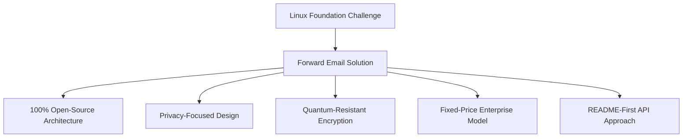
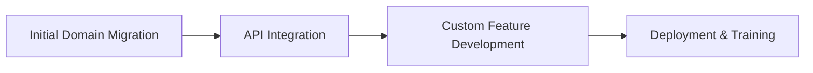

# Case Study: Hoe de Linux Foundation E-mailbeheer Optimaliseert over 250+ Domeinen met Forward Email {#case-study-how-the-linux-foundation-optimizes-email-management-across-250-domains-with-forward-email}


## Inhoudsopgave {#table-of-contents}

* [Introductie](#introduction)
* [De Uitdaging](#the-challenge)
* [De Oplossing](#the-solution)
  * [100% Open-Source Architectuur](#100-open-source-architecture)
  * [Privacygericht Ontwerp](#privacy-focused-design)
  * [Enterprise-Grade Beveiliging](#enterprise-grade-security)
  * [Vast Prijs Enterprise Model](#fixed-price-enterprise-model)
  * [Ontwikkelaarvriendelijke API](#developer-friendly-api)
* [Implementatieproces](#implementation-process)
* [Resultaten en Voordelen](#results-and-benefits)
  * [Efficiëntieverbeteringen](#efficiency-improvements)
  * [Kostenbeheer](#cost-management)
  * [Verbeterde Beveiliging](#enhanced-security)
  * [Verbeterde Gebruikerservaring](#improved-user-experience)
* [Conclusie](#conclusion)
* [Referenties](#references)


## Introductie {#introduction}

De [Linux Foundation](https://en.wikipedia.org/wiki/Linux_Foundation) beheert meer dan 900 open-source projecten over 250+ domeinen, waaronder [linux.com](https://www.linux.com/) en [jQuery.com](https://jquery.com/). Deze case study onderzoekt hoe zij samenwerkten met [Forward Email](https://forwardemail.net) om e-mailbeheer te stroomlijnen en tegelijkertijd in lijn te blijven met open-source principes.


## De Uitdaging {#the-challenge}

De Linux Foundation stond voor verschillende uitdagingen op het gebied van e-mailbeheer:

* **Schaal**: E-mail beheren over 250+ domeinen met verschillende eisen
* **Administratieve Last**: DNS-records configureren, doorstuurregels onderhouden en reageren op supportverzoeken
* **Beveiliging**: Bescherming tegen e-mailgebaseerde bedreigingen terwijl privacy behouden blijft
* **Kosten**: Traditionele oplossingen per gebruiker waren onbetaalbaar op hun schaal
* **Open-Source Afstemming**: Behoefte aan oplossingen die aansluiten bij hun inzet voor open-source waarden

Vergelijkbaar met de uitdagingen van [Canonical/Ubuntu](https://forwardemail.net/blog/docs/canonical-ubuntu-email-enterprise-case-study) met hun meerdere distributiedomeinen, had de Linux Foundation een oplossing nodig die diverse projecten aankon en toch een uniforme beheerbenadering bood.


## De Oplossing {#the-solution}

Forward Email bood een uitgebreide oplossing met belangrijke kenmerken:


```mermaid
graph TD
    A[Linux Foundation Challenge] --> B[Forward Email Solution]
    B --> C[100% Open-Source Architecture]
    B --> D[Privacy-Focused Design]
    B --> E[Quantum-Resistant Encryption]
    B --> F[Fixed-Price Enterprise Model]
    B --> G[README-First API Approach]
```

### 100% Open-Source Architectuur {#100-open-source-architecture}

Als de enige e-mailservice met een volledig open-source platform (zowel frontend als backend), sloot Forward Email perfect aan bij de inzet van de Linux Foundation voor open-source principes. Net als bij onze implementatie met [Canonical/Ubuntu](https://forwardemail.net/blog/docs/canonical-ubuntu-email-enterprise-case-study), stelde deze transparantie hun technische team in staat om beveiligingsimplementaties te verifiëren en zelfs verbeteringen bij te dragen.

### Privacygericht Ontwerp {#privacy-focused-design}

De strikte [privacybeleid](https://forwardemail.net/privacy) van Forward Email boden de beveiliging die de Linux Foundation nodig had. Onze [technische implementatie van e-mailprivacybescherming](https://forwardemail.net/blog/docs/email-privacy-protection-technical-implementation) zorgt ervoor dat alle communicatie van nature veilig blijft, zonder logging of scanning van e-mailinhoud.

Zoals gedetailleerd in onze technische implementatiedocumentatie:

> "We hebben ons hele systeem gebouwd rond het principe dat jouw e-mails van jou zijn en alleen van jou. In tegenstelling tot andere providers die e-mailinhoud scannen voor reclame of AI-training, hanteren wij een strikt no-logging, no-scanning beleid dat de vertrouwelijkheid van alle communicatie bewaart."
### Enterprise-grade beveiliging {#enterprise-grade-security}

Implementatie van [kwantumveilige encryptie](https://forwardemail.net/blog/docs/best-quantum-safe-encrypted-email-service) met ChaCha20-Poly1305 bood geavanceerde beveiliging, waarbij elke mailbox een apart versleuteld bestand is. Deze aanpak zorgt ervoor dat zelfs als kwantumcomputers in staat worden om huidige encryptiestandaarden te breken, de communicatie van de Linux Foundation veilig blijft.

### Vaste-prijs enterprise model {#fixed-price-enterprise-model}

Forward Email's [enterprise prijzen](https://forwardemail.net/pricing) boden een vaste maandelijkse kost ongeacht het aantal domeinen of gebruikers. Deze aanpak heeft aanzienlijke kostenbesparingen opgeleverd voor andere grote organisaties, zoals aangetoond in onze [case study over universiteitsalumni e-mail](https://forwardemail.net/blog/docs/alumni-email-forwarding-university-case-study), waar instellingen tot 99% bespaarden vergeleken met traditionele per-gebruiker e-mailoplossingen.

### Ontwikkelaarsvriendelijke API {#developer-friendly-api}

Volgens een [README-first aanpak](https://tom.preston-werner.com/2010/08/23/readme-driven-development) en geïnspireerd door [Stripe's RESTful API ontwerp](https://amberonrails.com/building-stripes-api), stelde Forward Email's [API](https://forwardemail.net/api) diepe integratie met het Project Control Center van de Linux Foundation mogelijk. Deze integratie was cruciaal voor het automatiseren van e-mailbeheer over hun diverse projectportfolio.


## Implementatieproces {#implementation-process}

De implementatie volgde een gestructureerde aanpak:


```mermaid
flowchart LR
    A[Initial Domain Migration] --> B[API Integration]
    B --> C[Custom Feature Development]
    C --> D[Deployment & Training]
```

1. **Initiële domeinmigratie**: Configureren van DNS-records, instellen van SPF/DKIM/DMARC, migreren van bestaande regels

   ```sh
   # Voorbeeld DNS-configuratie voor een Linux Foundation domein
   domain.org.    600    IN    MX    10 mx1.forwardemail.net.
   domain.org.    600    IN    MX    10 mx2.forwardemail.net.
   domain.org.    600    IN    TXT   "v=spf1 include:spf.forwardemail.net -all"
   ```

2. **API-integratie**: Verbinden met Project Control Center voor selfservicebeheer

3. **Ontwikkeling van aangepaste functies**: Multi-domeinbeheer, rapportage, beveiligingsbeleid

   We werkten nauw samen met de Linux Foundation om functies te ontwikkelen (die ook 100% open source zijn zodat iedereen ervan kan profiteren) specifiek voor hun multi-projectomgeving, vergelijkbaar met hoe we aangepaste oplossingen creëerden voor [universiteitsalumni e-mailsystemen](https://forwardemail.net/blog/docs/alumni-email-forwarding-university-case-study).


## Resultaten en voordelen {#results-and-benefits}

De implementatie leverde aanzienlijke voordelen op:

### Efficiëntieverbeteringen {#efficiency-improvements}

* Verminderde administratieve lasten
* Snellere project onboarding (van dagen naar minuten)
* Gestroomlijnd beheer van alle 250+ domeinen vanuit één interface

### Kostenbeheer {#cost-management}

* Vaste prijs ongeacht groei in domeinen of gebruikers
* Eliminatie van licentiekosten per gebruiker
* Net als in onze [universiteitscase study](https://forwardemail.net/blog/docs/alumni-email-forwarding-university-case-study) behaalde de Linux Foundation aanzienlijke kostenbesparingen vergeleken met traditionele oplossingen

### Verbeterde beveiliging {#enhanced-security}

* Kwantumveilige encryptie over alle domeinen
* Uitgebreide e-mailauthenticatie ter voorkoming van spoofing en phishing
* Beveiligingstesten en -praktijken via [beveiligingsfuncties](https://forwardemail.net/security)
* Privacybescherming via onze [technische implementatie](https://forwardemail.net/blog/docs/email-privacy-protection-technical-implementation)

### Verbeterde gebruikerservaring {#improved-user-experience}

* Selfservice e-mailbeheer voor projectbeheerders
* Consistente ervaring over alle Linux Foundation domeinen
* Betrouwbare e-mailbezorging met robuuste authenticatie


## Conclusie {#conclusion}

De samenwerking van de Linux Foundation met Forward Email toont aan hoe organisaties complexe uitdagingen in e-mailbeheer kunnen aanpakken terwijl ze trouw blijven aan hun kernwaarden. Door te kiezen voor een oplossing die open-source principes, privacy en beveiliging prioriteert, heeft de Linux Foundation e-mailbeheer getransformeerd van een administratieve last naar een strategisch voordeel.
Zoals te zien is in ons werk met zowel [Canonical/Ubuntu](https://forwardemail.net/blog/docs/canonical-ubuntu-email-enterprise-case-study) als [grote universiteiten](https://forwardemail.net/blog/docs/alumni-email-forwarding-university-case-study), kunnen organisaties met complexe domeinportfolio's aanzienlijke verbeteringen in efficiëntie, beveiliging en kostenbeheer bereiken via de enterprise-oplossing van Forward Email.

Voor meer informatie over hoe Forward Email uw organisatie kan helpen bij het beheren van e-mail over meerdere domeinen, bezoek [forwardemail.net](https://forwardemail.net) of verken onze gedetailleerde [documentatie](https://forwardemail.net/email-api) en [handleidingen](https://forwardemail.net/guides).


## Referenties {#references}

* Linux Foundation. (2025). "Browse Projects." Geraadpleegd van <https://www.linuxfoundation.org/projects>
* Wikipedia. (2025). "Linux Foundation." Geraadpleegd van <https://en.wikipedia.org/wiki/Linux_Foundation>
