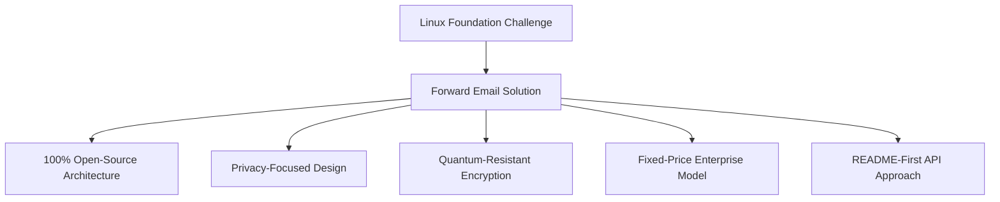
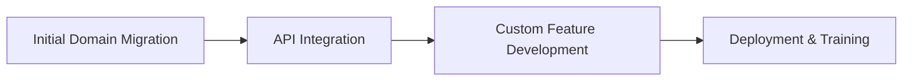

# Casestudie: Hvordan Linux Foundation optimaliserer e-posthåndtering på tvers av over 250 domener med videresendt e-post {#case-study-how-the-linux-foundation-optimizes-email-management-across-250-domains-with-forward-email}


## Innholdsfortegnelse {#table-of-contents}

* [Introduksjon](#introduction)
* [Utfordringen](#the-challenge)
* [Løsningen](#the-solution)
  * [100 % åpen kildekode-arkitektur](#100-open-source-architecture)
  * [Personvernfokusert design](#privacy-focused-design)
  * [Sikkerhet i bedriftsklassen](#enterprise-grade-security)
  * [Fastprismodell for bedrifter](#fixed-price-enterprise-model)
  * [Utviklervennlig API](#developer-friendly-api)
* [Implementeringsprosess](#implementation-process)
* [Resultater og fordeler](#results-and-benefits)
  * [Effektivitetsforbedringer](#efficiency-improvements)
  * [Kostnadsstyring](#cost-management)
  * [Forbedret sikkerhet](#enhanced-security)
  * [Forbedret brukeropplevelse](#improved-user-experience)
* [Konklusjon](#conclusion)
* [Referanser](#references)

## Introduksjon {#introduction}

[Linux Foundation](https://en.wikipedia.org/wiki/Linux_Foundation) administrerer over 900 åpen kildekode-prosjekter på tvers av over 250 domener, inkludert [linux.com](https://www.linux.com/) og [jQuery.com](https://jquery.com/). Denne casestudien utforsker hvordan de samarbeidet med [Videresend e-post](https://forwardemail.net) for å effektivisere e-postadministrasjonen, samtidig som de opprettholdt samsvar med prinsippene for åpen kildekode.

## Utfordringen {#the-challenge}

Linux Foundation sto overfor flere utfordringer med e-posthåndtering:

* **Skalering**: Administrering av e-post på tvers av over 250 domener med ulike krav
* **Administrativ byrde**: Konfigurering av DNS-oppføringer, vedlikehold av videresendingsregler og svar på støtteforespørsler
* **Sikkerhet**: Beskyttelse mot e-postbaserte trusler samtidig som personvernet opprettholdes
* **Kostnad**: Tradisjonelle løsninger per bruker var uoverkommelig dyre i sin skala
* **Tilpasning til åpen kildekode**: Behov for løsninger som samsvarer med deres forpliktelse til åpen kildekode-verdier

I likhet med utfordringene [Kanonisk/Ubuntu](https://forwardemail.net/blog/docs/canonical-ubuntu-email-enterprise-case-study) møtte med sine flere distribusjonsdomener, trengte Linux Foundation en løsning som kunne håndtere ulike prosjekter samtidig som den opprettholdt en enhetlig tilnærming til administrasjon.

## Løsningen {#the-solution}

Videresend e-post ga en omfattende løsning med viktige funksjoner:



### 100 % åpen kildekode-arkitektur {#100-open-source-architecture}

Som den eneste e-posttjenesten med en fullstendig åpen kildekode-plattform (både frontend og backend), var Forward Email perfekt i tråd med Linux Foundations forpliktelse til prinsipper for åpen kildekode. I likhet med implementeringen vår med [Kanonisk/Ubuntu](https://forwardemail.net/blog/docs/canonical-ubuntu-email-enterprise-case-study), tillot denne åpenheten deres tekniske team å verifisere sikkerhetsimplementeringer og til og med bidra med forbedringer.

### Personvernfokusert design {#privacy-focused-design}

Den strenge [personvernregler](https://forwardemail.net/privacy)-funksjonen for videresending av e-post ga sikkerheten som Linux Foundation krevde. [teknisk implementering av personvernbeskyttelse via e-post](https://forwardemail.net/blog/docs/email-privacy-protection-technical-implementation)-funksjonen vår sikrer at all kommunikasjon forblir sikker, uten logging eller skanning av e-postinnhold.

Som beskrevet i vår tekniske implementeringsdokumentasjon:

> «Vi har bygget hele systemet vårt rundt prinsippet om at e-postene dine tilhører deg, og bare deg. I motsetning til andre leverandører som skanner e-postinnhold for reklame eller AI-opplæring, opprettholder vi en streng policy om ingen logging og ingen skanning som bevarer konfidensialiteten til all kommunikasjon.»

### Sikkerhet i bedriftsklassen {#enterprise-grade-security}

Implementering av [kvantebestandig kryptering](https://forwardemail.net/blog/docs/best-quantum-safe-encrypted-email-service) ved bruk av ChaCha20-Poly1305 ga toppmoderne sikkerhet, der hver postboks var en separat kryptert fil. Denne tilnærmingen sikrer at selv om kvantedatamaskiner blir i stand til å bryte gjeldende krypteringsstandarder, vil Linux Foundations kommunikasjon forbli sikker.

### Fastprismodell for bedrifter {#fixed-price-enterprise-model}

[bedriftspriser](https://forwardemail.net/pricing) i Videresendt e-post ga en fast månedlig kostnad uavhengig av domener eller brukere. Denne tilnærmingen har gitt betydelige kostnadsbesparelser for andre store organisasjoner, som vist i vår [e-post casestudie for universitetsalumner](https://forwardemail.net/blog/docs/alumni-email-forwarding-university-case-study), hvor institusjoner sparte opptil 99 % sammenlignet med tradisjonelle e-postløsninger per bruker.

### Utviklervennlig API {#developer-friendly-api}

Etter en [README-først tilnærming](https://tom.preston-werner.com/2010/08/23/readme-driven-development) og inspirert av [Stripes RESTful API-design](https://amberonrails.com/building-stripes-api), muliggjorde Forward Emails [API](https://forwardemail.net/api) dyp integrasjon med Linux Foundations Project Control Center. Denne integrasjonen var avgjørende for å automatisere e-posthåndtering på tvers av deres mangfoldige prosjektportefølje.

## Implementeringsprosess {#implementation-process}

Implementeringen fulgte en strukturert tilnærming:



1. **Innledende domenemigrering**: Konfigurering av DNS-oppføringer, oppsett av SPF/DKIM/DMARC, migrering av eksisterende regler

   ```sh
   # Example DNS configuration for a Linux Foundation domain
   domain.org.    600    IN    MX    10 mx1.forwardemail.net.
   domain.org.    600    IN    MX    10 mx2.forwardemail.net.
   domain.org.    600    IN    TXT   "v=spf1 include:spf.forwardemail.net -all"
   ```

2. **API-integrasjon**: Koble til Prosjektkontrollsenter for selvbetjeningsadministrasjon

3. **Utvikling av tilpassede funksjoner**: Administrasjon av flere domener, rapportering og sikkerhetspolicyer

Vi jobbet tett med Linux Foundation for å utvikle funksjoner (som også er 100 % åpen kildekode, slik at alle kan dra nytte av dem) spesielt for deres flerprosjektmiljø, på samme måte som vi laget tilpassede løsninger for [e-postsystemer for tidligere universitetsalumner](https://forwardemail.net/blog/docs/alumni-email-forwarding-university-case-study).

## Resultater og fordeler {#results-and-benefits}

Implementeringen ga betydelige fordeler:

### Effektivitetsforbedringer {#efficiency-improvements}

* Reduserte administrative kostnader
* Raskere prosjektstart (fra dager til minutter)
* Strømlinjeformet administrasjon av alle 250+ domener fra ett enkelt grensesnitt

### Kostnadsstyring {#cost-management}

* Fast pris uavhengig av vekst i domener eller brukere
* Eliminering av lisensavgifter per bruker
* I likhet med vår [universitets casestudie](https://forwardemail.net/blog/docs/alumni-email-forwarding-university-case-study) oppnådde Linux Foundation betydelige kostnadsbesparelser sammenlignet med tradisjonelle løsninger

### Forbedret sikkerhet {#enhanced-security}

* Kvantebestandig kryptering på tvers av alle domener
* Omfattende e-postautentisering som forhindrer forfalskning og phishing
* Sikkerhetstesting og -praksis via [sikkerhetsfunksjoner](https://forwardemail.net/security)
* Personvernbeskyttelse gjennom vår [teknisk implementering](https://forwardemail.net/blog/docs/email-privacy-protection-technical-implementation)

### Forbedret brukeropplevelse {#improved-user-experience}

* Selvbetjent e-postadministrasjon for prosjektadministratorer
* Konsekvent opplevelse på tvers av alle Linux Foundation-domener
* Pålitelig e-postlevering med robust autentisering

## Konklusjon {#conclusion}

Linux Foundations partnerskap med Forward Email demonstrerer hvordan organisasjoner kan håndtere komplekse utfordringer innen e-posthåndtering samtidig som de opprettholder samsvar med sine kjerneverdier. Ved å velge en løsning som prioriterer prinsipper for åpen kildekode, personvern og sikkerhet, har Linux Foundation forvandlet e-posthåndtering fra en administrativ byrde til en strategisk fordel.

Som vi har sett i arbeidet vårt med både [Kanonisk/Ubuntu](https://forwardemail.net/blog/docs/canonical-ubuntu-email-enterprise-case-study) og [store universiteter](https://forwardemail.net/blog/docs/alumni-email-forwarding-university-case-study), kan organisasjoner med komplekse domeneporteføljer oppnå betydelige forbedringer i effektivitet, sikkerhet og kostnadsstyring gjennom Forward Emails bedriftsløsning.

Hvis du vil ha mer informasjon om hvordan videresending av e-post kan hjelpe organisasjonen din med å administrere e-post på tvers av flere domener, kan du gå til [forwardemail.net](https://forwardemail.net) eller utforske våre detaljerte [dokumentasjon](https://forwardemail.net/email-api) og [guider](https://forwardemail.net/guides).

## Referanser {#references}

* Linux Foundation. (2025). "Bla gjennom prosjekter." Hentet fra <https://www.linuxfoundation.org/projects>
* Wikipedia. (2025). "Linux Foundation." Hentet fra <https://en.wikipedia.org/wiki/Linux_Foundation>