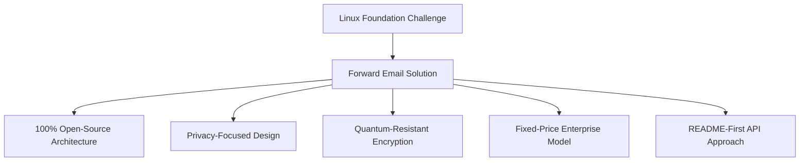
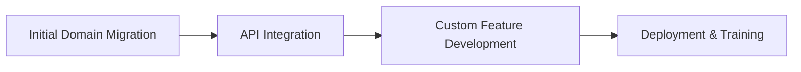

# Case Study: Hvordan Linux Foundation optimaliserer e-posthåndtering på tvers av 250+ domener med Forward Email {#case-study-how-the-linux-foundation-optimizes-email-management-across-250-domains-with-forward-email}


## Innholdsfortegnelse {#table-of-contents}

* [Introduksjon](#introduction)
* [Utfordringen](#the-challenge)
* [Løsningen](#the-solution)
  * [100 % åpen kildekode-arkitektur](#100-open-source-architecture)
  * [Personvernfokusert design](#privacy-focused-design)
  * [Sikkerhet på bedriftsnivå](#enterprise-grade-security)
  * [Fastpris bedriftsmodell](#fixed-price-enterprise-model)
  * [Utviklervennlig API](#developer-friendly-api)
* [Implementeringsprosess](#implementation-process)
* [Resultater og fordeler](#results-and-benefits)
  * [Effektivitetsforbedringer](#efficiency-improvements)
  * [Kostnadsstyring](#cost-management)
  * [Forbedret sikkerhet](#enhanced-security)
  * [Bedre brukeropplevelse](#improved-user-experience)
* [Konklusjon](#conclusion)
* [Referanser](#references)


## Introduksjon {#introduction}

[Linux Foundation](https://en.wikipedia.org/wiki/Linux_Foundation) administrerer over 900 åpen kildekode-prosjekter på tvers av 250+ domener, inkludert [linux.com](https://www.linux.com/) og [jQuery.com](https://jquery.com/). Denne casestudien utforsker hvordan de samarbeidet med [Forward Email](https://forwardemail.net) for å effektivisere e-posthåndtering samtidig som de opprettholdt samsvar med prinsippene for åpen kildekode.


## Utfordringen {#the-challenge}

Linux Foundation sto overfor flere utfordringer med e-posthåndtering:

* **Skala**: Håndtering av e-post på tvers av 250+ domener med ulike krav
* **Administrativ byrde**: Konfigurering av DNS-poster, vedlikehold av videresendingsregler og håndtering av supporthenvendelser
* **Sikkerhet**: Beskyttelse mot e-postbaserte trusler samtidig som personvernet opprettholdes
* **Kostnad**: Tradisjonelle løsninger per bruker var for kostbare i deres skala
* **Samsvar med åpen kildekode**: Behov for løsninger som samsvarer med deres forpliktelse til åpen kildekode-verdier

På samme måte som utfordringene [Canonical/Ubuntu](https://forwardemail.net/blog/docs/canonical-ubuntu-email-enterprise-case-study) møtte med sine mange distribusjonsdomener, trengte Linux Foundation en løsning som kunne håndtere ulike prosjekter samtidig som de opprettholdt en enhetlig administrasjonsmetode.


## Løsningen {#the-solution}

Forward Email leverte en omfattende løsning med nøkkelfunksjoner:


```mermaid
graph TD
    A[Linux Foundation Challenge] --> B[Forward Email Solution]
    B --> C[100% Open-Source Architecture]
    B --> D[Privacy-Focused Design]
    B --> E[Quantum-Resistant Encryption]
    B --> F[Fixed-Price Enterprise Model]
    B --> G[README-First API Approach]
```

### 100 % åpen kildekode-arkitektur {#100-open-source-architecture}

Som den eneste e-posttjenesten med en helt åpen kildekode-plattform (både frontend og backend), samsvarte Forward Email perfekt med Linux Foundations forpliktelse til prinsippene for åpen kildekode. På samme måte som vår implementering med [Canonical/Ubuntu](https://forwardemail.net/blog/docs/canonical-ubuntu-email-enterprise-case-study), ga denne åpenheten deres tekniske team mulighet til å verifisere sikkerhetsimplementeringer og til og med bidra med forbedringer.

### Personvernfokusert design {#privacy-focused-design}

Forward Emails strenge [personvernregler](https://forwardemail.net/privacy) ga den sikkerheten Linux Foundation krevde. Vår [tekniske implementering av e-postpersonvern](https://forwardemail.net/blog/docs/email-privacy-protection-technical-implementation) sikrer at all kommunikasjon forblir sikker av design, uten logging eller skanning av e-postinnhold.

Som detaljert i vår tekniske implementasjonsdokumentasjon:

> "Vi har bygget hele systemet vårt rundt prinsippet om at e-postene dine tilhører deg og bare deg. I motsetning til andre leverandører som skanner e-postinnhold for annonsering eller AI-trening, opprettholder vi en streng policy uten logging og uten skanning som bevarer konfidensialiteten til all kommunikasjon."
### Enterprise-Grade Security {#enterprise-grade-security}

Implementering av [kvantesikker kryptering](https://forwardemail.net/blog/docs/best-quantum-safe-encrypted-email-service) ved bruk av ChaCha20-Poly1305 ga toppmoderne sikkerhet, med hver postkasse som en separat kryptert fil. Denne tilnærmingen sikrer at selv om kvantedatamaskiner blir i stand til å bryte dagens krypteringsstandarder, vil Linux Foundations kommunikasjon forbli sikker.

### Fastpris Enterprise-modell {#fixed-price-enterprise-model}

Forward Emails [enterprise-prising](https://forwardemail.net/pricing) tilbød en fast månedlig kostnad uavhengig av domener eller brukere. Denne tilnærmingen har gitt betydelige kostnadsbesparelser for andre store organisasjoner, som vist i vår [universitets alumni e-post case-studie](https://forwardemail.net/blog/docs/alumni-email-forwarding-university-case-study), hvor institusjoner sparte opptil 99 % sammenlignet med tradisjonelle e-postløsninger per bruker.

### Utviklervennlig API {#developer-friendly-api}

Med en [README-først-tilnærming](https://tom.preston-werner.com/2010/08/23/readme-driven-development) og inspirert av [Stripes RESTful API-design](https://amberonrails.com/building-stripes-api), muliggjorde Forward Emails [API](https://forwardemail.net/api) dyp integrasjon med Linux Foundations Project Control Center. Denne integrasjonen var avgjørende for å automatisere e-posthåndtering på tvers av deres mangfoldige prosjektportefølje.


## Implementeringsprosess {#implementation-process}

Implementeringen fulgte en strukturert tilnærming:


```mermaid
flowchart LR
    A[Initial Domain Migration] --> B[API Integration]
    B --> C[Custom Feature Development]
    C --> D[Deployment & Training]
```

1. **Initial Domain Migration**: Konfigurering av DNS-poster, oppsett av SPF/DKIM/DMARC, migrering av eksisterende regler

   ```sh
   # Example DNS configuration for a Linux Foundation domain
   domain.org.    600    IN    MX    10 mx1.forwardemail.net.
   domain.org.    600    IN    MX    10 mx2.forwardemail.net.
   domain.org.    600    IN    TXT   "v=spf1 include:spf.forwardemail.net -all"
   ```

2. **API Integration**: Tilkobling med Project Control Center for selvbetjent administrasjon

3. **Custom Feature Development**: Multi-domene administrasjon, rapportering, sikkerhetspolicyer

   Vi jobbet tett med Linux Foundation for å utvikle funksjoner (som også er 100 % åpen kildekode slik at alle kan dra nytte av dem) spesielt for deres multi-prosjektmiljø, på samme måte som vi laget tilpassede løsninger for [universitets alumni e-postsystemer](https://forwardemail.net/blog/docs/alumni-email-forwarding-university-case-study).


## Resultater og fordeler {#results-and-benefits}

Implementeringen ga betydelige fordeler:

### Effektivitetsforbedringer {#efficiency-improvements}

* Redusert administrativt arbeid
* Raskere prosjektoppstart (fra dager til minutter)
* Strømlinjeformet administrasjon av alle 250+ domener fra ett enkelt grensesnitt

### Kostnadskontroll {#cost-management}

* Fast pris uavhengig av vekst i domener eller brukere
* Eliminering av lisenskostnader per bruker
* Som i vår [universitets case-studie](https://forwardemail.net/blog/docs/alumni-email-forwarding-university-case-study), oppnådde Linux Foundation betydelige kostnadsbesparelser sammenlignet med tradisjonelle løsninger

### Forbedret sikkerhet {#enhanced-security}

* Kvantesikker kryptering på tvers av alle domener
* Omfattende e-postautentisering som forhindrer spoofing og phishing
* Sikkerhetstesting og praksis via [sikkerhetsfunksjoner](https://forwardemail.net/security)
* Personvern gjennom vår [tekniske implementering](https://forwardemail.net/blog/docs/email-privacy-protection-technical-implementation)

### Forbedret brukeropplevelse {#improved-user-experience}

* Selvbetjent e-postadministrasjon for prosjektadministratorer
* Konsistent opplevelse på tvers av alle Linux Foundation-domener
* Pålitelig e-postlevering med robust autentisering


## Konklusjon {#conclusion}

Linux Foundations partnerskap med Forward Email viser hvordan organisasjoner kan håndtere komplekse utfordringer med e-postadministrasjon samtidig som de opprettholder samsvar med sine kjerneverdier. Ved å velge en løsning som prioriterer åpen kildekode, personvern og sikkerhet, har Linux Foundation forvandlet e-postadministrasjon fra en administrativ byrde til en strategisk fordel.
Som vist i vårt arbeid med både [Canonical/Ubuntu](https://forwardemail.net/blog/docs/canonical-ubuntu-email-enterprise-case-study) og [store universiteter](https://forwardemail.net/blog/docs/alumni-email-forwarding-university-case-study), kan organisasjoner med komplekse domenporteføljer oppnå betydelige forbedringer i effektivitet, sikkerhet og kostnadsstyring gjennom Forward Emails bedriftsløsning.

For mer informasjon om hvordan Forward Email kan hjelpe din organisasjon med å administrere e-post på tvers av flere domener, besøk [forwardemail.net](https://forwardemail.net) eller utforsk vår detaljerte [dokumentasjon](https://forwardemail.net/email-api) og [guider](https://forwardemail.net/guides).


## Referanser {#references}

* Linux Foundation. (2025). "Browse Projects." Hentet fra <https://www.linuxfoundation.org/projects>
* Wikipedia. (2025). "Linux Foundation." Hentet fra <https://en.wikipedia.org/wiki/Linux_Foundation>
