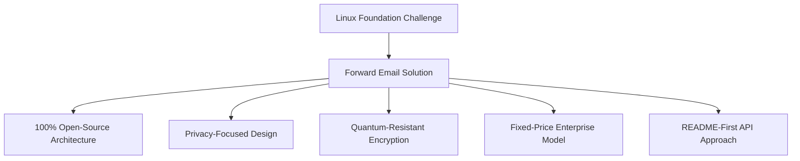
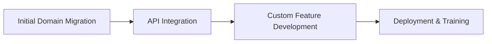

# Studium przypadku: W jaki sposób Fundacja Linux optymalizuje zarządzanie pocztą e-mail w ponad 250 domenach dzięki funkcji przekazywania wiadomości e-mail na {#case-study-how-the-linux-foundation-optimizes-email-management-across-250-domains-with-forward-email}


## Spis treści {#table-of-contents}

* [Wstęp](#introduction)
* [Wyzwanie](#the-challenge)
* [Rozwiązanie](#the-solution)
  * [Architektura w 100% Open Source](#100-open-source-architecture)
  * [Projektowanie zorientowane na prywatność](#privacy-focused-design)
  * [Bezpieczeństwo klasy korporacyjnej](#enterprise-grade-security)
  * [Model przedsiębiorstwa o stałej cenie](#fixed-price-enterprise-model)
  * [Przyjazny dla programistów interfejs API](#developer-friendly-api)
* [Proces wdrażania](#implementation-process)
* [Wyniki i korzyści](#results-and-benefits)
  * [Poprawa wydajności](#efficiency-improvements)
  * [Zarządzanie kosztami](#cost-management)
  * [Zwiększone bezpieczeństwo](#enhanced-security)
  * [Ulepszone wrażenia użytkownika](#improved-user-experience)
* [Wniosek](#conclusion)
* [Odniesienia](#references)

## Wprowadzenie {#introduction}

[Fundacja Linux](https://en.wikipedia.org/wiki/Linux_Foundation) zarządza ponad 900 projektami open source w ponad 250 domenach, w tym [linux.com](https://www.linux.com/) i [jQuery.com](https://jquery.com/). W tym studium przypadku opisano, jak partnerzy nawiązali współpracę z [Przekaż dalej e-mail](https://forwardemail.net), aby usprawnić zarządzanie pocztą e-mail, zachowując jednocześnie zgodność z zasadami open source.

## Wyzwanie {#the-challenge}

Fundacja Linux stanęła przed kilkoma wyzwaniami związanymi z zarządzaniem pocztą elektroniczną:

* **Skala**: Zarządzanie pocztą e-mail w ponad 250 domenach o różnych wymaganiach
* **Obciążenie administracyjne**: Konfigurowanie rekordów DNS, utrzymywanie reguł przekazywania i odpowiadanie na prośby o pomoc techniczną
* **Bezpieczeństwo**: Ochrona przed zagrożeniami opartymi na poczcie e-mail przy jednoczesnym zachowaniu prywatności
* **Koszt**: Tradycyjne rozwiązania per-user były niezwykle drogie w swojej skali
* **Dopasowanie do Open Source**: Potrzeba rozwiązań odpowiadających ich zaangażowaniu w wartości Open Source

Podobnie jak w przypadku wyzwań, z którymi musiała zmierzyć się organizacja [Kanoniczny/Ubuntu](https://forwardemail.net/blog/docs/canonical-ubuntu-email-enterprise-case-study), mająca wiele domen dystrybucyjnych, Fundacja Linux potrzebowała rozwiązania, które mogłoby obsługiwać różnorodne projekty, zachowując jednocześnie ujednolicone podejście do zarządzania.

## Rozwiązanie {#the-solution}

Forward Email dostarczył kompleksowe rozwiązanie z kluczowymi funkcjami:



### Architektura w 100% open-source {#100-open-source-architecture}

Jako jedyna usługa poczty elektronicznej z całkowicie otwartą platformą (zarówno front-end, jak i back-end), Forward Email idealnie wpisywał się w zaangażowanie Fundacji Linux w zasady open source. Podobnie jak w przypadku naszej implementacji z [Kanoniczny/Ubuntu](https://forwardemail.net/blog/docs/canonical-ubuntu-email-enterprise-case-study), ta transparentność pozwoliła zespołowi technicznemu na weryfikację wdrożeń zabezpieczeń, a nawet wprowadzenie ulepszeń.

### Projekt skoncentrowany na prywatności {#privacy-focused-design}

Rygorystyczne zabezpieczenia [polityka prywatności](https://forwardemail.net/privacy) w Forward Email zapewniły bezpieczeństwo wymagane przez Fundację Linux. Nasze zabezpieczenia [ochrona prywatności poczty elektronicznej implementacja techniczna](https://forwardemail.net/blog/docs/email-privacy-protection-technical-implementation) gwarantują, że cała komunikacja pozostaje bezpieczna, bez rejestrowania ani skanowania treści wiadomości e-mail.

Jak szczegółowo opisano w naszej dokumentacji technicznej dotyczącej wdrażania:

> „Zbudowaliśmy cały nasz system wokół zasady, że Twoje e-maile należą do Ciebie i tylko do Ciebie. W przeciwieństwie do innych dostawców, którzy skanują zawartość e-maili w celu reklamy lub szkolenia AI, stosujemy ścisłą politykę braku rejestrowania i skanowania, która zachowuje poufność wszystkich komunikatów”.

### Bezpieczeństwo klasy korporacyjnej {#enterprise-grade-security}

Implementacja [szyfrowanie odporne na kwantowanie](https://forwardemail.net/blog/docs/best-quantum-safe-encrypted-email-service) z wykorzystaniem ChaCha20-Poly1305 zapewniła najnowocześniejsze zabezpieczenia, ponieważ każda skrzynka pocztowa stanowiła osobny zaszyfrowany plik. Takie podejście gwarantuje, że nawet jeśli komputery kwantowe będą w stanie złamać obecne standardy szyfrowania, komunikacja Fundacji Linux pozostanie bezpieczna.

### Model przedsiębiorstwa o stałej cenie {#fixed-price-enterprise-model}

Usługa [cennik dla przedsiębiorstw](https://forwardemail.net/pricing) w usłudze Forward Email zapewniała stały miesięczny koszt, niezależnie od domeny czy użytkownika. Takie podejście przyniosło znaczne oszczędności innym dużym organizacjom, co zostało udowodnione w naszym przykładzie [studium przypadku e-mail absolwentów uniwersytetu](https://forwardemail.net/blog/docs/alumni-email-forwarding-university-case-study), gdzie instytucje zaoszczędziły do 99% w porównaniu z tradycyjnymi rozwiązaniami poczty e-mail dla poszczególnych użytkowników.

### Przyjazny dla programistów interfejs API {#developer-friendly-api}

Postępując zgodnie z [Podejście README-first](https://tom.preston-werner.com/2010/08/23/readme-driven-development) i zainspirowany [Projekt interfejsu API RESTful firmy Stripe](https://amberonrails.com/building-stripes-api), [API](https://forwardemail.net/api) firmy Forward Email umożliwił głęboką integrację z Centrum Kontroli Projektu Fundacji Linux. Ta integracja była kluczowa dla automatyzacji zarządzania pocztą elektroniczną w ramach zróżnicowanego portfolio projektów.

## Proces wdrażania {#implementation-process}

Wdrożenie odbyło się zgodnie ze zorganizowanym podejściem:



1. **Pierwsza migracja domeny**: Konfigurowanie rekordów DNS, ustawianie SPF/DKIM/DMARC, migrowanie istniejących reguł

   ```sh
   # Example DNS configuration for a Linux Foundation domain
   domain.org.    600    IN    MX    10 mx1.forwardemail.net.
   domain.org.    600    IN    MX    10 mx2.forwardemail.net.
   domain.org.    600    IN    TXT   "v=spf1 include:spf.forwardemail.net -all"
   ```

2. **Integracja API**: połączenie z Project Control Center w celu zarządzania samoobsługowego

3. **Rozwój funkcji niestandardowych**: Zarządzanie wieloma domenami, raportowanie, zasady bezpieczeństwa

Współpracowaliśmy ściśle z Linux Foundation, aby opracować funkcje (które są również w 100% oparte na otwartym kodzie źródłowym, dzięki czemu może z nich korzystać każdy) przeznaczone specjalnie dla ich środowiska wieloprojektowego, w podobny sposób, w jaki stworzyliśmy rozwiązania niestandardowe dla [systemy poczty elektronicznej dla absolwentów uniwersytetu](https://forwardemail.net/blog/docs/alumni-email-forwarding-university-case-study).

## Wyniki i korzyści {#results-and-benefits}

Wdrożenie przyniosło znaczące korzyści:

### Poprawa wydajności {#efficiency-improvements}

* Zmniejszone nakłady administracyjne
* Szybsze wdrażanie projektu (z dni do minut)
* Usprawnione zarządzanie wszystkimi 250+ domenami z jednego interfejsu

### Zarządzanie kosztami {#cost-management}

* Stałe ceny niezależnie od wzrostu liczby domen lub użytkowników
* Eliminacja opłat licencyjnych za użytkownika
* Podobnie jak w przypadku naszego [studium przypadku uniwersyteckiego](https://forwardemail.net/blog/docs/alumni-email-forwarding-university-case-study), Linux Foundation osiągnęła znaczne oszczędności kosztów w porównaniu z tradycyjnymi rozwiązaniami

### Zwiększone bezpieczeństwo {#enhanced-security}

* Szyfrowanie odporne na ataki kwantowe we wszystkich domenach
* Kompleksowe uwierzytelnianie wiadomości e-mail zapobiegające podszywaniu się i phishingowi
* Testy i praktyki bezpieczeństwa za pośrednictwem [funkcje bezpieczeństwa](https://forwardemail.net/security)
* Ochrona prywatności za pośrednictwem naszego [realizacja techniczna](https://forwardemail.net/blog/docs/email-privacy-protection-technical-implementation)

### Ulepszone wrażenia użytkownika {#improved-user-experience}

* Samoobsługowe zarządzanie pocztą e-mail dla administratorów projektów
* Spójne doświadczenie we wszystkich domenach Linux Foundation
* Niezawodne dostarczanie poczty e-mail z solidnym uwierzytelnianiem

## Wnioski {#conclusion}

Partnerstwo Linux Foundation z Forward Email pokazuje, jak organizacje mogą rozwiązywać złożone problemy związane z zarządzaniem pocztą e-mail, zachowując jednocześnie zgodność ze swoimi podstawowymi wartościami. Wybierając rozwiązanie, które stawia na pierwszym miejscu zasady open source, prywatność i bezpieczeństwo, Linux Foundation przekształciła zarządzanie pocztą e-mail z obciążenia administracyjnego w strategiczną przewagę.

Jak widzieliśmy w naszej pracy z rozwiązaniami [Kanoniczny/Ubuntu](https://forwardemail.net/blog/docs/canonical-ubuntu-email-enterprise-case-study) i [główne uniwersytety](https://forwardemail.net/blog/docs/alumni-email-forwarding-university-case-study), organizacje o złożonych portfelach domen mogą osiągnąć znaczącą poprawę wydajności, bezpieczeństwa i zarządzania kosztami dzięki rozwiązaniu korporacyjnemu Forward Email.

Aby uzyskać więcej informacji na temat tego, w jaki sposób Forward Email może pomóc Twojej organizacji zarządzać wiadomościami e-mail w wielu domenach, odwiedź stronę [forwardemail.net](https://forwardemail.net) lub zapoznaj się ze szczegółowymi informacjami [dokumentacja](https://forwardemail.net/email-api) i [przewodniki](https://forwardemail.net/guides).

## Odniesienia {#references}

* Linux Foundation. (2025). „Przeglądaj projekty”. Źródło: <https://www.linuxfoundation.org/projects>
* Wikipedia. (2025). „Linux Foundation”. Źródło: <https://en.wikipedia.org/wiki/Linux_Foundation>