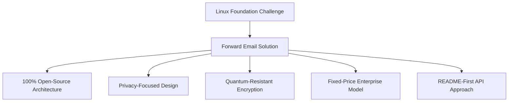
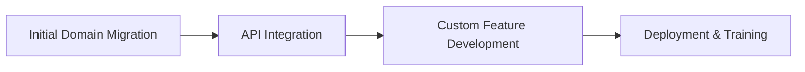

# Studium przypadku: Jak Linux Foundation optymalizuje zarządzanie pocztą e-mail na ponad 250 domenach za pomocą Forward Email {#case-study-how-the-linux-foundation-optimizes-email-management-across-250-domains-with-forward-email}


## Spis treści {#table-of-contents}

* [Wprowadzenie](#introduction)
* [Wyzwanie](#the-challenge)
* [Rozwiązanie](#the-solution)
  * [100% otwartoźródłowa architektura](#100-open-source-architecture)
  * [Projekt zorientowany na prywatność](#privacy-focused-design)
  * [Bezpieczeństwo klasy enterprise](#enterprise-grade-security)
  * [Model enterprise o stałej cenie](#fixed-price-enterprise-model)
  * [Przyjazne dla deweloperów API](#developer-friendly-api)
* [Proces wdrożenia](#implementation-process)
* [Wyniki i korzyści](#results-and-benefits)
  * [Poprawa efektywności](#efficiency-improvements)
  * [Zarządzanie kosztami](#cost-management)
  * [Zwiększone bezpieczeństwo](#enhanced-security)
  * [Ulepszone doświadczenie użytkownika](#improved-user-experience)
* [Podsumowanie](#conclusion)
* [Bibliografia](#references)


## Wprowadzenie {#introduction}

[Linux Foundation](https://en.wikipedia.org/wiki/Linux_Foundation) zarządza ponad 900 projektami open-source na ponad 250 domenach, w tym [linux.com](https://www.linux.com/) oraz [jQuery.com](https://jquery.com/). To studium przypadku pokazuje, jak nawiązali współpracę z [Forward Email](https://forwardemail.net), aby usprawnić zarządzanie pocztą e-mail, jednocześnie zachowując zgodność z zasadami open-source.


## Wyzwanie {#the-challenge}

Linux Foundation stanęła przed kilkoma wyzwaniami związanymi z zarządzaniem pocztą e-mail:

* **Skala**: Zarządzanie pocztą na ponad 250 domenach o różnych wymaganiach
* **Obciążenie administracyjne**: Konfiguracja rekordów DNS, utrzymanie reguł przekierowań oraz obsługa zgłoszeń wsparcia
* **Bezpieczeństwo**: Ochrona przed zagrożeniami związanymi z pocztą e-mail przy jednoczesnym zachowaniu prywatności
* **Koszty**: Tradycyjne rozwiązania rozliczane per użytkownik były zbyt kosztowne przy takiej skali
* **Zgodność z open-source**: Potrzeba rozwiązań odpowiadających ich zobowiązaniu do wartości open-source

Podobnie jak wyzwania, z którymi mierzy się [Canonical/Ubuntu](https://forwardemail.net/blog/docs/canonical-ubuntu-email-enterprise-case-study) zarządzając wieloma domenami dystrybucji, Linux Foundation potrzebowała rozwiązania, które poradzi sobie z różnorodnymi projektami, zachowując jednocześnie jednolite podejście do zarządzania.


## Rozwiązanie {#the-solution}

Forward Email dostarczył kompleksowe rozwiązanie z kluczowymi funkcjami:


```mermaid
graph TD
    A[Linux Foundation Challenge] --> B[Forward Email Solution]
    B --> C[100% Open-Source Architecture]
    B --> D[Privacy-Focused Design]
    B --> E[Quantum-Resistant Encryption]
    B --> F[Fixed-Price Enterprise Model]
    B --> G[README-First API Approach]
```

### 100% otwartoźródłowa architektura {#100-open-source-architecture}

Jako jedyna usługa e-mail z całkowicie otwartoźródłową platformą (zarówno frontend, jak i backend), Forward Email idealnie wpisuje się w zobowiązanie Linux Foundation do zasad open-source. Podobnie jak w naszym wdrożeniu z [Canonical/Ubuntu](https://forwardemail.net/blog/docs/canonical-ubuntu-email-enterprise-case-study), ta przejrzystość pozwoliła ich zespołowi technicznemu zweryfikować implementacje zabezpieczeń, a nawet wnieść własne ulepszenia.

### Projekt zorientowany na prywatność {#privacy-focused-design}

Ścisłe [polityki prywatności](https://forwardemail.net/privacy) Forward Email zapewniły bezpieczeństwo wymagane przez Linux Foundation. Nasza [techniczna implementacja ochrony prywatności e-mail](https://forwardemail.net/blog/docs/email-privacy-protection-technical-implementation) gwarantuje, że wszystkie komunikacje pozostają bezpieczne z założenia, bez logowania czy skanowania treści wiadomości.

Jak szczegółowo opisano w naszej dokumentacji technicznej:

> "Zbudowaliśmy cały nasz system wokół zasady, że Twoje e-maile należą do Ciebie i tylko do Ciebie. W przeciwieństwie do innych dostawców, którzy skanują treść wiadomości w celach reklamowych lub do trenowania AI, utrzymujemy ścisłą politykę braku logowania i skanowania, która zachowuje poufność wszystkich komunikacji."
### Bezpieczeństwo klasy korporacyjnej {#enterprise-grade-security}

Wdrożenie [szyfrowania odpornego na komputery kwantowe](https://forwardemail.net/blog/docs/best-quantum-safe-encrypted-email-service) z wykorzystaniem ChaCha20-Poly1305 zapewniło nowoczesny poziom bezpieczeństwa, przy czym każda skrzynka pocztowa była osobnym zaszyfrowanym plikiem. Takie podejście gwarantuje, że nawet jeśli komputery kwantowe staną się zdolne do łamania obecnych standardów szyfrowania, komunikacja Linux Foundation pozostanie bezpieczna.

### Model korporacyjny o stałej cenie {#fixed-price-enterprise-model}

[Model cenowy dla przedsiębiorstw](https://forwardemail.net/pricing) Forward Email oferował stały miesięczny koszt niezależnie od liczby domen czy użytkowników. Takie podejście przyniosło znaczące oszczędności dla innych dużych organizacji, co zostało udokumentowane w naszym [studium przypadku dotyczącego przekierowywania poczty dla absolwentów uczelni](https://forwardemail.net/blog/docs/alumni-email-forwarding-university-case-study), gdzie instytucje zaoszczędziły do 99% w porównaniu z tradycyjnymi rozwiązaniami opartymi na opłatach za użytkownika.

### Przyjazne dla programistów API {#developer-friendly-api}

Stosując [podejście README-first](https://tom.preston-werner.com/2010/08/23/readme-driven-development) i inspirując się [RESTful API Stripe](https://amberonrails.com/building-stripes-api), [API](https://forwardemail.net/api) Forward Email umożliwiło głęboką integrację z Project Control Center Linux Foundation. Ta integracja była kluczowa dla automatyzacji zarządzania pocztą w ich różnorodnym portfolio projektów.


## Proces wdrożenia {#implementation-process}

Wdrożenie przebiegało według ustrukturyzowanego planu:


```mermaid
flowchart LR
    A[Initial Domain Migration] --> B[API Integration]
    B --> C[Custom Feature Development]
    C --> D[Deployment & Training]
```

1. **Początkowa migracja domen**: Konfiguracja rekordów DNS, ustawienie SPF/DKIM/DMARC, migracja istniejących reguł

   ```sh
   # Przykładowa konfiguracja DNS dla domeny Linux Foundation
   domain.org.    600    IN    MX    10 mx1.forwardemail.net.
   domain.org.    600    IN    MX    10 mx2.forwardemail.net.
   domain.org.    600    IN    TXT   "v=spf1 include:spf.forwardemail.net -all"
   ```

2. **Integracja API**: Połączenie z Project Control Center dla samoobsługowego zarządzania

3. **Rozwój funkcji niestandardowych**: Zarządzanie wieloma domenami, raportowanie, polityki bezpieczeństwa

   Ściśle współpracowaliśmy z Linux Foundation, aby opracować funkcje (które są również w 100% otwartoźródłowe, aby każdy mógł z nich korzystać) specjalnie dla ich środowiska wieloprojektowego, podobnie jak tworzyliśmy niestandardowe rozwiązania dla [systemów poczty dla absolwentów uczelni](https://forwardemail.net/blog/docs/alumni-email-forwarding-university-case-study).


## Wyniki i korzyści {#results-and-benefits}

Wdrożenie przyniosło znaczące korzyści:

### Poprawa efektywności {#efficiency-improvements}

* Zmniejszenie obciążenia administracyjnego
* Szybsze wdrażanie projektów (z dni do minut)
* Uproszczone zarządzanie wszystkimi 250+ domenami z jednego interfejsu

### Zarządzanie kosztami {#cost-management}

* Stała cena niezależnie od wzrostu liczby domen czy użytkowników
* Eliminacja opłat licencyjnych za użytkownika
* Podobnie jak w naszym [studium przypadku uczelni](https://forwardemail.net/blog/docs/alumni-email-forwarding-university-case-study), Linux Foundation osiągnęła znaczne oszczędności w porównaniu z tradycyjnymi rozwiązaniami

### Zwiększone bezpieczeństwo {#enhanced-security}

* Szyfrowanie odporne na komputery kwantowe we wszystkich domenach
* Kompleksowa autoryzacja poczty zapobiegająca podszywaniu się i phishingowi
* Testy bezpieczeństwa i praktyki poprzez [funkcje bezpieczeństwa](https://forwardemail.net/security)
* Ochrona prywatności dzięki naszej [technicznej implementacji](https://forwardemail.net/blog/docs/email-privacy-protection-technical-implementation)

### Ulepszone doświadczenie użytkownika {#improved-user-experience}

* Samoobsługowe zarządzanie pocztą dla administratorów projektów
* Spójne doświadczenie we wszystkich domenach Linux Foundation
* Niezawodne dostarczanie poczty z solidną autoryzacją


## Podsumowanie {#conclusion}

Partnerstwo Linux Foundation z Forward Email pokazuje, jak organizacje mogą sprostać złożonym wyzwaniom zarządzania pocztą, jednocześnie pozostając wierne swoim podstawowym wartościom. Wybierając rozwiązanie, które stawia na zasady open-source, prywatność i bezpieczeństwo, Linux Foundation przekształciła zarządzanie pocztą z obciążenia administracyjnego w strategiczną przewagę.
Jak pokazano w naszej współpracy zarówno z [Canonical/Ubuntu](https://forwardemail.net/blog/docs/canonical-ubuntu-email-enterprise-case-study), jak i z [głównymi uniwersytetami](https://forwardemail.net/blog/docs/alumni-email-forwarding-university-case-study), organizacje posiadające złożone portfele domen mogą osiągnąć znaczące usprawnienia w efektywności, bezpieczeństwie i zarządzaniu kosztami dzięki rozwiązaniu korporacyjnemu Forward Email.

Aby uzyskać więcej informacji o tym, jak Forward Email może pomóc Twojej organizacji w zarządzaniu pocztą e-mail na wielu domenach, odwiedź [forwardemail.net](https://forwardemail.net) lub zapoznaj się z naszą szczegółową [dokumentacją](https://forwardemail.net/email-api) oraz [poradnikami](https://forwardemail.net/guides).


## References {#references}

* Linux Foundation. (2025). "Browse Projects." Retrieved from <https://www.linuxfoundation.org/projects>
* Wikipedia. (2025). "Linux Foundation." Retrieved from <https://en.wikipedia.org/wiki/Linux_Foundation>
