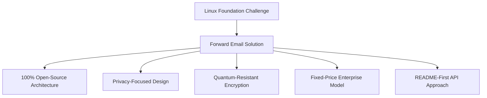
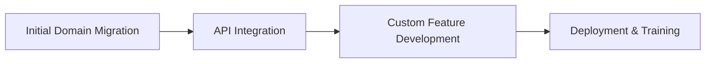

# Estudo de caso: como a Linux Foundation otimiza o gerenciamento de e-mail em mais de 250 domínios com o encaminhamento de e-mail {#case-study-how-the-linux-foundation-optimizes-email-management-across-250-domains-with-forward-email}


## Índice {#table-of-contents}

* [Introdução](#introduction)
* [O Desafio](#the-challenge)
* [A Solução](#the-solution)
  * [Arquitetura 100% Open Source](#100-open-source-architecture)
  * [Design com foco na privacidade](#privacy-focused-design)
  * [Segurança de nível empresarial](#enterprise-grade-security)
  * [Modelo empresarial de preço fixo](#fixed-price-enterprise-model)
  * [API amigável ao desenvolvedor](#developer-friendly-api)
* [Processo de Implementação](#implementation-process)
* [Resultados e Benefícios](#results-and-benefits)
  * [Melhorias de eficiência](#efficiency-improvements)
  * [Gestão de Custos](#cost-management)
  * [Segurança aprimorada](#enhanced-security)
  * [Experiência do usuário aprimorada](#improved-user-experience)
* [Conclusão](#conclusion)
* [Referências](#references)

## Introdução {#introduction}

O [Fundação Linux](https://en.wikipedia.org/wiki/Linux_Foundation) gerencia mais de 900 projetos de código aberto em mais de 250 domínios, incluindo [linux.com](https://www.linux.com/) e [jQuery.com](https://jquery.com/). Este estudo de caso explora como eles fizeram parceria com o [Encaminhar e-mail](https://forwardemail.net) para otimizar o gerenciamento de e-mails, mantendo o alinhamento com os princípios de código aberto.

## O Desafio {#the-challenge}

A Linux Foundation enfrentou vários desafios de gerenciamento de e-mail:

* **Escala**: Gerenciamento de e-mails em mais de 250 domínios com diferentes requisitos
* **Carga administrativa**: Configuração de registros DNS, manutenção de regras de encaminhamento e resposta a solicitações de suporte
* **Segurança**: Proteção contra ameaças por e-mail, mantendo a privacidade
* **Custo**: Soluções tradicionais por usuário eram proibitivamente caras em sua escala
* **Alinhamento com o código aberto**: Necessidade de soluções que correspondam ao seu compromisso com os valores do código aberto

Semelhante aos desafios enfrentados pelo [Canônico/Ubuntu](https://forwardemail.net/blog/docs/canonical-ubuntu-email-enterprise-case-study) com seus múltiplos domínios de distribuição, a Linux Foundation precisava de uma solução que pudesse lidar com projetos diversos, mantendo uma abordagem de gerenciamento unificada.

## A Solução {#the-solution}

O Forward Email forneceu uma solução abrangente com recursos principais:



### Arquitetura 100% de código aberto {#100-open-source-architecture}

Sendo o único serviço de e-mail com uma plataforma totalmente de código aberto (frontend e backend), o Forward Email alinhou-se perfeitamente ao compromisso da Linux Foundation com os princípios de código aberto. Semelhante à nossa implementação com [Canônico/Ubuntu](https://forwardemail.net/blog/docs/canonical-ubuntu-email-enterprise-case-study), essa transparência permitiu que a equipe técnica verificasse as implementações de segurança e até contribuísse com melhorias.

### Design com foco na privacidade {#privacy-focused-design}

O rigoroso [políticas de privacidade](https://forwardemail.net/privacy) do Forward Email forneceu a segurança necessária para a Linux Foundation. Nosso [implementação técnica de proteção de privacidade de e-mail](https://forwardemail.net/blog/docs/email-privacy-protection-technical-implementation) garante que todas as comunicações permaneçam seguras por padrão, sem registro ou verificação do conteúdo do e-mail.

Conforme detalhado em nossa documentação de implementação técnica:

> "Construímos todo o nosso sistema com base no princípio de que seus e-mails pertencem a você e somente a você. Ao contrário de outros provedores que rastreiam o conteúdo dos e-mails em busca de publicidade ou treinamento de IA, mantemos uma política rigorosa de não registro e não rastreamento, que preserva a confidencialidade de todas as comunicações."

### Segurança de nível empresarial {#enterprise-grade-security}

A implementação de [criptografia resistente a quantum](https://forwardemail.net/blog/docs/best-quantum-safe-encrypted-email-service) usando ChaCha20-Poly1305 proporcionou segurança de última geração, com cada caixa de correio sendo um arquivo criptografado separado. Essa abordagem garante que, mesmo que os computadores quânticos se tornem capazes de quebrar os padrões de criptografia atuais, as comunicações da Linux Foundation permanecerão seguras.

### Modelo empresarial de preço fixo {#fixed-price-enterprise-model}

O [preços empresariais](https://forwardemail.net/pricing) da Forward Email oferecia um custo mensal fixo, independentemente de domínios ou usuários. Essa abordagem proporcionou economias significativas para outras grandes organizações, como demonstrado em nosso [estudo de caso de e-mail de ex-alunos universitários](https://forwardemail.net/blog/docs/alumni-email-forwarding-university-case-study), onde as instituições economizaram até 99% em comparação com as soluções tradicionais de e-mail por usuário.

### API amigável ao desenvolvedor {#developer-friendly-api}

Seguindo o [Abordagem README-first](https://tom.preston-werner.com/2010/08/23/readme-driven-development) e inspirado no [Design da API RESTful do Stripe](https://amberonrails.com/building-stripes-api), o [API](https://forwardemail.net/api) da Forward Email permitiu uma integração profunda com o Centro de Controle de Projetos da Linux Foundation. Essa integração foi crucial para automatizar o gerenciamento de e-mails em seu diversificado portfólio de projetos.

## Processo de implementação {#implementation-process}

A implementação seguiu uma abordagem estruturada:



1. **Migração de domínio inicial**: configuração de registros DNS, configuração de SPF/DKIM/DMARC, migração de regras existentes

   ```sh
   # Example DNS configuration for a Linux Foundation domain
   domain.org.    600    IN    MX    10 mx1.forwardemail.net.
   domain.org.    600    IN    MX    10 mx2.forwardemail.net.
   domain.org.    600    IN    TXT   "v=spf1 include:spf.forwardemail.net -all"
   ```

2. **Integração de API**: Conexão com o Project Control Center para gerenciamento de autoatendimento

3. **Desenvolvimento de recursos personalizados**: gerenciamento de vários domínios, relatórios, políticas de segurança

Trabalhamos em estreita colaboração com a Linux Foundation para desenvolver recursos (que também são 100% de código aberto para que todos possam se beneficiar deles) especificamente para seu ambiente de múltiplos projetos, semelhante a como criamos soluções personalizadas para [sistemas de e-mail de ex-alunos universitários](https://forwardemail.net/blog/docs/alumni-email-forwarding-university-case-study).

## Resultados e Benefícios {#results-and-benefits}

A implementação proporcionou benefícios significativos:

### Melhorias de eficiência {#efficiency-improvements}

* Redução da sobrecarga administrativa
* Integração mais rápida de projetos (de dias para minutos)
* Gerenciamento simplificado de mais de 250 domínios a partir de uma única interface

### Gestão de Custos {#cost-management}

* Preço fixo, independentemente do crescimento de domínios ou usuários
* Eliminação de taxas de licenciamento por usuário
* Semelhante ao nosso [estudo de caso universitário](https://forwardemail.net/blog/docs/alumni-email-forwarding-university-case-study), a Linux Foundation obteve economias de custo substanciais em comparação com soluções tradicionais

### Segurança Aprimorada {#enhanced-security}

* Criptografia quântica resistente em todos os domínios
* Autenticação abrangente de e-mails, prevenindo spoofing e phishing
* Testes e práticas de segurança via [recursos de segurança](https://forwardemail.net/security)
* Proteção de privacidade por meio do nosso [implementação técnica](https://forwardemail.net/blog/docs/email-privacy-protection-technical-implementation)

### Experiência do usuário aprimorada {#improved-user-experience}

* Gerenciamento de e-mail self-service para administradores de projeto
* Experiência consistente em todos os domínios da Linux Foundation
* Entrega confiável de e-mails com autenticação robusta

## Conclusão {#conclusion}

A parceria da Linux Foundation com a Forward Email demonstra como as organizações podem enfrentar desafios complexos de gerenciamento de e-mail, mantendo o alinhamento com seus valores fundamentais. Ao selecionar uma solução que prioriza os princípios de código aberto, privacidade e segurança, a Linux Foundation transformou o gerenciamento de e-mail de um fardo administrativo em uma vantagem estratégica.

Como visto em nosso trabalho com [Canônico/Ubuntu](https://forwardemail.net/blog/docs/canonical-ubuntu-email-enterprise-case-study) e [grandes universidades](https://forwardemail.net/blog/docs/alumni-email-forwarding-university-case-study), organizações com portfólios de domínio complexos podem obter melhorias significativas em eficiência, segurança e gerenciamento de custos por meio da solução empresarial da Forward Email.

Para obter mais informações sobre como o Forward Email pode ajudar sua organização a gerenciar e-mails em vários domínios, visite [forwardemail.net](https://forwardemail.net) ou explore nossos [documentação](https://forwardemail.net/email-api) e [guias](https://forwardemail.net/guides) detalhados.

## Referências {#references}

* Linux Foundation. (2025). "Navegar pelos Projetos." Obtido em <https://www.linuxfoundation.org/projects>
* Wikipédia. (2025). "Linux Foundation." Obtido em <https://en.wikipedia.org/wiki/Linux_Foundation>