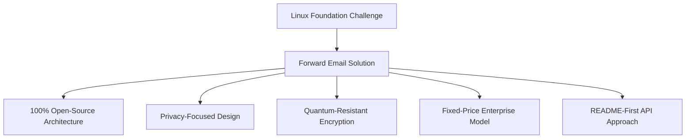
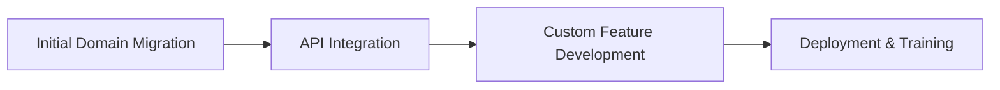

# Estudo de Caso: Como a Linux Foundation Otimiza a Gestão de Email em Mais de 250 Domínios com Forward Email {#case-study-how-the-linux-foundation-optimizes-email-management-across-250-domains-with-forward-email}


## Índice {#table-of-contents}

* [Introdução](#introduction)
* [O Desafio](#the-challenge)
* [A Solução](#the-solution)
  * [Arquitetura 100% Open-Source](#100-open-source-architecture)
  * [Design Focado em Privacidade](#privacy-focused-design)
  * [Segurança de Nível Empresarial](#enterprise-grade-security)
  * [Modelo Empresarial com Preço Fixo](#fixed-price-enterprise-model)
  * [API Amigável para Desenvolvedores](#developer-friendly-api)
* [Processo de Implementação](#implementation-process)
* [Resultados e Benefícios](#results-and-benefits)
  * [Melhorias de Eficiência](#efficiency-improvements)
  * [Gestão de Custos](#cost-management)
  * [Segurança Aprimorada](#enhanced-security)
  * [Experiência do Usuário Melhorada](#improved-user-experience)
* [Conclusão](#conclusion)
* [Referências](#references)


## Introdução {#introduction}

A [Linux Foundation](https://en.wikipedia.org/wiki/Linux_Foundation) gerencia mais de 900 projetos open-source em mais de 250 domínios, incluindo [linux.com](https://www.linux.com/) e [jQuery.com](https://jquery.com/). Este estudo de caso explora como eles fizeram parceria com o [Forward Email](https://forwardemail.net) para simplificar a gestão de email mantendo o alinhamento com os princípios open-source.


## O Desafio {#the-challenge}

A Linux Foundation enfrentou vários desafios na gestão de email:

* **Escala**: Gerenciar email em mais de 250 domínios com diferentes requisitos
* **Carga Administrativa**: Configurar registros DNS, manter regras de encaminhamento e responder a solicitações de suporte
* **Segurança**: Proteger contra ameaças baseadas em email mantendo a privacidade
* **Custo**: Soluções tradicionais por usuário eram proibitivamente caras na escala deles
* **Alinhamento Open-Source**: Necessidade de soluções que correspondam ao compromisso com valores open-source

Semelhante aos desafios enfrentados pela [Canonical/Ubuntu](https://forwardemail.net/blog/docs/canonical-ubuntu-email-enterprise-case-study) com seus múltiplos domínios de distribuição, a Linux Foundation precisava de uma solução que pudesse lidar com projetos diversos mantendo uma abordagem unificada de gestão.


## A Solução {#the-solution}

O Forward Email forneceu uma solução abrangente com recursos-chave:


```mermaid
graph TD
    A[Linux Foundation Challenge] --> B[Forward Email Solution]
    B --> C[100% Open-Source Architecture]
    B --> D[Privacy-Focused Design]
    B --> E[Quantum-Resistant Encryption]
    B --> F[Fixed-Price Enterprise Model]
    B --> G[README-First API Approach]
```

### Arquitetura 100% Open-Source {#100-open-source-architecture}

Como o único serviço de email com uma plataforma completamente open-source (tanto frontend quanto backend), o Forward Email alinhou-se perfeitamente com o compromisso da Linux Foundation com os princípios open-source. Semelhante à nossa implementação com a [Canonical/Ubuntu](https://forwardemail.net/blog/docs/canonical-ubuntu-email-enterprise-case-study), essa transparência permitiu que a equipe técnica deles verificasse as implementações de segurança e até contribuísse com melhorias.

### Design Focado em Privacidade {#privacy-focused-design}

As rigorosas [políticas de privacidade](https://forwardemail.net/privacy) do Forward Email forneceram a segurança que a Linux Foundation exigia. Nossa [implementação técnica de proteção de privacidade de email](https://forwardemail.net/blog/docs/email-privacy-protection-technical-implementation) garante que todas as comunicações permaneçam seguras por design, sem registro ou escaneamento do conteúdo dos emails.

Conforme detalhado em nossa documentação de implementação técnica:

> "Construímos todo o nosso sistema com base no princípio de que seus emails pertencem a você e somente a você. Diferente de outros provedores que escaneiam o conteúdo dos emails para publicidade ou treinamento de IA, mantemos uma política rigorosa de não registro e não escaneamento que preserva a confidencialidade de todas as comunicações."
### Segurança de Nível Empresarial {#enterprise-grade-security}

A implementação de [criptografia resistente a computadores quânticos](https://forwardemail.net/blog/docs/best-quantum-safe-encrypted-email-service) usando ChaCha20-Poly1305 proporcionou segurança de ponta, com cada caixa de correio sendo um arquivo criptografado separado. Essa abordagem garante que, mesmo que computadores quânticos se tornem capazes de quebrar os padrões atuais de criptografia, as comunicações da Linux Foundation permanecerão seguras.

### Modelo Empresarial de Preço Fixo {#fixed-price-enterprise-model}

A [precificação empresarial](https://forwardemail.net/pricing) do Forward Email ofereceu um custo mensal fixo independentemente dos domínios ou usuários. Essa abordagem proporcionou economias significativas para outras grandes organizações, como demonstrado em nosso [estudo de caso sobre email para ex-alunos universitários](https://forwardemail.net/blog/docs/alumni-email-forwarding-university-case-study), onde instituições economizaram até 99% em comparação com soluções tradicionais de email por usuário.

### API Amigável para Desenvolvedores {#developer-friendly-api}

Seguindo uma [abordagem README-first](https://tom.preston-werner.com/2010/08/23/readme-driven-development) e inspirada pelo [design RESTful da API da Stripe](https://amberonrails.com/building-stripes-api), a [API](https://forwardemail.net/api) do Forward Email permitiu uma integração profunda com o Project Control Center da Linux Foundation. Essa integração foi crucial para automatizar o gerenciamento de email em seu portfólio diversificado de projetos.


## Processo de Implementação {#implementation-process}

A implementação seguiu uma abordagem estruturada:


```mermaid
flowchart LR
    A[Initial Domain Migration] --> B[API Integration]
    B --> C[Custom Feature Development]
    C --> D[Deployment & Training]
```

1. **Migração Inicial de Domínio**: Configuração dos registros DNS, configuração de SPF/DKIM/DMARC, migração das regras existentes

   ```sh
   # Exemplo de configuração DNS para um domínio da Linux Foundation
   domain.org.    600    IN    MX    10 mx1.forwardemail.net.
   domain.org.    600    IN    MX    10 mx2.forwardemail.net.
   domain.org.    600    IN    TXT   "v=spf1 include:spf.forwardemail.net -all"
   ```

2. **Integração da API**: Conexão com o Project Control Center para gerenciamento self-service

3. **Desenvolvimento de Funcionalidades Personalizadas**: Gerenciamento multi-domínio, relatórios, políticas de segurança

   Trabalhamos em estreita colaboração com a Linux Foundation para desenvolver funcionalidades (que também são 100% open-source para que todos possam se beneficiar) especificamente para seu ambiente multi-projetos, semelhante a como criamos soluções personalizadas para [sistemas de email para ex-alunos universitários](https://forwardemail.net/blog/docs/alumni-email-forwarding-university-case-study).


## Resultados e Benefícios {#results-and-benefits}

A implementação trouxe benefícios significativos:

### Melhorias na Eficiência {#efficiency-improvements}

* Redução da carga administrativa
* Onboarding de projetos mais rápido (de dias para minutos)
* Gestão simplificada de todos os mais de 250 domínios a partir de uma única interface

### Gestão de Custos {#cost-management}

* Preço fixo independentemente do crescimento em domínios ou usuários
* Eliminação de taxas de licenciamento por usuário
* Semelhante ao nosso [estudo de caso universitário](https://forwardemail.net/blog/docs/alumni-email-forwarding-university-case-study), a Linux Foundation alcançou economias substanciais em comparação com soluções tradicionais

### Segurança Aprimorada {#enhanced-security}

* Criptografia resistente a computadores quânticos em todos os domínios
* Autenticação abrangente de email prevenindo spoofing e phishing
* Testes e práticas de segurança via [recursos de segurança](https://forwardemail.net/security)
* Proteção de privacidade através de nossa [implementação técnica](https://forwardemail.net/blog/docs/email-privacy-protection-technical-implementation)

### Experiência do Usuário Melhorada {#improved-user-experience}

* Gerenciamento self-service de email para administradores de projetos
* Experiência consistente em todos os domínios da Linux Foundation
* Entrega confiável de email com autenticação robusta


## Conclusão {#conclusion}

A parceria da Linux Foundation com o Forward Email demonstra como organizações podem enfrentar desafios complexos de gerenciamento de email mantendo alinhamento com seus valores centrais. Ao escolher uma solução que prioriza princípios open-source, privacidade e segurança, a Linux Foundation transformou o gerenciamento de email de um fardo administrativo em uma vantagem estratégica.
Como visto em nosso trabalho com tanto a [Canonical/Ubuntu](https://forwardemail.net/blog/docs/canonical-ubuntu-email-enterprise-case-study) quanto com [grandes universidades](https://forwardemail.net/blog/docs/alumni-email-forwarding-university-case-study), organizações com portfólios complexos de domínios podem alcançar melhorias significativas em eficiência, segurança e gestão de custos por meio da solução empresarial do Forward Email.

Para mais informações sobre como o Forward Email pode ajudar sua organização a gerenciar e-mails em múltiplos domínios, visite [forwardemail.net](https://forwardemail.net) ou explore nossa [documentação](https://forwardemail.net/email-api) detalhada e nossos [guias](https://forwardemail.net/guides).


## Referências {#references}

* Linux Foundation. (2025). "Browse Projects." Recuperado de <https://www.linuxfoundation.org/projects>
* Wikipedia. (2025). "Linux Foundation." Recuperado de <https://en.wikipedia.org/wiki/Linux_Foundation>
