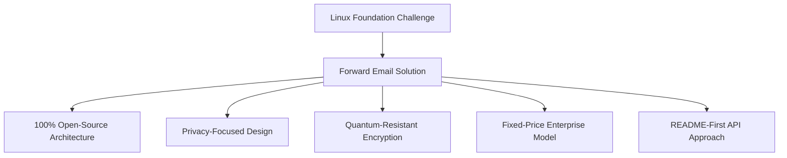
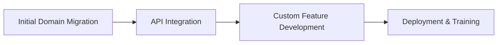

# Пример использования: Как Linux Foundation оптимизирует управление электронной почтой в более чем 250 доменах с помощью пересылки электронной почты {#case-study-how-the-linux-foundation-optimizes-email-management-across-250-domains-with-forward-email}


## Содержание {#table-of-contents}

* [Введение](#introduction)
* [Вызов](#the-challenge)
* [Решение](#the-solution)
  * [100% архитектура с открытым исходным кодом](#100-open-source-architecture)
  * [Дизайн, ориентированный на конфиденциальность](#privacy-focused-design)
  * [Безопасность корпоративного уровня](#enterprise-grade-security)
  * [Модель предприятия с фиксированной ценой](#fixed-price-enterprise-model)
  * [API, удобный для разработчиков](#developer-friendly-api)
* [Процесс внедрения](#implementation-process)
* [Результаты и преимущества](#results-and-benefits)
  * [Повышение эффективности](#efficiency-improvements)
  * [Управление затратами](#cost-management)
  * [Повышенная безопасность](#enhanced-security)
  * [Улучшенный пользовательский опыт](#improved-user-experience)
* [Заключение](#conclusion)
* [Ссылки](#references)

## Введение {#introduction}

[Linux-фонд](https://en.wikipedia.org/wiki/Linux_Foundation) управляет более чем 900 проектами с открытым исходным кодом в более чем 250 доменах, включая [linux.com](https://www.linux.com/) и [jQuery.com](https://jquery.com/). В этом исследовании рассматривается их сотрудничество с [Переслать письмо](https://forwardemail.net) для оптимизации управления электронной почтой с сохранением принципов открытого исходного кода.

## Задача {#the-challenge}

Linux Foundation столкнулась с рядом проблем управления электронной почтой:

* **Масштаб**: Управление электронной почтой в более чем 250 доменах с различными требованиями
* **Административная нагрузка**: Настройка записей DNS, поддержка правил пересылки и реагирование на запросы поддержки
* **Безопасность**: Защита от угроз, связанных с электронной почтой, при сохранении конфиденциальности
* **Стоимость**: Традиционные решения для каждого пользователя были непомерно дорогими в своем масштабе
* **Соответствие принципам открытого исходного кода**: Потребность в решениях, соответствующих их приверженности принципам открытого исходного кода

Подобно проблемам, с которыми столкнулась [Канонический/Ubuntu](https://forwardemail.net/blog/docs/canonical-ubuntu-email-enterprise-case-study) из-за многочисленных доменов распространения, Linux Foundation требовалось решение, которое могло бы обрабатывать разнообразные проекты, сохраняя при этом единый подход к управлению.

## Решение {#the-solution}

Forward Email представляет собой комплексное решение с ключевыми функциями:



### 100% архитектура с открытым исходным кодом {#100-open-source-architecture}

Будучи единственным почтовым сервисом с полностью открытой платформой (как фронтендом, так и бэкендом), Forward Email идеально соответствовал принципам открытого исходного кода Linux Foundation. Подобно нашей реализации с [Канонический/Ubuntu](https://forwardemail.net/blog/docs/canonical-ubuntu-email-enterprise-case-study), такая прозрачность позволила технической команде проверить реализацию безопасности и даже внести улучшения.

### Дизайн, ориентированный на конфиденциальность {#privacy-focused-design}

Строгий протокол [политика конфиденциальности](https://forwardemail.net/privacy) от Forward Email обеспечивал безопасность, необходимую Linux Foundation. Наш протокол [техническая реализация защиты конфиденциальности электронной почты](https://forwardemail.net/blog/docs/email-privacy-protection-technical-implementation) гарантирует безопасность всех сообщений по умолчанию, без регистрации или сканирования содержимого электронных писем.

Как подробно описано в нашей технической документации по внедрению:

> «Мы построили всю нашу систему на принципе, что ваши электронные письма принадлежат вам и только вам. В отличие от других поставщиков, которые сканируют содержимое электронной почты для рекламы или обучения искусственного интеллекта, мы придерживаемся строгой политики отсутствия регистрации и сканирования, что сохраняет конфиденциальность всех сообщений».

### Безопасность корпоративного уровня {#enterprise-grade-security}

Реализация [квантово-устойчивое шифрование](https://forwardemail.net/blog/docs/best-quantum-safe-encrypted-email-service) с использованием ChaCha20-Poly1305 обеспечила высочайший уровень безопасности: каждый почтовый ящик представлял собой отдельный зашифрованный файл. Такой подход гарантирует, что даже если квантовые компьютеры смогут взломать текущие стандарты шифрования, коммуникации Linux Foundation останутся защищенными.

### Модель предприятия с фиксированной ценой {#fixed-price-enterprise-model}

[корпоративное ценообразование](https://forwardemail.net/pricing) от Forward Email предлагала фиксированную ежемесячную плату независимо от доменов и пользователей. Этот подход обеспечил значительную экономию средств для других крупных организаций, как показано в нашем [исследование случая рассылки писем выпускникам университетов](https://forwardemail.net/blog/docs/alumni-email-forwarding-university-case-study), где организации сэкономили до 99% по сравнению с традиционными решениями для электронной почты с оплатой за каждого пользователя.

### Удобный для разработчиков API {#developer-friendly-api}

Следуя примеру [README-первый подход](https://tom.preston-werner.com/2010/08/23/readme-driven-development) и вдохновлённый [Дизайн RESTful API Stripe](https://amberonrails.com/building-stripes-api), проект Forward Email [API](https://forwardemail.net/api) обеспечил глубокую интеграцию с Центром управления проектами Linux Foundation. Эта интеграция имела решающее значение для автоматизации управления электронной почтой в рамках всего разнообразного портфеля проектов.

## Процесс внедрения {#implementation-process}

Реализация осуществлялась на основе структурированного подхода:



1. **Первоначальная миграция домена**: настройка записей DNS, настройка SPF/DKIM/DMARC, миграция существующих правил

   ```sh
   # Example DNS configuration for a Linux Foundation domain
   domain.org.    600    IN    MX    10 mx1.forwardemail.net.
   domain.org.    600    IN    MX    10 mx2.forwardemail.net.
   domain.org.    600    IN    TXT   "v=spf1 include:spf.forwardemail.net -all"
   ```

2. **Интеграция API**: подключение к Центру управления проектами для самостоятельного управления

3. **Разработка индивидуальных функций**: многодоменное управление, отчетность, политики безопасности

Мы тесно сотрудничали с Linux Foundation при разработке функций (которые также имеют полностью открытый исходный код, чтобы каждый мог извлечь из них пользу) специально для их многопроектной среды, аналогично тому, как мы создавали индивидуальные решения для [системы электронной почты выпускников университетов](https://forwardemail.net/blog/docs/alumni-email-forwarding-university-case-study).

## Результаты и преимущества {#results-and-benefits}

Внедрение принесло значительные преимущества:

### Повышение эффективности {#efficiency-improvements}

* Сокращение административных расходов
* Более быстрая регистрация проекта (с дней до минут)
* Оптимизированное управление всеми 250+ доменами из одного интерфейса

### Управление расходами {#cost-management}

* Фиксированная цена, не зависящая от роста числа доменов или пользователей
* Отказ от лицензионных сборов за каждого пользователя
* Как и в случае с нашей [исследование университета](https://forwardemail.net/blog/docs/alumni-email-forwarding-university-case-study), Linux Foundation добился существенной экономии средств по сравнению с традиционными решениями

### Улучшенная безопасность {#enhanced-security}

* Квантово-устойчивое шифрование для всех доменов
* Комплексная аутентификация электронной почты, предотвращающая спуфинг и фишинг
* Тестирование и применение мер безопасности через [функции безопасности](https://forwardemail.net/security)
* Защита конфиденциальности через наш [техническая реализация](https://forwardemail.net/blog/docs/email-privacy-protection-technical-implementation)

### Улучшенный пользовательский интерфейс {#improved-user-experience}

* Самостоятельное управление электронной почтой для администраторов проектов
* Единообразный опыт во всех доменах Linux Foundation
* Надежная доставка электронной почты с надежной аутентификацией

## Заключение {#conclusion}

Партнерство Linux Foundation с Forward Email демонстрирует, как организации могут решать сложные проблемы управления электронной почтой, сохраняя соответствие своим основным ценностям. Выбрав решение, которое ставит во главу угла принципы открытого исходного кода, конфиденциальность и безопасность, Linux Foundation превратил управление электронной почтой из административного бремени в стратегическое преимущество.

Как показала наша работа с [Канонический/Ubuntu](https://forwardemail.net/blog/docs/canonical-ubuntu-email-enterprise-case-study) и [крупные университеты](https://forwardemail.net/blog/docs/alumni-email-forwarding-university-case-study), организации со сложными портфелями доменов могут добиться значительного повышения эффективности, безопасности и управления расходами с помощью корпоративного решения Forward Email.

Для получения дополнительной информации о том, как функция пересылки электронной почты может помочь вашей организации управлять электронной почтой в нескольких доменах, посетите [forwardemail.net](https://forwardemail.net) или изучите наши подробные [документация](https://forwardemail.net/email-api) и [гиды](https://forwardemail.net/guides).

## Ссылки {#references}

* Linux Foundation. (2025). «Обзор проектов». Источник: <https://www.linuxfoundation.org/projects>
* Википедия. (2025). «Linux Foundation». Источник: <https://en.wikipedia.org/wiki/Linux_Foundation>