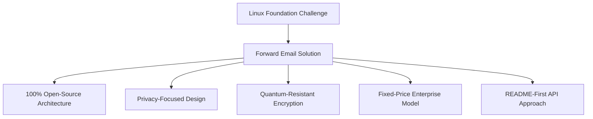
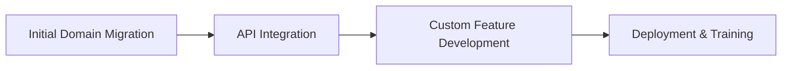

# Пример исследования: как Linux Foundation оптимизирует управление электронной почтой в более чем 250 доменах с помощью пересылки электронной почты {#case-study-how-the-linux-foundation-optimizes-email-management-across-250-domains-with-forward-email}


## Содержание {#table-of-contents}

* [Введение](#introduction)
* [Вызов](#the-challenge)
* [Решение](#the-solution)
  * [100% архитектура с открытым исходным кодом](#100-open-source-architecture)
  * [Дизайн, ориентированный на конфиденциальность](#privacy-focused-design)
  * [Безопасность корпоративного уровня](#enterprise-grade-security)
  * [Модель предприятия с фиксированной ценой](#fixed-price-enterprise-model)
  * [API, удобный для разработчиков](#developer-friendly-api)
* [Процесс внедрения](#implementation-process)
* [Результаты и преимущества](#results-and-benefits)
  * [Повышение эффективности](#efficiency-improvements)
  * [Управление затратами](#cost-management)
  * [Повышенная безопасность](#enhanced-security)
  * [Улучшенный пользовательский опыт](#improved-user-experience)
* [Заключение](#conclusion)
* [Ссылки](#references)

## Введение {#introduction}

[Фонд Linux](https://en.wikipedia.org/wiki/Linux_Foundation) управляет более чем 900 проектами с открытым исходным кодом в более чем 250 доменах, включая [linux.com](https://www.linux.com/) и [jQuery.com](https://jquery.com/). В этом исследовании рассматривается их сотрудничество с [Переслать электронное письмо](https://forwardemail.net) для оптимизации управления электронной почтой с сохранением принципов открытого исходного кода.

## Вызов {#the-challenge}

Linux Foundation столкнулась с рядом проблем в управлении электронной почтой:

* **Масштаб**: Управление электронной почтой в более чем 250 доменах с различными требованиями
* **Административная нагрузка**: Настройка записей DNS, поддержка правил пересылки и ответы на запросы в службу поддержки
* **Безопасность**: Защита от угроз, связанных с электронной почтой, с сохранением конфиденциальности
* **Стоимость**: Традиционные решения для каждого пользователя были чрезмерно дорогими в своём масштабе
* **Соответствие принципам открытого исходного кода**: Необходимость решений, соответствующих принципам открытого исходного кода

Подобно проблемам, с которыми столкнулся [Канонический/Ubuntu](https://forwardemail.net/blog/docs/canonical-ubuntu-email-enterprise-case-study) из-за многочисленных доменов распространения, Linux Foundation требовалось решение, которое могло бы обрабатывать разнообразные проекты, сохраняя при этом единый подход к управлению.

## Решение {#the-solution}

Forward Email представляет собой комплексное решение с ключевыми функциями:



### 100% архитектура с открытым исходным кодом {#100-open-source-architecture}

Будучи единственным почтовым сервисом с полностью открытой платформой (как фронтендом, так и бэкендом), Forward Email идеально соответствовал принципам открытого исходного кода Linux Foundation. Как и в нашей реализации с [Канонический/Ubuntu](https://forwardemail.net/blog/docs/canonical-ubuntu-email-enterprise-case-study), такая прозрачность позволила технической команде проверить реализацию безопасности и даже внести улучшения.

### Дизайн, ориентированный на конфиденциальность {#privacy-focused-design}

Строгий [политика конфиденциальности](https://forwardemail.net/privacy) в Forward Email обеспечивал безопасность, необходимую Linux Foundation. Наш [техническая реализация защиты конфиденциальности электронной почты](https://forwardemail.net/blog/docs/email-privacy-protection-technical-implementation) гарантирует безопасность всех сообщений по умолчанию, без регистрации или сканирования содержимого писем.

Как подробно изложено в нашей технической документации по внедрению:

> «Мы построили всю нашу систему на принципе, что ваши электронные письма принадлежат вам и только вам. В отличие от других провайдеров, которые сканируют содержимое электронных писем для рекламы или обучения искусственного интеллекта, мы придерживаемся строгой политики отсутствия регистрации и сканирования, что обеспечивает конфиденциальность всех сообщений».

### Безопасность корпоративного уровня {#enterprise-grade-security}

Реализация [квантово-устойчивое шифрование](https://forwardemail.net/blog/docs/best-quantum-safe-encrypted-email-service) с использованием ChaCha20-Poly1305 обеспечила высочайший уровень безопасности: каждый почтовый ящик представлял собой отдельный зашифрованный файл. Такой подход гарантирует, что даже если квантовые компьютеры смогут взломать текущие стандарты шифрования, коммуникации Linux Foundation останутся защищенными.

### Модель предприятия с фиксированной ценой {#fixed-price-enterprise-model}

[корпоративное ценообразование](https://forwardemail.net/pricing) для пересылки электронной почты обеспечивал фиксированную ежемесячную стоимость, не зависящую от доменов и пользователей. Этот подход обеспечил значительную экономию средств для других крупных организаций, как показано на примере нашего [исследование случая электронной почты выпускников университета](https://forwardemail.net/blog/docs/alumni-email-forwarding-university-case-study), где организации сэкономили до 99% по сравнению с традиционными решениями для электронной почты с оплатой за каждого пользователя.

### Удобный для разработчиков API {#developer-friendly-api}

Вслед за [подход README-first](https://tom.preston-werner.com/2010/08/23/readme-driven-development) и вдохновлённым [RESTful API-дизайн Stripe](https://amberonrails.com/building-stripes-api), [API](https://forwardemail.net/api) от Forward Email обеспечил глубокую интеграцию с Центром управления проектами Linux Foundation. Эта интеграция имела решающее значение для автоматизации управления электронной почтой в рамках всего разнообразного портфеля проектов.

## Процесс внедрения {#implementation-process}

Реализация осуществлялась на основе структурированного подхода:



1. **Первоначальная миграция домена**: настройка записей DNS, настройка SPF/DKIM/DMARC, миграция существующих правил

   ```sh
   # Example DNS configuration for a Linux Foundation domain
   domain.org.    600    IN    MX    10 mx1.forwardemail.net.
   domain.org.    600    IN    MX    10 mx2.forwardemail.net.
   domain.org.    600    IN    TXT   "v=spf1 include:spf.forwardemail.net -all"
   ```

2. **Интеграция API**: подключение к Центру управления проектами для самостоятельного управления

3. **Разработка индивидуальных функций**: управление несколькими доменами, отчетность, политики безопасности

Мы тесно сотрудничали с Linux Foundation при разработке функций (которые также имеют полностью открытый исходный код, чтобы каждый мог ими воспользоваться) специально для их многопроектной среды, аналогично тому, как мы создавали индивидуальные решения для [системы электронной почты выпускников университетов](https://forwardemail.net/blog/docs/alumni-email-forwarding-university-case-study).

## Результаты и преимущества {#results-and-benefits}

Внедрение принесло значительные преимущества:

### Повышение эффективности {#efficiency-improvements}

* Сокращение административных расходов
* Более быстрое внедрение проекта (с нескольких дней до нескольких минут)
* Оптимизированное управление всеми более чем 250 доменами из единого интерфейса

### Управление затратами {#cost-management}

* Фиксированная цена, не зависящая от роста числа доменов или пользователей
* Отказ от лицензионных сборов за каждого пользователя
* Аналогично нашему [исследование университета](https://forwardemail.net/blog/docs/alumni-email-forwarding-university-case-study), Linux Foundation добился существенной экономии средств по сравнению с традиционными решениями

### Улучшенная безопасность {#enhanced-security}

* Квантово-устойчивое шифрование для всех доменов
* Комплексная аутентификация электронной почты, предотвращающая спуфинг и фишинг
* Тестирование безопасности и практические рекомендации через [функции безопасности](https://forwardemail.net/security)
* Защита конфиденциальности через [техническая реализация](https://forwardemail.net/blog/docs/email-privacy-protection-technical-implementation)

### Улучшенный пользовательский интерфейс {#improved-user-experience}

* Самостоятельное управление электронной почтой для администраторов проектов
* Единообразный интерфейс во всех доменах Linux Foundation
* Надежная доставка электронной почты с надежной аутентификацией

## Заключение {#conclusion}

Партнёрство Linux Foundation с Forward Email демонстрирует, как организации могут решать сложные задачи управления электронной почтой, сохраняя при этом верность своим основным ценностям. Выбрав решение, в котором приоритет отдаётся принципам открытого исходного кода, конфиденциальности и безопасности, Linux Foundation превратил управление электронной почтой из административной нагрузки в стратегическое преимущество.

Как показала наша работа с [Канонический/Ubuntu](https://forwardemail.net/blog/docs/canonical-ubuntu-email-enterprise-case-study) и [крупные университеты](https://forwardemail.net/blog/docs/alumni-email-forwarding-university-case-study), организации со сложными портфелями доменов могут добиться значительного повышения эффективности, безопасности и управления расходами с помощью корпоративного решения Forward Email.

Для получения дополнительной информации о том, как функция пересылки электронной почты может помочь вашей организации управлять электронной почтой в нескольких доменах, посетите [forwardemail.net](https://forwardemail.net) или изучите наши подробные сведения о [документация](https://forwardemail.net/email-api) и [гиды](https://forwardemail.net/guides).

## Ссылки {#references}

* Linux Foundation. (2025). «Обзор проектов». Источник: <https://www.linuxfoundation.org/projects>
* Википедия. (2025). «Linux Foundation». Источник: <https://en.wikipedia.org/wiki/Linux_Foundation>