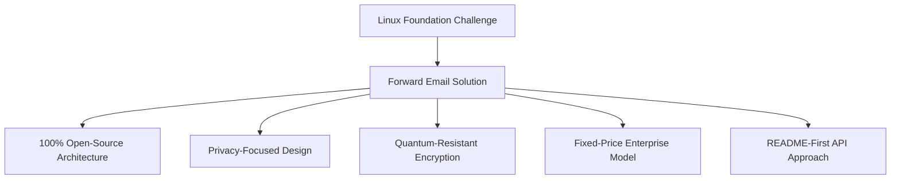
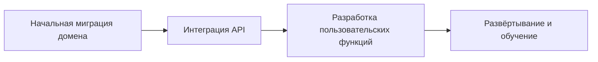

# Кейс: Как Linux Foundation оптимизирует управление электронной почтой более чем на 250 доменах с Forward Email {#case-study-how-the-linux-foundation-optimizes-email-management-across-250-domains-with-forward-email}


## Содержание {#table-of-contents}

* [Введение](#introduction)
* [Проблема](#the-challenge)
* [Решение](#the-solution)
  * [100% открытая архитектура](#100-open-source-architecture)
  * [Конфиденциальность в основе дизайна](#privacy-focused-design)
  * [Безопасность корпоративного уровня](#enterprise-grade-security)
  * [Фиксированная цена для корпоративного тарифа](#fixed-price-enterprise-model)
  * [API, удобный для разработчиков](#developer-friendly-api)
* [Процесс внедрения](#implementation-process)
* [Результаты и преимущества](#results-and-benefits)
  * [Повышение эффективности](#efficiency-improvements)
  * [Управление затратами](#cost-management)
  * [Усиленная безопасность](#enhanced-security)
  * [Улучшенный пользовательский опыт](#improved-user-experience)
* [Заключение](#conclusion)
* [Ссылки](#references)


## Введение {#introduction}

[Linux Foundation](https://en.wikipedia.org/wiki/Linux_Foundation) управляет более чем 900 проектами с открытым исходным кодом на более чем 250 доменах, включая [linux.com](https://www.linux.com/) и [jQuery.com](https://jquery.com/). В этом кейсе рассматривается, как они сотрудничали с [Forward Email](https://forwardemail.net) для оптимизации управления электронной почтой при сохранении соответствия принципам открытого исходного кода.


## Проблема {#the-challenge}

Linux Foundation столкнулась с несколькими проблемами в управлении электронной почтой:

* **Масштаб**: управление почтой на более чем 250 доменах с разными требованиями
* **Административная нагрузка**: настройка DNS-записей, поддержка правил переадресации и обработка запросов в службу поддержки
* **Безопасность**: защита от угроз, связанных с электронной почтой, при сохранении конфиденциальности
* **Стоимость**: традиционные решения с оплатой за пользователя были слишком дорогими при таком масштабе
* **Соответствие открытым стандартам**: необходимость решений, соответствующих их приверженности ценностям открытого исходного кода

Аналогично проблемам, с которыми столкнулась [Canonical/Ubuntu](https://forwardemail.net/blog/docs/canonical-ubuntu-email-enterprise-case-study) с их многочисленными доменами дистрибутивов, Linux Foundation требовалось решение, способное обрабатывать разнообразные проекты при сохранении единого подхода к управлению.


## Решение {#the-solution}

Forward Email предоставил комплексное решение с ключевыми особенностями:


```mermaid
graph TD
    A[Linux Foundation Challenge] --> B[Forward Email Solution]
    B --> C[100% Open-Source Architecture]
    B --> D[Privacy-Focused Design]
    B --> E[Quantum-Resistant Encryption]
    B --> F[Fixed-Price Enterprise Model]
    B --> G[README-First API Approach]
```

### 100% открытая архитектура {#100-open-source-architecture}

Будучи единственным почтовым сервисом с полностью открытой платформой (как фронтенд, так и бэкенд), Forward Email идеально соответствовал приверженности Linux Foundation принципам открытого исходного кода. Аналогично нашему внедрению с [Canonical/Ubuntu](https://forwardemail.net/blog/docs/canonical-ubuntu-email-enterprise-case-study), эта прозрачность позволила их технической команде проверять реализацию безопасности и даже вносить улучшения.

### Конфиденциальность в основе дизайна {#privacy-focused-design}

Строгие [политики конфиденциальности](https://forwardemail.net/privacy) Forward Email обеспечили необходимую Linux Foundation безопасность. Наша [техническая реализация защиты конфиденциальности электронной почты](https://forwardemail.net/blog/docs/email-privacy-protection-technical-implementation) гарантирует, что все коммуникации остаются защищёнными по умолчанию, без ведения логов и сканирования содержимого писем.

Как подробно описано в нашей технической документации:

> «Мы построили всю нашу систему на принципе, что ваши письма принадлежат вам и только вам. В отличие от других провайдеров, которые сканируют содержимое писем для рекламы или обучения ИИ, мы придерживаемся строгой политики отсутствия логирования и сканирования, что сохраняет конфиденциальность всех коммуникаций.»
### Безопасность корпоративного уровня {#enterprise-grade-security}

Реализация [квантово-устойчивого шифрования](https://forwardemail.net/blog/docs/best-quantum-safe-encrypted-email-service) с использованием ChaCha20-Poly1305 обеспечила передовой уровень безопасности, при этом каждая почтовая коробка представляла собой отдельный зашифрованный файл. Такой подход гарантирует, что даже если квантовые компьютеры станут способны взламывать современные стандарты шифрования, коммуникации Linux Foundation останутся защищёнными.

### Фиксированная цена для корпоративного тарифа {#fixed-price-enterprise-model}

[Корпоративное ценообразование](https://forwardemail.net/pricing) Forward Email предусматривало фиксированную ежемесячную стоимость независимо от количества доменов или пользователей. Этот подход позволил значительно сократить расходы для других крупных организаций, как показано в нашем [кейсе по пересылке почты выпускников университета](https://forwardemail.net/blog/docs/alumni-email-forwarding-university-case-study), где учреждения сэкономили до 99% по сравнению с традиционными решениями с оплатой за пользователя.

### API, удобный для разработчиков {#developer-friendly-api}

Следуя [подходу README-first](https://tom.preston-werner.com/2010/08/23/readme-driven-development) и вдохновляясь [RESTful API дизайном Stripe](https://amberonrails.com/building-stripes-api), [API](https://forwardemail.net/api) Forward Email обеспечил глубокую интеграцию с Центром управления проектами Linux Foundation. Эта интеграция была критически важна для автоматизации управления почтой в их разнообразном портфеле проектов.


## Процесс внедрения {#implementation-process}

Внедрение проходило по структурированному плану:


```mermaid
flowchart LR
    A[Начальная миграция домена] --> B[Интеграция API]
    B --> C[Разработка пользовательских функций]
    C --> D[Развёртывание и обучение]
```

1. **Начальная миграция домена**: настройка DNS-записей, установка SPF/DKIM/DMARC, миграция существующих правил

   ```sh
   # Пример конфигурации DNS для домена Linux Foundation
   domain.org.    600    IN    MX    10 mx1.forwardemail.net.
   domain.org.    600    IN    MX    10 mx2.forwardemail.net.
   domain.org.    600    IN    TXT   "v=spf1 include:spf.forwardemail.net -all"
   ```

2. **Интеграция API**: подключение к Центру управления проектами для самостоятельного управления

3. **Разработка пользовательских функций**: управление несколькими доменами, отчётность, политики безопасности

   Мы тесно сотрудничали с Linux Foundation для разработки функций (которые также на 100% открыты, чтобы все могли ими пользоваться) специально для их многопроектной среды, аналогично тому, как мы создавали кастомные решения для [почтовых систем выпускников университетов](https://forwardemail.net/blog/docs/alumni-email-forwarding-university-case-study).


## Результаты и преимущества {#results-and-benefits}

Внедрение принесло значительные преимущества:

### Повышение эффективности {#efficiency-improvements}

* Снижение административной нагрузки
* Быстрый запуск проектов (от нескольких дней до минут)
* Упрощённое управление всеми 250+ доменами через единый интерфейс

### Управление затратами {#cost-management}

* Фиксированная цена независимо от роста количества доменов или пользователей
* Отсутствие платы за лицензию на пользователя
* Аналогично нашему [университетскому кейсу](https://forwardemail.net/blog/docs/alumni-email-forwarding-university-case-study), Linux Foundation добилась значительной экономии по сравнению с традиционными решениями

### Повышенная безопасность {#enhanced-security}

* Квантово-устойчивое шифрование для всех доменов
* Комплексная аутентификация электронной почты, предотвращающая спуфинг и фишинг
* Тестирование безопасности и лучшие практики через [функции безопасности](https://forwardemail.net/security)
* Защита конфиденциальности через нашу [техническую реализацию](https://forwardemail.net/blog/docs/email-privacy-protection-technical-implementation)

### Улучшенный пользовательский опыт {#improved-user-experience}

* Самостоятельное управление почтой для администраторов проектов
* Единый опыт работы на всех доменах Linux Foundation
* Надёжная доставка почты с надёжной аутентификацией


## Заключение {#conclusion}

Партнёрство Linux Foundation с Forward Email демонстрирует, как организации могут решать сложные задачи управления электронной почтой, сохраняя при этом соответствие своим основным ценностям. Выбрав решение, которое ставит во главу угла принципы открытого исходного кода, конфиденциальность и безопасность, Linux Foundation превратила управление почтой из административной нагрузки в стратегическое преимущество.
Как видно из нашего сотрудничества с [Canonical/Ubuntu](https://forwardemail.net/blog/docs/canonical-ubuntu-email-enterprise-case-study) и [крупными университетами](https://forwardemail.net/blog/docs/alumni-email-forwarding-university-case-study), организации с комплексным портфелем доменов могут значительно повысить эффективность, безопасность и управление затратами благодаря корпоративному решению Forward Email.

Для получения дополнительной информации о том, как Forward Email может помочь вашей организации управлять электронной почтой на нескольких доменах, посетите [forwardemail.net](https://forwardemail.net) или изучите нашу подробную [документацию](https://forwardemail.net/email-api) и [руководства](https://forwardemail.net/guides).


## References {#references}

* Linux Foundation. (2025). "Browse Projects." Retrieved from <https://www.linuxfoundation.org/projects>
* Wikipedia. (2025). "Linux Foundation." Retrieved from <https://en.wikipedia.org/wiki/Linux_Foundation>
