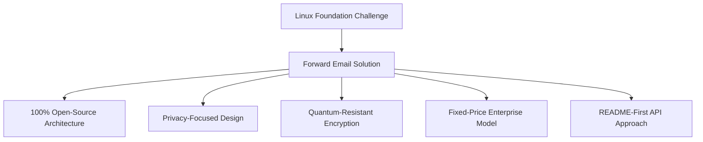
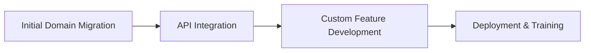

# Fallstudie: Hur Linux Foundation optimerar e-posthantering över 250+ domäner med vidarebefordran av e-post {#case-study-how-the-linux-foundation-optimizes-email-management-across-250-domains-with-forward-email}


## Innehållsförteckning {#table-of-contents}

* [Introduktion](#introduction)
* [Utmaningen](#the-challenge)
* [Lösningen](#the-solution)
  * [100 % öppen källkodsarkitektur](#100-open-source-architecture)
  * [Integritetsfokuserad design](#privacy-focused-design)
  * [Säkerhet i företagsklass](#enterprise-grade-security)
  * [Fastprisföretagsmodell](#fixed-price-enterprise-model)
  * [Utvecklarvänligt API](#developer-friendly-api)
* [Implementeringsprocess](#implementation-process)
* [Resultat och fördelar](#results-and-benefits)
  * [Effektivitetsförbättringar](#efficiency-improvements)
  * [Kostnadshantering](#cost-management)
  * [Förbättrad säkerhet](#enhanced-security)
  * [Förbättrad användarupplevelse](#improved-user-experience)
* [Slutsats](#conclusion)
* [Referenser](#references)

## Introduktion {#introduction}

[Linux Foundation](https://en.wikipedia.org/wiki/Linux_Foundation) hanterar över 900 projekt med öppen källkod över fler än 250 domäner, inklusive [linux.com](https://www.linux.com/) och [jQuery.com](https://jquery.com/). Denna fallstudie utforskar hur de samarbetade med [Vidarebefordra e-post](https://forwardemail.net) för att effektivisera e-posthanteringen samtidigt som de bibehöll överensstämmelsen med principerna för öppen källkod.

## Utmaningen {#the-challenge}

Linux Foundation stod inför flera utmaningar med e-posthantering:

* **Skala**: Hantera e-post över fler än 250 domäner med olika krav
* **Administrativ börda**: Konfigurera DNS-poster, underhålla vidarebefordringsregler och svara på supportförfrågningar
* **Säkerhet**: Skydda mot e-postbaserade hot samtidigt som integriteten bibehålls
* **Kostnad**: Traditionella lösningar per användare var oöverkomligt dyra i sin skala
* **Öppen källkodsanpassning**: Behov av lösningar som matchar deras engagemang för öppen källkod

I likhet med de utmaningar som [Kanonisk/Ubuntu](https://forwardemail.net/blog/docs/canonical-ubuntu-email-enterprise-case-study) stod inför med sina flera distributionsdomäner, behövde Linux Foundation en lösning som kunde hantera olika projekt samtidigt som en enhetlig hanteringsmetod bibehölls.

## Lösningen {#the-solution}

Vidarebefordra e-post erbjöd en heltäckande lösning med viktiga funktioner:



### 100 % öppen källkodsarkitektur {#100-open-source-architecture}

Som den enda e-posttjänsten med en helt öppen källkodsplattform (både frontend och backend) stämde Forward Email perfekt överens med Linux Foundations engagemang för principer om öppen källkod. I likhet med vår implementering med [Kanonisk/Ubuntu](https://forwardemail.net/blog/docs/canonical-ubuntu-email-enterprise-case-study) gjorde denna transparens det möjligt för deras tekniska team att verifiera säkerhetsimplementeringar och till och med bidra med förbättringar.

### Integritetsfokuserad design {#privacy-focused-design}

Vidarebefordra e-postens strikta [sekretesspolicyer](https://forwardemail.net/privacy) gav den säkerhet som Linux Foundation krävde. Vår [teknisk implementering av e-postskydd för integritet](https://forwardemail.net/blog/docs/email-privacy-protection-technical-implementation) säkerställer att all kommunikation förblir säker genom design, utan loggning eller skanning av e-postinnehåll.

Som beskrivs i vår tekniska implementeringsdokumentation:

> "Vi har byggt hela vårt system kring principen att dina e-postmeddelanden tillhör dig och bara dig. Till skillnad från andra leverantörer som skannar e-postinnehåll för reklam eller AI-utbildning, har vi en strikt policy mot loggning och skanning som bevarar sekretessen för all kommunikation."

### Säkerhet i företagsklass {#enterprise-grade-security}

Implementeringen av [kvantresistent kryptering](https://forwardemail.net/blog/docs/best-quantum-safe-encrypted-email-service) med ChaCha20-Poly1305 gav den allra senaste säkerheten, där varje e-postlåda var en separat krypterad fil. Denna metod säkerställer att även om kvantdatorer skulle kunna bryta mot nuvarande krypteringsstandarder, kommer Linux Foundations kommunikation att förbli säker.

### Företagsmodell med fast pris {#fixed-price-enterprise-model}

Vidarebefordra e-postens [företagsprissättning](https://forwardemail.net/pricing) gav en fast månadskostnad oavsett domäner eller användare. Denna metod har lett till betydande kostnadsbesparingar för andra stora organisationer, vilket demonstreras i vår [fallstudie om e-post från universitetsalumner](https://forwardemail.net/blog/docs/alumni-email-forwarding-university-case-study), där institutioner sparade upp till 99 % jämfört med traditionella e-postlösningar per användare.

### Utvecklarvänligt API {#developer-friendly-api}

Efter [README-först-metoden](https://tom.preston-werner.com/2010/08/23/readme-driven-development) och inspirerad av [Stripes RESTful API-design](https://amberonrails.com/building-stripes-api), möjliggjorde Forward Email's [API](https://forwardemail.net/api) djupgående integration med Linux Foundations Project Control Center. Denna integration var avgörande för att automatisera e-posthanteringen i deras mångsidiga projektportfölj.

## Implementeringsprocess {#implementation-process}

Implementeringen följde en strukturerad metod:



1. **Inledande domänmigrering**: Konfigurera DNS-poster, konfigurera SPF/DKIM/DMARC, migrera befintliga regler

   ```sh
   # Example DNS configuration for a Linux Foundation domain
   domain.org.    600    IN    MX    10 mx1.forwardemail.net.
   domain.org.    600    IN    MX    10 mx2.forwardemail.net.
   domain.org.    600    IN    TXT   "v=spf1 include:spf.forwardemail.net -all"
   ```

2. **API-integration**: Anslutning till Project Control Center för självbetjäningshantering

3. **Utveckling av anpassade funktioner**: Hantering av flera domäner, rapportering, säkerhetspolicyer

Vi arbetade nära Linux Foundation för att utveckla funktioner (som också är 100 % öppna så att alla kan dra nytta av dem) specifikt för deras miljö med flera projekt, ungefär som vi skapade anpassade lösningar för [e-postsystem för universitetsalumner](https://forwardemail.net/blog/docs/alumni-email-forwarding-university-case-study).

## Resultat och fördelar {#results-and-benefits}

Implementeringen gav betydande fördelar:

### Effektivitetsförbättringar {#efficiency-improvements}

* Minskad administrativ omkostnad
* Snabbare projektstart (från dagar till minuter)
* Effektiviserad hantering av alla 250+ domäner från ett enda gränssnitt

### Kostnadshantering {#cost-management}

* Fast prissättning oavsett tillväxt i domäner eller användare
* Eliminering av licensavgifter per användare
* I likhet med vår [universitetsfallstudie](https://forwardemail.net/blog/docs/alumni-email-forwarding-university-case-study) uppnådde Linux Foundation betydande kostnadsbesparingar jämfört med traditionella lösningar

### Förbättrad säkerhet {#enhanced-security}

* Kvantresistent kryptering över alla domäner
* Omfattande e-postautentisering som förhindrar förfalskning och nätfiske
* Säkerhetstester och praxis via [säkerhetsfunktioner](https://forwardemail.net/security)
* Integritetsskydd genom vår [teknisk implementering](https://forwardemail.net/blog/docs/email-privacy-protection-technical-implementation)

### Förbättrad användarupplevelse {#improved-user-experience}

* Självbetjäningshantering av e-post för projektadministratörer
* Konsekvent upplevelse över alla Linux Foundation-domäner
* Tillförlitlig e-postleverans med robust autentisering

## Slutsats {#conclusion}

Linux Foundations partnerskap med Forward Email visar hur organisationer kan hantera komplexa utmaningar inom e-posthantering samtidigt som de bibehåller sina kärnvärden. Genom att välja en lösning som prioriterar principer om öppen källkod, integritet och säkerhet har Linux Foundation förvandlat e-posthantering från en administrativ börda till en strategisk fördel.

Som vi sett i vårt arbete med både [Kanonisk/Ubuntu](https://forwardemail.net/blog/docs/canonical-ubuntu-email-enterprise-case-study) och [större universitet](https://forwardemail.net/blog/docs/alumni-email-forwarding-university-case-study) kan organisationer med komplexa domänportföljer uppnå betydande förbättringar av effektivitet, säkerhet och kostnadshantering genom Forward Emails företagslösning.

För mer information om hur vidarebefordra e-post kan hjälpa din organisation att hantera e-post över flera domäner, besök [forwardemail.net](https://forwardemail.net) eller utforska våra detaljerade [dokumentation](https://forwardemail.net/email-api) och [guider](https://forwardemail.net/guides).

## Referenser {#references}

* Linux Foundation. (2025). "Bläddra bland projekt." Hämtad från <https://www.linuxfoundation.org/projects>
* Wikipedia. (2025). "Linux Foundation." Hämtad från <https://en.wikipedia.org/wiki/Linux_Foundation>