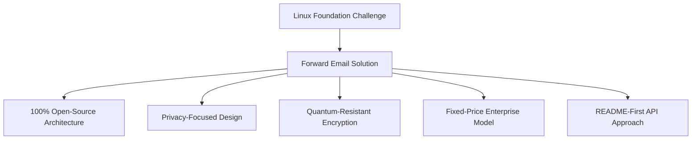
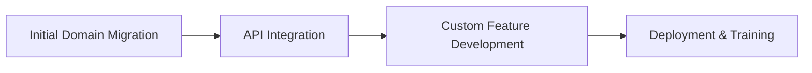

# Fallstudie: Hur Linux Foundation optimerar e-posthantering över 250+ domäner med Forward Email {#case-study-how-the-linux-foundation-optimizes-email-management-across-250-domains-with-forward-email}


## Innehållsförteckning {#table-of-contents}

* [Introduktion](#introduction)
* [Utmaningen](#the-challenge)
* [Lösningen](#the-solution)
  * [100% Öppen källkod-arkitektur](#100-open-source-architecture)
  * [Integritetsfokuserad design](#privacy-focused-design)
  * [Säkerhet i företagsklass](#enterprise-grade-security)
  * [Fastpris företagsmodell](#fixed-price-enterprise-model)
  * [Utvecklarvänligt API](#developer-friendly-api)
* [Implementeringsprocess](#implementation-process)
* [Resultat och fördelar](#results-and-benefits)
  * [Effektivitetsförbättringar](#efficiency-improvements)
  * [Kostnadshantering](#cost-management)
  * [Förbättrad säkerhet](#enhanced-security)
  * [Förbättrad användarupplevelse](#improved-user-experience)
* [Slutsats](#conclusion)
* [Referenser](#references)


## Introduktion {#introduction}

[Linux Foundation](https://en.wikipedia.org/wiki/Linux_Foundation) hanterar över 900 open source-projekt över 250+ domäner, inklusive [linux.com](https://www.linux.com/) och [jQuery.com](https://jquery.com/). Denna fallstudie utforskar hur de samarbetade med [Forward Email](https://forwardemail.net) för att effektivisera e-posthanteringen samtidigt som de behöll sin överensstämmelse med open source-principer.


## Utmaningen {#the-challenge}

Linux Foundation stod inför flera utmaningar med e-posthantering:

* **Skalbarhet**: Hantera e-post över 250+ domäner med olika krav
* **Administrativ börda**: Konfigurera DNS-poster, underhålla vidarebefordringsregler och hantera supportförfrågningar
* **Säkerhet**: Skydda mot e-postbaserade hot samtidigt som integriteten upprätthålls
* **Kostnad**: Traditionella lösningar per användare var orimligt dyra i deras skala
* **Öppen källkod-överensstämmelse**: Behov av lösningar som matchar deras engagemang för open source-värderingar

Liknande de utmaningar som [Canonical/Ubuntu](https://forwardemail.net/blog/docs/canonical-ubuntu-email-enterprise-case-study) mötte med sina flera distributionsdomäner behövde Linux Foundation en lösning som kunde hantera olika projekt samtidigt som en enhetlig hanteringsmetod bibehölls.


## Lösningen {#the-solution}

Forward Email erbjöd en omfattande lösning med nyckelfunktioner:


```mermaid
graph TD
    A[Linux Foundation Challenge] --> B[Forward Email Solution]
    B --> C[100% Open-Source Architecture]
    B --> D[Privacy-Focused Design]
    B --> E[Quantum-Resistant Encryption]
    B --> F[Fixed-Price Enterprise Model]
    B --> G[README-First API Approach]
```

### 100% Öppen källkod-arkitektur {#100-open-source-architecture}

Som den enda e-posttjänsten med en helt öppen källkodsplattform (både frontend och backend) stämde Forward Email perfekt överens med Linux Foundations engagemang för open source-principer. Precis som i vår implementering med [Canonical/Ubuntu](https://forwardemail.net/blog/docs/canonical-ubuntu-email-enterprise-case-study) möjliggjorde denna transparens för deras tekniska team att verifiera säkerhetsimplementeringar och till och med bidra med förbättringar.

### Integritetsfokuserad design {#privacy-focused-design}

Forward Emails strikta [integritetspolicyer](https://forwardemail.net/privacy) gav den säkerhet som Linux Foundation krävde. Vår [tekniska implementering av e-postintegritetsskydd](https://forwardemail.net/blog/docs/email-privacy-protection-technical-implementation) säkerställer att all kommunikation förblir säker av design, utan loggning eller skanning av e-postinnehåll.

Som detaljerat i vår tekniska implementeringsdokumentation:

> "Vi har byggt hela vårt system kring principen att dina e-postmeddelanden tillhör dig och bara dig. Till skillnad från andra leverantörer som skannar e-postinnehåll för reklam eller AI-träning upprätthåller vi en strikt policy utan loggning och utan skanning som bevarar sekretessen för all kommunikation."
### Företagsklassad Säkerhet {#enterprise-grade-security}

Implementering av [kvantresistent kryptering](https://forwardemail.net/blog/docs/best-quantum-safe-encrypted-email-service) med ChaCha20-Poly1305 erbjöd toppmodern säkerhet, där varje brevlåda är en separat krypterad fil. Denna metod säkerställer att även om kvantdatorer blir kapabla att bryta nuvarande krypteringsstandarder, kommer Linux Foundations kommunikation att förbli säker.

### Fastpris Företagsmodell {#fixed-price-enterprise-model}

Forward Emails [företagsprissättning](https://forwardemail.net/pricing) erbjöd en fast månadskostnad oavsett domäner eller användare. Denna metod har gett betydande kostnadsbesparingar för andra stora organisationer, vilket visas i vår [fallstudie om universitetsalumners e-post](https://forwardemail.net/blog/docs/alumni-email-forwarding-university-case-study), där institutioner sparade upp till 99 % jämfört med traditionella e-postlösningar per användare.

### Utvecklarvänligt API {#developer-friendly-api}

Med en [README-först-ansats](https://tom.preston-werner.com/2010/08/23/readme-driven-development) och inspirerat av [Stripes RESTful API-design](https://amberonrails.com/building-stripes-api) möjliggjorde Forward Emails [API](https://forwardemail.net/api) djup integration med Linux Foundations Project Control Center. Denna integration var avgörande för att automatisera e-posthantering över deras mångsidiga projektportfölj.


## Implementeringsprocess {#implementation-process}

Implementeringen följde en strukturerad metod:


```mermaid
flowchart LR
    A[Initial Domain Migration] --> B[API Integration]
    B --> C[Custom Feature Development]
    C --> D[Deployment & Training]
```

1. **Initial Domänmigration**: Konfigurering av DNS-poster, uppsättning av SPF/DKIM/DMARC, migrering av befintliga regler

   ```sh
   # Exempel på DNS-konfiguration för en Linux Foundation-domän
   domain.org.    600    IN    MX    10 mx1.forwardemail.net.
   domain.org.    600    IN    MX    10 mx2.forwardemail.net.
   domain.org.    600    IN    TXT   "v=spf1 include:spf.forwardemail.net -all"
   ```

2. **API-integration**: Anslutning till Project Control Center för självbetjäningshantering

3. **Utveckling av Anpassade Funktioner**: Hantering av flera domäner, rapportering, säkerhetspolicys

   Vi arbetade nära Linux Foundation för att utveckla funktioner (som också är 100 % öppen källkod så att alla kan dra nytta av dem) specifikt för deras miljö med flera projekt, liknande hur vi skapade anpassade lösningar för [universitetsalumners e-postsystem](https://forwardemail.net/blog/docs/alumni-email-forwarding-university-case-study).


## Resultat och Fördelar {#results-and-benefits}

Implementeringen gav betydande fördelar:

### Effektivitetsförbättringar {#efficiency-improvements}

* Minskad administrativ börda
* Snabbare projektintroduktion (från dagar till minuter)
* Förenklad hantering av alla 250+ domäner från ett enda gränssnitt

### Kostnadshantering {#cost-management}

* Fast prissättning oavsett tillväxt i domäner eller användare
* Eliminering av licensavgifter per användare
* Liknande vår [universitetsfallstudie](https://forwardemail.net/blog/docs/alumni-email-forwarding-university-case-study) uppnådde Linux Foundation betydande kostnadsbesparingar jämfört med traditionella lösningar

### Förbättrad Säkerhet {#enhanced-security}

* Kvantresistent kryptering över alla domäner
* Omfattande e-postautentisering som förhindrar förfalskning och nätfiske
* Säkerhetstestning och praxis via [säkerhetsfunktioner](https://forwardemail.net/security)
* Integritetsskydd genom vår [tekniska implementering](https://forwardemail.net/blog/docs/email-privacy-protection-technical-implementation)

### Förbättrad Användarupplevelse {#improved-user-experience}

* Självbetjäningshantering av e-post för projektadministratörer
* Enhetlig upplevelse över alla Linux Foundation-domäner
* Pålitlig e-postleverans med robust autentisering


## Slutsats {#conclusion}

Linux Foundations partnerskap med Forward Email visar hur organisationer kan hantera komplexa utmaningar med e-posthantering samtidigt som de behåller sina kärnvärden. Genom att välja en lösning som prioriterar öppen källkod, integritet och säkerhet har Linux Foundation förvandlat e-posthantering från en administrativ börda till en strategisk fördel.
Som ses i vårt arbete med både [Canonical/Ubuntu](https://forwardemail.net/blog/docs/canonical-ubuntu-email-enterprise-case-study) och [stora universitet](https://forwardemail.net/blog/docs/alumni-email-forwarding-university-case-study), kan organisationer med komplexa domänportföljer uppnå betydande förbättringar i effektivitet, säkerhet och kostnadshantering genom Forward Emails företagslösning.

För mer information om hur Forward Email kan hjälpa din organisation att hantera e-post över flera domäner, besök [forwardemail.net](https://forwardemail.net) eller utforska vår detaljerade [dokumentation](https://forwardemail.net/email-api) och [guider](https://forwardemail.net/guides).


## Referenser {#references}

* Linux Foundation. (2025). "Browse Projects." Hämtad från <https://www.linuxfoundation.org/projects>
* Wikipedia. (2025). "Linux Foundation." Hämtad från <https://en.wikipedia.org/wiki/Linux_Foundation>
