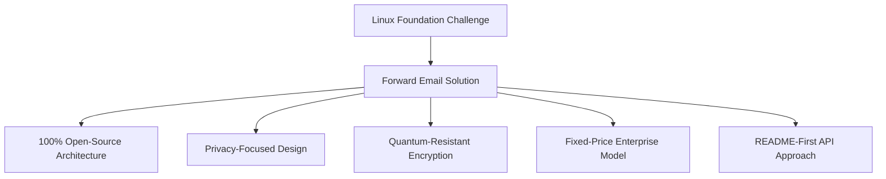
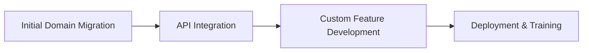

# กรณีศึกษา: มูลนิธิ Linux เพิ่มประสิทธิภาพการจัดการอีเมลในโดเมนมากกว่า 250 โดเมนอย่างไรด้วยการส่งต่ออีเมล {#case-study-how-the-linux-foundation-optimizes-email-management-across-250-domains-with-forward-email}


## สารบัญ {#table-of-contents}

* [การแนะนำ](#introduction)
* [ความท้าทาย](#the-challenge)
* [วิธีแก้ปัญหา](#the-solution)
  * [สถาปัตยกรรมโอเพ่นซอร์ส 100%](#100-open-source-architecture)
  * [การออกแบบที่เน้นความเป็นส่วนตัว](#privacy-focused-design)
  * [ความปลอดภัยระดับองค์กร](#enterprise-grade-security)
  * [รุ่นองค์กรราคาคงที่](#fixed-price-enterprise-model)
  * [API ที่เป็นมิตรกับนักพัฒนา](#developer-friendly-api)
* [กระบวนการดำเนินการ](#implementation-process)
* [ผลลัพธ์และคุณประโยชน์](#results-and-benefits)
  * [การปรับปรุงประสิทธิภาพ](#efficiency-improvements)
  * [การจัดการต้นทุน](#cost-management)
  * [การรักษาความปลอดภัยที่เพิ่มขึ้น](#enhanced-security)
  * [ประสบการณ์ผู้ใช้ที่ได้รับการปรับปรุง](#improved-user-experience)
* [บทสรุป](#conclusion)
* [อ้างอิง](#references)

## บทนำ {#introduction}

[มูลนิธิลินุกซ์](https://en.wikipedia.org/wiki/Linux_Foundation) บริหารจัดการโครงการโอเพนซอร์สกว่า 900 โครงการ ในกว่า 250 โดเมน รวมถึง [linux.com](https://www.linux.com/) และ [jQuery.com](https://jquery.com/) กรณีศึกษานี้จะสำรวจว่าทั้งสองร่วมมือกับ [ส่งต่ออีเมล์](https://forwardemail.net) อย่างไร เพื่อเพิ่มประสิทธิภาพการจัดการอีเมล ในขณะเดียวกันก็ยังคงสอดคล้องกับหลักการของโอเพนซอร์ส

## ความท้าทาย {#the-challenge}

มูลนิธิ Linux เผชิญกับความท้าทายในการจัดการอีเมลหลายประการ:

* **ขนาด**: การจัดการอีเมลในโดเมนมากกว่า 250 โดเมนที่มีข้อกำหนดที่แตกต่างกัน
* **ภาระงานด้านการดูแลระบบ**: การกำหนดค่าระเบียน DNS การดูแลรักษากฎการส่งต่อ และการตอบสนองต่อคำขอการสนับสนุน
* **ความปลอดภัย**: การปกป้องจากภัยคุกคามจากอีเมลในขณะที่ยังคงความเป็นส่วนตัวไว้
* **ต้นทุน**: โซลูชันต่อผู้ใช้แบบดั้งเดิมนั้นมีราคาแพงเกินไปเมื่อพิจารณาจากขนาด
* **การจัดแนวทางโอเพ่นซอร์ส**: ความต้องการโซลูชันที่สอดคล้องกับความมุ่งมั่นที่มีต่อคุณค่าโอเพ่นซอร์ส

คล้ายกับความท้าทายที่ [แคนอนิค/อูบุนตู](https://forwardemail.net/blog/docs/canonical-ubuntu-email-enterprise-case-study) เผชิญด้วยโดเมนการแจกจ่ายหลายรายการ มูลนิธิ Linux จำเป็นต้องมีโซลูชันที่สามารถจัดการโครงการที่หลากหลายได้ในขณะที่ยังคงรักษาแนวทางการจัดการแบบรวมไว้

## โซลูชัน {#the-solution}

Forward Email นำเสนอโซลูชันที่ครอบคลุมพร้อมคุณสมบัติหลัก:



### สถาปัตยกรรมโอเพ่นซอร์ส 100% {#100-open-source-architecture}

ในฐานะบริการอีเมลเพียงรายเดียวที่มีแพลตฟอร์มโอเพนซอร์สอย่างสมบูรณ์ (ทั้งส่วนหน้าและส่วนหลัง) Forward Email จึงสอดคล้องกับความมุ่งมั่นของมูลนิธิ Linux ที่มีต่อหลักการโอเพนซอร์สอย่างสมบูรณ์แบบ เช่นเดียวกับที่เราได้นำ [แคนอนิค/อูบุนตู](https://forwardemail.net/blog/docs/canonical-ubuntu-email-enterprise-case-study) มาใช้ ความโปร่งใสนี้ช่วยให้ทีมเทคนิคสามารถตรวจสอบการใช้งานด้านความปลอดภัยและแม้กระทั่งมีส่วนร่วมในการปรับปรุง

### การออกแบบที่เน้นความเป็นส่วนตัว {#privacy-focused-design}

[นโยบายความเป็นส่วนตัว](https://forwardemail.net/privacy) ที่เข้มงวดของ Forward Email มอบความปลอดภัยตามที่ Linux Foundation ต้องการ [การป้องกันความเป็นส่วนตัวของอีเมล การดำเนินการทางเทคนิค](https://forwardemail.net/blog/docs/email-privacy-protection-technical-implementation) ของเรารับประกันว่าการสื่อสารทั้งหมดจะปลอดภัยโดยการออกแบบ โดยไม่มีการบันทึกหรือสแกนเนื้อหาอีเมล

ตามรายละเอียดในเอกสารการใช้งานทางเทคนิคของเรา:

> "เราสร้างระบบทั้งหมดของเราขึ้นโดยยึดหลักการที่ว่าอีเมลของคุณเป็นของคุณและคุณเท่านั้น ไม่เหมือนกับผู้ให้บริการรายอื่นที่สแกนเนื้อหาอีเมลเพื่อการโฆษณาหรือการฝึกอบรม AI เรามีนโยบายไม่บันทึกข้อมูลและสแกนอย่างเคร่งครัดเพื่อรักษาความลับของการสื่อสารทั้งหมด"

### ความปลอดภัยระดับองค์กร {#enterprise-grade-security}

การนำ [การเข้ารหัสที่ทนทานต่อควอนตัม](https://forwardemail.net/blog/docs/best-quantum-safe-encrypted-email-service) มาใช้โดยใช้ ChaCha20-Poly1305 ทำให้เกิดความปลอดภัยขั้นสูง โดยแต่ละเมลบ็อกซ์จะเป็นไฟล์ที่เข้ารหัสแยกกัน วิธีนี้ช่วยให้มั่นใจได้ว่าแม้คอมพิวเตอร์ควอนตัมจะสามารถฝ่าฝืนมาตรฐานการเข้ารหัสปัจจุบันได้ การสื่อสารของมูลนิธิ Linux จะยังคงปลอดภัย

### โมเดลองค์กรราคาคงที่ {#fixed-price-enterprise-model}

[ราคาขององค์กร](https://forwardemail.net/pricing) ของ Forward Email มีค่าใช้จ่ายรายเดือนคงที่โดยไม่คำนึงถึงโดเมนหรือผู้ใช้ วิธีนี้ช่วยให้องค์กรขนาดใหญ่อื่นๆ ประหยัดต้นทุนได้อย่างมาก ดังที่แสดงให้เห็นใน [กรณีศึกษาอีเมลของศิษย์เก่ามหาวิทยาลัย](https://forwardemail.net/blog/docs/alumni-email-forwarding-university-case-study) ของเรา ซึ่งสถาบันต่างๆ ประหยัดได้ถึง 99% เมื่อเทียบกับโซลูชันอีเมลแบบต่อผู้ใช้ทั่วไป

### API ที่เป็นมิตรกับนักพัฒนา {#developer-friendly-api}

[แนวทางการอ่านฉันก่อน](https://tom.preston-werner.com/2010/08/23/readme-driven-development) และได้รับแรงบันดาลใจจาก [การออกแบบ RESTful API ของ Stripe](https://amberonrails.com/building-stripes-api) [API](https://forwardemail.net/api) ของ Forward Email ช่วยให้สามารถผสานรวมเข้ากับ Project Control Center ของมูลนิธิ Linux ได้อย่างลึกซึ้ง การผสานรวมนี้มีความสำคัญอย่างยิ่งต่อการจัดการอีเมลอัตโนมัติในพอร์ตโฟลิโอโครงการที่หลากหลายของพวกเขา

## กระบวนการใช้งาน {#implementation-process}

การดำเนินการเป็นไปตามแนวทางที่มีโครงสร้างชัดเจน:



1. **การย้ายโดเมนเริ่มต้น**: การกำหนดค่าระเบียน DNS การตั้งค่า SPF/DKIM/DMARC การย้ายกฎที่มีอยู่

   ```sh
   # Example DNS configuration for a Linux Foundation domain
   domain.org.    600    IN    MX    10 mx1.forwardemail.net.
   domain.org.    600    IN    MX    10 mx2.forwardemail.net.
   domain.org.    600    IN    TXT   "v=spf1 include:spf.forwardemail.net -all"
   ```

2. **การรวม API**: เชื่อมต่อกับศูนย์ควบคุมโครงการสำหรับการจัดการด้วยตนเอง

3. **การพัฒนาคุณสมบัติที่กำหนดเอง**: การจัดการหลายโดเมน การรายงาน นโยบายความปลอดภัย

เราทำงานอย่างใกล้ชิดกับมูลนิธิ Linux เพื่อพัฒนาฟีเจอร์ต่างๆ (ซึ่งเป็นโอเพ่นซอร์ส 100% เพื่อให้ทุกคนได้รับประโยชน์จากฟีเจอร์เหล่านี้) โดยเฉพาะสำหรับสภาพแวดล้อมหลายโปรเจ็กต์ของพวกเขา ซึ่งคล้ายกับวิธีที่เราสร้างโซลูชันแบบกำหนดเองสำหรับ [ระบบอีเมล์ศิษย์เก่ามหาวิทยาลัย](https://forwardemail.net/blog/docs/alumni-email-forwarding-university-case-study)

## ผลลัพธ์และประโยชน์ {#results-and-benefits}

การนำไปปฏิบัติทำให้เกิดประโยชน์ที่สำคัญดังนี้:

### การปรับปรุงประสิทธิภาพ {#efficiency-improvements}

* ลดค่าใช้จ่ายด้านการบริหาร
* การเริ่มต้นโครงการเร็วขึ้น (จากหลายวันเหลือเพียงไม่กี่นาที)
* จัดการโดเมนมากกว่า 250 โดเมนจากอินเทอร์เฟซเดียว

### การจัดการต้นทุน {#cost-management}

* ราคาคงที่โดยไม่คำนึงถึงการเติบโตของโดเมนหรือจำนวนผู้ใช้
* ยกเลิกค่าธรรมเนียมใบอนุญาตต่อผู้ใช้
* เช่นเดียวกับ [กรณีศึกษาของมหาวิทยาลัย](https://forwardemail.net/blog/docs/alumni-email-forwarding-university-case-study) ของเรา มูลนิธิ Linux สามารถประหยัดต้นทุนได้อย่างมากเมื่อเทียบกับโซลูชันแบบเดิม

### การรักษาความปลอดภัยขั้นสูง {#enhanced-security}

* การเข้ารหัสแบบควอนตัมที่ทนทานต่อทุกโดเมน
* การตรวจสอบสิทธิ์อีเมลที่ครอบคลุม ป้องกันการปลอมแปลงและฟิชชิ่ง
* การทดสอบและแนวทางปฏิบัติด้านความปลอดภัยผ่าน [คุณสมบัติด้านความปลอดภัย](https://forwardemail.net/security)
* การปกป้องความเป็นส่วนตัวผ่าน [การดำเนินการทางเทคนิค](https://forwardemail.net/blog/docs/email-privacy-protection-technical-implementation) ของเรา

### ประสบการณ์ผู้ใช้ที่ดีขึ้น {#improved-user-experience}

* การจัดการอีเมลแบบบริการตนเองสำหรับผู้ดูแลโครงการ
* ประสบการณ์ที่สอดคล้องกันในทุกโดเมนของ Linux Foundation
* การส่งอีเมลที่เชื่อถือได้พร้อมการรับรองความถูกต้องที่แข็งแกร่ง

## บทสรุป {#conclusion}

ความร่วมมือระหว่างมูลนิธิ Linux กับ Forward Email แสดงให้เห็นว่าองค์กรต่างๆ สามารถรับมือกับความท้าทายในการจัดการอีเมลที่ซับซ้อนได้อย่างไรในขณะที่ยังคงรักษาแนวทางที่สอดคล้องกับค่านิยมหลักของตนไว้ได้ โดยการเลือกโซลูชันที่ให้ความสำคัญกับหลักการโอเพนซอร์ส ความเป็นส่วนตัว และความปลอดภัย มูลนิธิ Linux ได้เปลี่ยนการจัดการอีเมลจากภาระงานด้านการบริหารให้กลายเป็นข้อได้เปรียบเชิงกลยุทธ์

จากที่เห็นในงานของเราด้วยทั้ง [แคนอนิค/อูบุนตู](https://forwardemail.net/blog/docs/canonical-ubuntu-email-enterprise-case-study) และ [มหาวิทยาลัยชั้นนำ](https://forwardemail.net/blog/docs/alumni-email-forwarding-university-case-study) องค์กรที่มีพอร์ตโฟลิโอโดเมนที่ซับซ้อนสามารถปรับปรุงประสิทธิภาพ ความปลอดภัย และการจัดการต้นทุนได้อย่างมีนัยสำคัญผ่านโซลูชันระดับองค์กรของ Forward Email

หากต้องการข้อมูลเพิ่มเติมเกี่ยวกับวิธีที่ Forward Email ช่วยให้องค์กรของคุณจัดการอีเมลข้ามโดเมนต่างๆ โปรดไปที่ [forwardemail.net](https://forwardemail.net) หรือสำรวจ [เอกสารประกอบ](https://forwardemail.net/email-api) และ [ไกด์](https://forwardemail.net/guides) โดยละเอียดของเรา

## อ้างอิง {#references}

* มูลนิธิ Linux (2025). "เรียกดูโครงการ" สืบค้นจาก <https://www.linuxfoundation.org/projects>
* วิกิพีเดีย (2025). "มูลนิธิ Linux" สืบค้นจาก <https://en.wikipedia.org/wiki/Linux_Foundation>