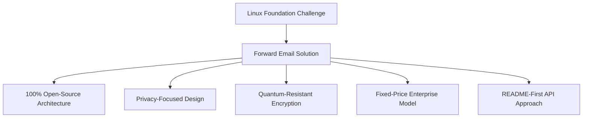
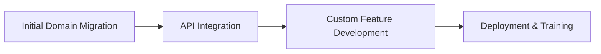

# กรณีศึกษา: วิธีที่ Linux Foundation ปรับปรุงการจัดการอีเมลในกว่า 250 โดเมนด้วย Forward Email {#case-study-how-the-linux-foundation-optimizes-email-management-across-250-domains-with-forward-email}


## สารบัญ {#table-of-contents}

* [บทนำ](#introduction)
* [ความท้าทาย](#the-challenge)
* [ทางออก](#the-solution)
  * [สถาปัตยกรรมแบบโอเพนซอร์ส 100%](#100-open-source-architecture)
  * [การออกแบบที่เน้นความเป็นส่วนตัว](#privacy-focused-design)
  * [ความปลอดภัยระดับองค์กร](#enterprise-grade-security)
  * [โมเดลราคาคงที่สำหรับองค์กร](#fixed-price-enterprise-model)
  * [API ที่เป็นมิตรกับนักพัฒนา](#developer-friendly-api)
* [กระบวนการดำเนินการ](#implementation-process)
* [ผลลัพธ์และประโยชน์](#results-and-benefits)
  * [การปรับปรุงประสิทธิภาพ](#efficiency-improvements)
  * [การจัดการต้นทุน](#cost-management)
  * [ความปลอดภัยที่เพิ่มขึ้น](#enhanced-security)
  * [ประสบการณ์ผู้ใช้ที่ดีขึ้น](#improved-user-experience)
* [บทสรุป](#conclusion)
* [เอกสารอ้างอิง](#references)


## บทนำ {#introduction}

[Linux Foundation](https://en.wikipedia.org/wiki/Linux_Foundation) ดูแลโครงการโอเพนซอร์สมากกว่า 900 โครงการในกว่า 250 โดเมน รวมถึง [linux.com](https://www.linux.com/) และ [jQuery.com](https://jquery.com/) กรณีศึกษานี้สำรวจวิธีที่พวกเขาร่วมมือกับ [Forward Email](https://forwardemail.net) เพื่อปรับปรุงการจัดการอีเมลในขณะที่ยังคงสอดคล้องกับหลักการโอเพนซอร์ส


## ความท้าทาย {#the-challenge}

Linux Foundation เผชิญกับความท้าทายหลายประการในการจัดการอีเมล:

* **ขนาด**: การจัดการอีเมลในกว่า 250 โดเมนที่มีความต้องการแตกต่างกัน
* **ภาระงานด้านการบริหาร**: การตั้งค่าบันทึก DNS, การดูแลกฎการส่งต่อ และการตอบสนองคำขอสนับสนุน
* **ความปลอดภัย**: การป้องกันภัยคุกคามทางอีเมลในขณะที่ยังคงรักษาความเป็นส่วนตัว
* **ต้นทุน**: โซลูชันแบบต่อผู้ใช้แบบดั้งเดิมมีค่าใช้จ่ายสูงเกินไปในระดับนี้
* **ความสอดคล้องกับโอเพนซอร์ส**: ความต้องการโซลูชันที่สอดคล้องกับค่านิยมโอเพนซอร์สของพวกเขา

คล้ายกับความท้าทายที่ [Canonical/Ubuntu](https://forwardemail.net/blog/docs/canonical-ubuntu-email-enterprise-case-study) เผชิญกับโดเมนการแจกจ่ายหลายโดเมน Linux Foundation ต้องการโซลูชันที่สามารถจัดการโครงการที่หลากหลายได้ในขณะที่ยังคงรักษาวิธีการจัดการแบบรวมศูนย์


## ทางออก {#the-solution}

Forward Email นำเสนอทางออกที่ครอบคลุมพร้อมคุณสมบัติสำคัญ:


```mermaid
graph TD
    A[Linux Foundation Challenge] --> B[Forward Email Solution]
    B --> C[100% Open-Source Architecture]
    B --> D[Privacy-Focused Design]
    B --> E[Quantum-Resistant Encryption]
    B --> F[Fixed-Price Enterprise Model]
    B --> G[README-First API Approach]
```

### สถาปัตยกรรมแบบโอเพนซอร์ส 100% {#100-open-source-architecture}

ในฐานะบริการอีเมลเพียงหนึ่งเดียวที่มีแพลตฟอร์มโอเพนซอร์สอย่างสมบูรณ์ (ทั้งส่วนหน้าและส่วนหลัง) Forward Email จึงสอดคล้องอย่างสมบูรณ์กับความมุ่งมั่นของ Linux Foundation ต่อหลักการโอเพนซอร์ส เช่นเดียวกับการดำเนินการของเรากับ [Canonical/Ubuntu](https://forwardemail.net/blog/docs/canonical-ubuntu-email-enterprise-case-study) ความโปร่งใสนี้ช่วยให้ทีมเทคนิคของพวกเขาสามารถตรวจสอบการดำเนินการด้านความปลอดภัยและแม้แต่มีส่วนร่วมในการปรับปรุงได้

### การออกแบบที่เน้นความเป็นส่วนตัว {#privacy-focused-design}

นโยบายความเป็นส่วนตัวที่เข้มงวดของ Forward Email ([privacy policies](https://forwardemail.net/privacy)) มอบความปลอดภัยที่ Linux Foundation ต้องการ การดำเนินการทางเทคนิคเพื่อปกป้องความเป็นส่วนตัวของอีเมลของเรา ([email privacy protection technical implementation](https://forwardemail.net/blog/docs/email-privacy-protection-technical-implementation)) รับประกันว่าการสื่อสารทั้งหมดจะปลอดภัยโดยการออกแบบ โดยไม่มีการบันทึกหรือสแกนเนื้อหาอีเมล

ตามที่ระบุไว้ในเอกสารการดำเนินการทางเทคนิคของเรา:

> "เราสร้างระบบทั้งหมดของเราบนหลักการที่ว่าอีเมลของคุณเป็นของคุณและมีเพียงคุณเท่านั้น ไม่เหมือนผู้ให้บริการรายอื่นที่สแกนเนื้อหาอีเมลเพื่อโฆษณาหรือฝึก AI เรารักษานโยบายไม่บันทึกและไม่สแกนอย่างเข้มงวดเพื่อรักษาความลับของการสื่อสารทั้งหมด"
### ความปลอดภัยระดับองค์กร {#enterprise-grade-security}

การนำ [การเข้ารหัสที่ต้านทานควอนตัม](https://forwardemail.net/blog/docs/best-quantum-safe-encrypted-email-service) มาใช้โดยใช้ ChaCha20-Poly1305 มอบความปลอดภัยที่ทันสมัยที่สุด โดยแต่ละกล่องจดหมายจะเป็นไฟล์เข้ารหัสแยกต่างหาก วิธีนี้ช่วยให้มั่นใจได้ว่าแม้คอมพิวเตอร์ควอนตัมจะสามารถถอดรหัสมาตรฐานการเข้ารหัสในปัจจุบันได้ การสื่อสารของ Linux Foundation จะยังคงปลอดภัย

### โมเดลองค์กรราคาคงที่ {#fixed-price-enterprise-model}

[ราคาสำหรับองค์กร](https://forwardemail.net/pricing) ของ Forward Email มีค่าใช้จ่ายรายเดือนคงที่ไม่ว่าจะมีโดเมนหรือผู้ใช้กี่ราย วิธีนี้ช่วยประหยัดค่าใช้จ่ายอย่างมากสำหรับองค์กรขนาดใหญ่รายอื่น ๆ ดังที่แสดงใน [กรณีศึกษาการส่งต่ออีเมลศิษย์เก่ามหาวิทยาลัย](https://forwardemail.net/blog/docs/alumni-email-forwarding-university-case-study) ซึ่งสถาบันต่าง ๆ ประหยัดได้สูงสุดถึง 99% เมื่อเทียบกับโซลูชันอีเมลแบบคิดค่าบริการต่อผู้ใช้แบบดั้งเดิม

### API ที่เป็นมิตรกับนักพัฒนา {#developer-friendly-api}

โดยใช้แนวทาง [README-first](https://tom.preston-werner.com/2010/08/23/readme-driven-development) และได้รับแรงบันดาลใจจาก [การออกแบบ API แบบ RESTful ของ Stripe](https://amberonrails.com/building-stripes-api) [API](https://forwardemail.net/api) ของ Forward Email ช่วยให้สามารถรวมเข้ากับศูนย์ควบคุมโครงการของ Linux Foundation ได้อย่างลึกซึ้ง การรวมนี้มีความสำคัญสำหรับการทำงานอัตโนมัติในการจัดการอีเมลในพอร์ตโฟลิโอโครงการที่หลากหลายของพวกเขา


## กระบวนการดำเนินการ {#implementation-process}

การดำเนินการเป็นไปตามแนวทางที่มีโครงสร้าง:


```mermaid
flowchart LR
    A[Initial Domain Migration] --> B[API Integration]
    B --> C[Custom Feature Development]
    C --> D[Deployment & Training]
```

1. **การย้ายโดเมนเริ่มต้น**: กำหนดค่า DNS, ตั้งค่า SPF/DKIM/DMARC, ย้ายกฎที่มีอยู่

   ```sh
   # ตัวอย่างการกำหนดค่า DNS สำหรับโดเมนของ Linux Foundation
   domain.org.    600    IN    MX    10 mx1.forwardemail.net.
   domain.org.    600    IN    MX    10 mx2.forwardemail.net.
   domain.org.    600    IN    TXT   "v=spf1 include:spf.forwardemail.net -all"
   ```

2. **การรวม API**: เชื่อมต่อกับศูนย์ควบคุมโครงการเพื่อการจัดการแบบบริการตนเอง

3. **การพัฒนาฟีเจอร์เฉพาะ**: การจัดการหลายโดเมน, การรายงาน, นโยบายความปลอดภัย

   เราทำงานอย่างใกล้ชิดกับ Linux Foundation เพื่อพัฒนาฟีเจอร์ (ซึ่งเป็นโอเพนซอร์ส 100% เพื่อให้ทุกคนได้รับประโยชน์) สำหรับสภาพแวดล้อมโครงการหลายโครงการของพวกเขา คล้ายกับวิธีที่เราสร้างโซลูชันเฉพาะสำหรับ [ระบบอีเมลศิษย์เก่ามหาวิทยาลัย](https://forwardemail.net/blog/docs/alumni-email-forwarding-university-case-study)


## ผลลัพธ์และประโยชน์ {#results-and-benefits}

การดำเนินการส่งมอบประโยชน์ที่สำคัญ:

### การปรับปรุงประสิทธิภาพ {#efficiency-improvements}

* ลดภาระงานด้านการบริหาร
* การเริ่มต้นโครงการที่รวดเร็วขึ้น (จากหลายวันเหลือเพียงไม่กี่นาที)
* การจัดการโดเมนทั้งหมดกว่า 250 โดเมนจากอินเทอร์เฟซเดียวอย่างมีประสิทธิภาพ

### การจัดการค่าใช้จ่าย {#cost-management}

* ราคาคงที่ไม่ขึ้นกับการเติบโตของโดเมนหรือผู้ใช้
* กำจัดค่าธรรมเนียมใบอนุญาตต่อผู้ใช้
* เช่นเดียวกับ [กรณีศึกษามหาวิทยาลัย](https://forwardemail.net/blog/docs/alumni-email-forwarding-university-case-study) Linux Foundation ประหยัดค่าใช้จ่ายอย่างมากเมื่อเทียบกับโซลูชันแบบดั้งเดิม

### ความปลอดภัยที่เพิ่มขึ้น {#enhanced-security}

* การเข้ารหัสที่ต้านทานควอนตัมในทุกโดเมน
* การตรวจสอบอีเมลอย่างครบถ้วนเพื่อป้องกันการปลอมแปลงและฟิชชิง
* การทดสอบและแนวปฏิบัติด้านความปลอดภัยผ่าน [ฟีเจอร์ความปลอดภัย](https://forwardemail.net/security)
* การปกป้องความเป็นส่วนตัวผ่าน [การดำเนินการทางเทคนิค](https://forwardemail.net/blog/docs/email-privacy-protection-technical-implementation)

### ประสบการณ์ผู้ใช้ที่ดีขึ้น {#improved-user-experience}

* การจัดการอีเมลแบบบริการตนเองสำหรับผู้ดูแลโครงการ
* ประสบการณ์ที่สอดคล้องกันในทุกโดเมนของ Linux Foundation
* การส่งอีเมลที่เชื่อถือได้พร้อมการตรวจสอบที่แข็งแกร่ง


## สรุป {#conclusion}

ความร่วมมือระหว่าง Linux Foundation กับ Forward Email แสดงให้เห็นว่าองค์กรสามารถจัดการกับความท้าทายในการจัดการอีเมลที่ซับซ้อนได้อย่างไรในขณะที่ยังคงสอดคล้องกับค่านิยมหลักของตน โดยการเลือกโซลูชันที่ให้ความสำคัญกับหลักการโอเพนซอร์ส ความเป็นส่วนตัว และความปลอดภัย Linux Foundation ได้เปลี่ยนการจัดการอีเมลจากภาระงานด้านการบริหารให้กลายเป็นข้อได้เปรียบเชิงกลยุทธ์แล้ว
ตามที่เห็นได้จากงานของเรากับทั้ง [Canonical/Ubuntu](https://forwardemail.net/blog/docs/canonical-ubuntu-email-enterprise-case-study) และ [มหาวิทยาลัยชั้นนำ](https://forwardemail.net/blog/docs/alumni-email-forwarding-university-case-study) องค์กรที่มีพอร์ตโฟลิโอโดเมนที่ซับซ้อนสามารถบรรลุการปรับปรุงอย่างมีนัยสำคัญในด้านประสิทธิภาพ ความปลอดภัย และการจัดการต้นทุนผ่านโซลูชันองค์กรของ Forward Email

สำหรับข้อมูลเพิ่มเติมเกี่ยวกับวิธีที่ Forward Email สามารถช่วยองค์กรของคุณจัดการอีเมลในหลายโดเมนได้ โปรดเยี่ยมชม [forwardemail.net](https://forwardemail.net) หรือสำรวจ [เอกสาร](https://forwardemail.net/email-api) และ [คู่มือ](https://forwardemail.net/guides) โดยละเอียดของเรา


## อ้างอิง {#references}

* Linux Foundation. (2025). "เรียกดูโครงการ." ดึงข้อมูลจาก <https://www.linuxfoundation.org/projects>
* Wikipedia. (2025). "Linux Foundation." ดึงข้อมูลจาก <https://en.wikipedia.org/wiki/Linux_Foundation>
