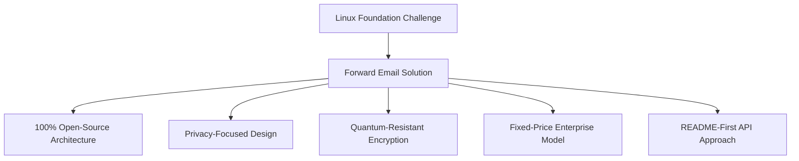
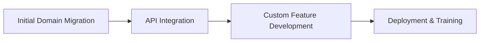

# Vaka Çalışması: Linux Vakfı, Yönlendirilmiş E-posta ile 250'den Fazla Alanda E-posta Yönetimini Nasıl Optimize Ediyor? {#case-study-how-the-linux-foundation-optimizes-email-management-across-250-domains-with-forward-email}


## İçindekiler {#table-of-contents}

* [giriiş](#introduction)
* [Meydan Okuma](#the-challenge)
* [Çözüm](#the-solution)
  * [%100 Açık Kaynaklı Mimari](#100-open-source-architecture)
  * [Gizlilik Odaklı Tasarım](#privacy-focused-design)
  * [Kurumsal Düzeyde Güvenlik](#enterprise-grade-security)
  * [Sabit Fiyatlı İşletme Modeli](#fixed-price-enterprise-model)
  * [Geliştirici Dostu API](#developer-friendly-api)
* [Uygulama Süreci](#implementation-process)
* [Sonuçlar ve Faydalar](#results-and-benefits)
  * [Verimlilik İyileştirmeleri](#efficiency-improvements)
  * [Maliyet Yönetimi](#cost-management)
  * [Gelişmiş Güvenlik](#enhanced-security)
  * [Geliştirilmiş Kullanıcı Deneyimi](#improved-user-experience)
* [Çözüm](#conclusion)
* [Referanslar](#references)

## Giriş {#introduction}

[Linux Vakfı](https://en.wikipedia.org/wiki/Linux_Foundation), [linux.com](https://www.linux.com/) ve [jQuery.com](https://jquery.com/) dahil olmak üzere 250'den fazla alanda 900'den fazla açık kaynaklı projeyi yönetiyor. Bu vaka çalışması, açık kaynak ilkeleriyle uyumu korurken e-posta yönetimini kolaylaştırmak için [E-postayı İlet](https://forwardemail.net) ile nasıl ortaklık kurduklarını inceliyor.

## Meydan Okuma {#the-challenge}

Linux Vakfı e-posta yönetimi konusunda çeşitli zorluklarla karşı karşıyaydı:

* **Ölçek**: Farklı gereksinimlere sahip 250'den fazla alan adında e-posta yönetimi
* **İdari Yük**: DNS kayıtlarını yapılandırma, yönlendirme kurallarını sürdürme ve destek taleplerine yanıt verme
* **Güvenlik**: Gizliliği korurken e-posta tabanlı tehditlere karşı koruma
* **Maliyet**: Geleneksel kullanıcı başına çözümler, ölçeklerinde aşırı pahalıydı
* **Açık Kaynak Uyumlaştırması**: Açık kaynak değerlerine olan bağlılıklarını karşılayan çözümlere ihtiyaç duyuluyordu

[Kanonik/Ubuntu](https://forwardemail.net/blog/docs/canonical-ubuntu-email-enterprise-case-study)'ın birden fazla dağıtım alanıyla karşılaştığı zorluklara benzer şekilde, Linux Vakfı'nın da birleşik bir yönetim yaklaşımını korurken çeşitli projeleri yönetebilecek bir çözüme ihtiyacı vardı.

## Çözümü {#the-solution}

Forward Email, temel özellikleriyle kapsamlı bir çözüm sağladı:



### %100 Açık Kaynaklı Mimari {#100-open-source-architecture}

Tamamen açık kaynaklı bir platforma (hem ön uç hem de arka uç) sahip tek e-posta hizmeti olan Forward Email, Linux Vakfı'nın açık kaynak ilkelerine olan bağlılığıyla mükemmel bir şekilde örtüşüyordu. [Kanonik/Ubuntu](https://forwardemail.net/blog/docs/canonical-ubuntu-email-enterprise-case-study) uygulamamıza benzer şekilde, bu şeffaflık, teknik ekiplerinin güvenlik uygulamalarını doğrulamasına ve hatta iyileştirmelere katkıda bulunmasına olanak sağladı.

### Gizlilik Odaklı Tasarım {#privacy-focused-design}

Forward Email'in sıkı [gizlilik politikaları](https://forwardemail.net/privacy)'ı, Linux Vakfı'nın ihtiyaç duyduğu güvenliği sağladı. [e-posta gizlilik koruması teknik uygulaması](https://forwardemail.net/blog/docs/email-privacy-protection-technical-implementation)'imiz ise, e-posta içeriğinin kaydedilmesi veya taranması olmadan, tüm iletişimlerin tasarım gereği güvenli kalmasını sağlar.

Teknik uygulama dokümanlarımızda ayrıntılı olarak açıklandığı gibi:

> "Tüm sistemimizi, e-postalarınızın yalnızca size ait olduğu ilkesi üzerine kurduk. Reklam veya yapay zeka eğitimi için e-posta içeriklerini tarayan diğer sağlayıcıların aksine, tüm iletişimlerin gizliliğini koruyan katı bir kayıt tutmama ve taramama politikası uyguluyoruz."

### Kurumsal Düzeyde Güvenlik {#enterprise-grade-security}

[kuantum dirençli şifreleme](https://forwardemail.net/blog/docs/best-quantum-safe-encrypted-email-service)'ın ChaCha20-Poly1305 kullanılarak uygulanması, her posta kutusunun ayrı bir şifreli dosya olmasıyla en üst düzey güvenlik sağladı. Bu yaklaşım, kuantum bilgisayarlar mevcut şifreleme standartlarını aşabilecek kapasiteye ulaşsa bile, Linux Vakfı'nın iletişimlerinin güvenli kalacağını garanti altına alıyor.

### Sabit Fiyatlı Kurumsal Model {#fixed-price-enterprise-model}

Forward Email'in [kurumsal fiyatlandırma](https://forwardemail.net/pricing) çözümü, alan adı veya kullanıcıdan bağımsız olarak sabit bir aylık maliyet sağladı. Bu yaklaşım, [üniversite mezunları e-posta vaka çalışması](https://forwardemail.net/blog/docs/alumni-email-forwarding-university-case-study) çözümümüzde de görüldüğü gibi, diğer büyük kuruluşlar için de önemli maliyet tasarrufları sağladı. Bu çözümde kurumlar, geleneksel kullanıcı başına e-posta çözümlerine kıyasla %99'a varan tasarruf sağladı.

### Geliştirici Dostu API {#developer-friendly-api}

[README-önce yaklaşımı](https://tom.preston-werner.com/2010/08/23/readme-driven-development)'ı takip eden ve [Stripe'ın RESTful API tasarımı](https://amberonrails.com/building-stripes-api)'den ilham alan Forward Email'in [API](https://forwardemail.net/api) çözümü, Linux Foundation'ın Proje Kontrol Merkezi ile derin entegrasyon sağladı. Bu entegrasyon, çeşitli proje portföylerindeki e-posta yönetimini otomatikleştirmek için hayati önem taşıyordu.

## Uygulama Süreci {#implementation-process}

Uygulama yapılandırılmış bir yaklaşımla gerçekleştirildi:



1. **İlk Alan Adı Taşıma**: DNS kayıtlarını yapılandırma, SPF/DKIM/DMARC'ı ayarlama, mevcut kuralları taşıma

   ```sh
   # Example DNS configuration for a Linux Foundation domain
   domain.org.    600    IN    MX    10 mx1.forwardemail.net.
   domain.org.    600    IN    MX    10 mx2.forwardemail.net.
   domain.org.    600    IN    TXT   "v=spf1 include:spf.forwardemail.net -all"
   ```

2. **API Entegrasyonu**: Self servis yönetimi için Proje Kontrol Merkezi'ne bağlanma

3. **Özel Özellik Geliştirme**: Çoklu alan yönetimi, raporlama, güvenlik politikaları

[üniversite mezunları e-posta sistemleri](https://forwardemail.net/blog/docs/alumni-email-forwarding-university-case-study) için özel çözümler oluşturduğumuz gibi, Linux Vakfı ile yakın bir şekilde çalışarak, özellikle onların çoklu proje ortamı için özellikler geliştirdik (bunlar aynı zamanda %100 açık kaynaklıdır, böylece herkes bundan faydalanabilir).

## Sonuçlar ve Faydalar {#results-and-benefits}

Uygulama önemli faydalar sağladı:

### Verimlilik İyileştirmeleri {#efficiency-improvements}

* Azaltılmış idari yük
* Daha hızlı proje başlatma (günlerden dakikalara)
* 250'den fazla alanın tamamının tek bir arayüzden yönetimi kolaylaştırıldı

### Maliyet Yönetimi {#cost-management}

* Alan adı veya kullanıcı sayısındaki büyümeden bağımsız olarak sabit fiyatlandırma
* Kullanıcı başına lisans ücretlerinin ortadan kaldırılması
* [üniversite vaka çalışması](https://forwardemail.net/blog/docs/alumni-email-forwarding-university-case-study)'ımıza benzer şekilde, Linux Vakfı geleneksel çözümlere kıyasla önemli maliyet tasarrufları elde etti

### Gelişmiş Güvenlik {#enhanced-security}

* Tüm etki alanlarında kuantum dirençli şifreleme
* Sahtecilik ve kimlik avını önleyen kapsamlı e-posta kimlik doğrulaması
* [güvenlik özellikleri](https://forwardemail.net/security) aracılığıyla güvenlik testleri ve uygulamaları
* [teknik uygulama](https://forwardemail.net/blog/docs/email-privacy-protection-technical-implementation) aracılığıyla gizlilik koruması

### Geliştirilmiş Kullanıcı Deneyimi {#improved-user-experience}

* Proje yöneticileri için self servis e-posta yönetimi
* Tüm Linux Foundation etki alanlarında tutarlı deneyim
* Güçlü kimlik doğrulamasıyla güvenilir e-posta teslimi

## Sonuç {#conclusion}

Linux Foundation'ın Forward Email ile ortaklığı, kuruluşların temel değerleriyle uyum içinde çalışırken karmaşık e-posta yönetimi zorluklarının üstesinden nasıl gelebileceklerini göstermektedir. Açık kaynak ilkelerine, gizliliğe ve güvenliğe öncelik veren bir çözüm seçerek Linux Foundation, e-posta yönetimini idari bir yükten stratejik bir avantaja dönüştürmüştür.

Hem [Kanonik/Ubuntu](https://forwardemail.net/blog/docs/canonical-ubuntu-email-enterprise-case-study) hem de [büyük üniversiteler](https://forwardemail.net/blog/docs/alumni-email-forwarding-university-case-study) ile yaptığımız çalışmada görüldüğü üzere, karmaşık alan portföylerine sahip kuruluşlar, Forward Email'in kurumsal çözümü sayesinde verimlilik, güvenlik ve maliyet yönetiminde önemli iyileştirmeler elde edebilirler.

Forward Email'in kuruluşunuzun birden fazla etki alanındaki e-postaları yönetmesine nasıl yardımcı olabileceği hakkında daha fazla bilgi için [forwardemail.net](https://forwardemail.net) adresini ziyaret edin veya ayrıntılı [dokümantasyon](https://forwardemail.net/email-api) ve [rehberler](https://forwardemail.net/guides) sayfalarımızı inceleyin.

## Başvuruları {#references}

* Linux Vakfı. (2025). "Projelere Göz Atın." <https://www.linuxfoundation.org/projects> adresinden alındı
* Wikipedia. (2025). "Linux Vakfı." <https://en.wikipedia.org/wiki/Linux_Foundation> adresinden alındı