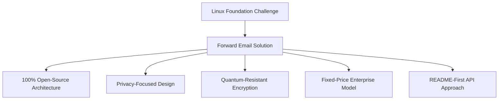
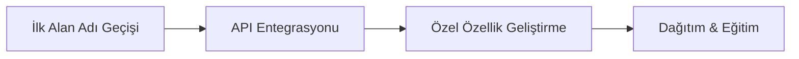

# Vaka Çalışması: Linux Foundation'ın 250+ Alan Adı Genelinde E-posta Yönetimini Forward Email ile Nasıl Optimize Ettiği {#case-study-how-the-linux-foundation-optimizes-email-management-across-250-domains-with-forward-email}


## İçindekiler {#table-of-contents}

* [Giriş](#introduction)
* [Zorluk](#the-challenge)
* [Çözüm](#the-solution)
  * [%100 Açık Kaynak Mimari](#100-open-source-architecture)
  * [Gizlilik Odaklı Tasarım](#privacy-focused-design)
  * [Kurumsal Düzeyde Güvenlik](#enterprise-grade-security)
  * [Sabit Fiyatlı Kurumsal Model](#fixed-price-enterprise-model)
  * [Geliştirici Dostu API](#developer-friendly-api)
* [Uygulama Süreci](#implementation-process)
* [Sonuçlar ve Faydalar](#results-and-benefits)
  * [Verimlilik İyileştirmeleri](#efficiency-improvements)
  * [Maliyet Yönetimi](#cost-management)
  * [Gelişmiş Güvenlik](#enhanced-security)
  * [İyileştirilmiş Kullanıcı Deneyimi](#improved-user-experience)
* [Sonuç](#conclusion)
* [Referanslar](#references)


## Giriş {#introduction}

[Linux Foundation](https://en.wikipedia.org/wiki/Linux_Foundation), [linux.com](https://www.linux.com/) ve [jQuery.com](https://jquery.com/) dahil olmak üzere 250'den fazla alan adı genelinde 900'den fazla açık kaynak projesini yönetmektedir. Bu vaka çalışması, açık kaynak ilkeleriyle uyumlu kalarak e-posta yönetimini kolaylaştırmak için [Forward Email](https://forwardemail.net) ile nasıl ortaklık kurduklarını inceliyor.


## Zorluk {#the-challenge}

Linux Foundation, e-posta yönetimi konusunda birkaç zorlukla karşılaştı:

* **Ölçek**: Farklı gereksinimlere sahip 250'den fazla alan adı genelinde e-posta yönetimi
* **Yönetimsel Yük**: DNS kayıtlarının yapılandırılması, yönlendirme kurallarının sürdürülmesi ve destek taleplerine yanıt verilmesi
* **Güvenlik**: Gizliliği koruyarak e-posta tabanlı tehditlere karşı koruma sağlama
* **Maliyet**: Geleneksel kullanıcı başı çözümler ölçeklerinde çok maliyetliydi
* **Açık Kaynak Uyumu**: Açık kaynak değerlerine bağlılıklarını karşılayan çözümlere ihtiyaç duyulması

[Canonical/Ubuntu](https://forwardemail.net/blog/docs/canonical-ubuntu-email-enterprise-case-study) gibi çoklu dağıtım alan adlarıyla karşılaştıkları zorluklara benzer şekilde, Linux Foundation çeşitli projeleri yönetirken birleşik bir yönetim yaklaşımını sürdürebilecek bir çözüme ihtiyaç duyuyordu.


## Çözüm {#the-solution}

Forward Email, anahtar özelliklerle kapsamlı bir çözüm sundu:


```mermaid
graph TD
    A[Linux Foundation Challenge] --> B[Forward Email Solution]
    B --> C[100% Open-Source Architecture]
    B --> D[Privacy-Focused Design]
    B --> E[Quantum-Resistant Encryption]
    B --> F[Fixed-Price Enterprise Model]
    B --> G[README-First API Approach]
```

### %100 Açık Kaynak Mimari {#100-open-source-architecture}

Tamamen açık kaynaklı bir platforma (hem ön yüz hem arka uç) sahip tek e-posta servisi olarak Forward Email, Linux Foundation'ın açık kaynak ilkelerine bağlılığıyla mükemmel uyum sağladı. [Canonical/Ubuntu](https://forwardemail.net/blog/docs/canonical-ubuntu-email-enterprise-case-study) ile gerçekleştirdiğimiz uygulamaya benzer şekilde, bu şeffaflık teknik ekiplerinin güvenlik uygulamalarını doğrulamasına ve hatta iyileştirmelere katkıda bulunmasına olanak tanıdı.

### Gizlilik Odaklı Tasarım {#privacy-focused-design}

Forward Email'in katı [gizlilik politikaları](https://forwardemail.net/privacy), Linux Foundation'ın ihtiyaç duyduğu güvenliği sağladı. Bizim [e-posta gizliliği koruma teknik uygulamamız](https://forwardemail.net/blog/docs/email-privacy-protection-technical-implementation), tüm iletişimlerin tasarım gereği güvenli kalmasını sağlar; e-posta içeriğinin kaydı veya taraması yapılmaz.

Teknik uygulama dokümantasyonumuzda detaylandırıldığı gibi:

> "Tüm sistemimizi, e-postalarınızın size ve sadece size ait olduğu prensibi etrafında inşa ettik. Reklam veya yapay zeka eğitimi için e-posta içeriğini tarayan diğer sağlayıcıların aksine, tüm iletişimlerin gizliliğini koruyan katı bir kayıt tutmama ve taramama politikası uyguluyoruz."
### Kurumsal Düzeyde Güvenlik {#enterprise-grade-security}

ChaCha20-Poly1305 kullanılarak gerçekleştirilen [kuantuma dayanıklı şifreleme](https://forwardemail.net/blog/docs/best-quantum-safe-encrypted-email-service) en son teknolojiyi sunmuş, her posta kutusunun ayrı bir şifreli dosya olması sağlanmıştır. Bu yaklaşım, kuantum bilgisayarlar mevcut şifreleme standartlarını kırabilecek hale gelse bile, Linux Vakfı'nın iletişimlerinin güvende kalmasını garanti eder.

### Sabit Fiyatlı Kurumsal Model {#fixed-price-enterprise-model}

Forward Email'in [kurumsal fiyatlandırması](https://forwardemail.net/pricing), alan adları veya kullanıcı sayısından bağımsız sabit aylık maliyet sunmuştur. Bu yaklaşım, diğer büyük kuruluşlar için önemli maliyet tasarrufları sağlamış olup, [üniversite mezun e-posta vaka çalışmamızda](https://forwardemail.net/blog/docs/alumni-email-forwarding-university-case-study) kurumların geleneksel kullanıcı başı e-posta çözümlerine kıyasla %99'a varan tasarruflar elde ettiği gösterilmiştir.

### Geliştirici Dostu API {#developer-friendly-api}

[README-öncelikli yaklaşım](https://tom.preston-werner.com/2010/08/23/readme-driven-development) ve [Stripe'ın RESTful API tasarımından](https://amberonrails.com/building-stripes-api) esinlenerek, Forward Email'in [API'si](https://forwardemail.net/api) Linux Vakfı'nın Proje Kontrol Merkezi ile derin entegrasyon sağlamıştır. Bu entegrasyon, çeşitli proje portföyleri genelinde e-posta yönetiminin otomatikleştirilmesi için kritik öneme sahip olmuştur.


## Uygulama Süreci {#implementation-process}

Uygulama yapılandırılmış bir yaklaşımı takip etmiştir:


```mermaid
flowchart LR
    A[İlk Alan Adı Geçişi] --> B[API Entegrasyonu]
    B --> C[Özel Özellik Geliştirme]
    C --> D[Dağıtım & Eğitim]
```

1. **İlk Alan Adı Geçişi**: DNS kayıtlarının yapılandırılması, SPF/DKIM/DMARC kurulumu, mevcut kuralların taşınması

   ```sh
   # Linux Vakfı alan adı için örnek DNS yapılandırması
   domain.org.    600    IN    MX    10 mx1.forwardemail.net.
   domain.org.    600    IN    MX    10 mx2.forwardemail.net.
   domain.org.    600    IN    TXT   "v=spf1 include:spf.forwardemail.net -all"
   ```

2. **API Entegrasyonu**: Proje Kontrol Merkezi ile self-servis yönetim bağlantısı

3. **Özel Özellik Geliştirme**: Çoklu alan adı yönetimi, raporlama, güvenlik politikaları

   Linux Vakfı ile yakın çalışarak, çoklu proje ortamları için (aynı zamanda %100 açık kaynaklı olan ve herkesin faydalanabileceği) özellikler geliştirdik; bu, [üniversite mezun e-posta sistemleri](https://forwardemail.net/blog/docs/alumni-email-forwarding-university-case-study) için oluşturduğumuz özel çözümlere benzer şekilde gerçekleşti.


## Sonuçlar ve Faydalar {#results-and-benefits}

Uygulama önemli faydalar sağlamıştır:

### Verimlilik Artışları {#efficiency-improvements}

* Yönetim yükünün azaltılması
* Proje başlatmanın hızlanması (günlerden dakikalara)
* 250+ alan adının tek bir arayüzden kolay yönetimi

### Maliyet Yönetimi {#cost-management}

* Alan adı veya kullanıcı sayısındaki artışa bakılmaksızın sabit fiyatlandırma
* Kullanıcı başı lisans ücretlerinin ortadan kaldırılması
* [Üniversite vaka çalışmamıza](https://forwardemail.net/blog/docs/alumni-email-forwarding-university-case-study) benzer şekilde, Linux Vakfı geleneksel çözümlere kıyasla önemli maliyet tasarrufları elde etti

### Gelişmiş Güvenlik {#enhanced-security}

* Tüm alan adlarında kuantuma dayanıklı şifreleme
* Sahtecilik ve oltalama saldırılarını önleyen kapsamlı e-posta doğrulama
* [güvenlik özellikleri](https://forwardemail.net/security) aracılığıyla güvenlik testleri ve uygulamaları
* [teknik uygulamamız](https://forwardemail.net/blog/docs/email-privacy-protection-technical-implementation) ile gizlilik koruması

### İyileştirilmiş Kullanıcı Deneyimi {#improved-user-experience}

* Proje yöneticileri için self-servis e-posta yönetimi
* Tüm Linux Vakfı alan adlarında tutarlı deneyim
* Güçlü doğrulama ile güvenilir e-posta teslimatı


## Sonuç {#conclusion}

Linux Vakfı'nın Forward Email ile ortaklığı, kuruluşların karmaşık e-posta yönetimi zorluklarını nasıl çözebileceğini ve temel değerleriyle uyumlu kalabileceğini göstermektedir. Açık kaynak ilkelerini, gizliliği ve güvenliği önceliklendiren bir çözüm seçerek, Linux Vakfı e-posta yönetimini idari bir yükten stratejik bir avantaja dönüştürmüştür.
Canonical/Ubuntu](https://forwardemail.net/blog/docs/canonical-ubuntu-email-enterprise-case-study) ve [büyük üniversiteler](https://forwardemail.net/blog/docs/alumni-email-forwarding-university-case-study) ile yaptığımız çalışmalarda görüldüğü gibi, karmaşık alan adı portföylerine sahip organizasyonlar, Forward Email'in kurumsal çözümü sayesinde verimlilik, güvenlik ve maliyet yönetiminde önemli iyileşmeler sağlayabilirler.

Forward Email'in organizasyonunuzun birden fazla alan adı üzerinden e-posta yönetimine nasıl yardımcı olabileceği hakkında daha fazla bilgi için [forwardemail.net](https://forwardemail.net) adresini ziyaret edin veya detaylı [dokümantasyonumuzu](https://forwardemail.net/email-api) ve [rehberlerimizi](https://forwardemail.net/guides) inceleyin.


## References {#references}

* Linux Foundation. (2025). "Browse Projects." Retrieved from <https://www.linuxfoundation.org/projects>
* Wikipedia. (2025). "Linux Foundation." Retrieved from <https://en.wikipedia.org/wiki/Linux_Foundation>
