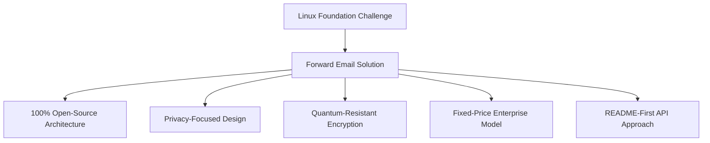
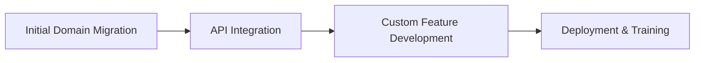

# Тематичне дослідження: Як Linux Foundation оптимізує управління електронною поштою в понад 250 доменах за допомогою пересилання електронної пошти {#case-study-how-the-linux-foundation-optimizes-email-management-across-250-domains-with-forward-email}


## Зміст {#table-of-contents}

* [Вступ](#introduction)
* [Виклик](#the-challenge)
* [Рішення](#the-solution)
  * [100% архітектура з відкритим кодом](#100-open-source-architecture)
  * [Дизайн, орієнтований на конфіденційність](#privacy-focused-design)
  * [Безпека корпоративного рівня](#enterprise-grade-security)
  * [Модель підприємства з фіксованою ціною](#fixed-price-enterprise-model)
  * [Зручний для розробників API](#developer-friendly-api)
* [Процес впровадження](#implementation-process)
* [Результати та переваги](#results-and-benefits)
  * [Підвищення ефективності](#efficiency-improvements)
  * [Управління витратами](#cost-management)
  * [Посилена безпека](#enhanced-security)
  * [Покращений користувацький досвід](#improved-user-experience)
* [Висновок](#conclusion)
* [Посилання](#references)

## Вступ {#introduction}

[Фонд Linux](https://en.wikipedia.org/wiki/Linux_Foundation) керує понад 900 проєктами з відкритим кодом у понад 250 доменах, включаючи [linux.com](https://www.linux.com/) та [jQuery.com](https://jquery.com/). У цьому тематичному дослідженні досліджується, як вони співпрацювали з [Переслати електронний лист](https://forwardemail.net) для оптимізації управління електронною поштою, зберігаючи при цьому відповідність принципам відкритого коду.

## Виклик {#the-challenge}

Фонд Linux зіткнувся з кількома проблемами управління електронною поштою:

* **Масштаб**: Керування електронною поштою в понад 250 доменах з різними вимогами
* **Адміністративне навантаження**: Налаштування DNS-записів, підтримка правил пересилання та відповіді на запити підтримки
* **Безпека**: Захист від загроз, пов'язаних з електронною поштою, з одночасним збереженням конфіденційності
* **Вартість**: Традиційні рішення для кожного користувача були непомірно дорогими для свого масштабу
* **Узгодження з відкритим кодом**: Потреба в рішеннях, що відповідають їхній відданості цінностям відкритого коду

Подібно до проблем, з якими зіткнувся [Канонічний/Ubuntu](https://forwardemail.net/blog/docs/canonical-ubuntu-email-enterprise-case-study) з кількома доменами розповсюдження, Linux Foundation потребував рішення, яке могло б обробляти різноманітні проекти, зберігаючи при цьому єдиний підхід до управління.

## Рішення {#the-solution}

Forward Email запропонував комплексне рішення з ключовими функціями:



### 100% архітектура з відкритим вихідним кодом {#100-open-source-architecture}

Як єдиний поштовий сервіс із повністю відкритою платформою (як фронтендом, так і серверною частиною), Forward Email ідеально відповідав зобов'язанням Linux Foundation дотримуватися принципів відкритого коду. Подібно до нашої реалізації з [Канонічний/Ubuntu](https://forwardemail.net/blog/docs/canonical-ubuntu-email-enterprise-case-study), ця прозорість дозволила їхній технічній команді перевірити реалізацію безпеки та навіть зробити внесок у покращення.

### Дизайн, орієнтований на конфіденційність {#privacy-focused-design}

Суворий параметр [політики конфіденційності](https://forwardemail.net/privacy) пересилання електронної пошти забезпечив безпеку, необхідну для Linux Foundation. Наш параметр [технічна реалізація захисту конфіденційності електронної пошти](https://forwardemail.net/blog/docs/email-privacy-protection-technical-implementation) гарантує, що всі комунікації залишаються захищеними за своєю природою, без реєстрації чи сканування вмісту електронної пошти.

Як детально описано в нашій документації з технічної реалізації:

> «Ми побудували всю нашу систему на принципі, що ваші електронні листи належать вам і тільки вам. На відміну від інших постачальників, які сканують вміст електронної пошти для реклами або навчання штучному інтелекту, ми дотримуємося суворої політики заборони реєстрації та сканування, яка зберігає конфіденційність усіх повідомлень».

### Безпека корпоративного рівня {#enterprise-grade-security}

Реалізація [квантово-стійке шифрування](https://forwardemail.net/blog/docs/best-quantum-safe-encrypted-email-service) з використанням ChaCha20-Poly1305 забезпечила найсучасніший захист, оскільки кожна поштова скринька була окремим зашифрованим файлом. Такий підхід гарантує, що навіть якщо квантові комп'ютери стануть здатними порушувати сучасні стандарти шифрування, зв'язок Linux Foundation залишатиметься безпечним.

### Модель підприємства з фіксованою ціною {#fixed-price-enterprise-model}

[ціноутворення для підприємств](https://forwardemail.net/pricing) для пересилання електронної пошти забезпечував фіксовану щомісячну плату незалежно від доменів чи користувачів. Такий підхід забезпечив значну економію коштів для інших великих організацій, як показано в нашому випадку [тематичне дослідження електронної пошти випускників університету](https://forwardemail.net/blog/docs/alumni-email-forwarding-university-case-study), де установи заощадили до 99% порівняно з традиційними рішеннями для електронної пошти з розрахунком на користувача.

### Зручний для розробників API {#developer-friendly-api}

Після [Підхід "спочатку README"](https://tom.preston-werner.com/2010/08/23/readme-driven-development) та натхненний [Дизайн RESTful API у Stripe](https://amberonrails.com/building-stripes-api), [API](https://forwardemail.net/api) від Forward Email забезпечив глибоку інтеграцію з Центром керування проектами Linux Foundation. Ця інтеграція була вирішальною для автоматизації управління електронною поштою в їхньому різноманітному портфоліо проектів.

## Процес впровадження {#implementation-process}

Впровадження відбувалося за структурованим підходом:



1. **Початкова міграція домену**: налаштування DNS-записів, налаштування SPF/DKIM/DMARC, перенесення існуючих правил

   ```sh
   # Example DNS configuration for a Linux Foundation domain
   domain.org.    600    IN    MX    10 mx1.forwardemail.net.
   domain.org.    600    IN    MX    10 mx2.forwardemail.net.
   domain.org.    600    IN    TXT   "v=spf1 include:spf.forwardemail.net -all"
   ```

2. **Інтеграція API**: Підключення до Центру керування проектами для самостійного керування

3. **Розробка користувацьких функцій**: керування кількома доменами, звітність, політики безпеки

Ми тісно співпрацювали з Linux Foundation для розробки функцій (які також є повністю відкритими, щоб кожен міг скористатися ними) спеціально для їхнього багатопроектного середовища, подібно до того, як ми створювали власні рішення для [системи електронної пошти випускників університетів](https://forwardemail.net/blog/docs/alumni-email-forwarding-university-case-study).

## Результати та переваги {#results-and-benefits}

Впровадження принесло значні переваги:

### Підвищення ефективності {#efficiency-improvements}

* Зменшення адміністративних витрат
* Швидше впровадження проекту (з кількох днів до кількох хвилин)
* Оптимізоване керування всіма 250+ доменами з єдиного інтерфейсу

### Управління витратами {#cost-management}

* Фіксоване ціноутворення незалежно від зростання кількості доменів або користувачів
* Скасування ліцензійних зборів за кожного користувача
* Подібно до нашого [тематичне дослідження університету](https://forwardemail.net/blog/docs/alumni-email-forwarding-university-case-study), Linux Foundation досяг значної економії коштів порівняно з традиційними рішеннями

### Посилена безпека {#enhanced-security}

* Квантово-стійке шифрування на всіх доменах
* Комплексна автентифікація електронної пошти, що запобігає спуфінгу та фішингу
* Тестування та методи безпеки через [функції безпеки](https://forwardemail.net/security)
* Захист конфіденційності через наш [технічна реалізація](https://forwardemail.net/blog/docs/email-privacy-protection-technical-implementation)

### Покращений користувацький досвід {#improved-user-experience}

* Самостійне керування електронною поштою для адміністраторів проектів
* Однорідний досвід роботи на всіх доменах Linux Foundation
* Надійна доставка електронної пошти з надійною автентифікацією

## Висновок {#conclusion}

Партнерство Linux Foundation з Forward Email демонструє, як організації можуть вирішувати складні проблеми управління електронною поштою, зберігаючи при цьому відповідність своїм основним цінностям. Обравши рішення, яке надає пріоритет принципам відкритого коду, конфіденційності та безпеці, Linux Foundation перетворив управління електронною поштою з адміністративного тягаря на стратегічну перевагу.

Як видно з нашої роботи з [Канонічний/Ubuntu](https://forwardemail.net/blog/docs/canonical-ubuntu-email-enterprise-case-study) та [великі університети](https://forwardemail.net/blog/docs/alumni-email-forwarding-university-case-study), організації зі складними портфелями доменів можуть досягти значних покращень ефективності, безпеки та управління витратами за допомогою корпоративного рішення Forward Email.

Щоб отримати докладнішу інформацію про те, як функція «Пересилання електронної пошти» може допомогти вашій організації керувати електронною поштою в кількох доменах, відвідайте веб-сайт [forwardemail.net](https://forwardemail.net) або ознайомтеся з нашими детальними веб-сайтами [документація](https://forwardemail.net/email-api) та [путівники](https://forwardemail.net/guides).

## Посилання {#references}

* Linux Foundation. (2025). «Перегляд проектів». Отримано з <https://www.linuxfoundation.org/projects>
* Вікіпедія. (2025). «Linux Foundation». Отримано з <https://en.wikipedia.org/wiki/Linux_Foundation>