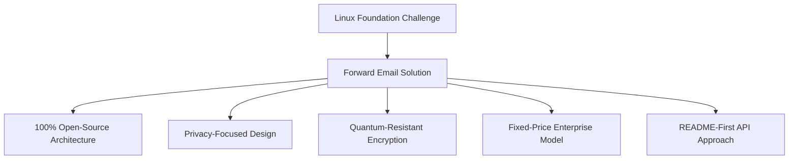
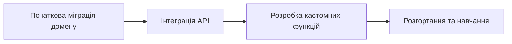

# Кейс: Як Linux Foundation оптимізує управління електронною поштою на понад 250 доменах за допомогою Forward Email {#case-study-how-the-linux-foundation-optimizes-email-management-across-250-domains-with-forward-email}


## Зміст {#table-of-contents}

* [Вступ](#introduction)
* [Виклик](#the-challenge)
* [Рішення](#the-solution)
  * [100% Відкрита архітектура](#100-open-source-architecture)
  * [Конструкція з орієнтацією на конфіденційність](#privacy-focused-design)
  * [Безпека корпоративного рівня](#enterprise-grade-security)
  * [Фіксована ціна для корпоративної моделі](#fixed-price-enterprise-model)
  * [API, дружній до розробників](#developer-friendly-api)
* [Процес впровадження](#implementation-process)
* [Результати та переваги](#results-and-benefits)
  * [Покращення ефективності](#efficiency-improvements)
  * [Управління витратами](#cost-management)
  * [Підвищена безпека](#enhanced-security)
  * [Покращений користувацький досвід](#improved-user-experience)
* [Висновок](#conclusion)
* [Джерела](#references)


## Вступ {#introduction}

[Linux Foundation](https://en.wikipedia.org/wiki/Linux_Foundation) керує понад 900 відкритими проєктами на більш ніж 250 доменах, включно з [linux.com](https://www.linux.com/) та [jQuery.com](https://jquery.com/). Цей кейс досліджує, як вони співпрацювали з [Forward Email](https://forwardemail.net) для оптимізації управління електронною поштою, зберігаючи при цьому відповідність принципам відкритого коду.


## Виклик {#the-challenge}

Linux Foundation зіткнулася з кількома викликами в управлінні електронною поштою:

* **Масштаб**: Управління поштою на понад 250 доменах з різними вимогами
* **Адміністративне навантаження**: Налаштування DNS-записів, підтримка правил переадресації та реагування на запити підтримки
* **Безпека**: Захист від загроз на основі електронної пошти при збереженні конфіденційності
* **Вартість**: Традиційні рішення з оплатою за користувача були надто дорогими при такому масштабі
* **Відповідність відкритому коду**: Потреба у рішеннях, що відповідають їхній відданості цінностям відкритого коду

Подібно до викликів, з якими зіткнулася [Canonical/Ubuntu](https://forwardemail.net/blog/docs/canonical-ubuntu-email-enterprise-case-study) з їхніми численними доменами дистрибутивів, Linux Foundation потрібне було рішення, яке могло б обробляти різноманітні проєкти, зберігаючи при цьому єдиний підхід до управління.


## Рішення {#the-solution}

Forward Email запропонував комплексне рішення з ключовими функціями:


```mermaid
graph TD
    A[Linux Foundation Challenge] --> B[Forward Email Solution]
    B --> C[100% Open-Source Architecture]
    B --> D[Privacy-Focused Design]
    B --> E[Quantum-Resistant Encryption]
    B --> F[Fixed-Price Enterprise Model]
    B --> G[README-First API Approach]
```

### 100% Відкрита архітектура {#100-open-source-architecture}

Як єдиний сервіс електронної пошти з повністю відкритою платформою (як фронтенд, так і бекенд), Forward Email ідеально відповідав відданості Linux Foundation принципам відкритого коду. Подібно до нашої реалізації з [Canonical/Ubuntu](https://forwardemail.net/blog/docs/canonical-ubuntu-email-enterprise-case-study), ця прозорість дозволила їхній технічній команді перевіряти реалізації безпеки та навіть вносити покращення.

### Конструкція з орієнтацією на конфіденційність {#privacy-focused-design}

Жорсткі [політики конфіденційності](https://forwardemail.net/privacy) Forward Email забезпечили безпеку, необхідну Linux Foundation. Наша [технічна реалізація захисту конфіденційності електронної пошти](https://forwardemail.net/blog/docs/email-privacy-protection-technical-implementation) гарантує, що всі комунікації залишаються безпечними за замовчуванням, без логування чи сканування вмісту листів.

Як детально описано в нашій технічній документації:

> "Ми побудували всю нашу систему на принципі, що ваші електронні листи належать вам і тільки вам. На відміну від інших провайдерів, які сканують вміст листів для реклами або навчання ШІ, ми дотримуємося суворої політики без логування та без сканування, що зберігає конфіденційність усіх комунікацій."
### Безпека корпоративного рівня {#enterprise-grade-security}

Впровадження [квантово-стійкого шифрування](https://forwardemail.net/blog/docs/best-quantum-safe-encrypted-email-service) з використанням ChaCha20-Poly1305 забезпечило передові засоби безпеки, при цьому кожна поштова скринька була окремим зашифрованим файлом. Такий підхід гарантує, що навіть якщо квантові комп’ютери стануть здатними зламувати сучасні стандарти шифрування, комунікації Linux Foundation залишаться захищеними.

### Фіксована ціна для корпоративної моделі {#fixed-price-enterprise-model}

[Корпоративне ціноутворення](https://forwardemail.net/pricing) Forward Email передбачає фіксовану місячну вартість незалежно від кількості доменів чи користувачів. Цей підхід забезпечив значну економію для інших великих організацій, як показано у нашому [кейсі з електронною поштою для випускників університету](https://forwardemail.net/blog/docs/alumni-email-forwarding-university-case-study), де установи заощадили до 99% у порівнянні з традиційними рішеннями з оплатою за користувача.

### API, дружній до розробників {#developer-friendly-api}

Дотримуючись [підходу README-перш за все](https://tom.preston-werner.com/2010/08/23/readme-driven-development) та надихаючись [RESTful API дизайном Stripe](https://amberonrails.com/building-stripes-api), [API](https://forwardemail.net/api) Forward Email дозволив глибоку інтеграцію з Project Control Center Linux Foundation. Ця інтеграція була ключовою для автоматизації управління електронною поштою в їхньому різноманітному портфелі проектів.


## Процес впровадження {#implementation-process}

Впровадження відбувалося за структурованим підходом:


```mermaid
flowchart LR
    A[Початкова міграція домену] --> B[Інтеграція API]
    B --> C[Розробка кастомних функцій]
    C --> D[Розгортання та навчання]
```

1. **Початкова міграція домену**: налаштування DNS-записів, встановлення SPF/DKIM/DMARC, міграція існуючих правил

   ```sh
   # Приклад конфігурації DNS для домену Linux Foundation
   domain.org.    600    IN    MX    10 mx1.forwardemail.net.
   domain.org.    600    IN    MX    10 mx2.forwardemail.net.
   domain.org.    600    IN    TXT   "v=spf1 include:spf.forwardemail.net -all"
   ```

2. **Інтеграція API**: підключення до Project Control Center для самообслуговування

3. **Розробка кастомних функцій**: управління кількома доменами, звітність, політики безпеки

   Ми тісно співпрацювали з Linux Foundation для розробки функцій (які також є 100% відкритим кодом, щоб усі могли ними користуватися) спеціально для їхнього мультипроектного середовища, подібно до того, як ми створювали кастомні рішення для [систем електронної пошти випускників університетів](https://forwardemail.net/blog/docs/alumni-email-forwarding-university-case-study).


## Результати та переваги {#results-and-benefits}

Впровадження принесло значні переваги:

### Покращення ефективності {#efficiency-improvements}

* Зменшення адміністративного навантаження
* Швидше підключення проектів (з днів до хвилин)
* Оптимізоване управління понад 250 доменами з єдиного інтерфейсу

### Управління витратами {#cost-management}

* Фіксована ціна незалежно від зростання доменів чи користувачів
* Відсутність ліцензійних зборів за користувача
* Подібно до нашого [кейсу університету](https://forwardemail.net/blog/docs/alumni-email-forwarding-university-case-study), Linux Foundation досягла значної економії порівняно з традиційними рішеннями

### Підвищена безпека {#enhanced-security}

* Квантово-стійке шифрування для всіх доменів
* Комплексна автентифікація електронної пошти, що запобігає спуфінгу та фішингу
* Тестування безпеки та практики через [функції безпеки](https://forwardemail.net/security)
* Захист приватності через нашу [технічну реалізацію](https://forwardemail.net/blog/docs/email-privacy-protection-technical-implementation)

### Покращений користувацький досвід {#improved-user-experience}

* Самообслуговування електронної пошти для адміністраторів проектів
* Послідовний досвід на всіх доменах Linux Foundation
* Надійна доставка електронної пошти з міцною автентифікацією


## Висновок {#conclusion}

Партнерство Linux Foundation з Forward Email демонструє, як організації можуть вирішувати складні завдання управління електронною поштою, зберігаючи відповідність своїм основним цінностям. Обравши рішення, яке ставить на перше місце принципи відкритого коду, приватність і безпеку, Linux Foundation перетворила управління електронною поштою з адміністративного тягаря на стратегічну перевагу.
Як показано на нашій роботі з [Canonical/Ubuntu](https://forwardemail.net/blog/docs/canonical-ubuntu-email-enterprise-case-study) та [провідними університетами](https://forwardemail.net/blog/docs/alumni-email-forwarding-university-case-study), організації з комплексними портфелями доменів можуть досягти значних покращень у ефективності, безпеці та управлінні витратами завдяки корпоративному рішенню Forward Email.

Для отримання додаткової інформації про те, як Forward Email може допомогти вашій організації керувати електронною поштою на кількох доменах, відвідайте [forwardemail.net](https://forwardemail.net) або ознайомтеся з нашою детальною [документацією](https://forwardemail.net/email-api) та [посібниками](https://forwardemail.net/guides).


## Посилання {#references}

* Linux Foundation. (2025). "Browse Projects." Отримано з <https://www.linuxfoundation.org/projects>
* Wikipedia. (2025). "Linux Foundation." Отримано з <https://en.wikipedia.org/wiki/Linux_Foundation>
