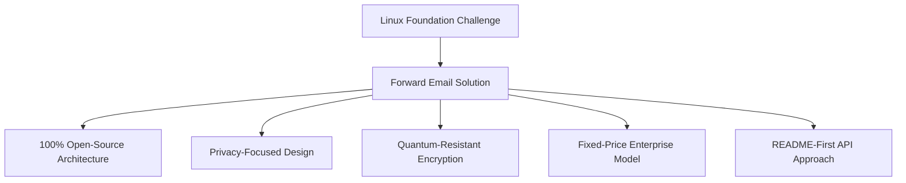
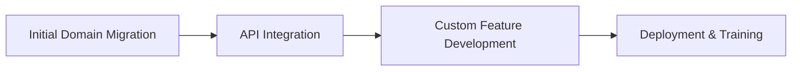

# Nghiên cứu điển hình: Cách Linux Foundation tối ưu hóa việc quản lý email trên hơn 250 tên miền bằng tính năng chuyển tiếp email {#case-study-how-the-linux-foundation-optimizes-email-management-across-250-domains-with-forward-email}


## Mục lục {#table-of-contents}

* [Giới thiệu](#introduction)
* [Thử thách](#the-challenge)
* [Giải pháp](#the-solution)
  * [Kiến trúc nguồn mở 100%](#100-open-source-architecture)
  * [Thiết kế tập trung vào quyền riêng tư](#privacy-focused-design)
  * [Bảo mật cấp doanh nghiệp](#enterprise-grade-security)
  * [Mô hình doanh nghiệp giá cố định](#fixed-price-enterprise-model)
  * [API thân thiện với nhà phát triển](#developer-friendly-api)
* [Quy trình thực hiện](#implementation-process)
* [Kết quả và lợi ích](#results-and-benefits)
  * [Cải thiện hiệu quả](#efficiency-improvements)
  * [Quản lý chi phí](#cost-management)
  * [Tăng cường bảo mật](#enhanced-security)
  * [Cải thiện trải nghiệm người dùng](#improved-user-experience)
* [Phần kết luận](#conclusion)
* [Tài liệu tham khảo](#references)

## Giới thiệu {#introduction}

[Quỹ Linux](https://en.wikipedia.org/wiki/Linux_Foundation) quản lý hơn 900 dự án nguồn mở trên hơn 250 miền, bao gồm [linux.com](https://www.linux.com/) và [jQuery.com](https://jquery.com/). Nghiên cứu điển hình này khám phá cách họ hợp tác với [Chuyển tiếp Email](https://forwardemail.net) để hợp lý hóa việc quản lý email trong khi vẫn tuân thủ các nguyên tắc nguồn mở.

## Thử thách {#the-challenge}

Quỹ Linux phải đối mặt với một số thách thức trong việc quản lý email:

* **Quy mô**: Quản lý email trên hơn 250 tên miền với các yêu cầu khác nhau
* **Gánh nặng quản trị**: Cấu hình bản ghi DNS, duy trì quy tắc chuyển tiếp và phản hồi yêu cầu hỗ trợ
* **Bảo mật**: Bảo vệ khỏi các mối đe dọa dựa trên email trong khi vẫn duy trì quyền riêng tư
* **Chi phí**: Các giải pháp truyền thống cho mỗi người dùng có chi phí quá cao so với quy mô của chúng
* **Tương thích Nguồn mở**: Cần có các giải pháp phù hợp với cam kết của họ đối với các giá trị nguồn mở

Tương tự như những thách thức mà [Canonical/Ubuntu](https://forwardemail.net/blog/docs/canonical-ubuntu-email-enterprise-case-study) phải đối mặt với nhiều miền phân phối, Linux Foundation cần một giải pháp có thể xử lý nhiều dự án khác nhau trong khi vẫn duy trì phương pháp quản lý thống nhất.

## Giải pháp {#the-solution}

Forward Email cung cấp giải pháp toàn diện với các tính năng chính:



### Kiến trúc nguồn mở 100% {#100-open-source-architecture}

Là dịch vụ email duy nhất có nền tảng mã nguồn mở hoàn toàn (cả front-end và back-end), Forward Email hoàn toàn phù hợp với cam kết của Linux Foundation về các nguyên tắc mã nguồn mở. Tương tự như việc triển khai [Canonical/Ubuntu](https://forwardemail.net/blog/docs/canonical-ubuntu-email-enterprise-case-study) của chúng tôi, tính minh bạch này cho phép đội ngũ kỹ thuật của họ xác minh các triển khai bảo mật và thậm chí đóng góp các cải tiến.

### Thiết kế tập trung vào quyền riêng tư {#privacy-focused-design}

[chính sách bảo mật](https://forwardemail.net/privacy) nghiêm ngặt của Forward Email cung cấp khả năng bảo mật mà Linux Foundation yêu cầu. [triển khai kỹ thuật bảo vệ quyền riêng tư email](https://forwardemail.net/blog/docs/email-privacy-protection-technical-implementation) của chúng tôi đảm bảo mọi thông tin liên lạc đều được bảo mật theo thiết kế, không ghi nhật ký hoặc quét nội dung email.

Như đã nêu chi tiết trong tài liệu triển khai kỹ thuật của chúng tôi:

> "Chúng tôi xây dựng toàn bộ hệ thống dựa trên nguyên tắc email của bạn thuộc về bạn và chỉ bạn mà thôi. Không giống như các nhà cung cấp khác quét nội dung email để quảng cáo hoặc đào tạo AI, chúng tôi duy trì chính sách nghiêm ngặt không ghi nhật ký, không quét, giúp bảo mật mọi thông tin liên lạc."

### Bảo mật cấp doanh nghiệp {#enterprise-grade-security}

Việc triển khai [mã hóa chống lượng tử](https://forwardemail.net/blog/docs/best-quantum-safe-encrypted-email-service) bằng ChaCha20-Poly1305 mang lại khả năng bảo mật tiên tiến, với mỗi hộp thư là một tệp được mã hóa riêng biệt. Phương pháp này đảm bảo rằng ngay cả khi máy tính lượng tử có khả năng phá vỡ các tiêu chuẩn mã hóa hiện hành, thông tin liên lạc của Linux Foundation vẫn sẽ được bảo mật.

### Mô hình doanh nghiệp giá cố định {#fixed-price-enterprise-model}

[định giá doanh nghiệp](https://forwardemail.net/pricing) của Forward Email cung cấp chi phí cố định hàng tháng bất kể tên miền hay người dùng. Cách tiếp cận này đã mang lại khoản tiết kiệm chi phí đáng kể cho các tổ chức lớn khác, như đã được chứng minh trong [nghiên cứu điển hình về email cựu sinh viên đại học](https://forwardemail.net/blog/docs/alumni-email-forwarding-university-case-study) của chúng tôi, trong đó các tổ chức đã tiết kiệm tới 99% so với các giải pháp email theo người dùng truyền thống.

### API thân thiện với nhà phát triển {#developer-friendly-api}

Tiếp nối [Cách tiếp cận README đầu tiên](https://tom.preston-werner.com/2010/08/23/readme-driven-development) và lấy cảm hứng từ [Thiết kế RESTful API của Stripe](https://amberonrails.com/building-stripes-api), [API](https://forwardemail.net/api) của Forward Email đã cho phép tích hợp sâu với Trung tâm Kiểm soát Dự án của Linux Foundation. Sự tích hợp này rất quan trọng để tự động hóa việc quản lý email trên toàn bộ danh mục dự án đa dạng của họ.

## Quy trình triển khai {#implementation-process}

Việc triển khai được thực hiện theo phương pháp có cấu trúc:



1. **Di chuyển tên miền ban đầu**: Cấu hình bản ghi DNS, thiết lập SPF/DKIM/DMARC, di chuyển các quy tắc hiện có

   ```sh
   # Example DNS configuration for a Linux Foundation domain
   domain.org.    600    IN    MX    10 mx1.forwardemail.net.
   domain.org.    600    IN    MX    10 mx2.forwardemail.net.
   domain.org.    600    IN    TXT   "v=spf1 include:spf.forwardemail.net -all"
   ```

2. **Tích hợp API**: Kết nối với Trung tâm kiểm soát dự án để quản lý tự phục vụ

3. **Phát triển tính năng tùy chỉnh**: Quản lý đa miền, báo cáo, chính sách bảo mật

Chúng tôi đã hợp tác chặt chẽ với Linux Foundation để phát triển các tính năng (cũng là mã nguồn mở 100% để mọi người đều có thể hưởng lợi) dành riêng cho môi trường đa dự án của họ, tương tự như cách chúng tôi tạo ra các giải pháp tùy chỉnh cho [hệ thống email cựu sinh viên đại học](https://forwardemail.net/blog/docs/alumni-email-forwarding-university-case-study).

## Kết quả và Lợi ích {#results-and-benefits}

Việc triển khai mang lại những lợi ích đáng kể:

### Cải thiện hiệu quả {#efficiency-improvements}

* Giảm chi phí hành chính
* Triển khai dự án nhanh hơn (từ vài ngày xuống còn vài phút)
* Quản lý hợp lý hơn 250 tên miền từ một giao diện duy nhất

### Quản lý chi phí {#cost-management}

* Giá cố định bất kể sự tăng trưởng về tên miền hoặc người dùng
* Loại bỏ phí cấp phép cho mỗi người dùng
* Tương tự như [nghiên cứu điển hình của trường đại học](https://forwardemail.net/blog/docs/alumni-email-forwarding-university-case-study) của chúng tôi, Linux Foundation đã tiết kiệm được đáng kể chi phí so với các giải pháp truyền thống

### Bảo mật nâng cao {#enhanced-security}

* Mã hóa chống lượng tử trên tất cả các miền
* Xác thực email toàn diện, ngăn chặn giả mạo và lừa đảo
* Kiểm tra và thực hành bảo mật thông qua [các tính năng bảo mật](https://forwardemail.net/security)
* Bảo vệ quyền riêng tư thông qua [triển khai kỹ thuật](https://forwardemail.net/blog/docs/email-privacy-protection-technical-implementation)

### Cải thiện trải nghiệm người dùng {#improved-user-experience}

* Quản lý email tự phục vụ cho quản trị viên dự án
* Trải nghiệm nhất quán trên tất cả các miền của Linux Foundation
* Gửi email đáng tin cậy với xác thực mạnh mẽ

## Kết luận {#conclusion}

Quan hệ đối tác giữa Quỹ Linux và Forward Email cho thấy cách các tổ chức có thể giải quyết những thách thức quản lý email phức tạp mà vẫn duy trì sự nhất quán với các giá trị cốt lõi. Bằng cách lựa chọn một giải pháp ưu tiên các nguyên tắc nguồn mở, quyền riêng tư và bảo mật, Quỹ Linux đã biến việc quản lý email từ một gánh nặng hành chính thành một lợi thế chiến lược.

Như đã thấy trong công việc của chúng tôi với cả [Canonical/Ubuntu](https://forwardemail.net/blog/docs/canonical-ubuntu-email-enterprise-case-study) và [các trường đại học lớn](https://forwardemail.net/blog/docs/alumni-email-forwarding-university-case-study), các tổ chức có danh mục tên miền phức tạp có thể đạt được những cải tiến đáng kể về hiệu quả, bảo mật và quản lý chi phí thông qua giải pháp doanh nghiệp của Forward Email.

Để biết thêm thông tin về cách Forward Email có thể giúp tổ chức của bạn quản lý email trên nhiều miền, hãy truy cập [forwardemail.net](https://forwardemail.net) hoặc khám phá [tài liệu](https://forwardemail.net/email-api) và [hướng dẫn](https://forwardemail.net/guides) chi tiết của chúng tôi.

## Tham chiếu {#references}

* Quỹ Linux. (2025). "Duyệt qua các dự án." Lấy từ <https://www.linuxfoundation.org/projects>
* Wikipedia. (2025). "Quỹ Linux." Lấy từ <https://en.wikipedia.org/wiki/Linux_Foundation>