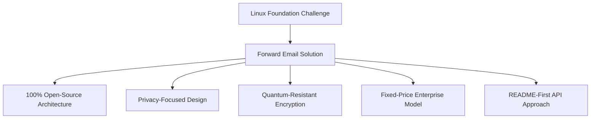
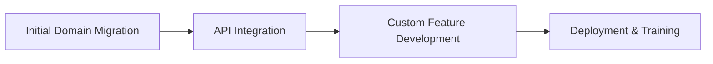

# Nghiên Cứu Tình Huống: Cách Linux Foundation Tối Ưu Quản Lý Email Trên Hơn 250 Miền với Forward Email {#case-study-how-the-linux-foundation-optimizes-email-management-across-250-domains-with-forward-email}


## Mục Lục {#table-of-contents}

* [Giới Thiệu](#introduction)
* [Thách Thức](#the-challenge)
* [Giải Pháp](#the-solution)
  * [Kiến Trúc 100% Mã Nguồn Mở](#100-open-source-architecture)
  * [Thiết Kế Tập Trung Vào Quyền Riêng Tư](#privacy-focused-design)
  * [Bảo Mật Cấp Doanh Nghiệp](#enterprise-grade-security)
  * [Mô Hình Doanh Nghiệp Giá Cố Định](#fixed-price-enterprise-model)
  * [API Thân Thiện Với Nhà Phát Triển](#developer-friendly-api)
* [Quy Trình Triển Khai](#implementation-process)
* [Kết Quả và Lợi Ích](#results-and-benefits)
  * [Cải Thiện Hiệu Suất](#efficiency-improvements)
  * [Quản Lý Chi Phí](#cost-management)
  * [Tăng Cường Bảo Mật](#enhanced-security)
  * [Cải Thiện Trải Nghiệm Người Dùng](#improved-user-experience)
* [Kết Luận](#conclusion)
* [Tài Liệu Tham Khảo](#references)


## Giới Thiệu {#introduction}

[Linux Foundation](https://en.wikipedia.org/wiki/Linux_Foundation) quản lý hơn 900 dự án mã nguồn mở trên hơn 250 miền, bao gồm [linux.com](https://www.linux.com/) và [jQuery.com](https://jquery.com/). Nghiên cứu tình huống này khám phá cách họ hợp tác với [Forward Email](https://forwardemail.net) để đơn giản hóa quản lý email đồng thời duy trì sự phù hợp với các nguyên tắc mã nguồn mở.


## Thách Thức {#the-challenge}

Linux Foundation đối mặt với nhiều thách thức trong quản lý email:

* **Quy Mô**: Quản lý email trên hơn 250 miền với các yêu cầu khác nhau
* **Gánh Nặng Quản Trị**: Cấu hình bản ghi DNS, duy trì các quy tắc chuyển tiếp và phản hồi các yêu cầu hỗ trợ
* **Bảo Mật**: Bảo vệ chống lại các mối đe dọa qua email đồng thời duy trì quyền riêng tư
* **Chi Phí**: Các giải pháp truyền thống tính phí theo người dùng quá đắt đỏ ở quy mô của họ
* **Phù Hợp Mã Nguồn Mở**: Cần các giải pháp phù hợp với cam kết giá trị mã nguồn mở của họ

Tương tự như các thách thức mà [Canonical/Ubuntu](https://forwardemail.net/blog/docs/canonical-ubuntu-email-enterprise-case-study) gặp phải với nhiều miền phân phối, Linux Foundation cần một giải pháp có thể xử lý các dự án đa dạng trong khi duy trì cách quản lý thống nhất.


## Giải Pháp {#the-solution}

Forward Email cung cấp một giải pháp toàn diện với các tính năng chính:


```mermaid
graph TD
    A[Linux Foundation Challenge] --> B[Forward Email Solution]
    B --> C[100% Open-Source Architecture]
    B --> D[Privacy-Focused Design]
    B --> E[Quantum-Resistant Encryption]
    B --> F[Fixed-Price Enterprise Model]
    B --> G[README-First API Approach]
```

### Kiến Trúc 100% Mã Nguồn Mở {#100-open-source-architecture}

Là dịch vụ email duy nhất với nền tảng hoàn toàn mã nguồn mở (cả frontend và backend), Forward Email hoàn toàn phù hợp với cam kết của Linux Foundation về các nguyên tắc mã nguồn mở. Tương tự như triển khai của chúng tôi với [Canonical/Ubuntu](https://forwardemail.net/blog/docs/canonical-ubuntu-email-enterprise-case-study), sự minh bạch này cho phép đội ngũ kỹ thuật của họ xác minh các triển khai bảo mật và thậm chí đóng góp các cải tiến.

### Thiết Kế Tập Trung Vào Quyền Riêng Tư {#privacy-focused-design}

Chính sách [quyền riêng tư](https://forwardemail.net/privacy) nghiêm ngặt của Forward Email cung cấp sự bảo mật mà Linux Foundation yêu cầu. [Triển khai kỹ thuật bảo vệ quyền riêng tư email](https://forwardemail.net/blog/docs/email-privacy-protection-technical-implementation) của chúng tôi đảm bảo tất cả các liên lạc được bảo mật theo thiết kế, không ghi nhật ký hay quét nội dung email.

Như được trình bày chi tiết trong tài liệu triển khai kỹ thuật của chúng tôi:

> "Chúng tôi đã xây dựng toàn bộ hệ thống dựa trên nguyên tắc rằng email của bạn thuộc về bạn và chỉ bạn mà thôi. Khác với các nhà cung cấp khác quét nội dung email để quảng cáo hoặc đào tạo AI, chúng tôi duy trì chính sách không ghi nhật ký, không quét nghiêm ngặt nhằm bảo vệ tính bảo mật của tất cả các liên lạc."
### Bảo Mật Cấp Doanh Nghiệp {#enterprise-grade-security}

Việc triển khai [mã hóa chống lượng tử](https://forwardemail.net/blog/docs/best-quantum-safe-encrypted-email-service) sử dụng ChaCha20-Poly1305 cung cấp bảo mật tiên tiến nhất, với mỗi hộp thư là một tệp mã hóa riêng biệt. Cách tiếp cận này đảm bảo rằng ngay cả khi máy tính lượng tử trở nên có khả năng phá vỡ các tiêu chuẩn mã hóa hiện tại, các liên lạc của Linux Foundation vẫn sẽ được bảo mật.

### Mô Hình Doanh Nghiệp Giá Cố Định {#fixed-price-enterprise-model}

[Giá doanh nghiệp](https://forwardemail.net/pricing) của Forward Email cung cấp chi phí hàng tháng cố định bất kể số lượng tên miền hoặc người dùng. Cách tiếp cận này đã mang lại tiết kiệm chi phí đáng kể cho các tổ chức lớn khác, như được chứng minh trong [nghiên cứu trường hợp email cựu sinh viên đại học](https://forwardemail.net/blog/docs/alumni-email-forwarding-university-case-study), nơi các tổ chức tiết kiệm tới 99% so với các giải pháp email truyền thống tính theo người dùng.

### API Thân Thiện Với Nhà Phát Triển {#developer-friendly-api}

Theo [phương pháp README-first](https://tom.preston-werner.com/2010/08/23/readme-driven-development) và lấy cảm hứng từ [thiết kế API RESTful của Stripe](https://amberonrails.com/building-stripes-api), [API](https://forwardemail.net/api) của Forward Email cho phép tích hợp sâu với Trung Tâm Kiểm Soát Dự Án của Linux Foundation. Sự tích hợp này rất quan trọng để tự động hóa quản lý email trên danh mục dự án đa dạng của họ.


## Quá Trình Triển Khai {#implementation-process}

Quá trình triển khai tuân theo một phương pháp có cấu trúc:


```mermaid
flowchart LR
    A[Initial Domain Migration] --> B[API Integration]
    B --> C[Custom Feature Development]
    C --> D[Deployment & Training]
```

1. **Di chuyển Tên Miền Ban Đầu**: Cấu hình bản ghi DNS, thiết lập SPF/DKIM/DMARC, di chuyển các quy tắc hiện có

   ```sh
   # Ví dụ cấu hình DNS cho một tên miền của Linux Foundation
   domain.org.    600    IN    MX    10 mx1.forwardemail.net.
   domain.org.    600    IN    MX    10 mx2.forwardemail.net.
   domain.org.    600    IN    TXT   "v=spf1 include:spf.forwardemail.net -all"
   ```

2. **Tích Hợp API**: Kết nối với Trung Tâm Kiểm Soát Dự Án để quản lý tự phục vụ

3. **Phát Triển Tính Năng Tùy Chỉnh**: Quản lý đa tên miền, báo cáo, chính sách bảo mật

   Chúng tôi đã làm việc chặt chẽ với Linux Foundation để phát triển các tính năng (cũng được mã nguồn mở 100% để mọi người đều có thể hưởng lợi) dành riêng cho môi trường đa dự án của họ, tương tự như cách chúng tôi tạo các giải pháp tùy chỉnh cho [hệ thống email cựu sinh viên đại học](https://forwardemail.net/blog/docs/alumni-email-forwarding-university-case-study).


## Kết Quả và Lợi Ích {#results-and-benefits}

Việc triển khai đã mang lại các lợi ích đáng kể:

### Cải Thiện Hiệu Suất {#efficiency-improvements}

* Giảm bớt gánh nặng quản trị
* Thời gian đưa dự án vào hoạt động nhanh hơn (từ vài ngày xuống còn vài phút)
* Quản lý tập trung hơn 250+ tên miền từ một giao diện duy nhất

### Quản Lý Chi Phí {#cost-management}

* Giá cố định bất kể sự tăng trưởng về tên miền hoặc người dùng
* Loại bỏ phí cấp phép theo người dùng
* Tương tự như [nghiên cứu trường hợp đại học](https://forwardemail.net/blog/docs/alumni-email-forwarding-university-case-study), Linux Foundation đã đạt được tiết kiệm chi phí đáng kể so với các giải pháp truyền thống

### Tăng Cường Bảo Mật {#enhanced-security}

* Mã hóa chống lượng tử trên tất cả các tên miền
* Xác thực email toàn diện ngăn chặn giả mạo và lừa đảo
* Kiểm tra và thực hành bảo mật qua các [tính năng bảo mật](https://forwardemail.net/security)
* Bảo vệ quyền riêng tư thông qua [triển khai kỹ thuật](https://forwardemail.net/blog/docs/email-privacy-protection-technical-implementation)

### Cải Thiện Trải Nghiệm Người Dùng {#improved-user-experience}

* Quản lý email tự phục vụ cho quản trị viên dự án
* Trải nghiệm nhất quán trên tất cả các tên miền của Linux Foundation
* Giao nhận email đáng tin cậy với xác thực mạnh mẽ


## Kết Luận {#conclusion}

Sự hợp tác giữa Linux Foundation và Forward Email cho thấy cách các tổ chức có thể giải quyết các thách thức quản lý email phức tạp trong khi vẫn duy trì sự phù hợp với các giá trị cốt lõi của họ. Bằng cách lựa chọn một giải pháp ưu tiên các nguyên tắc mã nguồn mở, quyền riêng tư và bảo mật, Linux Foundation đã biến việc quản lý email từ gánh nặng hành chính thành lợi thế chiến lược.
Như đã thấy trong công việc của chúng tôi với cả [Canonical/Ubuntu](https://forwardemail.net/blog/docs/canonical-ubuntu-email-enterprise-case-study) và [các trường đại học lớn](https://forwardemail.net/blog/docs/alumni-email-forwarding-university-case-study), các tổ chức có danh mục tên miền phức tạp có thể đạt được những cải tiến đáng kể về hiệu quả, bảo mật và quản lý chi phí thông qua giải pháp doanh nghiệp của Forward Email.

Để biết thêm thông tin về cách Forward Email có thể giúp tổ chức của bạn quản lý email trên nhiều tên miền, hãy truy cập [forwardemail.net](https://forwardemail.net) hoặc khám phá [tài liệu](https://forwardemail.net/email-api) và [hướng dẫn](https://forwardemail.net/guides) chi tiết của chúng tôi.


## Tài liệu tham khảo {#references}

* Linux Foundation. (2025). "Duyệt Dự Án." Truy cập từ <https://www.linuxfoundation.org/projects>
* Wikipedia. (2025). "Linux Foundation." Truy cập từ <https://en.wikipedia.org/wiki/Linux_Foundation>
