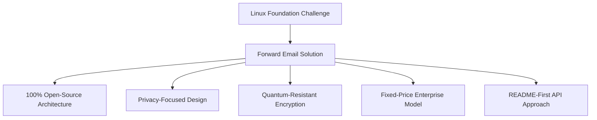
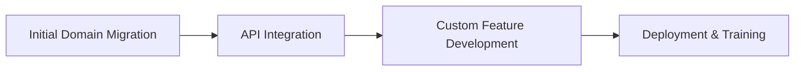

# 案例研究：Linux 基金会如何通过转发电子邮件优化 250 多个域的电子邮件管理 {#case-study-how-the-linux-foundation-optimizes-email-management-across-250-domains-with-forward-email}


## 目录 {#table-of-contents}

* [介绍](#introduction)
* [挑战](#the-challenge)
* [解决方案](#the-solution)
  * [100% 开源架构](#100-open-source-architecture)
  * [注重隐私的设计](#privacy-focused-design)
  * [企业级安全](#enterprise-grade-security)
  * [固定价格企业模式](#fixed-price-enterprise-model)
  * [开发人员友好的 API](#developer-friendly-api)
* [实施过程](#implementation-process)
* [结果和效益](#results-and-benefits)
  * [效率提升](#efficiency-improvements)
  * [成本管理](#cost-management)
  * [增强安全性](#enhanced-security)
  * [改善用户体验](#improved-user-experience)
* [结论](#conclusion)
* [参考](#references)

## 简介 {#introduction}

[Linux基金会](https://en.wikipedia.org/wiki/Linux_Foundation) 管理着 250 多个域名的 900 多个开源项目，其中包括 [linux.com](https://www.linux.com/) 和 [jQuery.com](https://jquery.com/)。本案例研究探讨了他们如何与 [转发电子邮件](https://forwardemail.net) 合作，在精简电子邮件管理的同时，遵循开源原则。

## 挑战 {#the-challenge}

Linux 基金会面临着几个电子邮件管理挑战：

* **规模**：管理 250 多个域名的电子邮件，满足不同的需求
* **管理负担**：配置 DNS 记录、维护转发规则以及响应支持请求
* **安全性**：在保护隐私的同时，防范电子邮件威胁
* **成本**：传统的按用户计费的解决方案在规模上成本过高
* **开源一致性**：需要符合其对开源价值观承诺的解决方案

与 [Canonical/Ubuntu](https://forwardemail.net/blog/docs/canonical-ubuntu-email-enterprise-case-study) 在其多个分发域中面临的挑战类似，Linux 基金会需要一种能够处理不同项目同时保持统一管理方法的解决方案。

## 解决方案 {#the-solution}

Forward Email 提供了具有以下主要功能的全面解决方案：



### 100% 开源架构 {#100-open-source-architecture}

作为唯一一家拥有完全开源平台（前端和后端）的电子邮件服务，Forward Email 完美契合了 Linux 基金会对开源原则的承诺。与我们在 [Canonical/Ubuntu](https://forwardemail.net/blog/docs/canonical-ubuntu-email-enterprise-case-study) 中的实现类似，这种透明性使其技术团队能够验证安全实现，甚至贡献改进。

### 注重隐私的设计 {#privacy-focused-design}

Forward Email 的严格 [隐私政策](https://forwardemail.net/privacy) 提供了 Linux 基金会所需的安全性。我们的 [电子邮件隐私保护技术实现](https://forwardemail.net/blog/docs/email-privacy-protection-technical-implementation) 确保所有通信在设计上保持安全，不会记录或扫描电子邮件内容。

正如我们的技术实施文档中详细说明的那样：

> “我们整个系统都围绕着这样一个原则构建：您的电子邮件只属于您。与其他为了广告或人工智能训练而扫描电子邮件内容的提供商不同，我们严格执行不记录、不扫描的政策，以保护所有通信的机密性。”

### 企业级安全性 {#enterprise-grade-security}

使用 ChaCha20-Poly1305 实现的 [抗量子加密](https://forwardemail.net/blog/docs/best-quantum-safe-encrypted-email-service) 提供了最先进的安全性，每个邮箱都是一个单独的加密文件。这种方法确保即使量子计算机能够破解当前的加密标准，Linux 基金会的通信仍能保持安全。

### 固定价格企业模型 {#fixed-price-enterprise-model}

Forward Email 的 [企业定价](https://forwardemail.net/pricing) 提供固定月费，不受域名或用户数量限制。这种方法已为其他大型机构显著节省成本，正如我们的 [大学校友电子邮件案例研究](https://forwardemail.net/blog/docs/alumni-email-forwarding-university-case-study) 所证明的那样，与传统的按用户计费的电子邮件解决方案相比，这些机构节省了高达 99% 的成本。

### 开发者友好型 API {#developer-friendly-api}

Forward Email 的 [API](https://forwardemail.net/api) 继承了 [README 优先方法](https://tom.preston-werner.com/2010/08/23/readme-driven-development) 的精髓，并受到 [Stripe 的 RESTful API 设计](https://amberonrails.com/building-stripes-api) 的启发，实现了与 Linux 基金会项目控制中心的深度集成。此次集成对于其多元化项目组合中电子邮件管理的自动化至关重要。

## 实施过程 {#implementation-process}

实施遵循结构化方法：



1. **初始域名迁移**：配置 DNS 记录、设置 SPF/DKIM/DMARC、迁移现有规则

   ```sh
   # Example DNS configuration for a Linux Foundation domain
   domain.org.    600    IN    MX    10 mx1.forwardemail.net.
   domain.org.    600    IN    MX    10 mx2.forwardemail.net.
   domain.org.    600    IN    TXT   "v=spf1 include:spf.forwardemail.net -all"
   ```

2. **API集成**：连接项目控制中心进行自助管理

3. **自定义功能开发**：多域管理、报告、安全策略

我们与 Linux 基金会密切合作，专门为他们的多项目环境开发功能（这些功能也是 100% 开源的，因此每个人都可以从中受益），类似于我们为 [大学校友电子邮件系统](https://forwardemail.net/blog/docs/alumni-email-forwarding-university-case-study) 创建自定义解决方案的方式。

## 结果和效益 {#results-and-benefits}

该实施带来了显著的效益：

### 效率提升 {#efficiency-improvements}

* 降低管理开销
* 加快项目启动速度（从几天缩短到几分钟）
* 通过单一界面简化 250 多个域名的管理

### 成本管理 {#cost-management}

* 无论域名或用户增长如何，价格均固定
* 取消每用户许可费用
* 与我们的 [大学案例研究](https://forwardemail.net/blog/docs/alumni-email-forwarding-university-case-study) 类似，Linux 基金会与传统解决方案相比实现了大幅成本节约

### 增强安全性 {#enhanced-security}

* 所有域名均采用抗量子加密
* 全面的电子邮件身份验证，有效防止欺骗和网络钓鱼
* 通过 [安全功能](https://forwardemail.net/security) 进行安全测试和实践
* 通过我们的 [技术实现](https://forwardemail.net/blog/docs/email-privacy-protection-technical-implementation) 保护隐私

### 改善用户体验 {#improved-user-experience}

* 为项目管理员提供自助式电子邮件管理
* 在所有 Linux 基金会域中提供一致的体验
* 通过强大的身份验证实现可靠的电子邮件递送

## 结论 {#conclusion}

Linux 基金会与 Forward Email 的合作，展现了企业如何在应对复杂的电子邮件管理挑战的同时，保持与自身核心价值观的一致性。通过选择优先考虑开源原则、隐私和安全的解决方案，Linux 基金会已将电子邮件管理从行政负担转化为战略优势。

正如我们在 [Canonical/Ubuntu](https://forwardemail.net/blog/docs/canonical-ubuntu-email-enterprise-case-study) 和 [各大高校](https://forwardemail.net/blog/docs/alumni-email-forwarding-university-case-study) 方面的工作所见，拥有复杂域名组合的组织可以通过 Forward Email 的企业解决方案在效率、安全性和成本管理方面实现显著的改进。

有关转发电子邮件如何帮助您的组织管理跨多个域的电子邮件的更多信息，请访问 [forwardemail.net](https://forwardemail.net) 或浏览我们详细的 [文档](https://forwardemail.net/email-api) 和 [指南](https://forwardemail.net/guides)。

## 参考文献 {#references}

* Linux 基金会。(2025)。“浏览项目”。摘自 <https://www.linuxfoundation.org/projects>
* 维基百科。(2025)。“Linux 基金会”。摘自 <https://en.wikipedia.org/wiki/Linux_Foundation>