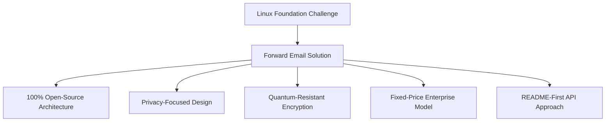
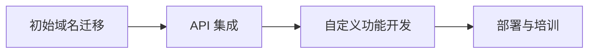

# 案例研究：Linux 基金会如何通过 Forward Email 优化 250+ 域名的邮件管理 {#case-study-how-the-linux-foundation-optimizes-email-management-across-250-domains-with-forward-email}


## 目录 {#table-of-contents}

* [介绍](#introduction)
* [挑战](#the-challenge)
* [解决方案](#the-solution)
  * [100% 开源架构](#100-open-source-architecture)
  * [注重隐私的设计](#privacy-focused-design)
  * [企业级安全](#enterprise-grade-security)
  * [固定价格企业模式](#fixed-price-enterprise-model)
  * [开发者友好 API](#developer-friendly-api)
* [实施过程](#implementation-process)
* [结果与收益](#results-and-benefits)
  * [效率提升](#efficiency-improvements)
  * [成本管理](#cost-management)
  * [增强的安全性](#enhanced-security)
  * [改善的用户体验](#improved-user-experience)
* [结论](#conclusion)
* [参考资料](#references)


## 介绍 {#introduction}

[Linux 基金会](https://en.wikipedia.org/wiki/Linux_Foundation) 管理着 250+ 个域名下的 900 多个开源项目，包括 [linux.com](https://www.linux.com/) 和 [jQuery.com](https://jquery.com/)。本案例研究探讨了他们如何与 [Forward Email](https://forwardemail.net) 合作，在保持开源原则一致性的同时，简化邮件管理。


## 挑战 {#the-challenge}

Linux 基金会面临多项邮件管理挑战：

* **规模**：管理 250+ 个域名的邮件，且需求各异
* **管理负担**：配置 DNS 记录、维护转发规则及响应支持请求
* **安全性**：防范基于邮件的威胁，同时保障隐私
* **成本**：传统的按用户计费方案在其规模下成本过高
* **开源一致性**：需要符合其开源价值观的解决方案

类似于 [Canonical/Ubuntu](https://forwardemail.net/blog/docs/canonical-ubuntu-email-enterprise-case-study) 在多个发行版域名管理中遇到的挑战，Linux 基金会需要一个能够处理多样项目且保持统一管理的方法。


## 解决方案 {#the-solution}

Forward Email 提供了包含以下关键特性的综合解决方案：


```mermaid
graph TD
    A[Linux Foundation Challenge] --> B[Forward Email Solution]
    B --> C[100% Open-Source Architecture]
    B --> D[Privacy-Focused Design]
    B --> E[Quantum-Resistant Encryption]
    B --> F[Fixed-Price Enterprise Model]
    B --> G[README-First API Approach]
```

### 100% 开源架构 {#100-open-source-architecture}

作为唯一拥有完全开源平台（前端和后端）的邮件服务，Forward Email 完美契合 Linux 基金会对开源原则的承诺。类似于我们与 [Canonical/Ubuntu](https://forwardemail.net/blog/docs/canonical-ubuntu-email-enterprise-case-study) 的合作，这种透明度使其技术团队能够验证安全实现，甚至贡献改进。

### 注重隐私的设计 {#privacy-focused-design}

Forward Email 严格的[隐私政策](https://forwardemail.net/privacy) 满足了 Linux 基金会的安全需求。我们的[邮件隐私保护技术实现](https://forwardemail.net/blog/docs/email-privacy-protection-technical-implementation)确保所有通信从设计上保持安全，不进行邮件内容的日志记录或扫描。

正如我们技术实现文档中详细说明：

> “我们构建整个系统的原则是您的邮件属于您且仅属于您。不同于其他为广告或 AI 训练扫描邮件内容的服务商，我们坚持严格的无日志、无扫描政策，保障所有通信的机密性。”
### 企业级安全 {#enterprise-grade-security}

采用 [量子抗性加密](https://forwardemail.net/blog/docs/best-quantum-safe-encrypted-email-service) 的 ChaCha20-Poly1305 实现，提供了最先进的安全性，每个邮箱都是一个独立的加密文件。这种方法确保即使量子计算机能够破解当前的加密标准，Linux 基金会的通信仍将保持安全。

### 固定价格企业模式 {#fixed-price-enterprise-model}

Forward Email 的 [企业定价](https://forwardemail.net/pricing) 提供了无论域名或用户数量多少均固定的月费。这种方式为其他大型组织带来了显著的成本节约，正如我们在 [大学校友邮箱案例研究](https://forwardemail.net/blog/docs/alumni-email-forwarding-university-case-study) 中展示的，机构相比传统的按用户计费邮箱解决方案节省了高达 99% 的费用。

### 开发者友好型 API {#developer-friendly-api}

遵循 [README 优先方法](https://tom.preston-werner.com/2010/08/23/readme-driven-development) 并受 [Stripe RESTful API 设计](https://amberonrails.com/building-stripes-api) 启发，Forward Email 的 [API](https://forwardemail.net/api) 实现了与 Linux 基金会项目控制中心的深度集成。这种集成对于自动化管理其多样化项目组合中的电子邮件至关重要。

## 实施过程 {#implementation-process}

实施遵循了结构化的方法：


```mermaid
flowchart LR
    A[初始域名迁移] --> B[API 集成]
    B --> C[自定义功能开发]
    C --> D[部署与培训]
```

1. **初始域名迁移**：配置 DNS 记录，设置 SPF/DKIM/DMARC，迁移现有规则

   ```sh
   # Linux 基金会域名的示例 DNS 配置
   domain.org.    600    IN    MX    10 mx1.forwardemail.net.
   domain.org.    600    IN    MX    10 mx2.forwardemail.net.
   domain.org.    600    IN    TXT   "v=spf1 include:spf.forwardemail.net -all"
   ```

2. **API 集成**：连接项目控制中心，实现自助管理

3. **自定义功能开发**：多域管理、报告、安全策略

   我们与 Linux 基金会紧密合作，开发了专门针对其多项目环境的功能（这些功能也全部开源，供所有人受益），类似于我们为 [大学校友邮箱系统](https://forwardemail.net/blog/docs/alumni-email-forwarding-university-case-study) 创建的定制解决方案。

## 结果与收益 {#results-and-benefits}

实施带来了显著的收益：

### 效率提升 {#efficiency-improvements}

* 降低管理开销
* 项目上线时间从数天缩短至数分钟
* 通过单一界面简化对 250+ 域名的管理

### 成本管理 {#cost-management}

* 无论域名或用户增长，均为固定价格
* 取消按用户许可费用
* 类似于我们的 [大学案例研究](https://forwardemail.net/blog/docs/alumni-email-forwarding-university-case-study)，Linux 基金会相比传统方案实现了大幅成本节约

### 安全增强 {#enhanced-security}

* 所有域名均采用量子抗性加密
* 全面邮件认证，防止欺骗和钓鱼
* 通过 [安全功能](https://forwardemail.net/security) 进行安全测试和实践
* 通过我们的 [技术实现](https://forwardemail.net/blog/docs/email-privacy-protection-technical-implementation) 保护隐私

### 用户体验提升 {#improved-user-experience}

* 项目管理员自助管理邮箱
* 所有 Linux 基金会域名提供一致体验
* 通过强认证确保邮件可靠投递

## 结论 {#conclusion}

Linux 基金会与 Forward Email 的合作展示了组织如何在保持核心价值观的同时，解决复杂的邮件管理挑战。通过选择优先考虑开源原则、隐私和安全的解决方案，Linux 基金会将邮件管理从行政负担转变为战略优势。
正如我们与[Canonical/Ubuntu](https://forwardemail.net/blog/docs/canonical-ubuntu-email-enterprise-case-study)和[主要大学](https://forwardemail.net/blog/docs/alumni-email-forwarding-university-case-study)的合作中所见，拥有复杂域名组合的组织通过 Forward Email 的企业解决方案，可以在效率、安全性和成本管理方面实现显著提升。

欲了解 Forward Email 如何帮助您的组织管理多个域名的电子邮件，请访问[forwardemail.net](https://forwardemail.net)或浏览我们的详细[文档](https://forwardemail.net/email-api)和[指南](https://forwardemail.net/guides)。


## 参考文献 {#references}

* Linux Foundation. (2025). "浏览项目." 取自 <https://www.linuxfoundation.org/projects>
* Wikipedia. (2025). "Linux Foundation." 取自 <https://en.wikipedia.org/wiki/Linux_Foundation>
