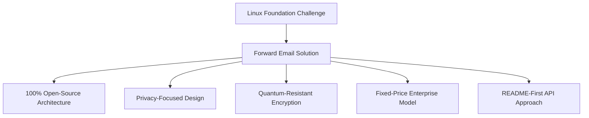
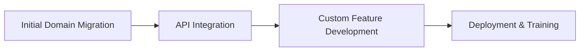

# Case Study: How the Linux Foundation Optimizes Email Management Across 250+ Domains with Forward Email


## Table of Contents

* [Introduction](#introduction)
* [The Challenge](#the-challenge)
* [The Solution](#the-solution)
  * [100% Open-Source Architecture](#100-open-source-architecture)
  * [Privacy-Focused Design](#privacy-focused-design)
  * [Enterprise-Grade Security](#enterprise-grade-security)
  * [Fixed-Price Enterprise Model](#fixed-price-enterprise-model)
  * [Developer-Friendly API](#developer-friendly-api)
* [Implementation Process](#implementation-process)
* [Results and Benefits](#results-and-benefits)
  * [Efficiency Improvements](#efficiency-improvements)
  * [Cost Management](#cost-management)
  * [Enhanced Security](#enhanced-security)
  * [Improved User Experience](#improved-user-experience)
* [Conclusion](#conclusion)
* [References](#references)


## Introduction

The [Linux Foundation](https://en.wikipedia.org/wiki/Linux_Foundation) manages over 900 open-source projects across 250+ domains, including [linux.com](https://www.linux.com/) and [jQuery.com](https://jquery.com/). This case study explores how they partnered with [Forward Email](https://forwardemail.net) to streamline email management while maintaining alignment with open-source principles.


## The Challenge

The Linux Foundation faced several email management challenges:

* **Scale**: Managing email across 250+ domains with different requirements
* **Administrative Burden**: Configuring DNS records, maintaining forwarding rules, and responding to support requests
* **Security**: Protecting against email-based threats while maintaining privacy
* **Cost**: Traditional per-user solutions were prohibitively expensive at their scale
* **Open-Source Alignment**: Need for solutions matching their commitment to open-source values

Similar to challenges faced by [Canonical/Ubuntu](https://forwardemail.net/blog/docs/canonical-ubuntu-email-enterprise-case-study) with their multiple distribution domains, the Linux Foundation needed a solution that could handle diverse projects while maintaining a unified management approach.


## The Solution

Forward Email provided a comprehensive solution with key features:



### 100% Open-Source Architecture

As the only email service with a completely open-source platform (both frontend and backend), Forward Email aligned perfectly with the Linux Foundation's commitment to open-source principles. Similar to our implementation with [Canonical/Ubuntu](https://forwardemail.net/blog/docs/canonical-ubuntu-email-enterprise-case-study), this transparency allowed their technical team to verify security implementations and even contribute improvements.

### Privacy-Focused Design

Forward Email's strict [privacy policies](https://forwardemail.net/privacy) provided the security the Linux Foundation required. Our [email privacy protection technical implementation](https://forwardemail.net/blog/docs/email-privacy-protection-technical-implementation) ensures that all communications remain secure by design, with no logging or scanning of email content.

As detailed in our technical implementation documentation:

> "We've built our entire system around the principle that your emails belong to you and only you. Unlike other providers who scan email content for advertising or AI training, we maintain a strict no-logging, no-scanning policy that preserves the confidentiality of all communications."

### Enterprise-Grade Security

Implementation of [quantum-resistant encryption](https://forwardemail.net/blog/docs/best-quantum-safe-encrypted-email-service) using ChaCha20-Poly1305 provided state-of-the-art security, with each mailbox being a separate encrypted file. This approach ensures that even if quantum computers become capable of breaking current encryption standards, the Linux Foundation's communications will remain secure.

### Fixed-Price Enterprise Model

Forward Email's [enterprise pricing](https://forwardemail.net/pricing) provided a fixed monthly cost regardless of domains or users. This approach has delivered significant cost savings for other large organizations, as demonstrated in our [university alumni email case study](https://forwardemail.net/blog/docs/alumni-email-forwarding-university-case-study), where institutions saved up to 99% compared to traditional per-user email solutions.

### Developer-Friendly API

Following a [README-first approach](https://tom.preston-werner.com/2010/08/23/readme-driven-development) and inspired by [Stripe's RESTful API design](https://amberonrails.com/building-stripes-api), Forward Email's [API](https://forwardemail.net/api) enabled deep integration with the Linux Foundation's Project Control Center. This integration was crucial for automating email management across their diverse project portfolio.


## Implementation Process

The implementation followed a structured approach:



1. **Initial Domain Migration**: Configuring DNS records, setting up SPF/DKIM/DMARC, migrating existing rules

   ```sh
   # Example DNS configuration for a Linux Foundation domain
   domain.org.    600    IN    MX    10 mx1.forwardemail.net.
   domain.org.    600    IN    MX    10 mx2.forwardemail.net.
   domain.org.    600    IN    TXT   "v=spf1 include:spf.forwardemail.net -all"
   ```

2. **API Integration**: Connecting with Project Control Center for self-service management

3. **Custom Feature Development**: Multi-domain management, reporting, security policies

   We worked closely with the Linux Foundation to develop features (which are also 100% open-sourced so everyone can benefit from them) specifically for their multi-project environment, similar to how we created custom solutions for [university alumni email systems](https://forwardemail.net/blog/docs/alumni-email-forwarding-university-case-study).


## Results and Benefits

The implementation delivered significant benefits:

### Efficiency Improvements

* Reduced administrative overhead
* Faster project onboarding (from days to minutes)
* Streamlined management of all 250+ domains from a single interface

### Cost Management

* Fixed pricing regardless of growth in domains or users
* Elimination of per-user licensing fees
* Similar to our [university case study](https://forwardemail.net/blog/docs/alumni-email-forwarding-university-case-study), the Linux Foundation achieved substantial cost savings compared to traditional solutions

### Enhanced Security

* Quantum-resistant encryption across all domains
* Comprehensive email authentication preventing spoofing and phishing
* Security testing and practices via [security features](https://forwardemail.net/security)
* Privacy protection through our [technical implementation](https://forwardemail.net/blog/docs/email-privacy-protection-technical-implementation)

### Improved User Experience

* Self-service email management for project administrators
* Consistent experience across all Linux Foundation domains
* Reliable email delivery with robust authentication


## Conclusion

The Linux Foundation's partnership with Forward Email demonstrates how organizations can address complex email management challenges while maintaining alignment with their core values. By selecting a solution that prioritizes open-source principles, privacy, and security, the Linux Foundation has transformed email management from an administrative burden into a strategic advantage.

As seen in our work with both [Canonical/Ubuntu](https://forwardemail.net/blog/docs/canonical-ubuntu-email-enterprise-case-study) and [major universities](https://forwardemail.net/blog/docs/alumni-email-forwarding-university-case-study), organizations with complex domain portfolios can achieve significant improvements in efficiency, security, and cost management through Forward Email's enterprise solution.

For more information on how Forward Email can help your organization manage email across multiple domains, visit [forwardemail.net](https://forwardemail.net) or explore our detailed [documentation](https://forwardemail.net/email-api) and [guides](https://forwardemail.net/guides).


## References

* Linux Foundation. (2025). "Browse Projects." Retrieved from <https://www.linuxfoundation.org/projects>
* Wikipedia. (2025). "Linux Foundation." Retrieved from <https://en.wikipedia.org/wiki/Linux_Foundation>
