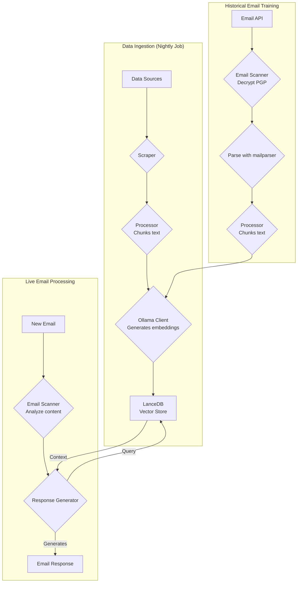
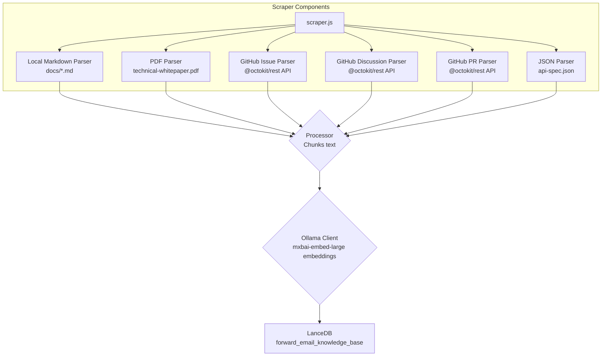
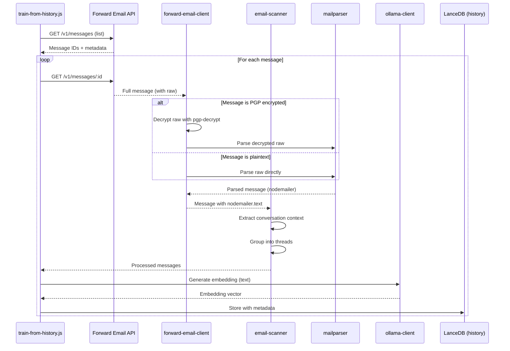

# بناء وكيل دعم عملاء ذكي يراعي الخصوصية أولاً باستخدام LanceDB و Ollama و Node.js {#building-a-privacy-first-ai-customer-support-agent-with-lancedb-ollama-and-nodejs}


> \[!NOTE]
> تغطي هذه الوثيقة رحلتنا في بناء وكيل دعم ذكي مستضاف ذاتيًا. كتبنا عن تحديات مشابهة في منشور مدونتنا [مقبرة شركات البريد الإلكتروني الناشئة](https://forwardemail.net/blog/docs/email-startup-graveyard-why-80-percent-email-companies-fail). فكّرنا بجدية في كتابة متابعة بعنوان "مقبرة شركات الذكاء الاصطناعي الناشئة" لكن ربما علينا الانتظار سنة أخرى أو نحو ذلك حتى تنفجر فقاعة الذكاء الاصطناعي المحتملة (؟). في الوقت الحالي، هذه هي خلاصة أفكارنا حول ما نجح، وما لم ينجح، ولماذا فعلنا ذلك بهذه الطريقة.

هكذا بنينا وكيل دعم عملاء ذكي خاص بنا. فعلنا ذلك بالطريقة الصعبة: مستضاف ذاتيًا، يراعي الخصوصية أولاً، وتحت سيطرتنا الكاملة. لماذا؟ لأننا لا نثق في خدمات الطرف الثالث ببيانات عملائنا. هذا مطلب من اللائحة العامة لحماية البيانات (GDPR) وقانون حماية البيانات (DPA)، وهو الشيء الصحيح الذي يجب فعله.

لم يكن هذا مشروع عطلة نهاية أسبوع ممتع. كانت رحلة استمرت شهراً نتنقل خلالها بين تبعيات مكسورة، توثيق مضلل، والفوضى العامة لنظام الذكاء الاصطناعي مفتوح المصدر في عام 2025. هذه الوثيقة هي سجل لما بنيناه، ولماذا بنيناه، والعقبات التي واجهناها على طول الطريق.


## جدول المحتويات {#table-of-contents}

* [فوائد العملاء: دعم بشري معزز بالذكاء الاصطناعي](#customer-benefits-ai-augmented-human-support)
  * [ردود أسرع وأكثر دقة](#faster-more-accurate-responses)
  * [الثبات دون الإرهاق](#consistency-without-burnout)
  * [ما ستحصل عليه](#what-you-get)
* [تأمل شخصي: جهد عقدين من الزمن](#a-personal-reflection-the-two-decade-grind)
* [لماذا الخصوصية مهمة](#why-privacy-matters)
* [تحليل التكلفة: الذكاء الاصطناعي السحابي مقابل المستضاف ذاتيًا](#cost-analysis-cloud-ai-vs-self-hosted)
  * [مقارنة خدمات الذكاء الاصطناعي السحابية](#cloud-ai-service-comparison)
  * [تفصيل التكلفة: قاعدة معرفة بحجم 5 جيجابايت](#cost-breakdown-5gb-knowledge-base)
  * [تكاليف الأجهزة المستضافة ذاتيًا](#self-hosted-hardware-costs)
* [استخدام API الخاص بنا بأنفسنا](#dogfooding-our-own-api)
  * [لماذا استخدام API الخاص بنا مهم](#why-dogfooding-matters)
  * [أمثلة على استخدام API](#api-usage-examples)
  * [فوائد الأداء](#performance-benefits)
* [هيكل التشفير](#encryption-architecture)
  * [الطبقة 1: تشفير صندوق البريد (chacha20-poly1305)](#layer-1-mailbox-encryption-chacha20-poly1305)
  * [الطبقة 2: تشفير الرسائل بمستوى PGP](#layer-2-message-level-pgp-encryption)
  * [لماذا هذا مهم للتدريب](#why-this-matters-for-training)
  * [أمان التخزين](#storage-security)
  * [التخزين المحلي هو الممارسة القياسية](#local-storage-is-standard-practice)
* [الهيكلية](#the-architecture)
  * [التدفق على المستوى العالي](#high-level-flow)
  * [تدفق الماسح التفصيلي](#detailed-scraper-flow)
* [كيف يعمل](#how-it-works)
  * [بناء قاعدة المعرفة](#building-the-knowledge-base)
  * [التدريب من الرسائل الإلكترونية التاريخية](#training-from-historical-emails)
  * [معالجة الرسائل الواردة](#processing-incoming-emails)
  * [إدارة مخزن المتجهات](#vector-store-management)
* [مقبرة قواعد بيانات المتجهات](#the-vector-database-graveyard)
* [متطلبات النظام](#system-requirements)
* [تكوين مهمة كرون](#cron-job-configuration)
  * [متغيرات البيئة](#environment-variables)
  * [مهام كرون لصناديق بريد متعددة](#cron-jobs-for-multiple-inboxes)
  * [تفصيل جدول كرون](#cron-schedule-breakdown)
  * [حساب التاريخ الديناميكي](#dynamic-date-calculation)
  * [الإعداد الأولي: استخراج قائمة عناوين URL من خريطة الموقع](#initial-setup-extract-url-list-from-sitemap)
  * [اختبار مهام كرون يدويًا](#testing-cron-jobs-manually)
  * [مراقبة السجلات](#monitoring-logs)
* [أمثلة على الكود](#code-examples)
  * [القص والمعالجة](#scraping-and-processing)
  * [التدريب من الرسائل الإلكترونية التاريخية](#training-from-historical-emails-1)
  * [الاستعلام عن السياق](#querying-for-context)
* [المستقبل: البحث والتطوير في فاحص الرسائل المزعجة](#the-future-spam-scanner-rd)
* [استكشاف الأخطاء وإصلاحها](#troubleshooting)
  * [خطأ عدم تطابق أبعاد المتجه](#vector-dimension-mismatch-error)
  * [سياق قاعدة المعرفة الفارغ](#empty-knowledge-base-context)
  * [فشل فك تشفير PGP](#pgp-decryption-failures)
* [نصائح الاستخدام](#usage-tips)
  * [تحقيق صندوق بريد صفري](#achieving-inbox-zero)
  * [استخدام تسمية skip-ai](#using-the-skip-ai-label)
  * [تسلسل الرسائل والرد على الجميع](#email-threading-and-reply-all)
  * [المراقبة والصيانة](#monitoring-and-maintenance)
* [الاختبارات](#testing)
  * [تشغيل الاختبارات](#running-tests)
  * [تغطية الاختبارات](#test-coverage)
  * [بيئة الاختبار](#test-environment)
* [النقاط الرئيسية المستفادة](#key-takeaways)
## فوائد العملاء: الدعم البشري المعزز بالذكاء الاصطناعي {#customer-benefits-ai-augmented-human-support}

نظام الذكاء الاصطناعي لدينا لا يحل محل فريق الدعم لدينا—بل يجعله أفضل. إليك ما يعنيه هذا بالنسبة لك:

### ردود أسرع وأكثر دقة {#faster-more-accurate-responses}

**البشر في الحلقة**: كل مسودة يولدها الذكاء الاصطناعي يتم مراجعتها وتحريرها وتنقيحها من قبل فريق الدعم البشري لدينا قبل إرسالها إليك. يتولى الذكاء الاصطناعي البحث الأولي وإعداد المسودة، مما يتيح لفريقنا التركيز على مراقبة الجودة والتخصيص.

**مدرب على خبرة بشرية**: يتعلم الذكاء الاصطناعي من:

* قاعدة المعرفة والوثائق المكتوبة يدويًا لدينا
* منشورات المدونة والدروس التعليمية التي كتبها البشر
* الأسئلة الشائعة الشاملة لدينا (المكتوبة بواسطة البشر)
* محادثات العملاء السابقة (جميعها تعامل معها بشر حقيقيون)

أنت تحصل على ردود مستندة إلى سنوات من الخبرة البشرية، ولكن يتم تقديمها بشكل أسرع.

### الاتساق بدون إرهاق {#consistency-without-burnout}

يتعامل فريقنا الصغير مع مئات طلبات الدعم يوميًا، كل منها يتطلب معرفة تقنية مختلفة وتبديل سياق ذهني:

* أسئلة الفوترة تتطلب معرفة بالنظام المالي
* مشكلات DNS تتطلب خبرة في الشبكات
* تكامل API يتطلب معرفة بالبرمجة
* تقارير الأمان تتطلب تقييم الثغرات

بدون مساعدة الذكاء الاصطناعي، يؤدي هذا التبديل المستمر للسياق إلى:

* أوقات استجابة أبطأ
* أخطاء بشرية بسبب التعب
* جودة إجابات غير متسقة
* إرهاق الفريق

**مع تعزيز الذكاء الاصطناعي**، يقوم فريقنا بـ:

* الرد بشكل أسرع (الذكاء الاصطناعي يعد المسودات في ثوانٍ)
* ارتكاب أخطاء أقل (الذكاء الاصطناعي يكتشف الأخطاء الشائعة)
* الحفاظ على جودة متسقة (الذكاء الاصطناعي يستند إلى نفس قاعدة المعرفة في كل مرة)
* البقاء نشيطًا ومركزًا (وقت أقل للبحث، ووقت أكثر للمساعدة)

### ما تحصل عليه {#what-you-get}

✅ **السرعة**: يعد الذكاء الاصطناعي الردود في ثوانٍ، ويقوم البشر بمراجعتها وإرسالها خلال دقائق

✅ **الدقة**: ردود مستندة إلى وثائقنا الفعلية والحلول السابقة

✅ **الاتساق**: نفس الإجابات عالية الجودة سواء كانت الساعة 9 صباحًا أو 9 مساءً

✅ **اللمسة البشرية**: كل رد يتم مراجعته وتخصيصه من قبل فريقنا

✅ **لا هلوسات**: يستخدم الذكاء الاصطناعي فقط قاعدة المعرفة الموثوقة لدينا، وليس بيانات الإنترنت العامة

> \[!NOTE]
> **أنت دائمًا تتحدث إلى بشر**. الذكاء الاصطناعي هو مساعد بحث يساعد فريقنا في العثور على الإجابة الصحيحة بشكل أسرع. فكر فيه كمكتبي يجد الكتاب المناسب على الفور—لكن لا يزال الإنسان هو من يقرأه ويشرح لك.


## تأمل شخصي: الكفاح الذي دام عقدين {#a-personal-reflection-the-two-decade-grind}

قبل أن نغوص في التفاصيل التقنية، ملاحظة شخصية. لقد كنت في هذا المجال لما يقرب من عقدين. الساعات التي لا تنتهي على لوحة المفاتيح، السعي المستمر لإيجاد حل، الكد والتركيز العميق – هذه هي حقيقة بناء أي شيء ذي معنى. إنها حقيقة غالبًا ما يتم تجاهلها في دورات الضجيج حول التكنولوجيا الجديدة.

كان الانفجار الأخير في مجال الذكاء الاصطناعي محبطًا بشكل خاص. يُباع لنا حلم الأتمتة، ومساعدي الذكاء الاصطناعي الذين سيكتبون شفرتنا ويحلّون مشاكلنا. الواقع؟ الناتج غالبًا ما يكون شفرة رديئة للغاية تتطلب وقتًا أكثر لإصلاحها مما كان سيستغرقه كتابتها من الصفر. وعد تسهيل حياتنا هو وعد كاذب. إنه تشتيت عن العمل الشاق والضروري للبناء.

ثم هناك مأزق المساهمة في المصادر المفتوحة. أنت بالفعل مرهق ومنهك من الكد. تستخدم الذكاء الاصطناعي لمساعدتك في كتابة تقرير خطأ مفصل ومنظم جيدًا، على أمل تسهيل فهم المشكلة وإصلاحها من قبل القائمين على الصيانة. وماذا يحدث؟ تُوبّخ. تُرفض مساهمتك باعتبارها "خارج الموضوع" أو ذات جهد منخفض، كما رأينا في [مشكلة GitHub الأخيرة لـ Node.js](https://github.com/nodejs/node/issues/60719#issuecomment-3534304321). إنها صفعة في وجه المطورين المخضرمين الذين يحاولون فقط المساعدة.

هذه هي حقيقة النظام البيئي الذي نعمل فيه. الأمر لا يتعلق فقط بالأدوات المعطلة؛ بل يتعلق بثقافة غالبًا ما تفشل في احترام وقت و[جهد مساهميها](https://forwardemail.net/blog/docs/how-npm-packages-billion-downloads-shaped-javascript-ecosystem). هذه التدوينة هي سجل لتلك الحقيقة. إنها قصة عن الأدوات، نعم، لكنها أيضًا عن التكلفة البشرية للبناء في نظام بيئي معطل، والذي، رغم كل وعوده، معطل جوهريًا.
## لماذا الخصوصية مهمة {#why-privacy-matters}

يغطي [الورقة البيضاء التقنية](https://forwardemail.net/technical-whitepaper.pdf) فلسفتنا في الخصوصية بعمق. النسخة المختصرة: نحن لا نرسل بيانات العملاء إلى أطراف ثالثة. أبدًا. هذا يعني لا OpenAI، لا Anthropic، ولا قواعد بيانات متجهة مستضافة على السحابة. كل شيء يعمل محليًا على بنيتنا التحتية. هذا أمر غير قابل للتفاوض للامتثال لـ GDPR والتزاماتنا بموجب DPA.


## تحليل التكلفة: الذكاء الاصطناعي السحابي مقابل الاستضافة الذاتية {#cost-analysis-cloud-ai-vs-self-hosted}

قبل الغوص في التنفيذ الفني، دعونا نتحدث عن سبب أهمية الاستضافة الذاتية من منظور التكلفة. تجعل نماذج تسعير خدمات الذكاء الاصطناعي السحابية استخدامها مكلفًا بشكل مفرط لحالات الاستخدام ذات الحجم الكبير مثل دعم العملاء.

### مقارنة خدمات الذكاء الاصطناعي السحابي {#cloud-ai-service-comparison}

| الخدمة          | المزود              | تكلفة التضمين                                                   | تكلفة LLM (الإدخال)                                                        | تكلفة LLM (الإخراج)     | سياسة الخصوصية                                     | GDPR/DPA        | الاستضافة         | مشاركة البيانات   |
| --------------- | ------------------- | ---------------------------------------------------------------- | -------------------------------------------------------------------------- | ---------------------- | --------------------------------------------------- | --------------- | ----------------- | ----------------- |
| **OpenAI**      | OpenAI (الولايات المتحدة) | [$0.02-0.13/1M tokens](https://openai.com/api/pricing/)          | $0.15-20/1M tokens                                                         | $0.60-80/1M tokens     | [رابط](https://openai.com/policies/privacy-policy/) | DPA محدود       | Azure (الولايات المتحدة) | نعم (للتدريب)    |
| **Claude**      | Anthropic (الولايات المتحدة) | غير متوفر                                                        | [$3-20/1M tokens](https://docs.claude.com/en/docs/about-claude/pricing)    | $15-80/1M tokens       | [رابط](https://www.anthropic.com/legal/privacy)     | DPA محدود       | AWS/GCP (الولايات المتحدة) | لا (مدعى)        |
| **Gemini**      | Google (الولايات المتحدة) | [$0.15/1M tokens](https://ai.google.dev/gemini-api/docs/pricing) | $0.30-1.00/1M tokens                                                       | $2.50/1M tokens        | [رابط](https://policies.google.com/privacy)         | DPA محدود       | GCP (الولايات المتحدة) | نعم (للتحسين)    |
| **DeepSeek**    | DeepSeek (الصين)    | غير متوفر                                                        | [$0.028-0.28/1M tokens](https://api-docs.deepseek.com/quick_start/pricing) | $0.42/1M tokens        | [رابط](https://www.deepseek.com/en)                 | غير معروف       | الصين             | غير معروف         |
| **Mistral**     | Mistral AI (فرنسا)  | [$0.10/1M tokens](https://mistral.ai/pricing)                    | $0.40/1M tokens                                                            | $2.00/1M tokens        | [رابط](https://mistral.ai/terms/)                   | GDPR الاتحاد الأوروبي | الاتحاد الأوروبي   | غير معروف         |
| **الاستضافة الذاتية** | أنت                 | $0 (الأجهزة الحالية)                                             | $0 (الأجهزة الحالية)                                                       | $0 (الأجهزة الحالية)   | سياستك                                            | الامتثال الكامل | MacBook M5 + cron | أبدًا             |

> \[!WARNING]
> **مخاوف سيادة البيانات**: المزودون في الولايات المتحدة (OpenAI، Claude، Gemini) يخضعون لقانون CLOUD Act، مما يسمح للحكومة الأمريكية بالوصول إلى البيانات. تعمل DeepSeek (الصين) بموجب قوانين البيانات الصينية. بينما تقدم Mistral (فرنسا) استضافة في الاتحاد الأوروبي وامتثال GDPR، تظل الاستضافة الذاتية الخيار الوحيد للسيطرة الكاملة على البيانات وسيادتها.

### تحليل التكلفة: قاعدة معرفة بحجم 5 جيجابايت {#cost-breakdown-5gb-knowledge-base}

دعونا نحسب تكلفة معالجة قاعدة معرفة بحجم 5 جيجابايت (نموذجية لشركة متوسطة الحجم تحتوي على مستندات، رسائل إلكترونية، وتاريخ دعم).

**الافتراضات:**

* 5 جيجابايت من النص ≈ 1.25 مليار رمز (بافتراض \~4 أحرف/رمز)
* إنشاء التضمين الأولي
* إعادة التدريب الشهري (إعادة التضمين بالكامل)
* 10,000 استعلام دعم شهريًا
* متوسط الاستعلام: 500 رمز إدخال، 300 رمز إخراج
**تفصيل التكلفة بالتفصيل:**

| المكون                                | OpenAI           | Claude          | Gemini               | الاستضافة الذاتية   |
| -------------------------------------- | ---------------- | --------------- | -------------------- | ------------------ |
| **التضمين الأولي** (1.25 مليار رمز)   | 25,000$          | غير متوفر       | 187,500$             | 0$                 |
| **الاستعلامات الشهرية** (10 آلاف × 800 رمز) | 1,200-16,000$    | 2,400-16,000$   | 2,400-3,200$         | 0$                 |
| **إعادة التدريب الشهرية** (1.25 مليار رمز)  | 25,000$          | غير متوفر       | 187,500$             | 0$                 |
| **إجمالي السنة الأولى**                 | 325,200-217,000$ | 28,800-192,000$ | 2,278,800-2,226,000$ | ~60$ (كهرباء)      |
| **الامتثال للخصوصية**                   | ❌ محدود          | ❌ محدود         | ❌ محدود              | ✅ كامل             |
| **سيادة البيانات**                     | ❌ لا             | ❌ لا            | ❌ لا                 | ✅ نعم              |

> \[!CAUTION]
> **تكاليف التضمين في Gemini كارثية** بسعر 0.15$ لكل مليون رمز. تضمين قاعدة معرفة واحدة بحجم 5 جيجابايت سيكلف 187,500$. هذا أغلى 37 مرة من OpenAI ويجعلها غير قابلة للاستخدام في الإنتاج.

### تكاليف الأجهزة المستضافة ذاتيًا {#self-hosted-hardware-costs}

يعمل إعدادنا على الأجهزة الموجودة التي نمتلكها بالفعل:

* **الأجهزة**: MacBook M5 (مملوك مسبقًا للتطوير)
* **التكلفة الإضافية**: 0$ (يستخدم الأجهزة الموجودة)
* **الكهرباء**: ~5$/شهر (تقديري)
* **إجمالي السنة الأولى**: ~60$
* **مستمر**: 60$/سنة

**العائد على الاستثمار**: الاستضافة الذاتية تكاد تكون بدون تكلفة هامشية لأننا نستخدم أجهزة التطوير الموجودة. يعمل النظام عبر مهام مجدولة (cron jobs) خلال ساعات غير الذروة.


## استخدام API الخاص بنا بأنفسنا {#dogfooding-our-own-api}

واحدة من أهم القرارات المعمارية التي اتخذناها هي أن تستخدم جميع مهام الذكاء الاصطناعي لدينا [Forward Email API](https://forwardemail.net/email-api) مباشرة. هذا ليس مجرد ممارسة جيدة—بل هو دافع لتحسين الأداء.

### لماذا استخدام API الخاص بنا مهم {#why-dogfooding-matters}

عندما تستخدم مهام الذكاء الاصطناعي نفس نقاط نهاية API التي يستخدمها عملاؤنا:

1. **اختناقات الأداء تؤثر علينا أولاً** - نشعر بالألم قبل العملاء
2. **التحسين يفيد الجميع** - التحسينات لمهامنا تحسن تجربة العملاء تلقائيًا
3. **الاختبار في العالم الحقيقي** - تعالج مهامنا آلاف الرسائل، مما يوفر اختبار تحميل مستمر
4. **إعادة استخدام الكود** - نفس المصادقة، تحديد المعدل، معالجة الأخطاء، ومنطق التخزين المؤقت

### أمثلة استخدام API {#api-usage-examples}

**قائمة الرسائل (train-from-history.js):**

```javascript
// يستخدم GET /v1/messages?folder=INBOX مع BasicAuth
// يستبعد eml، raw، nodemailer لتقليل حجم الاستجابة (نحتاج فقط إلى المعرفات)
const response = await axios.get(
  `${this.apiBase}/v1/messages`,
  {
    params: {
      folder: 'INBOX',
      limit: 100,
      eml: false,
      raw: false,
      nodemailer: false
    },
    auth: {
      username: process.env.FORWARD_EMAIL_ALIAS_USERNAME,
      password: process.env.FORWARD_EMAIL_ALIAS_PASSWORD
    }
  }
);

const messages = response.data;
// يعيد: [{ id, subject, date, ... }, ...]
// يتم جلب محتوى الرسالة الكامل لاحقًا عبر GET /v1/messages/:id
```

**جلب الرسائل الكاملة (forward-email-client.js):**

```javascript
// يستخدم GET /v1/messages/:id للحصول على الرسالة كاملة مع المحتوى الخام
const response = await axios.get(
  `${this.apiBase}/v1/messages/${messageId}`,
  {
    auth: {
      username: this.aliasUsername,
      password: this.aliasPassword
    }
  }
);

const message = response.data;
// يعيد: { id, subject, raw, eml, nodemailer: { ... }, ... }
```

**إنشاء ردود مسودة (process-inbox.js):**

```javascript
// يستخدم POST /v1/messages لإنشاء ردود مسودة
const response = await axios.post(
  `${this.apiBase}/v1/messages`,
  {
    folder: 'Drafts',
    subject: `Re: ${originalSubject}`,
    to: senderEmail,
    text: generatedResponse,
    inReplyTo: originalMessageId
  },
  {
    auth: {
      username: process.env.FORWARD_EMAIL_ALIAS_USERNAME,
      password: process.env.FORWARD_EMAIL_ALIAS_PASSWORD
    }
  }
);
```
### فوائد الأداء {#performance-benefits}

نظرًا لأن وظائف الذكاء الاصطناعي لدينا تعمل على نفس بنية واجهة برمجة التطبيقات:

* **تحسينات التخزين المؤقت** تفيد كل من الوظائف والعملاء
* **تحديد المعدل** يتم اختباره تحت حمل حقيقي
* **معالجة الأخطاء** مجربة في ظروف قاسية
* **أوقات استجابة API** يتم مراقبتها باستمرار
* **استعلامات قاعدة البيانات** محسّنة لكلا الحالتين
* **تحسين عرض النطاق الترددي** - استبعاد `eml`، `raw`، `nodemailer` عند الإدراج يقلل حجم الاستجابة بحوالي 90%

عندما يعالج `train-from-history.js` ألف بريد إلكتروني، فإنه يقوم بأكثر من 1000 مكالمة API. أي عدم كفاءة في API تصبح واضحة على الفور. هذا يجبرنا على تحسين الوصول إلى IMAP، واستعلامات قاعدة البيانات، وتسلسل الاستجابة — تحسينات تفيد عملائنا مباشرة.

**مثال على التحسين**: إدراج 100 رسالة بمحتوى كامل = استجابة بحجم ~10 ميجابايت. الإدراج مع `eml: false, raw: false, nodemailer: false` = استجابة بحجم ~100 كيلوبايت (أصغر 100 مرة).


## بنية التشفير {#encryption-architecture}

يستخدم تخزين البريد الإلكتروني لدينا طبقات متعددة من التشفير، والتي يجب على وظائف الذكاء الاصطناعي فك تشفيرها في الوقت الحقيقي للتدريب.

### الطبقة 1: تشفير صندوق البريد (chacha20-poly1305) {#layer-1-mailbox-encryption-chacha20-poly1305}

يتم تخزين جميع صناديق بريد IMAP كقواعد بيانات SQLite مشفرة باستخدام **chacha20-poly1305**، وهو خوارزمية تشفير مقاومة للحوسبة الكمومية. هذا مفصل في منشور مدونتنا عن [خدمة البريد الإلكتروني المشفرة المقاومة للكم](https://forwardemail.net/blog/docs/best-quantum-safe-encrypted-email-service).

**الخصائص الرئيسية:**

* **الخوارزمية**: ChaCha20-Poly1305 (شيفرة AEAD)
* **مقاومة للكم**: مقاومة لهجمات الحوسبة الكمومية
* **التخزين**: ملفات قاعدة بيانات SQLite على القرص
* **الوصول**: يتم فك التشفير في الذاكرة عند الوصول عبر IMAP/API

### الطبقة 2: تشفير الرسائل على مستوى PGP {#layer-2-message-level-pgp-encryption}

يتم تشفير العديد من رسائل الدعم أيضًا باستخدام PGP (معيار OpenPGP). يجب على وظائف الذكاء الاصطناعي فك تشفير هذه الرسائل لاستخراج المحتوى للتدريب.

**تدفق فك التشفير:**

```javascript
// 1. API تعيد رسالة بمحتوى خام مشفر
const message = await forwardEmailClient.getMessage(id);

// 2. تحقق إذا كان المحتوى الخام مشفرًا بـ PGP
if (isMessageEncrypted(message.raw)) {
  // 3. فك التشفير باستخدام مفتاحنا الخاص
  const decryptedRaw = await pgpDecrypt(message.raw);

  // 4. تحليل رسالة MIME المفكوكة التشفير
  const parsed = await simpleParser(decryptedRaw);

  // 5. ملء nodemailer بالمحتوى المفكوك التشفير
  message.nodemailer = {
    text: parsed.text,
    html: parsed.html,
    from: parsed.from,
    to: parsed.to,
    subject: parsed.subject,
    date: parsed.date
  };
}
```

**تكوين PGP:**

```bash
# المفتاح الخاص لفك التشفير (مسار ملف المفتاح ASCII-armored)
GPG_SECURITY_KEY="/path/to/private-key.asc"

# عبارة المرور للمفتاح الخاص (إذا كان مشفرًا)
GPG_SECURITY_PASSPHRASE="your-passphrase"
```

مساعد `pgp-decrypt.js`:

1. يقرأ المفتاح الخاص من القرص مرة واحدة (مخزن في الذاكرة)
2. يفك تشفير المفتاح باستخدام عبارة المرور
3. يستخدم المفتاح المفكوك التشفير لجميع رسائل فك التشفير
4. يدعم فك التشفير التكراري للرسائل المشفرة المتداخلة

### لماذا هذا مهم للتدريب {#why-this-matters-for-training}

بدون فك التشفير الصحيح، سيتدرب الذكاء الاصطناعي على نصوص مشفرة غير مفهومة:

```
-----BEGIN PGP MESSAGE-----
Version: OpenPGP.js v4.10.10

wcBMA8Z3lHJnFnNUAQgAqK7F8...
-----END PGP MESSAGE-----
```

مع فك التشفير، يتدرب الذكاء الاصطناعي على المحتوى الفعلي:

```
Subject: Re: Bug Report

Hi John,

Thanks for reporting this issue. I've confirmed the bug
and created a fix in PR #1234...
```

### أمان التخزين {#storage-security}

يحدث فك التشفير في الذاكرة أثناء تنفيذ الوظيفة، ويتم تحويل المحتوى المفكوك التشفير إلى تمثيلات متجهة (embeddings) تُخزن بعد ذلك في قاعدة بيانات LanceDB المتجهة على القرص.

**مكان تخزين البيانات:**

* **قاعدة البيانات المتجهة**: مخزنة على أجهزة MacBook M5 المشفرة
* **الأمان المادي**: تبقى الأجهزة معنا في جميع الأوقات (ليست في مراكز البيانات)
* **تشفير القرص**: تشفير كامل للقرص على جميع الأجهزة
* **أمان الشبكة**: محمية بجدار ناري ومعزولة عن الشبكات العامة

**نشر مستقبلي في مراكز البيانات:**
إذا انتقلنا يومًا إلى استضافة مراكز البيانات، فستحتوي الخوادم على:

* تشفير كامل للقرص باستخدام LUKS
* تعطيل الوصول عبر USB
* تدابير أمان مادية
* عزل الشبكة
للحصول على تفاصيل كاملة حول ممارسات الأمان لدينا، راجع [صفحة الأمان](https://forwardemail.net/en/security).

> \[!NOTE]
> تحتوي قاعدة بيانات المتجهات على تمثيلات مضمنة (تمثيلات رياضية)، وليست النصوص الأصلية. ومع ذلك، يمكن عكس التمثيلات المضمنة، ولهذا السبب نحتفظ بها على محطات عمل مشفرة ومؤمنة ماديًا.

### التخزين المحلي هو الممارسة القياسية {#local-storage-is-standard-practice}

تخزين التمثيلات المضمنة على محطات عمل فريقنا لا يختلف عن كيفية تعاملنا مع البريد الإلكتروني بالفعل:

* **Thunderbird**: يقوم بتنزيل وتخزين محتوى البريد الإلكتروني بالكامل محليًا في ملفات mbox/maildir
* **عملاء البريد الإلكتروني عبر الويب**: يخزنون بيانات البريد الإلكتروني مؤقتًا في تخزين المتصفح وقواعد البيانات المحلية
* **عملاء IMAP**: يحتفظون بنسخ محلية من الرسائل للوصول إليها دون اتصال
* **نظام الذكاء الاصطناعي لدينا**: يخزن التمثيلات الرياضية (وليس النصوص) في LanceDB

الفرق الرئيسي: التمثيلات المضمنة **أكثر أمانًا** من البريد الإلكتروني النصي لأنها:

1. تمثيلات رياضية، وليست نصًا مقروءًا
2. أصعب في العكس من النصوص العادية
3. تخضع لنفس الأمان المادي مثل عملاء البريد الإلكتروني لدينا

إذا كان من المقبول لفريقنا استخدام Thunderbird أو البريد الإلكتروني عبر الويب على محطات عمل مشفرة، فمن المقبول بنفس القدر (وربما أكثر أمانًا) تخزين التمثيلات المضمنة بنفس الطريقة.


## البنية {#the-architecture}

إليك التدفق الأساسي. يبدو بسيطًا. لكنه لم يكن كذلك.

> \[!NOTE]
> تستخدم جميع الوظائف واجهة برمجة تطبيقات Forward Email مباشرة، مما يضمن استفادة تحسينات الأداء لكل من نظام الذكاء الاصطناعي لدينا وعملائنا.

### التدفق عالي المستوى {#high-level-flow}



### تدفق الماسح التفصيلي {#detailed-scraper-flow}

يعد `scraper.js` قلب عملية استيعاب البيانات. إنه مجموعة من المحللات لأنواع بيانات مختلفة.




## كيف يعمل {#how-it-works}

تنقسم العملية إلى ثلاثة أجزاء رئيسية: بناء قاعدة المعرفة، التدريب من الرسائل التاريخية، ومعالجة الرسائل الجديدة.

### بناء قاعدة المعرفة {#building-the-knowledge-base}

**`update-knowledge-base.js`**: هذه هي الوظيفة الرئيسية. تعمل ليلاً، تمسح قاعدة المتجهات القديمة، وتعيد بنائها من الصفر. تستخدم `scraper.js` لجلب المحتوى من جميع المصادر، و`processor.js` لتقسيمه، و`ollama-client.js` لتوليد التمثيلات المضمنة. وأخيرًا، يخزن `vector-store.js` كل شيء في LanceDB.

**مصادر البيانات:**

* ملفات Markdown محلية (`docs/*.md`)
* ملف PDF للورقة التقنية (`assets/technical-whitepaper.pdf`)
* ملف JSON لمواصفات API (`assets/api-spec.json`)
* قضايا GitHub (عبر Octokit)
* مناقشات GitHub (عبر Octokit)
* طلبات السحب في GitHub (عبر Octokit)
* قائمة عناوين URL لخريطة الموقع (`$LANCEDB_PATH/valid-urls.json`)

### التدريب من الرسائل التاريخية {#training-from-historical-emails}

**`train-from-history.js`**: تفحص هذه الوظيفة الرسائل التاريخية من جميع المجلدات، وتفك تشفير الرسائل المشفرة بـ PGP، وتضيفها إلى قاعدة متجهات منفصلة (`customer_support_history`). هذا يوفر سياقًا من تفاعلات الدعم السابقة.
**تدفق معالجة البريد الإلكتروني:**



**الميزات الرئيسية:**

* **فك تشفير PGP**: يستخدم المساعد `pgp-decrypt.js` مع متغير البيئة `GPG_SECURITY_KEY`
* **تجميع المحادثات**: يجمع الرسائل الإلكترونية ذات الصلة في سلاسل المحادثات
* **الحفاظ على البيانات الوصفية**: يخزن المجلد، الموضوع، التاريخ، حالة التشفير
* **سياق الرد**: يربط الرسائل بردودها لتوفير سياق أفضل

**التكوين:**

```bash
# متغيرات البيئة لـ train-from-history
HISTORY_SCAN_LIMIT=1000              # الحد الأقصى للرسائل التي تتم معالجتها
HISTORY_SCAN_SINCE="2024-01-01"      # معالجة الرسائل فقط بعد هذا التاريخ
HISTORY_DECRYPT_PGP=true             # محاولة فك تشفير PGP
GPG_SECURITY_KEY="/path/to/key.asc"  # مسار مفتاح PGP الخاص
GPG_SECURITY_PASSPHRASE="passphrase" # عبارة مرور المفتاح (اختياري)
```

**ما يتم تخزينه:**

```javascript
{
  type: 'historical_email',
  folder: 'INBOX',
  subject: 'Re: Bug Report',
  date: '2025-01-15T10:30:00Z',
  messageId: '67e2f288893921...',
  threadId: 'Bug Report',
  hasReply: true,
  encrypted: true,
  decrypted: true,
  replySubject: 'Bug Report',
  replyText: 'First 500 chars of reply...',
  chunkSize: 1000,
  chunkOverlap: 200,
  chunkIndex: 0
}
```

> \[!TIP]
> شغّل `train-from-history` بعد الإعداد الأولي لملء السياق التاريخي. هذا يحسن جودة الاستجابة بشكل كبير من خلال التعلم من تفاعلات الدعم السابقة.

### معالجة الرسائل الواردة {#processing-incoming-emails}

**`process-inbox.js`**: هذه المهمة تعمل على الرسائل في صناديق البريد `support@forwardemail.net`، `abuse@forwardemail.net`، و `security@forwardemail.net` (تحديدًا مسار مجلد IMAP `INBOX`). تستخدم API الخاص بنا على <https://forwardemail.net/email-api> (مثلاً `GET /v1/messages?folder=INBOX` باستخدام وصول BasicAuth مع بيانات اعتماد IMAP لكل صندوق بريد). تقوم بتحليل محتوى البريد الإلكتروني، وتستعلم من قاعدة المعرفة (`forward_email_knowledge_base`) ومن مخزن المتجهات للبريد الإلكتروني التاريخي (`customer_support_history`)، ثم تمرر السياق المدمج إلى `response-generator.js`. يستخدم المولد `mxbai-embed-large` عبر Ollama لصياغة الرد.

**ميزات سير العمل الآلي:**

1. **أتمتة الوصول إلى صندوق البريد صفراً**: بعد إنشاء مسودة بنجاح، يتم نقل الرسالة الأصلية تلقائيًا إلى مجلد الأرشيف. هذا يحافظ على نظافة صندوق البريد ويساعد في تحقيق الوصول إلى صندوق بريد صفراً بدون تدخل يدوي.

2. **تخطي معالجة الذكاء الاصطناعي**: ببساطة أضف تسمية `skip-ai` (غير حساسة لحالة الأحرف) لأي رسالة لمنع معالجتها بواسطة الذكاء الاصطناعي. ستبقى الرسالة في صندوق بريدك دون تغيير، مما يتيح لك التعامل معها يدويًا. هذا مفيد للرسائل الحساسة أو الحالات المعقدة التي تتطلب حكمًا بشريًا.

3. **تجميع الرسائل بشكل صحيح**: جميع الردود المسودة تتضمن اقتباس الرسالة الأصلية أدناه (باستخدام بادئة ` >  ` القياسية)، متبعةً قواعد الرد على البريد الإلكتروني بصيغة "في \[التاريخ]، كتب \[المرسل]:" لضمان سياق المحادثة الصحيح وتجميع الرسائل في عملاء البريد الإلكتروني.

4. **سلوك الرد على الجميع**: النظام يتعامل تلقائيًا مع رؤوس Reply-To ومستلمي CC:
   * إذا كان هناك رأس Reply-To، يصبح عنوان To ويضاف العنوان الأصلي From إلى CC
   * جميع المستلمين الأصليين في To و CC يتم تضمينهم في CC للرد (باستثناء عنوانك الخاص)
   * يتبع قواعد الرد على الجميع القياسية للمحادثات الجماعية
**تصنيف المصدر**: يستخدم النظام **تصنيفًا مرجحًا** لإعطاء الأولوية للمصادر:

* الأسئلة الشائعة: 100% (أعلى أولوية)
* الورقة التقنية: 95%
* مواصفات API: 90%
* الوثائق الرسمية: 85%
* قضايا GitHub: 70%
* الرسائل الإلكترونية التاريخية: 50%

### إدارة متجر المتجهات {#vector-store-management}

فئة `VectorStore` في `helpers/customer-support-ai/vector-store.js` هي واجهتنا إلى LanceDB.

**إضافة المستندات:**

```javascript
// vector-store.js
async addDocument(text, metadata) {
  const embedding = await this.ollama.generateEmbedding(text);
  await this.table.add([{
    vector: embedding,
    text,
    ...metadata
  }]);
}
```

**مسح المتجر:**

```javascript
// الخيار 1: استخدام طريقة clear()
await vectorStore.clear();

// الخيار 2: حذف دليل قاعدة البيانات المحلية
await fs.rm(process.env.LANCEDB_PATH, { recursive: true, force: true });
```

متغير البيئة `LANCEDB_PATH` يشير إلى دليل قاعدة البيانات المحلية المدمجة. LanceDB بدون خادم ومضمن، لذلك لا يوجد عملية منفصلة للإدارة.


## مقبرة قواعد بيانات المتجهات {#the-vector-database-graveyard}

كان هذا أول عقبة كبيرة. جربنا عدة قواعد بيانات متجهات قبل أن نستقر على LanceDB. إليك ما حدث خطأ مع كل واحدة.

| قاعدة البيانات | GitHub                                                      | ما الخطأ الذي حدث                                                                                                                                                                                                   | المشكلات المحددة                                                                                                                                                                                                                                                                                                                                                          | مخاوف الأمان                                                                                                                                                                                                   |
| -------------- | ----------------------------------------------------------- | ------------------------------------------------------------------------------------------------------------------------------------------------------------------------------------------------------------------ | -------------------------------------------------------------------------------------------------------------------------------------------------------------------------------------------------------------------------------------------------------------------------------------------------------------------------------------------------------------------------- | --------------------------------------------------------------------------------------------------------------------------------------------------------------------------------------------------------------- |
| **ChromaDB**   | [chroma-core/chroma](https://github.com/chroma-core/chroma) | `pip3 install chromadb` يعطيك نسخة من عصور ما قبل التاريخ مع `PydanticImportError`. الطريقة الوحيدة للحصول على نسخة تعمل هي الترجمة من المصدر. غير مناسبة للمطورين.                                         | فوضى تبعيات بايثون. عدة مستخدمين يبلغون عن فشل تثبيت pip ([#774](https://github.com/chroma-core/chroma/issues/774), [#163](https://github.com/chroma-core/chroma/issues/163)). الوثائق تقول "فقط استخدم Docker" وهو جواب غير مناسب للتطوير المحلي. يتعطل على ويندوز مع أكثر من 99 سجل ([#3058](https://github.com/chroma-core/chroma/issues/3058)). | **CVE-2024-45848**: تنفيذ تعليمات برمجية عشوائية عبر تكامل ChromaDB في MindsDB. ثغرات حرجة في نظام التشغيل في صورة Docker ([#3170](https://github.com/chroma-core/chroma/issues/3170)).                      |
| **Qdrant**     | [qdrant/qdrant](https://github.com/qdrant/qdrant)           | اختفى مستودع Homebrew (`qdrant/qdrant/qdrant`) المشار إليه في وثائقهم القديمة. اختفى بدون تفسير. الوثائق الرسمية الآن تقول فقط "استخدم Docker".                                                                | اختفاء مستودع Homebrew. لا يوجد ملف ثنائي أصلي لنظام macOS. الاعتماد على Docker فقط يشكل عائقًا للاختبار المحلي السريع.                                                                                                                                                                                                                                                  | **CVE-2024-2221**: ثغرة تحميل ملفات عشوائية تسمح بتنفيذ تعليمات برمجية عن بعد (تم الإصلاح في الإصدار 1.9.0). درجة نضج أمني ضعيفة من [IronCore Labs](https://ironcorelabs.com/vectordbs/qdrant-security/). |
| **Weaviate**   | [weaviate/weaviate](https://github.com/weaviate/weaviate)   | نسخة Homebrew كانت تحتوي على خطأ حرج في التجميع (`leader not found`). العلامات الموثقة لإصلاحه (`RAFT_JOIN`, `CLUSTER_HOSTNAME`) لم تعمل. مكسور أساسًا لإعدادات العقدة الواحدة.                                | أخطاء في التجميع حتى في وضع العقدة الواحدة. معقد جدًا للحالات البسيطة.                                                                                                                                                                                                                                                                                                   | لم يتم العثور على ثغرات أمنية كبيرة، لكن التعقيد يزيد من سطح الهجوم.                                                                                                                                           |
| **LanceDB**    | [lancedb/lancedb](https://github.com/lancedb/lancedb)       | هذه نجحت. هي مدمجة وبدون خادم. لا توجد عملية منفصلة. الإزعاج الوحيد هو تسمية الحزمة المربكة (`vectordb` مهجورة، استخدم `@lancedb/lancedb`) والوثائق المتفرقة. يمكننا التعايش مع ذلك.                            | ارتباك في تسمية الحزمة (`vectordb` مقابل `@lancedb/lancedb`)، لكنها صلبة بخلاف ذلك. التصميم المدمج يلغي فئات كاملة من مشكلات الأمان.                                                                                                                                                                                                                                     | لا توجد ثغرات أمنية معروفة. التصميم المدمج يعني عدم وجود سطح هجوم عبر الشبكة.                                                                                                                                   |
> \[!WARNING]
> **لدى ChromaDB ثغرات أمنية حرجة.** [CVE-2024-45848](https://nvd.nist.gov/vuln/detail/CVE-2024-45848) تسمح بتنفيذ تعليمات برمجية عشوائية. تثبيت pip معطل بشكل أساسي بسبب مشاكل تبعية Pydantic. تجنب استخدامه في الإنتاج.

> \[!WARNING]
> **كان لدى Qdrant ثغرة تنفيذ تعليمات برمجية عن بعد عبر رفع ملفات** ([CVE-2024-2221](https://qdrant.tech/blog/cve-2024-2221-response/)) تم إصلاحها فقط في الإصدار v1.9.0. إذا كان لا بد من استخدام Qdrant، تأكد من أنك تستخدم أحدث إصدار.

> \[!CAUTION]
> نظام قواعد البيانات المتجهة مفتوحة المصدر لا يزال غير مستقر. لا تثق في الوثائق. افترض أن كل شيء معطل حتى يثبت العكس. اختبر محليًا قبل الالتزام باستخدام أي نظام.


## متطلبات النظام {#system-requirements}

* **Node.js:** v18.0.0+ ([GitHub](https://github.com/nodejs/node))
* **Ollama:** أحدث إصدار ([GitHub](https://github.com/ollama/ollama))
* **النموذج:** `mxbai-embed-large` عبر Ollama
* **قاعدة بيانات المتجهات:** LanceDB ([GitHub](https://github.com/lancedb/lancedb))
* **الوصول إلى GitHub:** `@octokit/rest` لجمع القضايا ([GitHub](https://github.com/octokit/rest.js))
* **SQLite:** لقاعدة البيانات الأساسية (عبر `mongoose-to-sqlite`)


## إعداد مهمة كرون {#cron-job-configuration}

جميع مهام الذكاء الاصطناعي تعمل عبر كرون على MacBook M5. إليك كيفية إعداد مهام الكرون لتعمل عند منتصف الليل عبر عدة صناديق بريد.

### متغيرات البيئة {#environment-variables}

تتطلب المهام هذه المتغيرات البيئية. يمكن تعيين معظمها في ملف `.env` (يتم تحميله عبر `@ladjs/env`)، لكن `HISTORY_SCAN_SINCE` يجب حسابه ديناميكيًا في crontab.

**في ملف `.env`:**

```bash
# بيانات اعتماد API لإعادة توجيه البريد الإلكتروني (تختلف حسب صندوق البريد)
FORWARD_EMAIL_ALIAS_USERNAME=support@forwardemail.net
FORWARD_EMAIL_ALIAS_PASSWORD=your-imap-password

# فك تشفير PGP (مشترك عبر جميع صناديق البريد)
GPG_SECURITY_KEY=/path/to/private-key.asc
GPG_SECURITY_PASSPHRASE=your-passphrase

# إعدادات الفحص التاريخي
HISTORY_SCAN_LIMIT=1000

# مسار LanceDB
LANCEDB_PATH=/path/to/lancedb
```

**في crontab (يتم حسابه ديناميكيًا):**

```bash
# يجب تعيين HISTORY_SCAN_SINCE مباشرة في crontab مع حساب تاريخ shell
# لا يمكن وضعه في ملف .env لأن @ladjs/env لا ينفذ أوامر shell
HISTORY_SCAN_SINCE="$(date -v-1d +%Y-%m-%d)"  # macOS
HISTORY_SCAN_SINCE="$(date -d 'yesterday' +%Y-%m-%d)"  # Linux
```

### مهام كرون لعدة صناديق بريد {#cron-jobs-for-multiple-inboxes}

حرر crontab باستخدام `crontab -e` وأضف:

```bash
# تحديث قاعدة المعرفة (تشغيل مرة واحدة، مشترك عبر جميع صناديق البريد)
0 0 * * * cd /path/to/forwardemail.net && LANCEDB_PATH="/path/to/lancedb" GPG_SECURITY_KEY="/path/to/key.asc" GPG_SECURITY_PASSPHRASE="pass" node jobs/customer-support-ai/update-knowledge-base.js >> /var/log/update-knowledge-base.log 2>&1

# التدريب من التاريخ - support@forwardemail.net
0 0 * * * cd /path/to/forwardemail.net && FORWARD_EMAIL_ALIAS_USERNAME="support@forwardemail.net" FORWARD_EMAIL_ALIAS_PASSWORD="support-password" HISTORY_SCAN_SINCE="$(date -v-1d +%Y-%m-%d)" HISTORY_SCAN_LIMIT=1000 GPG_SECURITY_KEY="/path/to/key.asc" GPG_SECURITY_PASSPHRASE="pass" LANCEDB_PATH="/path/to/lancedb" node jobs/customer-support-ai/train-from-history.js >> /var/log/train-support.log 2>&1

# التدريب من التاريخ - abuse@forwardemail.net
0 0 * * * cd /path/to/forwardemail.net && FORWARD_EMAIL_ALIAS_USERNAME="abuse@forwardemail.net" FORWARD_EMAIL_ALIAS_PASSWORD="abuse-password" HISTORY_SCAN_SINCE="$(date -v-1d +%Y-%m-%d)" HISTORY_SCAN_LIMIT=1000 GPG_SECURITY_KEY="/path/to/key.asc" GPG_SECURITY_PASSPHRASE="pass" LANCEDB_PATH="/path/to/lancedb" node jobs/customer-support-ai/train-from-history.js >> /var/log/train-abuse.log 2>&1

# التدريب من التاريخ - security@forwardemail.net
0 0 * * * cd /path/to/forwardemail.net && FORWARD_EMAIL_ALIAS_USERNAME="security@forwardemail.net" FORWARD_EMAIL_ALIAS_PASSWORD="security-password" HISTORY_SCAN_SINCE="$(date -v-1d +%Y-%m-%d)" HISTORY_SCAN_LIMIT=1000 GPG_SECURITY_KEY="/path/to/key.asc" GPG_SECURITY_PASSPHRASE="pass" LANCEDB_PATH="/path/to/lancedb" node jobs/customer-support-ai/train-from-history.js >> /var/log/train-security.log 2>&1

# معالجة صندوق البريد - support@forwardemail.net
*/5 * * * * cd /path/to/forwardemail.net && FORWARD_EMAIL_ALIAS_USERNAME="support@forwardemail.net" FORWARD_EMAIL_ALIAS_PASSWORD="support-password" GPG_SECURITY_KEY="/path/to/key.asc" GPG_SECURITY_PASSPHRASE="pass" LANCEDB_PATH="/path/to/lancedb" node jobs/customer-support-ai/process-inbox.js >> /var/log/process-support.log 2>&1

# معالجة صندوق البريد - abuse@forwardemail.net
*/5 * * * * cd /path/to/forwardemail.net && FORWARD_EMAIL_ALIAS_USERNAME="abuse@forwardemail.net" FORWARD_EMAIL_ALIAS_PASSWORD="abuse-password" GPG_SECURITY_KEY="/path/to/key.asc" GPG_SECURITY_PASSPHRASE="pass" LANCEDB_PATH="/path/to/lancedb" node jobs/customer-support-ai/process-inbox.js >> /var/log/process-abuse.log 2>&1

# معالجة صندوق البريد - security@forwardemail.net
*/5 * * * * cd /path/to/forwardemail.net && FORWARD_EMAIL_ALIAS_USERNAME="security@forwardemail.net" FORWARD_EMAIL_ALIAS_PASSWORD="security-password" GPG_SECURITY_KEY="/path/to/key.asc" GPG_SECURITY_PASSPHRASE="pass" LANCEDB_PATH="/path/to/lancedb" node jobs/customer-support-ai/process-inbox.js >> /var/log/process-security.log 2>&1
```
### تفصيل جدول كرون {#cron-schedule-breakdown}

| الوظيفة                  | الجدول        | الوصف                                                                             |
| ----------------------- | ------------- | ---------------------------------------------------------------------------------- |
| `train-from-sitemap.js` | `0 0 * * 0`   | أسبوعي (منتصف ليل الأحد) - يجلب جميع عناوين URL من خريطة الموقع ويدرب قاعدة المعرفة |
| `train-from-history.js` | `0 0 * * *`   | منتصف الليل يوميًا - يفحص رسائل البريد الإلكتروني لليوم السابق لكل صندوق وارد     |
| `process-inbox.js`      | `*/5 * * * *` | كل 5 دقائق - يعالج الرسائل الجديدة وينشئ مسودات                                |

### حساب التاريخ الديناميكي {#dynamic-date-calculation}

يجب **حساب المتغير `HISTORY_SCAN_SINCE` مباشرة في ملف الكرون** لأن:

1. ملفات `.env` تُقرأ كسلاسل نصية حرفية بواسطة `@ladjs/env`
2. استبدال أوامر الشل `$(...)` لا يعمل في ملفات `.env`
3. يجب حساب التاريخ جديدًا في كل مرة يعمل فيها الكرون

**الطريقة الصحيحة (في ملف الكرون):**

```bash
# ماك أو إس (تاريخ BSD)
HISTORY_SCAN_SINCE="$(date -v-1d +%Y-%m-%d)" node jobs/...

# لينكس (تاريخ GNU)
HISTORY_SCAN_SINCE="$(date -d 'yesterday' +%Y-%m-%d)" node jobs/...
```

**الطريقة الخاطئة (لا تعمل في .env):**

```bash
# هذا سيُقرأ كسلسلة نصية حرفية "$(date -v-1d +%Y-%m-%d)"
# ولن يُنفذ كأمر شل
HISTORY_SCAN_SINCE=$(date -v-1d +%Y-%m-%d)
```

هذا يضمن أن كل تشغيل ليلي يحسب تاريخ اليوم السابق ديناميكيًا، متجنبًا العمل الزائد.

### الإعداد الأولي: استخراج قائمة عناوين URL من خريطة الموقع {#initial-setup-extract-url-list-from-sitemap}

قبل تشغيل وظيفة process-inbox لأول مرة، **يجب** استخراج قائمة عناوين URL من خريطة الموقع. هذا ينشئ قاموسًا لعناوين URL الصالحة التي يمكن لنموذج اللغة الكبير الرجوع إليها ويمنع تخيل عناوين URL غير موجودة.

```bash
# الإعداد الأولي: استخراج قائمة عناوين URL من خريطة الموقع
cd /path/to/forwardemail.net
node jobs/customer-support-ai/train-from-sitemap.js
```

**ما يقوم به هذا:**

1. يجلب جميع عناوين URL من <https://forwardemail.net/sitemap.xml>
2. يفلتر فقط عناوين URL غير المحلية أو عناوين /en/ (لتجنب المحتوى المكرر)
3. يزيل بادئات اللغة (/en/faq → /faq)
4. يحفظ ملف JSON بسيط بقائمة عناوين URL في `$LANCEDB_PATH/valid-urls.json`
5. لا زحف، لا جمع بيانات وصفية - فقط قائمة مسطحة لعناوين URL الصالحة

**لماذا هذا مهم:**

* يمنع نموذج اللغة الكبير من تخيل عناوين URL وهمية مثل `/dashboard` أو `/login`
* يوفر قائمة بيضاء لعناوين URL الصالحة ليستخدمها مولد الردود
* بسيط، سريع، ولا يتطلب تخزين في قاعدة بيانات متجهية
* يقوم مولد الردود بتحميل هذه القائمة عند بدء التشغيل ويشملها في الموجه

**أضف إلى ملف الكرون للتحديثات الأسبوعية:**

```bash
# استخراج قائمة عناوين URL من خريطة الموقع - أسبوعيًا في منتصف ليل الأحد
0 0 * * 0 cd /path/to/forwardemail.net && node jobs/customer-support-ai/train-from-sitemap.js >> /var/log/train-sitemap.log 2>&1
```

### اختبار وظائف الكرون يدويًا {#testing-cron-jobs-manually}

لاختبار وظيفة قبل إضافتها إلى الكرون:

```bash
# اختبار تدريب خريطة الموقع
cd /path/to/forwardemail.net
export LANCEDB_PATH="/path/to/lancedb"
node jobs/customer-support-ai/train-from-sitemap.js

# اختبار تدريب صندوق الدعم الوارد
cd /path/to/forwardemail.net
export FORWARD_EMAIL_ALIAS_USERNAME="support@forwardemail.net"
export FORWARD_EMAIL_ALIAS_PASSWORD="support-password"
export HISTORY_SCAN_SINCE="$(date -v-1d +%Y-%m-%d)"
export HISTORY_SCAN_LIMIT=1000
export GPG_SECURITY_KEY="/path/to/key.asc"
export GPG_SECURITY_PASSPHRASE="pass"
export LANCEDB_PATH="/path/to/lancedb"
node jobs/customer-support-ai/train-from-history.js
```

### مراقبة السجلات {#monitoring-logs}

كل وظيفة تسجل في ملف منفصل لتسهيل تصحيح الأخطاء:

```bash
# مراقبة معالجة صندوق الدعم الوارد في الوقت الحقيقي
tail -f /var/log/process-support.log

# التحقق من تشغيل التدريب الليلي الأخير
cat /var/log/train-support.log | grep "$(date -v-1d +%Y-%m-%d)"

# عرض جميع الأخطاء عبر الوظائف
grep -i error /var/log/train-*.log /var/log/process-*.log
```

> \[!TIP]
> استخدم ملفات سجلات منفصلة لكل صندوق وارد لعزل المشاكل. إذا كان لدى صندوق وارد مشكلة في المصادقة، فلن يؤثر ذلك على سجلات الصناديق الأخرى.
## أمثلة على الكود {#code-examples}

### التجريف والمعالجة {#scraping-and-processing}

```javascript
// jobs/customer-support-ai/update-knowledge-base.js
const scraper = new Scraper();
const processor = new Processor();
const ollamaClient = new OllamaClient();
const vectorStore = new VectorStore();

// مسح البيانات القديمة
await vectorStore.clear();

// تجريف جميع المصادر
const documents = await scraper.scrapeAll();
console.log(`تم تجريف ${documents.length} مستندات`);

// المعالجة إلى أجزاء
const allChunks = [];
for (const doc of documents) {
  const chunks = processor.processDocuments([doc]);
  allChunks.push(...chunks);
}
console.log(`تم إنشاء ${allChunks.length} أجزاء`);

// توليد التضمينات والتخزين
const texts = allChunks.map(chunk => chunk.text);
const embeddings = await ollamaClient.generateEmbeddings(texts);

for (let i = 0; i < allChunks.length; i++) {
  await vectorStore.addDocument(texts[i], {
    ...allChunks[i].metadata,
    embedding: embeddings[i]
  });
}
```

### التدريب من الرسائل الإلكترونية التاريخية {#training-from-historical-emails-1}

```javascript
// jobs/customer-support-ai/train-from-history.js
const scanner = new EmailScanner({
  forwardEmailApiBase: config.forwardEmailApiBase,
  forwardEmailAliasUsername: config.forwardEmailAliasUsername,
  forwardEmailAliasPassword: config.forwardEmailAliasPassword
});

const vectorStore = new VectorStore({
  collectionName: 'customer_support_history'
});

// مسح جميع المجلدات (الوارد، الرسائل المرسلة، إلخ)
const messages = await scanner.scanAllFolders({
  limit: 1000,
  since: new Date('2024-01-01'),
  decryptPGP: true
});

// تجميع في محادثات
const threads = scanner.groupIntoThreads(messages);

// معالجة كل محادثة
for (const thread of threads) {
  const context = scanner.extractConversationContext(thread);

  for (const message of context.messages) {
    // تخطي الرسائل المشفرة التي لم يتم فك تشفيرها
    if (message.encrypted && !message.decrypted) continue;

    // استخدام المحتوى الذي تم تحليله مسبقًا من nodemailer
    const text = message.nodemailer?.text || '';
    if (!text.trim()) continue;

    // تقسيم وتخزين
    const chunks = processor.chunkText(`الموضوع: ${message.subject}\n\n${text}`, {
      chunkSize: 1000,
      chunkOverlap: 200
    });

    for (const chunk of chunks) {
      await vectorStore.addDocument(chunk.text, {
        type: 'historical_email',
        folder: message.folder,
        subject: message.subject,
        date: message.nodemailer?.date || message.created_at,
        messageId: message.id,
        threadId: context.subject,
        encrypted: message.encrypted || false,
        decrypted: message.decrypted || false,
        ...chunk.metadata
      });
    }
  }
}
```

### الاستعلام عن السياق {#querying-for-context}

```javascript
// jobs/customer-support-ai/process-inbox.js
const vectorStore = new VectorStore();
const historyVectorStore = new VectorStore({
  collectionName: 'customer_support_history'
});

// الاستعلام من كلا المخزنين
const knowledgeContext = await vectorStore.query(emailEmbedding, { limit: 8 });
const historyContext = await historyVectorStore.query(emailEmbedding, { limit: 3 });

// الترتيب المرجح وإزالة التكرار يتم هنا
const rankedContext = rankAndDeduplicateContext(knowledgeContext, historyContext);

// توليد الرد
const response = await responseGenerator.generate(email, rankedContext);
```


## المستقبل: البحث والتطوير في ماسح الرسائل المزعجة {#the-future-spam-scanner-rd}

لم يكن هذا المشروع بأكمله فقط لدعم العملاء. كان بحثًا وتطويرًا. يمكننا الآن أخذ كل ما تعلمناه عن التضمينات المحلية، مخازن المتجهات، واسترجاع السياق وتطبيقه على مشروعنا الكبير التالي: طبقة LLM لـ [ماسح الرسائل المزعجة](https://spamscanner.net). نفس مبادئ الخصوصية، الاستضافة الذاتية، والفهم الدلالي ستكون مفتاحًا.


## استكشاف الأخطاء وإصلاحها {#troubleshooting}

### خطأ عدم تطابق أبعاد المتجه {#vector-dimension-mismatch-error}

**الخطأ:**

```
Error: Failed to execute query stream: GenericFailure, Invalid input, No vector column found to match with the query vector dimension: 1024
```

**السبب:** يحدث هذا الخطأ عندما تقوم بتغيير نماذج التضمين (مثلًا من `mistral-small` إلى `mxbai-embed-large`) لكن قاعدة بيانات LanceDB الموجودة تم إنشاؤها بأبعاد متجه مختلفة.
**الحل:** تحتاج إلى إعادة تدريب قاعدة المعرفة باستخدام نموذج التضمين الجديد:

```bash
# 1. إيقاف أي وظائف AI لخدمة العملاء قيد التشغيل
pkill -f customer-support-ai

# 2. حذف قاعدة بيانات LanceDB الحالية
rm -rf ~/.local/share/lancedb/forward_email_knowledge_base.lance
rm -rf ~/.local/share/lancedb/customer_support_history.lance

# 3. التحقق من تعيين نموذج التضمين بشكل صحيح في .env
grep OLLAMA_EMBEDDING_MODEL .env
# يجب أن يظهر: OLLAMA_EMBEDDING_MODEL=mxbai-embed-large

# 4. سحب نموذج التضمين في Ollama
ollama pull mxbai-embed-large

# 5. إعادة تدريب قاعدة المعرفة
node jobs/customer-support-ai/train-from-history.js

# 6. إعادة تشغيل وظيفة process-inbox عبر Bree
# ستعمل الوظيفة تلقائيًا كل 5 دقائق
```

**لماذا يحدث هذا:** تنتج نماذج التضمين المختلفة متجهات بأبعاد مختلفة:

* `mistral-small`: 1024 بعدًا
* `mxbai-embed-large`: 1024 بعدًا
* `nomic-embed-text`: 768 بعدًا
* `all-minilm`: 384 بعدًا

يخزن LanceDB بعد المتجه في مخطط الجدول. عندما تستعلم باستخدام بعد مختلف، يفشل الاستعلام. الحل الوحيد هو إعادة إنشاء قاعدة البيانات باستخدام النموذج الجديد.

### سياق قاعدة المعرفة الفارغة {#empty-knowledge-base-context}

**العَرَض:**

```
debug     Retrieved knowledge base context {
  total: 0,
  afterRanking: 0,
  questionType: 'capability'
}
```

**السبب:** لم يتم تدريب قاعدة المعرفة بعد، أو جدول LanceDB غير موجود.

**الحل:** شغّل وظيفة التدريب لملء قاعدة المعرفة:

```bash
# التدريب من رسائل البريد الإلكتروني التاريخية
node jobs/customer-support-ai/train-from-history.js

# أو التدريب من الموقع/الوثائق (إذا كان لديك أداة تجريف)
node jobs/customer-support-ai/train-from-website.js
```

### فشل فك تشفير PGP {#pgp-decryption-failures}

**العَرَض:** تظهر الرسائل كمشفرة لكن المحتوى فارغ.

**الحل:**

1. تحقق من تعيين مسار مفتاح GPG بشكل صحيح:

```bash
grep GPG_SECURITY_KEY .env
# يجب أن يشير إلى ملف المفتاح الخاص بك
```

2. اختبار فك التشفير يدويًا:

```bash
node -e "const decrypt = require('./helpers/customer-support-ai/pgp-decrypt'); decrypt.testDecryption();"
```

3. تحقق من أذونات المفتاح:

```bash
ls -la /path/to/your/gpg-key.asc
# يجب أن يكون قابلًا للقراءة من قبل المستخدم الذي يشغل الوظيفة
```


## نصائح الاستخدام {#usage-tips}

### تحقيق صندوق وارد فارغ {#achieving-inbox-zero}

تم تصميم النظام لمساعدتك على تحقيق صندوق وارد فارغ تلقائيًا:

1. **الأرشفة التلقائية**: عند إنشاء مسودة بنجاح، يتم نقل الرسالة الأصلية تلقائيًا إلى مجلد الأرشيف. هذا يحافظ على نظافة صندوق الوارد دون تدخل يدوي.

2. **مراجعة المسودات**: تحقق من مجلد المسودات بانتظام لمراجعة الردود التي أنشأها الذكاء الاصطناعي. حررها حسب الحاجة قبل الإرسال.

3. **التجاوز اليدوي**: للرسائل التي تحتاج إلى اهتمام خاص، ببساطة أضف تسمية `skip-ai` قبل تشغيل الوظيفة.

### استخدام تسمية skip-ai {#using-the-skip-ai-label}

لمنع معالجة الذكاء الاصطناعي لرسائل معينة:

1. **أضف التسمية**: في عميل البريد الإلكتروني الخاص بك، أضف تسمية/وسم `skip-ai` لأي رسالة (غير حساس لحالة الأحرف)
2. **تبقى الرسالة في صندوق الوارد**: لن تتم معالجة الرسالة أو أرشفتها
3. **التعامل يدويًا**: يمكنك الرد عليها بنفسك دون تدخل الذكاء الاصطناعي

**متى تستخدم skip-ai:**

* الرسائل الحساسة أو السرية
* الحالات المعقدة التي تتطلب حكمًا بشريًا
* الرسائل من عملاء VIP
* الاستفسارات القانونية أو المتعلقة بالامتثال
* الرسائل التي تحتاج إلى اهتمام بشري فوري

### تنظيم المحادثات والرد على الجميع {#email-threading-and-reply-all}

يتبع النظام قواعد البريد الإلكتروني القياسية:

**الرسائل الأصلية المقتبسة:**

```
مرحبًا،

[رد تم إنشاؤه بواسطة الذكاء الاصطناعي]

--
شكرًا لك،
Forward Email
https://forwardemail.net

في يوم الإثنين، 15 يناير 2024، الساعة 3:45 مساءً، كتب جون دو <john@example.com>:
> هذه هي الرسالة الأصلية
> مع اقتباس كل سطر
> باستخدام بادئة "> " القياسية
```

**معالجة Reply-To:**

* إذا كانت الرسالة الأصلية تحتوي على رأس Reply-To، فإن المسودة ترد على ذلك العنوان
* يتم إضافة عنوان From الأصلي إلى نسخة إلى (CC)
* يتم الاحتفاظ بجميع المستلمين الأصليين في To و CC

**مثال:**

```
الرسالة الأصلية:
  من: john@company.com
  رد إلى: support@company.com
  إلى: support@forwardemail.net
  نسخة إلى: manager@company.com

مسودة الرد:
  إلى: support@company.com (من Reply-To)
  نسخة إلى: john@company.com, manager@company.com
```
### المراقبة والصيانة {#monitoring-and-maintenance}

**تحقق من جودة المسودات بانتظام:**

```bash
# عرض المسودات الأخيرة
tail -f /var/log/process-support.log | grep "Draft created"
```

**مراقبة الأرشفة:**

```bash
# التحقق من أخطاء الأرشفة
grep "archive message" /var/log/process-*.log
```

**مراجعة الرسائل التي تم تخطيها:**

```bash
# عرض الرسائل التي تم تخطيها
grep "skip-ai label" /var/log/process-*.log
```


## الاختبار {#testing}

يتضمن نظام دعم العملاء الذكي تغطية اختبار شاملة مع 23 اختبار Ava.

### تشغيل الاختبارات {#running-tests}

نظرًا لتعارض تجاوز حزمة npm مع `better-sqlite3`، استخدم سكريبت الاختبار المقدم:

```bash
# تشغيل جميع اختبارات دعم العملاء الذكي
./scripts/test-customer-support-ai.sh

# التشغيل مع إخراج مفصل
./scripts/test-customer-support-ai.sh --verbose

# تشغيل ملف اختبار محدد
./scripts/test-customer-support-ai.sh test/customer-support-ai/message-utils.js
```

بدلاً من ذلك، قم بتشغيل الاختبارات مباشرة:

```bash
NODE_ENV=test node node_modules/.pnpm/ava@5.3.1/node_modules/ava/entrypoints/cli.mjs test/customer-support-ai
```

### تغطية الاختبار {#test-coverage}

**مستخرج خريطة الموقع (6 اختبارات):**

* مطابقة نمط اللغة باستخدام تعبير عادي
* استخراج مسار URL وإزالة اللغة
* منطق تصفية URL للغات
* منطق تحليل XML
* منطق إزالة التكرار
* الجمع بين التصفية والإزالة والدمج

**أدوات الرسائل (9 اختبارات):**

* استخراج نص المرسل مع الاسم والبريد الإلكتروني
* التعامل مع البريد الإلكتروني فقط عندما يتطابق الاسم مع البادئة
* استخدام from.text إذا كان متاحًا
* استخدام Reply-To إذا كان موجودًا
* استخدام From إذا لم يكن هناك Reply-To
* تضمين المستلمين الأصليين في نسخة الكربون (CC)
* استبعاد عنواننا الخاص من نسخة الكربون (CC)
* التعامل مع Reply-To مع From في نسخة الكربون (CC)
* إزالة التكرار لعناوين نسخة الكربون (CC)

**مولد الردود (8 اختبارات):**

* منطق تجميع URL للموجه
* منطق اكتشاف اسم المرسل
* هيكل الموجه يشمل جميع الأقسام المطلوبة
* تنسيق قائمة URL بدون أقواس زاوية
* التعامل مع قائمة URL فارغة
* قائمة URL المحظورة في الموجه
* تضمين السياق التاريخي
* URLs صحيحة للمواضيع المتعلقة بالحساب

### بيئة الاختبار {#test-environment}

تستخدم الاختبارات ملف `.env.test` للتكوين. تشمل بيئة الاختبار:

* بيانات اعتماد وهمية لـ PayPal و Stripe
* مفاتيح تشفير للاختبار
* تعطيل مزودي المصادقة
* مسارات بيانات اختبار آمنة

تم تصميم جميع الاختبارات لتعمل بدون تبعيات خارجية أو اتصالات شبكة.


## النقاط الرئيسية {#key-takeaways}

1. **الخصوصية أولاً:** الاستضافة الذاتية أمر لا يمكن التفاوض عليه للامتثال لـ GDPR/DPA.
2. **التكلفة مهمة:** خدمات الذكاء الاصطناعي السحابية أغلى 50-1000 مرة من الاستضافة الذاتية لأعباء العمل الإنتاجية.
3. **النظام البيئي معطل:** معظم قواعد بيانات المتجهات ليست صديقة للمطورين. اختبر كل شيء محليًا.
4. **ثغرات الأمان حقيقية:** تعرضت ChromaDB و Qdrant لثغرات تنفيذ تعليمات برمجية عن بعد حرجة.
5. **LanceDB يعمل:** مدمج، بدون خادم، ولا يتطلب عملية منفصلة.
6. **Ollama قوي:** الاستدلال المحلي لنماذج اللغة الكبيرة مع `mxbai-embed-large` يعمل جيدًا لحالتنا.
7. **عدم تطابق الأنواع قاتل:** `text` مقابل `content`، ObjectID مقابل سلسلة نصية. هذه الأخطاء صامتة وقاسية.
8. **الترتيب المرجح مهم:** ليس كل السياق متساوٍ. الأسئلة الشائعة > قضايا GitHub > رسائل البريد الإلكتروني التاريخية.
9. **السياق التاريخي ذهب:** التدريب من رسائل الدعم السابقة يحسن جودة الردود بشكل كبير.
10. **فك تشفير PGP ضروري:** العديد من رسائل الدعم مشفرة؛ فك التشفير الصحيح ضروري للتدريب.

---

تعرف على المزيد حول Forward Email ونهجنا الذي يضع الخصوصية أولاً للبريد الإلكتروني على [forwardemail.net](https://forwardemail.net).
