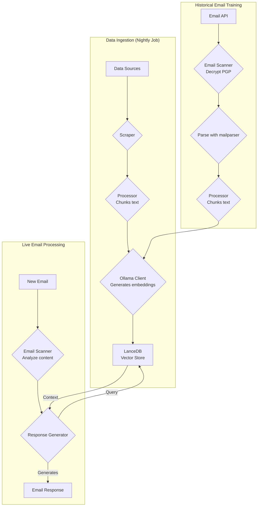
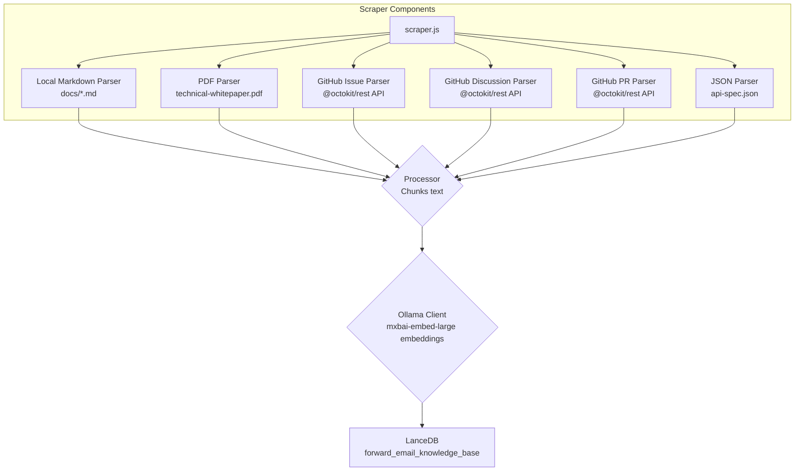
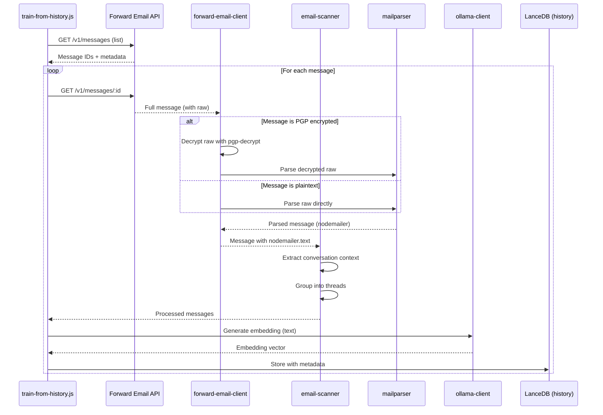

# Vytvoření AI zákaznické podpory s důrazem na soukromí pomocí LanceDB, Ollama a Node.js {#building-a-privacy-first-ai-customer-support-agent-with-lancedb-ollama-and-nodejs}


> \[!NOTE]
> Tento dokument popisuje naši cestu při vytváření samo-hostované AI podpory. Podobné výzvy jsme popsali v našem blogovém příspěvku [Email Startup Graveyard](https://forwardemail.net/blog/docs/email-startup-graveyard-why-80-percent-email-companies-fail). Upřímně jsme uvažovali o napsání pokračování s názvem „AI Startup Graveyard“, ale možná budeme muset počkat další rok nebo tak, dokud bublina AI potenciálně nepraskne(?). Prozatím je to naše shrnutí toho, co fungovalo, co ne, a proč jsme to dělali tímto způsobem.

Takto jsme vytvořili vlastní AI zákaznickou podporu. Udělali jsme to těžkou cestou: samo-hostovaně, s důrazem na soukromí a plně pod naší kontrolou. Proč? Protože nedůvěřujeme službám třetích stran s daty našich zákazníků. Je to požadavek GDPR a DPA a je to správné.

Nebyl to zábavný víkendový projekt. Byla to měsíční cesta plná řešení rozbitých závislostí, zavádějící dokumentace a obecného chaosu open-source AI ekosystému v roce 2025. Tento dokument je záznamem toho, co jsme vytvořili, proč jsme to vytvořili a jaké překážky jsme na cestě potkali.


## Obsah {#table-of-contents}

* [Výhody pro zákazníky: AI rozšířená lidská podpora](#customer-benefits-ai-augmented-human-support)
  * [Rychlejší a přesnější odpovědi](#faster-more-accurate-responses)
  * [Konzistence bez vyhoření](#consistency-without-burnout)
  * [Co získáte](#what-you-get)
* [Osobní zamyšlení: Dvacetiletá dřina](#a-personal-reflection-the-two-decade-grind)
* [Proč je soukromí důležité](#why-privacy-matters)
* [Analýza nákladů: Cloud AI vs samo-hostované řešení](#cost-analysis-cloud-ai-vs-self-hosted)
  * [Porovnání cloudových AI služeb](#cloud-ai-service-comparison)
  * [Rozpis nákladů: znalostní báze 5GB](#cost-breakdown-5gb-knowledge-base)
  * [Náklady na samo-hostovaný hardware](#self-hosted-hardware-costs)
* [Používání vlastní API](#dogfooding-our-own-api)
  * [Proč je používání vlastní API důležité](#why-dogfooding-matters)
  * [Příklady použití API](#api-usage-examples)
  * [Výhody výkonu](#performance-benefits)
* [Šifrovací architektura](#encryption-architecture)
  * [Vrstva 1: Šifrování schránky (chacha20-poly1305)](#layer-1-mailbox-encryption-chacha20-poly1305)
  * [Vrstva 2: Šifrování zpráv na úrovni PGP](#layer-2-message-level-pgp-encryption)
  * [Proč je to důležité pro trénink](#why-this-matters-for-training)
  * [Zabezpečení úložiště](#storage-security)
  * [Lokální úložiště je standardní praxe](#local-storage-is-standard-practice)
* [Architektura](#the-architecture)
  * [Vysoká úroveň toku](#high-level-flow)
  * [Podrobný tok scraperu](#detailed-scraper-flow)
* [Jak to funguje](#how-it-works)
  * [Vytváření znalostní báze](#building-the-knowledge-base)
  * [Trénink z historických e-mailů](#training-from-historical-emails)
  * [Zpracování příchozích e-mailů](#processing-incoming-emails)
  * [Správa vektorového úložiště](#vector-store-management)
* [Hřbitov vektorových databází](#the-vector-database-graveyard)
* [Systémové požadavky](#system-requirements)
* [Konfigurace Cron úloh](#cron-job-configuration)
  * [Proměnné prostředí](#environment-variables)
  * [Cron úlohy pro více schránek](#cron-jobs-for-multiple-inboxes)
  * [Rozpis Cron rozvrhu](#cron-schedule-breakdown)
  * [Dynamický výpočet data](#dynamic-date-calculation)
  * [Počáteční nastavení: extrakce seznamu URL ze sitemap](#initial-setup-extract-url-list-from-sitemap)
  * [Manuální testování Cron úloh](#testing-cron-jobs-manually)
  * [Monitorování logů](#monitoring-logs)
* [Ukázky kódu](#code-examples)
  * [Scraping a zpracování](#scraping-and-processing)
  * [Trénink z historických e-mailů](#training-from-historical-emails-1)
  * [Dotazování na kontext](#querying-for-context)
* [Budoucnost: výzkum a vývoj spamového skeneru](#the-future-spam-scanner-rd)
* [Řešení problémů](#troubleshooting)
  * [Chyba nesouladu rozměrů vektoru](#vector-dimension-mismatch-error)
  * [Prázdný kontext znalostní báze](#empty-knowledge-base-context)
  * [Selhání dešifrování PGP](#pgp-decryption-failures)
* [Tipy pro použití](#usage-tips)
  * [Jak dosáhnout Inbox Zero](#achieving-inbox-zero)
  * [Používání štítku skip-ai](#using-the-skip-ai-label)
  * [Řetězení e-mailů a odpověď všem](#email-threading-and-reply-all)
  * [Monitorování a údržba](#monitoring-and-maintenance)
* [Testování](#testing)
  * [Spouštění testů](#running-tests)
  * [Pokrytí testy](#test-coverage)
  * [Testovací prostředí](#test-environment)
* [Klíčové poznatky](#key-takeaways)
## Výhody pro zákazníky: AI rozšířená lidská podpora {#customer-benefits-ai-augmented-human-support}

Náš AI systém nenahrazuje náš podpůrný tým – dělá ho lepším. Co to pro vás znamená:

### Rychlejší a přesnější odpovědi {#faster-more-accurate-responses}

**Člověk v procesu**: Každý AI generovaný návrh je před odesláním zkontrolován, upraven a vybrán naším lidským podpůrným týmem. AI se stará o počáteční výzkum a tvorbu návrhu, což uvolňuje náš tým, aby se mohl soustředit na kontrolu kvality a personalizaci.

**Trénováno na lidské odbornosti**: AI se učí z:

* Naší ručně psané znalostní databáze a dokumentace
* Blogových příspěvků a tutoriálů napsaných lidmi
* Našich komplexních FAQ (psaných lidmi)
* Minulých zákaznických konverzací (vše řešeno skutečnými lidmi)

Dostáváte odpovědi založené na letech lidské odbornosti, jen doručené rychleji.

### Konzistence bez vyhoření {#consistency-without-burnout}

Náš malý tým denně řeší stovky požadavků na podporu, z nichž každý vyžaduje různé technické znalosti a mentální přepínání kontextu:

* Otázky ohledně fakturace vyžadují znalost finančního systému
* Problémy s DNS vyžadují znalost sítí
* Integrace API vyžaduje programátorské znalosti
* Bezpečnostní hlášení vyžadují hodnocení zranitelností

Bez pomoci AI toto neustálé přepínání kontextu vede k:

* Pomalejším reakcím
* Lidským chybám způsobeným únavou
* Nekonzistentní kvalitě odpovědí
* Vyhoření týmu

**S AI rozšířením** náš tým:

* Reaguje rychleji (AI vytváří návrhy během sekund)
* Dělá méně chyb (AI zachytává běžné omyly)
* Udržuje konzistentní kvalitu (AI vždy odkazuje na stejnou znalostní databázi)
* Zůstává svěží a soustředěný (méně času na výzkum, více času na pomoc)

### Co získáte {#what-you-get}

✅ **Rychlost**: AI vytváří návrhy odpovědí během sekund, lidé je zkontrolují a odešlou během minut

✅ **Přesnost**: Odpovědi založené na naší skutečné dokumentaci a minulých řešeních

✅ **Konzistence**: Stejně kvalitní odpovědi ať je 9 ráno nebo 9 večer

✅ **Lidský přístup**: Každá odpověď je zkontrolována a personalizována naším týmem

✅ **Žádné halucinace**: AI používá pouze naši ověřenou znalostní databázi, ne obecná internetová data

> \[!NOTE]
> **Vždy komunikujete s lidmi**. AI je výzkumný asistent, který našemu týmu pomáhá rychleji najít správnou odpověď. Představte si to jako knihovníka, který okamžitě najde relevantní knihu – ale člověk ji stále čte a vysvětluje vám ji.


## Osobní zamyšlení: Dvacetiletý zápřah {#a-personal-reflection-the-two-decade-grind}

Než se ponoříme do technických detailů, osobní poznámka. Dělám to téměř dvě desetiletí. Nekonečné hodiny u klávesnice, neúnavné hledání řešení, hluboký, soustředěný zápřah – to je realita budování něčeho smysluplného. Realita, která je často přehlížena v hype cyklech nových technologií.

Nedávný výbuch AI byl obzvlášť frustrující. Prodávají nám sen o automatizaci, o AI asistentech, kteří napíšou náš kód a vyřeší naše problémy. Realita? Výstup je často odpadkový kód, který vyžaduje více času na opravu, než by trvalo napsat ho od začátku. Příslib usnadnění života je falešný. Je to rozptýlení od tvrdé, nezbytné práce budování.

A pak je tu začarovaný kruh přispívání do open-source. Už jste vyčerpaní, unavení z toho zápřahu. Použijete AI, abyste napsali podrobný, dobře strukturovaný bug report, doufajíc, že to ulehčí správcům pochopit a opravit problém. A co se stane? Dostanete výtku. Váš příspěvek je odmítnut jako „mimo téma“ nebo málo náročný, jak jsme viděli v nedávném [Node.js GitHub issue](https://github.com/nodejs/node/issues/60719#issuecomment-3534304321). Je to facka pro zkušené vývojáře, kteří se jen snaží pomoci.

To je realita ekosystému, ve kterém pracujeme. Nejde jen o rozbité nástroje; jde o kulturu, která často nedokáže ocenit čas a [úsilí svých přispěvatelů](https://forwardemail.net/blog/docs/how-npm-packages-billion-downloads-shaped-javascript-ecosystem). Tento příspěvek je kronikou této reality. Je to příběh o nástrojích, ano, ale také o lidských nákladech budování v rozbitém ekosystému, který je navzdory všem slibům zásadně rozbitý.
## Proč je soukromí důležité {#why-privacy-matters}

Náš [technický whitepaper](https://forwardemail.net/technical-whitepaper.pdf) podrobně popisuje naši filozofii ochrany soukromí. Krátká verze: nikdy neposíláme data zákazníků třetím stranám. Nikdy. To znamená žádné OpenAI, žádné Anthropic, žádné cloudové vektorové databáze. Vše běží lokálně na naší infrastruktuře. Toto je nezpochybnitelné pro dodržení GDPR a našich závazků DPA.


## Analýza nákladů: Cloudové AI vs vlastní hosting {#cost-analysis-cloud-ai-vs-self-hosted}

Než se pustíme do technické implementace, pojďme si říct, proč je vlastní hosting důležitý z hlediska nákladů. Cenové modely cloudových AI služeb je činí nepřijatelně drahými pro použití s vysokým objemem, jako je zákaznická podpora.

### Porovnání cloudových AI služeb {#cloud-ai-service-comparison}

| Služba         | Poskytovatel        | Cena za embedding                                               | Cena LLM (vstup)                                                          | Cena LLM (výstup)       | Zásady ochrany soukromí                            | GDPR/DPA        | Hosting           | Sdílení dat      |
| -------------- | ------------------- | ---------------------------------------------------------------- | -------------------------------------------------------------------------- | ----------------------- | ------------------------------------------------- | --------------- | ----------------- | ---------------- |
| **OpenAI**     | OpenAI (USA)        | [$0.02-0.13/1M tokenů](https://openai.com/api/pricing/)          | $0.15-20/1M tokenů                                                         | $0.60-80/1M tokenů      | [Odkaz](https://openai.com/policies/privacy-policy/) | Omezené DPA     | Azure (USA)       | Ano (trénink)    |
| **Claude**     | Anthropic (USA)     | N/A                                                              | [$3-20/1M tokenů](https://docs.claude.com/en/docs/about-claude/pricing)    | $15-80/1M tokenů        | [Odkaz](https://www.anthropic.com/legal/privacy)   | Omezené DPA     | AWS/GCP (USA)     | Ne (uváděno)     |
| **Gemini**     | Google (USA)        | [$0.15/1M tokenů](https://ai.google.dev/gemini-api/docs/pricing) | $0.30-1.00/1M tokenů                                                       | $2.50/1M tokenů         | [Odkaz](https://policies.google.com/privacy)       | Omezené DPA     | GCP (USA)         | Ano (vylepšení)  |
| **DeepSeek**   | DeepSeek (Čína)     | N/A                                                              | [$0.028-0.28/1M tokenů](https://api-docs.deepseek.com/quick_start/pricing) | $0.42/1M tokenů         | [Odkaz](https://www.deepseek.com/en)               | Neznámé         | Čína              | Neznámé          |
| **Mistral**    | Mistral AI (Francie)| [$0.10/1M tokenů](https://mistral.ai/pricing)                    | $0.40/1M tokenů                                                            | $2.00/1M tokenů         | [Odkaz](https://mistral.ai/terms/)                 | EU GDPR         | EU                | Neznámé          |
| **Vlastní hosting** | Vy               | $0 (stávající hardware)                                          | $0 (stávající hardware)                                                    | $0 (stávající hardware) | Vaše zásady                                        | Plná shoda      | MacBook M5 + cron | Nikdy            |

> \[!WARNING]
> **Obavy o suverenitu dat**: Poskytovatelé z USA (OpenAI, Claude, Gemini) podléhají CLOUD Act, který umožňuje přístup americké vládě k datům. DeepSeek (Čína) funguje podle čínských zákonů o datech. Zatímco Mistral (Francie) nabízí hosting v EU a soulad s GDPR, vlastní hosting zůstává jedinou možností pro úplnou suverenitu a kontrolu nad daty.

### Rozpis nákladů: 5GB znalostní báze {#cost-breakdown-5gb-knowledge-base}

Spočítejme náklady na zpracování 5GB znalostní báze (typické pro středně velkou firmu s dokumenty, e-maily a historií podpory).

**Předpoklady:**

* 5GB textu ≈ 1,25 miliardy tokenů (při předpokladu \~4 znaky/token)
* Počáteční generování embeddingů
* Měsíční přeškolení (plné nové embeddingy)
* 10 000 dotazů na podporu měsíčně
* Průměrný dotaz: 500 tokenů vstup, 300 tokenů výstup
**Podrobný rozpis nákladů:**

| Komponenta                            | OpenAI           | Claude          | Gemini               | Self-Hosted        |
| -------------------------------------- | ---------------- | --------------- | -------------------- | ------------------ |
| **Počáteční embedding** (1,25 mld. tokenů) | 25 000 $         | N/A             | 187 500 $            | 0 $                |
| **Měsíční dotazy** (10K × 800 tokenů) | 1 200–16 000 $   | 2 400–16 000 $  | 2 400–3 200 $        | 0 $                |
| **Měsíční přeškolení** (1,25 mld. tokenů) | 25 000 $         | N/A             | 187 500 $            | 0 $                |
| **Celkem za první rok**               | 325 200–217 000 $| 28 800–192 000 $| 2 278 800–2 226 000 $| ~60 $ (elektřina)  |
| **Soulad s ochranou soukromí**       | ❌ Omezený        | ❌ Omezený       | ❌ Omezený            | ✅ Plný             |
| **Datová suverenita**                  | ❌ Ne             | ❌ Ne            | ❌ Ne                 | ✅ Ano              |

> \[!CAUTION]
> **Náklady na embedding u Gemini jsou katastrofální** při 0,15 $/1M tokenů. Embedding jedné 5GB znalostní báze by stál 187 500 $. To je 37× dražší než u OpenAI a činí to Gemini zcela nepoužitelným pro produkci.

### Náklady na hardware pro self-hosting {#self-hosted-hardware-costs}

Naše nastavení běží na stávajícím hardwaru, který již vlastníme:

* **Hardware**: MacBook M5 (již vlastněný pro vývoj)
* **Další náklady**: 0 $ (používá existující hardware)
* **Elektřina**: ~5 $/měsíc (odhad)
* **Celkem za první rok**: ~60 $
* **Průběžné náklady**: 60 $/rok

**ROI**: Self-hosting má prakticky nulové marginální náklady, protože používáme stávající vývojový hardware. Systém běží pomocí cron úloh v době mimo špičku.


## Používání vlastního API {#dogfooding-our-own-api}

Jedním z nejdůležitějších architektonických rozhodnutí bylo, aby všechny AI úlohy používaly přímo [Forward Email API](https://forwardemail.net/email-api). Není to jen dobrá praxe — je to hnací síla pro optimalizaci výkonu.

### Proč je používání vlastního API důležité {#why-dogfooding-matters}

Když naše AI úlohy používají stejné API koncové body jako naši zákazníci:

1. **Výkonnostní úzká místa postihnou nás první** – Bolest pocítíme dříve než zákazníci
2. **Optimalizace prospívá všem** – Vylepšení pro naše úlohy automaticky zlepšují zákaznickou zkušenost
3. **Testování v reálném světě** – Naše úlohy zpracovávají tisíce e-mailů, což poskytuje kontinuální zátěžové testování
4. **Znovupoužití kódu** – Stejná autentizace, omezení rychlosti, zpracování chyb a logika cachování

### Příklady použití API {#api-usage-examples}

**Výpis zpráv (train-from-history.js):**

```javascript
// Používá GET /v1/messages?folder=INBOX s BasicAuth
// Vylučuje eml, raw, nodemailer pro snížení velikosti odpovědi (potřebujeme jen ID)
const response = await axios.get(
  `${this.apiBase}/v1/messages`,
  {
    params: {
      folder: 'INBOX',
      limit: 100,
      eml: false,
      raw: false,
      nodemailer: false
    },
    auth: {
      username: process.env.FORWARD_EMAIL_ALIAS_USERNAME,
      password: process.env.FORWARD_EMAIL_ALIAS_PASSWORD
    }
  }
);

const messages = response.data;
// Vrací: [{ id, subject, date, ... }, ...]
// Plný obsah zprávy se načítá později přes GET /v1/messages/:id
```

**Načítání plných zpráv (forward-email-client.js):**

```javascript
// Používá GET /v1/messages/:id pro získání plné zprávy s raw obsahem
const response = await axios.get(
  `${this.apiBase}/v1/messages/${messageId}`,
  {
    auth: {
      username: this.aliasUsername,
      password: this.aliasPassword
    }
  }
);

const message = response.data;
// Vrací: { id, subject, raw, eml, nodemailer: { ... }, ... }
```

**Vytváření konceptů odpovědí (process-inbox.js):**

```javascript
// Používá POST /v1/messages pro vytvoření konceptů odpovědí
const response = await axios.post(
  `${this.apiBase}/v1/messages`,
  {
    folder: 'Drafts',
    subject: `Re: ${originalSubject}`,
    to: senderEmail,
    text: generatedResponse,
    inReplyTo: originalMessageId
  },
  {
    auth: {
      username: process.env.FORWARD_EMAIL_ALIAS_USERNAME,
      password: process.env.FORWARD_EMAIL_ALIAS_PASSWORD
    }
  }
);
```
### Výkonnostní výhody {#performance-benefits}

Protože naše AI úlohy běží na stejné API infrastruktuře:

* **Optimalizace cache** prospívají jak úlohám, tak zákazníkům
* **Omezení rychlosti (rate limiting)** je testováno při reálné zátěži
* **Zpracování chyb** je prověřené v praxi
* **Časy odezvy API** jsou neustále monitorovány
* **Dotazy do databáze** jsou optimalizovány pro oba případy použití
* **Optimalizace šířky pásma** – Vynechání `eml`, `raw`, `nodemailer` při výpisu snižuje velikost odpovědi přibližně o 90 %

Když `train-from-history.js` zpracovává 1 000 e-mailů, provádí přes 1 000 API volání. Jakákoli neefektivita v API se okamžitě projeví. To nás nutí optimalizovat přístup k IMAP, dotazy do databáze a serializaci odpovědí – vylepšení, která přímo prospívají našim zákazníkům.

**Příklad optimalizace**: Výpis 100 zpráv s plným obsahem = přibližně 10 MB odpověď. Výpis s `eml: false, raw: false, nodemailer: false` = přibližně 100 KB odpověď (100× menší).


## Šifrovací architektura {#encryption-architecture}

Naše úložiště e-mailů používá více vrstev šifrování, které musí AI úlohy dešifrovat v reálném čase pro trénink.

### Vrstva 1: Šifrování schránky (chacha20-poly1305) {#layer-1-mailbox-encryption-chacha20-poly1305}

Všechny IMAP schránky jsou uloženy jako SQLite databáze zašifrované pomocí **chacha20-poly1305**, kvantově bezpečného šifrovacího algoritmu. Podrobnosti najdete v našem [blogovém příspěvku o kvantově bezpečné šifrované e-mailové službě](https://forwardemail.net/blog/docs/best-quantum-safe-encrypted-email-service).

**Klíčové vlastnosti:**

* **Algoritmus**: ChaCha20-Poly1305 (AEAD šifra)
* **Kvantově bezpečné**: Odolné vůči útokům kvantových počítačů
* **Uložení**: SQLite databázové soubory na disku
* **Přístup**: Dešifrováno v paměti při přístupu přes IMAP/API

### Vrstva 2: Šifrování zpráv na úrovni PGP {#layer-2-message-level-pgp-encryption}

Mnoho podpůrných e-mailů je navíc šifrováno pomocí PGP (standard OpenPGP). AI úlohy je musí dešifrovat, aby mohly extrahovat obsah pro trénink.

**Průběh dešifrování:**

```javascript
// 1. API vrací zprávu s šifrovaným raw obsahem
const message = await forwardEmailClient.getMessage(id);

// 2. Zkontrolovat, zda je raw obsah PGP-šifrovaný
if (isMessageEncrypted(message.raw)) {
  // 3. Dešifrovat pomocí našeho privátního klíče
  const decryptedRaw = await pgpDecrypt(message.raw);

  // 4. Parsovat dešifrovanou MIME zprávu
  const parsed = await simpleParser(decryptedRaw);

  // 5. Naplnit nodemailer dešifrovaným obsahem
  message.nodemailer = {
    text: parsed.text,
    html: parsed.html,
    from: parsed.from,
    to: parsed.to,
    subject: parsed.subject,
    date: parsed.date
  };
}
```

**Konfigurace PGP:**

```bash
# Privátní klíč pro dešifrování (cesta k ASCII-armored klíči)
GPG_SECURITY_KEY="/path/to/private-key.asc"

# Heslo k privátnímu klíči (pokud je šifrovaný)
GPG_SECURITY_PASSPHRASE="your-passphrase"
```

Pomocný skript `pgp-decrypt.js`:

1. Jednou načte privátní klíč z disku (uloží do paměti)
2. Dešifruje klíč pomocí hesla
3. Používá dešifrovaný klíč pro všechna dešifrování zpráv
4. Podporuje rekurzivní dešifrování pro vnořené šifrované zprávy

### Proč je to důležité pro trénink {#why-this-matters-for-training}

Bez správného dešifrování by se AI trénovala na zašifrovaném nesmyslu:

```
-----BEGIN PGP MESSAGE-----
Version: OpenPGP.js v4.10.10

wcBMA8Z3lHJnFnNUAQgAqK7F8...
-----END PGP MESSAGE-----
```

S dešifrováním se AI trénuje na skutečném obsahu:

```
Subject: Re: Bug Report

Hi John,

Thanks for reporting this issue. I've confirmed the bug
and created a fix in PR #1234...
```

### Bezpečnost úložiště {#storage-security}

Dešifrování probíhá v paměti během vykonávání úlohy a dešifrovaný obsah je převeden na embeddingy, které jsou následně uloženy v LanceDB vektorové databázi na disku.

**Kde data žijí:**

* **Vektorová databáze**: Uložena na zašifrovaných pracovních stanicích MacBook M5
* **Fyzická bezpečnost**: Pracovní stanice jsou u nás po celou dobu (nejsou v datových centrech)
* **Šifrování disku**: Plné šifrování disku na všech pracovních stanicích
* **Síťová bezpečnost**: Firewall a izolace od veřejných sítí

**Budoucí nasazení v datovém centru:**
Pokud někdy přejdeme na hosting v datovém centru, servery budou mít:

* LUKS plné šifrování disku
* Zakázaný přístup přes USB
* Fyzická bezpečnostní opatření
* Síťovou izolaci
Pro úplné informace o našich bezpečnostních postupech navštivte naši [bezpečnostní stránku](https://forwardemail.net/en/security).

> \[!NOTE]
> Vektorová databáze obsahuje embeddingy (matematické reprezentace), nikoli původní prostý text. Nicméně embeddingy mohou být potenciálně zpětně analyzovány, proto je uchováváme na šifrovaných, fyzicky zabezpečených pracovních stanicích.

### Lokální ukládání je standardní praxe {#local-storage-is-standard-practice}

Ukládání embeddingů na pracovních stanicích našeho týmu se nijak neliší od toho, jak již zacházíme s e-maily:

* **Thunderbird**: Stahuje a ukládá celý obsah e-mailu lokálně do souborů mbox/maildir
* **Webmail klienti**: Kešují data e-mailů v úložišti prohlížeče a lokálních databázích
* **IMAP klienti**: Uchovávají lokální kopie zpráv pro offline přístup
* **Náš AI systém**: Ukládá matematické embeddingy (nikoli prostý text) v LanceDB

Klíčový rozdíl: embeddingy jsou **bezpečnější** než prostý text e-mailu, protože jsou:

1. Matematické reprezentace, nikoli čitelný text
2. Obtížněji zpětně analyzovatelné než prostý text
3. Stále podléhají stejné fyzické bezpečnosti jako naše e-mailové klienty

Pokud je pro náš tým přijatelné používat Thunderbird nebo webmail na šifrovaných pracovních stanicích, je stejně přijatelné (a pravděpodobně bezpečnější) ukládat embeddingy stejným způsobem.


## Architektura {#the-architecture}

Zde je základní tok. Vypadá jednoduše. Nebylo to tak.

> \[!NOTE]
> Všechny úlohy používají přímo Forward Email API, což zajišťuje, že optimalizace výkonu prospívají jak našemu AI systému, tak našim zákazníkům.

### Vysoká úroveň toku {#high-level-flow}



### Podrobný tok scraperu {#detailed-scraper-flow}

`scraper.js` je srdcem získávání dat. Je to sbírka parserů pro různé datové formáty.




## Jak to funguje {#how-it-works}

Proces je rozdělen do tří hlavních částí: budování znalostní báze, trénink z historických e-mailů a zpracování nových e-mailů.

### Budování znalostní báze {#building-the-knowledge-base}

**`update-knowledge-base.js`**: Toto je hlavní úloha. Spouští se každou noc, vymaže starý vektorový obchod a znovu jej vytvoří od začátku. Používá `scraper.js` k získání obsahu ze všech zdrojů, `processor.js` k rozdělení textu na části a `ollama-client.js` k vytvoření embeddingů. Nakonec `vector-store.js` uloží vše do LanceDB.

**Datové zdroje:**

* Lokální Markdown soubory (`docs/*.md`)
* Technický whitepaper PDF (`assets/technical-whitepaper.pdf`)
* API specifikace JSON (`assets/api-spec.json`)
* GitHub issues (přes Octokit)
* GitHub diskuse (přes Octokit)
* GitHub pull requesty (přes Octokit)
* Seznam URL sitemap (`$LANCEDB_PATH/valid-urls.json`)

### Trénink z historických e-mailů {#training-from-historical-emails}

**`train-from-history.js`**: Tato úloha prohledává historické e-maily ze všech složek, dešifruje PGP zašifrované zprávy a přidává je do samostatného vektorového obchodu (`customer_support_history`). To poskytuje kontext z minulých podpůrných interakcí.
**Průběh zpracování e-mailů:**



**Klíčové vlastnosti:**

* **PGP dešifrování**: Používá pomocný skript `pgp-decrypt.js` s proměnnou prostředí `GPG_SECURITY_KEY`
* **Seskupování vláken**: Seskupuje související e-maily do konverzačních vláken
* **Zachování metadat**: Ukládá složku, předmět, datum, stav šifrování
* **Kontext odpovědi**: Propojuje zprávy s jejich odpověďmi pro lepší kontext

**Konfigurace:**

```bash
# Proměnné prostředí pro train-from-history
HISTORY_SCAN_LIMIT=1000              # Max počet zpráv k zpracování
HISTORY_SCAN_SINCE="2024-01-01"      # Zpracovávat pouze zprávy po tomto datu
HISTORY_DECRYPT_PGP=true             # Pokus o PGP dešifrování
GPG_SECURITY_KEY="/path/to/key.asc"  # Cesta k soukromému PGP klíči
GPG_SECURITY_PASSPHRASE="passphrase" # Heslo ke klíči (volitelné)
```

**Co se ukládá:**

```javascript
{
  type: 'historical_email',
  folder: 'INBOX',
  subject: 'Re: Bug Report',
  date: '2025-01-15T10:30:00Z',
  messageId: '67e2f288893921...',
  threadId: 'Bug Report',
  hasReply: true,
  encrypted: true,
  decrypted: true,
  replySubject: 'Bug Report',
  replyText: 'First 500 chars of reply...',
  chunkSize: 1000,
  chunkOverlap: 200,
  chunkIndex: 0
}
```

> \[!TIP]
> Spusťte `train-from-history` po počátečním nastavení pro naplnění historického kontextu. To výrazně zlepšuje kvalitu odpovědí učením se z minulých interakcí podpory.

### Zpracování příchozích e-mailů {#processing-incoming-emails}

**`process-inbox.js`**: Tento úkol běží na e-mailech v našich schránkách `support@forwardemail.net`, `abuse@forwardemail.net` a `security@forwardemail.net` (konkrétně v IMAP složce `INBOX`). Využívá naši API na <https://forwardemail.net/email-api> (např. `GET /v1/messages?folder=INBOX` s přístupem BasicAuth pomocí našich IMAP přihlašovacích údajů pro každou schránku). Analyzuje obsah e-mailu, dotazuje se jak na znalostní bázi (`forward_email_knowledge_base`), tak na historické vektorové úložiště e-mailů (`customer_support_history`), a poté předává kombinovaný kontext do `response-generator.js`. Generátor používá `mxbai-embed-large` přes Ollama k vytvoření odpovědi.

**Funkce automatizovaného workflow:**

1. **Automatizace Inbox Zero**: Po úspěšném vytvoření konceptu je původní zpráva automaticky přesunuta do složky Archiv. To udržuje vaši doručenou poštu čistou a pomáhá dosáhnout inbox zero bez manuálního zásahu.

2. **Přeskočení AI zpracování**: Jednoduše přidejte štítek `skip-ai` (bez ohledu na velikost písmen) k jakékoli zprávě, aby se zabránilo AI zpracování. Zpráva zůstane nedotčena ve vaší doručené poště, což vám umožní ji řešit ručně. To je užitečné pro citlivé zprávy nebo složité případy vyžadující lidský úsudek.

3. **Správné řazení e-mailových vláken**: Všechny koncepty odpovědí obsahují původní zprávu citovanou níže (pomocí standardního prefixu ` >  `), podle konvencí e-mailových odpovědí ve formátu "Dne \[datum] napsal \[odesílatel]:". To zajišťuje správný kontext konverzace a řazení ve e-mailových klientech.

4. **Chování Odpovědět všem**: Systém automaticky zpracovává hlavičky Reply-To a příjemce CC:
   * Pokud existuje hlavička Reply-To, stává se adresou To a původní From je přidán do CC
   * Všichni původní příjemci To a CC jsou zahrnuti do odpovědi v CC (kromě vaší vlastní adresy)
   * Dodržuje standardní konvence odpovědi všem pro skupinové konverzace
**Hodnocení zdrojů**: Systém používá **vážené hodnocení** k prioritizaci zdrojů:

* FAQ: 100 % (nejvyšší priorita)
* Technický whitepaper: 95 %
* API specifikace: 90 %
* Oficiální dokumentace: 85 %
* GitHub issues: 70 %
* Historické e-maily: 50 %

### Správa Vector Store {#vector-store-management}

Třída `VectorStore` v `helpers/customer-support-ai/vector-store.js` je naše rozhraní k LanceDB.

**Přidávání dokumentů:**

```javascript
// vector-store.js
async addDocument(text, metadata) {
  const embedding = await this.ollama.generateEmbedding(text);
  await this.table.add([{
    vector: embedding,
    text,
    ...metadata
  }]);
}
```

**Vymazání úložiště:**

```javascript
// Možnost 1: Použijte metodu clear()
await vectorStore.clear();

// Možnost 2: Smažte lokální adresář databáze
await fs.rm(process.env.LANCEDB_PATH, { recursive: true, force: true });
```

Prostředí `LANCEDB_PATH` ukazuje na lokální adresář embedded databáze. LanceDB je serverless a embedded, takže není potřeba žádný samostatný proces k řízení.


## Hřbitov vektorových databází {#the-vector-database-graveyard}

To byla první velká překážka. Vyzkoušeli jsme několik vektorových databází, než jsme se rozhodli pro LanceDB. Tady je, co se u každé pokazilo.

| Databáze    | GitHub                                                      | Co se pokazilo                                                                                                                                                                                                      | Konkrétní problémy                                                                                                                                                                                                                                                                                                                                                       | Bezpečnostní obavy                                                                                                                                                                                               |
| ----------- | ----------------------------------------------------------- | ------------------------------------------------------------------------------------------------------------------------------------------------------------------------------------------------------------------ | ------------------------------------------------------------------------------------------------------------------------------------------------------------------------------------------------------------------------------------------------------------------------------------------------------------------------------------------------------------------------- | ---------------------------------------------------------------------------------------------------------------------------------------------------------------------------------------------------------------- |
| **ChromaDB** | [chroma-core/chroma](https://github.com/chroma-core/chroma) | `pip3 install chromadb` vám nainstaluje verzi z pravěku s `PydanticImportError`. Jediný způsob, jak získat funkční verzi, je kompilace ze zdroje. Není to přátelské pro vývojáře.                                  | Chaos v závislostech Pythonu. Více uživatelů hlásí nefunkční pip instalace ([#774](https://github.com/chroma-core/chroma/issues/774), [#163](https://github.com/chroma-core/chroma/issues/163)). Dokumentace říká „použijte Docker“, což není odpověď pro lokální vývoj. Padají na Windows při >99 záznamech ([#3058](https://github.com/chroma-core/chroma/issues/3058)). | **CVE-2024-45848**: Spuštění libovolného kódu přes integraci ChromaDB v MindsDB. Kritické zranitelnosti OS v Docker image ([#3170](https://github.com/chroma-core/chroma/issues/3170)).                                   |
| **Qdrant**  | [qdrant/qdrant](https://github.com/qdrant/qdrant)           | Homebrew tap (`qdrant/qdrant/qdrant`) uvedený v jejich staré dokumentaci zmizel. Beze stopy. Bez vysvětlení. Oficiální dokumentace nyní jen říká „použijte Docker.“                                                  | Chybějící Homebrew tap. Žádný nativní binární soubor pro macOS. Pouze Docker je překážkou pro rychlé lokální testování.                                                                                                                                                                                                                                               | **CVE-2024-2221**: Zranitelnost umožňující nahrání libovolného souboru a vzdálené spuštění kódu (opraveno ve verzi v1.9.0). Nízké skóre bezpečnostní zralosti od [IronCore Labs](https://ironcorelabs.com/vectordbs/qdrant-security/). |
| **Weaviate** | [weaviate/weaviate](https://github.com/weaviate/weaviate)   | Verze pro Homebrew měla kritickou chybu v clusterování (`leader not found`). Dokumentované příznaky pro opravu (`RAFT_JOIN`, `CLUSTER_HOSTNAME`) nefungovaly. Základně nefunkční pro jednonodové nasazení.          | Chyby v clusterování i v režimu jedné uzlu. Překomplikované pro jednoduché případy použití.                                                                                                                                                                                                                                                                               | Nebyly nalezeny závažné CVE, ale složitost zvyšuje povrch útoku.                                                                                                                                                   |
| **LanceDB** | [lancedb/lancedb](https://github.com/lancedb/lancedb)       | Tato fungovala. Je embedded a serverless. Žádný samostatný proces. Jedinou nepříjemností je matoucí pojmenování balíčků (`vectordb` je zastaralý, používejte `@lancedb/lancedb`) a roztříštěná dokumentace. To zvládneme. | Matoucí pojmenování balíčků (`vectordb` vs `@lancedb/lancedb`), ale jinak spolehlivé. Embedded architektura eliminuje celé třídy bezpečnostních problémů.                                                                                                                                                                                                             | Žádné známé CVE. Embedded design znamená žádný síťový povrch útoku.                                                                                                                                               |
> \[!WARNING]
> **ChromaDB má kritické bezpečnostní zranitelnosti.** [CVE-2024-45848](https://nvd.nist.gov/vuln/detail/CVE-2024-45848) umožňuje spuštění libovolného kódu. Instalace přes pip je zásadně rozbitá kvůli problémům se závislostí Pydantic. Vyhněte se použití v produkci.

> \[!WARNING]
> **Qdrant měl zranitelnost RCE při nahrávání souborů** ([CVE-2024-2221](https://qdrant.tech/blog/cve-2024-2221-response/)), která byla opravena až ve verzi v1.9.0. Pokud musíte používat Qdrant, ujistěte se, že máte nejnovější verzi.

> \[!CAUTION]
> Ekosystém open-source vektorových databází je drsný. Nedůvěřujte dokumentaci. Předpokládejte, že je vše rozbité, dokud se neprokáže opak. Testujte lokálně před závazkem ke stacku.


## Systémové požadavky {#system-requirements}

* **Node.js:** v18.0.0+ ([GitHub](https://github.com/nodejs/node))
* **Ollama:** Nejnovější ([GitHub](https://github.com/ollama/ollama))
* **Model:** `mxbai-embed-large` přes Ollama
* **Vektorová databáze:** LanceDB ([GitHub](https://github.com/lancedb/lancedb))
* **Přístup na GitHub:** `@octokit/rest` pro scrapování issues ([GitHub](https://github.com/octokit/rest.js))
* **SQLite:** Pro primární databázi (přes `mongoose-to-sqlite`)


## Konfigurace Cron Jobu {#cron-job-configuration}

Všechny AI úlohy běží přes cron na MacBooku M5. Zde je návod, jak nastavit cron joby, aby běžely o půlnoci napříč více schránkami.

### Proměnné prostředí {#environment-variables}

Úlohy vyžadují tyto proměnné prostředí. Většinu lze nastavit v souboru `.env` (načítáno přes `@ladjs/env`), ale `HISTORY_SCAN_SINCE` musí být dynamicky vypočítáno v crontabu.

**V souboru `.env`:**

```bash
# Přihlašovací údaje Forward Email API (mění se podle schránky)
FORWARD_EMAIL_ALIAS_USERNAME=support@forwardemail.net
FORWARD_EMAIL_ALIAS_PASSWORD=your-imap-password

# PGP dešifrování (sdílené napříč všemi schránkami)
GPG_SECURITY_KEY=/path/to/private-key.asc
GPG_SECURITY_PASSPHRASE=your-passphrase

# Konfigurace historického skenování
HISTORY_SCAN_LIMIT=1000

# Cesta k LanceDB
LANCEDB_PATH=/path/to/lancedb
```

**V crontabu (dynamicky vypočítáno):**

```bash
# HISTORY_SCAN_SINCE musí být nastaven inline v crontabu s výpočtem shellového data
# Nemůže být v .env, protože @ladjs/env nevyhodnocuje shellové příkazy
HISTORY_SCAN_SINCE="$(date -v-1d +%Y-%m-%d)"  # macOS
HISTORY_SCAN_SINCE="$(date -d 'yesterday' +%Y-%m-%d)"  # Linux
```

### Cron joby pro více schránek {#cron-jobs-for-multiple-inboxes}

Upravte svůj crontab pomocí `crontab -e` a přidejte:

```bash
# Aktualizace znalostní báze (běží jednou, sdíleno napříč všemi schránkami)
0 0 * * * cd /path/to/forwardemail.net && LANCEDB_PATH="/path/to/lancedb" GPG_SECURITY_KEY="/path/to/key.asc" GPG_SECURITY_PASSPHRASE="pass" node jobs/customer-support-ai/update-knowledge-base.js >> /var/log/update-knowledge-base.log 2>&1

# Trénink z historie - support@forwardemail.net
0 0 * * * cd /path/to/forwardemail.net && FORWARD_EMAIL_ALIAS_USERNAME="support@forwardemail.net" FORWARD_EMAIL_ALIAS_PASSWORD="support-password" HISTORY_SCAN_SINCE="$(date -v-1d +%Y-%m-%d)" HISTORY_SCAN_LIMIT=1000 GPG_SECURITY_KEY="/path/to/key.asc" GPG_SECURITY_PASSPHRASE="pass" LANCEDB_PATH="/path/to/lancedb" node jobs/customer-support-ai/train-from-history.js >> /var/log/train-support.log 2>&1

# Trénink z historie - abuse@forwardemail.net
0 0 * * * cd /path/to/forwardemail.net && FORWARD_EMAIL_ALIAS_USERNAME="abuse@forwardemail.net" FORWARD_EMAIL_ALIAS_PASSWORD="abuse-password" HISTORY_SCAN_SINCE="$(date -v-1d +%Y-%m-%d)" HISTORY_SCAN_LIMIT=1000 GPG_SECURITY_KEY="/path/to/key.asc" GPG_SECURITY_PASSPHRASE="pass" LANCEDB_PATH="/path/to/lancedb" node jobs/customer-support-ai/train-from-history.js >> /var/log/train-abuse.log 2>&1

# Trénink z historie - security@forwardemail.net
0 0 * * * cd /path/to/forwardemail.net && FORWARD_EMAIL_ALIAS_USERNAME="security@forwardemail.net" FORWARD_EMAIL_ALIAS_PASSWORD="security-password" HISTORY_SCAN_SINCE="$(date -v-1d +%Y-%m-%d)" HISTORY_SCAN_LIMIT=1000 GPG_SECURITY_KEY="/path/to/key.asc" GPG_SECURITY_PASSPHRASE="pass" LANCEDB_PATH="/path/to/lancedb" node jobs/customer-support-ai/train-from-history.js >> /var/log/train-security.log 2>&1

# Zpracování schránky - support@forwardemail.net
*/5 * * * * cd /path/to/forwardemail.net && FORWARD_EMAIL_ALIAS_USERNAME="support@forwardemail.net" FORWARD_EMAIL_ALIAS_PASSWORD="support-password" GPG_SECURITY_KEY="/path/to/key.asc" GPG_SECURITY_PASSPHRASE="pass" LANCEDB_PATH="/path/to/lancedb" node jobs/customer-support-ai/process-inbox.js >> /var/log/process-support.log 2>&1

# Zpracování schránky - abuse@forwardemail.net
*/5 * * * * cd /path/to/forwardemail.net && FORWARD_EMAIL_ALIAS_USERNAME="abuse@forwardemail.net" FORWARD_EMAIL_ALIAS_PASSWORD="abuse-password" GPG_SECURITY_KEY="/path/to/key.asc" GPG_SECURITY_PASSPHRASE="pass" LANCEDB_PATH="/path/to/lancedb" node jobs/customer-support-ai/process-inbox.js >> /var/log/process-abuse.log 2>&1

# Zpracování schránky - security@forwardemail.net
*/5 * * * * cd /path/to/forwardemail.net && FORWARD_EMAIL_ALIAS_USERNAME="security@forwardemail.net" FORWARD_EMAIL_ALIAS_PASSWORD="security-password" GPG_SECURITY_KEY="/path/to/key.asc" GPG_SECURITY_PASSPHRASE="pass" LANCEDB_PATH="/path/to/lancedb" node jobs/customer-support-ai/process-inbox.js >> /var/log/process-security.log 2>&1
```
### Rozpis plánu Cron {#cron-schedule-breakdown}

| Úloha                    | Plán         | Popis                                                                             |
| ------------------------ | ------------ | --------------------------------------------------------------------------------- |
| `train-from-sitemap.js`  | `0 0 * * 0`  | Týdně (nedělní půlnoc) - Stáhne všechny URL ze sitemap a trénuje znalostní bázi   |
| `train-from-history.js`  | `0 0 * * *`  | Denně o půlnoci - Prohledává e-maily z předchozího dne podle schránky             |
| `process-inbox.js`       | `*/5 * * * *`| Každých 5 minut - Zpracovává nové e-maily a generuje koncepty                     |

### Dynamický výpočet data {#dynamic-date-calculation}

Proměnná `HISTORY_SCAN_SINCE` **musí být vypočítána přímo v crontabu** protože:

1. `.env` soubory jsou `@ladjs/env` čteny jako doslovné řetězce
2. Shellová substituce příkazů `$(...)` nefunguje v `.env` souborech
3. Datum musí být vypočítáno vždy čerstvě při každém spuštění cronu

**Správný přístup (v crontabu):**

```bash
# macOS (BSD date)
HISTORY_SCAN_SINCE="$(date -v-1d +%Y-%m-%d)" node jobs/...

# Linux (GNU date)
HISTORY_SCAN_SINCE="$(date -d 'yesterday' +%Y-%m-%d)" node jobs/...
```

**Nesprávný přístup (nefunguje v .env):**

```bash
# Toto bude čteno jako doslovný řetězec "$(date -v-1d +%Y-%m-%d)"
# NEvyhodnoceno jako shellový příkaz
HISTORY_SCAN_SINCE=$(date -v-1d +%Y-%m-%d)
```

Tím je zajištěno, že každé noční spuštění dynamicky vypočítá datum předchozího dne a vyhne se zbytečné práci.

### Počáteční nastavení: Extrakce seznamu URL ze sitemap {#initial-setup-extract-url-list-from-sitemap}

Před prvním spuštěním úlohy process-inbox **musíte** extrahovat seznam URL ze sitemap. Tím se vytvoří slovník platných URL, na které může LLM odkazovat, a zabrání se halucinacím URL.

```bash
# První nastavení: Extrakce seznamu URL ze sitemap
cd /path/to/forwardemail.net
node jobs/customer-support-ai/train-from-sitemap.js
```

**Co to dělá:**

1. Stáhne všechny URL z <https://forwardemail.net/sitemap.xml>
2. Filtruje pouze ne-lokalizované URL nebo /en/ URL (zabraňuje duplicitnímu obsahu)
3. Odstraní prefixy lokalizace (/en/faq → /faq)
4. Uloží jednoduchý JSON soubor se seznamem URL do `$LANCEDB_PATH/valid-urls.json`
5. Žádné procházení, žádné stahování metadat – jen plochý seznam platných URL

**Proč je to důležité:**

* Zabraňuje LLM v halucinování falešných URL jako `/dashboard` nebo `/login`
* Poskytuje whitelist platných URL, na které může generátor odpovědí odkazovat
* Jednoduché, rychlé a nevyžaduje ukládání do vektorové databáze
* Generátor odpovědí tento seznam načítá při startu a zahrnuje ho do promptu

**Přidat do crontabu pro týdenní aktualizace:**

```bash
# Extrakce seznamu URL ze sitemap - týdně v neděli o půlnoci
0 0 * * 0 cd /path/to/forwardemail.net && node jobs/customer-support-ai/train-from-sitemap.js >> /var/log/train-sitemap.log 2>&1
```

### Manuální testování cron úloh {#testing-cron-jobs-manually}

Pro otestování úlohy před přidáním do cronu:

```bash
# Test tréninku ze sitemap
cd /path/to/forwardemail.net
export LANCEDB_PATH="/path/to/lancedb"
node jobs/customer-support-ai/train-from-sitemap.js

# Test tréninku podpůrné schránky
cd /path/to/forwardemail.net
export FORWARD_EMAIL_ALIAS_USERNAME="support@forwardemail.net"
export FORWARD_EMAIL_ALIAS_PASSWORD="support-password"
export HISTORY_SCAN_SINCE="$(date -v-1d +%Y-%m-%d)"
export HISTORY_SCAN_LIMIT=1000
export GPG_SECURITY_KEY="/path/to/key.asc"
export GPG_SECURITY_PASSPHRASE="pass"
export LANCEDB_PATH="/path/to/lancedb"
node jobs/customer-support-ai/train-from-history.js
```

### Monitorování logů {#monitoring-logs}

Každá úloha zapisuje do samostatného souboru pro snadné ladění:

```bash
# Sledujte zpracování podpůrné schránky v reálném čase
tail -f /var/log/process-support.log

# Zkontrolujte poslední noční běh tréninku
cat /var/log/train-support.log | grep "$(date -v-1d +%Y-%m-%d)"

# Zobrazte všechny chyby napříč úlohami
grep -i error /var/log/train-*.log /var/log/process-*.log
```

> \[!TIP]
> Používejte samostatné logy pro každou schránku, abyste izolovali problémy. Pokud má jedna schránka problémy s autentizací, neovlivní to logy ostatních schránek.
## Příklady kódu {#code-examples}

### Scraping a zpracování {#scraping-and-processing}

```javascript
// jobs/customer-support-ai/update-knowledge-base.js
const scraper = new Scraper();
const processor = new Processor();
const ollamaClient = new OllamaClient();
const vectorStore = new VectorStore();

// Vymazat stará data
await vectorStore.clear();

// Scrape všechny zdroje
const documents = await scraper.scrapeAll();
console.log(`Scrapováno ${documents.length} dokumentů`);

// Zpracovat do částí
const allChunks = [];
for (const doc of documents) {
  const chunks = processor.processDocuments([doc]);
  allChunks.push(...chunks);
}
console.log(`Vygenerováno ${allChunks.length} částí`);

// Generovat embeddingy a uložit
const texts = allChunks.map(chunk => chunk.text);
const embeddings = await ollamaClient.generateEmbeddings(texts);

for (let i = 0; i < allChunks.length; i++) {
  await vectorStore.addDocument(texts[i], {
    ...allChunks[i].metadata,
    embedding: embeddings[i]
  });
}
```

### Trénink z historických emailů {#training-from-historical-emails-1}

```javascript
// jobs/customer-support-ai/train-from-history.js
const scanner = new EmailScanner({
  forwardEmailApiBase: config.forwardEmailApiBase,
  forwardEmailAliasUsername: config.forwardEmailAliasUsername,
  forwardEmailAliasPassword: config.forwardEmailAliasPassword
});

const vectorStore = new VectorStore({
  collectionName: 'customer_support_history'
});

// Prohledat všechny složky (INBOX, Odeslaná pošta, atd.)
const messages = await scanner.scanAllFolders({
  limit: 1000,
  since: new Date('2024-01-01'),
  decryptPGP: true
});

// Seskupit do konverzačních vláken
const threads = scanner.groupIntoThreads(messages);

// Zpracovat každé vlákno
for (const thread of threads) {
  const context = scanner.extractConversationContext(thread);

  for (const message of context.messages) {
    // Přeskočit šifrované zprávy, které nebyly dešifrovány
    if (message.encrypted && !message.decrypted) continue;

    // Použít již parsovaný obsah z nodemaileru
    const text = message.nodemailer?.text || '';
    if (!text.trim()) continue;

    // Rozdělit na části a uložit
    const chunks = processor.chunkText(`Předmět: ${message.subject}\n\n${text}`, {
      chunkSize: 1000,
      chunkOverlap: 200
    });

    for (const chunk of chunks) {
      await vectorStore.addDocument(chunk.text, {
        type: 'historical_email',
        folder: message.folder,
        subject: message.subject,
        date: message.nodemailer?.date || message.created_at,
        messageId: message.id,
        threadId: context.subject,
        encrypted: message.encrypted || false,
        decrypted: message.decrypted || false,
        ...chunk.metadata
      });
    }
  }
}
```

### Dotazování na kontext {#querying-for-context}

```javascript
// jobs/customer-support-ai/process-inbox.js
const vectorStore = new VectorStore();
const historyVectorStore = new VectorStore({
  collectionName: 'customer_support_history'
});

// Dotazovat obě úložiště
const knowledgeContext = await vectorStore.query(emailEmbedding, { limit: 8 });
const historyContext = await historyVectorStore.query(emailEmbedding, { limit: 3 });

// Vážené řazení a deduplikace probíhá zde
const rankedContext = rankAndDeduplicateContext(knowledgeContext, historyContext);

// Generovat odpověď
const response = await responseGenerator.generate(email, rankedContext);
```


## Budoucnost: Výzkum a vývoj Spam Scanneru {#the-future-spam-scanner-rd}

Tento celý projekt nebyl jen pro zákaznickou podporu. Byl to výzkum a vývoj. Nyní můžeme vše, co jsme se naučili o lokálních embeddingech, vektorových úložištích a získávání kontextu, aplikovat na náš další velký projekt: vrstvu LLM pro [Spam Scanner](https://spamscanner.net). Stejné principy ochrany soukromí, self-hostingu a sémantického porozumění budou klíčové.


## Řešení problémů {#troubleshooting}

### Chyba nesouladu rozměrů vektorů {#vector-dimension-mismatch-error}

**Chyba:**

```
Error: Failed to execute query stream: GenericFailure, Invalid input, No vector column found to match with the query vector dimension: 1024
```

**Příčina:** Tato chyba nastává, když přepnete embedding modely (např. z `mistral-small` na `mxbai-embed-large`), ale existující databáze LanceDB byla vytvořena s jiným rozměrem vektoru.
**Řešení:** Je potřeba znovu natrénovat znalostní bázi s novým embedding modelem:

```bash
# 1. Zastavte všechny běžící úlohy zákaznické podpory AI
pkill -f customer-support-ai

# 2. Odstraňte existující databázi LanceDB
rm -rf ~/.local/share/lancedb/forward_email_knowledge_base.lance
rm -rf ~/.local/share/lancedb/customer_support_history.lance

# 3. Ověřte, že embedding model je správně nastaven v .env
grep OLLAMA_EMBEDDING_MODEL .env
# Mělo by ukázat: OLLAMA_EMBEDDING_MODEL=mxbai-embed-large

# 4. Stáhněte embedding model v Ollama
ollama pull mxbai-embed-large

# 5. Znovu natrénujte znalostní bázi
node jobs/customer-support-ai/train-from-history.js

# 6. Restartujte úlohu process-inbox přes Bree
# Úloha poběží automaticky každých 5 minut
```

**Proč se to děje:** Různé embedding modely produkují vektory s různými dimenzemi:

* `mistral-small`: 1024 dimenzí
* `mxbai-embed-large`: 1024 dimenzí
* `nomic-embed-text`: 768 dimenzí
* `all-minilm`: 384 dimenzí

LanceDB ukládá dimenzi vektoru ve schématu tabulky. Když dotazujete s jinou dimenzí, dojde k chybě. Jediným řešením je znovu vytvořit databázi s novým modelem.

### Kontext prázdné znalostní báze {#empty-knowledge-base-context}

**Příznak:**

```
debug     Retrieved knowledge base context {
  total: 0,
  afterRanking: 0,
  questionType: 'capability'
}
```

**Příčina:** Znalostní báze ještě nebyla natrénována, nebo tabulka LanceDB neexistuje.

**Řešení:** Spusťte tréninkovou úlohu pro naplnění znalostní báze:

```bash
# Trénink z historických emailů
node jobs/customer-support-ai/train-from-history.js

# Nebo trénink z webu/dokumentace (pokud máte scraper)
node jobs/customer-support-ai/train-from-website.js
```

### Selhání dešifrování PGP {#pgp-decryption-failures}

**Příznak:** Zprávy jsou označeny jako zašifrované, ale obsah je prázdný.

**Řešení:**

1. Ověřte, že cesta k GPG klíči je správně nastavena:

```bash
grep GPG_SECURITY_KEY .env
# Měla by ukazovat na váš soukromý klíč
```

2. Otestujte dešifrování ručně:

```bash
node -e "const decrypt = require('./helpers/customer-support-ai/pgp-decrypt'); decrypt.testDecryption();"
```

3. Zkontrolujte oprávnění klíče:

```bash
ls -la /path/to/your/gpg-key.asc
# Měl by být čitelný uživatelem, který spouští úlohu
```


## Tipy pro použití {#usage-tips}

### Jak dosáhnout Inbox Zero {#achieving-inbox-zero}

Systém je navržen tak, aby vám automaticky pomohl dosáhnout inbox zero:

1. **Automatické archivování**: Když je koncept úspěšně vytvořen, původní zpráva je automaticky přesunuta do složky Archiv. To udržuje vaši doručenou poštu čistou bez manuálního zásahu.

2. **Kontrola konceptů**: Pravidelně kontrolujte složku Koncepty, kde jsou AI generované odpovědi. Upravit je můžete před odesláním.

3. **Manuální přepsání**: Pro zprávy vyžadující zvláštní pozornost jednoduše přidejte štítek `skip-ai` před spuštěním úlohy.

### Použití štítku skip-ai {#using-the-skip-ai-label}

Chcete-li zabránit AI zpracování konkrétních zpráv:

1. **Přidejte štítek**: Ve vašem emailovém klientu přidejte štítek/tag `skip-ai` k libovolné zprávě (bez ohledu na velikost písmen)
2. **Zpráva zůstane v inboxu**: Zpráva nebude zpracována ani archivována
3. **Zpracujte ručně**: Můžete na ni odpovědět sami bez zásahu AI

**Kdy použít skip-ai:**

* Citlivé nebo důvěrné zprávy
* Komplexní případy vyžadující lidský úsudek
* Zprávy od VIP zákazníků
* Právní nebo compliance dotazy
* Zprávy vyžadující okamžitou lidskou pozornost

### Vlákna emailů a odpověď všem {#email-threading-and-reply-all}

Systém dodržuje standardní emailové konvence:

**Citované původní zprávy:**

```
Ahoj,

[AI-generovaná odpověď]

--
Děkujeme,
Forward Email
https://forwardemail.net

Dne Po, 15. ledna 2024, 15:45 John Doe <john@example.com> napsal:
> Toto je původní zpráva
> s každým řádkem citovaným
> pomocí standardního prefixu "> "
```

**Zpracování Reply-To:**

* Pokud má původní zpráva hlavičku Reply-To, koncept odpovídá na tuto adresu
* Původní adresa From je přidána do CC
* Všichni ostatní původní příjemci To a CC jsou zachováni

**Příklad:**

```
Původní zpráva:
  From: john@company.com
  Reply-To: support@company.com
  To: support@forwardemail.net
  CC: manager@company.com

Koncept odpovědi:
  To: support@company.com (z Reply-To)
  CC: john@company.com, manager@company.com
```
### Monitoring a údržba {#monitoring-and-maintenance}

**Pravidelně kontrolujte kvalitu konceptů:**

```bash
# Zobrazit nedávné koncepty
tail -f /var/log/process-support.log | grep "Draft created"
```

**Sledujte archivaci:**

```bash
# Zkontrolovat chyby při archivaci
grep "archive message" /var/log/process-*.log
```

**Zkontrolujte přeskočené zprávy:**

```bash
# Zobrazit, které zprávy byly přeskočeny
grep "skip-ai label" /var/log/process-*.log
```


## Testování {#testing}

Systém AI zákaznické podpory zahrnuje komplexní testovací pokrytí s 23 testy Ava.

### Spuštění testů {#running-tests}

Kvůli konfliktům přepisů npm balíčků s `better-sqlite3` použijte poskytnutý testovací skript:

```bash
# Spustit všechny testy AI zákaznické podpory
./scripts/test-customer-support-ai.sh

# Spustit s podrobným výstupem
./scripts/test-customer-support-ai.sh --verbose

# Spustit konkrétní testovací soubor
./scripts/test-customer-support-ai.sh test/customer-support-ai/message-utils.js
```

Alternativně spusťte testy přímo:

```bash
NODE_ENV=test node node_modules/.pnpm/ava@5.3.1/node_modules/ava/entrypoints/cli.mjs test/customer-support-ai
```

### Pokrytí testů {#test-coverage}

**Sběrač Sitemap (6 testů):**

* Regex shoda vzoru locale
* Extrakce cesty URL a odstranění locale
* Logika filtrování URL podle locale
* Logika parsování XML
* Logika deduplikace
* Kombinované filtrování, odstraňování a deduplikace

**Nástroje pro zprávy (9 testů):**

* Extrakce textu odesílatele s jménem a emailem
* Zpracování pouze emailu, pokud jméno odpovídá prefixu
* Použití from.text, pokud je k dispozici
* Použití Reply-To, pokud je přítomen
* Použití From, pokud není Reply-To
* Zahrnutí původních příjemců CC
* Vyloučení naší vlastní adresy z CC
* Zpracování Reply-To s From v CC
* Deduplikace adres v CC

**Generátor odpovědí (8 testů):**

* Logika seskupování URL pro prompt
* Detekce jména odesílatele
* Struktura promptu obsahuje všechny požadované sekce
* Formátování seznamu URL bez úhlových závorek
* Zpracování prázdného seznamu URL
* Seznam zakázaných URL v promptu
* Začlenění historického kontextu
* Správné URL pro témata související s účtem

### Testovací prostředí {#test-environment}

Testy používají konfiguraci z `.env.test`. Testovací prostředí zahrnuje:

* Mock PayPal a Stripe přihlašovací údaje
* Testovací šifrovací klíče
* Zakázané autentizační poskytovatele
* Bezpečné cesty k testovacím datům

Všechny testy jsou navrženy tak, aby běžely bez externích závislostí nebo síťových volání.


## Klíčové poznatky {#key-takeaways}

1. **Soukromí na prvním místě:** Vlastní hosting je nezbytný pro soulad s GDPR/DPA.
2. **Cena je důležitá:** Cloudové AI služby jsou 50-1000x dražší než vlastní hosting pro produkční zátěže.
3. **Ekosystém je rozbitý:** Většina vektorových databází není přívětivá pro vývojáře. Testujte vše lokálně.
4. **Bezpečnostní zranitelnosti jsou reálné:** ChromaDB a Qdrant měly kritické RCE zranitelnosti.
5. **LanceDB funguje:** Je zabudovaná, bezserverová a nevyžaduje samostatný proces.
6. **Ollama je spolehlivá:** Lokální inference LLM s `mxbai-embed-large` dobře funguje pro náš případ použití.
7. **Neshody typů vás zabijí:** `text` vs. `content`, ObjectID vs. string. Tyto chyby jsou tiché a kruté.
8. **Vážené hodnocení je důležité:** Ne každý kontext je stejný. FAQ > GitHub issues > Historické emaily.
9. **Historický kontext je zlato:** Trénink z minulých podpůrných emailů dramaticky zlepšuje kvalitu odpovědí.
10. **PGP dešifrování je nezbytné:** Mnoho podpůrných emailů je šifrovaných; správné dešifrování je klíčové pro trénink.

---

Zjistěte více o Forward Email a našem přístupu k emailu zaměřeném na soukromí na [forwardemail.net](https://forwardemail.net).
