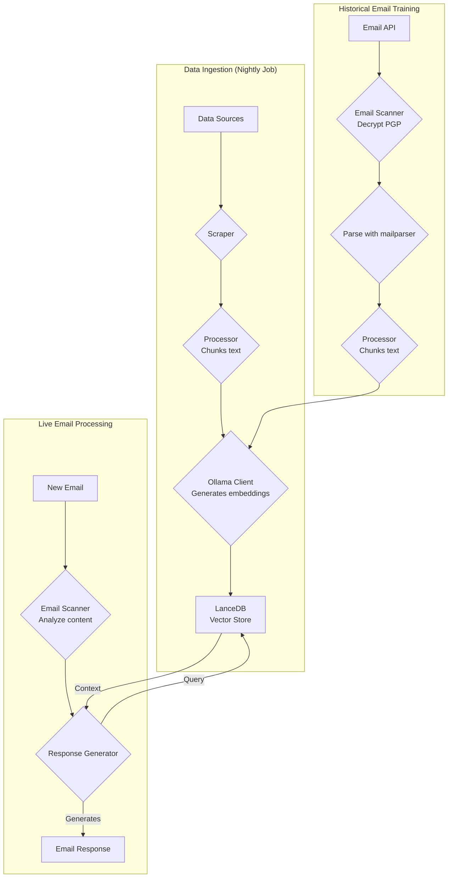
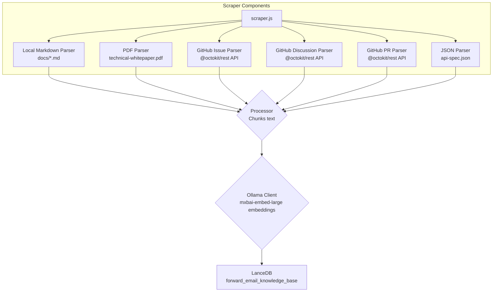
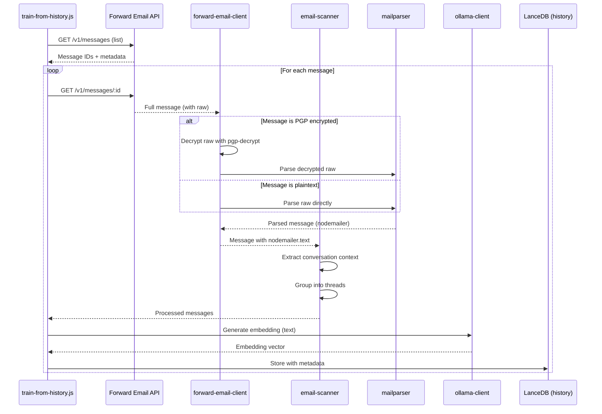

# Bygning af en Privacy-First AI Kundesupport Agent med LanceDB, Ollama og Node.js {#building-a-privacy-first-ai-customer-support-agent-with-lancedb-ollama-and-nodejs}


> \[!NOTE]
> Dette dokument dækker vores rejse med at bygge en selvhostet AI support agent. Vi skrev om lignende udfordringer i vores [Email Startup Graveyard](https://forwardemail.net/blog/docs/email-startup-graveyard-why-80-percent-email-companies-fail) blogindlæg. Vi overvejede ærligt at skrive en opfølger kaldet "AI Startup Graveyard", men måske må vi vente et år eller to, indtil AI-boblen potentielt brister(?). For nu er dette vores hjerneudladning af, hvad der virkede, hvad der ikke gjorde, og hvorfor vi gjorde det på denne måde.

Sådan byggede vi vores egen AI kundesupport agent. Vi gjorde det på den hårde måde: selvhostet, privacy-first og fuldstændig under vores kontrol. Hvorfor? Fordi vi ikke stoler på tredjepartstjenester med vores kunders data. Det er et GDPR- og DPA-krav, og det er det rigtige at gøre.

Dette var ikke et sjovt weekendprojekt. Det var en måneds lang rejse gennem ødelagte afhængigheder, vildledende dokumentation og den generelle kaos i open source AI-økosystemet i 2025. Dette dokument er en registrering af, hvad vi byggede, hvorfor vi byggede det, og de forhindringer vi stødte på undervejs.


## Indholdsfortegnelse {#table-of-contents}

* [Kundens Fordele: AI-Augmenteret Menneskelig Support](#customer-benefits-ai-augmented-human-support)
  * [Hurtigere, Mere Præcise Svar](#faster-more-accurate-responses)
  * [Konsistens Uden Udbrændthed](#consistency-without-burnout)
  * [Hvad Du Får](#what-you-get)
* [En Personlig Refleksion: To Årtiers Slid](#a-personal-reflection-the-two-decade-grind)
* [Hvorfor Privacy Er Vigtigt](#why-privacy-matters)
* [Omkostningsanalyse: Cloud AI vs Selvhostet](#cost-analysis-cloud-ai-vs-self-hosted)
  * [Sammenligning af Cloud AI Tjenester](#cloud-ai-service-comparison)
  * [Omkostningsopdeling: 5GB Vidensbase](#cost-breakdown-5gb-knowledge-base)
  * [Selvhostede Hardwareomkostninger](#self-hosted-hardware-costs)
* [Dogfooding af Vores Egen API](#dogfooding-our-own-api)
  * [Hvorfor Dogfooding Er Vigtigt](#why-dogfooding-matters)
  * [API Brugseksempler](#api-usage-examples)
  * [Ydelsesfordele](#performance-benefits)
* [Krypteringsarkitektur](#encryption-architecture)
  * [Lag 1: Mailboks Kryptering (chacha20-poly1305)](#layer-1-mailbox-encryption-chacha20-poly1305)
  * [Lag 2: Beskedniveau PGP Kryptering](#layer-2-message-level-pgp-encryption)
  * [Hvorfor Dette Er Vigtigt for Træning](#why-this-matters-for-training)
  * [Lagringssikkerhed](#storage-security)
  * [Lokal Lagring er Standardpraksis](#local-storage-is-standard-practice)
* [Arkitekturen](#the-architecture)
  * [Overordnet Flow](#high-level-flow)
  * [Detaljeret Scraper Flow](#detailed-scraper-flow)
* [Hvordan Det Virker](#how-it-works)
  * [Opbygning af Vidensbasen](#building-the-knowledge-base)
  * [Træning fra Historiske Emails](#training-from-historical-emails)
  * [Behandling af Indkommende Emails](#processing-incoming-emails)
  * [Vector Store Administration](#vector-store-management)
* [Vector Database Gravpladsen](#the-vector-database-graveyard)
* [Systemkrav](#system-requirements)
* [Cron Job Konfiguration](#cron-job-configuration)
  * [Miljøvariabler](#environment-variables)
  * [Cron Jobs for Flere Indbakker](#cron-jobs-for-multiple-inboxes)
  * [Cron Tidsplan Opdeling](#cron-schedule-breakdown)
  * [Dynamisk Dato Beregning](#dynamic-date-calculation)
  * [Initial Opsætning: Udtræk URL-liste fra Sitemap](#initial-setup-extract-url-list-from-sitemap)
  * [Test af Cron Jobs Manuel](#testing-cron-jobs-manually)
  * [Overvågning af Logs](#monitoring-logs)
* [Kodeeksempler](#code-examples)
  * [Scraping og Behandling](#scraping-and-processing)
  * [Træning fra Historiske Emails](#training-from-historical-emails-1)
  * [Forespørgsel efter Kontekst](#querying-for-context)
* [Fremtiden: Spam Scanner F\&U](#the-future-spam-scanner-rd)
* [Fejlfinding](#troubleshooting)
  * [Vector Dimension Mismatch Fejl](#vector-dimension-mismatch-error)
  * [Tom Vidensbase Kontekst](#empty-knowledge-base-context)
  * [PGP Dekrypteringsfejl](#pgp-decryption-failures)
* [Brugertips](#usage-tips)
  * [Opnå Inbox Zero](#achieving-inbox-zero)
  * [Brug af skip-ai Label](#using-the-skip-ai-label)
  * [Email Trådning og Svar-Alle](#email-threading-and-reply-all)
  * [Overvågning og Vedligeholdelse](#monitoring-and-maintenance)
* [Testning](#testing)
  * [Kørsel af Tests](#running-tests)
  * [Testdækning](#test-coverage)
  * [Testmiljø](#test-environment)
* [Vigtige Pointer](#key-takeaways)
## Kunde Fordele: AI-Forstærket Menneskelig Support {#customer-benefits-ai-augmented-human-support}

Vores AI-system erstatter ikke vores supportteam – det gør dem bedre. Her er hvad det betyder for dig:

### Hurtigere, Mere Præcise Svar {#faster-more-accurate-responses}

**Menneske-i-Loop**: Hvert AI-genereret udkast bliver gennemgået, redigeret og kurateret af vores menneskelige supportteam, før det sendes til dig. AI’en håndterer den indledende research og udkast, hvilket frigør vores team til at fokusere på kvalitetskontrol og personalisering.

**Trænet på Menneskelig Ekspertise**: AI’en lærer fra:

* Vores håndskrevne vidensbase og dokumentation
* Menneskeskrevne blogindlæg og tutorials
* Vores omfattende FAQ (skrevet af mennesker)
* Tidligere kundesamtaler (alle håndteret af rigtige mennesker)

Du får svar, der er baseret på års menneskelig ekspertise, blot leveret hurtigere.

### Konsistens Uden Udbrændthed {#consistency-without-burnout}

Vores lille team håndterer hundredvis af supporthenvendelser dagligt, hver med forskellig teknisk viden og mental kontekstskift:

* Faktureringsspørgsmål kræver kendskab til finansielle systemer
* DNS-problemer kræver netværksekspertise
* API-integration kræver programmeringsviden
* Sikkerhedsrapporter kræver sårbarhedsvurdering

Uden AI-assistance fører denne konstante kontekstskift til:

* Langsommere svartider
* Menneskelige fejl på grund af træthed
* Inkonsekvent svar kvalitet
* Teamudbrændthed

**Med AI-forstærkning**:

* Svarer teamet hurtigere (AI laver udkast på sekunder)
* Laver færre fejl (AI fanger almindelige fejl)
* Opretholder ensartet kvalitet (AI refererer til samme vidensbase hver gang)
* Forbliver frisk og fokuseret (mindre tid på research, mere tid på at hjælpe)

### Hvad Du Får {#what-you-get}

✅ **Hastighed**: AI laver udkast til svar på sekunder, mennesker gennemgår og sender inden for få minutter

✅ **Præcision**: Svar baseret på vores faktiske dokumentation og tidligere løsninger

✅ **Konsistens**: Samme høje kvalitet uanset om det er kl. 9 eller 21

✅ **Menneskelig berøring**: Hvert svar gennemgås og personaliseres af vores team

✅ **Ingen hallucinationer**: AI bruger kun vores verificerede vidensbase, ikke generiske internetdata

> \[!NOTE]
> **Du taler altid med mennesker**. AI’en er en forskningsassistent, der hjælper vores team med at finde det rigtige svar hurtigere. Tænk på det som en bibliotekar, der øjeblikkeligt finder den relevante bog – men et menneske læser den stadig og forklarer den for dig.


## En Personlig Refleksion: To Årtiers Slid {#a-personal-reflection-the-two-decade-grind}

Før vi dykker ned i de tekniske detaljer, en personlig note. Jeg har været i gang i næsten to årtier. De endeløse timer ved tastaturet, den utrættelige jagt på en løsning, det dybe, fokuserede slid – det er virkeligheden ved at bygge noget meningsfuldt. Det er en virkelighed, der ofte overses i hypen omkring ny teknologi.

Den nylige eksplosion af AI har været særligt frustrerende. Vi bliver solgt en drøm om automatisering, om AI-assistenter, der vil skrive vores kode og løse vores problemer. Virkeligheden? Outputtet er ofte skralde-kode, der kræver mere tid at rette, end det ville have taget at skrive fra bunden. Løftet om at gøre vores liv lettere er falsk. Det er en distraktion fra det hårde, nødvendige arbejde med at bygge.

Og så er der catch-22 ved at bidrage til open source. Du er allerede spredt tyndt, udmattet af sliddet. Du bruger en AI til at hjælpe dig med at skrive en detaljeret, velstruktureret fejlrapport, i håb om at gøre det lettere for vedligeholdere at forstå og rette problemet. Og hvad sker der? Du bliver irettesat. Dit bidrag afvises som "off-topic" eller lav indsats, som vi så i en nylig [Node.js GitHub issue](https://github.com/nodejs/node/issues/60719#issuecomment-3534304321). Det er et slag i ansigtet på seniorudviklere, der bare prøver at hjælpe.

Dette er virkeligheden i det økosystem, vi arbejder i. Det handler ikke kun om ødelagte værktøjer; det handler om en kultur, der ofte ikke respekterer tiden og [indsatsen fra sine bidragydere](https://forwardemail.net/blog/docs/how-npm-packages-billion-downloads-shaped-javascript-ecosystem). Dette indlæg er en krønike over den virkelighed. Det er en historie om værktøjerne, ja, men det er også om den menneskelige pris ved at bygge i et ødelagt økosystem, der trods alle løfter er fundamentalt ødelagt.
## Hvorfor Privatliv Er Vigtigt {#why-privacy-matters}

Vores [tekniske whitepaper](https://forwardemail.net/technical-whitepaper.pdf) dækker vores privatlivsfilosofi i dybden. Den korte version: vi sender aldrig kundedata til tredjepart. Aldrig. Det betyder ingen OpenAI, ingen Anthropic, ingen cloud-hostede vektordatabaser. Alt kører lokalt på vores infrastruktur. Dette er ikke til forhandling for GDPR-overholdelse og vores DPA-forpligtelser.


## Omkostningsanalyse: Cloud AI vs Selvhostet {#cost-analysis-cloud-ai-vs-self-hosted}

Før vi dykker ned i den tekniske implementering, lad os tale om, hvorfor selvhosting betyder noget fra et omkostningsperspektiv. Prisstrukturerne for cloud AI-tjenester gør dem urimeligt dyre for brugsscenarier med højt volumen som kundesupport.

### Sammenligning af Cloud AI-tjenester {#cloud-ai-service-comparison}

| Service         | Udbyder             | Embedding-omkostning                                           | LLM-omkostning (Input)                                                    | LLM-omkostning (Output) | Privatlivspolitik                                   | GDPR/DPA        | Hosting           | Data Deling       |
| --------------- | ------------------- | -------------------------------------------------------------- | ------------------------------------------------------------------------- | ----------------------- | -------------------------------------------------- | --------------- | ----------------- | ----------------- |
| **OpenAI**      | OpenAI (US)         | [$0.02-0.13/1M tokens](https://openai.com/api/pricing/)        | $0.15-20/1M tokens                                                        | $0.60-80/1M tokens      | [Link](https://openai.com/policies/privacy-policy/) | Begrænset DPA   | Azure (US)        | Ja (træning)      |
| **Claude**      | Anthropic (US)      | N/A                                                            | [$3-20/1M tokens](https://docs.claude.com/en/docs/about-claude/pricing)  | $15-80/1M tokens        | [Link](https://www.anthropic.com/legal/privacy)    | Begrænset DPA   | AWS/GCP (US)      | Nej (påstået)     |
| **Gemini**      | Google (US)         | [$0.15/1M tokens](https://ai.google.dev/gemini-api/docs/pricing) | $0.30-1.00/1M tokens                                                     | $2.50/1M tokens         | [Link](https://policies.google.com/privacy)        | Begrænset DPA   | GCP (US)          | Ja (forbedring)   |
| **DeepSeek**    | DeepSeek (Kina)     | N/A                                                            | [$0.028-0.28/1M tokens](https://api-docs.deepseek.com/quick_start/pricing) | $0.42/1M tokens         | [Link](https://www.deepseek.com/en)                | Ukendt          | Kina              | Ukendt            |
| **Mistral**     | Mistral AI (Frankrig) | [$0.10/1M tokens](https://mistral.ai/pricing)                  | $0.40/1M tokens                                                          | $2.00/1M tokens         | [Link](https://mistral.ai/terms/)                  | EU GDPR         | EU                | Ukendt            |
| **Selvhostet**  | Dig                 | $0 (eksisterende hardware)                                     | $0 (eksisterende hardware)                                               | $0 (eksisterende hardware) | Din politik                                        | Fuld overholdelse | MacBook M5 + cron | Aldrig            |

> \[!WARNING]
> **Bekymringer om datasuverænitet**: Amerikanske udbydere (OpenAI, Claude, Gemini) er underlagt CLOUD Act, som giver den amerikanske regering adgang til data. DeepSeek (Kina) opererer under kinesiske datalove. Selvom Mistral (Frankrig) tilbyder EU-hosting og GDPR-overholdelse, er selvhosting stadig den eneste mulighed for fuldstændig datasuverænitet og kontrol.

### Omkostningsopdeling: 5GB Vidensbase {#cost-breakdown-5gb-knowledge-base}

Lad os beregne omkostningerne ved at behandle en 5GB vidensbase (typisk for en mellemstor virksomhed med dokumenter, e-mails og supporthistorik).

**Antagelser:**

* 5GB tekst ≈ 1,25 milliarder tokens (forudsat \~4 tegn/token)
* Initial embedding-generering
* Månedlig genuddannelse (fuld re-embedding)
* 10.000 supportforespørgsler pr. måned
* Gennemsnitlig forespørgsel: 500 tokens input, 300 tokens output
**Detaljeret omkostningsoversigt:**

| Komponent                             | OpenAI           | Claude          | Gemini               | Selv-hostet        |
| -------------------------------------- | ---------------- | --------------- | -------------------- | ------------------ |
| **Initial embedding** (1,25 mia. tokens) | $25,000          | N/A             | $187,500             | $0                 |
| **Månedlige forespørgsler** (10K × 800 tokens) | $1,200-16,000    | $2,400-16,000   | $2,400-3,200         | $0                 |
| **Månedlig gen-træning** (1,25 mia. tokens) | $25,000          | N/A             | $187,500             | $0                 |
| **Første års total**                  | $325,200-217,000 | $28,800-192,000 | $2,278,800-2,226,000 | ~$60 (elektricitet) |
| **Privatlivsoverholdelse**            | ❌ Begrænset      | ❌ Begrænset     | ❌ Begrænset          | ✅ Fuld             |
| **Data suverænitet**                  | ❌ Nej           | ❌ Nej          | ❌ Nej                | ✅ Ja               |

> \[!CAUTION]
> **Geminis embedding-omkostninger er katastrofale** ved $0,15/1M tokens. En enkelt 5GB vidensbase embedding ville koste $187,500. Det er 37x dyrere end OpenAI og gør det fuldstændig ubrugeligt til produktion.

### Selv-hostede hardwareomkostninger {#self-hosted-hardware-costs}

Vores setup kører på eksisterende hardware, vi allerede ejer:

* **Hardware**: MacBook M5 (allerede ejet til udvikling)
* **Yderligere omkostning**: $0 (bruger eksisterende hardware)
* **Elektricitet**: \~$5/måned (estimeret)
* **Første års total**: \~$60
* **Løbende**: $60/år

**ROI**: Selv-hosting har reelt set nul marginalomkostninger, da vi bruger eksisterende udviklingshardware. Systemet kører via cron-jobs uden for spidsbelastningstider.

## Dogfooding af vores egen API {#dogfooding-our-own-api}

En af de vigtigste arkitektoniske beslutninger, vi tog, var at lade alle AI-opgaver bruge [Forward Email API](https://forwardemail.net/email-api) direkte. Det er ikke bare god praksis — det er en drivkraft for performanceoptimering.

### Hvorfor dogfooding er vigtigt {#why-dogfooding-matters}

Når vores AI-opgaver bruger de samme API-endpoints som vores kunder:

1. **Performance-flaskehalse rammer os først** – Vi mærker problemerne før kunderne
2. **Optimering gavner alle** – Forbedringer for vores opgaver forbedrer automatisk kundeoplevelsen
3. **Test i virkeligheden** – Vores opgaver behandler tusindvis af e-mails og leverer kontinuerlig belastningstest
4. **Kodegenbrug** – Samme autentificering, rate limiting, fejlhåndtering og caching-logik

### API-brugseksempler {#api-usage-examples}

**Liste over beskeder (train-from-history.js):**

```javascript
// Bruger GET /v1/messages?folder=INBOX med BasicAuth
// Ekskluderer eml, raw, nodemailer for at reducere svarstørrelse (brug kun IDs)
const response = await axios.get(
  `${this.apiBase}/v1/messages`,
  {
    params: {
      folder: 'INBOX',
      limit: 100,
      eml: false,
      raw: false,
      nodemailer: false
    },
    auth: {
      username: process.env.FORWARD_EMAIL_ALIAS_USERNAME,
      password: process.env.FORWARD_EMAIL_ALIAS_PASSWORD
    }
  }
);

const messages = response.data;
// Returnerer: [{ id, subject, date, ... }, ...]
// Fuld beskedindhold hentes senere via GET /v1/messages/:id
```

**Hentning af fulde beskeder (forward-email-client.js):**

```javascript
// Bruger GET /v1/messages/:id for at hente fuld besked med råt indhold
const response = await axios.get(
  `${this.apiBase}/v1/messages/${messageId}`,
  {
    auth: {
      username: this.aliasUsername,
      password: this.aliasPassword
    }
  }
);

const message = response.data;
// Returnerer: { id, subject, raw, eml, nodemailer: { ... }, ... }
```

**Oprettelse af kladde-svar (process-inbox.js):**

```javascript
// Bruger POST /v1/messages til at oprette kladde-svar
const response = await axios.post(
  `${this.apiBase}/v1/messages`,
  {
    folder: 'Drafts',
    subject: `Re: ${originalSubject}`,
    to: senderEmail,
    text: generatedResponse,
    inReplyTo: originalMessageId
  },
  {
    auth: {
      username: process.env.FORWARD_EMAIL_ALIAS_USERNAME,
      password: process.env.FORWARD_EMAIL_ALIAS_PASSWORD
    }
  }
);
```
### Performancefordele {#performance-benefits}

Fordi vores AI-job kører på den samme API-infrastruktur:

* **Caching-optimeringer** gavner både job og kunder
* **Ratebegrænsning** testes under reel belastning
* **Fejlhåndtering** er gennemprøvet i praksis
* **API-responstider** overvåges konstant
* **Databaseforespørgsler** er optimerede til begge brugsscenarier
* **Båndbreddeoptimering** – Udelukkelse af `eml`, `raw`, `nodemailer` ved listing reducerer responsstørrelse med \~90%

Når `train-from-history.js` behandler 1.000 e-mails, foretages der 1.000+ API-kald. Enhver ineffektivitet i API’en bliver straks tydelig. Det tvinger os til at optimere IMAP-adgang, databaseforespørgsler og responsserialisering – forbedringer, der direkte gavner vores kunder.

**Eksempel på optimering**: Listing af 100 beskeder med fuldt indhold = \~10MB respons. Listing med `eml: false, raw: false, nodemailer: false` = \~100KB respons (100x mindre).


## Krypteringsarkitektur {#encryption-architecture}

Vores e-mail-lagring bruger flere lag af kryptering, som AI-jobbene skal dekryptere i realtid til træning.

### Lag 1: Mailboks-kryptering (chacha20-poly1305) {#layer-1-mailbox-encryption-chacha20-poly1305}

Alle IMAP-mailbokse gemmes som SQLite-databaser krypteret med **chacha20-poly1305**, en kvantesikker krypteringsalgoritme. Dette er beskrevet i vores [blogindlæg om kvantesikker krypteret e-mail-service](https://forwardemail.net/blog/docs/best-quantum-safe-encrypted-email-service).

**Nøgleegenskaber:**

* **Algoritme**: ChaCha20-Poly1305 (AEAD-krypteringsalgoritme)
* **Kvantesikker**: Modstandsdygtig over for kvantecomputing-angreb
* **Lagring**: SQLite-databasefiler på disk
* **Adgang**: Dekrypteres i hukommelsen ved adgang via IMAP/API

### Lag 2: Beskedniveau PGP-kryptering {#layer-2-message-level-pgp-encryption}

Mange support-e-mails er yderligere krypteret med PGP (OpenPGP-standarden). AI-jobbene skal dekryptere disse for at udtrække indhold til træning.

**Dekrypteringsflow:**

```javascript
// 1. API returnerer besked med krypteret råindhold
const message = await forwardEmailClient.getMessage(id);

// 2. Tjek om råindholdet er PGP-krypteret
if (isMessageEncrypted(message.raw)) {
  // 3. Dekrypter med vores private nøgle
  const decryptedRaw = await pgpDecrypt(message.raw);

  // 4. Parse dekrypteret MIME-besked
  const parsed = await simpleParser(decryptedRaw);

  // 5. Udfyld nodemailer med dekrypteret indhold
  message.nodemailer = {
    text: parsed.text,
    html: parsed.html,
    from: parsed.from,
    to: parsed.to,
    subject: parsed.subject,
    date: parsed.date
  };
}
```

**PGP-konfiguration:**

```bash
# Privat nøgle til dekryptering (sti til ASCII-armoreret nøglefil)
GPG_SECURITY_KEY="/path/to/private-key.asc"

# Adgangskode til privat nøgle (hvis krypteret)
GPG_SECURITY_PASSPHRASE="your-passphrase"
```

`pgp-decrypt.js` hjælperen:

1. Læser den private nøgle fra disk én gang (cachet i hukommelsen)
2. Dekrypterer nøglen med adgangskoden
3. Bruger den dekrypterede nøgle til al beskeddekryptering
4. Understøtter rekursiv dekryptering for indlejrede krypterede beskeder

### Hvorfor det betyder noget for træning {#why-this-matters-for-training}

Uden korrekt dekryptering ville AI’en træne på krypteret vrøvl:

```
-----BEGIN PGP MESSAGE-----
Version: OpenPGP.js v4.10.10

wcBMA8Z3lHJnFnNUAQgAqK7F8...
-----END PGP MESSAGE-----
```

Med dekryptering træner AI’en på faktisk indhold:

```
Subject: Re: Bug Report

Hi John,

Thanks for reporting this issue. I've confirmed the bug
and created a fix in PR #1234...
```

### Lagringssikkerhed {#storage-security}

Dekrypteringen sker i hukommelsen under jobudførelse, og det dekrypterede indhold konverteres til embeddings, som derefter gemmes i LanceDB-vektordatabasen på disk.

**Hvor dataene befinder sig:**

* **Vektordatabasen**: Gemt på krypterede MacBook M5-arbejdsstationer
* **Fysisk sikkerhed**: Arbejdsstationerne forbliver hos os hele tiden (ikke i datacentre)
* **Diskkryptering**: Fuld diskkryptering på alle arbejdsstationer
* **Netværkssikkerhed**: Firewall og isoleret fra offentlige netværk

**Fremtidig datacenter-udrulning:**
Hvis vi nogensinde flytter til datacenter-hosting, vil serverne have:

* LUKS fuld diskkryptering
* USB-adgang deaktiveret
* Fysiske sikkerhedsforanstaltninger
* Netværksisolation
For komplette detaljer om vores sikkerhedspraksis, se vores [Sikkerhedsside](https://forwardemail.net/en/security).

> \[!NOTE]
> Vektordatabasen indeholder embeddings (matematiske repræsentationer), ikke den oprindelige almindelige tekst. Dog kan embeddings potentielt blive reverse-engineered, hvilket er grunden til, at vi opbevarer dem på krypterede, fysisk sikrede arbejdsstationer.

### Lokal lagring er standardpraksis {#local-storage-is-standard-practice}

At gemme embeddings på vores teams arbejdsstationer er ikke anderledes end, hvordan vi allerede håndterer e-mail:

* **Thunderbird**: Downloader og gemmer fuldt e-mailindhold lokalt i mbox/maildir-filer
* **Webmail-klienter**: Cache e-maildata i browserlagring og lokale databaser
* **IMAP-klienter**: Opretholder lokale kopier af beskeder til offline adgang
* **Vores AI-system**: Gemmer matematiske embeddings (ikke almindelig tekst) i LanceDB

Den væsentlige forskel: embeddings er **mere sikre** end almindelig tekst e-mail, fordi de er:

1. Matematiske repræsentationer, ikke læsbar tekst
2. Sværere at reverse-engineere end almindelig tekst
3. Stadig underlagt samme fysiske sikkerhed som vores e-mail-klienter

Hvis det er acceptabelt for vores team at bruge Thunderbird eller webmail på krypterede arbejdsstationer, er det lige så acceptabelt (og måske mere sikkert) at gemme embeddings på samme måde.


## Arkitekturen {#the-architecture}

Her er det grundlæggende flow. Det ser simpelt ud. Det var det ikke.

> \[!NOTE]
> Alle jobs bruger Forward Email API direkte, hvilket sikrer, at performanceoptimeringer gavner både vores AI-system og vores kunder.

### Overordnet flow {#high-level-flow}



### Detaljeret scraper-flow {#detailed-scraper-flow}

`scraper.js` er kernen i dataindsamlingen. Det er en samling af parsere til forskellige dataformater.




## Hvordan det virker {#how-it-works}

Processen er opdelt i tre hoveddele: opbygning af vidensbasen, træning fra historiske e-mails og behandling af nye e-mails.

### Opbygning af vidensbasen {#building-the-knowledge-base}

**`update-knowledge-base.js`**: Dette er hovedjobbet. Det kører natligt, rydder den gamle vektorbutik og genopbygger den fra bunden. Det bruger `scraper.js` til at hente indhold fra alle kilder, `processor.js` til at opdele det i bidder, og `ollama-client.js` til at generere embeddings. Endelig gemmer `vector-store.js` alt i LanceDB.

**Datakilder:**

* Lokale Markdown-filer (`docs/*.md`)
* Teknisk whitepaper PDF (`assets/technical-whitepaper.pdf`)
* API-spec JSON (`assets/api-spec.json`)
* GitHub issues (via Octokit)
* GitHub diskussioner (via Octokit)
* GitHub pull requests (via Octokit)
* Sitemap URL-liste (`$LANCEDB_PATH/valid-urls.json`)

### Træning fra historiske e-mails {#training-from-historical-emails}

**`train-from-history.js`**: Dette job scanner historiske e-mails fra alle mapper, dekrypterer PGP-krypterede beskeder og tilføjer dem til en separat vektorbutik (`customer_support_history`). Dette giver kontekst fra tidligere supportinteraktioner.
**Emailbehandlingsflow:**



**Nøglefunktioner:**

* **PGP-dekryptering**: Bruger `pgp-decrypt.js` hjælper med `GPG_SECURITY_KEY` miljøvariablen
* **Trådgruppering**: Grupperer relaterede e-mails i samtaletråde
* **Bevarelse af metadata**: Gemmer mappe, emne, dato, krypteringsstatus
* **Svar-kontekst**: Knytter beskeder med deres svar for bedre kontekst

**Konfiguration:**

```bash
# Miljøvariabler for train-from-history
HISTORY_SCAN_LIMIT=1000              # Maks antal beskeder der skal behandles
HISTORY_SCAN_SINCE="2024-01-01"      # Behandl kun beskeder efter denne dato
HISTORY_DECRYPT_PGP=true             # Forsøg PGP-dekryptering
GPG_SECURITY_KEY="/path/to/key.asc"  # Sti til PGP privatnøgle
GPG_SECURITY_PASSPHRASE="passphrase" # Nøgleadgangskode (valgfri)
```

**Hvad gemmes:**

```javascript
{
  type: 'historical_email',
  folder: 'INBOX',
  subject: 'Re: Bug Report',
  date: '2025-01-15T10:30:00Z',
  messageId: '67e2f288893921...',
  threadId: 'Bug Report',
  hasReply: true,
  encrypted: true,
  decrypted: true,
  replySubject: 'Bug Report',
  replyText: 'First 500 chars of reply...',
  chunkSize: 1000,
  chunkOverlap: 200,
  chunkIndex: 0
}
```

> \[!TIP]
> Kør `train-from-history` efter den indledende opsætning for at udfylde den historiske kontekst. Dette forbedrer svarenes kvalitet markant ved at lære af tidligere supportinteraktioner.

### Behandling af indkommende e-mails {#processing-incoming-emails}

**`process-inbox.js`**: Denne job kører på e-mails i vores `support@forwardemail.net`, `abuse@forwardemail.net` og `security@forwardemail.net` postkasser (specifikt `INBOX` IMAP-mappestien). Den benytter vores API på <https://forwardemail.net/email-api> (f.eks. `GET /v1/messages?folder=INBOX` med BasicAuth adgang via vores IMAP-legitimationsoplysninger for hver postkasse). Den analyserer e-mailens indhold, forespørger både vidensbasen (`forward_email_knowledge_base`) og den historiske e-mail vektor-lager (`customer_support_history`), og sender derefter den samlede kontekst til `response-generator.js`. Generatoren bruger `mxbai-embed-large` via Ollama til at udforme et svar.

**Automatiserede workflow-funktioner:**

1. **Inbox Zero Automation**: Efter en vellykket oprettelse af et udkast flyttes den oprindelige besked automatisk til Arkiv-mappen. Dette holder din indbakke ren og hjælper med at opnå inbox zero uden manuel indgriben.

2. **Spring AI-behandling over**: Tilføj blot et `skip-ai` label (case-insensitive) til en hvilken som helst besked for at forhindre AI-behandling. Beskeden forbliver uberørt i din indbakke, så du kan håndtere den manuelt. Dette er nyttigt for følsomme beskeder eller komplekse sager, der kræver menneskelig vurdering.

3. **Korrekt e-mail-trådning**: Alle udkastssvar inkluderer den oprindelige besked citeret nedenfor (med standard ` >  ` præfiks), efter e-mail-svarskonventioner med "På \[dato], \[afsender] skrev:" format. Dette sikrer korrekt samtalekontekst og trådning i e-mail-klienter.

4. **Svar-alle-adfærd**: Systemet håndterer automatisk Reply-To headers og CC-modtagere:
   * Hvis en Reply-To header findes, bliver den til To-adressen, og den oprindelige From tilføjes til CC
   * Alle oprindelige To- og CC-modtagere inkluderes i svar-CC (undtagen din egen adresse)
   * Følger standard e-mail svar-alle konventioner for gruppe-samtaler
**Kilde Rangering**: Systemet bruger **vægtet rangering** til at prioritere kilder:

* FAQ: 100% (højeste prioritet)
* Teknisk whitepaper: 95%
* API-specifikation: 90%
* Officielle dokumenter: 85%
* GitHub issues: 70%
* Historiske e-mails: 50%

### Vector Store Management {#vector-store-management}

`VectorStore`-klassen i `helpers/customer-support-ai/vector-store.js` er vores interface til LanceDB.

**Tilføjelse af dokumenter:**

```javascript
// vector-store.js
async addDocument(text, metadata) {
  const embedding = await this.ollama.generateEmbedding(text);
  await this.table.add([{
    vector: embedding,
    text,
    ...metadata
  }]);
}
```

**Rydning af lageret:**

```javascript
// Option 1: Brug clear() metoden
await vectorStore.clear();

// Option 2: Slet den lokale database-mappe
await fs.rm(process.env.LANCEDB_PATH, { recursive: true, force: true });
```

`LANCEDB_PATH` miljøvariablen peger på den lokale indlejrede databasedirektorium. LanceDB er serverløs og indlejret, så der er ingen separat proces at administrere.


## The Vector Database Graveyard {#the-vector-database-graveyard}

Dette var den første store forhindring. Vi prøvede flere vektordatabaser, før vi valgte LanceDB. Her er hvad der gik galt med hver enkelt.

| Database     | GitHub                                                      | Hvad gik galt                                                                                                                                                                                                       | Specifikke problemer                                                                                                                                                                                                                                                                                                                                                      | Sikkerhedsbekymringer                                                                                                                                                                                             |
| ------------ | ----------------------------------------------------------- | ------------------------------------------------------------------------------------------------------------------------------------------------------------------------------------------------------------------ | -------------------------------------------------------------------------------------------------------------------------------------------------------------------------------------------------------------------------------------------------------------------------------------------------------------------------------------------------------------------------- | ----------------------------------------------------------------------------------------------------------------------------------------------------------------------------------------------------------------- |
| **ChromaDB** | [chroma-core/chroma](https://github.com/chroma-core/chroma) | `pip3 install chromadb` giver dig en version fra stenalderen med `PydanticImportError`. Den eneste måde at få en fungerende version er at kompilere fra kilden. Ikke udviklervenligt.                              | Python afhængighedskaos. Flere brugere rapporterer ødelagte pip-installationer ([#774](https://github.com/chroma-core/chroma/issues/774), [#163](https://github.com/chroma-core/chroma/issues/163)). Dokumentationen siger "brug bare Docker", hvilket er et ikke-svar for lokal udvikling. Crasher på Windows med >99 poster ([#3058](https://github.com/chroma-core/chroma/issues/3058)). | **CVE-2024-45848**: Vilkårlig kodeudførelse via ChromaDB-integration i MindsDB. Kritiske OS-sårbarheder i Docker-image ([#3170](https://github.com/chroma-core/chroma/issues/3170)).                                   |
| **Qdrant**   | [qdrant/qdrant](https://github.com/qdrant/qdrant)           | Homebrew tap (`qdrant/qdrant/qdrant`) nævnt i deres gamle dokumentation er væk. Forsvundet. Ingen forklaring. De officielle dokumenter siger nu bare "brug Docker."                                                  | Manglende Homebrew tap. Ingen native macOS binær. Kun Docker er en barriere for hurtig lokal test.                                                                                                                                                                                                                                                                          | **CVE-2024-2221**: Vilkårlig filupload-sårbarhed, der tillader fjernkodeudførelse (fikset i v1.9.0). Svag sikkerhedsmodenhedsscore fra [IronCore Labs](https://ironcorelabs.com/vectordbs/qdrant-security/).        |
| **Weaviate** | [weaviate/weaviate](https://github.com/weaviate/weaviate)   | Homebrew-versionen havde en kritisk clustering-fejl (`leader not found`). De dokumenterede flag til at rette det (`RAFT_JOIN`, `CLUSTER_HOSTNAME`) virkede ikke. Fundamentalt ødelagt for enkelt-node opsætninger. | Clustering-fejl selv i enkelt-node tilstand. Over-engineered til simple brugsscenarier.                                                                                                                                                                                                                                                                                    | Ingen større CVE’er fundet, men kompleksitet øger angrebsoverfladen.                                                                                                                                               |
| **LanceDB**  | [lancedb/lancedb](https://github.com/lancedb/lancedb)       | Denne virkede. Den er indlejret og serverløs. Ingen separat proces. Den eneste irritation er den forvirrende pakke-navngivning (`vectordb` er forældet, brug `@lancedb/lancedb`) og spredte dokumenter. Vi kan leve med det. | Forvirring omkring pakkenavne (`vectordb` vs `@lancedb/lancedb`), men ellers solid. Indlejret arkitektur eliminerer hele klasser af sikkerhedsproblemer.                                                                                                                                                                                                                     | Ingen kendte CVE’er. Indlejret design betyder ingen netværksangrebsoverflade.                                                                                                                                      |
> \[!WARNING]
> **ChromaDB har kritiske sikkerhedssårbarheder.** [CVE-2024-45848](https://nvd.nist.gov/vuln/detail/CVE-2024-45848) tillader vilkårlig kodeudførelse. Pip-installationen er fundamentalt brudt med Pydantic-afhængighedsproblemer. Undgå til produktionsbrug.

> \[!WARNING]
> **Qdrant havde en filupload RCE-sårbarhed** ([CVE-2024-2221](https://qdrant.tech/blog/cve-2024-2221-response/)), som kun blev rettet i v1.9.0. Hvis du skal bruge Qdrant, skal du sikre dig, at du har den nyeste version.

> \[!CAUTION]
> Det open source vektordatabasesystem er ustabilt. Stol ikke på dokumentationen. Antag at alt er brudt, indtil det modsatte er bevist. Test lokalt før du binder dig til en stack.


## Systemkrav {#system-requirements}

* **Node.js:** v18.0.0+ ([GitHub](https://github.com/nodejs/node))
* **Ollama:** Seneste ([GitHub](https://github.com/ollama/ollama))
* **Model:** `mxbai-embed-large` via Ollama
* **Vektordatabse:** LanceDB ([GitHub](https://github.com/lancedb/lancedb))
* **GitHub-adgang:** `@octokit/rest` til scraping af issues ([GitHub](https://github.com/octokit/rest.js))
* **SQLite:** Til primær database (via `mongoose-to-sqlite`)


## Cron Job Konfiguration {#cron-job-configuration}

Alle AI-jobs kører via cron på en MacBook M5. Her er hvordan du opsætter cron jobs til at køre ved midnat på tværs af flere indbakker.

### Miljøvariabler {#environment-variables}

Jobbene kræver disse miljøvariabler. De fleste kan sættes i `.env`-filen (indlæst via `@ladjs/env`), men `HISTORY_SCAN_SINCE` skal beregnes dynamisk i crontab.

**I `.env`-fil:**

```bash
# Forward Email API legitimationsoplysninger (ændres pr. indbakke)
FORWARD_EMAIL_ALIAS_USERNAME=support@forwardemail.net
FORWARD_EMAIL_ALIAS_PASSWORD=your-imap-password

# PGP dekryptering (deles på tværs af alle indbakker)
GPG_SECURITY_KEY=/path/to/private-key.asc
GPG_SECURITY_PASSPHRASE=your-passphrase

# Historisk scanningskonfiguration
HISTORY_SCAN_LIMIT=1000

# LanceDB sti
LANCEDB_PATH=/path/to/lancedb
```

**I crontab (beregnet dynamisk):**

```bash
# HISTORY_SCAN_SINCE skal sættes inline i crontab med shell-dato beregning
# Kan ikke være i .env fil da @ladjs/env ikke evaluerer shell-kommandoer
HISTORY_SCAN_SINCE="$(date -v-1d +%Y-%m-%d)"  # macOS
HISTORY_SCAN_SINCE="$(date -d 'yesterday' +%Y-%m-%d)"  # Linux
```

### Cron Jobs for Flere Indbakker {#cron-jobs-for-multiple-inboxes}

Rediger din crontab med `crontab -e` og tilføj:

```bash
# Opdater vidensbase (kører én gang, deles på tværs af alle indbakker)
0 0 * * * cd /path/to/forwardemail.net && LANCEDB_PATH="/path/to/lancedb" GPG_SECURITY_KEY="/path/to/key.asc" GPG_SECURITY_PASSPHRASE="pass" node jobs/customer-support-ai/update-knowledge-base.js >> /var/log/update-knowledge-base.log 2>&1

# Træn fra historik - support@forwardemail.net
0 0 * * * cd /path/to/forwardemail.net && FORWARD_EMAIL_ALIAS_USERNAME="support@forwardemail.net" FORWARD_EMAIL_ALIAS_PASSWORD="support-password" HISTORY_SCAN_SINCE="$(date -v-1d +%Y-%m-%d)" HISTORY_SCAN_LIMIT=1000 GPG_SECURITY_KEY="/path/to/key.asc" GPG_SECURITY_PASSPHRASE="pass" LANCEDB_PATH="/path/to/lancedb" node jobs/customer-support-ai/train-from-history.js >> /var/log/train-support.log 2>&1

# Træn fra historik - abuse@forwardemail.net
0 0 * * * cd /path/to/forwardemail.net && FORWARD_EMAIL_ALIAS_USERNAME="abuse@forwardemail.net" FORWARD_EMAIL_ALIAS_PASSWORD="abuse-password" HISTORY_SCAN_SINCE="$(date -v-1d +%Y-%m-%d)" HISTORY_SCAN_LIMIT=1000 GPG_SECURITY_KEY="/path/to/key.asc" GPG_SECURITY_PASSPHRASE="pass" LANCEDB_PATH="/path/to/lancedb" node jobs/customer-support-ai/train-from-history.js >> /var/log/train-abuse.log 2>&1

# Træn fra historik - security@forwardemail.net
0 0 * * * cd /path/to/forwardemail.net && FORWARD_EMAIL_ALIAS_USERNAME="security@forwardemail.net" FORWARD_EMAIL_ALIAS_PASSWORD="security-password" HISTORY_SCAN_SINCE="$(date -v-1d +%Y-%m-%d)" HISTORY_SCAN_LIMIT=1000 GPG_SECURITY_KEY="/path/to/key.asc" GPG_SECURITY_PASSPHRASE="pass" LANCEDB_PATH="/path/to/lancedb" node jobs/customer-support-ai/train-from-history.js >> /var/log/train-security.log 2>&1

# Behandl indbakke - support@forwardemail.net
*/5 * * * * cd /path/to/forwardemail.net && FORWARD_EMAIL_ALIAS_USERNAME="support@forwardemail.net" FORWARD_EMAIL_ALIAS_PASSWORD="support-password" GPG_SECURITY_KEY="/path/to/key.asc" GPG_SECURITY_PASSPHRASE="pass" LANCEDB_PATH="/path/to/lancedb" node jobs/customer-support-ai/process-inbox.js >> /var/log/process-support.log 2>&1

# Behandl indbakke - abuse@forwardemail.net
*/5 * * * * cd /path/to/forwardemail.net && FORWARD_EMAIL_ALIAS_USERNAME="abuse@forwardemail.net" FORWARD_EMAIL_ALIAS_PASSWORD="abuse-password" GPG_SECURITY_KEY="/path/to/key.asc" GPG_SECURITY_PASSPHRASE="pass" LANCEDB_PATH="/path/to/lancedb" node jobs/customer-support-ai/process-inbox.js >> /var/log/process-abuse.log 2>&1

# Behandl indbakke - security@forwardemail.net
*/5 * * * * cd /path/to/forwardemail.net && FORWARD_EMAIL_ALIAS_USERNAME="security@forwardemail.net" FORWARD_EMAIL_ALIAS_PASSWORD="security-password" GPG_SECURITY_KEY="/path/to/key.asc" GPG_SECURITY_PASSPHRASE="pass" LANCEDB_PATH="/path/to/lancedb" node jobs/customer-support-ai/process-inbox.js >> /var/log/process-security.log 2>&1
```
### Cron Tidsplan Oversigt {#cron-schedule-breakdown}

| Job                     | Tidsplan     | Beskrivelse                                                                       |
| ----------------------- | ------------ | --------------------------------------------------------------------------------- |
| `train-from-sitemap.js` | `0 0 * * 0`  | Ugentligt (søndag midnat) - Henter alle URL'er fra sitemap og træner vidensbase   |
| `train-from-history.js` | `0 0 * * *`  | Dagligt ved midnat - Scanner gårsdagens e-mails pr. indbakke                      |
| `process-inbox.js`      | `*/5 * * * *`| Hvert 5. minut - Behandler nye e-mails og genererer udkast                        |

### Dynamisk Dato Beregning {#dynamic-date-calculation}

Variablen `HISTORY_SCAN_SINCE` **skal beregnes inline i crontab** fordi:

1. `.env` filer læses som bogstavelige strenge af `@ladjs/env`
2. Shell kommando substitution `$(...)` virker ikke i `.env` filer
3. Datoen skal beregnes frisk hver gang cron kører

**Korrekt tilgang (i crontab):**

```bash
# macOS (BSD date)
HISTORY_SCAN_SINCE="$(date -v-1d +%Y-%m-%d)" node jobs/...

# Linux (GNU date)
HISTORY_SCAN_SINCE="$(date -d 'yesterday' +%Y-%m-%d)" node jobs/...
```

**Forkert tilgang (virker ikke i .env):**

```bash
# Dette vil blive læst som bogstavelig streng "$(date -v-1d +%Y-%m-%d)"
# IKKE evalueret som en shell kommando
HISTORY_SCAN_SINCE=$(date -v-1d +%Y-%m-%d)
```

Dette sikrer, at hver natlig kørsel dynamisk beregner gårsdagens dato og undgår unødvendigt arbejde.

### Første Opsætning: Udtræk URL-liste fra Sitemap {#initial-setup-extract-url-list-from-sitemap}

Før du kører process-inbox jobbet første gang, **skal** du udtrække URL-listen fra sitemap. Dette skaber en ordbog af gyldige URL'er, som LLM kan referere til og forhindrer URL-hallucination.

```bash
# Første opsætning: Udtræk URL-liste fra sitemap
cd /path/to/forwardemail.net
node jobs/customer-support-ai/train-from-sitemap.js
```

**Hvad dette gør:**

1. Henter alle URL'er fra <https://forwardemail.net/sitemap.xml>
2. Filtrerer kun ikke-lokaliserede URL'er eller /en/ URL'er (undgår duplikeret indhold)
3. Fjerner lokaliseringspræfikser (/en/faq → /faq)
4. Gemmer en simpel JSON-fil med URL-listen til `$LANCEDB_PATH/valid-urls.json`
5. Ingen crawling, ingen metadata scraping - bare en flad liste af gyldige URL'er

**Hvorfor det er vigtigt:**

* Forhindrer at LLM hallucinerer falske URL'er som `/dashboard` eller `/login`
* Giver en whitelist af gyldige URL'er som svar-generatoren kan referere til
* Simpelt, hurtigt og kræver ikke lagring i vektordatabase
* Svar-generatoren loader denne liste ved opstart og inkluderer den i prompten

**Tilføj til crontab for ugentlige opdateringer:**

```bash
# Udtræk URL-liste fra sitemap - ugentligt søndag midnat
0 0 * * 0 cd /path/to/forwardemail.net && node jobs/customer-support-ai/train-from-sitemap.js >> /var/log/train-sitemap.log 2>&1
```

### Test Cron Jobs Manuel {#testing-cron-jobs-manually}

For at teste et job før det tilføjes til cron:

```bash
# Test sitemap træning
cd /path/to/forwardemail.net
export LANCEDB_PATH="/path/to/lancedb"
node jobs/customer-support-ai/train-from-sitemap.js

# Test support indbakke træning
cd /path/to/forwardemail.net
export FORWARD_EMAIL_ALIAS_USERNAME="support@forwardemail.net"
export FORWARD_EMAIL_ALIAS_PASSWORD="support-password"
export HISTORY_SCAN_SINCE="$(date -v-1d +%Y-%m-%d)"
export HISTORY_SCAN_LIMIT=1000
export GPG_SECURITY_KEY="/path/to/key.asc"
export GPG_SECURITY_PASSPHRASE="pass"
export LANCEDB_PATH="/path/to/lancedb"
node jobs/customer-support-ai/train-from-history.js
```

### Overvågning af Logs {#monitoring-logs}

Hvert job logger til en separat fil for nem fejlfinding:

```bash
# Overvåg support indbakke behandling i realtid
tail -f /var/log/process-support.log

# Tjek gårsdagens træningskørsel
cat /var/log/train-support.log | grep "$(date -v-1d +%Y-%m-%d)"

# Se alle fejl på tværs af jobs
grep -i error /var/log/train-*.log /var/log/process-*.log
```

> \[!TIP]
> Brug separate logfiler pr. indbakke for at isolere problemer. Hvis en indbakke har autentificeringsproblemer, forurener det ikke logs for andre indbakker.
## Codeeksempler {#code-examples}

### Scraping og behandling {#scraping-and-processing}

```javascript
// jobs/customer-support-ai/update-knowledge-base.js
const scraper = new Scraper();
const processor = new Processor();
const ollamaClient = new OllamaClient();
const vectorStore = new VectorStore();

// Ryd op i gamle data
await vectorStore.clear();

// Scrape alle kilder
const documents = await scraper.scrapeAll();
console.log(`Scraped ${documents.length} dokumenter`);

// Behandl til chunks
const allChunks = [];
for (const doc of documents) {
  const chunks = processor.processDocuments([doc]);
  allChunks.push(...chunks);
}
console.log(`Genererede ${allChunks.length} chunks`);

// Generer embeddings og gem
const texts = allChunks.map(chunk => chunk.text);
const embeddings = await ollamaClient.generateEmbeddings(texts);

for (let i = 0; i < allChunks.length; i++) {
  await vectorStore.addDocument(texts[i], {
    ...allChunks[i].metadata,
    embedding: embeddings[i]
  });
}
```

### Træning fra historiske e-mails {#training-from-historical-emails-1}

```javascript
// jobs/customer-support-ai/train-from-history.js
const scanner = new EmailScanner({
  forwardEmailApiBase: config.forwardEmailApiBase,
  forwardEmailAliasUsername: config.forwardEmailAliasUsername,
  forwardEmailAliasPassword: config.forwardEmailAliasPassword
});

const vectorStore = new VectorStore({
  collectionName: 'customer_support_history'
});

// Scan alle mapper (INBOX, Sendt post osv.)
const messages = await scanner.scanAllFolders({
  limit: 1000,
  since: new Date('2024-01-01'),
  decryptPGP: true
});

// Gruppér i samtaletråde
const threads = scanner.groupIntoThreads(messages);

// Behandl hver tråd
for (const thread of threads) {
  const context = scanner.extractConversationContext(thread);

  for (const message of context.messages) {
    // Spring krypterede beskeder over, som ikke kunne dekrypteres
    if (message.encrypted && !message.decrypted) continue;

    // Brug allerede-parset indhold fra nodemailer
    const text = message.nodemailer?.text || '';
    if (!text.trim()) continue;

    // Chunk og gem
    const chunks = processor.chunkText(`Emne: ${message.subject}\n\n${text}`, {
      chunkSize: 1000,
      chunkOverlap: 200
    });

    for (const chunk of chunks) {
      await vectorStore.addDocument(chunk.text, {
        type: 'historical_email',
        folder: message.folder,
        subject: message.subject,
        date: message.nodemailer?.date || message.created_at,
        messageId: message.id,
        threadId: context.subject,
        encrypted: message.encrypted || false,
        decrypted: message.decrypted || false,
        ...chunk.metadata
      });
    }
  }
}
```

### Forespørgsel efter kontekst {#querying-for-context}

```javascript
// jobs/customer-support-ai/process-inbox.js
const vectorStore = new VectorStore();
const historyVectorStore = new VectorStore({
  collectionName: 'customer_support_history'
});

// Forespørg begge lagre
const knowledgeContext = await vectorStore.query(emailEmbedding, { limit: 8 });
const historyContext = await historyVectorStore.query(emailEmbedding, { limit: 3 });

// Vægtet rangering og deduplikering sker her
const rankedContext = rankAndDeduplicateContext(knowledgeContext, historyContext);

// Generer svar
const response = await responseGenerator.generate(email, rankedContext);
```


## Fremtiden: Spam Scanner F\&U {#the-future-spam-scanner-rd}

Hele dette projekt var ikke kun for kundesupport. Det var F\&U. Vi kan nu tage alt, hvad vi har lært om lokale embeddings, vector stores og kontekstgenfinding og anvende det på vores næste store projekt: LLM-laget til [Spam Scanner](https://spamscanner.net). De samme principper om privatliv, selvhosting og semantisk forståelse vil være nøglen.


## Fejlfinding {#troubleshooting}

### Fejl ved vektordimension mismatch {#vector-dimension-mismatch-error}

**Fejl:**

```
Error: Failed to execute query stream: GenericFailure, Invalid input, No vector column found to match with the query vector dimension: 1024
```

**Årsag:** Denne fejl opstår, når du skifter embeddingsmodel (f.eks. fra `mistral-small` til `mxbai-embed-large`), men den eksisterende LanceDB-database blev oprettet med en anden vektordimension.
**Løsning:** Du skal genoplære vidensbasen med den nye embedding-model:

```bash
# 1. Stop alle kørende customer support AI jobs
pkill -f customer-support-ai

# 2. Slet den eksisterende LanceDB database
rm -rf ~/.local/share/lancedb/forward_email_knowledge_base.lance
rm -rf ~/.local/share/lancedb/customer_support_history.lance

# 3. Bekræft at embedding-modellen er sat korrekt i .env
grep OLLAMA_EMBEDDING_MODEL .env
# Skal vise: OLLAMA_EMBEDDING_MODEL=mxbai-embed-large

# 4. Hent embedding-modellen i Ollama
ollama pull mxbai-embed-large

# 5. Genoplær vidensbasen
node jobs/customer-support-ai/train-from-history.js

# 6. Genstart process-inbox jobbet via Bree
# Jobbet kører automatisk hvert 5. minut
```

**Hvorfor det sker:** Forskellige embedding-modeller producerer vektorer med forskellige dimensioner:

* `mistral-small`: 1024 dimensioner
* `mxbai-embed-large`: 1024 dimensioner
* `nomic-embed-text`: 768 dimensioner
* `all-minilm`: 384 dimensioner

LanceDB gemmer vektordimensionen i tabelskemaet. Når du forespørger med en anden dimension, fejler det. Den eneste løsning er at genskabe databasen med den nye model.

### Tom Vidensbase Kontekst {#empty-knowledge-base-context}

**Symptom:**

```
debug     Retrieved knowledge base context {
  total: 0,
  afterRanking: 0,
  questionType: 'capability'
}
```

**Årsag:** Vidensbasen er ikke blevet trænet endnu, eller LanceDB-tabellen findes ikke.

**Løsning:** Kør træningsjobbet for at fylde vidensbasen:

```bash
# Træn fra historiske emails
node jobs/customer-support-ai/train-from-history.js

# Eller træn fra website/docs (hvis du har en scraper)
node jobs/customer-support-ai/train-from-website.js
```

### PGP Dekrypteringsfejl {#pgp-decryption-failures}

**Symptom:** Beskeder vises som krypterede, men indholdet er tomt.

**Løsning:**

1. Bekræft at GPG-nøglestien er sat korrekt:

```bash
grep GPG_SECURITY_KEY .env
# Skal pege på din private nøglefil
```

2. Test dekryptering manuelt:

```bash
node -e "const decrypt = require('./helpers/customer-support-ai/pgp-decrypt'); decrypt.testDecryption();"
```

3. Tjek nøgle-tilladelser:

```bash
ls -la /path/to/your/gpg-key.asc
# Skal kunne læses af brugeren, der kører jobbet
```


## Brugertips {#usage-tips}

### Opnå Inbox Zero {#achieving-inbox-zero}

Systemet er designet til automatisk at hjælpe dig med at opnå inbox zero:

1. **Automatisk Arkivering**: Når et udkast er oprettet succesfuldt, flyttes den oprindelige besked automatisk til Arkiv-mappen. Dette holder din indbakke ren uden manuel indgriben.

2. **Gennemgå Udkast**: Tjek Udkast-mappen regelmæssigt for at gennemgå AI-genererede svar. Rediger efter behov før afsendelse.

3. **Manuel Overstyring**: For beskeder, der kræver særlig opmærksomhed, tilføj blot `skip-ai` etiketten før jobbet kører.

### Brug af skip-ai etiketten {#using-the-skip-ai-label}

For at forhindre AI-behandling af specifikke beskeder:

1. **Tilføj etiketten**: I din email-klient, tilføj en `skip-ai` etiket/tag til enhver besked (case-insensitive)
2. **Beskeden forbliver i indbakken**: Beskeden bliver ikke behandlet eller arkiveret
3. **Håndter manuelt**: Du kan selv svare uden AI-indblanding

**Hvornår du skal bruge skip-ai:**

* Følsomme eller fortrolige beskeder
* Komplekse sager der kræver menneskelig vurdering
* Beskeder fra VIP-kunder
* Juridiske eller compliance-relaterede forespørgsler
* Beskeder der kræver øjeblikkelig menneskelig opmærksomhed

### Email-trådning og Svar-Alle {#email-threading-and-reply-all}

Systemet følger standard email-konventioner:

**Citerede Originalbeskeder:**

```
Hej,

[AI-genereret svar]

--
Tak,
Forward Email
https://forwardemail.net

On Mon, Jan 15, 2024, 3:45 PM John Doe <john@example.com> wrote:
> Dette er den oprindelige besked
> med hver linje citeret
> ved brug af standard "> " præfiks
```

**Reply-To Håndtering:**

* Hvis den oprindelige besked har en Reply-To header, svarer udkastet til den adresse
* Den oprindelige From-adresse tilføjes i CC
* Alle andre oprindelige To og CC modtagere bevares

**Eksempel:**

```
Original besked:
  Fra: john@company.com
  Reply-To: support@company.com
  Til: support@forwardemail.net
  CC: manager@company.com

Udkast svar:
  Til: support@company.com (fra Reply-To)
  CC: john@company.com, manager@company.com
```
### Overvågning og Vedligeholdelse {#monitoring-and-maintenance}

**Tjek udkastskvalitet regelmæssigt:**

```bash
# Vis nylige udkast
tail -f /var/log/process-support.log | grep "Draft created"
```

**Overvåg arkivering:**

```bash
# Tjek for arkiveringsfejl
grep "archive message" /var/log/process-*.log
```

**Gennemgå sprunget beskeder:**

```bash
# Se hvilke beskeder der blev sprunget over
grep "skip-ai label" /var/log/process-*.log
```


## Testning {#testing}

Kundesupport AI-systemet inkluderer omfattende testdækning med 23 Ava-tests.

### Kørsel af Tests {#running-tests}

På grund af npm-pakkeoverstyringskonflikter med `better-sqlite3`, brug det medfølgende testscript:

```bash
# Kør alle kundesupport AI-tests
./scripts/test-customer-support-ai.sh

# Kør med detaljeret output
./scripts/test-customer-support-ai.sh --verbose

# Kør specifik testfil
./scripts/test-customer-support-ai.sh test/customer-support-ai/message-utils.js
```

Alternativt kan tests køres direkte:

```bash
NODE_ENV=test node node_modules/.pnpm/ava@5.3.1/node_modules/ava/entrypoints/cli.mjs test/customer-support-ai
```

### Testdækning {#test-coverage}

**Sitemap Fetcher (6 tests):**

* Locale mønster regex-matching
* URL-sti-ekstraktion og locale-fjernelse
* URL-filtreringslogik for locales
* XML-parselogik
* Dedupliceringslogik
* Kombineret filtrering, fjernelse og deduplicering

**Message Utils (9 tests):**

* Ekstraher afsendertekst med navn og email
* Håndter kun email når navn matcher præfiks
* Brug from.text hvis tilgængelig
* Brug Reply-To hvis til stede
* Brug From hvis ingen Reply-To
* Inkluder originale CC-modtagere
* Ekskluder vores egen adresse fra CC
* Håndter Reply-To med From i CC
* Deduplicer CC-adresser

**Response Generator (8 tests):**

* URL-grupperingslogik til prompt
* Afsendernavn-detekteringslogik
* Promptstruktur inkluderer alle nødvendige sektioner
* URL-listeformatering uden vinkelparenteser
* Håndtering af tom URL-liste
* Forbudte URL-liste i prompt
* Inkludering af historisk kontekst
* Korrekte URL’er for konto-relaterede emner

### Testmiljø {#test-environment}

Tests bruger `.env.test` til konfiguration. Testmiljøet inkluderer:

* Mock PayPal og Stripe legitimationsoplysninger
* Test krypteringsnøgler
* Deaktiverede autentifikationsudbydere
* Sikker testdatastier

Alle tests er designet til at køre uden eksterne afhængigheder eller netværkskald.


## Vigtige Pointer {#key-takeaways}

1. **Privatliv først:** Selvhosting er ufravigeligt for GDPR/DPA-overholdelse.
2. **Omkostninger betyder noget:** Cloud AI-tjenester er 50-1000x dyrere end selvhosting til produktionsarbejdsmængder.
3. **Økosystemet er brudt:** De fleste vektordatabaser er ikke udviklervenlige. Test alt lokalt.
4. **Sikkerhedssårbarheder er reelle:** ChromaDB og Qdrant har haft kritiske RCE-sårbarheder.
5. **LanceDB virker:** Det er indlejret, serverløst og kræver ikke en separat proces.
6. **Ollama er solid:** Lokal LLM-inferens med `mxbai-embed-large` fungerer godt til vores brug.
7. **Typefejl dræber dig:** `text` vs. `content`, ObjectID vs. string. Disse fejl er stille og brutale.
8. **Vægtet rangering betyder noget:** Ikke al kontekst er lige. FAQ > GitHub issues > Historiske emails.
9. **Historisk kontekst er guld:** Træning på tidligere supportemails forbedrer svarenes kvalitet dramatisk.
10. **PGP-dekryptering er essentielt:** Mange supportemails er krypterede; korrekt dekryptering er kritisk for træning.

---

Lær mere om Forward Email og vores privatlivsfokuserede tilgang til email på [forwardemail.net](https://forwardemail.net).
