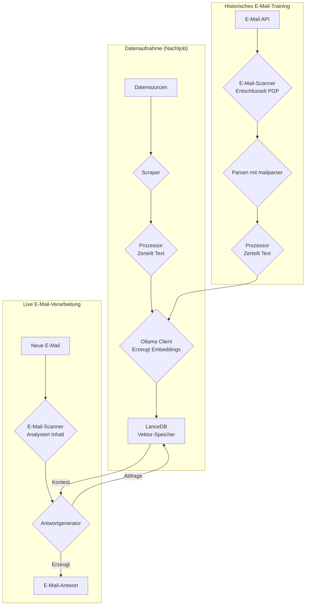
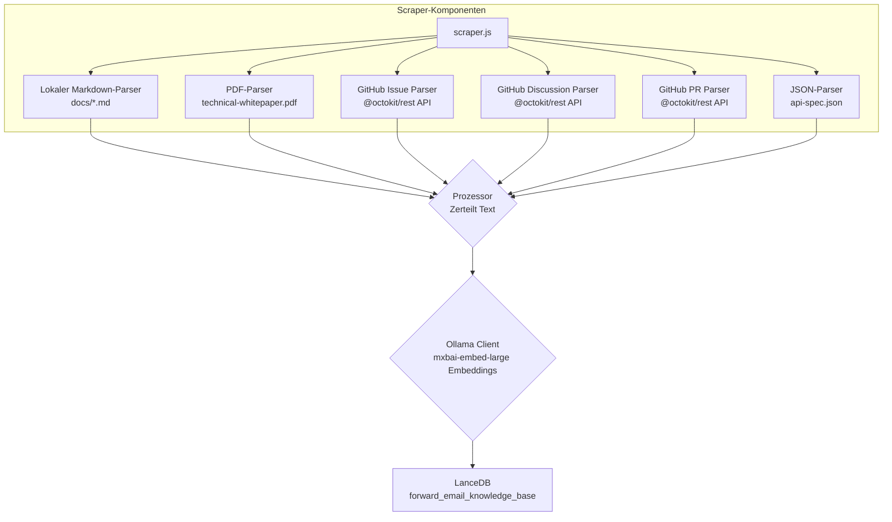
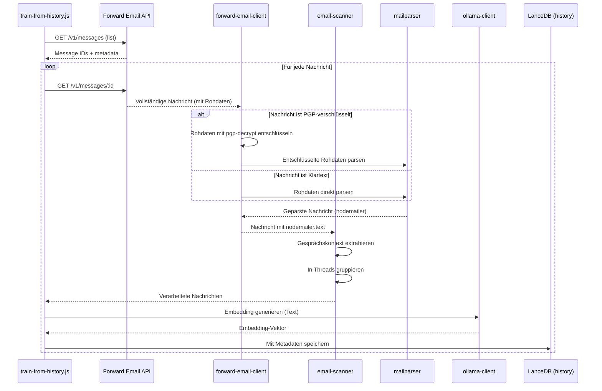

# Aufbau eines datenschutzorientierten KI-Kundensupport-Agenten mit LanceDB, Ollama und Node.js {#building-a-privacy-first-ai-customer-support-agent-with-lancedb-ollama-and-nodejs}


> \[!NOTE]
> Dieses Dokument beschreibt unsere Reise beim Aufbau eines selbstgehosteten KI-Support-Agenten. Wir haben über ähnliche Herausforderungen in unserem Blogbeitrag [Email Startup Graveyard](https://forwardemail.net/blog/docs/email-startup-graveyard-why-80-percent-email-companies-fail) geschrieben. Ehrlich gesagt haben wir überlegt, einen Nachfolgebeitrag mit dem Titel „AI Startup Graveyard“ zu schreiben, aber vielleicht müssen wir noch ein weiteres Jahr warten, bis die KI-Blase möglicherweise platzt(?). Für den Moment ist dies unser Brain Dump darüber, was funktioniert hat, was nicht und warum wir es so gemacht haben.

So haben wir unseren eigenen KI-Kundensupport-Agenten gebaut. Wir haben es auf die harte Tour gemacht: selbstgehostet, datenschutzorientiert und vollständig unter unserer Kontrolle. Warum? Weil wir Drittanbietern nicht die Daten unserer Kunden anvertrauen. Es ist eine Anforderung der DSGVO und des DPA und es ist das Richtige.

Das war kein spaßiges Wochenendprojekt. Es war eine monatelange Reise durch kaputte Abhängigkeiten, irreführende Dokumentationen und das allgemeine Chaos des Open-Source-KI-Ökosystems im Jahr 2025. Dieses Dokument ist eine Aufzeichnung dessen, was wir gebaut haben, warum wir es gebaut haben und welche Hindernisse wir dabei überwinden mussten.


## Inhaltsverzeichnis {#table-of-contents}

* [Kundenvorteile: KI-unterstützter menschlicher Support](#customer-benefits-ai-augmented-human-support)
  * [Schnellere, genauere Antworten](#faster-more-accurate-responses)
  * [Konsistenz ohne Burnout](#consistency-without-burnout)
  * [Was Sie bekommen](#what-you-get)
* [Eine persönliche Reflexion: Zwei Jahrzehnte harter Arbeit](#a-personal-reflection-the-two-decade-grind)
* [Warum Datenschutz wichtig ist](#why-privacy-matters)
* [Kostenanalyse: Cloud-KI vs. Selbstgehostet](#cost-analysis-cloud-ai-vs-self-hosted)
  * [Vergleich von Cloud-KI-Diensten](#cloud-ai-service-comparison)
  * [Kostenaufstellung: 5GB Wissensdatenbank](#cost-breakdown-5gb-knowledge-base)
  * [Hardwarekosten für Selbsthosting](#self-hosted-hardware-costs)
* [Dogfooding unserer eigenen API](#dogfooding-our-own-api)
  * [Warum Dogfooding wichtig ist](#why-dogfooding-matters)
  * [API-Nutzungsbeispiele](#api-usage-examples)
  * [Leistungsverbesserungen](#performance-benefits)
* [Verschlüsselungsarchitektur](#encryption-architecture)
  * [Ebene 1: Postfachverschlüsselung (chacha20-poly1305)](#layer-1-mailbox-encryption-chacha20-poly1305)
  * [Ebene 2: Nachrichtenebene PGP-Verschlüsselung](#layer-2-message-level-pgp-encryption)
  * [Warum das für das Training wichtig ist](#why-this-matters-for-training)
  * [Speichersicherheit](#storage-security)
  * [Lokale Speicherung ist Standardpraxis](#local-storage-is-standard-practice)
* [Die Architektur](#the-architecture)
  * [High-Level-Ablauf](#high-level-flow)
  * [Detaillierter Scraper-Ablauf](#detailed-scraper-flow)
* [Funktionsweise](#how-it-works)
  * [Aufbau der Wissensdatenbank](#building-the-knowledge-base)
  * [Training aus historischen E-Mails](#training-from-historical-emails)
  * [Verarbeitung eingehender E-Mails](#processing-incoming-emails)
  * [Verwaltung des Vektorspeichers](#vector-store-management)
* [Der Friedhof der Vektordatenbanken](#the-vector-database-graveyard)
* [Systemanforderungen](#system-requirements)
* [Cron-Job-Konfiguration](#cron-job-configuration)
  * [Umgebungsvariablen](#environment-variables)
  * [Cron-Jobs für mehrere Postfächer](#cron-jobs-for-multiple-inboxes)
  * [Aufschlüsselung des Cron-Zeitplans](#cron-schedule-breakdown)
  * [Dynamische Datumsberechnung](#dynamic-date-calculation)
  * [Ersteinrichtung: URL-Liste aus Sitemap extrahieren](#initial-setup-extract-url-list-from-sitemap)
  * [Manuelles Testen von Cron-Jobs](#testing-cron-jobs-manually)
  * [Überwachung der Logs](#monitoring-logs)
* [Code-Beispiele](#code-examples)
  * [Scraping und Verarbeitung](#scraping-and-processing)
  * [Training aus historischen E-Mails](#training-from-historical-emails-1)
  * [Abfragen für Kontext](#querying-for-context)
* [Die Zukunft: Spam-Scanner F&E](#the-future-spam-scanner-rd)
* [Fehlerbehebung](#troubleshooting)
  * [Fehler bei Vektor-Dimensionen-Mismatch](#vector-dimension-mismatch-error)
  * [Leerer Wissensdatenbank-Kontext](#empty-knowledge-base-context)
  * [PGP-Entschlüsselungsfehler](#pgp-decryption-failures)
* [Nutzungstipps](#usage-tips)
  * [Erreichen von Inbox Zero](#achieving-inbox-zero)
  * [Verwendung des skip-ai Labels](#using-the-skip-ai-label)
  * [E-Mail-Threading und Allen-Antworten](#email-threading-and-reply-all)
  * [Überwachung und Wartung](#monitoring-and-maintenance)
* [Tests](#testing)
  * [Tests ausführen](#running-tests)
  * [Testabdeckung](#test-coverage)
  * [Testumgebung](#test-environment)
* [Wichtigste Erkenntnisse](#key-takeaways)
## Kundenvorteile: KI-unterstützter menschlicher Support {#customer-benefits-ai-augmented-human-support}

Unser KI-System ersetzt nicht unser Support-Team – es macht es besser. Das bedeutet Folgendes für Sie:

### Schnellere, genauere Antworten {#faster-more-accurate-responses}

**Human-in-the-Loop**: Jeder KI-generierte Entwurf wird von unserem menschlichen Support-Team überprüft, bearbeitet und kuratiert, bevor er an Sie gesendet wird. Die KI übernimmt die erste Recherche und das Verfassen, sodass sich unser Team auf Qualitätskontrolle und Personalisierung konzentrieren kann.

**Trainiert auf menschlicher Expertise**: Die KI lernt von:

* Unserer handgeschriebenen Wissensdatenbank und Dokumentation
* Von Menschen verfassten Blogbeiträgen und Tutorials
* Unserem umfassenden FAQ (von Menschen geschrieben)
* Vergangenen Kundengesprächen (alle von echten Menschen bearbeitet)

Sie erhalten Antworten, die auf jahrelanger menschlicher Expertise basieren – nur schneller geliefert.

### Konsistenz ohne Burnout {#consistency-without-burnout}

Unser kleines Team bearbeitet täglich Hunderte von Supportanfragen, die jeweils unterschiedliche technische Kenntnisse und ständiges mentales Umschalten erfordern:

* Abrechnungsfragen erfordern Kenntnisse im Finanzsystem
* DNS-Probleme erfordern Netzwerkexpertise
* API-Integration erfordert Programmierkenntnisse
* Sicherheitsberichte erfordern Schwachstellenbewertung

Ohne KI-Unterstützung führt dieses ständige Umschalten zu:

* Längeren Antwortzeiten
* Menschlichen Fehlern durch Ermüdung
* Inkonsistenter Antwortqualität
* Team-Burnout

**Mit KI-Unterstützung** reagiert unser Team:

* Schneller (KI erstellt Entwürfe in Sekunden)
* Macht weniger Fehler (KI erkennt häufige Fehler)
* Hält gleichbleibende Qualität (KI bezieht sich jedes Mal auf dieselbe Wissensdatenbank)
* Bleibt frisch und fokussiert (weniger Zeit für Recherche, mehr Zeit zum Helfen)

### Was Sie bekommen {#what-you-get}

✅ **Geschwindigkeit**: KI erstellt Entwürfe in Sekunden, Menschen prüfen und senden innerhalb von Minuten

✅ **Genauigkeit**: Antworten basieren auf unserer tatsächlichen Dokumentation und vergangenen Lösungen

✅ **Konsistenz**: Immer dieselben hochwertigen Antworten, egal ob 9 Uhr morgens oder 21 Uhr abends

✅ **Menschliche Note**: Jede Antwort wird von unserem Team geprüft und personalisiert

✅ **Keine Halluzinationen**: Die KI nutzt nur unsere verifizierte Wissensdatenbank, nicht generische Internetdaten

> \[!NOTE]
> **Sie sprechen immer mit Menschen**. Die KI ist ein Forschungsassistent, der unserem Team hilft, die richtige Antwort schneller zu finden. Stellen Sie sich das vor wie einen Bibliothekar, der sofort das relevante Buch findet – aber ein Mensch liest es noch und erklärt es Ihnen.


## Eine persönliche Reflexion: Der zwei Jahrzehnte lange Kampf {#a-personal-reflection-the-two-decade-grind}

Bevor wir in die technischen Details eintauchen, eine persönliche Anmerkung. Ich bin seit fast zwei Jahrzehnten dabei. Die endlosen Stunden an der Tastatur, die unermüdliche Suche nach einer Lösung, das tiefe, fokussierte Arbeiten – das ist die Realität, wenn man etwas Bedeutendes aufbaut. Eine Realität, die in den Hype-Zyklen neuer Technologien oft übersehen wird.

Die jüngste Explosion der KI war besonders frustrierend. Uns wird ein Traum von Automatisierung verkauft, von KI-Assistenten, die unseren Code schreiben und unsere Probleme lösen. Die Realität? Das Ergebnis ist oft Müll-Code, der mehr Zeit zum Korrigieren benötigt, als es gedauert hätte, ihn von Grund auf selbst zu schreiben. Das Versprechen, unser Leben zu erleichtern, ist falsch. Es lenkt ab von der harten, notwendigen Arbeit des Aufbaus.

Und dann gibt es das Catch-22 beim Beitrag zu Open Source. Man ist schon ausgelaugt, erschöpft vom Kampf. Man nutzt eine KI, um einen detaillierten, gut strukturierten Fehlerbericht zu schreiben, in der Hoffnung, es den Maintainer:innen leichter zu machen, das Problem zu verstehen und zu beheben. Und was passiert? Man wird getadelt. Der Beitrag wird als „off-topic“ oder „geringer Aufwand“ abgetan, wie wir in einem kürzlichen [Node.js GitHub Issue](https://github.com/nodejs/node/issues/60719#issuecomment-3534304321) gesehen haben. Das ist ein Schlag ins Gesicht für erfahrene Entwickler:innen, die einfach nur helfen wollen.

Das ist die Realität des Ökosystems, in dem wir arbeiten. Es geht nicht nur um kaputte Werkzeuge; es geht um eine Kultur, die oft die Zeit und den [Aufwand ihrer Beitragenden](https://forwardemail.net/blog/docs/how-npm-packages-billion-downloads-shaped-javascript-ecosystem) nicht respektiert. Dieser Beitrag ist eine Chronik dieser Realität. Es ist eine Geschichte über Werkzeuge, ja, aber auch über die menschlichen Kosten des Bauens in einem kaputten Ökosystem, das trotz all seiner Versprechen grundlegend defekt ist.
## Warum Datenschutz wichtig ist {#why-privacy-matters}

Unser [technisches Whitepaper](https://forwardemail.net/technical-whitepaper.pdf) behandelt unsere Datenschutzphilosophie ausführlich. Die Kurzfassung: Wir senden keine Kundendaten an Dritte. Niemals. Das bedeutet kein OpenAI, kein Anthropic, keine cloud-gehosteten Vektordatenbanken. Alles läuft lokal auf unserer Infrastruktur. Dies ist unverhandelbar für die DSGVO-Konformität und unsere DPA-Verpflichtungen.


## Kostenanalyse: Cloud-KI vs Selbst-Hosting {#cost-analysis-cloud-ai-vs-self-hosted}

Bevor wir in die technische Umsetzung eintauchen, sprechen wir darüber, warum Selbst-Hosting aus Kostensicht wichtig ist. Die Preismodelle von Cloud-KI-Diensten machen sie für Anwendungsfälle mit hohem Volumen wie Kundensupport unerschwinglich.

### Vergleich von Cloud-KI-Diensten {#cloud-ai-service-comparison}

| Dienst          | Anbieter            | Einbettungskosten                                               | LLM-Kosten (Eingabe)                                                      | LLM-Kosten (Ausgabe)    | Datenschutzrichtlinie                              | DSGVO/DPA       | Hosting           | Datenaustausch   |
| --------------- | ------------------- | ---------------------------------------------------------------- | -------------------------------------------------------------------------- | ----------------------- | ------------------------------------------------- | --------------- | ----------------- | ---------------- |
| **OpenAI**      | OpenAI (USA)        | [$0.02-0.13/1M Tokens](https://openai.com/api/pricing/)          | $0.15-20/1M Tokens                                                        | $0.60-80/1M Tokens      | [Link](https://openai.com/policies/privacy-policy/) | Eingeschränkte DPA | Azure (USA)       | Ja (Training)    |
| **Claude**      | Anthropic (USA)     | N/A                                                              | [$3-20/1M Tokens](https://docs.claude.com/en/docs/about-claude/pricing)  | $15-80/1M Tokens        | [Link](https://www.anthropic.com/legal/privacy)   | Eingeschränkte DPA | AWS/GCP (USA)     | Nein (behauptet) |
| **Gemini**      | Google (USA)        | [$0.15/1M Tokens](https://ai.google.dev/gemini-api/docs/pricing) | $0.30-1.00/1M Tokens                                                     | $2.50/1M Tokens         | [Link](https://policies.google.com/privacy)       | Eingeschränkte DPA | GCP (USA)         | Ja (Verbesserung)|
| **DeepSeek**    | DeepSeek (China)    | N/A                                                              | [$0.028-0.28/1M Tokens](https://api-docs.deepseek.com/quick_start/pricing) | $0.42/1M Tokens         | [Link](https://www.deepseek.com/en)               | Unbekannt       | China             | Unbekannt        |
| **Mistral**     | Mistral AI (Frankreich) | [$0.10/1M Tokens](https://mistral.ai/pricing)                  | $0.40/1M Tokens                                                          | $2.00/1M Tokens         | [Link](https://mistral.ai/terms/)                 | EU DSGVO        | EU                | Unbekannt        |
| **Selbst-Hosting** | Sie                | $0 (vorhandene Hardware)                                        | $0 (vorhandene Hardware)                                                 | $0 (vorhandene Hardware) | Ihre Richtlinie                                   | Volle Konformität | MacBook M5 + cron | Nie              |

> \[!WARNING]
> **Bedenken zur Datensouveränität**: US-Anbieter (OpenAI, Claude, Gemini) unterliegen dem CLOUD Act, der der US-Regierung Zugriff auf Daten erlaubt. DeepSeek (China) operiert unter chinesischem Datenschutzrecht. Während Mistral (Frankreich) EU-Hosting und DSGVO-Konformität bietet, bleibt Selbst-Hosting die einzige Option für vollständige Datensouveränität und Kontrolle.

### Kostenaufstellung: 5GB Wissensbasis {#cost-breakdown-5gb-knowledge-base}

Berechnen wir die Kosten für die Verarbeitung einer 5GB großen Wissensbasis (typisch für ein mittelständisches Unternehmen mit Dokumenten, E-Mails und Supporthistorie).

**Annahmen:**

* 5GB Text ≈ 1,25 Milliarden Tokens (angenommen \~4 Zeichen/Token)
* Initiale Einbettungserstellung
* Monatliches Retraining (vollständige Neueinbettung)
* 10.000 Supportanfragen pro Monat
* Durchschnittliche Anfrage: 500 Tokens Eingabe, 300 Tokens Ausgabe
**Detaillierte Kostenaufstellung:**

| Komponente                            | OpenAI           | Claude          | Gemini               | Selbst-gehostet    |
| ------------------------------------ | ---------------- | --------------- | -------------------- | ------------------ |
| **Initiales Embedding** (1,25 Mrd. Tokens) | 25.000 $         | N/A             | 187.500 $            | 0 $                |
| **Monatliche Anfragen** (10K × 800 Tokens) | 1.200-16.000 $   | 2.400-16.000 $  | 2.400-3.200 $        | 0 $                |
| **Monatliches Retraining** (1,25 Mrd. Tokens) | 25.000 $         | N/A             | 187.500 $            | 0 $                |
| **Gesamt erstes Jahr**               | 325.200-217.000 $| 28.800-192.000 $| 2.278.800-2.226.000 $| ~60 $ (Strom)      |
| **Datenschutzkonformität**           | ❌ Eingeschränkt  | ❌ Eingeschränkt | ❌ Eingeschränkt      | ✅ Vollständig      |
| **Datenhoheit**                     | ❌ Nein          | ❌ Nein         | ❌ Nein               | ✅ Ja               |

> \[!CAUTION]
> **Geminis Embedding-Kosten sind katastrophal** bei 0,15 $/1 Mio. Tokens. Ein einziges 5GB großes Wissensdatenbank-Embedding würde 187.500 $ kosten. Das ist 37x teurer als OpenAI und macht es für den produktiven Einsatz völlig unbrauchbar.

### Selbst-gehostete Hardwarekosten {#self-hosted-hardware-costs}

Unser Setup läuft auf vorhandener Hardware, die wir bereits besitzen:

* **Hardware**: MacBook M5 (bereits für Entwicklung vorhanden)
* **Zusätzliche Kosten**: 0 $ (verwendet vorhandene Hardware)
* **Stromkosten**: ~5 $/Monat (geschätzt)
* **Gesamt erstes Jahr**: ~60 $
* **Laufend**: 60 $/Jahr

**ROI**: Selbst-Hosting verursacht praktisch keine zusätzlichen Kosten, da wir vorhandene Entwicklungs-Hardware nutzen. Das System läuft per Cron-Jobs während der Nebenzeiten.


## Eigene API selbst nutzen {#dogfooding-our-own-api}

Eine der wichtigsten architektonischen Entscheidungen war, alle KI-Jobs direkt über die [Forward Email API](https://forwardemail.net/email-api) laufen zu lassen. Das ist nicht nur gute Praxis – es ist ein Zwang zur Leistungsoptimierung.

### Warum Dogfooding wichtig ist {#why-dogfooding-matters}

Wenn unsere KI-Jobs dieselben API-Endpunkte wie unsere Kunden verwenden:

1. **Leistungsengpässe betreffen uns zuerst** – Wir spüren die Probleme vor den Kunden
2. **Optimierung nützt allen** – Verbesserungen für unsere Jobs verbessern automatisch die Kundenerfahrung
3. **Real-World-Tests** – Unsere Jobs verarbeiten Tausende von E-Mails und bieten kontinuierliches Lasttesting
4. **Code-Wiederverwendung** – Gleiche Authentifizierung, Ratenbegrenzung, Fehlerbehandlung und Caching-Logik

### API-Nutzungsbeispiele {#api-usage-examples}

**Nachrichten auflisten (train-from-history.js):**

```javascript
// Verwendet GET /v1/messages?folder=INBOX mit BasicAuth
// Schließt eml, raw, nodemailer aus, um Antwortgröße zu reduzieren (nur IDs benötigt)
const response = await axios.get(
  `${this.apiBase}/v1/messages`,
  {
    params: {
      folder: 'INBOX',
      limit: 100,
      eml: false,
      raw: false,
      nodemailer: false
    },
    auth: {
      username: process.env.FORWARD_EMAIL_ALIAS_USERNAME,
      password: process.env.FORWARD_EMAIL_ALIAS_PASSWORD
    }
  }
);

const messages = response.data;
// Rückgabe: [{ id, subject, date, ... }, ...]
// Voller Nachrichteninhalt wird später via GET /v1/messages/:id abgerufen
```

**Vollständige Nachrichten abrufen (forward-email-client.js):**

```javascript
// Verwendet GET /v1/messages/:id, um vollständige Nachricht mit rohem Inhalt zu erhalten
const response = await axios.get(
  `${this.apiBase}/v1/messages/${messageId}`,
  {
    auth: {
      username: this.aliasUsername,
      password: this.aliasPassword
    }
  }
);

const message = response.data;
// Rückgabe: { id, subject, raw, eml, nodemailer: { ... }, ... }
```

**Entwürfe von Antworten erstellen (process-inbox.js):**

```javascript
// Verwendet POST /v1/messages, um Entwurfsantworten zu erstellen
const response = await axios.post(
  `${this.apiBase}/v1/messages`,
  {
    folder: 'Drafts',
    subject: `Re: ${originalSubject}`,
    to: senderEmail,
    text: generatedResponse,
    inReplyTo: originalMessageId
  },
  {
    auth: {
      username: process.env.FORWARD_EMAIL_ALIAS_USERNAME,
      password: process.env.FORWARD_EMAIL_ALIAS_PASSWORD
    }
  }
);
```
### Leistungsverbesserungen {#performance-benefits}

Da unsere KI-Jobs auf derselben API-Infrastruktur laufen:

* **Caching-Optimierungen** kommen sowohl den Jobs als auch den Kunden zugute
* **Rate Limiting** wird unter realer Last getestet
* **Fehlerbehandlung** ist erprobt
* **API-Antwortzeiten** werden ständig überwacht
* **Datenbankabfragen** sind für beide Anwendungsfälle optimiert
* **Bandbreitenoptimierung** – Das Ausschließen von `eml`, `raw`, `nodemailer` beim Auflisten reduziert die Antwortgröße um \~90%

Wenn `train-from-history.js` 1.000 E-Mails verarbeitet, werden über 1.000 API-Aufrufe gemacht. Jede Ineffizienz in der API wird sofort sichtbar. Das zwingt uns, den IMAP-Zugriff, Datenbankabfragen und die Antwortserialisierung zu optimieren – Verbesserungen, die direkt unseren Kunden zugutekommen.

**Beispieloptimierung**: Auflisten von 100 Nachrichten mit vollem Inhalt = \~10MB Antwort. Auflisten mit `eml: false, raw: false, nodemailer: false` = \~100KB Antwort (100x kleiner).


## Verschlüsselungsarchitektur {#encryption-architecture}

Unsere E-Mail-Speicherung verwendet mehrere Verschlüsselungsebenen, die die KI-Jobs in Echtzeit für das Training entschlüsseln müssen.

### Ebene 1: Postfachverschlüsselung (chacha20-poly1305) {#layer-1-mailbox-encryption-chacha20-poly1305}

Alle IMAP-Postfächer werden als SQLite-Datenbanken gespeichert, die mit **chacha20-poly1305** verschlüsselt sind, einem quantensicheren Verschlüsselungsalgorithmus. Dies wird in unserem [Blogbeitrag zum quantensicheren verschlüsselten E-Mail-Dienst](https://forwardemail.net/blog/docs/best-quantum-safe-encrypted-email-service) ausführlich beschrieben.

**Wesentliche Eigenschaften:**

* **Algorithmus**: ChaCha20-Poly1305 (AEAD-Chiffre)
* **Quantensicher**: Resistenz gegen Angriffe durch Quantencomputer
* **Speicherung**: SQLite-Datenbankdateien auf der Festplatte
* **Zugriff**: Im Speicher entschlüsselt bei Zugriff über IMAP/API

### Ebene 2: Nachrichtenebene PGP-Verschlüsselung {#layer-2-message-level-pgp-encryption}

Viele Support-E-Mails sind zusätzlich mit PGP (OpenPGP-Standard) verschlüsselt. Die KI-Jobs müssen diese entschlüsseln, um Inhalte für das Training zu extrahieren.

**Entschlüsselungsablauf:**

```javascript
// 1. API gibt Nachricht mit verschlüsseltem Rohinhalt zurück
const message = await forwardEmailClient.getMessage(id);

// 2. Prüfen, ob Rohinhalt PGP-verschlüsselt ist
if (isMessageEncrypted(message.raw)) {
  // 3. Mit unserem privaten Schlüssel entschlüsseln
  const decryptedRaw = await pgpDecrypt(message.raw);

  // 4. Entschlüsselte MIME-Nachricht parsen
  const parsed = await simpleParser(decryptedRaw);

  // 5. Nodemailer mit entschlüsseltem Inhalt befüllen
  message.nodemailer = {
    text: parsed.text,
    html: parsed.html,
    from: parsed.from,
    to: parsed.to,
    subject: parsed.subject,
    date: parsed.date
  };
}
```

**PGP-Konfiguration:**

```bash
# Privater Schlüssel zur Entschlüsselung (Pfad zur ASCII-armored Schlüsseldatei)
GPG_SECURITY_KEY="/path/to/private-key.asc"

# Passphrase für privaten Schlüssel (falls verschlüsselt)
GPG_SECURITY_PASSPHRASE="your-passphrase"
```

Der `pgp-decrypt.js` Helfer:

1. Liest den privaten Schlüssel einmalig von der Festplatte (im Speicher zwischengespeichert)
2. Entschlüsselt den Schlüssel mit der Passphrase
3. Verwendet den entschlüsselten Schlüssel für alle Nachrichtenentschlüsselungen
4. Unterstützt rekursive Entschlüsselung für verschachtelte verschlüsselte Nachrichten

### Warum das für das Training wichtig ist {#why-this-matters-for-training}

Ohne richtige Entschlüsselung würde die KI auf verschlüsseltem Kauderwelsch trainieren:

```
-----BEGIN PGP MESSAGE-----
Version: OpenPGP.js v4.10.10

wcBMA8Z3lHJnFnNUAQgAqK7F8...
-----END PGP MESSAGE-----
```

Mit Entschlüsselung trainiert die KI auf tatsächlichen Inhalten:

```
Subject: Re: Bug Report

Hi John,

Thanks for reporting this issue. I've confirmed the bug
and created a fix in PR #1234...
```

### Speichersicherheit {#storage-security}

Die Entschlüsselung erfolgt im Speicher während der Jobausführung, und der entschlüsselte Inhalt wird in Embeddings umgewandelt, die dann in der LanceDB-Vektordatenbank auf der Festplatte gespeichert werden.

**Wo die Daten liegen:**

* **Vektordatenbank**: Gespeichert auf verschlüsselten MacBook M5-Arbeitsstationen
* **Physische Sicherheit**: Arbeitsstationen bleiben jederzeit bei uns (nicht in Rechenzentren)
* **Festplattenverschlüsselung**: Vollständige Festplattenverschlüsselung auf allen Arbeitsstationen
* **Netzwerksicherheit**: Firewall und Isolation von öffentlichen Netzwerken

**Zukünftige Rechenzentrum-Bereitstellung:**
Falls wir jemals auf Rechenzentrums-Hosting umsteigen, werden die Server folgende Merkmale haben:

* LUKS-Festplattenverschlüsselung
* USB-Zugriff deaktiviert
* Physische Sicherheitsmaßnahmen
* Netzwerkisolation
Für vollständige Details zu unseren Sicherheitspraktiken siehe unsere [Sicherheitsseite](https://forwardemail.net/en/security).

> \[!NOTE]
> Die Vektordatenbank enthält Embeddings (mathematische Darstellungen), nicht den ursprünglichen Klartext. Embeddings können jedoch potenziell rückentwickelt werden, weshalb wir sie auf verschlüsselten, physisch gesicherten Arbeitsstationen aufbewahren.

### Lokale Speicherung ist Standardpraxis {#local-storage-is-standard-practice}

Das Speichern von Embeddings auf den Arbeitsstationen unseres Teams unterscheidet sich nicht von der Art und Weise, wie wir bereits mit E-Mails umgehen:

* **Thunderbird**: Lädt den vollständigen E-Mail-Inhalt herunter und speichert ihn lokal in mbox/maildir-Dateien
* **Webmail-Clients**: Zwischenspeichern E-Mail-Daten im Browser-Speicher und lokalen Datenbanken
* **IMAP-Clients**: Halten lokale Kopien von Nachrichten für den Offline-Zugriff vor
* **Unser KI-System**: Speichert mathematische Embeddings (nicht Klartext) in LanceDB

Der entscheidende Unterschied: Embeddings sind **sicherer** als Klartext-E-Mails, weil sie:

1. Mathematische Darstellungen sind, kein lesbarer Text
2. Schwerer rückentwickelbar sind als Klartext
3. Dennoch der gleichen physischen Sicherheit unterliegen wie unsere E-Mail-Clients

Wenn es für unser Team akzeptabel ist, Thunderbird oder Webmail auf verschlüsselten Arbeitsstationen zu verwenden, ist es ebenso akzeptabel (und vermutlich sicherer), Embeddings auf dieselbe Weise zu speichern.


## Die Architektur {#the-architecture}

Hier ist der grundlegende Ablauf. Er sieht einfach aus. War er aber nicht.

> \[!NOTE]
> Alle Jobs verwenden die Forward Email API direkt, wodurch Leistungsoptimierungen sowohl unserem KI-System als auch unseren Kunden zugutekommen.

### Grober Ablauf {#high-level-flow}



### Detaillierter Scraper-Ablauf {#detailed-scraper-flow}

Die `scraper.js` ist das Herzstück der Datenaufnahme. Es ist eine Sammlung von Parsern für verschiedene Datenformate.




## Funktionsweise {#how-it-works}

Der Prozess ist in drei Hauptteile gegliedert: Aufbau der Wissensdatenbank, Training mit historischen E-Mails und Verarbeitung neuer E-Mails.

### Aufbau der Wissensdatenbank {#building-the-knowledge-base}

**`update-knowledge-base.js`**: Dies ist der Hauptjob. Er läuft nachts, löscht den alten Vektor-Speicher und baut ihn von Grund auf neu auf. Er verwendet `scraper.js`, um Inhalte aus allen Quellen abzurufen, `processor.js`, um sie zu zerteilen, und `ollama-client.js`, um Embeddings zu erzeugen. Schließlich speichert `vector-store.js` alles in LanceDB.

**Datensourcen:**

* Lokale Markdown-Dateien (`docs/*.md`)
* Technisches Whitepaper PDF (`assets/technical-whitepaper.pdf`)
* API-Spezifikation JSON (`assets/api-spec.json`)
* GitHub Issues (über Octokit)
* GitHub Diskussionen (über Octokit)
* GitHub Pull Requests (über Octokit)
* Sitemap-URL-Liste (`$LANCEDB_PATH/valid-urls.json`)

### Training mit historischen E-Mails {#training-from-historical-emails}

**`train-from-history.js`**: Dieser Job scannt historische E-Mails aus allen Ordnern, entschlüsselt PGP-verschlüsselte Nachrichten und fügt sie einem separaten Vektor-Speicher (`customer_support_history`) hinzu. Dies liefert Kontext aus vergangenen Support-Interaktionen.
**E-Mail-Verarbeitungsablauf:**



**Hauptfunktionen:**

* **PGP-Entschlüsselung**: Verwendet `pgp-decrypt.js` Helfer mit der Umgebungsvariable `GPG_SECURITY_KEY`
* **Thread-Gruppierung**: Gruppiert verwandte E-Mails in Gesprächs-Threads
* **Metadaten-Erhaltung**: Speichert Ordner, Betreff, Datum, Verschlüsselungsstatus
* **Antwort-Kontext**: Verknüpft Nachrichten mit ihren Antworten für besseren Kontext

**Konfiguration:**

```bash
# Umgebungsvariablen für train-from-history
HISTORY_SCAN_LIMIT=1000              # Maximal zu verarbeitende Nachrichten
HISTORY_SCAN_SINCE="2024-01-01"      # Nur Nachrichten nach diesem Datum verarbeiten
HISTORY_DECRYPT_PGP=true             # PGP-Entschlüsselung versuchen
GPG_SECURITY_KEY="/path/to/key.asc"  # Pfad zum PGP-Privatschlüssel
GPG_SECURITY_PASSPHRASE="passphrase" # Schlüssel-Passphrase (optional)
```

**Was gespeichert wird:**

```javascript
{
  type: 'historical_email',
  folder: 'INBOX',
  subject: 'Re: Bug Report',
  date: '2025-01-15T10:30:00Z',
  messageId: '67e2f288893921...',
  threadId: 'Bug Report',
  hasReply: true,
  encrypted: true,
  decrypted: true,
  replySubject: 'Bug Report',
  replyText: 'First 500 chars of reply...',
  chunkSize: 1000,
  chunkOverlap: 200,
  chunkIndex: 0
}
```

> \[!TIP]
> Führen Sie `train-from-history` nach der Erstkonfiguration aus, um den historischen Kontext zu füllen. Dies verbessert die Antwortqualität erheblich, indem es aus vergangenen Support-Interaktionen lernt.

### Verarbeitung eingehender E-Mails {#processing-incoming-emails}

**`process-inbox.js`**: Dieser Job läuft auf E-Mails in unseren Postfächern `support@forwardemail.net`, `abuse@forwardemail.net` und `security@forwardemail.net` (speziell im IMAP-Ordnerpfad `INBOX`). Er nutzt unsere API unter <https://forwardemail.net/email-api> (z.B. `GET /v1/messages?folder=INBOX` mit BasicAuth-Zugangsdaten für jedes Postfach). Der Inhalt der E-Mail wird analysiert, sowohl die Wissensdatenbank (`forward_email_knowledge_base`) als auch der historische E-Mail-Vektor-Speicher (`customer_support_history`) abgefragt und der kombinierte Kontext an `response-generator.js` übergeben. Der Generator verwendet `mxbai-embed-large` über Ollama, um eine Antwort zu erstellen.

**Automatisierte Workflow-Funktionen:**

1. **Inbox Zero Automatisierung**: Nach erfolgreichem Erstellen eines Entwurfs wird die Originalnachricht automatisch in den Archiv-Ordner verschoben. Dies hält Ihren Posteingang sauber und hilft, Inbox Zero ohne manuelles Eingreifen zu erreichen.

2. **AI-Verarbeitung überspringen**: Fügen Sie einfach ein Label `skip-ai` (Groß-/Kleinschreibung egal) zu einer Nachricht hinzu, um die KI-Verarbeitung zu verhindern. Die Nachricht bleibt unverändert im Posteingang, sodass Sie sie manuell bearbeiten können. Dies ist nützlich für sensible Nachrichten oder komplexe Fälle, die menschliches Urteilsvermögen erfordern.

3. **Korrekte E-Mail-Threading**: Alle Entwurfsantworten enthalten die Originalnachricht darunter zitiert (mit dem Standard-Präfix ` >  `), gemäß den E-Mail-Antwortkonventionen mit dem Format „Am \[Datum], \[Absender] schrieb:“. Dies gewährleistet korrekten Gesprächskontext und Threading in E-Mail-Clients.

4. **Antwort-an-Alle-Verhalten**: Das System behandelt automatisch Reply-To-Header und CC-Empfänger:
   * Wenn ein Reply-To-Header vorhanden ist, wird dieser zur To-Adresse und der ursprüngliche From wird zu CC hinzugefügt
   * Alle ursprünglichen To- und CC-Empfänger werden in der Antwort-CC eingeschlossen (außer Ihre eigene Adresse)
   * Folgt den Standardkonventionen für Antwort-an-Alle bei Gruppengesprächen
**Quellen-Ranking**: Das System verwendet ein **gewichtetes Ranking**, um Quellen zu priorisieren:

* FAQ: 100 % (höchste Priorität)
* Technisches Whitepaper: 95 %
* API-Spezifikation: 90 %
* Offizielle Dokumentation: 85 %
* GitHub-Issues: 70 %
* Historische E-Mails: 50 %

### Verwaltung des Vector Stores {#vector-store-management}

Die Klasse `VectorStore` in `helpers/customer-support-ai/vector-store.js` ist unsere Schnittstelle zu LanceDB.

**Dokumente hinzufügen:**

```javascript
// vector-store.js
async addDocument(text, metadata) {
  const embedding = await this.ollama.generateEmbedding(text);
  await this.table.add([{
    vector: embedding,
    text,
    ...metadata
  }]);
}
```

**Store leeren:**

```javascript
// Option 1: Verwende die clear()-Methode
await vectorStore.clear();

// Option 2: Lösche das lokale Datenbankverzeichnis
await fs.rm(process.env.LANCEDB_PATH, { recursive: true, force: true });
```

Die Umgebungsvariable `LANCEDB_PATH` zeigt auf das lokale eingebettete Datenbankverzeichnis. LanceDB ist serverlos und eingebettet, daher gibt es keinen separaten Prozess zur Verwaltung.


## Der Friedhof der Vektor-Datenbanken {#the-vector-database-graveyard}

Dies war die erste große Hürde. Wir haben mehrere Vektor-Datenbanken ausprobiert, bevor wir uns für LanceDB entschieden haben. Hier ist, was bei jeder schiefgelaufen ist.

| Datenbank   | GitHub                                                      | Was schiefgelaufen ist                                                                                                                                                                                               | Spezifische Probleme                                                                                                                                                                                                                                                                                                                                                      | Sicherheitsbedenken                                                                                                                                                                                              |
| ------------ | ----------------------------------------------------------- | -------------------------------------------------------------------------------------------------------------------------------------------------------------------------------------------------------------------- | ------------------------------------------------------------------------------------------------------------------------------------------------------------------------------------------------------------------------------------------------------------------------------------------------------------------------------------------------------------------------- | ---------------------------------------------------------------------------------------------------------------------------------------------------------------------------------------------------------------- |
| **ChromaDB** | [chroma-core/chroma](https://github.com/chroma-core/chroma) | `pip3 install chromadb` liefert eine uralte Version mit `PydanticImportError`. Die einzige Möglichkeit, eine funktionierende Version zu bekommen, ist die Kompilierung aus dem Quellcode. Nicht entwicklerfreundlich. | Python-Abhängigkeitschaos. Mehrere Nutzer berichten von kaputten pip-Installationen ([#774](https://github.com/chroma-core/chroma/issues/774), [#163](https://github.com/chroma-core/chroma/issues/163)). Die Dokumentation sagt "benutze einfach Docker", was keine Lösung für lokale Entwicklung ist. Abstürze unter Windows bei >99 Datensätzen ([#3058](https://github.com/chroma-core/chroma/issues/3058)). | **CVE-2024-45848**: Ausführung beliebigen Codes über ChromaDB-Integration in MindsDB. Kritische OS-Schwachstellen im Docker-Image ([#3170](https://github.com/chroma-core/chroma/issues/3170)).                      |
| **Qdrant**   | [qdrant/qdrant](https://github.com/qdrant/qdrant)           | Der Homebrew-Tap (`qdrant/qdrant/qdrant`), der in der alten Dokumentation erwähnt wird, ist verschwunden. Keine Erklärung. Die offiziellen Docs sagen jetzt nur noch "benutze Docker."                                | Fehlender Homebrew-Tap. Kein natives macOS-Binary. Docker-only ist eine Hürde für schnelles lokales Testen.                                                                                                                                                                                                                                                               | **CVE-2024-2221**: Schwachstelle für beliebigen Datei-Upload mit Remote-Code-Ausführung (behoben in v1.9.0). Schwache Sicherheitsbewertung von [IronCore Labs](https://ironcorelabs.com/vectordbs/qdrant-security/). |
| **Weaviate** | [weaviate/weaviate](https://github.com/weaviate/weaviate)   | Die Homebrew-Version hatte einen kritischen Clustering-Bug (`leader not found`). Die dokumentierten Flags zur Behebung (`RAFT_JOIN`, `CLUSTER_HOSTNAME`) funktionierten nicht. Grundsätzlich für Single-Node-Setups ungeeignet. | Clustering-Bugs selbst im Single-Node-Modus. Überkomplex für einfache Anwendungsfälle.                                                                                                                                                                                                                                                                                   | Keine größeren CVEs gefunden, aber die Komplexität erhöht die Angriffsfläche.                                                                                                                                      |
| **LanceDB**  | [lancedb/lancedb](https://github.com/lancedb/lancedb)       | Diese funktionierte. Sie ist eingebettet und serverlos. Kein separater Prozess. Der einzige Ärgernis ist die verwirrende Paketbenennung (`vectordb` ist veraltet, nutze `@lancedb/lancedb`) und verstreute Dokumentation. Damit können wir leben. | Verwirrung bei der Paketbenennung (`vectordb` vs. `@lancedb/lancedb`), ansonsten solide. Die eingebettete Architektur eliminiert ganze Klassen von Sicherheitsproblemen.                                                                                                                                                                                                 | Keine bekannten CVEs. Das eingebettete Design bedeutet keine Netzwerkangriffsfläche.                                                                                                                                 |
> \[!WARNING]
> **ChromaDB hat kritische Sicherheitslücken.** [CVE-2024-45848](https://nvd.nist.gov/vuln/detail/CVE-2024-45848) ermöglicht die Ausführung beliebigen Codes. Die pip-Installation ist aufgrund von Pydantic-Abhängigkeitsproblemen grundsätzlich fehlerhaft. Für den Produktionseinsatz vermeiden.

> \[!WARNING]
> **Qdrant hatte eine RCE-Sicherheitslücke beim Datei-Upload** ([CVE-2024-2221](https://qdrant.tech/blog/cve-2024-2221-response/)), die erst in Version v1.9.0 behoben wurde. Wenn Sie Qdrant verwenden müssen, stellen Sie sicher, dass Sie die neueste Version nutzen.

> \[!CAUTION]
> Das Open-Source-Vektor-Datenbank-Ökosystem ist noch unausgereift. Vertrauen Sie der Dokumentation nicht. Gehen Sie davon aus, dass alles fehlerhaft ist, bis das Gegenteil bewiesen ist. Testen Sie lokal, bevor Sie sich auf einen Stack festlegen.


## Systemanforderungen {#system-requirements}

* **Node.js:** v18.0.0+ ([GitHub](https://github.com/nodejs/node))
* **Ollama:** Neueste Version ([GitHub](https://github.com/ollama/ollama))
* **Modell:** `mxbai-embed-large` über Ollama
* **Vektor-Datenbank:** LanceDB ([GitHub](https://github.com/lancedb/lancedb))
* **GitHub-Zugriff:** `@octokit/rest` zum Scrapen von Issues ([GitHub](https://github.com/octokit/rest.js))
* **SQLite:** Für die Primärdatenbank (über `mongoose-to-sqlite`)


## Cron-Job-Konfiguration {#cron-job-configuration}

Alle KI-Jobs laufen via cron auf einem MacBook M5. So richten Sie die Cron-Jobs ein, damit sie um Mitternacht für mehrere Postfächer ausgeführt werden.

### Umgebungsvariablen {#environment-variables}

Die Jobs benötigen diese Umgebungsvariablen. Die meisten können in der `.env`-Datei gesetzt werden (geladen über `@ladjs/env`), aber `HISTORY_SCAN_SINCE` muss dynamisch in der crontab berechnet werden.

**In der `.env`-Datei:**

```bash
# Forward Email API-Zugangsdaten (ändern sich pro Postfach)
FORWARD_EMAIL_ALIAS_USERNAME=support@forwardemail.net
FORWARD_EMAIL_ALIAS_PASSWORD=dein-imap-passwort

# PGP-Entschlüsselung (für alle Postfächer gemeinsam)
GPG_SECURITY_KEY=/pfad/zum/private-key.asc
GPG_SECURITY_PASSPHRASE=dein-passwort

# Konfiguration für historischen Scan
HISTORY_SCAN_LIMIT=1000

# LanceDB-Pfad
LANCEDB_PATH=/pfad/zu/lancedb
```

**In der crontab (dynamisch berechnet):**

```bash
# HISTORY_SCAN_SINCE muss inline in der crontab mit Shell-Datumsberechnung gesetzt werden
# Kann nicht in der .env-Datei sein, da @ladjs/env keine Shell-Befehle ausführt
HISTORY_SCAN_SINCE="$(date -v-1d +%Y-%m-%d)"  # macOS
HISTORY_SCAN_SINCE="$(date -d 'yesterday' +%Y-%m-%d)"  # Linux
```

### Cron-Jobs für mehrere Postfächer {#cron-jobs-for-multiple-inboxes}

Bearbeiten Sie Ihre crontab mit `crontab -e` und fügen Sie hinzu:

```bash
# Wissensdatenbank aktualisieren (läuft einmal, für alle Postfächer gemeinsam)
0 0 * * * cd /pfad/zu/forwardemail.net && LANCEDB_PATH="/pfad/zu/lancedb" GPG_SECURITY_KEY="/pfad/zu/key.asc" GPG_SECURITY_PASSPHRASE="pass" node jobs/customer-support-ai/update-knowledge-base.js >> /var/log/update-knowledge-base.log 2>&1

# Training aus Historie - support@forwardemail.net
0 0 * * * cd /pfad/zu/forwardemail.net && FORWARD_EMAIL_ALIAS_USERNAME="support@forwardemail.net" FORWARD_EMAIL_ALIAS_PASSWORD="support-passwort" HISTORY_SCAN_SINCE="$(date -v-1d +%Y-%m-%d)" HISTORY_SCAN_LIMIT=1000 GPG_SECURITY_KEY="/pfad/zu/key.asc" GPG_SECURITY_PASSPHRASE="pass" LANCEDB_PATH="/pfad/zu/lancedb" node jobs/customer-support-ai/train-from-history.js >> /var/log/train-support.log 2>&1

# Training aus Historie - abuse@forwardemail.net
0 0 * * * cd /pfad/zu/forwardemail.net && FORWARD_EMAIL_ALIAS_USERNAME="abuse@forwardemail.net" FORWARD_EMAIL_ALIAS_PASSWORD="abuse-passwort" HISTORY_SCAN_SINCE="$(date -v-1d +%Y-%m-%d)" HISTORY_SCAN_LIMIT=1000 GPG_SECURITY_KEY="/pfad/zu/key.asc" GPG_SECURITY_PASSPHRASE="pass" LANCEDB_PATH="/pfad/zu/lancedb" node jobs/customer-support-ai/train-from-history.js >> /var/log/train-abuse.log 2>&1

# Training aus Historie - security@forwardemail.net
0 0 * * * cd /pfad/zu/forwardemail.net && FORWARD_EMAIL_ALIAS_USERNAME="security@forwardemail.net" FORWARD_EMAIL_ALIAS_PASSWORD="security-passwort" HISTORY_SCAN_SINCE="$(date -v-1d +%Y-%m-%d)" HISTORY_SCAN_LIMIT=1000 GPG_SECURITY_KEY="/pfad/zu/key.asc" GPG_SECURITY_PASSPHRASE="pass" LANCEDB_PATH="/pfad/zu/lancedb" node jobs/customer-support-ai/train-from-history.js >> /var/log/train-security.log 2>&1

# Posteingang verarbeiten - support@forwardemail.net
*/5 * * * * cd /pfad/zu/forwardemail.net && FORWARD_EMAIL_ALIAS_USERNAME="support@forwardemail.net" FORWARD_EMAIL_ALIAS_PASSWORD="support-passwort" GPG_SECURITY_KEY="/pfad/zu/key.asc" GPG_SECURITY_PASSPHRASE="pass" LANCEDB_PATH="/pfad/zu/lancedb" node jobs/customer-support-ai/process-inbox.js >> /var/log/process-support.log 2>&1

# Posteingang verarbeiten - abuse@forwardemail.net
*/5 * * * * cd /pfad/zu/forwardemail.net && FORWARD_EMAIL_ALIAS_USERNAME="abuse@forwardemail.net" FORWARD_EMAIL_ALIAS_PASSWORD="abuse-passwort" GPG_SECURITY_KEY="/pfad/zu/key.asc" GPG_SECURITY_PASSPHRASE="pass" LANCEDB_PATH="/pfad/zu/lancedb" node jobs/customer-support-ai/process-inbox.js >> /var/log/process-abuse.log 2>&1

# Posteingang verarbeiten - security@forwardemail.net
*/5 * * * * cd /pfad/zu/forwardemail.net && FORWARD_EMAIL_ALIAS_USERNAME="security@forwardemail.net" FORWARD_EMAIL_ALIAS_PASSWORD="security-passwort" GPG_SECURITY_KEY="/pfad/zu/key.asc" GPG_SECURITY_PASSPHRASE="pass" LANCEDB_PATH="/pfad/zu/lancedb" node jobs/customer-support-ai/process-inbox.js >> /var/log/process-security.log 2>&1
```
### Cron-Zeitplan-Aufschlüsselung {#cron-schedule-breakdown}

| Job                     | Zeitplan     | Beschreibung                                                                       |
| ----------------------- | ------------ | --------------------------------------------------------------------------------- |
| `train-from-sitemap.js` | `0 0 * * 0`  | Wöchentlich (Sonntag Mitternacht) - Ruft alle URLs aus der Sitemap ab und trainiert die Wissensdatenbank |
| `train-from-history.js` | `0 0 * * *`  | Täglich um Mitternacht - Scannt die E-Mails des Vortages pro Posteingang          |
| `process-inbox.js`      | `*/5 * * * *`| Alle 5 Minuten - Verarbeitet neue E-Mails und erstellt Entwürfe                   |

### Dynamische Datumsberechnung {#dynamic-date-calculation}

Die Variable `HISTORY_SCAN_SINCE` **muss inline im Crontab berechnet werden**, weil:

1. `.env`-Dateien von `@ladjs/env` als wörtliche Strings gelesen werden  
2. Shell-Befehlssubstitution `$(...)` in `.env`-Dateien nicht funktioniert  
3. Das Datum bei jedem Cron-Lauf frisch berechnet werden muss  

**Korrekte Vorgehensweise (im Crontab):**

```bash
# macOS (BSD date)
HISTORY_SCAN_SINCE="$(date -v-1d +%Y-%m-%d)" node jobs/...

# Linux (GNU date)
HISTORY_SCAN_SINCE="$(date -d 'yesterday' +%Y-%m-%d)" node jobs/...
```

**Falsche Vorgehensweise (funktioniert nicht in .env):**

```bash
# Dies wird als wörtlicher String "$(date -v-1d +%Y-%m-%d)" gelesen
# NICHT als Shell-Befehl ausgewertet
HISTORY_SCAN_SINCE=$(date -v-1d +%Y-%m-%d)
```

Dies stellt sicher, dass bei jedem nächtlichen Lauf das Datum des Vortages dynamisch berechnet wird und redundante Arbeit vermieden wird.

### Erste Einrichtung: URL-Liste aus Sitemap extrahieren {#initial-setup-extract-url-list-from-sitemap}

Bevor der Prozess-inbox-Job zum ersten Mal ausgeführt wird, **muss** die URL-Liste aus der Sitemap extrahiert werden. Dies erstellt ein Wörterbuch gültiger URLs, auf die das LLM zugreifen kann, und verhindert URL-Halluzinationen.

```bash
# Ersteinrichtung: URL-Liste aus Sitemap extrahieren
cd /path/to/forwardemail.net
node jobs/customer-support-ai/train-from-sitemap.js
```

**Was das bewirkt:**

1. Ruft alle URLs von <https://forwardemail.net/sitemap.xml> ab  
2. Filtert nur nicht-lokalisierte URLs oder /en/ URLs (vermeidet doppelte Inhalte)  
3. Entfernt Locale-Präfixe (/en/faq → /faq)  
4. Speichert eine einfache JSON-Datei mit der URL-Liste unter `$LANCEDB_PATH/valid-urls.json`  
5. Kein Crawling, kein Metadaten-Scraping – nur eine flache Liste gültiger URLs  

**Warum das wichtig ist:**

* Verhindert, dass das LLM gefälschte URLs wie `/dashboard` oder `/login` halluziniert  
* Bietet eine Whitelist gültiger URLs, auf die der Antwortgenerator zugreifen kann  
* Einfach, schnell und benötigt keine Speicherung in einer Vektordatenbank  
* Der Antwortgenerator lädt diese Liste beim Start und bindet sie in den Prompt ein  

**Zur wöchentlichen Aktualisierung in den Crontab einfügen:**

```bash
# URL-Liste aus Sitemap extrahieren - wöchentlich Sonntag Mitternacht
0 0 * * 0 cd /path/to/forwardemail.net && node jobs/customer-support-ai/train-from-sitemap.js >> /var/log/train-sitemap.log 2>&1
```

### Cron-Jobs manuell testen {#testing-cron-jobs-manually}

Um einen Job vor dem Hinzufügen zu Cron zu testen:

```bash
# Sitemap-Training testen
cd /path/to/forwardemail.net
export LANCEDB_PATH="/path/to/lancedb"
node jobs/customer-support-ai/train-from-sitemap.js

# Support-Inbox-Training testen
cd /path/to/forwardemail.net
export FORWARD_EMAIL_ALIAS_USERNAME="support@forwardemail.net"
export FORWARD_EMAIL_ALIAS_PASSWORD="support-password"
export HISTORY_SCAN_SINCE="$(date -v-1d +%Y-%m-%d)"
export HISTORY_SCAN_LIMIT=1000
export GPG_SECURITY_KEY="/path/to/key.asc"
export GPG_SECURITY_PASSPHRASE="pass"
export LANCEDB_PATH="/path/to/lancedb"
node jobs/customer-support-ai/train-from-history.js
```

### Logs überwachen {#monitoring-logs}

Jeder Job schreibt in eine separate Datei für einfaches Debugging:

```bash
# Support-Inbox-Verarbeitung in Echtzeit beobachten
tail -f /var/log/process-support.log

# Letzten nächtlichen Trainingslauf prüfen
cat /var/log/train-support.log | grep "$(date -v-1d +%Y-%m-%d)"

# Alle Fehler über alle Jobs anzeigen
grep -i error /var/log/train-*.log /var/log/process-*.log
```

> \[!TIP]
> Verwenden Sie separate Logdateien pro Posteingang, um Probleme zu isolieren. Wenn ein Posteingang Authentifizierungsprobleme hat, werden die Logs der anderen Posteingänge nicht beeinträchtigt.
## Code-Beispiele {#code-examples}

### Scraping und Verarbeitung {#scraping-and-processing}

```javascript
// jobs/customer-support-ai/update-knowledge-base.js
const scraper = new Scraper();
const processor = new Processor();
const ollamaClient = new OllamaClient();
const vectorStore = new VectorStore();

// Alte Daten löschen
await vectorStore.clear();

// Alle Quellen scrapen
const documents = await scraper.scrapeAll();
console.log(`Es wurden ${documents.length} Dokumente gescraped`);

// In Chunks verarbeiten
const allChunks = [];
for (const doc of documents) {
  const chunks = processor.processDocuments([doc]);
  allChunks.push(...chunks);
}
console.log(`Es wurden ${allChunks.length} Chunks generiert`);

// Embeddings generieren und speichern
const texts = allChunks.map(chunk => chunk.text);
const embeddings = await ollamaClient.generateEmbeddings(texts);

for (let i = 0; i < allChunks.length; i++) {
  await vectorStore.addDocument(texts[i], {
    ...allChunks[i].metadata,
    embedding: embeddings[i]
  });
}
```

### Training aus historischen E-Mails {#training-from-historical-emails-1}

```javascript
// jobs/customer-support-ai/train-from-history.js
const scanner = new EmailScanner({
  forwardEmailApiBase: config.forwardEmailApiBase,
  forwardEmailAliasUsername: config.forwardEmailAliasUsername,
  forwardEmailAliasPassword: config.forwardEmailAliasPassword
});

const vectorStore = new VectorStore({
  collectionName: 'customer_support_history'
});

// Alle Ordner scannen (INBOX, Gesendete Mails, etc.)
const messages = await scanner.scanAllFolders({
  limit: 1000,
  since: new Date('2024-01-01'),
  decryptPGP: true
});

// In Konversations-Threads gruppieren
const threads = scanner.groupIntoThreads(messages);

// Jeden Thread verarbeiten
for (const thread of threads) {
  const context = scanner.extractConversationContext(thread);

  for (const message of context.messages) {
    // Verschlüsselte Nachrichten überspringen, die nicht entschlüsselt werden konnten
    if (message.encrypted && !message.decrypted) continue;

    // Bereits geparsten Inhalt von nodemailer verwenden
    const text = message.nodemailer?.text || '';
    if (!text.trim()) continue;

    // Text in Chunks aufteilen und speichern
    const chunks = processor.chunkText(`Betreff: ${message.subject}\n\n${text}`, {
      chunkSize: 1000,
      chunkOverlap: 200
    });

    for (const chunk of chunks) {
      await vectorStore.addDocument(chunk.text, {
        type: 'historical_email',
        folder: message.folder,
        subject: message.subject,
        date: message.nodemailer?.date || message.created_at,
        messageId: message.id,
        threadId: context.subject,
        encrypted: message.encrypted || false,
        decrypted: message.decrypted || false,
        ...chunk.metadata
      });
    }
  }
}
```

### Abfragen für Kontext {#querying-for-context}

```javascript
// jobs/customer-support-ai/process-inbox.js
const vectorStore = new VectorStore();
const historyVectorStore = new VectorStore({
  collectionName: 'customer_support_history'
});

// Beide Stores abfragen
const knowledgeContext = await vectorStore.query(emailEmbedding, { limit: 8 });
const historyContext = await historyVectorStore.query(emailEmbedding, { limit: 3 });

// Gewichtete Rangfolge und Duplikatentfernung finden hier statt
const rankedContext = rankAndDeduplicateContext(knowledgeContext, historyContext);

// Antwort generieren
const response = await responseGenerator.generate(email, rankedContext);
```


## Die Zukunft: Spam Scanner F\&E {#the-future-spam-scanner-rd}

Dieses ganze Projekt war nicht nur für den Kundensupport. Es war F\&E. Wir können jetzt alles, was wir über lokale Embeddings, Vektor-Stores und Kontextabruf gelernt haben, auf unser nächstes großes Projekt anwenden: die LLM-Schicht für [Spam Scanner](https://spamscanner.net). Dieselben Prinzipien von Datenschutz, Self-Hosting und semantischem Verständnis werden dabei entscheidend sein.


## Fehlerbehebung {#troubleshooting}

### Fehler bei Vektor-Dimensionen nicht übereinstimmend {#vector-dimension-mismatch-error}

**Fehler:**

```
Error: Failed to execute query stream: GenericFailure, Invalid input, No vector column found to match with the query vector dimension: 1024
```

**Ursache:** Dieser Fehler tritt auf, wenn Sie das Embedding-Modell wechseln (z.B. von `mistral-small` zu `mxbai-embed-large`), aber die bestehende LanceDB-Datenbank mit einer anderen Vektor-Dimension erstellt wurde.
**Lösung:** Sie müssen die Wissensdatenbank mit dem neuen Embedding-Modell neu trainieren:

```bash
# 1. Stoppen Sie alle laufenden Customer-Support-AI-Jobs
pkill -f customer-support-ai

# 2. Löschen Sie die bestehende LanceDB-Datenbank
rm -rf ~/.local/share/lancedb/forward_email_knowledge_base.lance
rm -rf ~/.local/share/lancedb/customer_support_history.lance

# 3. Überprüfen Sie, ob das Embedding-Modell korrekt in .env gesetzt ist
grep OLLAMA_EMBEDDING_MODEL .env
# Sollte anzeigen: OLLAMA_EMBEDDING_MODEL=mxbai-embed-large

# 4. Laden Sie das Embedding-Modell in Ollama herunter
ollama pull mxbai-embed-large

# 5. Trainieren Sie die Wissensdatenbank neu
node jobs/customer-support-ai/train-from-history.js

# 6. Starten Sie den process-inbox-Job über Bree neu
# Der Job wird automatisch alle 5 Minuten ausgeführt
```

**Warum das passiert:** Verschiedene Embedding-Modelle erzeugen Vektoren mit unterschiedlichen Dimensionen:

* `mistral-small`: 1024 Dimensionen
* `mxbai-embed-large`: 1024 Dimensionen
* `nomic-embed-text`: 768 Dimensionen
* `all-minilm`: 384 Dimensionen

LanceDB speichert die Vektor-Dimension im Tabellenschema. Wenn Sie mit einer anderen Dimension abfragen, schlägt es fehl. Die einzige Lösung ist, die Datenbank mit dem neuen Modell neu zu erstellen.

### Leerer Wissensdatenbank-Kontext {#empty-knowledge-base-context}

**Symptom:**

```
debug     Retrieved knowledge base context {
  total: 0,
  afterRanking: 0,
  questionType: 'capability'
}
```

**Ursache:** Die Wissensdatenbank wurde noch nicht trainiert oder die LanceDB-Tabelle existiert nicht.

**Lösung:** Führen Sie den Trainingsjob aus, um die Wissensdatenbank zu füllen:

```bash
# Training aus historischen E-Mails
node jobs/customer-support-ai/train-from-history.js

# Oder Training von Website/Dokumentation (wenn Sie einen Scraper haben)
node jobs/customer-support-ai/train-from-website.js
```

### PGP-Entschlüsselungsfehler {#pgp-decryption-failures}

**Symptom:** Nachrichten werden als verschlüsselt angezeigt, aber der Inhalt ist leer.

**Lösung:**

1. Überprüfen Sie, ob der GPG-Schlüsselpfad korrekt gesetzt ist:

```bash
grep GPG_SECURITY_KEY .env
# Sollte auf Ihre private Schlüsseldatei zeigen
```

2. Testen Sie die Entschlüsselung manuell:

```bash
node -e "const decrypt = require('./helpers/customer-support-ai/pgp-decrypt'); decrypt.testDecryption();"
```

3. Prüfen Sie die Berechtigungen des Schlüssels:

```bash
ls -la /path/to/your/gpg-key.asc
# Sollte für den Benutzer, der den Job ausführt, lesbar sein
```


## Nutzungstipps {#usage-tips}

### Erreichen von Inbox Zero {#achieving-inbox-zero}

Das System ist darauf ausgelegt, Ihnen automatisch zu helfen, Inbox Zero zu erreichen:

1. **Automatisches Archivieren**: Wenn ein Entwurf erfolgreich erstellt wurde, wird die Originalnachricht automatisch in den Archiv-Ordner verschoben. So bleibt Ihr Posteingang sauber, ohne manuelles Eingreifen.

2. **Entwürfe prüfen**: Überprüfen Sie regelmäßig den Entwurfsordner, um KI-generierte Antworten zu kontrollieren. Bearbeiten Sie diese bei Bedarf vor dem Versand.

3. **Manuelle Ausnahme**: Für Nachrichten, die besondere Aufmerksamkeit benötigen, fügen Sie einfach vor dem Joblauf das Label `skip-ai` hinzu.

### Verwendung des skip-ai-Labels {#using-the-skip-ai-label}

Um die KI-Verarbeitung für bestimmte Nachrichten zu verhindern:

1. **Label hinzufügen**: Fügen Sie in Ihrem E-Mail-Client einer Nachricht das Label/Tag `skip-ai` hinzu (Groß-/Kleinschreibung egal)
2. **Nachricht bleibt im Posteingang**: Die Nachricht wird nicht verarbeitet oder archiviert
3. **Manuelle Bearbeitung**: Sie können selbst darauf antworten, ohne KI-Interferenz

**Wann skip-ai verwenden:**

* Sensible oder vertrauliche Nachrichten
* Komplexe Fälle, die menschliches Urteilsvermögen erfordern
* Nachrichten von VIP-Kunden
* Rechtliche oder Compliance-bezogene Anfragen
* Nachrichten, die sofortige menschliche Aufmerksamkeit benötigen

### E-Mail-Threading und Allen-Antworten {#email-threading-and-reply-all}

Das System folgt den Standard-E-Mail-Konventionen:

**Zitierte Originalnachrichten:**

```
Hallo,

[KI-generierte Antwort]

--
Vielen Dank,
Forward Email
https://forwardemail.net

Am Mo., 15. Jan. 2024, 15:45 Uhr schrieb John Doe <john@example.com>:
> Dies ist die Originalnachricht
> mit jeder Zeile zitiert
> unter Verwendung des Standard-Präfix "> "
```

**Reply-To-Verarbeitung:**

* Wenn die Originalnachricht einen Reply-To-Header hat, antwortet der Entwurf an diese Adresse
* Die ursprüngliche From-Adresse wird in CC hinzugefügt
* Alle anderen ursprünglichen To- und CC-Empfänger bleiben erhalten

**Beispiel:**

```
Originalnachricht:
  Von: john@company.com
  Reply-To: support@company.com
  An: support@forwardemail.net
  CC: manager@company.com

Entwurfsantwort:
  An: support@company.com (aus Reply-To)
  CC: john@company.com, manager@company.com
```
### Überwachung und Wartung {#monitoring-and-maintenance}

**Überprüfen Sie regelmäßig die Entwurfsqualität:**

```bash
# Aktuelle Entwürfe anzeigen
tail -f /var/log/process-support.log | grep "Draft created"
```

**Archivierung überwachen:**

```bash
# Nach Archivierungsfehlern suchen
grep "archive message" /var/log/process-*.log
```

**Übersprungene Nachrichten überprüfen:**

```bash
# Sehen, welche Nachrichten übersprungen wurden
grep "skip-ai label" /var/log/process-*.log
```


## Tests {#testing}

Das Kunden-Support-AI-System umfasst eine umfassende Testabdeckung mit 23 Ava-Tests.

### Tests ausführen {#running-tests}

Aufgrund von npm-Paketüberschneidungen mit `better-sqlite3` verwenden Sie das bereitgestellte Testskript:

```bash
# Alle Kunden-Support-AI-Tests ausführen
./scripts/test-customer-support-ai.sh

# Mit ausführlicher Ausgabe ausführen
./scripts/test-customer-support-ai.sh --verbose

# Spezifische Testdatei ausführen
./scripts/test-customer-support-ai.sh test/customer-support-ai/message-utils.js
```

Alternativ können Tests direkt ausgeführt werden:

```bash
NODE_ENV=test node node_modules/.pnpm/ava@5.3.1/node_modules/ava/entrypoints/cli.mjs test/customer-support-ai
```

### Testabdeckung {#test-coverage}

**Sitemap Fetcher (6 Tests):**

* Regex-Muster für Locale-Erkennung
* URL-Pfadextraktion und Locale-Entfernung
* URL-Filterlogik für Locales
* XML-Parsing-Logik
* Duplizierungsvermeidung
* Kombinierte Filterung, Entfernung und Duplizierung

**Message Utils (9 Tests):**

* Absendertext mit Name und E-Mail extrahieren
* Nur E-Mail verwenden, wenn Name Präfix entspricht
* `from.text` verwenden, falls vorhanden
* `Reply-To` verwenden, wenn vorhanden
* `From` verwenden, wenn kein `Reply-To`
* Originale CC-Empfänger einschließen
* Eigene Adresse aus CC ausschließen
* `Reply-To` mit `From` in CC behandeln
* CC-Adressen deduplizieren

**Response Generator (8 Tests):**

* URL-Gruppierungslogik für Prompt
* Erkennung des Absendernamens
* Prompt-Struktur enthält alle erforderlichen Abschnitte
* URL-Liste ohne spitze Klammern formatieren
* Umgang mit leerer URL-Liste
* Liste verbotener URLs im Prompt
* Einbeziehung des historischen Kontexts
* Korrekte URLs für konto-bezogene Themen

### Testumgebung {#test-environment}

Tests verwenden `.env.test` für die Konfiguration. Die Testumgebung umfasst:

* Mock-PayPal- und Stripe-Zugangsdaten
* Test-Verschlüsselungsschlüssel
* Deaktivierte Authentifizierungsanbieter
* Sichere Testdatenpfade

Alle Tests sind so konzipiert, dass sie ohne externe Abhängigkeiten oder Netzwerkaufrufe laufen.


## Wichtige Erkenntnisse {#key-takeaways}

1. **Datenschutz zuerst:** Selbsthosting ist für DSGVO/DPA-Konformität unverzichtbar.
2. **Kosten sind entscheidend:** Cloud-AI-Dienste sind 50-1000x teurer als Selbsthosting für Produktionslasten.
3. **Das Ökosystem ist fehlerhaft:** Die meisten Vektor-Datenbanken sind nicht entwicklerfreundlich. Testen Sie alles lokal.
4. **Sicherheitslücken sind real:** ChromaDB und Qdrant hatten kritische RCE-Sicherheitslücken.
5. **LanceDB funktioniert:** Es ist eingebettet, serverlos und benötigt keinen separaten Prozess.
6. **Ollama ist solide:** Lokale LLM-Inferenz mit `mxbai-embed-large` funktioniert gut für unseren Anwendungsfall.
7. **Typinkompatibilitäten sind fatal:** `text` vs. `content`, ObjectID vs. string. Diese Fehler sind still und brutal.
8. **Gewichtete Rangfolge ist wichtig:** Nicht jeder Kontext ist gleichwertig. FAQ > GitHub-Issues > Historische E-Mails.
9. **Historischer Kontext ist Gold wert:** Training mit vergangenen Support-E-Mails verbessert die Antwortqualität erheblich.
10. **PGP-Entschlüsselung ist essenziell:** Viele Support-E-Mails sind verschlüsselt; korrekte Entschlüsselung ist für das Training entscheidend.

---

Erfahren Sie mehr über Forward Email und unseren datenschutzorientierten Ansatz für E-Mail unter [forwardemail.net](https://forwardemail.net).
