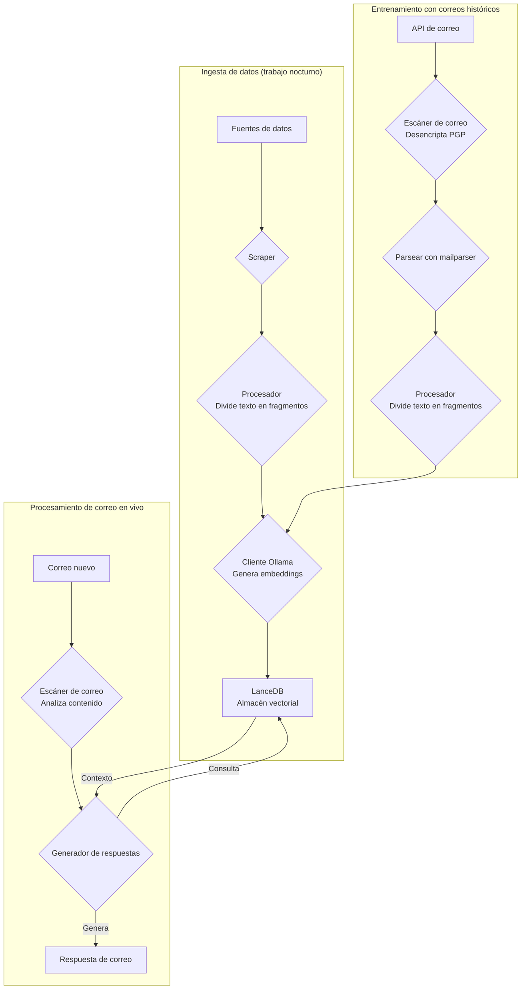
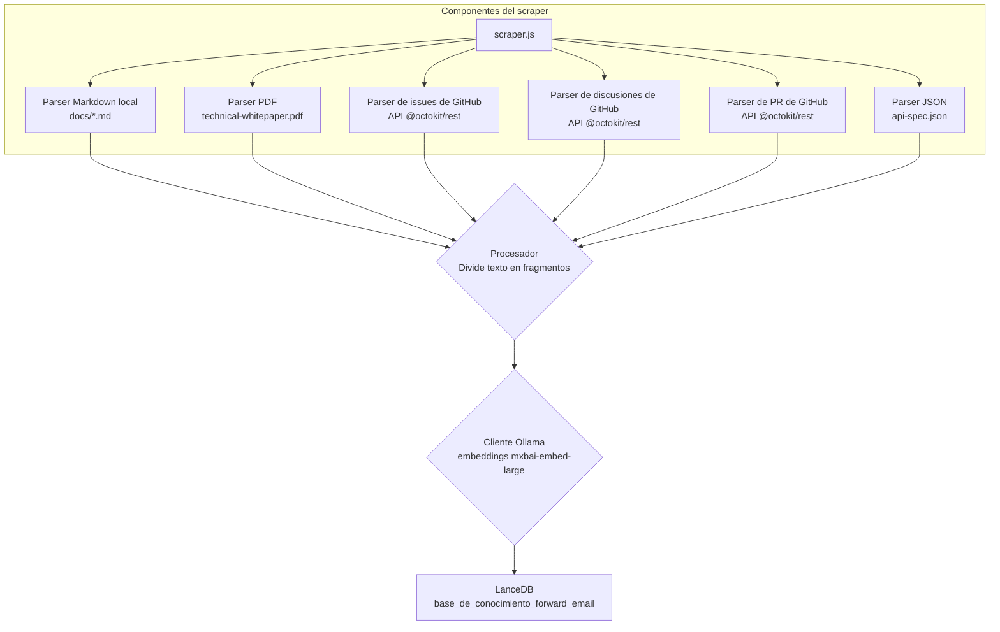
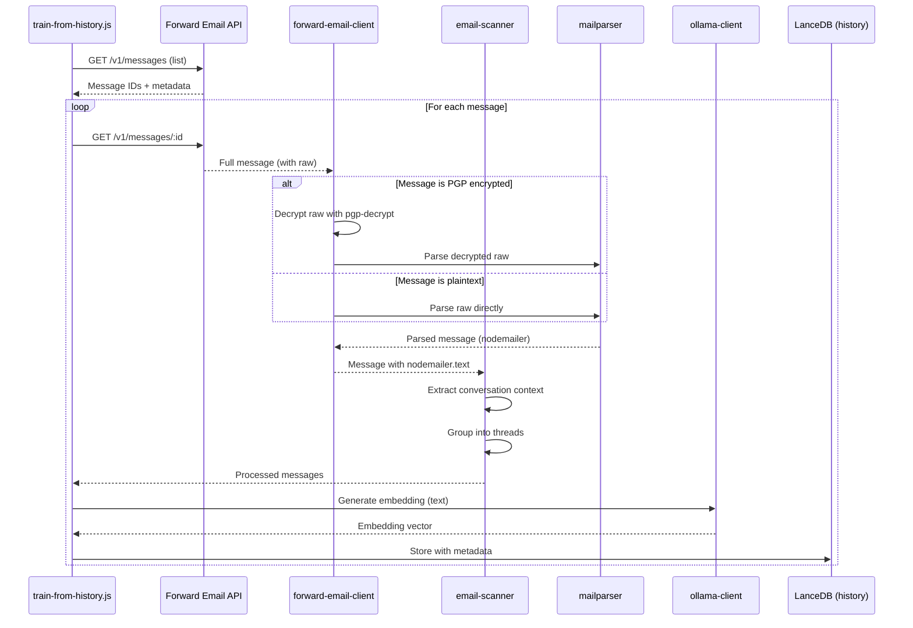

# Construyendo un Agente de Soporte al Cliente con IA y Privacidad Primero con LanceDB, Ollama y Node.js {#building-a-privacy-first-ai-customer-support-agent-with-lancedb-ollama-and-nodejs}


> \[!NOTE]
> Este documento cubre nuestro viaje construyendo un agente de soporte con IA autoalojado. Escribimos sobre desafíos similares en nuestro post del blog [Email Startup Graveyard](https://forwardemail.net/blog/docs/email-startup-graveyard-why-80-percent-email-companies-fail). Honestamente pensamos en escribir una continuación llamada "AI Startup Graveyard" pero tal vez tengamos que esperar otro año o más hasta que la burbuja de la IA potencialmente estalle(?). Por ahora, este es nuestro volcado de ideas sobre lo que funcionó, lo que no, y por qué lo hicimos de esta manera.

Así es como construimos nuestro propio agente de soporte al cliente con IA. Lo hicimos a la manera difícil: autoalojado, con privacidad primero, y completamente bajo nuestro control. ¿Por qué? Porque no confiamos en servicios de terceros con los datos de nuestros clientes. Es un requisito del GDPR y DPA, y es lo correcto.

Esto no fue un proyecto divertido de fin de semana. Fue un viaje de un mes navegando dependencias rotas, documentación engañosa, y el caos general del ecosistema de IA de código abierto en 2025. Este documento es un registro de lo que construimos, por qué lo construimos, y los obstáculos que encontramos en el camino.


## Tabla de Contenidos {#table-of-contents}

* [Beneficios para el Cliente: Soporte Humano Aumentado con IA](#customer-benefits-ai-augmented-human-support)
  * [Respuestas Más Rápidas y Precisas](#faster-more-accurate-responses)
  * [Consistencia Sin Agotamiento](#consistency-without-burnout)
  * [Lo Que Obtienes](#what-you-get)
* [Una Reflexión Personal: La Lucha de Dos Décadas](#a-personal-reflection-the-two-decade-grind)
* [Por Qué la Privacidad Importa](#why-privacy-matters)
* [Análisis de Costos: IA en la Nube vs Autoalojada](#cost-analysis-cloud-ai-vs-self-hosted)
  * [Comparación de Servicios de IA en la Nube](#cloud-ai-service-comparison)
  * [Desglose de Costos: Base de Conocimiento de 5GB](#cost-breakdown-5gb-knowledge-base)
  * [Costos de Hardware Autoalojado](#self-hosted-hardware-costs)
* [Probando Nuestra Propia API](#dogfooding-our-own-api)
  * [Por Qué Importa Probar Nuestra Propia API](#why-dogfooding-matters)
  * [Ejemplos de Uso de la API](#api-usage-examples)
  * [Beneficios de Rendimiento](#performance-benefits)
* [Arquitectura de Encriptación](#encryption-architecture)
  * [Capa 1: Encriptación del Buzón (chacha20-poly1305)](#layer-1-mailbox-encryption-chacha20-poly1305)
  * [Capa 2: Encriptación PGP a Nivel de Mensaje](#layer-2-message-level-pgp-encryption)
  * [Por Qué Esto Importa para el Entrenamiento](#why-this-matters-for-training)
  * [Seguridad del Almacenamiento](#storage-security)
  * [El Almacenamiento Local es Práctica Estándar](#local-storage-is-standard-practice)
* [La Arquitectura](#the-architecture)
  * [Flujo a Alto Nivel](#high-level-flow)
  * [Flujo Detallado del Scraper](#detailed-scraper-flow)
* [Cómo Funciona](#how-it-works)
  * [Construyendo la Base de Conocimiento](#building-the-knowledge-base)
  * [Entrenamiento con Emails Históricos](#training-from-historical-emails)
  * [Procesamiento de Emails Entrantes](#processing-incoming-emails)
  * [Gestión de la Tienda Vectorial](#vector-store-management)
* [El Cementerio de Bases de Datos Vectoriales](#the-vector-database-graveyard)
* [Requisitos del Sistema](#system-requirements)
* [Configuración de Cron Jobs](#cron-job-configuration)
  * [Variables de Entorno](#environment-variables)
  * [Cron Jobs para Múltiples Buzones](#cron-jobs-for-multiple-inboxes)
  * [Desglose del Horario de Cron](#cron-schedule-breakdown)
  * [Cálculo Dinámico de Fechas](#dynamic-date-calculation)
  * [Configuración Inicial: Extraer Lista de URLs del Sitemap](#initial-setup-extract-url-list-from-sitemap)
  * [Pruebas Manuales de Cron Jobs](#testing-cron-jobs-manually)
  * [Monitoreo de Logs](#monitoring-logs)
* [Ejemplos de Código](#code-examples)
  * [Scraping y Procesamiento](#scraping-and-processing)
  * [Entrenamiento con Emails Históricos](#training-from-historical-emails-1)
  * [Consultas para Contexto](#querying-for-context)
* [El Futuro: I+D en Escáner de Spam](#the-future-spam-scanner-rd)
* [Solución de Problemas](#troubleshooting)
  * [Error de Desajuste en Dimensión Vectorial](#vector-dimension-mismatch-error)
  * [Contexto Vacío en la Base de Conocimiento](#empty-knowledge-base-context)
  * [Fallos en Desencriptación PGP](#pgp-decryption-failures)
* [Consejos de Uso](#usage-tips)
  * [Logrando Inbox Zero](#achieving-inbox-zero)
  * [Uso de la Etiqueta skip-ai](#using-the-skip-ai-label)
  * [Hilos de Email y Responder a Todos](#email-threading-and-reply-all)
  * [Monitoreo y Mantenimiento](#monitoring-and-maintenance)
* [Pruebas](#testing)
  * [Ejecutando Pruebas](#running-tests)
  * [Cobertura de Pruebas](#test-coverage)
  * [Entorno de Pruebas](#test-environment)
* [Conclusiones Clave](#key-takeaways)
## Beneficios para el Cliente: Soporte Humano Aumentado por IA {#customer-benefits-ai-augmented-human-support}

Nuestro sistema de IA no reemplaza a nuestro equipo de soporte, lo mejora. Esto es lo que significa para ti:

### Respuestas Más Rápidas y Precisas {#faster-more-accurate-responses}

**Humano en el Bucle**: Cada borrador generado por IA es revisado, editado y curado por nuestro equipo humano de soporte antes de ser enviado a ti. La IA se encarga de la investigación inicial y la redacción, liberando a nuestro equipo para enfocarse en el control de calidad y la personalización.

**Entrenada con la Experiencia Humana**: La IA aprende de:

* Nuestra base de conocimientos y documentación escrita a mano
* Publicaciones de blog y tutoriales escritos por humanos
* Nuestra completa sección de preguntas frecuentes (escrita por humanos)
* Conversaciones pasadas con clientes (todas manejadas por humanos reales)

Recibes respuestas informadas por años de experiencia humana, solo que entregadas más rápido.

### Consistencia Sin Agotamiento {#consistency-without-burnout}

Nuestro pequeño equipo maneja cientos de solicitudes de soporte diariamente, cada una requiriendo diferentes conocimientos técnicos y cambios mentales de contexto:

* Preguntas de facturación requieren conocimiento del sistema financiero
* Problemas de DNS requieren experiencia en redes
* Integración de API requiere conocimientos de programación
* Reportes de seguridad requieren evaluación de vulnerabilidades

Sin la ayuda de IA, este cambio constante de contexto conduce a:

* Tiempos de respuesta más lentos
* Errores humanos por fatiga
* Calidad de respuesta inconsistente
* Agotamiento del equipo

**Con la augmentación de IA**, nuestro equipo:

* Responde más rápido (la IA redacta en segundos)
* Comete menos errores (la IA detecta errores comunes)
* Mantiene calidad consistente (la IA referencia la misma base de conocimientos cada vez)
* Se mantiene fresco y enfocado (menos tiempo investigando, más tiempo ayudando)

### Lo Que Obtienes {#what-you-get}

✅ **Velocidad**: La IA redacta respuestas en segundos, los humanos revisan y envían en minutos

✅ **Precisión**: Respuestas basadas en nuestra documentación real y soluciones pasadas

✅ **Consistencia**: Las mismas respuestas de alta calidad ya sea a las 9am o a las 9pm

✅ **Toque humano**: Cada respuesta es revisada y personalizada por nuestro equipo

✅ **Sin alucinaciones**: La IA solo usa nuestra base de conocimientos verificada, no datos genéricos de internet

> \[!NOTE]
> **Siempre estás hablando con humanos**. La IA es un asistente de investigación que ayuda a nuestro equipo a encontrar la respuesta correcta más rápido. Piénsalo como un bibliotecario que encuentra instantáneamente el libro relevante, pero un humano aún lo lee y te lo explica.


## Una Reflexión Personal: La Larga Lucha de Dos Décadas {#a-personal-reflection-the-two-decade-grind}

Antes de entrar en detalles técnicos, una nota personal. Llevo casi dos décadas en esto. Las horas interminables frente al teclado, la búsqueda incansable de una solución, la profunda y enfocada lucha – esta es la realidad de construir algo significativo. Es una realidad que a menudo se pasa por alto en los ciclos de hype de nuevas tecnologías.

La reciente explosión de la IA ha sido particularmente frustrante. Nos venden un sueño de automatización, de asistentes de IA que escribirán nuestro código y resolverán nuestros problemas. ¿La realidad? El resultado suele ser código basura que requiere más tiempo para arreglar que el que habría tomado escribirlo desde cero. La promesa de hacer nuestras vidas más fáciles es falsa. Es una distracción del trabajo duro y necesario de construir.

Y luego está el dilema del contribuyente en código abierto. Ya estás agotado, exhausto por la lucha. Usas una IA para ayudarte a escribir un reporte de error detallado y bien estructurado, esperando facilitar a los mantenedores entender y arreglar el problema. ¿Y qué pasa? Te regañan. Tu contribución es descartada como "fuera de tema" o de bajo esfuerzo, como vimos en un reciente [issue de Node.js en GitHub](https://github.com/nodejs/node/issues/60719#issuecomment-3534304321). Es una bofetada para desarrolladores senior que solo intentan ayudar.

Esta es la realidad del ecosistema en el que trabajamos. No se trata solo de herramientas rotas; se trata de una cultura que a menudo no respeta el tiempo y el [esfuerzo de sus contribuyentes](https://forwardemail.net/blog/docs/how-npm-packages-billion-downloads-shaped-javascript-ecosystem). Esta publicación es una crónica de esa realidad. Es una historia sobre las herramientas, sí, pero también sobre el costo humano de construir en un ecosistema roto que, a pesar de toda su promesa, está fundamentalmente roto.
## Por qué la privacidad importa {#why-privacy-matters}

Nuestro [documento técnico](https://forwardemail.net/technical-whitepaper.pdf) cubre en profundidad nuestra filosofía de privacidad. La versión corta: no enviamos datos de clientes a terceros. Nunca. Eso significa no OpenAI, no Anthropic, no bases de datos vectoriales alojadas en la nube. Todo funciona localmente en nuestra infraestructura. Esto es innegociable para el cumplimiento del GDPR y nuestros compromisos DPA.


## Análisis de costos: IA en la nube vs autoalojada {#cost-analysis-cloud-ai-vs-self-hosted}

Antes de profundizar en la implementación técnica, hablemos de por qué el autoalojamiento importa desde una perspectiva de costos. Los modelos de precios de los servicios de IA en la nube los hacen prohibitivamente caros para casos de uso de alto volumen como el soporte al cliente.

### Comparación de servicios de IA en la nube {#cloud-ai-service-comparison}

| Servicio        | Proveedor           | Costo de embedding                                              | Costo LLM (Entrada)                                                       | Costo LLM (Salida)      | Política de privacidad                              | GDPR/DPA        | Hospedaje         | Compartición de datos |
| --------------- | ------------------- | --------------------------------------------------------------- | ------------------------------------------------------------------------- | ---------------------- | -------------------------------------------------- | --------------- | ----------------- | --------------------- |
| **OpenAI**      | OpenAI (EE.UU.)     | [$0.02-0.13/1M tokens](https://openai.com/api/pricing/)         | $0.15-20/1M tokens                                                        | $0.60-80/1M tokens     | [Enlace](https://openai.com/policies/privacy-policy/) | DPA limitado    | Azure (EE.UU.)    | Sí (entrenamiento)    |
| **Claude**      | Anthropic (EE.UU.)  | N/A                                                             | [$3-20/1M tokens](https://docs.claude.com/en/docs/about-claude/pricing) | $15-80/1M tokens       | [Enlace](https://www.anthropic.com/legal/privacy)  | DPA limitado    | AWS/GCP (EE.UU.)  | No (afirmado)         |
| **Gemini**      | Google (EE.UU.)     | [$0.15/1M tokens](https://ai.google.dev/gemini-api/docs/pricing) | $0.30-1.00/1M tokens                                                     | $2.50/1M tokens        | [Enlace](https://policies.google.com/privacy)      | DPA limitado    | GCP (EE.UU.)      | Sí (mejora)           |
| **DeepSeek**    | DeepSeek (China)    | N/A                                                             | [$0.028-0.28/1M tokens](https://api-docs.deepseek.com/quick_start/pricing) | $0.42/1M tokens        | [Enlace](https://www.deepseek.com/en)               | Desconocido    | China             | Desconocido           |
| **Mistral**     | Mistral AI (Francia) | [$0.10/1M tokens](https://mistral.ai/pricing)                   | $0.40/1M tokens                                                         | $2.00/1M tokens        | [Enlace](https://mistral.ai/terms/)                 | GDPR UE        | UE                | Desconocido           |
| **Autoalojado** | Usted               | $0 (hardware existente)                                         | $0 (hardware existente)                                                  | $0 (hardware existente) | Su política                                        | Cumplimiento total | MacBook M5 + cron | Nunca                 |

> \[!WARNING]
> **Preocupaciones sobre la soberanía de datos**: Los proveedores estadounidenses (OpenAI, Claude, Gemini) están sujetos al CLOUD Act, que permite al gobierno de EE.UU. acceder a los datos. DeepSeek (China) opera bajo las leyes de datos chinas. Mientras que Mistral (Francia) ofrece hospedaje en la UE y cumplimiento del GDPR, el autoalojamiento sigue siendo la única opción para la soberanía y control total de los datos.

### Desglose de costos: base de conocimiento de 5GB {#cost-breakdown-5gb-knowledge-base}

Calculemos el costo de procesar una base de conocimiento de 5GB (típico para una empresa mediana con documentos, correos electrónicos e historial de soporte).

**Supuestos:**

* 5GB de texto ≈ 1.25 mil millones de tokens (asumiendo \~4 caracteres/token)
* Generación inicial de embeddings
* Reentrenamiento mensual (re-embedding completo)
* 10,000 consultas de soporte por mes
* Consulta promedio: 500 tokens de entrada, 300 tokens de salida
**Desglose Detallado de Costos:**

| Componente                            | OpenAI           | Claude          | Gemini               | Autoalojado       |
| ------------------------------------ | ---------------- | --------------- | -------------------- | ----------------- |
| **Embedding Inicial** (1.25B tokens) | $25,000          | N/A             | $187,500             | $0                |
| **Consultas Mensuales** (10K × 800 tokens) | $1,200-16,000    | $2,400-16,000   | $2,400-3,200         | $0                |
| **Reentrenamiento Mensual** (1.25B tokens) | $25,000          | N/A             | $187,500             | $0                |
| **Total Primer Año**                 | $325,200-217,000 | $28,800-192,000 | $2,278,800-2,226,000 | ~$60 (electricidad) |
| **Cumplimiento de Privacidad**      | ❌ Limitado       | ❌ Limitado     | ❌ Limitado           | ✅ Completo       |
| **Soberanía de Datos**               | ❌ No            | ❌ No           | ❌ No                 | ✅ Sí             |

> \[!CAUTION]
> **Los costos de embedding de Gemini son catastróficos** a $0.15/1M tokens. Un solo embedding de base de conocimiento de 5GB costaría $187,500. Esto es 37 veces más caro que OpenAI y lo hace completamente inutilizable para producción.

### Costos de Hardware Autoalojado {#self-hosted-hardware-costs}

Nuestra configuración funciona en hardware existente que ya poseemos:

* **Hardware**: MacBook M5 (ya poseído para desarrollo)
* **Costo adicional**: $0 (usa hardware existente)
* **Electricidad**: \~$5/mes (estimado)
* **Total primer año**: \~$60
* **Continuo**: $60/año

**ROI**: El autoalojamiento tiene esencialmente costo marginal cero ya que usamos hardware de desarrollo existente. El sistema corre mediante tareas cron durante horas de baja demanda.


## Usando Nuestra Propia API {#dogfooding-our-own-api}

Una de las decisiones arquitectónicas más importantes que tomamos fue que todos los trabajos de IA usaran directamente la [Forward Email API](https://forwardemail.net/email-api). Esto no solo es una buena práctica, sino una función de fuerza para la optimización del rendimiento.

### Por Qué Importa Usar Nuestra Propia API {#why-dogfooding-matters}

Cuando nuestros trabajos de IA usan los mismos endpoints API que nuestros clientes:

1. **Los cuellos de botella de rendimiento nos afectan primero** - Sentimos el problema antes que los clientes
2. **La optimización beneficia a todos** - Las mejoras para nuestros trabajos mejoran automáticamente la experiencia del cliente
3. **Pruebas en el mundo real** - Nuestros trabajos procesan miles de correos, proporcionando pruebas de carga continuas
4. **Reutilización de código** - Misma autenticación, limitación de tasa, manejo de errores y lógica de caché

### Ejemplos de Uso de la API {#api-usage-examples}

**Listando Mensajes (train-from-history.js):**

```javascript
// Usa GET /v1/messages?folder=INBOX con BasicAuth
// Excluye eml, raw, nodemailer para reducir tamaño de respuesta (solo necesitamos IDs)
const response = await axios.get(
  `${this.apiBase}/v1/messages`,
  {
    params: {
      folder: 'INBOX',
      limit: 100,
      eml: false,
      raw: false,
      nodemailer: false
    },
    auth: {
      username: process.env.FORWARD_EMAIL_ALIAS_USERNAME,
      password: process.env.FORWARD_EMAIL_ALIAS_PASSWORD
    }
  }
);

const messages = response.data;
// Retorna: [{ id, subject, date, ... }, ...]
// El contenido completo del mensaje se obtiene luego vía GET /v1/messages/:id
```

**Obteniendo Mensajes Completos (forward-email-client.js):**

```javascript
// Usa GET /v1/messages/:id para obtener mensaje completo con contenido raw
const response = await axios.get(
  `${this.apiBase}/v1/messages/${messageId}`,
  {
    auth: {
      username: this.aliasUsername,
      password: this.aliasPassword
    }
  }
);

const message = response.data;
// Retorna: { id, subject, raw, eml, nodemailer: { ... }, ... }
```

**Creando Respuestas en Borrador (process-inbox.js):**

```javascript
// Usa POST /v1/messages para crear respuestas en borrador
const response = await axios.post(
  `${this.apiBase}/v1/messages`,
  {
    folder: 'Drafts',
    subject: `Re: ${originalSubject}`,
    to: senderEmail,
    text: generatedResponse,
    inReplyTo: originalMessageId
  },
  {
    auth: {
      username: process.env.FORWARD_EMAIL_ALIAS_USERNAME,
      password: process.env.FORWARD_EMAIL_ALIAS_PASSWORD
    }
  }
);
```
### Beneficios de Rendimiento {#performance-benefits}

Debido a que nuestros trabajos de IA se ejecutan en la misma infraestructura API:

* **Optimizaciones de caché** benefician tanto a los trabajos como a los clientes
* **Limitación de tasa** se prueba bajo carga real
* **Manejo de errores** está probado en batalla
* **Tiempos de respuesta de la API** se monitorean constantemente
* **Consultas a la base de datos** están optimizadas para ambos casos de uso
* **Optimización de ancho de banda** - Excluir `eml`, `raw`, `nodemailer` al listar reduce el tamaño de la respuesta en \~90%

Cuando `train-from-history.js` procesa 1,000 correos electrónicos, está haciendo más de 1,000 llamadas a la API. Cualquier ineficiencia en la API se vuelve inmediatamente evidente. Esto nos obliga a optimizar el acceso IMAP, las consultas a la base de datos y la serialización de respuestas—mejoras que benefician directamente a nuestros clientes.

**Ejemplo de optimización**: Listar 100 mensajes con contenido completo = \~10MB de respuesta. Listar con `eml: false, raw: false, nodemailer: false` = \~100KB de respuesta (100 veces más pequeño).


## Arquitectura de Encriptación {#encryption-architecture}

Nuestro almacenamiento de correo electrónico utiliza múltiples capas de encriptación, que los trabajos de IA deben descifrar en tiempo real para el entrenamiento.

### Capa 1: Encriptación del Buzón (chacha20-poly1305) {#layer-1-mailbox-encryption-chacha20-poly1305}

Todos los buzones IMAP se almacenan como bases de datos SQLite encriptadas con **chacha20-poly1305**, un algoritmo de encriptación seguro contra computación cuántica. Esto se detalla en nuestro [artículo del blog sobre servicio de correo electrónico encriptado seguro contra computación cuántica](https://forwardemail.net/blog/docs/best-quantum-safe-encrypted-email-service).

**Propiedades Clave:**

* **Algoritmo**: ChaCha20-Poly1305 (cifrado AEAD)
* **Seguro contra computación cuántica**: Resistente a ataques de computación cuántica
* **Almacenamiento**: Archivos de base de datos SQLite en disco
* **Acceso**: Descifrado en memoria cuando se accede vía IMAP/API

### Capa 2: Encriptación PGP a Nivel de Mensaje {#layer-2-message-level-pgp-encryption}

Muchos correos de soporte están además encriptados con PGP (estándar OpenPGP). Los trabajos de IA deben descifrar estos para extraer contenido para el entrenamiento.

**Flujo de Descifrado:**

```javascript
// 1. La API devuelve el mensaje con contenido raw encriptado
const message = await forwardEmailClient.getMessage(id);

// 2. Verificar si el contenido raw está encriptado con PGP
if (isMessageEncrypted(message.raw)) {
  // 3. Descifrar con nuestra clave privada
  const decryptedRaw = await pgpDecrypt(message.raw);

  // 4. Parsear el mensaje MIME descifrado
  const parsed = await simpleParser(decryptedRaw);

  // 5. Poblar nodemailer con contenido descifrado
  message.nodemailer = {
    text: parsed.text,
    html: parsed.html,
    from: parsed.from,
    to: parsed.to,
    subject: parsed.subject,
    date: parsed.date
  };
}
```

**Configuración PGP:**

```bash
# Clave privada para descifrado (ruta al archivo de clave ASCII-armored)
GPG_SECURITY_KEY="/path/to/private-key.asc"

# Frase de paso para la clave privada (si está encriptada)
GPG_SECURITY_PASSPHRASE="your-passphrase"
```

El helper `pgp-decrypt.js`:

1. Lee la clave privada del disco una vez (almacenada en caché en memoria)
2. Descifra la clave con la frase de paso
3. Usa la clave descifrada para todo el descifrado de mensajes
4. Soporta descifrado recursivo para mensajes encriptados anidados

### Por Qué Esto Importa para el Entrenamiento {#why-this-matters-for-training}

Sin el descifrado adecuado, la IA entrenaría con datos cifrados sin sentido:

```
-----BEGIN PGP MESSAGE-----
Version: OpenPGP.js v4.10.10

wcBMA8Z3lHJnFnNUAQgAqK7F8...
-----END PGP MESSAGE-----
```

Con el descifrado, la IA entrena con contenido real:

```
Subject: Re: Bug Report

Hi John,

Thanks for reporting this issue. I've confirmed the bug
and created a fix in PR #1234...
```

### Seguridad del Almacenamiento {#storage-security}

El descifrado ocurre en memoria durante la ejecución del trabajo, y el contenido descifrado se convierte en embeddings que luego se almacenan en la base de datos vectorial LanceDB en disco.

**Dónde vive la data:**

* **Base de datos vectorial**: Almacenada en estaciones de trabajo MacBook M5 encriptadas
* **Seguridad física**: Las estaciones de trabajo permanecen con nosotros en todo momento (no en centros de datos)
* **Encriptación de disco**: Encriptación completa de disco en todas las estaciones de trabajo
* **Seguridad de red**: Cortafuegos y aislamiento de redes públicas

**Despliegue futuro en centro de datos:**
Si alguna vez migramos a hosting en centro de datos, los servidores tendrán:

* Encriptación completa de disco LUKS
* Acceso USB deshabilitado
* Medidas de seguridad física
* Aislamiento de red
Para detalles completos sobre nuestras prácticas de seguridad, consulte nuestra [página de Seguridad](https://forwardemail.net/en/security).

> \[!NOTE]
> La base de datos vectorial contiene embeddings (representaciones matemáticas), no el texto original en claro. Sin embargo, los embeddings pueden potencialmente ser revertidos, por lo que los mantenemos en estaciones de trabajo cifradas y físicamente seguras.

### El almacenamiento local es una práctica estándar {#local-storage-is-standard-practice}

Almacenar embeddings en las estaciones de trabajo de nuestro equipo no es diferente a cómo ya manejamos el correo electrónico:

* **Thunderbird**: Descarga y almacena el contenido completo del correo localmente en archivos mbox/maildir
* **Clientes de webmail**: Cachean datos de correo en el almacenamiento del navegador y bases de datos locales
* **Clientes IMAP**: Mantienen copias locales de los mensajes para acceso sin conexión
* **Nuestro sistema de IA**: Almacena embeddings matemáticos (no texto en claro) en LanceDB

La diferencia clave: los embeddings son **más seguros** que el correo en texto plano porque son:

1. Representaciones matemáticas, no texto legible
2. Más difíciles de revertir que el texto en claro
3. Aún sujetos a la misma seguridad física que nuestros clientes de correo

Si es aceptable para nuestro equipo usar Thunderbird o webmail en estaciones de trabajo cifradas, es igualmente aceptable (y posiblemente más seguro) almacenar embeddings de la misma manera.


## La arquitectura {#the-architecture}

Aquí está el flujo básico. Parece simple. No lo fue.

> \[!NOTE]
> Todos los trabajos usan la API de Forward Email directamente, asegurando que las optimizaciones de rendimiento beneficien tanto a nuestro sistema de IA como a nuestros clientes.

### Flujo de alto nivel {#high-level-flow}



### Flujo detallado del scraper {#detailed-scraper-flow}

El `scraper.js` es el corazón de la ingesta de datos. Es una colección de parsers para diferentes formatos de datos.




## Cómo funciona {#how-it-works}

El proceso se divide en tres partes principales: construir la base de conocimiento, entrenar con correos históricos y procesar correos nuevos.

### Construcción de la base de conocimiento {#building-the-knowledge-base}

**`update-knowledge-base.js`**: Este es el trabajo principal. Se ejecuta cada noche, limpia el almacén vectorial antiguo y lo reconstruye desde cero. Usa `scraper.js` para obtener contenido de todas las fuentes, `processor.js` para dividirlo en fragmentos y `ollama-client.js` para generar embeddings. Finalmente, `vector-store.js` almacena todo en LanceDB.

**Fuentes de datos:**

* Archivos Markdown locales (`docs/*.md`)
* PDF del whitepaper técnico (`assets/technical-whitepaper.pdf`)
* JSON de especificación API (`assets/api-spec.json`)
* Issues de GitHub (vía Octokit)
* Discusiones de GitHub (vía Octokit)
* Pull requests de GitHub (vía Octokit)
* Lista de URLs del sitemap (`$LANCEDB_PATH/valid-urls.json`)

### Entrenamiento con correos históricos {#training-from-historical-emails}

**`train-from-history.js`**: Este trabajo escanea correos históricos de todas las carpetas, desencripta mensajes cifrados con PGP y los añade a un almacén vectorial separado (`customer_support_history`). Esto proporciona contexto de interacciones previas de soporte.
**Flujo de Procesamiento de Correos Electrónicos:**



**Características Clave:**

* **Desencriptado PGP**: Usa el helper `pgp-decrypt.js` con la variable de entorno `GPG_SECURITY_KEY`
* **Agrupación de Hilos**: Agrupa correos relacionados en hilos de conversación
* **Preservación de Metadatos**: Almacena carpeta, asunto, fecha, estado de encriptación
* **Contexto de Respuesta**: Vincula mensajes con sus respuestas para mejor contexto

**Configuración:**

```bash
# Variables de entorno para train-from-history
HISTORY_SCAN_LIMIT=1000              # Máximo de mensajes a procesar
HISTORY_SCAN_SINCE="2024-01-01"      # Solo procesar mensajes posteriores a esta fecha
HISTORY_DECRYPT_PGP=true             # Intentar desencriptar PGP
GPG_SECURITY_KEY="/path/to/key.asc"  # Ruta a la clave privada PGP
GPG_SECURITY_PASSPHRASE="passphrase" # Frase de contraseña de la clave (opcional)
```

**Qué se Almacena:**

```javascript
{
  type: 'historical_email',
  folder: 'INBOX',
  subject: 'Re: Bug Report',
  date: '2025-01-15T10:30:00Z',
  messageId: '67e2f288893921...',
  threadId: 'Bug Report',
  hasReply: true,
  encrypted: true,
  decrypted: true,
  replySubject: 'Bug Report',
  replyText: 'First 500 chars of reply...',
  chunkSize: 1000,
  chunkOverlap: 200,
  chunkIndex: 0
}
```

> \[!TIP]
> Ejecuta `train-from-history` después de la configuración inicial para poblar el contexto histórico. Esto mejora drásticamente la calidad de las respuestas al aprender de interacciones previas de soporte.

### Procesamiento de Correos Entrantes {#processing-incoming-emails}

**`process-inbox.js`**: Este trabajo se ejecuta sobre los correos en nuestros buzones `support@forwardemail.net`, `abuse@forwardemail.net` y `security@forwardemail.net` (específicamente la carpeta IMAP `INBOX`). Utiliza nuestra API en <https://forwardemail.net/email-api> (por ejemplo, `GET /v1/messages?folder=INBOX` usando acceso BasicAuth con nuestras credenciales IMAP para cada buzón). Analiza el contenido del correo, consulta tanto la base de conocimiento (`forward_email_knowledge_base`) como el almacén vectorial histórico de correos (`customer_support_history`), y luego pasa el contexto combinado a `response-generator.js`. El generador usa `mxbai-embed-large` vía Ollama para crear una respuesta.

**Características del Flujo Automatizado:**

1. **Automatización Inbox Zero**: Después de crear exitosamente un borrador, el mensaje original se mueve automáticamente a la carpeta Archivo. Esto mantiene tu bandeja de entrada limpia y ayuda a lograr inbox cero sin intervención manual.

2. **Omitir Procesamiento AI**: Simplemente añade una etiqueta `skip-ai` (sin importar mayúsculas/minúsculas) a cualquier mensaje para evitar el procesamiento por IA. El mensaje permanecerá intacto en tu bandeja de entrada, permitiéndote manejarlo manualmente. Esto es útil para mensajes sensibles o casos complejos que requieren juicio humano.

3. **Encadenamiento Correcto de Correos**: Todas las respuestas en borrador incluyen el mensaje original citado abajo (usando el prefijo estándar ` >  `), siguiendo las convenciones de respuesta de correo con el formato "El \[fecha], \[remitente] escribió:". Esto asegura el contexto y encadenamiento correcto en clientes de correo.

4. **Comportamiento de Responder a Todos**: El sistema maneja automáticamente los encabezados Reply-To y destinatarios CC:
   * Si existe un encabezado Reply-To, este se convierte en la dirección Para y el From original se añade en CC
   * Todos los destinatarios originales en Para y CC se incluyen en el CC de la respuesta (excepto tu propia dirección)
   * Sigue las convenciones estándar de responder a todos en conversaciones grupales
**Clasificación de Fuentes**: El sistema utiliza **clasificación ponderada** para priorizar fuentes:

* FAQ: 100% (máxima prioridad)
* Documento técnico: 95%
* Especificación API: 90%
* Documentación oficial: 85%
* Issues de GitHub: 70%
* Correos históricos: 50%

### Gestión del Almacén Vectorial {#vector-store-management}

La clase `VectorStore` en `helpers/customer-support-ai/vector-store.js` es nuestra interfaz con LanceDB.

**Agregar Documentos:**

```javascript
// vector-store.js
async addDocument(text, metadata) {
  const embedding = await this.ollama.generateEmbedding(text);
  await this.table.add([{
    vector: embedding,
    text,
    ...metadata
  }]);
}
```

**Limpiar el Almacén:**

```javascript
// Opción 1: Usar el método clear()
await vectorStore.clear();

// Opción 2: Eliminar el directorio local de la base de datos
await fs.rm(process.env.LANCEDB_PATH, { recursive: true, force: true });
```

La variable de entorno `LANCEDB_PATH` apunta al directorio local de la base de datos embebida. LanceDB es sin servidor y embebida, por lo que no hay un proceso separado que gestionar.


## El Cementerio de Bases de Datos Vectoriales {#the-vector-database-graveyard}

Este fue el primer gran obstáculo. Probamos múltiples bases de datos vectoriales antes de decidirnos por LanceDB. Esto fue lo que salió mal con cada una.

| Base de Datos | GitHub                                                      | Qué salió mal                                                                                                                                                                                                       | Problemas específicos                                                                                                                                                                                                                                                                                                                                                     | Preocupaciones de Seguridad                                                                                                                                                                                      |
| ------------- | ----------------------------------------------------------- | ----------------------------------------------------------------------------------------------------------------------------------------------------------------------------------------------------------------- | ------------------------------------------------------------------------------------------------------------------------------------------------------------------------------------------------------------------------------------------------------------------------------------------------------------------------------------------------------------------------- | ---------------------------------------------------------------------------------------------------------------------------------------------------------------------------------------------------------------- |
| **ChromaDB**  | [chroma-core/chroma](https://github.com/chroma-core/chroma) | `pip3 install chromadb` te da una versión de la edad de piedra con `PydanticImportError`. La única forma de obtener una versión funcional es compilar desde el código fuente. No es amigable para desarrolladores. | Caos con dependencias de Python. Múltiples usuarios reportando instalaciones pip rotas ([#774](https://github.com/chroma-core/chroma/issues/774), [#163](https://github.com/chroma-core/chroma/issues/163)). La documentación dice "solo usa Docker", lo cual no es una respuesta para desarrollo local. Se bloquea en Windows con más de 99 registros ([#3058](https://github.com/chroma-core/chroma/issues/3058)). | **CVE-2024-45848**: Ejecución arbitraria de código vía integración de ChromaDB en MindsDB. Vulnerabilidades críticas del sistema operativo en la imagen Docker ([#3170](https://github.com/chroma-core/chroma/issues/3170)). |
| **Qdrant**    | [qdrant/qdrant](https://github.com/qdrant/qdrant)           | El tap de Homebrew (`qdrant/qdrant/qdrant`) referenciado en su antigua documentación desapareció. Se esfumó. Sin explicación. La documentación oficial ahora solo dice "usa Docker".                             | Falta el tap de Homebrew. No hay binario nativo para macOS. Solo Docker es una barrera para pruebas locales rápidas.                                                                                                                                                                                                                                                   | **CVE-2024-2221**: Vulnerabilidad de carga arbitraria de archivos que permite ejecución remota de código (arreglado en v1.9.0). Puntuación baja de madurez en seguridad según [IronCore Labs](https://ironcorelabs.com/vectordbs/qdrant-security/). |
| **Weaviate**  | [weaviate/weaviate](https://github.com/weaviate/weaviate)   | La versión de Homebrew tenía un error crítico de clustering (`leader not found`). Las banderas documentadas para arreglarlo (`RAFT_JOIN`, `CLUSTER_HOSTNAME`) no funcionaban. Fundamentalmente roto para configuraciones de nodo único. | Errores de clustering incluso en modo nodo único. Sobreingeniería para casos de uso simples.                                                                                                                                                                                                                                                                             | No se encontraron CVEs importantes, pero la complejidad aumenta la superficie de ataque.                                                                                                                                                                   |
| **LanceDB**   | [lancedb/lancedb](https://github.com/lancedb/lancedb)       | Este funcionó. Es embebido y sin servidor. No hay proceso separado. La única molestia es la confusión en el nombre del paquete (`vectordb` está obsoleto, usar `@lancedb/lancedb`) y la documentación dispersa. Podemos vivir con eso. | Confusión en el nombre del paquete (`vectordb` vs `@lancedb/lancedb`), pero por lo demás sólido. La arquitectura embebida elimina clases enteras de problemas de seguridad.                                                                                                                                                                                             | No se conocen CVEs. El diseño embebido significa que no hay superficie de ataque en red.                                                                                                                                                                  |
> \[!WARNING]
> **ChromaDB tiene vulnerabilidades críticas de seguridad.** [CVE-2024-45848](https://nvd.nist.gov/vuln/detail/CVE-2024-45848) permite la ejecución arbitraria de código. La instalación con pip está fundamentalmente rota debido a problemas con la dependencia Pydantic. Evitar para uso en producción.

> \[!WARNING]
> **Qdrant tuvo una vulnerabilidad RCE por carga de archivos** ([CVE-2024-2221](https://qdrant.tech/blog/cve-2024-2221-response/)) que solo se corrigió en la versión v1.9.0. Si debe usar Qdrant, asegúrese de estar en la última versión.

> \[!CAUTION]
> El ecosistema de bases de datos vectoriales de código abierto es complicado. No confíe en la documentación. Asuma que todo está roto hasta que se demuestre lo contrario. Pruebe localmente antes de comprometerse con una pila.


## Requisitos del Sistema {#system-requirements}

* **Node.js:** v18.0.0+ ([GitHub](https://github.com/nodejs/node))
* **Ollama:** Última versión ([GitHub](https://github.com/ollama/ollama))
* **Modelo:** `mxbai-embed-large` vía Ollama
* **Base de Datos Vectorial:** LanceDB ([GitHub](https://github.com/lancedb/lancedb))
* **Acceso a GitHub:** `@octokit/rest` para extraer issues ([GitHub](https://github.com/octokit/rest.js))
* **SQLite:** Para base de datos primaria (vía `mongoose-to-sqlite`)


## Configuración de Tareas Cron {#cron-job-configuration}

Todos los trabajos de IA se ejecutan mediante cron en un MacBook M5. Aquí se explica cómo configurar las tareas cron para que se ejecuten a medianoche en múltiples bandejas de entrada.

### Variables de Entorno {#environment-variables}

Los trabajos requieren estas variables de entorno. La mayoría pueden establecerse en el archivo `.env` (cargado vía `@ladjs/env`), pero `HISTORY_SCAN_SINCE` debe calcularse dinámicamente en el crontab.

**En el archivo `.env`:**

```bash
# Credenciales API de Forward Email (cambian por bandeja)
FORWARD_EMAIL_ALIAS_USERNAME=support@forwardemail.net
FORWARD_EMAIL_ALIAS_PASSWORD=tu-contraseña-imap

# Desencriptación PGP (compartido entre todas las bandejas)
GPG_SECURITY_KEY=/ruta/a/clave-privada.asc
GPG_SECURITY_PASSPHRASE=tu-frase-de-paso

# Configuración de escaneo histórico
HISTORY_SCAN_LIMIT=1000

# Ruta de LanceDB
LANCEDB_PATH=/ruta/a/lancedb
```

**En crontab (calculado dinámicamente):**

```bash
# HISTORY_SCAN_SINCE debe establecerse en línea en crontab con cálculo de fecha shell
# No puede estar en .env porque @ladjs/env no evalúa comandos shell
HISTORY_SCAN_SINCE="$(date -v-1d +%Y-%m-%d)"  # macOS
HISTORY_SCAN_SINCE="$(date -d 'yesterday' +%Y-%m-%d)"  # Linux
```

### Tareas Cron para Múltiples Bandejas {#cron-jobs-for-multiple-inboxes}

Edite su crontab con `crontab -e` y agregue:

```bash
# Actualizar base de conocimiento (se ejecuta una vez, compartido entre todas las bandejas)
0 0 * * * cd /ruta/a/forwardemail.net && LANCEDB_PATH="/ruta/a/lancedb" GPG_SECURITY_KEY="/ruta/a/clave.asc" GPG_SECURITY_PASSPHRASE="pass" node jobs/customer-support-ai/update-knowledge-base.js >> /var/log/update-knowledge-base.log 2>&1

# Entrenar desde historial - support@forwardemail.net
0 0 * * * cd /ruta/a/forwardemail.net && FORWARD_EMAIL_ALIAS_USERNAME="support@forwardemail.net" FORWARD_EMAIL_ALIAS_PASSWORD="support-password" HISTORY_SCAN_SINCE="$(date -v-1d +%Y-%m-%d)" HISTORY_SCAN_LIMIT=1000 GPG_SECURITY_KEY="/ruta/a/clave.asc" GPG_SECURITY_PASSPHRASE="pass" LANCEDB_PATH="/ruta/a/lancedb" node jobs/customer-support-ai/train-from-history.js >> /var/log/train-support.log 2>&1

# Entrenar desde historial - abuse@forwardemail.net
0 0 * * * cd /ruta/a/forwardemail.net && FORWARD_EMAIL_ALIAS_USERNAME="abuse@forwardemail.net" FORWARD_EMAIL_ALIAS_PASSWORD="abuse-password" HISTORY_SCAN_SINCE="$(date -v-1d +%Y-%m-%d)" HISTORY_SCAN_LIMIT=1000 GPG_SECURITY_KEY="/ruta/a/clave.asc" GPG_SECURITY_PASSPHRASE="pass" LANCEDB_PATH="/ruta/a/lancedb" node jobs/customer-support-ai/train-from-history.js >> /var/log/train-abuse.log 2>&1

# Entrenar desde historial - security@forwardemail.net
0 0 * * * cd /ruta/a/forwardemail.net && FORWARD_EMAIL_ALIAS_USERNAME="security@forwardemail.net" FORWARD_EMAIL_ALIAS_PASSWORD="security-password" HISTORY_SCAN_SINCE="$(date -v-1d +%Y-%m-%d)" HISTORY_SCAN_LIMIT=1000 GPG_SECURITY_KEY="/ruta/a/clave.asc" GPG_SECURITY_PASSPHRASE="pass" LANCEDB_PATH="/ruta/a/lancedb" node jobs/customer-support-ai/train-from-history.js >> /var/log/train-security.log 2>&1

# Procesar bandeja - support@forwardemail.net
*/5 * * * * cd /ruta/a/forwardemail.net && FORWARD_EMAIL_ALIAS_USERNAME="support@forwardemail.net" FORWARD_EMAIL_ALIAS_PASSWORD="support-password" GPG_SECURITY_KEY="/ruta/a/clave.asc" GPG_SECURITY_PASSPHRASE="pass" LANCEDB_PATH="/ruta/a/lancedb" node jobs/customer-support-ai/process-inbox.js >> /var/log/process-support.log 2>&1

# Procesar bandeja - abuse@forwardemail.net
*/5 * * * * cd /ruta/a/forwardemail.net && FORWARD_EMAIL_ALIAS_USERNAME="abuse@forwardemail.net" FORWARD_EMAIL_ALIAS_PASSWORD="abuse-password" GPG_SECURITY_KEY="/ruta/a/clave.asc" GPG_SECURITY_PASSPHRASE="pass" LANCEDB_PATH="/ruta/a/lancedb" node jobs/customer-support-ai/process-inbox.js >> /var/log/process-abuse.log 2>&1

# Procesar bandeja - security@forwardemail.net
*/5 * * * * cd /ruta/a/forwardemail.net && FORWARD_EMAIL_ALIAS_USERNAME="security@forwardemail.net" FORWARD_EMAIL_ALIAS_PASSWORD="security-password" GPG_SECURITY_KEY="/ruta/a/clave.asc" GPG_SECURITY_PASSPHRASE="pass" LANCEDB_PATH="/ruta/a/lancedb" node jobs/customer-support-ai/process-inbox.js >> /var/log/process-security.log 2>&1
```
### Desglose del Horario Cron {#cron-schedule-breakdown}

| Trabajo                  | Horario      | Descripción                                                                       |
| ----------------------- | ------------- | --------------------------------------------------------------------------------- |
| `train-from-sitemap.js` | `0 0 * * 0`   | Semanal (domingo a medianoche) - Obtiene todas las URLs del sitemap y entrena la base de conocimiento |
| `train-from-history.js` | `0 0 * * *`   | Medianoche diaria - Escanea los correos del día anterior por bandeja de entrada    |
| `process-inbox.js`      | `*/5 * * * *` | Cada 5 minutos - Procesa correos nuevos y genera borradores                       |

### Cálculo Dinámico de Fecha {#dynamic-date-calculation}

La variable `HISTORY_SCAN_SINCE` **debe calcularse en línea en el crontab** porque:

1. Los archivos `.env` son leídos como cadenas literales por `@ladjs/env`
2. La sustitución de comandos de shell `$(...)` no funciona en archivos `.env`
3. La fecha debe calcularse fresca cada vez que se ejecuta cron

**Enfoque correcto (en crontab):**

```bash
# macOS (fecha BSD)
HISTORY_SCAN_SINCE="$(date -v-1d +%Y-%m-%d)" node jobs/...

# Linux (fecha GNU)
HISTORY_SCAN_SINCE="$(date -d 'yesterday' +%Y-%m-%d)" node jobs/...
```

**Enfoque incorrecto (no funciona en .env):**

```bash
# Esto se leerá como la cadena literal "$(date -v-1d +%Y-%m-%d)"
# NO se evalúa como comando de shell
HISTORY_SCAN_SINCE=$(date -v-1d +%Y-%m-%d)
```

Esto asegura que cada ejecución nocturna calcule dinámicamente la fecha del día anterior, evitando trabajo redundante.

### Configuración Inicial: Extraer Lista de URLs del Sitemap {#initial-setup-extract-url-list-from-sitemap}

Antes de ejecutar el trabajo process-inbox por primera vez, **debes** extraer la lista de URLs del sitemap. Esto crea un diccionario de URLs válidas que el LLM puede referenciar y previene la alucinación de URLs.

```bash
# Configuración inicial: Extraer lista de URLs del sitemap
cd /path/to/forwardemail.net
node jobs/customer-support-ai/train-from-sitemap.js
```

**Qué hace esto:**

1. Obtiene todas las URLs de <https://forwardemail.net/sitemap.xml>
2. Filtra solo URLs no localizadas o URLs /en/ (evita contenido duplicado)
3. Elimina prefijos de localización (/en/faq → /faq)
4. Guarda un archivo JSON simple con la lista de URLs en `$LANCEDB_PATH/valid-urls.json`
5. No realiza crawling ni scraping de metadatos - solo una lista plana de URLs válidas

**Por qué es importante:**

* Evita que el LLM alucine URLs falsas como `/dashboard` o `/login`
* Proporciona una lista blanca de URLs válidas para que el generador de respuestas las referencie
* Simple, rápido y no requiere almacenamiento en base de datos vectorial
* El generador de respuestas carga esta lista al iniciar y la incluye en el prompt

**Agregar al crontab para actualizaciones semanales:**

```bash
# Extraer lista de URLs del sitemap - semanalmente domingo a medianoche
0 0 * * 0 cd /path/to/forwardemail.net && node jobs/customer-support-ai/train-from-sitemap.js >> /var/log/train-sitemap.log 2>&1
```

### Probar Trabajos Cron Manualmente {#testing-cron-jobs-manually}

Para probar un trabajo antes de agregarlo a cron:

```bash
# Probar entrenamiento desde sitemap
cd /path/to/forwardemail.net
export LANCEDB_PATH="/path/to/lancedb"
node jobs/customer-support-ai/train-from-sitemap.js

# Probar entrenamiento desde bandeja de soporte
cd /path/to/forwardemail.net
export FORWARD_EMAIL_ALIAS_USERNAME="support@forwardemail.net"
export FORWARD_EMAIL_ALIAS_PASSWORD="support-password"
export HISTORY_SCAN_SINCE="$(date -v-1d +%Y-%m-%d)"
export HISTORY_SCAN_LIMIT=1000
export GPG_SECURITY_KEY="/path/to/key.asc"
export GPG_SECURITY_PASSPHRASE="pass"
export LANCEDB_PATH="/path/to/lancedb"
node jobs/customer-support-ai/train-from-history.js
```

### Monitoreo de Logs {#monitoring-logs}

Cada trabajo registra en un archivo separado para facilitar la depuración:

```bash
# Ver procesamiento de bandeja de soporte en tiempo real
tail -f /var/log/process-support.log

# Revisar la ejecución de entrenamiento de anoche
cat /var/log/train-support.log | grep "$(date -v-1d +%Y-%m-%d)"

# Ver todos los errores en los trabajos
grep -i error /var/log/train-*.log /var/log/process-*.log
```

> \[!TIP]
> Usa archivos de log separados por bandeja para aislar problemas. Si una bandeja tiene problemas de autenticación, no contaminará los logs de otras bandejas.
## Ejemplos de Código {#code-examples}

### Extracción y Procesamiento {#scraping-and-processing}

```javascript
// jobs/customer-support-ai/update-knowledge-base.js
const scraper = new Scraper();
const processor = new Processor();
const ollamaClient = new OllamaClient();
const vectorStore = new VectorStore();

// Limpiar datos antiguos
await vectorStore.clear();

// Extraer todas las fuentes
const documents = await scraper.scrapeAll();
console.log(`Se extrajeron ${documents.length} documentos`);

// Procesar en fragmentos
const allChunks = [];
for (const doc of documents) {
  const chunks = processor.processDocuments([doc]);
  allChunks.push(...chunks);
}
console.log(`Se generaron ${allChunks.length} fragmentos`);

// Generar embeddings y almacenar
const texts = allChunks.map(chunk => chunk.text);
const embeddings = await ollamaClient.generateEmbeddings(texts);

for (let i = 0; i < allChunks.length; i++) {
  await vectorStore.addDocument(texts[i], {
    ...allChunks[i].metadata,
    embedding: embeddings[i]
  });
}
```

### Entrenamiento a partir de Correos Históricos {#training-from-historical-emails-1}

```javascript
// jobs/customer-support-ai/train-from-history.js
const scanner = new EmailScanner({
  forwardEmailApiBase: config.forwardEmailApiBase,
  forwardEmailAliasUsername: config.forwardEmailAliasUsername,
  forwardEmailAliasPassword: config.forwardEmailAliasPassword
});

const vectorStore = new VectorStore({
  collectionName: 'customer_support_history'
});

// Escanear todas las carpetas (INBOX, Correo Enviado, etc.)
const messages = await scanner.scanAllFolders({
  limit: 1000,
  since: new Date('2024-01-01'),
  decryptPGP: true
});

// Agrupar en hilos de conversación
const threads = scanner.groupIntoThreads(messages);

// Procesar cada hilo
for (const thread of threads) {
  const context = scanner.extractConversationContext(thread);

  for (const message of context.messages) {
    // Omitir mensajes cifrados que no pudieron ser descifrados
    if (message.encrypted && !message.decrypted) continue;

    // Usar contenido ya analizado por nodemailer
    const text = message.nodemailer?.text || '';
    if (!text.trim()) continue;

    // Fragmentar y almacenar
    const chunks = processor.chunkText(`Asunto: ${message.subject}\n\n${text}`, {
      chunkSize: 1000,
      chunkOverlap: 200
    });

    for (const chunk of chunks) {
      await vectorStore.addDocument(chunk.text, {
        type: 'historical_email',
        folder: message.folder,
        subject: message.subject,
        date: message.nodemailer?.date || message.created_at,
        messageId: message.id,
        threadId: context.subject,
        encrypted: message.encrypted || false,
        decrypted: message.decrypted || false,
        ...chunk.metadata
      });
    }
  }
}
```

### Consultas para Contexto {#querying-for-context}

```javascript
// jobs/customer-support-ai/process-inbox.js
const vectorStore = new VectorStore();
const historyVectorStore = new VectorStore({
  collectionName: 'customer_support_history'
});

// Consultar ambas tiendas
const knowledgeContext = await vectorStore.query(emailEmbedding, { limit: 8 });
const historyContext = await historyVectorStore.query(emailEmbedding, { limit: 3 });

// Aquí ocurre la clasificación ponderada y la eliminación de duplicados
const rankedContext = rankAndDeduplicateContext(knowledgeContext, historyContext);

// Generar respuesta
const response = await responseGenerator.generate(email, rankedContext);
```


## El Futuro: I+D del Escáner de Spam {#the-future-spam-scanner-rd}

Todo este proyecto no fue solo para soporte al cliente. Fue I+D. Ahora podemos tomar todo lo que aprendimos sobre embeddings locales, tiendas vectoriales y recuperación de contexto y aplicarlo a nuestro próximo gran proyecto: la capa LLM para [Spam Scanner](https://spamscanner.net). Los mismos principios de privacidad, autoalojamiento y comprensión semántica serán clave.


## Solución de Problemas {#troubleshooting}

### Error de Desajuste en la Dimensión del Vector {#vector-dimension-mismatch-error}

**Error:**

```
Error: Failed to execute query stream: GenericFailure, Invalid input, No vector column found to match with the query vector dimension: 1024
```

**Causa:** Este error ocurre cuando cambias de modelo de embedding (por ejemplo, de `mistral-small` a `mxbai-embed-large`) pero la base de datos LanceDB existente fue creada con una dimensión vectorial diferente.
**Solución:** Necesitas reentrenar la base de conocimientos con el nuevo modelo de incrustación:

```bash
# 1. Detener cualquier trabajo de IA de soporte al cliente en ejecución
pkill -f customer-support-ai

# 2. Eliminar la base de datos LanceDB existente
rm -rf ~/.local/share/lancedb/forward_email_knowledge_base.lance
rm -rf ~/.local/share/lancedb/customer_support_history.lance

# 3. Verificar que el modelo de incrustación esté configurado correctamente en .env
grep OLLAMA_EMBEDDING_MODEL .env
# Debe mostrar: OLLAMA_EMBEDDING_MODEL=mxbai-embed-large

# 4. Descargar el modelo de incrustación en Ollama
ollama pull mxbai-embed-large

# 5. Reentrenar la base de conocimientos
node jobs/customer-support-ai/train-from-history.js

# 6. Reiniciar el trabajo process-inbox vía Bree
# El trabajo se ejecutará automáticamente cada 5 minutos
```

**Por qué sucede esto:** Diferentes modelos de incrustación producen vectores de diferentes dimensiones:

* `mistral-small`: 1024 dimensiones
* `mxbai-embed-large`: 1024 dimensiones
* `nomic-embed-text`: 768 dimensiones
* `all-minilm`: 384 dimensiones

LanceDB almacena la dimensión del vector en el esquema de la tabla. Cuando consultas con una dimensión diferente, falla. La única solución es recrear la base de datos con el nuevo modelo.

### Contexto de Base de Conocimientos Vacía {#empty-knowledge-base-context}

**Síntoma:**

```
debug     Retrieved knowledge base context {
  total: 0,
  afterRanking: 0,
  questionType: 'capability'
}
```

**Causa:** La base de conocimientos aún no ha sido entrenada, o la tabla LanceDB no existe.

**Solución:** Ejecuta el trabajo de entrenamiento para poblar la base de conocimientos:

```bash
# Entrenar desde correos históricos
node jobs/customer-support-ai/train-from-history.js

# O entrenar desde sitio web/documentación (si tienes un scraper)
node jobs/customer-support-ai/train-from-website.js
```

### Fallos en la Desencriptación PGP {#pgp-decryption-failures}

**Síntoma:** Los mensajes aparecen como encriptados pero el contenido está vacío.

**Solución:**

1. Verifica que la ruta de la clave GPG esté configurada correctamente:

```bash
grep GPG_SECURITY_KEY .env
# Debe apuntar a tu archivo de clave privada
```

2. Prueba la desencriptación manualmente:

```bash
node -e "const decrypt = require('./helpers/customer-support-ai/pgp-decrypt'); decrypt.testDecryption();"
```

3. Revisa los permisos de la clave:

```bash
ls -la /path/to/your/gpg-key.asc
# Debe ser legible por el usuario que ejecuta el trabajo
```


## Consejos de Uso {#usage-tips}

### Lograr Inbox Cero {#achieving-inbox-zero}

El sistema está diseñado para ayudarte a lograr inbox cero automáticamente:

1. **Archivado Automático**: Cuando se crea un borrador con éxito, el mensaje original se mueve automáticamente a la carpeta Archivo. Esto mantiene tu bandeja de entrada limpia sin intervención manual.

2. **Revisar Borradores**: Revisa la carpeta de Borradores regularmente para revisar las respuestas generadas por IA. Edita según sea necesario antes de enviar.

3. **Anulación Manual**: Para mensajes que necesitan atención especial, simplemente añade la etiqueta `skip-ai` antes de que se ejecute el trabajo.

### Uso de la etiqueta skip-ai {#using-the-skip-ai-label}

Para evitar el procesamiento por IA de mensajes específicos:

1. **Añade la etiqueta**: En tu cliente de correo, añade una etiqueta/etiqueta `skip-ai` a cualquier mensaje (no sensible a mayúsculas)
2. **El mensaje permanece en la bandeja de entrada**: El mensaje no será procesado ni archivado
3. **Manejar manualmente**: Puedes responderlo tú mismo sin interferencia de IA

**Cuándo usar skip-ai:**

* Mensajes sensibles o confidenciales
* Casos complejos que requieren juicio humano
* Mensajes de clientes VIP
* Consultas legales o relacionadas con cumplimiento
* Mensajes que necesitan atención humana inmediata

### Hilos de Correo y Responder a Todos {#email-threading-and-reply-all}

El sistema sigue las convenciones estándar de correo electrónico:

**Mensajes Originales Citados:**

```
Hola,

[Respuesta generada por IA]

--
Gracias,
Forward Email
https://forwardemail.net

El lun, 15 de ene de 2024, 3:45 PM John Doe <john@example.com> escribió:
> Este es el mensaje original
> con cada línea citada
> usando el prefijo estándar "> "
```

**Manejo de Reply-To:**

* Si el mensaje original tiene un encabezado Reply-To, el borrador responde a esa dirección
* La dirección From original se añade en CC
* Se preservan todos los demás destinatarios originales en Para y CC

**Ejemplo:**

```
Mensaje original:
  De: john@company.com
  Reply-To: support@company.com
  Para: support@forwardemail.net
  CC: manager@company.com

Respuesta en borrador:
  Para: support@company.com (de Reply-To)
  CC: john@company.com, manager@company.com
```
### Monitoreo y Mantenimiento {#monitoring-and-maintenance}

**Verifique la calidad de los borradores regularmente:**

```bash
# Ver borradores recientes
tail -f /var/log/process-support.log | grep "Draft created"
```

**Monitorear archivado:**

```bash
# Verificar errores de archivado
grep "archive message" /var/log/process-*.log
```

**Revisar mensajes omitidos:**

```bash
# Ver qué mensajes fueron omitidos
grep "skip-ai label" /var/log/process-*.log
```


## Pruebas {#testing}

El sistema de IA de soporte al cliente incluye una cobertura de pruebas completa con 23 pruebas Ava.

### Ejecutar Pruebas {#running-tests}

Debido a conflictos de anulación de paquetes npm con `better-sqlite3`, use el script de prueba proporcionado:

```bash
# Ejecutar todas las pruebas de IA de soporte al cliente
./scripts/test-customer-support-ai.sh

# Ejecutar con salida detallada
./scripts/test-customer-support-ai.sh --verbose

# Ejecutar archivo de prueba específico
./scripts/test-customer-support-ai.sh test/customer-support-ai/message-utils.js
```

Alternativamente, ejecute las pruebas directamente:

```bash
NODE_ENV=test node node_modules/.pnpm/ava@5.3.1/node_modules/ava/entrypoints/cli.mjs test/customer-support-ai
```

### Cobertura de Pruebas {#test-coverage}

**Sitemap Fetcher (6 pruebas):**

* Coincidencia de patrón regex de localización
* Extracción de ruta URL y eliminación de localización
* Lógica de filtrado de URL para localizaciones
* Lógica de análisis XML
* Lógica de deduplicación
* Filtrado combinado, eliminación y deduplicación

**Utilidades de Mensajes (9 pruebas):**

* Extraer texto del remitente con nombre y correo electrónico
* Manejar solo correo electrónico cuando el nombre coincide con el prefijo
* Usar from.text si está disponible
* Usar Reply-To si está presente
* Usar From si no hay Reply-To
* Incluir destinatarios originales en CC
* Excluir nuestra propia dirección de CC
* Manejar Reply-To con From en CC
* Deduplicar direcciones en CC

**Generador de Respuestas (8 pruebas):**

* Lógica de agrupación de URL para el prompt
* Lógica de detección del nombre del remitente
* La estructura del prompt incluye todas las secciones requeridas
* Formato de lista de URL sin corchetes angulares
* Manejo de lista de URL vacía
* Lista de URLs prohibidas en el prompt
* Inclusión de contexto histórico
* URLs correctas para temas relacionados con la cuenta

### Entorno de Pruebas {#test-environment}

Las pruebas usan `.env.test` para configuración. El entorno de pruebas incluye:

* Credenciales simuladas de PayPal y Stripe
* Claves de cifrado de prueba
* Proveedores de autenticación deshabilitados
* Rutas seguras para datos de prueba

Todas las pruebas están diseñadas para ejecutarse sin dependencias externas ni llamadas de red.


## Conclusiones Clave {#key-takeaways}

1. **Privacidad ante todo:** El autoalojamiento es innegociable para el cumplimiento de GDPR/DPA.
2. **El costo importa:** Los servicios de IA en la nube son entre 50 y 1000 veces más caros que el autoalojamiento para cargas de trabajo en producción.
3. **El ecosistema está roto:** La mayoría de las bases de datos vectoriales no son amigables para desarrolladores. Pruebe todo localmente.
4. **Las vulnerabilidades de seguridad son reales:** ChromaDB y Qdrant han tenido vulnerabilidades críticas de RCE.
5. **LanceDB funciona:** Es embebido, sin servidor y no requiere un proceso separado.
6. **Ollama es sólido:** La inferencia local de LLM con `mxbai-embed-large` funciona bien para nuestro caso de uso.
7. **Las incompatibilidades de tipo te matarán:** `text` vs. `content`, ObjectID vs. string. Estos errores son silenciosos y brutales.
8. **El ranking ponderado importa:** No todo el contexto es igual. FAQ > Issues de GitHub > Correos históricos.
9. **El contexto histórico es oro:** Entrenar con correos de soporte pasados mejora dramáticamente la calidad de las respuestas.
10. **La descifrado PGP es esencial:** Muchos correos de soporte están cifrados; una descifrado adecuada es crítica para el entrenamiento.

---

Aprenda más sobre Forward Email y nuestro enfoque de privacidad primero para el correo electrónico en [forwardemail.net](https://forwardemail.net).
