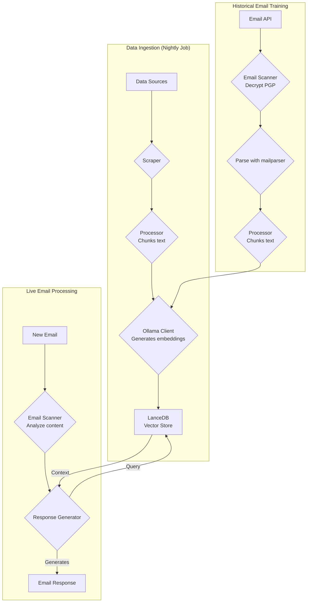
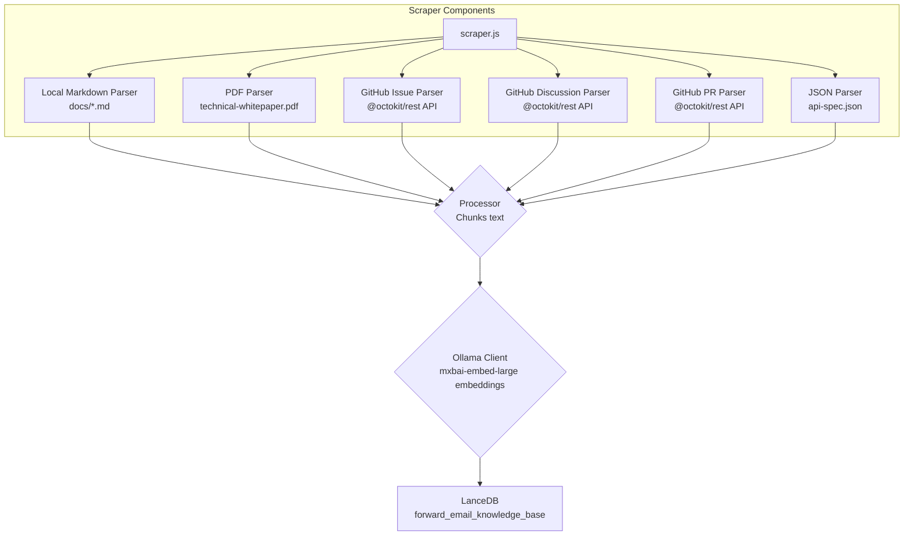
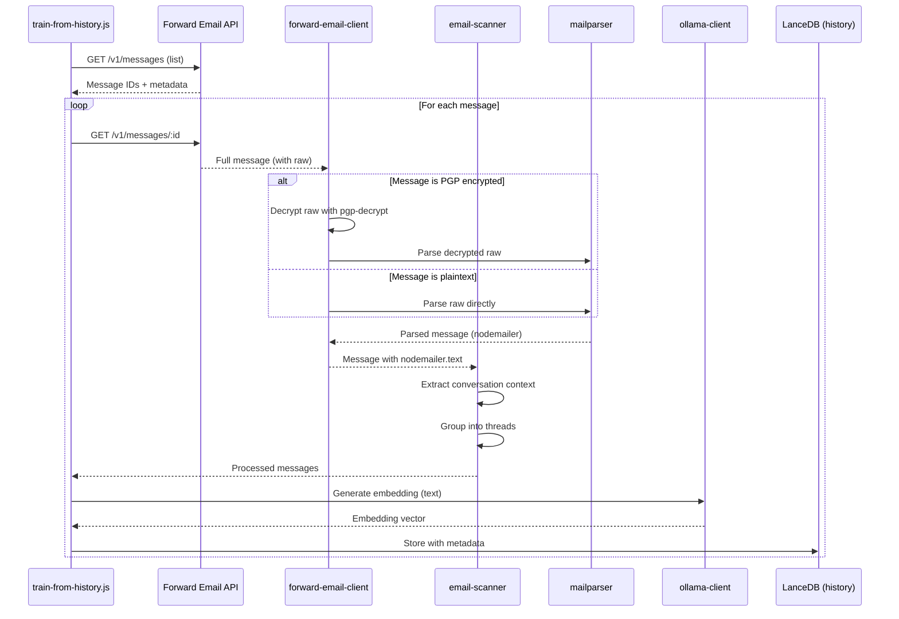

# Yksityisyyttä Korostavan AI-asiakastukiedustajan Rakentaminen LanceDB:n, Ollaman ja Node.js:n Avulla {#building-a-privacy-first-ai-customer-support-agent-with-lancedb-ollama-and-nodejs}


> \[!NOTE]
> Tämä dokumentti käsittelee matkaamme itseisännöidyn AI-tukiedustajan rakentamisessa. Kirjoitimme samanlaisista haasteista blogikirjoituksessamme [Email Startup Graveyard](https://forwardemail.net/blog/docs/email-startup-graveyard-why-80-percent-email-companies-fail). Pohdimme rehellisesti jatkokirjoituksen tekemistä nimeltä "AI Startup Graveyard", mutta ehkä joudumme odottamaan vielä vuoden tai niin, kunnes AI-kupla mahdollisesti puhkeaa(?). Tällä hetkellä tämä on aivopierumme siitä, mikä toimi, mikä ei, ja miksi teimme sen näin.

Näin rakensimme oman AI-asiakastukiedustajamme. Teimme sen vaikeimman kautta: itseisännöitynä, yksityisyyttä korostaen ja täysin omassa hallinnassamme. Miksi? Koska emme luota kolmansien osapuolten palveluihin asiakkaidemme tietojen kanssa. Se on GDPR:n ja DPA:n vaatimus, ja se on oikea tapa toimia.

Tämä ei ollut hauska viikonlopun projekti. Se oli kuukauden mittainen matka rikkinäisten riippuvuuksien, harhaanjohtavan dokumentaation ja avoimen lähdekoodin AI-ekosysteemin yleisen kaaoksen läpi vuonna 2025. Tämä dokumentti on tallenne siitä, mitä rakensimme, miksi rakensimme sen ja mitä esteitä kohtasimme matkan varrella.


## Sisällysluettelo {#table-of-contents}

* [Asiakkaan Hyödyt: AI:n Avustama Ihmistuki](#customer-benefits-ai-augmented-human-support)
  * [Nopeammat, Tarkemmat Vastaukset](#faster-more-accurate-responses)
  * [Johdonmukaisuus Ilman Uupumusta](#consistency-without-burnout)
  * [Mitä Saat](#what-you-get)
* [Henkilökohtainen Pohdinta: Kaksikymmenvuotinen Ponnistus](#a-personal-reflection-the-two-decade-grind)
* [Miksi Yksityisyys On Tärkeää](#why-privacy-matters)
* [Kustannusanalyysi: Pilvi-AI vs Itseisännöity](#cost-analysis-cloud-ai-vs-self-hosted)
  * [Pilvi-AI-palveluiden Vertailu](#cloud-ai-service-comparison)
  * [Kustannusten Erittely: 5GB Tietopohja](#cost-breakdown-5gb-knowledge-base)
  * [Itseisännöidyn Laitteiston Kustannukset](#self-hosted-hardware-costs)
* [Oman API:n Käyttö (Dogfooding)](#dogfooding-our-own-api)
  * [Miksi Dogfooding On Tärkeää](#why-dogfooding-matters)
  * [API:n Käyttöesimerkit](#api-usage-examples)
  * [Suorituskyvyn Edut](#performance-benefits)
* [Salausarkkitehtuuri](#encryption-architecture)
  * [Kerros 1: Postilaatikon Salaus (chacha20-poly1305)](#layer-1-mailbox-encryption-chacha20-poly1305)
  * [Kerros 2: Viestitason PGP-salaus](#layer-2-message-level-pgp-encryption)
  * [Miksi Tämä On Tärkeää Koulutuksessa](#why-this-matters-for-training)
  * [Tallennusturva](#storage-security)
  * [Paikallinen Tallennus On Vakio käytäntö](#local-storage-is-standard-practice)
* [Arkkitehtuuri](#the-architecture)
  * [Korkean Tason Prosessi](#high-level-flow)
  * [Yksityiskohtainen Scraper-prosessi](#detailed-scraper-flow)
* [Miten Se Toimii](#how-it-works)
  * [Tietopohjan Rakentaminen](#building-the-knowledge-base)
  * [Koulutus Historiallisista Sähköposteista](#training-from-historical-emails)
  * [Saapuvien Sähköpostien Käsittely](#processing-incoming-emails)
  * [Vektorivaraston Hallinta](#vector-store-management)
* [Vektoridatabasien Hautausmaa](#the-vector-database-graveyard)
* [Järjestelmävaatimukset](#system-requirements)
* [Cron-tehtävien Konfigurointi](#cron-job-configuration)
  * [Ympäristömuuttujat](#environment-variables)
  * [Cron-tehtävät Useille Postilaatikoille](#cron-jobs-for-multiple-inboxes)
  * [Cron-aikataulun Erittely](#cron-schedule-breakdown)
  * [Dynaaminen Päivämäärän Laskenta](#dynamic-date-calculation)
  * [Alkuasetukset: URL-listan Poiminta Sivukartasta](#initial-setup-extract-url-list-from-sitemap)
  * [Cron-tehtävien Manuaalinen Testaus](#testing-cron-jobs-manually)
  * [Lokien Seuranta](#monitoring-logs)
* [Koodiesimerkit](#code-examples)
  * [Tietojen Keruu ja Käsittely](#scraping-and-processing)
  * [Koulutus Historiallisista Sähköposteista](#training-from-historical-emails-1)
  * [Kontekstikyselyt](#querying-for-context)
* [Tulevaisuus: Roskapostin Skannaus R\&D](#the-future-spam-scanner-rd)
* [Vianetsintä](#troubleshooting)
  * [Vektoridimension Yhteensopimattomuusvirhe](#vector-dimension-mismatch-error)
  * [Tyhjä Tietopohjan Konteksti](#empty-knowledge-base-context)
  * [PGP-purkuvirheet](#pgp-decryption-failures)
* [Käyttövinkit](#usage-tips)
  * [Saavuttaminen Inbox Zero](#achieving-inbox-zero)
  * [skip-ai-tunnisteen Käyttö](#using-the-skip-ai-label)
  * [Sähköpostiketjutus ja Vastaa Kaikille](#email-threading-and-reply-all)
  * [Seuranta ja Ylläpito](#monitoring-and-maintenance)
* [Testaus](#testing)
  * [Testien Suorittaminen](#running-tests)
  * [Testikattavuus](#test-coverage)
  * [Testausympäristö](#test-environment)
* [Keskeiset Opit](#key-takeaways)
## Asiakkaan Hyödyt: Ihmisen Avustama AI-Tuki {#customer-benefits-ai-augmented-human-support}

AI-järjestelmämme ei korvaa tukitiimiämme – se tekee heistä parempia. Tässä mitä se tarkoittaa sinulle:

### Nopeammat, Tarkemmat Vastaukset {#faster-more-accurate-responses}

**Ihminen Mukana Prosessissa**: Jokainen AI:n luoma luonnos tarkistetaan, muokataan ja kuratoidaan tukitiimimme toimesta ennen kuin se lähetetään sinulle. AI hoitaa alkuperäisen tutkimuksen ja luonnostelun, vapauttaen tiimimme keskittymään laadunvalvontaan ja personointiin.

**Koulutettu Ihmisen Asiantuntemuksella**: AI oppii:

* Käsin kirjoitetusta tietopohjastamme ja dokumentaatiosta
* Ihmisten kirjoittamista blogikirjoituksista ja tutoriaaleista
* Laajasta UKK:stamme (ihmisten kirjoittama)
* Aikaisemmista asiakaskeskusteluista (kaikki käsitelty oikeiden ihmisten toimesta)

Saat vastauksia, jotka perustuvat vuosien ihmisen asiantuntemukseen, mutta toimitettuna nopeammin.

### Johdonmukaisuus Ilman Uupumusta {#consistency-without-burnout}

Pieni tiimimme käsittelee päivittäin satoja tukipyyntöjä, joista jokainen vaatii erilaista teknistä tietämystä ja mentaalista kontekstinvaihtoa:

* Laskutuskysymykset vaativat talousjärjestelmän tuntemusta
* DNS-ongelmat vaativat verkkoasiantuntemusta
* API-integraatio vaatii ohjelmointitietämystä
* Turvaraportit vaativat haavoittuvuuksien arviointia

Ilman AI-avustusta tämä jatkuva kontekstinvaihto johtaa:

* Hitaampiin vastausaikoihin
* Ihmisen virheisiin väsymyksen vuoksi
* Epäjohdonmukaiseen vastausten laatuun
* Tiimin uupumukseen

**AI-avustuksella** tiimimme:

* Vastaa nopeammin (AI luonnostelee sekunneissa)
* Tekee vähemmän virheitä (AI havaitsee yleiset virheet)
* Säilyttää johdonmukaisen laadun (AI viittaa aina samaan tietopohjaan)
* Pysyy virkeänä ja keskittyneenä (vähemmän aikaa tutkimukseen, enemmän aikaa auttamiseen)

### Mitä Saat {#what-you-get}

✅ **Nopeus**: AI luonnostelee vastaukset sekunneissa, ihmiset tarkistavat ja lähettävät minuuteissa

✅ **Tarkkuus**: Vastaukset perustuvat todelliseen dokumentaatioomme ja aiempiin ratkaisuihin

✅ **Johdonmukaisuus**: Sama korkealaatuinen vastaus, olipa kello 9 aamulla tai 9 illalla

✅ **Ihmisen kosketus**: Jokainen vastaus tarkistetaan ja personoidaan tiimimme toimesta

✅ **Ei harhakuvitelmia**: AI käyttää vain vahvistettua tietopohjaamme, ei yleistä internet-dataa

> \[!NOTE]
> **Puhut aina ihmisten kanssa**. AI on tutkimusavustaja, joka auttaa tiimiämme löytämään oikean vastauksen nopeammin. Ajattele sitä kirjastonhoitajana, joka löytää välittömästi relevantin kirjan – mutta ihminen lukee sen ja selittää sinulle.


## Henkilökohtainen Pohdinta: Kaksi vuosikymmentä kestävä uurastus {#a-personal-reflection-the-two-decade-grind}

Ennen kuin sukellamme teknisiin yksityiskohtiin, henkilökohtainen huomautus. Olen ollut tässä lähes kaksi vuosikymmentä. Loputtomat tunnit näppäimistön ääressä, väsymätön ratkaisun etsintä, syvä, keskittynyt uurastus – tämä on todellisuus, kun rakentaa jotain merkityksellistä. Todellisuus, jota usein vähätellään uusien teknologioiden hypessä.

Viimeaikainen AI:n räjähdys on ollut erityisen turhauttava. Meille myydään unelmaa automaatiosta, AI-avustajista, jotka kirjoittavat koodimme ja ratkaisevat ongelmamme. Todellisuus? Tuotos on usein roskakoodia, jonka korjaamiseen kuluu enemmän aikaa kuin sen kirjoittamiseen alusta alkaen. Lupaus helpommasta elämästä on väärä. Se on häiriötekijä kovalle, välttämättömälle rakentamisen työlle.

Ja sitten on avoimen lähdekoodin osallistumisen catch-22. Olet jo levällään, uupunut uurastuksesta. Käytät AI:ta auttamaan yksityiskohtaisen, hyvin rakennetun bugiraportin kirjoittamisessa, toivoen helpottavasi ylläpitäjien työtä ymmärtää ja korjata ongelma. Ja mitä tapahtuu? Sinua moititaan. Panostustasi pidetään "aiheesta poikkeavana" tai vähäisenä, kuten näimme äskettäisessä [Node.js GitHub -ongelmassa](https://github.com/nodejs/node/issues/60719#issuecomment-3534304321). Se on isku kasvoille kokeneille kehittäjille, jotka vain yrittävät auttaa.

Tämä on ekosysteemin todellisuus, jossa työskentelemme. Kyse ei ole pelkästään rikkinäisistä työkaluista; kyse on kulttuurista, joka usein epäonnistuu kunnioittamaan aikaansa ja [panostaan osallistujilta](https://forwardemail.net/blog/docs/how-npm-packages-billion-downloads-shaped-javascript-ecosystem). Tämä kirjoitus on kronikka tästä todellisuudesta. Se on tarina työkaluista, kyllä, mutta myös ihmiskustannuksista rakentaa rikkinäisessä ekosysteemissä, joka kaikesta lupauksestaan huolimatta on pohjimmiltaan rikki.
## Miksi yksityisyys on tärkeää {#why-privacy-matters}

Meidän [tekninen whitepaper](https://forwardemail.net/technical-whitepaper.pdf) käsittelee yksityisyysfilosofiaamme syvällisesti. Lyhyt versio: emme koskaan lähetä asiakastietoja kolmansille osapuolille. Ikinä. Tämä tarkoittaa, ettei OpenAI:ta, ei Anthropicia, ei pilvipohjaisia vektoritietokantoja. Kaikki toimii paikallisesti infrastruktuurillamme. Tämä on kiistaton vaatimus GDPR-vaatimustenmukaisuuden ja tietojenkäsittelysopimustemme vuoksi.


## Kustannusanalyysi: Pilvi-AI vs Oma Isännöinti {#cost-analysis-cloud-ai-vs-self-hosted}

Ennen tekniseen toteutukseen sukeltamista, puhutaan miksi oma isännöinti on tärkeää kustannusten näkökulmasta. Pilvi-AI-palveluiden hinnoittelumallit tekevät niistä kalliita suurten volyymien käyttötapauksiin, kuten asiakastukeen.

### Pilvi-AI-palveluiden vertailu {#cloud-ai-service-comparison}

| Palvelu        | Tarjoaja            | Upotuskustannus                                                | LLM-kustannus (syöte)                                                     | LLM-kustannus (tulos)  | Yksityisyyskäytäntö                                  | GDPR/DPA        | Isännöinti        | Tietojen jakaminen |
| -------------- | ------------------- | -------------------------------------------------------------- | -------------------------------------------------------------------------- | ---------------------- | --------------------------------------------------- | --------------- | ----------------- | ------------------ |
| **OpenAI**     | OpenAI (US)         | [$0.02-0.13/1M tokenia](https://openai.com/api/pricing/)       | $0.15-20/1M tokenia                                                        | $0.60-80/1M tokenia    | [Linkki](https://openai.com/policies/privacy-policy/) | Rajoitettu DPA  | Azure (US)        | Kyllä (koulutus)   |
| **Claude**     | Anthropic (US)      | Ei saatavilla                                                  | [$3-20/1M tokenia](https://docs.claude.com/en/docs/about-claude/pricing)  | $15-80/1M tokenia      | [Linkki](https://www.anthropic.com/legal/privacy)     | Rajoitettu DPA  | AWS/GCP (US)      | Ei (väitetty)      |
| **Gemini**     | Google (US)         | [$0.15/1M tokenia](https://ai.google.dev/gemini-api/docs/pricing) | $0.30-1.00/1M tokenia                                                     | $2.50/1M tokenia       | [Linkki](https://policies.google.com/privacy)         | Rajoitettu DPA  | GCP (US)          | Kyllä (parannus)   |
| **DeepSeek**   | DeepSeek (Kiina)    | Ei saatavilla                                                  | [$0.028-0.28/1M tokenia](https://api-docs.deepseek.com/quick_start/pricing) | $0.42/1M tokenia       | [Linkki](https://www.deepseek.com/en)                 | Tuntematon      | Kiina             | Tuntematon         |
| **Mistral**    | Mistral AI (Ranska) | [$0.10/1M tokenia](https://mistral.ai/pricing)                 | $0.40/1M tokenia                                                          | $2.00/1M tokenia       | [Linkki](https://mistral.ai/terms/)                   | EU GDPR         | EU                | Tuntematon         |
| **Oma Isännöinti** | Sinä              | $0 (olemassa oleva laitteisto)                                | $0 (olemassa oleva laitteisto)                                            | $0 (olemassa oleva laitteisto) | Oma käytäntö                                      | Täysi vaatimustenmukaisuus | MacBook M5 + cron | Ei koskaan        |

> \[!WARNING]
> **Tietosuojaongelmat**: Yhdysvaltalaiset tarjoajat (OpenAI, Claude, Gemini) ovat CLOUD Actin alaisia, mikä sallii Yhdysvaltain hallituksen pääsyn tietoihin. DeepSeek (Kiina) toimii kiinalaisten tietolakien alaisena. Vaikka Mistral (Ranska) tarjoaa EU-isännöinnin ja GDPR-vaatimustenmukaisuuden, oma isännöinti on ainoa vaihtoehto täydelliselle tietosuvereniteetille ja hallinnalle.

### Kustannusten erittely: 5GB tietopohja {#cost-breakdown-5gb-knowledge-base}

Lasketaan 5GB tietopohjan käsittelyn kustannukset (tyypillinen keskisuuren yrityksen dokumenteille, sähköposteille ja tukihistorialle).

**Oletukset:**

* 5GB tekstiä ≈ 1,25 miljardia tokenia (olettaen \~4 merkkiä/token)
* Alkuperäinen upotusten luonti
* Kuukausittainen uudelleenkoulutus (täysi uudelleenupotus)
* 10 000 tukipyyntöä kuukaudessa
* Keskimääräinen pyyntö: 500 tokenia syötettä, 300 tokenia tulosta
**Yksityiskohtainen kustannuserittely:**

| Komponentti                           | OpenAI           | Claude          | Gemini               | Itse-isännöity      |
| ------------------------------------ | ---------------- | --------------- | -------------------- | ------------------- |
| **Alkuperäinen upotus** (1,25 miljardia tokenia) | 25 000 $         | Ei saatavilla   | 187 500 $            | 0 $                 |
| **Kuukausittaiset kyselyt** (10K × 800 tokenia) | 1 200-16 000 $   | 2 400-16 000 $  | 2 400-3 200 $        | 0 $                 |
| **Kuukausittainen uudelleenkoulutus** (1,25 miljardia tokenia) | 25 000 $         | Ei saatavilla   | 187 500 $            | 0 $                 |
| **Ensimmäisen vuoden kokonaiskustannus** | 325 200-217 000 $ | 28 800-192 000 $ | 2 278 800-2 226 000 $ | ~60 $ (sähkö)       |
| **Tietosuojavaatimusten noudattaminen** | ❌ Rajoitettu     | ❌ Rajoitettu   | ❌ Rajoitettu         | ✅ Täysi             |
| **Datan suvereniteetti**             | ❌ Ei            | ❌ Ei           | ❌ Ei                 | ✅ Kyllä             |

> \[!CAUTION]
> **Geminin upotuskustannukset ovat katastrofaaliset** 0,15 $/1M tokenia kohden. Yhden 5 Gt:n tietopohjan upotus maksaisi 187 500 $. Tämä on 37 kertaa kalliimpaa kuin OpenAI ja tekee siitä täysin käyttökelvottoman tuotantoon.

### Itse-isännöity laitteistokustannukset {#self-hosted-hardware-costs}

Meidän kokoonpanomme toimii olemassa olevalla laitteistolla, joka meillä jo on:

* **Laitteisto**: MacBook M5 (jo kehityskäytössä)
* **Lisäkustannus**: 0 $ (käyttää olemassa olevaa laitteistoa)
* **Sähkö**: ~5 $/kuukausi (arvioitu)
* **Ensimmäisen vuoden kokonaiskustannus**: ~60 $
* **Jatkuvat kustannukset**: 60 $/vuosi

**Sijoitetun pääoman tuotto (ROI)**: Itse-isännöinti on käytännössä marginaalikustannuksiltaan nolla, koska käytämme olemassa olevaa kehityslaitteistoa. Järjestelmä toimii cron-tehtävien kautta ruuhkahuippujen ulkopuolella.

## Käytämme omaa APIamme {#dogfooding-our-own-api}

Yksi tärkeimmistä arkkitehtuuripäätöksistämme oli, että kaikki tekoälytehtävät käyttävät suoraan [Forward Email APIa](https://forwardemail.net/email-api). Tämä ei ole pelkästään hyvä käytäntö — se on suorituskyvyn optimoinnin pakottava tekijä.

### Miksi oman API:n käyttö on tärkeää {#why-dogfooding-matters}

Kun tekoälytehtävämme käyttävät samoja API-päätepisteitä kuin asiakkaamme:

1. **Suorituskykyongelmat vaikuttavat meihin ensin** – Koemme ongelmat ennen asiakkaita
2. **Optimointi hyödyttää kaikkia** – Parannukset omissa tehtävissämme parantavat automaattisesti asiakaskokemusta
3. **Todellisen maailman testaus** – Tehtävämme käsittelevät tuhansia sähköposteja, tarjoten jatkuvaa kuormitustestausta
4. **Koodin uudelleenkäyttö** – Sama autentikointi, nopeusrajoitus, virheenkäsittely ja välimuistilogiikka

### API:n käyttöesimerkit {#api-usage-examples}

**Viestien listaaminen (train-from-history.js):**

```javascript
// Käyttää GET /v1/messages?folder=INBOX BasicAuthilla
// Sulkee pois eml, raw, nodemailer vastauksen koon pienentämiseksi (tarvitsemme vain ID:t)
//
const response = await axios.get(
  `${this.apiBase}/v1/messages`,
  {
    params: {
      folder: 'INBOX',
      limit: 100,
      eml: false,
      raw: false,
      nodemailer: false
    },
    auth: {
      username: process.env.FORWARD_EMAIL_ALIAS_USERNAME,
      password: process.env.FORWARD_EMAIL_ALIAS_PASSWORD
    }
  }
);

const messages = response.data;
// Palauttaa: [{ id, subject, date, ... }, ...]
// Koko viestin sisältö haetaan myöhemmin GET /v1/messages/:id -kutsulla
```

**Koko viestin hakeminen (forward-email-client.js):**

```javascript
// Käyttää GET /v1/messages/:id saadakseen koko viestin raakatiedot
const response = await axios.get(
  `${this.apiBase}/v1/messages/${messageId}`,
  {
    auth: {
      username: this.aliasUsername,
      password: this.aliasPassword
    }
  }
);

const message = response.data;
// Palauttaa: { id, subject, raw, eml, nodemailer: { ... }, ... }
```

**Vastausluonnosten luominen (process-inbox.js):**

```javascript
// Käyttää POST /v1/messages luodakseen luonnoksia vastauksista
const response = await axios.post(
  `${this.apiBase}/v1/messages`,
  {
    folder: 'Drafts',
    subject: `Re: ${originalSubject}`,
    to: senderEmail,
    text: generatedResponse,
    inReplyTo: originalMessageId
  },
  {
    auth: {
      username: process.env.FORWARD_EMAIL_ALIAS_USERNAME,
      password: process.env.FORWARD_EMAIL_ALIAS_PASSWORD
    }
  }
);
```
### Suorituskyvyn edut {#performance-benefits}

Koska tekoälytyömme pyörivät samalla API-infrastruktuurilla:

* **Välimuistien optimoinnit** hyödyttävät sekä töitä että asiakkaita
* **Nopeusrajoitukset** testataan todellisessa kuormituksessa
* **Virheenkäsittely** on taistelukokemuksella testattu
* **API-vastausajat** ovat jatkuvassa seurannassa
* **Tietokantakyselyt** on optimoitu molempiin käyttötapauksiin
* **Kaistanleveyden optimointi** – `eml`, `raw`, `nodemailer` poisjättäminen listauksesta pienentää vastauskokoa noin 90 %

Kun `train-from-history.js` käsittelee 1 000 sähköpostia, se tekee yli 1 000 API-kutsua. Mikä tahansa tehottomuus API:ssa tulee välittömästi ilmi. Tämä pakottaa meidät optimoimaan IMAP-käyttöä, tietokantakyselyjä ja vastausten sarjallistamista — parannuksia, jotka hyödyttävät suoraan asiakkaitamme.

**Esimerkki optimoinnista**: 100 viestin listaaminen koko sisällöllä = noin 10 Mt vastaus. Listaaminen asetuksilla `eml: false, raw: false, nodemailer: false` = noin 100 kt vastaus (100 kertaa pienempi).


## Salausarkkitehtuuri {#encryption-architecture}

Sähköpostivarastomme käyttää useita salauskerroksia, jotka tekoälytyöt purkavat reaaliajassa koulutusta varten.

### Kerros 1: Postilaatikon salaus (chacha20-poly1305) {#layer-1-mailbox-encryption-chacha20-poly1305}

Kaikki IMAP-postilaatikot tallennetaan SQLite-tietokantoina, jotka on salattu **chacha20-poly1305**-algoritmilla, joka on kvanttiturvallinen salausalgoritmi. Tämä on kuvattu yksityiskohtaisesti blogikirjoituksessamme [quantum-safe encrypted email service](https://forwardemail.net/blog/docs/best-quantum-safe-encrypted-email-service).

**Keskeiset ominaisuudet:**

* **Algoritmi**: ChaCha20-Poly1305 (AEAD-salaus)
* **Kvanttiturvallinen**: Vastustuskyky kvanttilaskennan hyökkäyksille
* **Tallennus**: SQLite-tietokantatiedostot levyllä
* **Käyttö**: Puretaan muistiin käytön yhteydessä IMAP/API:n kautta

### Kerros 2: Viestitason PGP-salaus {#layer-2-message-level-pgp-encryption}

Monet tukisähköpostit on lisäksi salattu PGP:llä (OpenPGP-standardi). Tekoälytyöt purkavat nämä sisällön poimimiseksi koulutusta varten.

**Purkuprosessi:**

```javascript
// 1. API palauttaa viestin salatulla raakasisällöllä
const message = await forwardEmailClient.getMessage(id);

// 2. Tarkista onko raakasisältö PGP-salattu
if (isMessageEncrypted(message.raw)) {
  // 3. Pura yksityisellä avaimellamme
  const decryptedRaw = await pgpDecrypt(message.raw);

  // 4. Jäsennä purettu MIME-viesti
  const parsed = await simpleParser(decryptedRaw);

  // 5. Täytä nodemailer puretulla sisällöllä
  message.nodemailer = {
    text: parsed.text,
    html: parsed.html,
    from: parsed.from,
    to: parsed.to,
    subject: parsed.subject,
    date: parsed.date
  };
}
```

**PGP-konfiguraatio:**

```bash
# Yksityinen avain purkua varten (polku ASCII-haarniskaiseen avaintiedostoon)
GPG_SECURITY_KEY="/path/to/private-key.asc"

# Salasana yksityiselle avaimelle (jos salattu)
GPG_SECURITY_PASSPHRASE="your-passphrase"
```

`pgp-decrypt.js`-apuri:

1. Lukee yksityisavaimen levyltä kerran (välimuistissa muistissa)
2. Purkaa avaimen salasanalla
3. Käyttää purettua avainta kaikkien viestien purkuun
4. Tukee rekursiivista purkua sisäkkäisille salatuille viesteille

### Miksi tämä on tärkeää koulutukselle {#why-this-matters-for-training}

Ilman asianmukaista purkua tekoäly kouluttautuisi salattuun sekasotkuun:

```
-----BEGIN PGP MESSAGE-----
Version: OpenPGP.js v4.10.10

wcBMA8Z3lHJnFnNUAQgAqK7F8...
-----END PGP MESSAGE-----
```

Purun jälkeen tekoäly kouluttautuu oikeaan sisältöön:

```
Subject: Re: Bug Report

Hi John,

Thanks for reporting this issue. I've confirmed the bug
and created a fix in PR #1234...
```

### Tallennusturvallisuus {#storage-security}

Purku tapahtuu muistissa työn suorituksen aikana, ja purettu sisältö muunnetaan upotuksiksi, jotka tallennetaan LanceDB-vektoritietokantaan levylle.

**Missä data sijaitsee:**

* **Vektoripohjainen tietokanta**: Tallennettu salatuille MacBook M5 -työasemille
* **Fyysinen turvallisuus**: Työasemat pysyvät aina hallussamme (eivät datakeskuksissa)
* **Levyn salaus**: Koko levyn salaus kaikilla työasemilla
* **Verkkoturvallisuus**: Palomuurin takana ja eristetty julkisista verkoista

**Tuleva datakeskuskäyttöönotto:**
Jos siirrymme datakeskusympäristöön, palvelimilla on:

* LUKS-kokolevyn salaus
* USB-porttien käytön estäminen
* Fyysiset turvatoimet
* Verkon eristäminen
Täydelliset tiedot turvallisuuskäytännöistämme löydät [Turvallisuus-sivultamme](https://forwardemail.net/en/security).

> \[!NOTE]
> Vektorikanta sisältää upotuksia (matemaattisia esityksiä), ei alkuperäistä selkokieltä. Kuitenkin upotukset voidaan mahdollisesti purkaa takaisin, minkä vuoksi säilytämme ne salatuilla, fyysisesti suojatuilla työasemilla.

### Paikallinen tallennus on vakiokäytäntö {#local-storage-is-standard-practice}

Upotusten tallentaminen tiimimme työasemille ei eroa siitä, miten käsittelemme sähköpostia jo nyt:

* **Thunderbird**: Lataa ja tallentaa koko sähköpostisisällön paikallisesti mbox/maildir-tiedostoihin
* **Webmail-asiakkaat**: Välimuistittavat sähköpostitiedot selaimen tallennustilaan ja paikallisiin tietokantoihin
* **IMAP-asiakkaat**: Säilyttävät viestien paikalliset kopiot offline-käyttöä varten
* **AI-järjestelmämme**: Tallentaa matemaattiset upotukset (ei selkokieltä) LanceDB:hen

Keskeinen ero: upotukset ovat **turvallisempia** kuin selkokielinen sähköposti, koska ne ovat:

1. Matemaattisia esityksiä, eivät luettavaa tekstiä
2. Vaikeampia purkaa takaisin kuin selkokieli
3. Silti saman fyysisen turvallisuuden alaisia kuin sähköpostiasiakkaamme

Jos tiimimme voi käyttää Thunderbirdiä tai webmailia salatuilla työasemilla, on yhtä hyväksyttävää (ja jopa turvallisempaa) tallentaa upotukset samalla tavalla.


## Arkkitehtuuri {#the-architecture}

Tässä on perusvirtaus. Se näyttää yksinkertaiselta. Se ei ollut.

> \[!NOTE]
> Kaikki tehtävät käyttävät suoraan Forward Email API:a, varmistaen, että suorituskyvyn optimoinnit hyödyttävät sekä AI-järjestelmäämme että asiakkaitamme.

### Korkean tason virtaus {#high-level-flow}



### Yksityiskohtainen scraper-virtaus {#detailed-scraper-flow}

`scraper.js` on datan keruun sydän. Se on kokoelma eri tietomuotojen jäseniä.




## Miten se toimii {#how-it-works}

Prosessi on jaettu kolmeen pääosaan: tietopohjan rakentaminen, koulutus historiallisista sähköposteista ja uusien sähköpostien käsittely.

### Tietopohjan rakentaminen {#building-the-knowledge-base}

**`update-knowledge-base.js`**: Tämä on päätehtävä. Se suoritetaan yöllä, tyhjentää vanhan vektorivaraston ja rakentaa sen uudelleen alusta alkaen. Se käyttää `scraper.js`-tiedostoa sisällön hakemiseen kaikista lähteistä, `processor.js`-tiedostoa tekstin pilkkomiseen ja `ollama-client.js`-tiedostoa upotusten luomiseen. Lopuksi `vector-store.js` tallentaa kaiken LanceDB:hen.

**Tietolähteet:**

* Paikalliset Markdown-tiedostot (`docs/*.md`)
* Tekninen whitepaper PDF (`assets/technical-whitepaper.pdf`)
* API-määrittely JSON (`assets/api-spec.json`)
* GitHub-ongelmat (Octokitin kautta)
* GitHub-keskustelut (Octokitin kautta)
* GitHub-pull requestit (Octokitin kautta)
* Sivukartta URL-lista (`$LANCEDB_PATH/valid-urls.json`)

### Koulutus historiallisista sähköposteista {#training-from-historical-emails}

**`train-from-history.js`**: Tämä tehtävä skannaa historialliset sähköpostit kaikista kansioista, purkaa PGP-salatut viestit ja lisää ne erilliseen vektorivarastoon (`customer_support_history`). Tämä tarjoaa kontekstin aiemmista tukikeskusteluista.
**Sähköpostin käsittelyprosessi:**



**Keskeiset ominaisuudet:**

* **PGP-salauspurku**: Käyttää `pgp-decrypt.js` -apuria yhdessä `GPG_SECURITY_KEY` -ympäristömuuttujan kanssa
* **Keskusteluketjujen ryhmittely**: Ryhmittelee toisiinsa liittyvät sähköpostit keskusteluketjuiksi
* **Metatietojen säilytys**: Tallentaa kansion, aiheen, päivämäärän, salausstatuksen
* **Vastauskonteksti**: Linkittää viestit niiden vastauksiin paremman kontekstin saamiseksi

**Konfigurointi:**

```bash
# Ympäristömuuttujat train-from-historylle
HISTORY_SCAN_LIMIT=1000              # Maksimimäärä käsiteltäviä viestejä
HISTORY_SCAN_SINCE="2024-01-01"      # Käsittele vain tämän päivämäärän jälkeiset viestit
HISTORY_DECRYPT_PGP=true             # Yritä PGP-salauksen purkua
GPG_SECURITY_KEY="/path/to/key.asc"  # Polku PGP:n yksityisavaimeen
GPG_SECURITY_PASSPHRASE="passphrase" # Avaimen salasana (valinnainen)
```

**Mitä tallennetaan:**

```javascript
{
  type: 'historical_email',
  folder: 'INBOX',
  subject: 'Re: Bug Report',
  date: '2025-01-15T10:30:00Z',
  messageId: '67e2f288893921...',
  threadId: 'Bug Report',
  hasReply: true,
  encrypted: true,
  decrypted: true,
  replySubject: 'Bug Report',
  replyText: 'First 500 chars of reply...',
  chunkSize: 1000,
  chunkOverlap: 200,
  chunkIndex: 0
}
```

> \[!TIP]
> Suorita `train-from-history` alkuasetuksen jälkeen täyttääksesi historialliset kontekstitiedot. Tämä parantaa merkittävästi vastausten laatua oppimalla aiemmista tukitilanteista.

### Saapuvien sähköpostien käsittely {#processing-incoming-emails}

**`process-inbox.js`**: Tämä tehtävä käsittelee sähköposteja postilaatikoissamme `support@forwardemail.net`, `abuse@forwardemail.net` ja `security@forwardemail.net` (erityisesti `INBOX` IMAP-kansion polku). Se hyödyntää APIamme osoitteessa <https://forwardemail.net/email-api> (esim. `GET /v1/messages?folder=INBOX` käyttäen BasicAuth-kirjautumista IMAP-tunnuksillamme kullekin postilaatikolle). Se analysoi sähköpostin sisällön, kysyy sekä tietopankista (`forward_email_knowledge_base`) että historiallisesta sähköpostivektorivarastosta (`customer_support_history`), ja välittää yhdistetyn kontekstin `response-generator.js`-moduulille. Generaattori käyttää `mxbai-embed-large` Ollaman kautta vastauksen luomiseen.

**Automaattisen työnkulun ominaisuudet:**

1. **Inbox Zero -automaatio**: Luotuaan luonnoksen onnistuneesti alkuperäinen viesti siirretään automaattisesti Arkistokansioon. Tämä pitää postilaatikkosi siistinä ja auttaa saavuttamaan inbox zero -tilan ilman manuaalista työtä.

2. **Ohita AI-käsittely**: Lisää vain `skip-ai` -tunniste (kirjaimista riippumatta) mihin tahansa viestiin estääksesi AI-käsittelyn. Viesti pysyy koskemattomana postilaatikossasi, jolloin voit käsitellä sen manuaalisesti. Tämä on hyödyllistä arkaluonteisissa viesteissä tai monimutkaisissa tapauksissa, jotka vaativat ihmisen harkintaa.

3. **Oikea sähköpostiketjujen hallinta**: Kaikki luonnosvastaukset sisältävät alkuperäisen viestin lainattuna alla (käyttäen standardia ` >  ` -etuliitettä), noudattaen sähköpostivastausten käytäntöjä muodossa "On \[päivämäärä], \[lähettäjä] kirjoitti:". Tämä varmistaa oikean keskustelukontekstin ja ketjutuksen sähköpostiohjelmissa.

4. **Vastaa kaikille -käyttäytyminen**: Järjestelmä käsittelee automaattisesti Reply-To-otsikot ja CC-vastaanottajat:
   * Jos Reply-To-otsikko on olemassa, siitä tulee Vastaanottaja (To) ja alkuperäinen Lähettäjä lisätään Kopio-kenttään (CC)
   * Kaikki alkuperäiset Vastaanottajat (To) ja Kopio-vastaanottajat (CC) sisällytetään vastauksen Kopio-kenttään (paitsi oma osoitteesi)
   * Noudattaa standardeja sähköpostin vastaa-kaikille -käytäntöjä ryhmäkeskusteluissa
**Lähdejärjestys**: Järjestelmä käyttää **painotettua järjestystä** lähteiden priorisointiin:

* FAQ: 100 % (korkein prioriteetti)
* Tekninen whitepaper: 95 %
* API-määrittely: 90 %
* Viralliset dokumentit: 85 %
* GitHub-ongelmat: 70 %
* Historialliset sähköpostit: 50 %

### Vektorivaraston hallinta {#vector-store-management}

`VectorStore`-luokka tiedostossa `helpers/customer-support-ai/vector-store.js` on rajapintamme LanceDB:hen.

**Dokumenttien lisääminen:**

```javascript
// vector-store.js
async addDocument(text, metadata) {
  const embedding = await this.ollama.generateEmbedding(text);
  await this.table.add([{
    vector: embedding,
    text,
    ...metadata
  }]);
}
```

**Varaston tyhjentäminen:**

```javascript
// Vaihtoehto 1: Käytä clear()-metodia
await vectorStore.clear();

// Vaihtoehto 2: Poista paikallinen tietokantakansio
await fs.rm(process.env.LANCEDB_PATH, { recursive: true, force: true });
```

`LANCEDB_PATH`-ympäristömuuttuja osoittaa paikalliseen upotettuun tietokantakansioon. LanceDB on palvelimeton ja upotettu, joten erillistä prosessia ei tarvitse hallita.


## Vektoritietokannan hautausmaa {#the-vector-database-graveyard}

Tämä oli ensimmäinen suuri este. Kokeilimme useita vektoritietokantoja ennen kuin päädyimme LanceDB:hen. Tässä mitä kussakin meni pieleen.

| Tietokanta   | GitHub                                                      | Mitä meni pieleen                                                                                                                                                                                                    | Erityisongelmat                                                                                                                                                                                                                                                                                                                                                          | Turvallisuushuomiot                                                                                                                                                                                              |
| ------------ | ----------------------------------------------------------- | -------------------------------------------------------------------------------------------------------------------------------------------------------------------------------------------------------------------- | ------------------------------------------------------------------------------------------------------------------------------------------------------------------------------------------------------------------------------------------------------------------------------------------------------------------------------------------------------------------------- | ---------------------------------------------------------------------------------------------------------------------------------------------------------------------------------------------------------------- |
| **ChromaDB** | [chroma-core/chroma](https://github.com/chroma-core/chroma) | `pip3 install chromadb` asentaa kivikauden version, jossa on `PydanticImportError`. Ainoa tapa saada toimiva versio on kääntää lähdekoodista. Ei kehittäjäystävällinen.                                              | Python-riippuvuuksien sekasorto. Useita käyttäjiä raportoivat rikkinäisiä pip-asennuksia ([#774](https://github.com/chroma-core/chroma/issues/774), [#163](https://github.com/chroma-core/chroma/issues/163)). Dokumentaatio kehottaa "käyttämään Dockeria", mikä ei ole vastaus paikalliseen kehitykseen. Kaatuu Windowsilla yli 99 tietueella ([#3058](https://github.com/chroma-core/chroma/issues/3058)). | **CVE-2024-45848**: Mielivaltaisen koodin suoritus MindsDB:n ChromaDB-integraation kautta. Kriittiset käyttöjärjestelmän haavoittuvuudet Docker-kuvassa ([#3170](https://github.com/chroma-core/chroma/issues/3170)). |
| **Qdrant**   | [qdrant/qdrant](https://github.com/qdrant/qdrant)           | Homebrew-tappi (`qdrant/qdrant/qdrant`), johon heidän vanhat dokumenttinsa viittaavat, on kadonnut. Ei selitystä. Virallisissa dokumenteissa lukee nyt vain "käytä Dockeria".                                        | Puuttuva Homebrew-tappi. Ei natiivia macOS-binaaria. Dockerin käyttö ainoana vaihtoehtona hidastaa nopeaa paikallista testausta.                                                                                                                                                                                                                                         | **CVE-2024-2221**: Mielivaltaisen tiedoston lataus -haavoittuvuus, joka mahdollistaa etäkoodin suorittamisen (korjattu versiossa 1.9.0). Heikko turvallisuuskypsyysarvio [IronCore Labsilta](https://ironcorelabs.com/vectordbs/qdrant-security/). |
| **Weaviate** | [weaviate/weaviate](https://github.com/weaviate/weaviate)   | Homebrew-versiossa oli kriittinen klusterointivirhe (`leader not found`). Dokumentoidut liput sen korjaamiseksi (`RAFT_JOIN`, `CLUSTER_HOSTNAME`) eivät toimineet. Perustavanlaatuisesti viallinen yhden solmun kokoonpanoissa. | Klusterointivirheitä jopa yhden solmun tilassa. Ylisuunniteltu yksinkertaisiin käyttötapauksiin.                                                                                                                                                                                                                                                                          | Ei merkittäviä CVE-haavoittuvuuksia, mutta monimutkaisuus lisää hyökkäyspintaa.                                                                                                                                      |
| **LanceDB**  | [lancedb/lancedb](https://github.com/lancedb/lancedb)       | Tämä toimi. Se on upotettu ja palvelimeton. Ei erillistä prosessia. Ainoa harmi on sekava pakettinimike (`vectordb` on vanhentunut, käytä `@lancedb/lancedb`) ja hajanaiset dokumentit. Voimme elää sen kanssa.       | Pakettinimikkeiden sekavuus (`vectordb` vs `@lancedb/lancedb`), mutta muuten vakaa. Upotettu arkkitehtuuri poistaa kokonaisia luokkia turvallisuusongelmia.                                                                                                                                                                                                              | Ei tunnettuja CVE-haavoittuvuuksia. Upotettu rakenne tarkoittaa, ettei verkko-hyökkäyspintaa ole.                                                                                                                                 |
> \[!WARNING]
> **ChromaDB:ssä on kriittisiä tietoturva-aukkoja.** [CVE-2024-45848](https://nvd.nist.gov/vuln/detail/CVE-2024-45848) mahdollistaa mielivaltaisen koodin suorittamisen. Pip install on periaatteessa rikki Pydantic-riippuvuuksien vuoksi. Vältä tuotantokäytössä.

> \[!WARNING]
> **Qdrantilla oli tiedostojen latauksen RCE-haavoittuvuus** ([CVE-2024-2221](https://qdrant.tech/blog/cve-2024-2221-response/)), joka korjattiin vasta versiossa 1.9.0. Jos sinun täytyy käyttää Qdrantia, varmista, että käytössäsi on uusin versio.

> \[!CAUTION]
> Avoimen lähdekoodin vektoritietokantaekosysteemi on raakile. Älä luota dokumentaatioon. Oleta, että kaikki on rikki, kunnes toisin todistetaan. Testaa paikallisesti ennen kuin sitoudut pinoon.


## Järjestelmävaatimukset {#system-requirements}

* **Node.js:** v18.0.0+ ([GitHub](https://github.com/nodejs/node))
* **Ollama:** Uusin ([GitHub](https://github.com/ollama/ollama))
* **Malli:** `mxbai-embed-large` Ollaman kautta
* **Vektoritietokanta:** LanceDB ([GitHub](https://github.com/lancedb/lancedb))
* **GitHub-käyttö:** `@octokit/rest` issuejen keräämiseen ([GitHub](https://github.com/octokit/rest.js))
* **SQLite:** Pääasialliseksi tietokannaksi (via `mongoose-to-sqlite`)


## Cron-tehtävien asetukset {#cron-job-configuration}

Kaikki tekoälytehtävät ajetaan cronilla MacBook M5:llä. Näin asetat cron-tehtävät ajamaan keskiyöllä useissa postilaatikoissa.

### Ympäristömuuttujat {#environment-variables}

Tehtävät tarvitsevat nämä ympäristömuuttujat. Useimmat voi asettaa `.env`-tiedostoon (ladataan `@ladjs/env`-kirjastolla), mutta `HISTORY_SCAN_SINCE` täytyy laskea dynaamisesti crontabissa.

**`.env`-tiedostossa:**

```bash
# Forward Email API -tunnukset (muuttuvat postilaatikoittain)
FORWARD_EMAIL_ALIAS_USERNAME=support@forwardemail.net
FORWARD_EMAIL_ALIAS_PASSWORD=your-imap-password

# PGP-salaus (jaettu kaikille postilaatikoille)
GPG_SECURITY_KEY=/path/to/private-key.asc
GPG_SECURITY_PASSPHRASE=your-passphrase

# Historiallinen skannausasetukset
HISTORY_SCAN_LIMIT=1000

# LanceDB-polku
LANCEDB_PATH=/path/to/lancedb
```

**Crontabissa (lasketaan dynaamisesti):**

```bash
# HISTORY_SCAN_SINCE täytyy asettaa crontabissa inline-kuin shell-komennolla
# Ei voi olla .env-tiedostossa, koska @ladjs/env ei suorita shell-komentoja
HISTORY_SCAN_SINCE="$(date -v-1d +%Y-%m-%d)"  # macOS
HISTORY_SCAN_SINCE="$(date -d 'yesterday' +%Y-%m-%d)"  # Linux
```

### Cron-tehtävät useille postilaatikoille {#cron-jobs-for-multiple-inboxes}

Muokkaa crontabiasi komennolla `crontab -e` ja lisää:

```bash
# Päivitä tietopohja (ajetaan kerran, jaettu kaikille postilaatikoille)
0 0 * * * cd /path/to/forwardemail.net && LANCEDB_PATH="/path/to/lancedb" GPG_SECURITY_KEY="/path/to/key.asc" GPG_SECURITY_PASSPHRASE="pass" node jobs/customer-support-ai/update-knowledge-base.js >> /var/log/update-knowledge-base.log 2>&1

# Koulutus historiasta - support@forwardemail.net
0 0 * * * cd /path/to/forwardemail.net && FORWARD_EMAIL_ALIAS_USERNAME="support@forwardemail.net" FORWARD_EMAIL_ALIAS_PASSWORD="support-password" HISTORY_SCAN_SINCE="$(date -v-1d +%Y-%m-%d)" HISTORY_SCAN_LIMIT=1000 GPG_SECURITY_KEY="/path/to/key.asc" GPG_SECURITY_PASSPHRASE="pass" LANCEDB_PATH="/path/to/lancedb" node jobs/customer-support-ai/train-from-history.js >> /var/log/train-support.log 2>&1

# Koulutus historiasta - abuse@forwardemail.net
0 0 * * * cd /path/to/forwardemail.net && FORWARD_EMAIL_ALIAS_USERNAME="abuse@forwardemail.net" FORWARD_EMAIL_ALIAS_PASSWORD="abuse-password" HISTORY_SCAN_SINCE="$(date -v-1d +%Y-%m-%d)" HISTORY_SCAN_LIMIT=1000 GPG_SECURITY_KEY="/path/to/key.asc" GPG_SECURITY_PASSPHRASE="pass" LANCEDB_PATH="/path/to/lancedb" node jobs/customer-support-ai/train-from-history.js >> /var/log/train-abuse.log 2>&1

# Koulutus historiasta - security@forwardemail.net
0 0 * * * cd /path/to/forwardemail.net && FORWARD_EMAIL_ALIAS_USERNAME="security@forwardemail.net" FORWARD_EMAIL_ALIAS_PASSWORD="security-password" HISTORY_SCAN_SINCE="$(date -v-1d +%Y-%m-%d)" HISTORY_SCAN_LIMIT=1000 GPG_SECURITY_KEY="/path/to/key.asc" GPG_SECURITY_PASSPHRASE="pass" LANCEDB_PATH="/path/to/lancedb" node jobs/customer-support-ai/train-from-history.js >> /var/log/train-security.log 2>&1

# Käsittele postilaatikko - support@forwardemail.net
*/5 * * * * cd /path/to/forwardemail.net && FORWARD_EMAIL_ALIAS_USERNAME="support@forwardemail.net" FORWARD_EMAIL_ALIAS_PASSWORD="support-password" GPG_SECURITY_KEY="/path/to/key.asc" GPG_SECURITY_PASSPHRASE="pass" LANCEDB_PATH="/path/to/lancedb" node jobs/customer-support-ai/process-inbox.js >> /var/log/process-support.log 2>&1

# Käsittele postilaatikko - abuse@forwardemail.net
*/5 * * * * cd /path/to/forwardemail.net && FORWARD_EMAIL_ALIAS_USERNAME="abuse@forwardemail.net" FORWARD_EMAIL_ALIAS_PASSWORD="abuse-password" GPG_SECURITY_KEY="/path/to/key.asc" GPG_SECURITY_PASSPHRASE="pass" LANCEDB_PATH="/path/to/lancedb" node jobs/customer-support-ai/process-inbox.js >> /var/log/process-abuse.log 2>&1

# Käsittele postilaatikko - security@forwardemail.net
*/5 * * * * cd /path/to/forwardemail.net && FORWARD_EMAIL_ALIAS_USERNAME="security@forwardemail.net" FORWARD_EMAIL_ALIAS_PASSWORD="security-password" GPG_SECURITY_KEY="/path/to/key.asc" GPG_SECURITY_PASSPHRASE="pass" LANCEDB_PATH="/path/to/lancedb" node jobs/customer-support-ai/process-inbox.js >> /var/log/process-security.log 2>&1
```
### Cron-aikataulun erittely {#cron-schedule-breakdown}

| Työ                      | Aikataulu    | Kuvaus                                                                            |
| ------------------------ | ------------ | --------------------------------------------------------------------------------- |
| `train-from-sitemap.js`  | `0 0 * * 0`  | Viikoittain (sunnuntain puolilta öin) - Hakee kaikki URL-osoitteet sivukartasta ja kouluttaa tietokantaa |
| `train-from-history.js`  | `0 0 * * *`  | Puolilta öin päivittäin - Skannaa edellisen päivän sähköpostit postilaatikoittain  |
| `process-inbox.js`       | `*/5 * * * *`| Joka 5. minuutti - Käsittelee uudet sähköpostit ja luo luonnoksia                  |

### Dynaaminen päivämäärän laskenta {#dynamic-date-calculation}

`HISTORY_SCAN_SINCE`-muuttuja **täytyy laskea suoraan crontabissa** koska:

1. `.env`-tiedostot luetaan kirjaimellisina merkkijonoina `@ladjs/env`-kirjastolla
2. Shell-komentojen korvaus `$(...)` ei toimi `.env`-tiedostoissa
3. Päivämäärä pitää laskea aina uudelleen, kun cron suoritetaan

**Oikea tapa (crontabissa):**

```bash
# macOS (BSD date)
HISTORY_SCAN_SINCE="$(date -v-1d +%Y-%m-%d)" node jobs/...

# Linux (GNU date)
HISTORY_SCAN_SINCE="$(date -d 'yesterday' +%Y-%m-%d)" node jobs/...
```

**Väärä tapa (ei toimi .env-tiedostossa):**

```bash
# Tämä luetaan kirjaimellisena merkkijonona "$(date -v-1d +%Y-%m-%d)"
# EI arvioida shell-komennoksi
HISTORY_SCAN_SINCE=$(date -v-1d +%Y-%m-%d)
```

Tämä varmistaa, että jokainen yöaikainen ajo laskee edellisen päivän päivämäärän dynaamisesti, välttäen turhaa työtä.

### Alkuasetukset: URL-listan poiminta sivukartasta {#initial-setup-extract-url-list-from-sitemap}

Ennen kuin suoritat `process-inbox`-työn ensimmäistä kertaa, sinun **täytyy** poimia URL-lista sivukartasta. Tämä luo sanakirjan kelvollisista URL-osoitteista, joita LLM voi käyttää viitteinä, ja estää URL-harhojen syntymisen.

```bash
# Ensimmäinen käynnistys: Poimi URL-lista sivukartasta
cd /path/to/forwardemail.net
node jobs/customer-support-ai/train-from-sitemap.js
```

**Mitä tämä tekee:**

1. Hakee kaikki URL-osoitteet osoitteesta <https://forwardemail.net/sitemap.xml>
2. Suodattaa vain ei-lokalisoidut URL-osoitteet tai /en/-alkuiset URL-osoitteet (välttää päällekkäisen sisällön)
3. Poistaa kieliprefiksit (/en/faq → /faq)
4. Tallentaa yksinkertaisen JSON-tiedoston URL-listasta polkuun `$LANCEDB_PATH/valid-urls.json`
5. Ei tee indeksointia, ei metatietojen keruuta – pelkkä tasainen lista kelvollisista URL-osoitteista

**Miksi tämä on tärkeää:**

* Estää LLM:ää keksimästä vääriä URL-osoitteita kuten `/dashboard` tai `/login`
* Tarjoaa valkoisen listan kelvollisista URL-osoitteista vastauksen generointia varten
* Yksinkertainen, nopea eikä vaadi vektoritietokantaa
* Vastausgeneraattori lataa tämän listan käynnistyksessä ja käyttää sitä kehotteessa

**Lisää crontabiin viikoittaiseksi päivitykseksi:**

```bash
# Poimi URL-lista sivukartasta - viikoittain sunnuntain puolilta öin
0 0 * * 0 cd /path/to/forwardemail.net && node jobs/customer-support-ai/train-from-sitemap.js >> /var/log/train-sitemap.log 2>&1
```

### Cron-töiden manuaalinen testaus {#testing-cron-jobs-manually}

Testataksesi työtä ennen cronin lisäämistä:

```bash
# Testaa sivukartan koulutus
cd /path/to/forwardemail.net
export LANCEDB_PATH="/path/to/lancedb"
node jobs/customer-support-ai/train-from-sitemap.js

# Testaa tukipostilaatikon koulutus
cd /path/to/forwardemail.net
export FORWARD_EMAIL_ALIAS_USERNAME="support@forwardemail.net"
export FORWARD_EMAIL_ALIAS_PASSWORD="support-password"
export HISTORY_SCAN_SINCE="$(date -v-1d +%Y-%m-%d)"
export HISTORY_SCAN_LIMIT=1000
export GPG_SECURITY_KEY="/path/to/key.asc"
export GPG_SECURITY_PASSPHRASE="pass"
export LANCEDB_PATH="/path/to/lancedb"
node jobs/customer-support-ai/train-from-history.js
```

### Lokien valvonta {#monitoring-logs}

Jokainen työ kirjaa lokit erilliseen tiedostoon helppoa virheenkorjausta varten:

```bash
# Seuraa tukipostilaatikon käsittelyä reaaliajassa
tail -f /var/log/process-support.log

# Tarkista viime yön koulutuskerta
cat /var/log/train-support.log | grep "$(date -v-1d +%Y-%m-%d)"

# Näytä kaikki virheet töissä
grep -i error /var/log/train-*.log /var/log/process-*.log
```

> \[!TIP]
> Käytä erillisiä lokitiedostoja postilaatikoittain ongelmien eristämiseksi. Jos yhdessä postilaatikossa on todennusongelmia, se ei sotke muiden postilaatikoiden lokeja.
## Koodiesimerkit {#code-examples}

### Tietojen keruu ja käsittely {#scraping-and-processing}

```javascript
// jobs/customer-support-ai/update-knowledge-base.js
const scraper = new Scraper();
const processor = new Processor();
const ollamaClient = new OllamaClient();
const vectorStore = new VectorStore();

// Tyhjennä vanhat tiedot
await vectorStore.clear();

// Kerää tiedot kaikista lähteistä
const documents = await scraper.scrapeAll();
console.log(`Kerätty ${documents.length} dokumenttia`);

// Käsittele paloiksi
const allChunks = [];
for (const doc of documents) {
  const chunks = processor.processDocuments([doc]);
  allChunks.push(...chunks);
}
console.log(`Luotu ${allChunks.length} palaa`);

// Luo upotukset ja tallenna
const texts = allChunks.map(chunk => chunk.text);
const embeddings = await ollamaClient.generateEmbeddings(texts);

for (let i = 0; i < allChunks.length; i++) {
  await vectorStore.addDocument(texts[i], {
    ...allChunks[i].metadata,
    embedding: embeddings[i]
  });
}
```

### Koulutus historiallisista sähköposteista {#training-from-historical-emails-1}

```javascript
// jobs/customer-support-ai/train-from-history.js
const scanner = new EmailScanner({
  forwardEmailApiBase: config.forwardEmailApiBase,
  forwardEmailAliasUsername: config.forwardEmailAliasUsername,
  forwardEmailAliasPassword: config.forwardEmailAliasPassword
});

const vectorStore = new VectorStore({
  collectionName: 'customer_support_history'
});

// Skannaa kaikki kansiot (SAAPUNEET, Lähetetyt, jne.)
const messages = await scanner.scanAllFolders({
  limit: 1000,
  since: new Date('2024-01-01'),
  decryptPGP: true
});

// Ryhmittele keskusteluketjuiksi
const threads = scanner.groupIntoThreads(messages);

// Käsittele jokainen ketju
for (const thread of threads) {
  const context = scanner.extractConversationContext(thread);

  for (const message of context.messages) {
    // Ohita salatut viestit, joita ei voitu purkaa
    if (message.encrypted && !message.decrypted) continue;

    // Käytä nodemailerilla jo jäsenneltyä sisältöä
    const text = message.nodemailer?.text || '';
    if (!text.trim()) continue;

    // Paloittele ja tallenna
    const chunks = processor.chunkText(`Aihe: ${message.subject}\n\n${text}`, {
      chunkSize: 1000,
      chunkOverlap: 200
    });

    for (const chunk of chunks) {
      await vectorStore.addDocument(chunk.text, {
        type: 'historical_email',
        folder: message.folder,
        subject: message.subject,
        date: message.nodemailer?.date || message.created_at,
        messageId: message.id,
        threadId: context.subject,
        encrypted: message.encrypted || false,
        decrypted: message.decrypted || false,
        ...chunk.metadata
      });
    }
  }
}
```

### Kysely kontekstin hakemiseksi {#querying-for-context}

```javascript
// jobs/customer-support-ai/process-inbox.js
const vectorStore = new VectorStore();
const historyVectorStore = new VectorStore({
  collectionName: 'customer_support_history'
});

// Kysy molemmista tietokannoista
const knowledgeContext = await vectorStore.query(emailEmbedding, { limit: 8 });
const historyContext = await historyVectorStore.query(emailEmbedding, { limit: 3 });

// Painotettu järjestys ja duplikaattien poisto tapahtuvat tässä
const rankedContext = rankAndDeduplicateContext(knowledgeContext, historyContext);

// Luo vastaus
const response = await responseGenerator.generate(email, rankedContext);
```


## Tulevaisuus: Roskapostin skannerin T\&K {#the-future-spam-scanner-rd}

Tämä koko projekti ei ollut pelkästään asiakastuen vuoksi. Se oli tutkimus- ja kehitystyötä. Voimme nyt hyödyntää kaikkea oppimaamme paikallisista upotuksista, vektoritietokannoista ja kontekstin hakemisesta ja soveltaa sitä seuraavaan suureen projektiimme: LLM-kerros [Spam Scannerille](https://spamscanner.net). Samat periaatteet yksityisyydestä, itseisännöinnistä ja semanttisesta ymmärryksestä ovat avainasemassa.


## Vianmääritys {#troubleshooting}

### Vektoridimension yhteensopimattomuusvirhe {#vector-dimension-mismatch-error}

**Virhe:**

```
Error: Failed to execute query stream: GenericFailure, Invalid input, No vector column found to match with the query vector dimension: 1024
```

**Syy:** Tämä virhe ilmenee, kun vaihdat upotusmallia (esim. `mistral-small` -> `mxbai-embed-large`), mutta olemassa oleva LanceDB-tietokanta on luotu eri vektoridimensiolla.
**Ratkaisu:** Sinun täytyy kouluttaa tietopohja uudelleen uudella upotusmallilla:

```bash
# 1. Pysäytä kaikki käynnissä olevat asiakastuen AI-työt
pkill -f customer-support-ai

# 2. Poista olemassa oleva LanceDB-tietokanta
rm -rf ~/.local/share/lancedb/forward_email_knowledge_base.lance
rm -rf ~/.local/share/lancedb/customer_support_history.lance

# 3. Varmista, että upotusmalli on asetettu oikein tiedostossa .env
grep OLLAMA_EMBEDDING_MODEL .env
# Näyttää: OLLAMA_EMBEDDING_MODEL=mxbai-embed-large

# 4. Lataa upotusmalli Ollamassa
ollama pull mxbai-embed-large

# 5. Kouluta tietopohja uudelleen
node jobs/customer-support-ai/train-from-history.js

# 6. Käynnistä process-inbox-työ uudelleen Bree:n kautta
# Työ suoritetaan automaattisesti joka 5. minuutti
```

**Miksi näin tapahtuu:** Eri upotusmallit tuottavat vektoreita eri ulottuvuuksilla:

* `mistral-small`: 1024 ulottuvuutta
* `mxbai-embed-large`: 1024 ulottuvuutta
* `nomic-embed-text`: 768 ulottuvuutta
* `all-minilm`: 384 ulottuvuutta

LanceDB tallentaa vektorin ulottuvuuden taulukkoskeemaan. Kun teet kyselyn eri ulottuvuudella, se epäonnistuu. Ainoa ratkaisu on luoda tietokanta uudelleen uudella mallilla.

### Tyhjä tietopohjan konteksti {#empty-knowledge-base-context}

**Oire:**

```
debug     Retrieved knowledge base context {
  total: 0,
  afterRanking: 0,
  questionType: 'capability'
}
```

**Syy:** Tietopohjaa ei ole vielä koulutettu tai LanceDB-taulukkoa ei ole olemassa.

**Ratkaisu:** Suorita koulutustyö täyttääksesi tietopohjan:

```bash
# Kouluta historiallisten sähköpostien perusteella
node jobs/customer-support-ai/train-from-history.js

# Tai kouluta verkkosivustolta/dokumenteista (jos sinulla on scraper)
node jobs/customer-support-ai/train-from-website.js
```

### PGP-salauksen purkuvirheet {#pgp-decryption-failures}

**Oire:** Viestit näkyvät salattuina, mutta sisältö on tyhjä.

**Ratkaisu:**

1. Varmista, että GPG-avaimen polku on asetettu oikein:

```bash
grep GPG_SECURITY_KEY .env
# Pitäisi osoittaa yksityiseen avaintiedostoosi
```

2. Testaa purku manuaalisesti:

```bash
node -e "const decrypt = require('./helpers/customer-support-ai/pgp-decrypt'); decrypt.testDecryption();"
```

3. Tarkista avaimen käyttöoikeudet:

```bash
ls -la /path/to/your/gpg-key.asc
# Käyttäjän, joka suorittaa työn, tulisi pystyä lukemaan tiedosto
```


## Käyttövinkit {#usage-tips}

### Saavuta Saapuneet-kansion nollataso {#achieving-inbox-zero}

Järjestelmä on suunniteltu auttamaan sinua saavuttamaan saapuneet-kansion nollatila automaattisesti:

1. **Automaattinen arkistointi**: Kun luonnos on onnistuneesti luotu, alkuperäinen viesti siirretään automaattisesti Arkisto-kansioon. Tämä pitää saapuneet-kansion siistinä ilman manuaalista puuttumista.

2. **Tarkista luonnokset**: Tarkista Luonnokset-kansio säännöllisesti AI:n luomien vastausten läpikäymiseksi. Muokkaa tarpeen mukaan ennen lähettämistä.

3. **Manuaalinen ohitus**: Viesteille, jotka vaativat erityishuomiota, lisää vain `skip-ai` -tunniste ennen työn suorittamista.

### skip-ai-tunnisteen käyttö {#using-the-skip-ai-label}

Estääksesi AI-käsittelyn tietyille viesteille:

1. **Lisää tunniste**: Sähköpostiohjelmassasi lisää `skip-ai` -tunniste/määritys mihin tahansa viestiin (kirjaimista riippumaton)
2. **Viesti pysyy saapuneissa**: Viestiä ei käsitellä eikä arkistoida
3. **Käsittele manuaalisesti**: Voit vastata siihen itse ilman AI:n puuttumista

**Milloin käyttää skip-ai:tä:**

* Herkät tai luottamukselliset viestit
* Monimutkaiset tapaukset, jotka vaativat ihmisen harkintaa
* Viestit VIP-asiakkailta
* Oikeudelliset tai sääntelyyn liittyvät kyselyt
* Viestit, jotka vaativat välitöntä ihmisen huomiota

### Sähköpostiketjut ja Vastaa kaikille {#email-threading-and-reply-all}

Järjestelmä noudattaa standardeja sähköpostikäytäntöjä:

**Alkuperäiset lainatut viestit:**

```
Hei,

[AI:n luoma vastaus]

--
Kiitos,
Forward Email
https://forwardemail.net

Maanantaina 15. tammikuuta 2024 klo 15.45 John Doe <john@example.com> kirjoitti:
> Tämä on alkuperäinen viesti
> jokainen rivi lainattu
> käyttäen standardia "> " etuliitettä
```

**Vastaa-kentän käsittely:**

* Jos alkuperäisessä viestissä on Reply-To-otsikko, luonnos vastaa siihen osoitteeseen
* Alkuperäinen Lähettäjä-osoite lisätään Kopio-kenttään (CC)
* Kaikki muut alkuperäiset Vastaanottajat ja Kopiot säilytetään

**Esimerkki:**

```
Alkuperäinen viesti:
  Lähettäjä: john@company.com
  Vastaa-kenttä: support@company.com
  Vastaanottaja: support@forwardemail.net
  Kopio: manager@company.com

Luonnosvastaus:
  Vastaanottaja: support@company.com (Vastaa-kentästä)
  Kopio: john@company.com, manager@company.com
```
### Valvonta ja ylläpito {#monitoring-and-maintenance}

**Tarkista luonnosten laatu säännöllisesti:**

```bash
# Näytä viimeisimmät luonnokset
tail -f /var/log/process-support.log | grep "Draft created"
```

**Valvo arkistointia:**

```bash
# Tarkista arkistointivirheet
grep "archive message" /var/log/process-*.log
```

**Tarkastele ohitettuja viestejä:**

```bash
# Katso mitkä viestit ohitettiin
grep "skip-ai label" /var/log/process-*.log
```


## Testaus {#testing}

Asiakastuen tekoälyjärjestelmä sisältää kattavan testikattavuuden, jossa on 23 Ava-testiä.

### Testien suorittaminen {#running-tests}

Koska npm-pakettien ylikirjoitus aiheuttaa ristiriitoja `better-sqlite3` kanssa, käytä annettua testiskriptiä:

```bash
# Suorita kaikki asiakastuen tekoälytestit
./scripts/test-customer-support-ai.sh

# Suorita yksityiskohtaisella tulostuksella
./scripts/test-customer-support-ai.sh --verbose

# Suorita tietty testitiedosto
./scripts/test-customer-support-ai.sh test/customer-support-ai/message-utils.js
```

Vaihtoehtoisesti suorita testit suoraan:

```bash
NODE_ENV=test node node_modules/.pnpm/ava@5.3.1/node_modules/ava/entrypoints/cli.mjs test/customer-support-ai
```

### Testikattavuus {#test-coverage}

**Sivukartan hakija (6 testiä):**

* Paikalliskielen kuvion regex-osuma
* URL-polun poiminta ja paikalliskielen poistaminen
* URL-suodatuslogiikka paikalliskielille
* XML-jäsennyslogiikka
* Duplikaattien poisto
* Yhdistetty suodatus, poisto ja duplikaattien poisto

**Viestin apuvälineet (9 testiä):**

* Lähettäjän tekstin poiminta nimellä ja sähköpostilla
* Käsittele pelkkä sähköposti, kun nimi vastaa etuliitettä
* Käytä from.text-arvoa, jos saatavilla
* Käytä Reply-To-arvoa, jos olemassa
* Käytä From-arvoa, jos Reply-To puuttuu
* Sisällytä alkuperäiset CC-vastaanottajat
* Poissulje oma osoitteemme CC:stä
* Käsittele Reply-To ja From CC:ssä
* Poista duplikaatit CC-osoitteista

**Vastausten generaattori (8 testiä):**

* URL-ryhmittelylogiikka kehotteelle
* Lähettäjän nimen tunnistuslogiikka
* Kehotteen rakenne sisältää kaikki vaaditut osiot
* URL-listan muotoilu ilman kulmasulkeita
* Tyhjän URL-listan käsittely
* Kiellettyjen URL-osoitteiden lista kehotteessa
* Historiallisen kontekstin sisällyttäminen
* Oikeat URL-osoitteet tiliaiheisiin

### Testiympäristö {#test-environment}

Testit käyttävät `.env.test` -konfiguraatiota. Testiympäristö sisältää:

* Mockatut PayPal- ja Stripe-tunnukset
* Testauksen salausavaimet
* Poistetut todennuspalveluntarjoajat
* Turvalliset testidatan polut

Kaikki testit on suunniteltu toimimaan ilman ulkoisia riippuvuuksia tai verkkoyhteyksiä.


## Keskeiset opit {#key-takeaways}

1. **Yksityisyys ensin:** Itseisännöinti on ehdoton vaatimus GDPR/DPA-vaatimusten täyttämiseksi.
2. **Kustannukset ratkaisevat:** Pilvipohjaiset tekoälypalvelut ovat 50–1000 kertaa kalliimpia kuin itseisännöinti tuotantokuormissa.
3. **Ekosysteemi on rikki:** Useimmat vektoritietokannat eivät ole kehittäjäystävällisiä. Testaa kaikki paikallisesti.
4. **Turva-aukot ovat todellisia:** ChromaDB:ssä ja Qdrantissa on ollut kriittisiä RCE-haavoittuvuuksia.
5. **LanceDB toimii:** Se on upotettu, palvelimeton eikä vaadi erillistä prosessia.
6. **Ollama on luotettava:** Paikallinen LLM-päätelmä `mxbai-embed-large` toimii hyvin käyttötarkoitukseemme.
7. **Tyyppivirheet tappavat:** `text` vs. `content`, ObjectID vs. merkkijono. Nämä virheet ovat hiljaisia ja julmia.
8. **Painotettu järjestys on tärkeä:** Kaikki konteksti ei ole yhtä arvokasta. FAQ > GitHub-ongelmat > Historialliset sähköpostit.
9. **Historiallinen konteksti on kultaa:** Menneiden tukisähköpostien opettaminen parantaa vastausten laatua merkittävästi.
10. **PGP-salauksen purku on välttämätöntä:** Monet tukisähköpostit ovat salattuja; oikea purku on kriittistä koulutukselle.

---

Lue lisää Forward Emailista ja yksityisyyslähtöisestä sähköpostin käsittelystä osoitteessa [forwardemail.net](https://forwardemail.net).
