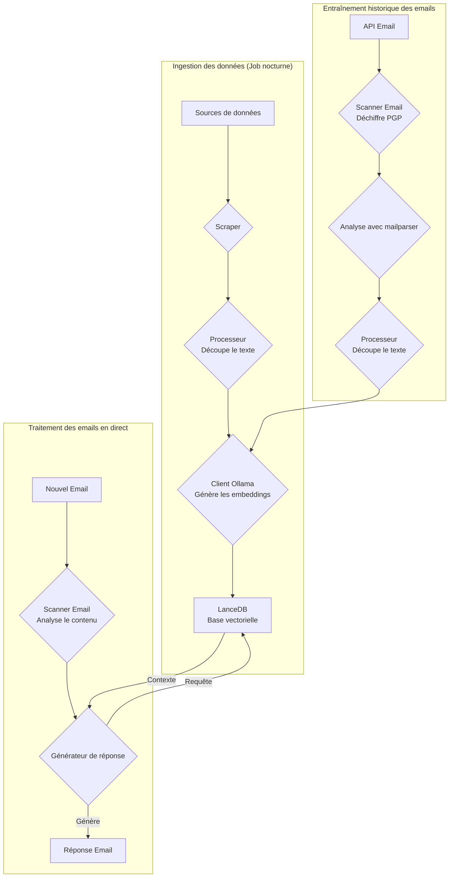
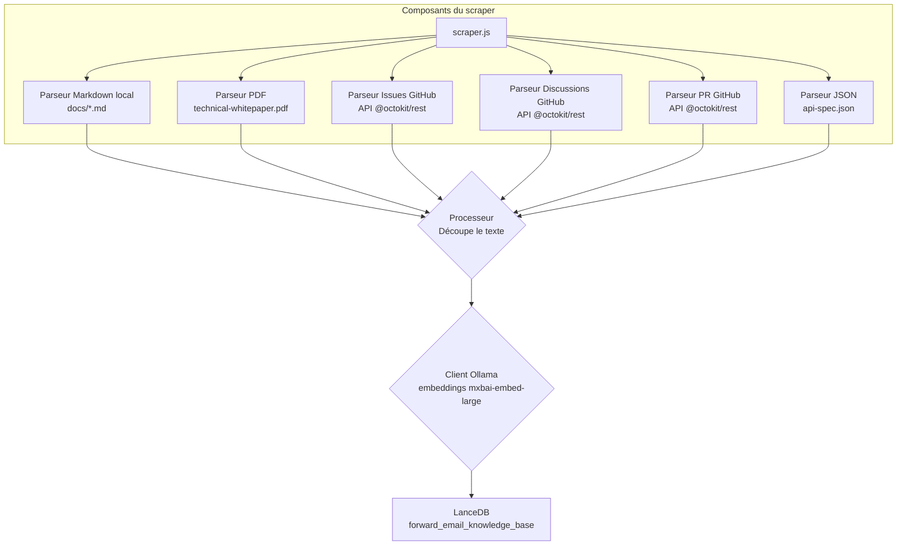
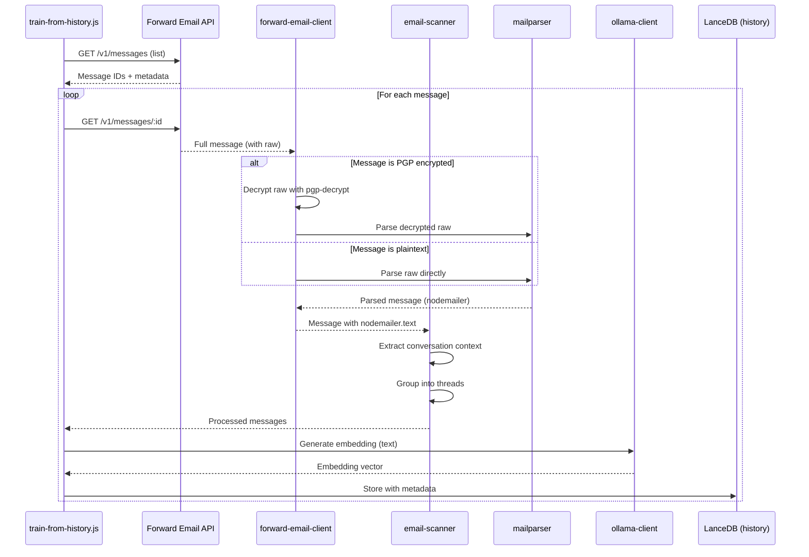

# Construire un agent de support client IA axé sur la confidentialité avec LanceDB, Ollama et Node.js {#building-a-privacy-first-ai-customer-support-agent-with-lancedb-ollama-and-nodejs}


> \[!NOTE]
> Ce document couvre notre parcours de création d’un agent de support IA auto-hébergé. Nous avons écrit sur des défis similaires dans notre article de blog [Email Startup Graveyard](https://forwardemail.net/blog/docs/email-startup-graveyard-why-80-percent-email-companies-fail). Nous avons honnêtement pensé à écrire un suivi intitulé « AI Startup Graveyard » mais peut-être devrons-nous attendre encore un an ou plus jusqu’à ce que la bulle IA éclate potentiellement (?). Pour l’instant, c’est notre synthèse de ce qui a fonctionné, ce qui n’a pas fonctionné, et pourquoi nous l’avons fait ainsi.

Voici comment nous avons construit notre propre agent de support client IA. Nous l’avons fait à la dure : auto-hébergé, axé sur la confidentialité, et complètement sous notre contrôle. Pourquoi ? Parce que nous ne faisons pas confiance aux services tiers avec les données de nos clients. C’est une exigence du RGPD et du DPA, et c’est la bonne chose à faire.

Ce n’était pas un projet de week-end amusant. Ce fut un parcours d’un mois à naviguer entre dépendances cassées, documentation trompeuse, et le chaos général de l’écosystème IA open-source en 2025. Ce document est un enregistrement de ce que nous avons construit, pourquoi nous l’avons construit, et les obstacles rencontrés en chemin.


## Table des matières {#table-of-contents}

* [Avantages pour les clients : support humain augmenté par l’IA](#customer-benefits-ai-augmented-human-support)
  * [Réponses plus rapides et plus précises](#faster-more-accurate-responses)
  * [Cohérence sans épuisement](#consistency-without-burnout)
  * [Ce que vous obtenez](#what-you-get)
* [Une réflexion personnelle : deux décennies de travail acharné](#a-personal-reflection-the-two-decade-grind)
* [Pourquoi la confidentialité est importante](#why-privacy-matters)
* [Analyse des coûts : IA cloud vs auto-hébergé](#cost-analysis-cloud-ai-vs-self-hosted)
  * [Comparaison des services IA cloud](#cloud-ai-service-comparison)
  * [Répartition des coûts : base de connaissances de 5 Go](#cost-breakdown-5gb-knowledge-base)
  * [Coûts matériels auto-hébergés](#self-hosted-hardware-costs)
* [Utilisation interne de notre propre API](#dogfooding-our-own-api)
  * [Pourquoi l’utilisation interne est importante](#why-dogfooding-matters)
  * [Exemples d’utilisation de l’API](#api-usage-examples)
  * [Avantages en termes de performance](#performance-benefits)
* [Architecture de chiffrement](#encryption-architecture)
  * [Couche 1 : chiffrement de la boîte mail (chacha20-poly1305)](#layer-1-mailbox-encryption-chacha20-poly1305)
  * [Couche 2 : chiffrement PGP au niveau du message](#layer-2-message-level-pgp-encryption)
  * [Pourquoi cela importe pour l’entraînement](#why-this-matters-for-training)
  * [Sécurité du stockage](#storage-security)
  * [Le stockage local est une pratique standard](#local-storage-is-standard-practice)
* [L’architecture](#the-architecture)
  * [Flux à haut niveau](#high-level-flow)
  * [Flux détaillé du scraper](#detailed-scraper-flow)
* [Comment ça fonctionne](#how-it-works)
  * [Construction de la base de connaissances](#building-the-knowledge-base)
  * [Entraînement à partir des emails historiques](#training-from-historical-emails)
  * [Traitement des emails entrants](#processing-incoming-emails)
  * [Gestion de la base vectorielle](#vector-store-management)
* [Le cimetière des bases de données vectorielles](#the-vector-database-graveyard)
* [Exigences système](#system-requirements)
* [Configuration des tâches Cron](#cron-job-configuration)
  * [Variables d’environnement](#environment-variables)
  * [Tâches Cron pour plusieurs boîtes de réception](#cron-jobs-for-multiple-inboxes)
  * [Répartition du planning Cron](#cron-schedule-breakdown)
  * [Calcul dynamique des dates](#dynamic-date-calculation)
  * [Configuration initiale : extraction de la liste d’URL depuis le sitemap](#initial-setup-extract-url-list-from-sitemap)
  * [Test manuel des tâches Cron](#testing-cron-jobs-manually)
  * [Surveillance des logs](#monitoring-logs)
* [Exemples de code](#code-examples)
  * [Scraping et traitement](#scraping-and-processing)
  * [Entraînement à partir des emails historiques](#training-from-historical-emails-1)
  * [Requêtes pour le contexte](#querying-for-context)
* [L’avenir : R&D sur le scanner anti-spam](#the-future-spam-scanner-rd)
* [Dépannage](#troubleshooting)
  * [Erreur de non-correspondance de dimension vectorielle](#vector-dimension-mismatch-error)
  * [Contexte de base de connaissances vide](#empty-knowledge-base-context)
  * [Échecs de déchiffrement PGP](#pgp-decryption-failures)
* [Conseils d’utilisation](#usage-tips)
  * [Atteindre la boîte de réception zéro](#achieving-inbox-zero)
  * [Utilisation du label skip-ai](#using-the-skip-ai-label)
  * [Fil de discussion email et réponse à tous](#email-threading-and-reply-all)
  * [Surveillance et maintenance](#monitoring-and-maintenance)
* [Tests](#testing)
  * [Exécution des tests](#running-tests)
  * [Couverture des tests](#test-coverage)
  * [Environnement de test](#test-environment)
* [Points clés à retenir](#key-takeaways)
## Avantages pour les clients : Support humain augmenté par l'IA {#customer-benefits-ai-augmented-human-support}

Notre système d'IA ne remplace pas notre équipe de support — il la rend meilleure. Voici ce que cela signifie pour vous :

### Réponses plus rapides et plus précises {#faster-more-accurate-responses}

**Humain dans la boucle** : Chaque brouillon généré par l'IA est examiné, édité et sélectionné par notre équipe de support humain avant de vous être envoyé. L'IA s'occupe de la recherche initiale et de la rédaction, libérant notre équipe pour se concentrer sur le contrôle qualité et la personnalisation.

**Formé sur l'expertise humaine** : L'IA apprend à partir de :

* Notre base de connaissances et documentation rédigées à la main
* Articles de blog et tutoriels écrits par des humains
* Notre FAQ complète (rédigée par des humains)
* Conversations passées avec les clients (toutes gérées par de vrais humains)

Vous recevez des réponses basées sur des années d'expertise humaine, simplement délivrées plus rapidement.

### Cohérence sans épuisement {#consistency-without-burnout}

Notre petite équipe traite des centaines de demandes de support chaque jour, chacune nécessitant des connaissances techniques différentes et un changement de contexte mental :

* Les questions de facturation nécessitent une connaissance des systèmes financiers
* Les problèmes DNS nécessitent une expertise en réseau
* L'intégration API nécessite des connaissances en programmation
* Les rapports de sécurité nécessitent une évaluation des vulnérabilités

Sans l'aide de l'IA, ce changement constant de contexte entraîne :

* Des temps de réponse plus lents
* Des erreurs humaines dues à la fatigue
* Une qualité de réponse incohérente
* L'épuisement de l'équipe

**Avec l'augmentation par l'IA**, notre équipe :

* Répond plus vite (l'IA rédige en quelques secondes)
* Fait moins d'erreurs (l'IA détecte les erreurs courantes)
* Maintient une qualité constante (l'IA se réfère toujours à la même base de connaissances)
* Reste fraîche et concentrée (moins de temps passé à rechercher, plus de temps à aider)

### Ce que vous obtenez {#what-you-get}

✅ **Vitesse** : L'IA rédige les réponses en quelques secondes, les humains les relisent et envoient en quelques minutes

✅ **Précision** : Réponses basées sur notre documentation réelle et nos solutions passées

✅ **Cohérence** : Les mêmes réponses de haute qualité, que ce soit à 9h ou à 21h

✅ **Toucher humain** : Chaque réponse est relue et personnalisée par notre équipe

✅ **Pas d'hallucinations** : L'IA utilise uniquement notre base de connaissances vérifiée, pas des données génériques d'internet

> \[!NOTE]
> **Vous parlez toujours à des humains**. L'IA est un assistant de recherche qui aide notre équipe à trouver la bonne réponse plus rapidement. Pensez-y comme un bibliothécaire qui trouve instantanément le livre pertinent — mais un humain le lit et vous l'explique.


## Une réflexion personnelle : Deux décennies de travail acharné {#a-personal-reflection-the-two-decade-grind}

Avant d'entrer dans les détails techniques, une note personnelle. Je fais cela depuis près de deux décennies. Les heures interminables au clavier, la quête incessante d'une solution, le travail profond et concentré – c'est la réalité de construire quelque chose de significatif. Une réalité souvent occultée dans les cycles d'engouement pour les nouvelles technologies.

L'explosion récente de l'IA a été particulièrement frustrante. On nous vend un rêve d'automatisation, d'assistants IA qui écriront notre code et résoudront nos problèmes. La réalité ? Le résultat est souvent un code poubelle qui demande plus de temps à corriger qu'il n'en aurait fallu pour l'écrire soi-même. La promesse de faciliter nos vies est fausse. C'est une distraction du travail dur et nécessaire de la construction.

Et puis il y a le cercle vicieux de la contribution open-source. Vous êtes déjà surchargé, épuisé par le travail. Vous utilisez une IA pour vous aider à rédiger un rapport de bug détaillé et bien structuré, espérant faciliter la compréhension et la correction par les mainteneurs. Et que se passe-t-il ? Vous vous faites réprimander. Votre contribution est rejetée comme « hors sujet » ou de faible qualité, comme nous l'avons vu dans un récent [problème GitHub Node.js](https://github.com/nodejs/node/issues/60719#issuecomment-3534304321). C'est une gifle pour les développeurs expérimentés qui essaient simplement d'aider.

C'est la réalité de l'écosystème dans lequel nous travaillons. Il ne s'agit pas seulement d'outils défaillants ; c'est une culture qui manque souvent de respect pour le temps et [l'effort de ses contributeurs](https://forwardemail.net/blog/docs/how-npm-packages-billion-downloads-shaped-javascript-ecosystem). Ce billet est une chronique de cette réalité. C'est une histoire sur les outils, oui, mais aussi sur le coût humain de construire dans un écosystème cassé qui, malgré toutes ses promesses, est fondamentalement brisé.
## Pourquoi la confidentialité est importante {#why-privacy-matters}

Notre [livre blanc technique](https://forwardemail.net/technical-whitepaper.pdf) couvre en profondeur notre philosophie de la confidentialité. La version courte : nous ne transmettons jamais les données des clients à des tiers. Jamais. Cela signifie pas d’OpenAI, pas d’Anthropic, pas de bases de données vectorielles hébergées dans le cloud. Tout fonctionne localement sur notre infrastructure. C’est non négociable pour la conformité au RGPD et nos engagements DPA.


## Analyse des coûts : IA Cloud vs Auto-hébergé {#cost-analysis-cloud-ai-vs-self-hosted}

Avant d’entrer dans la mise en œuvre technique, parlons de l’importance de l’auto-hébergement du point de vue des coûts. Les modèles tarifaires des services d’IA cloud les rendent prohibitifs pour des cas d’usage à fort volume comme le support client.

### Comparaison des services d’IA Cloud {#cloud-ai-service-comparison}

| Service         | Fournisseur         | Coût d’Embedding                                               | Coût LLM (Entrée)                                                        | Coût LLM (Sortie)       | Politique de confidentialité                          | RGPD/DPA        | Hébergement       | Partage des données |
| --------------- | ------------------- | -------------------------------------------------------------- | ------------------------------------------------------------------------ | ----------------------- | ----------------------------------------------------- | --------------- | ----------------- | ------------------- |
| **OpenAI**      | OpenAI (US)         | [$0.02-0.13/1M tokens](https://openai.com/api/pricing/)        | $0.15-20/1M tokens                                                       | $0.60-80/1M tokens      | [Lien](https://openai.com/policies/privacy-policy/)   | DPA limitée     | Azure (US)        | Oui (entraînement)  |
| **Claude**      | Anthropic (US)      | N/A                                                            | [$3-20/1M tokens](https://docs.claude.com/en/docs/about-claude/pricing) | $15-80/1M tokens        | [Lien](https://www.anthropic.com/legal/privacy)       | DPA limitée     | AWS/GCP (US)      | Non (prétendu)      |
| **Gemini**      | Google (US)         | [$0.15/1M tokens](https://ai.google.dev/gemini-api/docs/pricing) | $0.30-1.00/1M tokens                                                     | $2.50/1M tokens         | [Lien](https://policies.google.com/privacy)           | DPA limitée     | GCP (US)          | Oui (amélioration)  |
| **DeepSeek**    | DeepSeek (Chine)    | N/A                                                            | [$0.028-0.28/1M tokens](https://api-docs.deepseek.com/quick_start/pricing) | $0.42/1M tokens         | [Lien](https://www.deepseek.com/en)                    | Inconnu         | Chine             | Inconnu             |
| **Mistral**     | Mistral AI (France) | [$0.10/1M tokens](https://mistral.ai/pricing)                  | $0.40/1M tokens                                                        | $2.00/1M tokens         | [Lien](https://mistral.ai/terms/)                      | RGPD UE         | UE                | Inconnu             |
| **Auto-hébergé**| Vous                | $0 (matériel existant)                                         | $0 (matériel existant)                                                  | $0 (matériel existant)  | Votre politique                                       | Conformité totale | MacBook M5 + cron | Jamais              |

> \[!WARNING]
> **Préoccupations de souveraineté des données** : Les fournisseurs américains (OpenAI, Claude, Gemini) sont soumis au CLOUD Act, permettant au gouvernement américain d’accéder aux données. DeepSeek (Chine) opère sous les lois chinoises sur les données. Bien que Mistral (France) offre un hébergement en UE et une conformité RGPD, l’auto-hébergement reste la seule option pour une souveraineté et un contrôle complets des données.

### Répartition des coûts : base de connaissances de 5 Go {#cost-breakdown-5gb-knowledge-base}

Calculons le coût du traitement d’une base de connaissances de 5 Go (typique pour une entreprise de taille moyenne avec documents, emails et historique de support).

**Hypothèses :**

* 5 Go de texte ≈ 1,25 milliard de tokens (en supposant ~4 caractères/token)
* Génération initiale des embeddings
* Réentraînement mensuel (ré-embedding complet)
* 10 000 requêtes de support par mois
* Requête moyenne : 500 tokens en entrée, 300 tokens en sortie
**Répartition détaillée des coûts :**

| Composant                              | OpenAI           | Claude          | Gemini               | Auto-hébergé       |
| -------------------------------------- | ---------------- | --------------- | -------------------- | ------------------ |
| **Insertion initiale** (1,25 milliards de tokens)   | 25 000 $         | N/A             | 187 500 $            | 0 $                |
| **Requêtes mensuelles** (10K × 800 tokens) | 1 200-16 000 $   | 2 400-16 000 $  | 2 400-3 200 $        | 0 $                |
| **Réentraînement mensuel** (1,25 milliards de tokens)  | 25 000 $         | N/A             | 187 500 $            | 0 $                |
| **Total première année**               | 325 200-217 000 $| 28 800-192 000 $| 2 278 800-2 226 000 $| ~60 $ (électricité)|
| **Conformité à la vie privée**         | ❌ Limitée       | ❌ Limitée      | ❌ Limitée           | ✅ Complète         |
| **Souveraineté des données**           | ❌ Non           | ❌ Non          | ❌ Non               | ✅ Oui              |

> \[!CAUTION]
> **Les coûts d’insertion de Gemini sont catastrophiques** à 0,15 $/1M tokens. L’insertion d’une base de connaissances de 5 Go coûterait 187 500 $. C’est 37 fois plus cher qu’OpenAI et rend ce service complètement inutilisable en production.

### Coûts du matériel auto-hébergé {#self-hosted-hardware-costs}

Notre configuration fonctionne sur du matériel existant que nous possédons déjà :

* **Matériel** : MacBook M5 (déjà possédé pour le développement)
* **Coût supplémentaire** : 0 $ (utilise le matériel existant)
* **Électricité** : ~5 $/mois (estimation)
* **Total première année** : ~60 $
* **Coût récurrent** : 60 $/an

**ROI** : L’auto-hébergement a un coût marginal quasi nul puisque nous utilisons du matériel de développement existant. Le système fonctionne via des tâches cron pendant les heures creuses.


## Utilisation interne de notre propre API {#dogfooding-our-own-api}

Une des décisions architecturales les plus importantes que nous avons prises est que tous les travaux d’IA utilisent directement l’[API Forward Email](https://forwardemail.net/email-api). Ce n’est pas seulement une bonne pratique — c’est un moteur d’optimisation des performances.

### Pourquoi l’utilisation interne est importante {#why-dogfooding-matters}

Quand nos travaux d’IA utilisent les mêmes points d’accès API que nos clients :

1. **Les goulets d’étranglement de performance nous affectent en premier** - Nous ressentons la douleur avant les clients
2. **L’optimisation profite à tous** - Les améliorations pour nos travaux améliorent automatiquement l’expérience client
3. **Tests en conditions réelles** - Nos travaux traitent des milliers d’emails, fournissant un test de charge continu
4. **Réutilisation du code** - Même authentification, limitation de débit, gestion des erreurs et mise en cache

### Exemples d’utilisation de l’API {#api-usage-examples}

**Lister les messages (train-from-history.js) :**

```javascript
// Utilise GET /v1/messages?folder=INBOX avec BasicAuth
// Exclut eml, raw, nodemailer pour réduire la taille de la réponse (seuls les IDs sont nécessaires)
const response = await axios.get(
  `${this.apiBase}/v1/messages`,
  {
    params: {
      folder: 'INBOX',
      limit: 100,
      eml: false,
      raw: false,
      nodemailer: false
    },
    auth: {
      username: process.env.FORWARD_EMAIL_ALIAS_USERNAME,
      password: process.env.FORWARD_EMAIL_ALIAS_PASSWORD
    }
  }
);

const messages = response.data;
// Renvoie : [{ id, subject, date, ... }, ...]
// Le contenu complet du message est récupéré plus tard via GET /v1/messages/:id
```

**Récupérer les messages complets (forward-email-client.js) :**

```javascript
// Utilise GET /v1/messages/:id pour obtenir le message complet avec contenu brut
const response = await axios.get(
  `${this.apiBase}/v1/messages/${messageId}`,
  {
    auth: {
      username: this.aliasUsername,
      password: this.aliasPassword
    }
  }
);

const message = response.data;
// Renvoie : { id, subject, raw, eml, nodemailer: { ... }, ... }
```

**Créer des brouillons de réponses (process-inbox.js) :**

```javascript
// Utilise POST /v1/messages pour créer des réponses brouillon
const response = await axios.post(
  `${this.apiBase}/v1/messages`,
  {
    folder: 'Drafts',
    subject: `Re: ${originalSubject}`,
    to: senderEmail,
    text: generatedResponse,
    inReplyTo: originalMessageId
  },
  {
    auth: {
      username: process.env.FORWARD_EMAIL_ALIAS_USERNAME,
      password: process.env.FORWARD_EMAIL_ALIAS_PASSWORD
    }
  }
);
```
### Avantages de Performance {#performance-benefits}

Parce que nos tâches d'IA s'exécutent sur la même infrastructure API :

* **Optimisations du cache** bénéficient à la fois aux tâches et aux clients
* **Limitation du débit** testée sous charge réelle
* **Gestion des erreurs** éprouvée en conditions réelles
* **Temps de réponse de l'API** constamment surveillés
* **Requêtes de base de données** optimisées pour les deux cas d'utilisation
* **Optimisation de la bande passante** - Exclure `eml`, `raw`, `nodemailer` lors de la liste réduit la taille de la réponse d'environ 90 %

Lorsque `train-from-history.js` traite 1 000 emails, il effectue plus de 1 000 appels API. Toute inefficacité dans l'API devient immédiatement apparente. Cela nous oblige à optimiser l'accès IMAP, les requêtes de base de données et la sérialisation des réponses — des améliorations qui bénéficient directement à nos clients.

**Exemple d'optimisation** : Lister 100 messages avec contenu complet = réponse d'environ 10 Mo. Lister avec `eml: false, raw: false, nodemailer: false` = réponse d'environ 100 Ko (100x plus petite).


## Architecture de Chiffrement {#encryption-architecture}

Notre stockage d'emails utilise plusieurs couches de chiffrement, que les tâches d'IA doivent déchiffrer en temps réel pour l'entraînement.

### Couche 1 : Chiffrement de la Boîte aux Lettres (chacha20-poly1305) {#layer-1-mailbox-encryption-chacha20-poly1305}

Toutes les boîtes aux lettres IMAP sont stockées sous forme de bases de données SQLite chiffrées avec **chacha20-poly1305**, un algorithme de chiffrement résistant aux attaques quantiques. Ceci est détaillé dans notre [article de blog sur le service d'email chiffré quantique-sûr](https://forwardemail.net/blog/docs/best-quantum-safe-encrypted-email-service).

**Propriétés clés :**

* **Algorithme** : ChaCha20-Poly1305 (chiffrement AEAD)
* **Résistance quantique** : Résistant aux attaques par calcul quantique
* **Stockage** : Fichiers de base de données SQLite sur disque
* **Accès** : Déchiffré en mémoire lors de l'accès via IMAP/API

### Couche 2 : Chiffrement PGP au Niveau du Message {#layer-2-message-level-pgp-encryption}

De nombreux emails de support sont en plus chiffrés avec PGP (standard OpenPGP). Les tâches d'IA doivent les déchiffrer pour extraire le contenu destiné à l'entraînement.

**Flux de déchiffrement :**

```javascript
// 1. L'API retourne le message avec le contenu brut chiffré
const message = await forwardEmailClient.getMessage(id);

// 2. Vérifier si le contenu brut est chiffré en PGP
if (isMessageEncrypted(message.raw)) {
  // 3. Déchiffrer avec notre clé privée
  const decryptedRaw = await pgpDecrypt(message.raw);

  // 4. Analyser le message MIME déchiffré
  const parsed = await simpleParser(decryptedRaw);

  // 5. Remplir nodemailer avec le contenu déchiffré
  message.nodemailer = {
    text: parsed.text,
    html: parsed.html,
    from: parsed.from,
    to: parsed.to,
    subject: parsed.subject,
    date: parsed.date
  };
}
```

**Configuration PGP :**

```bash
# Clé privée pour le déchiffrement (chemin vers le fichier clé ASCII-armored)
GPG_SECURITY_KEY="/path/to/private-key.asc"

# Phrase secrète pour la clé privée (si chiffrée)
GPG_SECURITY_PASSPHRASE="your-passphrase"
```

L’aide `pgp-decrypt.js` :

1. Lit la clé privée depuis le disque une fois (mise en cache en mémoire)
2. Déchiffre la clé avec la phrase secrète
3. Utilise la clé déchiffrée pour tous les déchiffrements de messages
4. Supporte le déchiffrement récursif pour les messages chiffrés imbriqués

### Pourquoi c’est important pour l’entraînement {#why-this-matters-for-training}

Sans déchiffrement approprié, l’IA s’entraînerait sur du charabia chiffré :

```
-----BEGIN PGP MESSAGE-----
Version: OpenPGP.js v4.10.10

wcBMA8Z3lHJnFnNUAQgAqK7F8...
-----END PGP MESSAGE-----
```

Avec le déchiffrement, l’IA s’entraîne sur le contenu réel :

```
Subject: Re: Bug Report

Hi John,

Thanks for reporting this issue. I've confirmed the bug
and created a fix in PR #1234...
```

### Sécurité du Stockage {#storage-security}

Le déchiffrement se fait en mémoire pendant l’exécution de la tâche, et le contenu déchiffré est converti en embeddings qui sont ensuite stockés dans la base de données vectorielle LanceDB sur disque.

**Où vivent les données :**

* **Base de données vectorielle** : Stockée sur des postes de travail MacBook M5 chiffrés
* **Sécurité physique** : Les postes restent toujours en notre possession (pas dans des datacenters)
* **Chiffrement disque** : Chiffrement complet du disque sur tous les postes
* **Sécurité réseau** : Pare-feu et isolation des réseaux publics

**Déploiement futur en datacenter :**
Si nous migrons un jour vers un hébergement en datacenter, les serveurs disposeront de :

* Chiffrement complet du disque LUKS
* Accès USB désactivé
* Mesures de sécurité physique
* Isolation réseau
Pour des détails complets sur nos pratiques de sécurité, consultez notre [page Sécurité](https://forwardemail.net/en/security).

> \[!NOTE]
> La base de données vectorielle contient des embeddings (représentations mathématiques), pas le texte original en clair. Cependant, les embeddings peuvent potentiellement être rétroconçus, c’est pourquoi nous les conservons sur des postes de travail chiffrés et physiquement sécurisés.

### Le stockage local est une pratique standard {#local-storage-is-standard-practice}

Stocker les embeddings sur les postes de travail de notre équipe n’est pas différent de la manière dont nous gérons déjà les emails :

* **Thunderbird** : Télécharge et stocke le contenu complet des emails localement dans des fichiers mbox/maildir
* **Clients webmail** : Mettent en cache les données des emails dans le stockage du navigateur et les bases de données locales
* **Clients IMAP** : Maintiennent des copies locales des messages pour un accès hors ligne
* **Notre système IA** : Stocke des embeddings mathématiques (pas du texte en clair) dans LanceDB

La différence clé : les embeddings sont **plus sécurisés** que les emails en clair car ils sont :

1. Des représentations mathématiques, pas du texte lisible
2. Plus difficiles à rétroconcevoir que le texte en clair
3. Toujours soumis à la même sécurité physique que nos clients email

S’il est acceptable pour notre équipe d’utiliser Thunderbird ou le webmail sur des postes de travail chiffrés, il est tout aussi acceptable (et sans doute plus sécurisé) de stocker les embeddings de la même manière.


## L’architecture {#the-architecture}

Voici le flux de base. Cela semble simple. Ça ne l’était pas.

> \[!NOTE]
> Tous les jobs utilisent directement l’API Forward Email, garantissant que les optimisations de performance bénéficient à la fois à notre système IA et à nos clients.

### Flux de haut niveau {#high-level-flow}



### Flux détaillé du scraper {#detailed-scraper-flow}

Le `scraper.js` est le cœur de l’ingestion des données. C’est une collection de parseurs pour différents formats de données.




## Comment ça fonctionne {#how-it-works}

Le processus est divisé en trois parties principales : construire la base de connaissances, entraîner à partir des emails historiques, et traiter les nouveaux emails.

### Construction de la base de connaissances {#building-the-knowledge-base}

**`update-knowledge-base.js`** : C’est le job principal. Il s’exécute chaque nuit, vide l’ancienne base vectorielle, et la reconstruit de zéro. Il utilise `scraper.js` pour récupérer le contenu de toutes les sources, `processor.js` pour le découper, et `ollama-client.js` pour générer les embeddings. Enfin, `vector-store.js` stocke tout dans LanceDB.

**Sources de données :**

* Fichiers Markdown locaux (`docs/*.md`)
* PDF du livre blanc technique (`assets/technical-whitepaper.pdf`)
* JSON de spécification API (`assets/api-spec.json`)
* Issues GitHub (via Octokit)
* Discussions GitHub (via Octokit)
* Pull requests GitHub (via Octokit)
* Liste d’URLs du sitemap (`$LANCEDB_PATH/valid-urls.json`)

### Entraînement à partir des emails historiques {#training-from-historical-emails}

**`train-from-history.js`** : Ce job scanne les emails historiques de tous les dossiers, déchiffre les messages PGP, et les ajoute à une base vectorielle séparée (`customer_support_history`). Cela fournit un contexte issu des interactions passées du support.
**Flux de traitement des e-mails :**



**Fonctionnalités clés :**

* **Déchiffrement PGP** : Utilise l’aide `pgp-decrypt.js` avec la variable d’environnement `GPG_SECURITY_KEY`
* **Regroupement des fils de discussion** : Regroupe les e-mails liés en fils de conversation
* **Préservation des métadonnées** : Stocke le dossier, le sujet, la date, le statut de chiffrement
* **Contexte des réponses** : Lie les messages à leurs réponses pour un meilleur contexte

**Configuration :**

```bash
# Variables d’environnement pour train-from-history
HISTORY_SCAN_LIMIT=1000              # Nombre max de messages à traiter
HISTORY_SCAN_SINCE="2024-01-01"      # Traiter uniquement les messages après cette date
HISTORY_DECRYPT_PGP=true             # Tenter le déchiffrement PGP
GPG_SECURITY_KEY="/path/to/key.asc"  # Chemin vers la clé privée PGP
GPG_SECURITY_PASSPHRASE="passphrase" # Phrase secrète de la clé (optionnel)
```

**Ce qui est stocké :**

```javascript
{
  type: 'historical_email',
  folder: 'INBOX',
  subject: 'Re: Bug Report',
  date: '2025-01-15T10:30:00Z',
  messageId: '67e2f288893921...',
  threadId: 'Bug Report',
  hasReply: true,
  encrypted: true,
  decrypted: true,
  replySubject: 'Bug Report',
  replyText: 'First 500 chars of reply...',
  chunkSize: 1000,
  chunkOverlap: 200,
  chunkIndex: 0
}
```

> \[!TIP]
> Exécutez `train-from-history` après la configuration initiale pour peupler le contexte historique. Cela améliore considérablement la qualité des réponses en apprenant des interactions passées du support.

### Traitement des e-mails entrants {#processing-incoming-emails}

**`process-inbox.js`** : Ce job s’exécute sur les e-mails de nos boîtes `support@forwardemail.net`, `abuse@forwardemail.net` et `security@forwardemail.net` (plus précisément dans le dossier IMAP `INBOX`). Il utilise notre API à <https://forwardemail.net/email-api> (par exemple `GET /v1/messages?folder=INBOX` avec accès BasicAuth utilisant nos identifiants IMAP pour chaque boîte). Il analyse le contenu des e-mails, interroge à la fois la base de connaissances (`forward_email_knowledge_base`) et la base vectorielle historique des e-mails (`customer_support_history`), puis transmet le contexte combiné à `response-generator.js`. Le générateur utilise `mxbai-embed-large` via Ollama pour créer une réponse.

**Fonctionnalités du workflow automatisé :**

1. **Automatisation Inbox Zero** : Après la création réussie d’un brouillon, le message original est automatiquement déplacé dans le dossier Archive. Cela maintient votre boîte de réception propre et aide à atteindre l’inbox zero sans intervention manuelle.

2. **Ignorer le traitement IA** : Ajoutez simplement un label `skip-ai` (insensible à la casse) à un message pour empêcher son traitement par l’IA. Le message restera dans votre boîte de réception intact, vous permettant de le gérer manuellement. Utile pour les messages sensibles ou les cas complexes nécessitant un jugement humain.

3. **Fil de discussion correct des e-mails** : Toutes les réponses en brouillon incluent le message original cité en dessous (avec le préfixe standard ` >  `), suivant les conventions de réponse e-mail avec le format « Le \[date], \[expéditeur] a écrit : ». Cela garantit un contexte et un fil de discussion corrects dans les clients mail.

4. **Comportement Répondre à tous** : Le système gère automatiquement les en-têtes Reply-To et les destinataires CC :
   * Si un en-tête Reply-To existe, il devient l’adresse To et l’expéditeur original est ajouté en CC
   * Tous les destinataires To et CC originaux sont inclus en CC dans la réponse (sauf votre propre adresse)
   * Suit les conventions standard de réponse à tous pour les conversations de groupe
**Classement des sources** : Le système utilise un **classement pondéré** pour prioriser les sources :

* FAQ : 100 % (priorité la plus élevée)
* Livre blanc technique : 95 %
* Spécification API : 90 %
* Docs officielles : 85 %
* Issues GitHub : 70 %
* Emails historiques : 50 %

### Gestion du magasin vectoriel {#vector-store-management}

La classe `VectorStore` dans `helpers/customer-support-ai/vector-store.js` est notre interface avec LanceDB.

**Ajout de documents :**

```javascript
// vector-store.js
async addDocument(text, metadata) {
  const embedding = await this.ollama.generateEmbedding(text);
  await this.table.add([{
    vector: embedding,
    text,
    ...metadata
  }]);
}
```

**Vider le magasin :**

```javascript
// Option 1 : Utiliser la méthode clear()
await vectorStore.clear();

// Option 2 : Supprimer le répertoire local de la base de données
await fs.rm(process.env.LANCEDB_PATH, { recursive: true, force: true });
```

La variable d’environnement `LANCEDB_PATH` pointe vers le répertoire local de la base de données embarquée. LanceDB est sans serveur et embarqué, il n’y a donc pas de processus séparé à gérer.


## Le cimetière des bases de données vectorielles {#the-vector-database-graveyard}

Ce fut le premier obstacle majeur. Nous avons essayé plusieurs bases de données vectorielles avant de nous fixer sur LanceDB. Voici ce qui n’a pas fonctionné avec chacune.

| Base de données | GitHub                                                      | Ce qui a mal tourné                                                                                                                                                                                                   | Problèmes spécifiques                                                                                                                                                                                                                                                                                                                                                      | Problèmes de sécurité                                                                                                                                                                                            |
| --------------- | ----------------------------------------------------------- | -------------------------------------------------------------------------------------------------------------------------------------------------------------------------------------------------------------------- | -------------------------------------------------------------------------------------------------------------------------------------------------------------------------------------------------------------------------------------------------------------------------------------------------------------------------------------------------------------------------- | ---------------------------------------------------------------------------------------------------------------------------------------------------------------------------------------------------------------- |
| **ChromaDB**    | [chroma-core/chroma](https://github.com/chroma-core/chroma) | `pip3 install chromadb` vous donne une version d’un autre âge avec `PydanticImportError`. La seule façon d’obtenir une version fonctionnelle est de compiler depuis la source. Pas convivial pour les développeurs. | Chaos des dépendances Python. Plusieurs utilisateurs signalent des installations pip cassées ([#774](https://github.com/chroma-core/chroma/issues/774), [#163](https://github.com/chroma-core/chroma/issues/163)). La doc dit « utilisez juste Docker » ce qui n’est pas une réponse pour le développement local. Plantages sous Windows avec plus de 99 enregistrements ([#3058](https://github.com/chroma-core/chroma/issues/3058)). | **CVE-2024-45848** : Exécution de code arbitraire via l’intégration ChromaDB dans MindsDB. Vulnérabilités critiques du système d’exploitation dans l’image Docker ([#3170](https://github.com/chroma-core/chroma/issues/3170)). |
| **Qdrant**      | [qdrant/qdrant](https://github.com/qdrant/qdrant)           | Le tap Homebrew (`qdrant/qdrant/qdrant`) référencé dans leurs anciennes docs a disparu. Évaporé. Sans explication. Les docs officielles disent maintenant juste « utilisez Docker ».                                  | Tap Homebrew manquant. Pas de binaire natif macOS. Docker uniquement est un frein pour des tests locaux rapides.                                                                                                                                                                                                                                                          | **CVE-2024-2221** : Vulnérabilité d’upload de fichiers arbitraires permettant l’exécution de code à distance (corrigée en v1.9.0). Faible score de maturité sécurité selon [IronCore Labs](https://ironcorelabs.com/vectordbs/qdrant-security/). |
| **Weaviate**    | [weaviate/weaviate](https://github.com/weaviate/weaviate)   | La version Homebrew avait un bug critique de clustering (`leader not found`). Les flags documentés pour le corriger (`RAFT_JOIN`, `CLUSTER_HOSTNAME`) ne fonctionnaient pas. Fondamentalement cassé pour les configurations mono-nœud. | Bugs de clustering même en mode mono-nœud. Sur-ingénierie pour des cas d’usage simples.                                                                                                                                                                                                                                                                                    | Pas de CVE majeures trouvées, mais la complexité augmente la surface d’attaque.                                                                                                                                  |
| **LanceDB**     | [lancedb/lancedb](https://github.com/lancedb/lancedb)       | Celui-ci a fonctionné. Il est embarqué et sans serveur. Pas de processus séparé. La seule gêne est la confusion dans le nommage des paquets (`vectordb` est déprécié, utilisez `@lancedb/lancedb`) et la documentation dispersée. On peut vivre avec. | Confusion dans le nommage des paquets (`vectordb` vs `@lancedb/lancedb`), mais sinon solide. L’architecture embarquée élimine toute une classe de problèmes de sécurité.                                                                                                                                                                                                  | Pas de CVE connues. Le design embarqué signifie aucune surface d’attaque réseau.                                                                                                                                   |
> \[!WARNING]
> **ChromaDB présente des vulnérabilités de sécurité critiques.** [CVE-2024-45848](https://nvd.nist.gov/vuln/detail/CVE-2024-45848) permet l'exécution de code arbitraire. L'installation via pip est fondamentalement défaillante à cause de problèmes de dépendance Pydantic. Évitez son utilisation en production.

> \[!WARNING]
> **Qdrant avait une vulnérabilité RCE liée au téléchargement de fichiers** ([CVE-2024-2221](https://qdrant.tech/blog/cve-2024-2221-response/)) qui n'a été corrigée qu'en v1.9.0. Si vous devez utiliser Qdrant, assurez-vous d'avoir la dernière version.

> \[!CAUTION]
> L'écosystème des bases de données vectorielles open-source est instable. Ne faites pas confiance à la documentation. Considérez que tout est cassé jusqu'à preuve du contraire. Testez localement avant de vous engager dans une stack.


## Exigences Système {#system-requirements}

* **Node.js :** v18.0.0+ ([GitHub](https://github.com/nodejs/node))
* **Ollama :** Dernière version ([GitHub](https://github.com/ollama/ollama))
* **Modèle :** `mxbai-embed-large` via Ollama
* **Base de données vectorielle :** LanceDB ([GitHub](https://github.com/lancedb/lancedb))
* **Accès GitHub :** `@octokit/rest` pour le scraping des issues ([GitHub](https://github.com/octokit/rest.js))
* **SQLite :** Pour la base de données principale (via `mongoose-to-sqlite`)


## Configuration du Cron Job {#cron-job-configuration}

Tous les jobs IA s'exécutent via cron sur un MacBook M5. Voici comment configurer les cron jobs pour qu'ils s'exécutent à minuit sur plusieurs boîtes de réception.

### Variables d'environnement {#environment-variables}

Les jobs nécessitent ces variables d'environnement. La plupart peuvent être définies dans un fichier `.env` (chargé via `@ladjs/env`), mais `HISTORY_SCAN_SINCE` doit être calculée dynamiquement dans le crontab.

**Dans le fichier `.env` :**

```bash
# Identifiants API Forward Email (différents par boîte)
FORWARD_EMAIL_ALIAS_USERNAME=support@forwardemail.net
FORWARD_EMAIL_ALIAS_PASSWORD=your-imap-password

# Déchiffrement PGP (partagé entre toutes les boîtes)
GPG_SECURITY_KEY=/path/to/private-key.asc
GPG_SECURITY_PASSPHRASE=your-passphrase

# Configuration du scan historique
HISTORY_SCAN_LIMIT=1000

# Chemin LanceDB
LANCEDB_PATH=/path/to/lancedb
```

**Dans le crontab (calculé dynamiquement) :**

```bash
# HISTORY_SCAN_SINCE doit être défini en ligne dans le crontab avec un calcul de date shell
# Ne peut pas être dans le fichier .env car @ladjs/env n'évalue pas les commandes shell
HISTORY_SCAN_SINCE="$(date -v-1d +%Y-%m-%d)"  # macOS
HISTORY_SCAN_SINCE="$(date -d 'yesterday' +%Y-%m-%d)"  # Linux
```

### Cron Jobs pour plusieurs boîtes de réception {#cron-jobs-for-multiple-inboxes}

Éditez votre crontab avec `crontab -e` et ajoutez :

```bash
# Mise à jour de la base de connaissances (exécuté une fois, partagé entre toutes les boîtes)
0 0 * * * cd /path/to/forwardemail.net && LANCEDB_PATH="/path/to/lancedb" GPG_SECURITY_KEY="/path/to/key.asc" GPG_SECURITY_PASSPHRASE="pass" node jobs/customer-support-ai/update-knowledge-base.js >> /var/log/update-knowledge-base.log 2>&1

# Entraînement depuis l'historique - support@forwardemail.net
0 0 * * * cd /path/to/forwardemail.net && FORWARD_EMAIL_ALIAS_USERNAME="support@forwardemail.net" FORWARD_EMAIL_ALIAS_PASSWORD="support-password" HISTORY_SCAN_SINCE="$(date -v-1d +%Y-%m-%d)" HISTORY_SCAN_LIMIT=1000 GPG_SECURITY_KEY="/path/to/key.asc" GPG_SECURITY_PASSPHRASE="pass" LANCEDB_PATH="/path/to/lancedb" node jobs/customer-support-ai/train-from-history.js >> /var/log/train-support.log 2>&1

# Entraînement depuis l'historique - abuse@forwardemail.net
0 0 * * * cd /path/to/forwardemail.net && FORWARD_EMAIL_ALIAS_USERNAME="abuse@forwardemail.net" FORWARD_EMAIL_ALIAS_PASSWORD="abuse-password" HISTORY_SCAN_SINCE="$(date -v-1d +%Y-%m-%d)" HISTORY_SCAN_LIMIT=1000 GPG_SECURITY_KEY="/path/to/key.asc" GPG_SECURITY_PASSPHRASE="pass" LANCEDB_PATH="/path/to/lancedb" node jobs/customer-support-ai/train-from-history.js >> /var/log/train-abuse.log 2>&1

# Entraînement depuis l'historique - security@forwardemail.net
0 0 * * * cd /path/to/forwardemail.net && FORWARD_EMAIL_ALIAS_USERNAME="security@forwardemail.net" FORWARD_EMAIL_ALIAS_PASSWORD="security-password" HISTORY_SCAN_SINCE="$(date -v-1d +%Y-%m-%d)" HISTORY_SCAN_LIMIT=1000 GPG_SECURITY_KEY="/path/to/key.asc" GPG_SECURITY_PASSPHRASE="pass" LANCEDB_PATH="/path/to/lancedb" node jobs/customer-support-ai/train-from-history.js >> /var/log/train-security.log 2>&1

# Traitement de la boîte de réception - support@forwardemail.net
*/5 * * * * cd /path/to/forwardemail.net && FORWARD_EMAIL_ALIAS_USERNAME="support@forwardemail.net" FORWARD_EMAIL_ALIAS_PASSWORD="support-password" GPG_SECURITY_KEY="/path/to/key.asc" GPG_SECURITY_PASSPHRASE="pass" LANCEDB_PATH="/path/to/lancedb" node jobs/customer-support-ai/process-inbox.js >> /var/log/process-support.log 2>&1

# Traitement de la boîte de réception - abuse@forwardemail.net
*/5 * * * * cd /path/to/forwardemail.net && FORWARD_EMAIL_ALIAS_USERNAME="abuse@forwardemail.net" FORWARD_EMAIL_ALIAS_PASSWORD="abuse-password" GPG_SECURITY_KEY="/path/to/key.asc" GPG_SECURITY_PASSPHRASE="pass" LANCEDB_PATH="/path/to/lancedb" node jobs/customer-support-ai/process-inbox.js >> /var/log/process-abuse.log 2>&1

# Traitement de la boîte de réception - security@forwardemail.net
*/5 * * * * cd /path/to/forwardemail.net && FORWARD_EMAIL_ALIAS_USERNAME="security@forwardemail.net" FORWARD_EMAIL_ALIAS_PASSWORD="security-password" GPG_SECURITY_KEY="/path/to/key.asc" GPG_SECURITY_PASSPHRASE="pass" LANCEDB_PATH="/path/to/lancedb" node jobs/customer-support-ai/process-inbox.js >> /var/log/process-security.log 2>&1
```
### Répartition du planning Cron {#cron-schedule-breakdown}

| Tâche                    | Planning     | Description                                                                        |
| ------------------------ | ------------ | --------------------------------------------------------------------------------- |
| `train-from-sitemap.js`  | `0 0 * * 0`  | Hebdomadaire (dimanche à minuit) - Récupère toutes les URL du sitemap et entraîne la base de connaissances |
| `train-from-history.js`  | `0 0 * * *`  | Tous les jours à minuit - Analyse les emails de la veille par boîte de réception  |
| `process-inbox.js`       | `*/5 * * * *`| Toutes les 5 minutes - Traite les nouveaux emails et génère des brouillons       |

### Calcul dynamique de la date {#dynamic-date-calculation}

La variable `HISTORY_SCAN_SINCE` **doit être calculée en ligne dans le crontab** car :

1. Les fichiers `.env` sont lus comme des chaînes littérales par `@ladjs/env`
2. La substitution de commande shell `$(...)` ne fonctionne pas dans les fichiers `.env`
3. La date doit être calculée à chaque exécution de cron

**Approche correcte (dans le crontab) :**

```bash
# macOS (date BSD)
HISTORY_SCAN_SINCE="$(date -v-1d +%Y-%m-%d)" node jobs/...

# Linux (date GNU)
HISTORY_SCAN_SINCE="$(date -d 'yesterday' +%Y-%m-%d)" node jobs/...
```

**Approche incorrecte (ne fonctionne pas dans .env) :**

```bash
# Ceci sera lu comme la chaîne littérale "$(date -v-1d +%Y-%m-%d)"
# NON évalué comme une commande shell
HISTORY_SCAN_SINCE=$(date -v-1d +%Y-%m-%d)
```

Cela garantit que chaque exécution nocturne calcule dynamiquement la date de la veille, évitant ainsi un travail redondant.

### Configuration initiale : Extraire la liste des URL depuis le sitemap {#initial-setup-extract-url-list-from-sitemap}

Avant d’exécuter la tâche process-inbox pour la première fois, vous **devez** extraire la liste des URL depuis le sitemap. Cela crée un dictionnaire d’URL valides que le LLM peut référencer et évite les hallucinations d’URL.

```bash
# Configuration initiale : Extraire la liste des URL depuis le sitemap
cd /path/to/forwardemail.net
node jobs/customer-support-ai/train-from-sitemap.js
```

**Ce que cela fait :**

1. Récupère toutes les URL depuis <https://forwardemail.net/sitemap.xml>
2. Filtre uniquement les URL non localisées ou les URL /en/ (évite le contenu dupliqué)
3. Supprime les préfixes de locale (/en/faq → /faq)
4. Sauvegarde un fichier JSON simple avec la liste des URL dans `$LANCEDB_PATH/valid-urls.json`
5. Pas de crawling, pas de récupération de métadonnées - juste une liste plate d’URL valides

**Pourquoi c’est important :**

* Empêche le LLM d’halluciner des URL fictives comme `/dashboard` ou `/login`
* Fournit une liste blanche d’URL valides pour que le générateur de réponses puisse s’y référer
* Simple, rapide, et ne nécessite pas de stockage dans une base de données vectorielle
* Le générateur de réponses charge cette liste au démarrage et l’inclut dans le prompt

**Ajouter au crontab pour mises à jour hebdomadaires :**

```bash
# Extraire la liste des URL depuis le sitemap - hebdomadaire le dimanche à minuit
0 0 * * 0 cd /path/to/forwardemail.net && node jobs/customer-support-ai/train-from-sitemap.js >> /var/log/train-sitemap.log 2>&1
```

### Tester les tâches Cron manuellement {#testing-cron-jobs-manually}

Pour tester une tâche avant de l’ajouter au cron :

```bash
# Tester l’entraînement depuis le sitemap
cd /path/to/forwardemail.net
export LANCEDB_PATH="/path/to/lancedb"
node jobs/customer-support-ai/train-from-sitemap.js

# Tester l’entraînement de la boîte de réception support
cd /path/to/forwardemail.net
export FORWARD_EMAIL_ALIAS_USERNAME="support@forwardemail.net"
export FORWARD_EMAIL_ALIAS_PASSWORD="support-password"
export HISTORY_SCAN_SINCE="$(date -v-1d +%Y-%m-%d)"
export HISTORY_SCAN_LIMIT=1000
export GPG_SECURITY_KEY="/path/to/key.asc"
export GPG_SECURITY_PASSPHRASE="pass"
export LANCEDB_PATH="/path/to/lancedb"
node jobs/customer-support-ai/train-from-history.js
```

### Surveillance des logs {#monitoring-logs}

Chaque tâche écrit dans un fichier séparé pour faciliter le débogage :

```bash
# Surveiller en temps réel le traitement de la boîte de réception support
tail -f /var/log/process-support.log

# Vérifier l’exécution de l’entraînement de la nuit dernière
cat /var/log/train-support.log | grep "$(date -v-1d +%Y-%m-%d)"

# Voir toutes les erreurs sur toutes les tâches
grep -i error /var/log/train-*.log /var/log/process-*.log
```

> \[!TIP]
> Utilisez des fichiers de log séparés par boîte de réception pour isoler les problèmes. Si une boîte a des problèmes d’authentification, cela ne polluera pas les logs des autres boîtes.
## Exemples de Code {#code-examples}

### Extraction et Traitement {#scraping-and-processing}

```javascript
// jobs/customer-support-ai/update-knowledge-base.js
const scraper = new Scraper();
const processor = new Processor();
const ollamaClient = new OllamaClient();
const vectorStore = new VectorStore();

// Effacer les anciennes données
await vectorStore.clear();

// Extraire toutes les sources
const documents = await scraper.scrapeAll();
console.log(`Extrait ${documents.length} documents`);

// Traiter en morceaux
const allChunks = [];
for (const doc of documents) {
  const chunks = processor.processDocuments([doc]);
  allChunks.push(...chunks);
}
console.log(`Généré ${allChunks.length} morceaux`);

// Générer des embeddings et stocker
const texts = allChunks.map(chunk => chunk.text);
const embeddings = await ollamaClient.generateEmbeddings(texts);

for (let i = 0; i < allChunks.length; i++) {
  await vectorStore.addDocument(texts[i], {
    ...allChunks[i].metadata,
    embedding: embeddings[i]
  });
}
```

### Entraînement à partir des Emails Historiques {#training-from-historical-emails-1}

```javascript
// jobs/customer-support-ai/train-from-history.js
const scanner = new EmailScanner({
  forwardEmailApiBase: config.forwardEmailApiBase,
  forwardEmailAliasUsername: config.forwardEmailAliasUsername,
  forwardEmailAliasPassword: config.forwardEmailAliasPassword
});

const vectorStore = new VectorStore({
  collectionName: 'customer_support_history'
});

// Scanner tous les dossiers (INBOX, Courrier envoyé, etc.)
const messages = await scanner.scanAllFolders({
  limit: 1000,
  since: new Date('2024-01-01'),
  decryptPGP: true
});

// Regrouper en fils de conversation
const threads = scanner.groupIntoThreads(messages);

// Traiter chaque fil
for (const thread of threads) {
  const context = scanner.extractConversationContext(thread);

  for (const message of context.messages) {
    // Ignorer les messages chiffrés qui n'ont pas pu être déchiffrés
    if (message.encrypted && !message.decrypted) continue;

    // Utiliser le contenu déjà analysé par nodemailer
    const text = message.nodemailer?.text || '';
    if (!text.trim()) continue;

    // Découper et stocker
    const chunks = processor.chunkText(`Sujet : ${message.subject}\n\n${text}`, {
      chunkSize: 1000,
      chunkOverlap: 200
    });

    for (const chunk of chunks) {
      await vectorStore.addDocument(chunk.text, {
        type: 'historical_email',
        folder: message.folder,
        subject: message.subject,
        date: message.nodemailer?.date || message.created_at,
        messageId: message.id,
        threadId: context.subject,
        encrypted: message.encrypted || false,
        decrypted: message.decrypted || false,
        ...chunk.metadata
      });
    }
  }
}
```

### Requête pour le Contexte {#querying-for-context}

```javascript
// jobs/customer-support-ai/process-inbox.js
const vectorStore = new VectorStore();
const historyVectorStore = new VectorStore({
  collectionName: 'customer_support_history'
});

// Interroger les deux magasins
const knowledgeContext = await vectorStore.query(emailEmbedding, { limit: 8 });
const historyContext = await historyVectorStore.query(emailEmbedding, { limit: 3 });

// Le classement pondéré et la déduplication se font ici
const rankedContext = rankAndDeduplicateContext(knowledgeContext, historyContext);

// Générer la réponse
const response = await responseGenerator.generate(email, rankedContext);
```


## L'Avenir : R\&D du Scanner Anti-Spam {#the-future-spam-scanner-rd}

Ce projet entier n'était pas seulement pour le support client. C'était de la R\&D. Nous pouvons maintenant appliquer tout ce que nous avons appris sur les embeddings locaux, les magasins vectoriels et la récupération de contexte à notre prochain grand projet : la couche LLM pour [Spam Scanner](https://spamscanner.net). Les mêmes principes de confidentialité, d'auto-hébergement et de compréhension sémantique seront essentiels.


## Dépannage {#troubleshooting}

### Erreur de Non-Correspondance de Dimension Vectorielle {#vector-dimension-mismatch-error}

**Erreur :**

```
Error: Failed to execute query stream: GenericFailure, Invalid input, No vector column found to match with the query vector dimension: 1024
```

**Cause :** Cette erreur survient lorsque vous changez de modèle d'embedding (par exemple, de `mistral-small` à `mxbai-embed-large`) mais que la base de données LanceDB existante a été créée avec une dimension vectorielle différente.
**Solution :** Vous devez réentraîner la base de connaissances avec le nouveau modèle d’intégration :

```bash
# 1. Arrêter tous les jobs AI de support client en cours d’exécution
pkill -f customer-support-ai

# 2. Supprimer la base de données LanceDB existante
rm -rf ~/.local/share/lancedb/forward_email_knowledge_base.lance
rm -rf ~/.local/share/lancedb/customer_support_history.lance

# 3. Vérifier que le modèle d’intégration est correctement défini dans .env
grep OLLAMA_EMBEDDING_MODEL .env
# Devrait afficher : OLLAMA_EMBEDDING_MODEL=mxbai-embed-large

# 4. Télécharger le modèle d’intégration dans Ollama
ollama pull mxbai-embed-large

# 5. Réentraîner la base de connaissances
node jobs/customer-support-ai/train-from-history.js

# 6. Redémarrer le job process-inbox via Bree
# Le job s’exécutera automatiquement toutes les 5 minutes
```

**Pourquoi cela se produit :** Différents modèles d’intégration produisent des vecteurs de dimensions différentes :

* `mistral-small` : 1024 dimensions
* `mxbai-embed-large` : 1024 dimensions
* `nomic-embed-text` : 768 dimensions
* `all-minilm` : 384 dimensions

LanceDB stocke la dimension du vecteur dans le schéma de la table. Lorsque vous interrogez avec une dimension différente, cela échoue. La seule solution est de recréer la base de données avec le nouveau modèle.

### Contexte de base de connaissances vide {#empty-knowledge-base-context}

**Symptôme :**

```
debug     Retrieved knowledge base context {
  total: 0,
  afterRanking: 0,
  questionType: 'capability'
}
```

**Cause :** La base de connaissances n’a pas encore été entraînée, ou la table LanceDB n’existe pas.

**Solution :** Lancez le job d’entraînement pour peupler la base de connaissances :

```bash
# Entraîner à partir des emails historiques
node jobs/customer-support-ai/train-from-history.js

# Ou entraîner à partir du site web/docs (si vous avez un scraper)
node jobs/customer-support-ai/train-from-website.js
```

### Échecs de déchiffrement PGP {#pgp-decryption-failures}

**Symptôme :** Les messages apparaissent comme chiffrés mais le contenu est vide.

**Solution :**

1. Vérifiez que le chemin de la clé GPG est correctement défini :

```bash
grep GPG_SECURITY_KEY .env
# Doit pointer vers votre fichier de clé privée
```

2. Testez le déchiffrement manuellement :

```bash
node -e "const decrypt = require('./helpers/customer-support-ai/pgp-decrypt'); decrypt.testDecryption();"
```

3. Vérifiez les permissions de la clé :

```bash
ls -la /path/to/your/gpg-key.asc
# Doit être lisible par l’utilisateur exécutant le job
```


## Conseils d’utilisation {#usage-tips}

### Atteindre Inbox Zero {#achieving-inbox-zero}

Le système est conçu pour vous aider à atteindre automatiquement la boîte de réception vide :

1. **Archivage automatique** : Lorsqu’un brouillon est créé avec succès, le message original est automatiquement déplacé dans le dossier Archive. Cela garde votre boîte de réception propre sans intervention manuelle.

2. **Revue des brouillons** : Vérifiez régulièrement le dossier Brouillons pour revoir les réponses générées par l’IA. Modifiez-les si nécessaire avant l’envoi.

3. **Contournement manuel** : Pour les messages nécessitant une attention particulière, ajoutez simplement le label `skip-ai` avant que le job ne s’exécute.

### Utilisation du label skip-ai {#using-the-skip-ai-label}

Pour empêcher le traitement IA de certains messages :

1. **Ajouter le label** : Dans votre client mail, ajoutez un label/tag `skip-ai` à n’importe quel message (insensible à la casse)
2. **Message reste dans la boîte de réception** : Le message ne sera ni traité ni archivé
3. **Gérer manuellement** : Vous pouvez y répondre vous-même sans intervention de l’IA

**Quand utiliser skip-ai :**

* Messages sensibles ou confidentiels
* Cas complexes nécessitant un jugement humain
* Messages de clients VIP
* Demandes juridiques ou liées à la conformité
* Messages nécessitant une attention humaine immédiate

### Fil de discussion et réponse à tous {#email-threading-and-reply-all}

Le système suit les conventions standard des emails :

**Messages originaux cités :**

```
Bonjour,

[Réponse générée par l’IA]

--
Merci,
Forward Email
https://forwardemail.net

Le lun. 15 janv. 2024 à 15:45, John Doe <john@example.com> a écrit :
> Ceci est le message original
> avec chaque ligne citée
> en utilisant le préfixe standard "> "
```

**Gestion du Reply-To :**

* Si le message original a un en-tête Reply-To, le brouillon répond à cette adresse
* L’adresse From originale est ajoutée en CC
* Tous les autres destinataires To et CC originaux sont conservés

**Exemple :**

```
Message original :
  De : john@company.com
  Reply-To : support@company.com
  À : support@forwardemail.net
  CC : manager@company.com

Réponse brouillon :
  À : support@company.com (depuis Reply-To)
  CC : john@company.com, manager@company.com
```
### Surveillance et Maintenance {#monitoring-and-maintenance}

**Vérifiez régulièrement la qualité des brouillons :**

```bash
# Voir les brouillons récents
tail -f /var/log/process-support.log | grep "Draft created"
```

**Surveillez l’archivage :**

```bash
# Vérifier les erreurs d’archivage
grep "archive message" /var/log/process-*.log
```

**Examinez les messages ignorés :**

```bash
# Voir quels messages ont été ignorés
grep "skip-ai label" /var/log/process-*.log
```


## Tests {#testing}

Le système d’IA du support client inclut une couverture de test complète avec 23 tests Ava.

### Exécution des tests {#running-tests}

En raison de conflits de remplacement de paquet npm avec `better-sqlite3`, utilisez le script de test fourni :

```bash
# Exécuter tous les tests de l’IA du support client
./scripts/test-customer-support-ai.sh

# Exécuter avec sortie détaillée
./scripts/test-customer-support-ai.sh --verbose

# Exécuter un fichier de test spécifique
./scripts/test-customer-support-ai.sh test/customer-support-ai/message-utils.js
```

Alternativement, exécutez les tests directement :

```bash
NODE_ENV=test node node_modules/.pnpm/ava@5.3.1/node_modules/ava/entrypoints/cli.mjs test/customer-support-ai
```

### Couverture des tests {#test-coverage}

**Récupérateur de Sitemap (6 tests) :**

* Correspondance regex du modèle de locale
* Extraction du chemin URL et suppression de la locale
* Logique de filtrage des URL par locale
* Logique d’analyse XML
* Logique de déduplication
* Filtrage, suppression et déduplication combinés

**Utilitaires de message (9 tests) :**

* Extraction du texte de l’expéditeur avec nom et email
* Gestion du cas email uniquement quand le nom correspond au préfixe
* Utilisation de from.text si disponible
* Utilisation de Reply-To si présent
* Utilisation de From s’il n’y a pas de Reply-To
* Inclusion des destinataires CC originaux
* Exclusion de notre propre adresse des CC
* Gestion de Reply-To avec From dans les CC
* Déduplication des adresses CC

**Générateur de réponse (8 tests) :**

* Logique de regroupement des URL pour le prompt
* Détection du nom de l’expéditeur
* Structure du prompt incluant toutes les sections requises
* Formatage de la liste d’URL sans chevrons
* Gestion de la liste d’URL vide
* Liste des URL interdites dans le prompt
* Inclusion du contexte historique
* URLs correctes pour les sujets liés au compte

### Environnement de test {#test-environment}

Les tests utilisent `.env.test` pour la configuration. L’environnement de test inclut :

* Identifiants factices PayPal et Stripe
* Clés de chiffrement de test
* Fournisseurs d’authentification désactivés
* Chemins de données de test sécurisés

Tous les tests sont conçus pour s’exécuter sans dépendances externes ni appels réseau.


## Points clés {#key-takeaways}

1. **La confidentialité avant tout :** L’auto-hébergement est indispensable pour la conformité RGPD/DPA.
2. **Le coût compte :** Les services d’IA cloud sont 50 à 1000 fois plus chers que l’auto-hébergement pour les charges de production.
3. **L’écosystème est défaillant :** La plupart des bases de données vectorielles ne sont pas adaptées aux développeurs. Testez tout localement.
4. **Les vulnérabilités de sécurité sont réelles :** ChromaDB et Qdrant ont eu des vulnérabilités RCE critiques.
5. **LanceDB fonctionne :** Il est embarqué, sans serveur, et ne nécessite pas de processus séparé.
6. **Ollama est solide :** L’inférence LLM locale avec `mxbai-embed-large` fonctionne bien pour notre cas d’usage.
7. **Les incompatibilités de type sont fatales :** `text` vs. `content`, ObjectID vs. string. Ces bugs sont silencieux et brutaux.
8. **Le classement pondéré est important :** Tout le contexte n’a pas la même valeur. FAQ > issues GitHub > emails historiques.
9. **Le contexte historique est précieux :** L’entraînement à partir des anciens emails de support améliore considérablement la qualité des réponses.
10. **Le déchiffrement PGP est essentiel :** Beaucoup d’emails de support sont chiffrés ; un déchiffrement correct est crucial pour l’entraînement.

---

En savoir plus sur Forward Email et notre approche axée sur la confidentialité des emails sur [forwardemail.net](https://forwardemail.net).
