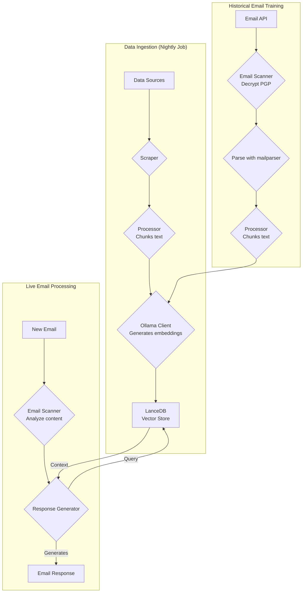
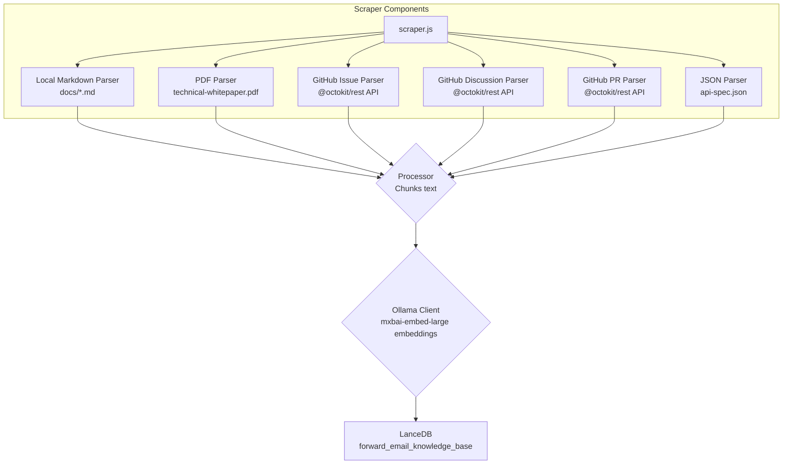
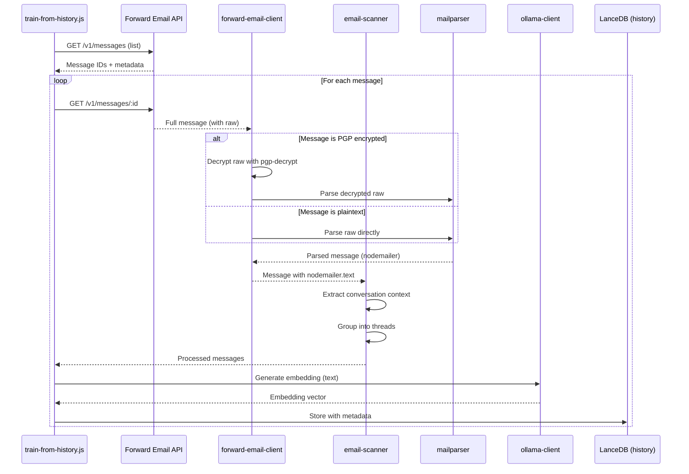

# בניית סוכן תמיכת לקוחות מבוסס בינה מלאכותית עם דגש על פרטיות בעזרת LanceDB, Ollama ו-Node.js {#building-a-privacy-first-ai-customer-support-agent-with-lancedb-ollama-and-nodejs}


> \[!NOTE]
> מסמך זה מתאר את המסע שלנו בבניית סוכן תמיכה מבוסס בינה מלאכותית שמתארח בעצמנו. כתבנו על אתגרים דומים בפוסט הבלוג שלנו [Email Startup Graveyard](https://forwardemail.net/blog/docs/email-startup-graveyard-why-80-percent-email-companies-fail). חשבנו ברצינות לכתוב המשך בשם "AI Startup Graveyard" אבל אולי נצטרך להמתין עוד שנה או כך עד שהבועה של הבינה המלאכותית תתפוצץ(?). לעת עתה, זהו סיכום המחשבות שלנו על מה שעבד, מה שלא עבד, ולמה עשינו זאת כך.

כך בנינו את סוכן התמיכה שלנו מבוסס בינה מלאכותית. עשינו זאת בדרך הקשה: אירוח עצמי, דגש על פרטיות, ושליטה מלאה. למה? כי אנחנו לא סומכים על שירותים צד שלישי עם נתוני הלקוחות שלנו. זה דרישה של GDPR ו-DPA, וזה הדבר הנכון לעשות.

זה לא היה פרויקט כיפי לסוף שבוע. זה היה מסע של חודש שלם של ניווט בין תלותיות שבורות, תיעוד מטעה, וכאוס כללי באקוסיסטם של בינה מלאכותית בקוד פתוח בשנת 2025. מסמך זה הוא תיעוד של מה שבנינו, למה בנינו, ומה המכשולים שפגשנו בדרך.


## תוכן העניינים {#table-of-contents}

* [הטבות ללקוח: תמיכה אנושית משודרגת בבינה מלאכותית](#customer-benefits-ai-augmented-human-support)
  * [תגובות מהירות ומדויקות יותר](#faster-more-accurate-responses)
  * [עקביות ללא שחיקה](#consistency-without-burnout)
  * [מה תקבלו](#what-you-get)
* [הרהור אישי: שני עשורים של עבודה קשה](#a-personal-reflection-the-two-decade-grind)
* [למה פרטיות חשובה](#why-privacy-matters)
* [ניתוח עלויות: בינה מלאכותית בענן מול אירוח עצמי](#cost-analysis-cloud-ai-vs-self-hosted)
  * [השוואת שירותי בינה מלאכותית בענן](#cloud-ai-service-comparison)
  * [פירוט עלויות: בסיס ידע של 5GB](#cost-breakdown-5gb-knowledge-base)
  * [עלויות חומרה לאירוח עצמי](#self-hosted-hardware-costs)
* [שימוש עצמי ב-API שלנו](#dogfooding-our-own-api)
  * [למה שימוש עצמי חשוב](#why-dogfooding-matters)
  * [דוגמאות לשימוש ב-API](#api-usage-examples)
  * [הטבות בביצועים](#performance-benefits)
* [ארכיטקטורת הצפנה](#encryption-architecture)
  * [שכבה 1: הצפנת תיבת דואר (chacha20-poly1305)](#layer-1-mailbox-encryption-chacha20-poly1305)
  * [שכבה 2: הצפנת PGP ברמת ההודעה](#layer-2-message-level-pgp-encryption)
  * [למה זה חשוב לאימון](#why-this-matters-for-training)
  * [אבטחת אחסון](#storage-security)
  * [אחסון מקומי הוא פרקטיקה סטנדרטית](#local-storage-is-standard-practice)
* [הארכיטקטורה](#the-architecture)
  * [זרימה ברמה גבוהה](#high-level-flow)
  * [זרימת סקרייפר מפורטת](#detailed-scraper-flow)
* [איך זה עובד](#how-it-works)
  * [בניית בסיס הידע](#building-the-knowledge-base)
  * [אימון מתוך מיילים היסטוריים](#training-from-historical-emails)
  * [עיבוד מיילים נכנסים](#processing-incoming-emails)
  * [ניהול מאגר וקטורים](#vector-store-management)
* [בית הקברות של מאגרי הוקטורים](#the-vector-database-graveyard)
* [דרישות מערכת](#system-requirements)
* [הגדרת משימות Cron](#cron-job-configuration)
  * [משתני סביבה](#environment-variables)
  * [משימות Cron לתיבות דואר מרובות](#cron-jobs-for-multiple-inboxes)
  * [פירוט לוח זמנים של Cron](#cron-schedule-breakdown)
  * [חישוב תאריכים דינמי](#dynamic-date-calculation)
  * [הגדרה ראשונית: חילוץ רשימת URL מ-sitemap](#initial-setup-extract-url-list-from-sitemap)
  * [בדיקת משימות Cron ידנית](#testing-cron-jobs-manually)
  * [ניטור לוגים](#monitoring-logs)
* [דוגמאות קוד](#code-examples)
  * [סריקה ועיבוד](#scraping-and-processing)
  * [אימון מתוך מיילים היסטוריים](#training-from-historical-emails-1)
  * [שאילתות להקשר](#querying-for-context)
* [העתיד: מחקר ופיתוח של סורק ספאם](#the-future-spam-scanner-rd)
* [פתרון בעיות](#troubleshooting)
  * [שגיאת אי התאמת מימדי וקטור](#vector-dimension-mismatch-error)
  * [הקשר ריק בבסיס הידע](#empty-knowledge-base-context)
  * [כשלונות בפענוח PGP](#pgp-decryption-failures)
* [טיפים לשימוש](#usage-tips)
  * [השגת Inbox Zero](#achieving-inbox-zero)
  * [שימוש בתווית skip-ai](#using-the-skip-ai-label)
  * [שרשור מיילים ו-reply-all](#email-threading-and-reply-all)
  * [ניטור ותחזוקה](#monitoring-and-maintenance)
* [בדיקות](#testing)
  * [הרצת בדיקות](#running-tests)
  * [כיסוי בדיקות](#test-coverage)
  * [סביבת בדיקה](#test-environment)
* [מסקנות מרכזיות](#key-takeaways)
## יתרונות ללקוח: תמיכה אנושית משולבת בינה מלאכותית {#customer-benefits-ai-augmented-human-support}

מערכת הבינה המלאכותית שלנו לא מחליפה את צוות התמיכה שלנו — היא משפרת אותם. הנה מה שזה אומר עבורך:

### תגובות מהירות ומדויקות יותר {#faster-more-accurate-responses}

**אדם בלולאה**: כל טיוטה שנוצרה על ידי הבינה המלאכותית נבדקת, נערכת ומותאמת על ידי צוות התמיכה האנושי שלנו לפני שנשלחת אליך. הבינה המלאכותית מטפלת במחקר הראשוני ובכתיבת הטיוטה, ומשחררת את הצוות שלנו להתמקד בבקרת איכות ובהתאמה אישית.

**מאומנת על מומחיות אנושית**: הבינה המלאכותית לומדת מ:

* בסיס הידע והתיעוד הכתוב ביד שלנו
* פוסטים בבלוג ומדריכים שנכתבו על ידי בני אדם
* שאלות נפוצות מקיפות שלנו (נכתבו על ידי בני אדם)
* שיחות קודמות עם לקוחות (הכול מטופל על ידי בני אדם אמיתיים)

אתה מקבל תגובות שמבוססות על שנים של מומחיות אנושית, רק שמסופקות מהר יותר.

### עקביות ללא שחיקה {#consistency-without-burnout}

הצוות הקטן שלנו מטפל במאות בקשות תמיכה מדי יום, שכל אחת דורשת ידע טכני שונה והחלפת הקשר מנטלית:

* שאלות חשבוניות דורשות ידע במערכות פיננסיות
* בעיות DNS דורשות מומחיות ברשתות
* אינטגרציית API דורשת ידע בתכנות
* דיווחי אבטחה דורשים הערכת פגיעויות

ללא סיוע בינה מלאכותית, החלפת ההקשר המתמדת הזו מובילה ל:

* זמני תגובה איטיים יותר
* טעויות אנוש כתוצאה מעייפות
* איכות תשובות לא עקבית
* שחיקת הצוות

**עם שיפור הבינה המלאכותית**, הצוות שלנו:

* מגיב מהר יותר (הבינה המלאכותית מנסחת טיוטות בשניות)
* עושה פחות טעויות (הבינה המלאכותית תופסת טעויות נפוצות)
* שומר על איכות עקבית (הבינה המלאכותית מתבססת על אותו בסיס ידע בכל פעם)
* נשאר רענן וממוקד (פחות זמן מחקר, יותר זמן לעזרה)

### מה אתה מקבל {#what-you-get}

✅ **מהירות**: הבינה המלאכותית מנסחת תגובות בשניות, בני אדם בודקים ושולחים תוך דקות

✅ **דיוק**: תגובות מבוססות על התיעוד והפתרונות הקודמים שלנו

✅ **עקביות**: אותן תשובות איכותיות בין אם זה 9 בבוקר או 9 בערב

✅ **נגיעה אנושית**: כל תגובה נבדקת ומותאמת אישית על ידי הצוות שלנו

✅ **ללא הזיות**: הבינה המלאכותית משתמשת רק בבסיס הידע המאומת שלנו, לא בנתונים כלליים מהאינטרנט

> \[!NOTE]
> **אתה תמיד מדבר עם בני אדם**. הבינה המלאכותית היא עוזר מחקר שעוזר לצוות שלנו למצוא את התשובה הנכונה מהר יותר. תחשוב עליה כמו על ספרן שמוצא מיד את הספר הרלוונטי — אבל עדיין אדם קורא אותו ומסביר לך.


## הרהור אישי: שני עשורים של מאמץ {#a-personal-reflection-the-two-decade-grind}

לפני שנצלול לפרטים הטכניים, הערה אישית. אני עוסק בזה כמעט שני עשורים. השעות האינסופיות מול המקלדת, המרדף הבלתי פוסק אחרי פתרון, המאמץ העמוק והממוקד – זו המציאות של בניית משהו משמעותי. מציאות שלרוב מתעלמים ממנה במחזורי ההייפ של טכנולוגיות חדשות.

הפריצה האחרונה של הבינה המלאכותית הייתה מתסכלת במיוחד. מוכרים לנו חלום של אוטומציה, של עוזרי בינה מלאכותית שיכתבו את הקוד שלנו ויפתרו את הבעיות שלנו. המציאות? הפלט הוא לעיתים קרובות קוד זבל שדורש יותר זמן לתיקון מאשר לכתיבה מאפס. ההבטחה להקל על חיינו היא שקרית. זו הסחת דעת מהעבודה הקשה והנחוצה של הבנייה.

ואז יש את הדילמה של תרומה לקוד פתוח. אתה כבר מותש, עייף מהמאמץ. אתה משתמש בבינה מלאכותית כדי לעזור לך לכתוב דיווח באגים מפורט ומסודר, בתקווה להקל על המתחזקים להבין ולתקן את הבעיה. ומה קורה? אתה מקבל נזיפה. התרומה שלך נדחית כ"לא רלוונטית" או בעלת מאמץ נמוך, כפי שראינו ב-[נושא GitHub של Node.js](https://github.com/nodejs/node/issues/60719#issuecomment-3534304321) לאחרונה. זו סטירה לפנים למפתחים בכירים שמנסים רק לעזור.

זו המציאות של האקוסיסטם שבו אנחנו עובדים. זה לא רק על כלים שבורים; זה על תרבות שלעיתים קרובות לא מכבדת את הזמן ו-[המאמץ של התורמים שלה](https://forwardemail.net/blog/docs/how-npm-packages-billion-downloads-shaped-javascript-ecosystem). הפוסט הזה הוא תיעוד של המציאות הזו. זו סיפור על הכלים, כן, אבל גם על המחיר האנושי של בנייה באקוסיסטם שבור שהוא, למרות כל ההבטחות, שבור ביסודו.
## למה פרטיות חשובה {#why-privacy-matters}

ה[מסמך הטכני שלנו](https://forwardemail.net/technical-whitepaper.pdf) מכסה לעומק את הפילוסופיה שלנו לגבי פרטיות. הגרסה הקצרה: אנחנו לא שולחים נתוני לקוחות לצדדים שלישיים. אף פעם. זאת אומרת, לא ל-OpenAI, לא ל-Anthropic, ולא למסדי נתונים וקטוריים בענן. הכל רץ מקומית על התשתית שלנו. זה לא ניתן למשא ומתן לצורך עמידה ב-GDPR ובהתחייבויות ה-DPA שלנו.


## ניתוח עלויות: AI בענן מול אירוח עצמי {#cost-analysis-cloud-ai-vs-self-hosted}

לפני שנכנסים למימוש הטכני, נדבר למה אירוח עצמי חשוב מבחינת עלויות. מודלי התמחור של שירותי AI בענן הופכים אותם ליקרים מאוד לשימושים בהיקף גבוה כמו תמיכת לקוחות.

### השוואת שירותי AI בענן {#cloud-ai-service-comparison}

| שירות          | ספק                 | עלות הטמעה                                                    | עלות LLM (קלט)                                                            | עלות LLM (פלט)         | מדיניות פרטיות                                     | GDPR/DPA        | אירוח             | שיתוף נתונים     |
| --------------- | ------------------- | ------------------------------------------------------------- | -------------------------------------------------------------------------- | ---------------------- | --------------------------------------------------- | --------------- | ----------------- | ----------------- |
| **OpenAI**      | OpenAI (ארה"ב)      | [$0.02-0.13/1M tokens](https://openai.com/api/pricing/)       | $0.15-20/1M tokens                                                         | $0.60-80/1M tokens     | [קישור](https://openai.com/policies/privacy-policy/) | DPA מוגבל       | Azure (ארה"ב)     | כן (אימון)        |
| **Claude**      | Anthropic (ארה"ב)   | N/A                                                           | [$3-20/1M tokens](https://docs.claude.com/en/docs/about-claude/pricing)    | $15-80/1M tokens       | [קישור](https://www.anthropic.com/legal/privacy)     | DPA מוגבל       | AWS/GCP (ארה"ב)   | לא (לטענתם)       |
| **Gemini**      | Google (ארה"ב)      | [$0.15/1M tokens](https://ai.google.dev/gemini-api/docs/pricing) | $0.30-1.00/1M tokens                                                       | $2.50/1M tokens        | [קישור](https://policies.google.com/privacy)         | DPA מוגבל       | GCP (ארה"ב)       | כן (שיפור)        |
| **DeepSeek**    | DeepSeek (סין)      | N/A                                                           | [$0.028-0.28/1M tokens](https://api-docs.deepseek.com/quick_start/pricing) | $0.42/1M tokens        | [קישור](https://www.deepseek.com/en)                 | לא ידוע         | סין               | לא ידוע           |
| **Mistral**     | Mistral AI (צרפת)   | [$0.10/1M tokens](https://mistral.ai/pricing)                 | $0.40/1M tokens                                                            | $2.00/1M tokens        | [קישור](https://mistral.ai/terms/)                   | GDPR אירופאי    | אירופה            | לא ידוע           |
| **אירוח עצמי**  | אתה                 | $0 (חומרה קיימת)                                             | $0 (חומרה קיימת)                                                          | $0 (חומרה קיימת)      | המדיניות שלך                                      | עמידה מלאה     | MacBook M5 + cron | אף פעם            |

> \[!WARNING]
> **חששות לגבי ריבונות נתונים**: ספקים מארה"ב (OpenAI, Claude, Gemini) כפופים ל-CLOUD Act, המאפשר לממשלת ארה"ב גישה לנתונים. DeepSeek (סין) פועל תחת חוקי הנתונים הסיניים. בעוד Mistral (צרפת) מציע אירוח באירופה ועמידה ב-GDPR, אירוח עצמי נשאר האפשרות היחידה לריבונות ושליטה מלאה בנתונים.

### פירוט עלויות: בסיס ידע של 5GB {#cost-breakdown-5gb-knowledge-base}

בואו נחשב את עלות עיבוד בסיס ידע של 5GB (טיפוסי לחברה בגודל בינוני עם מסמכים, מיילים והיסטוריית תמיכה).

**הנחות:**

* 5GB טקסט ≈ 1.25 מיליארד טוקנים (בהנחה של כ-4 תווים לטוקן)
* יצירת הטמעה ראשונית
* אימון מחדש חודשי (הטמעה מחדש מלאה)
* 10,000 פניות תמיכה בחודש
* פנייה ממוצעת: 500 טוקנים קלט, 300 טוקנים פלט
**פירוט עלויות מפורט:**

| רכיב                                  | OpenAI           | Claude          | Gemini               | Self-Hosted        |
| -------------------------------------- | ---------------- | --------------- | -------------------- | ------------------ |
| **הטמעה ראשונית** (1.25 מיליארד טוקנים) | $25,000          | N/A             | $187,500             | $0                 |
| **שאילתות חודשיות** (10K × 800 טוקנים) | $1,200-16,000    | $2,400-16,000   | $2,400-3,200         | $0                 |
| **אימון מחדש חודשי** (1.25 מיליארד טוקנים) | $25,000          | N/A             | $187,500             | $0                 |
| **סך הכל לשנה ראשונה**                 | $325,200-217,000 | $28,800-192,000 | $2,278,800-2,226,000 | ~$60 (חשמל)        |
| **עמידה בפרטיות**                     | ❌ מוגבל          | ❌ מוגבל         | ❌ מוגבל              | ✅ מלא              |
| **ריבונות נתונים**                   | ❌ לא             | ❌ לא            | ❌ לא                 | ✅ כן               |

> \[!CAUTION]
> **העלויות של ההטמעה בג'מיני הן קטסטרופליות** במחיר של $0.15 ל-1 מיליון טוקנים. הטמעה של בסיס ידע בגודל 5GB תעלה $187,500. זה יקר פי 37 מ-OpenAI והופך את זה לבלתי שמיש לחלוטין בייצור.

### עלויות חומרה עצמית {#self-hosted-hardware-costs}

המערכת שלנו פועלת על חומרה קיימת שבבעלותנו:

* **חומרה**: MacBook M5 (כבר בבעלות לפיתוח)
* **עלות נוספת**: $0 (משתמשים בחומרה קיימת)
* **חשמל**: \~$5 לחודש (הערכה)
* **סך הכל לשנה ראשונה**: \~$60
* **מתמשך**: $60 לשנה

**תשואה על ההשקעה**: אירוח עצמי כמעט ללא עלות שולית מכיוון שאנו משתמשים בחומרת פיתוח קיימת. המערכת פועלת באמצעות משימות cron בשעות לא שיא.

## שימוש פנימי ב-API שלנו {#dogfooding-our-own-api}

אחת ההחלטות האדריכליות החשובות שקיבלנו הייתה שכל עבודות ה-AI ישתמשו ישירות ב-[Forward Email API](https://forwardemail.net/email-api). זה לא רק פרקטיקה טובה — זו פונקציה שמכריחה אופטימיזציה של ביצועים.

### למה שימוש פנימי חשוב {#why-dogfooding-matters}

כאשר עבודות ה-AI שלנו משתמשות באותם נקודות קצה API כמו הלקוחות שלנו:

1. **צווארי בקבוק בביצועים משפיעים עלינו ראשונים** - אנו מרגישים את הכאב לפני הלקוחות
2. **אופטימיזציה מועילה לכולם** - שיפורים לעבודה שלנו משפרים אוטומטית את חוויית הלקוח
3. **בדיקות בעולם האמיתי** - העבודות שלנו מעבדות אלפי מיילים, ומספקות בדיקות עומס רציפות
4. **שימוש חוזר בקוד** - אותן לוגיקות אימות, הגבלת קצב, טיפול בשגיאות ומטמון

### דוגמאות לשימוש ב-API {#api-usage-examples}

**רשימת הודעות (train-from-history.js):**

```javascript
// Uses GET /v1/messages?folder=INBOX with BasicAuth
// Excludes eml, raw, nodemailer to reduce response size (only need IDs)
const response = await axios.get(
  `${this.apiBase}/v1/messages`,
  {
    params: {
      folder: 'INBOX',
      limit: 100,
      eml: false,
      raw: false,
      nodemailer: false
    },
    auth: {
      username: process.env.FORWARD_EMAIL_ALIAS_USERNAME,
      password: process.env.FORWARD_EMAIL_ALIAS_PASSWORD
    }
  }
);

const messages = response.data;
// Returns: [{ id, subject, date, ... }, ...]
// Full message content fetched later via GET /v1/messages/:id
```

**שליפת הודעות מלאות (forward-email-client.js):**

```javascript
// Uses GET /v1/messages/:id to get full message with raw content
const response = await axios.get(
  `${this.apiBase}/v1/messages/${messageId}`,
  {
    auth: {
      username: this.aliasUsername,
      password: this.aliasPassword
    }
  }
);

const message = response.data;
// Returns: { id, subject, raw, eml, nodemailer: { ... }, ... }
```

**יצירת טיוטות תגובה (process-inbox.js):**

```javascript
// Uses POST /v1/messages to create draft replies
const response = await axios.post(
  `${this.apiBase}/v1/messages`,
  {
    folder: 'Drafts',
    subject: `Re: ${originalSubject}`,
    to: senderEmail,
    text: generatedResponse,
    inReplyTo: originalMessageId
  },
  {
    auth: {
      username: process.env.FORWARD_EMAIL_ALIAS_USERNAME,
      password: process.env.FORWARD_EMAIL_ALIAS_PASSWORD
    }
  }
);
```
### יתרונות ביצועים {#performance-benefits}

מכיוון שהעבודות של ה-AI שלנו רצות על אותה תשתית API:

* **אופטימיזציות מטמון** מועילות גם לעבודה וגם ללקוחות
* **הגבלת קצב** נבדקת תחת עומס אמיתי
* **טיפול בשגיאות** נבדק בשטח
* **זמני תגובה של ה-API** מנוטרים כל הזמן
* **שאילתות למסד הנתונים** מותאמות לשני מקרי השימוש
* **אופטימיזציה של רוחב פס** - החרגת `eml`, `raw`, `nodemailer` ברשימה מפחיתה את גודל התגובה בכ-90%

כאשר `train-from-history.js` מעבד 1,000 מיילים, הוא מבצע מעל 1,000 קריאות API. כל חוסר יעילות ב-API מתגלה מיד. זה מאלץ אותנו לאופטימיזציה של גישת IMAP, שאילתות למסד הנתונים וסיריאליזציה של התגובה — שיפורים שמועילים ישירות ללקוחות שלנו.

**דוגמת אופטימיזציה**: רשימת 100 הודעות עם תוכן מלא = תגובה של כ-10MB. רשימה עם `eml: false, raw: false, nodemailer: false` = תגובה של כ-100KB (קטן פי 100).


## ארכיטקטורת הצפנה {#encryption-architecture}

אחסון המיילים שלנו משתמש בשכבות הצפנה מרובות, שהעבודות של ה-AI חייבות לפענח בזמן אמת לצורך אימון.

### שכבה 1: הצפנת תיבת דואר (chacha20-poly1305) {#layer-1-mailbox-encryption-chacha20-poly1305}

כל תיבות הדואר ב-IMAP מאוחסנות כקבצי מסד נתונים SQLite מוצפנים עם **chacha20-poly1305**, אלגוריתם הצפנה עמיד בפני מחשוב קוונטי. זה מפורט בפוסט הבלוג שלנו על [שירות מייל מוצפן עמיד בפני קוונטים](https://forwardemail.net/blog/docs/best-quantum-safe-encrypted-email-service).

**תכונות מפתח:**

* **אלגוריתם**: ChaCha20-Poly1305 (צופן AEAD)
* **עמידות קוונטית**: עמיד בפני התקפות מחשוב קוונטי
* **אחסון**: קבצי מסד נתונים SQLite בדיסק
* **גישה**: מפוענח בזיכרון בעת גישה דרך IMAP/API

### שכבה 2: הצפנת PGP ברמת ההודעה {#layer-2-message-level-pgp-encryption}

רבים מהמיילים התומכים מוצפנים בנוסף עם PGP (תקן OpenPGP). העבודות של ה-AI חייבות לפענח אותם כדי לחלץ תוכן לאימון.

**זרימת פענוח:**

```javascript
// 1. ה-API מחזיר הודעה עם תוכן גולמי מוצפן
const message = await forwardEmailClient.getMessage(id);

// 2. בדוק אם התוכן הגולמי מוצפן ב-PGP
if (isMessageEncrypted(message.raw)) {
  // 3. פענח עם המפתח הפרטי שלנו
  const decryptedRaw = await pgpDecrypt(message.raw);

  // 4. נתח את הודעת MIME המפוענחת
  const parsed = await simpleParser(decryptedRaw);

  // 5. מלא את nodemailer בתוכן מפוענח
  message.nodemailer = {
    text: parsed.text,
    html: parsed.html,
    from: parsed.from,
    to: parsed.to,
    subject: parsed.subject,
    date: parsed.date
  };
}
```

**הגדרות PGP:**

```bash
# מפתח פרטי לפענוח (נתיב לקובץ מפתח ASCII-armored)
GPG_SECURITY_KEY="/path/to/private-key.asc"

# סיסמת מפתח פרטי (אם מוצפן)
GPG_SECURITY_PASSPHRASE="your-passphrase"
```

העזר `pgp-decrypt.js`:

1. קורא את המפתח הפרטי מהדיסק פעם אחת (מטמון בזיכרון)
2. מפענח את המפתח עם הסיסמה
3. משתמש במפתח המפוענח לכל פענוח ההודעות
4. תומך בפענוח רקורסיבי להודעות מוצפנות מקוננות

### למה זה חשוב לאימון {#why-this-matters-for-training}

ללא פענוח נכון, ה-AI היה מתאמן על טקסט מוצפן בלתי קריא:

```
-----BEGIN PGP MESSAGE-----
Version: OpenPGP.js v4.10.10

wcBMA8Z3lHJnFnNUAQgAqK7F8...
-----END PGP MESSAGE-----
```

עם הפענוח, ה-AI מתאמן על תוכן אמיתי:

```
Subject: Re: Bug Report

Hi John,

Thanks for reporting this issue. I've confirmed the bug
and created a fix in PR #1234...
```

### אבטחת אחסון {#storage-security}

הפענוח מתבצע בזיכרון במהלך ביצוע העבודה, והתוכן המפוענח מומר לאמבדים (embeddings) שנשמרים במסד הנתונים הווקטורי LanceDB בדיסק.

**איפה הנתונים מאוחסנים:**

* **מסד נתונים וקטורי**: מאוחסן על תחנות עבודה MacBook M5 מוצפנות
* **אבטחה פיזית**: תחנות העבודה נשארות איתנו כל הזמן (לא במרכזי נתונים)
* **הצפנת דיסק**: הצפנת דיסק מלאה בכל תחנות העבודה
* **אבטחת רשת**: מבודדות ומוגנות בחומת אש מהרשתות הציבוריות

**פריסת מרכז נתונים עתידית:**
אם נעבור לאירוח במרכז נתונים, השרתים יכללו:

* הצפנת דיסק מלאה LUKS
* ניתוק גישת USB
* אמצעי אבטחה פיזיים
* בידוד רשת
לפרטים מלאים על נהלי האבטחה שלנו, ראה את [דף האבטחה](https://forwardemail.net/en/security).

> \[!NOTE]
> מסד הנתונים הווקטורי מכיל הטמעות (ייצוגים מתמטיים), לא את הטקסט המקורי. עם זאת, ניתן לתכנן מחדש את ההטמעות, ולכן אנו שומרים אותן על תחנות עבודה מוצפנות ומאובטחות פיזית.

### אחסון מקומי הוא פרקטיקה סטנדרטית {#local-storage-is-standard-practice}

אחסון ההטמעות על תחנות העבודה של הצוות שלנו אינו שונה מהאופן שבו אנו כבר מטפלים בדואר אלקטרוני:

* **Thunderbird**: מוריד ושומר את תוכן הדואר המלא מקומית בקבצי mbox/maildir
* **לקוחות דואר אינטרנטיים**: מטמינים נתוני דואר בזיכרון הדפדפן ובמסדי נתונים מקומיים
* **לקוחות IMAP**: שומרים עותקים מקומיים של הודעות לגישה לא מקוונת
* **מערכת ה-AI שלנו**: מאחסנת הטמעות מתמטיות (לא טקסט רגיל) ב-LanceDB

ההבדל המרכזי: ההטמעות **מאובטחות יותר** מדואר אלקטרוני בטקסט רגיל כי הן:

1. ייצוגים מתמטיים, לא טקסט קריא
2. קשות יותר לתכנון מחדש מאשר טקסט רגיל
3. עדיין כפופות לאותה אבטחה פיזית כמו לקוחות הדואר שלנו

אם זה מקובל שהצוות שלנו ישתמש ב-Thunderbird או בדואר אינטרנטי על תחנות עבודה מוצפנות, זה מקובל באותה מידה (ואף בטוח יותר לטעמנו) לאחסן הטמעות באותו אופן.


## הארכיטקטורה {#the-architecture}

הנה הזרימה הבסיסית. זה נראה פשוט. זה לא היה.

> \[!NOTE]
> כל המשימות משתמשות ישירות ב-Forward Email API, מה שמבטיח ששיפורי ביצועים יועילו גם למערכת ה-AI שלנו וגם ללקוחותינו.

### זרימה ברמה גבוהה {#high-level-flow}



### זרימת הסקרייפר המפורטת {#detailed-scraper-flow}

ה-`scraper.js` הוא הלב של קליטת הנתונים. זו אוסף של מפענחים לפורמטים שונים של נתונים.




## איך זה עובד {#how-it-works}

התהליך מחולק לשלושה חלקים עיקריים: בניית בסיס הידע, אימון מדואר אלקטרוני היסטורי, ועיבוד דואר חדש.

### בניית בסיס הידע {#building-the-knowledge-base}

**`update-knowledge-base.js`**: זו המשימה הראשית. היא רצה מדי לילה, מנקה את מאגר הווקטורים הישן, ובונה אותו מחדש מההתחלה. היא משתמשת ב-`scraper.js` כדי לאסוף תוכן מכל המקורות, ב-`processor.js` כדי לחלק אותו לחלקים, וב-`ollama-client.js` כדי ליצור הטמעות. לבסוף, `vector-store.js` שומר הכל ב-LanceDB.

**מקורות נתונים:**

* קבצי Markdown מקומיים (`docs/*.md`)
* קובץ PDF של נייר לבן טכני (`assets/technical-whitepaper.pdf`)
* JSON של מפרט API (`assets/api-spec.json`)
* נושאים ב-GitHub (דרך Octokit)
* דיונים ב-GitHub (דרך Octokit)
* בקשות משיכה ב-GitHub (דרך Octokit)
* רשימת כתובות URL של מפת אתר (`$LANCEDB_PATH/valid-urls.json`)

### אימון מדואר אלקטרוני היסטורי {#training-from-historical-emails}

**`train-from-history.js`**: משימה זו סורקת מיילים היסטוריים מכל התיקיות, מפענחת הודעות מוצפנות ב-PGP, ומוסיפה אותן למאגר וקטורי נפרד (`customer_support_history`). זה מספק הקשר מאינטראקציות תמיכה קודמות.
**זרימת עיבוד דואר אלקטרוני:**



**תכונות עיקריות:**

* **פענוח PGP**: משתמש בעזר `pgp-decrypt.js` עם משתנה הסביבה `GPG_SECURITY_KEY`
* **קיבוץ שיחות**: מקבץ מיילים קשורים לתוך שרשורי שיחה
* **שימור מטא-דאטה**: מאחסן תיקייה, נושא, תאריך, מצב הצפנה
* **הקשר תגובה**: מקשר הודעות עם התגובות שלהן להקשר טוב יותר

**הגדרות:**

```bash
# Environment variables for train-from-history
HISTORY_SCAN_LIMIT=1000              # Max messages to process
HISTORY_SCAN_SINCE="2024-01-01"      # Only process messages after this date
HISTORY_DECRYPT_PGP=true             # Attempt PGP decryption
GPG_SECURITY_KEY="/path/to/key.asc"  # Path to PGP private key
GPG_SECURITY_PASSPHRASE="passphrase" # Key passphrase (optional)
```

**מה נשמר:**

```javascript
{
  type: 'historical_email',
  folder: 'INBOX',
  subject: 'Re: Bug Report',
  date: '2025-01-15T10:30:00Z',
  messageId: '67e2f288893921...',
  threadId: 'Bug Report',
  hasReply: true,
  encrypted: true,
  decrypted: true,
  replySubject: 'Bug Report',
  replyText: 'First 500 chars of reply...',
  chunkSize: 1000,
  chunkOverlap: 200,
  chunkIndex: 0
}
```

> \[!TIP]
> הרץ את `train-from-history` לאחר ההגדרה הראשונית כדי למלא את ההקשר ההיסטורי. זה משפר משמעותית את איכות התגובה על ידי למידה מאינטראקציות תמיכה קודמות.

### עיבוד מיילים נכנסים {#processing-incoming-emails}

**`process-inbox.js`**: משימה זו פועלת על מיילים בתיבות הדואר שלנו `support@forwardemail.net`, `abuse@forwardemail.net`, ו-`security@forwardemail.net` (במיוחד בתיקיית IMAP `INBOX`). היא מנצלת את ה-API שלנו בכתובת <https://forwardemail.net/email-api> (למשל `GET /v1/messages?folder=INBOX` עם גישת BasicAuth באמצעות אישורי IMAP של כל תיבה). היא מנתחת את תוכן המייל, מבצעת שאילתות הן לבסיס הידע (`forward_email_knowledge_base`) והן לאחסון וקטורי של מיילים היסטוריים (`customer_support_history`), ואז מעבירה את ההקשר המשולב ל-`response-generator.js`. הגנרטור משתמש ב-`mxbai-embed-large` דרך Ollama ליצירת תגובה.

**תכונות זרימת עבודה אוטומטית:**

1. **אוטומציה לאינבוקס ריק**: לאחר יצירת טיוטה בהצלחה, ההודעה המקורית מועברת אוטומטית לתיקיית הארכיון. זה שומר על תיבת הדואר נקייה ועוזר להגיע לאינבוקס ריק ללא התערבות ידנית.

2. **דלג על עיבוד AI**: פשוט הוסף תווית `skip-ai` (לא תלוי רישיות) לכל הודעה כדי למנוע עיבוד AI. ההודעה תישאר בתיבת הדואר ללא שינוי, ותוכל לטפל בה ידנית. זה שימושי להודעות רגישות או מקרים מורכבים שדורשים שיקול דעת אנושי.

3. **שרשור מיילים תקין**: כל תגובות הטיוטה כוללות את ההודעה המקורית מצוטטת למטה (באמצעות קידומת סטנדרטית ` >  `), בהתאם לנוהלי תגובה במייל עם הפורמט "בתאריך \[date], \[sender] כתב:". זה מבטיח הקשר שיחה ושרשור תקינים בלקוחות דואר אלקטרוני.

4. **התנהגות השב לכולם**: המערכת מטפלת אוטומטית בכותרות Reply-To ובנמעני CC:
   * אם קיימת כותרת Reply-To, היא הופכת לכתובת To והכתובת המקורית From מתווספת ל-CC
   * כל נמעני To ו-CC המקוריים נכללים ב-CC של התגובה (למעט הכתובת שלך)
   * עוקבת אחרי נוהלי תגובה לכולם סטנדרטיים לשיחות קבוצתיות
**דירוג מקורות**: המערכת משתמשת ב**דירוג משוקלל** כדי לתת עדיפות למקורות:

* שאלות נפוצות: 100% (עדיפות עליונה)
* נייר טכני: 95%
* מפרט API: 90%
* תיעוד רשמי: 85%
* בעיות GitHub: 70%
* מיילים היסטוריים: 50%

### ניהול מאגר וקטורים {#vector-store-management}

מחלקת `VectorStore` בקובץ `helpers/customer-support-ai/vector-store.js` היא הממשק שלנו ל-LanceDB.

**הוספת מסמכים:**

```javascript
// vector-store.js
async addDocument(text, metadata) {
  const embedding = await this.ollama.generateEmbedding(text);
  await this.table.add([{
    vector: embedding,
    text,
    ...metadata
  }]);
}
```

**ניקוי המאגר:**

```javascript
// Option 1: Use the clear() method
await vectorStore.clear();

// Option 2: Delete the local database directory
await fs.rm(process.env.LANCEDB_PATH, { recursive: true, force: true });
```

משתנה הסביבה `LANCEDB_PATH` מצביע על תיקיית מסד הנתונים המקומית המוטמעת. LanceDB הוא ללא שרת ומוטמע, כך שאין תהליך נפרד לניהול.


## בית הקברות של מסדי הנתונים הוקטוריים {#the-vector-database-graveyard}

זה היה המחסום הראשוני הגדול. ניסינו מספר מסדי נתונים וקטוריים לפני שהחלטנו על LanceDB. הנה מה שהשתבש בכל אחד מהם.

| מסד נתונים  | GitHub                                                      | מה השתבש                                                                                                                                                                                                          | בעיות ספציפיות                                                                                                                                                                                                                                                                                                                                                           | חששות אבטחה                                                                                                                                                                                                    |
| ------------ | ----------------------------------------------------------- | ---------------------------------------------------------------------------------------------------------------------------------------------------------------------------------------------------------------- | ------------------------------------------------------------------------------------------------------------------------------------------------------------------------------------------------------------------------------------------------------------------------------------------------------------------------------------------------------------------------- | ---------------------------------------------------------------------------------------------------------------------------------------------------------------------------------------------------------------- |
| **ChromaDB** | [chroma-core/chroma](https://github.com/chroma-core/chroma) | הפקודה `pip3 install chromadb` נותנת לך גרסה מימי קדם עם `PydanticImportError`. הדרך היחידה לקבל גרסה עובדת היא לקמפל מהמקור. לא ידידותי למפתחים.                                                          | כאוס תלות בפייתון. משתמשים רבים מדווחים על התקנות pip שבורות ([#774](https://github.com/chroma-core/chroma/issues/774), [#163](https://github.com/chroma-core/chroma/issues/163)). התיעוד אומר "פשוט השתמש בדוקר" שזה לא פתרון לפיתוח מקומי. קורסת ב-Windows עם >99 רשומות ([#3058](https://github.com/chroma-core/chroma/issues/3058)). | **CVE-2024-45848**: הרצת קוד שרירותית דרך אינטגרציה של ChromaDB ב-MindsDB. פרצות קריטיות במערכת ההפעלה בתמונת Docker ([#3170](https://github.com/chroma-core/chroma/issues/3170)).                      |
| **Qdrant**   | [qdrant/qdrant](https://github.com/qdrant/qdrant)           | ה-Homebrew tap (`qdrant/qdrant/qdrant`) שהוזכר בתיעוד הישן שלהם נעלם. נעלם. ללא הסבר. התיעוד הרשמי כעת פשוט אומר "השתמש בדוקר."                                                                             | חסר Homebrew tap. אין בינארי מקומי ל-macOS. שימוש רק בדוקר מהווה מחסום לבדיקות מקומיות מהירות.                                                                                                                                                                                                                                                                       | **CVE-2024-2221**: פרצת העלאת קבצים המאפשרת הרצת קוד מרחוק (תוקן בגרסה 1.9.0). ציון בגרות אבטחה נמוך מ-[IronCore Labs](https://ironcorelabs.com/vectordbs/qdrant-security/).                         |
| **Weaviate** | [weaviate/weaviate](https://github.com/weaviate/weaviate)   | גרסת Homebrew סבלה מבאג קריטי באשכול (`leader not found`). הדגלים המתועדים לתיקון (`RAFT_JOIN`, `CLUSTER_HOSTNAME`) לא עבדו. שבור ביסודו עבור התקנות חד-צומתיות.                                            | באגים באשכול גם במצב צומת יחיד. מורכב מדי לשימושים פשוטים.                                                                                                                                                                                                                                                                                                               | לא נמצאו CVE משמעותיים, אך המורכבות מגדילה את שטח הפגיעה.                                                                                                                                                      |
| **LanceDB**  | [lancedb/lancedb](https://github.com/lancedb/lancedb)       | זה עבד. הוא מוטמע וללא שרת. אין תהליך נפרד. הדבר היחיד שמטריד הוא השם המבלבל של החבילה (`vectordb` מיושן, יש להשתמש ב-`@lancedb/lancedb`) והתיעוד מפוזר. אנחנו מסתדרים עם זה.                             | בלבול בשמות החבילות (`vectordb` מול `@lancedb/lancedb`), אך אחרת יציב. הארכיטקטורה המוטמעת מבטלת קטגוריות שלמות של בעיות אבטחה.                                                                                                                                                                                                                                   | אין CVE ידועים. העיצוב המוטמע מבטל את שטח הפגיעה ברשת.                                                                                                                                                        |
> \[!WARNING]
> **ל-ChromaDB יש פרצות אבטחה קריטיות.** [CVE-2024-45848](https://nvd.nist.gov/vuln/detail/CVE-2024-45848) מאפשר הרצת קוד שרירותית. התקנת pip שבורה באופן יסודי עקב בעיות תלות ב-Pydantic. הימנעו משימוש בפרודקשן.

> \[!WARNING]
> **ל-Qdrant הייתה פרצת RCE בהעלאת קבצים** ([CVE-2024-2221](https://qdrant.tech/blog/cve-2024-2221-response/)) שתוקנה רק בגרסה v1.9.0. אם אתם חייבים להשתמש ב-Qdrant, ודאו שאתם בגרסה העדכנית ביותר.

> \[!CAUTION]
> מערכת האקוסיסטם של מסדי הנתונים הוקטוריים בקוד פתוח היא לא יציבה. אל תסמכו על התיעוד. הניחו שהכל שבור עד שיוכח אחרת. בדקו מקומית לפני התחייבות לערימה.


## דרישות מערכת {#system-requirements}

* **Node.js:** v18.0.0+ ([GitHub](https://github.com/nodejs/node))
* **Ollama:** העדכנית ביותר ([GitHub](https://github.com/ollama/ollama))
* **מודל:** `mxbai-embed-large` דרך Ollama
* **מסד נתונים וקטורי:** LanceDB ([GitHub](https://github.com/lancedb/lancedb))
* **גישה ל-GitHub:** `@octokit/rest` לגרידת בעיות ([GitHub](https://github.com/octokit/rest.js))
* **SQLite:** למסד הנתונים הראשי (דרך `mongoose-to-sqlite`)


## הגדרת משימות Cron {#cron-job-configuration}

כל משימות ה-AI רצות דרך cron על MacBook M5. כך מגדירים את משימות ה-cron שירוצו בחצות בלילה על מספר תיבות דואר.

### משתני סביבה {#environment-variables}

המשימות דורשות את משתני הסביבה האלה. רובם ניתנים להגדרה בקובץ `.env` (נטען דרך `@ladjs/env`), אך `HISTORY_SCAN_SINCE` חייב להיות מחושב דינמית ב-crontab.

**בקובץ `.env`:**

```bash
# אישורי API של Forward Email (משתנים לפי תיבת דואר)
FORWARD_EMAIL_ALIAS_USERNAME=support@forwardemail.net
FORWARD_EMAIL_ALIAS_PASSWORD=your-imap-password

# פענוח PGP (משותף לכל תיבות הדואר)
GPG_SECURITY_KEY=/path/to/private-key.asc
GPG_SECURITY_PASSPHRASE=your-passphrase

# הגדרות סריקה היסטורית
HISTORY_SCAN_LIMIT=1000

# נתיב LanceDB
LANCEDB_PATH=/path/to/lancedb
```

**ב-crontab (מחושב דינמית):**

```bash
# HISTORY_SCAN_SINCE חייב להיות מוגדר בשורה ב-crontab עם חישוב תאריך shell
# לא יכול להיות בקובץ .env כי @ladjs/env לא מבצע eval לפקודות shell
HISTORY_SCAN_SINCE="$(date -v-1d +%Y-%m-%d)"  # macOS
HISTORY_SCAN_SINCE="$(date -d 'yesterday' +%Y-%m-%d)"  # Linux
```

### משימות Cron למספר תיבות דואר {#cron-jobs-for-multiple-inboxes}

ערכו את ה-crontab עם `crontab -e` והוסיפו:

```bash
# עדכון בסיס הידע (רץ פעם אחת, משותף לכל תיבות הדואר)
0 0 * * * cd /path/to/forwardemail.net && LANCEDB_PATH="/path/to/lancedb" GPG_SECURITY_KEY="/path/to/key.asc" GPG_SECURITY_PASSPHRASE="pass" node jobs/customer-support-ai/update-knowledge-base.js >> /var/log/update-knowledge-base.log 2>&1

# אימון מההיסטוריה - support@forwardemail.net
0 0 * * * cd /path/to/forwardemail.net && FORWARD_EMAIL_ALIAS_USERNAME="support@forwardemail.net" FORWARD_EMAIL_ALIAS_PASSWORD="support-password" HISTORY_SCAN_SINCE="$(date -v-1d +%Y-%m-%d)" HISTORY_SCAN_LIMIT=1000 GPG_SECURITY_KEY="/path/to/key.asc" GPG_SECURITY_PASSPHRASE="pass" LANCEDB_PATH="/path/to/lancedb" node jobs/customer-support-ai/train-from-history.js >> /var/log/train-support.log 2>&1

# אימון מההיסטוריה - abuse@forwardemail.net
0 0 * * * cd /path/to/forwardemail.net && FORWARD_EMAIL_ALIAS_USERNAME="abuse@forwardemail.net" FORWARD_EMAIL_ALIAS_PASSWORD="abuse-password" HISTORY_SCAN_SINCE="$(date -v-1d +%Y-%m-%d)" HISTORY_SCAN_LIMIT=1000 GPG_SECURITY_KEY="/path/to/key.asc" GPG_SECURITY_PASSPHRASE="pass" LANCEDB_PATH="/path/to/lancedb" node jobs/customer-support-ai/train-from-history.js >> /var/log/train-abuse.log 2>&1

# אימון מההיסטוריה - security@forwardemail.net
0 0 * * * cd /path/to/forwardemail.net && FORWARD_EMAIL_ALIAS_USERNAME="security@forwardemail.net" FORWARD_EMAIL_ALIAS_PASSWORD="security-password" HISTORY_SCAN_SINCE="$(date -v-1d +%Y-%m-%d)" HISTORY_SCAN_LIMIT=1000 GPG_SECURITY_KEY="/path/to/key.asc" GPG_SECURITY_PASSPHRASE="pass" LANCEDB_PATH="/path/to/lancedb" node jobs/customer-support-ai/train-from-history.js >> /var/log/train-security.log 2>&1

# עיבוד תיבת דואר - support@forwardemail.net
*/5 * * * * cd /path/to/forwardemail.net && FORWARD_EMAIL_ALIAS_USERNAME="support@forwardemail.net" FORWARD_EMAIL_ALIAS_PASSWORD="support-password" GPG_SECURITY_KEY="/path/to/key.asc" GPG_SECURITY_PASSPHRASE="pass" LANCEDB_PATH="/path/to/lancedb" node jobs/customer-support-ai/process-inbox.js >> /var/log/process-support.log 2>&1

# עיבוד תיבת דואר - abuse@forwardemail.net
*/5 * * * * cd /path/to/forwardemail.net && FORWARD_EMAIL_ALIAS_USERNAME="abuse@forwardemail.net" FORWARD_EMAIL_ALIAS_PASSWORD="abuse-password" GPG_SECURITY_KEY="/path/to/key.asc" GPG_SECURITY_PASSPHRASE="pass" LANCEDB_PATH="/path/to/lancedb" node jobs/customer-support-ai/process-inbox.js >> /var/log/process-abuse.log 2>&1

# עיבוד תיבת דואר - security@forwardemail.net
*/5 * * * * cd /path/to/forwardemail.net && FORWARD_EMAIL_ALIAS_USERNAME="security@forwardemail.net" FORWARD_EMAIL_ALIAS_PASSWORD="security-password" GPG_SECURITY_KEY="/path/to/key.asc" GPG_SECURITY_PASSPHRASE="pass" LANCEDB_PATH="/path/to/lancedb" node jobs/customer-support-ai/process-inbox.js >> /var/log/process-security.log 2>&1
```
### פירוט לוח זמנים של Cron {#cron-schedule-breakdown}

| משימה                   | לוח זמנים    | תיאור                                                                             |
| ----------------------- | ------------- | ---------------------------------------------------------------------------------- |
| `train-from-sitemap.js` | `0 0 * * 0`   | שבועי (חצות יום ראשון) - מושך את כל כתובות ה-URL מהמפת אתר ומאמן את בסיס הידע      |
| `train-from-history.js` | `0 0 * * *`   | חצות יומי - סורק את מיילי היום הקודם לפי תיבת דואר                                |
| `process-inbox.js`      | `*/5 * * * *` | כל 5 דקות - מעבד מיילים חדשים ומייצר טיוטות                                        |

### חישוב תאריך דינמי {#dynamic-date-calculation}

המשתנה `HISTORY_SCAN_SINCE` **חייב להיות מחושב ישירות בתוך קובץ ה-crontab** מכיוון ש:

1. קבצי `.env` נקראים כמחרוזות מילוליות על ידי `@ladjs/env`
2. החלפת פקודות shell `$(...)` לא עובדת בקבצי `.env`
3. יש לחשב את התאריך מחדש בכל פעם ש-cron רץ

**הגישה הנכונה (בקובץ crontab):**

```bash
# macOS (תאריך BSD)
HISTORY_SCAN_SINCE="$(date -v-1d +%Y-%m-%d)" node jobs/...

# Linux (תאריך GNU)
HISTORY_SCAN_SINCE="$(date -d 'yesterday' +%Y-%m-%d)" node jobs/...
```

**גישה שגויה (לא עובדת בקובץ .env):**

```bash
# זה ייקרא כמחרוזת מילולית "$(date -v-1d +%Y-%m-%d)"
# ולא יבוצע כפקודת shell
HISTORY_SCAN_SINCE=$(date -v-1d +%Y-%m-%d)
```

זה מבטיח שכל ריצה לילית תחשב את תאריך היום הקודם בצורה דינמית, ומונעת עבודה מיותרת.

### הגדרה ראשונית: חילוץ רשימת כתובות URL מהמפת אתר {#initial-setup-extract-url-list-from-sitemap}

לפני הרצת משימת process-inbox בפעם הראשונה, **חייבים** לחלץ את רשימת כתובות ה-URL מהמפת אתר. זה יוצר מילון של כתובות URL תקינות שה-LLM יכול להתייחס אליהן ומונע הזיות של כתובות URL.

```bash
# הגדרה ראשונית: חילוץ רשימת כתובות URL מהמפת אתר
cd /path/to/forwardemail.net
node jobs/customer-support-ai/train-from-sitemap.js
```

**מה זה עושה:**

1. מושך את כל כתובות ה-URL מ-<https://forwardemail.net/sitemap.xml>
2. מסנן רק כתובות שאינן מקומיות או כתובות /en/ (מונע תוכן כפול)
3. מסיר קידומות שפה (/en/faq → /faq)
4. שומר קובץ JSON פשוט עם רשימת הכתובות ב-`$LANCEDB_PATH/valid-urls.json`
5. ללא זחילה, ללא גרידת מטא-דאטה - רק רשימה שטוחה של כתובות תקינות

**למה זה חשוב:**

* מונע מה-LLM להזות כתובות URL מזויפות כמו `/dashboard` או `/login`
* מספק רשימת כתובות תקינות שהגנרטור יכול להתייחס אליהן
* פשוט, מהיר, ואינו דורש אחסון במסד נתונים וקטורי
* הגנרטור טוען רשימה זו בהפעלה ומכליל אותה בהנחיה

**הוסף ל-crontab לעדכונים שבועיים:**

```bash
# חילוץ רשימת כתובות URL מהמפת אתר - שבועי, חצות יום ראשון
0 0 * * 0 cd /path/to/forwardemail.net && node jobs/customer-support-ai/train-from-sitemap.js >> /var/log/train-sitemap.log 2>&1
```

### בדיקת משימות Cron ידנית {#testing-cron-jobs-manually}

כדי לבדוק משימה לפני הוספה ל-cron:

```bash
# בדיקת אימון מפת אתר
cd /path/to/forwardemail.net
export LANCEDB_PATH="/path/to/lancedb"
node jobs/customer-support-ai/train-from-sitemap.js

# בדיקת אימון תיבת דואר תמיכה
cd /path/to/forwardemail.net
export FORWARD_EMAIL_ALIAS_USERNAME="support@forwardemail.net"
export FORWARD_EMAIL_ALIAS_PASSWORD="support-password"
export HISTORY_SCAN_SINCE="$(date -v-1d +%Y-%m-%d)"
export HISTORY_SCAN_LIMIT=1000
export GPG_SECURITY_KEY="/path/to/key.asc"
export GPG_SECURITY_PASSPHRASE="pass"
export LANCEDB_PATH="/path/to/lancedb"
node jobs/customer-support-ai/train-from-history.js
```

### ניטור לוגים {#monitoring-logs}

כל משימה כותבת ללוג נפרד לנוחות איתור תקלות:

```bash
# צפייה בעיבוד תיבת דואר תמיכה בזמן אמת
tail -f /var/log/process-support.log

# בדיקת ריצת אימון של הלילה האחרון
cat /var/log/train-support.log | grep "$(date -v-1d +%Y-%m-%d)"

# צפייה בכל השגיאות בכל המשימות
grep -i error /var/log/train-*.log /var/log/process-*.log
```

> \[!TIP]
> השתמשו בקבצי לוג נפרדים לכל תיבת דואר כדי לבודד בעיות. אם לתיבת דואר אחת יש בעיות אימות, זה לא יזהם את הלוגים של תיבות אחרות.
## דוגמאות קוד {#code-examples}

### גרידה ועיבוד {#scraping-and-processing}

```javascript
// jobs/customer-support-ai/update-knowledge-base.js
const scraper = new Scraper();
const processor = new Processor();
const ollamaClient = new OllamaClient();
const vectorStore = new VectorStore();

// נקה נתונים ישנים
await vectorStore.clear();

// גרד את כל המקורות
const documents = await scraper.scrapeAll();
console.log(`גרדנו ${documents.length} מסמכים`);

// עיבוד לחתיכות
const allChunks = [];
for (const doc of documents) {
  const chunks = processor.processDocuments([doc]);
  allChunks.push(...chunks);
}
console.log(`נוצרו ${allChunks.length} חתיכות`);

// יצירת הטמעות ואחסון
const texts = allChunks.map(chunk => chunk.text);
const embeddings = await ollamaClient.generateEmbeddings(texts);

for (let i = 0; i < allChunks.length; i++) {
  await vectorStore.addDocument(texts[i], {
    ...allChunks[i].metadata,
    embedding: embeddings[i]
  });
}
```

### אימון מאימיילים היסטוריים {#training-from-historical-emails-1}

```javascript
// jobs/customer-support-ai/train-from-history.js
const scanner = new EmailScanner({
  forwardEmailApiBase: config.forwardEmailApiBase,
  forwardEmailAliasUsername: config.forwardEmailAliasUsername,
  forwardEmailAliasPassword: config.forwardEmailAliasPassword
});

const vectorStore = new VectorStore({
  collectionName: 'customer_support_history'
});

// סרוק את כל התיקיות (INBOX, דואר שנשלח, וכו')
const messages = await scanner.scanAllFolders({
  limit: 1000,
  since: new Date('2024-01-01'),
  decryptPGP: true
});

// קיבוץ לשיחות
const threads = scanner.groupIntoThreads(messages);

// עיבוד כל שיחה
for (const thread of threads) {
  const context = scanner.extractConversationContext(thread);

  for (const message of context.messages) {
    // דלג על הודעות מוצפנות שלא פוענחו
    if (message.encrypted && !message.decrypted) continue;

    // השתמש בתוכן שכבר נותח מ-nodemailer
    const text = message.nodemailer?.text || '';
    if (!text.trim()) continue;

    // חתוך ואחסן
    const chunks = processor.chunkText(`נושא: ${message.subject}\n\n${text}`, {
      chunkSize: 1000,
      chunkOverlap: 200
    });

    for (const chunk of chunks) {
      await vectorStore.addDocument(chunk.text, {
        type: 'historical_email',
        folder: message.folder,
        subject: message.subject,
        date: message.nodemailer?.date || message.created_at,
        messageId: message.id,
        threadId: context.subject,
        encrypted: message.encrypted || false,
        decrypted: message.decrypted || false,
        ...chunk.metadata
      });
    }
  }
}
```

### שאילתא להקשר {#querying-for-context}

```javascript
// jobs/customer-support-ai/process-inbox.js
const vectorStore = new VectorStore();
const historyVectorStore = new VectorStore({
  collectionName: 'customer_support_history'
});

// שאילתא בשני המאגרי מידע
const knowledgeContext = await vectorStore.query(emailEmbedding, { limit: 8 });
const historyContext = await historyVectorStore.query(emailEmbedding, { limit: 3 });

// דירוג משוקלל והסרת כפילויות מתבצעים כאן
const rankedContext = rankAndDeduplicateContext(knowledgeContext, historyContext);

// יצירת תגובה
const response = await responseGenerator.generate(email, rankedContext);
```


## העתיד: מחקר ופיתוח לסורק דואר זבל {#the-future-spam-scanner-rd}

כל הפרויקט הזה לא היה רק לתמיכה בלקוחות. זה היה מחקר ופיתוח. עכשיו אנחנו יכולים לקחת את כל מה שלמדנו על הטמעות מקומיות, מאגרי וקטורים ושליפת הקשר ולהחיל זאת על הפרויקט הגדול הבא שלנו: שכבת ה-LLM עבור [Spam Scanner](https://spamscanner.net). אותם עקרונות של פרטיות, אירוח עצמי והבנה סמנטית יהיו המפתח.


## פתרון בעיות {#troubleshooting}

### שגיאת אי התאמת מימד וקטור {#vector-dimension-mismatch-error}

**שגיאה:**

```
Error: Failed to execute query stream: GenericFailure, Invalid input, No vector column found to match with the query vector dimension: 1024
```

**סיבה:** שגיאה זו מתרחשת כאשר מחליפים מודל הטמעות (למשל, מ-`mistral-small` ל-`mxbai-embed-large`) אך מסד הנתונים LanceDB הקיים נוצר עם מימד וקטור שונה.
**פתרון:** עליך לאמן מחדש את בסיס הידע עם מודל ההטמעה החדש:

```bash
# 1. עצור כל עבודות AI של תמיכת לקוחות שרצות
pkill -f customer-support-ai

# 2. מחק את מסד הנתונים הקיים של LanceDB
rm -rf ~/.local/share/lancedb/forward_email_knowledge_base.lance
rm -rf ~/.local/share/lancedb/customer_support_history.lance

# 3. ודא שמודל ההטמעה מוגדר נכון בקובץ .env
grep OLLAMA_EMBEDDING_MODEL .env
# אמור להראות: OLLAMA_EMBEDDING_MODEL=mxbai-embed-large

# 4. הורד את מודל ההטמעה ב-Ollama
ollama pull mxbai-embed-large

# 5. אמן מחדש את בסיס הידע
node jobs/customer-support-ai/train-from-history.js

# 6. הפעל מחדש את עבודת process-inbox דרך Bree
# העבודה תרוץ אוטומטית כל 5 דקות
```

**מדוע זה קורה:** מודלים שונים של הטמעה מייצרים וקטורים בממדים שונים:

* `mistral-small`: 1024 ממדים
* `mxbai-embed-large`: 1024 ממדים
* `nomic-embed-text`: 768 ממדים
* `all-minilm`: 384 ממדים

LanceDB שומר את מימד הוקטור בסכמת הטבלה. כאשר אתה מבצע שאילתה עם מימד שונה, זה נכשל. הפתרון היחיד הוא ליצור מחדש את מסד הנתונים עם המודל החדש.

### הקשר של בסיס ידע ריק {#empty-knowledge-base-context}

**תסמין:**

```
debug     Retrieved knowledge base context {
  total: 0,
  afterRanking: 0,
  questionType: 'capability'
}
```

**סיבה:** בסיס הידע עדיין לא אומן, או שטבלת LanceDB לא קיימת.

**פתרון:** הרץ את עבודת האימון כדי למלא את בסיס הידע:

```bash
# אימון מתוך מיילים היסטוריים
node jobs/customer-support-ai/train-from-history.js

# או אימון מתוך אתר/מסמכים (אם יש לך סקרייפר)
node jobs/customer-support-ai/train-from-website.js
```

### כשלונות בפענוח PGP {#pgp-decryption-failures}

**תסמין:** הודעות מוצגות כמוצפנות אך התוכן ריק.

**פתרון:**

1. ודא שדרך מפתח GPG מוגדרת נכון:

```bash
grep GPG_SECURITY_KEY .env
# אמור להצביע על קובץ המפתח הפרטי שלך
```

2. בדוק פענוח ידנית:

```bash
node -e "const decrypt = require('./helpers/customer-support-ai/pgp-decrypt'); decrypt.testDecryption();"
```

3. בדוק הרשאות מפתח:

```bash
ls -la /path/to/your/gpg-key.asc
# אמור להיות קריא למשתמש שמריץ את העבודה
```


## טיפים לשימוש {#usage-tips}

### השגת Inbox Zero {#achieving-inbox-zero}

המערכת מיועדת לעזור לך להשיג Inbox Zero באופן אוטומטי:

1. **ארכוב אוטומטי**: כאשר טיוטה נוצרת בהצלחה, ההודעה המקורית מועברת אוטומטית לתיקיית הארכיון. זה שומר על תיבת הדואר נקייה ללא התערבות ידנית.

2. **סקירת טיוטות**: בדוק את תיקיית הטיוטות באופן קבוע כדי לסקור תגובות שנוצרו על ידי ה-AI. ערוך לפי הצורך לפני השליחה.

3. **התעלמות ידנית**: עבור הודעות שדורשות תשומת לב מיוחדת, פשוט הוסף את התווית `skip-ai` לפני שהעבודה רצה.

### שימוש בתווית skip-ai {#using-the-skip-ai-label}

כדי למנוע עיבוד AI להודעות ספציפיות:

1. **הוסף את התווית**: בלקוח הדואר שלך, הוסף תווית/תג `skip-ai` לכל הודעה (לא רגיש לאותיות)
2. **ההודעה נשארת בתיבת הדואר**: ההודעה לא תעובד או תועבר לארכיון
3. **טיפול ידני**: תוכל להשיב לה בעצמך ללא התערבות AI

**מתי להשתמש ב-skip-ai:**

* הודעות רגישות או סודיות
* מקרים מורכבים שדורשים שיקול דעת אנושי
* הודעות מלקוחות VIP
* פניות משפטיות או רגולטוריות
* הודעות שדורשות תשומת לב אנושית מיידית

### שרשור מיילים ו-reply-all {#email-threading-and-reply-all}

המערכת פועלת לפי קונבנציות מייל סטנדרטיות:

**הודעות מקור מצוטטות:**

```
Hi there,

[AI-generated response]

--
Thank you,
Forward Email
https://forwardemail.net

On Mon, Jan 15, 2024, 3:45 PM John Doe <john@example.com> wrote:
> This is the original message
> with each line quoted
> using the standard "> " prefix
```

**טיפול ב-Reply-To:**

* אם להודעה המקורית יש כותרת Reply-To, הטיוטה משיבה לכתובת זו
* כתובת ה-From המקורית מתווספת ל-CC
* כל הנמענים המקוריים ב-To ו-CC נשמרים

**דוגמה:**

```
Original message:
  From: john@company.com
  Reply-To: support@company.com
  To: support@forwardemail.net
  CC: manager@company.com

Draft response:
  To: support@company.com (from Reply-To)
  CC: john@company.com, manager@company.com
```
### ניטור ותחזוקה {#monitoring-and-maintenance}

**בדוק את איכות הטיוטה באופן קבוע:**

```bash
# הצג טיוטות אחרונות
tail -f /var/log/process-support.log | grep "Draft created"
```

**נטר ארכוב:**

```bash
# בדוק שגיאות בארכוב
grep "archive message" /var/log/process-*.log
```

**סקור הודעות שהוחמצו:**

```bash
# ראה אילו הודעות הוחמצו
grep "skip-ai label" /var/log/process-*.log
```


## בדיקות {#testing}

מערכת ה-AI לתמיכת לקוחות כוללת כיסוי בדיקות מקיף עם 23 בדיקות Ava.

### הרצת בדיקות {#running-tests}

בגלל קונפליקטים בהחלפת חבילות npm עם `better-sqlite3`, השתמש בסקריפט הבדיקה המסופק:

```bash
# הרץ את כל בדיקות ה-AI לתמיכת לקוחות
./scripts/test-customer-support-ai.sh

# הרץ עם פלט מפורט
./scripts/test-customer-support-ai.sh --verbose

# הרץ קובץ בדיקה ספציפי
./scripts/test-customer-support-ai.sh test/customer-support-ai/message-utils.js
```

כחלופה, הרץ בדיקות ישירות:

```bash
NODE_ENV=test node node_modules/.pnpm/ava@5.3.1/node_modules/ava/entrypoints/cli.mjs test/customer-support-ai
```

### כיסוי בדיקות {#test-coverage}

**Sitemap Fetcher (6 בדיקות):**

* התאמת תבנית שפה רגולרית
* חילוץ נתיב URL והסרת שפה
* לוגיקת סינון URL לשפות
* לוגיקת ניתוח XML
* לוגיקת הסרת כפילויות
* סינון משולב, הסרה והסרת כפילויות

**Message Utils (9 בדיקות):**

* חילוץ טקסט השולח עם שם ודוא"ל
* טיפול בדוא"ל בלבד כאשר השם תואם קידומת
* שימוש ב-from.text אם זמין
* שימוש ב-Reply-To אם קיים
* שימוש ב-From אם אין Reply-To
* הכללת נמעני CC מקוריים
* החרגת הכתובת שלנו מ-CC
* טיפול ב-Reply-To עם From ב-CC
* הסרת כפילויות בכתובות CC

**Response Generator (8 בדיקות):**

* לוגיקת קיבוץ URL עבור הפרומפט
* לוגיקת זיהוי שם שולח
* מבנה הפרומפט כולל את כל הסעיפים הנדרשים
* עיצוב רשימת URL ללא סוגריים זוויתיים
* טיפול ברשימת URL ריקה
* רשימת URL אסורות בפרומפט
* הכללת הקשר היסטורי
* URL נכונים לנושאים הקשורים לחשבון

### סביבת בדיקה {#test-environment}

הבדיקות משתמשות בקובץ `.env.test` להגדרות. סביבת הבדיקה כוללת:

* אישורי PayPal ו-Stripe מדומים
* מפתחות הצפנה לבדיקה
* ספקי אימות מושבתים
* נתיבי נתוני בדיקה בטוחים

כל הבדיקות מתוכננות לפעול ללא תלות חיצונית או קריאות רשת.


## נקודות מפתח {#key-takeaways}

1. **פרטיות קודם כל:** אירוח עצמי הוא בלתי ניתן לויתור לציות ל-GDPR/DPA.
2. **עלות חשובה:** שירותי AI בענן יקרים פי 50-1000 מאירוח עצמי לעומסי ייצור.
3. **המערכת האקולוגית שבורה:** רוב מסדי הנתונים הווקטוריים אינם ידידותיים למפתחים. בדוק הכל מקומית.
4. **פגיעויות אבטחה אמיתיות:** ל-ChromaDB ול-Qdrant היו פגיעויות RCE קריטיות.
5. **LanceDB עובד:** הוא משובץ, ללא שרת ואינו דורש תהליך נפרד.
6. **Ollama יציב:** אינפרנס LLM מקומי עם `mxbai-embed-large` עובד טוב למקרה השימוש שלנו.
7. **אי התאמות טיפוס יהרגו אותך:** `text` מול `content`, ObjectID מול מחרוזת. באגים אלו שקטים ואכזריים.
8. **דירוג משוקלל חשוב:** לא כל ההקשר שווה. FAQ > נושאי GitHub > מיילים היסטוריים.
9. **הקשר היסטורי הוא זהב:** אימון ממיילי תמיכה מהעבר משפר משמעותית את איכות התגובה.
10. **פענוח PGP חיוני:** מיילי תמיכה רבים מוצפנים; פענוח נכון קריטי לאימון.

---

למידע נוסף על Forward Email והגישה שלנו לפרטיות ראשונה בדוא"ל ב-[forwardemail.net](https://forwardemail.net).
