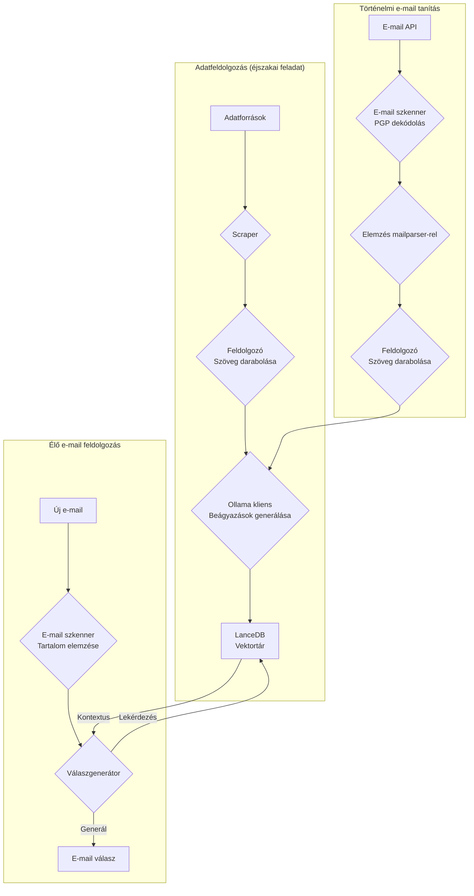
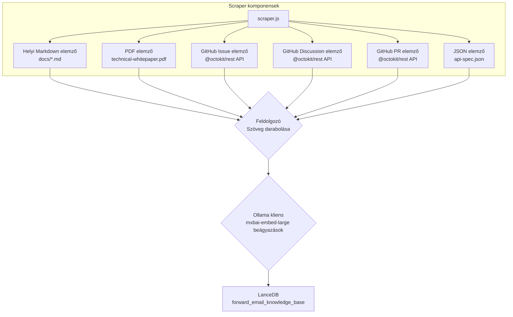
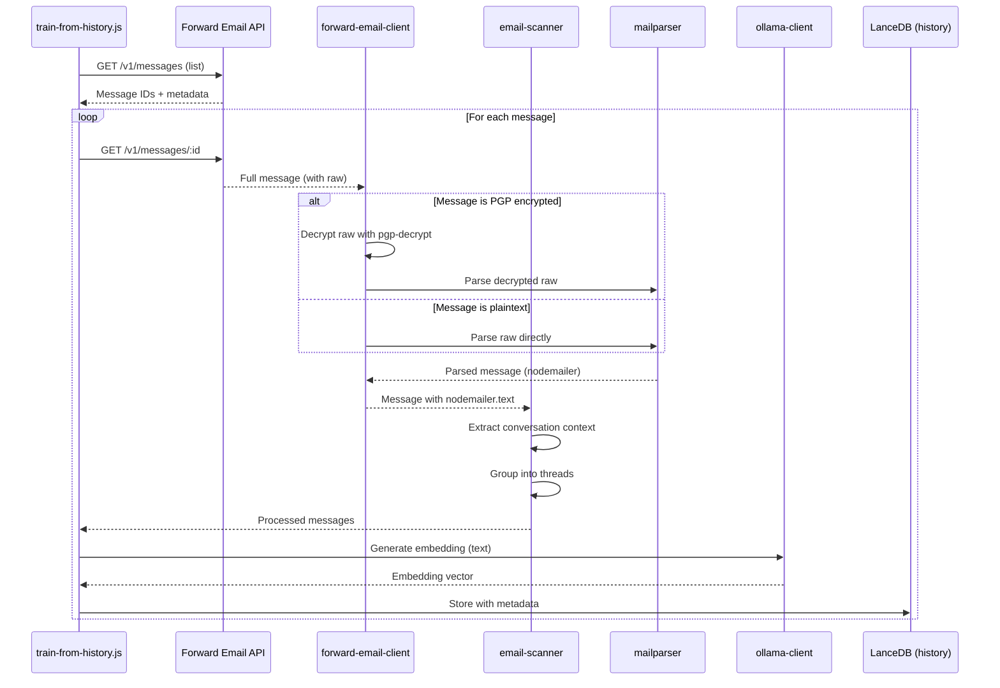

# Egy adatvédelmi szemléletű AI ügyfélszolgálati ügynök építése LanceDB-vel, Ollamával és Node.js-sel {#building-a-privacy-first-ai-customer-support-agent-with-lancedb-ollama-and-nodejs}


> \[!NOTE]
> Ez a dokumentum az önállóan üzemeltetett AI ügyfélszolgálati ügynök építésének történetét mutatja be. Hasonló kihívásokról írtunk a [Email Startup Graveyard](https://forwardemail.net/blog/docs/email-startup-graveyard-why-80-percent-email-companies-fail) blogbejegyzésünkben. Őszintén gondolkodtunk egy folytatáson „AI Startup Graveyard” címmel, de lehet, hogy még egy évet várnunk kell, amíg az AI buborék esetleg kipukkan(?). Egyelőre ez az agyeldobásunk arról, mi működött, mi nem, és miért így csináltuk.

Így építettük meg saját AI ügyfélszolgálati ügynökünket. Nehéz úton: önállóan üzemeltetve, adatvédelmi szemlélettel és teljesen a mi irányításunk alatt. Miért? Mert nem bízunk harmadik fél szolgáltatásaiban ügyfeleink adataival kapcsolatban. Ez GDPR és DPA követelmény, és helyes dolog.

Ez nem egy szórakoztató hétvégi projekt volt. Egy hónapos út volt, amely során törött függőségeken, félrevezető dokumentáción és az open-source AI ökoszisztéma 2025-ös általános káoszán navigáltunk. Ez a dokumentum feljegyzés arról, mit építettünk, miért építettük, és milyen akadályokba ütköztünk útközben.


## Tartalomjegyzék {#table-of-contents}

* [Ügyfél előnyök: AI-vel kiegészített emberi támogatás](#customer-benefits-ai-augmented-human-support)
  * [Gyorsabb, pontosabb válaszok](#faster-more-accurate-responses)
  * [Következetesség kiégés nélkül](#consistency-without-burnout)
  * [Mit kapsz](#what-you-get)
* [Személyes visszatekintés: Két évtizedes küzdelem](#a-personal-reflection-the-two-decade-grind)
* [Miért fontos az adatvédelem](#why-privacy-matters)
* [Költségelemzés: Felhő AI vs önálló üzemeltetés](#cost-analysis-cloud-ai-vs-self-hosted)
  * [Felhő AI szolgáltatás összehasonlítás](#cloud-ai-service-comparison)
  * [Költség bontás: 5GB tudásbázis](#cost-breakdown-5gb-knowledge-base)
  * [Önálló üzemeltetésű hardverköltségek](#self-hosted-hardware-costs)
* [Saját API használata (dogfooding)](#dogfooding-our-own-api)
  * [Miért fontos a dogfooding](#why-dogfooding-matters)
  * [API használati példák](#api-usage-examples)
  * [Teljesítmény előnyök](#performance-benefits)
* [Titkosítási architektúra](#encryption-architecture)
  * [1. réteg: postaláda titkosítás (chacha20-poly1305)](#layer-1-mailbox-encryption-chacha20-poly1305)
  * [2. réteg: üzenetszintű PGP titkosítás](#layer-2-message-level-pgp-encryption)
  * [Miért fontos ez a képzéshez](#why-this-matters-for-training)
  * [Tárolási biztonság](#storage-security)
  * [Helyi tárolás az alapgyakorlat](#local-storage-is-standard-practice)
* [Az architektúra](#the-architecture)
  * [Magas szintű folyamat](#high-level-flow)
  * [Részletes scraper folyamat](#detailed-scraper-flow)
* [Hogyan működik](#how-it-works)
  * [A tudásbázis építése](#building-the-knowledge-base)
  * [Képzés történelmi emailekből](#training-from-historical-emails)
  * [Bejövő emailek feldolgozása](#processing-incoming-emails)
  * [Vektor adatbázis kezelése](#vector-store-management)
* [A vektor adatbázis temetője](#the-vector-database-graveyard)
* [Rendszerkövetelmények](#system-requirements)
* [Cron feladat konfiguráció](#cron-job-configuration)
  * [Környezeti változók](#environment-variables)
  * [Cron feladatok több postaládához](#cron-jobs-for-multiple-inboxes)
  * [Cron ütemezés bontás](#cron-schedule-breakdown)
  * [Dinamikus dátumszámítás](#dynamic-date-calculation)
  * [Kezdeti beállítás: URL lista kinyerése sitemapből](#initial-setup-extract-url-list-from-sitemap)
  * [Cron feladatok kézi tesztelése](#testing-cron-jobs-manually)
  * [Naplók figyelése](#monitoring-logs)
* [Kód példák](#code-examples)
  * [Scraping és feldolgozás](#scraping-and-processing)
  * [Képzés történelmi emailekből](#training-from-historical-emails-1)
  * [Lekérdezés kontextusért](#querying-for-context)
* [A jövő: spam szűrő kutatás-fejlesztés](#the-future-spam-scanner-rd)
* [Hibaelhárítás](#troubleshooting)
  * [Vektor dimenzió eltérés hiba](#vector-dimension-mismatch-error)
  * [Üres tudásbázis kontextus](#empty-knowledge-base-context)
  * [PGP dekódolási hibák](#pgp-decryption-failures)
* [Használati tippek](#usage-tips)
  * [Inbox Zero elérése](#achieving-inbox-zero)
  * [skip-ai címke használata](#using-the-skip-ai-label)
  * [Email szálazás és válasz mindenkinek](#email-threading-and-reply-all)
  * [Figyelés és karbantartás](#monitoring-and-maintenance)
* [Tesztelés](#testing)
  * [Tesztek futtatása](#running-tests)
  * [Teszt lefedettség](#test-coverage)
  * [Teszt környezet](#test-environment)
* [Fő tanulságok](#key-takeaways)
## Ügyfél-előnyök: AI-val Kiegészített Emberi Támogatás {#customer-benefits-ai-augmented-human-support}

Az AI rendszerünk nem helyettesíti a támogatói csapatunkat – jobbá teszi őket. Ez azt jelenti számodra:

### Gyorsabb, Pontosabb Válaszok {#faster-more-accurate-responses}

**Ember a Körforgásban**: Minden AI által generált vázlatot a támogatói csapatunk emberi tagjai átnéznek, szerkesztenek és gondosan kiválasztanak, mielőtt elküldenék neked. Az AI végzi az első kutatást és vázlatkészítést, így csapatunk a minőségellenőrzésre és személyre szabásra koncentrálhat.

**Emberi Szakértelemre Képezve**: Az AI tanul a következőkből:

* Kézzel írt tudásbázisunkból és dokumentációinkból
* Ember által írt blogbejegyzésekből és oktatóanyagokból
* Átfogó GYIK-ünkből (amelyeket emberek írtak)
* Korábbi ügyfélbeszélgetésekből (mind valódi emberek által kezelt)

Olyan válaszokat kapsz, amelyek évek emberi szakértelmére épülnek, csak gyorsabban szállítva.

### Következetesség Kiégés Nélkül {#consistency-without-burnout}

Kis csapatunk naponta több száz támogatási kérést kezel, amelyek mindegyike más-más technikai tudást és mentális kontextusváltást igényel:

* Számlázási kérdések pénzügyi rendszerismeretet igényelnek
* DNS problémák hálózati szakértelmet követelnek
* API integráció programozási tudást igényel
* Biztonsági jelentések sérülékenységértékelést követelnek

AI segítség nélkül ez az állandó kontextusváltás a következőkhöz vezet:

* Lassabb válaszidők
* Emberi hibák a fáradtság miatt
* Válaszok minőségének következetlensége
* Csapat kiégése

**AI kiegészítéssel** a csapatunk:

* Gyorsabban válaszol (az AI másodpercek alatt vázlatot készít)
* Kevesebb hibát követ el (az AI észreveszi a gyakori hibákat)
* Fenntartja a következetes minőséget (az AI mindig ugyanazt a tudásbázist használja)
* Friss és fókuszált marad (kevesebb időt tölt kutatással, több időt segítéssel)

### Amit Kapsz {#what-you-get}

✅ **Gyorsaság**: Az AI másodpercek alatt vázlatot készít, az emberek perceken belül átnézik és elküldik

✅ **Pontosság**: Válaszok a tényleges dokumentációnkra és korábbi megoldásokra alapozva

✅ **Következetesség**: Ugyanaz a magas színvonalú válasz, akár reggel 9-kor, akár este 9-kor

✅ **Emberi érintés**: Minden választ a csapatunk átnéz és személyre szab

✅ **Nincsenek téveszmék**: Az AI csak a hitelesített tudásbázisunkat használja, nem általános internetes adatokat

> \[!NOTE]
> **Mindig emberekkel beszélsz**. Az AI egy kutatási asszisztens, amely segít csapatunknak gyorsabban megtalálni a helyes választ. Gondolj rá úgy, mint egy könyvtárosra, aki azonnal megtalálja a releváns könyvet – de egy ember olvassa el és magyarázza el neked.


## Egy Személyes Elmélkedés: A Két Évtizedes Küzdelem {#a-personal-reflection-the-two-decade-grind}

Mielőtt belemennénk a technikai részletekbe, egy személyes megjegyzés. Közel két évtizede csinálom ezt. A végtelen órák a billentyűzet előtt, a megoldás kitartó keresése, a mély, fókuszált munka – ez a valóság, amikor valami értelmeset építünk. Ez egy olyan valóság, amit gyakran átsiklanak az új technológiák hype ciklusai.

Az AI robbanásszerű fejlődése különösen frusztráló volt. Eladnak nekünk egy álmot az automatizálásról, az AI asszisztensekről, amelyek megírják a kódunkat és megoldják a problémáinkat. A valóság? A kimenet gyakran szemétkód, amit több idő kijavítani, mint újraírni. Az ígéret, hogy megkönnyíti az életünket, hamis. Ez eltereli a figyelmet a kemény, szükséges építőmunkáról.

És ott van az open-source hozzájárulás ördögi köre. Már így is kimerült vagy, a küzdelem miatt. Használsz egy AI-t, hogy segítsen részletes, jól strukturált hibajelentést írni, remélve, hogy megkönnyíted a karbantartók dolgát a probléma megértésében és javításában. És mi történik? Megszidnak. A hozzájárulásodat "off-topic"-nak vagy kevés erőfeszítésűnek minősítik, ahogy azt egy nemrégiben történt [Node.js GitHub issue](https://github.com/nodejs/node/issues/60719#issuecomment-3534304321) esetében láttuk. Ez egy pofon a tapasztalt fejlesztőknek, akik csak segíteni próbálnak.

Ez a valóság, amelyben dolgozunk. Nem csak a hibás eszközökről van szó; egy olyan kultúráról, amely gyakran nem tiszteli meg a hozzájárulók idejét és [erőfeszítéseit](https://forwardemail.net/blog/docs/how-npm-packages-billion-downloads-shaped-javascript-ecosystem). Ez a bejegyzés ennek a valóságnak a krónikája. Ez egy történet az eszközökről, igen, de ugyanakkor az emberi költségről is, amely egy hibás ökoszisztémában való építés során merül fel, amely minden ígéret ellenére alapvetően hibás.
## Miért fontos a magánélet {#why-privacy-matters}

A [technikai fehér könyvünk](https://forwardemail.net/technical-whitepaper.pdf) mélyrehatóan tárgyalja a magánélethez való hozzáállásunkat. Röviden: nem küldünk ügyféladatokat harmadik feleknek. Soha. Ez azt jelenti, hogy nincs OpenAI, nincs Anthropic, nincs felhőalapú vektoralapú adatbázis. Minden a saját infrastruktúránkon fut helyben. Ez nem alku tárgya a GDPR megfelelés és az adatfeldolgozási megállapodásaink szempontjából.


## Költségelemzés: Felhő AI vs Saját hosztolás {#cost-analysis-cloud-ai-vs-self-hosted}

Mielőtt belevágnánk a technikai megvalósításba, beszéljünk arról, hogy miért fontos a saját hosztolás költség szempontjából. A felhő AI szolgáltatások árazási modelljei megfizethetetlenné teszik őket nagy volumenű felhasználási esetekben, mint például az ügyfélszolgálat.

### Felhő AI szolgáltatás összehasonlítás {#cloud-ai-service-comparison}

| Szolgáltatás    | Szolgáltató         | Beágyazási költség                                              | LLM költség (bemenet)                                                    | LLM költség (kimenet)   | Adatvédelmi szabályzat                              | GDPR/DPA        | Hosztolás         | Adatmegosztás     |
| --------------- | ------------------- | ---------------------------------------------------------------- | ------------------------------------------------------------------------- | ----------------------- | --------------------------------------------------- | --------------- | ----------------- | ----------------- |
| **OpenAI**      | OpenAI (US)         | [$0.02-0.13/1M token](https://openai.com/api/pricing/)           | $0.15-20/1M token                                                        | $0.60-80/1M token       | [Link](https://openai.com/policies/privacy-policy/) | Korlátozott DPA | Azure (US)        | Igen (tréning)    |
| **Claude**      | Anthropic (US)      | N/A                                                              | [$3-20/1M token](https://docs.claude.com/en/docs/about-claude/pricing)   | $15-80/1M token         | [Link](https://www.anthropic.com/legal/privacy)     | Korlátozott DPA | AWS/GCP (US)      | Nem (állítás szerint) |
| **Gemini**      | Google (US)         | [$0.15/1M token](https://ai.google.dev/gemini-api/docs/pricing)  | $0.30-1.00/1M token                                                     | $2.50/1M token          | [Link](https://policies.google.com/privacy)         | Korlátozott DPA | GCP (US)          | Igen (fejlesztés) |
| **DeepSeek**    | DeepSeek (Kína)     | N/A                                                              | [$0.028-0.28/1M token](https://api-docs.deepseek.com/quick_start/pricing) | $0.42/1M token          | [Link](https://www.deepseek.com/en)                 | Ismeretlen      | Kína              | Ismeretlen        |
| **Mistral**     | Mistral AI (Franciaország) | [$0.10/1M token](https://mistral.ai/pricing)                    | $0.40/1M token                                                          | $2.00/1M token          | [Link](https://mistral.ai/terms/)                   | EU GDPR         | EU                | Ismeretlen        |
| **Saját hosztolás** | Te                  | $0 (meglévő hardver)                                             | $0 (meglévő hardver)                                                    | $0 (meglévő hardver)    | Saját szabályzat                                    | Teljes megfelelés | MacBook M5 + cron | Soha              |

> \[!WARNING]
> **Adat szuverenitási aggályok**: Az amerikai szolgáltatók (OpenAI, Claude, Gemini) a CLOUD Act hatálya alá tartoznak, amely lehetővé teszi az amerikai kormány számára az adatokhoz való hozzáférést. A DeepSeek (Kína) kínai adatvédelmi törvények szerint működik. Míg a Mistral (Franciaország) EU hosztolást és GDPR megfelelést kínál, a saját hosztolás marad az egyetlen lehetőség a teljes adat szuverenitás és kontroll érdekében.

### Költség bontás: 5GB tudásbázis {#cost-breakdown-5gb-knowledge-base}

Számoljuk ki egy 5GB-os tudásbázis feldolgozásának költségét (tipikus egy közepes méretű cég dokumentumaival, e-mailjeivel és támogatási előzményeivel).

**Feltételezések:**

* 5GB szöveg ≈ 1,25 milliárd token (feltételezve kb. 4 karakter/token)
* Kezdeti beágyazás generálás
* Havi újratanítás (teljes újra-beágyazás)
* Havi 10 000 támogatási lekérdezés
* Átlagos lekérdezés: 500 token bemenet, 300 token kimenet
**Részletes Költségbontás:**

| Összetevő                             | OpenAI           | Claude          | Gemini               | Saját Üzemeltetés   |
| -------------------------------------- | ---------------- | --------------- | -------------------- | ------------------ |
| **Kezdeti Beágyazás** (1,25Mrd token) | 25 000 USD       | N/A             | 187 500 USD          | 0 USD              |
| **Havi Lekérdezések** (10K × 800 token) | 1 200-16 000 USD | 2 400-16 000 USD| 2 400-3 200 USD      | 0 USD              |
| **Havi Újraképzés** (1,25Mrd token)    | 25 000 USD       | N/A             | 187 500 USD          | 0 USD              |
| **Első Év Összesen**                   | 325 200-217 000 USD | 28 800-192 000 USD | 2 278 800-2 226 000 USD | ~60 USD (áram)     |
| **Adatvédelmi Megfelelés**             | ❌ Korlátozott    | ❌ Korlátozott  | ❌ Korlátozott       | ✅ Teljes           |
| **Adat Szuverenitás**                   | ❌ Nem           | ❌ Nem          | ❌ Nem               | ✅ Igen             |

> \[!CAUTION]
> **A Gemini beágyazási költségei katasztrofálisak**: 0,15 USD/1M token. Egyetlen 5GB tudásbázis beágyazás 187 500 USD-be kerülne. Ez 37-szer drágább, mint az OpenAI, és teljesen használhatatlanná teszi éles környezetben.

### Saját Üzemeltetésű Hardverköltségek {#self-hosted-hardware-costs}

A rendszerünk meglévő hardveren fut, amit már birtoklunk:

* **Hardver**: MacBook M5 (fejlesztéshez már megvan)
* **További költség**: 0 USD (meglévő hardvert használ)
* **Áram**: ~5 USD/hónap (becsült)
* **Első év összesen**: ~60 USD
* **Folyamatos költség**: 60 USD/év

**Megtérülés**: A saját üzemeltetésnek gyakorlatilag nulla a marginális költsége, mivel meglévő fejlesztői hardvert használunk. A rendszer cron feladatokkal fut csúcsidőn kívül.

## Saját API Használatunk {#dogfooding-our-own-api}

Az egyik legfontosabb architekturális döntésünk az volt, hogy minden AI feladat közvetlenül a [Forward Email API](https://forwardemail.net/email-api) használatával működjön. Ez nem csak jó gyakorlat – hanem kényszerítő tényező a teljesítmény optimalizálására.

### Miért Fontos a Saját Használat? {#why-dogfooding-matters}

Amikor AI feladataink ugyanazokat az API végpontokat használják, mint az ügyfeleink:

1. **A teljesítmény szűk keresztmetszetei minket érintenek először** – Mi érezzük először a problémát, nem az ügyfelek
2. **Az optimalizáció mindenki javára válik** – A fejlesztéseink automatikusan javítják az ügyfélélményt is
3. **Valós környezetben történő tesztelés** – Feladataink több ezer e-mailt dolgoznak fel, folyamatos terheléses tesztelést biztosítva
4. **Kód újrafelhasználás** – Ugyanaz az autentikáció, sebességkorlátozás, hibakezelés és gyorsítótárazás logika

### API Használati Példák {#api-usage-examples}

**Üzenetek listázása (train-from-history.js):**

```javascript
// GET /v1/messages?folder=INBOX használata BasicAuth-kal
// Kizárja az eml, raw, nodemailer mezőket a válasz méretének csökkentésére (csak az azonosítók kellenek)
const response = await axios.get(
  `${this.apiBase}/v1/messages`,
  {
    params: {
      folder: 'INBOX',
      limit: 100,
      eml: false,
      raw: false,
      nodemailer: false
    },
    auth: {
      username: process.env.FORWARD_EMAIL_ALIAS_USERNAME,
      password: process.env.FORWARD_EMAIL_ALIAS_PASSWORD
    }
  }
);

const messages = response.data;
// Visszatér: [{ id, subject, date, ... }, ...]
// A teljes üzenet tartalmat később GET /v1/messages/:id hívással kérjük le
```

**Teljes üzenetek lekérése (forward-email-client.js):**

```javascript
// GET /v1/messages/:id használata a teljes üzenet raw tartalmával
const response = await axios.get(
  `${this.apiBase}/v1/messages/${messageId}`,
  {
    auth: {
      username: this.aliasUsername,
      password: this.aliasPassword
    }
  }
);

const message = response.data;
// Visszatér: { id, subject, raw, eml, nodemailer: { ... }, ... }
```

**Válasz tervezetek létrehozása (process-inbox.js):**

```javascript
// POST /v1/messages használata válasz tervezetek létrehozásához
const response = await axios.post(
  `${this.apiBase}/v1/messages`,
  {
    folder: 'Drafts',
    subject: `Re: ${originalSubject}`,
    to: senderEmail,
    text: generatedResponse,
    inReplyTo: originalMessageId
  },
  {
    auth: {
      username: process.env.FORWARD_EMAIL_ALIAS_USERNAME,
      password: process.env.FORWARD_EMAIL_ALIAS_PASSWORD
    }
  }
);
```
### Teljesítményelőnyök {#performance-benefits}

Mivel az AI feladataink ugyanazon az API infrastruktúrán futnak:

* **Gyorsítótárazási optimalizációk** mind a feladatoknak, mind az ügyfeleknek előnyt jelentenek
* **Korlátozások tesztelése** valós terhelés alatt történik
* **Hibakezelés** harcedzett
* **API válaszidők** folyamatosan monitorozva vannak
* **Adatbázis-lekérdezések** mindkét esethez optimalizáltak
* **Sávszélesség-optimalizáció** – Az `eml`, `raw`, `nodemailer` kizárása a listázásból kb. 90%-kal csökkenti a válasz méretét

Amikor a `train-from-history.js` 1 000 e-mailt dolgoz fel, több mint 1 000 API hívást hajt végre. Az API bármilyen hatékonysági hiánya azonnal nyilvánvalóvá válik. Ez arra kényszerít minket, hogy optimalizáljuk az IMAP hozzáférést, az adatbázis-lekérdezéseket és a válasz szerializálását – ezek a fejlesztések közvetlenül az ügyfeleink javát szolgálják.

**Példa optimalizációra**: 100 üzenet teljes tartalommal történő listázása = kb. 10 MB válasz. Listázás `eml: false, raw: false, nodemailer: false` beállítással = kb. 100 KB válasz (100-szor kisebb).


## Titkosítási architektúra {#encryption-architecture}

Az e-mail tárolásunk több rétegű titkosítást használ, amelyet az AI feladatok valós időben kell, hogy visszafejtsenek a tanításhoz.

### 1. réteg: Postafiók titkosítás (chacha20-poly1305) {#layer-1-mailbox-encryption-chacha20-poly1305}

Minden IMAP postafiók SQLite adatbázisként van tárolva, amely **chacha20-poly1305** algoritmussal van titkosítva, ami egy kvantumbiztos titkosítási eljárás. Erről részletesen olvashatsz a [kvantumbiztos titkosított e-mail szolgáltatás blogbejegyzésünkben](https://forwardemail.net/blog/docs/best-quantum-safe-encrypted-email-service).

**Fő jellemzők:**

* **Algoritmus**: ChaCha20-Poly1305 (AEAD titkosító)
* **Kvantumbiztos**: Ellenáll a kvantumszámítógépes támadásoknak
* **Tárolás**: SQLite adatbázis fájlok a lemezen
* **Hozzáférés**: Memóriában visszafejtve, amikor IMAP/API-n keresztül elérik

### 2. réteg: Üzenetszintű PGP titkosítás {#layer-2-message-level-pgp-encryption}

Sok támogatási e-mail további PGP (OpenPGP szabvány) titkosítással rendelkezik. Az AI feladatoknak ezeket is vissza kell fejteniük, hogy kinyerjék a tartalmat a tanításhoz.

**Visszafejtési folyamat:**

```javascript
// 1. Az API visszaadja az üzenetet titkosított nyers tartalommal
const message = await forwardEmailClient.getMessage(id);

// 2. Ellenőrizze, hogy a nyers tartalom PGP titkosított-e
if (isMessageEncrypted(message.raw)) {
  // 3. Visszafejtés a privát kulcsunkkal
  const decryptedRaw = await pgpDecrypt(message.raw);

  // 4. Visszafejtett MIME üzenet elemzése
  const parsed = await simpleParser(decryptedRaw);

  // 5. Nodemailer feltöltése visszafejtett tartalommal
  message.nodemailer = {
    text: parsed.text,
    html: parsed.html,
    from: parsed.from,
    to: parsed.to,
    subject: parsed.subject,
    date: parsed.date
  };
}
```

**PGP konfiguráció:**

```bash
# Privát kulcs a visszafejtéshez (ASCII-armored kulcsfájl elérési útja)
GPG_SECURITY_KEY="/path/to/private-key.asc"

# Jelszó a privát kulcshoz (ha titkosított)
GPG_SECURITY_PASSPHRASE="your-passphrase"
```

A `pgp-decrypt.js` segédprogram:

1. Egyszer olvassa be a privát kulcsot a lemezről (memóriában cache-elve)
2. Visszafejti a kulcsot a jelszóval
3. A visszafejtett kulcsot használja minden üzenet visszafejtéséhez
4. Támogatja a rekurzív visszafejtést beágyazott titkosított üzenetek esetén

### Miért fontos ez a tanításhoz? {#why-this-matters-for-training}

Megfelelő visszafejtés nélkül az AI titkosított zagyvaságon tanulna:

```
-----BEGIN PGP MESSAGE-----
Version: OpenPGP.js v4.10.10

wcBMA8Z3lHJnFnNUAQgAqK7F8...
-----END PGP MESSAGE-----
```

Visszafejtéssel az AI a tényleges tartalmon tanul:

```
Subject: Re: Bug Report

Hi John,

Thanks for reporting this issue. I've confirmed the bug
and created a fix in PR #1234...
```

### Tárolási biztonság {#storage-security}

A visszafejtés a feladat futása közben memóriában történik, és a visszafejtett tartalmat beágyazásokká alakítjuk, amelyeket aztán a LanceDB vektoralapú adatbázisban tárolunk a lemezen.

**Hol tárolódnak az adatok:**

* **Vektoralapú adatbázis**: Titkosított MacBook M5 munkaállomásokon tárolva
* **Fizikai biztonság**: A munkaállomások mindig nálunk maradnak (nem adatközpontban)
* **Lemeztitkosítás**: Teljes lemeztitkosítás minden munkaállomáson
* **Hálózati biztonság**: Tűzfallal védett és elkülönített a nyilvános hálózatoktól

**Jövőbeli adatközponti telepítés:**
Ha valaha adatközpontba költözünk, a szerverek rendelkezni fognak:

* LUKS teljes lemeztitkosítással
* USB hozzáférés letiltva
* Fizikai biztonsági intézkedésekkel
* Hálózati elkülönítéssel
A biztonsági gyakorlataink teljes részleteiért lásd a [Biztonsági oldalunkat](https://forwardemail.net/en/security).

> \[!NOTE]
> A vektorbázis adatbázis beágyazásokat (matematikai reprezentációkat) tartalmaz, nem az eredeti egyszerű szöveget. Azonban a beágyazások visszafejthetők lehetnek, ezért titkosított, fizikailag védett munkaállomásokon tároljuk őket.

### A helyi tárolás alapértelmezett gyakorlat {#local-storage-is-standard-practice}

A beágyazások tárolása a csapatunk munkaállomásain nem különbözik attól, ahogyan már most kezeljük az e-maileket:

* **Thunderbird**: Letölti és helyben tárolja az e-mail teljes tartalmát mbox/maildir fájlokban
* **Webmail kliensek**: Gyorsítótárazzák az e-mail adatokat a böngésző tárolójában és helyi adatbázisokban
* **IMAP kliensek**: Helyi másolatokat tartanak az üzenetekről offline hozzáféréshez
* **AI rendszerünk**: Matematikai beágyazásokat tárol (nem egyszerű szöveget) LanceDB-ben

A kulcsfontosságú különbség: a beágyazások **biztonságosabbak**, mint az egyszerű szöveges e-mailek, mert:

1. Matematikai reprezentációk, nem olvasható szöveg
2. Nehezebb visszafejteni, mint az egyszerű szöveget
3. Ugyanazon fizikai biztonság alá esnek, mint az e-mail klienseink

Ha elfogadható, hogy a csapatunk Thunderbirdöt vagy webmailt használ titkosított munkaállomásokon, akkor ugyanolyan elfogadható (sőt, érvelhetően biztonságosabb) a beágyazások tárolása ugyanígy.


## Az architektúra {#the-architecture}

Íme az alapfolyamat. Egyszerűnek tűnik. Nem volt az.

> \[!NOTE]
> Minden feladat közvetlenül a Forward Email API-t használja, biztosítva, hogy a teljesítményoptimalizálások mind az AI rendszerünknek, mind az ügyfeleinknek előnyt jelentsenek.

### Magas szintű folyamat {#high-level-flow}



### Részletes scraper folyamat {#detailed-scraper-flow}

A `scraper.js` az adatfeldolgozás szíve. Különböző adatformátumokhoz tartalmaz elemzőket.




## Hogyan működik {#how-it-works}

A folyamat három fő részre oszlik: a tudásbázis építése, történelmi e-mailekből való tanítás, és új e-mailek feldolgozása.

### Tudásbázis építése {#building-the-knowledge-base}

**`update-knowledge-base.js`**: Ez a fő feladat. Éjszakánként fut, törli a régi vektortárat, és újraépíti azt az alapoktól. A `scraper.js`-t használja az összes forrás tartalmának lekérésére, a `processor.js`-t a darabolásra, és az `ollama-client.js`-t a beágyazások generálására. Végül a `vector-store.js` tárol mindent LanceDB-ben.

**Adatforrások:**

* Helyi Markdown fájlok (`docs/*.md`)
* Műszaki fehér könyv PDF (`assets/technical-whitepaper.pdf`)
* API specifikáció JSON (`assets/api-spec.json`)
* GitHub issue-k (Octokit segítségével)
* GitHub beszélgetések (Octokit segítségével)
* GitHub pull requestek (Octokit segítségével)
* Sitemap URL lista (`$LANCEDB_PATH/valid-urls.json`)

### Történelmi e-mailekből való tanítás {#training-from-historical-emails}

**`train-from-history.js`**: Ez a feladat beolvassa az összes mappából a történelmi e-maileket, dekódolja a PGP-vel titkosított üzeneteket, és hozzáadja őket egy külön vektortárhoz (`customer_support_history`). Ez kontextust biztosít a korábbi ügyféltámogatási interakciókból.
**Email feldolgozási folyamat:**



**Főbb jellemzők:**

* **PGP dekódolás**: A `pgp-decrypt.js` segédprogramot használja a `GPG_SECURITY_KEY` környezeti változóval
* **Szálak csoportosítása**: Kapcsolódó e-maileket beszélgetési szálakba rendezi
* **Metaadatok megőrzése**: Tárolja a mappát, tárgyat, dátumot, titkosítási állapotot
* **Válasz kontextus**: Összekapcsolja az üzeneteket a válaszaikkal a jobb kontextus érdekében

**Konfiguráció:**

```bash
# Környezeti változók a train-from-history számára
HISTORY_SCAN_LIMIT=1000              # Maximális feldolgozandó üzenetek száma
HISTORY_SCAN_SINCE="2024-01-01"      # Csak az ezen dátum utáni üzenetek feldolgozása
HISTORY_DECRYPT_PGP=true             # PGP dekódolás megkísérlése
GPG_SECURITY_KEY="/path/to/key.asc"  # PGP privát kulcs elérési útja
GPG_SECURITY_PASSPHRASE="passphrase" # Kulcs jelszava (opcionális)
```

**Amit tárolunk:**

```javascript
{
  type: 'historical_email',
  folder: 'INBOX',
  subject: 'Re: Bug Report',
  date: '2025-01-15T10:30:00Z',
  messageId: '67e2f288893921...',
  threadId: 'Bug Report',
  hasReply: true,
  encrypted: true,
  decrypted: true,
  replySubject: 'Bug Report',
  replyText: 'First 500 chars of reply...',
  chunkSize: 1000,
  chunkOverlap: 200,
  chunkIndex: 0
}
```

> \[!TIP]
> Futtassa a `train-from-history` parancsot az első beállítás után, hogy feltöltse a történelmi kontextust. Ez drámaian javítja a válaszok minőségét a korábbi támogatási interakciók tanulásával.

### Bejövő e-mailek feldolgozása {#processing-incoming-emails}

**`process-inbox.js`**: Ez a feladat a `support@forwardemail.net`, `abuse@forwardemail.net` és `security@forwardemail.net` postafiókokban lévő e-maileken fut (konkrétan az `INBOX` IMAP mappa útvonalon). Használja az API-nkat a <https://forwardemail.net/email-api> címen (pl. `GET /v1/messages?folder=INBOX` BasicAuth hozzáféréssel az egyes postafiókok IMAP hitelesítő adataival). Elemzi az e-mail tartalmát, lekérdezi mind a tudásbázist (`forward_email_knowledge_base`), mind a történelmi e-mail vektor tárolót (`customer_support_history`), majd az egyesített kontextust átadja a `response-generator.js`-nek. A generátor az Ollama-n keresztül a `mxbai-embed-large` modellt használja a válasz megalkotásához.

**Automatizált munkafolyamat jellemzők:**

1. **Inbox Zero automatizálás**: A sikeres vázlat létrehozása után az eredeti üzenet automatikusan az Archiv mappába kerül. Ez tisztán tartja a beérkező leveleket, és segít elérni az inbox zero állapotot manuális beavatkozás nélkül.

2. **AI feldolgozás kihagyása**: Egyszerűen adjon hozzá egy `skip-ai` címkét (kis- és nagybetűtől függetlenül) bármely üzenethez az AI feldolgozás megakadályozásához. Az üzenet érintetlenül marad a beérkezett levelek között, így manuálisan kezelheti. Ez hasznos érzékeny üzenetek vagy összetett esetek esetén, amelyek emberi ítéletet igényelnek.

3. **Megfelelő e-mail szálazás**: Minden vázlatválasz tartalmazza az eredeti üzenetet idézve alul (a szabványos ` >  ` előtaggal), követve az e-mail válasz konvenciókat az "On \[date], \[sender] wrote:" formátumban. Ez biztosítja a megfelelő beszélgetési kontextust és szálazást az e-mail kliensekben.

4. **Válasz-minden viselkedés**: A rendszer automatikusan kezeli a Reply-To fejlécet és a CC címzetteket:
   * Ha létezik Reply-To fejléc, az lesz a Címzett (To) cím, és az eredeti Feladó (From) hozzáadódik a CC-hez
   * Az összes eredeti Címzett (To) és CC címzett szerepel a válasz CC-jében (kivéve a saját címét)
   * Követi a szabványos e-mail válasz-minden konvenciókat csoportos beszélgetések esetén
**Forrás rangsorolás**: A rendszer **súlyozott rangsorolást** használ a források priorizálására:

* GYIK: 100% (legmagasabb prioritás)
* Műszaki fehér könyv: 95%
* API specifikáció: 90%
* Hivatalos dokumentációk: 85%
* GitHub hibajegyek: 70%
* Történelmi e-mailek: 50%

### Vektor tároló kezelése {#vector-store-management}

A `VectorStore` osztály a `helpers/customer-support-ai/vector-store.js` fájlban az interfészünk a LanceDB-hez.

**Dokumentumok hozzáadása:**

```javascript
// vector-store.js
async addDocument(text, metadata) {
  const embedding = await this.ollama.generateEmbedding(text);
  await this.table.add([{
    vector: embedding,
    text,
    ...metadata
  }]);
}
```

**Tároló törlése:**

```javascript
// 1. lehetőség: clear() metódus használata
await vectorStore.clear();

// 2. lehetőség: a helyi adatbázis könyvtár törlése
await fs.rm(process.env.LANCEDB_PATH, { recursive: true, force: true });
```

A `LANCEDB_PATH` környezeti változó a helyi beágyazott adatbázis könyvtárára mutat. A LanceDB szerver nélküli és beágyazott, így nincs külön folyamat, amit kezelni kell.


## A vektor adatbázis temetője {#the-vector-database-graveyard}

Ez volt az első nagy akadály. Több vektor adatbázist is kipróbáltunk, mielőtt a LanceDB mellett döntöttünk. Íme, mi ment rosszul mindegyiknél.

| Adatbázis   | GitHub                                                      | Mi ment rosszul                                                                                                                                                                                                     | Konkrét problémák                                                                                                                                                                                                                                                                                                                                                         | Biztonsági aggályok                                                                                                                                                                                              |
| ------------ | ----------------------------------------------------------- | ------------------------------------------------------------------------------------------------------------------------------------------------------------------------------------------------------------------ | ------------------------------------------------------------------------------------------------------------------------------------------------------------------------------------------------------------------------------------------------------------------------------------------------------------------------------------------------------------------------- | ---------------------------------------------------------------------------------------------------------------------------------------------------------------------------------------------------------------- |
| **ChromaDB** | [chroma-core/chroma](https://github.com/chroma-core/chroma) | A `pip3 install chromadb` egy őskori verziót ad `PydanticImportError` hibával. A működő verzió csak forrásból fordítva érhető el. Nem fejlesztőbarát.                                                               | Python függőségi káosz. Több felhasználó is hibás pip telepítésekről számolt be ([#774](https://github.com/chroma-core/chroma/issues/774), [#163](https://github.com/chroma-core/chroma/issues/163)). A dokumentáció azt mondja, hogy "csak Docker-t használj", ami helyi fejlesztéshez nem válasz. Windows alatt >99 rekordnál összeomlik ([#3058](https://github.com/chroma-core/chroma/issues/3058)). | **CVE-2024-45848**: Tetszőleges kód futtatás a ChromaDB integráción keresztül MindsDB-ben. Kritikus OS sebezhetőségek a Docker képen ([#3170](https://github.com/chroma-core/chroma/issues/3170)).                      |
| **Qdrant**   | [qdrant/qdrant](https://github.com/qdrant/qdrant)           | A Homebrew tap (`qdrant/qdrant/qdrant`), amit a régi dokumentációjuk említ, eltűnt. Nincs magyarázat. A hivatalos dokumentáció most csak annyit mond, hogy "használj Dockert".                                      | Hiányzó Homebrew tap. Nincs natív macOS bináris. Csak Docker használata akadály a gyors helyi teszteléshez.                                                                                                                                                                                                                                                               | **CVE-2024-2221**: Tetszőleges fájlfeltöltési sebezhetőség, amely távoli kód futtatást tesz lehetővé (javítva a v1.9.0-ban). Gyenge biztonsági érettségi pontszám az [IronCore Labs](https://ironcorelabs.com/vectordbs/qdrant-security/) szerint. |
| **Weaviate** | [weaviate/weaviate](https://github.com/weaviate/weaviate)   | A Homebrew verzió kritikus klaszterezési hibával rendelkezett (`leader not found`). A dokumentált flag-ek a javításhoz (`RAFT_JOIN`, `CLUSTER_HOSTNAME`) nem működtek. Alapvetően hibás egycsomópontos konfigurációkhoz. | Klaszterezési hibák még egycsomópontos módban is. Túlbonyolított egyszerű használati esetekhez.                                                                                                                                                                                                                                                                           | Nincsenek jelentős CVE-k, de a komplexitás növeli a támadási felületet.                                                                                                                                           |
| **LanceDB**  | [lancedb/lancedb](https://github.com/lancedb/lancedb)       | Ez működött. Beágyazott és szerver nélküli. Nincs külön folyamat. Az egyetlen bosszantó dolog a zavaró csomagnevek (`vectordb` elavult, használjuk a `@lancedb/lancedb`-t) és a szórványos dokumentáció. Ezzel együtt élünk. | Csomagnevek zavaróak (`vectordb` vs `@lancedb/lancedb`), de egyébként stabil. A beágyazott architektúra kizárja a teljes osztályú biztonsági problémákat.                                                                                                                                                                                                                   | Nincsenek ismert CVE-k. A beágyazott kialakítás miatt nincs hálózati támadási felület.                                                                                                                                 |
> \[!WARNING]
> **A ChromaDB kritikus biztonsági sérülékenységekkel rendelkezik.** A [CVE-2024-45848](https://nvd.nist.gov/vuln/detail/CVE-2024-45848) lehetővé teszi tetszőleges kód futtatását. A pip telepítés alapvetően hibás a Pydantic függőségi problémák miatt. Kerülje a termelési környezetben való használatát.

> \[!WARNING]
> **A Qdrant fájlfeltöltéses RCE sérülékenységgel rendelkezett** ([CVE-2024-2221](https://qdrant.tech/blog/cve-2024-2221-response/)), amelyet csak a v1.9.0 verzióban javítottak. Ha Qdrantot kell használnia, győződjön meg róla, hogy a legfrissebb verziót használja.

> \[!CAUTION]
> Az open-source vektor adatbázis ökoszisztéma még kezdetleges. Ne bízzon a dokumentációban. Tegye fel, hogy minden hibás, amíg az ellenkezője be nem bizonyosodik. Teszteljen helyben, mielőtt egy stack mellett dönt.

## Rendszerkövetelmények {#system-requirements}

* **Node.js:** v18.0.0+ ([GitHub](https://github.com/nodejs/node))
* **Ollama:** Legfrissebb ([GitHub](https://github.com/ollama/ollama))
* **Modell:** `mxbai-embed-large` az Ollama-n keresztül
* **Vektor adatbázis:** LanceDB ([GitHub](https://github.com/lancedb/lancedb))
* **GitHub hozzáférés:** `@octokit/rest` az issue-k lekéréséhez ([GitHub](https://github.com/octokit/rest.js))
* **SQLite:** Elsődleges adatbázishoz (a `mongoose-to-sqlite` segítségével)

## Cron feladat beállítása {#cron-job-configuration}

Minden AI feladat cron-on fut egy MacBook M5-ön. Így állíthatja be a cron feladatokat, hogy éjfélkor fussanak több postafiók esetén.

### Környezeti változók {#environment-variables}

A feladatokhoz ezek a környezeti változók szükségesek. A legtöbb beállítható `.env` fájlban (betöltve `@ladjs/env` segítségével), de a `HISTORY_SCAN_SINCE`-t dinamikusan kell kiszámítani a crontab-ban.

**A `.env` fájlban:**

```bash
# Forward Email API hitelesítő adatok (postafiókonként változik)
FORWARD_EMAIL_ALIAS_USERNAME=support@forwardemail.net
FORWARD_EMAIL_ALIAS_PASSWORD=your-imap-password

# PGP dekódolás (minden postafiók között megosztott)
GPG_SECURITY_KEY=/path/to/private-key.asc
GPG_SECURITY_PASSPHRASE=your-passphrase

# Történeti keresés konfigurációja
HISTORY_SCAN_LIMIT=1000

# LanceDB elérési út
LANCEDB_PATH=/path/to/lancedb
```

**A crontab-ban (dinamikusan számítva):**

```bash
# A HISTORY_SCAN_SINCE-t inline kell beállítani a crontab-ban shell dátum számítással
# Nem lehet .env fájlban, mert az @ladjs/env nem értékeli a shell parancsokat
HISTORY_SCAN_SINCE="$(date -v-1d +%Y-%m-%d)"  # macOS
HISTORY_SCAN_SINCE="$(date -d 'yesterday' +%Y-%m-%d)"  # Linux
```

### Cron feladatok több postafiókhoz {#cron-jobs-for-multiple-inboxes}

Szerkessze a crontab-ját `crontab -e` paranccsal, és adja hozzá:

```bash
# Tudásbázis frissítése (egyszer fut, megosztott minden postafiók között)
0 0 * * * cd /path/to/forwardemail.net && LANCEDB_PATH="/path/to/lancedb" GPG_SECURITY_KEY="/path/to/key.asc" GPG_SECURITY_PASSPHRASE="pass" node jobs/customer-support-ai/update-knowledge-base.js >> /var/log/update-knowledge-base.log 2>&1

# Tanítás a történelemből - support@forwardemail.net
0 0 * * * cd /path/to/forwardemail.net && FORWARD_EMAIL_ALIAS_USERNAME="support@forwardemail.net" FORWARD_EMAIL_ALIAS_PASSWORD="support-password" HISTORY_SCAN_SINCE="$(date -v-1d +%Y-%m-%d)" HISTORY_SCAN_LIMIT=1000 GPG_SECURITY_KEY="/path/to/key.asc" GPG_SECURITY_PASSPHRASE="pass" LANCEDB_PATH="/path/to/lancedb" node jobs/customer-support-ai/train-from-history.js >> /var/log/train-support.log 2>&1

# Tanítás a történelemből - abuse@forwardemail.net
0 0 * * * cd /path/to/forwardemail.net && FORWARD_EMAIL_ALIAS_USERNAME="abuse@forwardemail.net" FORWARD_EMAIL_ALIAS_PASSWORD="abuse-password" HISTORY_SCAN_SINCE="$(date -v-1d +%Y-%m-%d)" HISTORY_SCAN_LIMIT=1000 GPG_SECURITY_KEY="/path/to/key.asc" GPG_SECURITY_PASSPHRASE="pass" LANCEDB_PATH="/path/to/lancedb" node jobs/customer-support-ai/train-from-history.js >> /var/log/train-abuse.log 2>&1

# Tanítás a történelemből - security@forwardemail.net
0 0 * * * cd /path/to/forwardemail.net && FORWARD_EMAIL_ALIAS_USERNAME="security@forwardemail.net" FORWARD_EMAIL_ALIAS_PASSWORD="security-password" HISTORY_SCAN_SINCE="$(date -v-1d +%Y-%m-%d)" HISTORY_SCAN_LIMIT=1000 GPG_SECURITY_KEY="/path/to/key.asc" GPG_SECURITY_PASSPHRASE="pass" LANCEDB_PATH="/path/to/lancedb" node jobs/customer-support-ai/train-from-history.js >> /var/log/train-security.log 2>&1

# Postafiók feldolgozása - support@forwardemail.net
*/5 * * * * cd /path/to/forwardemail.net && FORWARD_EMAIL_ALIAS_USERNAME="support@forwardemail.net" FORWARD_EMAIL_ALIAS_PASSWORD="support-password" GPG_SECURITY_KEY="/path/to/key.asc" GPG_SECURITY_PASSPHRASE="pass" LANCEDB_PATH="/path/to/lancedb" node jobs/customer-support-ai/process-inbox.js >> /var/log/process-support.log 2>&1

# Postafiók feldolgozása - abuse@forwardemail.net
*/5 * * * * cd /path/to/forwardemail.net && FORWARD_EMAIL_ALIAS_USERNAME="abuse@forwardemail.net" FORWARD_EMAIL_ALIAS_PASSWORD="abuse-password" GPG_SECURITY_KEY="/path/to/key.asc" GPG_SECURITY_PASSPHRASE="pass" LANCEDB_PATH="/path/to/lancedb" node jobs/customer-support-ai/process-inbox.js >> /var/log/process-abuse.log 2>&1

# Postafiók feldolgozása - security@forwardemail.net
*/5 * * * * cd /path/to/forwardemail.net && FORWARD_EMAIL_ALIAS_USERNAME="security@forwardemail.net" FORWARD_EMAIL_ALIAS_PASSWORD="security-password" GPG_SECURITY_KEY="/path/to/key.asc" GPG_SECURITY_PASSPHRASE="pass" LANCEDB_PATH="/path/to/lancedb" node jobs/customer-support-ai/process-inbox.js >> /var/log/process-security.log 2>&1
```
### Cron ütemezés bontása {#cron-schedule-breakdown}

| Feladat                  | Ütemezés    | Leírás                                                                            |
| ------------------------ | ----------- | --------------------------------------------------------------------------------- |
| `train-from-sitemap.js`  | `0 0 * * 0` | Heti (vasárnap éjfélkor) - Lekéri az összes URL-t a sitemapből és betanítja a tudásbázist |
| `train-from-history.js`  | `0 0 * * *` | Napi éjfélkor - Átvizsgálja az előző napi e-maileket postafiókonként              |
| `process-inbox.js`       | `*/5 * * * *` | Ötpercenként - Feldolgozza az új e-maileket és vázlatokat generál                 |

### Dinamikus dátum számítás {#dynamic-date-calculation}

A `HISTORY_SCAN_SINCE` változót **kötelező inline módon kiszámítani a crontab-ban**, mert:

1. A `.env` fájlokat az `@ladjs/env` szó szerint olvassa be
2. A shell parancs helyettesítés `$(...)` nem működik `.env` fájlokban
3. A dátumot minden cron futáskor frissen kell kiszámítani

**Helyes megközelítés (crontab-ban):**

```bash
# macOS (BSD date)
HISTORY_SCAN_SINCE="$(date -v-1d +%Y-%m-%d)" node jobs/...

# Linux (GNU date)
HISTORY_SCAN_SINCE="$(date -d 'yesterday' +%Y-%m-%d)" node jobs/...
```

**Helytelen megközelítés (nem működik .env-ben):**

```bash
# Ezt szó szerint olvassa be: "$(date -v-1d +%Y-%m-%d)"
# Nem értékeli ki shell parancsként
HISTORY_SCAN_SINCE=$(date -v-1d +%Y-%m-%d)
```

Ez biztosítja, hogy minden éjszakai futás dinamikusan számolja ki az előző napi dátumot, elkerülve a fölösleges munkát.

### Kezdeti beállítás: URL lista kinyerése a sitemapből {#initial-setup-extract-url-list-from-sitemap}

Mielőtt először futtatnád a process-inbox feladatot, **kötelező** kinyerni az URL listát a sitemapből. Ez létrehoz egy érvényes URL-ek szótárát, amelyre az LLM hivatkozhat, és megakadályozza az URL hallucinációt.

```bash
# Első alkalommal: URL lista kinyerése a sitemapből
cd /path/to/forwardemail.net
node jobs/customer-support-ai/train-from-sitemap.js
```

**Mit csinál ez:**

1. Lekéri az összes URL-t a <https://forwardemail.net/sitemap.xml> oldalról
2. Csak a nem lokalizált vagy /en/ URL-eket szűri (elkerüli a duplikált tartalmat)
3. Eltávolítja a locale előtagokat (/en/faq → /faq)
4. Egyszerű JSON fájlba menti az URL listát a `$LANCEDB_PATH/valid-urls.json` helyre
5. Nem végez crawlingot, nem gyűjt metaadatokat – csak egy lapos lista az érvényes URL-ekről

**Miért fontos ez:**

* Megakadályozza, hogy az LLM hamis URL-eket hallucináljon, mint például `/dashboard` vagy `/login`
* Biztosít egy fehérlistát az érvényes URL-ekről, amelyre a válaszgenerátor hivatkozhat
* Egyszerű, gyors, és nem igényel vektoralapú adatbázist
* A válaszgenerátor induláskor betölti ezt a listát és beépíti a promptba

**Heti frissítéshez add hozzá a crontabhoz:**

```bash
# URL lista kinyerése a sitemapből - heti rendszerességgel vasárnap éjfélkor
0 0 * * 0 cd /path/to/forwardemail.net && node jobs/customer-support-ai/train-from-sitemap.js >> /var/log/train-sitemap.log 2>&1
```

### Cron feladatok kézi tesztelése {#testing-cron-jobs-manually}

Egy feladat teszteléséhez mielőtt hozzáadnád a cronhoz:

```bash
# Sitemap betanítás tesztelése
cd /path/to/forwardemail.net
export LANCEDB_PATH="/path/to/lancedb"
node jobs/customer-support-ai/train-from-sitemap.js

# Support postafiók betanítás tesztelése
cd /path/to/forwardemail.net
export FORWARD_EMAIL_ALIAS_USERNAME="support@forwardemail.net"
export FORWARD_EMAIL_ALIAS_PASSWORD="support-password"
export HISTORY_SCAN_SINCE="$(date -v-1d +%Y-%m-%d)"
export HISTORY_SCAN_LIMIT=1000
export GPG_SECURITY_KEY="/path/to/key.asc"
export GPG_SECURITY_PASSPHRASE="pass"
export LANCEDB_PATH="/path/to/lancedb"
node jobs/customer-support-ai/train-from-history.js
```

### Naplózás figyelése {#monitoring-logs}

Minden feladat külön fájlba naplóz a könnyebb hibakeresés érdekében:

```bash
# Support postafiók feldolgozásának valós idejű figyelése
tail -f /var/log/process-support.log

# Tegnapi betanítási futás ellenőrzése
cat /var/log/train-support.log | grep "$(date -v-1d +%Y-%m-%d)"

# Minden hiba megtekintése a feladatok között
grep -i error /var/log/train-*.log /var/log/process-*.log
```

> \[!TIP]
> Használj külön naplófájlokat postafiókonként a problémák elkülönítéséhez. Ha egy postafióknál hitelesítési gond van, az nem szennyezi a többi postafiók naplóit.
## Kódpéldák {#code-examples}

### Adatgyűjtés és feldolgozás {#scraping-and-processing}

```javascript
// jobs/customer-support-ai/update-knowledge-base.js
const scraper = new Scraper();
const processor = new Processor();
const ollamaClient = new OllamaClient();
const vectorStore = new VectorStore();

// Régi adatok törlése
await vectorStore.clear();

// Minden forrás lekérése
const documents = await scraper.scrapeAll();
console.log(`Lekért dokumentumok száma: ${documents.length}`);

// Feldolgozás darabokra
const allChunks = [];
for (const doc of documents) {
  const chunks = processor.processDocuments([doc]);
  allChunks.push(...chunks);
}
console.log(`Generált darabok száma: ${allChunks.length}`);

// Beágyazások generálása és tárolása
const texts = allChunks.map(chunk => chunk.text);
const embeddings = await ollamaClient.generateEmbeddings(texts);

for (let i = 0; i < allChunks.length; i++) {
  await vectorStore.addDocument(texts[i], {
    ...allChunks[i].metadata,
    embedding: embeddings[i]
  });
}
```

### Képzés történelmi e-mailekből {#training-from-historical-emails-1}

```javascript
// jobs/customer-support-ai/train-from-history.js
const scanner = new EmailScanner({
  forwardEmailApiBase: config.forwardEmailApiBase,
  forwardEmailAliasUsername: config.forwardEmailAliasUsername,
  forwardEmailAliasPassword: config.forwardEmailAliasPassword
});

const vectorStore = new VectorStore({
  collectionName: 'customer_support_history'
});

// Minden mappa beolvasása (BEÉRKEZETT, Elküldött, stb.)
const messages = await scanner.scanAllFolders({
  limit: 1000,
  since: new Date('2024-01-01'),
  decryptPGP: true
});

// Üzenetfolyamok csoportosítása
const threads = scanner.groupIntoThreads(messages);

// Minden szál feldolgozása
for (const thread of threads) {
  const context = scanner.extractConversationContext(thread);

  for (const message of context.messages) {
    // Kihagyjuk a titkosított, de fel nem oldott üzeneteket
    if (message.encrypted && !message.decrypted) continue;

    // Nodemailer által már feldolgozott tartalom használata
    const text = message.nodemailer?.text || '';
    if (!text.trim()) continue;

    // Darabolás és tárolás
    const chunks = processor.chunkText(`Tárgy: ${message.subject}\n\n${text}`, {
      chunkSize: 1000,
      chunkOverlap: 200
    });

    for (const chunk of chunks) {
      await vectorStore.addDocument(chunk.text, {
        type: 'historical_email',
        folder: message.folder,
        subject: message.subject,
        date: message.nodemailer?.date || message.created_at,
        messageId: message.id,
        threadId: context.subject,
        encrypted: message.encrypted || false,
        decrypted: message.decrypted || false,
        ...chunk.metadata
      });
    }
  }
}
```

### Kontextus lekérdezése {#querying-for-context}

```javascript
// jobs/customer-support-ai/process-inbox.js
const vectorStore = new VectorStore();
const historyVectorStore = new VectorStore({
  collectionName: 'customer_support_history'
});

// Mindkét tároló lekérdezése
const knowledgeContext = await vectorStore.query(emailEmbedding, { limit: 8 });
const historyContext = await historyVectorStore.query(emailEmbedding, { limit: 3 });

// Súlyozott rangsorolás és duplikáció eltávolítása itt történik
const rankedContext = rankAndDeduplicateContext(knowledgeContext, historyContext);

// Válasz generálása
const response = await responseGenerator.generate(email, rankedContext);
```


## A jövő: Spam szűrő K+F {#the-future-spam-scanner-rd}

Ez az egész projekt nem csak az ügyféltámogatásról szólt. Ez K+F volt. Most már mindent, amit a helyi beágyazásokról, vektortárolókról és kontextuslekérésről tanultunk, alkalmazhatjuk a következő nagy projektünkhöz: a [Spam Scanner](https://spamscanner.net) LLM rétegéhez. A magánélet, az önálló üzemeltetés és a szemantikus megértés ugyanolyan kulcsfontosságú lesz.


## Hibakeresés {#troubleshooting}

### Vektor dimenzió eltérés hiba {#vector-dimension-mismatch-error}

**Hiba:**

```
Error: Failed to execute query stream: GenericFailure, Invalid input, No vector column found to match with the query vector dimension: 1024
```

**Ok:** Ez a hiba akkor fordul elő, ha beágyazási modellt váltasz (pl. `mistral-small`-ról `mxbai-embed-large`-ra), de a meglévő LanceDB adatbázis más vektordimenzióval lett létrehozva.
**Megoldás:** Újra kell képezni a tudásbázist az új beágyazási modellel:

```bash
# 1. Állítsd le az összes futó ügyfélszolgálati AI munkát
pkill -f customer-support-ai

# 2. Töröld a meglévő LanceDB adatbázist
rm -rf ~/.local/share/lancedb/forward_email_knowledge_base.lance
rm -rf ~/.local/share/lancedb/customer_support_history.lance

# 3. Ellenőrizd, hogy a beágyazási modell helyesen van-e beállítva a .env fájlban
grep OLLAMA_EMBEDDING_MODEL .env
# Ennek ezt kell mutatnia: OLLAMA_EMBEDDING_MODEL=mxbai-embed-large

# 4. Töltsd le a beágyazási modellt az Ollama segítségével
ollama pull mxbai-embed-large

# 5. Képezd újra a tudásbázist
node jobs/customer-support-ai/train-from-history.js

# 6. Indítsd újra a process-inbox munkát Bree-n keresztül
# A munka automatikusan futni fog 5 percenként
```

**Miért történik ez:** Különböző beágyazási modellek különböző dimenziójú vektorokat állítanak elő:

* `mistral-small`: 1024 dimenzió
* `mxbai-embed-large`: 1024 dimenzió
* `nomic-embed-text`: 768 dimenzió
* `all-minilm`: 384 dimenzió

A LanceDB a vektor dimenzióját a táblázat sémájában tárolja. Ha más dimenzióval kérdezel rá, az hibát eredményez. Az egyetlen megoldás az adatbázis újra létrehozása az új modellel.

### Üres Tudásbázis Kontextus {#empty-knowledge-base-context}

**Tünet:**

```
debug     Retrieved knowledge base context {
  total: 0,
  afterRanking: 0,
  questionType: 'capability'
}
```

**Ok:** A tudásbázist még nem képezték ki, vagy a LanceDB tábla nem létezik.

**Megoldás:** Futtasd a képzési munkát a tudásbázis feltöltéséhez:

```bash
# Képzés történelmi emailekből
node jobs/customer-support-ai/train-from-history.js

# Vagy képzés weboldal/dokumentáció alapján (ha van scrapered)
node jobs/customer-support-ai/train-from-website.js
```

### PGP Dekódolási Hibák {#pgp-decryption-failures}

**Tünet:** Az üzenetek titkosítottnak jelennek meg, de a tartalom üres.

**Megoldás:**

1. Ellenőrizd, hogy a GPG kulcs elérési útja helyesen van-e beállítva:

```bash
grep GPG_SECURITY_KEY .env
# Ennek a privát kulcs fájlodra kell mutatnia
```

2. Teszteld a dekódolást manuálisan:

```bash
node -e "const decrypt = require('./helpers/customer-support-ai/pgp-decrypt'); decrypt.testDecryption();"
```

3. Ellenőrizd a kulcs jogosultságait:

```bash
ls -la /path/to/your/gpg-key.asc
# A futtató felhasználónak olvashatónak kell lennie
```


## Használati Tippek {#usage-tips}

### Inbox Zero elérése {#achieving-inbox-zero}

A rendszer úgy van kialakítva, hogy automatikusan segítsen elérni az inbox zero állapotot:

1. **Automatikus archiválás**: Amikor egy vázlat sikeresen létrejön, az eredeti üzenet automatikusan az Archivált mappába kerül. Ez tisztán tartja az inboxodat manuális beavatkozás nélkül.

2. **Vázlatok átnézése**: Rendszeresen ellenőrizd a Vázlatok mappát az AI által generált válaszok átnézéséhez. Szükség szerint szerkeszd őket küldés előtt.

3. **Kézi felülbírálat**: Azoknál az üzeneteknél, amelyek külön figyelmet igényelnek, egyszerűen add hozzá a `skip-ai` címkét, mielőtt a munka lefutna.

### A skip-ai címke használata {#using-the-skip-ai-label}

Az AI feldolgozásának megakadályozásához bizonyos üzeneteknél:

1. **Add hozzá a címkét**: Az email kliensedben adj hozzá egy `skip-ai` címkét/tag-et bármely üzenethez (kis- és nagybetű nem számít)
2. **Az üzenet az inboxban marad**: Az üzenetet nem dolgozza fel és nem archiválja a rendszer
3. **Kézi kezelés**: Te magad válaszolhatsz rá AI beavatkozás nélkül

**Mikor használd a skip-ai-t:**

* Érzékeny vagy bizalmas üzenetek
* Összetett esetek, amelyek emberi ítéletet igényelnek
* VIP ügyfelektől érkező üzenetek
* Jogi vagy megfelelőségi kérdések
* Azonnali emberi figyelmet igénylő üzenetek

### Email szálazás és válasz mindenkinek {#email-threading-and-reply-all}

A rendszer követi a szabványos email konvenciókat:

**Idézett eredeti üzenetek:**

```
Szia,

[AI által generált válasz]

--
Köszönjük,
Forward Email
https://forwardemail.net

2024. jan. 15., hétfő, 15:45 John Doe <john@example.com> írta:
> Ez az eredeti üzenet
> minden sor idézve
> a szabványos "> " előtaggal
```

**Reply-To kezelés:**

* Ha az eredeti üzenet tartalmaz Reply-To fejlécet, a vázlat arra az címre válaszol
* Az eredeti From cím CC-be kerül
* Minden más eredeti To és CC címzett megmarad

**Példa:**

```
Eredeti üzenet:
  Feladó: john@company.com
  Reply-To: support@company.com
  Címzett: support@forwardemail.net
  CC: manager@company.com

Vázlat válasz:
  Címzett: support@company.com (a Reply-To címre)
  CC: john@company.com, manager@company.com
```
### Monitoring és karbantartás {#monitoring-and-maintenance}

**Rendszeresen ellenőrizze a vázlatok minőségét:**

```bash
# Legutóbbi vázlatok megtekintése
tail -f /var/log/process-support.log | grep "Draft created"
```

**Archiválás figyelése:**

```bash
# Archiválási hibák ellenőrzése
grep "archive message" /var/log/process-*.log
```

**Átugrott üzenetek áttekintése:**

```bash
# Mely üzeneteket hagyták ki
grep "skip-ai label" /var/log/process-*.log
```


## Tesztelés {#testing}

Az ügyféltámogatási AI rendszer átfogó tesztlefedettséggel rendelkezik, 23 Ava teszttel.

### Tesztek futtatása {#running-tests}

Az `npm` csomag felülírási konfliktusai miatt a `better-sqlite3`-vel használja a mellékelt teszt szkriptet:

```bash
# Az összes ügyféltámogatási AI teszt futtatása
./scripts/test-customer-support-ai.sh

# Verbózus kimenettel futtatás
./scripts/test-customer-support-ai.sh --verbose

# Egy adott tesztfájl futtatása
./scripts/test-customer-support-ai.sh test/customer-support-ai/message-utils.js
```

Alternatívaként közvetlenül is futtathatja a teszteket:

```bash
NODE_ENV=test node node_modules/.pnpm/ava@5.3.1/node_modules/ava/entrypoints/cli.mjs test/customer-support-ai
```

### Tesztlefedettség {#test-coverage}

**Sitemap Fetcher (6 teszt):**

* Helyi minta regex egyezés
* URL útvonal kinyerése és helyi azonosító eltávolítása
* URL szűrési logika helyi azonosítókhoz
* XML elemzési logika
* Duplikáció eltávolítási logika
* Kombinált szűrés, eltávolítás és duplikáció

**Message Utils (9 teszt):**

* Feladó szövegének kinyerése névvel és e-maillel
* Csak e-mail kezelése, ha a név egyezik az előtaggal
* `from.text` használata, ha elérhető
* `Reply-To` használata, ha van
* `From` használata, ha nincs `Reply-To`
* Eredeti CC címzettek bevonása
* Saját cím kizárása a CC-ből
* `Reply-To` kezelése `From`-mal a CC-ben
* CC címek duplikációjának eltávolítása

**Response Generator (8 teszt):**

* URL csoportosítási logika a promptban
* Feladó név felismerési logika
* A prompt szerkezete tartalmazza az összes szükséges részt
* URL lista formázása szögletes zárójelek nélkül
* Üres URL lista kezelése
* Tiltott URL-ek listája a promptban
* Történelmi kontextus bevonása
* Helyes URL-ek fiókkal kapcsolatos témákhoz

### Tesztkörnyezet {#test-environment}

A tesztek a `.env.test` konfigurációt használják. A tesztkörnyezet tartalmazza:

* Mock PayPal és Stripe hitelesítő adatokat
* Teszt titkosítási kulcsokat
* Letiltott hitelesítési szolgáltatókat
* Biztonságos tesztadat útvonalakat

Minden teszt úgy van tervezve, hogy külső függőségek vagy hálózati hívások nélkül fusson.


## Fő tanulságok {#key-takeaways}

1. **Adatvédelem az első:** Az önálló üzemeltetés elengedhetetlen a GDPR/DPA megfeleléshez.
2. **Költség számít:** A felhő alapú AI szolgáltatások 50-1000-szer drágábbak, mint az önálló üzemeltetés éles környezetben.
3. **Az ökoszisztéma hibás:** A legtöbb vektor adatbázis nem fejlesztőbarát. Mindent helyben teszteljen.
4. **Biztonsági sebezhetőségek valósak:** A ChromaDB és Qdrant kritikus RCE sebezhetőségekkel rendelkezett.
5. **A LanceDB működik:** Beágyazott, szerver nélküli, nem igényel külön folyamatot.
6. **Az Ollama stabil:** A helyi LLM inferencia a `mxbai-embed-large`-lal jól működik az esettanulmányunkhoz.
7. **Típuseltérések végzetesek:** `text` vs. `content`, ObjectID vs. string. Ezek a hibák néma és kegyetlenek.
8. **Súlyozott rangsorolás számít:** Nem minden kontextus egyenlő. GYIK > GitHub issue-k > Történelmi e-mailek.
9. **A történelmi kontextus aranyat ér:** A múltbeli támogatási e-mailekből való tanítás drámaian javítja a válaszok minőségét.
10. **PGP dekódolás elengedhetetlen:** Sok támogatási e-mail titkosított; a megfelelő dekódolás kritikus a tanításhoz.

---

Tudjon meg többet a Forward Email-ről és adatvédelmi szemléletünkről az e-mailben a [forwardemail.net](https://forwardemail.net) oldalon.
