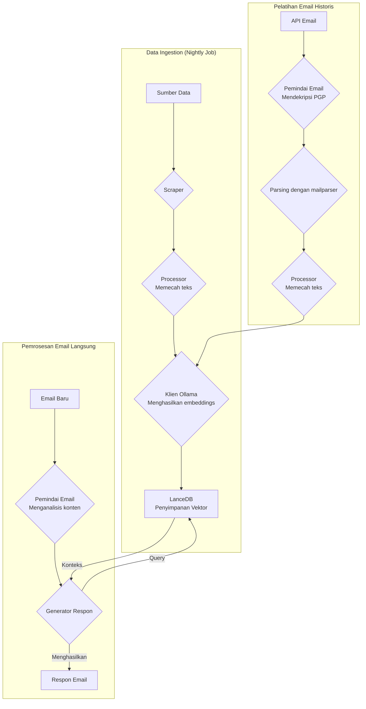
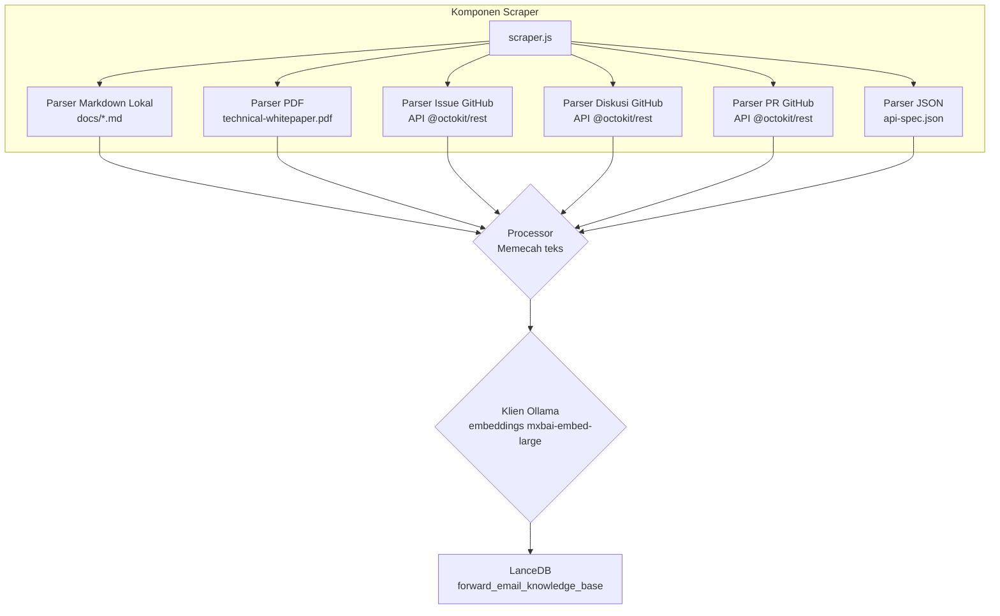
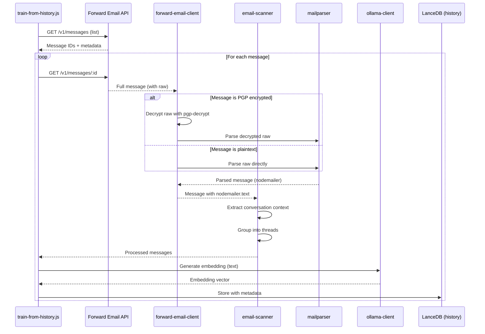

# Membangun Agen Dukungan Pelanggan AI yang Mengutamakan Privasi dengan LanceDB, Ollama, dan Node.js {#building-a-privacy-first-ai-customer-support-agent-with-lancedb-ollama-and-nodejs}


> \[!NOTE]
> Dokumen ini membahas perjalanan kami membangun agen dukungan AI yang di-host sendiri. Kami menulis tentang tantangan serupa dalam posting blog kami [Email Startup Graveyard](https://forwardemail.net/blog/docs/email-startup-graveyard-why-80-percent-email-companies-fail). Kami sebenarnya berpikir untuk menulis kelanjutan berjudul "AI Startup Graveyard" tapi mungkin kami harus menunggu satu tahun lagi sampai gelembung AI mungkin pecah(?). Untuk saat ini, ini adalah catatan pemikiran kami tentang apa yang berhasil, apa yang tidak, dan mengapa kami melakukannya dengan cara ini.

Inilah cara kami membangun agen dukungan pelanggan AI kami sendiri. Kami melakukannya dengan cara yang sulit: di-host sendiri, mengutamakan privasi, dan sepenuhnya di bawah kendali kami. Kenapa? Karena kami tidak mempercayai layanan pihak ketiga dengan data pelanggan kami. Ini adalah persyaratan GDPR dan DPA, dan ini adalah hal yang benar untuk dilakukan.

Ini bukan proyek akhir pekan yang menyenangkan. Ini adalah perjalanan selama sebulan menavigasi ketergantungan yang rusak, dokumentasi yang menyesatkan, dan kekacauan umum ekosistem AI open-source di tahun 2025. Dokumen ini adalah catatan tentang apa yang kami bangun, mengapa kami membangunnya, dan hambatan yang kami temui sepanjang jalan.


## Daftar Isi {#table-of-contents}

* [Manfaat untuk Pelanggan: Dukungan Manusia yang Ditingkatkan AI](#customer-benefits-ai-augmented-human-support)
  * [Respon Lebih Cepat dan Akurat](#faster-more-accurate-responses)
  * [Konsistensi Tanpa Kelelahan](#consistency-without-burnout)
  * [Apa yang Anda Dapatkan](#what-you-get)
* [Refleksi Pribadi: Perjuangan Dua Dekade](#a-personal-reflection-the-two-decade-grind)
* [Mengapa Privasi Penting](#why-privacy-matters)
* [Analisis Biaya: AI Cloud vs Self-Hosted](#cost-analysis-cloud-ai-vs-self-hosted)
  * [Perbandingan Layanan AI Cloud](#cloud-ai-service-comparison)
  * [Rincian Biaya: Basis Pengetahuan 5GB](#cost-breakdown-5gb-knowledge-base)
  * [Biaya Perangkat Keras Self-Hosted](#self-hosted-hardware-costs)
* [Menggunakan API Kami Sendiri](#dogfooding-our-own-api)
  * [Mengapa Menggunakan Sendiri Itu Penting](#why-dogfooding-matters)
  * [Contoh Penggunaan API](#api-usage-examples)
  * [Manfaat Performa](#performance-benefits)
* [Arsitektur Enkripsi](#encryption-architecture)
  * [Lapisan 1: Enkripsi Kotak Surat (chacha20-poly1305)](#layer-1-mailbox-encryption-chacha20-poly1305)
  * [Lapisan 2: Enkripsi PGP Tingkat Pesan](#layer-2-message-level-pgp-encryption)
  * [Mengapa Ini Penting untuk Pelatihan](#why-this-matters-for-training)
  * [Keamanan Penyimpanan](#storage-security)
  * [Penyimpanan Lokal adalah Praktik Standar](#local-storage-is-standard-practice)
* [Arsitektur](#the-architecture)
  * [Alur Tingkat Tinggi](#high-level-flow)
  * [Alur Scraper Detail](#detailed-scraper-flow)
* [Cara Kerjanya](#how-it-works)
  * [Membangun Basis Pengetahuan](#building-the-knowledge-base)
  * [Pelatihan dari Email Historis](#training-from-historical-emails)
  * [Memproses Email Masuk](#processing-incoming-emails)
  * [Manajemen Penyimpanan Vektor](#vector-store-management)
* [Kuburan Database Vektor](#the-vector-database-graveyard)
* [Persyaratan Sistem](#system-requirements)
* [Konfigurasi Cron Job](#cron-job-configuration)
  * [Variabel Lingkungan](#environment-variables)
  * [Cron Job untuk Beberapa Kotak Masuk](#cron-jobs-for-multiple-inboxes)
  * [Rincian Jadwal Cron](#cron-schedule-breakdown)
  * [Perhitungan Tanggal Dinamis](#dynamic-date-calculation)
  * [Pengaturan Awal: Ekstrak Daftar URL dari Sitemap](#initial-setup-extract-url-list-from-sitemap)
  * [Pengujian Cron Job Secara Manual](#testing-cron-jobs-manually)
  * [Memantau Log](#monitoring-logs)
* [Contoh Kode](#code-examples)
  * [Scraping dan Pemrosesan](#scraping-and-processing)
  * [Pelatihan dari Email Historis](#training-from-historical-emails-1)
  * [Query untuk Konteks](#querying-for-context)
* [Masa Depan: R&D Pemindai Spam](#the-future-spam-scanner-rd)
* [Pemecahan Masalah](#troubleshooting)
  * [Kesalahan Ketidaksesuaian Dimensi Vektor](#vector-dimension-mismatch-error)
  * [Konteks Basis Pengetahuan Kosong](#empty-knowledge-base-context)
  * [Kegagalan Dekripsi PGP](#pgp-decryption-failures)
* [Tips Penggunaan](#usage-tips)
  * [Mencapai Inbox Zero](#achieving-inbox-zero)
  * [Menggunakan Label skip-ai](#using-the-skip-ai-label)
  * [Pengelolaan Thread Email dan Balas Semua](#email-threading-and-reply-all)
  * [Pemantauan dan Pemeliharaan](#monitoring-and-maintenance)
* [Pengujian](#testing)
  * [Menjalankan Pengujian](#running-tests)
  * [Cakupan Pengujian](#test-coverage)
  * [Lingkungan Pengujian](#test-environment)
* [Poin Penting](#key-takeaways)
## Manfaat Pelanggan: Dukungan Manusia yang Ditingkatkan AI {#customer-benefits-ai-augmented-human-support}

Sistem AI kami tidak menggantikan tim dukungan kami—melainkan membuat mereka lebih baik. Berikut arti hal ini bagi Anda:

### Respon Lebih Cepat dan Lebih Akurat {#faster-more-accurate-responses}

**Manusia dalam Proses**: Setiap draf yang dihasilkan AI ditinjau, diedit, dan dikurasi oleh tim dukungan manusia kami sebelum dikirimkan kepada Anda. AI menangani riset awal dan pembuatan draf, membebaskan tim kami untuk fokus pada kontrol kualitas dan personalisasi.

**Dilatih dengan Keahlian Manusia**: AI belajar dari:

* Basis pengetahuan dan dokumentasi yang ditulis tangan oleh kami
* Posting blog dan tutorial yang dibuat oleh manusia
* FAQ komprehensif kami (ditulis oleh manusia)
* Percakapan pelanggan sebelumnya (semua ditangani oleh manusia nyata)

Anda mendapatkan jawaban yang diinformasikan oleh bertahun-tahun keahlian manusia, hanya disampaikan lebih cepat.

### Konsistensi Tanpa Kelelahan {#consistency-without-burnout}

Tim kecil kami menangani ratusan permintaan dukungan setiap hari, masing-masing memerlukan pengetahuan teknis yang berbeda dan pergantian konteks mental:

* Pertanyaan penagihan memerlukan pengetahuan sistem keuangan
* Masalah DNS memerlukan keahlian jaringan
* Integrasi API memerlukan pengetahuan pemrograman
* Laporan keamanan memerlukan penilaian kerentanan

Tanpa bantuan AI, pergantian konteks yang konstan ini menyebabkan:

* Waktu respon yang lebih lambat
* Kesalahan manusia akibat kelelahan
* Kualitas jawaban yang tidak konsisten
* Kelelahan tim

**Dengan peningkatan AI**, tim kami:

* Merespon lebih cepat (AI membuat draf dalam hitungan detik)
* Membuat lebih sedikit kesalahan (AI menangkap kesalahan umum)
* Menjaga kualitas yang konsisten (AI merujuk ke basis pengetahuan yang sama setiap saat)
* Tetap segar dan fokus (waktu riset lebih sedikit, waktu membantu lebih banyak)

### Apa yang Anda Dapatkan {#what-you-get}

✅ **Kecepatan**: AI membuat draf jawaban dalam hitungan detik, manusia meninjau dan mengirim dalam beberapa menit

✅ **Akurasi**: Jawaban berdasarkan dokumentasi dan solusi masa lalu kami yang sebenarnya

✅ **Konsistensi**: Jawaban berkualitas tinggi yang sama baik di jam 9 pagi maupun 9 malam

✅ **Sentuhan manusia**: Setiap jawaban ditinjau dan dipersonalisasi oleh tim kami

✅ **Tanpa halusinasi**: AI hanya menggunakan basis pengetahuan terverifikasi kami, bukan data internet umum

> \[!NOTE]
> **Anda selalu berbicara dengan manusia**. AI adalah asisten riset yang membantu tim kami menemukan jawaban yang tepat lebih cepat. Anggaplah seperti pustakawan yang langsung menemukan buku yang relevan—tetapi manusia tetap yang membacanya dan menjelaskannya kepada Anda.


## Refleksi Pribadi: Perjuangan Dua Dekade {#a-personal-reflection-the-two-decade-grind}

Sebelum kita menyelami hal teknis, sebuah catatan pribadi. Saya telah menjalani ini hampir dua dekade. Jam-jam tanpa henti di depan keyboard, pengejaran tanpa henti akan solusi, kerja keras yang dalam dan fokus – inilah realitas membangun sesuatu yang bermakna. Ini adalah realitas yang sering diabaikan dalam siklus hype teknologi baru.

Ledakan AI baru-baru ini sangat membuat frustrasi. Kita dijual mimpi otomasi, asisten AI yang akan menulis kode kita dan menyelesaikan masalah kita. Kenyataannya? Outputnya sering kali adalah kode sampah yang memerlukan waktu lebih lama untuk diperbaiki daripada jika ditulis dari awal. Janji membuat hidup kita lebih mudah adalah palsu. Ini adalah pengalih perhatian dari kerja keras yang diperlukan untuk membangun.

Dan kemudian ada dilema kontribusi open-source. Anda sudah terbagi-bagi, kelelahan dari perjuangan. Anda menggunakan AI untuk membantu menulis laporan bug yang rinci dan terstruktur dengan baik, berharap memudahkan pemelihara memahami dan memperbaiki masalah. Dan apa yang terjadi? Anda dimarahi. Kontribusi Anda dianggap "di luar topik" atau usaha rendah, seperti yang kita lihat dalam [isu GitHub Node.js terbaru](https://github.com/nodejs/node/issues/60719#issuecomment-3534304321). Ini adalah tamparan bagi pengembang senior yang hanya mencoba membantu.

Inilah realitas ekosistem tempat kita bekerja. Ini bukan hanya tentang alat yang rusak; ini tentang budaya yang sering gagal menghormati waktu dan [usaha para kontributornya](https://forwardemail.net/blog/docs/how-npm-packages-billion-downloads-shaped-javascript-ecosystem). Tulisan ini adalah kronik dari realitas itu. Ini adalah cerita tentang alat, ya, tetapi juga tentang biaya manusia dari membangun dalam ekosistem yang rusak yang, meskipun penuh janji, pada dasarnya rusak.
## Mengapa Privasi Penting {#why-privacy-matters}

[Whitepaper teknis](https://forwardemail.net/technical-whitepaper.pdf) kami membahas filosofi privasi kami secara mendalam. Versi singkatnya: kami tidak mengirim data pelanggan ke pihak ketiga. Tidak pernah. Itu berarti tidak ada OpenAI, tidak ada Anthropic, tidak ada basis data vektor yang dihosting di cloud. Semuanya berjalan secara lokal di infrastruktur kami. Ini tidak dapat ditawar demi kepatuhan GDPR dan komitmen DPA kami.


## Analisis Biaya: AI Cloud vs Self-Hosted {#cost-analysis-cloud-ai-vs-self-hosted}

Sebelum masuk ke implementasi teknis, mari kita bahas mengapa self-hosting penting dari perspektif biaya. Model harga layanan AI cloud membuatnya sangat mahal untuk kasus penggunaan volume tinggi seperti dukungan pelanggan.

### Perbandingan Layanan AI Cloud {#cloud-ai-service-comparison}

| Layanan        | Penyedia            | Biaya Embedding                                                  | Biaya LLM (Input)                                                          | Biaya LLM (Output)      | Kebijakan Privasi                                   | GDPR/DPA        | Hosting           | Berbagi Data      |
| -------------- | ------------------- | ---------------------------------------------------------------- | -------------------------------------------------------------------------- | ---------------------- | -------------------------------------------------- | --------------- | ----------------- | ----------------- |
| **OpenAI**     | OpenAI (AS)         | [$0.02-0.13/1M token](https://openai.com/api/pricing/)           | $0.15-20/1M token                                                          | $0.60-80/1M token      | [Link](https://openai.com/policies/privacy-policy/) | DPA Terbatas    | Azure (AS)        | Ya (pelatihan)    |
| **Claude**     | Anthropic (AS)      | N/A                                                              | [$3-20/1M token](https://docs.claude.com/en/docs/about-claude/pricing)     | $15-80/1M token        | [Link](https://www.anthropic.com/legal/privacy)    | DPA Terbatas    | AWS/GCP (AS)      | Tidak (klaim)     |
| **Gemini**     | Google (AS)         | [$0.15/1M token](https://ai.google.dev/gemini-api/docs/pricing)  | $0.30-1.00/1M token                                                        | $2.50/1M token         | [Link](https://policies.google.com/privacy)        | DPA Terbatas    | GCP (AS)          | Ya (peningkatan)  |
| **DeepSeek**   | DeepSeek (China)    | N/A                                                              | [$0.028-0.28/1M token](https://api-docs.deepseek.com/quick_start/pricing) | $0.42/1M token         | [Link](https://www.deepseek.com/en)                | Tidak diketahui | China             | Tidak diketahui   |
| **Mistral**    | Mistral AI (Prancis)| [$0.10/1M token](https://mistral.ai/pricing)                     | $0.40/1M token                                                            | $2.00/1M token         | [Link](https://mistral.ai/terms/)                  | GDPR UE         | UE                | Tidak diketahui   |
| **Self-Hosted**| Anda                | $0 (perangkat keras yang ada)                                   | $0 (perangkat keras yang ada)                                             | $0 (perangkat keras yang ada) | Kebijakan Anda                                   | Kepatuhan penuh | MacBook M5 + cron | Tidak pernah      |

> \[!WARNING]
> **Kekhawatiran kedaulatan data**: Penyedia AS (OpenAI, Claude, Gemini) tunduk pada CLOUD Act, yang memungkinkan pemerintah AS mengakses data. DeepSeek (China) beroperasi di bawah hukum data China. Meskipun Mistral (Prancis) menawarkan hosting UE dan kepatuhan GDPR, self-hosting tetap menjadi satu-satunya opsi untuk kedaulatan dan kontrol data penuh.

### Rincian Biaya: Basis Pengetahuan 5GB {#cost-breakdown-5gb-knowledge-base}

Mari kita hitung biaya memproses basis pengetahuan 5GB (tipikal untuk perusahaan menengah dengan dokumen, email, dan riwayat dukungan).

**Asumsi:**

* 5GB teks ≈ 1,25 miliar token (dengan asumsi \~4 karakter/token)
* Pembuatan embedding awal
* Pelatihan ulang bulanan (embedding ulang penuh)
* 10.000 kueri dukungan per bulan
* Rata-rata kueri: 500 token input, 300 token output
**Rincian Biaya Terperinci:**

| Komponen                              | OpenAI           | Claude          | Gemini               | Self-Hosted        |
| -------------------------------------- | ---------------- | --------------- | -------------------- | ------------------ |
| **Embedding Awal** (1,25M token)       | $25,000          | N/A             | $187,500             | $0                 |
| **Query Bulanan** (10K × 800 token)    | $1,200-16,000    | $2,400-16,000   | $2,400-3,200         | $0                 |
| **Pelatihan Ulang Bulanan** (1,25M token) | $25,000          | N/A             | $187,500             | $0                 |
| **Total Tahun Pertama**                | $325,200-217,000 | $28,800-192,000 | $2,278,800-2,226,000 | ~$60 (listrik)     |
| **Kepatuhan Privasi**                  | ❌ Terbatas      | ❌ Terbatas     | ❌ Terbatas          | ✅ Penuh            |
| **Kedaulatan Data**                    | ❌ Tidak         | ❌ Tidak        | ❌ Tidak             | ✅ Ya               |

> \[!CAUTION]
> **Biaya embedding Gemini sangat tinggi** yaitu $0,15/1J token. Embedding basis pengetahuan 5GB saja akan menghabiskan biaya $187,500. Ini 37x lebih mahal daripada OpenAI dan membuatnya sama sekali tidak layak digunakan untuk produksi.

### Biaya Perangkat Keras Self-Hosted {#self-hosted-hardware-costs}

Setup kami berjalan pada perangkat keras yang sudah kami miliki:

* **Perangkat Keras**: MacBook M5 (sudah dimiliki untuk pengembangan)
* **Biaya tambahan**: $0 (menggunakan perangkat keras yang ada)
* **Listrik**: \~$5/bulan (perkiraan)
* **Total tahun pertama**: \~$60
* **Berjalan terus**: $60/tahun

**ROI**: Self-hosting pada dasarnya tidak memiliki biaya marginal karena kami menggunakan perangkat keras pengembangan yang sudah ada. Sistem berjalan melalui cron job pada jam-jam sepi.


## Menggunakan API Kami Sendiri {#dogfooding-our-own-api}

Salah satu keputusan arsitektur terpenting yang kami buat adalah agar semua pekerjaan AI menggunakan [Forward Email API](https://forwardemail.net/email-api) secara langsung. Ini bukan hanya praktik yang baik—melainkan fungsi pendorong untuk optimasi performa.

### Mengapa Menggunakan Sendiri Itu Penting {#why-dogfooding-matters}

Ketika pekerjaan AI kami menggunakan endpoint API yang sama dengan pelanggan kami:

1. **Kendala performa terasa pada kami terlebih dahulu** - Kami merasakan masalah sebelum pelanggan
2. **Optimasi menguntungkan semua pihak** - Perbaikan untuk pekerjaan kami otomatis meningkatkan pengalaman pelanggan
3. **Pengujian dunia nyata** - Pekerjaan kami memproses ribuan email, memberikan pengujian beban berkelanjutan
4. **Penggunaan ulang kode** - Autentikasi, pembatasan laju, penanganan error, dan caching yang sama

### Contoh Penggunaan API {#api-usage-examples}

**Mendaftar Pesan (train-from-history.js):**

```javascript
// Menggunakan GET /v1/messages?folder=INBOX dengan BasicAuth
// Mengecualikan eml, raw, nodemailer untuk mengurangi ukuran respons (hanya perlu ID)
const response = await axios.get(
  `${this.apiBase}/v1/messages`,
  {
    params: {
      folder: 'INBOX',
      limit: 100,
      eml: false,
      raw: false,
      nodemailer: false
    },
    auth: {
      username: process.env.FORWARD_EMAIL_ALIAS_USERNAME,
      password: process.env.FORWARD_EMAIL_ALIAS_PASSWORD
    }
  }
);

const messages = response.data;
// Mengembalikan: [{ id, subject, date, ... }, ...]
// Isi pesan lengkap diambil kemudian via GET /v1/messages/:id
```

**Mengambil Pesan Lengkap (forward-email-client.js):**

```javascript
// Menggunakan GET /v1/messages/:id untuk mendapatkan pesan lengkap dengan konten raw
const response = await axios.get(
  `${this.apiBase}/v1/messages/${messageId}`,
  {
    auth: {
      username: this.aliasUsername,
      password: this.aliasPassword
    }
  }
);

const message = response.data;
// Mengembalikan: { id, subject, raw, eml, nodemailer: { ... }, ... }
```

**Membuat Draft Balasan (process-inbox.js):**

```javascript
// Menggunakan POST /v1/messages untuk membuat draft balasan
const response = await axios.post(
  `${this.apiBase}/v1/messages`,
  {
    folder: 'Drafts',
    subject: `Re: ${originalSubject}`,
    to: senderEmail,
    text: generatedResponse,
    inReplyTo: originalMessageId
  },
  {
    auth: {
      username: process.env.FORWARD_EMAIL_ALIAS_USERNAME,
      password: process.env.FORWARD_EMAIL_ALIAS_PASSWORD
    }
  }
);
```
### Manfaat Kinerja {#performance-benefits}

Karena pekerjaan AI kami berjalan pada infrastruktur API yang sama:

* **Optimasi caching** menguntungkan baik pekerjaan maupun pelanggan
* **Pembatasan laju** diuji di bawah beban nyata
* **Penanganan kesalahan** telah teruji dalam praktik
* **Waktu respons API** dipantau secara konstan
* **Query database** dioptimalkan untuk kedua kasus penggunaan
* **Optimasi bandwidth** - Mengecualikan `eml`, `raw`, `nodemailer` saat listing mengurangi ukuran respons sekitar \~90%

Ketika `train-from-history.js` memproses 1.000 email, itu membuat lebih dari 1.000 panggilan API. Setiap ketidakefisienan dalam API langsung terlihat. Ini memaksa kami untuk mengoptimalkan akses IMAP, query database, dan serialisasi respons—perbaikan yang langsung menguntungkan pelanggan kami.

**Contoh optimasi**: Listing 100 pesan dengan konten penuh = \~10MB respons. Listing dengan `eml: false, raw: false, nodemailer: false` = \~100KB respons (100x lebih kecil).


## Arsitektur Enkripsi {#encryption-architecture}

Penyimpanan email kami menggunakan beberapa lapisan enkripsi, yang harus didekripsi oleh pekerjaan AI secara real-time untuk pelatihan.

### Lapisan 1: Enkripsi Kotak Surat (chacha20-poly1305) {#layer-1-mailbox-encryption-chacha20-poly1305}

Semua kotak surat IMAP disimpan sebagai database SQLite yang dienkripsi dengan **chacha20-poly1305**, algoritma enkripsi yang aman terhadap komputer kuantum. Ini dijelaskan secara rinci dalam [posting blog layanan email terenkripsi aman kuantum kami](https://forwardemail.net/blog/docs/best-quantum-safe-encrypted-email-service).

**Properti Utama:**

* **Algoritma**: ChaCha20-Poly1305 (cipher AEAD)
* **Aman kuantum**: Tahan terhadap serangan komputasi kuantum
* **Penyimpanan**: File database SQLite di disk
* **Akses**: Didekripsi di memori saat diakses melalui IMAP/API

### Lapisan 2: Enkripsi PGP Tingkat Pesan {#layer-2-message-level-pgp-encryption}

Banyak email dukungan juga dienkripsi dengan PGP (standar OpenPGP). Pekerjaan AI harus mendekripsi ini untuk mengekstrak konten untuk pelatihan.

**Alur Dekripsi:**

```javascript
// 1. API mengembalikan pesan dengan konten raw terenkripsi
const message = await forwardEmailClient.getMessage(id);

// 2. Periksa apakah konten raw terenkripsi PGP
if (isMessageEncrypted(message.raw)) {
  // 3. Dekripsi dengan kunci privat kami
  const decryptedRaw = await pgpDecrypt(message.raw);

  // 4. Parse pesan MIME yang sudah didekripsi
  const parsed = await simpleParser(decryptedRaw);

  // 5. Isi nodemailer dengan konten yang sudah didekripsi
  message.nodemailer = {
    text: parsed.text,
    html: parsed.html,
    from: parsed.from,
    to: parsed.to,
    subject: parsed.subject,
    date: parsed.date
  };
}
```

**Konfigurasi PGP:**

```bash
# Kunci privat untuk dekripsi (path ke file kunci ASCII-armored)
GPG_SECURITY_KEY="/path/to/private-key.asc"

# Passphrase untuk kunci privat (jika terenkripsi)
GPG_SECURITY_PASSPHRASE="your-passphrase"
```

Helper `pgp-decrypt.js`:

1. Membaca kunci privat dari disk sekali saja (disimpan di memori)
2. Mendekripsi kunci dengan passphrase
3. Menggunakan kunci yang sudah didekripsi untuk semua dekripsi pesan
4. Mendukung dekripsi rekursif untuk pesan terenkripsi bersarang

### Mengapa Ini Penting untuk Pelatihan {#why-this-matters-for-training}

Tanpa dekripsi yang tepat, AI akan melatih pada teks terenkripsi yang tidak dapat dimengerti:

```
-----BEGIN PGP MESSAGE-----
Version: OpenPGP.js v4.10.10

wcBMA8Z3lHJnFnNUAQgAqK7F8...
-----END PGP MESSAGE-----
```

Dengan dekripsi, AI melatih pada konten sebenarnya:

```
Subject: Re: Bug Report

Hi John,

Thanks for reporting this issue. I've confirmed the bug
and created a fix in PR #1234...
```

### Keamanan Penyimpanan {#storage-security}

Dekripsi terjadi di memori selama eksekusi pekerjaan, dan konten yang sudah didekripsi diubah menjadi embeddings yang kemudian disimpan di database vektor LanceDB di disk.

**Tempat data disimpan:**

* **Database vektor**: Disimpan di workstation MacBook M5 terenkripsi
* **Keamanan fisik**: Workstation selalu bersama kami (tidak di pusat data)
* **Enkripsi disk**: Enkripsi disk penuh di semua workstation
* **Keamanan jaringan**: Firewall dan terisolasi dari jaringan publik

**Rencana penempatan di pusat data di masa depan:**
Jika kami pindah ke hosting pusat data, server akan memiliki:

* Enkripsi disk penuh LUKS
* Akses USB dinonaktifkan
* Langkah keamanan fisik
* Isolasi jaringan
Untuk detail lengkap tentang praktik keamanan kami, lihat [Halaman Keamanan](https://forwardemail.net/en/security).

> \[!NOTE]
> Basis data vektor berisi embeddings (representasi matematis), bukan teks asli. Namun, embeddings berpotensi direkayasa balik, itulah sebabnya kami menyimpannya di workstation yang terenkripsi dan aman secara fisik.

### Penyimpanan Lokal adalah Praktik Standar {#local-storage-is-standard-practice}

Menyimpan embeddings di workstation tim kami tidak berbeda dengan bagaimana kami sudah menangani email:

* **Thunderbird**: Mengunduh dan menyimpan konten email lengkap secara lokal dalam file mbox/maildir
* **Klien webmail**: Menyimpan cache data email di penyimpanan browser dan basis data lokal
* **Klien IMAP**: Mempertahankan salinan lokal pesan untuk akses offline
* **Sistem AI kami**: Menyimpan embeddings matematis (bukan teks asli) di LanceDB

Perbedaan utamanya: embeddings **lebih aman** daripada email teks asli karena mereka:

1. Representasi matematis, bukan teks yang dapat dibaca
2. Lebih sulit direkayasa balik dibandingkan teks asli
3. Masih tunduk pada keamanan fisik yang sama seperti klien email kami

Jika boleh bagi tim kami menggunakan Thunderbird atau webmail di workstation terenkripsi, maka sama boleh (dan bahkan lebih aman) menyimpan embeddings dengan cara yang sama.


## Arsitektur {#the-architecture}

Berikut alur dasarnya. Terlihat sederhana. Tapi tidak mudah.

> \[!NOTE]
> Semua pekerjaan menggunakan API Forward Email secara langsung, memastikan optimasi performa menguntungkan sistem AI kami dan pelanggan kami.

### Alur Tingkat Tinggi {#high-level-flow}



### Alur Scraper Detail {#detailed-scraper-flow}

`scraper.js` adalah inti dari pengambilan data. Ini adalah kumpulan parser untuk berbagai format data.




## Cara Kerjanya {#how-it-works}

Proses dibagi menjadi tiga bagian utama: membangun basis pengetahuan, melatih dari email historis, dan memproses email baru.

### Membangun Basis Pengetahuan {#building-the-knowledge-base}

**`update-knowledge-base.js`**: Ini adalah pekerjaan utama. Berjalan setiap malam, menghapus penyimpanan vektor lama, dan membangunnya kembali dari awal. Menggunakan `scraper.js` untuk mengambil konten dari semua sumber, `processor.js` untuk memecahnya, dan `ollama-client.js` untuk menghasilkan embeddings. Akhirnya, `vector-store.js` menyimpan semuanya di LanceDB.

**Sumber Data:**

* File Markdown lokal (`docs/*.md`)
* PDF whitepaper teknis (`assets/technical-whitepaper.pdf`)
* JSON spesifikasi API (`assets/api-spec.json`)
* Issue GitHub (melalui Octokit)
* Diskusi GitHub (melalui Octokit)
* Pull request GitHub (melalui Octokit)
* Daftar URL sitemap (`$LANCEDB_PATH/valid-urls.json`)

### Melatih dari Email Historis {#training-from-historical-emails}

**`train-from-history.js`**: Pekerjaan ini memindai email historis dari semua folder, mendekripsi pesan yang dienkripsi PGP, dan menambahkannya ke penyimpanan vektor terpisah (`customer_support_history`). Ini memberikan konteks dari interaksi dukungan masa lalu.
**Alur Pemrosesan Email:**



**Fitur Utama:**

* **Dekripsi PGP**: Menggunakan helper `pgp-decrypt.js` dengan variabel lingkungan `GPG_SECURITY_KEY`
* **Pengelompokan Thread**: Mengelompokkan email terkait ke dalam thread percakapan
* **Preservasi Metadata**: Menyimpan folder, subjek, tanggal, status enkripsi
* **Konteks Balasan**: Menghubungkan pesan dengan balasannya untuk konteks yang lebih baik

**Konfigurasi:**

```bash
# Variabel lingkungan untuk train-from-history
HISTORY_SCAN_LIMIT=1000              # Maksimal pesan yang diproses
HISTORY_SCAN_SINCE="2024-01-01"      # Hanya proses pesan setelah tanggal ini
HISTORY_DECRYPT_PGP=true             # Coba dekripsi PGP
GPG_SECURITY_KEY="/path/to/key.asc"  # Jalur ke kunci privat PGP
GPG_SECURITY_PASSPHRASE="passphrase" # Passphrase kunci (opsional)
```

**Yang Disimpan:**

```javascript
{
  type: 'historical_email',
  folder: 'INBOX',
  subject: 'Re: Bug Report',
  date: '2025-01-15T10:30:00Z',
  messageId: '67e2f288893921...',
  threadId: 'Bug Report',
  hasReply: true,
  encrypted: true,
  decrypted: true,
  replySubject: 'Bug Report',
  replyText: 'First 500 chars of reply...',
  chunkSize: 1000,
  chunkOverlap: 200,
  chunkIndex: 0
}
```

> \[!TIP]
> Jalankan `train-from-history` setelah pengaturan awal untuk mengisi konteks historis. Ini secara dramatis meningkatkan kualitas respons dengan belajar dari interaksi dukungan sebelumnya.

### Memproses Email Masuk {#processing-incoming-emails}

**`process-inbox.js`**: Job ini berjalan pada email di kotak surat `support@forwardemail.net`, `abuse@forwardemail.net`, dan `security@forwardemail.net` (khususnya folder IMAP `INBOX`). Job ini memanfaatkan API kami di <https://forwardemail.net/email-api> (misalnya `GET /v1/messages?folder=INBOX` menggunakan akses BasicAuth dengan kredensial IMAP untuk setiap kotak surat). Job ini menganalisis isi email, melakukan query ke basis pengetahuan (`forward_email_knowledge_base`) dan penyimpanan vektor email historis (`customer_support_history`), lalu menggabungkan konteks tersebut ke `response-generator.js`. Generator menggunakan `mxbai-embed-large` melalui Ollama untuk membuat respons.

**Fitur Alur Kerja Otomatis:**

1. **Otomasi Inbox Zero**: Setelah berhasil membuat draft, pesan asli secara otomatis dipindahkan ke folder Arsip. Ini menjaga kotak masuk tetap bersih dan membantu mencapai inbox zero tanpa intervensi manual.

2. **Lewati Pemrosesan AI**: Cukup tambahkan label `skip-ai` (tidak sensitif huruf) pada pesan apa pun untuk mencegah pemrosesan AI. Pesan akan tetap di inbox tanpa disentuh, memungkinkan Anda menanganinya secara manual. Ini berguna untuk pesan sensitif atau kasus kompleks yang memerlukan penilaian manusia.

3. **Pengelolaan Thread Email yang Tepat**: Semua draft balasan menyertakan pesan asli yang dikutip di bawahnya (menggunakan prefix standar ` >  `), mengikuti konvensi balasan email dengan format "Pada \[tanggal], \[pengirim] menulis:". Ini memastikan konteks percakapan dan pengelompokan thread yang tepat di klien email.

4. **Perilaku Balas Semua**: Sistem secara otomatis menangani header Reply-To dan penerima CC:
   * Jika header Reply-To ada, maka menjadi alamat To dan From asli ditambahkan ke CC
   * Semua penerima To dan CC asli disertakan dalam CC balasan (kecuali alamat Anda sendiri)
   * Mengikuti konvensi balas semua standar untuk percakapan grup
**Peringkat Sumber**: Sistem menggunakan **peringkat berbobot** untuk memprioritaskan sumber:

* FAQ: 100% (prioritas tertinggi)
* Whitepaper teknis: 95%
* Spesifikasi API: 90%
* Dokumen resmi: 85%
* Masalah GitHub: 70%
* Email historis: 50%

### Manajemen Vector Store {#vector-store-management}

Kelas `VectorStore` di `helpers/customer-support-ai/vector-store.js` adalah antarmuka kami ke LanceDB.

**Menambahkan Dokumen:**

```javascript
// vector-store.js
async addDocument(text, metadata) {
  const embedding = await this.ollama.generateEmbedding(text);
  await this.table.add([{
    vector: embedding,
    text,
    ...metadata
  }]);
}
```

**Mengosongkan Store:**

```javascript
// Opsi 1: Gunakan metode clear()
await vectorStore.clear();

// Opsi 2: Hapus direktori database lokal
await fs.rm(process.env.LANCEDB_PATH, { recursive: true, force: true });
```

Variabel lingkungan `LANCEDB_PATH` menunjuk ke direktori database embedded lokal. LanceDB bersifat serverless dan embedded, jadi tidak ada proses terpisah yang harus dikelola.


## Kuburan Database Vektor {#the-vector-database-graveyard}

Ini adalah hambatan besar pertama. Kami mencoba beberapa database vektor sebelum akhirnya memilih LanceDB. Berikut yang salah dengan masing-masing.

| Database     | GitHub                                                      | Apa yang Salah                                                                                                                                                                                                      | Masalah Spesifik                                                                                                                                                                                                                                                                                                                                                           | Kekhawatiran Keamanan                                                                                                                                                                                                |
| ------------ | ----------------------------------------------------------- | -------------------------------------------------------------------------------------------------------------------------------------------------------------------------------------------------------------------- | ------------------------------------------------------------------------------------------------------------------------------------------------------------------------------------------------------------------------------------------------------------------------------------------------------------------------------------------------------------------------- | ---------------------------------------------------------------------------------------------------------------------------------------------------------------------------------------------------------------- |
| **ChromaDB** | [chroma-core/chroma](https://github.com/chroma-core/chroma) | `pip3 install chromadb` memberikan versi kuno dengan `PydanticImportError`. Satu-satunya cara mendapatkan versi yang berfungsi adalah dengan mengompilasi dari sumber. Tidak ramah pengembang.                        | Kekacauan dependensi Python. Banyak pengguna melaporkan instalasi pip yang rusak ([#774](https://github.com/chroma-core/chroma/issues/774), [#163](https://github.com/chroma-core/chroma/issues/163)). Dokumentasi mengatakan "gunakan Docker saja" yang bukan jawaban untuk pengembangan lokal. Crash di Windows dengan >99 catatan ([#3058](https://github.com/chroma-core/chroma/issues/3058)). | **CVE-2024-45848**: Eksekusi kode sewenang-wenang melalui integrasi ChromaDB di MindsDB. Kerentanan OS kritis di image Docker ([#3170](https://github.com/chroma-core/chroma/issues/3170)).                      |
| **Qdrant**   | [qdrant/qdrant](https://github.com/qdrant/qdrant)           | Homebrew tap (`qdrant/qdrant/qdrant`) yang disebutkan di dokumentasi lama sudah hilang. Menghilang tanpa penjelasan. Dokumentasi resmi sekarang hanya mengatakan "gunakan Docker."                                  | Homebrew tap hilang. Tidak ada binary native untuk macOS. Hanya Docker menjadi hambatan untuk pengujian lokal cepat.                                                                                                                                                                                                                                                                           | **CVE-2024-2221**: Kerentanan upload file sewenang-wenang yang memungkinkan eksekusi kode jarak jauh (diperbaiki di v1.9.0). Skor kematangan keamanan lemah dari [IronCore Labs](https://ironcorelabs.com/vectordbs/qdrant-security/). |
| **Weaviate** | [weaviate/weaviate](https://github.com/weaviate/weaviate)   | Versi Homebrew memiliki bug clustering kritis (`leader not found`). Flag yang didokumentasikan untuk memperbaikinya (`RAFT_JOIN`, `CLUSTER_HOSTNAME`) tidak berfungsi. Secara fundamental rusak untuk setup node tunggal. | Bug clustering bahkan dalam mode node tunggal. Terlalu rumit untuk kasus penggunaan sederhana.                                                                                                                                                                                                                                                                                           | Tidak ada CVE besar ditemukan, tapi kompleksitas meningkatkan permukaan serangan.                                                                                                                                                    |
| **LanceDB**  | [lancedb/lancedb](https://github.com/lancedb/lancedb)       | Ini berhasil. Embedded dan serverless. Tidak ada proses terpisah. Satu-satunya gangguan adalah penamaan paket yang membingungkan (`vectordb` sudah usang, gunakan `@lancedb/lancedb`) dan dokumentasi yang tersebar. Kami bisa menerima itu. | Kebingungan penamaan paket (`vectordb` vs `@lancedb/lancedb`), tapi selain itu solid. Arsitektur embedded menghilangkan kelas masalah keamanan secara keseluruhan.                                                                                                                                                                                                                     | Tidak ada CVE yang diketahui. Desain embedded berarti tidak ada permukaan serangan jaringan.                                                                                                                                                  |
> \[!WARNING]
> **ChromaDB memiliki kerentanan keamanan kritis.** [CVE-2024-45848](https://nvd.nist.gov/vuln/detail/CVE-2024-45848) memungkinkan eksekusi kode sewenang-wenang. Instalasi pip secara fundamental rusak dengan masalah dependensi Pydantic. Hindari untuk penggunaan produksi.

> \[!WARNING]
> **Qdrant memiliki kerentanan RCE unggah file** ([CVE-2024-2221](https://qdrant.tech/blog/cve-2024-2221-response/)) yang hanya diperbaiki di v1.9.0. Jika Anda harus menggunakan Qdrant, pastikan Anda menggunakan versi terbaru.

> \[!CAUTION]
> Ekosistem basis data vektor open-source masih kasar. Jangan percaya dokumentasi. Asumsikan semuanya rusak sampai terbukti sebaliknya. Uji secara lokal sebelum berkomitmen pada sebuah stack.


## Persyaratan Sistem {#system-requirements}

* **Node.js:** v18.0.0+ ([GitHub](https://github.com/nodejs/node))
* **Ollama:** Terbaru ([GitHub](https://github.com/ollama/ollama))
* **Model:** `mxbai-embed-large` melalui Ollama
* **Basis Data Vektor:** LanceDB ([GitHub](https://github.com/lancedb/lancedb))
* **Akses GitHub:** `@octokit/rest` untuk scraping issues ([GitHub](https://github.com/octokit/rest.js))
* **SQLite:** Untuk basis data utama (melalui `mongoose-to-sqlite`)


## Konfigurasi Cron Job {#cron-job-configuration}

Semua pekerjaan AI dijalankan melalui cron di MacBook M5. Berikut cara mengatur cron job agar berjalan pada tengah malam di beberapa inbox.

### Variabel Lingkungan {#environment-variables}

Pekerjaan ini memerlukan variabel lingkungan berikut. Sebagian besar dapat diatur di file `.env` (dimuat melalui `@ladjs/env`), tetapi `HISTORY_SCAN_SINCE` harus dihitung secara dinamis di crontab.

**Di file `.env`:**

```bash
# Kredensial API Forward Email (berubah per inbox)
FORWARD_EMAIL_ALIAS_USERNAME=support@forwardemail.net
FORWARD_EMAIL_ALIAS_PASSWORD=password-imap-anda

# Dekripsi PGP (dibagikan ke semua inbox)
GPG_SECURITY_KEY=/path/to/private-key.asc
GPG_SECURITY_PASSPHRASE=passphrase-anda

# Konfigurasi pemindaian historis
HISTORY_SCAN_LIMIT=1000

# Path LanceDB
LANCEDB_PATH=/path/to/lancedb
```

**Di crontab (dihitung secara dinamis):**

```bash
# HISTORY_SCAN_SINCE harus diatur inline di crontab dengan perhitungan tanggal shell
# Tidak bisa di file .env karena @ladjs/env tidak mengevaluasi perintah shell
HISTORY_SCAN_SINCE="$(date -v-1d +%Y-%m-%d)"  # macOS
HISTORY_SCAN_SINCE="$(date -d 'yesterday' +%Y-%m-%d)"  # Linux
```

### Cron Jobs untuk Beberapa Inbox {#cron-jobs-for-multiple-inboxes}

Edit crontab Anda dengan `crontab -e` dan tambahkan:

```bash
# Perbarui basis pengetahuan (berjalan sekali, dibagikan ke semua inbox)
0 0 * * * cd /path/to/forwardemail.net && LANCEDB_PATH="/path/to/lancedb" GPG_SECURITY_KEY="/path/to/key.asc" GPG_SECURITY_PASSPHRASE="pass" node jobs/customer-support-ai/update-knowledge-base.js >> /var/log/update-knowledge-base.log 2>&1

# Latih dari riwayat - support@forwardemail.net
0 0 * * * cd /path/to/forwardemail.net && FORWARD_EMAIL_ALIAS_USERNAME="support@forwardemail.net" FORWARD_EMAIL_ALIAS_PASSWORD="support-password" HISTORY_SCAN_SINCE="$(date -v-1d +%Y-%m-%d)" HISTORY_SCAN_LIMIT=1000 GPG_SECURITY_KEY="/path/to/key.asc" GPG_SECURITY_PASSPHRASE="pass" LANCEDB_PATH="/path/to/lancedb" node jobs/customer-support-ai/train-from-history.js >> /var/log/train-support.log 2>&1

# Latih dari riwayat - abuse@forwardemail.net
0 0 * * * cd /path/to/forwardemail.net && FORWARD_EMAIL_ALIAS_USERNAME="abuse@forwardemail.net" FORWARD_EMAIL_ALIAS_PASSWORD="abuse-password" HISTORY_SCAN_SINCE="$(date -v-1d +%Y-%m-%d)" HISTORY_SCAN_LIMIT=1000 GPG_SECURITY_KEY="/path/to/key.asc" GPG_SECURITY_PASSPHRASE="pass" LANCEDB_PATH="/path/to/lancedb" node jobs/customer-support-ai/train-from-history.js >> /var/log/train-abuse.log 2>&1

# Latih dari riwayat - security@forwardemail.net
0 0 * * * cd /path/to/forwardemail.net && FORWARD_EMAIL_ALIAS_USERNAME="security@forwardemail.net" FORWARD_EMAIL_ALIAS_PASSWORD="security-password" HISTORY_SCAN_SINCE="$(date -v-1d +%Y-%m-%d)" HISTORY_SCAN_LIMIT=1000 GPG_SECURITY_KEY="/path/to/key.asc" GPG_SECURITY_PASSPHRASE="pass" LANCEDB_PATH="/path/to/lancedb" node jobs/customer-support-ai/train-from-history.js >> /var/log/train-security.log 2>&1

# Proses inbox - support@forwardemail.net
*/5 * * * * cd /path/to/forwardemail.net && FORWARD_EMAIL_ALIAS_USERNAME="support@forwardemail.net" FORWARD_EMAIL_ALIAS_PASSWORD="support-password" GPG_SECURITY_KEY="/path/to/key.asc" GPG_SECURITY_PASSPHRASE="pass" LANCEDB_PATH="/path/to/lancedb" node jobs/customer-support-ai/process-inbox.js >> /var/log/process-support.log 2>&1

# Proses inbox - abuse@forwardemail.net
*/5 * * * * cd /path/to/forwardemail.net && FORWARD_EMAIL_ALIAS_USERNAME="abuse@forwardemail.net" FORWARD_EMAIL_ALIAS_PASSWORD="abuse-password" GPG_SECURITY_KEY="/path/to/key.asc" GPG_SECURITY_PASSPHRASE="pass" LANCEDB_PATH="/path/to/lancedb" node jobs/customer-support-ai/process-inbox.js >> /var/log/process-abuse.log 2>&1

# Proses inbox - security@forwardemail.net
*/5 * * * * cd /path/to/forwardemail.net && FORWARD_EMAIL_ALIAS_USERNAME="security@forwardemail.net" FORWARD_EMAIL_ALIAS_PASSWORD="security-password" GPG_SECURITY_KEY="/path/to/key.asc" GPG_SECURITY_PASSPHRASE="pass" LANCEDB_PATH="/path/to/lancedb" node jobs/customer-support-ai/process-inbox.js >> /var/log/process-security.log 2>&1
```
### Rincian Jadwal Cron {#cron-schedule-breakdown}

| Pekerjaan               | Jadwal       | Deskripsi                                                                         |
| ----------------------- | ------------ | --------------------------------------------------------------------------------- |
| `train-from-sitemap.js` | `0 0 * * 0`  | Mingguan (Minggu tengah malam) - Mengambil semua URL dari sitemap dan melatih basis pengetahuan |
| `train-from-history.js` | `0 0 * * *`  | Tengah malam setiap hari - Memindai email hari sebelumnya per inbox               |
| `process-inbox.js`      | `*/5 * * * *`| Setiap 5 menit - Memproses email baru dan menghasilkan draft                      |

### Perhitungan Tanggal Dinamis {#dynamic-date-calculation}

Variabel `HISTORY_SCAN_SINCE` **harus dihitung secara langsung di crontab** karena:

1. File `.env` dibaca sebagai string literal oleh `@ladjs/env`
2. Substitusi perintah shell `$(...)` tidak berfungsi di file `.env`
3. Tanggal perlu dihitung ulang setiap kali cron berjalan

**Pendekatan yang benar (di crontab):**

```bash
# macOS (BSD date)
HISTORY_SCAN_SINCE="$(date -v-1d +%Y-%m-%d)" node jobs/...

# Linux (GNU date)
HISTORY_SCAN_SINCE="$(date -d 'yesterday' +%Y-%m-%d)" node jobs/...
```

**Pendekatan yang salah (tidak berfungsi di .env):**

```bash
# Ini akan dibaca sebagai string literal "$(date -v-1d +%Y-%m-%d)"
# TIDAK dievaluasi sebagai perintah shell
HISTORY_SCAN_SINCE=$(date -v-1d +%Y-%m-%d)
```

Ini memastikan setiap proses malam menghitung tanggal hari sebelumnya secara dinamis, menghindari pekerjaan yang berulang.

### Pengaturan Awal: Ekstrak Daftar URL dari Sitemap {#initial-setup-extract-url-list-from-sitemap}

Sebelum menjalankan pekerjaan process-inbox untuk pertama kali, Anda **harus** mengekstrak daftar URL dari sitemap. Ini membuat kamus URL valid yang dapat dirujuk oleh LLM dan mencegah halusinasi URL.

```bash
# Pengaturan pertama kali: Ekstrak daftar URL dari sitemap
cd /path/to/forwardemail.net
node jobs/customer-support-ai/train-from-sitemap.js
```

**Apa yang dilakukan ini:**

1. Mengambil semua URL dari <https://forwardemail.net/sitemap.xml>
2. Memfilter hanya URL non-lokal atau URL /en/ (menghindari konten duplikat)
3. Menghapus awalan lokal (/en/faq → /faq)
4. Menyimpan file JSON sederhana dengan daftar URL ke `$LANCEDB_PATH/valid-urls.json`
5. Tidak melakukan crawling, tidak mengumpulkan metadata - hanya daftar URL valid datar

**Mengapa ini penting:**

* Mencegah LLM menghalusinasi URL palsu seperti `/dashboard` atau `/login`
* Menyediakan daftar putih URL valid untuk generator respons merujuk
* Sederhana, cepat, dan tidak memerlukan penyimpanan database vektor
* Generator respons memuat daftar ini saat startup dan menyertakannya dalam prompt

**Tambahkan ke crontab untuk pembaruan mingguan:**

```bash
# Ekstrak daftar URL dari sitemap - mingguan pada Minggu tengah malam
0 0 * * 0 cd /path/to/forwardemail.net && node jobs/customer-support-ai/train-from-sitemap.js >> /var/log/train-sitemap.log 2>&1
```

### Menguji Pekerjaan Cron Secara Manual {#testing-cron-jobs-manually}

Untuk menguji pekerjaan sebelum menambahkannya ke cron:

```bash
# Uji pelatihan sitemap
cd /path/to/forwardemail.net
export LANCEDB_PATH="/path/to/lancedb"
node jobs/customer-support-ai/train-from-sitemap.js

# Uji pelatihan inbox dukungan
cd /path/to/forwardemail.net
export FORWARD_EMAIL_ALIAS_USERNAME="support@forwardemail.net"
export FORWARD_EMAIL_ALIAS_PASSWORD="support-password"
export HISTORY_SCAN_SINCE="$(date -v-1d +%Y-%m-%d)"
export HISTORY_SCAN_LIMIT=1000
export GPG_SECURITY_KEY="/path/to/key.asc"
export GPG_SECURITY_PASSPHRASE="pass"
export LANCEDB_PATH="/path/to/lancedb"
node jobs/customer-support-ai/train-from-history.js
```

### Memantau Log {#monitoring-logs}

Setiap pekerjaan mencatat ke file terpisah untuk memudahkan debugging:

```bash
# Pantau pemrosesan inbox dukungan secara real-time
tail -f /var/log/process-support.log

# Periksa pelatihan malam kemarin
cat /var/log/train-support.log | grep "$(date -v-1d +%Y-%m-%d)"

# Lihat semua error di seluruh pekerjaan
grep -i error /var/log/train-*.log /var/log/process-*.log
```

> \[!TIP]
> Gunakan file log terpisah per inbox untuk mengisolasi masalah. Jika satu inbox mengalami masalah autentikasi, itu tidak akan mencemari log inbox lain.
## Contoh Kode {#code-examples}

### Scraping dan Pemrosesan {#scraping-and-processing}

```javascript
// jobs/customer-support-ai/update-knowledge-base.js
const scraper = new Scraper();
const processor = new Processor();
const ollamaClient = new OllamaClient();
const vectorStore = new VectorStore();

// Bersihkan data lama
await vectorStore.clear();

// Scrape semua sumber
const documents = await scraper.scrapeAll();
console.log(`Scraped ${documents.length} dokumen`);

// Proses menjadi potongan
const allChunks = [];
for (const doc of documents) {
  const chunks = processor.processDocuments([doc]);
  allChunks.push(...chunks);
}
console.log(`Menghasilkan ${allChunks.length} potongan`);

// Hasilkan embeddings dan simpan
const texts = allChunks.map(chunk => chunk.text);
const embeddings = await ollamaClient.generateEmbeddings(texts);

for (let i = 0; i < allChunks.length; i++) {
  await vectorStore.addDocument(texts[i], {
    ...allChunks[i].metadata,
    embedding: embeddings[i]
  });
}
```

### Pelatihan dari Email Historis {#training-from-historical-emails-1}

```javascript
// jobs/customer-support-ai/train-from-history.js
const scanner = new EmailScanner({
  forwardEmailApiBase: config.forwardEmailApiBase,
  forwardEmailAliasUsername: config.forwardEmailAliasUsername,
  forwardEmailAliasPassword: config.forwardEmailAliasPassword
});

const vectorStore = new VectorStore({
  collectionName: 'customer_support_history'
});

// Pindai semua folder (INBOX, Sent Mail, dll.)
const messages = await scanner.scanAllFolders({
  limit: 1000,
  since: new Date('2024-01-01'),
  decryptPGP: true
});

// Kelompokkan menjadi thread percakapan
const threads = scanner.groupIntoThreads(messages);

// Proses setiap thread
for (const thread of threads) {
  const context = scanner.extractConversationContext(thread);

  for (const message of context.messages) {
    // Lewati pesan terenkripsi yang tidak bisa didekripsi
    if (message.encrypted && !message.decrypted) continue;

    // Gunakan konten yang sudah diparsing dari nodemailer
    const text = message.nodemailer?.text || '';
    if (!text.trim()) continue;

    // Potong dan simpan
    const chunks = processor.chunkText(`Subject: ${message.subject}\n\n${text}`, {
      chunkSize: 1000,
      chunkOverlap: 200
    });

    for (const chunk of chunks) {
      await vectorStore.addDocument(chunk.text, {
        type: 'historical_email',
        folder: message.folder,
        subject: message.subject,
        date: message.nodemailer?.date || message.created_at,
        messageId: message.id,
        threadId: context.subject,
        encrypted: message.encrypted || false,
        decrypted: message.decrypted || false,
        ...chunk.metadata
      });
    }
  }
}
```

### Query untuk Konteks {#querying-for-context}

```javascript
// jobs/customer-support-ai/process-inbox.js
const vectorStore = new VectorStore();
const historyVectorStore = new VectorStore({
  collectionName: 'customer_support_history'
});

// Query kedua penyimpanan
const knowledgeContext = await vectorStore.query(emailEmbedding, { limit: 8 });
const historyContext = await historyVectorStore.query(emailEmbedding, { limit: 3 });

// Peringkat berbobot dan deduplikasi terjadi di sini
const rankedContext = rankAndDeduplicateContext(knowledgeContext, historyContext);

// Hasilkan respons
const response = await responseGenerator.generate(email, rankedContext);
```


## Masa Depan: R\&D Pemindai Spam {#the-future-spam-scanner-rd}

Seluruh proyek ini bukan hanya untuk dukungan pelanggan. Ini adalah R\&D. Sekarang kita dapat mengambil semua yang telah kita pelajari tentang embeddings lokal, penyimpanan vektor, dan pengambilan konteks dan menerapkannya pada proyek besar kita berikutnya: lapisan LLM untuk [Spam Scanner](https://spamscanner.net). Prinsip yang sama tentang privasi, self-hosting, dan pemahaman semantik akan menjadi kunci.


## Pemecahan Masalah {#troubleshooting}

### Kesalahan Ketidaksesuaian Dimensi Vektor {#vector-dimension-mismatch-error}

**Kesalahan:**

```
Error: Failed to execute query stream: GenericFailure, Invalid input, No vector column found to match with the query vector dimension: 1024
```

**Penyebab:** Kesalahan ini terjadi ketika Anda mengganti model embedding (misalnya, dari `mistral-small` ke `mxbai-embed-large`) tetapi database LanceDB yang ada dibuat dengan dimensi vektor yang berbeda.
**Solusi:** Anda perlu melatih ulang basis pengetahuan dengan model embedding baru:

```bash
# 1. Hentikan semua pekerjaan AI dukungan pelanggan yang sedang berjalan
pkill -f customer-support-ai

# 2. Hapus database LanceDB yang ada
rm -rf ~/.local/share/lancedb/forward_email_knowledge_base.lance
rm -rf ~/.local/share/lancedb/customer_support_history.lance

# 3. Verifikasi model embedding sudah diatur dengan benar di .env
grep OLLAMA_EMBEDDING_MODEL .env
# Seharusnya menampilkan: OLLAMA_EMBEDDING_MODEL=mxbai-embed-large

# 4. Tarik model embedding di Ollama
ollama pull mxbai-embed-large

# 5. Latih ulang basis pengetahuan
node jobs/customer-support-ai/train-from-history.js

# 6. Mulai ulang pekerjaan process-inbox melalui Bree
# Pekerjaan ini akan berjalan otomatis setiap 5 menit
```

**Mengapa ini terjadi:** Model embedding yang berbeda menghasilkan vektor dengan dimensi yang berbeda:

* `mistral-small`: 1024 dimensi
* `mxbai-embed-large`: 1024 dimensi
* `nomic-embed-text`: 768 dimensi
* `all-minilm`: 384 dimensi

LanceDB menyimpan dimensi vektor dalam skema tabel. Ketika Anda melakukan query dengan dimensi yang berbeda, itu gagal. Satu-satunya solusi adalah membuat ulang database dengan model baru.

### Konteks Basis Pengetahuan Kosong {#empty-knowledge-base-context}

**Gejala:**

```
debug     Retrieved knowledge base context {
  total: 0,
  afterRanking: 0,
  questionType: 'capability'
}
```

**Penyebab:** Basis pengetahuan belum dilatih, atau tabel LanceDB tidak ada.

**Solusi:** Jalankan pekerjaan pelatihan untuk mengisi basis pengetahuan:

```bash
# Latih dari email historis
node jobs/customer-support-ai/train-from-history.js

# Atau latih dari website/dokumen (jika Anda memiliki scraper)
node jobs/customer-support-ai/train-from-website.js
```

### Kegagalan Dekripsi PGP {#pgp-decryption-failures}

**Gejala:** Pesan muncul sebagai terenkripsi tetapi kontennya kosong.

**Solusi:**

1. Verifikasi jalur kunci GPG sudah diatur dengan benar:

```bash
grep GPG_SECURITY_KEY .env
# Seharusnya menunjuk ke file kunci privat Anda
```

2. Uji dekripsi secara manual:

```bash
node -e "const decrypt = require('./helpers/customer-support-ai/pgp-decrypt'); decrypt.testDecryption();"
```

3. Periksa izin kunci:

```bash
ls -la /path/to/your/gpg-key.asc
# Harus dapat dibaca oleh pengguna yang menjalankan pekerjaan
```


## Tips Penggunaan {#usage-tips}

### Mencapai Inbox Zero {#achieving-inbox-zero}

Sistem dirancang untuk membantu Anda mencapai inbox zero secara otomatis:

1. **Pengarsipan Otomatis**: Saat draft berhasil dibuat, pesan asli secara otomatis dipindahkan ke folder Arsip. Ini menjaga inbox Anda tetap bersih tanpa intervensi manual.

2. **Tinjau Draft**: Periksa folder Draft secara rutin untuk meninjau balasan yang dihasilkan AI. Edit sesuai kebutuhan sebelum mengirim.

3. **Override Manual**: Untuk pesan yang memerlukan perhatian khusus, cukup tambahkan label `skip-ai` sebelum pekerjaan dijalankan.

### Menggunakan Label skip-ai {#using-the-skip-ai-label}

Untuk mencegah pemrosesan AI pada pesan tertentu:

1. **Tambahkan label**: Di klien email Anda, tambahkan label/tag `skip-ai` pada pesan apa pun (tidak sensitif huruf)
2. **Pesan tetap di inbox**: Pesan tidak akan diproses atau diarsipkan
3. **Tangani secara manual**: Anda dapat membalasnya sendiri tanpa gangguan AI

**Kapan menggunakan skip-ai:**

* Pesan sensitif atau rahasia
* Kasus kompleks yang memerlukan penilaian manusia
* Pesan dari pelanggan VIP
* Pertanyaan terkait hukum atau kepatuhan
* Pesan yang memerlukan perhatian manusia segera

### Pengelolaan Thread Email dan Balas Semua {#email-threading-and-reply-all}

Sistem mengikuti konvensi email standar:

**Pesan Asli yang Dikutip:**

```
Hi there,

[Balasan yang dihasilkan AI]

--
Thank you,
Forward Email
https://forwardemail.net

On Mon, Jan 15, 2024, 3:45 PM John Doe <john@example.com> wrote:
> This is the original message
> with each line quoted
> using the standard "> " prefix
```

**Penanganan Reply-To:**

* Jika pesan asli memiliki header Reply-To, draft membalas ke alamat tersebut
* Alamat From asli ditambahkan ke CC
* Semua penerima To dan CC asli lainnya dipertahankan

**Contoh:**

```
Pesan asli:
  From: john@company.com
  Reply-To: support@company.com
  To: support@forwardemail.net
  CC: manager@company.com

Draft balasan:
  To: support@company.com (dari Reply-To)
  CC: john@company.com, manager@company.com
```
### Pemantauan dan Pemeliharaan {#monitoring-and-maintenance}

**Periksa kualitas draft secara berkala:**

```bash
# Lihat draft terbaru
tail -f /var/log/process-support.log | grep "Draft created"
```

**Pantau pengarsipan:**

```bash
# Periksa kesalahan pengarsipan
grep "archive message" /var/log/process-*.log
```

**Tinjau pesan yang dilewati:**

```bash
# Lihat pesan mana yang dilewati
grep "skip-ai label" /var/log/process-*.log
```


## Pengujian {#testing}

Sistem AI dukungan pelanggan mencakup cakupan pengujian komprehensif dengan 23 tes Ava.

### Menjalankan Tes {#running-tests}

Karena konflik override paket npm dengan `better-sqlite3`, gunakan skrip tes yang disediakan:

```bash
# Jalankan semua tes AI dukungan pelanggan
./scripts/test-customer-support-ai.sh

# Jalankan dengan output verbose
./scripts/test-customer-support-ai.sh --verbose

# Jalankan file tes tertentu
./scripts/test-customer-support-ai.sh test/customer-support-ai/message-utils.js
```

Sebagai alternatif, jalankan tes langsung:

```bash
NODE_ENV=test node node_modules/.pnpm/ava@5.3.1/node_modules/ava/entrypoints/cli.mjs test/customer-support-ai
```

### Cakupan Tes {#test-coverage}

**Pengambil Sitemap (6 tes):**

* Pencocokan pola regex locale
* Ekstraksi path URL dan penghilangan locale
* Logika penyaringan URL untuk locale
* Logika parsing XML
* Logika deduplikasi
* Kombinasi penyaringan, penghilangan, dan deduplikasi

**Utilitas Pesan (9 tes):**

* Ekstrak teks pengirim dengan nama dan email
* Tangani email saja saat nama cocok dengan prefix
* Gunakan from.text jika tersedia
* Gunakan Reply-To jika ada
* Gunakan From jika tidak ada Reply-To
* Sertakan penerima CC asli
* Kecualikan alamat kami sendiri dari CC
* Tangani Reply-To dengan From di CC
* Deduplikasi alamat CC

**Generator Respons (8 tes):**

* Logika pengelompokan URL untuk prompt
* Logika deteksi nama pengirim
* Struktur prompt mencakup semua bagian yang diperlukan
* Format daftar URL tanpa tanda kurung sudut
* Penanganan daftar URL kosong
* Daftar URL terlarang dalam prompt
* Penyertaan konteks historis
* URL yang benar untuk topik terkait akun

### Lingkungan Tes {#test-environment}

Tes menggunakan `.env.test` untuk konfigurasi. Lingkungan tes mencakup:

* Kredensial PayPal dan Stripe tiruan
* Kunci enkripsi tes
* Penyedia autentikasi dinonaktifkan
* Jalur data tes yang aman

Semua tes dirancang untuk dijalankan tanpa ketergantungan eksternal atau panggilan jaringan.


## Poin Penting {#key-takeaways}

1. **Privasi utama:** Self-hosting adalah keharusan untuk kepatuhan GDPR/DPA.
2. **Biaya penting:** Layanan AI cloud 50-1000x lebih mahal daripada self-hosting untuk beban kerja produksi.
3. **Ekosistem bermasalah:** Sebagian besar database vektor tidak ramah pengembang. Uji semuanya secara lokal.
4. **Kerentanan keamanan nyata:** ChromaDB dan Qdrant pernah memiliki kerentanan RCE kritis.
5. **LanceDB bekerja:** Terbenam, tanpa server, dan tidak memerlukan proses terpisah.
6. **Ollama solid:** Inferensi LLM lokal dengan `mxbai-embed-large` bekerja baik untuk kasus kami.
7. **Ketidaksesuaian tipe membunuh:** `text` vs. `content`, ObjectID vs. string. Bug ini diam dan brutal.
8. **Peringkat berbobot penting:** Tidak semua konteks sama. FAQ > isu GitHub > email historis.
9. **Konteks historis adalah emas:** Pelatihan dari email dukungan masa lalu secara dramatis meningkatkan kualitas respons.
10. **Dekripsi PGP penting:** Banyak email dukungan terenkripsi; dekripsi yang tepat sangat penting untuk pelatihan.

---

Pelajari lebih lanjut tentang Forward Email dan pendekatan privasi kami terhadap email di [forwardemail.net](https://forwardemail.net).
