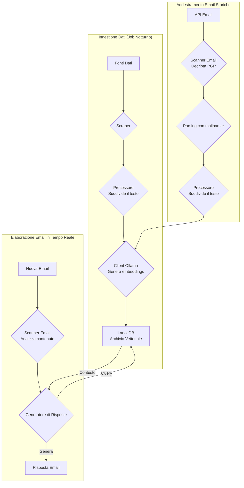
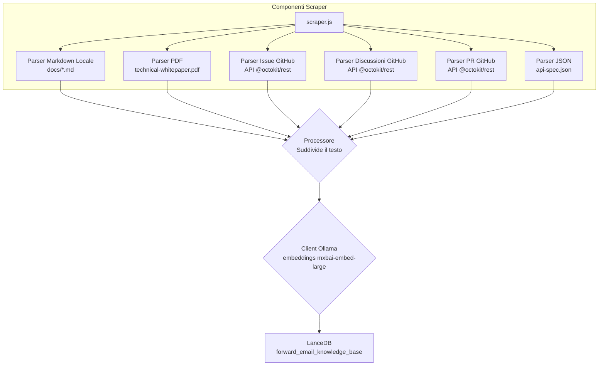
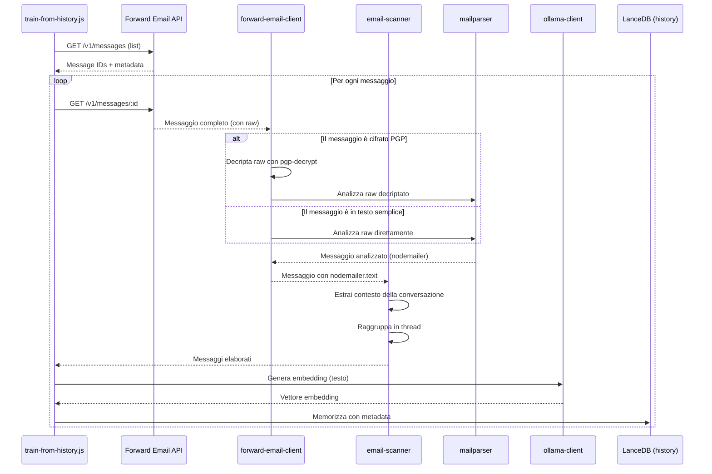

# Costruire un Agente di Supporto Clienti AI Privacy-First con LanceDB, Ollama e Node.js {#building-a-privacy-first-ai-customer-support-agent-with-lancedb-ollama-and-nodejs}


> \[!NOTE]
> Questo documento copre il nostro percorso nella costruzione di un agente di supporto AI self-hosted. Abbiamo scritto di sfide simili nel nostro post sul blog [Email Startup Graveyard](https://forwardemail.net/blog/docs/email-startup-graveyard-why-80-percent-email-companies-fail). Onestamente avevamo pensato di scrivere un seguito chiamato "AI Startup Graveyard" ma forse dovremo aspettare un altro anno circa finché la bolla AI potenzialmente scoppierà(?). Per ora, questo è il nostro brain dump di cosa ha funzionato, cosa no, e perché l’abbiamo fatto in questo modo.

Ecco come abbiamo costruito il nostro agente di supporto clienti AI. Lo abbiamo fatto nel modo difficile: self-hosted, privacy-first, e completamente sotto il nostro controllo. Perché? Perché non ci fidiamo dei servizi di terze parti con i dati dei nostri clienti. È un requisito GDPR e DPA, ed è la cosa giusta da fare.

Non è stato un progetto divertente per il weekend. È stato un viaggio di un mese tra dipendenze rotte, documentazione fuorviante, e il caos generale dell’ecosistema AI open-source nel 2025. Questo documento è una registrazione di cosa abbiamo costruito, perché l’abbiamo costruito, e gli ostacoli incontrati lungo la strada.


## Indice {#table-of-contents}

* [Benefici per il Cliente: Supporto Umano Aumentato dall’AI](#customer-benefits-ai-augmented-human-support)
  * [Risposte Più Veloci e Accurate](#faster-more-accurate-responses)
  * [Coerenza Senza Esaurimento](#consistency-without-burnout)
  * [Cosa Ottieni](#what-you-get)
* [Una Riflessione Personale: Due Decenni di Fatica](#a-personal-reflection-the-two-decade-grind)
* [Perché la Privacy Conta](#why-privacy-matters)
* [Analisi dei Costi: AI Cloud vs Self-Hosted](#cost-analysis-cloud-ai-vs-self-hosted)
  * [Confronto Servizi AI Cloud](#cloud-ai-service-comparison)
  * [Ripartizione dei Costi: Base di Conoscenza da 5GB](#cost-breakdown-5gb-knowledge-base)
  * [Costi Hardware Self-Hosted](#self-hosted-hardware-costs)
* [Dogfooding della Nostra API](#dogfooding-our-own-api)
  * [Perché il Dogfooding Conta](#why-dogfooding-matters)
  * [Esempi di Utilizzo API](#api-usage-examples)
  * [Benefici di Performance](#performance-benefits)
* [Architettura di Crittografia](#encryption-architecture)
  * [Livello 1: Crittografia della Casella Postale (chacha20-poly1305)](#layer-1-mailbox-encryption-chacha20-poly1305)
  * [Livello 2: Crittografia PGP a Livello di Messaggio](#layer-2-message-level-pgp-encryption)
  * [Perché Questo Conta per l’Addestramento](#why-this-matters-for-training)
  * [Sicurezza dello Storage](#storage-security)
  * [Lo Storage Locale è Pratica Standard](#local-storage-is-standard-practice)
* [L’Architettura](#the-architecture)
  * [Flusso ad Alto Livello](#high-level-flow)
  * [Flusso Dettagliato dello Scraper](#detailed-scraper-flow)
* [Come Funziona](#how-it-works)
  * [Costruire la Base di Conoscenza](#building-the-knowledge-base)
  * [Addestramento da Email Storiche](#training-from-historical-emails)
  * [Elaborazione delle Email in Arrivo](#processing-incoming-emails)
  * [Gestione del Vector Store](#vector-store-management)
* [Il Cimitero dei Database Vector](#the-vector-database-graveyard)
* [Requisiti di Sistema](#system-requirements)
* [Configurazione Cron Job](#cron-job-configuration)
  * [Variabili d’Ambiente](#environment-variables)
  * [Cron Job per Più Caselle](#cron-jobs-for-multiple-inboxes)
  * [Ripartizione del Cron Schedule](#cron-schedule-breakdown)
  * [Calcolo Dinamico della Data](#dynamic-date-calculation)
  * [Setup Iniziale: Estrazione Lista URL da Sitemap](#initial-setup-extract-url-list-from-sitemap)
  * [Test Manuale dei Cron Job](#testing-cron-jobs-manually)
  * [Monitoraggio dei Log](#monitoring-logs)
* [Esempi di Codice](#code-examples)
  * [Scraping e Elaborazione](#scraping-and-processing)
  * [Addestramento da Email Storiche](#training-from-historical-emails-1)
  * [Query per il Contesto](#querying-for-context)
* [Il Futuro: R\&S sullo Scanner Anti-Spam](#the-future-spam-scanner-rd)
* [Risoluzione Problemi](#troubleshooting)
  * [Errore di Mismatch nella Dimensione del Vettore](#vector-dimension-mismatch-error)
  * [Contesto della Base di Conoscenza Vuoto](#empty-knowledge-base-context)
  * [Fallimenti nella Decrittazione PGP](#pgp-decryption-failures)
* [Consigli per l’Uso](#usage-tips)
  * [Raggiungere Inbox Zero](#achieving-inbox-zero)
  * [Uso dell’Etichetta skip-ai](#using-the-skip-ai-label)
  * [Threading delle Email e Rispondi a Tutti](#email-threading-and-reply-all)
  * [Monitoraggio e Manutenzione](#monitoring-and-maintenance)
* [Test](#testing)
  * [Esecuzione dei Test](#running-tests)
  * [Copertura dei Test](#test-coverage)
  * [Ambiente di Test](#test-environment)
* [Punti Chiave](#key-takeaways)
## Vantaggi per il Cliente: Supporto Umano Potenziato dall'IA {#customer-benefits-ai-augmented-human-support}

Il nostro sistema di IA non sostituisce il nostro team di supporto—lo rende migliore. Ecco cosa significa per te:

### Risposte Più Veloci e Accurate {#faster-more-accurate-responses}

**Human-in-the-Loop**: Ogni bozza generata dall'IA viene revisionata, modificata e curata dal nostro team di supporto umano prima di essere inviata a te. L'IA si occupa della ricerca iniziale e della stesura, liberando il nostro team per concentrarsi sul controllo qualità e sulla personalizzazione.

**Addestrata sull'Esperienza Umana**: L'IA apprende da:

* La nostra base di conoscenza e documentazione scritta a mano
* Post di blog e tutorial scritti da umani
* La nostra FAQ completa (scritta da umani)
* Conversazioni passate con i clienti (tutte gestite da veri umani)

Ricevi risposte informate da anni di esperienza umana, solo consegnate più velocemente.

### Coerenza Senza Esaurimento {#consistency-without-burnout}

Il nostro piccolo team gestisce centinaia di richieste di supporto ogni giorno, ognuna richiedente conoscenze tecniche diverse e continui cambi di contesto mentale:

* Le domande di fatturazione richiedono conoscenze del sistema finanziario
* I problemi DNS richiedono competenze di networking
* L'integrazione API richiede conoscenze di programmazione
* I report di sicurezza richiedono valutazioni di vulnerabilità

Senza assistenza IA, questo continuo cambio di contesto porta a:

* Tempi di risposta più lenti
* Errori umani dovuti alla fatica
* Qualità delle risposte incoerente
* Esaurimento del team

**Con il potenziamento IA**, il nostro team:

* Risponde più velocemente (l'IA crea bozze in pochi secondi)
* Commette meno errori (l'IA individua gli errori comuni)
* Mantiene una qualità costante (l'IA fa riferimento sempre alla stessa base di conoscenza)
* Rimane fresco e concentrato (meno tempo a ricercare, più tempo ad aiutare)

### Cosa Ottieni {#what-you-get}

✅ **Velocità**: L'IA crea bozze di risposte in pochi secondi, gli umani le revisionano e inviano in pochi minuti

✅ **Accuratezza**: Risposte basate sulla nostra documentazione reale e soluzioni passate

✅ **Coerenza**: Stesse risposte di alta qualità sia alle 9 del mattino che alle 9 di sera

✅ **Tocco umano**: Ogni risposta è revisionata e personalizzata dal nostro team

✅ **Nessuna allucinazione**: L'IA usa solo la nostra base di conoscenza verificata, non dati generici da internet

> \[!NOTE]
> **Parli sempre con umani**. L'IA è un assistente di ricerca che aiuta il nostro team a trovare la risposta giusta più velocemente. Pensalo come un bibliotecario che trova istantaneamente il libro rilevante—ma è sempre un umano a leggerlo e spiegartelo.


## Una Riflessione Personale: La Fatica di Due Decenni {#a-personal-reflection-the-two-decade-grind}

Prima di addentrarci nei dettagli tecnici, una nota personale. Sono in questo campo da quasi due decenni. Le ore infinite alla tastiera, la ricerca incessante di una soluzione, la profonda e concentrata fatica – questa è la realtà di costruire qualcosa di significativo. È una realtà spesso trascurata nei cicli di hype delle nuove tecnologie.

L'esplosione recente dell'IA è stata particolarmente frustrante. Ci viene venduto un sogno di automazione, di assistenti IA che scriveranno il nostro codice e risolveranno i nostri problemi. La realtà? Il risultato è spesso codice spazzatura che richiede più tempo per essere corretto di quanto ne servirebbe per scriverlo da zero. La promessa di semplificare la nostra vita è falsa. È una distrazione dal duro e necessario lavoro di costruire.

E poi c'è il paradosso del contribuire all'open-source. Sei già esausto, stanco dalla fatica. Usi un'IA per aiutarti a scrivere un report di bug dettagliato e ben strutturato, sperando di facilitare la comprensione e la risoluzione del problema da parte dei manutentori. E cosa succede? Vieni rimproverato. Il tuo contributo viene liquidato come "off-topic" o poco impegnativo, come abbiamo visto in un recente [issue GitHub di Node.js](https://github.com/nodejs/node/issues/60719#issuecomment-3534304321). È uno schiaffo in faccia per sviluppatori senior che stanno solo cercando di aiutare.

Questa è la realtà dell'ecosistema in cui lavoriamo. Non si tratta solo di strumenti difettosi; si tratta di una cultura che spesso non rispetta il tempo e lo [sforzo dei suoi contributori](https://forwardemail.net/blog/docs/how-npm-packages-billion-downloads-shaped-javascript-ecosystem). Questo post è una cronaca di quella realtà. È una storia sugli strumenti, sì, ma è anche sul costo umano di costruire in un ecosistema rotto che, nonostante tutte le sue promesse, è fondamentalmente guasto.
## Perché la Privacy è Importante {#why-privacy-matters}

Il nostro [whitepaper tecnico](https://forwardemail.net/technical-whitepaper.pdf) tratta in dettaglio la nostra filosofia sulla privacy. La versione breve: non inviamo mai i dati dei clienti a terze parti. Mai. Questo significa niente OpenAI, niente Anthropic, niente database vettoriali ospitati nel cloud. Tutto gira localmente sulla nostra infrastruttura. Questo è imprescindibile per la conformità al GDPR e ai nostri impegni DPA.


## Analisi dei Costi: Cloud AI vs Self-Hosted {#cost-analysis-cloud-ai-vs-self-hosted}

Prima di entrare nell’implementazione tecnica, parliamo del motivo per cui l’auto-gestione è importante dal punto di vista dei costi. I modelli di prezzo dei servizi di AI cloud li rendono proibitivamente costosi per casi d’uso ad alto volume come il supporto clienti.

### Confronto Servizi Cloud AI {#cloud-ai-service-comparison}

| Servizio       | Fornitore           | Costo Embedding                                                | Costo LLM (Input)                                                         | Costo LLM (Output)      | Privacy Policy                                     | GDPR/DPA        | Hosting           | Condivisione Dati |
| -------------- | ------------------- | -------------------------------------------------------------- | ------------------------------------------------------------------------- | ---------------------- | ------------------------------------------------- | --------------- | ----------------- | ----------------- |
| **OpenAI**     | OpenAI (US)         | [$0.02-0.13/1M token](https://openai.com/api/pricing/)         | $0.15-20/1M token                                                         | $0.60-80/1M token      | [Link](https://openai.com/policies/privacy-policy/) | DPA Limitato    | Azure (US)        | Sì (training)     |
| **Claude**     | Anthropic (US)      | N/A                                                            | [$3-20/1M token](https://docs.claude.com/en/docs/about-claude/pricing)   | $15-80/1M token        | [Link](https://www.anthropic.com/legal/privacy)    | DPA Limitato    | AWS/GCP (US)      | No (dichiarato)   |
| **Gemini**     | Google (US)         | [$0.15/1M token](https://ai.google.dev/gemini-api/docs/pricing) | $0.30-1.00/1M token                                                      | $2.50/1M token         | [Link](https://policies.google.com/privacy)        | DPA Limitato    | GCP (US)          | Sì (miglioramento)|
| **DeepSeek**   | DeepSeek (Cina)     | N/A                                                            | [$0.028-0.28/1M token](https://api-docs.deepseek.com/quick_start/pricing) | $0.42/1M token         | [Link](https://www.deepseek.com/en)                | Sconosciuto     | Cina              | Sconosciuto       |
| **Mistral**    | Mistral AI (Francia)| [$0.10/1M token](https://mistral.ai/pricing)                   | $0.40/1M token                                                           | $2.00/1M token         | [Link](https://mistral.ai/terms/)                  | GDPR UE         | UE                | Sconosciuto       |
| **Self-Hosted**| Tu                  | $0 (hardware esistente)                                        | $0 (hardware esistente)                                                  | $0 (hardware esistente)| La tua policy                                     | Conformità totale| MacBook M5 + cron | Mai               |

> \[!WARNING]
> **Preoccupazioni sulla sovranità dei dati**: i fornitori USA (OpenAI, Claude, Gemini) sono soggetti al CLOUD Act, che consente al governo USA l’accesso ai dati. DeepSeek (Cina) opera sotto le leggi cinesi sui dati. Mentre Mistral (Francia) offre hosting UE e conformità GDPR, l’auto-gestione rimane l’unica opzione per completa sovranità e controllo dei dati.

### Ripartizione dei Costi: Base di Conoscenza da 5GB {#cost-breakdown-5gb-knowledge-base}

Calcoliamo il costo di elaborazione di una base di conoscenza da 5GB (tipica per un’azienda di medie dimensioni con documenti, email e storico supporto).

**Assunzioni:**

* 5GB di testo ≈ 1,25 miliardi di token (assumendo \~4 caratteri/token)
* Generazione iniziale degli embedding
* Riaddestramento mensile (ri-embedding completo)
* 10.000 richieste di supporto al mese
* Query media: 500 token in input, 300 token in output
**Dettaglio Dettagliato dei Costi:**

| Componente                            | OpenAI           | Claude          | Gemini               | Self-Hosted        |
| ------------------------------------ | ---------------- | --------------- | -------------------- | ------------------ |
| **Embedding Iniziale** (1,25B token) | $25,000          | N/A             | $187,500             | $0                 |
| **Query Mensili** (10K × 800 token)  | $1,200-16,000    | $2,400-16,000   | $2,400-3,200         | $0                 |
| **Retraining Mensile** (1,25B token) | $25,000          | N/A             | $187,500             | $0                 |
| **Totale Primo Anno**                 | $325,200-217,000 | $28,800-192,000 | $2,278,800-2,226,000 | ~$60 (elettricità) |
| **Conformità alla Privacy**           | ❌ Limitata       | ❌ Limitata     | ❌ Limitata           | ✅ Completa        |
| **Sovranità dei Dati**                | ❌ No            | ❌ No           | ❌ No                 | ✅ Sì              |

> \[!CAUTION]
> **I costi di embedding di Gemini sono catastrofici** a $0.15/1M token. Un singolo embedding di una base di conoscenza da 5GB costerebbe $187,500. Questo è 37 volte più costoso di OpenAI e lo rende completamente inutilizzabile in produzione.

### Costi Hardware Self-Hosted {#self-hosted-hardware-costs}

La nostra configurazione gira su hardware esistente che già possediamo:

* **Hardware**: MacBook M5 (già posseduto per sviluppo)
* **Costo aggiuntivo**: $0 (usa hardware esistente)
* **Elettricità**: \~$5/mese (stimato)
* **Totale primo anno**: \~$60
* **Continuativo**: $60/anno

**ROI**: L’hosting autonomo ha praticamente costo marginale zero poiché utilizziamo hardware di sviluppo esistente. Il sistema gira tramite cron job durante le ore di minor carico.


## Utilizzo Interno della Nostra API {#dogfooding-our-own-api}

Una delle decisioni architetturali più importanti che abbiamo preso è stata far usare a tutti i lavori AI la [Forward Email API](https://forwardemail.net/email-api) direttamente. Non è solo una buona pratica—è una funzione di costrizione per l’ottimizzazione delle prestazioni.

### Perché l’Utilizzo Interno è Importante {#why-dogfooding-matters}

Quando i nostri lavori AI usano gli stessi endpoint API dei nostri clienti:

1. **I colli di bottiglia delle prestazioni ci colpiscono prima** - Sentiamo il problema prima dei clienti
2. **L’ottimizzazione beneficia tutti** - I miglioramenti per i nostri lavori migliorano automaticamente l’esperienza cliente
3. **Test nel mondo reale** - I nostri lavori processano migliaia di email, fornendo test di carico continui
4. **Riutilizzo del codice** - Stessa autenticazione, limitazione di velocità, gestione errori e caching

### Esempi di Utilizzo API {#api-usage-examples}

**Elencare Messaggi (train-from-history.js):**

```javascript
// Usa GET /v1/messages?folder=INBOX con BasicAuth
// Esclude eml, raw, nodemailer per ridurre la dimensione della risposta (serve solo ID)
const response = await axios.get(
  `${this.apiBase}/v1/messages`,
  {
    params: {
      folder: 'INBOX',
      limit: 100,
      eml: false,
      raw: false,
      nodemailer: false
    },
    auth: {
      username: process.env.FORWARD_EMAIL_ALIAS_USERNAME,
      password: process.env.FORWARD_EMAIL_ALIAS_PASSWORD
    }
  }
);

const messages = response.data;
// Restituisce: [{ id, subject, date, ... }, ...]
// Contenuto completo del messaggio recuperato successivamente via GET /v1/messages/:id
```

**Recuperare Messaggi Completi (forward-email-client.js):**

```javascript
// Usa GET /v1/messages/:id per ottenere messaggio completo con contenuto raw
const response = await axios.get(
  `${this.apiBase}/v1/messages/${messageId}`,
  {
    auth: {
      username: this.aliasUsername,
      password: this.aliasPassword
    }
  }
);

const message = response.data;
// Restituisce: { id, subject, raw, eml, nodemailer: { ... }, ... }
```

**Creare Risposte Bozza (process-inbox.js):**

```javascript
// Usa POST /v1/messages per creare risposte in bozza
const response = await axios.post(
  `${this.apiBase}/v1/messages`,
  {
    folder: 'Drafts',
    subject: `Re: ${originalSubject}`,
    to: senderEmail,
    text: generatedResponse,
    inReplyTo: originalMessageId
  },
  {
    auth: {
      username: process.env.FORWARD_EMAIL_ALIAS_USERNAME,
      password: process.env.FORWARD_EMAIL_ALIAS_PASSWORD
    }
  }
);
```
### Vantaggi di Prestazione {#performance-benefits}

Poiché i nostri lavori AI girano sulla stessa infrastruttura API:

* **Ottimizzazioni della cache** beneficiano sia i lavori che i clienti
* **Limitazione della velocità** è testata sotto carico reale
* **Gestione degli errori** è collaudata sul campo
* **Tempi di risposta API** sono costantemente monitorati
* **Query al database** sono ottimizzate per entrambi i casi d'uso
* **Ottimizzazione della larghezza di banda** - Escludere `eml`, `raw`, `nodemailer` durante la lista riduce la dimensione della risposta di \~90%

Quando `train-from-history.js` elabora 1.000 email, effettua oltre 1.000 chiamate API. Qualsiasi inefficienza nell'API diventa immediatamente evidente. Questo ci costringe a ottimizzare l'accesso IMAP, le query al database e la serializzazione della risposta—miglioramenti che beneficiano direttamente i nostri clienti.

**Esempio di ottimizzazione**: Elencare 100 messaggi con contenuto completo = \~10MB di risposta. Elencare con `eml: false, raw: false, nodemailer: false` = \~100KB di risposta (100 volte più piccolo).


## Architettura di Crittografia {#encryption-architecture}

Il nostro storage email utilizza più livelli di crittografia, che i lavori AI devono decriptare in tempo reale per l'addestramento.

### Livello 1: Crittografia della Casella Postale (chacha20-poly1305) {#layer-1-mailbox-encryption-chacha20-poly1305}

Tutte le caselle IMAP sono archiviate come database SQLite crittografati con **chacha20-poly1305**, un algoritmo di crittografia resistente ai computer quantistici. Questo è dettagliato nel nostro [post sul blog del servizio email crittografato quantum-safe](https://forwardemail.net/blog/docs/best-quantum-safe-encrypted-email-service).

**Proprietà Chiave:**

* **Algoritmo**: ChaCha20-Poly1305 (cifrario AEAD)
* **Quantum-safe**: Resistente agli attacchi di calcolo quantistico
* **Storage**: File database SQLite su disco
* **Accesso**: Decriptato in memoria quando accessibile via IMAP/API

### Livello 2: Crittografia PGP a Livello di Messaggio {#layer-2-message-level-pgp-encryption}

Molte email di supporto sono inoltre crittografate con PGP (standard OpenPGP). I lavori AI devono decriptarle per estrarre il contenuto per l'addestramento.

**Flusso di Decriptazione:**

```javascript
// 1. L'API restituisce il messaggio con contenuto raw crittografato
const message = await forwardEmailClient.getMessage(id);

// 2. Verifica se il contenuto raw è crittografato PGP
if (isMessageEncrypted(message.raw)) {
  // 3. Decripta con la nostra chiave privata
  const decryptedRaw = await pgpDecrypt(message.raw);

  // 4. Analizza il messaggio MIME decriptato
  const parsed = await simpleParser(decryptedRaw);

  // 5. Popola nodemailer con il contenuto decriptato
  message.nodemailer = {
    text: parsed.text,
    html: parsed.html,
    from: parsed.from,
    to: parsed.to,
    subject: parsed.subject,
    date: parsed.date
  };
}
```

**Configurazione PGP:**

```bash
# Chiave privata per la decriptazione (percorso al file chiave ASCII-armored)
GPG_SECURITY_KEY="/path/to/private-key.asc"

# Passphrase per la chiave privata (se crittografata)
GPG_SECURITY_PASSPHRASE="your-passphrase"
```

L'helper `pgp-decrypt.js`:

1. Legge la chiave privata da disco una volta (cache in memoria)
2. Decripta la chiave con la passphrase
3. Usa la chiave decriptata per tutte le decriptazioni dei messaggi
4. Supporta la decriptazione ricorsiva per messaggi crittografati annidati

### Perché Questo è Importante per l'Addestramento {#why-this-matters-for-training}

Senza una corretta decriptazione, l'AI si addestrerebbe su dati cifrati incomprensibili:

```
-----BEGIN PGP MESSAGE-----
Version: OpenPGP.js v4.10.10

wcBMA8Z3lHJnFnNUAQgAqK7F8...
-----END PGP MESSAGE-----
```

Con la decriptazione, l'AI si addestra su contenuti reali:

```
Subject: Re: Bug Report

Ciao John,

Grazie per aver segnalato questo problema. Ho confermato il bug
e creato una correzione nella PR #1234...
```

### Sicurezza dello Storage {#storage-security}

La decriptazione avviene in memoria durante l'esecuzione del lavoro, e il contenuto decriptato viene convertito in embeddings che vengono poi archiviati nel database vettoriale LanceDB su disco.

**Dove risiedono i dati:**

* **Database vettoriale**: Archiviato su workstation MacBook M5 criptate
* **Sicurezza fisica**: Le workstation rimangono sempre con noi (non in datacenter)
* **Crittografia disco**: Crittografia completa del disco su tutte le workstation
* **Sicurezza di rete**: Protette da firewall e isolate da reti pubbliche

**Futura distribuzione in datacenter:**
Se mai ci spostassimo in hosting datacenter, i server avranno:

* Crittografia completa del disco LUKS
* Accesso USB disabilitato
* Misure di sicurezza fisica
* Isolamento di rete
Per dettagli completi sulle nostre pratiche di sicurezza, consulta la nostra [pagina Sicurezza](https://forwardemail.net/en/security).

> \[!NOTE]
> Il database vettoriale contiene embeddings (rappresentazioni matematiche), non il testo originale in chiaro. Tuttavia, gli embeddings possono potenzialmente essere decodificati, motivo per cui li conserviamo su workstation crittografate e fisicamente protette.

### L'archiviazione locale è una pratica standard {#local-storage-is-standard-practice}

Conservare gli embeddings sulle workstation del nostro team non è diverso da come gestiamo già le email:

* **Thunderbird**: Scarica e memorizza localmente il contenuto completo delle email in file mbox/maildir
* **Client Webmail**: Memorizzano nella cache i dati delle email nello storage del browser e nei database locali
* **Client IMAP**: Mantengono copie locali dei messaggi per l'accesso offline
* **Il nostro sistema AI**: Memorizza embeddings matematici (non testo in chiaro) in LanceDB

La differenza chiave: gli embeddings sono **più sicuri** delle email in chiaro perché sono:

1. Rappresentazioni matematiche, non testo leggibile
2. Più difficili da decodificare rispetto al testo in chiaro
3. Soggetti alla stessa sicurezza fisica dei nostri client email

Se è accettabile per il nostro team usare Thunderbird o webmail su workstation crittografate, è altrettanto accettabile (e probabilmente più sicuro) conservare gli embeddings allo stesso modo.


## L'architettura {#the-architecture}

Ecco il flusso di base. Sembra semplice. Non lo è stato.

> \[!NOTE]
> Tutti i processi utilizzano direttamente l'API di Forward Email, garantendo che le ottimizzazioni delle prestazioni beneficino sia il nostro sistema AI che i nostri clienti.

### Flusso ad alto livello {#high-level-flow}



### Flusso dettagliato dello scraper {#detailed-scraper-flow}

Il `scraper.js` è il cuore dell'ingestione dati. È una raccolta di parser per diversi formati di dati.




## Come funziona {#how-it-works}

Il processo è suddiviso in tre parti principali: costruzione della knowledge base, addestramento da email storiche e elaborazione di nuove email.

### Costruzione della Knowledge Base {#building-the-knowledge-base}

**`update-knowledge-base.js`**: Questo è il job principale. Viene eseguito ogni notte, cancella il vecchio archivio vettoriale e lo ricostruisce da zero. Usa `scraper.js` per recuperare contenuti da tutte le fonti, `processor.js` per suddividerli, e `ollama-client.js` per generare gli embeddings. Infine, `vector-store.js` memorizza tutto in LanceDB.

**Fonti dati:**

* File Markdown locali (`docs/*.md`)
* PDF whitepaper tecnico (`assets/technical-whitepaper.pdf`)
* JSON specifica API (`assets/api-spec.json`)
* Issue GitHub (tramite Octokit)
* Discussioni GitHub (tramite Octokit)
* Pull request GitHub (tramite Octokit)
* Lista URL sitemap (`$LANCEDB_PATH/valid-urls.json`)

### Addestramento da email storiche {#training-from-historical-emails}

**`train-from-history.js`**: Questo job scansiona le email storiche da tutte le cartelle, decripta i messaggi cifrati PGP e li aggiunge a un archivio vettoriale separato (`customer_support_history`). Questo fornisce contesto dalle interazioni di supporto passate.
**Flusso di Elaborazione Email:**



**Caratteristiche Principali:**

* **Decrittazione PGP**: Usa l’helper `pgp-decrypt.js` con la variabile d’ambiente `GPG_SECURITY_KEY`
* **Raggruppamento Thread**: Raggruppa le email correlate in thread di conversazione
* **Preservazione Metadata**: Memorizza cartella, oggetto, data, stato di cifratura
* **Contesto Risposta**: Collega i messaggi con le loro risposte per un contesto migliore

**Configurazione:**

```bash
# Variabili d'ambiente per train-from-history
HISTORY_SCAN_LIMIT=1000              # Numero massimo di messaggi da elaborare
HISTORY_SCAN_SINCE="2024-01-01"      # Elabora solo messaggi dopo questa data
HISTORY_DECRYPT_PGP=true             # Tenta la decrittazione PGP
GPG_SECURITY_KEY="/path/to/key.asc"  # Percorso della chiave privata PGP
GPG_SECURITY_PASSPHRASE="passphrase" # Passphrase della chiave (opzionale)
```

**Cosa Viene Memorizzato:**

```javascript
{
  type: 'historical_email',
  folder: 'INBOX',
  subject: 'Re: Bug Report',
  date: '2025-01-15T10:30:00Z',
  messageId: '67e2f288893921...',
  threadId: 'Bug Report',
  hasReply: true,
  encrypted: true,
  decrypted: true,
  replySubject: 'Bug Report',
  replyText: 'Primi 500 caratteri della risposta...',
  chunkSize: 1000,
  chunkOverlap: 200,
  chunkIndex: 0
}
```

> \[!TIP]
> Esegui `train-from-history` dopo la configurazione iniziale per popolare il contesto storico. Questo migliora drasticamente la qualità delle risposte imparando dalle interazioni di supporto passate.

### Elaborazione delle Email in Arrivo {#processing-incoming-emails}

**`process-inbox.js`**: Questo job elabora le email nelle nostre caselle `support@forwardemail.net`, `abuse@forwardemail.net` e `security@forwardemail.net` (specificamente nella cartella IMAP `INBOX`). Utilizza la nostra API su <https://forwardemail.net/email-api> (es. `GET /v1/messages?folder=INBOX` usando accesso BasicAuth con le credenziali IMAP di ogni casella). Analizza il contenuto dell’email, interroga sia la knowledge base (`forward_email_knowledge_base`) sia l’archivio vettoriale storico delle email (`customer_support_history`), quindi passa il contesto combinato a `response-generator.js`. Il generatore usa `mxbai-embed-large` tramite Ollama per creare una risposta.

**Funzionalità del Flusso di Lavoro Automatizzato:**

1. **Automazione Inbox Zero**: Dopo aver creato con successo una bozza, il messaggio originale viene automaticamente spostato nella cartella Archivio. Questo mantiene la tua inbox pulita e aiuta a raggiungere inbox zero senza intervento manuale.

2. **Salta Elaborazione AI**: Basta aggiungere un’etichetta `skip-ai` (case-insensitive) a qualsiasi messaggio per evitare l’elaborazione AI. Il messaggio rimarrà nella tua inbox intatto, permettendoti di gestirlo manualmente. Utile per messaggi sensibili o casi complessi che richiedono giudizio umano.

3. **Threading Corretto delle Email**: Tutte le risposte in bozza includono il messaggio originale quotato sotto (usando il prefisso standard ` >  `), seguendo le convenzioni di risposta email con il formato "Il \[data], \[mittente] ha scritto:". Questo garantisce un contesto e threading corretti nelle email client.

4. **Comportamento Reply-All**: Il sistema gestisce automaticamente gli header Reply-To e i destinatari CC:
   * Se esiste un header Reply-To, diventa l’indirizzo To e l’originale From viene aggiunto in CC
   * Tutti i destinatari originali To e CC sono inclusi nel CC della risposta (eccetto il tuo indirizzo)
   * Segue le convenzioni standard di reply-all per conversazioni di gruppo
**Classifica delle fonti**: Il sistema utilizza una **classifica ponderata** per dare priorità alle fonti:

* FAQ: 100% (massima priorità)
* Whitepaper tecnico: 95%
* Specifica API: 90%
* Documentazione ufficiale: 85%
* Issue GitHub: 70%
* Email storiche: 50%

### Gestione del Vector Store {#vector-store-management}

La classe `VectorStore` in `helpers/customer-support-ai/vector-store.js` è la nostra interfaccia con LanceDB.

**Aggiunta di documenti:**

```javascript
// vector-store.js
async addDocument(text, metadata) {
  const embedding = await this.ollama.generateEmbedding(text);
  await this.table.add([{
    vector: embedding,
    text,
    ...metadata
  }]);
}
```

**Pulizia dello Store:**

```javascript
// Opzione 1: Usa il metodo clear()
await vectorStore.clear();

// Opzione 2: Elimina la directory del database locale
await fs.rm(process.env.LANCEDB_PATH, { recursive: true, force: true });
```

La variabile d'ambiente `LANCEDB_PATH` punta alla directory del database embedded locale. LanceDB è serverless e embedded, quindi non c'è un processo separato da gestire.


## Il Cimitero dei Database Vector {#the-vector-database-graveyard}

Questo è stato il primo grande ostacolo. Abbiamo provato diversi database vector prima di scegliere LanceDB. Ecco cosa è andato storto con ciascuno.

| Database     | GitHub                                                      | Cosa è andato storto                                                                                                                                                                                                 | Problemi specifici                                                                                                                                                                                                                                                                                                                                                       | Problemi di sicurezza                                                                                                                                                                                            |
| ------------ | ----------------------------------------------------------- | -------------------------------------------------------------------------------------------------------------------------------------------------------------------------------------------------------------------- | ------------------------------------------------------------------------------------------------------------------------------------------------------------------------------------------------------------------------------------------------------------------------------------------------------------------------------------------------------------------------- | ---------------------------------------------------------------------------------------------------------------------------------------------------------------------------------------------------------------- |
| **ChromaDB** | [chroma-core/chroma](https://github.com/chroma-core/chroma) | `pip3 install chromadb` fornisce una versione preistorica con `PydanticImportError`. L'unico modo per ottenere una versione funzionante è compilare dal sorgente. Poco amichevole per gli sviluppatori.                | Caos nelle dipendenze Python. Molti utenti segnalano installazioni pip rotte ([#774](https://github.com/chroma-core/chroma/issues/774), [#163](https://github.com/chroma-core/chroma/issues/163)). La documentazione dice "usa Docker" che non è una risposta per lo sviluppo locale. Crash su Windows con >99 record ([#3058](https://github.com/chroma-core/chroma/issues/3058)). | **CVE-2024-45848**: Esecuzione di codice arbitrario tramite integrazione ChromaDB in MindsDB. Vulnerabilità critiche del sistema operativo nell'immagine Docker ([#3170](https://github.com/chroma-core/chroma/issues/3170)). |
| **Qdrant**   | [qdrant/qdrant](https://github.com/qdrant/qdrant)           | Il tap Homebrew (`qdrant/qdrant/qdrant`) citato nella loro vecchia documentazione è sparito. Scomparso. Nessuna spiegazione. La documentazione ufficiale ora dice solo "usa Docker."                                  | Tap Homebrew mancante. Nessun binario nativo per macOS. Solo Docker è una barriera per test locali rapidi.                                                                                                                                                                                                                                                               | **CVE-2024-2221**: Vulnerabilità di upload file arbitrario che permette esecuzione di codice remoto (fixata in v1.9.0). Punteggio di maturità della sicurezza basso da [IronCore Labs](https://ironcorelabs.com/vectordbs/qdrant-security/). |
| **Weaviate** | [weaviate/weaviate](https://github.com/weaviate/weaviate)   | La versione Homebrew aveva un bug critico di clustering (`leader not found`). Le flag documentate per risolverlo (`RAFT_JOIN`, `CLUSTER_HOSTNAME`) non funzionavano. Fondamentalmente rotto per configurazioni a nodo singolo. | Bug di clustering anche in modalità nodo singolo. Sovra-ingegnerizzato per casi d'uso semplici.                                                                                                                                                                                                                                                                           | Nessun CVE importante trovato, ma la complessità aumenta la superficie di attacco.                                                                                                                                  |
| **LanceDB**  | [lancedb/lancedb](https://github.com/lancedb/lancedb)       | Questo ha funzionato. È embedded e serverless. Nessun processo separato. L'unico fastidio è la confusione nel naming del pacchetto (`vectordb` è deprecato, usare `@lancedb/lancedb`) e la documentazione sparsa. Possiamo conviverci. | Confusione nel naming del pacchetto (`vectordb` vs `@lancedb/lancedb`), ma per il resto solido. L'architettura embedded elimina intere classi di problemi di sicurezza.                                                                                                                                                                                                   | Nessun CVE noto. Il design embedded significa nessuna superficie di attacco di rete.                                                                                                                                  |
> \[!WARNING]
> **ChromaDB ha vulnerabilità di sicurezza critiche.** [CVE-2024-45848](https://nvd.nist.gov/vuln/detail/CVE-2024-45848) consente l'esecuzione arbitraria di codice. L'installazione tramite pip è fondamentalmente rotta a causa di problemi con la dipendenza Pydantic. Evitare l'uso in produzione.

> \[!WARNING]
> **Qdrant aveva una vulnerabilità RCE nel caricamento file** ([CVE-2024-2221](https://qdrant.tech/blog/cve-2024-2221-response/)) che è stata corretta solo nella versione v1.9.0. Se devi usare Qdrant, assicurati di avere l'ultima versione.

> \[!CAUTION]
> L'ecosistema open-source dei database vettoriali è instabile. Non fidarti della documentazione. Dai per scontato che tutto sia rotto finché non si dimostra il contrario. Testa localmente prima di impegnarti in uno stack.


## Requisiti di Sistema {#system-requirements}

* **Node.js:** v18.0.0+ ([GitHub](https://github.com/nodejs/node))
* **Ollama:** Ultima versione ([GitHub](https://github.com/ollama/ollama))
* **Modello:** `mxbai-embed-large` tramite Ollama
* **Database Vettoriale:** LanceDB ([GitHub](https://github.com/lancedb/lancedb))
* **Accesso GitHub:** `@octokit/rest` per scraping delle issue ([GitHub](https://github.com/octokit/rest.js))
* **SQLite:** Per il database principale (tramite `mongoose-to-sqlite`)


## Configurazione Cron Job {#cron-job-configuration}

Tutti i job AI vengono eseguiti tramite cron su un MacBook M5. Ecco come configurare i cron job per l'esecuzione a mezzanotte su più caselle di posta.

### Variabili d'Ambiente {#environment-variables}

I job richiedono queste variabili d'ambiente. La maggior parte può essere impostata nel file `.env` (caricato tramite `@ladjs/env`), ma `HISTORY_SCAN_SINCE` deve essere calcolata dinamicamente nel crontab.

**Nel file `.env`:**

```bash
# Credenziali API Forward Email (variano per casella)
FORWARD_EMAIL_ALIAS_USERNAME=support@forwardemail.net
FORWARD_EMAIL_ALIAS_PASSWORD=your-imap-password

# Decrittazione PGP (condivisa tra tutte le caselle)
GPG_SECURITY_KEY=/path/to/private-key.asc
GPG_SECURITY_PASSPHRASE=your-passphrase

# Configurazione scansione storica
HISTORY_SCAN_LIMIT=1000

# Percorso LanceDB
LANCEDB_PATH=/path/to/lancedb
```

**Nel crontab (calcolato dinamicamente):**

```bash
# HISTORY_SCAN_SINCE deve essere impostato inline nel crontab con calcolo data shell
# Non può essere nel file .env perché @ladjs/env non valuta comandi shell
HISTORY_SCAN_SINCE="$(date -v-1d +%Y-%m-%d)"  # macOS
HISTORY_SCAN_SINCE="$(date -d 'yesterday' +%Y-%m-%d)"  # Linux
```

### Cron Job per Più Caselle di Posta {#cron-jobs-for-multiple-inboxes}

Modifica il tuo crontab con `crontab -e` e aggiungi:

```bash
# Aggiorna knowledge base (esegue una volta, condiviso tra tutte le caselle)
0 0 * * * cd /path/to/forwardemail.net && LANCEDB_PATH="/path/to/lancedb" GPG_SECURITY_KEY="/path/to/key.asc" GPG_SECURITY_PASSPHRASE="pass" node jobs/customer-support-ai/update-knowledge-base.js >> /var/log/update-knowledge-base.log 2>&1

# Addestra dalla cronologia - support@forwardemail.net
0 0 * * * cd /path/to/forwardemail.net && FORWARD_EMAIL_ALIAS_USERNAME="support@forwardemail.net" FORWARD_EMAIL_ALIAS_PASSWORD="support-password" HISTORY_SCAN_SINCE="$(date -v-1d +%Y-%m-%d)" HISTORY_SCAN_LIMIT=1000 GPG_SECURITY_KEY="/path/to/key.asc" GPG_SECURITY_PASSPHRASE="pass" LANCEDB_PATH="/path/to/lancedb" node jobs/customer-support-ai/train-from-history.js >> /var/log/train-support.log 2>&1

# Addestra dalla cronologia - abuse@forwardemail.net
0 0 * * * cd /path/to/forwardemail.net && FORWARD_EMAIL_ALIAS_USERNAME="abuse@forwardemail.net" FORWARD_EMAIL_ALIAS_PASSWORD="abuse-password" HISTORY_SCAN_SINCE="$(date -v-1d +%Y-%m-%d)" HISTORY_SCAN_LIMIT=1000 GPG_SECURITY_KEY="/path/to/key.asc" GPG_SECURITY_PASSPHRASE="pass" LANCEDB_PATH="/path/to/lancedb" node jobs/customer-support-ai/train-from-history.js >> /var/log/train-abuse.log 2>&1

# Addestra dalla cronologia - security@forwardemail.net
0 0 * * * cd /path/to/forwardemail.net && FORWARD_EMAIL_ALIAS_USERNAME="security@forwardemail.net" FORWARD_EMAIL_ALIAS_PASSWORD="security-password" HISTORY_SCAN_SINCE="$(date -v-1d +%Y-%m-%d)" HISTORY_SCAN_LIMIT=1000 GPG_SECURITY_KEY="/path/to/key.asc" GPG_SECURITY_PASSPHRASE="pass" LANCEDB_PATH="/path/to/lancedb" node jobs/customer-support-ai/train-from-history.js >> /var/log/train-security.log 2>&1

# Processa casella - support@forwardemail.net
*/5 * * * * cd /path/to/forwardemail.net && FORWARD_EMAIL_ALIAS_USERNAME="support@forwardemail.net" FORWARD_EMAIL_ALIAS_PASSWORD="support-password" GPG_SECURITY_KEY="/path/to/key.asc" GPG_SECURITY_PASSPHRASE="pass" LANCEDB_PATH="/path/to/lancedb" node jobs/customer-support-ai/process-inbox.js >> /var/log/process-support.log 2>&1

# Processa casella - abuse@forwardemail.net
*/5 * * * * cd /path/to/forwardemail.net && FORWARD_EMAIL_ALIAS_USERNAME="abuse@forwardemail.net" FORWARD_EMAIL_ALIAS_PASSWORD="abuse-password" GPG_SECURITY_KEY="/path/to/key.asc" GPG_SECURITY_PASSPHRASE="pass" LANCEDB_PATH="/path/to/lancedb" node jobs/customer-support-ai/process-inbox.js >> /var/log/process-abuse.log 2>&1

# Processa casella - security@forwardemail.net
*/5 * * * * cd /path/to/forwardemail.net && FORWARD_EMAIL_ALIAS_USERNAME="security@forwardemail.net" FORWARD_EMAIL_ALIAS_PASSWORD="security-password" GPG_SECURITY_KEY="/path/to/key.asc" GPG_SECURITY_PASSPHRASE="pass" LANCEDB_PATH="/path/to/lancedb" node jobs/customer-support-ai/process-inbox.js >> /var/log/process-security.log 2>&1
```
### Suddivisione del Programma Cron {#cron-schedule-breakdown}

| Job                     | Programma    | Descrizione                                                                       |
| ----------------------- | ------------ | --------------------------------------------------------------------------------- |
| `train-from-sitemap.js` | `0 0 * * 0`  | Settimanale (mezzanotte di domenica) - Recupera tutte le URL dalla sitemap e addestra la knowledge base |
| `train-from-history.js` | `0 0 * * *`  | Mezzanotte giornaliera - Scansiona le email del giorno precedente per ogni inbox  |
| `process-inbox.js`      | `*/5 * * * *`| Ogni 5 minuti - Elabora nuove email e genera bozze                              |

### Calcolo Dinamico della Data {#dynamic-date-calculation}

La variabile `HISTORY_SCAN_SINCE` **deve essere calcolata inline nel crontab** perché:

1. I file `.env` sono letti come stringhe letterali da `@ladjs/env`
2. La sostituzione di comandi shell `$(...)` non funziona nei file `.env`
3. La data deve essere calcolata fresca ogni volta che cron viene eseguito

**Approccio corretto (nel crontab):**

```bash
# macOS (data BSD)
HISTORY_SCAN_SINCE="$(date -v-1d +%Y-%m-%d)" node jobs/...

# Linux (data GNU)
HISTORY_SCAN_SINCE="$(date -d 'yesterday' +%Y-%m-%d)" node jobs/...
```

**Approccio errato (non funziona in .env):**

```bash
# Questo sarà letto come stringa letterale "$(date -v-1d +%Y-%m-%d)"
# NON valutato come comando shell
HISTORY_SCAN_SINCE=$(date -v-1d +%Y-%m-%d)
```

Questo garantisce che ogni esecuzione notturna calcoli dinamicamente la data del giorno precedente, evitando lavoro ridondante.

### Configurazione Iniziale: Estrazione della Lista URL dalla Sitemap {#initial-setup-extract-url-list-from-sitemap}

Prima di eseguire per la prima volta il job process-inbox, **devi** estrarre la lista URL dalla sitemap. Questo crea un dizionario di URL validi a cui l’LLM può fare riferimento e previene l’allucinazione di URL.

```bash
# Configurazione iniziale: Estrazione lista URL dalla sitemap
cd /path/to/forwardemail.net
node jobs/customer-support-ai/train-from-sitemap.js
```

**Cosa fa:**

1. Recupera tutte le URL da <https://forwardemail.net/sitemap.xml>
2. Filtra solo URL non localizzate o URL /en/ (evita contenuti duplicati)
3. Rimuove i prefissi di localizzazione (/en/faq → /faq)
4. Salva un semplice file JSON con la lista URL in `$LANCEDB_PATH/valid-urls.json`
5. Nessun crawling, nessun scraping di metadata - solo una lista piatta di URL validi

**Perché è importante:**

* Previene che l’LLM allucini URL false come `/dashboard` o `/login`
* Fornisce una whitelist di URL validi a cui il generatore di risposte può fare riferimento
* Semplice, veloce e non richiede archiviazione in database vettoriale
* Il generatore di risposte carica questa lista all’avvio e la include nel prompt

**Aggiungi al crontab per aggiornamenti settimanali:**

```bash
# Estrazione lista URL dalla sitemap - settimanale alla mezzanotte di domenica
0 0 * * 0 cd /path/to/forwardemail.net && node jobs/customer-support-ai/train-from-sitemap.js >> /var/log/train-sitemap.log 2>&1
```

### Test Manuale dei Job Cron {#testing-cron-jobs-manually}

Per testare un job prima di aggiungerlo a cron:

```bash
# Test addestramento sitemap
cd /path/to/forwardemail.net
export LANCEDB_PATH="/path/to/lancedb"
node jobs/customer-support-ai/train-from-sitemap.js

# Test addestramento inbox supporto
cd /path/to/forwardemail.net
export FORWARD_EMAIL_ALIAS_USERNAME="support@forwardemail.net"
export FORWARD_EMAIL_ALIAS_PASSWORD="support-password"
export HISTORY_SCAN_SINCE="$(date -v-1d +%Y-%m-%d)"
export HISTORY_SCAN_LIMIT=1000
export GPG_SECURITY_KEY="/path/to/key.asc"
export GPG_SECURITY_PASSPHRASE="pass"
export LANCEDB_PATH="/path/to/lancedb"
node jobs/customer-support-ai/train-from-history.js
```

### Monitoraggio dei Log {#monitoring-logs}

Ogni job scrive su un file separato per facilitare il debug:

```bash
# Monitoraggio in tempo reale dell’elaborazione inbox supporto
tail -f /var/log/process-support.log

# Controlla l’esecuzione dell’addestramento della scorsa notte
cat /var/log/train-support.log | grep "$(date -v-1d +%Y-%m-%d)"

# Visualizza tutti gli errori tra i job
grep -i error /var/log/train-*.log /var/log/process-*.log
```

> \[!TIP]
> Usa file di log separati per ogni inbox per isolare i problemi. Se un inbox ha problemi di autenticazione, non inquinerà i log degli altri inbox.
## Esempi di Codice {#code-examples}

### Scraping e Elaborazione {#scraping-and-processing}

```javascript
// jobs/customer-support-ai/update-knowledge-base.js
const scraper = new Scraper();
const processor = new Processor();
const ollamaClient = new OllamaClient();
const vectorStore = new VectorStore();

// Pulisci i dati vecchi
await vectorStore.clear();

// Esegui scraping di tutte le fonti
const documents = await scraper.scrapeAll();
console.log(`Estratti ${documents.length} documenti`);

// Elabora in chunk
const allChunks = [];
for (const doc of documents) {
  const chunks = processor.processDocuments([doc]);
  allChunks.push(...chunks);
}
console.log(`Generati ${allChunks.length} chunk`);

// Genera embedding e memorizza
const texts = allChunks.map(chunk => chunk.text);
const embeddings = await ollamaClient.generateEmbeddings(texts);

for (let i = 0; i < allChunks.length; i++) {
  await vectorStore.addDocument(texts[i], {
    ...allChunks[i].metadata,
    embedding: embeddings[i]
  });
}
```

### Addestramento da Email Storiche {#training-from-historical-emails-1}

```javascript
// jobs/customer-support-ai/train-from-history.js
const scanner = new EmailScanner({
  forwardEmailApiBase: config.forwardEmailApiBase,
  forwardEmailAliasUsername: config.forwardEmailAliasUsername,
  forwardEmailAliasPassword: config.forwardEmailAliasPassword
});

const vectorStore = new VectorStore({
  collectionName: 'customer_support_history'
});

// Scansiona tutte le cartelle (INBOX, Posta Inviata, ecc.)
const messages = await scanner.scanAllFolders({
  limit: 1000,
  since: new Date('2024-01-01'),
  decryptPGP: true
});

// Raggruppa in thread di conversazione
const threads = scanner.groupIntoThreads(messages);

// Elabora ogni thread
for (const thread of threads) {
  const context = scanner.extractConversationContext(thread);

  for (const message of context.messages) {
    // Salta i messaggi criptati che non sono stati decriptati
    if (message.encrypted && !message.decrypted) continue;

    // Usa il contenuto già parsato da nodemailer
    const text = message.nodemailer?.text || '';
    if (!text.trim()) continue;

    // Suddividi in chunk e memorizza
    const chunks = processor.chunkText(`Oggetto: ${message.subject}\n\n${text}`, {
      chunkSize: 1000,
      chunkOverlap: 200
    });

    for (const chunk of chunks) {
      await vectorStore.addDocument(chunk.text, {
        type: 'historical_email',
        folder: message.folder,
        subject: message.subject,
        date: message.nodemailer?.date || message.created_at,
        messageId: message.id,
        threadId: context.subject,
        encrypted: message.encrypted || false,
        decrypted: message.decrypted || false,
        ...chunk.metadata
      });
    }
  }
}
```

### Query per il Contesto {#querying-for-context}

```javascript
// jobs/customer-support-ai/process-inbox.js
const vectorStore = new VectorStore();
const historyVectorStore = new VectorStore({
  collectionName: 'customer_support_history'
});

// Interroga entrambi gli store
const knowledgeContext = await vectorStore.query(emailEmbedding, { limit: 8 });
const historyContext = await historyVectorStore.query(emailEmbedding, { limit: 3 });

// Qui avvengono il ranking ponderato e la deduplicazione
const rankedContext = rankAndDeduplicateContext(knowledgeContext, historyContext);

// Genera la risposta
const response = await responseGenerator.generate(email, rankedContext);
```


## Il Futuro: Ricerca e Sviluppo Spam Scanner {#the-future-spam-scanner-rd}

Tutto questo progetto non era solo per il supporto clienti. Era Ricerca e Sviluppo. Ora possiamo prendere tutto ciò che abbiamo imparato su embedding locali, vector store e recupero del contesto e applicarlo al nostro prossimo grande progetto: il layer LLM per [Spam Scanner](https://spamscanner.net). Gli stessi principi di privacy, self-hosting e comprensione semantica saranno fondamentali.


## Risoluzione dei Problemi {#troubleshooting}

### Errore di Disallineamento della Dimensione del Vettore {#vector-dimension-mismatch-error}

**Errore:**

```
Error: Failed to execute query stream: GenericFailure, Invalid input, No vector column found to match with the query vector dimension: 1024
```

**Causa:** Questo errore si verifica quando si cambia modello di embedding (es. da `mistral-small` a `mxbai-embed-large`) ma il database LanceDB esistente è stato creato con una dimensione vettoriale diversa.
**Soluzione:** Devi riaddestrare la knowledge base con il nuovo modello di embedding:

```bash
# 1. Ferma eventuali job AI di supporto clienti in esecuzione
pkill -f customer-support-ai

# 2. Elimina il database LanceDB esistente
rm -rf ~/.local/share/lancedb/forward_email_knowledge_base.lance
rm -rf ~/.local/share/lancedb/customer_support_history.lance

# 3. Verifica che il modello di embedding sia impostato correttamente in .env
grep OLLAMA_EMBEDDING_MODEL .env
# Dovrebbe mostrare: OLLAMA_EMBEDDING_MODEL=mxbai-embed-large

# 4. Scarica il modello di embedding in Ollama
ollama pull mxbai-embed-large

# 5. Riaddestra la knowledge base
node jobs/customer-support-ai/train-from-history.js

# 6. Riavvia il job process-inbox tramite Bree
# Il job verrà eseguito automaticamente ogni 5 minuti
```

**Perché succede:** Modelli di embedding diversi producono vettori di dimensioni differenti:

* `mistral-small`: 1024 dimensioni
* `mxbai-embed-large`: 1024 dimensioni
* `nomic-embed-text`: 768 dimensioni
* `all-minilm`: 384 dimensioni

LanceDB memorizza la dimensione del vettore nello schema della tabella. Quando fai una query con una dimensione diversa, fallisce. L’unica soluzione è ricreare il database con il nuovo modello.

### Contesto Knowledge Base Vuota {#empty-knowledge-base-context}

**Sintomo:**

```
debug     Retrieved knowledge base context {
  total: 0,
  afterRanking: 0,
  questionType: 'capability'
}
```

**Causa:** La knowledge base non è ancora stata addestrata, oppure la tabella LanceDB non esiste.

**Soluzione:** Esegui il job di training per popolare la knowledge base:

```bash
# Addestra da email storiche
node jobs/customer-support-ai/train-from-history.js

# Oppure addestra dal sito/documentazione (se hai uno scraper)
node jobs/customer-support-ai/train-from-website.js
```

### Fallimenti nella Decrittazione PGP {#pgp-decryption-failures}

**Sintomo:** I messaggi appaiono come criptati ma il contenuto è vuoto.

**Soluzione:**

1. Verifica che il percorso della chiave GPG sia impostato correttamente:

```bash
grep GPG_SECURITY_KEY .env
# Deve puntare al file della tua chiave privata
```

2. Testa la decrittazione manualmente:

```bash
node -e "const decrypt = require('./helpers/customer-support-ai/pgp-decrypt'); decrypt.testDecryption();"
```

3. Controlla i permessi della chiave:

```bash
ls -la /path/to/your/gpg-key.asc
# Deve essere leggibile dall’utente che esegue il job
```


## Consigli per l’Uso {#usage-tips}

### Raggiungere Inbox Zero {#achieving-inbox-zero}

Il sistema è progettato per aiutarti a raggiungere automaticamente inbox zero:

1. **Archiviazione Automatica**: Quando una bozza viene creata con successo, il messaggio originale viene spostato automaticamente nella cartella Archivio. Questo mantiene la tua inbox pulita senza interventi manuali.

2. **Revisiona le Bozze**: Controlla regolarmente la cartella Bozze per rivedere le risposte generate dall’AI. Modifica se necessario prima di inviare.

3. **Override Manuale**: Per i messaggi che richiedono attenzione speciale, aggiungi semplicemente l’etichetta `skip-ai` prima che il job venga eseguito.

### Uso dell’Etichetta skip-ai {#using-the-skip-ai-label}

Per evitare che l’AI elabori messaggi specifici:

1. **Aggiungi l’etichetta**: Nel tuo client email, aggiungi l’etichetta/tag `skip-ai` a qualsiasi messaggio (case-insensitive)
2. **Il messaggio resta in inbox**: Il messaggio non verrà elaborato né archiviato
3. **Gestisci manualmente**: Puoi rispondere tu stesso senza interferenze AI

**Quando usare skip-ai:**

* Messaggi sensibili o riservati
* Casi complessi che richiedono giudizio umano
* Messaggi da clienti VIP
* Richieste legali o di conformità
* Messaggi che necessitano attenzione umana immediata

### Threading delle Email e Rispondi a Tutti {#email-threading-and-reply-all}

Il sistema segue le convenzioni standard delle email:

**Messaggi Originali Citati:**

```
Ciao,

[risposta generata dall’AI]

--
Grazie,
Forward Email
https://forwardemail.net

Il lun 15 gen 2024, 15:45 John Doe <john@example.com> ha scritto:
> Questo è il messaggio originale
> con ogni riga citata
> usando il prefisso standard "> "
```

**Gestione del Reply-To:**

* Se il messaggio originale ha un header Reply-To, la bozza risponde a quell’indirizzo
* L’indirizzo From originale viene aggiunto in CC
* Tutti gli altri destinatari To e CC originali sono preservati

**Esempio:**

```
Messaggio originale:
  From: john@company.com
  Reply-To: support@company.com
  To: support@forwardemail.net
  CC: manager@company.com

Bozza di risposta:
  To: support@company.com (da Reply-To)
  CC: john@company.com, manager@company.com
```
### Monitoraggio e Manutenzione {#monitoring-and-maintenance}

**Controlla regolarmente la qualità delle bozze:**

```bash
# Visualizza le bozze recenti
tail -f /var/log/process-support.log | grep "Draft created"
```

**Monitora l'archiviazione:**

```bash
# Controlla errori di archiviazione
grep "archive message" /var/log/process-*.log
```

**Rivedi i messaggi saltati:**

```bash
# Vedi quali messaggi sono stati saltati
grep "skip-ai label" /var/log/process-*.log
```


## Test {#testing}

Il sistema AI per il supporto clienti include una copertura completa con 23 test Ava.

### Esecuzione dei Test {#running-tests}

A causa di conflitti di override del pacchetto npm con `better-sqlite3`, usa lo script di test fornito:

```bash
# Esegui tutti i test AI per il supporto clienti
./scripts/test-customer-support-ai.sh

# Esegui con output dettagliato
./scripts/test-customer-support-ai.sh --verbose

# Esegui un file di test specifico
./scripts/test-customer-support-ai.sh test/customer-support-ai/message-utils.js
```

In alternativa, esegui i test direttamente:

```bash
NODE_ENV=test node node_modules/.pnpm/ava@5.3.1/node_modules/ava/entrypoints/cli.mjs test/customer-support-ai
```

### Copertura dei Test {#test-coverage}

**Sitemap Fetcher (6 test):**

* Corrispondenza regex del pattern locale
* Estrazione del percorso URL e rimozione della locale
* Logica di filtraggio URL per le localizzazioni
* Logica di parsing XML
* Logica di deduplicazione
* Filtraggio, rimozione e deduplicazione combinati

**Message Utils (9 test):**

* Estrazione del testo del mittente con nome e email
* Gestione solo email quando il nome corrisponde al prefisso
* Uso di from.text se disponibile
* Uso di Reply-To se presente
* Uso di From se non c’è Reply-To
* Inclusione dei destinatari CC originali
* Esclusione del nostro indirizzo da CC
* Gestione di Reply-To con From in CC
* Deduplicazione degli indirizzi CC

**Response Generator (8 test):**

* Logica di raggruppamento URL per il prompt
* Logica di rilevamento del nome del mittente
* Struttura del prompt include tutte le sezioni richieste
* Formattazione della lista URL senza parentesi angolari
* Gestione lista URL vuota
* Lista URL vietate nel prompt
* Inclusione del contesto storico
* URL corretti per argomenti relativi all’account

### Ambiente di Test {#test-environment}

I test usano `.env.test` per la configurazione. L’ambiente di test include:

* Credenziali PayPal e Stripe simulate
* Chiavi di crittografia di test
* Provider di autenticazione disabilitati
* Percorsi dati di test sicuri

Tutti i test sono progettati per essere eseguiti senza dipendenze esterne o chiamate di rete.


## Punti Chiave {#key-takeaways}

1. **Privacy prima di tutto:** L’hosting autonomo è imprescindibile per la conformità GDPR/DPA.
2. **Il costo conta:** I servizi AI cloud sono da 50 a 1000 volte più costosi rispetto all’hosting autonomo per carichi di lavoro in produzione.
3. **L’ecosistema è rotto:** La maggior parte dei database vettoriali non è amichevole per gli sviluppatori. Testa tutto localmente.
4. **Le vulnerabilità di sicurezza sono reali:** ChromaDB e Qdrant hanno avuto vulnerabilità critiche di RCE.
5. **LanceDB funziona:** È embedded, serverless e non richiede un processo separato.
6. **Ollama è solido:** L’inferenza LLM locale con `mxbai-embed-large` funziona bene per il nostro caso d’uso.
7. **I mismatch di tipo ti uccideranno:** `text` vs. `content`, ObjectID vs. stringa. Questi bug sono silenziosi e brutali.
8. **Il ranking ponderato conta:** Non tutto il contesto è uguale. FAQ > issue GitHub > email storiche.
9. **Il contesto storico è oro:** L’addestramento con email di supporto passate migliora drasticamente la qualità delle risposte.
10. **La decrittazione PGP è essenziale:** Molte email di supporto sono criptate; una corretta decrittazione è critica per l’addestramento.

---

Scopri di più su Forward Email e il nostro approccio alla privacy-first per le email su [forwardemail.net](https://forwardemail.net).
