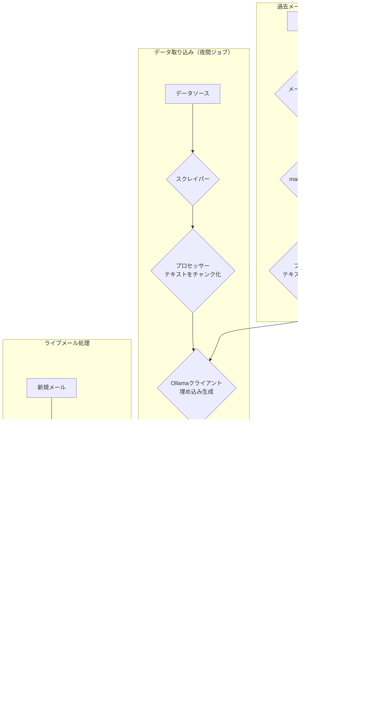
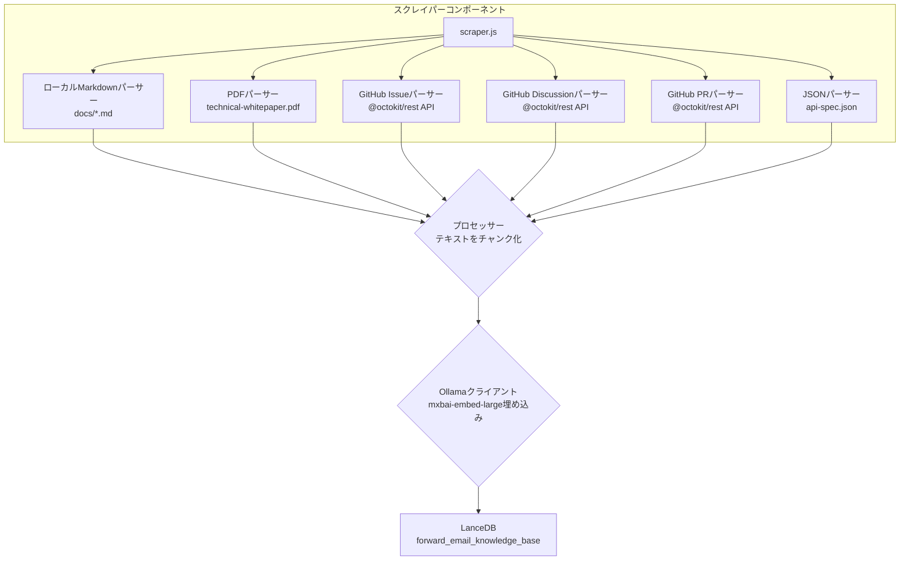
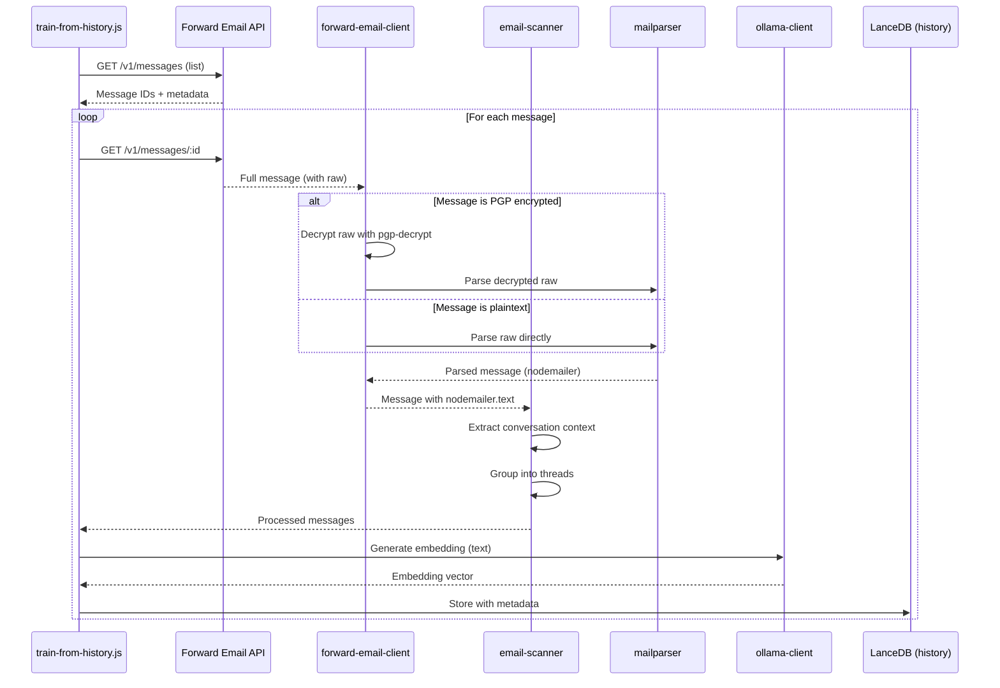

# LanceDB、Ollama、Node.jsを使ったプライバシーファーストAIカスタマーサポートエージェントの構築 {#building-a-privacy-first-ai-customer-support-agent-with-lancedb-ollama-and-nodejs}


> \[!NOTE]
> 本ドキュメントは、セルフホスト型AIサポートエージェント構築の旅路をまとめたものです。類似の課題については、当社の[Email Startup Graveyard](https://forwardemail.net/blog/docs/email-startup-graveyard-why-80-percent-email-companies-fail)ブログ記事でも触れています。正直なところ、「AI Startup Graveyard」という続編を書こうかとも考えましたが、AIバブルがはじけるかもしれないもう1年ほど先まで待つ必要があるかもしれません。現時点では、うまくいったこと、うまくいかなかったこと、そしてなぜこの方法を選んだのかの脳内ダンプです。

これは私たちが自分たちで作ったAIカスタマーサポートエージェントの構築方法です。難しい道を選びました：セルフホスト、プライバシーファースト、完全に自分たちの管理下に置くこと。なぜなら、第三者サービスに顧客データを預けることを信用していないからです。これはGDPRやDPAの要件であり、正しいことだからです。

これは楽しい週末プロジェクトではありませんでした。壊れた依存関係、誤解を招くドキュメント、そして2025年のオープンソースAIエコシステムの混沌を乗り越える1か月にわたる旅でした。本ドキュメントは、私たちが何を作り、なぜ作り、どんな障害に直面したかの記録です。


## 目次 {#table-of-contents}

* [顧客メリット：AI強化型ヒューマンサポート](#customer-benefits-ai-augmented-human-support)
  * [より速く、より正確な回答](#faster-more-accurate-responses)
  * [燃え尽き症候群なしの一貫性](#consistency-without-burnout)
  * [得られるもの](#what-you-get)
* [個人的な振り返り：20年の努力](#a-personal-reflection-the-two-decade-grind)
* [なぜプライバシーが重要か](#why-privacy-matters)
* [コスト分析：クラウドAI vs セルフホスト](#cost-analysis-cloud-ai-vs-self-hosted)
  * [クラウドAIサービス比較](#cloud-ai-service-comparison)
  * [コスト内訳：5GBナレッジベース](#cost-breakdown-5gb-knowledge-base)
  * [セルフホストハードウェアコスト](#self-hosted-hardware-costs)
* [自社APIのドッグフーディング](#dogfooding-our-own-api)
  * [ドッグフーディングが重要な理由](#why-dogfooding-matters)
  * [API使用例](#api-usage-examples)
  * [パフォーマンスの利点](#performance-benefits)
* [暗号化アーキテクチャ](#encryption-architecture)
  * [レイヤー1：メールボックス暗号化（chacha20-poly1305）](#layer-1-mailbox-encryption-chacha20-poly1305)
  * [レイヤー2：メッセージレベルPGP暗号化](#layer-2-message-level-pgp-encryption)
  * [トレーニングにおける重要性](#why-this-matters-for-training)
  * [ストレージのセキュリティ](#storage-security)
  * [ローカルストレージは標準的な実践](#local-storage-is-standard-practice)
* [アーキテクチャ](#the-architecture)
  * [ハイレベルフロー](#high-level-flow)
  * [詳細なスクレイパーフロー](#detailed-scraper-flow)
* [仕組み](#how-it-works)
  * [ナレッジベースの構築](#building-the-knowledge-base)
  * [過去のメールからのトレーニング](#training-from-historical-emails)
  * [受信メールの処理](#processing-incoming-emails)
  * [ベクターストア管理](#vector-store-management)
* [ベクターデータベースの墓場](#the-vector-database-graveyard)
* [システム要件](#system-requirements)
* [Cronジョブ設定](#cron-job-configuration)
  * [環境変数](#environment-variables)
  * [複数受信箱のCronジョブ](#cron-jobs-for-multiple-inboxes)
  * [Cronスケジュールの内訳](#cron-schedule-breakdown)
  * [動的日付計算](#dynamic-date-calculation)
  * [初期設定：サイトマップからURLリスト抽出](#initial-setup-extract-url-list-from-sitemap)
  * [Cronジョブの手動テスト](#testing-cron-jobs-manually)
  * [ログの監視](#monitoring-logs)
* [コード例](#code-examples)
  * [スクレイピングと処理](#scraping-and-processing)
  * [過去のメールからのトレーニング](#training-from-historical-emails-1)
  * [コンテキストのクエリ](#querying-for-context)
* [将来展望：スパムスキャナーの研究開発](#the-future-spam-scanner-rd)
* [トラブルシューティング](#troubleshooting)
  * [ベクター次元不一致エラー](#vector-dimension-mismatch-error)
  * [空のナレッジベースコンテキスト](#empty-knowledge-base-context)
  * [PGP復号失敗](#pgp-decryption-failures)
* [使用のヒント](#usage-tips)
  * [受信トレイゼロの達成](#achieving-inbox-zero)
  * [skip-aiラベルの使用](#using-the-skip-ai-label)
  * [メールスレッドと全員返信](#email-threading-and-reply-all)
  * [監視とメンテナンス](#monitoring-and-maintenance)
* [テスト](#testing)
  * [テストの実行](#running-tests)
  * [テストカバレッジ](#test-coverage)
  * [テスト環境](#test-environment)
* [重要なポイント](#key-takeaways)
## 顧客メリット：AI強化型ヒューマンサポート {#customer-benefits-ai-augmented-human-support}

当社のAIシステムはサポートチームの代わりではなく、彼らをより良くします。これがあなたにとって意味することは次の通りです：

### より速く、より正確な対応 {#faster-more-accurate-responses}

**ヒューマン・イン・ザ・ループ**：AIが生成したすべてのドラフトは、送信前に当社の人間のサポートチームによってレビュー、編集、キュレーションされます。AIは初期の調査とドラフト作成を担当し、チームは品質管理とパーソナライズに集中できます。

**人間の専門知識でトレーニング**：AIは以下から学習しています：

* 手書きのナレッジベースとドキュメント
* 人間が執筆したブログ記事やチュートリアル
* 当社の包括的なFAQ（人間が作成）
* 過去の顧客との会話（すべて実際の人間が対応）

あなたは何年もの人間の専門知識に基づいた回答を、より速く受け取っています。

### バーンアウトなしの一貫性 {#consistency-without-burnout}

当社の小規模チームは毎日数百件のサポートリクエストを処理し、それぞれ異なる技術知識とメンタルコンテキストの切り替えを必要とします：

* 請求に関する質問は財務システムの知識が必要
* DNSの問題はネットワークの専門知識が必要
* API統合はプログラミング知識が必要
* セキュリティ報告は脆弱性評価が必要

AIの支援がなければ、この絶え間ないコンテキスト切り替えは以下を引き起こします：

* 対応時間の遅延
* 疲労による人的ミス
* 回答品質の不一致
* チームのバーンアウト

**AI強化により**、当社チームは：

* より速く対応（AIが数秒でドラフト作成）
* ミスが減る（AIが一般的なミスを検出）
* 一貫した品質を維持（AIは毎回同じナレッジベースを参照）
* 新鮮で集中力を保つ（調査時間が減り、支援に集中）

### あなたが得られるもの {#what-you-get}

✅ **スピード**：AIが数秒でドラフトを作成し、人間が数分以内にレビューして送信

✅ **正確さ**：実際のドキュメントと過去の解決策に基づく回答

✅ **一貫性**：午前9時でも午後9時でも同じ高品質な回答

✅ **人間の温かみ**：すべての回答はチームがレビューしパーソナライズ

✅ **幻覚なし**：AIは検証済みのナレッジベースのみを使用し、一般的なインターネットデータは使用しません

> \[!NOTE]
> **常に人間と話しています**。AIはチームが正しい答えをより速く見つけるのを助けるリサーチアシスタントです。図書館員が関連書籍を即座に見つけるようなものですが、読むのも説明するのも人間です。


## 個人的な振り返り：20年の努力 {#a-personal-reflection-the-two-decade-grind}

技術的な詳細に入る前に、個人的な一言。私はこの仕事をほぼ20年続けています。キーボードに向かう終わりなき時間、解決策を追い求める絶え間ない努力、深く集中したグラインド—これが意味のあるものを作る現実です。これは新技術の盛り上がりの中でしばしば見過ごされがちな現実です。

最近のAIの爆発的な進展は特に苛立たしいものです。自動化の夢、コードを書き問題を解決するAIアシスタントの夢を売り込まれています。現実は？出力されるのはしばしばゴミのようなコードで、最初から書くより修正に時間がかかることが多いのです。生活を楽にするという約束は偽りです。これは構築という困難で必要な作業からの気晴らしに過ぎません。

そしてオープンソースへの貢献のジレンマがあります。すでに疲弊し、限界まで追い込まれている中で、詳細で構造化されたバグ報告を書くためにAIを使い、メンテナが問題を理解しやすく修正しやすくしようとします。するとどうなるか？叱責されます。最近の[Node.js GitHub issue](https://github.com/nodejs/node/issues/60719#issuecomment-3534304321)で見られたように、「話題外」や「手抜き」として貢献が却下されるのです。これは助けようとするシニア開発者への侮辱です。

これが私たちが働くエコシステムの現実です。壊れたツールだけでなく、貢献者の時間と[努力を尊重しない文化](https://forwardemail.net/blog/docs/how-npm-packages-billion-downloads-shaped-javascript-ecosystem)の問題でもあります。この投稿はその現実の記録です。ツールの話であると同時に、約束に満ちていながら根本的に壊れたエコシステムで構築することの人間的コストについての物語でもあります。
## なぜプライバシーが重要なのか {#why-privacy-matters}

私たちの[技術ホワイトペーパー](https://forwardemail.net/technical-whitepaper.pdf)では、プライバシーに関する哲学を詳しく説明しています。簡単に言うと、顧客データを第三者に送信することは一切ありません。絶対にありません。つまり、OpenAIもAnthropicもクラウドホストのベクトルデータベースも使いません。すべては私たちのインフラ上でローカルに動作します。これはGDPR準拠およびDPAの約束のために譲れない条件です。


## コスト分析：クラウドAI vs セルフホスト {#cost-analysis-cloud-ai-vs-self-hosted}

技術的な実装に入る前に、コストの観点からセルフホスティングがなぜ重要なのかを説明します。クラウドAIサービスの価格モデルは、カスタマーサポートのような大量利用ケースでは非常に高額になります。

### クラウドAIサービス比較 {#cloud-ai-service-comparison}

| サービス         | プロバイダー         | 埋め込みコスト                                                   | LLMコスト（入力）                                                         | LLMコスト（出力）      | プライバシーポリシー                                | GDPR/DPA        | ホスティング       | データ共有        |
| --------------- | ------------------- | ---------------------------------------------------------------- | -------------------------------------------------------------------------- | ---------------------- | --------------------------------------------------- | --------------- | ----------------- | ----------------- |
| **OpenAI**      | OpenAI (米国)        | [$0.02-0.13/100万トークン](https://openai.com/api/pricing/)      | $0.15-20/100万トークン                                                     | $0.60-80/100万トークン  | [リンク](https://openai.com/policies/privacy-policy/) | 限定的DPA       | Azure (米国)       | あり（トレーニング） |
| **Claude**      | Anthropic (米国)     | 該当なし                                                         | [$3-20/100万トークン](https://docs.claude.com/en/docs/about-claude/pricing) | $15-80/100万トークン    | [リンク](https://www.anthropic.com/legal/privacy)   | 限定的DPA       | AWS/GCP (米国)     | なし（主張）       |
| **Gemini**      | Google (米国)        | [$0.15/100万トークン](https://ai.google.dev/gemini-api/docs/pricing) | $0.30-1.00/100万トークン                                                   | $2.50/100万トークン     | [リンク](https://policies.google.com/privacy)       | 限定的DPA       | GCP (米国)         | あり（改善）       |
| **DeepSeek**    | DeepSeek (中国)      | 該当なし                                                         | [$0.028-0.28/100万トークン](https://api-docs.deepseek.com/quick_start/pricing) | $0.42/100万トークン     | [リンク](https://www.deepseek.com/en)               | 不明            | 中国               | 不明              |
| **Mistral**     | Mistral AI (フランス) | [$0.10/100万トークン](https://mistral.ai/pricing)                | $0.40/100万トークン                                                        | $2.00/100万トークン     | [リンク](https://mistral.ai/terms/)                 | EU GDPR         | EU                 | 不明              |
| **セルフホスト** | あなた               | $0（既存ハードウェア）                                           | $0（既存ハードウェア）                                                     | $0（既存ハードウェア）  | あなたのポリシー                                   | 完全準拠        | MacBook M5 + cron  | なし              |

> \[!WARNING]
> **データ主権の懸念**：米国のプロバイダー（OpenAI、Claude、Gemini）はCLOUD Actの対象であり、米国政府がデータにアクセス可能です。DeepSeek（中国）は中国のデータ法の下で運用されています。Mistral（フランス）はEUホスティングとGDPR準拠を提供していますが、完全なデータ主権と管理のためにはセルフホスティングが唯一の選択肢です。

### コスト内訳：5GBナレッジベース {#cost-breakdown-5gb-knowledge-base}

5GBのナレッジベース（中規模企業のドキュメント、メール、サポート履歴に典型的なサイズ）を処理するコストを計算しましょう。

**前提条件：**

* 5GBのテキスト ≈ 12.5億トークン（約4文字/トークンと仮定）
* 初回の埋め込み生成
* 月次再トレーニング（全再埋め込み）
* 月間10,000件のサポートクエリ
* 平均クエリ：入力500トークン、出力300トークン
**詳細なコスト内訳:**

| コンポーネント                          | OpenAI           | Claude          | Gemini               | セルフホスト        |
| -------------------------------------- | ---------------- | --------------- | -------------------- | ------------------ |
| **初期埋め込み** (12.5億トークン)      | $25,000          | 該当なし         | $187,500             | $0                 |
| **月間クエリ** (10K × 800トークン)      | $1,200-16,000    | $2,400-16,000   | $2,400-3,200         | $0                 |
| **月間再トレーニング** (12.5億トークン) | $25,000          | 該当なし         | $187,500             | $0                 |
| **初年度合計**                         | $325,200-217,000 | $28,800-192,000 | $2,278,800-2,226,000 | 約$60 (電気代)     |
| **プライバシー準拠**                   | ❌ 制限あり       | ❌ 制限あり      | ❌ 制限あり           | ✅ 完全対応         |
| **データ主権**                        | ❌ なし           | ❌ なし          | ❌ なし               | ✅ あり             |

> \[!CAUTION]
> **Geminiの埋め込みコストは壊滅的です**。1Mトークンあたり$0.15。5GBのナレッジベース埋め込み1回で$187,500かかります。これはOpenAIの37倍のコストであり、実運用には全く使えません。

### セルフホストハードウェアコスト {#self-hosted-hardware-costs}

当社のセットアップは既存の所有ハードウェアで動作しています:

* **ハードウェア**: MacBook M5（開発用に既に所有）
* **追加コスト**: $0（既存ハードウェアを使用）
* **電気代**: 約$5/月（推定）
* **初年度合計**: 約$60
* **継続費用**: $60/年

**ROI**: セルフホストは既存の開発用ハードウェアを使っているため、ほぼ追加コストなしです。システムはオフピーク時間にcronジョブで動作します。


## 自社APIのドッグフーディング {#dogfooding-our-own-api}

最も重要なアーキテクチャ上の決定の一つは、すべてのAIジョブが[Forward Email API](https://forwardemail.net/email-api)を直接使用することでした。これは単なる良い実践ではなく、パフォーマンス最適化の強制力となっています。

### ドッグフーディングが重要な理由 {#why-dogfooding-matters}

当社のAIジョブが顧客と同じAPIエンドポイントを使うことで:

1. **パフォーマンスのボトルネックを最初に体感** - 顧客より先に問題を感じる
2. **最適化が全員に利益をもたらす** - ジョブの改善が自動的に顧客体験を向上させる
3. **実環境でのテスト** - 数千通のメールを処理し継続的な負荷テストを実施
4. **コードの再利用** - 認証、レート制限、エラーハンドリング、キャッシュロジックを共通化

### API使用例 {#api-usage-examples}

**メッセージ一覧取得 (train-from-history.js):**

```javascript
// GET /v1/messages?folder=INBOX を BasicAuth で使用
// eml, raw, nodemailer はレスポンスサイズ削減のため除外（IDのみ必要）
const response = await axios.get(
  `${this.apiBase}/v1/messages`,
  {
    params: {
      folder: 'INBOX',
      limit: 100,
      eml: false,
      raw: false,
      nodemailer: false
    },
    auth: {
      username: process.env.FORWARD_EMAIL_ALIAS_USERNAME,
      password: process.env.FORWARD_EMAIL_ALIAS_PASSWORD
    }
  }
);

const messages = response.data;
// 返却: [{ id, subject, date, ... }, ...]
// メッセージ全文は後で GET /v1/messages/:id で取得
```

**全文メッセージ取得 (forward-email-client.js):**

```javascript
// GET /v1/messages/:id でrawコンテンツ付きの全文を取得
const response = await axios.get(
  `${this.apiBase}/v1/messages/${messageId}`,
  {
    auth: {
      username: this.aliasUsername,
      password: this.aliasPassword
    }
  }
);

const message = response.data;
// 返却: { id, subject, raw, eml, nodemailer: { ... }, ... }
```

**下書き返信作成 (process-inbox.js):**

```javascript
// POST /v1/messages で下書き返信を作成
const response = await axios.post(
  `${this.apiBase}/v1/messages`,
  {
    folder: 'Drafts',
    subject: `Re: ${originalSubject}`,
    to: senderEmail,
    text: generatedResponse,
    inReplyTo: originalMessageId
  },
  {
    auth: {
      username: process.env.FORWARD_EMAIL_ALIAS_USERNAME,
      password: process.env.FORWARD_EMAIL_ALIAS_PASSWORD
    }
  }
);
```
### パフォーマンスの利点 {#performance-benefits}

当社のAIジョブは同じAPIインフラ上で動作しているため：

* **キャッシュ最適化** はジョブと顧客の両方に利益をもたらします
* **レート制限** は実際の負荷下でテストされています
* **エラーハンドリング** は実戦で検証済みです
* **API応答時間** は常に監視されています
* **データベースクエリ** は両方のユースケースに最適化されています
* **帯域幅の最適化** - `eml`、`raw`、`nodemailer` を除外して一覧表示すると応答サイズが約90%削減されます

`train-from-history.js` が1,000通のメールを処理すると、1,000回以上のAPIコールを行います。APIの非効率は即座に明らかになります。これによりIMAPアクセス、データベースクエリ、応答のシリアライズを最適化せざるを得ず、これらの改善は直接顧客に利益をもたらします。

**最適化例**：100件のメッセージを全文付きで一覧表示すると約10MBの応答。`eml: false, raw: false, nodemailer: false` で一覧表示すると約100KBの応答（100倍小さい）。


## 暗号化アーキテクチャ {#encryption-architecture}

当社のメールストレージは複数層の暗号化を使用しており、AIジョブはトレーニングのためにリアルタイムでこれを復号します。

### レイヤー1：メールボックス暗号化（chacha20-poly1305） {#layer-1-mailbox-encryption-chacha20-poly1305}

すべてのIMAPメールボックスは、量子耐性のある暗号アルゴリズム **chacha20-poly1305** で暗号化されたSQLiteデータベースとして保存されています。詳細は当社の[量子耐性暗号化メールサービスのブログ記事](https://forwardemail.net/blog/docs/best-quantum-safe-encrypted-email-service)をご覧ください。

**主な特性：**

* **アルゴリズム**：ChaCha20-Poly1305（AEAD暗号）
* **量子耐性**：量子コンピュータ攻撃に耐性あり
* **保存形式**：ディスク上のSQLiteデータベースファイル
* **アクセス方法**：IMAP/API経由でアクセス時にメモリ上で復号

### レイヤー2：メッセージレベルのPGP暗号化 {#layer-2-message-level-pgp-encryption}

多くのサポートメールはさらにPGP（OpenPGP標準）で暗号化されています。AIジョブはこれらを復号してトレーニング用のコンテンツを抽出します。

**復号フロー：**

```javascript
// 1. APIが暗号化されたrawコンテンツ付きのメッセージを返す
const message = await forwardEmailClient.getMessage(id);

// 2. rawコンテンツがPGP暗号化されているか確認
if (isMessageEncrypted(message.raw)) {
  // 3. 秘密鍵で復号
  const decryptedRaw = await pgpDecrypt(message.raw);

  // 4. 復号したMIMEメッセージを解析
  const parsed = await simpleParser(decryptedRaw);

  // 5. nodemailerに復号済みコンテンツをセット
  message.nodemailer = {
    text: parsed.text,
    html: parsed.html,
    from: parsed.from,
    to: parsed.to,
    subject: parsed.subject,
    date: parsed.date
  };
}
```

**PGP設定：**

```bash
# 復号用秘密鍵（ASCIIアーマー形式の鍵ファイルパス）
GPG_SECURITY_KEY="/path/to/private-key.asc"

# 秘密鍵のパスフレーズ（暗号化されている場合）
GPG_SECURITY_PASSPHRASE="your-passphrase"
```

`pgp-decrypt.js` ヘルパーは：

1. 秘密鍵をディスクから一度読み込み（メモリにキャッシュ）
2. パスフレーズで鍵を復号
3. 復号済み鍵を使ってすべてのメッセージを復号
4. ネストされた暗号化メッセージの再帰的復号をサポート

### トレーニングにおける重要性 {#why-this-matters-for-training}

適切に復号しなければ、AIは暗号化された意味不明なデータで学習してしまいます：

```
-----BEGIN PGP MESSAGE-----
Version: OpenPGP.js v4.10.10

wcBMA8Z3lHJnFnNUAQgAqK7F8...
-----END PGP MESSAGE-----
```

復号すれば、AIは実際のコンテンツで学習します：

```
Subject: Re: Bug Report

Hi John,

Thanks for reporting this issue. I've confirmed the bug
and created a fix in PR #1234...
```

### ストレージのセキュリティ {#storage-security}

復号はジョブ実行中にメモリ上で行われ、復号済みコンテンツは埋め込みに変換されてからディスク上のLanceDBベクトルデータベースに保存されます。

**データの所在：**

* **ベクトルデータベース**：暗号化されたMacBook M5ワークステーション上に保存
* **物理的セキュリティ**：ワークステーションは常に当社管理下（データセンターには置かない）
* **ディスク暗号化**：すべてのワークステーションでフルディスク暗号化
* **ネットワークセキュリティ**：ファイアウォールで保護され、パブリックネットワークから隔離

**将来のデータセンター展開：**
もしデータセンターに移行する場合、サーバーは以下を備えます：

* LUKSによるフルディスク暗号化
* USBアクセス無効化
* 物理的セキュリティ対策
* ネットワークの分離
完全なセキュリティ対策の詳細については、[セキュリティページ](https://forwardemail.net/en/security)をご覧ください。

> \[!NOTE]
> ベクターデータベースには埋め込み（数学的表現）が含まれており、元のプレーンテキストは含まれていません。ただし、埋め込みは逆解析される可能性があるため、暗号化され物理的に保護されたワークステーション上に保持しています。

### ローカルストレージは標準的な慣行です {#local-storage-is-standard-practice}

埋め込みをチームのワークステーションに保存することは、すでにメールを扱う方法と何ら変わりません：

* **Thunderbird**：メールの全文をmbox/maildirファイルにローカル保存
* **Webメールクライアント**：ブラウザのストレージやローカルデータベースにメールデータをキャッシュ
* **IMAPクライアント**：オフラインアクセスのためにメッセージのローカルコピーを保持
* **当社のAIシステム**：数学的埋め込み（プレーンテキストではない）をLanceDBに保存

主な違いは、埋め込みはプレーンテキストのメールよりも**より安全**であることです：

1. 数学的表現であり、読み取れるテキストではない
2. プレーンテキストより逆解析が難しい
3. メールクライアントと同様に物理的セキュリティの対象である

チームが暗号化されたワークステーションでThunderbirdやWebメールを使用することが許容されるなら、同様に（むしろより安全に）埋め込みを同じ方法で保存することも許容されます。


## アーキテクチャ {#the-architecture}

基本的なフローは以下の通りです。一見シンプルですが、実際はそうではありませんでした。

> \[!NOTE]
> すべてのジョブはForward Email APIを直接使用しており、パフォーマンス最適化は当社のAIシステムとお客様の両方に利益をもたらします。

### ハイレベルフロー {#high-level-flow}



### 詳細なスクレイパーフロー {#detailed-scraper-flow}

`scraper.js`はデータ取り込みの中核です。さまざまなデータ形式のパーサーの集合体です。




## 動作の仕組み {#how-it-works}

プロセスは主に3つの部分に分かれています：ナレッジベースの構築、過去メールからのトレーニング、新規メールの処理。

### ナレッジベースの構築 {#building-the-knowledge-base}

**`update-knowledge-base.js`**：メインジョブです。毎晩実行され、古いベクターストアをクリアしてゼロから再構築します。`scraper.js`で全ソースからコンテンツを取得し、`processor.js`でチャンク化、`ollama-client.js`で埋め込みを生成します。最後に`vector-store.js`がすべてをLanceDBに保存します。

**データソース：**

* ローカルMarkdownファイル（`docs/*.md`）
* 技術ホワイトペーパーPDF（`assets/technical-whitepaper.pdf`）
* API仕様JSON（`assets/api-spec.json`）
* GitHub Issues（Octokit経由）
* GitHub Discussions（Octokit経由）
* GitHubプルリクエスト（Octokit経由）
* サイトマップURLリスト（`$LANCEDB_PATH/valid-urls.json`）

### 過去メールからのトレーニング {#training-from-historical-emails}

**`train-from-history.js`**：このジョブはすべてのフォルダの過去メールをスキャンし、PGP暗号化されたメッセージを復号して、別のベクターストア（`customer_support_history`）に追加します。これにより過去のサポート対話からのコンテキストが提供されます。
**メール処理フロー:**



**主な機能:**

* **PGP復号**: `GPG_SECURITY_KEY` 環境変数を使用した `pgp-decrypt.js` ヘルパーを利用
* **スレッドグルーピング**: 関連するメールを会話スレッドにまとめる
* **メタデータ保持**: フォルダ、件名、日付、暗号化状態を保存
* **返信コンテキスト**: メッセージとその返信をリンクさせ、より良いコンテキストを提供

**設定:**

```bash
# train-from-history 用環境変数
HISTORY_SCAN_LIMIT=1000              # 処理する最大メッセージ数
HISTORY_SCAN_SINCE="2024-01-01"      # この日付以降のメッセージのみ処理
HISTORY_DECRYPT_PGP=true             # PGP復号を試みる
GPG_SECURITY_KEY="/path/to/key.asc"  # PGP秘密鍵のパス
GPG_SECURITY_PASSPHRASE="passphrase" # 鍵のパスフレーズ（任意）
```

**保存される内容:**

```javascript
{
  type: 'historical_email',
  folder: 'INBOX',
  subject: 'Re: Bug Report',
  date: '2025-01-15T10:30:00Z',
  messageId: '67e2f288893921...',
  threadId: 'Bug Report',
  hasReply: true,
  encrypted: true,
  decrypted: true,
  replySubject: 'Bug Report',
  replyText: 'First 500 chars of reply...',
  chunkSize: 1000,
  chunkOverlap: 200,
  chunkIndex: 0
}
```

> \[!TIP]
> 初期セットアップ後に `train-from-history` を実行して履歴コンテキストを構築してください。これにより過去のサポート対話から学習し、応答品質が大幅に向上します。

### 受信メールの処理 {#processing-incoming-emails}

**`process-inbox.js`**: このジョブは `support@forwardemail.net`、`abuse@forwardemail.net`、`security@forwardemail.net` のメールボックス（特に `INBOX` IMAPフォルダパス）内のメールを処理します。API <https://forwardemail.net/email-api>（例: `GET /v1/messages?folder=INBOX` を各メールボックスのIMAP認証情報でBasicAuthアクセス）を利用し、メール内容を解析します。ナレッジベース（`forward_email_knowledge_base`）と履歴メールのベクトルストア（`customer_support_history`）を照会し、統合されたコンテキストを `response-generator.js` に渡します。ジェネレーターは Ollama 経由で `mxbai-embed-large` を使い応答を生成します。

**自動化ワークフローの特徴:**

1. **Inbox Zero 自動化**: 下書き作成成功後、元のメッセージは自動的にアーカイブフォルダに移動されます。これにより受信箱が整理され、手動操作なしでInbox Zeroを達成できます。

2. **AI処理のスキップ**: メッセージに `skip-ai` ラベル（大文字小文字不問）を付けるだけでAI処理を回避できます。メッセージは受信箱に残り、手動で対応可能です。機密性の高いメッセージや複雑なケースに便利です。

3. **適切なメールスレッド処理**: すべての下書き返信には元のメッセージが引用符付き（標準の ` >  ` プレフィックス）で含まれ、「On \[date], \[sender] wrote:」形式のメール返信慣習に従います。これによりメールクライアントでの会話コンテキストとスレッドが正しく維持されます。

4. **全員返信動作**: システムは Reply-To ヘッダーと CC 受信者を自動処理します:
   * Reply-To ヘッダーがある場合は To アドレスとなり、元の From は CC に追加されます
   * 元の To と CC の全受信者は返信の CC に含まれます（自分のアドレスは除く）
   * グループ会話の標準的な全員返信ルールに従います
**ソースランキング**: システムは**重み付けランキング**を使用してソースの優先順位を決定します:

* FAQ: 100%（最優先）
* 技術ホワイトペーパー: 95%
* API仕様書: 90%
* 公式ドキュメント: 85%
* GitHubのIssue: 70%
* 過去のメール: 50%

### ベクターストア管理 {#vector-store-management}

`helpers/customer-support-ai/vector-store.js` の `VectorStore` クラスは LanceDB へのインターフェースです。

**ドキュメントの追加:**

```javascript
// vector-store.js
async addDocument(text, metadata) {
  const embedding = await this.ollama.generateEmbedding(text);
  await this.table.add([{
    vector: embedding,
    text,
    ...metadata
  }]);
}
```

**ストアのクリア:**

```javascript
// オプション1: clear() メソッドを使用
await vectorStore.clear();

// オプション2: ローカルデータベースディレクトリを削除
await fs.rm(process.env.LANCEDB_PATH, { recursive: true, force: true });
```

`LANCEDB_PATH` 環境変数はローカルの組み込みデータベースディレクトリを指します。LanceDB はサーバーレスで組み込み型のため、別プロセスの管理は不要です。


## ベクターデータベースの墓場 {#the-vector-database-graveyard}

ここが最初の大きな壁でした。LanceDB に落ち着く前に複数のベクターデータベースを試しました。各々で何が問題だったのかを以下に示します。

| データベース | GitHub                                                      | 問題点                                                                                                                                                                                                             | 具体的な問題点                                                                                                                                                                                                                                                                                                                                                           | セキュリティ上の懸念                                                                                                                                                                                             |
| ------------ | ----------------------------------------------------------- | ---------------------------------------------------------------------------------------------------------------------------------------------------------------------------------------------------------------- | ------------------------------------------------------------------------------------------------------------------------------------------------------------------------------------------------------------------------------------------------------------------------------------------------------------------------------------------------------------------------- | ---------------------------------------------------------------------------------------------------------------------------------------------------------------------------------------------------------------- |
| **ChromaDB** | [chroma-core/chroma](https://github.com/chroma-core/chroma) | `pip3 install chromadb` は `PydanticImportError` を伴う旧バージョンをインストールします。動作するバージョンを得るにはソースからのコンパイルが必要で、開発者に優しくありません。                                         | Python依存関係の混乱。複数のユーザーが壊れたpipインストールを報告 ([#774](https://github.com/chroma-core/chroma/issues/774), [#163](https://github.com/chroma-core/chroma/issues/163))。ドキュメントは「Dockerを使え」とだけ書いてあり、ローカル開発には不十分。Windowsで99件以上のレコードでクラッシュ ([#3058](https://github.com/chroma-core/chroma/issues/3058))。 | **CVE-2024-45848**: MindsDBのChromaDB統合による任意コード実行。Dockerイメージの重大なOS脆弱性 ([#3170](https://github.com/chroma-core/chroma/issues/3170))。                      |
| **Qdrant**   | [qdrant/qdrant](https://github.com/qdrant/qdrant)           | 旧ドキュメントで参照されていた Homebrew タップ (`qdrant/qdrant/qdrant`) は消失し、理由は不明。公式ドキュメントは現在「Dockerを使え」とのみ記載。                                                                 | Homebrew タップがなくなった。macOSネイティブバイナリなし。Dockerのみは手軽なローカルテストの障壁となる。                                                                                                                                                                                                                                                               | **CVE-2024-2221**: 任意ファイルアップロード脆弱性によりリモートコード実行可能（v1.9.0で修正）。[IronCore Labs](https://ironcorelabs.com/vectordbs/qdrant-security/)によるセキュリティ成熟度スコアは低い。 |
| **Weaviate** | [weaviate/weaviate](https://github.com/weaviate/weaviate)   | Homebrew版に致命的なクラスタリングバグ（`leader not found`）があり、修正用のフラグ（`RAFT_JOIN`、`CLUSTER_HOSTNAME`）は機能しませんでした。シングルノード構成では根本的に問題あり。                                   | シングルノードモードでもクラスタリングバグ。単純なユースケースには過剰設計。                                                                                                                                                                                                                                                                                           | 重大なCVEは見つかっていませんが、複雑さが攻撃対象領域を増やします。                                                                                                                                              |
| **LanceDB**  | [lancedb/lancedb](https://github.com/lancedb/lancedb)       | これは動作しました。組み込み型でサーバーレス。別プロセス不要。唯一の煩わしさはパッケージ名の混乱（`vectordb`は非推奨で`@lancedb/lancedb`を使う）とドキュメントが散在していることですが、許容範囲です。                     | パッケージ名の混乱（`vectordb` vs `@lancedb/lancedb`）はありますが、それ以外は堅実。組み込みアーキテクチャにより多くのセキュリティ問題が排除されます。                                                                                                                                                                                                                     | 既知のCVEなし。組み込み設計によりネットワーク攻撃面がありません。                                                                                                                                              |
> \[!WARNING]
> **ChromaDBには重大なセキュリティ脆弱性があります。** [CVE-2024-45848](https://nvd.nist.gov/vuln/detail/CVE-2024-45848) により任意のコード実行が可能です。pipインストールはPydantic依存関係の問題で根本的に壊れています。運用環境での使用は避けてください。

> \[!WARNING]
> **QdrantにはファイルアップロードRCE脆弱性** ([CVE-2024-2221](https://qdrant.tech/blog/cve-2024-2221-response/)) があり、v1.9.0でのみ修正されました。Qdrantを使用する場合は、最新バージョンを使用していることを確認してください。

> \[!CAUTION]
> オープンソースのベクターデータベースエコシステムは未成熟です。ドキュメントを信用しないでください。すべてが壊れていると仮定し、証明されるまではそう考えてください。スタックに組み込む前にローカルでテストしてください。


## システム要件 {#system-requirements}

* **Node.js:** v18.0.0以上 ([GitHub](https://github.com/nodejs/node))
* **Ollama:** 最新版 ([GitHub](https://github.com/ollama/ollama))
* **モデル:** Ollama経由の `mxbai-embed-large`
* **ベクターデータベース:** LanceDB ([GitHub](https://github.com/lancedb/lancedb))
* **GitHubアクセス:** 課題スクレイピング用の `@octokit/rest` ([GitHub](https://github.com/octokit/rest.js))
* **SQLite:** プライマリデータベース用（`mongoose-to-sqlite`経由）


## Cronジョブ設定 {#cron-job-configuration}

すべてのAIジョブはMacBook M5上でcronを使って実行されます。複数の受信箱で深夜にジョブを実行するための設定方法は以下の通りです。

### 環境変数 {#environment-variables}

ジョブには以下の環境変数が必要です。ほとんどは `.env` ファイルに設定可能（`@ladjs/env`で読み込み）ですが、`HISTORY_SCAN_SINCE` はcrontab内で動的に計算する必要があります。

**`.env` ファイル内:**

```bash
# Forward Email API認証情報（受信箱ごとに異なる）
FORWARD_EMAIL_ALIAS_USERNAME=support@forwardemail.net
FORWARD_EMAIL_ALIAS_PASSWORD=your-imap-password

# PGP復号鍵（すべての受信箱で共有）
GPG_SECURITY_KEY=/path/to/private-key.asc
GPG_SECURITY_PASSPHRASE=your-passphrase

# 過去メールスキャン設定
HISTORY_SCAN_LIMIT=1000

# LanceDBのパス
LANCEDB_PATH=/path/to/lancedb
```

**crontab内（動的計算）:**

```bash
# HISTORY_SCAN_SINCEはcrontab内でシェルの日付計算を使ってインライン設定する必要があります
# @ladjs/envはシェルコマンドを評価しないため.envファイルには設定できません
HISTORY_SCAN_SINCE="$(date -v-1d +%Y-%m-%d)"  # macOS
HISTORY_SCAN_SINCE="$(date -d 'yesterday' +%Y-%m-%d)"  # Linux
```

### 複数受信箱用Cronジョブ {#cron-jobs-for-multiple-inboxes}

`crontab -e`で編集し、以下を追加してください:

```bash
# ナレッジベース更新（1回実行、すべての受信箱で共有）
0 0 * * * cd /path/to/forwardemail.net && LANCEDB_PATH="/path/to/lancedb" GPG_SECURITY_KEY="/path/to/key.asc" GPG_SECURITY_PASSPHRASE="pass" node jobs/customer-support-ai/update-knowledge-base.js >> /var/log/update-knowledge-base.log 2>&1

# 過去メールから学習 - support@forwardemail.net
0 0 * * * cd /path/to/forwardemail.net && FORWARD_EMAIL_ALIAS_USERNAME="support@forwardemail.net" FORWARD_EMAIL_ALIAS_PASSWORD="support-password" HISTORY_SCAN_SINCE="$(date -v-1d +%Y-%m-%d)" HISTORY_SCAN_LIMIT=1000 GPG_SECURITY_KEY="/path/to/key.asc" GPG_SECURITY_PASSPHRASE="pass" LANCEDB_PATH="/path/to/lancedb" node jobs/customer-support-ai/train-from-history.js >> /var/log/train-support.log 2>&1

# 過去メールから学習 - abuse@forwardemail.net
0 0 * * * cd /path/to/forwardemail.net && FORWARD_EMAIL_ALIAS_USERNAME="abuse@forwardemail.net" FORWARD_EMAIL_ALIAS_PASSWORD="abuse-password" HISTORY_SCAN_SINCE="$(date -v-1d +%Y-%m-%d)" HISTORY_SCAN_LIMIT=1000 GPG_SECURITY_KEY="/path/to/key.asc" GPG_SECURITY_PASSPHRASE="pass" LANCEDB_PATH="/path/to/lancedb" node jobs/customer-support-ai/train-from-history.js >> /var/log/train-abuse.log 2>&1

# 過去メールから学習 - security@forwardemail.net
0 0 * * * cd /path/to/forwardemail.net && FORWARD_EMAIL_ALIAS_USERNAME="security@forwardemail.net" FORWARD_EMAIL_ALIAS_PASSWORD="security-password" HISTORY_SCAN_SINCE="$(date -v-1d +%Y-%m-%d)" HISTORY_SCAN_LIMIT=1000 GPG_SECURITY_KEY="/path/to/key.asc" GPG_SECURITY_PASSPHRASE="pass" LANCEDB_PATH="/path/to/lancedb" node jobs/customer-support-ai/train-from-history.js >> /var/log/train-security.log 2>&1

# 受信箱処理 - support@forwardemail.net
*/5 * * * * cd /path/to/forwardemail.net && FORWARD_EMAIL_ALIAS_USERNAME="support@forwardemail.net" FORWARD_EMAIL_ALIAS_PASSWORD="support-password" GPG_SECURITY_KEY="/path/to/key.asc" GPG_SECURITY_PASSPHRASE="pass" LANCEDB_PATH="/path/to/lancedb" node jobs/customer-support-ai/process-inbox.js >> /var/log/process-support.log 2>&1

# 受信箱処理 - abuse@forwardemail.net
*/5 * * * * cd /path/to/forwardemail.net && FORWARD_EMAIL_ALIAS_USERNAME="abuse@forwardemail.net" FORWARD_EMAIL_ALIAS_PASSWORD="abuse-password" GPG_SECURITY_KEY="/path/to/key.asc" GPG_SECURITY_PASSPHRASE="pass" LANCEDB_PATH="/path/to/lancedb" node jobs/customer-support-ai/process-inbox.js >> /var/log/process-abuse.log 2>&1

# 受信箱処理 - security@forwardemail.net
*/5 * * * * cd /path/to/forwardemail.net && FORWARD_EMAIL_ALIAS_USERNAME="security@forwardemail.net" FORWARD_EMAIL_ALIAS_PASSWORD="security-password" GPG_SECURITY_KEY="/path/to/key.asc" GPG_SECURITY_PASSPHRASE="pass" LANCEDB_PATH="/path/to/lancedb" node jobs/customer-support-ai/process-inbox.js >> /var/log/process-security.log 2>&1
```
### Cron スケジュールの内訳 {#cron-schedule-breakdown}

| ジョブ                     | スケジュール      | 説明                                                                                 |
| -------------------------- | --------------- | ------------------------------------------------------------------------------------ |
| `train-from-sitemap.js`    | `0 0 * * 0`     | 週次（日曜深夜） - サイトマップからすべてのURLを取得し、ナレッジベースをトレーニングします |
| `train-from-history.js`    | `0 0 * * *`     | 毎日深夜 - 前日のメールを各受信箱ごとにスキャンします                               |
| `process-inbox.js`         | `*/5 * * * *`   | 5分ごと - 新しいメールを処理し、ドラフトを生成します                                |

### 動的日付計算 {#dynamic-date-calculation}

`HISTORY_SCAN_SINCE` 変数は **crontab内でインラインで計算する必要があります**。理由は以下の通りです：

1. `.env` ファイルは `@ladjs/env` によってリテラル文字列として読み込まれる
2. シェルのコマンド置換 `$(...)` は `.env` ファイル内では動作しない
3. cronが実行されるたびに日付を新たに計算する必要がある

**正しい方法（crontab内で）：**

```bash
# macOS (BSD date)
HISTORY_SCAN_SINCE="$(date -v-1d +%Y-%m-%d)" node jobs/...

# Linux (GNU date)
HISTORY_SCAN_SINCE="$(date -d 'yesterday' +%Y-%m-%d)" node jobs/...
```

**誤った方法（.envでは動作しません）：**

```bash
# これはリテラル文字列 "$(date -v-1d +%Y-%m-%d)" として読み込まれます
# シェルコマンドとして評価されません
HISTORY_SCAN_SINCE=$(date -v-1d +%Y-%m-%d)
```

これにより、毎晩の実行時に前日の日付が動的に計算され、無駄な処理を避けられます。

### 初期設定：サイトマップからURLリストを抽出 {#initial-setup-extract-url-list-from-sitemap}

process-inboxジョブを初めて実行する前に、**必ず**サイトマップからURLリストを抽出してください。これにより、LLMが参照できる有効なURLの辞書が作成され、URLの幻覚を防止します。

```bash
# 初回セットアップ：サイトマップからURLリストを抽出
cd /path/to/forwardemail.net
node jobs/customer-support-ai/train-from-sitemap.js
```

**これが行うこと：**

1. <https://forwardemail.net/sitemap.xml> からすべてのURLを取得
2. ローカライズされていないURLまたは /en/ URL のみをフィルタリング（重複コンテンツを回避）
3. ロケールのプレフィックスを削除（/en/faq → /faq）
4. URLリストをシンプルなJSONファイルとして `$LANCEDB_PATH/valid-urls.json` に保存
5. クロールやメタデータのスクレイピングは行わず、有効なURLのフラットリストのみ

**これが重要な理由：**

* LLMが `/dashboard` や `/login` のような偽のURLを幻覚するのを防ぐ
* レスポンス生成時に参照可能な有効URLのホワイトリストを提供
* シンプルで高速、ベクターデータベースの保存は不要
* レスポンス生成器は起動時にこのリストを読み込み、プロンプトに含める

**週次更新のためにcrontabに追加：**

```bash
# サイトマップからURLリストを抽出 - 週次（日曜深夜）
0 0 * * 0 cd /path/to/forwardemail.net && node jobs/customer-support-ai/train-from-sitemap.js >> /var/log/train-sitemap.log 2>&1
```

### Cronジョブの手動テスト {#testing-cron-jobs-manually}

cronに追加する前にジョブをテストするには：

```bash
# サイトマップトレーニングのテスト
cd /path/to/forwardemail.net
export LANCEDB_PATH="/path/to/lancedb"
node jobs/customer-support-ai/train-from-sitemap.js

# サポート受信箱トレーニングのテスト
cd /path/to/forwardemail.net
export FORWARD_EMAIL_ALIAS_USERNAME="support@forwardemail.net"
export FORWARD_EMAIL_ALIAS_PASSWORD="support-password"
export HISTORY_SCAN_SINCE="$(date -v-1d +%Y-%m-%d)"
export HISTORY_SCAN_LIMIT=1000
export GPG_SECURITY_KEY="/path/to/key.asc"
export GPG_SECURITY_PASSPHRASE="pass"
export LANCEDB_PATH="/path/to/lancedb"
node jobs/customer-support-ai/train-from-history.js
```

### ログの監視 {#monitoring-logs}

各ジョブはデバッグしやすいように別々のファイルにログを出力します：

```bash
# サポート受信箱処理をリアルタイムで監視
tail -f /var/log/process-support.log

# 昨晩のトレーニング実行を確認
cat /var/log/train-support.log | grep "$(date -v-1d +%Y-%m-%d)"

# ジョブ全体のエラーを確認
grep -i error /var/log/train-*.log /var/log/process-*.log
```

> \[!TIP]
> 受信箱ごとにログファイルを分けて問題を切り分けましょう。ある受信箱で認証問題があっても、他の受信箱のログには影響しません。
## Code Examples {#code-examples}

### Scraping and Processing {#scraping-and-processing}

```javascript
// jobs/customer-support-ai/update-knowledge-base.js
const scraper = new Scraper();
const processor = new Processor();
const ollamaClient = new OllamaClient();
const vectorStore = new VectorStore();

// Clear old data
await vectorStore.clear();

// Scrape all sources
const documents = await scraper.scrapeAll();
console.log(`スクレイピングしたドキュメント数: ${documents.length}`);

// Process into chunks
const allChunks = [];
for (const doc of documents) {
  const chunks = processor.processDocuments([doc]);
  allChunks.push(...chunks);
}
console.log(`生成されたチャンク数: ${allChunks.length}`);

// Generate embeddings and store
const texts = allChunks.map(chunk => chunk.text);
const embeddings = await ollamaClient.generateEmbeddings(texts);

for (let i = 0; i < allChunks.length; i++) {
  await vectorStore.addDocument(texts[i], {
    ...allChunks[i].metadata,
    embedding: embeddings[i]
  });
}
```

### Training from Historical Emails {#training-from-historical-emails-1}

```javascript
// jobs/customer-support-ai/train-from-history.js
const scanner = new EmailScanner({
  forwardEmailApiBase: config.forwardEmailApiBase,
  forwardEmailAliasUsername: config.forwardEmailAliasUsername,
  forwardEmailAliasPassword: config.forwardEmailAliasPassword
});

const vectorStore = new VectorStore({
  collectionName: 'customer_support_history'
});

// Scan all folders (INBOX, Sent Mail, etc.)
const messages = await scanner.scanAllFolders({
  limit: 1000,
  since: new Date('2024-01-01'),
  decryptPGP: true
});

// Group into conversation threads
const threads = scanner.groupIntoThreads(messages);

// Process each thread
for (const thread of threads) {
  const context = scanner.extractConversationContext(thread);

  for (const message of context.messages) {
    // Skip encrypted messages that couldn't be decrypted
    if (message.encrypted && !message.decrypted) continue;

    // Use already-parsed content from nodemailer
    const text = message.nodemailer?.text || '';
    if (!text.trim()) continue;

    // Chunk and store
    const chunks = processor.chunkText(`件名: ${message.subject}\n\n${text}`, {
      chunkSize: 1000,
      chunkOverlap: 200
    });

    for (const chunk of chunks) {
      await vectorStore.addDocument(chunk.text, {
        type: 'historical_email',
        folder: message.folder,
        subject: message.subject,
        date: message.nodemailer?.date || message.created_at,
        messageId: message.id,
        threadId: context.subject,
        encrypted: message.encrypted || false,
        decrypted: message.decrypted || false,
        ...chunk.metadata
      });
    }
  }
}
```

### Querying for Context {#querying-for-context}

```javascript
// jobs/customer-support-ai/process-inbox.js
const vectorStore = new VectorStore();
const historyVectorStore = new VectorStore({
  collectionName: 'customer_support_history'
});

// Query both stores
const knowledgeContext = await vectorStore.query(emailEmbedding, { limit: 8 });
const historyContext = await historyVectorStore.query(emailEmbedding, { limit: 3 });

// Weighted ranking and deduplication happen here
const rankedContext = rankAndDeduplicateContext(knowledgeContext, historyContext);

// Generate response
const response = await responseGenerator.generate(email, rankedContext);
```


## The Future: Spam Scanner R\&D {#the-future-spam-scanner-rd}

このプロジェクト全体は単なるカスタマーサポートのためだけではありませんでした。これは研究開発（R\&D）でした。私たちはローカル埋め込み、ベクターストア、コンテキスト取得について学んだすべてを活用し、次の大きなプロジェクトである[Spam Scanner](https://spamscanner.net)のLLMレイヤーに応用できます。プライバシー、自社ホスティング、意味理解の同じ原則が鍵となります。


## Troubleshooting {#troubleshooting}

### Vector Dimension Mismatch Error {#vector-dimension-mismatch-error}

**エラー:**

```
Error: Failed to execute query stream: GenericFailure, Invalid input, No vector column found to match with the query vector dimension: 1024
```

**原因:** このエラーは、埋め込みモデルを（例：`mistral-small`から`mxbai-embed-large`へ）切り替えた際に、既存のLanceDBデータベースが異なるベクトル次元で作成されている場合に発生します。
**解決策:** 新しい埋め込みモデルでナレッジベースを再学習する必要があります:

```bash
# 1. 実行中のカスタマーサポートAIジョブを停止する
pkill -f customer-support-ai

# 2. 既存の LanceDB データベースを削除する
rm -rf ~/.local/share/lancedb/forward_email_knowledge_base.lance
rm -rf ~/.local/share/lancedb/customer_support_history.lance

# 3. .env に埋め込みモデルが正しく設定されているか確認する
grep OLLAMA_EMBEDDING_MODEL .env
# 以下が表示されるはずです: OLLAMA_EMBEDDING_MODEL=mxbai-embed-large

# 4. Ollama で埋め込みモデルをプルする
ollama pull mxbai-embed-large

# 5. ナレッジベースを再学習する
node jobs/customer-support-ai/train-from-history.js

# 6. Bree 経由で process-inbox ジョブを再起動する
# ジョブは5分ごとに自動で実行されます
```

**なぜこの問題が起きるのか:** 埋め込みモデルによってベクトルの次元数が異なります:

* `mistral-small`: 1024 次元
* `mxbai-embed-large`: 1024 次元
* `nomic-embed-text`: 768 次元
* `all-minilm`: 384 次元

LanceDB はテーブルスキーマにベクトルの次元数を保存しています。異なる次元数でクエリを実行すると失敗します。唯一の解決策は新しいモデルでデータベースを再作成することです。

### 空のナレッジベースコンテキスト {#empty-knowledge-base-context}

**症状:**

```
debug     Retrieved knowledge base context {
  total: 0,
  afterRanking: 0,
  questionType: 'capability'
}
```

**原因:** ナレッジベースがまだ学習されていないか、LanceDB のテーブルが存在しません。

**解決策:** 学習ジョブを実行してナレッジベースを構築してください:

```bash
# 過去のメールから学習する
node jobs/customer-support-ai/train-from-history.js

# またはウェブサイト/ドキュメントから学習する（スクレイパーがある場合）
node jobs/customer-support-ai/train-from-website.js
```

### PGP 復号失敗 {#pgp-decryption-failures}

**症状:** メッセージは暗号化されていると表示されるが内容が空です。

**解決策:**

1. GPG キーパスが正しく設定されているか確認する:

```bash
grep GPG_SECURITY_KEY .env
# プライベートキーのファイルを指しているはずです
```

2. 手動で復号をテストする:

```bash
node -e "const decrypt = require('./helpers/customer-support-ai/pgp-decrypt'); decrypt.testDecryption();"
```

3. キーの権限を確認する:

```bash
ls -la /path/to/your/gpg-key.asc
# ジョブを実行するユーザーが読み取り可能である必要があります
```


## 利用のヒント {#usage-tips}

### インボックスゼロの達成 {#achieving-inbox-zero}

システムは自動的にインボックスゼロを達成するよう設計されています:

1. **自動アーカイブ**: 下書きが正常に作成されると、元のメッセージは自動的にアーカイブフォルダに移動されます。これにより手動操作なしでインボックスが整理されます。

2. **下書きの確認**: 下書きフォルダを定期的にチェックしてAI生成の返信を確認してください。必要に応じて編集してから送信します。

3. **手動オーバーライド**: 特別な対応が必要なメッセージには、ジョブ実行前に `skip-ai` ラベルを追加してください。

### skip-ai ラベルの使い方 {#using-the-skip-ai-label}

特定のメッセージでAI処理を防ぐには:

1. **ラベルを追加**: メールクライアントで任意のメッセージに `skip-ai` ラベル/タグを追加します（大文字小文字は区別しません）
2. **メッセージはインボックスに残る**: メッセージは処理もアーカイブもされません
3. **手動で対応**: AIの干渉なしに自分で返信できます

**skip-ai を使うべき場合:**

* 機密性の高いメッセージ
* 人間の判断が必要な複雑なケース
* VIP顧客からのメッセージ
* 法務やコンプライアンス関連の問い合わせ
* 即時の人間対応が必要なメッセージ

### メールのスレッド化と全員返信 {#email-threading-and-reply-all}

システムは標準的なメールの慣習に従います:

**引用された元のメッセージ:**

```
Hi there,

[AI-generated response]

--
Thank you,
Forward Email
https://forwardemail.net

On Mon, Jan 15, 2024, 3:45 PM John Doe <john@example.com> wrote:
> This is the original message
> with each line quoted
> using the standard "> " prefix
```

**Reply-To の処理:**

* 元のメッセージに Reply-To ヘッダーがある場合、下書きはそのアドレスに返信します
* 元の From アドレスは CC に追加されます
* その他の元の To と CC の受信者はすべて保持されます

**例:**

```
元のメッセージ:
  From: john@company.com
  Reply-To: support@company.com
  To: support@forwardemail.net
  CC: manager@company.com

下書き返信:
  To: support@company.com (Reply-To から)
  CC: john@company.com, manager@company.com
```
### 監視とメンテナンス {#monitoring-and-maintenance}

**ドラフトの品質を定期的に確認する:**

```bash
# 最近のドラフトを表示
tail -f /var/log/process-support.log | grep "Draft created"
```

**アーカイブの監視:**

```bash
# アーカイブエラーを確認
grep "archive message" /var/log/process-*.log
```

**スキップされたメッセージの確認:**

```bash
# スキップされたメッセージを確認
grep "skip-ai label" /var/log/process-*.log
```


## テスト {#testing}

カスタマーサポートAIシステムには23のAvaテストによる包括的なテストカバレッジが含まれています。

### テストの実行 {#running-tests}

`better-sqlite3`とのnpmパッケージのオーバーライド競合のため、提供されたテストスクリプトを使用してください:

```bash
# すべてのカスタマーサポートAIテストを実行
./scripts/test-customer-support-ai.sh

# 詳細出力で実行
./scripts/test-customer-support-ai.sh --verbose

# 特定のテストファイルを実行
./scripts/test-customer-support-ai.sh test/customer-support-ai/message-utils.js
```

または、直接テストを実行します:

```bash
NODE_ENV=test node node_modules/.pnpm/ava@5.3.1/node_modules/ava/entrypoints/cli.mjs test/customer-support-ai
```

### テストカバレッジ {#test-coverage}

**Sitemap Fetcher (6テスト):**

* ロケールパターンの正規表現マッチング
* URLパスの抽出とロケールの除去
* ロケール用のURLフィルタリングロジック
* XML解析ロジック
* 重複排除ロジック
* フィルタリング、除去、重複排除の組み合わせ

**Message Utils (9テスト):**

* 名前とメールを含む送信者テキストの抽出
* 名前がプレフィックスと一致する場合のメールのみの処理
* from.textが利用可能な場合の使用
* Reply-Toがある場合の使用
* Reply-Toがない場合のFromの使用
* 元のCC受信者の含有
* 自分自身のアドレスをCCから除外
* Reply-ToがCCにある場合のFromの処理
* CCアドレスの重複排除

**Response Generator (8テスト):**

* プロンプト用のURLグルーピングロジック
* 送信者名検出ロジック
* プロンプト構造に必要なすべてのセクションを含む
* 角括弧なしのURLリストフォーマット
* 空のURLリストの処理
* 禁止URLリストをプロンプトに含む
* 過去のコンテキストの含有
* アカウント関連トピックの正しいURL

### テスト環境 {#test-environment}

テストは`.env.test`を設定に使用します。テスト環境には以下が含まれます:

* モックのPayPalおよびStripe認証情報
* テスト用暗号化キー
* 無効化された認証プロバイダー
* 安全なテストデータパス

すべてのテストは外部依存やネットワーク呼び出しなしで実行可能です。


## 重要なポイント {#key-takeaways}

1. **プライバシー最優先:** GDPR/DPA準拠のためにセルフホスティングは必須です。
2. **コストが重要:** クラウドAIサービスは本番ワークロードでセルフホスティングの50〜1000倍のコストがかかります。
3. **エコシステムは壊れている:** ほとんどのベクターデータベースは開発者に優しくありません。すべてをローカルでテストしてください。
4. **セキュリティ脆弱性は現実:** ChromaDBとQdrantには重大なRCE脆弱性がありました。
5. **LanceDBは機能する:** 組み込み型でサーバーレス、別プロセス不要です。
6. **Ollamaは堅実:** ローカルLLM推論で`mxbai-embed-large`は当社のユースケースに適しています。
7. **型の不一致は致命的:** `text`と`content`、ObjectIDと文字列。これらのバグは静かで厳しいです。
8. **重み付けランキングが重要:** すべてのコンテキストが同等ではありません。FAQ > GitHub issues > 過去のメール。
9. **過去のコンテキストは宝:** 過去のサポートメールからの学習は応答品質を劇的に向上させます。
10. **PGP復号は必須:** 多くのサポートメールは暗号化されており、適切な復号がトレーニングに不可欠です。

---

Forward Emailとプライバシー最優先のメールアプローチについては[forwardemail.net](https://forwardemail.net)をご覧ください。
