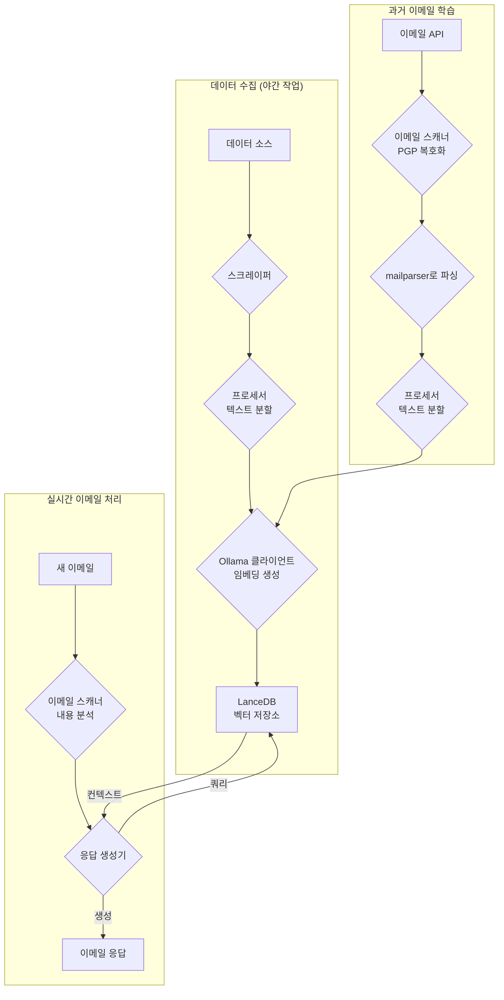
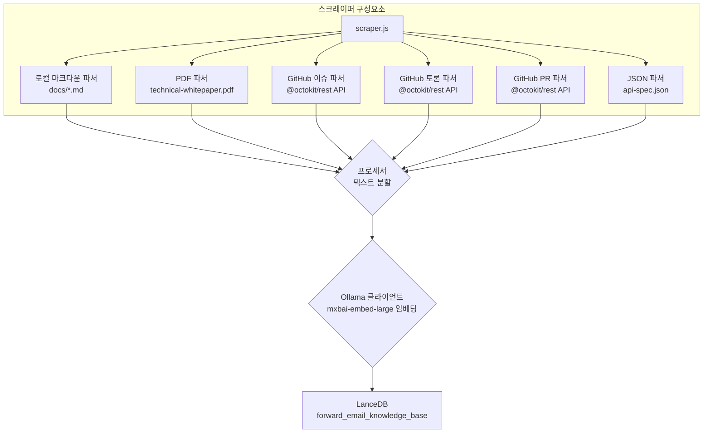
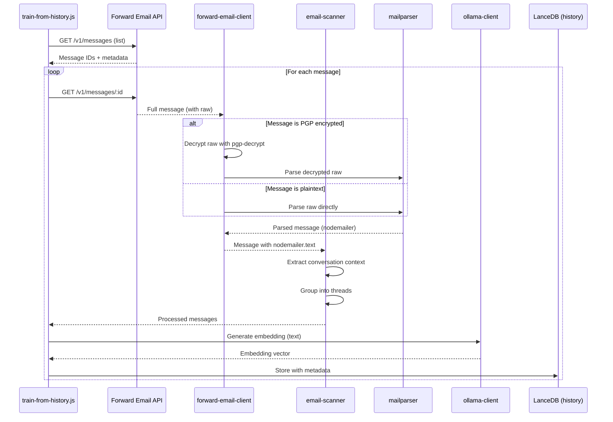

# LanceDB, Ollama, Node.js로 프라이버시 우선 AI 고객 지원 에이전트 구축하기 {#building-a-privacy-first-ai-customer-support-agent-with-lancedb-ollama-and-nodejs}


> \[!NOTE]
> 이 문서는 자체 호스팅 AI 지원 에이전트를 구축한 여정을 다룹니다. 비슷한 도전 과제에 대해서는 저희가 쓴 [Email Startup Graveyard](https://forwardemail.net/blog/docs/email-startup-graveyard-why-80-percent-email-companies-fail) 블로그 글에서 확인할 수 있습니다. 솔직히 "AI Startup Graveyard"라는 후속 글을 쓸까도 생각했지만, AI 버블이 잠재적으로 꺼질 때까지 아마 1년 정도는 더 기다려야 할 것 같습니다(?). 지금은 무엇이 효과적이었고, 무엇이 그렇지 않았으며, 왜 이렇게 했는지에 대한 저희의 생각 정리입니다.

이것이 저희가 직접 구축한 AI 고객 지원 에이전트입니다. 어렵게 했습니다: 자체 호스팅, 프라이버시 우선, 완전한 통제 하에. 왜냐하면 저희는 고객 데이터에 대해 제3자 서비스를 신뢰하지 않기 때문입니다. 이는 GDPR 및 DPA 요구사항이며, 올바른 일이기도 합니다.

이것은 재미있는 주말 프로젝트가 아니었습니다. 2025년 오픈소스 AI 생태계의 깨진 의존성, 오해의 소지가 있는 문서, 그리고 전반적인 혼란을 헤쳐 나가는 한 달간의 여정이었습니다. 이 문서는 저희가 무엇을 만들었고, 왜 만들었으며, 그 과정에서 어떤 장애물을 만났는지에 대한 기록입니다.


## 목차 {#table-of-contents}

* [고객 혜택: AI가 보조하는 인간 지원](#customer-benefits-ai-augmented-human-support)
  * [더 빠르고 정확한 응답](#faster-more-accurate-responses)
  * [번아웃 없는 일관성](#consistency-without-burnout)
  * [얻을 수 있는 것](#what-you-get)
* [개인적인 회고: 20년간의 노력](#a-personal-reflection-the-two-decade-grind)
* [프라이버시가 중요한 이유](#why-privacy-matters)
* [비용 분석: 클라우드 AI 대 자체 호스팅](#cost-analysis-cloud-ai-vs-self-hosted)
  * [클라우드 AI 서비스 비교](#cloud-ai-service-comparison)
  * [비용 세부 내역: 5GB 지식 베이스](#cost-breakdown-5gb-knowledge-base)
  * [자체 호스팅 하드웨어 비용](#self-hosted-hardware-costs)
* [자체 API 도그푸딩](#dogfooding-our-own-api)
  * [도그푸딩이 중요한 이유](#why-dogfooding-matters)
  * [API 사용 예시](#api-usage-examples)
  * [성능 이점](#performance-benefits)
* [암호화 아키텍처](#encryption-architecture)
  * [1단계: 메일박스 암호화 (chacha20-poly1305)](#layer-1-mailbox-encryption-chacha20-poly1305)
  * [2단계: 메시지 수준 PGP 암호화](#layer-2-message-level-pgp-encryption)
  * [학습에 중요한 이유](#why-this-matters-for-training)
  * [저장 보안](#storage-security)
  * [로컬 저장은 표준 관행](#local-storage-is-standard-practice)
* [아키텍처](#the-architecture)
  * [고수준 흐름](#high-level-flow)
  * [상세 스크래퍼 흐름](#detailed-scraper-flow)
* [작동 원리](#how-it-works)
  * [지식 베이스 구축](#building-the-knowledge-base)
  * [과거 이메일로부터 학습](#training-from-historical-emails)
  * [수신 이메일 처리](#processing-incoming-emails)
  * [벡터 스토어 관리](#vector-store-management)
* [벡터 데이터베이스 무덤](#the-vector-database-graveyard)
* [시스템 요구사항](#system-requirements)
* [크론 작업 구성](#cron-job-configuration)
  * [환경 변수](#environment-variables)
  * [여러 인박스용 크론 작업](#cron-jobs-for-multiple-inboxes)
  * [크론 스케줄 세부 내역](#cron-schedule-breakdown)
  * [동적 날짜 계산](#dynamic-date-calculation)
  * [초기 설정: 사이트맵에서 URL 목록 추출](#initial-setup-extract-url-list-from-sitemap)
  * [크론 작업 수동 테스트](#testing-cron-jobs-manually)
  * [로그 모니터링](#monitoring-logs)
* [코드 예제](#code-examples)
  * [스크래핑 및 처리](#scraping-and-processing)
  * [과거 이메일로부터 학습](#training-from-historical-emails-1)
  * [컨텍스트 쿼리](#querying-for-context)
* [미래: 스팸 스캐너 연구개발](#the-future-spam-scanner-rd)
* [문제 해결](#troubleshooting)
  * [벡터 차원 불일치 오류](#vector-dimension-mismatch-error)
  * [빈 지식 베이스 컨텍스트](#empty-knowledge-base-context)
  * [PGP 복호화 실패](#pgp-decryption-failures)
* [사용 팁](#usage-tips)
  * [인박스 제로 달성하기](#achieving-inbox-zero)
  * [skip-ai 라벨 사용하기](#using-the-skip-ai-label)
  * [이메일 스레딩 및 전체 회신](#email-threading-and-reply-all)
  * [모니터링 및 유지보수](#monitoring-and-maintenance)
* [테스트](#testing)
  * [테스트 실행](#running-tests)
  * [테스트 커버리지](#test-coverage)
  * [테스트 환경](#test-environment)
* [핵심 요점](#key-takeaways)
## 고객 혜택: AI 보조 인간 지원 {#customer-benefits-ai-augmented-human-support}

우리 AI 시스템은 지원 팀을 대체하는 것이 아니라, 그들을 더 뛰어나게 만듭니다. 이것이 여러분에게 의미하는 바는 다음과 같습니다:

### 더 빠르고 정확한 응답 {#faster-more-accurate-responses}

**휴먼 인 더 루프(Human-in-the-Loop)**: AI가 생성한 모든 초안은 고객에게 보내기 전에 우리 인간 지원 팀이 검토, 편집, 선별합니다. AI는 초기 조사와 초안 작성 작업을 처리하여 팀이 품질 관리와 개인화에 집중할 수 있도록 합니다.

**인간 전문 지식으로 학습**: AI는 다음에서 학습합니다:

* 우리가 직접 작성한 지식 기반 및 문서
* 인간이 작성한 블로그 게시물과 튜토리얼
* 포괄적인 FAQ (인간이 작성)
* 과거 고객 대화 (모두 실제 인간이 처리)

여러분은 수년간의 인간 전문 지식에 기반한 응답을 더 빠르게 받게 됩니다.

### 번아웃 없는 일관성 {#consistency-without-burnout}

우리 소규모 팀은 매일 수백 건의 지원 요청을 처리하며, 각각은 다양한 기술 지식과 정신적 맥락 전환을 요구합니다:

* 청구 관련 질문은 금융 시스템 지식 필요
* DNS 문제는 네트워킹 전문 지식 필요
* API 통합은 프로그래밍 지식 필요
* 보안 보고서는 취약점 평가 필요

AI 지원 없이는 이러한 지속적인 맥락 전환이 다음을 초래합니다:

* 느린 응답 시간
* 피로로 인한 인간 오류
* 일관성 없는 답변 품질
* 팀 번아웃

**AI 보조를 통해**, 우리 팀은:

* 더 빠르게 응답 (AI가 초안을 몇 초 만에 작성)
* 오류 감소 (AI가 흔한 실수 포착)
* 일관된 품질 유지 (AI가 매번 동일한 지식 기반 참조)
* 신선하고 집중된 상태 유지 (조사 시간 감소, 지원 시간 증가)

### 여러분이 얻는 것 {#what-you-get}

✅ **속도**: AI가 몇 초 만에 초안을 작성하고, 인간이 검토 후 몇 분 내에 발송

✅ **정확성**: 실제 문서와 과거 해결책에 기반한 응답

✅ **일관성**: 오전 9시든 오후 9시든 동일한 고품질 답변

✅ **인간적 터치**: 모든 응답은 팀이 검토하고 개인화

✅ **환각 없음**: AI는 검증된 지식 기반만 사용하며 일반 인터넷 데이터는 사용하지 않음

> \[!NOTE]
> **항상 인간과 대화하고 있습니다**. AI는 우리 팀이 더 빠르게 올바른 답을 찾도록 돕는 연구 보조자입니다. 도서관 사서가 즉시 관련 책을 찾아주는 것과 같지만, 여전히 인간이 그 책을 읽고 설명해 줍니다.


## 개인적인 성찰: 20년간의 고된 노력 {#a-personal-reflection-the-two-decade-grind}

기술적인 세부사항에 들어가기 전에 개인적인 이야기를 하겠습니다. 저는 거의 20년 동안 이 일을 해왔습니다. 끝없는 키보드 앞 시간, 해결책을 향한 끊임없는 추구, 깊고 집중된 노력 – 이것이 의미 있는 무언가를 만드는 현실입니다. 이는 종종 새로운 기술의 과대광고 사이클에서 간과되는 현실입니다.

최근 AI의 폭발적인 발전은 특히 답답했습니다. 우리는 자동화, AI 비서가 코드를 작성하고 문제를 해결해 줄 것이라는 꿈을 팔고 있습니다. 현실은? 출력물은 종종 쓰레기 같은 코드로, 처음부터 직접 작성하는 것보다 고치는 데 더 많은 시간이 걸립니다. 우리의 삶을 더 쉽게 만들겠다는 약속은 거짓입니다. 이는 의미 있는 구축 작업의 어려운 필수 과제에서 주의를 돌리는 것입니다.

그리고 오픈 소스에 기여하는 데는 딜레마가 있습니다. 이미 지쳐 있고, 고된 노력에 분산되어 있습니다. AI를 사용해 상세하고 잘 구조화된 버그 리포트를 작성하여 유지보수자가 문제를 더 쉽게 이해하고 해결할 수 있도록 돕고자 합니다. 그런데 무슨 일이 벌어질까요? 꾸중을 듣습니다. 최근 [Node.js GitHub 이슈](https://github.com/nodejs/node/issues/60719#issuecomment-3534304321)에서 보았듯이, 여러분의 기여가 "주제 벗어남" 또는 노력 부족으로 무시됩니다. 이는 단지 도움을 주려는 시니어 개발자들에게 모욕입니다.

이것이 우리가 일하는 생태계의 현실입니다. 단순히 도구가 부서진 문제가 아니라, 종종 기여자의 시간과 [노력을 존중하지 않는 문화](https://forwardemail.net/blog/docs/how-npm-packages-billion-downloads-shaped-javascript-ecosystem)에 관한 문제입니다. 이 글은 그 현실의 기록입니다. 도구에 관한 이야기이기도 하지만, 약속에도 불구하고 근본적으로 부서진 생태계에서 구축하는 데 드는 인간적 비용에 관한 이야기이기도 합니다.
## 개인정보 보호가 중요한 이유 {#why-privacy-matters}

우리의 [기술 백서](https://forwardemail.net/technical-whitepaper.pdf)에서는 개인정보 보호 철학을 깊이 있게 다룹니다. 간단히 말하면: 우리는 고객 데이터를 제3자에게 절대 전송하지 않습니다. 절대. 즉, OpenAI, Anthropic, 클라우드 호스팅 벡터 데이터베이스는 사용하지 않습니다. 모든 것은 우리 인프라에서 로컬로 실행됩니다. 이는 GDPR 준수와 DPA 약속을 위한 비협상 사항입니다.


## 비용 분석: 클라우드 AI 대 자체 호스팅 {#cost-analysis-cloud-ai-vs-self-hosted}

기술 구현에 들어가기 전에, 비용 관점에서 자체 호스팅이 왜 중요한지 이야기해보겠습니다. 클라우드 AI 서비스의 가격 모델은 고객 지원과 같은 대량 사용 사례에 대해 매우 비싸게 만듭니다.

### 클라우드 AI 서비스 비교 {#cloud-ai-service-comparison}

| 서비스         | 제공자              | 임베딩 비용                                                    | LLM 비용 (입력)                                                           | LLM 비용 (출력)        | 개인정보 보호 정책                                  | GDPR/DPA        | 호스팅            | 데이터 공유       |
| --------------- | ------------------- | -------------------------------------------------------------- | -------------------------------------------------------------------------- | ---------------------- | --------------------------------------------------- | --------------- | ----------------- | ----------------- |
| **OpenAI**      | OpenAI (미국)       | [$0.02-0.13/1M 토큰](https://openai.com/api/pricing/)          | $0.15-20/1M 토큰                                                         | $0.60-80/1M 토큰       | [링크](https://openai.com/policies/privacy-policy/) | 제한적 DPA      | Azure (미국)      | 예 (학습용)       |
| **Claude**      | Anthropic (미국)    | 해당 없음                                                      | [$3-20/1M 토큰](https://docs.claude.com/en/docs/about-claude/pricing)    | $15-80/1M 토큰         | [링크](https://www.anthropic.com/legal/privacy)     | 제한적 DPA      | AWS/GCP (미국)    | 아니오 (주장됨)   |
| **Gemini**      | Google (미국)       | [$0.15/1M 토큰](https://ai.google.dev/gemini-api/docs/pricing) | $0.30-1.00/1M 토큰                                                       | $2.50/1M 토큰          | [링크](https://policies.google.com/privacy)         | 제한적 DPA      | GCP (미국)        | 예 (개선용)       |
| **DeepSeek**    | DeepSeek (중국)     | 해당 없음                                                      | [$0.028-0.28/1M 토큰](https://api-docs.deepseek.com/quick_start/pricing) | $0.42/1M 토큰          | [링크](https://www.deepseek.com/en)                 | 알 수 없음      | 중국              | 알 수 없음        |
| **Mistral**     | Mistral AI (프랑스) | [$0.10/1M 토큰](https://mistral.ai/pricing)                    | $0.40/1M 토큰                                                            | $2.00/1M 토큰          | [링크](https://mistral.ai/terms/)                   | EU GDPR         | EU                | 알 수 없음        |
| **자체 호스팅** | 사용자              | $0 (기존 하드웨어)                                             | $0 (기존 하드웨어)                                                       | $0 (기존 하드웨어)     | 사용자 정책                                        | 완전 준수       | MacBook M5 + cron | 절대 없음         |

> \[!WARNING]
> **데이터 주권 문제**: 미국 제공업체(OpenAI, Claude, Gemini)는 CLOUD Act의 적용을 받아 미국 정부가 데이터에 접근할 수 있습니다. DeepSeek(중국)은 중국 데이터 법률에 따릅니다. Mistral(프랑스)은 EU 호스팅과 GDPR 준수를 제공하지만, 완전한 데이터 주권과 통제를 위해서는 자체 호스팅만이 유일한 선택입니다.

### 비용 세부 분석: 5GB 지식 베이스 {#cost-breakdown-5gb-knowledge-base}

5GB 지식 베이스(문서, 이메일, 지원 기록이 있는 중간 규모 회사에 일반적)를 처리하는 비용을 계산해봅시다.

**가정:**

* 5GB 텍스트 ≈ 12억 5천만 토큰 (약 4자/토큰 가정)
* 초기 임베딩 생성
* 월간 재학습 (전체 재임베딩)
* 월 10,000건 지원 쿼리
* 평균 쿼리: 입력 500 토큰, 출력 300 토큰
**상세 비용 내역:**

| 구성 요소                              | OpenAI           | Claude          | Gemini               | 자체 호스팅        |
| -------------------------------------- | ---------------- | --------------- | -------------------- | ------------------ |
| **초기 임베딩** (1.25B 토큰)           | $25,000          | 해당 없음       | $187,500             | $0                 |
| **월간 쿼리** (10K × 800 토큰)          | $1,200-16,000    | $2,400-16,000   | $2,400-3,200         | $0                 |
| **월간 재학습** (1.25B 토큰)            | $25,000          | 해당 없음       | $187,500             | $0                 |
| **첫 해 총합**                         | $325,200-217,000 | $28,800-192,000 | $2,278,800-2,226,000 | 약 $60 (전기료)    |
| **개인정보 보호 준수**                  | ❌ 제한적         | ❌ 제한적       | ❌ 제한적             | ✅ 완전함           |
| **데이터 주권**                       | ❌ 아니오         | ❌ 아니오       | ❌ 아니오             | ✅ 예               |

> \[!CAUTION]
> **Gemini의 임베딩 비용은 치명적입니다**. 1M 토큰당 $0.15입니다. 단일 5GB 지식 베이스 임베딩 비용이 $187,500에 달합니다. 이는 OpenAI보다 37배 비싸며, 실제 운영에는 전혀 사용할 수 없습니다.

### 자체 호스팅 하드웨어 비용 {#self-hosted-hardware-costs}

우리의 설정은 이미 보유 중인 하드웨어에서 실행됩니다:

* **하드웨어**: MacBook M5 (개발용으로 이미 보유)
* **추가 비용**: $0 (기존 하드웨어 사용)
* **전기료**: 약 $5/월 (추정)
* **첫 해 총합**: 약 $60
* **지속 비용**: $60/년

**ROI**: 자체 호스팅은 기존 개발 하드웨어를 사용하므로 사실상 한계 비용이 없습니다. 시스템은 비사용 시간대에 크론 작업으로 실행됩니다.


## 자체 API 사용 {#dogfooding-our-own-api}

우리가 내린 가장 중요한 아키텍처 결정 중 하나는 모든 AI 작업이 [Forward Email API](https://forwardemail.net/email-api)를 직접 사용하도록 한 것입니다. 이는 단순한 좋은 관행이 아니라 성능 최적화를 위한 강제 수단입니다.

### 자체 API 사용이 중요한 이유 {#why-dogfooding-matters}

우리 AI 작업이 고객과 동일한 API 엔드포인트를 사용할 때:

1. **성능 병목 현상이 우리에게 먼저 영향을 미침** - 고객보다 먼저 문제를 체감합니다
2. **최적화가 모두에게 이득** - 우리 작업의 개선이 자동으로 고객 경험을 향상시킵니다
3. **실제 환경 테스트** - 수천 건의 이메일을 처리하며 지속적인 부하 테스트를 제공합니다
4. **코드 재사용** - 동일한 인증, 속도 제한, 오류 처리, 캐싱 로직 사용

### API 사용 예시 {#api-usage-examples}

**메시지 목록 조회 (train-from-history.js):**

```javascript
// GET /v1/messages?folder=INBOX 와 BasicAuth 사용
// 응답 크기 축소를 위해 eml, raw, nodemailer 제외 (ID만 필요)
const response = await axios.get(
  `${this.apiBase}/v1/messages`,
  {
    params: {
      folder: 'INBOX',
      limit: 100,
      eml: false,
      raw: false,
      nodemailer: false
    },
    auth: {
      username: process.env.FORWARD_EMAIL_ALIAS_USERNAME,
      password: process.env.FORWARD_EMAIL_ALIAS_PASSWORD
    }
  }
);

const messages = response.data;
// 반환: [{ id, subject, date, ... }, ...]
// 전체 메시지 내용은 나중에 GET /v1/messages/:id 로 가져옴
```

**전체 메시지 가져오기 (forward-email-client.js):**

```javascript
// GET /v1/messages/:id 로 원본 메시지 전체 내용 가져오기
const response = await axios.get(
  `${this.apiBase}/v1/messages/${messageId}`,
  {
    auth: {
      username: this.aliasUsername,
      password: this.aliasPassword
    }
  }
);

const message = response.data;
// 반환: { id, subject, raw, eml, nodemailer: { ... }, ... }
```

**답장 초안 생성 (process-inbox.js):**

```javascript
// POST /v1/messages 로 답장 초안 생성
const response = await axios.post(
  `${this.apiBase}/v1/messages`,
  {
    folder: 'Drafts',
    subject: `Re: ${originalSubject}`,
    to: senderEmail,
    text: generatedResponse,
    inReplyTo: originalMessageId
  },
  {
    auth: {
      username: process.env.FORWARD_EMAIL_ALIAS_USERNAME,
      password: process.env.FORWARD_EMAIL_ALIAS_PASSWORD
    }
  }
);
```
### 성능 이점 {#performance-benefits}

우리 AI 작업이 동일한 API 인프라에서 실행되기 때문에:

* **캐싱 최적화**는 작업과 고객 모두에게 이득이 됩니다
* **요율 제한**은 실제 부하 하에서 테스트됩니다
* **오류 처리**는 실전에서 검증되었습니다
* **API 응답 시간**은 지속적으로 모니터링됩니다
* **데이터베이스 쿼리**는 두 사용 사례 모두에 최적화되어 있습니다
* **대역폭 최적화** - 목록 작성 시 `eml`, `raw`, `nodemailer`를 제외하면 응답 크기가 약 90% 감소합니다

`train-from-history.js`가 1,000개의 이메일을 처리할 때, 1,000개 이상의 API 호출을 수행합니다. API의 비효율성은 즉시 드러납니다. 이는 IMAP 접근, 데이터베이스 쿼리, 응답 직렬화를 최적화하도록 강제하며, 이러한 개선은 고객에게 직접적인 혜택을 줍니다.

**최적화 예시**: 전체 내용을 포함하여 100개의 메시지를 나열하면 약 10MB 응답이 발생합니다. `eml: false, raw: false, nodemailer: false` 옵션으로 나열하면 약 100KB 응답(100배 작음)입니다.


## 암호화 아키텍처 {#encryption-architecture}

우리의 이메일 저장은 여러 계층의 암호화를 사용하며, AI 작업은 학습을 위해 이를 실시간으로 복호화해야 합니다.

### 1단계: 메일박스 암호화 (chacha20-poly1305) {#layer-1-mailbox-encryption-chacha20-poly1305}

모든 IMAP 메일박스는 **chacha20-poly1305**라는 양자 안전 암호화 알고리즘으로 암호화된 SQLite 데이터베이스로 저장됩니다. 자세한 내용은 우리의 [양자 안전 암호화 이메일 서비스 블로그 게시물](https://forwardemail.net/blog/docs/best-quantum-safe-encrypted-email-service)을 참고하세요.

**주요 속성:**

* **알고리즘**: ChaCha20-Poly1305 (AEAD 암호)
* **양자 안전**: 양자 컴퓨팅 공격에 저항
* **저장소**: 디스크상의 SQLite 데이터베이스 파일
* **접근**: IMAP/API를 통해 접근 시 메모리 내에서 복호화됨

### 2단계: 메시지 수준 PGP 암호화 {#layer-2-message-level-pgp-encryption}

많은 지원 이메일은 추가로 PGP(OpenPGP 표준)로 암호화되어 있습니다. AI 작업은 학습을 위해 이를 복호화해야 합니다.

**복호화 흐름:**

```javascript
// 1. API가 암호화된 원시 콘텐츠가 포함된 메시지를 반환
const message = await forwardEmailClient.getMessage(id);

// 2. 원시 콘텐츠가 PGP 암호화되었는지 확인
if (isMessageEncrypted(message.raw)) {
  // 3. 개인 키로 복호화
  const decryptedRaw = await pgpDecrypt(message.raw);

  // 4. 복호화된 MIME 메시지 파싱
  const parsed = await simpleParser(decryptedRaw);

  // 5. 복호화된 콘텐츠로 nodemailer 채우기
  message.nodemailer = {
    text: parsed.text,
    html: parsed.html,
    from: parsed.from,
    to: parsed.to,
    subject: parsed.subject,
    date: parsed.date
  };
}
```

**PGP 구성:**

```bash
# 복호화를 위한 개인 키 (ASCII-armored 키 파일 경로)
GPG_SECURITY_KEY="/path/to/private-key.asc"

# 개인 키 암호 (암호화된 경우)
GPG_SECURITY_PASSPHRASE="your-passphrase"
```

`pgp-decrypt.js` 헬퍼:

1. 디스크에서 개인 키를 한 번 읽음(메모리에 캐시)
2. 암호로 키를 복호화
3. 모든 메시지 복호화에 복호화된 키 사용
4. 중첩된 암호화 메시지에 대한 재귀적 복호화 지원

### 학습에 중요한 이유 {#why-this-matters-for-training}

적절한 복호화 없이는 AI가 암호화된 난독문자에 대해 학습하게 됩니다:

```
-----BEGIN PGP MESSAGE-----
Version: OpenPGP.js v4.10.10

wcBMA8Z3lHJnFnNUAQgAqK7F8...
-----END PGP MESSAGE-----
```

복호화가 되면 AI는 실제 콘텐츠로 학습합니다:

```
Subject: Re: Bug Report

Hi John,

Thanks for reporting this issue. I've confirmed the bug
and created a fix in PR #1234...
```

### 저장 보안 {#storage-security}

복호화는 작업 실행 중 메모리 내에서 이루어지며, 복호화된 콘텐츠는 임베딩으로 변환되어 디스크상의 LanceDB 벡터 데이터베이스에 저장됩니다.

**데이터 저장 위치:**

* **벡터 데이터베이스**: 암호화된 MacBook M5 워크스테이션에 저장
* **물리적 보안**: 워크스테이션은 항상 우리와 함께 있으며(데이터센터에 없음)
* **디스크 암호화**: 모든 워크스테이션에 전체 디스크 암호화 적용
* **네트워크 보안**: 방화벽으로 보호되고 공용 네트워크와 격리됨

**향후 데이터센터 배포 계획:**
만약 데이터센터 호스팅으로 이전한다면, 서버는 다음을 갖추게 됩니다:

* LUKS 전체 디스크 암호화
* USB 접근 비활성화
* 물리적 보안 조치
* 네트워크 격리
For complete details on our security practices, see our [보안 페이지](https://forwardemail.net/en/security).

> \[!NOTE]
> 벡터 데이터베이스에는 원본 평문이 아닌 임베딩(수학적 표현)이 포함되어 있습니다. 그러나 임베딩은 잠재적으로 역공학될 수 있기 때문에 암호화되고 물리적으로 보안된 워크스테이션에 보관합니다.

### 로컬 저장소는 표준 관행입니다 {#local-storage-is-standard-practice}

임베딩을 우리 팀의 워크스테이션에 저장하는 것은 이메일을 처리하는 기존 방식과 다르지 않습니다:

* **Thunderbird**: 전체 이메일 내용을 mbox/maildir 파일에 로컬로 다운로드 및 저장
* **웹메일 클라이언트**: 브라우저 저장소 및 로컬 데이터베이스에 이메일 데이터 캐시
* **IMAP 클라이언트**: 오프라인 접근을 위해 메시지의 로컬 복사본 유지
* **우리 AI 시스템**: 수학적 임베딩(평문 아님)을 LanceDB에 저장

주요 차이점: 임베딩은 평문 이메일보다 **더 안전**합니다. 왜냐하면:

1. 수학적 표현이며 읽을 수 있는 텍스트가 아님
2. 평문보다 역공학이 더 어려움
3. 이메일 클라이언트와 동일한 물리적 보안이 적용됨

우리 팀이 암호화된 워크스테이션에서 Thunderbird나 웹메일을 사용하는 것이 허용된다면, 임베딩을 같은 방식으로 저장하는 것도 동일하게 허용되며 (어쩌면 더 안전합니다).


## 아키텍처 {#the-architecture}

기본 흐름은 다음과 같습니다. 간단해 보이지만 그렇지 않았습니다.

> \[!NOTE]
> 모든 작업은 Forward Email API를 직접 사용하여 성능 최적화가 우리 AI 시스템과 고객 모두에게 이익이 되도록 합니다.

### 고수준 흐름 {#high-level-flow}



### 상세 스크레이퍼 흐름 {#detailed-scraper-flow}

`scraper.js`는 데이터 수집의 핵심입니다. 다양한 데이터 형식에 대한 파서 모음입니다.




## 작동 방식 {#how-it-works}

프로세스는 세 가지 주요 부분으로 나뉩니다: 지식 베이스 구축, 과거 이메일 학습, 새 이메일 처리.

### 지식 베이스 구축 {#building-the-knowledge-base}

**`update-knowledge-base.js`**: 주요 작업입니다. 매일 밤 실행되며, 기존 벡터 저장소를 지우고 처음부터 다시 만듭니다. `scraper.js`로 모든 소스에서 콘텐츠를 가져오고, `processor.js`로 분할하며, `ollama-client.js`로 임베딩을 생성합니다. 마지막으로 `vector-store.js`가 모든 것을 LanceDB에 저장합니다.

**데이터 소스:**

* 로컬 마크다운 파일 (`docs/*.md`)
* 기술 백서 PDF (`assets/technical-whitepaper.pdf`)
* API 명세 JSON (`assets/api-spec.json`)
* GitHub 이슈 (Octokit 사용)
* GitHub 토론 (Octokit 사용)
* GitHub 풀 리퀘스트 (Octokit 사용)
* 사이트맵 URL 목록 (`$LANCEDB_PATH/valid-urls.json`)

### 과거 이메일 학습 {#training-from-historical-emails}

**`train-from-history.js`**: 이 작업은 모든 폴더의 과거 이메일을 스캔하고, PGP 암호화된 메시지를 복호화하며, 별도의 벡터 저장소(`customer_support_history`)에 추가합니다. 이는 과거 지원 상호작용에서 컨텍스트를 제공합니다.
**이메일 처리 흐름:**



**주요 기능:**

* **PGP 복호화**: `GPG_SECURITY_KEY` 환경 변수와 함께 `pgp-decrypt.js` 헬퍼 사용
* **스레드 그룹화**: 관련 이메일을 대화 스레드로 그룹화
* **메타데이터 보존**: 폴더, 제목, 날짜, 암호화 상태 저장
* **답장 컨텍스트**: 더 나은 컨텍스트를 위해 메시지와 답장을 연결

**설정:**

```bash
# train-from-history용 환경 변수
HISTORY_SCAN_LIMIT=1000              # 처리할 최대 메시지 수
HISTORY_SCAN_SINCE="2024-01-01"      # 이 날짜 이후의 메시지만 처리
HISTORY_DECRYPT_PGP=true             # PGP 복호화 시도
GPG_SECURITY_KEY="/path/to/key.asc"  # PGP 개인 키 경로
GPG_SECURITY_PASSPHRASE="passphrase" # 키 암호 (선택 사항)
```

**저장되는 내용:**

```javascript
{
  type: 'historical_email',
  folder: 'INBOX',
  subject: 'Re: Bug Report',
  date: '2025-01-15T10:30:00Z',
  messageId: '67e2f288893921...',
  threadId: 'Bug Report',
  hasReply: true,
  encrypted: true,
  decrypted: true,
  replySubject: 'Bug Report',
  replyText: 'First 500 chars of reply...',
  chunkSize: 1000,
  chunkOverlap: 200,
  chunkIndex: 0
}
```

> \[!TIP]
> 초기 설정 후 `train-from-history`를 실행하여 과거 컨텍스트를 채우세요. 이는 과거 지원 상호작용을 학습하여 응답 품질을 크게 향상시킵니다.

### 수신 이메일 처리 {#processing-incoming-emails}

**`process-inbox.js`**: 이 작업은 `support@forwardemail.net`, `abuse@forwardemail.net`, `security@forwardemail.net` 메일박스(특히 `INBOX` IMAP 폴더 경로)의 이메일에서 실행됩니다. <https://forwardemail.net/email-api> API를 활용하며(예: 각 메일박스의 IMAP 자격증명을 사용한 BasicAuth 접근으로 `GET /v1/messages?folder=INBOX`), 이메일 내용을 분석하고 지식 베이스(`forward_email_knowledge_base`)와 과거 이메일 벡터 저장소(`customer_support_history`)를 조회한 후 결합된 컨텍스트를 `response-generator.js`에 전달합니다. 생성기는 Ollama를 통해 `mxbai-embed-large`를 사용하여 응답을 만듭니다.

**자동화된 워크플로우 기능:**

1. **인박스 제로 자동화**: 초안이 성공적으로 생성되면 원본 메시지가 자동으로 보관함(Archive) 폴더로 이동됩니다. 이를 통해 수동 개입 없이 인박스를 깔끔하게 유지하고 인박스 제로를 달성할 수 있습니다.

2. **AI 처리 건너뛰기**: 메시지에 `skip-ai` 라벨(대소문자 구분 없음)을 추가하면 AI 처리가 차단됩니다. 메시지는 인박스에 그대로 남아 수동으로 처리할 수 있습니다. 민감한 메시지나 복잡한 사례에 유용합니다.

3. **적절한 이메일 스레딩**: 모든 초안 응답에는 원본 메시지가 아래에 인용되어 포함됩니다(표준 ` >  ` 접두사 사용). "On \[date], \[sender] wrote:" 형식으로 이메일 답장 관례를 따릅니다. 이는 이메일 클라이언트에서 적절한 대화 컨텍스트와 스레딩을 보장합니다.

4. **전체 답장 동작**: 시스템은 Reply-To 헤더와 참조(CC) 수신자를 자동으로 처리합니다:
   * Reply-To 헤더가 있으면 To 주소가 되고 원본 From은 CC에 추가됨
   * 모든 원본 To 및 CC 수신자가 답장 CC에 포함됨(자신의 주소 제외)
   * 그룹 대화에 대한 표준 이메일 전체 답장 규칙을 따름
**출처 순위**: 시스템은 **가중치 순위**를 사용하여 출처의 우선순위를 정합니다:

* FAQ: 100% (최우선 순위)
* 기술 백서: 95%
* API 명세서: 90%
* 공식 문서: 85%
* GitHub 이슈: 70%
* 과거 이메일: 50%

### 벡터 스토어 관리 {#vector-store-management}

`helpers/customer-support-ai/vector-store.js`의 `VectorStore` 클래스는 LanceDB와의 인터페이스입니다.

**문서 추가:**

```javascript
// vector-store.js
async addDocument(text, metadata) {
  const embedding = await this.ollama.generateEmbedding(text);
  await this.table.add([{
    vector: embedding,
    text,
    ...metadata
  }]);
}
```

**스토어 초기화:**

```javascript
// 옵션 1: clear() 메서드 사용
await vectorStore.clear();

// 옵션 2: 로컬 데이터베이스 디렉터리 삭제
await fs.rm(process.env.LANCEDB_PATH, { recursive: true, force: true });
```

`LANCEDB_PATH` 환경 변수는 로컬 임베디드 데이터베이스 디렉터리를 가리킵니다. LanceDB는 서버리스 임베디드 방식이므로 별도의 프로세스 관리가 필요 없습니다.


## 벡터 데이터베이스 무덤 {#the-vector-database-graveyard}

이것이 첫 번째 주요 장애물이었습니다. LanceDB를 선택하기 전에 여러 벡터 데이터베이스를 시도했습니다. 각 데이터베이스에서 무엇이 잘못되었는지 정리했습니다.

| 데이터베이스   | GitHub                                                      | 문제점                                                                                                                                                                                                             | 구체적 이슈                                                                                                                                                                                                                                                                                                                                                              | 보안 우려                                                                                                                                                                                                       |
| ------------- | ----------------------------------------------------------- | ---------------------------------------------------------------------------------------------------------------------------------------------------------------------------------------------------------------- | ------------------------------------------------------------------------------------------------------------------------------------------------------------------------------------------------------------------------------------------------------------------------------------------------------------------------------------------------------------------------- | ---------------------------------------------------------------------------------------------------------------------------------------------------------------------------------------------------------------- |
| **ChromaDB**  | [chroma-core/chroma](https://github.com/chroma-core/chroma) | `pip3 install chromadb` 명령어로 설치되는 버전이 매우 오래되어 `PydanticImportError`가 발생합니다. 작동하는 버전을 얻으려면 소스에서 직접 컴파일해야 하며 개발자 친화적이지 않습니다.                         | Python 의존성 문제 혼란. 여러 사용자가 pip 설치 실패 보고 ([#774](https://github.com/chroma-core/chroma/issues/774), [#163](https://github.com/chroma-core/chroma/issues/163)). 문서에는 "Docker만 사용하라"고 되어 있으나 로컬 개발에는 적합하지 않습니다. Windows에서 99개 이상의 레코드 처리 시 크래시 발생 ([#3058](https://github.com/chroma-core/chroma/issues/3058)). | **CVE-2024-45848**: MindsDB 내 ChromaDB 통합을 통한 임의 코드 실행 취약점. Docker 이미지 내 치명적 OS 취약점 ([#3170](https://github.com/chroma-core/chroma/issues/3170)).                                         |
| **Qdrant**    | [qdrant/qdrant](https://github.com/qdrant/qdrant)           | 이전 문서에서 참조한 Homebrew 탭(`qdrant/qdrant/qdrant`)이 사라졌습니다. 이유는 설명되지 않았으며 공식 문서에는 현재 "Docker 사용"만 안내되어 있습니다.                                                        | Homebrew 탭 부재. macOS 네이티브 바이너리 없음. Docker 전용은 빠른 로컬 테스트에 장애가 됩니다.                                                                                                                                                                                                                                                                           | **CVE-2024-2221**: 원격 코드 실행이 가능한 임의 파일 업로드 취약점(버전 1.9.0에서 수정). [IronCore Labs](https://ironcorelabs.com/vectordbs/qdrant-security/)의 보안 성숙도 점수 낮음.                          |
| **Weaviate**  | [weaviate/weaviate](https://github.com/weaviate/weaviate)   | Homebrew 버전에 치명적인 클러스터링 버그(`leader not found`)가 있었습니다. 이를 해결하기 위한 문서상의 플래그(`RAFT_JOIN`, `CLUSTER_HOSTNAME`)는 작동하지 않았으며 단일 노드 환경에서는 근본적으로 문제가 있었습니다. | 단일 노드 모드에서도 클러스터링 버그 존재. 단순 사용 사례에 비해 과도하게 복잡한 설계.                                                                                                                                                                                                                                                                                   | 주요 CVE는 없으나 복잡성으로 인해 공격 표면이 증가합니다.                                                                                                                                                       |
| **LanceDB**   | [lancedb/lancedb](https://github.com/lancedb/lancedb)       | 이 데이터베이스는 잘 작동했습니다. 임베디드 서버리스 방식이며 별도의 프로세스가 없습니다. 다만 패키지 명명(`vectordb`는 더 이상 사용하지 않고 `@lancedb/lancedb` 사용)과 문서가 분산되어 있어 다소 혼란스럽습니다. | 패키지 명명 혼란(`vectordb` vs `@lancedb/lancedb`) 외에는 안정적입니다. 임베디드 아키텍처로 인해 보안 문제의 많은 부분이 제거됩니다.                                                                                                                                                                                                                                     | 알려진 CVE 없음. 임베디드 설계로 네트워크 공격 표면이 없습니다.                                                                                                                                                   |
> \[!WARNING]
> **ChromaDB에는 치명적인 보안 취약점이 있습니다.** [CVE-2024-45848](https://nvd.nist.gov/vuln/detail/CVE-2024-45848)로 인해 임의 코드 실행이 가능합니다. Pydantic 의존성 문제로 pip 설치가 근본적으로 깨져 있습니다. 프로덕션 환경에서는 사용을 피하세요.

> \[!WARNING]
> **Qdrant에는 파일 업로드 RCE 취약점** ([CVE-2024-2221](https://qdrant.tech/blog/cve-2024-2221-response/))이 있었으며, v1.9.0에서만 수정되었습니다. Qdrant를 사용해야 한다면 최신 버전을 사용하고 있는지 확인하세요.

> \[!CAUTION]
> 오픈 소스 벡터 데이터베이스 생태계는 불안정합니다. 문서를 신뢰하지 마세요. 모든 것이 깨져 있다고 가정하고 증명될 때까지 의심하세요. 스택에 적용하기 전에 로컬에서 테스트하세요.


## 시스템 요구사항 {#system-requirements}

* **Node.js:** v18.0.0+ ([GitHub](https://github.com/nodejs/node))
* **Ollama:** 최신 버전 ([GitHub](https://github.com/ollama/ollama))
* **모델:** Ollama를 통한 `mxbai-embed-large`
* **벡터 데이터베이스:** LanceDB ([GitHub](https://github.com/lancedb/lancedb))
* **GitHub 접근:** 이슈 스크래핑용 `@octokit/rest` ([GitHub](https://github.com/octokit/rest.js))
* **SQLite:** 기본 데이터베이스용 (`mongoose-to-sqlite` 사용)


## 크론 작업 구성 {#cron-job-configuration}

모든 AI 작업은 MacBook M5에서 크론으로 실행됩니다. 여러 인박스에서 자정에 크론 작업을 실행하도록 설정하는 방법은 다음과 같습니다.

### 환경 변수 {#environment-variables}

작업에는 다음 환경 변수가 필요합니다. 대부분은 `.env` 파일에 설정할 수 있으며 (`@ladjs/env`로 로드), `HISTORY_SCAN_SINCE`는 크론탭에서 동적으로 계산해야 합니다.

**`.env` 파일 내:**

```bash
# 포워드 이메일 API 자격 증명 (인박스별로 다름)
FORWARD_EMAIL_ALIAS_USERNAME=support@forwardemail.net
FORWARD_EMAIL_ALIAS_PASSWORD=your-imap-password

# PGP 복호화 (모든 인박스에서 공유)
GPG_SECURITY_KEY=/path/to/private-key.asc
GPG_SECURITY_PASSPHRASE=your-passphrase

# 과거 스캔 구성
HISTORY_SCAN_LIMIT=1000

# LanceDB 경로
LANCEDB_PATH=/path/to/lancedb
```

**크론탭 내 (동적으로 계산):**

```bash
# HISTORY_SCAN_SINCE는 셸 날짜 계산과 함께 크론탭 내에서 인라인으로 설정해야 합니다
# @ladjs/env가 셸 명령을 평가하지 않으므로 .env 파일에 넣을 수 없습니다
HISTORY_SCAN_SINCE="$(date -v-1d +%Y-%m-%d)"  # macOS
HISTORY_SCAN_SINCE="$(date -d 'yesterday' +%Y-%m-%d)"  # Linux
```

### 여러 인박스용 크론 작업 {#cron-jobs-for-multiple-inboxes}

`crontab -e`로 크론탭을 편집하고 다음을 추가하세요:

```bash
# 지식 베이스 업데이트 (한 번 실행, 모든 인박스에서 공유)
0 0 * * * cd /path/to/forwardemail.net && LANCEDB_PATH="/path/to/lancedb" GPG_SECURITY_KEY="/path/to/key.asc" GPG_SECURITY_PASSPHRASE="pass" node jobs/customer-support-ai/update-knowledge-base.js >> /var/log/update-knowledge-base.log 2>&1

# 과거 기록으로 학습 - support@forwardemail.net
0 0 * * * cd /path/to/forwardemail.net && FORWARD_EMAIL_ALIAS_USERNAME="support@forwardemail.net" FORWARD_EMAIL_ALIAS_PASSWORD="support-password" HISTORY_SCAN_SINCE="$(date -v-1d +%Y-%m-%d)" HISTORY_SCAN_LIMIT=1000 GPG_SECURITY_KEY="/path/to/key.asc" GPG_SECURITY_PASSPHRASE="pass" LANCEDB_PATH="/path/to/lancedb" node jobs/customer-support-ai/train-from-history.js >> /var/log/train-support.log 2>&1

# 과거 기록으로 학습 - abuse@forwardemail.net
0 0 * * * cd /path/to/forwardemail.net && FORWARD_EMAIL_ALIAS_USERNAME="abuse@forwardemail.net" FORWARD_EMAIL_ALIAS_PASSWORD="abuse-password" HISTORY_SCAN_SINCE="$(date -v-1d +%Y-%m-%d)" HISTORY_SCAN_LIMIT=1000 GPG_SECURITY_KEY="/path/to/key.asc" GPG_SECURITY_PASSPHRASE="pass" LANCEDB_PATH="/path/to/lancedb" node jobs/customer-support-ai/train-from-history.js >> /var/log/train-abuse.log 2>&1

# 과거 기록으로 학습 - security@forwardemail.net
0 0 * * * cd /path/to/forwardemail.net && FORWARD_EMAIL_ALIAS_USERNAME="security@forwardemail.net" FORWARD_EMAIL_ALIAS_PASSWORD="security-password" HISTORY_SCAN_SINCE="$(date -v-1d +%Y-%m-%d)" HISTORY_SCAN_LIMIT=1000 GPG_SECURITY_KEY="/path/to/key.asc" GPG_SECURITY_PASSPHRASE="pass" LANCEDB_PATH="/path/to/lancedb" node jobs/customer-support-ai/train-from-history.js >> /var/log/train-security.log 2>&1

# 인박스 처리 - support@forwardemail.net
*/5 * * * * cd /path/to/forwardemail.net && FORWARD_EMAIL_ALIAS_USERNAME="support@forwardemail.net" FORWARD_EMAIL_ALIAS_PASSWORD="support-password" GPG_SECURITY_KEY="/path/to/key.asc" GPG_SECURITY_PASSPHRASE="pass" LANCEDB_PATH="/path/to/lancedb" node jobs/customer-support-ai/process-inbox.js >> /var/log/process-support.log 2>&1

# 인박스 처리 - abuse@forwardemail.net
*/5 * * * * cd /path/to/forwardemail.net && FORWARD_EMAIL_ALIAS_USERNAME="abuse@forwardemail.net" FORWARD_EMAIL_ALIAS_PASSWORD="abuse-password" GPG_SECURITY_KEY="/path/to/key.asc" GPG_SECURITY_PASSPHRASE="pass" LANCEDB_PATH="/path/to/lancedb" node jobs/customer-support-ai/process-inbox.js >> /var/log/process-abuse.log 2>&1

# 인박스 처리 - security@forwardemail.net
*/5 * * * * cd /path/to/forwardemail.net && FORWARD_EMAIL_ALIAS_USERNAME="security@forwardemail.net" FORWARD_EMAIL_ALIAS_PASSWORD="security-password" GPG_SECURITY_KEY="/path/to/key.asc" GPG_SECURITY_PASSPHRASE="pass" LANCEDB_PATH="/path/to/lancedb" node jobs/customer-support-ai/process-inbox.js >> /var/log/process-security.log 2>&1
```
### Cron Schedule Breakdown {#cron-schedule-breakdown}

| 작업                      | 일정          | 설명                                                                               |
| ----------------------- | ------------- | ---------------------------------------------------------------------------------- |
| `train-from-sitemap.js` | `0 0 * * 0`   | 주간 (일요일 자정) - 사이트맵에서 모든 URL을 가져와 지식 베이스를 학습합니다          |
| `train-from-history.js` | `0 0 * * *`   | 매일 자정 - 전날 이메일을 각 인박스별로 스캔합니다                                  |
| `process-inbox.js`      | `*/5 * * * *` | 5분마다 - 새 이메일을 처리하고 초안을 생성합니다                                   |

### Dynamic Date Calculation {#dynamic-date-calculation}

`HISTORY_SCAN_SINCE` 변수는 **crontab 내에서 인라인으로 계산되어야 합니다**. 그 이유는:

1. `.env` 파일은 `@ladjs/env`에 의해 문자열 그대로 읽힙니다
2. 셸 명령어 치환 `$(...)`는 `.env` 파일에서 작동하지 않습니다
3. 날짜는 크론이 실행될 때마다 새로 계산되어야 합니다

**올바른 방법 (crontab에서):**

```bash
# macOS (BSD date)
HISTORY_SCAN_SINCE="$(date -v-1d +%Y-%m-%d)" node jobs/...

# Linux (GNU date)
HISTORY_SCAN_SINCE="$(date -d 'yesterday' +%Y-%m-%d)" node jobs/...
```

**잘못된 방법 (.env에서 작동하지 않음):**

```bash
# 이것은 문자열 "$(date -v-1d +%Y-%m-%d)"로 읽힙니다
# 셸 명령어로 평가되지 않습니다
HISTORY_SCAN_SINCE=$(date -v-1d +%Y-%m-%d)
```

이렇게 하면 매일 밤 실행 시 전날 날짜를 동적으로 계산하여 중복 작업을 방지할 수 있습니다.

### Initial Setup: Extract URL List from Sitemap {#initial-setup-extract-url-list-from-sitemap}

처음으로 process-inbox 작업을 실행하기 전에, 사이트맵에서 URL 목록을 반드시 추출해야 합니다. 이는 LLM이 참조할 수 있는 유효한 URL 사전을 생성하여 URL 환각을 방지합니다.

```bash
# 최초 설정: 사이트맵에서 URL 목록 추출
cd /path/to/forwardemail.net
node jobs/customer-support-ai/train-from-sitemap.js
```

**이 작업이 하는 일:**

1. <https://forwardemail.net/sitemap.xml>에서 모든 URL을 가져옵니다
2. 지역화되지 않은 URL 또는 /en/ URL만 필터링합니다 (중복 콘텐츠 방지)
3. 로케일 접두사 제거 (/en/faq → /faq)
4. URL 목록을 간단한 JSON 파일로 `$LANCEDB_PATH/valid-urls.json`에 저장합니다
5. 크롤링이나 메타데이터 스크래핑 없이 유효한 URL 목록만 생성합니다

**중요한 이유:**

* LLM이 `/dashboard`나 `/login` 같은 가짜 URL을 환각하는 것을 방지합니다
* 응답 생성기가 참조할 수 있는 유효 URL 화이트리스트를 제공합니다
* 간단하고 빠르며 벡터 데이터베이스 저장이 필요 없습니다
* 응답 생성기는 시작 시 이 목록을 불러와 프롬프트에 포함합니다

**주간 업데이트를 위해 crontab에 추가:**

```bash
# 사이트맵에서 URL 목록 추출 - 매주 일요일 자정
0 0 * * 0 cd /path/to/forwardemail.net && node jobs/customer-support-ai/train-from-sitemap.js >> /var/log/train-sitemap.log 2>&1
```

### Testing Cron Jobs Manually {#testing-cron-jobs-manually}

크론에 추가하기 전에 작업을 테스트하려면:

```bash
# 사이트맵 학습 테스트
cd /path/to/forwardemail.net
export LANCEDB_PATH="/path/to/lancedb"
node jobs/customer-support-ai/train-from-sitemap.js

# 지원 인박스 학습 테스트
cd /path/to/forwardemail.net
export FORWARD_EMAIL_ALIAS_USERNAME="support@forwardemail.net"
export FORWARD_EMAIL_ALIAS_PASSWORD="support-password"
export HISTORY_SCAN_SINCE="$(date -v-1d +%Y-%m-%d)"
export HISTORY_SCAN_LIMIT=1000
export GPG_SECURITY_KEY="/path/to/key.asc"
export GPG_SECURITY_PASSPHRASE="pass"
export LANCEDB_PATH="/path/to/lancedb"
node jobs/customer-support-ai/train-from-history.js
```

### Monitoring Logs {#monitoring-logs}

각 작업은 디버깅을 쉽게 하기 위해 별도의 파일에 로그를 기록합니다:

```bash
# 지원 인박스 처리 실시간 감시
tail -f /var/log/process-support.log

# 지난 밤 학습 실행 확인
cat /var/log/train-support.log | grep "$(date -v-1d +%Y-%m-%d)"

# 모든 작업의 에러 확인
grep -i error /var/log/train-*.log /var/log/process-*.log
```

> \[!TIP]
> 문제를 분리하기 위해 인박스별로 별도의 로그 파일을 사용하세요. 한 인박스에 인증 문제가 있어도 다른 인박스 로그에 영향을 주지 않습니다.
## 코드 예제 {#code-examples}

### 스크래핑 및 처리 {#scraping-and-processing}

```javascript
// jobs/customer-support-ai/update-knowledge-base.js
const scraper = new Scraper();
const processor = new Processor();
const ollamaClient = new OllamaClient();
const vectorStore = new VectorStore();

// 이전 데이터 삭제
await vectorStore.clear();

// 모든 소스 스크래핑
const documents = await scraper.scrapeAll();
console.log(`스크래핑된 문서 수: ${documents.length}`);

// 청크로 처리
const allChunks = [];
for (const doc of documents) {
  const chunks = processor.processDocuments([doc]);
  allChunks.push(...chunks);
}
console.log(`생성된 청크 수: ${allChunks.length}`);

// 임베딩 생성 및 저장
const texts = allChunks.map(chunk => chunk.text);
const embeddings = await ollamaClient.generateEmbeddings(texts);

for (let i = 0; i < allChunks.length; i++) {
  await vectorStore.addDocument(texts[i], {
    ...allChunks[i].metadata,
    embedding: embeddings[i]
  });
}
```

### 과거 이메일로부터 학습 {#training-from-historical-emails-1}

```javascript
// jobs/customer-support-ai/train-from-history.js
const scanner = new EmailScanner({
  forwardEmailApiBase: config.forwardEmailApiBase,
  forwardEmailAliasUsername: config.forwardEmailAliasUsername,
  forwardEmailAliasPassword: config.forwardEmailAliasPassword
});

const vectorStore = new VectorStore({
  collectionName: 'customer_support_history'
});

// 모든 폴더 스캔 (INBOX, 보낸 편지함 등)
const messages = await scanner.scanAllFolders({
  limit: 1000,
  since: new Date('2024-01-01'),
  decryptPGP: true
});

// 대화 스레드로 그룹화
const threads = scanner.groupIntoThreads(messages);

// 각 스레드 처리
for (const thread of threads) {
  const context = scanner.extractConversationContext(thread);

  for (const message of context.messages) {
    // 복호화할 수 없는 암호화된 메시지 건너뛰기
    if (message.encrypted && !message.decrypted) continue;

    // nodemailer에서 이미 파싱된 내용 사용
    const text = message.nodemailer?.text || '';
    if (!text.trim()) continue;

    // 청크로 나누어 저장
    const chunks = processor.chunkText(`Subject: ${message.subject}\n\n${text}`, {
      chunkSize: 1000,
      chunkOverlap: 200
    });

    for (const chunk of chunks) {
      await vectorStore.addDocument(chunk.text, {
        type: 'historical_email',
        folder: message.folder,
        subject: message.subject,
        date: message.nodemailer?.date || message.created_at,
        messageId: message.id,
        threadId: context.subject,
        encrypted: message.encrypted || false,
        decrypted: message.decrypted || false,
        ...chunk.metadata
      });
    }
  }
}
```

### 컨텍스트 쿼리 {#querying-for-context}

```javascript
// jobs/customer-support-ai/process-inbox.js
const vectorStore = new VectorStore();
const historyVectorStore = new VectorStore({
  collectionName: 'customer_support_history'
});

// 두 저장소 모두 쿼리
const knowledgeContext = await vectorStore.query(emailEmbedding, { limit: 8 });
const historyContext = await historyVectorStore.query(emailEmbedding, { limit: 3 });

// 가중치 랭킹 및 중복 제거 수행
const rankedContext = rankAndDeduplicateContext(knowledgeContext, historyContext);

// 응답 생성
const response = await responseGenerator.generate(email, rankedContext);
```


## 미래: 스팸 스캐너 연구개발 {#the-future-spam-scanner-rd}

이 전체 프로젝트는 단순한 고객 지원을 위한 것이 아니었습니다. 연구개발(R&D)이었습니다. 이제 우리는 로컬 임베딩, 벡터 저장소, 컨텍스트 검색에 대해 배운 모든 것을 다음 큰 프로젝트인 [Spam Scanner](https://spamscanner.net)의 LLM 레이어에 적용할 수 있습니다. 프라이버시, 자체 호스팅, 의미론적 이해라는 동일한 원칙이 핵심이 될 것입니다.


## 문제 해결 {#troubleshooting}

### 벡터 차원 불일치 오류 {#vector-dimension-mismatch-error}

**오류:**

```
Error: Failed to execute query stream: GenericFailure, Invalid input, No vector column found to match with the query vector dimension: 1024
```

**원인:** 이 오류는 임베딩 모델을 변경할 때 발생합니다(예: `mistral-small`에서 `mxbai-embed-large`로) 기존 LanceDB 데이터베이스가 다른 벡터 차원으로 생성된 경우입니다.
**해결책:** 새로운 임베딩 모델로 지식 베이스를 재학습해야 합니다:

```bash
# 1. 실행 중인 고객 지원 AI 작업 중지
pkill -f customer-support-ai

# 2. 기존 LanceDB 데이터베이스 삭제
rm -rf ~/.local/share/lancedb/forward_email_knowledge_base.lance
rm -rf ~/.local/share/lancedb/customer_support_history.lance

# 3. .env 파일에서 임베딩 모델이 올바르게 설정되었는지 확인
grep OLLAMA_EMBEDDING_MODEL .env
# 다음과 같이 표시되어야 함: OLLAMA_EMBEDDING_MODEL=mxbai-embed-large

# 4. Ollama에서 임베딩 모델 가져오기
ollama pull mxbai-embed-large

# 5. 지식 베이스 재학습
node jobs/customer-support-ai/train-from-history.js

# 6. Bree를 통해 process-inbox 작업 재시작
# 작업은 자동으로 5분마다 실행됩니다
```

**이 현상이 발생하는 이유:** 서로 다른 임베딩 모델은 서로 다른 차원의 벡터를 생성합니다:

* `mistral-small`: 1024 차원
* `mxbai-embed-large`: 1024 차원
* `nomic-embed-text`: 768 차원
* `all-minilm`: 384 차원

LanceDB는 테이블 스키마에 벡터 차원을 저장합니다. 다른 차원으로 쿼리하면 실패합니다. 유일한 해결책은 새 모델로 데이터베이스를 다시 생성하는 것입니다.

### 빈 지식 베이스 컨텍스트 {#empty-knowledge-base-context}

**증상:**

```
debug     Retrieved knowledge base context {
  total: 0,
  afterRanking: 0,
  questionType: 'capability'
}
```

**원인:** 지식 베이스가 아직 학습되지 않았거나 LanceDB 테이블이 존재하지 않습니다.

**해결책:** 학습 작업을 실행하여 지식 베이스를 채우세요:

```bash
# 과거 이메일로부터 학습
node jobs/customer-support-ai/train-from-history.js

# 또는 웹사이트/문서에서 학습 (스크래퍼가 있는 경우)
node jobs/customer-support-ai/train-from-website.js
```

### PGP 복호화 실패 {#pgp-decryption-failures}

**증상:** 메시지가 암호화된 것으로 표시되지만 내용이 비어 있음.

**해결책:**

1. GPG 키 경로가 올바르게 설정되었는지 확인:

```bash
grep GPG_SECURITY_KEY .env
# 개인 키 파일을 가리켜야 함
```

2. 수동으로 복호화 테스트:

```bash
node -e "const decrypt = require('./helpers/customer-support-ai/pgp-decrypt'); decrypt.testDecryption();"
```

3. 키 권한 확인:

```bash
ls -la /path/to/your/gpg-key.asc
# 작업을 실행하는 사용자가 읽을 수 있어야 함
```


## 사용 팁 {#usage-tips}

### 인박스 제로 달성하기 {#achieving-inbox-zero}

시스템은 인박스 제로를 자동으로 달성하도록 설계되었습니다:

1. **자동 보관**: 초안이 성공적으로 생성되면 원본 메시지가 자동으로 보관 폴더로 이동됩니다. 수동 개입 없이 인박스를 깔끔하게 유지할 수 있습니다.

2. **초안 검토**: AI가 생성한 응답을 검토하려면 초안 폴더를 정기적으로 확인하세요. 필요에 따라 편집 후 전송하세요.

3. **수동 무시**: 특별한 주의가 필요한 메시지에는 작업 실행 전에 `skip-ai` 라벨을 추가하세요.

### skip-ai 라벨 사용법 {#using-the-skip-ai-label}

특정 메시지에 대해 AI 처리를 방지하려면:

1. **라벨 추가**: 이메일 클라이언트에서 메시지에 `skip-ai` 라벨/태그를 추가하세요 (대소문자 구분 없음)
2. **메시지 인박스 유지**: 메시지는 처리되거나 보관되지 않습니다
3. **수동 처리**: AI 간섭 없이 직접 응답할 수 있습니다

**skip-ai 사용 시기:**

* 민감하거나 기밀 메시지
* 인간 판단이 필요한 복잡한 사례
* VIP 고객의 메시지
* 법률 또는 규정 관련 문의
* 즉각적인 인간 주의가 필요한 메시지

### 이메일 스레딩 및 전체 답장 {#email-threading-and-reply-all}

시스템은 표준 이메일 규칙을 따릅니다:

**인용된 원본 메시지:**

```
안녕하세요,

[AI가 생성한 응답]

--
감사합니다,
Forward Email
https://forwardemail.net

2024년 1월 15일 월요일 오후 3:45 John Doe <john@example.com> 님이 작성:
> 이것은 원본 메시지입니다
> 각 줄이 인용되어 있으며
> 표준 "> " 접두사를 사용합니다
```

**답장-수신처 처리:**

* 원본 메시지에 Reply-To 헤더가 있으면 초안은 해당 주소로 답장합니다
* 원본 From 주소는 참조(CC)에 추가됩니다
* 나머지 원본 To 및 CC 수신자는 유지됩니다

**예시:**

```
원본 메시지:
  From: john@company.com
  Reply-To: support@company.com
  To: support@forwardemail.net
  CC: manager@company.com

초안 응답:
  To: support@company.com (Reply-To 주소)
  CC: john@company.com, manager@company.com
```
### 모니터링 및 유지보수 {#monitoring-and-maintenance}

**초안 품질을 정기적으로 확인하세요:**

```bash
# 최근 초안 보기
tail -f /var/log/process-support.log | grep "Draft created"
```

**아카이빙 모니터링:**

```bash
# 아카이빙 오류 확인
grep "archive message" /var/log/process-*.log
```

**건너뛴 메시지 검토:**

```bash
# 건너뛴 메시지 확인
grep "skip-ai label" /var/log/process-*.log
```


## 테스트 {#testing}

고객 지원 AI 시스템은 23개의 Ava 테스트로 포괄적인 테스트 커버리지를 포함합니다.

### 테스트 실행 {#running-tests}

`better-sqlite3`와의 npm 패키지 오버라이드 충돌로 인해 제공된 테스트 스크립트를 사용하세요:

```bash
# 모든 고객 지원 AI 테스트 실행
./scripts/test-customer-support-ai.sh

# 자세한 출력과 함께 실행
./scripts/test-customer-support-ai.sh --verbose

# 특정 테스트 파일 실행
./scripts/test-customer-support-ai.sh test/customer-support-ai/message-utils.js
```

또는 직접 테스트를 실행할 수 있습니다:

```bash
NODE_ENV=test node node_modules/.pnpm/ava@5.3.1/node_modules/ava/entrypoints/cli.mjs test/customer-support-ai
```

### 테스트 커버리지 {#test-coverage}

**사이트맵 페처 (6개 테스트):**

* 로케일 패턴 정규식 매칭
* URL 경로 추출 및 로케일 제거
* 로케일에 대한 URL 필터링 로직
* XML 파싱 로직
* 중복 제거 로직
* 필터링, 제거, 중복 제거 결합

**메시지 유틸 (9개 테스트):**

* 이름과 이메일이 포함된 발신자 텍스트 추출
* 이름이 접두사와 일치할 때 이메일만 처리
* from.text 사용 가능 시 사용
* Reply-To가 있으면 사용
* Reply-To 없으면 From 사용
* 원본 CC 수신자 포함
* 우리 주소는 CC에서 제외
* Reply-To가 CC에 From과 함께 있을 때 처리
* CC 주소 중복 제거

**응답 생성기 (8개 테스트):**

* 프롬프트용 URL 그룹화 로직
* 발신자 이름 감지 로직
* 프롬프트 구조에 모든 필수 섹션 포함
* 꺾쇠 괄호 없는 URL 목록 포맷팅
* 빈 URL 목록 처리
* 프롬프트 내 금지된 URL 목록
* 과거 컨텍스트 포함
* 계정 관련 주제에 대한 올바른 URL

### 테스트 환경 {#test-environment}

테스트는 `.env.test` 구성을 사용합니다. 테스트 환경에는 다음이 포함됩니다:

* 모의 PayPal 및 Stripe 자격 증명
* 테스트 암호화 키
* 비활성화된 인증 제공자
* 안전한 테스트 데이터 경로

모든 테스트는 외부 종속성이나 네트워크 호출 없이 실행되도록 설계되었습니다.


## 주요 시사점 {#key-takeaways}

1. **개인정보 보호 우선:** GDPR/DPA 준수를 위해 자체 호스팅은 필수입니다.
2. **비용 중요:** 클라우드 AI 서비스는 프로덕션 작업 부하에서 자체 호스팅보다 50~1000배 더 비쌉니다.
3. **생태계 문제:** 대부분의 벡터 데이터베이스는 개발자 친화적이지 않습니다. 모든 것을 로컬에서 테스트하세요.
4. **보안 취약점은 현실:** ChromaDB와 Qdrant는 치명적인 RCE 취약점을 가지고 있었습니다.
5. **LanceDB는 작동함:** 임베디드, 서버리스이며 별도의 프로세스가 필요 없습니다.
6. **Ollama는 견고함:** `mxbai-embed-large`를 사용하는 로컬 LLM 추론이 우리의 사용 사례에 적합합니다.
7. **타입 불일치는 치명적:** `text` 대 `content`, ObjectID 대 문자열. 이러한 버그는 조용하지만 치명적입니다.
8. **가중치 랭킹 중요:** 모든 컨텍스트가 동일하지 않습니다. FAQ > GitHub 이슈 > 과거 이메일 순입니다.
9. **과거 컨텍스트는 금과 같음:** 과거 지원 이메일로부터의 학습은 응답 품질을 극적으로 향상시킵니다.
10. **PGP 복호화 필수:** 많은 지원 이메일이 암호화되어 있으므로 적절한 복호화가 학습에 매우 중요합니다.

---

[forwardemail.net](https://forwardemail.net)에서 Forward Email과 이메일에 대한 개인정보 보호 우선 접근 방식에 대해 자세히 알아보세요.
