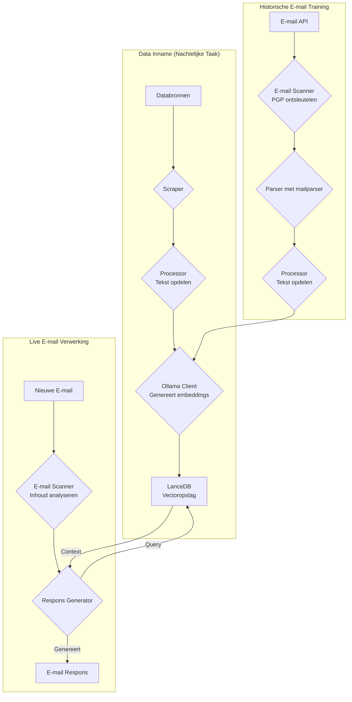
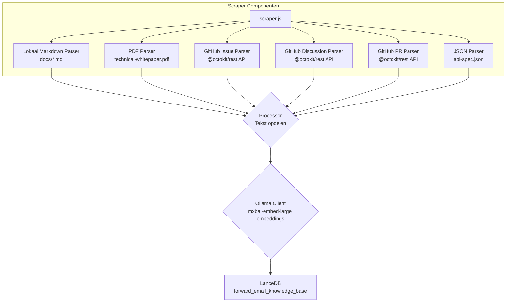
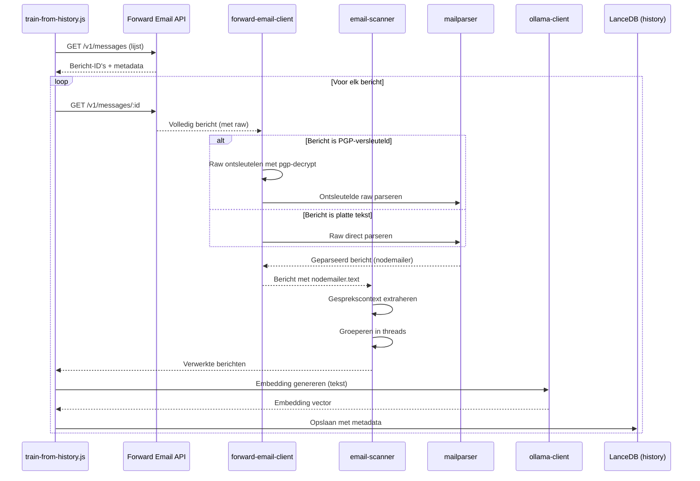

# Het bouwen van een privacy-first AI klantenservice-agent met LanceDB, Ollama en Node.js {#building-a-privacy-first-ai-customer-support-agent-with-lancedb-ollama-and-nodejs}


> \[!NOTE]
> Dit document beschrijft onze reis bij het bouwen van een zelf-gehoste AI support agent. We schreven over soortgelijke uitdagingen in onze [Email Startup Graveyard](https://forwardemail.net/blog/docs/email-startup-graveyard-why-80-percent-email-companies-fail) blogpost. We dachten eerlijk gezegd aan het schrijven van een vervolg genaamd "AI Startup Graveyard", maar misschien moeten we nog een jaar wachten totdat de AI-bubbel mogelijk barst(?). Voor nu is dit onze brain dump van wat werkte, wat niet werkte, en waarom we het op deze manier deden.

Dit is hoe we onze eigen AI klantenservice-agent bouwden. We deden het op de moeilijke manier: zelf-gehost, privacy-first, en volledig onder onze controle. Waarom? Omdat we derde partijen niet vertrouwen met de data van onze klanten. Het is een GDPR- en DPA-vereiste, en het is de juiste keuze.

Dit was geen leuk weekendproject. Het was een maandlange reis door kapotte dependencies, misleidende documentatie, en de algemene chaos van het open-source AI-ecosysteem in 2025. Dit document is een verslag van wat we bouwden, waarom we het bouwden, en de obstakels die we onderweg tegenkwamen.


## Inhoudsopgave {#table-of-contents}

* [Voordelen voor klanten: AI-ondersteunde menselijke support](#customer-benefits-ai-augmented-human-support)
  * [Snellere, nauwkeurigere antwoorden](#faster-more-accurate-responses)
  * [Consistentie zonder burn-out](#consistency-without-burnout)
  * [Wat je krijgt](#what-you-get)
* [Een persoonlijke reflectie: de twee decennia durende inspanning](#a-personal-reflection-the-two-decade-grind)
* [Waarom privacy belangrijk is](#why-privacy-matters)
* [Kostenanalyse: Cloud AI versus zelf-gehost](#cost-analysis-cloud-ai-vs-self-hosted)
  * [Vergelijking van Cloud AI-diensten](#cloud-ai-service-comparison)
  * [Kostenoverzicht: 5GB kennisdatabase](#cost-breakdown-5gb-knowledge-base)
  * [Hardwarekosten zelf-gehost](#self-hosted-hardware-costs)
* [Onze eigen API gebruiken (dogfooding)](#dogfooding-our-own-api)
  * [Waarom dogfooding belangrijk is](#why-dogfooding-matters)
  * [API gebruiksvoorbeelden](#api-usage-examples)
  * [Prestatievoordelen](#performance-benefits)
* [Encryptie-architectuur](#encryption-architecture)
  * [Laag 1: Mailbox-encryptie (chacha20-poly1305)](#layer-1-mailbox-encryption-chacha20-poly1305)
  * [Laag 2: Berichtniveau PGP-encryptie](#layer-2-message-level-pgp-encryption)
  * [Waarom dit belangrijk is voor training](#why-this-matters-for-training)
  * [Opslagbeveiliging](#storage-security)
  * [Lokale opslag is standaardpraktijk](#local-storage-is-standard-practice)
* [De architectuur](#the-architecture)
  * [Hoog-niveau flow](#high-level-flow)
  * [Gedetailleerde scraper flow](#detailed-scraper-flow)
* [Hoe het werkt](#how-it-works)
  * [De kennisdatabase opbouwen](#building-the-knowledge-base)
  * [Training vanuit historische e-mails](#training-from-historical-emails)
  * [Binnenkomende e-mails verwerken](#processing-incoming-emails)
  * [Vector store beheer](#vector-store-management)
* [De vector database begraafplaats](#the-vector-database-graveyard)
* [Systeemvereisten](#system-requirements)
* [Cron job configuratie](#cron-job-configuration)
  * [Omgevingsvariabelen](#environment-variables)
  * [Cron jobs voor meerdere inboxen](#cron-jobs-for-multiple-inboxes)
  * [Uitleg cron schema](#cron-schedule-breakdown)
  * [Dynamische datum berekening](#dynamic-date-calculation)
  * [Initiële setup: URL-lijst extraheren uit sitemap](#initial-setup-extract-url-list-from-sitemap)
  * [Cron jobs handmatig testen](#testing-cron-jobs-manually)
  * [Logs monitoren](#monitoring-logs)
* [Codevoorbeelden](#code-examples)
  * [Scrapen en verwerken](#scraping-and-processing)
  * [Training vanuit historische e-mails](#training-from-historical-emails-1)
  * [Context opvragen](#querying-for-context)
* [De toekomst: Spam scanner R\&D](#the-future-spam-scanner-rd)
* [Probleemoplossing](#troubleshooting)
  * [Vector dimensie mismatch fout](#vector-dimension-mismatch-error)
  * [Lege kennisdatabase context](#empty-knowledge-base-context)
  * [PGP decryptie mislukkingen](#pgp-decryption-failures)
* [Gebruikstips](#usage-tips)
  * [Inbox zero bereiken](#achieving-inbox-zero)
  * [Gebruik van het skip-ai label](#using-the-skip-ai-label)
  * [E-mail threading en reply-all](#email-threading-and-reply-all)
  * [Monitoring en onderhoud](#monitoring-and-maintenance)
* [Testen](#testing)
  * [Tests uitvoeren](#running-tests)
  * [Testdekking](#test-coverage)
  * [Testomgeving](#test-environment)
* [Belangrijkste conclusies](#key-takeaways)
## Klantvoordelen: AI-ondersteunde Menselijke Support {#customer-benefits-ai-augmented-human-support}

Ons AI-systeem vervangt ons supportteam niet—het maakt ze beter. Dit betekent het volgende voor jou:

### Snellere, Nauwkeurigere Reacties {#faster-more-accurate-responses}

**Mens-in-de-Lus**: Elke door AI gegenereerde concepttekst wordt beoordeeld, bewerkt en samengesteld door ons menselijke supportteam voordat deze naar jou wordt verzonden. De AI verzorgt het initiële onderzoek en het opstellen, waardoor ons team zich kan richten op kwaliteitscontrole en personalisatie.

**Getraind op Menselijke Expertise**: De AI leert van:

* Onze handgeschreven kennisbank en documentatie
* Door mensen geschreven blogposts en tutorials
* Onze uitgebreide FAQ (geschreven door mensen)
* Eerdere klantgesprekken (allemaal afgehandeld door echte mensen)

Je krijgt antwoorden die zijn geïnformeerd door jarenlange menselijke expertise, alleen dan sneller geleverd.

### Consistentie Zonder Burn-out {#consistency-without-burnout}

Ons kleine team verwerkt dagelijks honderden supportverzoeken, elk met verschillende technische kennis en mentale contextwisselingen:

* Vragen over facturatie vereisen kennis van financiële systemen
* DNS-problemen vereisen netwerkexpertise
* API-integratie vereist programmeerkennis
* Beveiligingsrapporten vereisen kwetsbaarheidsbeoordeling

Zonder AI-ondersteuning leidt deze constante contextwisseling tot:

* Langzamere reactietijden
* Menselijke fouten door vermoeidheid
* Inconsistente antwoordkwaliteit
* Team burn-out

**Met AI-ondersteuning**:

* Reageert ons team sneller (AI maakt concepten in seconden)
* Maakt minder fouten (AI vangt veelvoorkomende fouten op)
* Handhaaft consistente kwaliteit (AI raadpleegt elke keer dezelfde kennisbank)
* Blijft fris en gefocust (minder tijd aan onderzoek, meer tijd om te helpen)

### Wat Je Krijgt {#what-you-get}

✅ **Snelheid**: AI stelt antwoorden binnen seconden op, mensen beoordelen en verzenden binnen enkele minuten

✅ **Nauwkeurigheid**: Antwoorden gebaseerd op onze daadwerkelijke documentatie en eerdere oplossingen

✅ **Consistentie**: Steeds dezelfde hoogwaardige antwoorden, of het nu 9 uur ’s ochtends of 9 uur ’s avonds is

✅ **Menselijke toets**: Elk antwoord wordt beoordeeld en gepersonaliseerd door ons team

✅ **Geen hallucinaties**: AI gebruikt alleen onze geverifieerde kennisbank, niet generieke internetdata

> \[!NOTE]
> **Je spreekt altijd met mensen**. De AI is een onderzoeksassistent die ons team helpt het juiste antwoord sneller te vinden. Zie het als een bibliothecaris die direct het relevante boek vindt—maar een mens leest het nog steeds en legt het aan je uit.


## Een Persoonlijke Reflectie: De Twee Decennia Durende Inspanning {#a-personal-reflection-the-two-decade-grind}

Voordat we de technische details induiken, een persoonlijke noot. Ik ben hier al bijna twee decennia mee bezig. De eindeloze uren achter het toetsenbord, de onvermoeibare zoektocht naar een oplossing, de diepe, gefocuste inspanning – dit is de realiteit van het bouwen van iets betekenisvols. Het is een realiteit die vaak wordt weggelaten in de hype rond nieuwe technologieën.

De recente explosie van AI is bijzonder frustrerend geweest. Ons wordt een droom verkocht van automatisering, van AI-assistenten die onze code schrijven en onze problemen oplossen. De realiteit? De output is vaak prullenbakcode die meer tijd kost om te repareren dan het zou hebben gekost om vanaf nul te schrijven. De belofte om ons leven makkelijker te maken is een valse. Het is een afleiding van het harde, noodzakelijke werk van bouwen.

En dan is er de catch-22 van bijdragen aan open source. Je bent al overbelast, uitgeput van de inspanning. Je gebruikt AI om je te helpen een gedetailleerd, goed gestructureerd bugrapport te schrijven, in de hoop het voor beheerders makkelijker te maken het probleem te begrijpen en op te lossen. En wat gebeurt er? Je wordt berispt. Je bijdrage wordt afgedaan als "off-topic" of weinig inspanning, zoals we zagen in een recent [Node.js GitHub-issue](https://github.com/nodejs/node/issues/60719#issuecomment-3534304321). Het is een klap in het gezicht van senior ontwikkelaars die gewoon willen helpen.

Dit is de realiteit van het ecosysteem waarin we werken. Het gaat niet alleen om kapotte tools; het gaat om een cultuur die vaak faalt om de tijd en [inspanning van haar bijdragers](https://forwardemail.net/blog/docs/how-npm-packages-billion-downloads-shaped-javascript-ecosystem) te respecteren. Deze post is een kroniek van die realiteit. Het is een verhaal over de tools, ja, maar ook over de menselijke kosten van bouwen in een kapot ecosysteem dat, ondanks alle beloften, fundamenteel kapot is.
## Waarom Privacy Belangrijk Is {#why-privacy-matters}

Ons [technisch whitepaper](https://forwardemail.net/technical-whitepaper.pdf) behandelt onze privacyfilosofie uitgebreid. De korte versie: we sturen nooit klantgegevens naar derden. Nooit. Dat betekent geen OpenAI, geen Anthropic, geen cloud-gehoste vector databases. Alles draait lokaal op onze infrastructuur. Dit is niet onderhandelbaar voor GDPR-naleving en onze DPA-verplichtingen.


## Kostenanalyse: Cloud AI vs Zelf-Hosten {#cost-analysis-cloud-ai-vs-self-hosted}

Voordat we ingaan op de technische implementatie, laten we het hebben over waarom zelf-hosten belangrijk is vanuit kostenperspectief. De prijsmodellen van cloud AI-diensten maken ze onbetaalbaar voor gebruik met hoog volume, zoals klantenservice.

### Vergelijking Cloud AI Diensten {#cloud-ai-service-comparison}

| Dienst          | Provider            | Embedding Kosten                                                | LLM Kosten (Input)                                                        | LLM Kosten (Output)     | Privacybeleid                                      | GDPR/DPA        | Hosting           | Gegevensdeling   |
| --------------- | ------------------- | ---------------------------------------------------------------- | -------------------------------------------------------------------------- | ---------------------- | --------------------------------------------------- | --------------- | ----------------- | ----------------- |
| **OpenAI**      | OpenAI (VS)         | [$0.02-0.13/1M tokens](https://openai.com/api/pricing/)          | $0.15-20/1M tokens                                                         | $0.60-80/1M tokens     | [Link](https://openai.com/policies/privacy-policy/) | Beperkte DPA    | Azure (VS)        | Ja (training)     |
| **Claude**      | Anthropic (VS)      | N.v.t.                                                           | [$3-20/1M tokens](https://docs.claude.com/en/docs/about-claude/pricing)    | $15-80/1M tokens       | [Link](https://www.anthropic.com/legal/privacy)     | Beperkte DPA    | AWS/GCP (VS)      | Nee (geclaimd)    |
| **Gemini**      | Google (VS)         | [$0.15/1M tokens](https://ai.google.dev/gemini-api/docs/pricing) | $0.30-1.00/1M tokens                                                       | $2.50/1M tokens        | [Link](https://policies.google.com/privacy)         | Beperkte DPA    | GCP (VS)          | Ja (verbetering)  |
| **DeepSeek**    | DeepSeek (China)    | N.v.t.                                                           | [$0.028-0.28/1M tokens](https://api-docs.deepseek.com/quick_start/pricing) | $0.42/1M tokens        | [Link](https://www.deepseek.com/en)                 | Onbekend        | China             | Onbekend          |
| **Mistral**     | Mistral AI (Frankrijk) | [$0.10/1M tokens](https://mistral.ai/pricing)                  | $0.40/1M tokens                                                            | $2.00/1M tokens        | [Link](https://mistral.ai/terms/)                   | EU GDPR         | EU                | Onbekend          |
| **Zelf-Hosten** | Jij                 | $0 (bestaande hardware)                                          | $0 (bestaande hardware)                                                    | $0 (bestaande hardware) | Jouw beleid                                        | Volledige naleving | MacBook M5 + cron | Nooit             |

> \[!WARNING]
> **Zorgen over data-soevereiniteit**: Amerikaanse providers (OpenAI, Claude, Gemini) vallen onder de CLOUD Act, waardoor de Amerikaanse overheid toegang heeft tot data. DeepSeek (China) opereert onder Chinese datalaws. Hoewel Mistral (Frankrijk) EU-hosting en GDPR-naleving biedt, blijft zelf-hosten de enige optie voor volledige data-soevereiniteit en controle.

### Kostenoverzicht: 5GB Kennisbank {#cost-breakdown-5gb-knowledge-base}

Laten we de kosten berekenen voor het verwerken van een kennisbank van 5GB (typisch voor een middelgroot bedrijf met documenten, e-mails en supportgeschiedenis).

**Aannames:**

* 5GB tekst ≈ 1,25 miljard tokens (uitgaande van ~4 tekens/token)
* Initiële embedding generatie
* Maandelijkse hertraining (volledige re-embedding)
* 10.000 supportvragen per maand
* Gemiddelde vraag: 500 tokens input, 300 tokens output
**Gedetailleerde Kostenopbouw:**

| Component                              | OpenAI           | Claude          | Gemini               | Zelf-gehost       |
| -------------------------------------- | ---------------- | --------------- | -------------------- | ------------------ |
| **Initiële Embedding** (1,25B tokens)  | $25,000          | N/B             | $187,500             | $0                 |
| **Maandelijkse Queries** (10K × 800 tokens) | $1,200-16,000    | $2,400-16,000   | $2,400-3,200         | $0                 |
| **Maandelijkse Retraining** (1,25B tokens)  | $25,000          | N/B             | $187,500             | $0                 |
| **Totaal Eerste Jaar**                 | $325,200-217,000 | $28,800-192,000 | $2,278,800-2,226,000 | ~ $60 (elektriciteit) |
| **Privacy Compliance**                 | ❌ Beperkt        | ❌ Beperkt       | ❌ Beperkt            | ✅ Volledig         |
| **Data Soevereiniteit**                | ❌ Nee           | ❌ Nee          | ❌ Nee                | ✅ Ja               |

> \[!CAUTION]
> **De embeddingkosten van Gemini zijn catastrofaal** met $0,15/1M tokens. Een enkele 5GB kennisbank embedding zou $187,500 kosten. Dit is 37x duurder dan OpenAI en maakt het volledig onbruikbaar voor productie.

### Zelf-gehoste Hardware Kosten {#self-hosted-hardware-costs}

Onze setup draait op bestaande hardware die we al bezitten:

* **Hardware**: MacBook M5 (al in bezit voor ontwikkeling)
* **Extra kosten**: $0 (gebruikt bestaande hardware)
* **Elektriciteit**: \~$5/maand (geschat)
* **Totaal eerste jaar**: \~$60
* **Doorlopend**: $60/jaar

**ROI**: Zelf-hosting heeft vrijwel geen marginale kosten omdat we bestaande ontwikkelhardware gebruiken. Het systeem draait via cron jobs tijdens daluren.


## Onze Eigen API Gebruiken {#dogfooding-our-own-api}

Een van de belangrijkste architecturale beslissingen die we hebben genomen, was om alle AI-taken direct de [Forward Email API](https://forwardemail.net/email-api) te laten gebruiken. Dit is niet alleen goede praktijk—het is een drijfveer voor prestatieoptimalisatie.

### Waarom Eigen Gebruik Belangrijk Is {#why-dogfooding-matters}

Wanneer onze AI-taken dezelfde API-eindpunten gebruiken als onze klanten:

1. **Prestatieknelpunten treffen ons eerst** - Wij voelen de pijn voordat klanten dat doen
2. **Optimalisatie profiteert iedereen** - Verbeteringen voor onze taken verbeteren automatisch de klantervaring
3. **Testen in de praktijk** - Onze taken verwerken duizenden e-mails, wat continue load testing biedt
4. **Code hergebruik** - Zelfde authenticatie, rate limiting, foutafhandeling en caching logica

### API Gebruik Voorbeelden {#api-usage-examples}

**Berichten Lijst Opvragen (train-from-history.js):**

```javascript
// Gebruikt GET /v1/messages?folder=INBOX met BasicAuth
// Sluit eml, raw, nodemailer uit om responsegrootte te verkleinen (alleen IDs nodig)
const response = await axios.get(
  `${this.apiBase}/v1/messages`,
  {
    params: {
      folder: 'INBOX',
      limit: 100,
      eml: false,
      raw: false,
      nodemailer: false
    },
    auth: {
      username: process.env.FORWARD_EMAIL_ALIAS_USERNAME,
      password: process.env.FORWARD_EMAIL_ALIAS_PASSWORD
    }
  }
);

const messages = response.data;
// Retourneert: [{ id, subject, date, ... }, ...]
// Volledige berichtinhoud wordt later opgehaald via GET /v1/messages/:id
```

**Volledige Berichten Ophalen (forward-email-client.js):**

```javascript
// Gebruikt GET /v1/messages/:id om volledig bericht met raw content te krijgen
const response = await axios.get(
  `${this.apiBase}/v1/messages/${messageId}`,
  {
    auth: {
      username: this.aliasUsername,
      password: this.aliasPassword
    }
  }
);

const message = response.data;
// Retourneert: { id, subject, raw, eml, nodemailer: { ... }, ... }
```

**Concept Antwoorden Maken (process-inbox.js):**

```javascript
// Gebruikt POST /v1/messages om conceptantwoorden te maken
const response = await axios.post(
  `${this.apiBase}/v1/messages`,
  {
    folder: 'Drafts',
    subject: `Re: ${originalSubject}`,
    to: senderEmail,
    text: generatedResponse,
    inReplyTo: originalMessageId
  },
  {
    auth: {
      username: process.env.FORWARD_EMAIL_ALIAS_USERNAME,
      password: process.env.FORWARD_EMAIL_ALIAS_PASSWORD
    }
  }
);
```
### Prestatievoordelen {#performance-benefits}

Omdat onze AI-taken op dezelfde API-infrastructuur draaien:

* **Caching-optimalisaties** profiteren zowel taken als klanten
* **Rate limiting** wordt getest onder echte belasting
* **Foutafhandeling** is grondig getest
* **API-responstijden** worden continu gemonitord
* **Databasequery's** zijn geoptimaliseerd voor beide gebruiksscenario's
* **Bandbreedte-optimalisatie** - Het uitsluiten van `eml`, `raw`, `nodemailer` bij het opvragen verkleint de responsgrootte met \~90%

Wanneer `train-from-history.js` 1.000 e-mails verwerkt, doet het meer dan 1.000 API-aanroepen. Elke inefficiëntie in de API wordt direct duidelijk. Dit dwingt ons om IMAP-toegang, databasequery's en response-serialisatie te optimaliseren—verbeteringen die direct onze klanten ten goede komen.

**Voorbeeldoptimalisatie**: 100 berichten met volledige inhoud opvragen = \~10MB respons. Opvragen met `eml: false, raw: false, nodemailer: false` = \~100KB respons (100x kleiner).


## Encryptie Architectuur {#encryption-architecture}

Onze e-mailopslag gebruikt meerdere lagen van encryptie, die de AI-taken in realtime moeten ontsleutelen voor training.

### Laag 1: Mailbox Encryptie (chacha20-poly1305) {#layer-1-mailbox-encryption-chacha20-poly1305}

Alle IMAP-mailboxen worden opgeslagen als SQLite-databases die versleuteld zijn met **chacha20-poly1305**, een quantum-veilige encryptie-algoritme. Dit wordt uitgelegd in onze [quantum-veilige versleutelde e-mailservice blogpost](https://forwardemail.net/blog/docs/best-quantum-safe-encrypted-email-service).

**Belangrijke eigenschappen:**

* **Algoritme**: ChaCha20-Poly1305 (AEAD-cijfer)
* **Quantum-veilig**: Bestand tegen aanvallen met quantumcomputers
* **Opslag**: SQLite-databasebestanden op schijf
* **Toegang**: Ontsleuteld in het geheugen bij toegang via IMAP/API

### Laag 2: Berichtniveau PGP Encryptie {#layer-2-message-level-pgp-encryption}

Veel support-e-mails zijn daarnaast versleuteld met PGP (OpenPGP-standaard). De AI-taken moeten deze ontsleutelen om inhoud voor training te extraheren.

**Ontsleutelingsproces:**

```javascript
// 1. API retourneert bericht met versleutelde raw-inhoud
const message = await forwardEmailClient.getMessage(id);

// 2. Controleren of raw-inhoud PGP-versleuteld is
if (isMessageEncrypted(message.raw)) {
  // 3. Ontsleutelen met onze privésleutel
  const decryptedRaw = await pgpDecrypt(message.raw);

  // 4. Parseren van het ontsleutelde MIME-bericht
  const parsed = await simpleParser(decryptedRaw);

  // 5. Nodemailer vullen met ontsleutelde inhoud
  message.nodemailer = {
    text: parsed.text,
    html: parsed.html,
    from: parsed.from,
    to: parsed.to,
    subject: parsed.subject,
    date: parsed.date
  };
}
```

**PGP-configuratie:**

```bash
# Privésleutel voor ontsleuteling (pad naar ASCII-armored sleutelbestand)
GPG_SECURITY_KEY="/path/to/private-key.asc"

# Wachtwoord voor privésleutel (indien versleuteld)
GPG_SECURITY_PASSPHRASE="your-passphrase"
```

De `pgp-decrypt.js` helper:

1. Leest de privésleutel één keer van schijf (in geheugen gecached)
2. Ontsleutelt de sleutel met de passphrase
3. Gebruikt de ontsleutelde sleutel voor alle berichtontsleutelingen
4. Ondersteunt recursieve ontsleuteling voor geneste versleutelde berichten

### Waarom Dit Belangrijk Is Voor Training {#why-this-matters-for-training}

Zonder juiste ontsleuteling zou de AI trainen op versleutelde onzin:

```
-----BEGIN PGP MESSAGE-----
Version: OpenPGP.js v4.10.10

wcBMA8Z3lHJnFnNUAQgAqK7F8...
-----END PGP MESSAGE-----
```

Met ontsleuteling traint de AI op daadwerkelijke inhoud:

```
Subject: Re: Bug Report

Hi John,

Thanks for reporting this issue. I've confirmed the bug
and created a fix in PR #1234...
```

### Opslagbeveiliging {#storage-security}

De ontsleuteling gebeurt in het geheugen tijdens de uitvoering van de taak, en de ontsleutelde inhoud wordt omgezet in embeddings die vervolgens worden opgeslagen in de LanceDB vector database op schijf.

**Waar de data zich bevindt:**

* **Vector database**: Opgeslagen op versleutelde MacBook M5 werkstations
* **Fysieke beveiliging**: Werkstations blijven te allen tijde bij ons (niet in datacenters)
* **Schijfversleuteling**: Volledige schijfversleuteling op alle werkstations
* **Netwerkbeveiliging**: Afgeschermd en geïsoleerd van openbare netwerken

**Toekomstige datacenter-implementatie:**
Als we ooit naar datacenterhosting gaan, zullen de servers beschikken over:

* LUKS volledige schijfversleuteling
* USB-toegang uitgeschakeld
* Fysieke beveiligingsmaatregelen
* Netwerkisolatie
Voor volledige details over onze beveiligingspraktijken, zie onze [Beveiligingspagina](https://forwardemail.net/en/security).

> \[!NOTE]
> De vectordatabase bevat embeddings (wiskundige representaties), niet de originele platte tekst. Embeddings kunnen echter mogelijk worden terugontleed, daarom bewaren we ze op versleutelde, fysiek beveiligde werkstations.

### Lokale opslag is standaardpraktijk {#local-storage-is-standard-practice}

Het opslaan van embeddings op de werkstations van ons team verschilt niet van hoe we al met e-mail omgaan:

* **Thunderbird**: Downloadt en slaat volledige e-mailinhoud lokaal op in mbox/maildir-bestanden
* **Webmailclients**: Cachen e-mailgegevens in browseropslag en lokale databases
* **IMAP-clients**: Behouden lokale kopieën van berichten voor offline toegang
* **Ons AI-systeem**: Slaat wiskundige embeddings (geen platte tekst) op in LanceDB

Het belangrijkste verschil: embeddings zijn **veiliger** dan platte tekst e-mail omdat ze:

1. Wiskundige representaties zijn, geen leesbare tekst
2. Moeilijker terug te ontleden zijn dan platte tekst
3. Nog steeds onder dezelfde fysieke beveiliging vallen als onze e-mailclients

Als het acceptabel is voor ons team om Thunderbird of webmail op versleutelde werkstations te gebruiken, is het net zo acceptabel (en waarschijnlijk veiliger) om embeddings op dezelfde manier op te slaan.


## De architectuur {#the-architecture}

Hier is de basisstroom. Het lijkt eenvoudig. Dat was het niet.

> \[!NOTE]
> Alle taken gebruiken direct de Forward Email API, zodat prestatieoptimalisaties zowel ons AI-systeem als onze klanten ten goede komen.

### Hoog-niveau stroom {#high-level-flow}



### Gedetailleerde scraper-stroom {#detailed-scraper-flow}

De `scraper.js` is het hart van de data-inname. Het is een verzameling parsers voor verschillende dataformaten.




## Hoe het werkt {#how-it-works}

Het proces is opgesplitst in drie hoofdonderdelen: het opbouwen van de kennisbasis, trainen met historische e-mails en het verwerken van nieuwe e-mails.

### Het opbouwen van de kennisbasis {#building-the-knowledge-base}

**`update-knowledge-base.js`**: Dit is de hoofdtaak. Deze draait ’s nachts, wist de oude vectoropslag en bouwt deze helemaal opnieuw op. Het gebruikt `scraper.js` om inhoud van alle bronnen op te halen, `processor.js` om het op te delen, en `ollama-client.js` om embeddings te genereren. Ten slotte slaat `vector-store.js` alles op in LanceDB.

**Databronnen:**

* Lokale Markdown-bestanden (`docs/*.md`)
* Technisch whitepaper PDF (`assets/technical-whitepaper.pdf`)
* API-specificatie JSON (`assets/api-spec.json`)
* GitHub issues (via Octokit)
* GitHub discussies (via Octokit)
* GitHub pull requests (via Octokit)
* Sitemap URL-lijst (`$LANCEDB_PATH/valid-urls.json`)

### Trainen met historische e-mails {#training-from-historical-emails}

**`train-from-history.js`**: Deze taak scant historische e-mails uit alle mappen, ontsleutelt PGP-versleutelde berichten en voegt ze toe aan een aparte vectoropslag (`customer_support_history`). Dit biedt context uit eerdere supportinteracties.
**E-mailverwerkingsstroom:**



**Belangrijkste kenmerken:**

* **PGP-ontsleuteling**: Gebruikt `pgp-decrypt.js` helper met `GPG_SECURITY_KEY` omgevingsvariabele
* **Threadgroepering**: Groepeert gerelateerde e-mails in gespreksthreads
* **Metadata behoud**: Slaat map, onderwerp, datum, encryptiestatus op
* **Antwoordcontext**: Verbindt berichten met hun antwoorden voor betere context

**Configuratie:**

```bash
# Omgevingsvariabelen voor train-from-history
HISTORY_SCAN_LIMIT=1000              # Maximaal te verwerken berichten
HISTORY_SCAN_SINCE="2024-01-01"      # Alleen berichten na deze datum verwerken
HISTORY_DECRYPT_PGP=true             # Poging tot PGP-ontsleuteling
GPG_SECURITY_KEY="/path/to/key.asc"  # Pad naar PGP privésleutel
GPG_SECURITY_PASSPHRASE="passphrase" # Sleutelwachtwoord (optioneel)
```

**Wat wordt opgeslagen:**

```javascript
{
  type: 'historical_email',
  folder: 'INBOX',
  subject: 'Re: Bug Report',
  date: '2025-01-15T10:30:00Z',
  messageId: '67e2f288893921...',
  threadId: 'Bug Report',
  hasReply: true,
  encrypted: true,
  decrypted: true,
  replySubject: 'Bug Report',
  replyText: 'First 500 chars of reply...',
  chunkSize: 1000,
  chunkOverlap: 200,
  chunkIndex: 0
}
```

> \[!TIP]
> Voer `train-from-history` uit na de initiële setup om de historische context te vullen. Dit verbetert de responskwaliteit aanzienlijk door te leren van eerdere supportinteracties.

### Binnenkomende e-mails verwerken {#processing-incoming-emails}

**`process-inbox.js`**: Deze taak draait op e-mails in onze `support@forwardemail.net`, `abuse@forwardemail.net` en `security@forwardemail.net` mailboxen (specifiek de `INBOX` IMAP-map). Het maakt gebruik van onze API op <https://forwardemail.net/email-api> (bijv. `GET /v1/messages?folder=INBOX` met BasicAuth toegang via onze IMAP-gegevens voor elke mailbox). Het analyseert de e-mailinhoud, raadpleegt zowel de kennisbank (`forward_email_knowledge_base`) als de historische e-mail vector store (`customer_support_history`), en geeft vervolgens de gecombineerde context door aan `response-generator.js`. De generator gebruikt `mxbai-embed-large` via Ollama om een antwoord te formuleren.

**Geautomatiseerde workflowfuncties:**

1. **Inbox Zero Automatisering**: Na het succesvol aanmaken van een concept wordt het originele bericht automatisch verplaatst naar de Archief-map. Dit houdt je inbox schoon en helpt inbox zero te bereiken zonder handmatige tussenkomst.

2. **AI-verwerking overslaan**: Voeg eenvoudig een `skip-ai` label toe (hoofdletterongevoelig) aan een bericht om AI-verwerking te voorkomen. Het bericht blijft onaangeroerd in je inbox, zodat je het handmatig kunt afhandelen. Dit is handig voor gevoelige berichten of complexe gevallen die menselijke beoordeling vereisen.

3. **Correcte e-mailthreading**: Alle conceptantwoorden bevatten het originele bericht geciteerd eronder (met de standaard ` >  ` prefix), volgens de conventies voor e-mailantwoorden met het formaat "Op \[datum], schreef \[afzender]:". Dit zorgt voor correcte gesprekscontext en threading in e-mailclients.

4. **Reply-All gedrag**: Het systeem verwerkt automatisch Reply-To headers en CC-ontvangers:
   * Als er een Reply-To header is, wordt dit het Aan-adres en wordt de originele Van toegevoegd aan CC
   * Alle originele Aan- en CC-ontvangers worden opgenomen in de reply CC (behalve je eigen adres)
   * Volgt standaard e-mail reply-all conventies voor groepsgesprekken
**Bronrangschikking**: Het systeem gebruikt **gewogen rangschikking** om bronnen te prioriteren:

* FAQ: 100% (hoogste prioriteit)
* Technisch whitepaper: 95%
* API-specificatie: 90%
* Officiële documentatie: 85%
* GitHub-issues: 70%
* Historische e-mails: 50%

### Vector Store Management {#vector-store-management}

De `VectorStore` klasse in `helpers/customer-support-ai/vector-store.js` is onze interface naar LanceDB.

**Documenten toevoegen:**

```javascript
// vector-store.js
async addDocument(text, metadata) {
  const embedding = await this.ollama.generateEmbedding(text);
  await this.table.add([{
    vector: embedding,
    text,
    ...metadata
  }]);
}
```

**De opslag wissen:**

```javascript
// Optie 1: Gebruik de clear() methode
await vectorStore.clear();

// Optie 2: Verwijder de lokale database map
await fs.rm(process.env.LANCEDB_PATH, { recursive: true, force: true });
```

De omgevingsvariabele `LANCEDB_PATH` verwijst naar de lokale embedded database map. LanceDB is serverless en embedded, dus er is geen apart proces om te beheren.


## De Vector Database Begraafplaats {#the-vector-database-graveyard}

Dit was de eerste grote hindernis. We hebben meerdere vector databases geprobeerd voordat we voor LanceDB kozen. Dit ging er mis bij elk van hen.

| Database     | GitHub                                                      | Wat er misging                                                                                                                                                                                                      | Specifieke problemen                                                                                                                                                                                                                                                                                                                                                      | Beveiligingszorgen                                                                                                                                                                                               |
| ------------ | ----------------------------------------------------------- | ------------------------------------------------------------------------------------------------------------------------------------------------------------------------------------------------------------------ | ------------------------------------------------------------------------------------------------------------------------------------------------------------------------------------------------------------------------------------------------------------------------------------------------------------------------------------------------------------------------- | ---------------------------------------------------------------------------------------------------------------------------------------------------------------------------------------------------------------- |
| **ChromaDB** | [chroma-core/chroma](https://github.com/chroma-core/chroma) | `pip3 install chromadb` geeft je een versie uit de prehistorie met `PydanticImportError`. De enige manier om een werkende versie te krijgen is compileren vanuit de bron. Niet ontwikkelaarsvriendelijk.             | Chaos met Python dependencies. Meerdere gebruikers melden kapotte pip installs ([#774](https://github.com/chroma-core/chroma/issues/774), [#163](https://github.com/chroma-core/chroma/issues/163)). De docs zeggen "gebruik gewoon Docker" wat geen antwoord is voor lokale ontwikkeling. Crasht op Windows met >99 records ([#3058](https://github.com/chroma-core/chroma/issues/3058)). | **CVE-2024-45848**: Arbitrary code execution via ChromaDB integratie in MindsDB. Kritieke OS kwetsbaarheden in Docker image ([#3170](https://github.com/chroma-core/chroma/issues/3170)).                      |
| **Qdrant**   | [qdrant/qdrant](https://github.com/qdrant/qdrant)           | De Homebrew tap (`qdrant/qdrant/qdrant`) die in hun oude docs werd genoemd is verdwenen. Weg. Geen uitleg. De officiële docs zeggen nu alleen "gebruik Docker."                                                       | Ontbrekende Homebrew tap. Geen native macOS binary. Alleen Docker is een barrière voor snel lokaal testen.                                                                                                                                                                                                                                                               | **CVE-2024-2221**: Arbitrary file upload kwetsbaarheid die remote code execution mogelijk maakt (opgelost in v1.9.0). Zwakke beveiligingsscore van [IronCore Labs](https://ironcorelabs.com/vectordbs/qdrant-security/). |
| **Weaviate** | [weaviate/weaviate](https://github.com/weaviate/weaviate)   | De Homebrew versie had een kritieke clustering bug (`leader not found`). De gedocumenteerde flags om dit te fixen (`RAFT_JOIN`, `CLUSTER_HOSTNAME`) werkten niet. Fundamenteel kapot voor single-node setups.         | Clustering bugs zelfs in single-node modus. Over-engineered voor eenvoudige use cases.                                                                                                                                                                                                                                                                                   | Geen grote CVE's gevonden, maar complexiteit vergroot het aanvalsoppervlak.                                                                                                                                      |
| **LanceDB**  | [lancedb/lancedb](https://github.com/lancedb/lancedb)       | Deze werkte. Het is embedded en serverless. Geen apart proces. De enige irritatie is de verwarrende pakketnaamgeving (`vectordb` is verouderd, gebruik `@lancedb/lancedb`) en verspreide documentatie. We kunnen daarmee leven. | Verwarring over pakketnaamgeving (`vectordb` vs `@lancedb/lancedb`), maar verder solide. Embedded architectuur elimineert hele klassen beveiligingsproblemen.                                                                                                                                                                                                           | Geen bekende CVE's. Embedded ontwerp betekent geen netwerk-aanvalsoppervlak.                                                                                                                                     |
> \[!WARNING]
> **ChromaDB heeft kritieke beveiligingslekken.** [CVE-2024-45848](https://nvd.nist.gov/vuln/detail/CVE-2024-45848) maakt willekeurige code-uitvoering mogelijk. De pip-installatie is fundamenteel kapot door Pydantic afhankelijkheidsproblemen. Vermijd gebruik in productie.

> \[!WARNING]
> **Qdrant had een RCE-kwetsbaarheid bij bestandsupload** ([CVE-2024-2221](https://qdrant.tech/blog/cve-2024-2221-response/)) die pas in v1.9.0 is opgelost. Als je Qdrant moet gebruiken, zorg dan dat je de nieuwste versie hebt.

> \[!CAUTION]
> Het open-source vector database ecosysteem is ruw. Vertrouw de documentatie niet. Ga ervan uit dat alles kapot is totdat het tegendeel bewezen is. Test lokaal voordat je je aan een stack commit.


## Systeemvereisten {#system-requirements}

* **Node.js:** v18.0.0+ ([GitHub](https://github.com/nodejs/node))
* **Ollama:** Laatste versie ([GitHub](https://github.com/ollama/ollama))
* **Model:** `mxbai-embed-large` via Ollama
* **Vector Database:** LanceDB ([GitHub](https://github.com/lancedb/lancedb))
* **GitHub Toegang:** `@octokit/rest` voor het scrapen van issues ([GitHub](https://github.com/octokit/rest.js))
* **SQLite:** Voor primaire database (via `mongoose-to-sqlite`)


## Cron Job Configuratie {#cron-job-configuration}

Alle AI-taken draaien via cron op een MacBook M5. Zo stel je de cron jobs in om middernacht te draaien voor meerdere inboxen.

### Omgevingsvariabelen {#environment-variables}

De taken vereisen deze omgevingsvariabelen. De meeste kunnen worden ingesteld in een `.env` bestand (geladen via `@ladjs/env`), maar `HISTORY_SCAN_SINCE` moet dynamisch worden berekend in de crontab.

**In `.env` bestand:**

```bash
# Forward Email API-gegevens (verschilt per inbox)
FORWARD_EMAIL_ALIAS_USERNAME=support@forwardemail.net
FORWARD_EMAIL_ALIAS_PASSWORD=your-imap-password

# PGP decryptie (gedeeld over alle inboxen)
GPG_SECURITY_KEY=/path/to/private-key.asc
GPG_SECURITY_PASSPHRASE=your-passphrase

# Historische scan configuratie
HISTORY_SCAN_LIMIT=1000

# LanceDB pad
LANCEDB_PATH=/path/to/lancedb
```

**In crontab (dynamisch berekend):**

```bash
# HISTORY_SCAN_SINCE moet inline in crontab worden gezet met shell datum berekening
# Kan niet in .env bestand omdat @ladjs/env geen shell commando's evalueert
HISTORY_SCAN_SINCE="$(date -v-1d +%Y-%m-%d)"  # macOS
HISTORY_SCAN_SINCE="$(date -d 'yesterday' +%Y-%m-%d)"  # Linux
```

### Cron Jobs voor Meerdere Inboxen {#cron-jobs-for-multiple-inboxes}

Bewerk je crontab met `crontab -e` en voeg toe:

```bash
# Update kennisbank (draait één keer, gedeeld over alle inboxen)
0 0 * * * cd /path/to/forwardemail.net && LANCEDB_PATH="/path/to/lancedb" GPG_SECURITY_KEY="/path/to/key.asc" GPG_SECURITY_PASSPHRASE="pass" node jobs/customer-support-ai/update-knowledge-base.js >> /var/log/update-knowledge-base.log 2>&1

# Train vanuit geschiedenis - support@forwardemail.net
0 0 * * * cd /path/to/forwardemail.net && FORWARD_EMAIL_ALIAS_USERNAME="support@forwardemail.net" FORWARD_EMAIL_ALIAS_PASSWORD="support-password" HISTORY_SCAN_SINCE="$(date -v-1d +%Y-%m-%d)" HISTORY_SCAN_LIMIT=1000 GPG_SECURITY_KEY="/path/to/key.asc" GPG_SECURITY_PASSPHRASE="pass" LANCEDB_PATH="/path/to/lancedb" node jobs/customer-support-ai/train-from-history.js >> /var/log/train-support.log 2>&1

# Train vanuit geschiedenis - abuse@forwardemail.net
0 0 * * * cd /path/to/forwardemail.net && FORWARD_EMAIL_ALIAS_USERNAME="abuse@forwardemail.net" FORWARD_EMAIL_ALIAS_PASSWORD="abuse-password" HISTORY_SCAN_SINCE="$(date -v-1d +%Y-%m-%d)" HISTORY_SCAN_LIMIT=1000 GPG_SECURITY_KEY="/path/to/key.asc" GPG_SECURITY_PASSPHRASE="pass" LANCEDB_PATH="/path/to/lancedb" node jobs/customer-support-ai/train-from-history.js >> /var/log/train-abuse.log 2>&1

# Train vanuit geschiedenis - security@forwardemail.net
0 0 * * * cd /path/to/forwardemail.net && FORWARD_EMAIL_ALIAS_USERNAME="security@forwardemail.net" FORWARD_EMAIL_ALIAS_PASSWORD="security-password" HISTORY_SCAN_SINCE="$(date -v-1d +%Y-%m-%d)" HISTORY_SCAN_LIMIT=1000 GPG_SECURITY_KEY="/path/to/key.asc" GPG_SECURITY_PASSPHRASE="pass" LANCEDB_PATH="/path/to/lancedb" node jobs/customer-support-ai/train-from-history.js >> /var/log/train-security.log 2>&1

# Verwerk inbox - support@forwardemail.net
*/5 * * * * cd /path/to/forwardemail.net && FORWARD_EMAIL_ALIAS_USERNAME="support@forwardemail.net" FORWARD_EMAIL_ALIAS_PASSWORD="support-password" GPG_SECURITY_KEY="/path/to/key.asc" GPG_SECURITY_PASSPHRASE="pass" LANCEDB_PATH="/path/to/lancedb" node jobs/customer-support-ai/process-inbox.js >> /var/log/process-support.log 2>&1

# Verwerk inbox - abuse@forwardemail.net
*/5 * * * * cd /path/to/forwardemail.net && FORWARD_EMAIL_ALIAS_USERNAME="abuse@forwardemail.net" FORWARD_EMAIL_ALIAS_PASSWORD="abuse-password" GPG_SECURITY_KEY="/path/to/key.asc" GPG_SECURITY_PASSPHRASE="pass" LANCEDB_PATH="/path/to/lancedb" node jobs/customer-support-ai/process-inbox.js >> /var/log/process-abuse.log 2>&1

# Verwerk inbox - security@forwardemail.net
*/5 * * * * cd /path/to/forwardemail.net && FORWARD_EMAIL_ALIAS_USERNAME="security@forwardemail.net" FORWARD_EMAIL_ALIAS_PASSWORD="security-password" GPG_SECURITY_KEY="/path/to/key.asc" GPG_SECURITY_PASSPHRASE="pass" LANCEDB_PATH="/path/to/lancedb" node jobs/customer-support-ai/process-inbox.js >> /var/log/process-security.log 2>&1
```
### Cron Schema Uitleg {#cron-schedule-breakdown}

| Taak                     | Schema       | Beschrijving                                                                       |
| ------------------------ | ------------ | --------------------------------------------------------------------------------- |
| `train-from-sitemap.js`  | `0 0 * * 0`  | Wekelijks (zondag middernacht) - Haalt alle URL's uit sitemap en traint kennisbank |
| `train-from-history.js`  | `0 0 * * *`  | Dagelijks middernacht - Scant e-mails van de vorige dag per inbox                 |
| `process-inbox.js`       | `*/5 * * * *`| Elke 5 minuten - Verwerkt nieuwe e-mails en genereert concepten                  |

### Dynamische Datum Berekening {#dynamic-date-calculation}

De variabele `HISTORY_SCAN_SINCE` **moet inline in de crontab worden berekend** omdat:

1. `.env` bestanden worden gelezen als letterlijke strings door `@ladjs/env`
2. Shell commandosubstitutie `$(...)` werkt niet in `.env` bestanden
3. De datum elke keer dat cron draait vers berekend moet worden

**Juiste aanpak (in crontab):**

```bash
# macOS (BSD date)
HISTORY_SCAN_SINCE="$(date -v-1d +%Y-%m-%d)" node jobs/...

# Linux (GNU date)
HISTORY_SCAN_SINCE="$(date -d 'yesterday' +%Y-%m-%d)" node jobs/...
```

**Onjuiste aanpak (werkt niet in .env):**

```bash
# Dit wordt gelezen als letterlijke string "$(date -v-1d +%Y-%m-%d)"
# NIET geëvalueerd als shell commando
HISTORY_SCAN_SINCE=$(date -v-1d +%Y-%m-%d)
```

Dit zorgt ervoor dat elke nachtelijke run de datum van de vorige dag dynamisch berekent, waardoor overbodig werk wordt vermeden.

### Eerste Setup: URL-lijst Extractie uit Sitemap {#initial-setup-extract-url-list-from-sitemap}

Voordat je de process-inbox taak voor het eerst draait, moet je **de URL-lijst uit de sitemap extraheren**. Dit maakt een woordenboek van geldige URL's waar de LLM naar kan verwijzen en voorkomt URL-hallucinaties.

```bash
# Eerste setup: URL-lijst extraheren uit sitemap
cd /path/to/forwardemail.net
node jobs/customer-support-ai/train-from-sitemap.js
```

**Wat dit doet:**

1. Haalt alle URL's op van <https://forwardemail.net/sitemap.xml>
2. Filtert alleen niet-geolokaliseerde URL's of /en/ URL's (voorkomt dubbele content)
3. Verwijdert locale prefixen (/en/faq → /faq)
4. Slaat een eenvoudige JSON-bestand met de URL-lijst op in `$LANCEDB_PATH/valid-urls.json`
5. Geen crawling, geen metadata scraping - alleen een platte lijst van geldige URL's

**Waarom dit belangrijk is:**

* Voorkomt dat de LLM nep-URL's hallucineert zoals `/dashboard` of `/login`
* Biedt een whitelist van geldige URL's waar de response generator naar kan verwijzen
* Simpel, snel en vereist geen vector database opslag
* De response generator laadt deze lijst bij opstarten en neemt het mee in de prompt

**Toevoegen aan crontab voor wekelijkse updates:**

```bash
# URL-lijst extraheren uit sitemap - wekelijks op zondag middernacht
0 0 * * 0 cd /path/to/forwardemail.net && node jobs/customer-support-ai/train-from-sitemap.js >> /var/log/train-sitemap.log 2>&1
```

### Cron Taken Handmatig Testen {#testing-cron-jobs-manually}

Om een taak te testen voordat je deze aan cron toevoegt:

```bash
# Test sitemap training
cd /path/to/forwardemail.net
export LANCEDB_PATH="/path/to/lancedb"
node jobs/customer-support-ai/train-from-sitemap.js

# Test support inbox training
cd /path/to/forwardemail.net
export FORWARD_EMAIL_ALIAS_USERNAME="support@forwardemail.net"
export FORWARD_EMAIL_ALIAS_PASSWORD="support-password"
export HISTORY_SCAN_SINCE="$(date -v-1d +%Y-%m-%d)"
export HISTORY_SCAN_LIMIT=1000
export GPG_SECURITY_KEY="/path/to/key.asc"
export GPG_SECURITY_PASSPHRASE="pass"
export LANCEDB_PATH="/path/to/lancedb"
node jobs/customer-support-ai/train-from-history.js
```

### Logs Monitoren {#monitoring-logs}

Elke taak logt naar een apart bestand voor eenvoudige debugging:

```bash
# Support inbox verwerking realtime bekijken
tail -f /var/log/process-support.log

# Laatste nachtelijke training run controleren
cat /var/log/train-support.log | grep "$(date -v-1d +%Y-%m-%d)"

# Alle fouten over taken heen bekijken
grep -i error /var/log/train-*.log /var/log/process-*.log
```

> \[!TIP]
> Gebruik aparte logbestanden per inbox om problemen te isoleren. Als één inbox authenticatieproblemen heeft, vervuilt dat de logs van andere inboxen niet.
## Codevoorbeelden {#code-examples}

### Scrapen en Verwerken {#scraping-and-processing}

```javascript
// jobs/customer-support-ai/update-knowledge-base.js
const scraper = new Scraper();
const processor = new Processor();
const ollamaClient = new OllamaClient();
const vectorStore = new VectorStore();

// Oude data wissen
await vectorStore.clear();

// Alle bronnen scrapen
const documents = await scraper.scrapeAll();
console.log(`Gescrapete ${documents.length} documenten`);

// Verwerken in stukken
const allChunks = [];
for (const doc of documents) {
  const chunks = processor.processDocuments([doc]);
  allChunks.push(...chunks);
}
console.log(`Gegenereerd ${allChunks.length} stukken`);

// Embeddings genereren en opslaan
const texts = allChunks.map(chunk => chunk.text);
const embeddings = await ollamaClient.generateEmbeddings(texts);

for (let i = 0; i < allChunks.length; i++) {
  await vectorStore.addDocument(texts[i], {
    ...allChunks[i].metadata,
    embedding: embeddings[i]
  });
}
```

### Trainen vanuit Historische E-mails {#training-from-historical-emails-1}

```javascript
// jobs/customer-support-ai/train-from-history.js
const scanner = new EmailScanner({
  forwardEmailApiBase: config.forwardEmailApiBase,
  forwardEmailAliasUsername: config.forwardEmailAliasUsername,
  forwardEmailAliasPassword: config.forwardEmailAliasPassword
});

const vectorStore = new VectorStore({
  collectionName: 'customer_support_history'
});

// Alle mappen scannen (INBOX, Verzonden, etc.)
const messages = await scanner.scanAllFolders({
  limit: 1000,
  since: new Date('2024-01-01'),
  decryptPGP: true
});

// Groeperen in conversatiedraden
const threads = scanner.groupIntoThreads(messages);

// Elke draad verwerken
for (const thread of threads) {
  const context = scanner.extractConversationContext(thread);

  for (const message of context.messages) {
    // Versleutelde berichten overslaan die niet ontcijferd konden worden
    if (message.encrypted && !message.decrypted) continue;

    // Gebruik reeds geparseerde inhoud van nodemailer
    const text = message.nodemailer?.text || '';
    if (!text.trim()) continue;

    // Tekst opdelen en opslaan
    const chunks = processor.chunkText(`Onderwerp: ${message.subject}\n\n${text}`, {
      chunkSize: 1000,
      chunkOverlap: 200
    });

    for (const chunk of chunks) {
      await vectorStore.addDocument(chunk.text, {
        type: 'historical_email',
        folder: message.folder,
        subject: message.subject,
        date: message.nodemailer?.date || message.created_at,
        messageId: message.id,
        threadId: context.subject,
        encrypted: message.encrypted || false,
        decrypted: message.decrypted || false,
        ...chunk.metadata
      });
    }
  }
}
```

### Context Opvragen {#querying-for-context}

```javascript
// jobs/customer-support-ai/process-inbox.js
const vectorStore = new VectorStore();
const historyVectorStore = new VectorStore({
  collectionName: 'customer_support_history'
});

// Beide stores bevragen
const knowledgeContext = await vectorStore.query(emailEmbedding, { limit: 8 });
const historyContext = await historyVectorStore.query(emailEmbedding, { limit: 3 });

// Gewogen rangschikking en deduplicatie vinden hier plaats
const rankedContext = rankAndDeduplicateContext(knowledgeContext, historyContext);

// Antwoord genereren
const response = await responseGenerator.generate(email, rankedContext);
```


## De Toekomst: Spam Scanner R\&D {#the-future-spam-scanner-rd}

Dit hele project was niet alleen voor klantenservice. Het was R\&D. We kunnen nu alles wat we geleerd hebben over lokale embeddings, vector stores en context retrieval toepassen op ons volgende grote project: de LLM-laag voor [Spam Scanner](https://spamscanner.net). Dezelfde principes van privacy, zelf-hosting en semantisch begrip zullen hierbij cruciaal zijn.


## Problemen Oplossen {#troubleshooting}

### Vector Dimensie Mismatch Fout {#vector-dimension-mismatch-error}

**Fout:**

```
Error: Failed to execute query stream: GenericFailure, Invalid input, No vector column found to match with the query vector dimension: 1024
```

**Oorzaak:** Deze fout treedt op wanneer je van embeddingmodel wisselt (bijv. van `mistral-small` naar `mxbai-embed-large`), maar de bestaande LanceDB-database is aangemaakt met een andere vectordimensie.
**Oplossing:** Je moet de kennisbank opnieuw trainen met het nieuwe embedding-model:

```bash
# 1. Stop alle lopende customer support AI-taken
pkill -f customer-support-ai

# 2. Verwijder de bestaande LanceDB-database
rm -rf ~/.local/share/lancedb/forward_email_knowledge_base.lance
rm -rf ~/.local/share/lancedb/customer_support_history.lance

# 3. Controleer of het embedding-model correct is ingesteld in .env
grep OLLAMA_EMBEDDING_MODEL .env
# Zou moeten tonen: OLLAMA_EMBEDDING_MODEL=mxbai-embed-large

# 4. Haal het embedding-model binnen in Ollama
ollama pull mxbai-embed-large

# 5. Train de kennisbank opnieuw
node jobs/customer-support-ai/train-from-history.js

# 6. Herstart de process-inbox taak via Bree
# De taak wordt automatisch elke 5 minuten uitgevoerd
```

**Waarom dit gebeurt:** Verschillende embedding-modellen produceren vectoren met verschillende dimensies:

* `mistral-small`: 1024 dimensies
* `mxbai-embed-large`: 1024 dimensies
* `nomic-embed-text`: 768 dimensies
* `all-minilm`: 384 dimensies

LanceDB slaat de vectordimensie op in het tabelschema. Wanneer je een query uitvoert met een andere dimensie, faalt het. De enige oplossing is om de database opnieuw aan te maken met het nieuwe model.

### Lege Kennisbank Context {#empty-knowledge-base-context}

**Symptoom:**

```
debug     Retrieved knowledge base context {
  total: 0,
  afterRanking: 0,
  questionType: 'capability'
}
```

**Oorzaak:** De kennisbank is nog niet getraind, of de LanceDB-tabel bestaat niet.

**Oplossing:** Voer de trainingstaak uit om de kennisbank te vullen:

```bash
# Train vanaf historische e-mails
node jobs/customer-support-ai/train-from-history.js

# Of train vanaf website/docs (als je een scraper hebt)
node jobs/customer-support-ai/train-from-website.js
```

### PGP Ontsleutelingsfouten {#pgp-decryption-failures}

**Symptoom:** Berichten worden als versleuteld weergegeven, maar de inhoud is leeg.

**Oplossing:**

1. Controleer of het GPG-sleutelpad correct is ingesteld:

```bash
grep GPG_SECURITY_KEY .env
# Zou moeten wijzen naar je privé-sleutelbestand
```

2. Test de ontsleuteling handmatig:

```bash
node -e "const decrypt = require('./helpers/customer-support-ai/pgp-decrypt'); decrypt.testDecryption();"
```

3. Controleer de machtigingen van de sleutel:

```bash
ls -la /path/to/your/gpg-key.asc
# Moet leesbaar zijn voor de gebruiker die de taak uitvoert
```


## Gebruikstips {#usage-tips}

### Inbox Zero Bereiken {#achieving-inbox-zero}

Het systeem is ontworpen om je automatisch te helpen inbox zero te bereiken:

1. **Automatisch Archiveren**: Wanneer een concept succesvol is aangemaakt, wordt het originele bericht automatisch verplaatst naar de Archief-map. Dit houdt je inbox schoon zonder handmatige tussenkomst.

2. **Concepten Controleren**: Controleer regelmatig de Concepten-map om AI-gegenereerde antwoorden te bekijken. Bewerk indien nodig voordat je ze verzendt.

3. **Handmatige Override**: Voor berichten die speciale aandacht nodig hebben, voeg je eenvoudig het label `skip-ai` toe voordat de taak draait.

### Het skip-ai Label Gebruiken {#using-the-skip-ai-label}

Om AI-verwerking voor specifieke berichten te voorkomen:

1. **Voeg het label toe**: Voeg in je e-mailclient een `skip-ai` label/tag toe aan elk bericht (hoofdletterongevoelig)
2. **Bericht blijft in inbox**: Het bericht wordt niet verwerkt of gearchiveerd
3. **Handmatig afhandelen**: Je kunt er zelf op reageren zonder AI-inmenging

**Wanneer skip-ai gebruiken:**

* Gevoelige of vertrouwelijke berichten
* Complexe gevallen die menselijke beoordeling vereisen
* Berichten van VIP-klanten
* Juridische of compliance-gerelateerde vragen
* Berichten die onmiddellijke menselijke aandacht nodig hebben

### E-mail Threading en Reply-All {#email-threading-and-reply-all}

Het systeem volgt standaard e-mailconventies:

**Geciteerde Originele Berichten:**

```
Hi there,

[AI-generated response]

--
Thank you,
Forward Email
https://forwardemail.net

On Mon, Jan 15, 2024, 3:45 PM John Doe <john@example.com> wrote:
> This is the original message
> with each line quoted
> using the standard "> " prefix
```

**Reply-To Afhandeling:**

* Als het originele bericht een Reply-To header heeft, antwoordt het concept naar dat adres
* Het originele From-adres wordt toegevoegd aan CC
* Alle andere originele To- en CC-ontvangers blijven behouden

**Voorbeeld:**

```
Origineel bericht:
  From: john@company.com
  Reply-To: support@company.com
  To: support@forwardemail.net
  CC: manager@company.com

Conceptantwoord:
  To: support@company.com (van Reply-To)
  CC: john@company.com, manager@company.com
```
### Monitoring en Onderhoud {#monitoring-and-maintenance}

**Controleer regelmatig de kwaliteit van concepten:**

```bash
# Bekijk recente concepten
tail -f /var/log/process-support.log | grep "Draft created"
```

**Monitor archivering:**

```bash
# Controleer op archiveringsfouten
grep "archive message" /var/log/process-*.log
```

**Bekijk overgeslagen berichten:**

```bash
# Zie welke berichten zijn overgeslagen
grep "skip-ai label" /var/log/process-*.log
```


## Testen {#testing}

Het klantenservice AI-systeem bevat uitgebreide testdekking met 23 Ava-tests.

### Tests uitvoeren {#running-tests}

Vanwege npm-pakket override conflicten met `better-sqlite3`, gebruik het meegeleverde testscript:

```bash
# Voer alle klantenservice AI-tests uit
./scripts/test-customer-support-ai.sh

# Voer uit met gedetailleerde output
./scripts/test-customer-support-ai.sh --verbose

# Voer een specifiek testbestand uit
./scripts/test-customer-support-ai.sh test/customer-support-ai/message-utils.js
```

Alternatief, voer tests direct uit:

```bash
NODE_ENV=test node node_modules/.pnpm/ava@5.3.1/node_modules/ava/entrypoints/cli.mjs test/customer-support-ai
```

### Testdekking {#test-coverage}

**Sitemap Fetcher (6 tests):**

* Locale patroon regex matching
* URL-pad extractie en locale verwijderen
* URL-filterlogica voor locales
* XML parsing logica
* Deduplicatie logica
* Gecombineerde filtering, verwijderen en deduplicatie

**Message Utils (9 tests):**

* Afzendertekst extraheren met naam en e-mail
* Alleen e-mail afhandelen wanneer naam overeenkomt met prefix
* Gebruik from.text indien beschikbaar
* Gebruik Reply-To indien aanwezig
* Gebruik From als geen Reply-To
* Inclusief originele CC-ontvangers
* Sluit ons eigen adres uit CC uit
* Afhandelen van Reply-To met From in CC
* Deduplicate CC-adressen

**Response Generator (8 tests):**

* URL-groeperingslogica voor prompt
* Afzendernaam detectielogica
* Promptstructuur bevat alle vereiste secties
* URL-lijst formattering zonder hoekige haken
* Afhandeling van lege URL-lijst
* Verboden URL-lijst in prompt
* Historische context opname
* Correcte URL's voor account-gerelateerde onderwerpen

### Testomgeving {#test-environment}

Tests gebruiken `.env.test` voor configuratie. De testomgeving bevat:

* Mock PayPal- en Stripe-gegevens
* Test encryptiesleutels
* Uitgeschakelde authenticatieproviders
* Veilige testdatapaden

Alle tests zijn ontworpen om te draaien zonder externe afhankelijkheden of netwerkverbindingen.


## Belangrijkste Leerpunten {#key-takeaways}

1. **Privacy eerst:** Zelf hosten is ononderhandelbaar voor GDPR/DPA-naleving.
2. **Kosten zijn belangrijk:** Cloud AI-diensten zijn 50-1000x duurder dan zelf hosten voor productie workloads.
3. **Het ecosysteem is kapot:** De meeste vector databases zijn niet ontwikkelaarsvriendelijk. Test alles lokaal.
4. **Beveiligingslekken zijn reëel:** ChromaDB en Qdrant hadden kritieke RCE-kwetsbaarheden.
5. **LanceDB werkt:** Het is embedded, serverless en vereist geen apart proces.
6. **Ollama is solide:** Lokale LLM-inferentie met `mxbai-embed-large` werkt goed voor onze use case.
7. **Type mismatches zijn dodelijk:** `text` vs. `content`, ObjectID vs. string. Deze bugs zijn stil en meedogenloos.
8. **Gewogen ranking is belangrijk:** Niet alle context is gelijk. FAQ > GitHub issues > Historische e-mails.
9. **Historische context is goud waard:** Training met oude support e-mails verbetert de responskwaliteit drastisch.
10. **PGP-decryptie is essentieel:** Veel support e-mails zijn versleuteld; correcte decryptie is cruciaal voor training.

---

Leer meer over Forward Email en onze privacy-first benadering van e-mail op [forwardemail.net](https://forwardemail.net).
