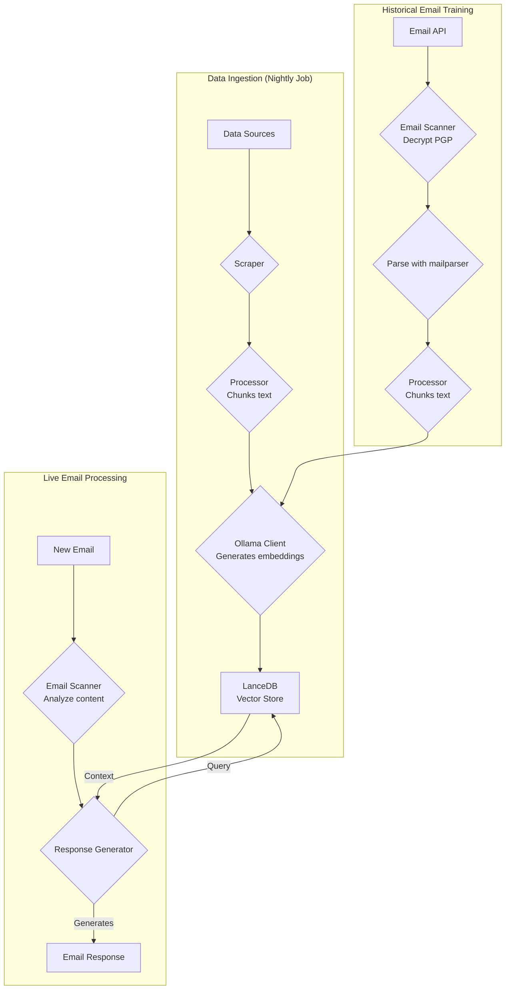
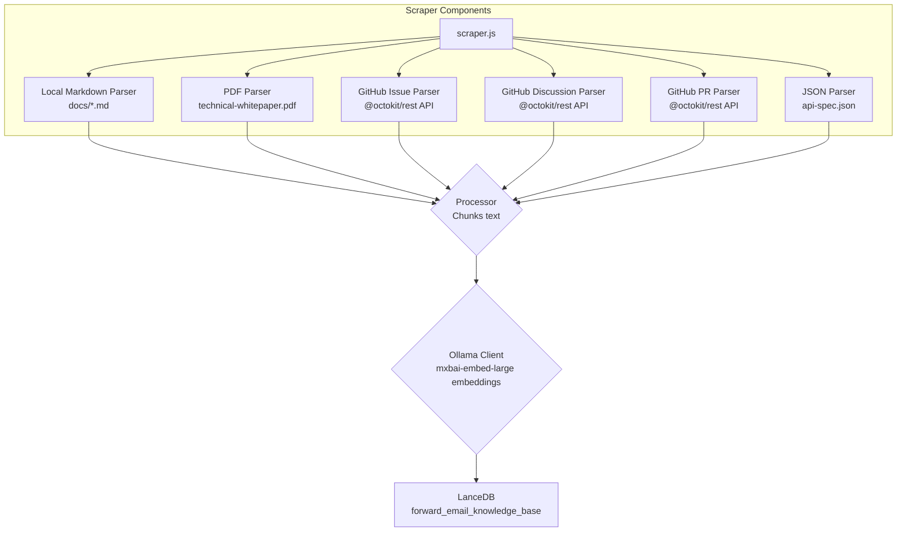
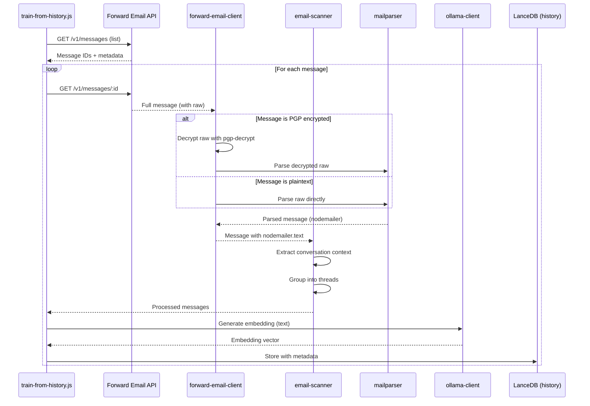

# Bygge en personvern-fokusert AI kundestøtteagent med LanceDB, Ollama og Node.js {#building-a-privacy-first-ai-customer-support-agent-with-lancedb-ollama-and-nodejs}


> \[!NOTE]
> Dette dokumentet dekker vår reise med å bygge en selvhostet AI-støtteagent. Vi skrev om lignende utfordringer i vårt [Email Startup Graveyard](https://forwardemail.net/blog/docs/email-startup-graveyard-why-80-percent-email-companies-fail) blogginnlegg. Vi vurderte ærlig talt å skrive en oppfølger kalt "AI Startup Graveyard", men kanskje vi må vente et år eller to til AI-boblen potensielt sprekker(?). Foreløpig er dette vår hjernedump av hva som fungerte, hva som ikke gjorde det, og hvorfor vi gjorde det på denne måten.

Slik bygde vi vår egen AI kundestøtteagent. Vi gjorde det på den harde måten: selvhostet, personvern-fokusert, og helt under vår kontroll. Hvorfor? Fordi vi ikke stoler på tredjepartstjenester med kundenes data. Det er et krav i GDPR og DPA, og det er det riktige å gjøre.

Dette var ikke et morsomt helgeprosjekt. Det var en måneds lang reise gjennom ødelagte avhengigheter, misvisende dokumentasjon, og den generelle kaoset i det åpne AI-økosystemet i 2025. Dette dokumentet er en oversikt over hva vi bygde, hvorfor vi bygde det, og hindringene vi støtte på underveis.


## Innholdsfortegnelse {#table-of-contents}

* [Kundefordeler: AI-forsterket menneskelig støtte](#customer-benefits-ai-augmented-human-support)
  * [Raskere, mer nøyaktige svar](#faster-more-accurate-responses)
  * [Konsistens uten utbrenthet](#consistency-without-burnout)
  * [Hva du får](#what-you-get)
* [En personlig refleksjon: To tiårs slit](#a-personal-reflection-the-two-decade-grind)
* [Hvorfor personvern er viktig](#why-privacy-matters)
* [Kostnadsanalyse: Cloud AI vs selvhostet](#cost-analysis-cloud-ai-vs-self-hosted)
  * [Sammenligning av Cloud AI-tjenester](#cloud-ai-service-comparison)
  * [Kostnadsoversikt: 5GB kunnskapsbase](#cost-breakdown-5gb-knowledge-base)
  * [Kostnader for selvhostet maskinvare](#self-hosted-hardware-costs)
* [Dogfooding av vår egen API](#dogfooding-our-own-api)
  * [Hvorfor dogfooding er viktig](#why-dogfooding-matters)
  * [API-brukseksempler](#api-usage-examples)
  * [Ytelsesfordeler](#performance-benefits)
* [Krypteringsarkitektur](#encryption-architecture)
  * [Lag 1: Postkassekryptering (chacha20-poly1305)](#layer-1-mailbox-encryption-chacha20-poly1305)
  * [Lag 2: Meldingsnivå PGP-kryptering](#layer-2-message-level-pgp-encryption)
  * [Hvorfor dette er viktig for trening](#why-this-matters-for-training)
  * [Lagringssikkerhet](#storage-security)
  * [Lokal lagring er standard praksis](#local-storage-is-standard-practice)
* [Arkitekturen](#the-architecture)
  * [Høynivåflyt](#high-level-flow)
  * [Detaljert scraper-flyt](#detailed-scraper-flow)
* [Hvordan det fungerer](#how-it-works)
  * [Bygge kunnskapsbasen](#building-the-knowledge-base)
  * [Trening fra historiske e-poster](#training-from-historical-emails)
  * [Behandling av innkommende e-poster](#processing-incoming-emails)
  * [Vektorbutikksadministrasjon](#vector-store-management)
* [Gravplassen for vektordatabaser](#the-vector-database-graveyard)
* [Systemkrav](#system-requirements)
* [Cron-jobb konfigurasjon](#cron-job-configuration)
  * [Miljøvariabler](#environment-variables)
  * [Cron-jobber for flere innbokser](#cron-jobs-for-multiple-inboxes)
  * [Cron-tidsplan oversikt](#cron-schedule-breakdown)
  * [Dynamisk datoberegning](#dynamic-date-calculation)
  * [Første oppsett: Ekstraher URL-liste fra sitemap](#initial-setup-extract-url-list-from-sitemap)
  * [Teste cron-jobber manuelt](#testing-cron-jobs-manually)
  * [Overvåking av logger](#monitoring-logs)
* [Kodeeksempler](#code-examples)
  * [Skraping og behandling](#scraping-and-processing)
  * [Trening fra historiske e-poster](#training-from-historical-emails-1)
  * [Spørring etter kontekst](#querying-for-context)
* [Fremtiden: Spam-skanner FoU](#the-future-spam-scanner-rd)
* [Feilsøking](#troubleshooting)
  * [Feil ved uoverensstemmelse i vektordimensjon](#vector-dimension-mismatch-error)
  * [Tom kunnskapsbase-kontekst](#empty-knowledge-base-context)
  * [PGP-dekrypteringsfeil](#pgp-decryption-failures)
* [Brukstips](#usage-tips)
  * [Oppnå Inbox Zero](#achieving-inbox-zero)
  * [Bruke skip-ai etiketten](#using-the-skip-ai-label)
  * [E-posttråding og svar-alle](#email-threading-and-reply-all)
  * [Overvåking og vedlikehold](#monitoring-and-maintenance)
* [Testing](#testing)
  * [Kjøre tester](#running-tests)
  * [Testdekning](#test-coverage)
  * [Testmiljø](#test-environment)
* [Viktige læringspunkter](#key-takeaways)
## Kundebehov: AI-forsterket menneskelig støtte {#customer-benefits-ai-augmented-human-support}

Vårt AI-system erstatter ikke vårt supportteam—det gjør dem bedre. Her er hva dette betyr for deg:

### Raskere, mer nøyaktige svar {#faster-more-accurate-responses}

**Menneske-i-løkken**: Hvert AI-generert utkast blir gjennomgått, redigert og kuratert av vårt menneskelige supportteam før det sendes til deg. AI-en håndterer den innledende forskningen og utkastet, noe som frigjør teamet vårt til å fokusere på kvalitetskontroll og personalisering.

**Trent på menneskelig ekspertise**: AI-en lærer av:

* Vår håndskrevne kunnskapsbase og dokumentasjon
* Menneskeskapte blogginnlegg og veiledninger
* Vår omfattende FAQ (skrevet av mennesker)
* Tidligere kundesamtaler (alle håndtert av ekte mennesker)

Du får svar som er informert av mange års menneskelig ekspertise, bare levert raskere.

### Konsistens uten utbrenthet {#consistency-without-burnout}

Vårt lille team håndterer hundrevis av supporthenvendelser daglig, hver med behov for ulik teknisk kunnskap og mental kontekstbytte:

* Fakturaspørsmål krever kunnskap om økonomisystemer
* DNS-problemer krever nettverkskompetanse
* API-integrasjon krever programmeringskunnskap
* Sikkerhetsrapporter krever sårbarhetsvurdering

Uten AI-hjelp fører dette konstante kontekstbyttet til:

* Langsommere svartider
* Menneskelige feil på grunn av tretthet
* Ujevn svar-kvalitet
* Teamutbrenthet

**Med AI-forsterkning**:

* Svarer teamet raskere (AI lager utkast på sekunder)
* Gjør færre feil (AI fanger vanlige feil)
* Opprettholder jevn kvalitet (AI refererer til samme kunnskapsbase hver gang)
* Holder seg opplagt og fokusert (mindre tid på research, mer tid på hjelp)

### Hva du får {#what-you-get}

✅ **Hastighet**: AI lager utkast på sekunder, mennesker gjennomgår og sender innen minutter

✅ **Nøyaktighet**: Svar basert på vår faktiske dokumentasjon og tidligere løsninger

✅ **Konsistens**: Samme høykvalitets svar enten det er kl. 09 eller 21

✅ **Menneskelig preg**: Hvert svar gjennomgås og personaliseres av vårt team

✅ **Ingen hallusinasjoner**: AI bruker kun vår verifiserte kunnskapsbase, ikke generiske internettdata

> \[!NOTE]
> **Du snakker alltid med mennesker**. AI-en er en forskningsassistent som hjelper teamet vårt å finne riktig svar raskere. Tenk på det som en bibliotekar som umiddelbart finner relevant bok—men et menneske leser den fortsatt og forklarer den til deg.


## En personlig refleksjon: To tiårs slit {#a-personal-reflection-the-two-decade-grind}

Før vi dykker ned i de tekniske detaljene, en personlig merknad. Jeg har holdt på med dette i nesten to tiår. De endeløse timene ved tastaturet, den ustoppelige jakten på en løsning, det dype, fokuserte slitet – dette er virkeligheten ved å bygge noe meningsfullt. Det er en virkelighet som ofte blir oversett i hypen rundt ny teknologi.

Den nylige eksplosjonen av AI har vært spesielt frustrerende. Vi blir solgt en drøm om automatisering, om AI-assistenter som skal skrive koden vår og løse problemene våre. Virkeligheten? Resultatet er ofte søppel-kode som krever mer tid å fikse enn det ville tatt å skrive fra bunnen av. Løftet om å gjøre livene våre enklere er falskt. Det er en distraksjon fra det harde, nødvendige arbeidet med å bygge.

Og så er det catch-22 med å bidra til open source. Du er allerede sliten, utmattet av slitet. Du bruker en AI til å hjelpe deg med å skrive en detaljert, godt strukturert feilrapport, i håp om å gjøre det enklere for vedlikeholdere å forstå og fikse problemet. Og hva skjer? Du blir kjeftet på. Bidraget ditt blir avvist som "off-topic" eller lavinnsats, som vi så i en nylig [Node.js GitHub issue](https://github.com/nodejs/node/issues/60719#issuecomment-3534304321). Det er et slag i ansiktet på seniorutviklere som bare prøver å hjelpe.

Dette er virkeligheten i økosystemet vi jobber i. Det handler ikke bare om ødelagte verktøy; det handler om en kultur som ofte ikke respekterer tiden og [innsatsen til sine bidragsytere](https://forwardemail.net/blog/docs/how-npm-packages-billion-downloads-shaped-javascript-ecosystem). Dette innlegget er en krønike over den virkeligheten. Det er en historie om verktøyene, ja, men også om den menneskelige kostnaden ved å bygge i et ødelagt økosystem som, til tross for alle løfter, er fundamentalt ødelagt.
## Hvorfor personvern er viktig {#why-privacy-matters}

Vår [tekniske whitepaper](https://forwardemail.net/technical-whitepaper.pdf) dekker vår personvernfilosofi i dybden. Den korte versjonen: vi sender aldri kundedata til tredjeparter. Aldri. Det betyr ingen OpenAI, ingen Anthropic, ingen skybaserte vektordatabaser. Alt kjører lokalt på vår infrastruktur. Dette er ikke-forhandlingsbart for GDPR-samsvar og våre DPA-forpliktelser.


## Kostnadsanalyse: Sky-AI vs Selv-hosting {#cost-analysis-cloud-ai-vs-self-hosted}

Før vi går inn i den tekniske implementeringen, la oss snakke om hvorfor selv-hosting er viktig fra et kostnadsperspektiv. Prisingsmodellene til sky-AI-tjenester gjør dem uoverkommelige dyre for høyvolumsbruk som kundestøtte.

### Sammenligning av sky-AI-tjenester {#cloud-ai-service-comparison}

| Tjeneste       | Leverandør          | Kostnad for embedding                                             | LLM-kostnad (Input)                                                       | LLM-kostnad (Output)    | Personvernpolicy                                    | GDPR/DPA        | Hosting           | Datadeling       |
| -------------- | ------------------- | ----------------------------------------------------------------- | ------------------------------------------------------------------------- | ----------------------- | -------------------------------------------------- | --------------- | ----------------- | ---------------- |
| **OpenAI**     | OpenAI (US)         | [$0.02-0.13/1M tokens](https://openai.com/api/pricing/)           | $0.15-20/1M tokens                                                        | $0.60-80/1M tokens      | [Lenke](https://openai.com/policies/privacy-policy/) | Begrenset DPA   | Azure (US)        | Ja (trening)     |
| **Claude**     | Anthropic (US)      | N/A                                                               | [$3-20/1M tokens](https://docs.claude.com/en/docs/about-claude/pricing)   | $15-80/1M tokens        | [Lenke](https://www.anthropic.com/legal/privacy)    | Begrenset DPA   | AWS/GCP (US)      | Nei (påstått)    |
| **Gemini**     | Google (US)         | [$0.15/1M tokens](https://ai.google.dev/gemini-api/docs/pricing)  | $0.30-1.00/1M tokens                                                      | $2.50/1M tokens         | [Lenke](https://policies.google.com/privacy)        | Begrenset DPA   | GCP (US)          | Ja (forbedring)  |
| **DeepSeek**   | DeepSeek (Kina)     | N/A                                                               | [$0.028-0.28/1M tokens](https://api-docs.deepseek.com/quick_start/pricing) | $0.42/1M tokens         | [Lenke](https://www.deepseek.com/en)                | Ukjent          | Kina              | Ukjent           |
| **Mistral**    | Mistral AI (Frankrike) | [$0.10/1M tokens](https://mistral.ai/pricing)                   | $0.40/1M tokens                                                          | $2.00/1M tokens         | [Lenke](https://mistral.ai/terms/)                  | EU GDPR         | EU                | Ukjent           |
| **Selv-hostet**| Deg                 | $0 (eksisterende maskinvare)                                     | $0 (eksisterende maskinvare)                                             | $0 (eksisterende maskinvare) | Din policy                                         | Full samsvar    | MacBook M5 + cron | Aldri            |

> \[!WARNING]
> **Bekymringer rundt datasuverenitet**: Amerikanske leverandører (OpenAI, Claude, Gemini) er underlagt CLOUD Act, som gir amerikanske myndigheter tilgang til data. DeepSeek (Kina) opererer under kinesiske datalover. Selv om Mistral (Frankrike) tilbyr EU-hosting og GDPR-samsvar, er selv-hosting fortsatt det eneste alternativet for full datasuverenitet og kontroll.

### Kostnadsoversikt: 5GB kunnskapsbase {#cost-breakdown-5gb-knowledge-base}

La oss beregne kostnaden for å behandle en 5GB kunnskapsbase (typisk for et mellomstort selskap med dokumenter, e-poster og supporthistorikk).

**Forutsetninger:**

* 5GB tekst ≈ 1,25 milliarder tokens (antar ~4 tegn/token)
* Initial embedding-generering
* Månedlig retrening (full re-embedding)
* 10 000 supporthenvendelser per måned
* Gjennomsnittlig henvendelse: 500 tokens input, 300 tokens output
**Detaljert kostnadsoversikt:**

| Komponent                             | OpenAI           | Claude          | Gemini               | Selv-hostet        |
| ------------------------------------ | ---------------- | --------------- | -------------------- | ------------------ |
| **Initial embedding** (1,25 mrd. tokens) | $25,000          | N/A             | $187,500             | $0                 |
| **Månedlige forespørsler** (10K × 800 tokens) | $1,200-16,000    | $2,400-16,000   | $2,400-3,200         | $0                 |
| **Månedlig retrening** (1,25 mrd. tokens) | $25,000          | N/A             | $187,500             | $0                 |
| **Totalt første år**                  | $325,200-217,000 | $28,800-192,000 | $2,278,800-2,226,000 | ~60 $ (strøm)      |
| **Personvern**                       | ❌ Begrenset      | ❌ Begrenset     | ❌ Begrenset          | ✅ Fullt            |
| **Datasuverenitet**                   | ❌ Nei           | ❌ Nei          | ❌ Nei                | ✅ Ja               |

> \[!CAUTION]
> **Geminis embedding-kostnader er katastrofale** på $0,15/1M tokens. En enkelt 5GB kunnskapsbase-embedding ville kostet $187,500. Dette er 37 ganger dyrere enn OpenAI og gjør det helt ubrukelig i produksjon.

### Selv-hostet maskinvarekostnader {#self-hosted-hardware-costs}

Oppsettet vårt kjører på eksisterende maskinvare vi allerede eier:

* **Maskinvare**: MacBook M5 (allerede eid for utvikling)
* **Ekstra kostnad**: $0 (bruker eksisterende maskinvare)
* **Strøm**: \~$5/måned (estimert)
* **Totalt første år**: \~$60
* **Løpende kostnad**: $60/år

**ROI**: Selv-hosting har i praksis null marginalkostnad siden vi bruker eksisterende utviklingsmaskinvare. Systemet kjører via cron-jobber utenom peak-tid.

## Dogfooding av vår egen API {#dogfooding-our-own-api}

En av de viktigste arkitekturvalgene vi gjorde var at alle AI-jobber bruker [Forward Email API](https://forwardemail.net/email-api) direkte. Dette er ikke bare god praksis — det er en tvungen funksjon for ytelsesoptimalisering.

### Hvorfor dogfooding er viktig {#why-dogfooding-matters}

Når våre AI-jobber bruker de samme API-endepunktene som kundene våre:

1. **Ytelsesflaskehalser påvirker oss først** – Vi kjenner smerten før kundene gjør det
2. **Optimalisering gagner alle** – Forbedringer for våre jobber forbedrer automatisk kundeopplevelsen
3. **Reell testing** – Våre jobber behandler tusenvis av e-poster, og gir kontinuerlig belastningstesting
4. **Kodegjenbruk** – Samme autentisering, ratebegrensning, feilhåndtering og caching-logikk

### API-brukseksempler {#api-usage-examples}

**Lister meldinger (train-from-history.js):**

```javascript
// Bruker GET /v1/messages?folder=INBOX med BasicAuth
// Ekskluderer eml, raw, nodemailer for å redusere responsstørrelse (trenger kun ID-er)
const response = await axios.get(
  `${this.apiBase}/v1/messages`,
  {
    params: {
      folder: 'INBOX',
      limit: 100,
      eml: false,
      raw: false,
      nodemailer: false
    },
    auth: {
      username: process.env.FORWARD_EMAIL_ALIAS_USERNAME,
      password: process.env.FORWARD_EMAIL_ALIAS_PASSWORD
    }
  }
);

const messages = response.data;
// Returnerer: [{ id, subject, date, ... }, ...]
// Full melding innhold hentes senere via GET /v1/messages/:id
```

**Henter fullstendige meldinger (forward-email-client.js):**

```javascript
// Bruker GET /v1/messages/:id for å hente full melding med råinnhold
const response = await axios.get(
  `${this.apiBase}/v1/messages/${messageId}`,
  {
    auth: {
      username: this.aliasUsername,
      password: this.aliasPassword
    }
  }
);

const message = response.data;
// Returnerer: { id, subject, raw, eml, nodemailer: { ... }, ... }
```

**Oppretter utkast til svar (process-inbox.js):**

```javascript
// Bruker POST /v1/messages for å opprette utkast til svar
const response = await axios.post(
  `${this.apiBase}/v1/messages`,
  {
    folder: 'Drafts',
    subject: `Re: ${originalSubject}`,
    to: senderEmail,
    text: generatedResponse,
    inReplyTo: originalMessageId
  },
  {
    auth: {
      username: process.env.FORWARD_EMAIL_ALIAS_USERNAME,
      password: process.env.FORWARD_EMAIL_ALIAS_PASSWORD
    }
  }
);
```
### Ytelsesfordeler {#performance-benefits}

Fordi våre AI-jobber kjører på samme API-infrastruktur:

* **Caching-optimaliseringer** gagner både jobber og kunder
* **Ratebegrensning** testes under reell belastning
* **Feilhåndtering** er grundig testet i praksis
* **API-responstider** overvåkes kontinuerlig
* **Databaseforespørsler** er optimalisert for begge brukstilfeller
* **Båndbreddeoptimalisering** – Ekskludering av `eml`, `raw`, `nodemailer` ved oppføring reduserer responsstørrelsen med \~90%

Når `train-from-history.js` behandler 1 000 e-poster, utføres det over 1 000 API-kall. Enhver ineffektivitet i API-et blir umiddelbart synlig. Dette tvinger oss til å optimalisere IMAP-tilgang, databaseforespørsler og responsserialisering – forbedringer som direkte gagner kundene våre.

**Eksempel på optimalisering**: Oppføring av 100 meldinger med fullstendig innhold = \~10MB respons. Oppføring med `eml: false, raw: false, nodemailer: false` = \~100KB respons (100x mindre).


## Krypteringsarkitektur {#encryption-architecture}

Vår e-postlagring bruker flere lag med kryptering, som AI-jobbene må dekryptere i sanntid for trening.

### Lag 1: Postkassekryptering (chacha20-poly1305) {#layer-1-mailbox-encryption-chacha20-poly1305}

Alle IMAP-postkasser lagres som SQLite-databaser kryptert med **chacha20-poly1305**, en kvantesikker krypteringsalgoritme. Dette er detaljert i vårt [blogginnlegg om kvantesikker kryptert e-posttjeneste](https://forwardemail.net/blog/docs/best-quantum-safe-encrypted-email-service).

**Nøkkel-egenskaper:**

* **Algoritme**: ChaCha20-Poly1305 (AEAD-kryptering)
* **Kvantesikker**: Motstandsdyktig mot kvantedatamaskinangrep
* **Lagring**: SQLite-databasefiler på disk
* **Tilgang**: Dekryptert i minnet ved tilgang via IMAP/API

### Lag 2: Meldingsnivå PGP-kryptering {#layer-2-message-level-pgp-encryption}

Mange support-e-poster er i tillegg kryptert med PGP (OpenPGP-standard). AI-jobbene må dekryptere disse for å hente ut innhold til trening.

**Dekrypteringsflyt:**

```javascript
// 1. API returnerer melding med kryptert råinnhold
const message = await forwardEmailClient.getMessage(id);

// 2. Sjekk om råinnholdet er PGP-kryptert
if (isMessageEncrypted(message.raw)) {
  // 3. Dekrypter med vår private nøkkel
  const decryptedRaw = await pgpDecrypt(message.raw);

  // 4. Parse dekryptert MIME-melding
  const parsed = await simpleParser(decryptedRaw);

  // 5. Fyll nodemailer med dekryptert innhold
  message.nodemailer = {
    text: parsed.text,
    html: parsed.html,
    from: parsed.from,
    to: parsed.to,
    subject: parsed.subject,
    date: parsed.date
  };
}
```

**PGP-konfigurasjon:**

```bash
# Privat nøkkel for dekryptering (sti til ASCII-armert nøkkelfil)
GPG_SECURITY_KEY="/path/to/private-key.asc"

# Passord for privat nøkkel (hvis kryptert)
GPG_SECURITY_PASSPHRASE="your-passphrase"
```

`pgp-decrypt.js`-hjelperen:

1. Leser den private nøkkelen fra disk én gang (bufret i minnet)
2. Dekrypterer nøkkelen med passordet
3. Bruker den dekrypterte nøkkelen for all meldingsdekryptering
4. Støtter rekursiv dekryptering for nestede krypterte meldinger

### Hvorfor dette er viktig for trening {#why-this-matters-for-training}

Uten riktig dekryptering ville AI trent på kryptert uforståelig tekst:

```
-----BEGIN PGP MESSAGE-----
Version: OpenPGP.js v4.10.10

wcBMA8Z3lHJnFnNUAQgAqK7F8...
-----END PGP MESSAGE-----
```

Med dekryptering trener AI på faktisk innhold:

```
Subject: Re: Bug Report

Hi John,

Thanks for reporting this issue. I've confirmed the bug
and created a fix in PR #1234...
```

### Lagringssikkerhet {#storage-security}

Dekrypteringen skjer i minnet under jobbkjøring, og det dekrypterte innholdet konverteres til embeddings som deretter lagres i LanceDB-vektordatabasen på disk.

**Hvor dataene befinner seg:**

* **Vektordatabasen**: Lagret på krypterte MacBook M5-arbeidsstasjoner
* **Fysisk sikkerhet**: Arbeidsstasjonene oppbevares hos oss til enhver tid (ikke i datasentre)
* **Diskkryptering**: Full diskkryptering på alle arbeidsstasjoner
* **Nettverkssikkerhet**: Brannmur og isolert fra offentlige nettverk

**Fremtidig datasenterdistribusjon:**
Hvis vi noen gang flytter til datasenterhosting, vil serverne ha:

* LUKS full diskkryptering
* USB-tilgang deaktivert
* Fysiske sikkerhetstiltak
* Nettverksisolasjon
For fullstendige detaljer om våre sikkerhetsrutiner, se vår [Sikkerhetsside](https://forwardemail.net/en/security).

> \[!NOTE]
> Vektordatabasen inneholder embeddings (matematiske representasjoner), ikke den opprinnelige renteksten. Imidlertid kan embeddings potensielt bli reversert, og derfor oppbevarer vi dem på krypterte, fysisk sikrede arbeidsstasjoner.

### Lokal lagring er standard praksis {#local-storage-is-standard-practice}

Å lagre embeddings på teamets arbeidsstasjoner er ikke annerledes enn hvordan vi allerede håndterer e-post:

* **Thunderbird**: Laster ned og lagrer full e-postinnhold lokalt i mbox/maildir-filer
* **Webmail-klienter**: Bufrer e-postdata i nettleserlagring og lokale databaser
* **IMAP-klienter**: Opprettholder lokale kopier av meldinger for offline tilgang
* **Vårt AI-system**: Lagrer matematiske embeddings (ikke rentekst) i LanceDB

Den viktigste forskjellen: embeddings er **mer sikre** enn rentekst e-post fordi de er:

1. Matematiske representasjoner, ikke lesbar tekst
2. Vanskeligere å reversere enn rentekst
3. Fortsatt underlagt samme fysiske sikkerhet som våre e-postklienter

Hvis det er akseptabelt for teamet vårt å bruke Thunderbird eller webmail på krypterte arbeidsstasjoner, er det like akseptabelt (og muligens mer sikkert) å lagre embeddings på samme måte.


## Arkitekturen {#the-architecture}

Her er det grunnleggende flyten. Det ser enkelt ut. Det var det ikke.

> \[!NOTE]
> Alle jobber bruker Forward Email API direkte, noe som sikrer at ytelsesoptimaliseringer gagner både vårt AI-system og våre kunder.

### Overordnet flyt {#high-level-flow}



### Detaljert scraper-flyt {#detailed-scraper-flow}

`scraper.js` er kjernen i dataopptaket. Det er en samling av parser for forskjellige dataformater.




## Hvordan det fungerer {#how-it-works}

Prosessen er delt inn i tre hoveddeler: bygge kunnskapsbasen, trene på historiske e-poster, og behandle nye e-poster.

### Bygge kunnskapsbasen {#building-the-knowledge-base}

**`update-knowledge-base.js`**: Dette er hovedjobben. Den kjører nattlig, tømmer den gamle vektorbutikken, og bygger den opp fra bunnen av. Den bruker `scraper.js` for å hente innhold fra alle kilder, `processor.js` for å dele opp teksten, og `ollama-client.js` for å generere embeddings. Til slutt lagrer `vector-store.js` alt i LanceDB.

**Datakilder:**

* Lokale Markdown-filer (`docs/*.md`)
* Teknisk whitepaper PDF (`assets/technical-whitepaper.pdf`)
* API-spesifikasjon JSON (`assets/api-spec.json`)
* GitHub issues (via Octokit)
* GitHub diskusjoner (via Octokit)
* GitHub pull requests (via Octokit)
* Sitemap URL-liste (`$LANCEDB_PATH/valid-urls.json`)

### Trening på historiske e-poster {#training-from-historical-emails}

**`train-from-history.js`**: Denne jobben skanner historiske e-poster fra alle mapper, dekrypterer PGP-krypterte meldinger, og legger dem til i en separat vektorbutikk (`customer_support_history`). Dette gir kontekst fra tidligere supportinteraksjoner.
**E-postbehandlingsflyt:**



**Nøkkelfunksjoner:**

* **PGP-dekryptering**: Bruker `pgp-decrypt.js` hjelpefil med miljøvariabelen `GPG_SECURITY_KEY`
* **Trådgruppering**: Grupperer relaterte e-poster i samtaletråder
* **Bevaring av metadata**: Lagrer mappe, emne, dato, krypteringsstatus
* **Svar-kontekst**: Knytter meldinger med deres svar for bedre kontekst

**Konfigurasjon:**

```bash
# Miljøvariabler for train-from-history
HISTORY_SCAN_LIMIT=1000              # Maks antall meldinger som skal behandles
HISTORY_SCAN_SINCE="2024-01-01"      # Behandle kun meldinger etter denne datoen
HISTORY_DECRYPT_PGP=true             # Forsøk PGP-dekryptering
GPG_SECURITY_KEY="/path/to/key.asc"  # Sti til PGP privatnøkkel
GPG_SECURITY_PASSPHRASE="passphrase" # Nøkkel passord (valgfritt)
```

**Hva som lagres:**

```javascript
{
  type: 'historical_email',
  folder: 'INBOX',
  subject: 'Re: Bug Report',
  date: '2025-01-15T10:30:00Z',
  messageId: '67e2f288893921...',
  threadId: 'Bug Report',
  hasReply: true,
  encrypted: true,
  decrypted: true,
  replySubject: 'Bug Report',
  replyText: 'First 500 chars of reply...',
  chunkSize: 1000,
  chunkOverlap: 200,
  chunkIndex: 0
}
```

> \[!TIP]
> Kjør `train-from-history` etter initial oppsett for å fylle den historiske konteksten. Dette forbedrer responskvaliteten dramatisk ved å lære av tidligere supportinteraksjoner.

### Behandling av innkommende e-poster {#processing-incoming-emails}

**`process-inbox.js`**: Denne jobben kjører på e-poster i våre postbokser `support@forwardemail.net`, `abuse@forwardemail.net` og `security@forwardemail.net` (spesifikt IMAP-mappen `INBOX`). Den benytter vår API på <https://forwardemail.net/email-api> (f.eks. `GET /v1/messages?folder=INBOX` med BasicAuth-tilgang ved bruk av våre IMAP-legitimasjoner for hver postboks). Den analyserer e-postinnholdet, spør både kunnskapsbasen (`forward_email_knowledge_base`) og den historiske e-post vektorbutikken (`customer_support_history`), og sender deretter den kombinerte konteksten til `response-generator.js`. Generatoren bruker `mxbai-embed-large` via Ollama for å lage et svar.

**Automatiserte arbeidsflytfunksjoner:**

1. **Inbox Zero-automatisering**: Etter at et utkast er opprettet, flyttes den opprinnelige meldingen automatisk til Arkiv-mappen. Dette holder innboksen ryddig og hjelper deg å oppnå inbox zero uten manuell inngripen.

2. **Hopp over AI-behandling**: Legg enkelt til en `skip-ai` etikett (case-insensitiv) på en melding for å forhindre AI-behandling. Meldingen forblir uberørt i innboksen, slik at du kan håndtere den manuelt. Dette er nyttig for sensitive meldinger eller komplekse saker som krever menneskelig vurdering.

3. **Riktig e-posttråding**: Alle utkast til svar inkluderer den opprinnelige meldingen sitert nedenfor (med standard ` >  ` prefiks), i henhold til e-postsvar-konvensjoner med formatet "On \[dato], \[avsender] wrote:". Dette sikrer riktig samtalekontekst og tråding i e-postklienter.

4. **Svar-alle-adferd**: Systemet håndterer automatisk Reply-To-headere og CC-mottakere:
   * Hvis en Reply-To-header finnes, blir den til Til-adressen og den opprinnelige Fra legges til i CC
   * Alle opprinnelige Til- og CC-mottakere inkluderes i svar-CC (bortsett fra din egen adresse)
   * Følger standard e-post svar-alle-konvensjoner for gruppe-samtaler
**Kilde Rangering**: Systemet bruker **vektet rangering** for å prioritere kilder:

* FAQ: 100 % (høyeste prioritet)
* Teknisk whitepaper: 95 %
* API-spesifikasjon: 90 %
* Offisielle dokumenter: 85 %
* GitHub issues: 70 %
* Historiske e-poster: 50 %

### Vector Store Management {#vector-store-management}

`VectorStore`-klassen i `helpers/customer-support-ai/vector-store.js` er vårt grensesnitt til LanceDB.

**Legge til dokumenter:**

```javascript
// vector-store.js
async addDocument(text, metadata) {
  const embedding = await this.ollama.generateEmbedding(text);
  await this.table.add([{
    vector: embedding,
    text,
    ...metadata
  }]);
}
```

**Tømme butikken:**

```javascript
// Alternativ 1: Bruk clear()-metoden
await vectorStore.clear();

// Alternativ 2: Slett den lokale databasekatalogen
await fs.rm(process.env.LANCEDB_PATH, { recursive: true, force: true });
```

Miljøvariabelen `LANCEDB_PATH` peker til den lokale innebygde databasekatalogen. LanceDB er serverløs og innebygd, så det finnes ingen separat prosess å administrere.


## The Vector Database Graveyard {#the-vector-database-graveyard}

Dette var den første store hindringen. Vi prøvde flere vektordatabaser før vi landet på LanceDB. Her er hva som gikk galt med hver av dem.

| Database     | GitHub                                                      | Hva gikk galt                                                                                                                                                                                                       | Spesifikke problemer                                                                                                                                                                                                                                                                                                                                                     | Sikkerhetsbekymringer                                                                                                                                                                                            |
| ------------ | ----------------------------------------------------------- | ------------------------------------------------------------------------------------------------------------------------------------------------------------------------------------------------------------------ | ------------------------------------------------------------------------------------------------------------------------------------------------------------------------------------------------------------------------------------------------------------------------------------------------------------------------------------------------------------------------- | ---------------------------------------------------------------------------------------------------------------------------------------------------------------------------------------------------------------- |
| **ChromaDB** | [chroma-core/chroma](https://github.com/chroma-core/chroma) | `pip3 install chromadb` gir deg en versjon fra steinalderen med `PydanticImportError`. Den eneste måten å få en fungerende versjon på er å kompilere fra kildekode. Ikke utviklervennlig.                           | Kaos med Python-avhengigheter. Flere brukere rapporterer ødelagte pip-installasjoner ([#774](https://github.com/chroma-core/chroma/issues/774), [#163](https://github.com/chroma-core/chroma/issues/163)). Dokumentasjonen sier "bare bruk Docker" som er et ikke-svar for lokal utvikling. Kolliderer på Windows med >99 poster ([#3058](https://github.com/chroma-core/chroma/issues/3058)). | **CVE-2024-45848**: Vilkårlig kodekjøring via ChromaDB-integrasjon i MindsDB. Kritiske OS-sårbarheter i Docker-image ([#3170](https://github.com/chroma-core/chroma/issues/3170)).                                         |
| **Qdrant**   | [qdrant/qdrant](https://github.com/qdrant/qdrant)           | Homebrew-tappen (`qdrant/qdrant/qdrant`) som ble referert til i deres gamle dokumentasjon er borte. Forsvunnet. Ingen forklaring. De offisielle dokumentene sier nå bare "bruk Docker."                            | Manglende Homebrew-tapp. Ingen native macOS-binær. Kun Docker er en barriere for rask lokal testing.                                                                                                                                                                                                                                                                     | **CVE-2024-2221**: Sårbarhet for vilkårlig filopplasting som tillater ekstern kodekjøring (fikset i v1.9.0). Svak sikkerhetsmodenhetsscore fra [IronCore Labs](https://ironcorelabs.com/vectordbs/qdrant-security/).      |
| **Weaviate** | [weaviate/weaviate](https://github.com/weaviate/weaviate)   | Homebrew-versjonen hadde en kritisk klyngefeil (`leader not found`). De dokumenterte flaggene for å fikse det (`RAFT_JOIN`, `CLUSTER_HOSTNAME`) fungerte ikke. Fundamentalt ødelagt for enkelt-node-oppsett.         | Klyngefeil selv i enkelt-node-modus. Overkomplisert for enkle brukstilfeller.                                                                                                                                                                                                                                                                                             | Ingen store CVE-er funnet, men kompleksiteten øker angrepsflaten.                                                                                                                                                  |
| **LanceDB**  | [lancedb/lancedb](https://github.com/lancedb/lancedb)       | Denne fungerte. Den er innebygd og serverløs. Ingen separat prosess. Den eneste irritasjonen er forvirrende pakkebetegnelser (`vectordb` er utdatert, bruk `@lancedb/lancedb`) og spredt dokumentasjon. Vi kan leve med det. | Forvirring rundt pakkebetegnelser (`vectordb` vs `@lancedb/lancedb`), men ellers solid. Innebygd arkitektur eliminerer hele klasser av sikkerhetsproblemer.                                                                                                                                                                                                             | Ingen kjente CVE-er. Innebygd design betyr ingen nettverksangrepsflate.                                                                                                                                          |
> \[!WARNING]
> **ChromaDB har kritiske sikkerhetssårbarheter.** [CVE-2024-45848](https://nvd.nist.gov/vuln/detail/CVE-2024-45848) tillater vilkårlig kodeutførelse. Pip installasjonen er fundamentalt ødelagt med Pydantic-avhengighetsproblemer. Unngå for produksjonsbruk.

> \[!WARNING]
> **Qdrant hadde en filopplastings-RCE-sårbarhet** ([CVE-2024-2221](https://qdrant.tech/blog/cve-2024-2221-response/)) som først ble fikset i v1.9.0. Hvis du må bruke Qdrant, sørg for at du har den nyeste versjonen.

> \[!CAUTION]
> Økosystemet for åpne vektordatabaser er ustabilt. Ikke stol på dokumentasjonen. Anta at alt er ødelagt inntil det motsatte er bevist. Test lokalt før du forplikter deg til en stack.


## Systemkrav {#system-requirements}

* **Node.js:** v18.0.0+ ([GitHub](https://github.com/nodejs/node))
* **Ollama:** Nyeste ([GitHub](https://github.com/ollama/ollama))
* **Modell:** `mxbai-embed-large` via Ollama
* **Vektordatabasen:** LanceDB ([GitHub](https://github.com/lancedb/lancedb))
* **GitHub-tilgang:** `@octokit/rest` for å skrape issues ([GitHub](https://github.com/octokit/rest.js))
* **SQLite:** For primærdatabase (via `mongoose-to-sqlite`)


## Cron-jobb-konfigurasjon {#cron-job-configuration}

Alle AI-jobber kjører via cron på en MacBook M5. Slik setter du opp cron-jobbene til å kjøre ved midnatt på flere innbokser.

### Miljøvariabler {#environment-variables}

Jobbene krever disse miljøvariablene. De fleste kan settes i `.env`-fil (lastes via `@ladjs/env`), men `HISTORY_SCAN_SINCE` må beregnes dynamisk i crontab.

**I `.env`-filen:**

```bash
# Forward Email API-legitimasjon (varierer per innboks)
FORWARD_EMAIL_ALIAS_USERNAME=support@forwardemail.net
FORWARD_EMAIL_ALIAS_PASSWORD=ditt-imap-passord

# PGP-dekryptering (deles på tvers av alle innbokser)
GPG_SECURITY_KEY=/path/to/private-key.asc
GPG_SECURITY_PASSPHRASE=ditt-passord

# Historisk skannekonfigurasjon
HISTORY_SCAN_LIMIT=1000

# LanceDB-sti
LANCEDB_PATH=/path/to/lancedb
```

**I crontab (beregnet dynamisk):**

```bash
# HISTORY_SCAN_SINCE må settes inline i crontab med shell-datoberegning
# Kan ikke være i .env-fil siden @ladjs/env ikke evaluerer shell-kommandoer
HISTORY_SCAN_SINCE="$(date -v-1d +%Y-%m-%d)"  # macOS
HISTORY_SCAN_SINCE="$(date -d 'yesterday' +%Y-%m-%d)"  # Linux
```

### Cron-jobber for flere innbokser {#cron-jobs-for-multiple-inboxes}

Rediger crontab med `crontab -e` og legg til:

```bash
# Oppdater kunnskapsbase (kjøres én gang, delt på tvers av alle innbokser)
0 0 * * * cd /path/to/forwardemail.net && LANCEDB_PATH="/path/to/lancedb" GPG_SECURITY_KEY="/path/to/key.asc" GPG_SECURITY_PASSPHRASE="pass" node jobs/customer-support-ai/update-knowledge-base.js >> /var/log/update-knowledge-base.log 2>&1

# Tren fra historikk - support@forwardemail.net
0 0 * * * cd /path/to/forwardemail.net && FORWARD_EMAIL_ALIAS_USERNAME="support@forwardemail.net" FORWARD_EMAIL_ALIAS_PASSWORD="support-password" HISTORY_SCAN_SINCE="$(date -v-1d +%Y-%m-%d)" HISTORY_SCAN_LIMIT=1000 GPG_SECURITY_KEY="/path/to/key.asc" GPG_SECURITY_PASSPHRASE="pass" LANCEDB_PATH="/path/to/lancedb" node jobs/customer-support-ai/train-from-history.js >> /var/log/train-support.log 2>&1

# Tren fra historikk - abuse@forwardemail.net
0 0 * * * cd /path/to/forwardemail.net && FORWARD_EMAIL_ALIAS_USERNAME="abuse@forwardemail.net" FORWARD_EMAIL_ALIAS_PASSWORD="abuse-password" HISTORY_SCAN_SINCE="$(date -v-1d +%Y-%m-%d)" HISTORY_SCAN_LIMIT=1000 GPG_SECURITY_KEY="/path/to/key.asc" GPG_SECURITY_PASSPHRASE="pass" LANCEDB_PATH="/path/to/lancedb" node jobs/customer-support-ai/train-from-history.js >> /var/log/train-abuse.log 2>&1

# Tren fra historikk - security@forwardemail.net
0 0 * * * cd /path/to/forwardemail.net && FORWARD_EMAIL_ALIAS_USERNAME="security@forwardemail.net" FORWARD_EMAIL_ALIAS_PASSWORD="security-password" HISTORY_SCAN_SINCE="$(date -v-1d +%Y-%m-%d)" HISTORY_SCAN_LIMIT=1000 GPG_SECURITY_KEY="/path/to/key.asc" GPG_SECURITY_PASSPHRASE="pass" LANCEDB_PATH="/path/to/lancedb" node jobs/customer-support-ai/train-from-history.js >> /var/log/train-security.log 2>&1

# Behandle innboks - support@forwardemail.net
*/5 * * * * cd /path/to/forwardemail.net && FORWARD_EMAIL_ALIAS_USERNAME="support@forwardemail.net" FORWARD_EMAIL_ALIAS_PASSWORD="support-password" GPG_SECURITY_KEY="/path/to/key.asc" GPG_SECURITY_PASSPHRASE="pass" LANCEDB_PATH="/path/to/lancedb" node jobs/customer-support-ai/process-inbox.js >> /var/log/process-support.log 2>&1

# Behandle innboks - abuse@forwardemail.net
*/5 * * * * cd /path/to/forwardemail.net && FORWARD_EMAIL_ALIAS_USERNAME="abuse@forwardemail.net" FORWARD_EMAIL_ALIAS_PASSWORD="abuse-password" GPG_SECURITY_KEY="/path/to/key.asc" GPG_SECURITY_PASSPHRASE="pass" LANCEDB_PATH="/path/to/lancedb" node jobs/customer-support-ai/process-inbox.js >> /var/log/process-abuse.log 2>&1

# Behandle innboks - security@forwardemail.net
*/5 * * * * cd /path/to/forwardemail.net && FORWARD_EMAIL_ALIAS_USERNAME="security@forwardemail.net" FORWARD_EMAIL_ALIAS_PASSWORD="security-password" GPG_SECURITY_KEY="/path/to/key.asc" GPG_SECURITY_PASSPHRASE="pass" LANCEDB_PATH="/path/to/lancedb" node jobs/customer-support-ai/process-inbox.js >> /var/log/process-security.log 2>&1
```
### Cron Schedule Breakdown {#cron-schedule-breakdown}

| Job                     | Schedule      | Description                                                                        |
| ----------------------- | ------------- | ---------------------------------------------------------------------------------- |
| `train-from-sitemap.js` | `0 0 * * 0`   | Ukentlig (søndag midnatt) - Henter alle URL-er fra sitemap og trener kunnskapsbasen |
| `train-from-history.js` | `0 0 * * *`   | Midnatt daglig - Skanner forrige dags e-poster per innboks                         |
| `process-inbox.js`      | `*/5 * * * *` | Hvert 5. minutt - Behandler nye e-poster og genererer utkast                       |

### Dynamic Date Calculation {#dynamic-date-calculation}

Variabelen `HISTORY_SCAN_SINCE` **må beregnes inline i crontab** fordi:

1. `.env`-filer leses som bokstavelige strenger av `@ladjs/env`
2. Shell-kommando-substitusjon `$(...)` fungerer ikke i `.env`-filer
3. Datoen må beregnes på nytt hver gang cron kjører

**Korrekt tilnærming (i crontab):**

```bash
# macOS (BSD date)
HISTORY_SCAN_SINCE="$(date -v-1d +%Y-%m-%d)" node jobs/...

# Linux (GNU date)
HISTORY_SCAN_SINCE="$(date -d 'yesterday' +%Y-%m-%d)" node jobs/...
```

**Feil tilnærming (fungerer ikke i .env):**

```bash
# Dette vil leses som bokstavelig streng "$(date -v-1d +%Y-%m-%d)"
# IKKE evaluert som en shell-kommando
HISTORY_SCAN_SINCE=$(date -v-1d +%Y-%m-%d)
```

Dette sikrer at hver nattkjøring beregner forrige dags dato dynamisk, og unngår unødvendig arbeid.

### Initial Setup: Extract URL List from Sitemap {#initial-setup-extract-url-list-from-sitemap}

Før du kjører jobben process-inbox for første gang, må du **ekstrahere URL-listen fra sitemap**. Dette lager et oppslagsverk over gyldige URL-er som LLM kan referere til og forhindrer URL-hallusinasjoner.

```bash
# Førstegangsoppsett: Ekstraher URL-liste fra sitemap
cd /path/to/forwardemail.net
node jobs/customer-support-ai/train-from-sitemap.js
```

**Dette gjør den:**

1. Henter alle URL-er fra <https://forwardemail.net/sitemap.xml>
2. Filtrerer til kun ikke-lokaliserte URL-er eller /en/-URL-er (unngår duplikatinnhold)
3. Fjerner lokaliseringsprefikser (/en/faq → /faq)
4. Lagrer en enkel JSON-fil med URL-listen til `$LANCEDB_PATH/valid-urls.json`
5. Ingen crawling, ingen metadata-skraping – bare en flat liste over gyldige URL-er

**Hvorfor dette er viktig:**

* Forhindrer at LLM finner på falske URL-er som `/dashboard` eller `/login`
* Gir en hvitliste over gyldige URL-er som responsgeneratoren kan referere til
* Enkelt, raskt, og krever ikke lagring i vektordatabasen
* Responsgeneratoren laster denne listen ved oppstart og inkluderer den i prompten

**Legg til i crontab for ukentlige oppdateringer:**

```bash
# Ekstraher URL-liste fra sitemap - ukentlig søndag midnatt
0 0 * * 0 cd /path/to/forwardemail.net && node jobs/customer-support-ai/train-from-sitemap.js >> /var/log/train-sitemap.log 2>&1
```

### Testing Cron Jobs Manually {#testing-cron-jobs-manually}

For å teste en jobb før du legger den til i cron:

```bash
# Test sitemap-trening
cd /path/to/forwardemail.net
export LANCEDB_PATH="/path/to/lancedb"
node jobs/customer-support-ai/train-from-sitemap.js

# Test support-innboks-trening
cd /path/to/forwardemail.net
export FORWARD_EMAIL_ALIAS_USERNAME="support@forwardemail.net"
export FORWARD_EMAIL_ALIAS_PASSWORD="support-password"
export HISTORY_SCAN_SINCE="$(date -v-1d +%Y-%m-%d)"
export HISTORY_SCAN_LIMIT=1000
export GPG_SECURITY_KEY="/path/to/key.asc"
export GPG_SECURITY_PASSPHRASE="pass"
export LANCEDB_PATH="/path/to/lancedb"
node jobs/customer-support-ai/train-from-history.js
```

### Monitoring Logs {#monitoring-logs}

Hver jobb logger til en egen fil for enkel feilsøking:

```bash
# Følg support-innboksbehandling i sanntid
tail -f /var/log/process-support.log

# Sjekk gårsdagens treningskjøring
cat /var/log/train-support.log | grep "$(date -v-1d +%Y-%m-%d)"

# Se alle feil på tvers av jobber
grep -i error /var/log/train-*.log /var/log/process-*.log
```

> \[!TIP]
> Bruk separate loggfiler per innboks for å isolere problemer. Hvis én innboks har autentiseringsproblemer, vil det ikke forurense logger for andre innbokser.
## Codeeksempler {#code-examples}

### Skraping og behandling {#scraping-and-processing}

```javascript
// jobs/customer-support-ai/update-knowledge-base.js
const scraper = new Scraper();
const processor = new Processor();
const ollamaClient = new OllamaClient();
const vectorStore = new VectorStore();

// Tøm gammel data
await vectorStore.clear();

// Skrap alle kilder
const documents = await scraper.scrapeAll();
console.log(`Skrapet ${documents.length} dokumenter`);

// Behandle til biter
const allChunks = [];
for (const doc of documents) {
  const chunks = processor.processDocuments([doc]);
  allChunks.push(...chunks);
}
console.log(`Genererte ${allChunks.length} biter`);

// Generer embeddings og lagre
const texts = allChunks.map(chunk => chunk.text);
const embeddings = await ollamaClient.generateEmbeddings(texts);

for (let i = 0; i < allChunks.length; i++) {
  await vectorStore.addDocument(texts[i], {
    ...allChunks[i].metadata,
    embedding: embeddings[i]
  });
}
```

### Trening fra historiske e-poster {#training-from-historical-emails-1}

```javascript
// jobs/customer-support-ai/train-from-history.js
const scanner = new EmailScanner({
  forwardEmailApiBase: config.forwardEmailApiBase,
  forwardEmailAliasUsername: config.forwardEmailAliasUsername,
  forwardEmailAliasPassword: config.forwardEmailAliasPassword
});

const vectorStore = new VectorStore({
  collectionName: 'customer_support_history'
});

// Skann alle mapper (INBOX, Sendt post, osv.)
const messages = await scanner.scanAllFolders({
  limit: 1000,
  since: new Date('2024-01-01'),
  decryptPGP: true
});

// Grupper i samtaletråder
const threads = scanner.groupIntoThreads(messages);

// Behandle hver tråd
for (const thread of threads) {
  const context = scanner.extractConversationContext(thread);

  for (const message of context.messages) {
    // Hopp over krypterte meldinger som ikke kunne dekrypteres
    if (message.encrypted && !message.decrypted) continue;

    // Bruk allerede analysert innhold fra nodemailer
    const text = message.nodemailer?.text || '';
    if (!text.trim()) continue;

    // Del opp og lagre
    const chunks = processor.chunkText(`Emne: ${message.subject}\n\n${text}`, {
      chunkSize: 1000,
      chunkOverlap: 200
    });

    for (const chunk of chunks) {
      await vectorStore.addDocument(chunk.text, {
        type: 'historical_email',
        folder: message.folder,
        subject: message.subject,
        date: message.nodemailer?.date || message.created_at,
        messageId: message.id,
        threadId: context.subject,
        encrypted: message.encrypted || false,
        decrypted: message.decrypted || false,
        ...chunk.metadata
      });
    }
  }
}
```

### Spørring etter kontekst {#querying-for-context}

```javascript
// jobs/customer-support-ai/process-inbox.js
const vectorStore = new VectorStore();
const historyVectorStore = new VectorStore({
  collectionName: 'customer_support_history'
});

// Spørr begge lagre
const knowledgeContext = await vectorStore.query(emailEmbedding, { limit: 8 });
const historyContext = await historyVectorStore.query(emailEmbedding, { limit: 3 });

// Vektet rangering og duplikatfjerning skjer her
const rankedContext = rankAndDeduplicateContext(knowledgeContext, historyContext);

// Generer svar
const response = await responseGenerator.generate(email, rankedContext);
```


## Fremtiden: Spam Scanner F\&U {#the-future-spam-scanner-rd}

Hele dette prosjektet var ikke bare for kundestøtte. Det var F\&U. Vi kan nå ta alt vi har lært om lokale embeddings, vektorlagre og kontekstgjenfinning og bruke det på vårt neste store prosjekt: LLM-laget for [Spam Scanner](https://spamscanner.net). De samme prinsippene om personvern, selvhosting og semantisk forståelse vil være nøkkelen.


## Feilsøking {#troubleshooting}

### Feil med vektordimensjonsavvik {#vector-dimension-mismatch-error}

**Feil:**

```
Error: Failed to execute query stream: GenericFailure, Invalid input, No vector column found to match with the query vector dimension: 1024
```

**Årsak:** Denne feilen oppstår når du bytter embedding-modell (f.eks. fra `mistral-small` til `mxbai-embed-large`), men den eksisterende LanceDB-databasen ble opprettet med en annen vektordimensjon.
**Løsning:** Du må trene kunnskapsbasen på nytt med den nye embedding-modellen:

```bash
# 1. Stopp alle kjørende kunde-support AI-jobber
pkill -f customer-support-ai

# 2. Slett den eksisterende LanceDB-databasen
rm -rf ~/.local/share/lancedb/forward_email_knowledge_base.lance
rm -rf ~/.local/share/lancedb/customer_support_history.lance

# 3. Verifiser at embedding-modellen er satt riktig i .env
grep OLLAMA_EMBEDDING_MODEL .env
# Skal vise: OLLAMA_EMBEDDING_MODEL=mxbai-embed-large

# 4. Last ned embedding-modellen i Ollama
ollama pull mxbai-embed-large

# 5. Tren kunnskapsbasen på nytt
node jobs/customer-support-ai/train-from-history.js

# 6. Start prosess-inbox jobben på nytt via Bree
# Jobben kjører automatisk hvert 5. minutt
```

**Hvorfor dette skjer:** Ulike embedding-modeller produserer vektorer med forskjellige dimensjoner:

* `mistral-small`: 1024 dimensjoner
* `mxbai-embed-large`: 1024 dimensjoner
* `nomic-embed-text`: 768 dimensjoner
* `all-minilm`: 384 dimensjoner

LanceDB lagrer vektordimensjonen i tabellskjemaet. Når du spør med en annen dimensjon, feiler det. Den eneste løsningen er å gjenskape databasen med den nye modellen.

### Tom kunnskapsbase-kontekst {#empty-knowledge-base-context}

**Symptom:**

```
debug     Retrieved knowledge base context {
  total: 0,
  afterRanking: 0,
  questionType: 'capability'
}
```

**Årsak:** Kunnskapsbasen er ikke trent ennå, eller LanceDB-tabellen finnes ikke.

**Løsning:** Kjør treningsjobben for å fylle kunnskapsbasen:

```bash
# Tren fra historiske e-poster
node jobs/customer-support-ai/train-from-history.js

# Eller tren fra nettside/dokumentasjon (hvis du har en scraper)
node jobs/customer-support-ai/train-from-website.js
```

### PGP-dekrypteringsfeil {#pgp-decryption-failures}

**Symptom:** Meldinger vises som kryptert, men innholdet er tomt.

**Løsning:**

1. Verifiser at GPG-nøkkelstien er satt riktig:

```bash
grep GPG_SECURITY_KEY .env
# Skal peke til din private nøkkelfil
```

2. Test dekryptering manuelt:

```bash
node -e "const decrypt = require('./helpers/customer-support-ai/pgp-decrypt'); decrypt.testDecryption();"
```

3. Sjekk nøkkelrettigheter:

```bash
ls -la /path/to/your/gpg-key.asc
# Skal være lesbar for brukeren som kjører jobben
```


## Brukertips {#usage-tips}

### Oppnå Inbox Zero {#achieving-inbox-zero}

Systemet er designet for å hjelpe deg med å oppnå inbox zero automatisk:

1. **Automatisk arkivering**: Når et utkast er opprettet med suksess, flyttes den opprinnelige meldingen automatisk til Arkiv-mappen. Dette holder innboksen din ryddig uten manuell inngripen.

2. **Gjennomgå utkast**: Sjekk Utkast-mappen jevnlig for å gjennomgå AI-genererte svar. Rediger etter behov før sending.

3. **Manuell overstyring**: For meldinger som trenger spesiell oppmerksomhet, legg enkelt til `skip-ai`-etiketten før jobben kjører.

### Bruke skip-ai-etiketten {#using-the-skip-ai-label}

For å forhindre AI-behandling av spesifikke meldinger:

1. **Legg til etiketten**: I e-postklienten din, legg til en `skip-ai`-etikett/tagg på en melding (case-insensitiv)
2. **Meldingen blir i innboksen**: Meldingen blir ikke behandlet eller arkivert
3. **Håndter manuelt**: Du kan svare på den selv uten AI-innblanding

**Når du bør bruke skip-ai:**

* Sensitive eller konfidensielle meldinger
* Komplekse saker som krever menneskelig vurdering
* Meldinger fra VIP-kunder
* Juridiske eller compliance-relaterte henvendelser
* Meldinger som trenger umiddelbar menneskelig oppmerksomhet

### E-posttråding og svar-alle {#email-threading-and-reply-all}

Systemet følger standard e-postkonvensjoner:

**Siterte originale meldinger:**

```
Hei,

[AI-generert svar]

--
Takk,
Forward Email
https://forwardemail.net

On Mon, Jan 15, 2024, 3:45 PM John Doe <john@example.com> wrote:
> Dette er den opprinnelige meldingen
> med hver linje sitert
> ved bruk av standard "> " prefiks
```

**Reply-To-håndtering:**

* Hvis den opprinnelige meldingen har en Reply-To-header, svarer utkastet til den adressen
* Den opprinnelige Fra-adressen legges til i CC
* Alle andre opprinnelige Til- og CC-mottakere beholdes

**Eksempel:**

```
Original melding:
  Fra: john@company.com
  Reply-To: support@company.com
  Til: support@forwardemail.net
  CC: manager@company.com

Utkast til svar:
  Til: support@company.com (fra Reply-To)
  CC: john@company.com, manager@company.com
```
### Overvåking og Vedlikehold {#monitoring-and-maintenance}

**Sjekk utkastkvalitet regelmessig:**

```bash
# Vis nylige utkast
tail -f /var/log/process-support.log | grep "Draft created"
```

**Overvåk arkivering:**

```bash
# Sjekk etter arkiveringsfeil
grep "archive message" /var/log/process-*.log
```

**Gå gjennom hoppede meldinger:**

```bash
# Se hvilke meldinger som ble hoppet over
grep "skip-ai label" /var/log/process-*.log
```


## Testing {#testing}

Kundesupport AI-systemet inkluderer omfattende testdekning med 23 Ava-tester.

### Kjøre Tester {#running-tests}

På grunn av npm-pakkeoverstyringskonflikter med `better-sqlite3`, bruk det medfølgende testskriptet:

```bash
# Kjør alle kundesupport AI-tester
./scripts/test-customer-support-ai.sh

# Kjør med detaljert utdata
./scripts/test-customer-support-ai.sh --verbose

# Kjør spesifikk testfil
./scripts/test-customer-support-ai.sh test/customer-support-ai/message-utils.js
```

Alternativt, kjør tester direkte:

```bash
NODE_ENV=test node node_modules/.pnpm/ava@5.3.1/node_modules/ava/entrypoints/cli.mjs test/customer-support-ai
```

### Testdekning {#test-coverage}

**Sitemap Fetcher (6 tester):**

* Locale-mønster regex-matching
* URL-sti-ekstraksjon og fjerning av locale
* URL-filtreringslogikk for locales
* XML-parselogikk
* Dedupliseringslogikk
* Kombinert filtrering, fjerning og deduplisering

**Message Utils (9 tester):**

* Ekstraher avsendertekst med navn og e-post
* Håndter kun e-post når navn matcher prefiks
* Bruk from.text hvis tilgjengelig
* Bruk Reply-To hvis tilstede
* Bruk From hvis ingen Reply-To
* Inkluder originale CC-mottakere
* Ekskluder vår egen adresse fra CC
* Håndter Reply-To med From i CC
* Dedupliser CC-adresser

**Response Generator (8 tester):**

* URL-grupperingslogikk for prompt
* Avsendernavn-deteksjonslogikk
* Prompt-struktur inkluderer alle nødvendige seksjoner
* URL-listeformatering uten vinkelparenteser
* Håndtering av tom URL-liste
* Forbudte URL-liste i prompt
* Inkludering av historisk kontekst
* Korrekte URL-er for konto-relaterte emner

### Testmiljø {#test-environment}

Tester bruker `.env.test` for konfigurasjon. Testmiljøet inkluderer:

* Mock PayPal- og Stripe-legitimasjon
* Test krypteringsnøkler
* Deaktiverte autentiseringsleverandører
* Sikker testdatastier

Alle tester er designet for å kjøre uten eksterne avhengigheter eller nettverkskall.


## Viktige Punkter {#key-takeaways}

1. **Personvern først:** Selvhosting er ikke-forhandlingsbart for GDPR/DPA-overholdelse.
2. **Kostnad betyr noe:** Skybaserte AI-tjenester er 50-1000x dyrere enn selvhosting for produksjonsarbeidsmengder.
3. **Økosystemet er ødelagt:** De fleste vektordatabaser er ikke utviklervennlige. Test alt lokalt.
4. **Sikkerhetssårbarheter er reelle:** ChromaDB og Qdrant har hatt kritiske RCE-sårbarheter.
5. **LanceDB fungerer:** Den er innebygd, serverløs og krever ikke en separat prosess.
6. **Ollama er solid:** Lokal LLM-inferens med `mxbai-embed-large` fungerer godt for vårt brukstilfelle.
7. **Type-mismatch dreper deg:** `text` vs. `content`, ObjectID vs. string. Disse feilene er stille og brutale.
8. **Vektet rangering betyr noe:** Ikke all kontekst er lik. FAQ > GitHub issues > Historiske e-poster.
9. **Historisk kontekst er gull:** Trening fra tidligere support-e-poster forbedrer responskvaliteten dramatisk.
10. **PGP-dekryptering er essensielt:** Mange support-e-poster er kryptert; riktig dekryptering er kritisk for trening.

---

Lær mer om Forward Email og vår personvern-første tilnærming til e-post på [forwardemail.net](https://forwardemail.net).
