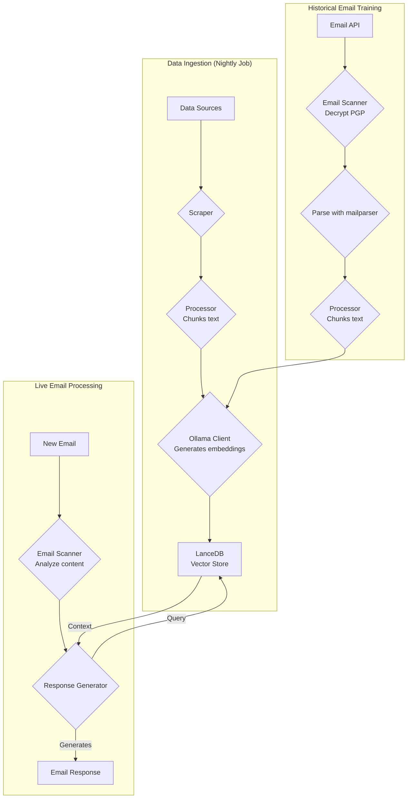
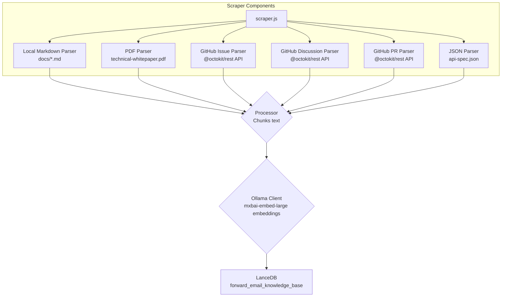
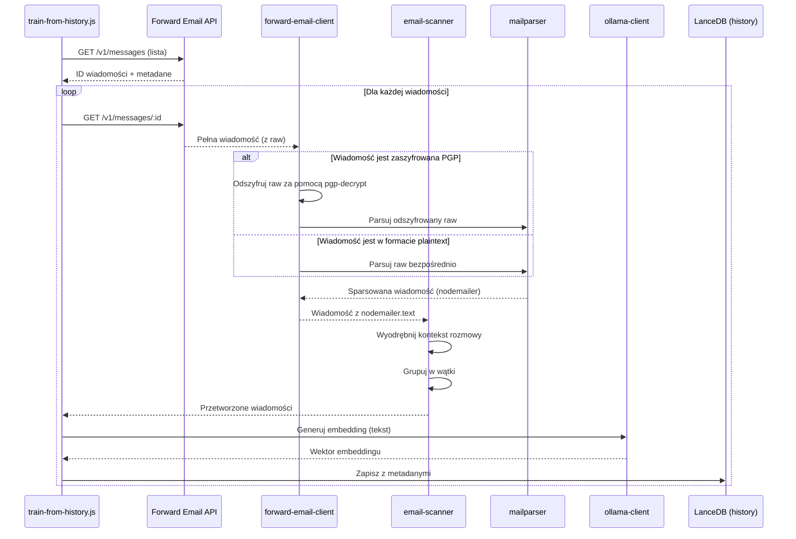

# Budowanie agenta wsparcia klienta AI z priorytetem na prywatność z LanceDB, Ollama i Node.js {#building-a-privacy-first-ai-customer-support-agent-with-lancedb-ollama-and-nodejs}


> \[!NOTE]
> Ten dokument opisuje naszą podróż w budowaniu samodzielnie hostowanego agenta wsparcia AI. Pisaliśmy o podobnych wyzwaniach w naszym wpisie na blogu [Email Startup Graveyard](https://forwardemail.net/blog/docs/email-startup-graveyard-why-80-percent-email-companies-fail). Szczerze rozważaliśmy napisanie kontynuacji zatytułowanej "AI Startup Graveyard", ale może będziemy musieli poczekać jeszcze rok lub dwa, aż bańka AI potencjalnie pęknie(?). Na razie jest to nasz zbiór przemyśleń o tym, co zadziałało, co nie, i dlaczego zrobiliśmy to w ten sposób.

Tak właśnie zbudowaliśmy własnego agenta wsparcia klienta AI. Zrobiliśmy to po trudnej stronie: samodzielnie hostowany, z priorytetem na prywatność i całkowicie pod naszą kontrolą. Dlaczego? Bo nie ufamy usługom zewnętrznym w kwestii danych naszych klientów. To wymóg RODO i DPA, a także właściwe podejście.

To nie był przyjemny weekendowy projekt. To była miesięczna podróż przez zepsute zależności, mylące dokumentacje i ogólny chaos ekosystemu open-source AI w 2025 roku. Ten dokument jest zapisem tego, co zbudowaliśmy, dlaczego to zrobiliśmy i przeszkód, na jakie natrafiliśmy po drodze.


## Spis treści {#table-of-contents}

* [Korzyści dla klienta: wsparcie ludzkie wspomagane AI](#customer-benefits-ai-augmented-human-support)
  * [Szybsze, dokładniejsze odpowiedzi](#faster-more-accurate-responses)
  * [Spójność bez wypalenia](#consistency-without-burnout)
  * [Co otrzymujesz](#what-you-get)
* [Osobista refleksja: dwudziestoletnia praca](#a-personal-reflection-the-two-decade-grind)
* [Dlaczego prywatność ma znaczenie](#why-privacy-matters)
* [Analiza kosztów: AI w chmurze vs samodzielne hostowanie](#cost-analysis-cloud-ai-vs-self-hosted)
  * [Porównanie usług AI w chmurze](#cloud-ai-service-comparison)
  * [Rozbicie kosztów: baza wiedzy 5GB](#cost-breakdown-5gb-knowledge-base)
  * [Koszty sprzętu samodzielnie hostowanego](#self-hosted-hardware-costs)
* [Dogfooding własnego API](#dogfooding-our-own-api)
  * [Dlaczego dogfooding ma znaczenie](#why-dogfooding-matters)
  * [Przykłady użycia API](#api-usage-examples)
  * [Korzyści wydajnościowe](#performance-benefits)
* [Architektura szyfrowania](#encryption-architecture)
  * [Warstwa 1: szyfrowanie skrzynki pocztowej (chacha20-poly1305)](#layer-1-mailbox-encryption-chacha20-poly1305)
  * [Warstwa 2: szyfrowanie wiadomości na poziomie PGP](#layer-2-message-level-pgp-encryption)
  * [Dlaczego to ma znaczenie dla treningu](#why-this-matters-for-training)
  * [Bezpieczeństwo przechowywania](#storage-security)
  * [Lokalne przechowywanie to standardowa praktyka](#local-storage-is-standard-practice)
* [Architektura](#the-architecture)
  * [Przepływ na wysokim poziomie](#high-level-flow)
  * [Szczegółowy przepływ scraper’a](#detailed-scraper-flow)
* [Jak to działa](#how-it-works)
  * [Budowanie bazy wiedzy](#building-the-knowledge-base)
  * [Trening na podstawie historycznych e-maili](#training-from-historical-emails)
  * [Przetwarzanie przychodzących e-maili](#processing-incoming-emails)
  * [Zarządzanie bazą wektorową](#vector-store-management)
* [Cmentarzysko baz danych wektorowych](#the-vector-database-graveyard)
* [Wymagania systemowe](#system-requirements)
* [Konfiguracja zadań Cron](#cron-job-configuration)
  * [Zmienne środowiskowe](#environment-variables)
  * [Zadania Cron dla wielu skrzynek](#cron-jobs-for-multiple-inboxes)
  * [Rozbicie harmonogramu Cron](#cron-schedule-breakdown)
  * [Dynamiczne obliczanie daty](#dynamic-date-calculation)
  * [Początkowa konfiguracja: wyodrębnianie listy URL z mapy strony](#initial-setup-extract-url-list-from-sitemap)
  * [Ręczne testowanie zadań Cron](#testing-cron-jobs-manually)
  * [Monitorowanie logów](#monitoring-logs)
* [Przykłady kodu](#code-examples)
  * [Scraping i przetwarzanie](#scraping-and-processing)
  * [Trening na podstawie historycznych e-maili](#training-from-historical-emails-1)
  * [Zapytania o kontekst](#querying-for-context)
* [Przyszłość: badania i rozwój skanera spamu](#the-future-spam-scanner-rd)
* [Rozwiązywanie problemów](#troubleshooting)
  * [Błąd niezgodności wymiarów wektorów](#vector-dimension-mismatch-error)
  * [Pusty kontekst bazy wiedzy](#empty-knowledge-base-context)
  * [Niepowodzenia deszyfrowania PGP](#pgp-decryption-failures)
* [Wskazówki dotyczące użytkowania](#usage-tips)
  * [Osiągnięcie Inbox Zero](#achieving-inbox-zero)
  * [Używanie etykiety skip-ai](#using-the-skip-ai-label)
  * [Wątkowanie e-maili i odpowiedź do wszystkich](#email-threading-and-reply-all)
  * [Monitorowanie i konserwacja](#monitoring-and-maintenance)
* [Testowanie](#testing)
  * [Uruchamianie testów](#running-tests)
  * [Pokrycie testów](#test-coverage)
  * [Środowisko testowe](#test-environment)
* [Kluczowe wnioski](#key-takeaways)
## Korzyści dla klienta: Wsparcie ludzkie wspomagane AI {#customer-benefits-ai-augmented-human-support}

Nasz system AI nie zastępuje naszego zespołu wsparcia — sprawia, że jest lepszy. Oto, co to dla Ciebie oznacza:

### Szybsze, dokładniejsze odpowiedzi {#faster-more-accurate-responses}

**Człowiek w pętli**: Każdy szkic wygenerowany przez AI jest przeglądany, edytowany i selekcjonowany przez nasz zespół wsparcia przed wysłaniem do Ciebie. AI zajmuje się wstępnymi badaniami i tworzeniem szkicu, uwalniając nasz zespół do kontroli jakości i personalizacji.

**Szkolony na ludzkiej wiedzy**: AI uczy się z:

* Naszej ręcznie napisanej bazy wiedzy i dokumentacji
* Artykułów na blogu i samouczków napisanych przez ludzi
* Naszego obszernego FAQ (napisanego przez ludzi)
* Przeszłych rozmów z klientami (wszystkie prowadzone przez prawdziwych ludzi)

Otrzymujesz odpowiedzi oparte na wieloletnim ludzkim doświadczeniu, tylko dostarczone szybciej.

### Spójność bez wypalenia {#consistency-without-burnout}

Nasz mały zespół obsługuje codziennie setki zgłoszeń wsparcia, z których każde wymaga innej wiedzy technicznej i zmiany kontekstu mentalnego:

* Pytania o rozliczenia wymagają znajomości systemów finansowych
* Problemy z DNS wymagają wiedzy o sieciach
* Integracja API wymaga znajomości programowania
* Raporty bezpieczeństwa wymagają oceny podatności

Bez pomocy AI ta ciągła zmiana kontekstu prowadzi do:

* Wolniejszych czasów odpowiedzi
* Błędów ludzkich spowodowanych zmęczeniem
* Niespójnej jakości odpowiedzi
* Wypalenia zespołu

**Dzięki wsparciu AI** nasz zespół:

* Odpowiada szybciej (AI tworzy szkice w kilka sekund)
* Popełnia mniej błędów (AI wychwytuje typowe pomyłki)
* Utrzymuje stałą jakość (AI korzysta z tej samej bazy wiedzy za każdym razem)
* Pozostaje świeży i skupiony (mniej czasu na badania, więcej na pomoc)

### Co otrzymujesz {#what-you-get}

✅ **Szybkość**: AI tworzy szkice odpowiedzi w kilka sekund, ludzie przeglądają i wysyłają w ciągu minut

✅ **Dokładność**: Odpowiedzi oparte na naszej rzeczywistej dokumentacji i wcześniejszych rozwiązaniach

✅ **Spójność**: Te same wysokiej jakości odpowiedzi, czy jest 9 rano, czy 9 wieczorem

✅ **Ludzki akcent**: Każda odpowiedź jest przeglądana i personalizowana przez nasz zespół

✅ **Brak halucynacji**: AI korzysta tylko z naszej zweryfikowanej bazy wiedzy, a nie z ogólnych danych z internetu

> \[!NOTE]
> **Zawsze rozmawiasz z ludźmi**. AI to asystent badawczy, który pomaga naszemu zespołowi szybciej znaleźć właściwą odpowiedź. Pomyśl o nim jak o bibliotekarzu, który natychmiast znajduje odpowiednią książkę — ale to człowiek ją czyta i tłumaczy Tobie.


## Osobista refleksja: Dwadzieścia lat ciężkiej pracy {#a-personal-reflection-the-two-decade-grind}

Zanim zagłębimy się w techniczne szczegóły, osobista uwaga. Zajmuję się tym od prawie dwóch dekad. Nieskończone godziny przy klawiaturze, nieustanne dążenie do rozwiązania, głęboka, skoncentrowana praca – to jest rzeczywistość budowania czegoś znaczącego. To rzeczywistość, która często jest pomijana w cyklach hype’u nowych technologii.

Niedawny wybuch AI był szczególnie frustrujący. Sprzedaje się nam marzenie o automatyzacji, o asystentach AI, którzy napiszą nasz kod i rozwiążą nasze problemy. Rzeczywistość? Wynik to często śmieciowy kod, który wymaga więcej czasu na naprawę niż napisanie od zera. Obietnica ułatwienia życia jest fałszywa. To rozpraszanie uwagi od ciężkiej, niezbędnej pracy budowania.

A potem jest paradoks wkładu w open-source. Jesteś już rozciągnięty na wszystkie strony, wyczerpany z powodu ciężkiej pracy. Używasz AI, aby pomóc napisać szczegółowy, dobrze zorganizowany raport o błędzie, mając nadzieję, że ułatwi to opiekunom zrozumienie i naprawę problemu. I co się dzieje? Dostajesz reprymendę. Twój wkład jest odrzucany jako „nie na temat” lub niskiego wysiłku, jak widzieliśmy w niedawnym [zgłoszeniu na GitHub Node.js](https://github.com/nodejs/node/issues/60719#issuecomment-3534304321). To policzek dla doświadczonych programistów, którzy po prostu chcą pomóc.

Taka jest rzeczywistość ekosystemu, w którym pracujemy. To nie tylko kwestia zepsutych narzędzi; to kultura, która często nie szanuje czasu i [wysiłku swoich współtwórców](https://forwardemail.net/blog/docs/how-npm-packages-billion-downloads-shaped-javascript-ecosystem). Ten wpis to kronika tej rzeczywistości. To opowieść o narzędziach, tak, ale także o ludzkim koszcie budowania w zepsutym ekosystemie, który mimo wszystkich obietnic jest zasadniczo zepsuty.
## Dlaczego prywatność ma znaczenie {#why-privacy-matters}

Nasz [technical whitepaper](https://forwardemail.net/technical-whitepaper.pdf) szczegółowo omawia naszą filozofię prywatności. Krótkie podsumowanie: nie wysyłamy danych klientów do stron trzecich. Nigdy. Oznacza to brak OpenAI, Anthropic, czy chmurowych baz wektorowych. Wszystko działa lokalnie na naszej infrastrukturze. Jest to niepodważalne dla zgodności z RODO i naszych zobowiązań DPA.


## Analiza kosztów: AI w chmurze vs własny hosting {#cost-analysis-cloud-ai-vs-self-hosted}

Zanim przejdziemy do technicznej implementacji, porozmawiajmy o tym, dlaczego własny hosting ma znaczenie z perspektywy kosztów. Modele cenowe usług AI w chmurze czynią je nieopłacalnymi dla zastosowań o dużej skali, takich jak obsługa klienta.

### Porównanie usług AI w chmurze {#cloud-ai-service-comparison}

| Usługa         | Dostawca            | Koszt osadzania                                                  | Koszt LLM (wejście)                                                       | Koszt LLM (wyjście)     | Polityka prywatności                               | RODO/DPA        | Hosting           | Udostępnianie danych |
| -------------- | ------------------- | ---------------------------------------------------------------- | ------------------------------------------------------------------------- | ----------------------- | -------------------------------------------------- | --------------- | ----------------- | -------------------- |
| **OpenAI**     | OpenAI (USA)        | [$0.02-0.13/1M tokenów](https://openai.com/api/pricing/)         | $0.15-20/1M tokenów                                                       | $0.60-80/1M tokenów     | [Link](https://openai.com/policies/privacy-policy/) | Ograniczone DPA | Azure (USA)       | Tak (trening)         |
| **Claude**     | Anthropic (USA)     | N/D                                                              | [$3-20/1M tokenów](https://docs.claude.com/en/docs/about-claude/pricing) | $15-80/1M tokenów       | [Link](https://www.anthropic.com/legal/privacy)    | Ograniczone DPA | AWS/GCP (USA)     | Nie (zgłoszone)       |
| **Gemini**     | Google (USA)        | [$0.15/1M tokenów](https://ai.google.dev/gemini-api/docs/pricing) | $0.30-1.00/1M tokenów                                                    | $2.50/1M tokenów        | [Link](https://policies.google.com/privacy)        | Ograniczone DPA | GCP (USA)         | Tak (ulepszanie)      |
| **DeepSeek**   | DeepSeek (Chiny)    | N/D                                                              | [$0.028-0.28/1M tokenów](https://api-docs.deepseek.com/quick_start/pricing) | $0.42/1M tokenów        | [Link](https://www.deepseek.com/en)                | Nieznane        | Chiny             | Nieznane              |
| **Mistral**    | Mistral AI (Francja)| [$0.10/1M tokenów](https://mistral.ai/pricing)                   | $0.40/1M tokenów                                                         | $2.00/1M tokenów        | [Link](https://mistral.ai/terms/)                  | RODO UE         | UE                | Nieznane              |
| **Własny hosting** | Ty               | $0 (istniejący sprzęt)                                           | $0 (istniejący sprzęt)                                                   | $0 (istniejący sprzęt)  | Twoja polityka                                    | Pełna zgodność  | MacBook M5 + cron | Nigdy                 |

> \[!WARNING]
> **Obawy dotyczące suwerenności danych**: Dostawcy z USA (OpenAI, Claude, Gemini) podlegają CLOUD Act, który umożliwia rządowi USA dostęp do danych. DeepSeek (Chiny) działa zgodnie z chińskimi przepisami o danych. Mistral (Francja) oferuje hosting w UE i zgodność z RODO, jednak własny hosting pozostaje jedyną opcją pełnej suwerenności i kontroli nad danymi.

### Rozbicie kosztów: baza wiedzy 5GB {#cost-breakdown-5gb-knowledge-base}

Obliczmy koszt przetworzenia bazy wiedzy o wielkości 5GB (typowe dla średniej wielkości firmy z dokumentami, e-mailami i historią wsparcia).

**Założenia:**

* 5GB tekstu ≈ 1,25 miliarda tokenów (zakładając \~4 znaki/token)
* Początkowe generowanie osadzeń
* Miesięczne ponowne trenowanie (pełne ponowne osadzanie)
* 10 000 zapytań wsparcia miesięcznie
* Średnie zapytanie: 500 tokenów wejścia, 300 tokenów wyjścia
**Szczegółowy podział kosztów:**

| Komponent                             | OpenAI           | Claude          | Gemini               | Samodzielnie hostowane |
| ------------------------------------ | ---------------- | --------------- | -------------------- | ---------------------- |
| **Początkowe osadzenie** (1,25 mld tokenów) | 25 000 USD       | N/D             | 187 500 USD          | 0 USD                  |
| **Miesięczne zapytania** (10K × 800 tokenów) | 1 200-16 000 USD | 2 400-16 000 USD | 2 400-3 200 USD      | 0 USD                  |
| **Miesięczne ponowne trenowanie** (1,25 mld tokenów) | 25 000 USD       | N/D             | 187 500 USD          | 0 USD                  |
| **Suma za pierwszy rok**             | 325 200-217 000 USD | 28 800-192 000 USD | 2 278 800-2 226 000 USD | ~60 USD (prąd)         |
| **Zgodność z prywatnością**          | ❌ Ograniczona    | ❌ Ograniczona  | ❌ Ograniczona       | ✅ Pełna                |
| **Suwerenność danych**                | ❌ Nie           | ❌ Nie          | ❌ Nie               | ✅ Tak                  |

> \[!OSTRZEŻENIE]
> **Koszty osadzenia Gemini są katastrofalne** przy 0,15 USD/1M tokenów. Osadzenie bazy wiedzy o wielkości 5 GB kosztowałoby 187 500 USD. To 37 razy drożej niż OpenAI i czyni to całkowicie nieużytecznym do produkcji.

### Koszty sprzętu samodzielnie hostowanego {#self-hosted-hardware-costs}

Nasza konfiguracja działa na istniejącym sprzęcie, który już posiadamy:

* **Sprzęt**: MacBook M5 (już posiadany do rozwoju)
* **Dodatkowy koszt**: 0 USD (używa istniejącego sprzętu)
* **Prąd**: ~5 USD/miesiąc (szacunkowo)
* **Suma za pierwszy rok**: ~60 USD
* **Koszty bieżące**: 60 USD/rok

**Zwrot z inwestycji (ROI)**: Samodzielne hostowanie ma praktycznie zerowy koszt marginalny, ponieważ korzystamy z istniejącego sprzętu deweloperskiego. System działa za pomocą zadań cron w godzinach poza szczytem.


## Dogfooding własnego API {#dogfooding-our-own-api}

Jedną z najważniejszych decyzji architektonicznych było, aby wszystkie zadania AI korzystały bezpośrednio z [Forward Email API](https://forwardemail.net/email-api). To nie tylko dobra praktyka — to wymuszający czynnik optymalizacji wydajności.

### Dlaczego dogfooding ma znaczenie {#why-dogfooding-matters}

Gdy nasze zadania AI korzystają z tych samych punktów końcowych API co nasi klienci:

1. **Wąskie gardła wydajności dotykają nas najpierw** – odczuwamy ból zanim zrobią to klienci
2. **Optymalizacja przynosi korzyści wszystkim** – ulepszenia dla naszych zadań automatycznie poprawiają doświadczenie klientów
3. **Testowanie w rzeczywistych warunkach** – nasze zadania przetwarzają tysiące e-maili, zapewniając ciągłe testy obciążeniowe
4. **Ponowne użycie kodu** – ta sama logika uwierzytelniania, limitowania szybkości, obsługi błędów i buforowania

### Przykłady użycia API {#api-usage-examples}

**Lista wiadomości (train-from-history.js):**

```javascript
// Używa GET /v1/messages?folder=INBOX z BasicAuth
// Wyklucza eml, raw, nodemailer, aby zmniejszyć rozmiar odpowiedzi (potrzebne tylko ID)
const response = await axios.get(
  `${this.apiBase}/v1/messages`,
  {
    params: {
      folder: 'INBOX',
      limit: 100,
      eml: false,
      raw: false,
      nodemailer: false
    },
    auth: {
      username: process.env.FORWARD_EMAIL_ALIAS_USERNAME,
      password: process.env.FORWARD_EMAIL_ALIAS_PASSWORD
    }
  }
);

const messages = response.data;
// Zwraca: [{ id, subject, date, ... }, ...]
// Pełna zawartość wiadomości pobierana później przez GET /v1/messages/:id
```

**Pobieranie pełnych wiadomości (forward-email-client.js):**

```javascript
// Używa GET /v1/messages/:id do pobrania pełnej wiadomości z surową zawartością
const response = await axios.get(
  `${this.apiBase}/v1/messages/${messageId}`,
  {
    auth: {
      username: this.aliasUsername,
      password: this.aliasPassword
    }
  }
);

const message = response.data;
// Zwraca: { id, subject, raw, eml, nodemailer: { ... }, ... }
```

**Tworzenie szkiców odpowiedzi (process-inbox.js):**

```javascript
// Używa POST /v1/messages do tworzenia szkiców odpowiedzi
const response = await axios.post(
  `${this.apiBase}/v1/messages`,
  {
    folder: 'Drafts',
    subject: `Re: ${originalSubject}`,
    to: senderEmail,
    text: generatedResponse,
    inReplyTo: originalMessageId
  },
  {
    auth: {
      username: process.env.FORWARD_EMAIL_ALIAS_USERNAME,
      password: process.env.FORWARD_EMAIL_ALIAS_PASSWORD
    }
  }
);
```
### Korzyści z wydajności {#performance-benefits}

Ponieważ nasze zadania AI działają na tej samej infrastrukturze API:

* **Optymalizacje cache'owania** przynoszą korzyści zarówno zadaniom, jak i klientom
* **Ograniczanie szybkości (rate limiting)** jest testowane pod rzeczywistym obciążeniem
* **Obsługa błędów** jest sprawdzona w praktyce
* **Czasy odpowiedzi API** są stale monitorowane
* **Zapytania do bazy danych** są zoptymalizowane dla obu przypadków użycia
* **Optymalizacja przepustowości** - Wykluczenie `eml`, `raw`, `nodemailer` podczas listowania zmniejsza rozmiar odpowiedzi o \~90%

Gdy `train-from-history.js` przetwarza 1 000 e-maili, wykonuje ponad 1 000 wywołań API. Każda nieefektywność w API staje się natychmiast widoczna. To zmusza nas do optymalizacji dostępu IMAP, zapytań do bazy danych oraz serializacji odpowiedzi — ulepszenia, które bezpośrednio przynoszą korzyści naszym klientom.

**Przykład optymalizacji**: Listowanie 100 wiadomości z pełną zawartością = \~10MB odpowiedzi. Listowanie z `eml: false, raw: false, nodemailer: false` = \~100KB odpowiedzi (100x mniejsza).


## Architektura szyfrowania {#encryption-architecture}

Nasze przechowywanie e-maili wykorzystuje wielowarstwowe szyfrowanie, które zadania AI muszą odszyfrować w czasie rzeczywistym do treningu.

### Warstwa 1: Szyfrowanie skrzynki pocztowej (chacha20-poly1305) {#layer-1-mailbox-encryption-chacha20-poly1305}

Wszystkie skrzynki IMAP są przechowywane jako bazy danych SQLite zaszyfrowane za pomocą **chacha20-poly1305**, kwantowo bezpiecznego algorytmu szyfrowania. Szczegóły znajdują się w naszym [wpisie na blogu o kwantowo bezpiecznej usłudze szyfrowanej poczty](https://forwardemail.net/blog/docs/best-quantum-safe-encrypted-email-service).

**Kluczowe właściwości:**

* **Algorytm**: ChaCha20-Poly1305 (szyfr AEAD)
* **Kwantowo bezpieczny**: Odporny na ataki komputerów kwantowych
* **Przechowywanie**: Pliki bazy danych SQLite na dysku
* **Dostęp**: Odszyfrowywane w pamięci podczas dostępu przez IMAP/API

### Warstwa 2: Szyfrowanie wiadomości na poziomie PGP {#layer-2-message-level-pgp-encryption}

Wiele wiadomości wsparcia jest dodatkowo szyfrowanych za pomocą PGP (standard OpenPGP). Zadania AI muszą je odszyfrować, aby wydobyć zawartość do treningu.

**Przebieg odszyfrowania:**

```javascript
// 1. API zwraca wiadomość z zaszyfrowaną surową zawartością
const message = await forwardEmailClient.getMessage(id);

// 2. Sprawdź, czy surowa zawartość jest zaszyfrowana PGP
if (isMessageEncrypted(message.raw)) {
  // 3. Odszyfruj za pomocą naszego klucza prywatnego
  const decryptedRaw = await pgpDecrypt(message.raw);

  // 4. Parsuj odszyfrowaną wiadomość MIME
  const parsed = await simpleParser(decryptedRaw);

  // 5. Wypełnij nodemailer odszyfrowaną zawartością
  message.nodemailer = {
    text: parsed.text,
    html: parsed.html,
    from: parsed.from,
    to: parsed.to,
    subject: parsed.subject,
    date: parsed.date
  };
}
```

**Konfiguracja PGP:**

```bash
# Klucz prywatny do odszyfrowania (ścieżka do pliku klucza ASCII-armored)
GPG_SECURITY_KEY="/path/to/private-key.asc"

# Hasło do klucza prywatnego (jeśli zaszyfrowany)
GPG_SECURITY_PASSPHRASE="your-passphrase"
```

Pomocnik `pgp-decrypt.js`:

1. Wczytuje klucz prywatny z dysku raz (buforowany w pamięci)
2. Odszyfrowuje klucz za pomocą hasła
3. Używa odszyfrowanego klucza do odszyfrowania wszystkich wiadomości
4. Obsługuje rekurencyjne odszyfrowanie dla zagnieżdżonych zaszyfrowanych wiadomości

### Dlaczego to ma znaczenie dla treningu {#why-this-matters-for-training}

Bez właściwego odszyfrowania AI trenowałoby na zaszyfrowanym bełkocie:

```
-----BEGIN PGP MESSAGE-----
Version: OpenPGP.js v4.10.10

wcBMA8Z3lHJnFnNUAQgAqK7F8...
-----END PGP MESSAGE-----
```

Dzięki odszyfrowaniu AI trenuje na rzeczywistej zawartości:

```
Subject: Re: Bug Report

Hi John,

Thanks for reporting this issue. I've confirmed the bug
and created a fix in PR #1234...
```

### Bezpieczeństwo przechowywania {#storage-security}

Odszyfrowanie odbywa się w pamięci podczas wykonywania zadania, a odszyfrowana zawartość jest konwertowana na osadzenia (embeddings), które następnie są przechowywane w wektorowej bazie danych LanceDB na dysku.

**Gdzie dane są przechowywane:**

* **Baza wektorowa**: Przechowywana na zaszyfrowanych stacjach roboczych MacBook M5
* **Bezpieczeństwo fizyczne**: Stacje robocze pozostają u nas przez cały czas (nie w centrach danych)
* **Szyfrowanie dysku**: Pełne szyfrowanie dysku na wszystkich stacjach roboczych
* **Bezpieczeństwo sieci**: Zapory sieciowe i izolacja od sieci publicznych

**Przyszłe wdrożenie w centrum danych:**
Jeśli kiedykolwiek przejdziemy na hosting w centrum danych, serwery będą miały:

* Pełne szyfrowanie dysku LUKS
* Wyłączony dostęp do USB
* Środki bezpieczeństwa fizycznego
* Izolację sieciową
Dla pełnych informacji o naszych praktykach bezpieczeństwa zobacz naszą [Stronę bezpieczeństwa](https://forwardemail.net/en/security).

> \[!NOTE]
> Baza danych wektorów zawiera osadzenia (reprezentacje matematyczne), a nie oryginalny tekst jawny. Jednak osadzenia mogą potencjalnie zostać odwrócone, dlatego przechowujemy je na zaszyfrowanych, fizycznie zabezpieczonych stacjach roboczych.

### Lokalna pamięć jest standardową praktyką {#local-storage-is-standard-practice}

Przechowywanie osadzeń na stacjach roboczych naszego zespołu nie różni się od tego, jak już obsługujemy e-maile:

* **Thunderbird**: Pobiera i przechowuje pełną zawartość e-maili lokalnie w plikach mbox/maildir
* **Klienci webmail**: Buforują dane e-mail w pamięci przeglądarki i lokalnych bazach danych
* **Klienci IMAP**: Utrzymują lokalne kopie wiadomości do dostępu offline
* **Nasz system AI**: Przechowuje matematyczne osadzenia (nie tekst jawny) w LanceDB

Kluczowa różnica: osadzenia są **bezpieczniejsze** niż tekst jawny e-mail, ponieważ są:

1. Reprezentacjami matematycznymi, a nie czytelnym tekstem
2. Trudniejsze do odwrócenia niż tekst jawny
3. Nadal podlegają tym samym zabezpieczeniom fizycznym co nasi klienci e-mail

Jeśli dla naszego zespołu jest dopuszczalne używanie Thunderbirda lub webmaila na zaszyfrowanych stacjach roboczych, równie dopuszczalne (a nawet bardziej bezpieczne) jest przechowywanie osadzeń w ten sam sposób.


## Architektura {#the-architecture}

Oto podstawowy przepływ. Wygląda prosto. Nie było.

> \[!NOTE]
> Wszystkie zadania korzystają bezpośrednio z API Forward Email, co zapewnia, że optymalizacje wydajności korzystają zarówno nasz system AI, jak i nasi klienci.

### Przepływ wysokiego poziomu {#high-level-flow}



### Szczegółowy przepływ Scraper {#detailed-scraper-flow}

`scraper.js` jest sercem pobierania danych. To zbiór parserów dla różnych formatów danych.




## Jak to działa {#how-it-works}

Proces jest podzielony na trzy główne części: budowanie bazy wiedzy, trenowanie na podstawie historycznych e-maili oraz przetwarzanie nowych e-maili.

### Budowanie bazy wiedzy {#building-the-knowledge-base}

**`update-knowledge-base.js`**: To główne zadanie. Uruchamia się co noc, czyści starą bazę wektorów i buduje ją od nowa. Używa `scraper.js` do pobierania treści ze wszystkich źródeł, `processor.js` do dzielenia tekstu na fragmenty oraz `ollama-client.js` do generowania osadzeń. Na koniec `vector-store.js` zapisuje wszystko w LanceDB.

**Źródła danych:**

* Lokalne pliki Markdown (`docs/*.md`)
* Techniczny dokument PDF (`assets/technical-whitepaper.pdf`)
* Specyfikacja API w JSON (`assets/api-spec.json`)
* Zgłoszenia GitHub (przez Octokit)
* Dyskusje GitHub (przez Octokit)
* Pull requesty GitHub (przez Octokit)
* Lista URL sitemap (`$LANCEDB_PATH/valid-urls.json`)

### Trenowanie na podstawie historycznych e-maili {#training-from-historical-emails}

**`train-from-history.js`**: To zadanie skanuje historyczne e-maile ze wszystkich folderów, odszyfrowuje wiadomości zaszyfrowane PGP i dodaje je do osobnej bazy wektorów (`customer_support_history`). Zapewnia to kontekst z poprzednich interakcji wsparcia.
**Przepływ przetwarzania e-maili:**



**Kluczowe funkcje:**

* **Odszyfrowanie PGP**: Używa helpera `pgp-decrypt.js` z zmienną środowiskową `GPG_SECURITY_KEY`
* **Grupowanie wątków**: Grupuje powiązane e-maile w wątki konwersacji
* **Zachowanie metadanych**: Przechowuje folder, temat, datę, status szyfrowania
* **Kontekst odpowiedzi**: Łączy wiadomości z ich odpowiedziami dla lepszego kontekstu

**Konfiguracja:**

```bash
# Zmienne środowiskowe dla train-from-history
HISTORY_SCAN_LIMIT=1000              # Maksymalna liczba wiadomości do przetworzenia
HISTORY_SCAN_SINCE="2024-01-01"      # Przetwarzaj tylko wiadomości po tej dacie
HISTORY_DECRYPT_PGP=true             # Próba odszyfrowania PGP
GPG_SECURITY_KEY="/path/to/key.asc"  # Ścieżka do prywatnego klucza PGP
GPG_SECURITY_PASSPHRASE="passphrase" # Hasło do klucza (opcjonalne)
```

**Co jest przechowywane:**

```javascript
{
  type: 'historical_email',
  folder: 'INBOX',
  subject: 'Re: Bug Report',
  date: '2025-01-15T10:30:00Z',
  messageId: '67e2f288893921...',
  threadId: 'Bug Report',
  hasReply: true,
  encrypted: true,
  decrypted: true,
  replySubject: 'Bug Report',
  replyText: 'First 500 chars of reply...',
  chunkSize: 1000,
  chunkOverlap: 200,
  chunkIndex: 0
}
```

> \[!TIP]
> Uruchom `train-from-history` po wstępnej konfiguracji, aby wypełnić kontekst historyczny. Znacząco poprawia to jakość odpowiedzi, ucząc się na podstawie wcześniejszych interakcji wsparcia.

### Przetwarzanie przychodzących e-maili {#processing-incoming-emails}

**`process-inbox.js`**: To zadanie działa na e-mailach w naszych skrzynkach `support@forwardemail.net`, `abuse@forwardemail.net` oraz `security@forwardemail.net` (konkretnie w folderze IMAP `INBOX`). Wykorzystuje nasze API pod adresem <https://forwardemail.net/email-api> (np. `GET /v1/messages?folder=INBOX` z dostępem BasicAuth przy użyciu danych IMAP dla każdej skrzynki). Analizuje zawartość e-maila, zapytuje zarówno bazę wiedzy (`forward_email_knowledge_base`), jak i historyczny wektorowy magazyn e-maili (`customer_support_history`), a następnie przekazuje połączony kontekst do `response-generator.js`. Generator używa `mxbai-embed-large` przez Ollama do stworzenia odpowiedzi.

**Funkcje automatycznego przepływu pracy:**

1. **Automatyzacja Inbox Zero**: Po pomyślnym utworzeniu szkicu, oryginalna wiadomość jest automatycznie przenoszona do folderu Archiwum. Utrzymuje to czystość skrzynki odbiorczej i pomaga osiągnąć inbox zero bez ręcznej interwencji.

2. **Pominięcie przetwarzania AI**: Wystarczy dodać etykietę `skip-ai` (niezależnie od wielkości liter) do dowolnej wiadomości, aby zapobiec przetwarzaniu przez AI. Wiadomość pozostanie nienaruszona w skrzynce odbiorczej, umożliwiając ręczne jej obsłużenie. Przydatne dla wiadomości wrażliwych lub skomplikowanych przypadków wymagających ludzkiej oceny.

3. **Poprawne wątkowanie e-maili**: Wszystkie szkice odpowiedzi zawierają oryginalną wiadomość cytowaną poniżej (używając standardowego prefiksu ` >  `), zgodnie z konwencją odpowiedzi e-mail z formatem "W dniu \[data\], \[nadawca\] napisał:". Zapewnia to właściwy kontekst rozmowy i wątkowanie w klientach poczty.

4. **Zachowanie funkcji Odpowiedz do wszystkich**: System automatycznie obsługuje nagłówki Reply-To i odbiorców CC:
   * Jeśli istnieje nagłówek Reply-To, staje się on adresem Do, a oryginalny From jest dodany do CC
   * Wszyscy oryginalni odbiorcy Do i CC są uwzględnieni w CC odpowiedzi (z wyjątkiem Twojego własnego adresu)
   * Postępuje zgodnie ze standardowymi konwencjami odpowiedzi do wszystkich w rozmowach grupowych
**Ranking źródeł**: System używa **ważonego rankingu** do priorytetyzacji źródeł:

* FAQ: 100% (najwyższy priorytet)
* Biała księga techniczna: 95%
* Specyfikacja API: 90%
* Oficjalna dokumentacja: 85%
* Zgłoszenia na GitHub: 70%
* Historyczne e-maile: 50%

### Zarządzanie magazynem wektorów {#vector-store-management}

Klasa `VectorStore` w `helpers/customer-support-ai/vector-store.js` jest naszym interfejsem do LanceDB.

**Dodawanie dokumentów:**

```javascript
// vector-store.js
async addDocument(text, metadata) {
  const embedding = await this.ollama.generateEmbedding(text);
  await this.table.add([{
    vector: embedding,
    text,
    ...metadata
  }]);
}
```

**Czyszczenie magazynu:**

```javascript
// Opcja 1: Użyj metody clear()
await vectorStore.clear();

// Opcja 2: Usuń lokalny katalog bazy danych
await fs.rm(process.env.LANCEDB_PATH, { recursive: true, force: true });
```

Zmienna środowiskowa `LANCEDB_PATH` wskazuje na lokalny katalog wbudowanej bazy danych. LanceDB jest bezserwerowy i wbudowany, więc nie ma osobnego procesu do zarządzania.


## Cmentarzysko baz danych wektorowych {#the-vector-database-graveyard}

To był pierwszy poważny problem. Przetestowaliśmy wiele baz danych wektorowych, zanim zdecydowaliśmy się na LanceDB. Oto co poszło nie tak z każdą z nich.

| Baza danych  | GitHub                                                      | Co poszło nie tak                                                                                                                                                                                                    | Konkretne problemy                                                                                                                                                                                                                                                                                                                                                       | Obawy dotyczące bezpieczeństwa                                                                                                                                                                                   |
| ------------ | ----------------------------------------------------------- | -------------------------------------------------------------------------------------------------------------------------------------------------------------------------------------------------------------------- | ------------------------------------------------------------------------------------------------------------------------------------------------------------------------------------------------------------------------------------------------------------------------------------------------------------------------------------------------------------------------- | ---------------------------------------------------------------------------------------------------------------------------------------------------------------------------------------------------------------- |
| **ChromaDB** | [chroma-core/chroma](https://github.com/chroma-core/chroma) | `pip3 install chromadb` daje wersję z epoki kamienia z `PydanticImportError`. Jedynym sposobem na działającą wersję jest kompilacja ze źródła. Nieprzyjazne dla deweloperów.                                         | Chaos zależności Pythona. Wielu użytkowników zgłasza problemy z instalacją pip ([#774](https://github.com/chroma-core/chroma/issues/774), [#163](https://github.com/chroma-core/chroma/issues/163)). Dokumentacja mówi "po prostu użyj Dockera", co nie jest odpowiedzią dla lokalnego rozwoju. Aplikacja się zawiesza na Windows przy >99 rekordach ([#3058](https://github.com/chroma-core/chroma/issues/3058)). | **CVE-2024-45848**: Wykonanie dowolnego kodu przez integrację ChromaDB w MindsDB. Krytyczne luki w obrazie Dockera ([#3170](https://github.com/chroma-core/chroma/issues/3170)).                                         |
| **Qdrant**   | [qdrant/qdrant](https://github.com/qdrant/qdrant)           | Homebrew tap (`qdrant/qdrant/qdrant`) wymieniony w ich starej dokumentacji zniknął. Bez wyjaśnienia. Oficjalna dokumentacja teraz mówi tylko "użyj Dockera".                                                           | Brak Homebrew tap. Brak natywnego binarnego pliku dla macOS. Tylko Docker utrudnia szybkie lokalne testy.                                                                                                                                                                                                                                                               | **CVE-2024-2221**: Luka umożliwiająca zdalne wykonanie kodu przez przesyłanie dowolnych plików (naprawione w v1.9.0). Słaby wynik dojrzałości bezpieczeństwa wg [IronCore Labs](https://ironcorelabs.com/vectordbs/qdrant-security/). |
| **Weaviate** | [weaviate/weaviate](https://github.com/weaviate/weaviate)   | Wersja Homebrew miała krytyczny błąd klastrowania (`leader not found`). Udokumentowane flagi naprawcze (`RAFT_JOIN`, `CLUSTER_HOSTNAME`) nie działały. Fundamentalnie uszkodzony dla konfiguracji jednouwęzłowych.    | Błędy klastrowania nawet w trybie jednouwęzłowym. Przesadnie rozbudowany dla prostych zastosowań.                                                                                                                                                                                                                                                                       | Brak poważnych CVE, ale złożoność zwiększa powierzchnię ataku.                                                                                                                                                   |
| **LanceDB**  | [lancedb/lancedb](https://github.com/lancedb/lancedb)       | Ten działał. Jest wbudowany i bezserwerowy. Brak osobnego procesu. Jedyną niedogodnością jest myląca nazwa pakietu (`vectordb` jest przestarzałe, używaj `@lancedb/lancedb`) oraz rozproszona dokumentacja. Możemy z tym żyć. | Mylące nazewnictwo pakietów (`vectordb` vs `@lancedb/lancedb`), ale poza tym solidny. Architektura wbudowana eliminuje całe klasy problemów bezpieczeństwa.                                                                                                                                                                                                             | Brak znanych CVE. Wbudowany design oznacza brak powierzchni ataku sieciowego.                                                                                                                                     |
> \[!WARNING]
> **ChromaDB ma krytyczne luki bezpieczeństwa.** [CVE-2024-45848](https://nvd.nist.gov/vuln/detail/CVE-2024-45848) umożliwia wykonanie dowolnego kodu. Instalacja przez pip jest zasadniczo uszkodzona z powodu problemów z zależnością Pydantic. Unikaj używania w produkcji.

> \[!WARNING]
> **Qdrant miał lukę RCE w przesyłaniu plików** ([CVE-2024-2221](https://qdrant.tech/blog/cve-2024-2221-response/)), która została naprawiona dopiero w wersji v1.9.0. Jeśli musisz używać Qdrant, upewnij się, że masz najnowszą wersję.

> \[!CAUTION]
> Ekosystem open-source baz wektorowych jest niestabilny. Nie ufaj dokumentacji. Zakładaj, że wszystko jest zepsute, dopóki nie udowodnisz inaczej. Testuj lokalnie przed podjęciem decyzji o stosie.


## Wymagania systemowe {#system-requirements}

* **Node.js:** v18.0.0+ ([GitHub](https://github.com/nodejs/node))
* **Ollama:** Najnowsza ([GitHub](https://github.com/ollama/ollama))
* **Model:** `mxbai-embed-large` przez Ollama
* **Baza wektorowa:** LanceDB ([GitHub](https://github.com/lancedb/lancedb))
* **Dostęp do GitHub:** `@octokit/rest` do pobierania zgłoszeń ([GitHub](https://github.com/octokit/rest.js))
* **SQLite:** Do głównej bazy danych (przez `mongoose-to-sqlite`)


## Konfiguracja zadania Cron {#cron-job-configuration}

Wszystkie zadania AI uruchamiane są przez cron na MacBooku M5. Oto jak skonfigurować zadania cron, aby działały o północy dla wielu skrzynek odbiorczych.

### Zmienne środowiskowe {#environment-variables}

Zadania wymagają tych zmiennych środowiskowych. Większość można ustawić w pliku `.env` (ładowanym przez `@ladjs/env`), ale `HISTORY_SCAN_SINCE` musi być obliczane dynamicznie w crontabie.

**W pliku `.env`:**

```bash
# Dane uwierzytelniające Forward Email API (zmieniają się dla każdej skrzynki)
FORWARD_EMAIL_ALIAS_USERNAME=support@forwardemail.net
FORWARD_EMAIL_ALIAS_PASSWORD=twoje-haslo-imap

# Deszyfrowanie PGP (wspólne dla wszystkich skrzynek)
GPG_SECURITY_KEY=/sciezka/do/klucza-prywatnego.asc
GPG_SECURITY_PASSPHRASE=twoje-haslo

# Konfiguracja skanowania historii
HISTORY_SCAN_LIMIT=1000

# Ścieżka LanceDB
LANCEDB_PATH=/sciezka/do/lancedb
```

**W crontabie (obliczane dynamicznie):**

```bash
# HISTORY_SCAN_SINCE musi być ustawione inline w crontabie z użyciem polecenia shell date
# Nie może być w pliku .env, ponieważ @ladjs/env nie wykonuje poleceń shell
HISTORY_SCAN_SINCE="$(date -v-1d +%Y-%m-%d)"  # macOS
HISTORY_SCAN_SINCE="$(date -d 'yesterday' +%Y-%m-%d)"  # Linux
```

### Zadania Cron dla wielu skrzynek {#cron-jobs-for-multiple-inboxes}

Edytuj swój crontab poleceniem `crontab -e` i dodaj:

```bash
# Aktualizacja bazy wiedzy (uruchamiane raz, współdzielone dla wszystkich skrzynek)
0 0 * * * cd /sciezka/do/forwardemail.net && LANCEDB_PATH="/sciezka/do/lancedb" GPG_SECURITY_KEY="/sciezka/do/klucza.asc" GPG_SECURITY_PASSPHRASE="haslo" node jobs/customer-support-ai/update-knowledge-base.js >> /var/log/update-knowledge-base.log 2>&1

# Trening na podstawie historii - support@forwardemail.net
0 0 * * * cd /sciezka/do/forwardemail.net && FORWARD_EMAIL_ALIAS_USERNAME="support@forwardemail.net" FORWARD_EMAIL_ALIAS_PASSWORD="haslo-support" HISTORY_SCAN_SINCE="$(date -v-1d +%Y-%m-%d)" HISTORY_SCAN_LIMIT=1000 GPG_SECURITY_KEY="/sciezka/do/klucza.asc" GPG_SECURITY_PASSPHRASE="haslo" LANCEDB_PATH="/sciezka/do/lancedb" node jobs/customer-support-ai/train-from-history.js >> /var/log/train-support.log 2>&1

# Trening na podstawie historii - abuse@forwardemail.net
0 0 * * * cd /sciezka/do/forwardemail.net && FORWARD_EMAIL_ALIAS_USERNAME="abuse@forwardemail.net" FORWARD_EMAIL_ALIAS_PASSWORD="haslo-abuse" HISTORY_SCAN_SINCE="$(date -v-1d +%Y-%m-%d)" HISTORY_SCAN_LIMIT=1000 GPG_SECURITY_KEY="/sciezka/do/klucza.asc" GPG_SECURITY_PASSPHRASE="haslo" LANCEDB_PATH="/sciezka/do/lancedb" node jobs/customer-support-ai/train-from-history.js >> /var/log/train-abuse.log 2>&1

# Trening na podstawie historii - security@forwardemail.net
0 0 * * * cd /sciezka/do/forwardemail.net && FORWARD_EMAIL_ALIAS_USERNAME="security@forwardemail.net" FORWARD_EMAIL_ALIAS_PASSWORD="haslo-security" HISTORY_SCAN_SINCE="$(date -v-1d +%Y-%m-%d)" HISTORY_SCAN_LIMIT=1000 GPG_SECURITY_KEY="/sciezka/do/klucza.asc" GPG_SECURITY_PASSPHRASE="haslo" LANCEDB_PATH="/sciezka/do/lancedb" node jobs/customer-support-ai/train-from-history.js >> /var/log/train-security.log 2>&1

# Przetwarzanie skrzynki - support@forwardemail.net
*/5 * * * * cd /sciezka/do/forwardemail.net && FORWARD_EMAIL_ALIAS_USERNAME="support@forwardemail.net" FORWARD_EMAIL_ALIAS_PASSWORD="haslo-support" GPG_SECURITY_KEY="/sciezka/do/klucza.asc" GPG_SECURITY_PASSPHRASE="haslo" LANCEDB_PATH="/sciezka/do/lancedb" node jobs/customer-support-ai/process-inbox.js >> /var/log/process-support.log 2>&1

# Przetwarzanie skrzynki - abuse@forwardemail.net
*/5 * * * * cd /sciezka/do/forwardemail.net && FORWARD_EMAIL_ALIAS_USERNAME="abuse@forwardemail.net" FORWARD_EMAIL_ALIAS_PASSWORD="haslo-abuse" GPG_SECURITY_KEY="/sciezka/do/klucza.asc" GPG_SECURITY_PASSPHRASE="haslo" LANCEDB_PATH="/sciezka/do/lancedb" node jobs/customer-support-ai/process-inbox.js >> /var/log/process-abuse.log 2>&1

# Przetwarzanie skrzynki - security@forwardemail.net
*/5 * * * * cd /sciezka/do/forwardemail.net && FORWARD_EMAIL_ALIAS_USERNAME="security@forwardemail.net" FORWARD_EMAIL_ALIAS_PASSWORD="haslo-security" GPG_SECURITY_KEY="/sciezka/do/klucza.asc" GPG_SECURITY_PASSPHRASE="haslo" LANCEDB_PATH="/sciezka/do/lancedb" node jobs/customer-support-ai/process-inbox.js >> /var/log/process-security.log 2>&1
```
### Cron Schedule Breakdown {#cron-schedule-breakdown}

| Job                     | Harmonogram  | Opis                                                                              |
| ----------------------- | ------------ | --------------------------------------------------------------------------------- |
| `train-from-sitemap.js` | `0 0 * * 0`  | Co tydzień (niedziela o północy) - Pobiera wszystkie URL z mapy witryny i trenuje bazę wiedzy |
| `train-from-history.js` | `0 0 * * *`  | Codziennie o północy - Skanuje maile z poprzedniego dnia dla każdej skrzynki      |
| `process-inbox.js`      | `*/5 * * * *`| Co 5 minut - Przetwarza nowe maile i generuje szkice                             |

### Dynamic Date Calculation {#dynamic-date-calculation}

Zmienna `HISTORY_SCAN_SINCE` **musi być obliczana inline w crontabie**, ponieważ:

1. Pliki `.env` są odczytywane jako dosłowne ciągi znaków przez `@ladjs/env`
2. Podstawienie polecenia powłoki `$(...)` nie działa w plikach `.env`
3. Data musi być obliczana na nowo za każdym razem, gdy uruchamia się cron

**Poprawne podejście (w crontabie):**

```bash
# macOS (BSD date)
HISTORY_SCAN_SINCE="$(date -v-1d +%Y-%m-%d)" node jobs/...

# Linux (GNU date)
HISTORY_SCAN_SINCE="$(date -d 'yesterday' +%Y-%m-%d)" node jobs/...
```

**Niepoprawne podejście (nie działa w .env):**

```bash
# To zostanie odczytane jako dosłowny ciąg znaków "$(date -v-1d +%Y-%m-%d)"
# NIE jest wykonywane jako polecenie powłoki
HISTORY_SCAN_SINCE=$(date -v-1d +%Y-%m-%d)
```

Zapewnia to, że każde nocne uruchomienie dynamicznie oblicza datę poprzedniego dnia, unikając zbędnej pracy.

### Initial Setup: Extract URL List from Sitemap {#initial-setup-extract-url-list-from-sitemap}

Przed pierwszym uruchomieniem zadania process-inbox **musisz** wyodrębnić listę URL z mapy witryny. Tworzy to słownik ważnych URL, do których LLM może się odwoływać i zapobiega halucynacjom URL.

```bash
# Pierwsza konfiguracja: wyodrębnij listę URL z mapy witryny
cd /path/to/forwardemail.net
node jobs/customer-support-ai/train-from-sitemap.js
```

**Co to robi:**

1. Pobiera wszystkie URL z <https://forwardemail.net/sitemap.xml>
2. Filtruje tylko URL nie zlokalizowane lub z /en/ (unika duplikatów treści)
3. Usuwa prefiksy lokalizacji (/en/faq → /faq)
4. Zapisuje prosty plik JSON z listą URL do `$LANCEDB_PATH/valid-urls.json`
5. Bez crawl’owania, bez zbierania metadanych – tylko płaska lista ważnych URL

**Dlaczego to jest ważne:**

* Zapobiega halucynacjom LLM fałszywych URL jak `/dashboard` czy `/login`
* Dostarcza białą listę ważnych URL, do których generator odpowiedzi może się odwołać
* Proste, szybkie i nie wymaga przechowywania w bazie wektorowej
* Generator odpowiedzi ładuje tę listę przy starcie i uwzględnia ją w promptcie

**Dodaj do crontaba dla cotygodniowych aktualizacji:**

```bash
# Wyodrębnij listę URL z mapy witryny - co tydzień w niedzielę o północy
0 0 * * 0 cd /path/to/forwardemail.net && node jobs/customer-support-ai/train-from-sitemap.js >> /var/log/train-sitemap.log 2>&1
```

### Testing Cron Jobs Manually {#testing-cron-jobs-manually}

Aby przetestować zadanie przed dodaniem do crona:

```bash
# Test treningu z mapy witryny
cd /path/to/forwardemail.net
export LANCEDB_PATH="/path/to/lancedb"
node jobs/customer-support-ai/train-from-sitemap.js

# Test treningu skrzynki wsparcia
cd /path/to/forwardemail.net
export FORWARD_EMAIL_ALIAS_USERNAME="support@forwardemail.net"
export FORWARD_EMAIL_ALIAS_PASSWORD="support-password"
export HISTORY_SCAN_SINCE="$(date -v-1d +%Y-%m-%d)"
export HISTORY_SCAN_LIMIT=1000
export GPG_SECURITY_KEY="/path/to/key.asc"
export GPG_SECURITY_PASSPHRASE="pass"
export LANCEDB_PATH="/path/to/lancedb"
node jobs/customer-support-ai/train-from-history.js
```

### Monitoring Logs {#monitoring-logs}

Każde zadanie loguje do osobnego pliku dla łatwego debugowania:

```bash
# Obserwuj przetwarzanie skrzynki wsparcia w czasie rzeczywistym
tail -f /var/log/process-support.log

# Sprawdź ostatnie nocne uruchomienie treningu
cat /var/log/train-support.log | grep "$(date -v-1d +%Y-%m-%d)"

# Zobacz wszystkie błędy ze wszystkich zadań
grep -i error /var/log/train-*.log /var/log/process-*.log
```

> \[!TIP]
> Używaj osobnych plików logów dla każdej skrzynki, aby izolować problemy. Jeśli jedna skrzynka ma problemy z uwierzytelnianiem, nie zanieczyści logów innych skrzynek.
## Przykłady kodu {#code-examples}

### Scraping i przetwarzanie {#scraping-and-processing}

```javascript
// jobs/customer-support-ai/update-knowledge-base.js
const scraper = new Scraper();
const processor = new Processor();
const ollamaClient = new OllamaClient();
const vectorStore = new VectorStore();

// Wyczyść stare dane
await vectorStore.clear();

// Zeskrob wszystkie źródła
const documents = await scraper.scrapeAll();
console.log(`Zeskrobano ${documents.length} dokumentów`);

// Przetwórz na fragmenty
const allChunks = [];
for (const doc of documents) {
  const chunks = processor.processDocuments([doc]);
  allChunks.push(...chunks);
}
console.log(`Wygenerowano ${allChunks.length} fragmentów`);

// Wygeneruj osadzenia i zapisz
const texts = allChunks.map(chunk => chunk.text);
const embeddings = await ollamaClient.generateEmbeddings(texts);

for (let i = 0; i < allChunks.length; i++) {
  await vectorStore.addDocument(texts[i], {
    ...allChunks[i].metadata,
    embedding: embeddings[i]
  });
}
```

### Trening na podstawie historycznych e-maili {#training-from-historical-emails-1}

```javascript
// jobs/customer-support-ai/train-from-history.js
const scanner = new EmailScanner({
  forwardEmailApiBase: config.forwardEmailApiBase,
  forwardEmailAliasUsername: config.forwardEmailAliasUsername,
  forwardEmailAliasPassword: config.forwardEmailAliasPassword
});

const vectorStore = new VectorStore({
  collectionName: 'customer_support_history'
});

// Skanuj wszystkie foldery (INBOX, Wysłane, itd.)
const messages = await scanner.scanAllFolders({
  limit: 1000,
  since: new Date('2024-01-01'),
  decryptPGP: true
});

// Grupuj w wątki konwersacji
const threads = scanner.groupIntoThreads(messages);

// Przetwarzaj każdy wątek
for (const thread of threads) {
  const context = scanner.extractConversationContext(thread);

  for (const message of context.messages) {
    // Pomijaj zaszyfrowane wiadomości, których nie udało się odszyfrować
    if (message.encrypted && !message.decrypted) continue;

    // Użyj już sparsowanej treści z nodemailer
    const text = message.nodemailer?.text || '';
    if (!text.trim()) continue;

    // Podziel na fragmenty i zapisz
    const chunks = processor.chunkText(`Temat: ${message.subject}\n\n${text}`, {
      chunkSize: 1000,
      chunkOverlap: 200
    });

    for (const chunk of chunks) {
      await vectorStore.addDocument(chunk.text, {
        type: 'historical_email',
        folder: message.folder,
        subject: message.subject,
        date: message.nodemailer?.date || message.created_at,
        messageId: message.id,
        threadId: context.subject,
        encrypted: message.encrypted || false,
        decrypted: message.decrypted || false,
        ...chunk.metadata
      });
    }
  }
}
```

### Zapytania o kontekst {#querying-for-context}

```javascript
// jobs/customer-support-ai/process-inbox.js
const vectorStore = new VectorStore();
const historyVectorStore = new VectorStore({
  collectionName: 'customer_support_history'
});

// Zapytaj oba magazyny
const knowledgeContext = await vectorStore.query(emailEmbedding, { limit: 8 });
const historyContext = await historyVectorStore.query(emailEmbedding, { limit: 3 });

// Tutaj odbywa się ważona klasyfikacja i deduplikacja
const rankedContext = rankAndDeduplicateContext(knowledgeContext, historyContext);

// Wygeneruj odpowiedź
const response = await responseGenerator.generate(email, rankedContext);
```


## Przyszłość: badania i rozwój skanera spamu {#the-future-spam-scanner-rd}

Ten cały projekt nie był tylko dla obsługi klienta. To były badania i rozwój. Teraz możemy wykorzystać wszystko, czego nauczyliśmy się o lokalnych osadzeniach, magazynach wektorów i pobieraniu kontekstu i zastosować to w naszym kolejnym dużym projekcie: warstwie LLM dla [Spam Scanner](https://spamscanner.net). Te same zasady prywatności, samodzielnego hostingu i semantycznego rozumienia będą kluczowe.


## Rozwiązywanie problemów {#troubleshooting}

### Błąd niezgodności wymiaru wektora {#vector-dimension-mismatch-error}

**Błąd:**

```
Error: Failed to execute query stream: GenericFailure, Invalid input, No vector column found to match with the query vector dimension: 1024
```

**Przyczyna:** Ten błąd występuje, gdy zmienisz model osadzeń (np. z `mistral-small` na `mxbai-embed-large`), ale istniejąca baza danych LanceDB została utworzona z innym wymiarem wektora.
**Rozwiązanie:** Musisz ponownie wytrenować bazę wiedzy z nowym modelem osadzania:

```bash
# 1. Zatrzymaj wszystkie działające zadania AI obsługi klienta
pkill -f customer-support-ai

# 2. Usuń istniejącą bazę danych LanceDB
rm -rf ~/.local/share/lancedb/forward_email_knowledge_base.lance
rm -rf ~/.local/share/lancedb/customer_support_history.lance

# 3. Sprawdź, czy model osadzania jest poprawnie ustawiony w .env
grep OLLAMA_EMBEDDING_MODEL .env
# Powinno pokazać: OLLAMA_EMBEDDING_MODEL=mxbai-embed-large

# 4. Pobierz model osadzania w Ollama
ollama pull mxbai-embed-large

# 5. Ponownie wytrenuj bazę wiedzy
node jobs/customer-support-ai/train-from-history.js

# 6. Uruchom ponownie zadanie process-inbox przez Bree
# Zadanie będzie automatycznie uruchamiane co 5 minut
```

**Dlaczego tak się dzieje:** Różne modele osadzania generują wektory o różnych wymiarach:

* `mistral-small`: 1024 wymiary
* `mxbai-embed-large`: 1024 wymiary
* `nomic-embed-text`: 768 wymiarów
* `all-minilm`: 384 wymiary

LanceDB przechowuje wymiar wektora w schemacie tabeli. Gdy zapytanie jest wykonywane z innym wymiarem, kończy się niepowodzeniem. Jedynym rozwiązaniem jest odtworzenie bazy danych z nowym modelem.

### Pusty kontekst bazy wiedzy {#empty-knowledge-base-context}

**Objaw:**

```
debug     Retrieved knowledge base context {
  total: 0,
  afterRanking: 0,
  questionType: 'capability'
}
```

**Przyczyna:** Baza wiedzy nie została jeszcze wytrenowana lub tabela LanceDB nie istnieje.

**Rozwiązanie:** Uruchom zadanie treningowe, aby wypełnić bazę wiedzy:

```bash
# Trening na podstawie historycznych e-maili
node jobs/customer-support-ai/train-from-history.js

# Lub trening na podstawie strony internetowej/dokumentacji (jeśli masz scraper)
node jobs/customer-support-ai/train-from-website.js
```

### Błędy odszyfrowywania PGP {#pgp-decryption-failures}

**Objaw:** Wiadomości są oznaczone jako zaszyfrowane, ale zawartość jest pusta.

**Rozwiązanie:**

1. Sprawdź, czy ścieżka do klucza GPG jest poprawnie ustawiona:

```bash
grep GPG_SECURITY_KEY .env
# Powinna wskazywać na plik twojego klucza prywatnego
```

2. Przetestuj odszyfrowanie ręcznie:

```bash
node -e "const decrypt = require('./helpers/customer-support-ai/pgp-decrypt'); decrypt.testDecryption();"
```

3. Sprawdź uprawnienia klucza:

```bash
ls -la /path/to/your/gpg-key.asc
# Powinien być czytelny dla użytkownika uruchamiającego zadanie
```


## Wskazówki dotyczące użytkowania {#usage-tips}

### Osiąganie zera w skrzynce odbiorczej {#achieving-inbox-zero}

System jest zaprojektowany, aby automatycznie pomóc Ci osiągnąć zero w skrzynce odbiorczej:

1. **Automatyczne archiwizowanie**: Gdy szkic zostanie pomyślnie utworzony, oryginalna wiadomość jest automatycznie przenoszona do folderu Archiwum. Dzięki temu Twoja skrzynka odbiorcza pozostaje czysta bez ręcznej interwencji.

2. **Przeglądanie szkiców**: Regularnie sprawdzaj folder Szkice, aby przejrzeć odpowiedzi generowane przez AI. Edytuj je w razie potrzeby przed wysłaniem.

3. **Ręczne nadpisanie**: Dla wiadomości wymagających specjalnej uwagi, po prostu dodaj etykietę `skip-ai` przed uruchomieniem zadania.

### Używanie etykiety skip-ai {#using-the-skip-ai-label}

Aby zapobiec przetwarzaniu przez AI wybranych wiadomości:

1. **Dodaj etykietę**: W swoim kliencie poczty dodaj etykietę/tag `skip-ai` do dowolnej wiadomości (niezależnie od wielkości liter)
2. **Wiadomość pozostaje w skrzynce odbiorczej**: Wiadomość nie będzie przetwarzana ani archiwizowana
3. **Obsłuż ręcznie**: Możesz samodzielnie na nią odpowiedzieć bez ingerencji AI

**Kiedy używać skip-ai:**

* Wrażliwe lub poufne wiadomości
* Złożone przypadki wymagające ludzkiego osądu
* Wiadomości od klientów VIP
* Zapytania prawne lub związane z zgodnością
* Wiadomości wymagające natychmiastowej uwagi człowieka

### Wątkowanie wiadomości i odpowiedź do wszystkich {#email-threading-and-reply-all}

System stosuje standardowe konwencje e-mailowe:

**Cytowane oryginalne wiadomości:**

```
Cześć,

[Odpowiedź wygenerowana przez AI]

--
Dziękujemy,
Forward Email
https://forwardemail.net

W pon, 15 sty 2024, 15:45 John Doe <john@example.com> napisał:
> To jest oryginalna wiadomość
> z każdą linią cytowaną
> z użyciem standardowego prefiksu "> "
```

**Obsługa Reply-To:**

* Jeśli oryginalna wiadomość ma nagłówek Reply-To, szkic odpowiada na ten adres
* Oryginalny adres From jest dodawany do DW
* Wszyscy pozostali oryginalni odbiorcy Do i DW są zachowywani

**Przykład:**

```
Oryginalna wiadomość:
  Od: john@company.com
  Odpowiedz do: support@company.com
  Do: support@forwardemail.net
  DW: manager@company.com

Szkic odpowiedzi:
  Do: support@company.com (z Reply-To)
  DW: john@company.com, manager@company.com
```
### Monitoring i konserwacja {#monitoring-and-maintenance}

**Regularnie sprawdzaj jakość szkiców:**

```bash
# Wyświetl ostatnie szkice
tail -f /var/log/process-support.log | grep "Draft created"
```

**Monitoruj archiwizację:**

```bash
# Sprawdź błędy archiwizacji
grep "archive message" /var/log/process-*.log
```

**Przejrzyj pominięte wiadomości:**

```bash
# Zobacz, które wiadomości zostały pominięte
grep "skip-ai label" /var/log/process-*.log
```


## Testowanie {#testing}

System AI obsługi klienta zawiera kompleksowe pokrycie testami z 23 testami Ava.

### Uruchamianie testów {#running-tests}

Z powodu konfliktów nadpisywania pakietów npm z `better-sqlite3`, użyj dostarczonego skryptu testowego:

```bash
# Uruchom wszystkie testy AI obsługi klienta
./scripts/test-customer-support-ai.sh

# Uruchom z szczegółowym wyjściem
./scripts/test-customer-support-ai.sh --verbose

# Uruchom konkretny plik testowy
./scripts/test-customer-support-ai.sh test/customer-support-ai/message-utils.js
```

Alternatywnie, uruchom testy bezpośrednio:

```bash
NODE_ENV=test node node_modules/.pnpm/ava@5.3.1/node_modules/ava/entrypoints/cli.mjs test/customer-support-ai
```

### Pokrycie testów {#test-coverage}

**Sitemap Fetcher (6 testów):**

* Dopasowanie wzorca lokalizacji za pomocą regex
* Ekstrakcja ścieżki URL i usuwanie lokalizacji
* Logika filtrowania URL dla lokalizacji
* Logika parsowania XML
* Logika deduplikacji
* Połączone filtrowanie, usuwanie i deduplikacja

**Message Utils (9 testów):**

* Wyodrębnianie tekstu nadawcy z imieniem i adresem e-mail
* Obsługa tylko e-mail, gdy imię pasuje do prefiksu
* Użycie from.text, jeśli dostępne
* Użycie Reply-To, jeśli obecne
* Użycie From, jeśli brak Reply-To
* Uwzględnienie oryginalnych odbiorców DW
* Wykluczenie naszego własnego adresu z DW
* Obsługa Reply-To z From w DW
* Deduplikacja adresów DW

**Response Generator (8 testów):**

* Logika grupowania URL dla promptu
* Logika wykrywania imienia nadawcy
* Struktura promptu zawiera wszystkie wymagane sekcje
* Formatowanie listy URL bez nawiasów ostrych
* Obsługa pustej listy URL
* Lista zabronionych URL w prompt
* Uwzględnienie kontekstu historycznego
* Poprawne URL dla tematów związanych z kontem

### Środowisko testowe {#test-environment}

Testy korzystają z `.env.test` do konfiguracji. Środowisko testowe zawiera:

* Mockowane dane uwierzytelniające PayPal i Stripe
* Testowe klucze szyfrowania
* Wyłączonych dostawców uwierzytelniania
* Bezpieczne ścieżki danych testowych

Wszystkie testy są zaprojektowane tak, aby działać bez zewnętrznych zależności lub wywołań sieciowych.


## Kluczowe wnioski {#key-takeaways}

1. **Prywatność przede wszystkim:** Samodzielne hostowanie jest niezbędne dla zgodności z RODO/DPA.
2. **Koszty mają znaczenie:** Usługi AI w chmurze są 50-1000 razy droższe niż samodzielne hostowanie dla obciążeń produkcyjnych.
3. **Ekosystem jest zepsuty:** Większość baz danych wektorowych nie jest przyjazna dla deweloperów. Testuj wszystko lokalnie.
4. **Luki bezpieczeństwa są realne:** ChromaDB i Qdrant miały krytyczne luki RCE.
5. **LanceDB działa:** Jest wbudowany, bezserwerowy i nie wymaga osobnego procesu.
6. **Ollama jest solidne:** Lokalna inferencja LLM z `mxbai-embed-large` dobrze działa w naszym przypadku użycia.
7. **Niezgodności typów zabiją cię:** `text` vs. `content`, ObjectID vs. string. Te błędy są ciche i brutalne.
8. **Ważone rankingi mają znaczenie:** Nie cały kontekst jest równy. FAQ > GitHub issues > Historyczne e-maile.
9. **Kontekst historyczny to złoto:** Trening na podstawie przeszłych e-maili wsparcia znacznie poprawia jakość odpowiedzi.
10. **Deszyfrowanie PGP jest niezbędne:** Wiele e-maili wsparcia jest zaszyfrowanych; właściwe deszyfrowanie jest kluczowe dla treningu.

---

Dowiedz się więcej o Forward Email i naszym podejściu do prywatności na [forwardemail.net](https://forwardemail.net).
