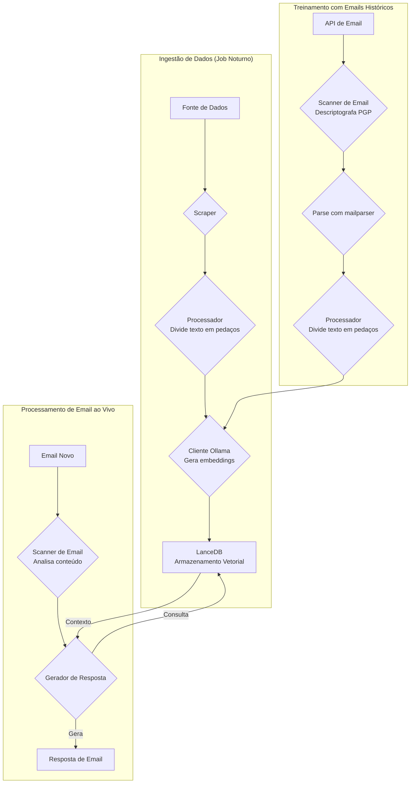
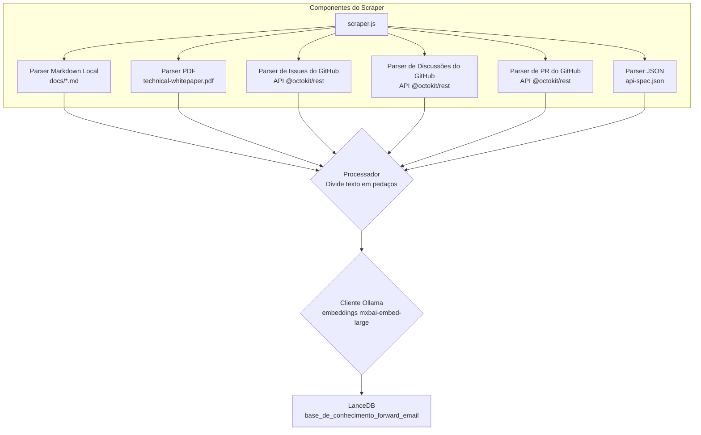
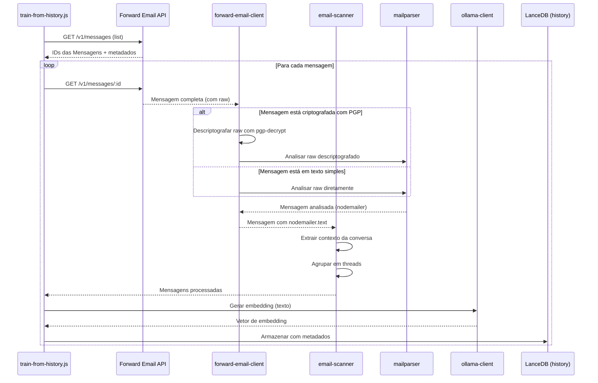

# Construindo um Agente de Suporte ao Cliente com IA Focado em Privacidade com LanceDB, Ollama e Node.js {#building-a-privacy-first-ai-customer-support-agent-with-lancedb-ollama-and-nodejs}


> \[!NOTE]
> Este documento cobre nossa jornada construindo um agente de suporte com IA auto-hospedado. Escrevemos sobre desafios similares em nosso post no blog [Email Startup Graveyard](https://forwardemail.net/blog/docs/email-startup-graveyard-why-80-percent-email-companies-fail). Honestamente pensamos em escrever uma sequência chamada "AI Startup Graveyard", mas talvez tenhamos que esperar mais um ano ou algo assim até que a bolha da IA potencialmente estoure(?). Por enquanto, este é nosso despejo de ideias sobre o que funcionou, o que não funcionou e por que fizemos assim.

É assim que construímos nosso próprio agente de suporte ao cliente com IA. Fizemos do jeito difícil: auto-hospedado, focado em privacidade e completamente sob nosso controle. Por quê? Porque não confiamos em serviços de terceiros com os dados dos nossos clientes. É um requisito do GDPR e DPA, e é a coisa certa a fazer.

Este não foi um projeto divertido de fim de semana. Foi uma jornada de um mês navegando por dependências quebradas, documentação enganosa e o caos geral do ecossistema de IA open-source em 2025. Este documento é um registro do que construímos, por que construímos e os obstáculos que encontramos pelo caminho.


## Índice {#table-of-contents}

* [Benefícios para o Cliente: Suporte Humano Aumentado por IA](#customer-benefits-ai-augmented-human-support)
  * [Respostas Mais Rápidas e Precisas](#faster-more-accurate-responses)
  * [Consistência Sem Esgotamento](#consistency-without-burnout)
  * [O Que Você Recebe](#what-you-get)
* [Uma Reflexão Pessoal: A Luta de Duas Décadas](#a-personal-reflection-the-two-decade-grind)
* [Por Que a Privacidade Importa](#why-privacy-matters)
* [Análise de Custos: IA na Nuvem vs Auto-Hospedado](#cost-analysis-cloud-ai-vs-self-hosted)
  * [Comparação de Serviços de IA na Nuvem](#cloud-ai-service-comparison)
  * [Detalhamento de Custos: Base de Conhecimento de 5GB](#cost-breakdown-5gb-knowledge-base)
  * [Custos de Hardware Auto-Hospedado](#self-hosted-hardware-costs)
* [Usando Nossa Própria API](#dogfooding-our-own-api)
  * [Por Que Usar Nossa Própria API é Importante](#why-dogfooding-matters)
  * [Exemplos de Uso da API](#api-usage-examples)
  * [Benefícios de Performance](#performance-benefits)
* [Arquitetura de Criptografia](#encryption-architecture)
  * [Camada 1: Criptografia da Caixa de Correio (chacha20-poly1305)](#layer-1-mailbox-encryption-chacha20-poly1305)
  * [Camada 2: Criptografia PGP a Nível de Mensagem](#layer-2-message-level-pgp-encryption)
  * [Por Que Isso Importa para o Treinamento](#why-this-matters-for-training)
  * [Segurança do Armazenamento](#storage-security)
  * [Armazenamento Local é Prática Padrão](#local-storage-is-standard-practice)
* [A Arquitetura](#the-architecture)
  * [Fluxo em Alto Nível](#high-level-flow)
  * [Fluxo Detalhado do Scraper](#detailed-scraper-flow)
* [Como Funciona](#how-it-works)
  * [Construindo a Base de Conhecimento](#building-the-knowledge-base)
  * [Treinamento a partir de Emails Históricos](#training-from-historical-emails)
  * [Processando Emails Recebidos](#processing-incoming-emails)
  * [Gerenciamento do Armazenamento Vetorial](#vector-store-management)
* [O Cemitério de Bancos de Dados Vetoriais](#the-vector-database-graveyard)
* [Requisitos do Sistema](#system-requirements)
* [Configuração do Cron Job](#cron-job-configuration)
  * [Variáveis de Ambiente](#environment-variables)
  * [Cron Jobs para Múltiplas Caixas de Entrada](#cron-jobs-for-multiple-inboxes)
  * [Detalhamento da Programação do Cron](#cron-schedule-breakdown)
  * [Cálculo Dinâmico de Datas](#dynamic-date-calculation)
  * [Configuração Inicial: Extrair Lista de URLs do Sitemap](#initial-setup-extract-url-list-from-sitemap)
  * [Testando Cron Jobs Manualmente](#testing-cron-jobs-manually)
  * [Monitorando Logs](#monitoring-logs)
* [Exemplos de Código](#code-examples)
  * [Raspagem e Processamento](#scraping-and-processing)
  * [Treinamento a partir de Emails Históricos](#training-from-historical-emails-1)
  * [Consultando para Contexto](#querying-for-context)
* [O Futuro: Pesquisa e Desenvolvimento de Scanner de Spam](#the-future-spam-scanner-rd)
* [Resolução de Problemas](#troubleshooting)
  * [Erro de Incompatibilidade de Dimensão Vetorial](#vector-dimension-mismatch-error)
  * [Contexto Vazio na Base de Conhecimento](#empty-knowledge-base-context)
  * [Falhas na Descriptografia PGP](#pgp-decryption-failures)
* [Dicas de Uso](#usage-tips)
  * [Alcançando Inbox Zero](#achieving-inbox-zero)
  * [Usando o Rótulo skip-ai](#using-the-skip-ai-label)
  * [Encadeamento de Emails e Responder a Todos](#email-threading-and-reply-all)
  * [Monitoramento e Manutenção](#monitoring-and-maintenance)
* [Testes](#testing)
  * [Executando Testes](#running-tests)
  * [Cobertura de Testes](#test-coverage)
  * [Ambiente de Teste](#test-environment)
* [Principais Lições](#key-takeaways)
## Benefícios para o Cliente: Suporte Humano Aumentado por IA {#customer-benefits-ai-augmented-human-support}

Nosso sistema de IA não substitui nossa equipe de suporte—ele a torna melhor. Veja o que isso significa para você:

### Respostas Mais Rápidas e Precisas {#faster-more-accurate-responses}

**Humano no Loop**: Todo rascunho gerado pela IA é revisado, editado e curado por nossa equipe humana de suporte antes de ser enviado a você. A IA cuida da pesquisa inicial e da elaboração, liberando nossa equipe para focar no controle de qualidade e personalização.

**Treinada com Expertise Humana**: A IA aprende com:

* Nossa base de conhecimento e documentação escritas à mão
* Posts de blog e tutoriais escritos por humanos
* Nosso FAQ abrangente (escrito por humanos)
* Conversas passadas com clientes (todas tratadas por humanos reais)

Você recebe respostas informadas por anos de expertise humana, só que entregues mais rápido.

### Consistência Sem Esgotamento {#consistency-without-burnout}

Nossa pequena equipe lida com centenas de solicitações de suporte diariamente, cada uma exigindo diferentes conhecimentos técnicos e troca mental de contexto:

* Perguntas sobre faturamento exigem conhecimento do sistema financeiro
* Problemas de DNS exigem expertise em redes
* Integração de API exige conhecimento de programação
* Relatórios de segurança exigem avaliação de vulnerabilidades

Sem a ajuda da IA, essa troca constante de contexto leva a:

* Tempos de resposta mais lentos
* Erros humanos por fadiga
* Qualidade inconsistente nas respostas
* Esgotamento da equipe

**Com a ampliação da IA**, nossa equipe:

* Responde mais rápido (IA elabora rascunhos em segundos)
* Comete menos erros (IA detecta erros comuns)
* Mantém qualidade consistente (IA consulta a mesma base de conhecimento toda vez)
* Permanece fresca e focada (menos tempo pesquisando, mais tempo ajudando)

### O Que Você Recebe {#what-you-get}

✅ **Velocidade**: IA elabora respostas em segundos, humanos revisam e enviam em minutos

✅ **Precisão**: Respostas baseadas em nossa documentação real e soluções passadas

✅ **Consistência**: Mesmas respostas de alta qualidade seja às 9h ou às 21h

✅ **Toque humano**: Cada resposta é revisada e personalizada por nossa equipe

✅ **Sem alucinações**: IA usa apenas nossa base de conhecimento verificada, não dados genéricos da internet

> \[!NOTE]
> **Você está sempre falando com humanos**. A IA é uma assistente de pesquisa que ajuda nossa equipe a encontrar a resposta certa mais rápido. Pense nela como um bibliotecário que encontra instantaneamente o livro relevante—mas um humano ainda o lê e explica para você.


## Uma Reflexão Pessoal: A Luta de Duas Décadas {#a-personal-reflection-the-two-decade-grind}

Antes de mergulharmos nos detalhes técnicos, uma nota pessoal. Estou nisso há quase duas décadas. As horas intermináveis no teclado, a busca incansável por uma solução, o trabalho profundo e focado – essa é a realidade de construir algo significativo. É uma realidade que muitas vezes é ignorada nos ciclos de hype das novas tecnologias.

A recente explosão da IA tem sido particularmente frustrante. Nos vendem o sonho da automação, de assistentes de IA que escreverão nosso código e resolverão nossos problemas. A realidade? O resultado frequentemente é código lixo que exige mais tempo para consertar do que teria levado para escrever do zero. A promessa de facilitar nossas vidas é falsa. É uma distração do trabalho duro e necessário de construir.

E então há o dilema de contribuir para o open-source. Você já está sobrecarregado, exausto da luta. Usa uma IA para ajudar a escrever um relatório de bug detalhado e bem estruturado, na esperança de facilitar para os mantenedores entenderem e corrigirem o problema. E o que acontece? Você é repreendido. Sua contribuição é descartada como "fora do tema" ou de baixo esforço, como vimos em um recente [issue do Node.js no GitHub](https://github.com/nodejs/node/issues/60719#issuecomment-3534304321). É um tapa na cara para desenvolvedores seniores que só estão tentando ajudar.

Essa é a realidade do ecossistema em que trabalhamos. Não se trata apenas de ferramentas quebradas; trata-se de uma cultura que frequentemente não respeita o tempo e o [esforço de seus colaboradores](https://forwardemail.net/blog/docs/how-npm-packages-billion-downloads-shaped-javascript-ecosystem). Este post é uma crônica dessa realidade. É uma história sobre as ferramentas, sim, mas também sobre o custo humano de construir em um ecossistema quebrado que, apesar de toda sua promessa, é fundamentalmente falho.
## Por Que a Privacidade Importa {#why-privacy-matters}

Nosso [whitepaper técnico](https://forwardemail.net/technical-whitepaper.pdf) aborda nossa filosofia de privacidade em profundidade. A versão curta: não enviamos dados de clientes para terceiros. Nunca. Isso significa nada de OpenAI, nada de Anthropic, nada de bancos de dados vetoriais hospedados na nuvem. Tudo roda localmente em nossa infraestrutura. Isso é inegociável para conformidade com o GDPR e nossos compromissos de DPA.


## Análise de Custo: IA na Nuvem vs Auto-Hospedagem {#cost-analysis-cloud-ai-vs-self-hosted}

Antes de mergulhar na implementação técnica, vamos falar sobre por que a auto-hospedagem importa do ponto de vista de custo. Os modelos de precificação dos serviços de IA na nuvem os tornam proibitivamente caros para casos de uso de alto volume, como suporte ao cliente.

### Comparação de Serviços de IA na Nuvem {#cloud-ai-service-comparison}

| Serviço         | Provedor            | Custo de Embedding                                              | Custo LLM (Entrada)                                                      | Custo LLM (Saída)       | Política de Privacidade                              | GDPR/DPA        | Hospedagem        | Compartilhamento de Dados |
| --------------- | ------------------- | ---------------------------------------------------------------- | ------------------------------------------------------------------------ | ----------------------- | --------------------------------------------------- | --------------- | ----------------- | ------------------------- |
| **OpenAI**      | OpenAI (EUA)        | [$0,02-0,13/1M tokens](https://openai.com/api/pricing/)          | $0,15-20/1M tokens                                                       | $0,60-80/1M tokens      | [Link](https://openai.com/policies/privacy-policy/) | DPA Limitado    | Azure (EUA)       | Sim (treinamento)          |
| **Claude**      | Anthropic (EUA)     | N/A                                                              | [$3-20/1M tokens](https://docs.claude.com/en/docs/about-claude/pricing) | $15-80/1M tokens        | [Link](https://www.anthropic.com/legal/privacy)     | DPA Limitado    | AWS/GCP (EUA)     | Não (afirmado)             |
| **Gemini**      | Google (EUA)        | [$0,15/1M tokens](https://ai.google.dev/gemini-api/docs/pricing) | $0,30-1,00/1M tokens                                                    | $2,50/1M tokens         | [Link](https://policies.google.com/privacy)         | DPA Limitado    | GCP (EUA)         | Sim (melhoria)             |
| **DeepSeek**    | DeepSeek (China)    | N/A                                                              | [$0,028-0,28/1M tokens](https://api-docs.deepseek.com/quick_start/pricing) | $0,42/1M tokens         | [Link](https://www.deepseek.com/en)                 | Desconhecido    | China             | Desconhecido               |
| **Mistral**     | Mistral AI (França) | [$0,10/1M tokens](https://mistral.ai/pricing)                    | $0,40/1M tokens                                                        | $2,00/1M tokens         | [Link](https://mistral.ai/terms/)                   | GDPR UE         | UE                | Desconhecido               |
| **Auto-Hospedado** | Você               | $0 (hardware existente)                                          | $0 (hardware existente)                                                 | $0 (hardware existente) | Sua política                                        | Conformidade total | MacBook M5 + cron | Nunca                      |

> \[!WARNING]
> **Preocupações com soberania de dados**: Provedores dos EUA (OpenAI, Claude, Gemini) estão sujeitos ao CLOUD Act, permitindo acesso do governo dos EUA aos dados. DeepSeek (China) opera sob leis chinesas de dados. Embora Mistral (França) ofereça hospedagem na UE e conformidade com GDPR, a auto-hospedagem continua sendo a única opção para soberania e controle completos dos dados.

### Desdobramento de Custos: Base de Conhecimento de 5GB {#cost-breakdown-5gb-knowledge-base}

Vamos calcular o custo de processar uma base de conhecimento de 5GB (típica para uma empresa de médio porte com documentos, e-mails e histórico de suporte).

**Pressupostos:**

* 5GB de texto ≈ 1,25 bilhões de tokens (assumindo \~4 caracteres/token)
* Geração inicial de embeddings
* Retreinamento mensal (re-embedding completo)
* 10.000 consultas de suporte por mês
* Consulta média: 500 tokens de entrada, 300 tokens de saída
**Detalhamento Detalhado de Custos:**

| Componente                            | OpenAI           | Claude          | Gemini               | Auto-Hospedado     |
| -------------------------------------- | ---------------- | --------------- | -------------------- | ------------------ |
| **Embedding Inicial** (1,25B tokens)  | $25.000          | N/D             | $187.500             | $0                 |
| **Consultas Mensais** (10K × 800 tokens) | $1.200-16.000    | $2.400-16.000   | $2.400-3.200         | $0                 |
| **Retraining Mensal** (1,25B tokens)  | $25.000          | N/D             | $187.500             | $0                 |
| **Total do Primeiro Ano**             | $325.200-217.000 | $28.800-192.000 | $2.278.800-2.226.000 | ~ $60 (eletricidade) |
| **Conformidade com Privacidade**     | ❌ Limitado       | ❌ Limitado     | ❌ Limitado           | ✅ Completo         |
| **Soberania de Dados**                | ❌ Não           | ❌ Não          | ❌ Não                | ✅ Sim              |

> \[!CAUTION]
> **Os custos de embedding do Gemini são catastróficos** a $0,15/1M tokens. Um único embedding de base de conhecimento de 5GB custaria $187.500. Isso é 37x mais caro que OpenAI e torna-o completamente inviável para produção.

### Custos de Hardware Auto-Hospedado {#self-hosted-hardware-costs}

Nossa configuração roda em hardware existente que já possuímos:

* **Hardware**: MacBook M5 (já possuído para desenvolvimento)
* **Custo adicional**: $0 (usa hardware existente)
* **Eletricidade**: \~$5/mês (estimado)
* **Total do primeiro ano**: \~$60
* **Contínuo**: $60/ano

**ROI**: Auto-hospedar tem custo marginal praticamente zero, pois usamos hardware de desenvolvimento existente. O sistema roda via cron jobs durante horários de menor uso.


## Usando Nossa Própria API {#dogfooding-our-own-api}

Uma das decisões arquitetônicas mais importantes que tomamos foi fazer com que todos os trabalhos de IA usassem diretamente a [Forward Email API](https://forwardemail.net/email-api). Isso não é apenas uma boa prática — é uma função de força para otimização de desempenho.

### Por Que Usar Nossa Própria API é Importante {#why-dogfooding-matters}

Quando nossos trabalhos de IA usam os mesmos endpoints da API que nossos clientes:

1. **Gargalos de desempenho nos afetam primeiro** - Sentimos a dor antes dos clientes
2. **Otimização beneficia todos** - Melhorias para nossos trabalhos melhoram automaticamente a experiência do cliente
3. **Testes no mundo real** - Nossos trabalhos processam milhares de emails, fornecendo testes contínuos de carga
4. **Reuso de código** - Mesma autenticação, limitação de taxa, tratamento de erros e lógica de cache

### Exemplos de Uso da API {#api-usage-examples}

**Listando Mensagens (train-from-history.js):**

```javascript
// Usa GET /v1/messages?folder=INBOX com BasicAuth
// Exclui eml, raw, nodemailer para reduzir tamanho da resposta (precisamos só dos IDs)
const response = await axios.get(
  `${this.apiBase}/v1/messages`,
  {
    params: {
      folder: 'INBOX',
      limit: 100,
      eml: false,
      raw: false,
      nodemailer: false
    },
    auth: {
      username: process.env.FORWARD_EMAIL_ALIAS_USERNAME,
      password: process.env.FORWARD_EMAIL_ALIAS_PASSWORD
    }
  }
);

const messages = response.data;
// Retorna: [{ id, subject, date, ... }, ...]
// Conteúdo completo da mensagem buscado depois via GET /v1/messages/:id
```

**Buscando Mensagens Completas (forward-email-client.js):**

```javascript
// Usa GET /v1/messages/:id para obter mensagem completa com conteúdo raw
const response = await axios.get(
  `${this.apiBase}/v1/messages/${messageId}`,
  {
    auth: {
      username: this.aliasUsername,
      password: this.aliasPassword
    }
  }
);

const message = response.data;
// Retorna: { id, subject, raw, eml, nodemailer: { ... }, ... }
```

**Criando Rascunhos de Resposta (process-inbox.js):**

```javascript
// Usa POST /v1/messages para criar respostas em rascunho
const response = await axios.post(
  `${this.apiBase}/v1/messages`,
  {
    folder: 'Drafts',
    subject: `Re: ${originalSubject}`,
    to: senderEmail,
    text: generatedResponse,
    inReplyTo: originalMessageId
  },
  {
    auth: {
      username: process.env.FORWARD_EMAIL_ALIAS_USERNAME,
      password: process.env.FORWARD_EMAIL_ALIAS_PASSWORD
    }
  }
);
```
### Benefícios de Desempenho {#performance-benefits}

Como nossos trabalhos de IA rodam na mesma infraestrutura de API:

* **Otimizações de cache** beneficiam tanto os trabalhos quanto os clientes
* **Limitação de taxa** é testada sob carga real
* **Tratamento de erros** é testado em campo
* **Tempos de resposta da API** são constantemente monitorados
* **Consultas ao banco de dados** são otimizadas para ambos os casos de uso
* **Otimização de largura de banda** - Excluir `eml`, `raw`, `nodemailer` ao listar reduz o tamanho da resposta em \~90%

Quando `train-from-history.js` processa 1.000 e-mails, ele faz mais de 1.000 chamadas de API. Qualquer ineficiência na API torna-se imediatamente aparente. Isso nos obriga a otimizar o acesso IMAP, consultas ao banco de dados e serialização de resposta — melhorias que beneficiam diretamente nossos clientes.

**Exemplo de otimização**: Listar 100 mensagens com conteúdo completo = \~10MB de resposta. Listar com `eml: false, raw: false, nodemailer: false` = \~100KB de resposta (100x menor).


## Arquitetura de Criptografia {#encryption-architecture}

Nosso armazenamento de e-mails usa múltiplas camadas de criptografia, que os trabalhos de IA devem descriptografar em tempo real para treinamento.

### Camada 1: Criptografia da Caixa de Correio (chacha20-poly1305) {#layer-1-mailbox-encryption-chacha20-poly1305}

Todas as caixas de correio IMAP são armazenadas como bancos de dados SQLite criptografados com **chacha20-poly1305**, um algoritmo de criptografia seguro contra computação quântica. Isso é detalhado em nosso [post no blog sobre serviço de e-mail criptografado seguro contra computação quântica](https://forwardemail.net/blog/docs/best-quantum-safe-encrypted-email-service).

**Propriedades principais:**

* **Algoritmo**: ChaCha20-Poly1305 (cifra AEAD)
* **Seguro contra computação quântica**: Resistente a ataques de computação quântica
* **Armazenamento**: Arquivos de banco de dados SQLite no disco
* **Acesso**: Descriptografado em memória quando acessado via IMAP/API

### Camada 2: Criptografia PGP no Nível da Mensagem {#layer-2-message-level-pgp-encryption}

Muitos e-mails de suporte são adicionalmente criptografados com PGP (padrão OpenPGP). Os trabalhos de IA devem descriptografar esses para extrair conteúdo para treinamento.

**Fluxo de descriptografia:**

```javascript
// 1. API retorna mensagem com conteúdo raw criptografado
const message = await forwardEmailClient.getMessage(id);

// 2. Verifica se o conteúdo raw está criptografado com PGP
if (isMessageEncrypted(message.raw)) {
  // 3. Descriptografa com nossa chave privada
  const decryptedRaw = await pgpDecrypt(message.raw);

  // 4. Analisa a mensagem MIME descriptografada
  const parsed = await simpleParser(decryptedRaw);

  // 5. Preenche nodemailer com conteúdo descriptografado
  message.nodemailer = {
    text: parsed.text,
    html: parsed.html,
    from: parsed.from,
    to: parsed.to,
    subject: parsed.subject,
    date: parsed.date
  };
}
```

**Configuração PGP:**

```bash
# Chave privada para descriptografia (caminho para arquivo de chave ASCII-armored)
GPG_SECURITY_KEY="/path/to/private-key.asc"

# Senha da chave privada (se criptografada)
GPG_SECURITY_PASSPHRASE="your-passphrase"
```

O helper `pgp-decrypt.js`:

1. Lê a chave privada do disco uma vez (armazenada em cache na memória)
2. Descriptografa a chave com a senha
3. Usa a chave descriptografada para todas as descriptografias de mensagens
4. Suporta descriptografia recursiva para mensagens criptografadas aninhadas

### Por Que Isso Importa para o Treinamento {#why-this-matters-for-training}

Sem a descriptografia adequada, a IA treinaria com dados criptografados sem sentido:

```
-----BEGIN PGP MESSAGE-----
Version: OpenPGP.js v4.10.10

wcBMA8Z3lHJnFnNUAQgAqK7F8...
-----END PGP MESSAGE-----
```

Com a descriptografia, a IA treina com conteúdo real:

```
Subject: Re: Bug Report

Hi John,

Thanks for reporting this issue. I've confirmed the bug
and created a fix in PR #1234...
```

### Segurança do Armazenamento {#storage-security}

A descriptografia ocorre em memória durante a execução do trabalho, e o conteúdo descriptografado é convertido em embeddings que são então armazenados no banco de dados vetorial LanceDB no disco.

**Onde os dados ficam:**

* **Banco de dados vetorial**: Armazenado em estações de trabalho MacBook M5 criptografadas
* **Segurança física**: As estações de trabalho permanecem conosco o tempo todo (não em datacenters)
* **Criptografia de disco**: Criptografia total do disco em todas as estações de trabalho
* **Segurança de rede**: Firewall e isolamento de redes públicas

**Implantação futura em datacenter:**
Se algum dia migrarmos para hospedagem em datacenter, os servidores terão:

* Criptografia total do disco LUKS
* Acesso USB desabilitado
* Medidas de segurança física
* Isolamento de rede
Para detalhes completos sobre nossas práticas de segurança, veja nossa [página de Segurança](https://forwardemail.net/en/security).

> \[!NOTE]
> O banco de dados vetorial contém embeddings (representações matemáticas), não o texto original em claro. No entanto, embeddings podem potencialmente ser revertidos, por isso os mantemos em estações de trabalho criptografadas e fisicamente seguras.

### Armazenamento Local é Prática Padrão {#local-storage-is-standard-practice}

Armazenar embeddings nas estações de trabalho da nossa equipe não é diferente de como já lidamos com email:

* **Thunderbird**: Baixa e armazena o conteúdo completo do email localmente em arquivos mbox/maildir
* **Clientes Webmail**: Cacheiam dados de email no armazenamento do navegador e bancos de dados locais
* **Clientes IMAP**: Mantêm cópias locais das mensagens para acesso offline
* **Nosso sistema de IA**: Armazena embeddings matemáticos (não texto em claro) no LanceDB

A principal diferença: embeddings são **mais seguros** que email em texto claro porque são:

1. Representações matemáticas, não texto legível
2. Mais difíceis de reverter do que texto em claro
3. Ainda sujeitos à mesma segurança física que nossos clientes de email

Se é aceitável para nossa equipe usar Thunderbird ou webmail em estações de trabalho criptografadas, é igualmente aceitável (e possivelmente mais seguro) armazenar embeddings da mesma forma.


## A Arquitetura {#the-architecture}

Aqui está o fluxo básico. Parece simples. Não foi.

> \[!NOTE]
> Todos os trabalhos usam a API do Forward Email diretamente, garantindo que otimizações de desempenho beneficiem tanto nosso sistema de IA quanto nossos clientes.

### Fluxo de Alto Nível {#high-level-flow}



### Fluxo Detalhado do Scraper {#detailed-scraper-flow}

O `scraper.js` é o coração da ingestão de dados. É uma coleção de parsers para diferentes formatos de dados.




## Como Funciona {#how-it-works}

O processo é dividido em três partes principais: construir a base de conhecimento, treinar com emails históricos e processar novos emails.

### Construindo a Base de Conhecimento {#building-the-knowledge-base}

**`update-knowledge-base.js`**: Este é o trabalho principal. Ele roda à noite, limpa o armazenamento vetorial antigo e o reconstrói do zero. Usa `scraper.js` para buscar conteúdo de todas as fontes, `processor.js` para dividir em pedaços, e `ollama-client.js` para gerar embeddings. Finalmente, `vector-store.js` armazena tudo no LanceDB.

**Fontes de Dados:**

* Arquivos Markdown locais (`docs/*.md`)
* PDF do whitepaper técnico (`assets/technical-whitepaper.pdf`)
* JSON da especificação da API (`assets/api-spec.json`)
* Issues do GitHub (via Octokit)
* Discussões do GitHub (via Octokit)
* Pull requests do GitHub (via Octokit)
* Lista de URLs do Sitemap (`$LANCEDB_PATH/valid-urls.json`)

### Treinamento com Emails Históricos {#training-from-historical-emails}

**`train-from-history.js`**: Este trabalho escaneia emails históricos de todas as pastas, descriptografa mensagens criptografadas com PGP e as adiciona a um armazenamento vetorial separado (`customer_support_history`). Isso fornece contexto das interações de suporte passadas.
**Fluxo de Processamento de Email:**



**Principais Recursos:**

* **Descriptografia PGP**: Usa o helper `pgp-decrypt.js` com a variável de ambiente `GPG_SECURITY_KEY`
* **Agrupamento de Threads**: Agrupa emails relacionados em threads de conversa
* **Preservação de Metadados**: Armazena pasta, assunto, data, status de criptografia
* **Contexto de Resposta**: Vincula mensagens com suas respostas para melhor contexto

**Configuração:**

```bash
# Variáveis de ambiente para train-from-history
HISTORY_SCAN_LIMIT=1000              # Máximo de mensagens a processar
HISTORY_SCAN_SINCE="2024-01-01"      # Processar apenas mensagens após esta data
HISTORY_DECRYPT_PGP=true             # Tentar descriptografia PGP
GPG_SECURITY_KEY="/path/to/key.asc"  # Caminho para chave privada PGP
GPG_SECURITY_PASSPHRASE="passphrase" # Senha da chave (opcional)
```

**O Que é Armazenado:**

```javascript
{
  type: 'historical_email',
  folder: 'INBOX',
  subject: 'Re: Bug Report',
  date: '2025-01-15T10:30:00Z',
  messageId: '67e2f288893921...',
  threadId: 'Bug Report',
  hasReply: true,
  encrypted: true,
  decrypted: true,
  replySubject: 'Bug Report',
  replyText: 'Primeiros 500 caracteres da resposta...',
  chunkSize: 1000,
  chunkOverlap: 200,
  chunkIndex: 0
}
```

> \[!TIP]
> Execute `train-from-history` após a configuração inicial para popular o contexto histórico. Isso melhora drasticamente a qualidade das respostas ao aprender com interações anteriores de suporte.

### Processando Emails Recebidos {#processing-incoming-emails}

**`process-inbox.js`**: Este job roda nos emails das caixas `support@forwardemail.net`, `abuse@forwardemail.net` e `security@forwardemail.net` (especificamente na pasta IMAP `INBOX`). Ele utiliza nossa API em <https://forwardemail.net/email-api> (ex.: `GET /v1/messages?folder=INBOX` usando acesso BasicAuth com nossas credenciais IMAP para cada caixa). Analisa o conteúdo do email, consulta tanto a base de conhecimento (`forward_email_knowledge_base`) quanto o armazenamento vetorial de emails históricos (`customer_support_history`), e então passa o contexto combinado para `response-generator.js`. O gerador usa `mxbai-embed-large` via Ollama para criar uma resposta.

**Recursos do Fluxo Automatizado:**

1. **Automação Inbox Zero**: Após criar um rascunho com sucesso, a mensagem original é automaticamente movida para a pasta Arquivo. Isso mantém sua caixa de entrada limpa e ajuda a alcançar inbox zero sem intervenção manual.

2. **Pular Processamento por IA**: Basta adicionar um rótulo `skip-ai` (case-insensitive) a qualquer mensagem para evitar o processamento por IA. A mensagem permanecerá na sua caixa de entrada intacta, permitindo que você a trate manualmente. Útil para mensagens sensíveis ou casos complexos que requerem julgamento humano.

3. **Encadeamento Correto de Emails**: Todas as respostas em rascunho incluem a mensagem original citada abaixo (usando o prefixo padrão ` >  `), seguindo as convenções de resposta de email com o formato "Em \[data], \[remetente] escreveu:". Isso garante contexto e encadeamento adequados em clientes de email.

4. **Comportamento Responder a Todos**: O sistema gerencia automaticamente os cabeçalhos Reply-To e os destinatários em CC:
   * Se existir um cabeçalho Reply-To, ele se torna o endereço Para e o From original é adicionado em CC
   * Todos os destinatários originais em Para e CC são incluídos no CC da resposta (exceto seu próprio endereço)
   * Segue as convenções padrão de responder a todos em conversas de grupo
**Classificação da Fonte**: O sistema usa **classificação ponderada** para priorizar as fontes:

* FAQ: 100% (prioridade máxima)
* Whitepaper técnico: 95%
* Especificação da API: 90%
* Documentação oficial: 85%
* Issues do GitHub: 70%
* E-mails históricos: 50%

### Gerenciamento da Loja de Vetores {#vector-store-management}

A classe `VectorStore` em `helpers/customer-support-ai/vector-store.js` é nossa interface com o LanceDB.

**Adicionando Documentos:**

```javascript
// vector-store.js
async addDocument(text, metadata) {
  const embedding = await this.ollama.generateEmbedding(text);
  await this.table.add([{
    vector: embedding,
    text,
    ...metadata
  }]);
}
```

**Limpando a Loja:**

```javascript
// Opção 1: Use o método clear()
await vectorStore.clear();

// Opção 2: Delete o diretório local do banco de dados
await fs.rm(process.env.LANCEDB_PATH, { recursive: true, force: true });
```

A variável de ambiente `LANCEDB_PATH` aponta para o diretório local do banco de dados embutido. O LanceDB é serverless e embutido, então não há um processo separado para gerenciar.


## O Cemitério dos Bancos de Dados Vetoriais {#the-vector-database-graveyard}

Este foi o primeiro grande obstáculo. Tentamos múltiplos bancos de dados vetoriais antes de escolher o LanceDB. Veja o que deu errado com cada um.

| Banco de Dados | GitHub                                                      | O Que Deu Errado                                                                                                                                                                                                     | Problemas Específicos                                                                                                                                                                                                                                                                                                                                                      | Preocupações de Segurança                                                                                                                                                                                        |
| -------------- | ----------------------------------------------------------- | ------------------------------------------------------------------------------------------------------------------------------------------------------------------------------------------------------------------- | --------------------------------------------------------------------------------------------------------------------------------------------------------------------------------------------------------------------------------------------------------------------------------------------------------------------------------------------------------------------------- | ---------------------------------------------------------------------------------------------------------------------------------------------------------------------------------------------------------------- |
| **ChromaDB**   | [chroma-core/chroma](https://github.com/chroma-core/chroma) | `pip3 install chromadb` fornece uma versão da idade da pedra com `PydanticImportError`. A única forma de obter uma versão funcional é compilar a partir do código-fonte. Não é amigável para desenvolvedores.       | Caos nas dependências Python. Vários usuários relatando instalações pip quebradas ([#774](https://github.com/chroma-core/chroma/issues/774), [#163](https://github.com/chroma-core/chroma/issues/163)). A documentação diz "use Docker" que é uma resposta insuficiente para desenvolvimento local. Crash no Windows com >99 registros ([#3058](https://github.com/chroma-core/chroma/issues/3058)). | **CVE-2024-45848**: Execução arbitrária de código via integração ChromaDB no MindsDB. Vulnerabilidades críticas no SO na imagem Docker ([#3170](https://github.com/chroma-core/chroma/issues/3170)).                   |
| **Qdrant**     | [qdrant/qdrant](https://github.com/qdrant/qdrant)           | O tap do Homebrew (`qdrant/qdrant/qdrant`) referenciado na documentação antiga desapareceu. Sumiu. Sem explicação. A documentação oficial agora apenas diz "use Docker."                                            | Tap do Homebrew ausente. Sem binário nativo para macOS. Apenas Docker é uma barreira para testes locais rápidos.                                                                                                                                                                                                                                                          | **CVE-2024-2221**: Vulnerabilidade de upload arbitrário de arquivos permitindo execução remota de código (corrigida na v1.9.0). Baixa maturidade de segurança segundo [IronCore Labs](https://ironcorelabs.com/vectordbs/qdrant-security/). |
| **Weaviate**   | [weaviate/weaviate](https://github.com/weaviate/weaviate)   | A versão do Homebrew tinha um bug crítico de clusterização (`leader not found`). As flags documentadas para corrigir (`RAFT_JOIN`, `CLUSTER_HOSTNAME`) não funcionaram. Fundamentalmente quebrado para setups de nó único. | Bugs de clusterização mesmo no modo de nó único. Superdimensionado para casos de uso simples.                                                                                                                                                                                                                                                                             | Nenhum CVE maior encontrado, mas a complexidade aumenta a superfície de ataque.                                                                                                                                   |
| **LanceDB**    | [lancedb/lancedb](https://github.com/lancedb/lancedb)       | Este funcionou. É embutido e serverless. Sem processo separado. A única chatice é a nomenclatura confusa do pacote (`vectordb` está depreciado, use `@lancedb/lancedb`) e documentação dispersa. Podemos conviver com isso. | Confusão na nomenclatura do pacote (`vectordb` vs `@lancedb/lancedb`), mas fora isso é sólido. Arquitetura embutida elimina classes inteiras de problemas de segurança.                                                                                                                                                                                                   | Nenhum CVE conhecido. Design embutido significa nenhuma superfície de ataque de rede.                                                                                                                             |
> \[!WARNING]
> **ChromaDB tem vulnerabilidades críticas de segurança.** [CVE-2024-45848](https://nvd.nist.gov/vuln/detail/CVE-2024-45848) permite execução arbitrária de código. A instalação via pip está fundamentalmente quebrada devido a problemas na dependência do Pydantic. Evite para uso em produção.

> \[!WARNING]
> **Qdrant teve uma vulnerabilidade de RCE por upload de arquivo** ([CVE-2024-2221](https://qdrant.tech/blog/cve-2024-2221-response/)) que foi corrigida apenas na v1.9.0. Se precisar usar o Qdrant, certifique-se de estar na versão mais recente.

> \[!CAUTION]
> O ecossistema de banco de dados vetorial open-source é instável. Não confie na documentação. Assuma que tudo está quebrado até que se prove o contrário. Teste localmente antes de se comprometer com uma stack.


## Requisitos do Sistema {#system-requirements}

* **Node.js:** v18.0.0+ ([GitHub](https://github.com/nodejs/node))
* **Ollama:** Última versão ([GitHub](https://github.com/ollama/ollama))
* **Modelo:** `mxbai-embed-large` via Ollama
* **Banco de Dados Vetorial:** LanceDB ([GitHub](https://github.com/lancedb/lancedb))
* **Acesso ao GitHub:** `@octokit/rest` para raspagem de issues ([GitHub](https://github.com/octokit/rest.js))
* **SQLite:** Para banco de dados primário (via `mongoose-to-sqlite`)


## Configuração do Cron Job {#cron-job-configuration}

Todos os jobs de IA rodam via cron em um MacBook M5. Veja como configurar os cron jobs para rodar à meia-noite em várias caixas de entrada.

### Variáveis de Ambiente {#environment-variables}

Os jobs requerem essas variáveis de ambiente. A maioria pode ser configurada no arquivo `.env` (carregado via `@ladjs/env`), mas `HISTORY_SCAN_SINCE` deve ser calculada dinamicamente no crontab.

**No arquivo `.env`:**

```bash
# Credenciais da API Forward Email (mudam por caixa de entrada)
FORWARD_EMAIL_ALIAS_USERNAME=support@forwardemail.net
FORWARD_EMAIL_ALIAS_PASSWORD=sua-senha-imap

# Descriptografia PGP (compartilhada entre todas as caixas)
GPG_SECURITY_KEY=/caminho/para/chave-privada.asc
GPG_SECURITY_PASSPHRASE=sua-senha

# Configuração de escaneamento histórico
HISTORY_SCAN_LIMIT=1000

# Caminho do LanceDB
LANCEDB_PATH=/caminho/para/lancedb
```

**No crontab (calculado dinamicamente):**

```bash
# HISTORY_SCAN_SINCE deve ser definido inline no crontab com cálculo de data shell
# Não pode estar no arquivo .env pois @ladjs/env não avalia comandos shell
HISTORY_SCAN_SINCE="$(date -v-1d +%Y-%m-%d)"  # macOS
HISTORY_SCAN_SINCE="$(date -d 'yesterday' +%Y-%m-%d)"  # Linux
```

### Cron Jobs para Múltiplas Caixas de Entrada {#cron-jobs-for-multiple-inboxes}

Edite seu crontab com `crontab -e` e adicione:

```bash
# Atualizar base de conhecimento (roda uma vez, compartilhado entre todas as caixas)
0 0 * * * cd /caminho/para/forwardemail.net && LANCEDB_PATH="/caminho/para/lancedb" GPG_SECURITY_KEY="/caminho/para/chave.asc" GPG_SECURITY_PASSPHRASE="senha" node jobs/customer-support-ai/update-knowledge-base.js >> /var/log/update-knowledge-base.log 2>&1

# Treinar a partir do histórico - support@forwardemail.net
0 0 * * * cd /caminho/para/forwardemail.net && FORWARD_EMAIL_ALIAS_USERNAME="support@forwardemail.net" FORWARD_EMAIL_ALIAS_PASSWORD="senha-support" HISTORY_SCAN_SINCE="$(date -v-1d +%Y-%m-%d)" HISTORY_SCAN_LIMIT=1000 GPG_SECURITY_KEY="/caminho/para/chave.asc" GPG_SECURITY_PASSPHRASE="senha" LANCEDB_PATH="/caminho/para/lancedb" node jobs/customer-support-ai/train-from-history.js >> /var/log/train-support.log 2>&1

# Treinar a partir do histórico - abuse@forwardemail.net
0 0 * * * cd /caminho/para/forwardemail.net && FORWARD_EMAIL_ALIAS_USERNAME="abuse@forwardemail.net" FORWARD_EMAIL_ALIAS_PASSWORD="senha-abuse" HISTORY_SCAN_SINCE="$(date -v-1d +%Y-%m-%d)" HISTORY_SCAN_LIMIT=1000 GPG_SECURITY_KEY="/caminho/para/chave.asc" GPG_SECURITY_PASSPHRASE="senha" LANCEDB_PATH="/caminho/para/lancedb" node jobs/customer-support-ai/train-from-history.js >> /var/log/train-abuse.log 2>&1

# Treinar a partir do histórico - security@forwardemail.net
0 0 * * * cd /caminho/para/forwardemail.net && FORWARD_EMAIL_ALIAS_USERNAME="security@forwardemail.net" FORWARD_EMAIL_ALIAS_PASSWORD="senha-security" HISTORY_SCAN_SINCE="$(date -v-1d +%Y-%m-%d)" HISTORY_SCAN_LIMIT=1000 GPG_SECURITY_KEY="/caminho/para/chave.asc" GPG_SECURITY_PASSPHRASE="senha" LANCEDB_PATH="/caminho/para/lancedb" node jobs/customer-support-ai/train-from-history.js >> /var/log/train-security.log 2>&1

# Processar caixa de entrada - support@forwardemail.net
*/5 * * * * cd /caminho/para/forwardemail.net && FORWARD_EMAIL_ALIAS_USERNAME="support@forwardemail.net" FORWARD_EMAIL_ALIAS_PASSWORD="senha-support" GPG_SECURITY_KEY="/caminho/para/chave.asc" GPG_SECURITY_PASSPHRASE="senha" LANCEDB_PATH="/caminho/para/lancedb" node jobs/customer-support-ai/process-inbox.js >> /var/log/process-support.log 2>&1

# Processar caixa de entrada - abuse@forwardemail.net
*/5 * * * * cd /caminho/para/forwardemail.net && FORWARD_EMAIL_ALIAS_USERNAME="abuse@forwardemail.net" FORWARD_EMAIL_ALIAS_PASSWORD="senha-abuse" GPG_SECURITY_KEY="/caminho/para/chave.asc" GPG_SECURITY_PASSPHRASE="senha" LANCEDB_PATH="/caminho/para/lancedb" node jobs/customer-support-ai/process-inbox.js >> /var/log/process-abuse.log 2>&1

# Processar caixa de entrada - security@forwardemail.net
*/5 * * * * cd /caminho/para/forwardemail.net && FORWARD_EMAIL_ALIAS_USERNAME="security@forwardemail.net" FORWARD_EMAIL_ALIAS_PASSWORD="senha-security" GPG_SECURITY_KEY="/caminho/para/chave.asc" GPG_SECURITY_PASSPHRASE="senha" LANCEDB_PATH="/caminho/para/lancedb" node jobs/customer-support-ai/process-inbox.js >> /var/log/process-security.log 2>&1
```
### Descrição da Programação Cron {#cron-schedule-breakdown}

| Job                     | Programação  | Descrição                                                                          |
| ----------------------- | ------------ | ---------------------------------------------------------------------------------- |
| `train-from-sitemap.js` | `0 0 * * 0`  | Semanal (domingo à meia-noite) - Busca todas as URLs do sitemap e treina a base de conhecimento |
| `train-from-history.js` | `0 0 * * *`  | Meia-noite diariamente - Escaneia os e-mails do dia anterior por caixa de entrada  |
| `process-inbox.js`      | `*/5 * * * *`| A cada 5 minutos - Processa novos e-mails e gera rascunhos                        |

### Cálculo Dinâmico de Data {#dynamic-date-calculation}

A variável `HISTORY_SCAN_SINCE` **deve ser calculada inline no crontab** porque:

1. Arquivos `.env` são lidos como strings literais pelo `@ladjs/env`
2. Substituição de comando shell `$(...)` não funciona em arquivos `.env`
3. A data precisa ser calculada nova a cada execução do cron

**Abordagem correta (no crontab):**

```bash
# macOS (data BSD)
HISTORY_SCAN_SINCE="$(date -v-1d +%Y-%m-%d)" node jobs/...

# Linux (data GNU)
HISTORY_SCAN_SINCE="$(date -d 'yesterday' +%Y-%m-%d)" node jobs/...
```

**Abordagem incorreta (não funciona em .env):**

```bash
# Isso será lido como string literal "$(date -v-1d +%Y-%m-%d)"
# NÃO avaliado como comando shell
HISTORY_SCAN_SINCE=$(date -v-1d +%Y-%m-%d)
```

Isso garante que cada execução noturna calcule dinamicamente a data do dia anterior, evitando trabalho redundante.

### Configuração Inicial: Extrair Lista de URLs do Sitemap {#initial-setup-extract-url-list-from-sitemap}

Antes de executar o job process-inbox pela primeira vez, você **deve** extrair a lista de URLs do sitemap. Isso cria um dicionário de URLs válidas que o LLM pode referenciar e evita alucinação de URLs.

```bash
# Configuração inicial: Extrair lista de URLs do sitemap
cd /path/to/forwardemail.net
node jobs/customer-support-ai/train-from-sitemap.js
```

**O que isso faz:**

1. Busca todas as URLs de <https://forwardemail.net/sitemap.xml>
2. Filtra apenas URLs não localizadas ou URLs /en/ (evita conteúdo duplicado)
3. Remove prefixos de localidade (/en/faq → /faq)
4. Salva um arquivo JSON simples com a lista de URLs em `$LANCEDB_PATH/valid-urls.json`
5. Sem crawling, sem scraping de metadados - apenas uma lista plana de URLs válidas

**Por que isso importa:**

* Evita que o LLM alucine URLs falsas como `/dashboard` ou `/login`
* Fornece uma lista branca de URLs válidas para o gerador de respostas referenciar
* Simples, rápido e não requer armazenamento em banco de dados vetorial
* O gerador de respostas carrega essa lista na inicialização e a inclui no prompt

**Adicionar ao crontab para atualizações semanais:**

```bash
# Extrair lista de URLs do sitemap - semanalmente domingo à meia-noite
0 0 * * 0 cd /path/to/forwardemail.net && node jobs/customer-support-ai/train-from-sitemap.js >> /var/log/train-sitemap.log 2>&1
```

### Testando Jobs Cron Manualmente {#testing-cron-jobs-manually}

Para testar um job antes de adicionar ao cron:

```bash
# Testar treinamento do sitemap
cd /path/to/forwardemail.net
export LANCEDB_PATH="/path/to/lancedb"
node jobs/customer-support-ai/train-from-sitemap.js

# Testar treinamento da caixa de entrada de suporte
cd /path/to/forwardemail.net
export FORWARD_EMAIL_ALIAS_USERNAME="support@forwardemail.net"
export FORWARD_EMAIL_ALIAS_PASSWORD="support-password"
export HISTORY_SCAN_SINCE="$(date -v-1d +%Y-%m-%d)"
export HISTORY_SCAN_LIMIT=1000
export GPG_SECURITY_KEY="/path/to/key.asc"
export GPG_SECURITY_PASSPHRASE="pass"
export LANCEDB_PATH="/path/to/lancedb"
node jobs/customer-support-ai/train-from-history.js
```

### Monitorando Logs {#monitoring-logs}

Cada job registra em um arquivo separado para facilitar a depuração:

```bash
# Monitorar processamento da caixa de entrada de suporte em tempo real
tail -f /var/log/process-support.log

# Verificar execução do treinamento da noite passada
cat /var/log/train-support.log | grep "$(date -v-1d +%Y-%m-%d)"

# Visualizar todos os erros entre os jobs
grep -i error /var/log/train-*.log /var/log/process-*.log
```

> \[!TIP]
> Use arquivos de log separados por caixa de entrada para isolar problemas. Se uma caixa de entrada tiver problemas de autenticação, isso não poluirá os logs das outras caixas.
## Exemplos de Código {#code-examples}

### Raspagem e Processamento {#scraping-and-processing}

```javascript
// jobs/customer-support-ai/update-knowledge-base.js
const scraper = new Scraper();
const processor = new Processor();
const ollamaClient = new OllamaClient();
const vectorStore = new VectorStore();

// Limpar dados antigos
await vectorStore.clear();

// Raspagem de todas as fontes
const documents = await scraper.scrapeAll();
console.log(`Raspados ${documents.length} documentos`);

// Processar em pedaços
const allChunks = [];
for (const doc of documents) {
  const chunks = processor.processDocuments([doc]);
  allChunks.push(...chunks);
}
console.log(`Gerados ${allChunks.length} pedaços`);

// Gerar embeddings e armazenar
const texts = allChunks.map(chunk => chunk.text);
const embeddings = await ollamaClient.generateEmbeddings(texts);

for (let i = 0; i < allChunks.length; i++) {
  await vectorStore.addDocument(texts[i], {
    ...allChunks[i].metadata,
    embedding: embeddings[i]
  });
}
```

### Treinamento a partir de E-mails Históricos {#training-from-historical-emails-1}

```javascript
// jobs/customer-support-ai/train-from-history.js
const scanner = new EmailScanner({
  forwardEmailApiBase: config.forwardEmailApiBase,
  forwardEmailAliasUsername: config.forwardEmailAliasUsername,
  forwardEmailAliasPassword: config.forwardEmailAliasPassword
});

const vectorStore = new VectorStore({
  collectionName: 'customer_support_history'
});

// Escanear todas as pastas (INBOX, Itens Enviados, etc.)
const messages = await scanner.scanAllFolders({
  limit: 1000,
  since: new Date('2024-01-01'),
  decryptPGP: true
});

// Agrupar em threads de conversa
const threads = scanner.groupIntoThreads(messages);

// Processar cada thread
for (const thread of threads) {
  const context = scanner.extractConversationContext(thread);

  for (const message of context.messages) {
    // Pular mensagens criptografadas que não puderam ser descriptografadas
    if (message.encrypted && !message.decrypted) continue;

    // Usar conteúdo já analisado pelo nodemailer
    const text = message.nodemailer?.text || '';
    if (!text.trim()) continue;

    // Dividir em pedaços e armazenar
    const chunks = processor.chunkText(`Assunto: ${message.subject}\n\n${text}`, {
      chunkSize: 1000,
      chunkOverlap: 200
    });

    for (const chunk of chunks) {
      await vectorStore.addDocument(chunk.text, {
        type: 'historical_email',
        folder: message.folder,
        subject: message.subject,
        date: message.nodemailer?.date || message.created_at,
        messageId: message.id,
        threadId: context.subject,
        encrypted: message.encrypted || false,
        decrypted: message.decrypted || false,
        ...chunk.metadata
      });
    }
  }
}
```

### Consultando para Contexto {#querying-for-context}

```javascript
// jobs/customer-support-ai/process-inbox.js
const vectorStore = new VectorStore();
const historyVectorStore = new VectorStore({
  collectionName: 'customer_support_history'
});

// Consultar ambas as bases
const knowledgeContext = await vectorStore.query(emailEmbedding, { limit: 8 });
const historyContext = await historyVectorStore.query(emailEmbedding, { limit: 3 });

// Ranking ponderado e deduplicação acontecem aqui
const rankedContext = rankAndDeduplicateContext(knowledgeContext, historyContext);

// Gerar resposta
const response = await responseGenerator.generate(email, rankedContext);
```


## O Futuro: Pesquisa e Desenvolvimento do Scanner de Spam {#the-future-spam-scanner-rd}

Todo este projeto não foi apenas para suporte ao cliente. Foi P&D. Agora podemos aplicar tudo o que aprendemos sobre embeddings locais, stores vetoriais e recuperação de contexto em nosso próximo grande projeto: a camada LLM para o [Spam Scanner](https://spamscanner.net). Os mesmos princípios de privacidade, auto-hospedagem e compreensão semântica serão fundamentais.


## Solução de Problemas {#troubleshooting}

### Erro de Incompatibilidade de Dimensão Vetorial {#vector-dimension-mismatch-error}

**Erro:**

```
Error: Failed to execute query stream: GenericFailure, Invalid input, No vector column found to match with the query vector dimension: 1024
```

**Causa:** Este erro ocorre quando você troca de modelo de embedding (por exemplo, de `mistral-small` para `mxbai-embed-large`), mas o banco de dados LanceDB existente foi criado com uma dimensão vetorial diferente.
**Solução:** Você precisa re-treinar a base de conhecimento com o novo modelo de embedding:

```bash
# 1. Pare quaisquer jobs de IA de suporte ao cliente em execução
pkill -f customer-support-ai

# 2. Delete o banco de dados LanceDB existente
rm -rf ~/.local/share/lancedb/forward_email_knowledge_base.lance
rm -rf ~/.local/share/lancedb/customer_support_history.lance

# 3. Verifique se o modelo de embedding está configurado corretamente no .env
grep OLLAMA_EMBEDDING_MODEL .env
# Deve mostrar: OLLAMA_EMBEDDING_MODEL=mxbai-embed-large

# 4. Baixe o modelo de embedding no Ollama
ollama pull mxbai-embed-large

# 5. Re-treine a base de conhecimento
node jobs/customer-support-ai/train-from-history.js

# 6. Reinicie o job process-inbox via Bree
# O job será executado automaticamente a cada 5 minutos
```

**Por que isso acontece:** Diferentes modelos de embedding produzem vetores com diferentes dimensões:

* `mistral-small`: 1024 dimensões
* `mxbai-embed-large`: 1024 dimensões
* `nomic-embed-text`: 768 dimensões
* `all-minilm`: 384 dimensões

O LanceDB armazena a dimensão do vetor no esquema da tabela. Quando você consulta com uma dimensão diferente, falha. A única solução é recriar o banco de dados com o novo modelo.

### Contexto da Base de Conhecimento Vazia {#empty-knowledge-base-context}

**Sintoma:**

```
debug     Retrieved knowledge base context {
  total: 0,
  afterRanking: 0,
  questionType: 'capability'
}
```

**Causa:** A base de conhecimento ainda não foi treinada, ou a tabela LanceDB não existe.

**Solução:** Execute o job de treinamento para popular a base de conhecimento:

```bash
# Treinar a partir de e-mails históricos
node jobs/customer-support-ai/train-from-history.js

# Ou treinar a partir do site/documentação (se você tiver um scraper)
node jobs/customer-support-ai/train-from-website.js
```

### Falhas na Descriptografia PGP {#pgp-decryption-failures}

**Sintoma:** Mensagens aparecem como criptografadas, mas o conteúdo está vazio.

**Solução:**

1. Verifique se o caminho da chave GPG está configurado corretamente:

```bash
grep GPG_SECURITY_KEY .env
# Deve apontar para seu arquivo de chave privada
```

2. Teste a descriptografia manualmente:

```bash
node -e "const decrypt = require('./helpers/customer-support-ai/pgp-decrypt'); decrypt.testDecryption();"
```

3. Verifique as permissões da chave:

```bash
ls -la /path/to/your/gpg-key.asc
# Deve ser legível pelo usuário que executa o job
```


## Dicas de Uso {#usage-tips}

### Alcançando Inbox Zero {#achieving-inbox-zero}

O sistema foi projetado para ajudar você a alcançar inbox zero automaticamente:

1. **Arquivamento Automático**: Quando um rascunho é criado com sucesso, a mensagem original é automaticamente movida para a pasta Arquivo. Isso mantém sua caixa de entrada limpa sem intervenção manual.

2. **Revisar Rascunhos**: Verifique a pasta Rascunhos regularmente para revisar respostas geradas pela IA. Edite conforme necessário antes de enviar.

3. **Override Manual**: Para mensagens que precisam de atenção especial, basta adicionar o rótulo `skip-ai` antes do job ser executado.

### Usando o Rótulo skip-ai {#using-the-skip-ai-label}

Para evitar o processamento por IA em mensagens específicas:

1. **Adicione o rótulo**: No seu cliente de e-mail, adicione a etiqueta/rótulo `skip-ai` a qualquer mensagem (case-insensitive)
2. **Mensagem permanece na caixa de entrada**: A mensagem não será processada nem arquivada
3. **Trate manualmente**: Você pode responder a ela pessoalmente sem interferência da IA

**Quando usar skip-ai:**

* Mensagens sensíveis ou confidenciais
* Casos complexos que requerem julgamento humano
* Mensagens de clientes VIP
* Consultas legais ou relacionadas à conformidade
* Mensagens que precisam de atenção humana imediata

### Encadeamento de E-mails e Responder a Todos {#email-threading-and-reply-all}

O sistema segue as convenções padrão de e-mail:

**Mensagens Originais Citadas:**

```
Olá,

[Resposta gerada pela IA]

--
Obrigado,
Forward Email
https://forwardemail.net

Em seg, 15 de jan de 2024, 15:45 John Doe <john@example.com> escreveu:
> Esta é a mensagem original
> com cada linha citada
> usando o prefixo padrão "> "
```

**Tratamento do Reply-To:**

* Se a mensagem original tiver um cabeçalho Reply-To, o rascunho responde para esse endereço
* O endereço From original é adicionado em CC
* Todos os demais destinatários originais em To e CC são preservados

**Exemplo:**

```
Mensagem original:
  From: john@company.com
  Reply-To: support@company.com
  To: support@forwardemail.net
  CC: manager@company.com

Resposta em rascunho:
  To: support@company.com (do Reply-To)
  CC: john@company.com, manager@company.com
```
### Monitoramento e Manutenção {#monitoring-and-maintenance}

**Verifique a qualidade dos rascunhos regularmente:**

```bash
# Visualizar rascunhos recentes
tail -f /var/log/process-support.log | grep "Draft created"
```

**Monitorar arquivamento:**

```bash
# Verificar erros de arquivamento
grep "archive message" /var/log/process-*.log
```

**Revisar mensagens puladas:**

```bash
# Ver quais mensagens foram puladas
grep "skip-ai label" /var/log/process-*.log
```


## Testes {#testing}

O sistema de IA para suporte ao cliente inclui cobertura abrangente de testes com 23 testes Ava.

### Executando Testes {#running-tests}

Devido a conflitos de substituição de pacote npm com `better-sqlite3`, use o script de teste fornecido:

```bash
# Executar todos os testes da IA de suporte ao cliente
./scripts/test-customer-support-ai.sh

# Executar com saída detalhada
./scripts/test-customer-support-ai.sh --verbose

# Executar arquivo de teste específico
./scripts/test-customer-support-ai.sh test/customer-support-ai/message-utils.js
```

Alternativamente, execute os testes diretamente:

```bash
NODE_ENV=test node node_modules/.pnpm/ava@5.3.1/node_modules/ava/entrypoints/cli.mjs test/customer-support-ai
```

### Cobertura de Testes {#test-coverage}

**Sitemap Fetcher (6 testes):**

* Correspondência de regex para padrão de localidade
* Extração de caminho da URL e remoção de localidade
* Lógica de filtragem de URL para localidades
* Lógica de análise XML
* Lógica de deduplicação
* Filtragem combinada, remoção e deduplicação

**Message Utils (9 testes):**

* Extrair texto do remetente com nome e email
* Tratar apenas email quando o nome corresponde ao prefixo
* Usar from.text se disponível
* Usar Reply-To se presente
* Usar From se não houver Reply-To
* Incluir destinatários originais em CC
* Excluir nosso próprio endereço de CC
* Tratar Reply-To com From em CC
* Deduplicar endereços em CC

**Response Generator (8 testes):**

* Lógica de agrupamento de URL para prompt
* Lógica de detecção do nome do remetente
* Estrutura do prompt inclui todas as seções necessárias
* Formatação da lista de URLs sem colchetes angulares
* Tratamento de lista vazia de URLs
* Lista de URLs proibidas no prompt
* Inclusão de contexto histórico
* URLs corretas para tópicos relacionados à conta

### Ambiente de Teste {#test-environment}

Os testes usam `.env.test` para configuração. O ambiente de teste inclui:

* Credenciais simuladas do PayPal e Stripe
* Chaves de criptografia de teste
* Provedores de autenticação desativados
* Caminhos seguros para dados de teste

Todos os testes são projetados para rodar sem dependências externas ou chamadas de rede.


## Principais Conclusões {#key-takeaways}

1. **Privacidade em primeiro lugar:** Hospedagem própria é inegociável para conformidade com GDPR/DPA.
2. **Custo importa:** Serviços de IA na nuvem são de 50 a 1000 vezes mais caros que hospedagem própria para cargas de produção.
3. **O ecossistema está quebrado:** A maioria dos bancos de dados vetoriais não é amigável para desenvolvedores. Teste tudo localmente.
4. **Vulnerabilidades de segurança são reais:** ChromaDB e Qdrant tiveram vulnerabilidades críticas de RCE.
5. **LanceDB funciona:** É embutido, sem servidor e não requer processo separado.
6. **Ollama é sólido:** Inferência local de LLM com `mxbai-embed-large` funciona bem para nosso caso de uso.
7. **Incompatibilidades de tipo vão te matar:** `text` vs. `content`, ObjectID vs. string. Esses bugs são silenciosos e brutais.
8. **Ranking ponderado importa:** Nem todo contexto é igual. FAQ > issues do GitHub > emails históricos.
9. **Contexto histórico é ouro:** Treinar com emails de suporte passados melhora dramaticamente a qualidade das respostas.
10. **Descriptografia PGP é essencial:** Muitos emails de suporte são criptografados; descriptografia adequada é crítica para o treinamento.

---

Saiba mais sobre Forward Email e nossa abordagem de privacidade em primeiro lugar para email em [forwardemail.net](https://forwardemail.net).
