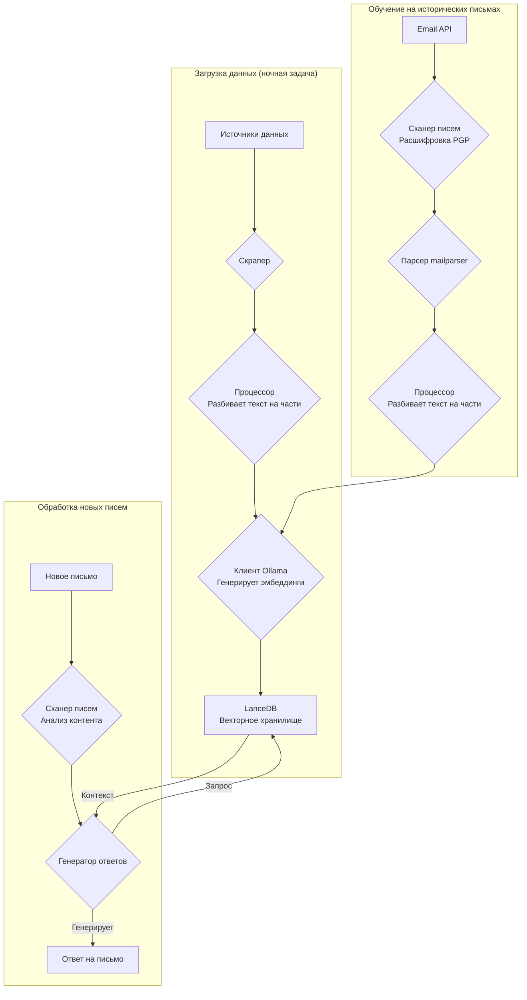
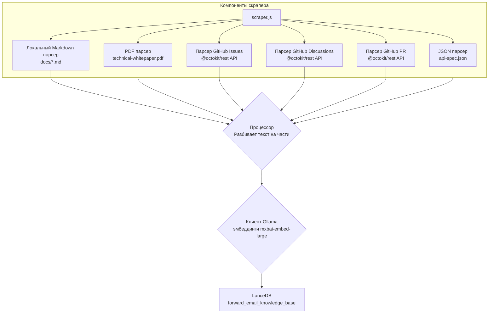
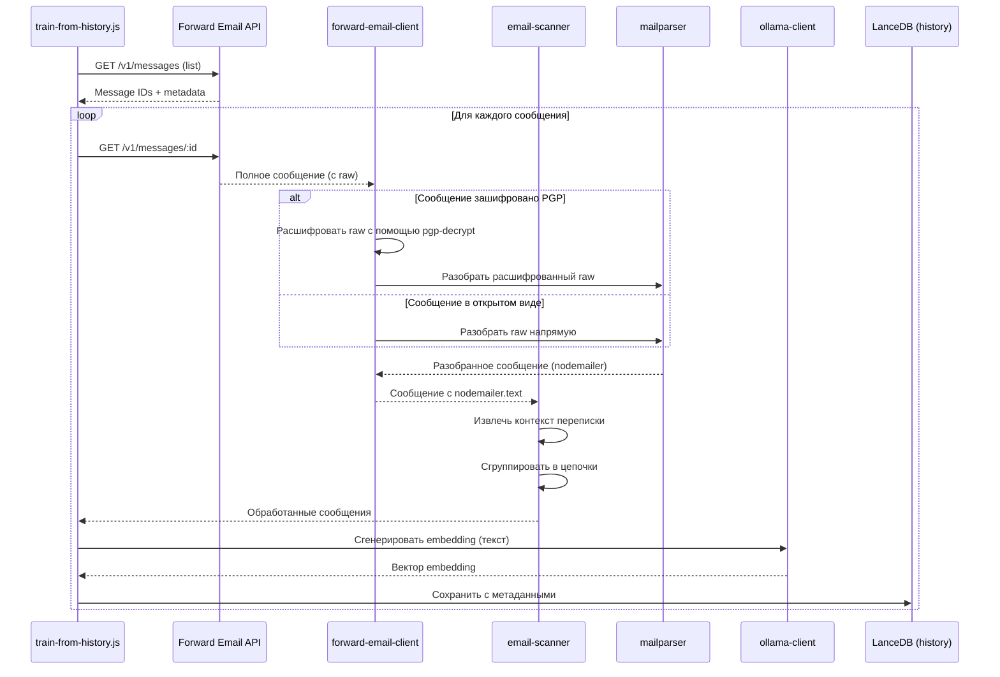

# Создание AI-агента поддержки клиентов с приоритетом конфиденциальности с LanceDB, Ollama и Node.js {#building-a-privacy-first-ai-customer-support-agent-with-lancedb-ollama-and-nodejs}


> \[!NOTE]
> В этом документе описывается наш путь создания саморазмещённого AI-агента поддержки. Мы писали о похожих проблемах в нашем блоге [Email Startup Graveyard](https://forwardemail.net/blog/docs/email-startup-graveyard-why-80-percent-email-companies-fail). Мы всерьёз думали написать продолжение под названием «AI Startup Graveyard», но, возможно, придётся подождать ещё год или около того, пока пузырь AI потенциально не лопнет(?). Пока что это наш мозговой штурм о том, что сработало, что нет и почему мы сделали именно так.

Вот как мы создали собственного AI-агента поддержки клиентов. Мы сделали это по сложному пути: саморазмещение, приоритет конфиденциальности и полный контроль. Почему? Потому что мы не доверяем сторонним сервисам данные наших клиентов. Это требование GDPR и DPA, и это правильно.

Это не был весёлый проект на выходные. Это было месячное путешествие через сломанные зависимости, вводящую в заблуждение документацию и общий хаос экосистемы open-source AI в 2025 году. Этот документ — запись того, что мы построили, почему и с какими препятствиями столкнулись.


## Содержание {#table-of-contents}

* [Преимущества для клиентов: AI, дополняющий человеческую поддержку](#customer-benefits-ai-augmented-human-support)
  * [Быстрее и точнее ответы](#faster-more-accurate-responses)
  * [Последовательность без выгорания](#consistency-without-burnout)
  * [Что вы получаете](#what-you-get)
* [Личный опыт: двадцатилетняя работа](#a-personal-reflection-the-two-decade-grind)
* [Почему важна конфиденциальность](#why-privacy-matters)
* [Анализ затрат: облачный AI против саморазмещения](#cost-analysis-cloud-ai-vs-self-hosted)
  * [Сравнение облачных AI-сервисов](#cloud-ai-service-comparison)
  * [Разбивка затрат: база знаний 5 ГБ](#cost-breakdown-5gb-knowledge-base)
  * [Затраты на оборудование для саморазмещения](#self-hosted-hardware-costs)
* [Использование собственного API](#dogfooding-our-own-api)
  * [Почему важно использовать собственный продукт](#why-dogfooding-matters)
  * [Примеры использования API](#api-usage-examples)
  * [Преимущества производительности](#performance-benefits)
* [Архитектура шифрования](#encryption-architecture)
  * [Уровень 1: шифрование почтового ящика (chacha20-poly1305)](#layer-1-mailbox-encryption-chacha20-poly1305)
  * [Уровень 2: шифрование сообщений PGP](#layer-2-message-level-pgp-encryption)
  * [Почему это важно для обучения](#why-this-matters-for-training)
  * [Безопасность хранения](#storage-security)
  * [Локальное хранение — стандартная практика](#local-storage-is-standard-practice)
* [Архитектура](#the-architecture)
  * [Общий поток](#high-level-flow)
  * [Подробный поток скрейпера](#detailed-scraper-flow)
* [Как это работает](#how-it-works)
  * [Создание базы знаний](#building-the-knowledge-base)
  * [Обучение на исторических письмах](#training-from-historical-emails)
  * [Обработка входящих писем](#processing-incoming-emails)
  * [Управление векторным хранилищем](#vector-store-management)
* [Кладбище векторных баз данных](#the-vector-database-graveyard)
* [Системные требования](#system-requirements)
* [Настройка Cron-заданий](#cron-job-configuration)
  * [Переменные окружения](#environment-variables)
  * [Cron-задания для нескольких почтовых ящиков](#cron-jobs-for-multiple-inboxes)
  * [Разбор расписания Cron](#cron-schedule-breakdown)
  * [Динамический расчёт даты](#dynamic-date-calculation)
  * [Первоначальная настройка: извлечение списка URL из Sitemap](#initial-setup-extract-url-list-from-sitemap)
  * [Ручное тестирование Cron-заданий](#testing-cron-jobs-manually)
  * [Мониторинг логов](#monitoring-logs)
* [Примеры кода](#code-examples)
  * [Скрейпинг и обработка](#scraping-and-processing)
  * [Обучение на исторических письмах](#training-from-historical-emails-1)
  * [Запросы для контекста](#querying-for-context)
* [Будущее: исследование и разработка спам-сканера](#the-future-spam-scanner-rd)
* [Устранение неполадок](#troubleshooting)
  * [Ошибка несоответствия размерности векторов](#vector-dimension-mismatch-error)
  * [Пустой контекст базы знаний](#empty-knowledge-base-context)
  * [Сбои при расшифровке PGP](#pgp-decryption-failures)
* [Советы по использованию](#usage-tips)
  * [Достижение «пустого» почтового ящика](#achieving-inbox-zero)
  * [Использование метки skip-ai](#using-the-skip-ai-label)
  * [Потоки писем и ответ всем](#email-threading-and-reply-all)
  * [Мониторинг и обслуживание](#monitoring-and-maintenance)
* [Тестирование](#testing)
  * [Запуск тестов](#running-tests)
  * [Покрытие тестами](#test-coverage)
  * [Тестовая среда](#test-environment)
* [Основные выводы](#key-takeaways)
## Преимущества для клиентов: поддержка с помощью ИИ и человека {#customer-benefits-ai-augmented-human-support}

Наша система ИИ не заменяет нашу команду поддержки — она делает её лучше. Вот что это значит для вас:

### Быстрее и точнее ответы {#faster-more-accurate-responses}

**Человек в цикле**: Каждый черновик, созданный ИИ, проверяется, редактируется и курируется нашей командой поддержки перед отправкой вам. ИИ занимается первоначальными исследованиями и составлением черновика, освобождая нашу команду для контроля качества и персонализации.

**Обучен на человеческом опыте**: ИИ учится на:

* Нашей написанной вручную базе знаний и документации
* Блогах и руководствах, написанных людьми
* Нашем полном FAQ (созданном людьми)
* Прошлых разговорах с клиентами (все handled реальными людьми)

Вы получаете ответы, основанные на многолетнем опыте людей, но доставленные быстрее.

### Последовательность без выгорания {#consistency-without-burnout}

Наша небольшая команда обрабатывает сотни запросов в день, каждый из которых требует разных технических знаний и переключения контекста:

* Вопросы по биллингу требуют знаний финансовой системы
* Проблемы с DNS требуют знаний сетей
* Интеграция API требует знаний программирования
* Отчёты по безопасности требуют оценки уязвимостей

Без помощи ИИ такое постоянное переключение контекста приводит к:

* Замедлению времени ответа
* Ошибкам из-за усталости
* Непоследовательному качеству ответов
* Выгоранию команды

**С помощью ИИ** наша команда:

* Отвечает быстрее (ИИ создаёт черновики за секунды)
* Делает меньше ошибок (ИИ ловит распространённые ошибки)
* Поддерживает стабильное качество (ИИ всегда обращается к одной и той же базе знаний)
* Остаётся свежей и сосредоточенной (меньше времени на исследования, больше на помощь)

### Что вы получаете {#what-you-get}

✅ **Скорость**: ИИ создаёт черновики за секунды, люди проверяют и отправляют за минуты

✅ **Точность**: Ответы основаны на нашей документации и прошлых решениях

✅ **Последовательность**: Одни и те же качественные ответы, будь то 9 утра или 9 вечера

✅ **Человеческий подход**: Каждый ответ проверяется и персонализируется нашей командой

✅ **Отсутствие галлюцинаций**: ИИ использует только нашу проверенную базу знаний, а не общедоступные данные из интернета

> \[!NOTE]
> **Вы всегда общаетесь с людьми**. ИИ — это помощник-исследователь, который помогает нашей команде быстрее находить правильный ответ. Представьте его как библиотекаря, который мгновенно находит нужную книгу — но читать и объяснять её вам всё равно будет человек.


## Личный взгляд: двадцатилетний труд {#a-personal-reflection-the-two-decade-grind}

Прежде чем углубиться в технические детали, личное замечание. Я занимаюсь этим почти два десятилетия. Бесконечные часы за клавиатурой, неустанный поиск решения, глубокая сосредоточенная работа — вот реальность создания чего-то значимого. Это реальность, которую часто обходят стороной в период хайпа вокруг новых технологий.

Недавний взрыв ИИ особенно раздражает. Нам продают мечту об автоматизации, об ИИ-помощниках, которые будут писать наш код и решать наши проблемы. Реальность? Часто получается мусорный код, который требует больше времени на исправление, чем написание с нуля. Обещание облегчить нашу жизнь — ложное. Это отвлечение от тяжёлой, необходимой работы по созданию.

И есть замкнутый круг участия в open-source. Вы и так перегружены, устали от постоянной работы. Вы используете ИИ, чтобы помочь написать подробный, хорошо структурированный отчёт об ошибке, надеясь облегчить работу мейнтейнерам по пониманию и исправлению проблемы. И что происходит? Вас ругают. Ваш вклад отклоняют как «не по теме» или низкокачественный, как мы видели в недавнем [Node.js GitHub issue](https://github.com/nodejs/node/issues/60719#issuecomment-3534304321). Это пощёчина опытным разработчикам, которые просто пытаются помочь.

Это реальность экосистемы, в которой мы работаем. Дело не только в сломанных инструментах; это культура, которая часто не уважает время и [усилия своих участников](https://forwardemail.net/blog/docs/how-npm-packages-billion-downloads-shaped-javascript-ecosystem). Этот пост — хроника этой реальности. Это история о инструментах, да, но также и о человеческой цене создания в сломанной экосистеме, которая, несмотря на все обещания, по сути сломана.
## Почему важна конфиденциальность {#why-privacy-matters}

Наш [технический документ](https://forwardemail.net/technical-whitepaper.pdf) подробно раскрывает нашу философию конфиденциальности. Кратко: мы никогда не передаем данные клиентов третьим лицам. Никогда. Это значит ни OpenAI, ни Anthropic, ни облачные векторные базы данных. Всё работает локально на нашей инфраструктуре. Это обязательное условие для соблюдения GDPR и наших обязательств по DPA.


## Анализ затрат: облачный ИИ против самостоятельного хостинга {#cost-analysis-cloud-ai-vs-self-hosted}

Прежде чем перейти к технической реализации, давайте обсудим, почему самостоятельный хостинг важен с точки зрения затрат. Модели ценообразования облачных ИИ-сервисов делают их чрезмерно дорогими для сценариев с большим объемом, таких как поддержка клиентов.

### Сравнение облачных ИИ-сервисов {#cloud-ai-service-comparison}

| Сервис         | Провайдер           | Стоимость эмбеддингов                                           | Стоимость LLM (вход)                                                      | Стоимость LLM (выход)   | Политика конфиденциальности                          | GDPR/DPA        | Хостинг           | Обмен данными    |
| --------------- | ------------------- | ---------------------------------------------------------------- | -------------------------------------------------------------------------- | ---------------------- | --------------------------------------------------- | --------------- | ----------------- | ----------------- |
| **OpenAI**      | OpenAI (США)        | [$0.02-0.13/1M токенов](https://openai.com/api/pricing/)         | $0.15-20/1M токенов                                                       | $0.60-80/1M токенов    | [Ссылка](https://openai.com/policies/privacy-policy/) | Ограниченный DPA | Azure (США)       | Да (обучение)    |
| **Claude**      | Anthropic (США)     | Н/Д                                                              | [$3-20/1M токенов](https://docs.claude.com/en/docs/about-claude/pricing) | $15-80/1M токенов      | [Ссылка](https://www.anthropic.com/legal/privacy)    | Ограниченный DPA | AWS/GCP (США)     | Нет (заявлено)   |
| **Gemini**      | Google (США)        | [$0.15/1M токенов](https://ai.google.dev/gemini-api/docs/pricing) | $0.30-1.00/1M токенов                                                    | $2.50/1M токенов       | [Ссылка](https://policies.google.com/privacy)        | Ограниченный DPA | GCP (США)         | Да (улучшение)   |
| **DeepSeek**    | DeepSeek (Китай)    | Н/Д                                                              | [$0.028-0.28/1M токенов](https://api-docs.deepseek.com/quick_start/pricing) | $0.42/1M токенов       | [Ссылка](https://www.deepseek.com/en)                | Неизвестно      | Китай             | Неизвестно       |
| **Mistral**     | Mistral AI (Франция)| [$0.10/1M токенов](https://mistral.ai/pricing)                   | $0.40/1M токенов                                                         | $2.00/1M токенов       | [Ссылка](https://mistral.ai/terms/)                  | GDPR ЕС         | ЕС                | Неизвестно       |
| **Самостоятельный хостинг** | Вы                 | $0 (существующее оборудование)                                  | $0 (существующее оборудование)                                           | $0 (существующее оборудование) | Ваша политика                                    | Полное соблюдение | MacBook M5 + cron | Никогда          |

> \[!WARNING]
> **Проблемы суверенитета данных**: провайдеры из США (OpenAI, Claude, Gemini) подпадают под действие CLOUD Act, который позволяет правительству США получать доступ к данным. DeepSeek (Китай) действует в рамках китайских законов о данных. Хотя Mistral (Франция) предлагает хостинг в ЕС и соблюдение GDPR, самостоятельный хостинг остается единственным вариантом для полного суверенитета и контроля над данными.

### Разбивка затрат: база знаний 5 ГБ {#cost-breakdown-5gb-knowledge-base}

Давайте рассчитаем стоимость обработки базы знаний объемом 5 ГБ (типично для компании среднего размера с документацией, электронной почтой и историей поддержки).

**Предположения:**

* 5 ГБ текста ≈ 1,25 миллиарда токенов (при ~4 символах на токен)
* Первоначальное создание эмбеддингов
* Ежемесячное переобучение (полное переэмбеддинг)
* 10 000 запросов в поддержку в месяц
* Средний запрос: 500 токенов на вход, 300 токенов на выход
**Подробный разбор затрат:**

| Компонент                             | OpenAI           | Claude          | Gemini               | Самостоятельный хостинг |
| ------------------------------------ | ---------------- | --------------- | -------------------- | ----------------------- |
| **Начальное встраивание** (1,25 млрд токенов) | $25,000          | Н/Д             | $187,500             | $0                      |
| **Ежемесячные запросы** (10K × 800 токенов) | $1,200-16,000    | $2,400-16,000   | $2,400-3,200         | $0                      |
| **Ежемесячное переобучение** (1,25 млрд токенов) | $25,000          | Н/Д             | $187,500             | $0                      |
| **Итого за первый год**              | $325,200-217,000 | $28,800-192,000 | $2,278,800-2,226,000 | ~60$ (электричество)    |
| **Соответствие требованиям конфиденциальности** | ❌ Ограничено     | ❌ Ограничено    | ❌ Ограничено         | ✅ Полное               |
| **Суверенитет данных**               | ❌ Нет           | ❌ Нет          | ❌ Нет               | ✅ Да                   |

> \[!CAUTION]
> **Затраты на встраивание Gemini катастрофичны** — $0.15 за 1 млн токенов. Встраивание базы знаний объемом 5 ГБ обойдется в $187,500. Это в 37 раз дороже, чем у OpenAI, и делает использование Gemini в продакшене невозможным.

### Затраты на оборудование для самостоятельного хостинга {#self-hosted-hardware-costs}

Наша система работает на уже имеющемся у нас оборудовании:

* **Оборудование**: MacBook M5 (уже есть для разработки)
* **Дополнительные затраты**: $0 (используется существующее оборудование)
* **Электричество**: ~5$/месяц (оценочно)
* **Итого за первый год**: ~60$
* **Текущие затраты**: 60$/год

**ROI**: Самостоятельный хостинг практически не имеет предельных затрат, так как мы используем существующее оборудование для разработки. Система работает через cron-задания в непиковое время.


## Использование собственного API {#dogfooding-our-own-api}

Одно из важнейших архитектурных решений — чтобы все AI-задачи использовали [Forward Email API](https://forwardemail.net/email-api) напрямую. Это не просто хорошая практика — это стимул для оптимизации производительности.

### Почему важно использовать собственный продукт {#why-dogfooding-matters}

Когда наши AI-задачи используют те же API, что и наши клиенты:

1. **Узкие места в производительности затрагивают нас первыми** — мы ощущаем проблемы раньше клиентов
2. **Оптимизация выгодна всем** — улучшения для наших задач автоматически улучшают опыт клиентов
3. **Тестирование в реальных условиях** — наши задачи обрабатывают тысячи писем, обеспечивая постоянное нагрузочное тестирование
4. **Повторное использование кода** — одинаковая аутентификация, ограничение скорости, обработка ошибок и кэширование

### Примеры использования API {#api-usage-examples}

**Получение списка сообщений (train-from-history.js):**

```javascript
// Использует GET /v1/messages?folder=INBOX с BasicAuth
// Исключает eml, raw, nodemailer для уменьшения размера ответа (нужны только ID)
const response = await axios.get(
  `${this.apiBase}/v1/messages`,
  {
    params: {
      folder: 'INBOX',
      limit: 100,
      eml: false,
      raw: false,
      nodemailer: false
    },
    auth: {
      username: process.env.FORWARD_EMAIL_ALIAS_USERNAME,
      password: process.env.FORWARD_EMAIL_ALIAS_PASSWORD
    }
  }
);

const messages = response.data;
// Возвращает: [{ id, subject, date, ... }, ...]
// Полное содержимое сообщения запрашивается позже через GET /v1/messages/:id
```

**Получение полного сообщения (forward-email-client.js):**

```javascript
// Использует GET /v1/messages/:id для получения полного сообщения с raw-контентом
const response = await axios.get(
  `${this.apiBase}/v1/messages/${messageId}`,
  {
    auth: {
      username: this.aliasUsername,
      password: this.aliasPassword
    }
  }
);

const message = response.data;
// Возвращает: { id, subject, raw, eml, nodemailer: { ... }, ... }
```

**Создание черновиков ответов (process-inbox.js):**

```javascript
// Использует POST /v1/messages для создания черновиков ответов
const response = await axios.post(
  `${this.apiBase}/v1/messages`,
  {
    folder: 'Drafts',
    subject: `Re: ${originalSubject}`,
    to: senderEmail,
    text: generatedResponse,
    inReplyTo: originalMessageId
  },
  {
    auth: {
      username: process.env.FORWARD_EMAIL_ALIAS_USERNAME,
      password: process.env.FORWARD_EMAIL_ALIAS_PASSWORD
    }
  }
);
```
### Преимущества производительности {#performance-benefits}

Поскольку наши AI-задачи работают на той же API-инфраструктуре:

* **Оптимизации кэширования** приносят пользу как задачам, так и клиентам
* **Ограничение скорости** тестируется под реальной нагрузкой
* **Обработка ошибок** проверена в боевых условиях
* **Время отклика API** постоянно мониторится
* **Запросы к базе данных** оптимизированы для обоих случаев использования
* **Оптимизация пропускной способности** — исключение `eml`, `raw`, `nodemailer` при листинге уменьшает размер ответа примерно на 90%

Когда `train-from-history.js` обрабатывает 1000 писем, он делает более 1000 вызовов API. Любая неэффективность в API становится сразу заметной. Это заставляет нас оптимизировать доступ к IMAP, запросы к базе данных и сериализацию ответов — улучшения, которые напрямую выгодны нашим клиентам.

**Пример оптимизации**: Листинг 100 сообщений с полным содержимым = примерно 10 МБ ответа. Листинг с `eml: false, raw: false, nodemailer: false` = примерно 100 КБ ответа (в 100 раз меньше).


## Архитектура шифрования {#encryption-architecture}

Наше хранилище электронной почты использует несколько уровней шифрования, которые AI-задачи должны расшифровывать в реальном времени для обучения.

### Уровень 1: Шифрование почтового ящика (chacha20-poly1305) {#layer-1-mailbox-encryption-chacha20-poly1305}

Все IMAP-почтовые ящики хранятся в виде баз данных SQLite, зашифрованных с помощью **chacha20-poly1305**, квантово-устойчивого алгоритма шифрования. Подробнее об этом в нашем [блоге о квантово-устойчивом зашифрованном почтовом сервисе](https://forwardemail.net/blog/docs/best-quantum-safe-encrypted-email-service).

**Ключевые свойства:**

* **Алгоритм**: ChaCha20-Poly1305 (AEAD-шифр)
* **Квантово-устойчивый**: устойчив к атакам квантовых компьютеров
* **Хранение**: файлы базы данных SQLite на диске
* **Доступ**: расшифровывается в памяти при доступе через IMAP/API

### Уровень 2: Шифрование сообщений на уровне PGP {#layer-2-message-level-pgp-encryption}

Многие служебные письма дополнительно зашифрованы с помощью PGP (стандарт OpenPGP). AI-задачи должны расшифровывать их для извлечения содержимого для обучения.

**Процесс расшифровки:**

```javascript
// 1. API возвращает сообщение с зашифрованным raw-содержимым
const message = await forwardEmailClient.getMessage(id);

// 2. Проверяем, зашифровано ли raw-содержимое PGP
if (isMessageEncrypted(message.raw)) {
  // 3. Расшифровываем с помощью нашего приватного ключа
  const decryptedRaw = await pgpDecrypt(message.raw);

  // 4. Парсим расшифрованное MIME-сообщение
  const parsed = await simpleParser(decryptedRaw);

  // 5. Заполняем nodemailer расшифрованным содержимым
  message.nodemailer = {
    text: parsed.text,
    html: parsed.html,
    from: parsed.from,
    to: parsed.to,
    subject: parsed.subject,
    date: parsed.date
  };
}
```

**Конфигурация PGP:**

```bash
# Приватный ключ для расшифровки (путь к ASCII-армированному файлу ключа)
GPG_SECURITY_KEY="/path/to/private-key.asc"

# Пароль для приватного ключа (если зашифрован)
GPG_SECURITY_PASSPHRASE="your-passphrase"
```

Хелпер `pgp-decrypt.js`:

1. Один раз считывает приватный ключ с диска (кэшируется в памяти)
2. Расшифровывает ключ с помощью пароля
3. Использует расшифрованный ключ для всех сообщений
4. Поддерживает рекурсивную расшифровку вложенных зашифрованных сообщений

### Почему это важно для обучения {#why-this-matters-for-training}

Без правильной расшифровки AI обучался бы на зашифрованном бессмысленном тексте:

```
-----BEGIN PGP MESSAGE-----
Version: OpenPGP.js v4.10.10

wcBMA8Z3lHJnFnNUAQgAqK7F8...
-----END PGP MESSAGE-----
```

С расшифровкой AI обучается на реальном содержимом:

```
Subject: Re: Bug Report

Hi John,

Thanks for reporting this issue. I've confirmed the bug
and created a fix in PR #1234...
```

### Безопасность хранения {#storage-security}

Расшифровка происходит в памяти во время выполнения задачи, а расшифрованное содержимое преобразуется в эмбеддинги, которые затем сохраняются в векторной базе данных LanceDB на диске.

**Где хранятся данные:**

* **Векторная база данных**: хранится на зашифрованных рабочих станциях MacBook M5
* **Физическая безопасность**: рабочие станции всегда находятся у нас (не в датацентрах)
* **Шифрование диска**: полное шифрование диска на всех рабочих станциях
* **Сетевая безопасность**: защищены файрволом и изолированы от публичных сетей

**Будущие развертывания в датацентрах:**
Если мы когда-либо перейдем на хостинг в датацентрах, серверы будут иметь:

* Полное шифрование диска LUKS
* Отключенный доступ к USB
* Меры физической безопасности
* Сетевую изоляцию
Для полного ознакомления с нашими мерами безопасности смотрите нашу [страницу безопасности](https://forwardemail.net/en/security).

> \[!NOTE]
> Векторная база данных содержит эмбеддинги (математические представления), а не исходный открытый текст. Однако эмбеддинги потенциально могут быть обратимо восстановлены, поэтому мы храним их на зашифрованных, физически защищённых рабочих станциях.

### Локальное хранение — стандартная практика {#local-storage-is-standard-practice}

Хранение эмбеддингов на рабочих станциях нашей команды ничем не отличается от того, как мы уже обрабатываем электронную почту:

* **Thunderbird**: загружает и хранит полный контент писем локально в файлах mbox/maildir
* **Веб-клиенты почты**: кэшируют данные писем в хранилище браузера и локальных базах данных
* **IMAP-клиенты**: поддерживают локальные копии сообщений для офлайн-доступа
* **Наша AI-система**: хранит математические эмбеддинги (не открытый текст) в LanceDB

Ключевое отличие: эмбеддинги **более безопасны**, чем открытый текст писем, потому что они:

1. Математические представления, а не читаемый текст
2. Сложнее поддаются обратной инженерии, чем открытый текст
3. Всё ещё подчинены той же физической безопасности, что и наши почтовые клиенты

Если для нашей команды приемлемо использовать Thunderbird или веб-почту на зашифрованных рабочих станциях, то хранить эмбеддинги таким же образом не менее приемлемо (и, возможно, даже безопаснее).


## Архитектура {#the-architecture}

Вот базовый поток. Он выглядит просто. Но это не так.

> \[!NOTE]
> Все задачи используют API Forward Email напрямую, что обеспечивает оптимизацию производительности как для нашей AI-системы, так и для наших клиентов.

### Общий поток {#high-level-flow}



### Детальный поток скрапера {#detailed-scraper-flow}

`scraper.js` — это ядро загрузки данных. Это набор парсеров для разных форматов данных.




## Как это работает {#how-it-works}

Процесс разделён на три основные части: построение базы знаний, обучение на исторических письмах и обработка новых писем.

### Построение базы знаний {#building-the-knowledge-base}

**`update-knowledge-base.js`**: основная задача. Запускается ночью, очищает старое векторное хранилище и перестраивает его с нуля. Использует `scraper.js` для получения контента из всех источников, `processor.js` для разбиения на части и `ollama-client.js` для генерации эмбеддингов. В конце `vector-store.js` сохраняет всё в LanceDB.

**Источники данных:**

* Локальные Markdown файлы (`docs/*.md`)
* Технический whitepaper в PDF (`assets/technical-whitepaper.pdf`)
* JSON спецификация API (`assets/api-spec.json`)
* GitHub issues (через Octokit)
* GitHub discussions (через Octokit)
* GitHub pull requests (через Octokit)
* Список URL из Sitemap (`$LANCEDB_PATH/valid-urls.json`)

### Обучение на исторических письмах {#training-from-historical-emails}

**`train-from-history.js`**: эта задача сканирует исторические письма из всех папок, расшифровывает сообщения, зашифрованные PGP, и добавляет их в отдельное векторное хранилище (`customer_support_history`). Это обеспечивает контекст из прошлых взаимодействий службы поддержки.
**Поток обработки электронной почты:**



**Ключевые особенности:**

* **PGP расшифровка**: Использует вспомогательный скрипт `pgp-decrypt.js` с переменной окружения `GPG_SECURITY_KEY`
* **Группировка цепочек**: Группирует связанные письма в цепочки переписки
* **Сохранение метаданных**: Сохраняет папку, тему, дату, статус шифрования
* **Контекст ответов**: Связывает сообщения с их ответами для лучшего контекста

**Конфигурация:**

```bash
# Переменные окружения для train-from-history
HISTORY_SCAN_LIMIT=1000              # Максимальное количество сообщений для обработки
HISTORY_SCAN_SINCE="2024-01-01"      # Обрабатывать только сообщения после этой даты
HISTORY_DECRYPT_PGP=true             # Пытаться расшифровать PGP
GPG_SECURITY_KEY="/path/to/key.asc"  # Путь к приватному ключу PGP
GPG_SECURITY_PASSPHRASE="passphrase" # Парольная фраза ключа (опционально)
```

**Что сохраняется:**

```javascript
{
  type: 'historical_email',
  folder: 'INBOX',
  subject: 'Re: Bug Report',
  date: '2025-01-15T10:30:00Z',
  messageId: '67e2f288893921...',
  threadId: 'Bug Report',
  hasReply: true,
  encrypted: true,
  decrypted: true,
  replySubject: 'Bug Report',
  replyText: 'First 500 chars of reply...',
  chunkSize: 1000,
  chunkOverlap: 200,
  chunkIndex: 0
}
```

> \[!TIP]
> Запустите `train-from-history` после первоначальной настройки, чтобы заполнить исторический контекст. Это значительно улучшит качество ответов, обучаясь на прошлых взаимодействиях службы поддержки.

### Обработка входящих писем {#processing-incoming-emails}

**`process-inbox.js`**: Эта задача запускается для писем в наших почтовых ящиках `support@forwardemail.net`, `abuse@forwardemail.net` и `security@forwardemail.net` (конкретно в папке IMAP `INBOX`). Она использует наш API по адресу <https://forwardemail.net/email-api> (например, `GET /v1/messages?folder=INBOX` с BasicAuth доступом, используя IMAP учетные данные для каждого ящика). Анализирует содержимое письма, обращается как к базе знаний (`forward_email_knowledge_base`), так и к векторному хранилищу исторических писем (`customer_support_history`), а затем передаёт объединённый контекст в `response-generator.js`. Генератор использует `mxbai-embed-large` через Ollama для создания ответа.

**Особенности автоматизированного рабочего процесса:**

1. **Автоматизация Inbox Zero**: После успешного создания черновика исходное сообщение автоматически перемещается в папку Архив. Это помогает поддерживать чистоту входящих и достигать состояния inbox zero без ручного вмешательства.

2. **Пропуск обработки ИИ**: Просто добавьте метку `skip-ai` (без учёта регистра) к любому сообщению, чтобы предотвратить обработку ИИ. Сообщение останется в вашем входящем без изменений, позволяя обрабатывать его вручную. Это полезно для чувствительных сообщений или сложных случаев, требующих человеческого решения.

3. **Правильное формирование цепочек писем**: Все черновики ответов включают оригинальное сообщение в цитате ниже (с использованием стандартного префикса ` >  `), следуя конвенциям ответов по электронной почте с форматом "On \[дата], \[отправитель] wrote:". Это обеспечивает правильный контекст переписки и формирование цепочек в почтовых клиентах.

4. **Поведение Reply-All**: Система автоматически обрабатывает заголовки Reply-To и получателей CC:
   * Если существует заголовок Reply-To, он становится адресом To, а оригинальный From добавляется в CC
   * Все оригинальные получатели To и CC включаются в ответ в CC (кроме вашего собственного адреса)
   * Следует стандартным конвенциям reply-all для групповых переписок
**Ранжирование источников**: Система использует **взвешенное ранжирование** для приоритизации источников:

* FAQ: 100% (наивысший приоритет)
* Технический whitepaper: 95%
* Спецификация API: 90%
* Официальная документация: 85%
* GitHub issues: 70%
* Исторические письма: 50%

### Управление векторным хранилищем {#vector-store-management}

Класс `VectorStore` в `helpers/customer-support-ai/vector-store.js` — наш интерфейс к LanceDB.

**Добавление документов:**

```javascript
// vector-store.js
async addDocument(text, metadata) {
  const embedding = await this.ollama.generateEmbedding(text);
  await this.table.add([{
    vector: embedding,
    text,
    ...metadata
  }]);
}
```

**Очистка хранилища:**

```javascript
// Вариант 1: Использовать метод clear()
await vectorStore.clear();

// Вариант 2: Удалить локальную директорию базы данных
await fs.rm(process.env.LANCEDB_PATH, { recursive: true, force: true });
```

Переменная окружения `LANCEDB_PATH` указывает на локальную директорию встроенной базы данных. LanceDB — безсерверная и встроенная, поэтому отдельного процесса для управления нет.


## Кладбище векторных баз данных {#the-vector-database-graveyard}

Это была первая серьёзная преграда. Мы попробовали несколько векторных баз данных, прежде чем остановиться на LanceDB. Вот что пошло не так с каждой из них.

| База данных | GitHub                                                      | Что пошло не так                                                                                                                                                                                                     | Конкретные проблемы                                                                                                                                                                                                                                                                                                                                                      | Вопросы безопасности                                                                                                                                                                                            |
| ------------ | ----------------------------------------------------------- | ------------------------------------------------------------------------------------------------------------------------------------------------------------------------------------------------------------------- | ------------------------------------------------------------------------------------------------------------------------------------------------------------------------------------------------------------------------------------------------------------------------------------------------------------------------------------------------------------------------- | ---------------------------------------------------------------------------------------------------------------------------------------------------------------------------------------------------------------- |
| **ChromaDB** | [chroma-core/chroma](https://github.com/chroma-core/chroma) | `pip3 install chromadb` устанавливает версию из каменного века с ошибкой `PydanticImportError`. Единственный способ получить рабочую версию — собрать из исходников. Неудобно для разработчиков.                      | Хаос с зависимостями Python. Множество пользователей жалуются на сломанные установки pip ([#774](https://github.com/chroma-core/chroma/issues/774), [#163](https://github.com/chroma-core/chroma/issues/163)). В документации написано «просто используйте Docker», что не подходит для локальной разработки. Сбои на Windows при >99 записях ([#3058](https://github.com/chroma-core/chroma/issues/3058)). | **CVE-2024-45848**: Выполнение произвольного кода через интеграцию ChromaDB в MindsDB. Критические уязвимости ОС в Docker-образе ([#3170](https://github.com/chroma-core/chroma/issues/3170)).                      |
| **Qdrant**   | [qdrant/qdrant](https://github.com/qdrant/qdrant)           | Homebrew tap (`qdrant/qdrant/qdrant`), упомянутый в старой документации, исчез. Без объяснений. В официальной документации теперь просто написано «используйте Docker».                                            | Отсутствует Homebrew tap. Нет нативного бинарника для macOS. Только Docker — препятствие для быстрого локального тестирования.                                                                                                                                                                                                                                         | **CVE-2024-2221**: Уязвимость загрузки произвольных файлов, позволяющая удалённое выполнение кода (исправлено в v1.9.0). Низкий уровень зрелости безопасности по оценке [IronCore Labs](https://ironcorelabs.com/vectordbs/qdrant-security/). |
| **Weaviate** | [weaviate/weaviate](https://github.com/weaviate/weaviate)   | Версия для Homebrew имела критическую ошибку кластеризации (`leader not found`). Документированные флаги для исправления (`RAFT_JOIN`, `CLUSTER_HOSTNAME`) не работали. Фундаментально сломано для однузловых установок. | Ошибки кластеризации даже в однузловом режиме. Слишком сложная архитектура для простых случаев использования.                                                                                                                                                                                                                                                           | Критических CVE не найдено, но сложность увеличивает поверхность атаки.                                                                                                                                           |
| **LanceDB**  | [lancedb/lancedb](https://github.com/lancedb/lancedb)       | Эта база сработала. Она встроенная и безсерверная. Нет отдельного процесса. Единственное неудобство — запутанное именование пакетов (`vectordb` устарел, используйте `@lancedb/lancedb`) и разрозненная документация. Мы можем с этим жить. | Запутанное именование пакетов (`vectordb` против `@lancedb/lancedb`), но в остальном надёжно. Встроенная архитектура исключает целые классы проблем безопасности.                                                                                                                                                                                                       | Известных CVE нет. Встроенный дизайн исключает сетевую поверхность атаки.                                                                                                                                          |
> \[!WARNING]
> **ChromaDB имеет критические уязвимости безопасности.** [CVE-2024-45848](https://nvd.nist.gov/vuln/detail/CVE-2024-45848) позволяет выполнять произвольный код. Установка через pip принципиально сломана из-за проблем с зависимостью Pydantic. Избегайте использования в продакшене.

> \[!WARNING]
> **В Qdrant была уязвимость RCE при загрузке файлов** ([CVE-2024-2221](https://qdrant.tech/blog/cve-2024-2221-response/)), которая была исправлена только в версии v1.9.0. Если вы обязаны использовать Qdrant, убедитесь, что у вас последняя версия.

> \[!CAUTION]
> Экосистема open-source векторных баз данных нестабильна. Не доверяйте документации. Считайте, что всё сломано, пока не доказано обратное. Тестируйте локально перед выбором стека.


## Системные требования {#system-requirements}

* **Node.js:** v18.0.0+ ([GitHub](https://github.com/nodejs/node))
* **Ollama:** Последняя версия ([GitHub](https://github.com/ollama/ollama))
* **Модель:** `mxbai-embed-large` через Ollama
* **Векторная база данных:** LanceDB ([GitHub](https://github.com/lancedb/lancedb))
* **Доступ к GitHub:** `@octokit/rest` для сбора issues ([GitHub](https://github.com/octokit/rest.js))
* **SQLite:** Для основной базы данных (через `mongoose-to-sqlite`)


## Настройка Cron Job {#cron-job-configuration}

Все AI задачи запускаются через cron на MacBook M5. Вот как настроить cron задачи для запуска в полночь для нескольких почтовых ящиков.

### Переменные окружения {#environment-variables}

Для работы задач требуются следующие переменные окружения. Большинство можно задать в файле `.env` (загружается через `@ladjs/env`), но `HISTORY_SCAN_SINCE` должен вычисляться динамически в crontab.

**В файле `.env`:**

```bash
# Учетные данные Forward Email API (для каждого почтового ящика свои)
FORWARD_EMAIL_ALIAS_USERNAME=support@forwardemail.net
FORWARD_EMAIL_ALIAS_PASSWORD=your-imap-password

# PGP расшифровка (общая для всех почтовых ящиков)
GPG_SECURITY_KEY=/path/to/private-key.asc
GPG_SECURITY_PASSPHRASE=your-passphrase

# Конфигурация исторического сканирования
HISTORY_SCAN_LIMIT=1000

# Путь к LanceDB
LANCEDB_PATH=/path/to/lancedb
```

**В crontab (вычисляется динамически):**

```bash
# HISTORY_SCAN_SINCE должен задаваться inline в crontab с помощью вычисления даты в shell
# Нельзя задавать в .env, так как @ladjs/env не выполняет shell команды
HISTORY_SCAN_SINCE="$(date -v-1d +%Y-%m-%d)"  # macOS
HISTORY_SCAN_SINCE="$(date -d 'yesterday' +%Y-%m-%d)"  # Linux
```

### Cron задачи для нескольких почтовых ящиков {#cron-jobs-for-multiple-inboxes}

Отредактируйте crontab с помощью `crontab -e` и добавьте:

```bash
# Обновление базы знаний (запускается один раз, общий для всех почтовых ящиков)
0 0 * * * cd /path/to/forwardemail.net && LANCEDB_PATH="/path/to/lancedb" GPG_SECURITY_KEY="/path/to/key.asc" GPG_SECURITY_PASSPHRASE="pass" node jobs/customer-support-ai/update-knowledge-base.js >> /var/log/update-knowledge-base.log 2>&1

# Обучение по истории - support@forwardemail.net
0 0 * * * cd /path/to/forwardemail.net && FORWARD_EMAIL_ALIAS_USERNAME="support@forwardemail.net" FORWARD_EMAIL_ALIAS_PASSWORD="support-password" HISTORY_SCAN_SINCE="$(date -v-1d +%Y-%m-%d)" HISTORY_SCAN_LIMIT=1000 GPG_SECURITY_KEY="/path/to/key.asc" GPG_SECURITY_PASSPHRASE="pass" LANCEDB_PATH="/path/to/lancedb" node jobs/customer-support-ai/train-from-history.js >> /var/log/train-support.log 2>&1

# Обучение по истории - abuse@forwardemail.net
0 0 * * * cd /path/to/forwardemail.net && FORWARD_EMAIL_ALIAS_USERNAME="abuse@forwardemail.net" FORWARD_EMAIL_ALIAS_PASSWORD="abuse-password" HISTORY_SCAN_SINCE="$(date -v-1d +%Y-%m-%d)" HISTORY_SCAN_LIMIT=1000 GPG_SECURITY_KEY="/path/to/key.asc" GPG_SECURITY_PASSPHRASE="pass" LANCEDB_PATH="/path/to/lancedb" node jobs/customer-support-ai/train-from-history.js >> /var/log/train-abuse.log 2>&1

# Обучение по истории - security@forwardemail.net
0 0 * * * cd /path/to/forwardemail.net && FORWARD_EMAIL_ALIAS_USERNAME="security@forwardemail.net" FORWARD_EMAIL_ALIAS_PASSWORD="security-password" HISTORY_SCAN_SINCE="$(date -v-1d +%Y-%m-%d)" HISTORY_SCAN_LIMIT=1000 GPG_SECURITY_KEY="/path/to/key.asc" GPG_SECURITY_PASSPHRASE="pass" LANCEDB_PATH="/path/to/lancedb" node jobs/customer-support-ai/train-from-history.js >> /var/log/train-security.log 2>&1

# Обработка входящих - support@forwardemail.net
*/5 * * * * cd /path/to/forwardemail.net && FORWARD_EMAIL_ALIAS_USERNAME="support@forwardemail.net" FORWARD_EMAIL_ALIAS_PASSWORD="support-password" GPG_SECURITY_KEY="/path/to/key.asc" GPG_SECURITY_PASSPHRASE="pass" LANCEDB_PATH="/path/to/lancedb" node jobs/customer-support-ai/process-inbox.js >> /var/log/process-support.log 2>&1

# Обработка входящих - abuse@forwardemail.net
*/5 * * * * cd /path/to/forwardemail.net && FORWARD_EMAIL_ALIAS_USERNAME="abuse@forwardemail.net" FORWARD_EMAIL_ALIAS_PASSWORD="abuse-password" GPG_SECURITY_KEY="/path/to/key.asc" GPG_SECURITY_PASSPHRASE="pass" LANCEDB_PATH="/path/to/lancedb" node jobs/customer-support-ai/process-inbox.js >> /var/log/process-abuse.log 2>&1

# Обработка входящих - security@forwardemail.net
*/5 * * * * cd /path/to/forwardemail.net && FORWARD_EMAIL_ALIAS_USERNAME="security@forwardemail.net" FORWARD_EMAIL_ALIAS_PASSWORD="security-password" GPG_SECURITY_KEY="/path/to/key.asc" GPG_SECURITY_PASSPHRASE="pass" LANCEDB_PATH="/path/to/lancedb" node jobs/customer-support-ai/process-inbox.js >> /var/log/process-security.log 2>&1
```
### Разбор расписания Cron {#cron-schedule-breakdown}

| Задача                   | Расписание   | Описание                                                                          |
| ------------------------ | ------------ | --------------------------------------------------------------------------------- |
| `train-from-sitemap.js`  | `0 0 * * 0`  | Еженедельно (в полночь в воскресенье) — Получает все URL из sitemap и обучает базу знаний |
| `train-from-history.js`  | `0 0 * * *`  | Ежедневно в полночь — Сканирует письма за предыдущий день по каждому почтовому ящику |
| `process-inbox.js`       | `*/5 * * * *`| Каждые 5 минут — Обрабатывает новые письма и генерирует черновики                  |

### Динамический расчет даты {#dynamic-date-calculation}

Переменная `HISTORY_SCAN_SINCE` **должна вычисляться непосредственно в crontab**, потому что:

1. Файлы `.env` читаются как буквальные строки с помощью `@ladjs/env`
2. Подстановка команд оболочки `$(...)` не работает в файлах `.env`
3. Дата должна вычисляться заново при каждом запуске cron

**Правильный подход (в crontab):**

```bash
# macOS (BSD date)
HISTORY_SCAN_SINCE="$(date -v-1d +%Y-%m-%d)" node jobs/...

# Linux (GNU date)
HISTORY_SCAN_SINCE="$(date -d 'yesterday' +%Y-%m-%d)" node jobs/...
```

**Неправильный подход (не работает в .env):**

```bash
# Это будет прочитано как буквальная строка "$(date -v-1d +%Y-%m-%d)"
# НЕ будет выполнено как команда оболочки
HISTORY_SCAN_SINCE=$(date -v-1d +%Y-%m-%d)
```

Это гарантирует, что при каждом ночном запуске дата предыдущего дня вычисляется динамически, избегая избыточной работы.

### Первоначальная настройка: извлечение списка URL из Sitemap {#initial-setup-extract-url-list-from-sitemap}

Перед первым запуском задачи process-inbox вы **должны** извлечь список URL из sitemap. Это создаёт словарь валидных URL, к которым LLM может обращаться, и предотвращает галлюцинации URL.

```bash
# Первоначальная настройка: извлечение списка URL из sitemap
cd /path/to/forwardemail.net
node jobs/customer-support-ai/train-from-sitemap.js
```

**Что это делает:**

1. Получает все URL с <https://forwardemail.net/sitemap.xml>
2. Фильтрует только не локализованные URL или URL с /en/ (избегает дублирования контента)
3. Убирает префиксы локализации (/en/faq → /faq)
4. Сохраняет простой JSON-файл со списком URL в `$LANCEDB_PATH/valid-urls.json`
5. Без краулинга и сбора метаданных — просто плоский список валидных URL

**Почему это важно:**

* Предотвращает галлюцинации LLM с вымышленными URL, такими как `/dashboard` или `/login`
* Обеспечивает белый список валидных URL для генератора ответов
* Просто, быстро и не требует хранения в векторной базе данных
* Генератор ответов загружает этот список при запуске и включает его в подсказку

**Добавьте в crontab для еженедельного обновления:**

```bash
# Извлечение списка URL из sitemap — еженедельно в полночь воскресенья
0 0 * * 0 cd /path/to/forwardemail.net && node jobs/customer-support-ai/train-from-sitemap.js >> /var/log/train-sitemap.log 2>&1
```

### Ручное тестирование задач Cron {#testing-cron-jobs-manually}

Чтобы протестировать задачу перед добавлением в cron:

```bash
# Тестирование обучения по sitemap
cd /path/to/forwardemail.net
export LANCEDB_PATH="/path/to/lancedb"
node jobs/customer-support-ai/train-from-sitemap.js

# Тестирование обучения по истории поддержки
cd /path/to/forwardemail.net
export FORWARD_EMAIL_ALIAS_USERNAME="support@forwardemail.net"
export FORWARD_EMAIL_ALIAS_PASSWORD="support-password"
export HISTORY_SCAN_SINCE="$(date -v-1d +%Y-%m-%d)"
export HISTORY_SCAN_LIMIT=1000
export GPG_SECURITY_KEY="/path/to/key.asc"
export GPG_SECURITY_PASSPHRASE="pass"
export LANCEDB_PATH="/path/to/lancedb"
node jobs/customer-support-ai/train-from-history.js
```

### Мониторинг логов {#monitoring-logs}

Каждая задача пишет в отдельный файл для удобства отладки:

```bash
# Просмотр обработки входящих писем поддержки в реальном времени
tail -f /var/log/process-support.log

# Проверка запуска обучения за прошлую ночь
cat /var/log/train-support.log | grep "$(date -v-1d +%Y-%m-%d)"

# Просмотр всех ошибок по задачам
grep -i error /var/log/train-*.log /var/log/process-*.log
```

> \[!TIP]
> Используйте отдельные файлы логов для каждого почтового ящика, чтобы изолировать проблемы. Если у одного ящика возникают проблемы с аутентификацией, это не повлияет на логи других ящиков.
## Примеры кода {#code-examples}

### Скрапинг и обработка {#scraping-and-processing}

```javascript
// jobs/customer-support-ai/update-knowledge-base.js
const scraper = new Scraper();
const processor = new Processor();
const ollamaClient = new OllamaClient();
const vectorStore = new VectorStore();

// Очистить старые данные
await vectorStore.clear();

// Скрапить все источники
const documents = await scraper.scrapeAll();
console.log(`Скраплено ${documents.length} документов`);

// Обработать в чанки
const allChunks = [];
for (const doc of documents) {
  const chunks = processor.processDocuments([doc]);
  allChunks.push(...chunks);
}
console.log(`Сгенерировано ${allChunks.length} чанков`);

// Сгенерировать эмбеддинги и сохранить
const texts = allChunks.map(chunk => chunk.text);
const embeddings = await ollamaClient.generateEmbeddings(texts);

for (let i = 0; i < allChunks.length; i++) {
  await vectorStore.addDocument(texts[i], {
    ...allChunks[i].metadata,
    embedding: embeddings[i]
  });
}
```

### Обучение на исторических письмах {#training-from-historical-emails-1}

```javascript
// jobs/customer-support-ai/train-from-history.js
const scanner = new EmailScanner({
  forwardEmailApiBase: config.forwardEmailApiBase,
  forwardEmailAliasUsername: config.forwardEmailAliasUsername,
  forwardEmailAliasPassword: config.forwardEmailAliasPassword
});

const vectorStore = new VectorStore({
  collectionName: 'customer_support_history'
});

// Сканировать все папки (Входящие, Отправленные и т.д.)
const messages = await scanner.scanAllFolders({
  limit: 1000,
  since: new Date('2024-01-01'),
  decryptPGP: true
});

// Группировать в цепочки переписки
const threads = scanner.groupIntoThreads(messages);

// Обрабатывать каждую цепочку
for (const thread of threads) {
  const context = scanner.extractConversationContext(thread);

  for (const message of context.messages) {
    // Пропустить зашифрованные сообщения, которые не удалось расшифровать
    if (message.encrypted && !message.decrypted) continue;

    // Использовать уже распарсенный контент из nodemailer
    const text = message.nodemailer?.text || '';
    if (!text.trim()) continue;

    // Разбить на чанки и сохранить
    const chunks = processor.chunkText(`Тема: ${message.subject}\n\n${text}`, {
      chunkSize: 1000,
      chunkOverlap: 200
    });

    for (const chunk of chunks) {
      await vectorStore.addDocument(chunk.text, {
        type: 'historical_email',
        folder: message.folder,
        subject: message.subject,
        date: message.nodemailer?.date || message.created_at,
        messageId: message.id,
        threadId: context.subject,
        encrypted: message.encrypted || false,
        decrypted: message.decrypted || false,
        ...chunk.metadata
      });
    }
  }
}
```

### Запрос контекста {#querying-for-context}

```javascript
// jobs/customer-support-ai/process-inbox.js
const vectorStore = new VectorStore();
const historyVectorStore = new VectorStore({
  collectionName: 'customer_support_history'
});

// Запрос к обоим хранилищам
const knowledgeContext = await vectorStore.query(emailEmbedding, { limit: 8 });
const historyContext = await historyVectorStore.query(emailEmbedding, { limit: 3 });

// Здесь происходит взвешенное ранжирование и удаление дубликатов
const rankedContext = rankAndDeduplicateContext(knowledgeContext, historyContext);

// Генерация ответа
const response = await responseGenerator.generate(email, rankedContext);
```


## Будущее: R\&D сканера спама {#the-future-spam-scanner-rd}

Весь этот проект был не только для поддержки клиентов. Это была исследовательская работа (R\&D). Теперь мы можем применить всё, что узнали о локальных эмбеддингах, векторных хранилищах и извлечении контекста, к нашему следующему крупному проекту: LLM-слою для [Spam Scanner](https://spamscanner.net). Те же принципы конфиденциальности, самостоятельного хостинга и семантического понимания будут ключевыми.


## Устранение неполадок {#troubleshooting}

### Ошибка несоответствия размерности вектора {#vector-dimension-mismatch-error}

**Ошибка:**

```
Error: Failed to execute query stream: GenericFailure, Invalid input, No vector column found to match with the query vector dimension: 1024
```

**Причина:** Эта ошибка возникает, когда вы меняете модель эмбеддингов (например, с `mistral-small` на `mxbai-embed-large`), но существующая база данных LanceDB была создана с другой размерностью вектора.
**Решение:** Вам нужно переобучить базу знаний с новым моделью встраивания:

```bash
# 1. Остановите все запущенные задачи AI поддержки клиентов
pkill -f customer-support-ai

# 2. Удалите существующую базу данных LanceDB
rm -rf ~/.local/share/lancedb/forward_email_knowledge_base.lance
rm -rf ~/.local/share/lancedb/customer_support_history.lance

# 3. Проверьте, что модель встраивания правильно указана в .env
grep OLLAMA_EMBEDDING_MODEL .env
# Должно показать: OLLAMA_EMBEDDING_MODEL=mxbai-embed-large

# 4. Загрузите модель встраивания в Ollama
ollama pull mxbai-embed-large

# 5. Переобучите базу знаний
node jobs/customer-support-ai/train-from-history.js

# 6. Перезапустите задачу process-inbox через Bree
# Задача будет автоматически запускаться каждые 5 минут
```

**Почему это происходит:** Разные модели встраивания создают векторы разной размерности:

* `mistral-small`: 1024 измерения
* `mxbai-embed-large`: 1024 измерения
* `nomic-embed-text`: 768 измерений
* `all-minilm`: 384 измерения

LanceDB хранит размерность вектора в схеме таблицы. При запросе с другой размерностью происходит ошибка. Единственное решение — пересоздать базу данных с новой моделью.

### Контекст пустой базы знаний {#empty-knowledge-base-context}

**Симптом:**

```
debug     Retrieved knowledge base context {
  total: 0,
  afterRanking: 0,
  questionType: 'capability'
}
```

**Причина:** База знаний ещё не обучена или таблица LanceDB не существует.

**Решение:** Запустите задачу обучения для заполнения базы знаний:

```bash
# Обучение на исторических письмах
node jobs/customer-support-ai/train-from-history.js

# Или обучение с сайта/документов (если у вас есть скрейпер)
node jobs/customer-support-ai/train-from-website.js
```

### Ошибки расшифровки PGP {#pgp-decryption-failures}

**Симптом:** Сообщения отображаются как зашифрованные, но содержимое пустое.

**Решение:**

1. Проверьте правильность пути к GPG ключу:

```bash
grep GPG_SECURITY_KEY .env
# Должен указывать на ваш приватный ключ
```

2. Проверьте расшифровку вручную:

```bash
node -e "const decrypt = require('./helpers/customer-support-ai/pgp-decrypt'); decrypt.testDecryption();"
```

3. Проверьте права доступа к ключу:

```bash
ls -la /path/to/your/gpg-key.asc
# Файл должен быть доступен для чтения пользователю, запускающему задачу
```


## Советы по использованию {#usage-tips}

### Достижение "Пустого входящего" {#achieving-inbox-zero}

Система разработана, чтобы помочь вам автоматически достичь "пустого входящего":

1. **Автоматическое архивирование**: Когда черновик успешно создан, исходное сообщение автоматически перемещается в папку Архив. Это поддерживает ваш входящий в чистоте без ручного вмешательства.

2. **Проверка черновиков**: Регулярно проверяйте папку Черновики, чтобы просмотреть ответы, сгенерированные ИИ. При необходимости редактируйте перед отправкой.

3. **Ручное управление**: Для сообщений, требующих особого внимания, просто добавьте метку `skip-ai` до запуска задачи.

### Использование метки skip-ai {#using-the-skip-ai-label}

Чтобы предотвратить обработку ИИ для конкретных сообщений:

1. **Добавьте метку**: В вашем почтовом клиенте добавьте метку/тег `skip-ai` к любому сообщению (без учёта регистра)
2. **Сообщение остаётся во входящих**: Сообщение не будет обработано и не будет архивировано
3. **Обработка вручную**: Вы можете ответить на него самостоятельно без вмешательства ИИ

**Когда использовать skip-ai:**

* Конфиденциальные или чувствительные сообщения
* Сложные случаи, требующие человеческого суждения
* Сообщения от VIP-клиентов
* Юридические или связанные с соблюдением требований запросы
* Сообщения, требующие немедленного внимания человека

### Поток писем и ответ всем {#email-threading-and-reply-all}

Система следует стандартным почтовым соглашениям:

**Цитирование исходных сообщений:**

```
Привет,

[Ответ, сгенерированный ИИ]

--
Спасибо,
Forward Email
https://forwardemail.net

В пн, 15 янв. 2024, 15:45 Джон Доу <john@example.com> написал:
> Это исходное сообщение
> с каждой строкой, цитируемой
> с помощью стандартного префикса "> "
```

**Обработка Reply-To:**

* Если в исходном сообщении есть заголовок Reply-To, черновик отвечает на этот адрес
* Исходный адрес From добавляется в CC
* Все остальные исходные получатели To и CC сохраняются

**Пример:**

```
Исходное сообщение:
  От: john@company.com
  Reply-To: support@company.com
  Кому: support@forwardemail.net
  Копия: manager@company.com

Черновик ответа:
  Кому: support@company.com (из Reply-To)
  Копия: john@company.com, manager@company.com
```
### Мониторинг и обслуживание {#monitoring-and-maintenance}

**Регулярно проверяйте качество черновиков:**

```bash
# Просмотр последних черновиков
tail -f /var/log/process-support.log | grep "Draft created"
```

**Мониторинг архивирования:**

```bash
# Проверка ошибок архивирования
grep "archive message" /var/log/process-*.log
```

**Просмотр пропущенных сообщений:**

```bash
# Просмотр пропущенных сообщений
grep "skip-ai label" /var/log/process-*.log
```


## Тестирование {#testing}

Система поддержки клиентов на базе ИИ включает комплексное покрытие тестами с 23 тестами Ava.

### Запуск тестов {#running-tests}

Из-за конфликтов переопределения npm-пакетов с `better-sqlite3` используйте предоставленный скрипт тестирования:

```bash
# Запуск всех тестов поддержки клиентов на базе ИИ
./scripts/test-customer-support-ai.sh

# Запуск с подробным выводом
./scripts/test-customer-support-ai.sh --verbose

# Запуск конкретного тестового файла
./scripts/test-customer-support-ai.sh test/customer-support-ai/message-utils.js
```

Альтернативно, запустите тесты напрямую:

```bash
NODE_ENV=test node node_modules/.pnpm/ava@5.3.1/node_modules/ava/entrypoints/cli.mjs test/customer-support-ai
```

### Покрытие тестами {#test-coverage}

**Sitemap Fetcher (6 тестов):**

* Сопоставление с регулярным выражением шаблона локали
* Извлечение пути URL и удаление локали
* Логика фильтрации URL по локалям
* Логика парсинга XML
* Логика удаления дубликатов
* Комбинированная фильтрация, удаление и очистка

**Message Utils (9 тестов):**

* Извлечение текста отправителя с именем и email
* Обработка только email, если имя совпадает с префиксом
* Использование from.text, если доступно
* Использование Reply-To, если присутствует
* Использование From, если Reply-To нет
* Включение оригинальных получателей CC
* Исключение нашего адреса из CC
* Обработка Reply-To с From в CC
* Удаление дубликатов адресов CC

**Response Generator (8 тестов):**

* Логика группировки URL для подсказки
* Логика определения имени отправителя
* Структура подсказки включает все необходимые разделы
* Форматирование списка URL без угловых скобок
* Обработка пустого списка URL
* Список запрещённых URL в подсказке
* Включение исторического контекста
* Корректные URL для тем, связанных с аккаунтом

### Тестовая среда {#test-environment}

Тесты используют `.env.test` для конфигурации. Тестовая среда включает:

* Мок-учётные данные PayPal и Stripe
* Тестовые ключи шифрования
* Отключённые провайдеры аутентификации
* Безопасные пути для тестовых данных

Все тесты разработаны для запуска без внешних зависимостей и сетевых вызовов.


## Основные выводы {#key-takeaways}

1. **Приватность прежде всего:** Самостоятельный хостинг обязателен для соответствия GDPR/DPA.
2. **Стоимость имеет значение:** Облачные AI-сервисы в 50-1000 раз дороже самостоятельного хостинга для производственных нагрузок.
3. **Экосистема сломана:** Большинство векторных баз данных неудобны для разработчиков. Тестируйте всё локально.
4. **Уязвимости безопасности реальны:** В ChromaDB и Qdrant были критические уязвимости RCE.
5. **LanceDB работает:** Встроенная, безсерверная, не требует отдельного процесса.
6. **Ollama надёжен:** Локальный вывод LLM с `mxbai-embed-large` хорошо подходит для нашего случая.
7. **Несоответствие типов убьёт вас:** `text` против `content`, ObjectID против строки. Эти баги тихие и жестокие.
8. **Взвешенный рейтинг важен:** Не весь контекст одинаково важен. FAQ > GitHub issues > Исторические письма.
9. **Исторический контекст — золото:** Обучение на прошлых письмах поддержки значительно улучшает качество ответов.
10. **PGP-дешифровка необходима:** Многие письма поддержки зашифрованы; правильное расшифрование критично для обучения.

---

Узнайте больше о Forward Email и нашем подходе к приватности электронной почты на [forwardemail.net](https://forwardemail.net).
