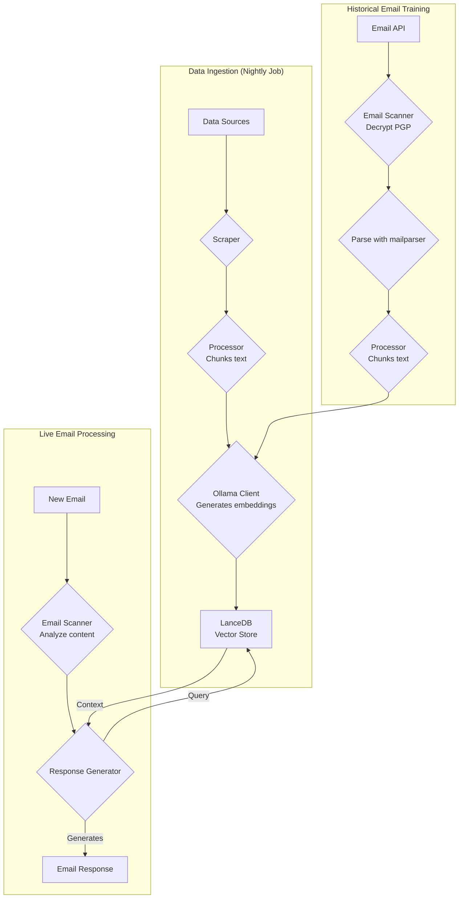
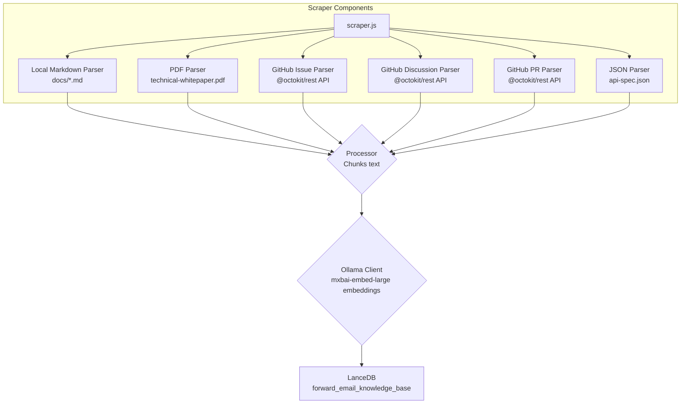
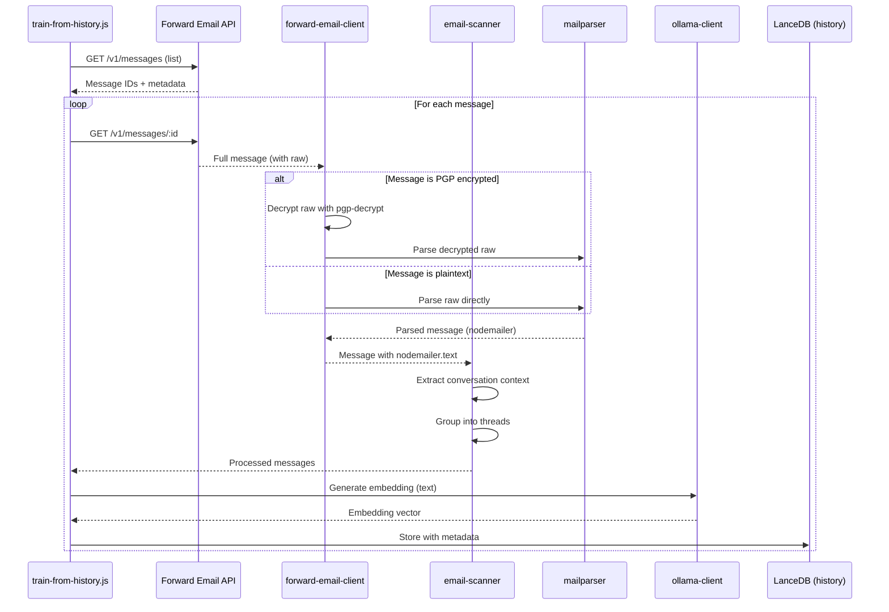

# Bygga en Integritetsfokuserad AI Kundsupportagent med LanceDB, Ollama och Node.js {#building-a-privacy-first-ai-customer-support-agent-with-lancedb-ollama-and-nodejs}


> \[!NOTE]
> Detta dokument täcker vår resa att bygga en självhostad AI-supportagent. Vi skrev om liknande utmaningar i vårt [Email Startup Graveyard](https://forwardemail.net/blog/docs/email-startup-graveyard-why-80-percent-email-companies-fail) blogginlägg. Vi funderade ärligt talat på att skriva en uppföljare kallad "AI Startup Graveyard" men kanske får vi vänta ett år eller så tills AI-bubblan eventuellt spricker(?). För nu är detta vår hjärnspillra om vad som fungerade, vad som inte gjorde det, och varför vi gjorde på detta sätt.

Så här byggde vi vår egen AI kundsupportagent. Vi gjorde det på det svåra sättet: självhostad, integritetsfokuserad och helt under vår kontroll. Varför? För att vi inte litar på tredjepartstjänster med våra kunders data. Det är ett krav enligt GDPR och DPA, och det är det rätta att göra.

Detta var inget roligt helgprojekt. Det var en månads lång resa genom trasiga beroenden, vilseledande dokumentation och den allmänna kaoset i open-source AI-ekosystemet 2025. Detta dokument är en redogörelse för vad vi byggde, varför vi byggde det, och de hinder vi stötte på längs vägen.


## Innehållsförteckning {#table-of-contents}

* [Kundfördelar: AI-förstärkt mänsklig support](#customer-benefits-ai-augmented-human-support)
  * [Snabbare, mer exakta svar](#faster-more-accurate-responses)
  * [Konsekvens utan utbrändhet](#consistency-without-burnout)
  * [Vad du får](#what-you-get)
* [En personlig reflektion: Två decennier av slit](#a-personal-reflection-the-two-decade-grind)
* [Varför integritet är viktigt](#why-privacy-matters)
* [Kostnadsanalys: Moln-AI vs Självhostad](#cost-analysis-cloud-ai-vs-self-hosted)
  * [Jämförelse av moln-AI-tjänster](#cloud-ai-service-comparison)
  * [Kostnadsuppdelning: 5GB kunskapsbas](#cost-breakdown-5gb-knowledge-base)
  * [Kostnader för självhostad hårdvara](#self-hosted-hardware-costs)
* [Att använda vår egen API](#dogfooding-our-own-api)
  * [Varför dogfooding är viktigt](#why-dogfooding-matters)
  * [API-användningsexempel](#api-usage-examples)
  * [Prestandafördelar](#performance-benefits)
* [Krypteringsarkitektur](#encryption-architecture)
  * [Lager 1: Brevlådekryptering (chacha20-poly1305)](#layer-1-mailbox-encryption-chacha20-poly1305)
  * [Lager 2: Meddelandenivå PGP-kryptering](#layer-2-message-level-pgp-encryption)
  * [Varför detta är viktigt för träning](#why-this-matters-for-training)
  * [Lagringssäkerhet](#storage-security)
  * [Lokal lagring är standardpraxis](#local-storage-is-standard-practice)
* [Arkitekturen](#the-architecture)
  * [Översiktlig flöde](#high-level-flow)
  * [Detaljerat scraper-flöde](#detailed-scraper-flow)
* [Hur det fungerar](#how-it-works)
  * [Bygga kunskapsbasen](#building-the-knowledge-base)
  * [Träning från historiska e-postmeddelanden](#training-from-historical-emails)
  * [Bearbetning av inkommande e-post](#processing-incoming-emails)
  * [Hantera vektordatabasen](#vector-store-management)
* [Vektordatabasens gravplats](#the-vector-database-graveyard)
* [Systemkrav](#system-requirements)
* [Cron-jobb konfiguration](#cron-job-configuration)
  * [Miljövariabler](#environment-variables)
  * [Cron-jobb för flera inkorgar](#cron-jobs-for-multiple-inboxes)
  * [Cron-schema uppdelning](#cron-schedule-breakdown)
  * [Dynamisk datumberäkning](#dynamic-date-calculation)
  * [Initial installation: Extrahera URL-lista från sitemap](#initial-setup-extract-url-list-from-sitemap)
  * [Testa cron-jobb manuellt](#testing-cron-jobs-manually)
  * [Övervaka loggar](#monitoring-logs)
* [Kodexempel](#code-examples)
  * [Scraping och bearbetning](#scraping-and-processing)
  * [Träning från historiska e-postmeddelanden](#training-from-historical-emails-1)
  * [Fråga efter kontext](#querying-for-context)
* [Framtiden: Spam-scanner F&U](#the-future-spam-scanner-rd)
* [Felsökning](#troubleshooting)
  * [Fel vid dimension-mismatch i vektor](#vector-dimension-mismatch-error)
  * [Tom kunskapsbas kontext](#empty-knowledge-base-context)
  * [PGP-dekrypteringsfel](#pgp-decryption-failures)
* [Användningstips](#usage-tips)
  * [Att uppnå inbox zero](#achieving-inbox-zero)
  * [Använda skip-ai etiketten](#using-the-skip-ai-label)
  * [E-posttrådar och svara alla](#email-threading-and-reply-all)
  * [Övervakning och underhåll](#monitoring-and-maintenance)
* [Testning](#testing)
  * [Köra tester](#running-tests)
  * [Testtäckning](#test-coverage)
  * [Testmiljö](#test-environment)
* [Viktiga lärdomar](#key-takeaways)
## Kundfördelar: AI-förstärkt mänsklig support {#customer-benefits-ai-augmented-human-support}

Vårt AI-system ersätter inte vårt supportteam – det gör dem bättre. Här är vad det betyder för dig:

### Snabbare, mer precisa svar {#faster-more-accurate-responses}

**Människa i loopen**: Varje AI-genererat utkast granskas, redigeras och kurateras av vårt mänskliga supportteam innan det skickas till dig. AI:n hanterar den initiala forskningen och utkastet, vilket frigör vårt team att fokusera på kvalitetskontroll och personalisering.

**Tränad på mänsklig expertis**: AI:n lär sig från:

* Vår handskrivna kunskapsbas och dokumentation
* Mänskligt författade blogginlägg och handledningar
* Vår omfattande FAQ (skriven av människor)
* Tidigare kundsamtal (alla hanterade av riktiga människor)

Du får svar som är baserade på år av mänsklig expertis, bara levererade snabbare.

### Konsekvens utan utbrändhet {#consistency-without-burnout}

Vårt lilla team hanterar hundratals supportförfrågningar dagligen, var och en kräver olika teknisk kunskap och mental kontextväxling:

* Faktureringsfrågor kräver kunskap om ekonomisystem
* DNS-problem kräver nätverksexpertis
* API-integration kräver programmeringskunskap
* Säkerhetsrapporter kräver sårbarhetsbedömning

Utan AI-hjälp leder denna ständiga kontextväxling till:

* Långsammare svarstider
* Mänskliga misstag på grund av trötthet
* Inkonsistent svarskvalitet
* Teamutbrändhet

**Med AI-förstärkning**:

* Svarar vårt team snabbare (AI utkast på sekunder)
* Gör färre misstag (AI fångar vanliga fel)
* Bibehåller konsekvent kvalitet (AI refererar till samma kunskapsbas varje gång)
* Håller sig fräscht och fokuserat (mindre tid på forskning, mer tid på att hjälpa)

### Vad du får {#what-you-get}

✅ **Hastighet**: AI utkastar svar på sekunder, människor granskar och skickar inom minuter

✅ **Noggrannhet**: Svar baserade på vår faktiska dokumentation och tidigare lösningar

✅ **Konsekvens**: Samma högkvalitativa svar oavsett om det är 9 på morgonen eller 9 på kvällen

✅ **Mänsklig touch**: Varje svar granskas och personaliseras av vårt team

✅ **Inga hallucinationer**: AI använder endast vår verifierade kunskapsbas, inte generisk internetdata

> \[!NOTE]
> **Du pratar alltid med människor**. AI är en forskningsassistent som hjälper vårt team att hitta rätt svar snabbare. Tänk på det som en bibliotekarie som omedelbart hittar rätt bok – men en människa läser den fortfarande och förklarar för dig.


## En personlig reflektion: Två decennier av slit {#a-personal-reflection-the-two-decade-grind}

Innan vi dyker ner i de tekniska detaljerna, en personlig notis. Jag har hållit på med detta i nästan två decennier. De oändliga timmarna vid tangentbordet, den obevekliga jakten på en lösning, det djupa, fokuserade slitandet – detta är verkligheten av att bygga något meningsfullt. Det är en verklighet som ofta förbises i hypen kring ny teknik.

Den senaste explosionen av AI har varit särskilt frustrerande. Vi säljs en dröm om automation, om AI-assistenter som ska skriva vår kod och lösa våra problem. Verkligheten? Resultatet är ofta skräp-kod som kräver mer tid att fixa än det skulle ha tagit att skriva från början. Löftet om att göra våra liv enklare är falskt. Det är en distraktion från det hårda, nödvändiga arbetet med att bygga.

Och sedan finns det catch-22 med att bidra till open source. Du är redan utspridd, utmattad av slitandet. Du använder AI för att hjälpa dig skriva en detaljerad, välstrukturerad bugg-rapport, i hopp om att göra det lättare för underhållare att förstå och fixa problemet. Och vad händer? Du blir tillrättavisad. Ditt bidrag avfärdas som "off-topic" eller låginsats, som vi såg i en nylig [Node.js GitHub-issue](https://github.com/nodejs/node/issues/60719#issuecomment-3534304321). Det är en örfil mot seniora utvecklare som bara försöker hjälpa till.

Detta är verkligheten i det ekosystem vi arbetar i. Det handlar inte bara om trasiga verktyg; det handlar om en kultur som ofta misslyckas med att respektera tiden och [insatsen från sina bidragsgivare](https://forwardemail.net/blog/docs/how-npm-packages-billion-downloads-shaped-javascript-ecosystem). Detta inlägg är en krönika över den verkligheten. Det är en berättelse om verktygen, ja, men också om den mänskliga kostnaden av att bygga i ett trasigt ekosystem som, trots alla löften, är fundamentalt trasigt.
## Varför integritet är viktigt {#why-privacy-matters}

Vårt [tekniska whitepaper](https://forwardemail.net/technical-whitepaper.pdf) täcker vår integritetsfilosofi på djupet. Den korta versionen: vi skickar aldrig kunddata till tredje part. Aldrig. Det betyder ingen OpenAI, ingen Anthropic, inga molnbaserade vektordatabaser. Allt körs lokalt på vår infrastruktur. Detta är icke-förhandlingsbart för GDPR-efterlevnad och våra DPA-åtaganden.


## Kostnadsanalys: Moln-AI vs Självhostat {#cost-analysis-cloud-ai-vs-self-hosted}

Innan vi går in på den tekniska implementeringen, låt oss prata om varför självhosting är viktigt ur ett kostnadsperspektiv. Prismodellerna för moln-AI-tjänster gör dem orimligt dyra för högvolymanvändning som kundsupport.

### Jämförelse av moln-AI-tjänster {#cloud-ai-service-comparison}

| Tjänst          | Leverantör          | Kostnad för embedding                                            | Kostnad för LLM (Input)                                                    | Kostnad för LLM (Output) | Integritetspolicy                                   | GDPR/DPA        | Hosting           | Data Delning      |
| --------------- | ------------------- | ---------------------------------------------------------------- | -------------------------------------------------------------------------- | ----------------------- | -------------------------------------------------- | --------------- | ----------------- | ----------------- |
| **OpenAI**      | OpenAI (US)         | [$0.02-0.13/1M tokens](https://openai.com/api/pricing/)          | $0.15-20/1M tokens                                                         | $0.60-80/1M tokens      | [Länk](https://openai.com/policies/privacy-policy/) | Begränsad DPA   | Azure (US)        | Ja (träning)      |
| **Claude**      | Anthropic (US)      | N/A                                                              | [$3-20/1M tokens](https://docs.claude.com/en/docs/about-claude/pricing)    | $15-80/1M tokens        | [Länk](https://www.anthropic.com/legal/privacy)    | Begränsad DPA   | AWS/GCP (US)      | Nej (påstått)     |
| **Gemini**      | Google (US)         | [$0.15/1M tokens](https://ai.google.dev/gemini-api/docs/pricing) | $0.30-1.00/1M tokens                                                       | $2.50/1M tokens         | [Länk](https://policies.google.com/privacy)        | Begränsad DPA   | GCP (US)          | Ja (förbättring) |
| **DeepSeek**    | DeepSeek (Kina)     | N/A                                                              | [$0.028-0.28/1M tokens](https://api-docs.deepseek.com/quick_start/pricing) | $0.42/1M tokens         | [Länk](https://www.deepseek.com/en)                 | Okänt           | Kina              | Okänt             |
| **Mistral**     | Mistral AI (Frankrike) | [$0.10/1M tokens](https://mistral.ai/pricing)                    | $0.40/1M tokens                                                            | $2.00/1M tokens         | [Länk](https://mistral.ai/terms/)                   | EU GDPR         | EU                | Okänt             |
| **Självhostat** | Du                  | $0 (befintlig hårdvara)                                          | $0 (befintlig hårdvara)                                                    | $0 (befintlig hårdvara) | Din policy                                         | Full efterlevnad | MacBook M5 + cron | Aldrig            |

> \[!WARNING]
> **Bekymmer kring datasuveränitet**: Amerikanska leverantörer (OpenAI, Claude, Gemini) omfattas av CLOUD Act, vilket ger amerikanska myndigheter tillgång till data. DeepSeek (Kina) verkar under kinesiska datalagar. Även om Mistral (Frankrike) erbjuder EU-hosting och GDPR-efterlevnad, är självhosting det enda alternativet för fullständig datasuveränitet och kontroll.

### Kostnadsuppdelning: 5GB kunskapsbas {#cost-breakdown-5gb-knowledge-base}

Låt oss beräkna kostnaden för att bearbeta en 5GB kunskapsbas (typisk för ett medelstort företag med dokument, e-post och supporthistorik).

**Antaganden:**

* 5GB text ≈ 1,25 miljarder tokens (förutsatt \~4 tecken/token)
* Initial generering av embedding
* Månatlig omträning (full re-embedding)
* 10 000 supportförfrågningar per månad
* Genomsnittlig förfrågan: 500 tokens input, 300 tokens output
**Detaljerad kostnadsuppdelning:**

| Komponent                             | OpenAI           | Claude          | Gemini               | Självhostad        |
| ------------------------------------ | ---------------- | --------------- | -------------------- | ------------------ |
| **Initial inbäddning** (1,25 miljarder tokens) | 25 000 $         | Ej tillgängligt | 187 500 $            | 0 $                |
| **Månadsfrågor** (10K × 800 tokens) | 1 200-16 000 $   | 2 400-16 000 $  | 2 400-3 200 $        | 0 $                |
| **Månatlig omträning** (1,25 miljarder tokens) | 25 000 $         | Ej tillgängligt | 187 500 $            | 0 $                |
| **Totalt första året**                | 325 200-217 000 $| 28 800-192 000 $| 2 278 800-2 226 000 $| ~60 $ (el)         |
| **Integritetsskydd**                  | ❌ Begränsat      | ❌ Begränsat    | ❌ Begränsat          | ✅ Fullständigt     |
| **Datasuveränitet**                   | ❌ Nej           | ❌ Nej          | ❌ Nej                | ✅ Ja               |

> \[!CAUTION]
> **Geminis inbäddningskostnader är katastrofala** på 0,15 $/1M tokens. En enda 5GB kunskapsbasinbäddning skulle kosta 187 500 $. Detta är 37 gånger dyrare än OpenAI och gör det helt oanvändbart i produktion.

### Självhostade hårdvarukostnader {#self-hosted-hardware-costs}

Vår setup körs på befintlig hårdvara som vi redan äger:

* **Hårdvara**: MacBook M5 (redan ägd för utveckling)
* **Ytterligare kostnad**: 0 $ (använder befintlig hårdvara)
* **Elkostnad**: ~5 $/månad (uppskattat)
* **Totalt första året**: ~60 $
* **Löpande**: 60 $/år

**ROI**: Självhosting har i princip noll marginalkostnad eftersom vi använder befintlig utvecklingshårdvara. Systemet körs via cron-jobb under lågtrafiktider.


## Att använda vår egen API internt {#dogfooding-our-own-api}

Ett av de viktigaste arkitekturvalen vi gjorde var att låta alla AI-jobb använda [Forward Email API](https://forwardemail.net/email-api) direkt. Detta är inte bara god praxis – det är en drivkraft för prestandaoptimering.

### Varför intern användning är viktigt {#why-dogfooding-matters}

När våra AI-jobb använder samma API-endpoints som våra kunder:

1. **Prestandaflaskhalsar påverkar oss först** – Vi känner smärtan innan kunderna gör det
2. **Optimering gynnar alla** – Förbättringar för våra jobb förbättrar automatiskt kundupplevelsen
3. **Verklighetstestad** – Våra jobb bearbetar tusentals e-postmeddelanden och ger kontinuerlig belastningstestning
4. **Kodåteranvändning** – Samma autentisering, hastighetsbegränsning, felhantering och cachelogik

### API-användningsexempel {#api-usage-examples}

**Lista meddelanden (train-from-history.js):**

```javascript
// Använder GET /v1/messages?folder=INBOX med BasicAuth
// Exkluderar eml, raw, nodemailer för att minska svarsstorlek (behöver bara ID:n)
const response = await axios.get(
  `${this.apiBase}/v1/messages`,
  {
    params: {
      folder: 'INBOX',
      limit: 100,
      eml: false,
      raw: false,
      nodemailer: false
    },
    auth: {
      username: process.env.FORWARD_EMAIL_ALIAS_USERNAME,
      password: process.env.FORWARD_EMAIL_ALIAS_PASSWORD
    }
  }
);

const messages = response.data;
// Returnerar: [{ id, subject, date, ... }, ...]
// Fullständigt meddelande hämtas senare via GET /v1/messages/:id
```

**Hämta fullständiga meddelanden (forward-email-client.js):**

```javascript
// Använder GET /v1/messages/:id för att hämta fullständigt meddelande med rådata
const response = await axios.get(
  `${this.apiBase}/v1/messages/${messageId}`,
  {
    auth: {
      username: this.aliasUsername,
      password: this.aliasPassword
    }
  }
);

const message = response.data;
// Returnerar: { id, subject, raw, eml, nodemailer: { ... }, ... }
```

**Skapa utkast till svar (process-inbox.js):**

```javascript
// Använder POST /v1/messages för att skapa utkast till svar
const response = await axios.post(
  `${this.apiBase}/v1/messages`,
  {
    folder: 'Drafts',
    subject: `Re: ${originalSubject}`,
    to: senderEmail,
    text: generatedResponse,
    inReplyTo: originalMessageId
  },
  {
    auth: {
      username: process.env.FORWARD_EMAIL_ALIAS_USERNAME,
      password: process.env.FORWARD_EMAIL_ALIAS_PASSWORD
    }
  }
);
```
### Performancefördelar {#performance-benefits}

Eftersom våra AI-jobb körs på samma API-infrastruktur:

* **Cachingoptimeringar** gynnar både jobb och kunder
* **Rate limiting** testas under verklig belastning
* **Felhantering** är stridstestad
* **API-svarstider** övervakas kontinuerligt
* **Databasfrågor** är optimerade för båda användningsfallen
* **Bandbreddsoptimering** – Att exkludera `eml`, `raw`, `nodemailer` vid listning minskar svarsstorleken med \~90%

När `train-from-history.js` bearbetar 1 000 e-postmeddelanden görs över 1 000 API-anrop. Alla ineffektiviteter i API:et blir omedelbart uppenbara. Detta tvingar oss att optimera IMAP-åtkomst, databasfrågor och svarsserialisering – förbättringar som direkt gynnar våra kunder.

**Exempel på optimering**: Att lista 100 meddelanden med fullständigt innehåll = \~10MB svar. Listning med `eml: false, raw: false, nodemailer: false` = \~100KB svar (100x mindre).


## Krypteringsarkitektur {#encryption-architecture}

Vår e-postlagring använder flera lager av kryptering, som AI-jobben måste dekryptera i realtid för träning.

### Lager 1: Mailbox-kryptering (chacha20-poly1305) {#layer-1-mailbox-encryption-chacha20-poly1305}

Alla IMAP-mailboxar lagras som SQLite-databaser krypterade med **chacha20-poly1305**, en kvantsäker krypteringsalgoritm. Detta beskrivs i vårt [blogginlägg om kvantsäker krypterad e-posttjänst](https://forwardemail.net/blog/docs/best-quantum-safe-encrypted-email-service).

**Nyckelattribut:**

* **Algoritm**: ChaCha20-Poly1305 (AEAD-chiffer)
* **Kvantsäker**: Motståndskraftig mot kvantdatorattacker
* **Lagring**: SQLite-databasfiler på disk
* **Åtkomst**: Dekrypteras i minnet vid åtkomst via IMAP/API

### Lager 2: Meddelandenivå PGP-kryptering {#layer-2-message-level-pgp-encryption}

Många supportmejl är dessutom krypterade med PGP (OpenPGP-standard). AI-jobben måste dekryptera dessa för att extrahera innehåll för träning.

**Dekrypteringsflöde:**

```javascript
// 1. API returnerar meddelande med krypterat råinnehåll
const message = await forwardEmailClient.getMessage(id);

// 2. Kontrollera om råinnehållet är PGP-krypterat
if (isMessageEncrypted(message.raw)) {
  // 3. Dekryptera med vår privata nyckel
  const decryptedRaw = await pgpDecrypt(message.raw);

  // 4. Parsar det dekrypterade MIME-meddelandet
  const parsed = await simpleParser(decryptedRaw);

  // 5. Fyll nodemailer med dekrypterat innehåll
  message.nodemailer = {
    text: parsed.text,
    html: parsed.html,
    from: parsed.from,
    to: parsed.to,
    subject: parsed.subject,
    date: parsed.date
  };
}
```

**PGP-konfiguration:**

```bash
# Privat nyckel för dekryptering (sökväg till ASCII-armorerad nyckelfil)
GPG_SECURITY_KEY="/path/to/private-key.asc"

# Lösenfras för privat nyckel (om krypterad)
GPG_SECURITY_PASSPHRASE="your-passphrase"
```

`pgp-decrypt.js` hjälpen:

1. Läser den privata nyckeln från disk en gång (cachelagrad i minnet)
2. Dekrypterar nyckeln med lösenfrasen
3. Använder den dekrypterade nyckeln för all meddelandekryptering
4. Stöder rekursiv dekryptering för inbäddade krypterade meddelanden

### Varför detta är viktigt för träning {#why-this-matters-for-training}

Utan korrekt dekryptering skulle AI:n träna på krypterat nonsens:

```
-----BEGIN PGP MESSAGE-----
Version: OpenPGP.js v4.10.10

wcBMA8Z3lHJnFnNUAQgAqK7F8...
-----END PGP MESSAGE-----
```

Med dekryptering tränar AI:n på faktiskt innehåll:

```
Subject: Re: Bug Report

Hi John,

Thanks for reporting this issue. I've confirmed the bug
and created a fix in PR #1234...
```

### Lagringssäkerhet {#storage-security}

Dekrypteringen sker i minnet under jobbets körning, och det dekrypterade innehållet konverteras till embeddings som sedan lagras i LanceDB-vektordatabasen på disk.

**Var datan finns:**

* **Vektordatabas**: Lagrad på krypterade MacBook M5-arbetsstationer
* **Fysisk säkerhet**: Arbetsstationerna stannar hos oss hela tiden (inte i datacenter)
* **Diskkryptering**: Full disk-kryptering på alla arbetsstationer
* **Nätverkssäkerhet**: Brandväggad och isolerad från publika nätverk

**Framtida datacenterdistribution:**
Om vi någonsin flyttar till datacenterhosting kommer servrarna att ha:

* LUKS full disk-kryptering
* USB-åtkomst inaktiverad
* Fysiska säkerhetsåtgärder
* Nätverksisolering
För fullständiga detaljer om våra säkerhetspraxis, se vår [Säkerhetssida](https://forwardemail.net/en/security).

> \[!NOTE]
> Vektordatabasen innehåller embeddings (matematiska representationer), inte den ursprungliga klartexten. Dock kan embeddings potentiellt bakåtkonstrueras, vilket är anledningen till att vi förvarar dem på krypterade, fysiskt säkrade arbetsstationer.

### Lokal lagring är standardpraxis {#local-storage-is-standard-practice}

Att lagra embeddings på vårt teams arbetsstationer skiljer sig inte från hur vi redan hanterar e-post:

* **Thunderbird**: Laddar ner och lagrar hela e-postinnehållet lokalt i mbox/maildir-filer
* **Webmail-klienter**: Cachar e-postdata i webbläsarens lagring och lokala databaser
* **IMAP-klienter**: Behåller lokala kopior av meddelanden för offlineåtkomst
* **Vårt AI-system**: Lagrar matematiska embeddings (inte klartext) i LanceDB

Den avgörande skillnaden: embeddings är **mer säkra** än klartext-e-post eftersom de är:

1. Matematiska representationer, inte läsbar text
2. Svårare att bakåtkonstruera än klartext
3. Fortfarande föremål för samma fysiska säkerhet som våra e-postklienter

Om det är acceptabelt för vårt team att använda Thunderbird eller webmail på krypterade arbetsstationer, är det lika acceptabelt (och möjligen säkrare) att lagra embeddings på samma sätt.


## Arkitekturen {#the-architecture}

Här är det grundläggande flödet. Det ser enkelt ut. Det var det inte.

> \[!NOTE]
> Alla jobb använder Forward Email API direkt, vilket säkerställer att prestandaoptimeringar gynnar både vårt AI-system och våra kunder.

### Översiktligt flöde {#high-level-flow}



### Detaljerat scraper-flöde {#detailed-scraper-flow}

`scraper.js` är hjärtat i dataingestionen. Det är en samling parsers för olika dataformat.




## Hur det fungerar {#how-it-works}

Processen är uppdelad i tre huvuddelar: att bygga kunskapsbasen, träna från historiska e-postmeddelanden och bearbeta nya e-postmeddelanden.

### Bygga kunskapsbasen {#building-the-knowledge-base}

**`update-knowledge-base.js`**: Detta är huvudjobbet. Det körs varje natt, rensar den gamla vektorlagringen och bygger upp den från grunden. Det använder `scraper.js` för att hämta innehåll från alla källor, `processor.js` för att dela upp det i bitar, och `ollama-client.js` för att generera embeddings. Slutligen lagrar `vector-store.js` allt i LanceDB.

**Datakällor:**

* Lokala Markdown-filer (`docs/*.md`)
* Teknisk vitbok PDF (`assets/technical-whitepaper.pdf`)
* API-spec JSON (`assets/api-spec.json`)
* GitHub-ärenden (via Octokit)
* GitHub-diskussioner (via Octokit)
* GitHub pull requests (via Octokit)
* Sitemap URL-lista (`$LANCEDB_PATH/valid-urls.json`)

### Träning från historiska e-postmeddelanden {#training-from-historical-emails}

**`train-from-history.js`**: Detta jobb skannar historiska e-postmeddelanden från alla mappar, dekrypterar PGP-krypterade meddelanden och lägger till dem i en separat vektorlagring (`customer_support_history`). Detta ger kontext från tidigare supportinteraktioner.
**E-postbehandlingsflöde:**



**Viktiga funktioner:**

* **PGP-dekryptering**: Använder `pgp-decrypt.js` hjälpskript med miljövariabeln `GPG_SECURITY_KEY`
* **Trådgruppering**: Grupperar relaterade e-postmeddelanden till konversations-trådar
* **Bevarande av metadata**: Sparar mapp, ämne, datum, krypteringsstatus
* **Svarskontext**: Länkar meddelanden med deras svar för bättre kontext

**Konfiguration:**

```bash
# Miljövariabler för train-from-history
HISTORY_SCAN_LIMIT=1000              # Max antal meddelanden att bearbeta
HISTORY_SCAN_SINCE="2024-01-01"      # Bearbeta endast meddelanden efter detta datum
HISTORY_DECRYPT_PGP=true             # Försök PGP-dekryptering
GPG_SECURITY_KEY="/path/to/key.asc"  # Sökväg till PGP privat nyckel
GPG_SECURITY_PASSPHRASE="passphrase" # Nyckelns lösenfras (valfritt)
```

**Vad som sparas:**

```javascript
{
  type: 'historical_email',
  folder: 'INBOX',
  subject: 'Re: Bug Report',
  date: '2025-01-15T10:30:00Z',
  messageId: '67e2f288893921...',
  threadId: 'Bug Report',
  hasReply: true,
  encrypted: true,
  decrypted: true,
  replySubject: 'Bug Report',
  replyText: 'First 500 chars of reply...',
  chunkSize: 1000,
  chunkOverlap: 200,
  chunkIndex: 0
}
```

> \[!TIP]
> Kör `train-from-history` efter initial installation för att fylla på den historiska kontexten. Detta förbättrar svarskvaliteten dramatiskt genom att lära från tidigare supportinteraktioner.

### Bearbetning av inkommande e-post {#processing-incoming-emails}

**`process-inbox.js`**: Detta jobb körs på e-post i våra brevlådor `support@forwardemail.net`, `abuse@forwardemail.net` och `security@forwardemail.net` (specifikt IMAP-mappvägen `INBOX`). Det använder vår API på <https://forwardemail.net/email-api> (t.ex. `GET /v1/messages?folder=INBOX` med BasicAuth-access med våra IMAP-uppgifter för varje brevlåda). Det analyserar e-postinnehållet, frågar både kunskapsbasen (`forward_email_knowledge_base`) och den historiska e-postvektorlagringen (`customer_support_history`), och skickar sedan den kombinerade kontexten till `response-generator.js`. Generatorn använder `mxbai-embed-large` via Ollama för att skapa ett svar.

**Automatiserade arbetsflödesfunktioner:**

1. **Inbox Zero Automation**: Efter att ett utkast framgångsrikt skapats flyttas originalmeddelandet automatiskt till Arkiv-mappen. Detta håller din inkorg ren och hjälper dig att uppnå inbox zero utan manuell hantering.

2. **Hoppa över AI-behandling**: Lägg enkelt till etiketten `skip-ai` (skiftlägesokänsligt) på ett meddelande för att förhindra AI-behandling. Meddelandet förblir orört i din inkorg så att du kan hantera det manuellt. Detta är användbart för känsliga meddelanden eller komplexa ärenden som kräver mänskligt omdöme.

3. **Korrekt e-posttrådning**: Alla utkastssvar inkluderar originalmeddelandet citerat nedan (med standardprefixet ` >  `), enligt e-postsvarskonventioner med formatet "On \[datum], \[avsändare] wrote:". Detta säkerställer korrekt kontext och trådning i e-postklienter.

4. **Svara-till-alla-beteende**: Systemet hanterar automatiskt Reply-To-huvuden och CC-mottagare:
   * Om ett Reply-To-huvud finns blir det Till-adressen och originalets Från läggs till i CC
   * Alla ursprungliga Till- och CC-mottagare inkluderas i svar-CC (utom din egen adress)
   * Följer standardkonventioner för svar-till-alla i gruppkonversationer
**Källranking**: Systemet använder **viktad ranking** för att prioritera källor:

* FAQ: 100% (högsta prioritet)
* Teknisk vitbok: 95%
* API-specifikation: 90%
* Officiell dokumentation: 85%
* GitHub-ärenden: 70%
* Historiska e-postmeddelanden: 50%

### Vector Store Management {#vector-store-management}

`VectorStore`-klassen i `helpers/customer-support-ai/vector-store.js` är vårt gränssnitt till LanceDB.

**Lägga till dokument:**

```javascript
// vector-store.js
async addDocument(text, metadata) {
  const embedding = await this.ollama.generateEmbedding(text);
  await this.table.add([{
    vector: embedding,
    text,
    ...metadata
  }]);
}
```

**Rensa lagret:**

```javascript
// Alternativ 1: Använd clear()-metoden
await vectorStore.clear();

// Alternativ 2: Ta bort den lokala databasmappen
await fs.rm(process.env.LANCEDB_PATH, { recursive: true, force: true });
```

Miljövariabeln `LANCEDB_PATH` pekar på den lokala inbäddade databasens katalog. LanceDB är serverlös och inbäddad, så det finns ingen separat process att hantera.


## The Vector Database Graveyard {#the-vector-database-graveyard}

Detta var det första stora hindret. Vi testade flera vektordatabaser innan vi bestämde oss för LanceDB. Här är vad som gick fel med varje.

| Databas     | GitHub                                                      | Vad som gick fel                                                                                                                                                                                                    | Specifika problem                                                                                                                                                                                                                                                                                                                                                         | Säkerhetsproblem                                                                                                                                                                                                |
| ------------ | ----------------------------------------------------------- | ------------------------------------------------------------------------------------------------------------------------------------------------------------------------------------------------------------------ | ------------------------------------------------------------------------------------------------------------------------------------------------------------------------------------------------------------------------------------------------------------------------------------------------------------------------------------------------------------------------- | ---------------------------------------------------------------------------------------------------------------------------------------------------------------------------------------------------------------- |
| **ChromaDB** | [chroma-core/chroma](https://github.com/chroma-core/chroma) | `pip3 install chromadb` ger dig en version från stenåldern med `PydanticImportError`. Det enda sättet att få en fungerande version är att kompilera från källkod. Inte utvecklarvänligt.                            | Kaos med Python-beroenden. Flera användare rapporterar trasiga pip-installationer ([#774](https://github.com/chroma-core/chroma/issues/774), [#163](https://github.com/chroma-core/chroma/issues/163)). Dokumentationen säger "använd bara Docker" vilket är ett icke-svar för lokal utveckling. Krasch på Windows med >99 poster ([#3058](https://github.com/chroma-core/chroma/issues/3058)). | **CVE-2024-45848**: Godtycklig kodexekvering via ChromaDB-integration i MindsDB. Kritiska OS-sårbarheter i Docker-image ([#3170](https://github.com/chroma-core/chroma/issues/3170)).                      |
| **Qdrant**   | [qdrant/qdrant](https://github.com/qdrant/qdrant)           | Homebrew-tappen (`qdrant/qdrant/qdrant`) som refererades i deras gamla dokumentation är borta. Försvunnen. Ingen förklaring. Den officiella dokumentationen säger nu bara "använd Docker."                          | Saknad Homebrew-tapp. Ingen inbyggd macOS-binär. Endast Docker är ett hinder för snabb lokal testning.                                                                                                                                                                                                                                                                   | **CVE-2024-2221**: Sårbarhet för godtycklig filuppladdning som möjliggör fjärrkodexekvering (fixad i v1.9.0). Svagt säkerhetsmognadspoäng från [IronCore Labs](https://ironcorelabs.com/vectordbs/qdrant-security/). |
| **Weaviate** | [weaviate/weaviate](https://github.com/weaviate/weaviate)   | Homebrew-versionen hade en kritisk klustringsbugg (`leader not found`). De dokumenterade flaggorna för att fixa det (`RAFT_JOIN`, `CLUSTER_HOSTNAME`) fungerade inte. Fundamentalt trasig för en-nodsinstallationer. | Klustringsbuggar även i en-nods-läge. Överkomplicerad för enkla användningsfall.                                                                                                                                                                                                                                                                                           | Inga större CVE:er hittade, men komplexiteten ökar attackytan.                                                                                                                                                    |
| **LanceDB**  | [lancedb/lancedb](https://github.com/lancedb/lancedb)       | Den här fungerade. Den är inbäddad och serverlös. Ingen separat process. Det enda irritationsmomentet är den förvirrande paketnamngivningen (`vectordb` är föråldrat, använd `@lancedb/lancedb`) och spridd dokumentation. Vi kan leva med det. | Förvirring kring paketnamn (`vectordb` vs `@lancedb/lancedb`), men annars stabil. Inbäddad arkitektur eliminerar hela klasser av säkerhetsproblem.                                                                                                                                                                                                                         | Inga kända CVE:er. Inbäddad design innebär ingen nätverksattackyta.                                                                                                                                              |
> \[!WARNING]
> **ChromaDB har kritiska säkerhetssårbarheter.** [CVE-2024-45848](https://nvd.nist.gov/vuln/detail/CVE-2024-45848) möjliggör godtycklig kodexekvering. Pip-installationen är fundamentalt trasig med Pydantic beroendeproblem. Undvik för produktionsanvändning.

> \[!WARNING]
> **Qdrant hade en filuppladdnings-RCE-sårbarhet** ([CVE-2024-2221](https://qdrant.tech/blog/cve-2024-2221-response/)) som endast åtgärdades i v1.9.0. Om du måste använda Qdrant, se till att du har den senaste versionen.

> \[!CAUTION]
> Ekosystemet för open-source vektordatabaser är tufft. Lita inte på dokumentationen. Anta att allt är trasigt tills motsatsen bevisats. Testa lokalt innan du binder dig till en stack.


## Systemkrav {#system-requirements}

* **Node.js:** v18.0.0+ ([GitHub](https://github.com/nodejs/node))
* **Ollama:** Senaste ([GitHub](https://github.com/ollama/ollama))
* **Modell:** `mxbai-embed-large` via Ollama
* **Vektordatabas:** LanceDB ([GitHub](https://github.com/lancedb/lancedb))
* **GitHub Access:** `@octokit/rest` för att skrapa issues ([GitHub](https://github.com/octokit/rest.js))
* **SQLite:** För primär databas (via `mongoose-to-sqlite`)


## Cron Job-konfiguration {#cron-job-configuration}

Alla AI-jobb körs via cron på en MacBook M5. Så här ställer du in cron-jobben för att köra vid midnatt över flera inkorgar.

### Miljövariabler {#environment-variables}

Jobben kräver dessa miljövariabler. De flesta kan sättas i `.env`-filen (laddas via `@ladjs/env`), men `HISTORY_SCAN_SINCE` måste beräknas dynamiskt i crontab.

**I `.env`-filen:**

```bash
# Forward Email API-uppgifter (varierar per inkorg)
FORWARD_EMAIL_ALIAS_USERNAME=support@forwardemail.net
FORWARD_EMAIL_ALIAS_PASSWORD=ditt-imap-lösenord

# PGP-dekryptering (delas mellan alla inkorgar)
GPG_SECURITY_KEY=/path/to/private-key.asc
GPG_SECURITY_PASSPHRASE=ditt-lösenord

# Historisk skanningskonfiguration
HISTORY_SCAN_LIMIT=1000

# LanceDB-sökväg
LANCEDB_PATH=/path/to/lancedb
```

**I crontab (beräknas dynamiskt):**

```bash
# HISTORY_SCAN_SINCE måste sättas inline i crontab med shell date-beräkning
# Kan inte vara i .env-fil eftersom @ladjs/env inte utvärderar shell-kommandon
HISTORY_SCAN_SINCE="$(date -v-1d +%Y-%m-%d)"  # macOS
HISTORY_SCAN_SINCE="$(date -d 'yesterday' +%Y-%m-%d)"  # Linux
```

### Cron-jobb för flera inkorgar {#cron-jobs-for-multiple-inboxes}

Redigera din crontab med `crontab -e` och lägg till:

```bash
# Uppdatera kunskapsbas (körs en gång, delas mellan alla inkorgar)
0 0 * * * cd /path/to/forwardemail.net && LANCEDB_PATH="/path/to/lancedb" GPG_SECURITY_KEY="/path/to/key.asc" GPG_SECURITY_PASSPHRASE="pass" node jobs/customer-support-ai/update-knowledge-base.js >> /var/log/update-knowledge-base.log 2>&1

# Träna från historik - support@forwardemail.net
0 0 * * * cd /path/to/forwardemail.net && FORWARD_EMAIL_ALIAS_USERNAME="support@forwardemail.net" FORWARD_EMAIL_ALIAS_PASSWORD="support-password" HISTORY_SCAN_SINCE="$(date -v-1d +%Y-%m-%d)" HISTORY_SCAN_LIMIT=1000 GPG_SECURITY_KEY="/path/to/key.asc" GPG_SECURITY_PASSPHRASE="pass" LANCEDB_PATH="/path/to/lancedb" node jobs/customer-support-ai/train-from-history.js >> /var/log/train-support.log 2>&1

# Träna från historik - abuse@forwardemail.net
0 0 * * * cd /path/to/forwardemail.net && FORWARD_EMAIL_ALIAS_USERNAME="abuse@forwardemail.net" FORWARD_EMAIL_ALIAS_PASSWORD="abuse-password" HISTORY_SCAN_SINCE="$(date -v-1d +%Y-%m-%d)" HISTORY_SCAN_LIMIT=1000 GPG_SECURITY_KEY="/path/to/key.asc" GPG_SECURITY_PASSPHRASE="pass" LANCEDB_PATH="/path/to/lancedb" node jobs/customer-support-ai/train-from-history.js >> /var/log/train-abuse.log 2>&1

# Träna från historik - security@forwardemail.net
0 0 * * * cd /path/to/forwardemail.net && FORWARD_EMAIL_ALIAS_USERNAME="security@forwardemail.net" FORWARD_EMAIL_ALIAS_PASSWORD="security-password" HISTORY_SCAN_SINCE="$(date -v-1d +%Y-%m-%d)" HISTORY_SCAN_LIMIT=1000 GPG_SECURITY_KEY="/path/to/key.asc" GPG_SECURITY_PASSPHRASE="pass" LANCEDB_PATH="/path/to/lancedb" node jobs/customer-support-ai/train-from-history.js >> /var/log/train-security.log 2>&1

# Bearbeta inkorg - support@forwardemail.net
*/5 * * * * cd /path/to/forwardemail.net && FORWARD_EMAIL_ALIAS_USERNAME="support@forwardemail.net" FORWARD_EMAIL_ALIAS_PASSWORD="support-password" GPG_SECURITY_KEY="/path/to/key.asc" GPG_SECURITY_PASSPHRASE="pass" LANCEDB_PATH="/path/to/lancedb" node jobs/customer-support-ai/process-inbox.js >> /var/log/process-support.log 2>&1

# Bearbeta inkorg - abuse@forwardemail.net
*/5 * * * * cd /path/to/forwardemail.net && FORWARD_EMAIL_ALIAS_USERNAME="abuse@forwardemail.net" FORWARD_EMAIL_ALIAS_PASSWORD="abuse-password" GPG_SECURITY_KEY="/path/to/key.asc" GPG_SECURITY_PASSPHRASE="pass" LANCEDB_PATH="/path/to/lancedb" node jobs/customer-support-ai/process-inbox.js >> /var/log/process-abuse.log 2>&1

# Bearbeta inkorg - security@forwardemail.net
*/5 * * * * cd /path/to/forwardemail.net && FORWARD_EMAIL_ALIAS_USERNAME="security@forwardemail.net" FORWARD_EMAIL_ALIAS_PASSWORD="security-password" GPG_SECURITY_KEY="/path/to/key.asc" GPG_SECURITY_PASSPHRASE="pass" LANCEDB_PATH="/path/to/lancedb" node jobs/customer-support-ai/process-inbox.js >> /var/log/process-security.log 2>&1
```
### Cron Schema Uppdelning {#cron-schedule-breakdown}

| Jobb                    | Schema       | Beskrivning                                                                       |
| ----------------------- | ------------ | --------------------------------------------------------------------------------- |
| `train-from-sitemap.js` | `0 0 * * 0`  | Veckovis (söndag midnatt) - Hämtar alla URL:er från sitemap och tränar kunskapsbas |
| `train-from-history.js` | `0 0 * * *`  | Midnatt dagligen - Skannar föregående dags e-post per inkorg                      |
| `process-inbox.js`      | `*/5 * * * *`| Var 5:e minut - Bearbetar nya e-postmeddelanden och genererar utkast              |

### Dynamisk Datumberäkning {#dynamic-date-calculation}

Variabeln `HISTORY_SCAN_SINCE` **måste beräknas inline i crontab** eftersom:

1. `.env`-filer läses som bokstavliga strängar av `@ladjs/env`
2. Shell-kommandosubstitution `$(...)` fungerar inte i `.env`-filer
3. Datumet behöver beräknas färskt varje gång cron körs

**Korrekt tillvägagångssätt (i crontab):**

```bash
# macOS (BSD date)
HISTORY_SCAN_SINCE="$(date -v-1d +%Y-%m-%d)" node jobs/...

# Linux (GNU date)
HISTORY_SCAN_SINCE="$(date -d 'yesterday' +%Y-%m-%d)" node jobs/...
```

**Felaktigt tillvägagångssätt (fungerar inte i .env):**

```bash
# Detta kommer att läsas som bokstavlig sträng "$(date -v-1d +%Y-%m-%d)"
# EJ utvärderas som ett shell-kommando
HISTORY_SCAN_SINCE=$(date -v-1d +%Y-%m-%d)
```

Detta säkerställer att varje nattkörning beräknar föregående dags datum dynamiskt och undviker onödigt arbete.

### Initial Setup: Extrahera URL-lista från Sitemap {#initial-setup-extract-url-list-from-sitemap}

Innan du kör process-inbox-jobbet för första gången måste du **extrahera URL-listan från sitemap**. Detta skapar en ordlista med giltiga URL:er som LLM kan referera till och förhindrar URL-hallucination.

```bash
# Första gången setup: Extrahera URL-lista från sitemap
cd /path/to/forwardemail.net
node jobs/customer-support-ai/train-from-sitemap.js
```

**Detta gör:**

1. Hämtar alla URL:er från <https://forwardemail.net/sitemap.xml>
2. Filtrerar till endast icke-lokaliserade URL:er eller /en/ URL:er (undviker duplicerat innehåll)
3. Tar bort lokal-prefix (/en/faq → /faq)
4. Sparar en enkel JSON-fil med URL-listan till `$LANCEDB_PATH/valid-urls.json`
5. Ingen crawling, ingen metadata-skrapning – bara en platt lista med giltiga URL:er

**Varför detta är viktigt:**

* Förhindrar att LLM hallucinerar falska URL:er som `/dashboard` eller `/login`
* Ger en vitlista med giltiga URL:er för svarsgeneratorn att referera till
* Enkelt, snabbt och kräver ingen vektordatabaslagring
* Svarsgeneratorn laddar denna lista vid start och inkluderar den i prompten

**Lägg till i crontab för veckouppdateringar:**

```bash
# Extrahera URL-lista från sitemap - veckovis på söndag midnatt
0 0 * * 0 cd /path/to/forwardemail.net && node jobs/customer-support-ai/train-from-sitemap.js >> /var/log/train-sitemap.log 2>&1
```

### Testa Cron-jobb Manuellt {#testing-cron-jobs-manually}

För att testa ett jobb innan du lägger till det i cron:

```bash
# Testa sitemap-träning
cd /path/to/forwardemail.net
export LANCEDB_PATH="/path/to/lancedb"
node jobs/customer-support-ai/train-from-sitemap.js

# Testa supportinkorgsträning
cd /path/to/forwardemail.net
export FORWARD_EMAIL_ALIAS_USERNAME="support@forwardemail.net"
export FORWARD_EMAIL_ALIAS_PASSWORD="support-password"
export HISTORY_SCAN_SINCE="$(date -v-1d +%Y-%m-%d)"
export HISTORY_SCAN_LIMIT=1000
export GPG_SECURITY_KEY="/path/to/key.asc"
export GPG_SECURITY_PASSPHRASE="pass"
export LANCEDB_PATH="/path/to/lancedb"
node jobs/customer-support-ai/train-from-history.js
```

### Övervakning av Loggar {#monitoring-logs}

Varje jobb loggar till en separat fil för enkel felsökning:

```bash
# Övervaka supportinkorgsbehandling i realtid
tail -f /var/log/process-support.log

# Kontrollera gårdagens träningskörning
cat /var/log/train-support.log | grep "$(date -v-1d +%Y-%m-%d)"

# Visa alla fel över jobb
grep -i error /var/log/train-*.log /var/log/process-*.log
```

> \[!TIP]
> Använd separata loggfiler per inkorg för att isolera problem. Om en inkorg har autentiseringsproblem kommer det inte att förorena loggar för andra inkorgar.
## Code Examples {#code-examples}

### Scraping and Processing {#scraping-and-processing}

```javascript
// jobs/customer-support-ai/update-knowledge-base.js
const scraper = new Scraper();
const processor = new Processor();
const ollamaClient = new OllamaClient();
const vectorStore = new VectorStore();

// Clear old data
await vectorStore.clear();

// Scrape all sources
const documents = await scraper.scrapeAll();
console.log(`Scraped ${documents.length} documents`);

// Process into chunks
const allChunks = [];
for (const doc of documents) {
  const chunks = processor.processDocuments([doc]);
  allChunks.push(...chunks);
}
console.log(`Generated ${allChunks.length} chunks`);

// Generate embeddings and store
const texts = allChunks.map(chunk => chunk.text);
const embeddings = await ollamaClient.generateEmbeddings(texts);

for (let i = 0; i < allChunks.length; i++) {
  await vectorStore.addDocument(texts[i], {
    ...allChunks[i].metadata,
    embedding: embeddings[i]
  });
}
```

### Training from Historical Emails {#training-from-historical-emails-1}

```javascript
// jobs/customer-support-ai/train-from-history.js
const scanner = new EmailScanner({
  forwardEmailApiBase: config.forwardEmailApiBase,
  forwardEmailAliasUsername: config.forwardEmailAliasUsername,
  forwardEmailAliasPassword: config.forwardEmailAliasPassword
});

const vectorStore = new VectorStore({
  collectionName: 'customer_support_history'
});

// Scan all folders (INBOX, Sent Mail, etc.)
const messages = await scanner.scanAllFolders({
  limit: 1000,
  since: new Date('2024-01-01'),
  decryptPGP: true
});

// Group into conversation threads
const threads = scanner.groupIntoThreads(messages);

// Process each thread
for (const thread of threads) {
  const context = scanner.extractConversationContext(thread);

  for (const message of context.messages) {
    // Skip encrypted messages that couldn't be decrypted
    if (message.encrypted && !message.decrypted) continue;

    // Use already-parsed content from nodemailer
    const text = message.nodemailer?.text || '';
    if (!text.trim()) continue;

    // Chunk and store
    const chunks = processor.chunkText(`Subject: ${message.subject}\n\n${text}`, {
      chunkSize: 1000,
      chunkOverlap: 200
    });

    for (const chunk of chunks) {
      await vectorStore.addDocument(chunk.text, {
        type: 'historical_email',
        folder: message.folder,
        subject: message.subject,
        date: message.nodemailer?.date || message.created_at,
        messageId: message.id,
        threadId: context.subject,
        encrypted: message.encrypted || false,
        decrypted: message.decrypted || false,
        ...chunk.metadata
      });
    }
  }
}
```

### Querying for Context {#querying-for-context}

```javascript
// jobs/customer-support-ai/process-inbox.js
const vectorStore = new VectorStore();
const historyVectorStore = new VectorStore({
  collectionName: 'customer_support_history'
});

// Query both stores
const knowledgeContext = await vectorStore.query(emailEmbedding, { limit: 8 });
const historyContext = await historyVectorStore.query(emailEmbedding, { limit: 3 });

// Weighted ranking and deduplication happen here
const rankedContext = rankAndDeduplicateContext(knowledgeContext, historyContext);

// Generate response
const response = await responseGenerator.generate(email, rankedContext);
```


## The Future: Spam Scanner R\&D {#the-future-spam-scanner-rd}

Det här hela projektet var inte bara för kundsupport. Det var FoU. Vi kan nu ta allt vi lärt oss om lokala embeddings, vektorlagringar och kontextåtervinning och tillämpa det på vårt nästa stora projekt: LLM-lagret för [Spam Scanner](https://spamscanner.net). Samma principer om integritet, självhosting och semantisk förståelse kommer att vara nyckeln.


## Troubleshooting {#troubleshooting}

### Vector Dimension Mismatch Error {#vector-dimension-mismatch-error}

**Fel:**

```
Error: Failed to execute query stream: GenericFailure, Invalid input, No vector column found to match with the query vector dimension: 1024
```

**Orsak:** Detta fel uppstår när du byter embeddingsmodell (t.ex. från `mistral-small` till `mxbai-embed-large`) men den befintliga LanceDB-databasen skapades med en annan vektordimension.
**Lösning:** Du behöver träna om kunskapsbasen med den nya inbäddningsmodellen:

```bash
# 1. Stoppa alla pågående kundsupport-AI-jobb
pkill -f customer-support-ai

# 2. Ta bort den befintliga LanceDB-databasen
rm -rf ~/.local/share/lancedb/forward_email_knowledge_base.lance
rm -rf ~/.local/share/lancedb/customer_support_history.lance

# 3. Verifiera att inbäddningsmodellen är korrekt inställd i .env
grep OLLAMA_EMBEDDING_MODEL .env
# Bör visa: OLLAMA_EMBEDDING_MODEL=mxbai-embed-large

# 4. Hämta inbäddningsmodellen i Ollama
ollama pull mxbai-embed-large

# 5. Träna om kunskapsbasen
node jobs/customer-support-ai/train-from-history.js

# 6. Starta om process-inbox-jobbet via Bree
# Jobbet körs automatiskt var 5:e minut
```

**Varför detta händer:** Olika inbäddningsmodeller producerar vektorer med olika dimensioner:

* `mistral-small`: 1024 dimensioner
* `mxbai-embed-large`: 1024 dimensioner
* `nomic-embed-text`: 768 dimensioner
* `all-minilm`: 384 dimensioner

LanceDB lagrar vektordimensionen i tabellschemat. När du frågar med en annan dimension misslyckas det. Den enda lösningen är att återskapa databasen med den nya modellen.

### Tomt Kunskapsbas-sammanhang {#empty-knowledge-base-context}

**Symptom:**

```
debug     Retrieved knowledge base context {
  total: 0,
  afterRanking: 0,
  questionType: 'capability'
}
```

**Orsak:** Kunskapsbasen har inte tränats än, eller så finns inte LanceDB-tabellen.

**Lösning:** Kör träningsjobbet för att fylla kunskapsbasen:

```bash
# Träna från historiska e-postmeddelanden
node jobs/customer-support-ai/train-from-history.js

# Eller träna från webbplats/dokumentation (om du har en scraper)
node jobs/customer-support-ai/train-from-website.js
```

### PGP-avkrypteringsfel {#pgp-decryption-failures}

**Symptom:** Meddelanden visas som krypterade men innehållet är tomt.

**Lösning:**

1. Verifiera att GPG-nyckelns sökväg är korrekt inställd:

```bash
grep GPG_SECURITY_KEY .env
# Bör peka på din privata nyckelfil
```

2. Testa avkryptering manuellt:

```bash
node -e "const decrypt = require('./helpers/customer-support-ai/pgp-decrypt'); decrypt.testDecryption();"
```

3. Kontrollera nyckelbehörigheter:

```bash
ls -la /path/to/your/gpg-key.asc
# Bör vara läsbar för användaren som kör jobbet
```


## Användningstips {#usage-tips}

### Uppnå Inbox Zero {#achieving-inbox-zero}

Systemet är designat för att hjälpa dig uppnå inbox zero automatiskt:

1. **Automatisk arkivering**: När ett utkast skapas framgångsrikt flyttas det ursprungliga meddelandet automatiskt till Arkiv-mappen. Detta håller din inkorg ren utan manuell inblandning.

2. **Granska utkast**: Kontrollera mappen Utkast regelbundet för att granska AI-genererade svar. Redigera vid behov innan du skickar.

3. **Manuell överstyrning**: För meddelanden som behöver särskild uppmärksamhet, lägg helt enkelt till etiketten `skip-ai` innan jobbet körs.

### Använda etiketten skip-ai {#using-the-skip-ai-label}

För att förhindra AI-behandling av specifika meddelanden:

1. **Lägg till etiketten**: I din e-postklient, lägg till en `skip-ai`-etikett/tagg på valfritt meddelande (skiftlägesokänsligt)
2. **Meddelandet stannar i inkorgen**: Meddelandet kommer inte att behandlas eller arkiveras
3. **Hantera manuellt**: Du kan svara på det själv utan AI-inblandning

**När du ska använda skip-ai:**

* Känsliga eller konfidentiella meddelanden
* Komplexa ärenden som kräver mänskligt omdöme
* Meddelanden från VIP-kunder
* Juridiska eller efterlevnadsrelaterade förfrågningar
* Meddelanden som behöver omedelbar mänsklig uppmärksamhet

### E-posttrådar och Svara Alla {#email-threading-and-reply-all}

Systemet följer standard e-postkonventioner:

**Citerade ursprungliga meddelanden:**

```
Hej,

[AI-genererat svar]

--
Tack,
Forward Email
https://forwardemail.net

On Mon, Jan 15, 2024, 3:45 PM John Doe <john@example.com> wrote:
> Detta är det ursprungliga meddelandet
> med varje rad citerad
> med standardprefixet "> "
```

**Hantera Reply-To:**

* Om det ursprungliga meddelandet har en Reply-To-header, svarar utkastet till den adressen
* Den ursprungliga From-adressen läggs till i CC
* Alla andra ursprungliga To- och CC-mottagare bevaras

**Exempel:**

```
Ursprungligt meddelande:
  Från: john@company.com
  Reply-To: support@company.com
  Till: support@forwardemail.net
  CC: manager@company.com

Utkastssvar:
  Till: support@company.com (från Reply-To)
  CC: john@company.com, manager@company.com
```
### Övervakning och Underhåll {#monitoring-and-maintenance}

**Kontrollera utkastens kvalitet regelbundet:**

```bash
# Visa senaste utkasten
tail -f /var/log/process-support.log | grep "Draft created"
```

**Övervaka arkivering:**

```bash
# Kontrollera arkiveringsfel
grep "archive message" /var/log/process-*.log
```

**Granska bortglömda meddelanden:**

```bash
# Se vilka meddelanden som hoppades över
grep "skip-ai label" /var/log/process-*.log
```


## Testning {#testing}

Kundsupportens AI-system inkluderar omfattande testtäckning med 23 Ava-tester.

### Köra Tester {#running-tests}

På grund av npm-paketkonflikter med `better-sqlite3`, använd det medföljande testskriptet:

```bash
# Kör alla kundsupport AI-tester
./scripts/test-customer-support-ai.sh

# Kör med detaljerad utdata
./scripts/test-customer-support-ai.sh --verbose

# Kör specifik testfil
./scripts/test-customer-support-ai.sh test/customer-support-ai/message-utils.js
```

Alternativt, kör tester direkt:

```bash
NODE_ENV=test node node_modules/.pnpm/ava@5.3.1/node_modules/ava/entrypoints/cli.mjs test/customer-support-ai
```

### Testtäckning {#test-coverage}

**Sitemap Fetcher (6 tester):**

* Regex-matchning av lokaliseringsmönster
* Utdragning av URL-sökväg och borttagning av lokal
* URL-filtreringslogik för lokaler
* XML-parsningslogik
* Dubblettborttagningslogik
* Kombinerad filtrering, borttagning och dubblettborttagning

**Message Utils (9 tester):**

* Extrahera avsändartext med namn och e-post
* Hantera endast e-post när namn matchar prefix
* Använd from.text om tillgängligt
* Använd Reply-To om närvarande
* Använd From om ingen Reply-To finns
* Inkludera ursprungliga CC-mottagare
* Exkludera vår egen adress från CC
* Hantera Reply-To med From i CC
* Dubblettborttagning av CC-adresser

**Response Generator (8 tester):**

* URL-grupperingslogik för prompt
* Avsändarnamnsdetekteringslogik
* Promptstruktur inkluderar alla nödvändiga sektioner
* Formatering av URL-lista utan vinkelparenteser
* Hantering av tom URL-lista
* Lista över förbjudna URL:er i prompt
* Inkludering av historisk kontext
* Korrekt URL för kontorelaterade ämnen

### Testmiljö {#test-environment}

Tester använder `.env.test` för konfiguration. Testmiljön inkluderar:

* Mockade PayPal- och Stripe-uppgifter
* Testkrypteringsnycklar
* Inaktiverade autentiseringsleverantörer
* Säkra testdatavägar

Alla tester är utformade för att köras utan externa beroenden eller nätverksanrop.


## Viktiga Slutsatser {#key-takeaways}

1. **Integritet först:** Självhosting är icke-förhandlingsbart för GDPR/DPA-efterlevnad.
2. **Kostnad spelar roll:** Molnbaserade AI-tjänster är 50-1000 gånger dyrare än självhosting för produktionsbelastningar.
3. **Ekosystemet är trasigt:** De flesta vektordatabaser är inte utvecklarvänliga. Testa allt lokalt.
4. **Säkerhetssårbarheter är verkliga:** ChromaDB och Qdrant har haft kritiska RCE-sårbarheter.
5. **LanceDB fungerar:** Det är inbäddat, serverlöst och kräver ingen separat process.
6. **Ollama är stabilt:** Lokal LLM-inferens med `mxbai-embed-large` fungerar bra för vårt användningsfall.
7. **Typfel dödar dig:** `text` vs. `content`, ObjectID vs. sträng. Dessa buggar är tysta och brutala.
8. **Viktad rankning är viktigt:** Inte all kontext är lika. FAQ > GitHub-ärenden > Historiska e-postmeddelanden.
9. **Historisk kontext är guld:** Träning från tidigare supportmail förbättrar svarskvaliteten dramatiskt.
10. **PGP-dekryptering är avgörande:** Många supportmail är krypterade; korrekt dekryptering är kritisk för träning.

---

Läs mer om Forward Email och vår integritetsfokuserade e-postlösning på [forwardemail.net](https://forwardemail.net).
