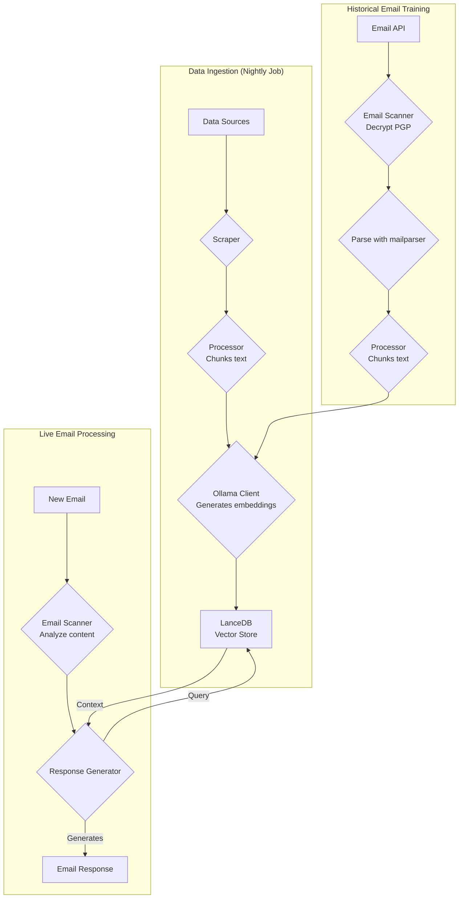
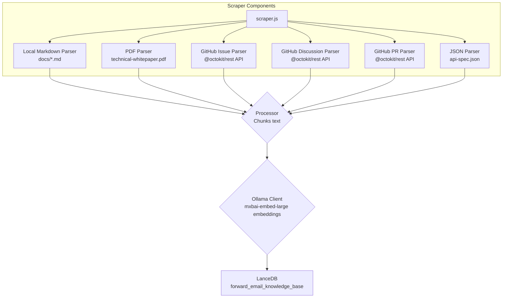
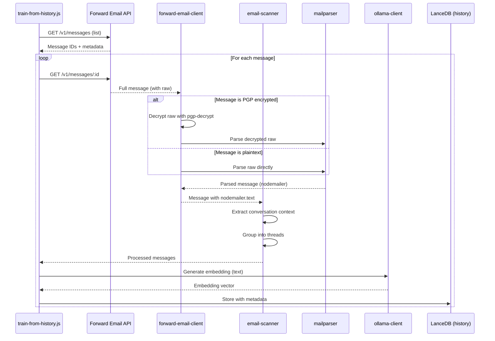

# การสร้างเอเจนต์สนับสนุนลูกค้า AI ที่เน้นความเป็นส่วนตัวด้วย LanceDB, Ollama และ Node.js {#building-a-privacy-first-ai-customer-support-agent-with-lancedb-ollama-and-nodejs}


> \[!NOTE]
> เอกสารนี้ครอบคลุมการเดินทางของเราในการสร้างเอเจนต์สนับสนุน AI ที่โฮสต์เอง เราเคยเขียนเกี่ยวกับความท้าทายที่คล้ายกันในโพสต์บล็อก [Email Startup Graveyard](https://forwardemail.net/blog/docs/email-startup-graveyard-why-80-percent-email-companies-fail) ของเรา เราเคยคิดจะเขียนภาคต่อชื่อ "AI Startup Graveyard" แต่บางทีเราอาจต้องรออีกปีหรือมากกว่านั้นจนกว่าฟองสบู่ AI อาจจะแตก(?) ตอนนี้นี่คือการถ่ายทอดความคิดของเราว่าสิ่งใดได้ผล สิ่งใดไม่ได้ผล และทำไมเราถึงทำแบบนี้

นี่คือวิธีที่เราสร้างเอเจนต์สนับสนุนลูกค้า AI ของเราเอง เราทำมันในแบบที่ยาก: โฮสต์เอง เน้นความเป็นส่วนตัว และควบคุมได้อย่างสมบูรณ์ ทำไม? เพราะเราไม่ไว้วางใจบริการของบุคคลที่สามกับข้อมูลลูกค้าของเรา นี่คือข้อกำหนดของ GDPR และ DPA และเป็นสิ่งที่ถูกต้องที่จะทำ

นี่ไม่ใช่โปรเจกต์สนุกในวันหยุดสุดสัปดาห์ แต่มันคือการเดินทางยาวนานหนึ่งเดือนที่ต้องเผชิญกับการพึ่งพาที่เสียหาย เอกสารที่ทำให้เข้าใจผิด และความวุ่นวายทั่วไปของระบบนิเวศ AI แบบโอเพนซอร์สในปี 2025 เอกสารนี้เป็นบันทึกของสิ่งที่เราสร้าง ทำไมเราถึงสร้าง และอุปสรรคที่เราพบระหว่างทาง


## สารบัญ {#table-of-contents}

* [ประโยชน์สำหรับลูกค้า: การสนับสนุนมนุษย์ที่เสริมด้วย AI](#customer-benefits-ai-augmented-human-support)
  * [การตอบสนองที่รวดเร็วและแม่นยำมากขึ้น](#faster-more-accurate-responses)
  * [ความสม่ำเสมอโดยไม่เหนื่อยล้า](#consistency-without-burnout)
  * [สิ่งที่คุณจะได้รับ](#what-you-get)
* [การสะท้อนส่วนตัว: การทำงานหนักสองทศวรรษ](#a-personal-reflection-the-two-decade-grind)
* [ทำไมความเป็นส่วนตัวจึงสำคัญ](#why-privacy-matters)
* [การวิเคราะห์ต้นทุน: AI บนคลาวด์ vs โฮสต์เอง](#cost-analysis-cloud-ai-vs-self-hosted)
  * [การเปรียบเทียบบริการ AI บนคลาวด์](#cloud-ai-service-comparison)
  * [การแยกต้นทุน: ฐานความรู้ขนาด 5GB](#cost-breakdown-5gb-knowledge-base)
  * [ต้นทุนฮาร์ดแวร์โฮสต์เอง](#self-hosted-hardware-costs)
* [การใช้งาน API ของเราเอง](#dogfooding-our-own-api)
  * [ทำไมการใช้งาน API ของตัวเองจึงสำคัญ](#why-dogfooding-matters)
  * [ตัวอย่างการใช้งาน API](#api-usage-examples)
  * [ประโยชน์ด้านประสิทธิภาพ](#performance-benefits)
* [สถาปัตยกรรมการเข้ารหัส](#encryption-architecture)
  * [ชั้นที่ 1: การเข้ารหัสกล่องจดหมาย (chacha20-poly1305)](#layer-1-mailbox-encryption-chacha20-poly1305)
  * [ชั้นที่ 2: การเข้ารหัส PGP ระดับข้อความ](#layer-2-message-level-pgp-encryption)
  * [ทำไมสิ่งนี้จึงสำคัญสำหรับการฝึกอบรม](#why-this-matters-for-training)
  * [ความปลอดภัยของการจัดเก็บข้อมูล](#storage-security)
  * [การจัดเก็บข้อมูลในเครื่องเป็นแนวปฏิบัติมาตรฐาน](#local-storage-is-standard-practice)
* [สถาปัตยกรรม](#the-architecture)
  * [โฟลว์ระดับสูง](#high-level-flow)
  * [โฟลว์การสแครปเปอร์โดยละเอียด](#detailed-scraper-flow)
* [วิธีการทำงาน](#how-it-works)
  * [การสร้างฐานความรู้](#building-the-knowledge-base)
  * [การฝึกอบรมจากอีเมลในอดีต](#training-from-historical-emails)
  * [การประมวลผลอีเมลขาเข้า](#processing-incoming-emails)
  * [การจัดการร้านเก็บเวกเตอร์](#vector-store-management)
* [สุสานฐานข้อมูลเวกเตอร์](#the-vector-database-graveyard)
* [ข้อกำหนดของระบบ](#system-requirements)
* [การตั้งค่า Cron Job](#cron-job-configuration)
  * [ตัวแปรสภาพแวดล้อม](#environment-variables)
  * [Cron Jobs สำหรับหลายกล่องจดหมาย](#cron-jobs-for-multiple-inboxes)
  * [การแยกตารางเวลาของ Cron](#cron-schedule-breakdown)
  * [การคำนวณวันที่แบบไดนามิก](#dynamic-date-calculation)
  * [การตั้งค่าเริ่มต้น: ดึงรายการ URL จากแผนผังเว็บไซต์](#initial-setup-extract-url-list-from-sitemap)
  * [การทดสอบ Cron Jobs ด้วยตนเอง](#testing-cron-jobs-manually)
  * [การตรวจสอบบันทึก](#monitoring-logs)
* [ตัวอย่างโค้ด](#code-examples)
  * [การสแครปและประมวลผล](#scraping-and-processing)
  * [การฝึกอบรมจากอีเมลในอดีต](#training-from-historical-emails-1)
  * [การสืบค้นบริบท](#querying-for-context)
* [อนาคต: การวิจัยและพัฒนาตัวสแกนสแปม](#the-future-spam-scanner-rd)
* [การแก้ไขปัญหา](#troubleshooting)
  * [ข้อผิดพลาดมิติของเวกเตอร์ไม่ตรงกัน](#vector-dimension-mismatch-error)
  * [บริบทฐานความรู้ว่างเปล่า](#empty-knowledge-base-context)
  * [ความล้มเหลวในการถอดรหัส PGP](#pgp-decryption-failures)
* [เคล็ดลับการใช้งาน](#usage-tips)
  * [การบรรลุ Inbox ศูนย์](#achieving-inbox-zero)
  * [การใช้ป้าย skip-ai](#using-the-skip-ai-label)
  * [การจัดการเธรดอีเมลและตอบกลับทั้งหมด](#email-threading-and-reply-all)
  * [การตรวจสอบและบำรุงรักษา](#monitoring-and-maintenance)
* [การทดสอบ](#testing)
  * [การรันการทดสอบ](#running-tests)
  * [ความครอบคลุมของการทดสอบ](#test-coverage)
  * [สภาพแวดล้อมการทดสอบ](#test-environment)
* [ข้อสรุปสำคัญ](#key-takeaways)
## Customer Benefits: AI-Augmented Human Support {#customer-benefits-ai-augmented-human-support}

ระบบ AI ของเราไม่ได้มาแทนที่ทีมสนับสนุนของเรา—แต่ทำให้พวกเขาดีขึ้น นี่คือสิ่งที่หมายถึงสำหรับคุณ:

### Faster, More Accurate Responses {#faster-more-accurate-responses}

**Human-in-the-Loop**: ทุกฉบับร่างที่สร้างโดย AI จะถูกตรวจสอบ แก้ไข และคัดสรรโดยทีมสนับสนุนของเราก่อนส่งถึงคุณ AI จะจัดการการวิจัยและร่างเบื้องต้น ช่วยให้ทีมของเรามุ่งเน้นที่การควบคุมคุณภาพและการปรับแต่งเฉพาะบุคคล

**Trained on Human Expertise**: AI เรียนรู้จาก:

* ฐานความรู้และเอกสารที่เขียนด้วยมือของเรา
* บทความบล็อกและบทแนะนำที่เขียนโดยมนุษย์
* คำถามที่พบบ่อย (FAQ) ที่เขียนโดยมนุษย์ของเรา
* การสนทนากับลูกค้าในอดีต (ทั้งหมดจัดการโดยมนุษย์จริง)

คุณจะได้รับคำตอบที่อิงจากประสบการณ์ของมนุษย์หลายปี เพียงแต่ส่งมอบได้รวดเร็วยิ่งขึ้น

### Consistency Without Burnout {#consistency-without-burnout}

ทีมเล็กๆ ของเราจัดการคำขอสนับสนุนหลายร้อยรายการต่อวัน ซึ่งแต่ละรายการต้องใช้ความรู้ทางเทคนิคและการเปลี่ยนบริบททางจิตใจที่แตกต่างกัน:

* คำถามเกี่ยวกับการเรียกเก็บเงินต้องใช้ความรู้ระบบการเงิน
* ปัญหา DNS ต้องใช้ความเชี่ยวชาญด้านเครือข่าย
* การรวม API ต้องใช้ความรู้ด้านการเขียนโปรแกรม
* รายงานความปลอดภัยต้องใช้การประเมินช่องโหว่

หากไม่มีความช่วยเหลือจาก AI การเปลี่ยนบริบทอย่างต่อเนื่องนี้จะนำไปสู่:

* เวลาตอบกลับที่ช้าลง
* ความผิดพลาดของมนุษย์จากความเหนื่อยล้า
* คุณภาพคำตอบที่ไม่สม่ำเสมอ
* ทีมงานหมดไฟ

**ด้วยการเสริม AI** ทีมของเรา:

* ตอบกลับเร็วขึ้น (AI ร่างในไม่กี่วินาที)
* ทำผิดพลาดน้อยลง (AI ตรวจจับข้อผิดพลาดทั่วไป)
* รักษาคุณภาพที่สม่ำเสมอ (AI อ้างอิงฐานความรู้เดียวกันทุกครั้ง)
* สดชื่นและมีสมาธิ (ใช้เวลาวิจัยน้อยลง ใช้เวลาช่วยเหลือมากขึ้น)

### What You Get {#what-you-get}

✅ **Speed**: AI ร่างคำตอบในไม่กี่วินาที มนุษย์ตรวจสอบและส่งภายในไม่กี่นาที

✅ **Accuracy**: คำตอบอิงจากเอกสารจริงและวิธีแก้ปัญหาในอดีตของเรา

✅ **Consistency**: คำตอบคุณภาพสูงเหมือนกันไม่ว่าจะเป็น 9 โมงเช้าหรือ 3 ทุ่ม

✅ **Human touch**: ทุกคำตอบได้รับการตรวจสอบและปรับแต่งโดยทีมของเรา

✅ **No hallucinations**: AI ใช้เฉพาะฐานความรู้ที่ได้รับการยืนยันของเราเท่านั้น ไม่ใช่ข้อมูลทั่วไปจากอินเทอร์เน็ต

> \[!NOTE]
> **คุณกำลังพูดคุยกับมนุษย์เสมอ** AI เป็นผู้ช่วยวิจัยที่ช่วยทีมของเราในการหาคำตอบที่ถูกต้องได้เร็วขึ้น คิดซะว่าเหมือนบรรณารักษ์ที่หาหนังสือที่เกี่ยวข้องได้ทันที—แต่ยังมีมนุษย์อ่านและอธิบายให้คุณฟังอยู่ดี


## A Personal Reflection: The Two-Decade Grind {#a-personal-reflection-the-two-decade-grind}

ก่อนที่เราจะลงลึกในรายละเอียดทางเทคนิค ขอเล่าประสบการณ์ส่วนตัว ฉันทำงานนี้มาเกือบสองทศวรรษ ชั่วโมงที่ไม่สิ้นสุดที่นั่งหน้าคีย์บอร์ด การไล่ตามหาวิธีแก้ปัญหาอย่างไม่หยุดหย่อน การทำงานอย่างลึกซึ้งและมีสมาธิ—นี่คือความจริงของการสร้างสิ่งที่มีความหมาย มันเป็นความจริงที่มักถูกมองข้ามในช่วงเวลาที่เทคโนโลยีใหม่ๆ ถูกพูดถึงอย่างเกินจริง

การระเบิดของ AI ในช่วงหลังมานี้ทำให้รู้สึกหงุดหงิดเป็นพิเศษ เราถูกขายฝันเรื่องระบบอัตโนมัติ ผู้ช่วย AI ที่จะเขียนโค้ดและแก้ปัญหาให้เรา ความจริง? ผลลัพธ์มักเป็นโค้ดขยะที่ต้องใช้เวลาซ่อมแซมมากกว่าการเขียนใหม่ตั้งแต่ต้น สัญญาที่ว่าจะทำให้ชีวิตเราง่ายขึ้นนั้นเป็นเรื่องหลอกลวง เป็นสิ่งที่เบี่ยงเบนความสนใจจากงานหนักที่จำเป็นในการสร้างสรรค์

และยังมีกับดักของการมีส่วนร่วมในโอเพ่นซอร์ส คุณถูกกระจายกำลังจนหมดแรงจากการทำงานหนัก คุณใช้ AI ช่วยเขียนรายงานบั๊กที่ละเอียดและมีโครงสร้างดี หวังว่าจะช่วยให้ผู้ดูแลเข้าใจและแก้ไขปัญหาได้ง่ายขึ้น แล้วเกิดอะไรขึ้น? คุณถูกตำหนิ การมีส่วนร่วมของคุณถูกปฏิเสธว่า "นอกเรื่อง" หรือทำงานไม่เต็มที่ เหมือนที่เราเห็นใน [Node.js GitHub issue](https://github.com/nodejs/node/issues/60719#issuecomment-3534304321) เมื่อเร็วๆ นี้ มันเหมือนการตบหน้าเหล่านักพัฒนารุ่นเก๋าที่พยายามช่วยเหลือ

นี่คือความจริงของระบบนิเวศที่เราทำงานอยู่ มันไม่ใช่แค่เรื่องเครื่องมือที่เสียหาย แต่เป็นวัฒนธรรมที่มักไม่เคารพเวลาหรือ [ความพยายามของผู้ร่วมพัฒนา](https://forwardemail.net/blog/docs/how-npm-packages-billion-downloads-shaped-javascript-ecosystem) โพสต์นี้เป็นบันทึกของความจริงนั้น เป็นเรื่องราวเกี่ยวกับเครื่องมือ ใช่ แต่ก็เป็นเรื่องราวเกี่ยวกับต้นทุนทางมนุษย์ของการสร้างในระบบนิเวศที่เสียหายซึ่งแม้จะมีสัญญามากมาย แต่ก็เสียหายโดยพื้นฐานจริงๆ
## ทำไมความเป็นส่วนตัวจึงสำคัญ {#why-privacy-matters}

[เอกสารไวท์เปเปอร์ทางเทคนิค](https://forwardemail.net/technical-whitepaper.pdf) ของเราครอบคลุมปรัชญาความเป็นส่วนตัวอย่างละเอียด เวอร์ชันสั้น: เราไม่ส่งข้อมูลลูกค้าไปยังบุคคลที่สามเลย ไม่เคย นั่นหมายความว่าไม่มี OpenAI, ไม่มี Anthropic, ไม่มีฐานข้อมูลเวกเตอร์ที่โฮสต์บนคลาวด์ ทุกอย่างทำงานภายในโครงสร้างพื้นฐานของเราเอง นี่เป็นข้อกำหนดที่ไม่สามารถต่อรองได้เพื่อให้สอดคล้องกับ GDPR และพันธกรณี DPA ของเรา


## การวิเคราะห์ต้นทุน: AI บนคลาวด์ vs โฮสต์เอง {#cost-analysis-cloud-ai-vs-self-hosted}

ก่อนที่จะลงลึกในด้านเทคนิค มาพูดถึงว่าทำไมการโฮสต์เองจึงสำคัญในแง่ของต้นทุน โมเดลการตั้งราคาของบริการ AI บนคลาวด์ทำให้มีค่าใช้จ่ายสูงเกินไปสำหรับกรณีการใช้งานที่มีปริมาณมาก เช่น การสนับสนุนลูกค้า

### การเปรียบเทียบบริการ AI บนคลาวด์ {#cloud-ai-service-comparison}

| บริการ          | ผู้ให้บริการ         | ต้นทุนการฝังข้อมูล                                               | ต้นทุน LLM (อินพุต)                                                      | ต้นทุน LLM (เอาต์พุต)  | นโยบายความเป็นส่วนตัว                              | GDPR/DPA        | โฮสติ้ง           | การแชร์ข้อมูล     |
| --------------- | ------------------- | ---------------------------------------------------------------- | -------------------------------------------------------------------------- | ---------------------- | --------------------------------------------------- | --------------- | ----------------- | ----------------- |
| **OpenAI**      | OpenAI (สหรัฐฯ)     | [$0.02-0.13/1M tokens](https://openai.com/api/pricing/)          | $0.15-20/1M tokens                                                         | $0.60-80/1M tokens     | [ลิงก์](https://openai.com/policies/privacy-policy/) | DPA จำกัด       | Azure (สหรัฐฯ)    | ใช่ (สำหรับการฝึก) |
| **Claude**      | Anthropic (สหรัฐฯ)  | ไม่มีข้อมูล                                                       | [$3-20/1M tokens](https://docs.claude.com/en/docs/about-claude/pricing)    | $15-80/1M tokens       | [ลิงก์](https://www.anthropic.com/legal/privacy)     | DPA จำกัด       | AWS/GCP (สหรัฐฯ)  | ไม่ (อ้างว่าไม่มี)  |
| **Gemini**      | Google (สหรัฐฯ)     | [$0.15/1M tokens](https://ai.google.dev/gemini-api/docs/pricing) | $0.30-1.00/1M tokens                                                       | $2.50/1M tokens        | [ลิงก์](https://policies.google.com/privacy)         | DPA จำกัด       | GCP (สหรัฐฯ)      | ใช่ (เพื่อการปรับปรุง) |
| **DeepSeek**    | DeepSeek (จีน)       | ไม่มีข้อมูล                                                       | [$0.028-0.28/1M tokens](https://api-docs.deepseek.com/quick_start/pricing) | $0.42/1M tokens        | [ลิงก์](https://www.deepseek.com/en)                 | ไม่ทราบ         | จีน               | ไม่ทราบ           |
| **Mistral**     | Mistral AI (ฝรั่งเศส) | [$0.10/1M tokens](https://mistral.ai/pricing)                    | $0.40/1M tokens                                                            | $2.00/1M tokens        | [ลิงก์](https://mistral.ai/terms/)                   | EU GDPR         | EU                | ไม่ทราบ           |
| **โฮสต์เอง**   | คุณ                  | $0 (ฮาร์ดแวร์ที่มีอยู่แล้ว)                                     | $0 (ฮาร์ดแวร์ที่มีอยู่แล้ว)                                               | $0 (ฮาร์ดแวร์ที่มีอยู่แล้ว) | นโยบายของคุณ                                      | ปฏิบัติตามเต็มที่ | MacBook M5 + cron | ไม่เคย             |

> \[!WARNING]
> **ข้อกังวลเรื่องอธิปไตยข้อมูล**: ผู้ให้บริการสหรัฐฯ (OpenAI, Claude, Gemini) อยู่ภายใต้ CLOUD Act ซึ่งอนุญาตให้รัฐบาลสหรัฐฯ เข้าถึงข้อมูลได้ DeepSeek (จีน) ดำเนินงานภายใต้กฎหมายข้อมูลของจีน ในขณะที่ Mistral (ฝรั่งเศส) มีโฮสติ้งใน EU และสอดคล้องกับ GDPR การโฮสต์เองยังคงเป็นทางเลือกเดียวสำหรับอธิปไตยและการควบคุมข้อมูลอย่างสมบูรณ์

### การแยกต้นทุน: ฐานความรู้ 5GB {#cost-breakdown-5gb-knowledge-base}

มาคำนวณต้นทุนการประมวลผลฐานความรู้ขนาด 5GB (ทั่วไปสำหรับบริษัทขนาดกลางที่มีเอกสาร อีเมล และประวัติการสนับสนุน)

**สมมติฐาน:**

* ข้อความ 5GB ≈ 1.25 พันล้านโทเค็น (สมมติ \~4 ตัวอักษร/โทเค็น)
* การสร้าง embedding ครั้งแรก
* การฝึกซ้ำรายเดือน (embedding ใหม่ทั้งหมด)
* คำถามสนับสนุน 10,000 ครั้งต่อเดือน
* คำถามเฉลี่ย: อินพุต 500 โทเค็น, เอาต์พุต 300 โทเค็น
**รายละเอียดค่าใช้จ่ายโดยละเอียด:**

| ส่วนประกอบ                             | OpenAI           | Claude          | Gemini               | Self-Hosted        |
| -------------------------------------- | ---------------- | --------------- | -------------------- | ------------------ |
| **การฝังข้อมูลเริ่มต้น** (1.25B โทเค็น) | $25,000          | N/A             | $187,500             | $0                 |
| **คำถามรายเดือน** (10K × 800 โทเค็น)  | $1,200-16,000    | $2,400-16,000   | $2,400-3,200         | $0                 |
| **การฝึกซ้อมใหม่รายเดือน** (1.25B โทเค็น) | $25,000          | N/A             | $187,500             | $0                 |
| **ยอดรวมปีแรก**                       | $325,200-217,000 | $28,800-192,000 | $2,278,800-2,226,000 | ~$60 (ค่าไฟฟ้า)   |
| **การปฏิบัติตามความเป็นส่วนตัว**     | ❌ จำกัด          | ❌ จำกัด         | ❌ จำกัด              | ✅ เต็มรูปแบบ       |
| **อธิปไตยข้อมูล**                     | ❌ ไม่           | ❌ ไม่          | ❌ ไม่                | ✅ ใช่              |

> \[!CAUTION]
> **ค่าใช้จ่ายการฝังข้อมูลของ Gemini นั้นรุนแรงมาก** ที่ $0.15/1M โทเค็น ฐานความรู้ขนาด 5GB เพียงครั้งเดียวจะมีค่าใช้จ่าย $187,500 ซึ่งแพงกว่า OpenAI ถึง 37 เท่าและทำให้ไม่สามารถใช้งานในสภาพแวดล้อมการผลิตได้เลย

### ค่าใช้จ่ายฮาร์ดแวร์แบบ Self-Hosted {#self-hosted-hardware-costs}

การตั้งค่าของเรารันบนฮาร์ดแวร์ที่เรามีอยู่แล้ว:

* **ฮาร์ดแวร์**: MacBook M5 (เป็นของที่มีอยู่แล้วสำหรับการพัฒนา)
* **ค่าใช้จ่ายเพิ่มเติม**: $0 (ใช้ฮาร์ดแวร์ที่มีอยู่)
* **ค่าไฟฟ้า**: \~$5/เดือน (ประมาณการ)
* **ยอดรวมปีแรก**: \~$60
* **ค่าใช้จ่ายต่อเนื่อง**: $60/ปี

**ผลตอบแทนการลงทุน (ROI)**: การโฮสต์เองแทบไม่มีต้นทุนเพิ่มเนื่องจากเราใช้ฮาร์ดแวร์สำหรับการพัฒนาอยู่แล้ว ระบบทำงานผ่านงาน cron ในช่วงเวลาที่ไม่ใช่ชั่วโมงเร่งด่วน

## การใช้ API ของเราเอง {#dogfooding-our-own-api}

หนึ่งในการตัดสินใจทางสถาปัตยกรรมที่สำคัญที่สุดที่เราทำคือให้งาน AI ทั้งหมดใช้ [Forward Email API](https://forwardemail.net/email-api) โดยตรง นี่ไม่ใช่แค่แนวปฏิบัติที่ดีเท่านั้น—แต่เป็นแรงผลักดันให้เกิดการปรับปรุงประสิทธิภาพ

### ทำไมการใช้ API ของตัวเองจึงสำคัญ {#why-dogfooding-matters}

เมื่องาน AI ของเราใช้ API endpoints เดียวกับลูกค้า:

1. **คอขวดด้านประสิทธิภาพส่งผลกระทบกับเราก่อน** - เรารับรู้ปัญหาก่อนลูกค้า
2. **การปรับปรุงช่วยทุกคน** - การปรับปรุงสำหรับงานของเราโดยอัตโนมัติช่วยประสบการณ์ลูกค้า
3. **การทดสอบในโลกจริง** - งานของเราประมวลผลอีเมลนับพัน ทำให้มีการทดสอบโหลดอย่างต่อเนื่อง
4. **การใช้ซ้ำของโค้ด** - การตรวจสอบสิทธิ์ การจำกัดอัตรา การจัดการข้อผิดพลาด และการแคชเหมือนกัน

### ตัวอย่างการใช้งาน API {#api-usage-examples}

**การแสดงรายการข้อความ (train-from-history.js):**

```javascript
// ใช้ GET /v1/messages?folder=INBOX พร้อม BasicAuth
// ไม่รวม eml, raw, nodemailer เพื่อลดขนาดการตอบกลับ (ต้องการแค่ IDs)
const response = await axios.get(
  `${this.apiBase}/v1/messages`,
  {
    params: {
      folder: 'INBOX',
      limit: 100,
      eml: false,
      raw: false,
      nodemailer: false
    },
    auth: {
      username: process.env.FORWARD_EMAIL_ALIAS_USERNAME,
      password: process.env.FORWARD_EMAIL_ALIAS_PASSWORD
    }
  }
);

const messages = response.data;
// คืนค่า: [{ id, subject, date, ... }, ...]
// เนื้อหาข้อความเต็มจะถูกดึงทีหลังผ่าน GET /v1/messages/:id
```

**การดึงข้อความเต็ม (forward-email-client.js):**

```javascript
// ใช้ GET /v1/messages/:id เพื่อรับข้อความเต็มพร้อมเนื้อหา raw
const response = await axios.get(
  `${this.apiBase}/v1/messages/${messageId}`,
  {
    auth: {
      username: this.aliasUsername,
      password: this.aliasPassword
    }
  }
);

const message = response.data;
// คืนค่า: { id, subject, raw, eml, nodemailer: { ... }, ... }
```

**การสร้างร่างตอบกลับ (process-inbox.js):**

```javascript
// ใช้ POST /v1/messages เพื่อสร้างร่างตอบกลับ
const response = await axios.post(
  `${this.apiBase}/v1/messages`,
  {
    folder: 'Drafts',
    subject: `Re: ${originalSubject}`,
    to: senderEmail,
    text: generatedResponse,
    inReplyTo: originalMessageId
  },
  {
    auth: {
      username: process.env.FORWARD_EMAIL_ALIAS_USERNAME,
      password: process.env.FORWARD_EMAIL_ALIAS_PASSWORD
    }
  }
);
```
### Performance Benefits {#performance-benefits}

เนื่องจากงาน AI ของเราทำงานบนโครงสร้างพื้นฐาน API เดียวกัน:

* **การเพิ่มประสิทธิภาพการแคช** เป็นประโยชน์ทั้งกับงานและลูกค้า
* **การจำกัดอัตรา** ได้รับการทดสอบภายใต้ภาระงานจริง
* **การจัดการข้อผิดพลาด** ผ่านการทดสอบอย่างเข้มข้น
* **เวลาตอบสนอง API** ถูกตรวจสอบอย่างต่อเนื่อง
* **การสืบค้นฐานข้อมูล** ได้รับการปรับแต่งสำหรับทั้งสองกรณีการใช้งาน
* **การเพิ่มประสิทธิภาพแบนด์วิดท์** - การยกเว้น `eml`, `raw`, `nodemailer` เมื่อแสดงรายการช่วยลดขนาดการตอบกลับประมาณ \~90%

เมื่อ `train-from-history.js` ประมวลผลอีเมล 1,000 ฉบับ มันจะเรียก API มากกว่า 1,000 ครั้ง ความไม่มีประสิทธิภาพใด ๆ ใน API จะปรากฏทันที ซึ่งบังคับให้เราปรับปรุงการเข้าถึง IMAP, การสืบค้นฐานข้อมูล และการจัดลำดับการตอบกลับ—การปรับปรุงเหล่านี้ส่งผลโดยตรงต่อประโยชน์ของลูกค้าเรา

**ตัวอย่างการเพิ่มประสิทธิภาพ**: การแสดงรายการ 100 ข้อความพร้อมเนื้อหาเต็ม = การตอบกลับประมาณ \~10MB การแสดงรายการโดยใช้ `eml: false, raw: false, nodemailer: false` = การตอบกลับประมาณ \~100KB (เล็กกว่าถึง 100 เท่า)


## Encryption Architecture {#encryption-architecture}

การจัดเก็บอีเมลของเราใช้หลายชั้นของการเข้ารหัส ซึ่งงาน AI ต้องถอดรหัสแบบเรียลไทม์เพื่อการฝึกอบรม

### Layer 1: Mailbox Encryption (chacha20-poly1305) {#layer-1-mailbox-encryption-chacha20-poly1305}

กล่องจดหมาย IMAP ทั้งหมดถูกจัดเก็บเป็นฐานข้อมูล SQLite ที่เข้ารหัสด้วย **chacha20-poly1305** ซึ่งเป็นอัลกอริทึมการเข้ารหัสที่ปลอดภัยต่อควอนตัม รายละเอียดเพิ่มเติมอยู่ใน [บทความบล็อกบริการอีเมลเข้ารหัสปลอดภัยต่อควอนตัมของเรา](https://forwardemail.net/blog/docs/best-quantum-safe-encrypted-email-service)

**คุณสมบัติหลัก:**

* **อัลกอริทึม**: ChaCha20-Poly1305 (AEAD cipher)
* **ปลอดภัยต่อควอนตัม**: ทนทานต่อการโจมตีด้วยคอมพิวเตอร์ควอนตัม
* **การจัดเก็บ**: ไฟล์ฐานข้อมูล SQLite บนดิสก์
* **การเข้าถึง**: ถอดรหัสในหน่วยความจำเมื่อเข้าถึงผ่าน IMAP/API

### Layer 2: Message-Level PGP Encryption {#layer-2-message-level-pgp-encryption}

อีเมลสนับสนุนหลายฉบับถูกเข้ารหัสเพิ่มเติมด้วย PGP (มาตรฐาน OpenPGP) งาน AI ต้องถอดรหัสเหล่านี้เพื่อดึงเนื้อหาไปใช้ในการฝึกอบรม

**กระบวนการถอดรหัส:**

```javascript
// 1. API ส่งกลับข้อความพร้อมเนื้อหาดิบที่เข้ารหัส
const message = await forwardEmailClient.getMessage(id);

// 2. ตรวจสอบว่าเนื้อหาดิบถูกเข้ารหัส PGP หรือไม่
if (isMessageEncrypted(message.raw)) {
  // 3. ถอดรหัสด้วยกุญแจส่วนตัวของเรา
  const decryptedRaw = await pgpDecrypt(message.raw);

  // 4. แยกวิเคราะห์ข้อความ MIME ที่ถอดรหัสแล้ว
  const parsed = await simpleParser(decryptedRaw);

  // 5. เติมข้อมูล nodemailer ด้วยเนื้อหาที่ถอดรหัสแล้ว
  message.nodemailer = {
    text: parsed.text,
    html: parsed.html,
    from: parsed.from,
    to: parsed.to,
    subject: parsed.subject,
    date: parsed.date
  };
}
```

**การตั้งค่า PGP:**

```bash
# กุญแจส่วนตัวสำหรับถอดรหัส (เส้นทางไปยังไฟล์กุญแจ ASCII-armored)
GPG_SECURITY_KEY="/path/to/private-key.asc"

# รหัสผ่านสำหรับกุญแจส่วนตัว (ถ้าเข้ารหัส)
GPG_SECURITY_PASSPHRASE="your-passphrase"
```

ตัวช่วย `pgp-decrypt.js`:

1. อ่านกุญแจส่วนตัวจากดิสก์ครั้งเดียว (เก็บในหน่วยความจำ)
2. ถอดรหัสกุญแจด้วยรหัสผ่าน
3. ใช้กุญแจที่ถอดรหัสแล้วสำหรับการถอดรหัสข้อความทั้งหมด
4. รองรับการถอดรหัสแบบเรียกซ้ำสำหรับข้อความที่เข้ารหัสซ้อนกัน

### Why This Matters for Training {#why-this-matters-for-training}

หากไม่มีการถอดรหัสที่ถูกต้อง AI จะฝึกบนข้อความที่เข้ารหัสที่อ่านไม่ออก:

```
-----BEGIN PGP MESSAGE-----
Version: OpenPGP.js v4.10.10

wcBMA8Z3lHJnFnNUAQgAqK7F8...
-----END PGP MESSAGE-----
```

ด้วยการถอดรหัส AI จะฝึกบนเนื้อหาจริง:

```
Subject: Re: Bug Report

Hi John,

Thanks for reporting this issue. I've confirmed the bug
and created a fix in PR #1234...
```

### Storage Security {#storage-security}

การถอดรหัสเกิดขึ้นในหน่วยความจำระหว่างการทำงานของงาน และเนื้อหาที่ถอดรหัสจะถูกแปลงเป็น embeddings ซึ่งจะถูกจัดเก็บในฐานข้อมูลเวกเตอร์ LanceDB บนดิสก์

**ที่อยู่ของข้อมูล:**

* **ฐานข้อมูลเวกเตอร์**: จัดเก็บบนเครื่อง MacBook M5 ที่เข้ารหัส
* **ความปลอดภัยทางกายภาพ**: เครื่องทำงานอยู่กับเราเสมอ (ไม่อยู่ในศูนย์ข้อมูล)
* **การเข้ารหัสดิสก์**: เข้ารหัสดิสก์เต็มรูปแบบบนเครื่องทั้งหมด
* **ความปลอดภัยเครือข่าย**: มีไฟร์วอลล์และแยกเครือข่ายจากเครือข่ายสาธารณะ

**การปรับใช้ในศูนย์ข้อมูลในอนาคต:**
หากเราเคลื่อนย้ายไปยังโฮสติ้งศูนย์ข้อมูล เซิร์ฟเวอร์จะมี:

* การเข้ารหัสดิสก์เต็มรูปแบบ LUKS
* ปิดการใช้งาน USB
* มาตรการความปลอดภัยทางกายภาพ
* การแยกเครือข่าย
สำหรับรายละเอียดทั้งหมดเกี่ยวกับแนวทางปฏิบัติด้านความปลอดภัยของเรา โปรดดูที่ [หน้า Security](https://forwardemail.net/en/security)

> \[!NOTE]
> ฐานข้อมูลเวกเตอร์ประกอบด้วย embeddings (การแทนค่าทางคณิตศาสตร์) ไม่ใช่ข้อความต้นฉบับ อย่างไรก็ตาม embeddings อาจถูกย้อนกลับได้ ซึ่งเป็นเหตุผลที่เราจัดเก็บไว้บนเวิร์กสเตชันที่เข้ารหัสและมีความปลอดภัยทางกายภาพ

### การจัดเก็บข้อมูลในเครื่องเป็นแนวปฏิบัติทั่วไป {#local-storage-is-standard-practice}

การจัดเก็บ embeddings บนเวิร์กสเตชันของทีมเราไม่แตกต่างจากวิธีที่เราใช้จัดการอีเมลอยู่แล้ว:

* **Thunderbird**: ดาวน์โหลดและจัดเก็บเนื้อหาอีเมลเต็มรูปแบบในไฟล์ mbox/maildir บนเครื่อง
* **เว็บเมลไคลเอนต์**: แคชข้อมูลอีเมลในที่เก็บข้อมูลของเบราว์เซอร์และฐานข้อมูลในเครื่อง
* **ไคลเอนต์ IMAP**: เก็บสำเนาข้อความในเครื่องเพื่อเข้าถึงแบบออฟไลน์
* **ระบบ AI ของเรา**: จัดเก็บ embeddings ทางคณิตศาสตร์ (ไม่ใช่ข้อความธรรมดา) ใน LanceDB

ความแตกต่างที่สำคัญ: embeddings มีความ **ปลอดภัยมากกว่า** อีเมลข้อความธรรมดาเพราะว่า:

1. เป็นการแทนค่าทางคณิตศาสตร์ ไม่ใช่ข้อความที่อ่านได้
2. ยากต่อการย้อนกลับมากกว่าข้อความธรรมดา
3. ยังอยู่ภายใต้ความปลอดภัยทางกายภาพเดียวกับไคลเอนต์อีเมลของเรา

ถ้าทีมของเราใช้ Thunderbird หรือเว็บเมลบนเวิร์กสเตชันที่เข้ารหัสได้ ก็ถือว่าเป็นที่ยอมรับ (และอาจปลอดภัยกว่าด้วยซ้ำ) ที่จะจัดเก็บ embeddings ในลักษณะเดียวกัน


## สถาปัตยกรรม {#the-architecture}

นี่คือขั้นตอนพื้นฐาน ดูเหมือนง่าย แต่มันไม่ง่ายเลย

> \[!NOTE]
> งานทั้งหมดใช้ Forward Email API โดยตรง เพื่อให้การปรับแต่งประสิทธิภาพเป็นประโยชน์ทั้งกับระบบ AI ของเราและลูกค้า

### ขั้นตอนระดับสูง {#high-level-flow}



### ขั้นตอนละเอียดของ Scraper {#detailed-scraper-flow}

`scraper.js` คือหัวใจของการดึงข้อมูล เป็นชุดของตัวแยกวิเคราะห์สำหรับรูปแบบข้อมูลต่างๆ




## วิธีการทำงาน {#how-it-works}

กระบวนการแบ่งออกเป็นสามส่วนหลัก: การสร้างฐานความรู้, การฝึกจากอีเมลในอดีต, และการประมวลผลอีเมลใหม่

### การสร้างฐานความรู้ {#building-the-knowledge-base}

**`update-knowledge-base.js`**: งานหลักนี้ทำงานทุกคืน ล้างฐานข้อมูลเวกเตอร์เก่า และสร้างใหม่ทั้งหมด ใช้ `scraper.js` เพื่อดึงเนื้อหาจากทุกแหล่ง, `processor.js` เพื่อแบ่งข้อความ, และ `ollama-client.js` เพื่อสร้าง embeddings สุดท้าย `vector-store.js` จัดเก็บทุกอย่างใน LanceDB

**แหล่งข้อมูล:**

* ไฟล์ Markdown ในเครื่อง (`docs/*.md`)
* ไฟล์ PDF whitepaper ทางเทคนิค (`assets/technical-whitepaper.pdf`)
* ไฟล์ JSON สเปค API (`assets/api-spec.json`)
* ปัญหา GitHub (ผ่าน Octokit)
* การสนทนา GitHub (ผ่าน Octokit)
* คำขอดึง GitHub (ผ่าน Octokit)
* รายการ URL แผนผังเว็บไซต์ (`$LANCEDB_PATH/valid-urls.json`)

### การฝึกจากอีเมลในอดีต {#training-from-historical-emails}

**`train-from-history.js`**: งานนี้สแกนอีเมลในอดีตจากทุกโฟลเดอร์ ถอดรหัสข้อความที่เข้ารหัส PGP และเพิ่มลงในฐานข้อมูลเวกเตอร์แยกต่างหาก (`customer_support_history`) เพื่อให้บริบทจากการสนับสนุนที่ผ่านมา
**Email Processing Flow:**



**คุณสมบัติหลัก:**

* **การถอดรหัส PGP**: ใช้ตัวช่วย `pgp-decrypt.js` พร้อมตัวแปรสภาพแวดล้อม `GPG_SECURITY_KEY`
* **การจัดกลุ่มเธรด**: จัดกลุ่มอีเมลที่เกี่ยวข้องเป็นเธรดการสนทนา
* **การเก็บรักษาข้อมูลเมตา**: เก็บโฟลเดอร์ หัวเรื่อง วันที่ และสถานะการเข้ารหัส
* **บริบทการตอบกลับ**: เชื่อมโยงข้อความกับการตอบกลับเพื่อบริบทที่ดียิ่งขึ้น

**การตั้งค่า:**

```bash
# ตัวแปรสภาพแวดล้อมสำหรับ train-from-history
HISTORY_SCAN_LIMIT=1000              # จำนวนข้อความสูงสุดที่จะประมวลผล
HISTORY_SCAN_SINCE="2024-01-01"      # ประมวลผลเฉพาะข้อความหลังจากวันที่นี้
HISTORY_DECRYPT_PGP=true             # พยายามถอดรหัส PGP
GPG_SECURITY_KEY="/path/to/key.asc"  # เส้นทางไปยังกุญแจส่วนตัว PGP
GPG_SECURITY_PASSPHRASE="passphrase" # รหัสผ่านกุญแจ (ถ้ามี)
```

**สิ่งที่จะถูกเก็บ:**

```javascript
{
  type: 'historical_email',
  folder: 'INBOX',
  subject: 'Re: Bug Report',
  date: '2025-01-15T10:30:00Z',
  messageId: '67e2f288893921...',
  threadId: 'Bug Report',
  hasReply: true,
  encrypted: true,
  decrypted: true,
  replySubject: 'Bug Report',
  replyText: 'First 500 chars of reply...',
  chunkSize: 1000,
  chunkOverlap: 200,
  chunkIndex: 0
}
```

> \[!TIP]
> รัน `train-from-history` หลังการตั้งค่าเริ่มต้นเพื่อเติมบริบทประวัติศาสตร์ ซึ่งจะช่วยปรับปรุงคุณภาพการตอบกลับอย่างมากโดยเรียนรู้จากการสนับสนุนในอดีต

### การประมวลผลอีเมลขาเข้า {#processing-incoming-emails}

**`process-inbox.js`**: งานนี้ทำงานกับอีเมลในกล่องจดหมาย `support@forwardemail.net`, `abuse@forwardemail.net` และ `security@forwardemail.net` (โดยเฉพาะโฟลเดอร์ IMAP `INBOX`) ใช้ API ของเราที่ <https://forwardemail.net/email-api> (เช่น `GET /v1/messages?folder=INBOX` โดยใช้ BasicAuth ด้วยข้อมูลรับรอง IMAP สำหรับแต่ละกล่องจดหมาย) วิเคราะห์เนื้อหาอีเมล, คิวรีทั้งฐานความรู้ (`forward_email_knowledge_base`) และที่เก็บเวกเตอร์อีเมลประวัติศาสตร์ (`customer_support_history`), แล้วส่งบริบทผสมไปยัง `response-generator.js` ตัวสร้างใช้ `mxbai-embed-large` ผ่าน Ollama เพื่อสร้างการตอบกลับ

**คุณสมบัติกระบวนการอัตโนมัติ:**

1. **ระบบ Inbox Zero อัตโนมัติ**: หลังจากสร้างร่างสำเร็จ ข้อความต้นฉบับจะถูกย้ายไปยังโฟลเดอร์เก็บถาวรโดยอัตโนมัติ ช่วยให้กล่องจดหมายของคุณสะอาดและบรรลุ inbox zero โดยไม่ต้องทำด้วยตนเอง

2. **ข้ามการประมวลผล AI**: เพียงเพิ่มป้ายกำกับ `skip-ai` (ไม่สนใจตัวพิมพ์ใหญ่/เล็ก) กับข้อความใด ๆ เพื่อป้องกันการประมวลผล AI ข้อความจะยังคงอยู่ในกล่องจดหมายโดยไม่ถูกแตะต้อง ให้คุณจัดการด้วยตนเอง เหมาะสำหรับข้อความที่ละเอียดอ่อนหรือกรณีซับซ้อนที่ต้องการการตัดสินใจของมนุษย์

3. **การจัดเธรดอีเมลอย่างถูกต้อง**: ร่างตอบกลับทั้งหมดจะรวมข้อความต้นฉบับที่อ้างอิงด้านล่าง (โดยใช้คำนำหน้า ` >  ` ตามมาตรฐาน) ตามรูปแบบการตอบกลับอีเมล "On \[date], \[sender] wrote:" เพื่อให้บริบทและเธรดการสนทนาในไคลเอนต์อีเมลถูกต้อง

4. **พฤติกรรมตอบกลับทั้งหมด (Reply-All)**: ระบบจัดการหัวข้อ Reply-To และผู้รับ CC โดยอัตโนมัติ:
   * หากมีหัวข้อ Reply-To จะถูกใช้เป็นที่อยู่ To และที่อยู่ From เดิมจะถูกเพิ่มใน CC
   * ผู้รับ To และ CC เดิมทั้งหมดจะถูกรวมใน CC ของการตอบกลับ (ยกเว้นที่อยู่อีเมลของคุณเอง)
   * ปฏิบัติตามมาตรฐานการตอบกลับทั้งหมดสำหรับการสนทนากลุ่ม
**การจัดอันดับแหล่งข้อมูล**: ระบบใช้ **การจัดอันดับถ่วงน้ำหนัก** เพื่อจัดลำดับความสำคัญของแหล่งข้อมูล:

* คำถามที่พบบ่อย: 100% (ลำดับความสำคัญสูงสุด)
* เอกสารเทคนิค: 95%
* สเปค API: 90%
* เอกสารทางการ: 85%
* ปัญหา GitHub: 70%
* อีเมลประวัติ: 50%

### การจัดการ Vector Store {#vector-store-management}

คลาส `VectorStore` ในไฟล์ `helpers/customer-support-ai/vector-store.js` คืออินเทอร์เฟซของเราไปยัง LanceDB

**การเพิ่มเอกสาร:**

```javascript
// vector-store.js
async addDocument(text, metadata) {
  const embedding = await this.ollama.generateEmbedding(text);
  await this.table.add([{
    vector: embedding,
    text,
    ...metadata
  }]);
}
```

**การล้างข้อมูลใน Store:**

```javascript
// ตัวเลือกที่ 1: ใช้วิธี clear()
await vectorStore.clear();

// ตัวเลือกที่ 2: ลบไดเรกทอรีฐานข้อมูลท้องถิ่น
await fs.rm(process.env.LANCEDB_PATH, { recursive: true, force: true });
```

ตัวแปรสภาพแวดล้อม `LANCEDB_PATH` ชี้ไปยังไดเรกทอรีฐานข้อมูลฝังตัวท้องถิ่น LanceDB เป็นแบบ serverless และฝังตัว จึงไม่มีโปรเซสแยกต่างหากให้จัดการ


## สุสานฐานข้อมูลเวกเตอร์ {#the-vector-database-graveyard}

นี่คืออุปสรรคใหญ่ครั้งแรก เราลองใช้ฐานข้อมูลเวกเตอร์หลายตัวก่อนจะตัดสินใจใช้ LanceDB นี่คือสิ่งที่ผิดพลาดกับแต่ละตัว

| ฐานข้อมูล     | GitHub                                                      | สิ่งที่ผิดพลาด                                                                                                                                                                                                      | ปัญหาเฉพาะ                                                                                                                                                                                                                                                                                                                                                           | ความกังวลด้านความปลอดภัย                                                                                                                                                                                                |
| ------------ | ----------------------------------------------------------- | -------------------------------------------------------------------------------------------------------------------------------------------------------------------------------------------------------------------- | ------------------------------------------------------------------------------------------------------------------------------------------------------------------------------------------------------------------------------------------------------------------------------------------------------------------------------------------------------------------------- | ---------------------------------------------------------------------------------------------------------------------------------------------------------------------------------------------------------------- |
| **ChromaDB** | [chroma-core/chroma](https://github.com/chroma-core/chroma) | `pip3 install chromadb` จะได้เวอร์ชันโบราณที่มี `PydanticImportError` วิธีเดียวที่จะได้เวอร์ชันใช้งานได้คือคอมไพล์จากซอร์ส ไม่เหมาะกับนักพัฒนา                                                                 | ความยุ่งเหยิงของ dependencies ใน Python ผู้ใช้หลายคนรายงานปัญหาการติดตั้ง pip เสีย ([#774](https://github.com/chroma-core/chroma/issues/774), [#163](https://github.com/chroma-core/chroma/issues/163)) เอกสารแนะนำ "ใช้ Docker" ซึ่งไม่ตอบโจทย์การพัฒนาท้องถิ่น ล่มบน Windows เมื่อเกิน 99 ระเบียน ([#3058](https://github.com/chroma-core/chroma/issues/3058)) | **CVE-2024-45848**: การรันโค้ดโดยพลการผ่านการผนวกรวม ChromaDB ใน MindsDB ช่องโหว่ระบบปฏิบัติการร้ายแรงใน Docker image ([#3170](https://github.com/chroma-core/chroma/issues/3170))                      |
| **Qdrant**   | [qdrant/qdrant](https://github.com/qdrant/qdrant)           | Homebrew tap (`qdrant/qdrant/qdrant`) ที่อ้างอิงในเอกสารเก่าหายไป ไม่มีคำอธิบาย เอกสารทางการตอนนี้บอกแค่ "ใช้ Docker"                                                                                         | ไม่มี Homebrew tap ไม่มีไบนารี macOS แบบเนทีฟ Docker-only เป็นอุปสรรคสำหรับการทดสอบท้องถิ่นอย่างรวดเร็ว                                                                                                                                                                                                                                                                           | **CVE-2024-2221**: ช่องโหว่อัปโหลดไฟล์โดยพลการที่อนุญาตให้รันโค้ดระยะไกล (แก้ไขใน v1.9.0) คะแนนความปลอดภัยต่ำจาก [IronCore Labs](https://ironcorelabs.com/vectordbs/qdrant-security/) |
| **Weaviate** | [weaviate/weaviate](https://github.com/weaviate/weaviate)   | เวอร์ชัน Homebrew มีบั๊กคลัสเตอร์ร้ายแรง (`leader not found`) ธงที่ระบุในเอกสารเพื่อแก้ไข (`RAFT_JOIN`, `CLUSTER_HOSTNAME`) ใช้งานไม่ได้ พื้นฐานแล้วใช้ไม่ได้กับการตั้งค่าโหนดเดียว                   | บั๊กคลัสเตอร์แม้ในโหมดโหนดเดียว ซับซ้อนเกินไปสำหรับกรณีใช้งานง่ายๆ                                                                                                                                                                                                                                                                                           | ไม่พบ CVE ร้ายแรง แต่ความซับซ้อนเพิ่มพื้นผิวการโจมตี                                                                                                                                                    |
| **LanceDB**  | [lancedb/lancedb](https://github.com/lancedb/lancedb)       | ตัวนี้ใช้งานได้ ฝังตัวและไม่มีเซิร์ฟเวอร์ ไม่มีโปรเซสแยก ความรำคาญเดียวคือชื่อแพ็กเกจสับสน (`vectordb` เลิกใช้แล้ว ใช้ `@lancedb/lancedb`) และเอกสารกระจัดกระจาย แต่เรารับได้                     | ความสับสนเรื่องชื่อแพ็กเกจ (`vectordb` กับ `@lancedb/lancedb`) แต่โดยรวมมั่นคง สถาปัตยกรรมฝังตัวช่วยขจัดปัญหาด้านความปลอดภัยหลายประเภท                                                                                                                                                                                                                     | ไม่มี CVE ที่รู้จัก การออกแบบฝังตัวหมายถึงไม่มีพื้นผิวโจมตีทางเครือข่าย                                                                                                                                                  |
> \[!WARNING]
> **ChromaDB มีช่องโหว่ด้านความปลอดภัยร้ายแรง** [CVE-2024-45848](https://nvd.nist.gov/vuln/detail/CVE-2024-45848) อนุญาตให้รันโค้ดโดยพลการได้ การติดตั้งผ่าน pip มีปัญหาพื้นฐานเกี่ยวกับการพึ่งพา Pydantic หลีกเลี่ยงการใช้งานในสภาพแวดล้อมการผลิต
>
> \[!WARNING]
> **Qdrant มีช่องโหว่ RCE จากการอัปโหลดไฟล์** ([CVE-2024-2221](https://qdrant.tech/blog/cve-2024-2221-response/)) ซึ่งได้รับการแก้ไขในเวอร์ชัน v1.9.0 เท่านั้น หากต้องใช้ Qdrant ให้แน่ใจว่าใช้เวอร์ชันล่าสุด
>
> \[!CAUTION]
> ระบบฐานข้อมูลเวกเตอร์แบบโอเพนซอร์สยังไม่เสถียร อย่าเชื่อถือเอกสารสมบูรณ์แบบ สมมติว่าทุกอย่างมีปัญหาจนกว่าจะพิสูจน์ได้ว่าไม่เป็นเช่นนั้น ทดสอบในเครื่องก่อนตัดสินใจใช้จริง


## ข้อกำหนดของระบบ {#system-requirements}

* **Node.js:** v18.0.0+ ([GitHub](https://github.com/nodejs/node))
* **Ollama:** เวอร์ชันล่าสุด ([GitHub](https://github.com/ollama/ollama))
* **โมเดล:** `mxbai-embed-large` ผ่าน Ollama
* **ฐานข้อมูลเวกเตอร์:** LanceDB ([GitHub](https://github.com/lancedb/lancedb))
* **การเข้าถึง GitHub:** `@octokit/rest` สำหรับดึงข้อมูล issues ([GitHub](https://github.com/octokit/rest.js))
* **SQLite:** สำหรับฐานข้อมูลหลัก (ผ่าน `mongoose-to-sqlite`)


## การตั้งค่า Cron Job {#cron-job-configuration}

งาน AI ทั้งหมดทำงานผ่าน cron บน MacBook M5 นี่คือวิธีตั้งค่า cron jobs ให้ทำงานตอนเที่ยงคืนในหลายๆ กล่องจดหมาย

### ตัวแปรสภาพแวดล้อม {#environment-variables}

งานเหล่านี้ต้องการตัวแปรสภาพแวดล้อมเหล่านี้ ส่วนใหญ่สามารถตั้งค่าในไฟล์ `.env` (โหลดผ่าน `@ladjs/env`) แต่ `HISTORY_SCAN_SINCE` ต้องคำนวณแบบไดนามิกใน crontab

**ในไฟล์ `.env`:**

```bash
# ข้อมูลรับรอง API Forward Email (เปลี่ยนตามกล่องจดหมาย)
FORWARD_EMAIL_ALIAS_USERNAME=support@forwardemail.net
FORWARD_EMAIL_ALIAS_PASSWORD=your-imap-password

# การถอดรหัส PGP (ใช้ร่วมกันในทุกกล่องจดหมาย)
GPG_SECURITY_KEY=/path/to/private-key.asc
GPG_SECURITY_PASSPHRASE=your-passphrase

# การตั้งค่าการสแกนประวัติ
HISTORY_SCAN_LIMIT=1000

# เส้นทาง LanceDB
LANCEDB_PATH=/path/to/lancedb
```

**ใน crontab (คำนวณแบบไดนามิก):**

```bash
# HISTORY_SCAN_SINCE ต้องตั้งค่าแบบ inline ใน crontab โดยใช้คำสั่ง date ของ shell
# ไม่สามารถใส่ในไฟล์ .env ได้เพราะ @ladjs/env ไม่ประมวลผลคำสั่ง shell
HISTORY_SCAN_SINCE="$(date -v-1d +%Y-%m-%d)"  # macOS
HISTORY_SCAN_SINCE="$(date -d 'yesterday' +%Y-%m-%d)"  # Linux
```

### Cron Jobs สำหรับหลายกล่องจดหมาย {#cron-jobs-for-multiple-inboxes}

แก้ไข crontab ของคุณด้วย `crontab -e` และเพิ่ม:

```bash
# อัปเดตฐานความรู้ (รันครั้งเดียว ใช้ร่วมกันทุกกล่องจดหมาย)
0 0 * * * cd /path/to/forwardemail.net && LANCEDB_PATH="/path/to/lancedb" GPG_SECURITY_KEY="/path/to/key.asc" GPG_SECURITY_PASSPHRASE="pass" node jobs/customer-support-ai/update-knowledge-base.js >> /var/log/update-knowledge-base.log 2>&1

# ฝึกจากประวัติ - support@forwardemail.net
0 0 * * * cd /path/to/forwardemail.net && FORWARD_EMAIL_ALIAS_USERNAME="support@forwardemail.net" FORWARD_EMAIL_ALIAS_PASSWORD="support-password" HISTORY_SCAN_SINCE="$(date -v-1d +%Y-%m-%d)" HISTORY_SCAN_LIMIT=1000 GPG_SECURITY_KEY="/path/to/key.asc" GPG_SECURITY_PASSPHRASE="pass" LANCEDB_PATH="/path/to/lancedb" node jobs/customer-support-ai/train-from-history.js >> /var/log/train-support.log 2>&1

# ฝึกจากประวัติ - abuse@forwardemail.net
0 0 * * * cd /path/to/forwardemail.net && FORWARD_EMAIL_ALIAS_USERNAME="abuse@forwardemail.net" FORWARD_EMAIL_ALIAS_PASSWORD="abuse-password" HISTORY_SCAN_SINCE="$(date -v-1d +%Y-%m-%d)" HISTORY_SCAN_LIMIT=1000 GPG_SECURITY_KEY="/path/to/key.asc" GPG_SECURITY_PASSPHRASE="pass" LANCEDB_PATH="/path/to/lancedb" node jobs/customer-support-ai/train-from-history.js >> /var/log/train-abuse.log 2>&1

# ฝึกจากประวัติ - security@forwardemail.net
0 0 * * * cd /path/to/forwardemail.net && FORWARD_EMAIL_ALIAS_USERNAME="security@forwardemail.net" FORWARD_EMAIL_ALIAS_PASSWORD="security-password" HISTORY_SCAN_SINCE="$(date -v-1d +%Y-%m-%d)" HISTORY_SCAN_LIMIT=1000 GPG_SECURITY_KEY="/path/to/key.asc" GPG_SECURITY_PASSPHRASE="pass" LANCEDB_PATH="/path/to/lancedb" node jobs/customer-support-ai/train-from-history.js >> /var/log/train-security.log 2>&1

# ประมวลผลกล่องจดหมาย - support@forwardemail.net
*/5 * * * * cd /path/to/forwardemail.net && FORWARD_EMAIL_ALIAS_USERNAME="support@forwardemail.net" FORWARD_EMAIL_ALIAS_PASSWORD="support-password" GPG_SECURITY_KEY="/path/to/key.asc" GPG_SECURITY_PASSPHRASE="pass" LANCEDB_PATH="/path/to/lancedb" node jobs/customer-support-ai/process-inbox.js >> /var/log/process-support.log 2>&1

# ประมวลผลกล่องจดหมาย - abuse@forwardemail.net
*/5 * * * * cd /path/to/forwardemail.net && FORWARD_EMAIL_ALIAS_USERNAME="abuse@forwardemail.net" FORWARD_EMAIL_ALIAS_PASSWORD="abuse-password" GPG_SECURITY_KEY="/path/to/key.asc" GPG_SECURITY_PASSPHRASE="pass" LANCEDB_PATH="/path/to/lancedb" node jobs/customer-support-ai/process-inbox.js >> /var/log/process-abuse.log 2>&1

# ประมวลผลกล่องจดหมาย - security@forwardemail.net
*/5 * * * * cd /path/to/forwardemail.net && FORWARD_EMAIL_ALIAS_USERNAME="security@forwardemail.net" FORWARD_EMAIL_ALIAS_PASSWORD="security-password" GPG_SECURITY_KEY="/path/to/key.asc" GPG_SECURITY_PASSPHRASE="pass" LANCEDB_PATH="/path/to/lancedb" node jobs/customer-support-ai/process-inbox.js >> /var/log/process-security.log 2>&1
```
### การแยกตารางเวลาของ Cron {#cron-schedule-breakdown}

| งาน                      | ตารางเวลา    | คำอธิบาย                                                                         |
| ----------------------- | ------------- | ---------------------------------------------------------------------------------- |
| `train-from-sitemap.js` | `0 0 * * 0`   | รายสัปดาห์ (เที่ยงคืนวันอาทิตย์) - ดึง URL ทั้งหมดจากแผนผังเว็บไซต์และฝึกฐานความรู้  |
| `train-from-history.js` | `0 0 * * *`   | เที่ยงคืนทุกวัน - สแกนอีเมลของวันก่อนหน้าต่อกล่องจดหมาย                         |
| `process-inbox.js`      | `*/5 * * * *` | ทุก 5 นาที - ประมวลผลอีเมลใหม่และสร้างร่างอีเมล                                |

### การคำนวณวันที่แบบไดนามิก {#dynamic-date-calculation}

ตัวแปร `HISTORY_SCAN_SINCE` **ต้องคำนวณแบบ inline ใน crontab** เพราะว่า:

1. ไฟล์ `.env` ถูกอ่านเป็นสตริงตัวอักษรโดย `@ladjs/env`
2. การแทนที่คำสั่ง shell `$(...)` ไม่ทำงานในไฟล์ `.env`
3. วันที่ต้องถูกคำนวณใหม่ทุกครั้งที่ cron ทำงาน

**วิธีที่ถูกต้อง (ใน crontab):**

```bash
# macOS (BSD date)
HISTORY_SCAN_SINCE="$(date -v-1d +%Y-%m-%d)" node jobs/...

# Linux (GNU date)
HISTORY_SCAN_SINCE="$(date -d 'yesterday' +%Y-%m-%d)" node jobs/...
```

**วิธีที่ไม่ถูกต้อง (ไม่ทำงานใน .env):**

```bash
# นี่จะถูกอ่านเป็นสตริงตัวอักษร "$(date -v-1d +%Y-%m-%d)"
# ไม่ถูกประมวลผลเป็นคำสั่ง shell
HISTORY_SCAN_SINCE=$(date -v-1d +%Y-%m-%d)
```

วิธีนี้จะทำให้แต่ละรันตอนกลางคืนคำนวณวันที่ของวันก่อนหน้าแบบไดนามิก ป้องกันการทำงานซ้ำซ้อน

### การตั้งค่าเริ่มต้น: ดึงรายการ URL จากแผนผังเว็บไซต์ {#initial-setup-extract-url-list-from-sitemap}

ก่อนรันงาน process-inbox เป็นครั้งแรก คุณ **ต้อง** ดึงรายการ URL จากแผนผังเว็บไซต์ก่อน ซึ่งจะสร้างพจนานุกรมของ URL ที่ถูกต้องที่ LLM สามารถอ้างอิงได้ และป้องกันการเกิด URL ฮัลลูซิเนชัน

```bash
# การตั้งค่าเริ่มต้น: ดึงรายการ URL จากแผนผังเว็บไซต์
cd /path/to/forwardemail.net
node jobs/customer-support-ai/train-from-sitemap.js
```

**สิ่งที่ทำ:**

1. ดึง URL ทั้งหมดจาก <https://forwardemail.net/sitemap.xml>
2. กรองเฉพาะ URL ที่ไม่ใช่แบบ localized หรือ URL /en/ (เพื่อหลีกเลี่ยงเนื้อหาซ้ำซ้อน)
3. ตัด prefix ของ locale (/en/faq → /faq)
4. บันทึกไฟล์ JSON ง่าย ๆ ที่มีรายการ URL ไปยัง `$LANCEDB_PATH/valid-urls.json`
5. ไม่มีการครอว์ล ไม่มีการขูดข้อมูลเมตา - เป็นเพียงรายการ URL ที่ถูกต้องแบบเรียบง่าย

**ทำไมสิ่งนี้ถึงสำคัญ:**

* ป้องกันไม่ให้ LLM สร้าง URL ปลอมเช่น `/dashboard` หรือ `/login`
* ให้รายการ whitelist ของ URL ที่ถูกต้องสำหรับตัวสร้างคำตอบอ้างอิง
* ง่าย รวดเร็ว และไม่ต้องใช้ฐานข้อมูลเวกเตอร์
* ตัวสร้างคำตอบจะโหลดรายการนี้ตอนเริ่มต้นและรวมไว้ใน prompt

**เพิ่มใน crontab เพื่ออัปเดตทุกสัปดาห์:**

```bash
# ดึงรายการ URL จากแผนผังเว็บไซต์ - ทุกสัปดาห์เที่ยงคืนวันอาทิตย์
0 0 * * 0 cd /path/to/forwardemail.net && node jobs/customer-support-ai/train-from-sitemap.js >> /var/log/train-sitemap.log 2>&1
```

### การทดสอบงาน Cron ด้วยตนเอง {#testing-cron-jobs-manually}

เพื่อทดสอบงานก่อนเพิ่มเข้า cron:

```bash
# ทดสอบการฝึกจากแผนผังเว็บไซต์
cd /path/to/forwardemail.net
export LANCEDB_PATH="/path/to/lancedb"
node jobs/customer-support-ai/train-from-sitemap.js

# ทดสอบการฝึกกล่องจดหมายสนับสนุน
cd /path/to/forwardemail.net
export FORWARD_EMAIL_ALIAS_USERNAME="support@forwardemail.net"
export FORWARD_EMAIL_ALIAS_PASSWORD="support-password"
export HISTORY_SCAN_SINCE="$(date -v-1d +%Y-%m-%d)"
export HISTORY_SCAN_LIMIT=1000
export GPG_SECURITY_KEY="/path/to/key.asc"
export GPG_SECURITY_PASSPHRASE="pass"
export LANCEDB_PATH="/path/to/lancedb"
node jobs/customer-support-ai/train-from-history.js
```

### การตรวจสอบบันทึก {#monitoring-logs}

แต่ละงานจะบันทึกลงไฟล์แยกเพื่อให้ง่ายต่อการดีบัก:

```bash
# ดูการประมวลผลกล่องจดหมายสนับสนุนแบบเรียลไทม์
tail -f /var/log/process-support.log

# ตรวจสอบการรันฝึกเมื่อคืนที่ผ่านมา
cat /var/log/train-support.log | grep "$(date -v-1d +%Y-%m-%d)"

# ดูข้อผิดพลาดทั้งหมดในงานต่าง ๆ
grep -i error /var/log/train-*.log /var/log/process-*.log
```

> \[!TIP]
> ใช้ไฟล์บันทึกแยกตามกล่องจดหมายเพื่อแยกปัญหา หากกล่องจดหมายใดมีปัญหาการยืนยันตัวตน จะไม่ทำให้บันทึกของกล่องอื่นปนเปื้อนกัน
## ตัวอย่างโค้ด {#code-examples}

### การขูดข้อมูลและประมวลผล {#scraping-and-processing}

```javascript
// jobs/customer-support-ai/update-knowledge-base.js
const scraper = new Scraper();
const processor = new Processor();
const ollamaClient = new OllamaClient();
const vectorStore = new VectorStore();

// ล้างข้อมูลเก่า
await vectorStore.clear();

// ขูดข้อมูลจากแหล่งทั้งหมด
const documents = await scraper.scrapeAll();
console.log(`ขูดข้อมูลเอกสารได้ ${documents.length} ชิ้น`);

// ประมวลผลเป็นชิ้นส่วน
const allChunks = [];
for (const doc of documents) {
  const chunks = processor.processDocuments([doc]);
  allChunks.push(...chunks);
}
console.log(`สร้างชิ้นส่วนได้ ${allChunks.length} ชิ้น`);

// สร้าง embeddings และจัดเก็บ
const texts = allChunks.map(chunk => chunk.text);
const embeddings = await ollamaClient.generateEmbeddings(texts);

for (let i = 0; i < allChunks.length; i++) {
  await vectorStore.addDocument(texts[i], {
    ...allChunks[i].metadata,
    embedding: embeddings[i]
  });
}
```

### การฝึกจากอีเมลประวัติ {#training-from-historical-emails-1}

```javascript
// jobs/customer-support-ai/train-from-history.js
const scanner = new EmailScanner({
  forwardEmailApiBase: config.forwardEmailApiBase,
  forwardEmailAliasUsername: config.forwardEmailAliasUsername,
  forwardEmailAliasPassword: config.forwardEmailAliasPassword
});

const vectorStore = new VectorStore({
  collectionName: 'customer_support_history'
});

// สแกนทุกโฟลเดอร์ (INBOX, Sent Mail, ฯลฯ)
const messages = await scanner.scanAllFolders({
  limit: 1000,
  since: new Date('2024-01-01'),
  decryptPGP: true
});

// จัดกลุ่มเป็นเธรดสนทนา
const threads = scanner.groupIntoThreads(messages);

// ประมวลผลแต่ละเธรด
for (const thread of threads) {
  const context = scanner.extractConversationContext(thread);

  for (const message of context.messages) {
    // ข้ามข้อความที่เข้ารหัสและไม่สามารถถอดรหัสได้
    if (message.encrypted && !message.decrypted) continue;

    // ใช้เนื้อหาที่ผ่านการแยกวิเคราะห์แล้วจาก nodemailer
    const text = message.nodemailer?.text || '';
    if (!text.trim()) continue;

    // แบ่งชิ้นและจัดเก็บ
    const chunks = processor.chunkText(`Subject: ${message.subject}\n\n${text}`, {
      chunkSize: 1000,
      chunkOverlap: 200
    });

    for (const chunk of chunks) {
      await vectorStore.addDocument(chunk.text, {
        type: 'historical_email',
        folder: message.folder,
        subject: message.subject,
        date: message.nodemailer?.date || message.created_at,
        messageId: message.id,
        threadId: context.subject,
        encrypted: message.encrypted || false,
        decrypted: message.decrypted || false,
        ...chunk.metadata
      });
    }
  }
}
```

### การค้นหาบริบท {#querying-for-context}

```javascript
// jobs/customer-support-ai/process-inbox.js
const vectorStore = new VectorStore();
const historyVectorStore = new VectorStore({
  collectionName: 'customer_support_history'
});

// คิวรีทั้งสองที่เก็บข้อมูล
const knowledgeContext = await vectorStore.query(emailEmbedding, { limit: 8 });
const historyContext = await historyVectorStore.query(emailEmbedding, { limit: 3 });

// การจัดอันดับแบบถ่วงน้ำหนักและการลบข้อมูลซ้ำเกิดขึ้นที่นี่
const rankedContext = rankAndDeduplicateContext(knowledgeContext, historyContext);

// สร้างการตอบกลับ
const response = await responseGenerator.generate(email, rankedContext);
```


## อนาคต: การวิจัยและพัฒนาตัวสแกนสแปม {#the-future-spam-scanner-rd}

โครงการทั้งหมดนี้ไม่ได้ทำเพียงแค่เพื่อฝ่ายสนับสนุนลูกค้าเท่านั้น แต่มันคือการวิจัยและพัฒนา (R&D) ตอนนี้เราสามารถนำทุกสิ่งที่เรียนรู้เกี่ยวกับ embeddings ท้องถิ่น, vector stores และการดึงบริบทมาใช้กับโครงการใหญ่ถัดไปของเรา: ชั้น LLM สำหรับ [Spam Scanner](https://spamscanner.net) หลักการเดียวกันเรื่องความเป็นส่วนตัว, การโฮสต์ด้วยตนเอง และความเข้าใจเชิงความหมายจะเป็นกุญแจสำคัญ


## การแก้ไขปัญหา {#troubleshooting}

### ข้อผิดพลาดมิติของเวกเตอร์ไม่ตรงกัน {#vector-dimension-mismatch-error}

**ข้อผิดพลาด:**

```
Error: Failed to execute query stream: GenericFailure, Invalid input, No vector column found to match with the query vector dimension: 1024
```

**สาเหตุ:** ข้อผิดพลาดนี้เกิดขึ้นเมื่อคุณเปลี่ยนโมเดล embedding (เช่น จาก `mistral-small` เป็น `mxbai-embed-large`) แต่ฐานข้อมูล LanceDB ที่มีอยู่ถูกสร้างด้วยมิติของเวกเตอร์ที่แตกต่างกัน
**Solution:** คุณต้องฝึกฐานความรู้ใหม่ด้วยโมเดล embedding ตัวใหม่:

```bash
# 1. หยุดงาน AI ฝ่ายสนับสนุนลูกค้าที่กำลังทำงานอยู่
pkill -f customer-support-ai

# 2. ลบฐานข้อมูล LanceDB ที่มีอยู่
rm -rf ~/.local/share/lancedb/forward_email_knowledge_base.lance
rm -rf ~/.local/share/lancedb/customer_support_history.lance

# 3. ตรวจสอบว่าโมเดล embedding ถูกตั้งค่าอย่างถูกต้องใน .env
grep OLLAMA_EMBEDDING_MODEL .env
# ควรแสดง: OLLAMA_EMBEDDING_MODEL=mxbai-embed-large

# 4. ดึงโมเดล embedding ใน Ollama
ollama pull mxbai-embed-large

# 5. ฝึกฐานความรู้ใหม่
node jobs/customer-support-ai/train-from-history.js

# 6. รีสตาร์ทงาน process-inbox ผ่าน Bree
# งานจะทำงานอัตโนมัติทุก 5 นาที
```

**ทำไมถึงเกิดเหตุการณ์นี้:** โมเดล embedding ต่างกันจะสร้างเวกเตอร์ที่มีมิติแตกต่างกัน:

* `mistral-small`: 1024 มิติ
* `mxbai-embed-large`: 1024 มิติ
* `nomic-embed-text`: 768 มิติ
* `all-minilm`: 384 มิติ

LanceDB จะเก็บมิติของเวกเตอร์ในโครงสร้างตาราง เมื่อคุณสืบค้นด้วยมิติที่ต่างกัน จะล้มเหลว วิธีแก้ไขเดียวคือสร้างฐานข้อมูลใหม่ด้วยโมเดลใหม่

### บริบทฐานความรู้ว่างเปล่า {#empty-knowledge-base-context}

**อาการ:**

```
debug     Retrieved knowledge base context {
  total: 0,
  afterRanking: 0,
  questionType: 'capability'
}
```

**สาเหตุ:** ฐานความรู้ยังไม่ได้รับการฝึก หรือ ตาราง LanceDB ไม่มีอยู่

**วิธีแก้:** รันงานฝึกเพื่อเติมฐานความรู้:

```bash
# ฝึกจากอีเมลย้อนหลัง
node jobs/customer-support-ai/train-from-history.js

# หรือฝึกจากเว็บไซต์/เอกสาร (ถ้าคุณมี scraper)
node jobs/customer-support-ai/train-from-website.js
```

### การถอดรหัส PGP ล้มเหลว {#pgp-decryption-failures}

**อาการ:** ข้อความแสดงว่าเข้ารหัสแต่เนื้อหาว่างเปล่า

**วิธีแก้:**

1. ตรวจสอบเส้นทางกุญแจ GPG ว่าตั้งค่าอย่างถูกต้อง:

```bash
grep GPG_SECURITY_KEY .env
# ควรชี้ไปยังไฟล์กุญแจส่วนตัวของคุณ
```

2. ทดสอบการถอดรหัสด้วยตนเอง:

```bash
node -e "const decrypt = require('./helpers/customer-support-ai/pgp-decrypt'); decrypt.testDecryption();"
```

3. ตรวจสอบสิทธิ์ของกุญแจ:

```bash
ls -la /path/to/your/gpg-key.asc
# ควรอ่านได้โดยผู้ใช้ที่รันงานนี้
```


## เคล็ดลับการใช้งาน {#usage-tips}

### การทำให้กล่องจดหมายเป็นศูนย์ {#achieving-inbox-zero}

ระบบถูกออกแบบมาเพื่อช่วยให้คุณทำให้กล่องจดหมายเป็นศูนย์โดยอัตโนมัติ:

1. **เก็บถาวรอัตโนมัติ**: เมื่อร่างข้อความถูกสร้างสำเร็จ ข้อความต้นฉบับจะถูกย้ายไปยังโฟลเดอร์ Archive โดยอัตโนมัติ เพื่อให้กล่องจดหมายของคุณสะอาดโดยไม่ต้องทำด้วยมือ

2. **ตรวจสอบร่างข้อความ**: ตรวจสอบโฟลเดอร์ Drafts เป็นประจำเพื่อทบทวนคำตอบที่ AI สร้างขึ้น แก้ไขตามต้องการก่อนส่ง

3. **ยกเลิกด้วยมือ**: สำหรับข้อความที่ต้องการความสนใจเป็นพิเศษ ให้เพิ่มป้าย `skip-ai` ก่อนที่งานจะทำงาน

### การใช้ป้าย skip-ai {#using-the-skip-ai-label}

เพื่อป้องกันการประมวลผลด้วย AI สำหรับข้อความเฉพาะ:

1. **เพิ่มป้าย**: ในโปรแกรมอีเมลของคุณ ให้เพิ่มป้าย/แท็ก `skip-ai` กับข้อความใดก็ได้ (ไม่สนใจตัวพิมพ์ใหญ่-เล็ก)
2. **ข้อความยังอยู่ในกล่องจดหมาย**: ข้อความจะไม่ถูกประมวลผลหรือเก็บถาวร
3. **จัดการด้วยมือ**: คุณสามารถตอบกลับเองโดยไม่มีการรบกวนจาก AI

**เมื่อใดควรใช้ skip-ai:**

* ข้อความที่ละเอียดอ่อนหรือเป็นความลับ
* กรณีซับซ้อนที่ต้องการการตัดสินใจของมนุษย์
* ข้อความจากลูกค้า VIP
* คำถามที่เกี่ยวข้องกับกฎหมายหรือการปฏิบัติตามข้อกำหนด
* ข้อความที่ต้องการความสนใจจากมนุษย์ทันที

### การจัดกลุ่มอีเมลและตอบกลับทั้งหมด {#email-threading-and-reply-all}

ระบบปฏิบัติตามมาตรฐานอีเมลทั่วไป:

**ข้อความต้นฉบับที่อ้างอิง:**

```
Hi there,

[AI-generated response]

--
Thank you,
Forward Email
https://forwardemail.net

On Mon, Jan 15, 2024, 3:45 PM John Doe <john@example.com> wrote:
> This is the original message
> with each line quoted
> using the standard "> " prefix
```

**การจัดการ Reply-To:**

* ถ้าข้อความต้นฉบับมีหัวข้อ Reply-To ร่างจะตอบกลับไปยังที่อยู่นั้น
* ที่อยู่ From ต้นฉบับจะถูกเพิ่มใน CC
* ผู้รับ To และ CC ต้นฉบับอื่น ๆ จะถูกเก็บไว้ทั้งหมด

**ตัวอย่าง:**

```
ข้อความต้นฉบับ:
  From: john@company.com
  Reply-To: support@company.com
  To: support@forwardemail.net
  CC: manager@company.com

ร่างตอบกลับ:
  To: support@company.com (จาก Reply-To)
  CC: john@company.com, manager@company.com
```
### การตรวจสอบและบำรุงรักษา {#monitoring-and-maintenance}

**ตรวจสอบคุณภาพร่างอย่างสม่ำเสมอ:**

```bash
# ดูร่างล่าสุด
tail -f /var/log/process-support.log | grep "Draft created"
```

**ตรวจสอบการเก็บถาวร:**

```bash
# ตรวจสอบข้อผิดพลาดการเก็บถาวร
grep "archive message" /var/log/process-*.log
```

**ตรวจสอบข้อความที่ถูกข้าม:**

```bash
# ดูข้อความที่ถูกข้าม
grep "skip-ai label" /var/log/process-*.log
```


## การทดสอบ {#testing}

ระบบ AI ฝ่ายสนับสนุนลูกค้ารวมการทดสอบครอบคลุมอย่างครบถ้วนด้วยการทดสอบ Ava จำนวน 23 รายการ

### การรันการทดสอบ {#running-tests}

เนื่องจากความขัดแย้งของการแทนที่แพ็กเกจ npm กับ `better-sqlite3` ให้ใช้สคริปต์ทดสอบที่จัดเตรียมไว้:

```bash
# รันการทดสอบ AI ฝ่ายสนับสนุนลูกค้าทั้งหมด
./scripts/test-customer-support-ai.sh

# รันพร้อมแสดงผลแบบละเอียด
./scripts/test-customer-support-ai.sh --verbose

# รันไฟล์ทดสอบเฉพาะ
./scripts/test-customer-support-ai.sh test/customer-support-ai/message-utils.js
```

อีกทางเลือกหนึ่งคือรันการทดสอบโดยตรง:

```bash
NODE_ENV=test node node_modules/.pnpm/ava@5.3.1/node_modules/ava/entrypoints/cli.mjs test/customer-support-ai
```

### ความครอบคลุมของการทดสอบ {#test-coverage}

**Sitemap Fetcher (6 การทดสอบ):**

* การจับคู่รูปแบบ locale ด้วย regex
* การดึงเส้นทาง URL และการลบ locale
* ตรรกะการกรอง URL สำหรับ locale
* ตรรกะการแยกวิเคราะห์ XML
* ตรรกะการลบข้อมูลซ้ำ
* การรวมการกรอง การลบ และการลบข้อมูลซ้ำ

**Message Utils (9 การทดสอบ):**

* ดึงข้อความผู้ส่งพร้อมชื่อและอีเมล
* จัดการเฉพาะอีเมลเมื่อชื่อตรงกับคำนำหน้า
* ใช้ from.text หากมี
* ใช้ Reply-To หากมี
* ใช้ From หากไม่มี Reply-To
* รวมผู้รับ CC เดิม
* ไม่รวมที่อยู่อีเมลของเราใน CC
* จัดการ Reply-To พร้อม From ใน CC
* ลบที่อยู่ CC ซ้ำ

**Response Generator (8 การทดสอบ):**

* ตรรกะการจัดกลุ่ม URL สำหรับ prompt
* ตรรกะการตรวจจับชื่อผู้ส่ง
* โครงสร้าง prompt รวมทุกส่วนที่จำเป็น
* การจัดรูปแบบรายการ URL โดยไม่ใช้เครื่องหมายมุม
* การจัดการรายการ URL ว่าง
* รายการ URL ที่ห้ามใน prompt
* การรวมบริบทประวัติศาสตร์
* URL ที่ถูกต้องสำหรับหัวข้อที่เกี่ยวกับบัญชี

### สภาพแวดล้อมการทดสอบ {#test-environment}

การทดสอบใช้ `.env.test` สำหรับการตั้งค่า สภาพแวดล้อมการทดสอบประกอบด้วย:

* ข้อมูลรับรอง PayPal และ Stripe จำลอง
* กุญแจเข้ารหัสสำหรับทดสอบ
* ปิดใช้งานผู้ให้บริการการพิสูจน์ตัวตน
* เส้นทางข้อมูลทดสอบที่ปลอดภัย

การทดสอบทั้งหมดออกแบบมาให้รันได้โดยไม่ต้องพึ่งพาภายนอกหรือเรียกเครือข่าย


## ข้อสรุปสำคัญ {#key-takeaways}

1. **ความเป็นส่วนตัวมาก่อน:** การโฮสต์เองเป็นสิ่งที่ไม่สามารถเจรจาได้เพื่อให้สอดคล้องกับ GDPR/DPA
2. **ต้นทุนสำคัญ:** บริการ AI บนคลาวด์มีราคาสูงกว่าการโฮสต์เอง 50-1000 เท่าสำหรับงานผลิต
3. **ระบบนิเวศเสียหาย:** ฐานข้อมูลเวกเตอร์ส่วนใหญ่ไม่เหมาะกับนักพัฒนา ทดสอบทุกอย่างในเครื่อง
4. **ช่องโหว่ด้านความปลอดภัยมีจริง:** ChromaDB และ Qdrant เคยมีช่องโหว่ RCE ร้ายแรง
5. **LanceDB ใช้งานได้:** เป็นแบบฝังตัว ไม่มีเซิร์ฟเวอร์ และไม่ต้องใช้กระบวนการแยกต่างหาก
6. **Ollama แข็งแกร่ง:** การอนุมาน LLM ในเครื่องด้วย `mxbai-embed-large` ทำงานได้ดีสำหรับกรณีของเรา
7. **ความไม่ตรงกันของประเภทข้อมูลทำให้ล้มเหลว:** `text` กับ `content`, ObjectID กับ string บั๊กเหล่านี้เงียบและรุนแรง
8. **การจัดอันดับแบบถ่วงน้ำหนักสำคัญ:** บริบทไม่เท่ากันทั้งหมด FAQ > ปัญหา GitHub > อีเมลประวัติศาสตร์
9. **บริบทประวัติศาสตร์มีค่า:** การฝึกจากอีเมลสนับสนุนในอดีตช่วยปรับปรุงคุณภาพการตอบกลับอย่างมาก
10. **การถอดรหัส PGP จำเป็น:** อีเมลสนับสนุนหลายฉบับถูกเข้ารหัส การถอดรหัสที่ถูกต้องสำคัญสำหรับการฝึก

---

เรียนรู้เพิ่มเติมเกี่ยวกับ Forward Email และแนวทางความเป็นส่วนตัวของเราที่ [forwardemail.net](https://forwardemail.net)
