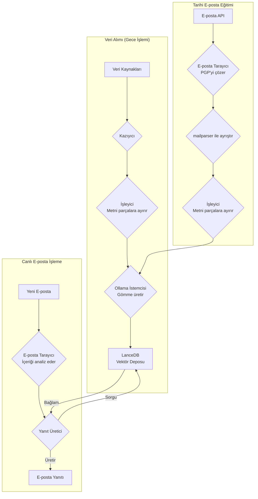
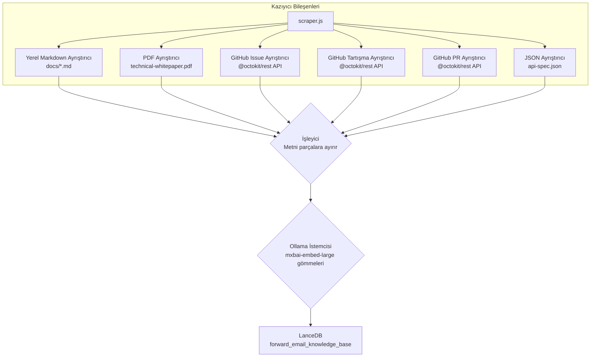
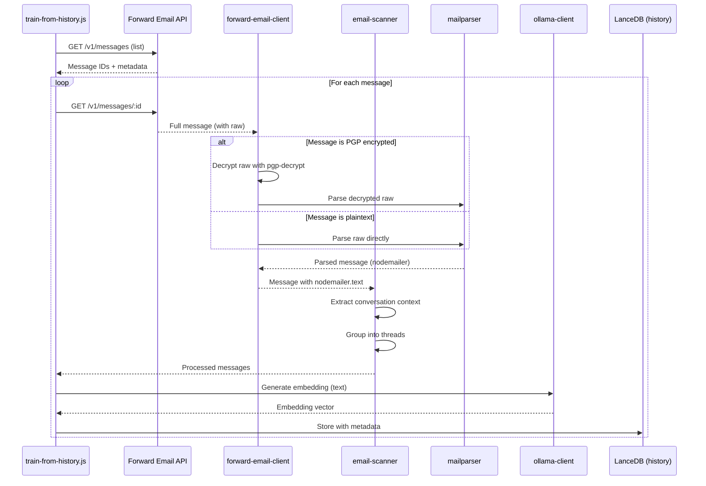

# LanceDB, Ollama ve Node.js ile Gizliliği Önceliklendiren AI Müşteri Destek Ajanı Oluşturma {#building-a-privacy-first-ai-customer-support-agent-with-lancedb-ollama-and-nodejs}


> \[!NOTE]
> Bu doküman, kendi kendine barındırılan bir AI destek ajanı oluşturma yolculuğumuzu kapsıyor. Benzer zorlukları [Email Startup Graveyard](https://forwardemail.net/blog/docs/email-startup-graveyard-why-80-percent-email-companies-fail) blog yazımızda yazmıştık. Dürüst olmak gerekirse "AI Startup Graveyard" adlı bir devam yazısı yazmayı düşündük ama belki AI balonu patlayana kadar bir yıl daha beklememiz gerekecek(?). Şimdilik, bu bizim neyin işe yaradığını, neyin yaramadığını ve neden böyle yaptığımızı anlattığımız beyin dökümümüz.

Kendi AI müşteri destek ajanımızı böyle inşa ettik. Zor olan yolu seçtik: kendi kendine barındırılan, gizliliği önceliklendiren ve tamamen kontrolümüz altında olan. Neden? Çünkü müşterilerimizin verilerini üçüncü taraf hizmetlere güvenmiyoruz. Bu, GDPR ve DPA gerekliliği ve yapılması gereken doğru şey.

Bu eğlenceli bir hafta sonu projesi değildi. Kırık bağımlılıklar, yanıltıcı dokümantasyon ve 2025 açık kaynak AI ekosisteminin genel kaosu içinde geçen bir aylık bir yolculuktu. Bu doküman, ne inşa ettiğimizi, neden inşa ettiğimizi ve yol boyunca karşılaştığımız engelleri kaydeder.


## İçindekiler {#table-of-contents}

* [Müşteri Faydaları: AI Destekli İnsan Desteği](#customer-benefits-ai-augmented-human-support)
  * [Daha Hızlı, Daha Doğru Yanıtlar](#faster-more-accurate-responses)
  * [Tükenmişlik Olmadan Tutarlılık](#consistency-without-burnout)
  * [Neler Elde Edersiniz](#what-you-get)
* [Kişisel Bir Yansıma: İki On Yıllık Emek](#a-personal-reflection-the-two-decade-grind)
* [Neden Gizlilik Önemlidir](#why-privacy-matters)
* [Maliyet Analizi: Bulut AI vs Kendi Kendine Barındırılan](#cost-analysis-cloud-ai-vs-self-hosted)
  * [Bulut AI Hizmet Karşılaştırması](#cloud-ai-service-comparison)
  * [Maliyet Dağılımı: 5GB Bilgi Tabanı](#cost-breakdown-5gb-knowledge-base)
  * [Kendi Kendine Barındırılan Donanım Maliyetleri](#self-hosted-hardware-costs)
* [Kendi API'mizi Kullanmak (Dogfooding)](#dogfooding-our-own-api)
  * [Dogfooding Neden Önemlidir](#why-dogfooding-matters)
  * [API Kullanım Örnekleri](#api-usage-examples)
  * [Performans Faydaları](#performance-benefits)
* [Şifreleme Mimarisi](#encryption-architecture)
  * [Katman 1: Posta Kutusu Şifrelemesi (chacha20-poly1305)](#layer-1-mailbox-encryption-chacha20-poly1305)
  * [Katman 2: Mesaj Seviyesi PGP Şifrelemesi](#layer-2-message-level-pgp-encryption)
  * [Bunun Eğitim İçin Önemi](#why-this-matters-for-training)
  * [Depolama Güvenliği](#storage-security)
  * [Yerel Depolama Standart Uygulama](#local-storage-is-standard-practice)
* [Mimari](#the-architecture)
  * [Yüksek Seviyeli Akış](#high-level-flow)
  * [Detaylı Scraper Akışı](#detailed-scraper-flow)
* [Nasıl Çalışır](#how-it-works)
  * [Bilgi Tabanı Oluşturma](#building-the-knowledge-base)
  * [Geçmiş E-postalardan Eğitim](#training-from-historical-emails)
  * [Gelen E-postaların İşlenmesi](#processing-incoming-emails)
  * [Vektör Deposu Yönetimi](#vector-store-management)
* [Vektör Veritabanı Mezarlığı](#the-vector-database-graveyard)
* [Sistem Gereksinimleri](#system-requirements)
* [Cron İşleri Yapılandırması](#cron-job-configuration)
  * [Ortam Değişkenleri](#environment-variables)
  * [Birden Fazla Gelen Kutusu için Cron İşleri](#cron-jobs-for-multiple-inboxes)
  * [Cron Zamanlama Dağılımı](#cron-schedule-breakdown)
  * [Dinamik Tarih Hesaplama](#dynamic-date-calculation)
  * [İlk Kurulum: Sitemap'ten URL Listesi Çıkarma](#initial-setup-extract-url-list-from-sitemap)
  * [Cron İşlerini Manuel Test Etme](#testing-cron-jobs-manually)
  * [Logları İzleme](#monitoring-logs)
* [Kod Örnekleri](#code-examples)
  * [Scraping ve İşleme](#scraping-and-processing)
  * [Geçmiş E-postalardan Eğitim](#training-from-historical-emails-1)
  * [Bağlam Sorgulama](#querying-for-context)
* [Gelecek: Spam Tarayıcı Ar-Ge](#the-future-spam-scanner-rd)
* [Sorun Giderme](#troubleshooting)
  * [Vektör Boyutu Uyumsuzluğu Hatası](#vector-dimension-mismatch-error)
  * [Boş Bilgi Tabanı Bağlamı](#empty-knowledge-base-context)
  * [PGP Şifre Çözme Hataları](#pgp-decryption-failures)
* [Kullanım İpuçları](#usage-tips)
  * [Gelen Kutusu Sıfırına Ulaşmak](#achieving-inbox-zero)
  * [skip-ai Etiketini Kullanmak](#using-the-skip-ai-label)
  * [E-posta Konu Dizisi ve Tümüne Yanıt](#email-threading-and-reply-all)
  * [İzleme ve Bakım](#monitoring-and-maintenance)
* [Test](#testing)
  * [Testleri Çalıştırma](#running-tests)
  * [Test Kapsamı](#test-coverage)
  * [Test Ortamı](#test-environment)
* [Ana Çıkarımlar](#key-takeaways)
## Müşteri Avantajları: Yapay Zeka Destekli İnsan Desteği {#customer-benefits-ai-augmented-human-support}

Yapay zeka sistemimiz destek ekibimizin yerini almaz—onları daha iyi hale getirir. Bu sizin için ne anlama geliyor, işte burada:

### Daha Hızlı, Daha Doğru Yanıtlar {#faster-more-accurate-responses}

**İnsan Döngüsünde**: Her yapay zeka tarafından oluşturulan taslak, size gönderilmeden önce insan destek ekibimiz tarafından gözden geçirilir, düzenlenir ve özenle seçilir. Yapay zeka ilk araştırma ve taslağı hazırlar, böylece ekibimiz kalite kontrol ve kişiselleştirmeye odaklanabilir.

**İnsan Uzmanlığı Üzerinden Eğitildi**: Yapay zeka şunlardan öğrenir:

* El yazısı bilgi tabanımız ve dokümantasyonumuz
* İnsanlar tarafından yazılmış blog yazıları ve eğitimler
* İnsanlar tarafından yazılmış kapsamlı SSS
* Geçmiş müşteri görüşmeleri (tamamı gerçek insanlar tarafından yönetildi)

Size yılların insan uzmanlığıyla bilgilendirilmiş yanıtlar sunuluyor, sadece daha hızlı teslim ediliyor.

### Tükenmişlik Olmadan Tutarlılık {#consistency-without-burnout}

Küçük ekibimiz her gün yüzlerce destek talebiyle ilgileniyor, her biri farklı teknik bilgi ve zihinsel bağlam değişikliği gerektiriyor:

* Faturalama soruları finansal sistem bilgisi gerektirir
* DNS sorunları ağ uzmanlığı gerektirir
* API entegrasyonu programlama bilgisi gerektirir
* Güvenlik raporları zafiyet değerlendirmesi gerektirir

Yapay zeka yardımı olmadan, bu sürekli bağlam değişikliği şunlara yol açar:

* Daha yavaş yanıt süreleri
* Yorgunluktan insan hatası
* Tutarsız yanıt kalitesi
* Ekip tükenmişliği

**Yapay zeka desteğiyle**, ekibimiz:

* Daha hızlı yanıt verir (Yapay zeka saniyeler içinde taslak hazırlar)
* Daha az hata yapar (Yapay zeka yaygın hataları yakalar)
* Tutarlı kaliteyi korur (Yapay zeka her seferinde aynı bilgi tabanına başvurur)
* Taze ve odaklanmış kalır (daha az araştırma, daha fazla yardım)

### Size Sunulanlar {#what-you-get}

✅ **Hız**: Yapay zeka yanıtları saniyeler içinde taslaklar, insanlar dakikalar içinde gözden geçirip gönderir

✅ **Doğruluk**: Yanıtlar gerçek dokümantasyonumuz ve geçmiş çözümlerimize dayanır

✅ **Tutarlılık**: Saat 9:00 ya da 21:00 olsun aynı yüksek kalitede yanıtlar

✅ **İnsani dokunuş**: Her yanıt ekibimiz tarafından gözden geçirilir ve kişiselleştirilir

✅ **Halüsinasyon yok**: Yapay zeka yalnızca doğrulanmış bilgi tabanımızı kullanır, genel internet verilerini değil

> \[!NOTE]
> **Her zaman insanlarla konuşuyorsunuz**. Yapay zeka, ekibimizin doğru yanıtı daha hızlı bulmasına yardımcı olan bir araştırma asistanıdır. Bunu, ilgili kitabı anında bulan bir kütüphaneci gibi düşünün—ama kitabı hala bir insan okur ve size açıklar.


## Kişisel Bir Yansıma: Yirmi Yıllık Emek {#a-personal-reflection-the-two-decade-grind}

Teknik detaylara girmeden önce kişisel bir not. Yaklaşık yirmi yıldır bu işin içindeyim. Klavyenin başında geçen sonsuz saatler, çözüm arayışındaki amansız çaba, derin ve odaklanmış çalışma—anlamlı bir şey inşa etmenin gerçeği budur. Bu, yeni teknolojilerin heyecan döngülerinde sıklıkla göz ardı edilen bir gerçekliktir.

Yapay zekanın son patlaması özellikle sinir bozucu oldu. Otomasyon hayali, kodumuzu yazacak ve sorunlarımızı çözecek yapay zeka asistanları satılıyor bize. Gerçek? Çıktı çoğunlukla çöplük kodu oluyor ve sıfırdan yazmaktan daha fazla zaman alıyor düzeltmek. Hayatımızı kolaylaştırma vaadi sahte. Bu, inşa etmenin zor ve gerekli işinden bir dikkat dağıtıcı.

Ve açık kaynak katkısının ikilemi var. Zaten yorgun ve tükenmiş durumdasınız. Bir yapay zeka kullanarak detaylı, iyi yapılandırılmış bir hata raporu yazmaya çalışıyorsunuz, böylece bakımcıların sorunu anlaması ve düzeltmesi kolaylaşsın diye. Peki ne oluyor? Azarlanıyorsunuz. Katkınız "konu dışı" veya düşük çaba olarak reddediliyor, tıpkı yakın zamanda gördüğümüz bir [Node.js GitHub sorunu](https://github.com/nodejs/node/issues/60719#issuecomment-3534304321) gibi. Bu, sadece yardım etmeye çalışan kıdemli geliştiricilere bir tokat.

Çalıştığımız ekosistemin gerçeği bu. Sadece bozuk araçlar değil; katkıda bulunanların zamanına ve [çabasına saygı göstermeyen](https://forwardemail.net/blog/docs/how-npm-packages-billion-downloads-shaped-javascript-ecosystem) bir kültür var. Bu yazı o gerçeğin bir kroniğidir. Araçlar hakkında bir hikaye, evet, ama aynı zamanda tüm vaatlerine rağmen temelde bozuk bir ekosistemde inşa etmenin insan maliyeti hakkında bir hikayedir.
## Gizliliğin Önemi {#why-privacy-matters}

[teknik beyaz kitabımız](https://forwardemail.net/technical-whitepaper.pdf) gizlilik felsefemizi derinlemesine ele alır. Kısa versiyon: müşteri verilerini üçüncü taraflara asla gönderemeyiz. Hiçbir zaman. Bu, OpenAI, Anthropic veya bulut tabanlı vektör veritabanları yok demektir. Her şey altyapımızda yerel olarak çalışır. Bu, GDPR uyumluluğu ve DPA taahhütlerimiz için tartışılmazdır.


## Maliyet Analizi: Bulut AI vs Kendi Sunucunuzda Barındırma {#cost-analysis-cloud-ai-vs-self-hosted}

Teknik uygulamaya girmeden önce, kendi sunucunuzda barındırmanın maliyet açısından neden önemli olduğundan bahsedelim. Bulut AI hizmetlerinin fiyatlandırma modelleri, müşteri desteği gibi yüksek hacimli kullanım durumları için aşırı pahalıdır.

### Bulut AI Hizmeti Karşılaştırması {#cloud-ai-service-comparison}

| Hizmet          | Sağlayıcı           | Gömme Maliyeti                                                  | LLM Maliyeti (Girdi)                                                      | LLM Maliyeti (Çıktı)    | Gizlilik Politikası                                | GDPR/DPA        | Barındırma        | Veri Paylaşımı    |
| --------------- | ------------------- | ---------------------------------------------------------------- | -------------------------------------------------------------------------- | ---------------------- | --------------------------------------------------- | --------------- | ----------------- | ----------------- |
| **OpenAI**      | OpenAI (ABD)        | [$0.02-0.13/1M token](https://openai.com/api/pricing/)          | $0.15-20/1M token                                                         | $0.60-80/1M token      | [Link](https://openai.com/policies/privacy-policy/) | Sınırlı DPA     | Azure (ABD)       | Evet (eğitim)     |
| **Claude**      | Anthropic (ABD)     | Yok                                                              | [$3-20/1M token](https://docs.claude.com/en/docs/about-claude/pricing)    | $15-80/1M token        | [Link](https://www.anthropic.com/legal/privacy)     | Sınırlı DPA     | AWS/GCP (ABD)     | Hayır (iddia edilen) |
| **Gemini**      | Google (ABD)        | [$0.15/1M token](https://ai.google.dev/gemini-api/docs/pricing) | $0.30-1.00/1M token                                                       | $2.50/1M token         | [Link](https://policies.google.com/privacy)         | Sınırlı DPA     | GCP (ABD)         | Evet (iyileştirme) |
| **DeepSeek**    | DeepSeek (Çin)      | Yok                                                              | [$0.028-0.28/1M token](https://api-docs.deepseek.com/quick_start/pricing) | $0.42/1M token         | [Link](https://www.deepseek.com/en)                 | Bilinmiyor      | Çin               | Bilinmiyor        |
| **Mistral**     | Mistral AI (Fransa) | [$0.10/1M token](https://mistral.ai/pricing)                    | $0.40/1M token                                                            | $2.00/1M token         | [Link](https://mistral.ai/terms/)                   | AB GDPR         | AB                | Bilinmiyor        |
| **Kendi Sunucunuzda** | Siz              | $0 (mevcut donanım)                                              | $0 (mevcut donanım)                                                       | $0 (mevcut donanım)    | Kendi politikanız                                  | Tam uyumluluk   | MacBook M5 + cron | Asla              |

> \[!WARNING]
> **Veri egemenliği endişeleri**: ABD sağlayıcıları (OpenAI, Claude, Gemini) CLOUD Yasası kapsamındadır, bu da ABD hükümetinin verilere erişimini sağlar. DeepSeek (Çin) Çin veri yasalarına tabidir. Mistral (Fransa) AB barındırma ve GDPR uyumluluğu sunarken, tam veri egemenliği ve kontrol için kendi sunucunuzda barındırma tek seçenektir.

### Maliyet Dağılımı: 5GB Bilgi Tabanı {#cost-breakdown-5gb-knowledge-base}

5GB'lık bir bilgi tabanını işleme maliyetini hesaplayalım (orta ölçekli bir şirket için dokümanlar, e-postalar ve destek geçmişi tipiktir).

**Varsayımlar:**

* 5GB metin ≈ 1.25 milyar token (yaklaşık \~4 karakter/token varsayımıyla)
* İlk gömme oluşturma
* Aylık yeniden eğitim (tam yeniden gömme)
* Aylık 10.000 destek sorgusu
* Ortalama sorgu: 500 token girdi, 300 token çıktı
**Detaylı Maliyet Dağılımı:**

| Bileşen                              | OpenAI           | Claude          | Gemini               | Kendi Sunucumuz    |
| -------------------------------------- | ---------------- | --------------- | -------------------- | ------------------ |
| **İlk Embedding** (1.25B token)        | $25,000          | N/A             | $187,500             | $0                 |
| **Aylık Sorgular** (10K × 800 token)   | $1,200-16,000    | $2,400-16,000   | $2,400-3,200         | $0                 |
| **Aylık Yeniden Eğitim** (1.25B token) | $25,000          | N/A             | $187,500             | $0                 |
| **İlk Yıl Toplamı**                    | $325,200-217,000 | $28,800-192,000 | $2,278,800-2,226,000 | ~ $60 (elektrik)   |
| **Gizlilik Uyumu**                    | ❌ Sınırlı        | ❌ Sınırlı       | ❌ Sınırlı            | ✅ Tam              |
| **Veri Egemenliği**                   | ❌ Hayır          | ❌ Hayır         | ❌ Hayır              | ✅ Evet             |

> \[!CAUTION]
> **Gemini'nin embedding maliyetleri felaket boyutunda**: 1M token başına $0.15. Tek bir 5GB bilgi tabanı embedding'i $187,500 tutarındadır. Bu, OpenAI'den 37 kat daha pahalıdır ve üretim için tamamen kullanılamaz hale getirir.

### Kendi Sunucumuzun Donanım Maliyetleri {#self-hosted-hardware-costs}

Kurulumumuz zaten sahip olduğumuz mevcut donanım üzerinde çalışıyor:

* **Donanım**: MacBook M5 (geliştirme için zaten sahip olunan)
* **Ek maliyet**: $0 (mevcut donanım kullanılıyor)
* **Elektrik**: \~$5/ay (tahmini)
* **İlk yıl toplamı**: \~$60
* **Sürekli maliyet**: $60/yıl

**Yatırım Getirisi (ROI)**: Kendi sunucumuzu kullanmanın marjinal maliyeti neredeyse sıfırdır çünkü mevcut geliştirme donanımını kullanıyoruz. Sistem, yoğun olmayan saatlerde cron işleri ile çalışır.


## Kendi API'mizi Kendi İçimizde Kullanmak {#dogfooding-our-own-api}

Yaptığımız en önemli mimari kararlardan biri, tüm AI işlerinin [Forward Email API](https://forwardemail.net/email-api) 'yi doğrudan kullanmasıydı. Bu sadece iyi bir uygulama değil—aynı zamanda performans optimizasyonu için bir zorlayıcıdır.

### Kendi İçimizde Kullanmanın Önemi {#why-dogfooding-matters}

AI işlerimiz müşterilerimizle aynı API uç noktalarını kullandığında:

1. **Performans darboğazları önce bizi etkiler** - Müşterilerden önce biz acısını hissederiz
2. **Optimizasyon herkese fayda sağlar** - İşlerimiz için yapılan iyileştirmeler otomatik olarak müşteri deneyimini geliştirir
3. **Gerçek dünya testi** - İşlerimiz binlerce e-postayı işler, sürekli yük testi sağlar
4. **Kod tekrar kullanımı** - Aynı kimlik doğrulama, hız limitleme, hata yönetimi ve önbellekleme mantığı

### API Kullanım Örnekleri {#api-usage-examples}

**Mesajları Listeleme (train-from-history.js):**

```javascript
// GET /v1/messages?folder=INBOX kullanır, BasicAuth ile
// Yanıt boyutunu azaltmak için eml, raw, nodemailer hariç tutulur (sadece ID'ler gerekli)
const response = await axios.get(
  `${this.apiBase}/v1/messages`,
  {
    params: {
      folder: 'INBOX',
      limit: 100,
      eml: false,
      raw: false,
      nodemailer: false
    },
    auth: {
      username: process.env.FORWARD_EMAIL_ALIAS_USERNAME,
      password: process.env.FORWARD_EMAIL_ALIAS_PASSWORD
    }
  }
);

const messages = response.data;
// Döner: [{ id, subject, date, ... }, ...]
// Tam mesaj içeriği daha sonra GET /v1/messages/:id ile alınır
```

**Tam Mesajları Alma (forward-email-client.js):**

```javascript
// GET /v1/messages/:id kullanarak ham içerikli tam mesajı alır
const response = await axios.get(
  `${this.apiBase}/v1/messages/${messageId}`,
  {
    auth: {
      username: this.aliasUsername,
      password: this.aliasPassword
    }
  }
);

const message = response.data;
// Döner: { id, subject, raw, eml, nodemailer: { ... }, ... }
```

**Taslak Yanıtlar Oluşturma (process-inbox.js):**

```javascript
// POST /v1/messages kullanarak taslak yanıtlar oluşturur
const response = await axios.post(
  `${this.apiBase}/v1/messages`,
  {
    folder: 'Drafts',
    subject: `Re: ${originalSubject}`,
    to: senderEmail,
    text: generatedResponse,
    inReplyTo: originalMessageId
  },
  {
    auth: {
      username: process.env.FORWARD_EMAIL_ALIAS_USERNAME,
      password: process.env.FORWARD_EMAIL_ALIAS_PASSWORD
    }
  }
);
```
### Performans Faydaları {#performance-benefits}

Çünkü AI işlerimiz aynı API altyapısı üzerinde çalışıyor:

* **Önbellekleme optimizasyonları** hem işler hem de müşteriler için faydalıdır
* **Oran sınırlaması** gerçek yük altında test edilir
* **Hata yönetimi** savaşta test edilmiştir
* **API yanıt süreleri** sürekli izlenir
* **Veritabanı sorguları** her iki kullanım durumu için optimize edilmiştir
* **Bant genişliği optimizasyonu** - Listeleme sırasında `eml`, `raw`, `nodemailer` hariç tutulduğunda yanıt boyutu yaklaşık %90 azalır

`train-from-history.js` 1.000 e-postayı işlerken, 1.000'den fazla API çağrısı yapıyor. API'deki herhangi bir verimsizlik hemen ortaya çıkar. Bu, IMAP erişimini, veritabanı sorgularını ve yanıt serileştirmesini optimize etmemizi zorunlu kılar—bu iyileştirmeler doğrudan müşterilerimize fayda sağlar.

**Örnek optimizasyon**: Tam içerikle 100 mesaj listelemek = yaklaşık 10MB yanıt. `eml: false, raw: false, nodemailer: false` ile listelemek = yaklaşık 100KB yanıt (100 kat daha küçük).


## Şifreleme Mimarisi {#encryption-architecture}

E-posta depolamamız, AI işlerinin eğitim için gerçek zamanlı olarak çözmesi gereken birden fazla şifreleme katmanı kullanır.

### Katman 1: Posta Kutusu Şifrelemesi (chacha20-poly1305) {#layer-1-mailbox-encryption-chacha20-poly1305}

Tüm IMAP posta kutuları, kuantum güvenli bir şifreleme algoritması olan **chacha20-poly1305** ile şifrelenmiş SQLite veritabanları olarak saklanır. Bu, [kuantum güvenli şifreli e-posta hizmeti blog yazımızda](https://forwardemail.net/blog/docs/best-quantum-safe-encrypted-email-service) detaylandırılmıştır.

**Anahtar Özellikler:**

* **Algoritma**: ChaCha20-Poly1305 (AEAD şifreleme)
* **Kuantum güvenli**: Kuantum bilgisayar saldırılarına dayanıklı
* **Depolama**: Diskte SQLite veritabanı dosyaları
* **Erişim**: IMAP/API üzerinden erişildiğinde bellekte şifresi çözülür

### Katman 2: Mesaj Düzeyi PGP Şifrelemesi {#layer-2-message-level-pgp-encryption}

Birçok destek e-postası ayrıca PGP (OpenPGP standardı) ile şifrelenmiştir. AI işleri, eğitim için içerik çıkarmak üzere bunların şifresini çözmelidir.

**Şifre Çözme Akışı:**

```javascript
// 1. API, şifrelenmiş ham içerikle mesajı döner
const message = await forwardEmailClient.getMessage(id);

// 2. Ham içeriğin PGP ile şifrelenip şifrelenmediğini kontrol et
if (isMessageEncrypted(message.raw)) {
  // 3. Özel anahtarımızla şifreyi çöz
  const decryptedRaw = await pgpDecrypt(message.raw);

  // 4. Şifresi çözülmüş MIME mesajını ayrıştır
  const parsed = await simpleParser(decryptedRaw);

  // 5. Nodemailer'ı şifresi çözülmüş içerikle doldur
  message.nodemailer = {
    text: parsed.text,
    html: parsed.html,
    from: parsed.from,
    to: parsed.to,
    subject: parsed.subject,
    date: parsed.date
  };
}
```

**PGP Yapılandırması:**

```bash
# Şifre çözme için özel anahtar (ASCII zırhlı anahtar dosyasının yolu)
GPG_SECURITY_KEY="/path/to/private-key.asc"

# Özel anahtar için parola (şifreliyse)
GPG_SECURITY_PASSPHRASE="your-passphrase"
```

`pgp-decrypt.js` yardımcı programı:

1. Özel anahtarı diskten bir kez okur (bellekte önbelleğe alır)
2. Anahtarı parola ile çözer
3. Tüm mesaj şifre çözme işlemleri için çözülen anahtarı kullanır
4. İç içe şifrelenmiş mesajlar için özyinelemeli şifre çözmeyi destekler

### Eğitimin Önemi {#why-this-matters-for-training}

Doğru şifre çözme olmadan, AI şifrelenmiş anlamsız metin üzerinde eğitim yapardı:

```
-----BEGIN PGP MESSAGE-----
Version: OpenPGP.js v4.10.10

wcBMA8Z3lHJnFnNUAQgAqK7F8...
-----END PGP MESSAGE-----
```

Şifre çözme ile AI gerçek içerik üzerinde eğitim yapar:

```
Subject: Re: Bug Report

Hi John,

Thanks for reporting this issue. I've confirmed the bug
and created a fix in PR #1234...
```

### Depolama Güvenliği {#storage-security}

Şifre çözme, iş yürütülürken bellekte gerçekleşir ve şifresi çözülmüş içerik, ardından LanceDB vektör veritabanında diske kaydedilen gömme (embedding) haline dönüştürülür.

**Verinin bulunduğu yerler:**

* **Vektör veritabanı**: Şifrelenmiş MacBook M5 iş istasyonlarında saklanır
* **Fiziksel güvenlik**: İş istasyonları her zaman bizimle kalır (veri merkezlerinde değil)
* **Disk şifrelemesi**: Tüm iş istasyonlarında tam disk şifrelemesi
* **Ağ güvenliği**: Güvenlik duvarı ile korunur ve genel ağlardan izole edilmiştir

**Gelecekteki veri merkezi dağıtımı:**
Eğer veri merkezi barındırmaya geçersek, sunucular şunlara sahip olacaktır:

* LUKS tam disk şifrelemesi
* USB erişimi devre dışı bırakılmış
* Fiziksel güvenlik önlemleri
* Ağ izolasyonu
Güvenlik uygulamalarımız hakkında tam detaylar için, [Güvenlik sayfamıza](https://forwardemail.net/en/security) bakınız.

> \[!NOTE]
> Vektör veritabanı, orijinal düz metin değil, gömme (matematiksel temsil) içerir. Ancak, gömmeler tersine mühendislik ile açığa çıkarılabilir, bu yüzden onları şifrelenmiş, fiziksel olarak güvenli iş istasyonlarında tutuyoruz.

### Yerel Depolama Standart Uygulama {#local-storage-is-standard-practice}

Gömme verilerini ekibimizin iş istasyonlarında depolamak, e-postayı zaten nasıl işlediğimizden farklı değildir:

* **Thunderbird**: Tam e-posta içeriğini yerel olarak mbox/maildir dosyalarında indirir ve depolar
* **Webmail istemcileri**: E-posta verilerini tarayıcı depolaması ve yerel veritabanlarında önbelleğe alır
* **IMAP istemcileri**: Çevrimdışı erişim için mesajların yerel kopyalarını tutar
* **Bizim AI sistemimiz**: Matematiksel gömmeleri (düz metin değil) LanceDB'de depolar

Temel fark: gömmeler, düz metin e-postadan **daha güvenlidir** çünkü:

1. Matematiksel temsiller, okunabilir metin değildir
2. Düz metinden daha zor tersine mühendislik yapılabilir
3. E-posta istemcilerimizle aynı fiziksel güvenliğe tabidir

Eğer ekibimizin Thunderbird veya webmail'i şifrelenmiş iş istasyonlarında kullanması kabul edilebilirse, gömmeleri aynı şekilde depolamak da eşit derecede kabul edilebilir (ve tartışmalı olarak daha güvenlidir).


## Mimari {#the-architecture}

İşte temel akış. Basit görünüyor. Değildi.

> \[!NOTE]
> Tüm işler doğrudan Forward Email API'sini kullanır, böylece performans optimizasyonları hem AI sistemimiz hem de müşterilerimiz için fayda sağlar.

### Yüksek Seviyeli Akış {#high-level-flow}



### Detaylı Kazıyıcı Akışı {#detailed-scraper-flow}

`scraper.js` veri alımının kalbidir. Farklı veri formatları için ayrıştırıcılar koleksiyonudur.




## Nasıl Çalışır {#how-it-works}

Süreç üç ana parçaya ayrılmıştır: bilgi tabanı oluşturma, tarihi e-postalardan eğitim ve yeni e-postaları işleme.

### Bilgi Tabanı Oluşturma {#building-the-knowledge-base}

**`update-knowledge-base.js`**: Bu ana işlemdir. Her gece çalışır, eski vektör deposunu temizler ve sıfırdan yeniden oluşturur. Tüm kaynaklardan içerik almak için `scraper.js`, metni parçalara ayırmak için `processor.js` ve gömme üretmek için `ollama-client.js` kullanır. Son olarak, `vector-store.js` her şeyi LanceDB'de depolar.

**Veri Kaynakları:**

* Yerel Markdown dosyaları (`docs/*.md`)
* Teknik beyaz kağıt PDF'si (`assets/technical-whitepaper.pdf`)
* API spesifikasyon JSON'u (`assets/api-spec.json`)
* GitHub sorunları (Octokit aracılığıyla)
* GitHub tartışmaları (Octokit aracılığıyla)
* GitHub çekme istekleri (Octokit aracılığıyla)
* Site haritası URL listesi (`$LANCEDB_PATH/valid-urls.json`)

### Tarihi E-postalardan Eğitim {#training-from-historical-emails}

**`train-from-history.js`**: Bu işlem tüm klasörlerden tarihi e-postaları tarar, PGP ile şifrelenmiş mesajları çözer ve bunları ayrı bir vektör deposuna (`customer_support_history`) ekler. Bu, geçmiş destek etkileşimlerinden bağlam sağlar.
**E-posta İşleme Akışı:**



**Temel Özellikler:**

* **PGP Şifre Çözme**: `GPG_SECURITY_KEY` ortam değişkeni ile `pgp-decrypt.js` yardımcı dosyasını kullanır
* **Konuşma Gruplama**: İlgili e-postaları konuşma dizilerine gruplar
* **Meta Veri Koruma**: Klasör, konu, tarih, şifreleme durumu saklanır
* **Yanıt Bağlamı**: Mesajları yanıtlarıyla ilişkilendirerek daha iyi bağlam sağlar

**Yapılandırma:**

```bash
# train-from-history için ortam değişkenleri
HISTORY_SCAN_LIMIT=1000              # İşlenecek maksimum mesaj sayısı
HISTORY_SCAN_SINCE="2024-01-01"      # Bu tarihten sonraki mesajlar işlenir
HISTORY_DECRYPT_PGP=true             # PGP şifre çözme denemesi
GPG_SECURITY_KEY="/path/to/key.asc"  # PGP özel anahtar yolu
GPG_SECURITY_PASSPHRASE="passphrase" # Anahtar parolası (isteğe bağlı)
```

**Saklanan Veriler:**

```javascript
{
  type: 'historical_email',
  folder: 'INBOX',
  subject: 'Re: Bug Report',
  date: '2025-01-15T10:30:00Z',
  messageId: '67e2f288893921...',
  threadId: 'Bug Report',
  hasReply: true,
  encrypted: true,
  decrypted: true,
  replySubject: 'Bug Report',
  replyText: 'First 500 chars of reply...',
  chunkSize: 1000,
  chunkOverlap: 200,
  chunkIndex: 0
}
```

> \[!TIP]
> Tarihsel bağlamı doldurmak için ilk kurulumdan sonra `train-from-history` komutunu çalıştırın. Bu, geçmiş destek etkileşimlerinden öğrenerek yanıt kalitesini önemli ölçüde artırır.

### Gelen E-postaların İşlenmesi {#processing-incoming-emails}

**`process-inbox.js`**: Bu görev, `support@forwardemail.net`, `abuse@forwardemail.net` ve `security@forwardemail.net` posta kutularımızdaki (özellikle `INBOX` IMAP klasör yolu) e-postalar üzerinde çalışır. <https://forwardemail.net/email-api> API'mizi kullanır (örneğin, her posta kutusu için IMAP kimlik bilgileriyle BasicAuth erişimi kullanarak `GET /v1/messages?folder=INBOX`). E-posta içeriğini analiz eder, hem bilgi tabanını (`forward_email_knowledge_base`) hem de tarihsel e-posta vektör deposunu (`customer_support_history`) sorgular ve ardından birleşik bağlamı `response-generator.js`'ye iletir. Generator, Ollama üzerinden `mxbai-embed-large` kullanarak yanıt oluşturur.

**Otomatik İş Akışı Özellikleri:**

1. **Inbox Zero Otomasyonu**: Taslak başarıyla oluşturulduktan sonra, orijinal mesaj otomatik olarak Arşiv klasörüne taşınır. Bu, gelen kutunuzu temiz tutar ve manuel müdahale olmadan inbox zero hedeflemenize yardımcı olur.

2. **AI İşleminden Atlama**: AI işlemini engellemek için herhangi bir mesaja (büyük/küçük harf duyarsız) `skip-ai` etiketi ekleyin. Mesaj gelen kutunuzda dokunulmadan kalır ve manuel olarak işlenebilir. Bu, hassas mesajlar veya insan yargısı gerektiren karmaşık durumlar için faydalıdır.

3. **Doğru E-posta Dizileme**: Tüm taslak yanıtlar, standart ` >  ` öneki kullanılarak orijinal mesajı altta alıntılar ve "On \[tarih], \[gönderen] wrote:" formatında e-posta yanıt kurallarına uyar. Bu, e-posta istemcilerinde doğru konuşma bağlamı ve dizileme sağlar.

4. **Herkese Yanıt Davranışı**: Sistem otomatik olarak Reply-To başlıklarını ve CC alıcılarını yönetir:
   * Reply-To başlığı varsa, bu adres To olarak kullanılır ve orijinal From CC'ye eklenir
   * Orijinal To ve CC alıcılarının tamamı yanıt CC'sine dahil edilir (kendi adresiniz hariç)
   * Grup konuşmaları için standart e-posta herkese yanıt kurallarına uyulur
**Kaynak Sıralaması**: Sistem, kaynakları önceliklendirmek için **ağırlıklı sıralama** kullanır:

* SSS: %100 (en yüksek öncelik)
* Teknik beyaz kitap: %95
* API spesifikasyonu: %90
* Resmi dokümanlar: %85
* GitHub sorunları: %70
* Tarihsel e-postalar: %50

### Vektör Deposu Yönetimi {#vector-store-management}

`helpers/customer-support-ai/vector-store.js` içindeki `VectorStore` sınıfı, LanceDB ile arayüzümüzdür.

**Belge Ekleme:**

```javascript
// vector-store.js
async addDocument(text, metadata) {
  const embedding = await this.ollama.generateEmbedding(text);
  await this.table.add([{
    vector: embedding,
    text,
    ...metadata
  }]);
}
```

**Depoyu Temizleme:**

```javascript
// Seçenek 1: clear() metodunu kullan
await vectorStore.clear();

// Seçenek 2: Yerel veritabanı dizinini sil
await fs.rm(process.env.LANCEDB_PATH, { recursive: true, force: true });
```

`LANCEDB_PATH` ortam değişkeni, yerel gömülü veritabanı dizinine işaret eder. LanceDB sunucusuz ve gömülüdür, bu yüzden yönetilecek ayrı bir süreç yoktur.


## Vektör Veritabanı Mezarlığı {#the-vector-database-graveyard}

Bu ilk büyük engeldi. LanceDB'ye karar vermeden önce birçok vektör veritabanını denedik. İşte her birinde neyin yanlış gittiği.

| Veritabanı   | GitHub                                                      | Ne Yanlış Gitti                                                                                                                                                                                                     | Özel Sorunlar                                                                                                                                                                                                                                                                                                                                                           | Güvenlik Endişeleri                                                                                                                                                                                             |
| ------------ | ----------------------------------------------------------- | ------------------------------------------------------------------------------------------------------------------------------------------------------------------------------------------------------------------ | ----------------------------------------------------------------------------------------------------------------------------------------------------------------------------------------------------------------------------------------------------------------------------------------------------------------------------------------------------------------------- | ---------------------------------------------------------------------------------------------------------------------------------------------------------------------------------------------------------------- |
| **ChromaDB** | [chroma-core/chroma](https://github.com/chroma-core/chroma) | `pip3 install chromadb` size `PydanticImportError` ile taş devrinden kalma bir sürüm verir. Çalışan bir sürüm elde etmenin tek yolu kaynaktan derlemektir. Geliştirici dostu değil.                                | Python bağımlılık karmaşası. Birçok kullanıcı bozuk pip kurulumları bildiriyor ([#774](https://github.com/chroma-core/chroma/issues/774), [#163](https://github.com/chroma-core/chroma/issues/163)). Dokümanlarda "sadece Docker kullanın" deniyor, bu yerel geliştirme için cevap değil. Windows'ta >99 kayıtla çöker ([#3058](https://github.com/chroma-core/chroma/issues/3058)). | **CVE-2024-45848**: MindsDB'deki ChromaDB entegrasyonu üzerinden rastgele kod yürütme. Docker imajında kritik OS güvenlik açıkları ([#3170](https://github.com/chroma-core/chroma/issues/3170)).                      |
| **Qdrant**   | [qdrant/qdrant](https://github.com/qdrant/qdrant)           | Eski dokümanlarında referans verilen Homebrew tap'i (`qdrant/qdrant/qdrant`) kayboldu. Gitti. Açıklama yok. Resmi dokümanlar artık sadece "Docker kullanın" diyor.                                                  | Homebrew tap eksik. Yerel macOS ikili dosyası yok. Sadece Docker olması hızlı yerel test için engel.                                                                                                                                                                                                                                                                     | **CVE-2024-2221**: Uzaktan kod yürütmeye izin veren rastgele dosya yükleme açığı (v1.9.0'da düzeltildi). [IronCore Labs](https://ironcorelabs.com/vectordbs/qdrant-security/) tarafından zayıf güvenlik olgunluk puanı. |
| **Weaviate** | [weaviate/weaviate](https://github.com/weaviate/weaviate)   | Homebrew sürümünde kritik bir kümeleme hatası vardı (`leader not found`). Düzeltmek için belgelenen bayraklar (`RAFT_JOIN`, `CLUSTER_HOSTNAME`) işe yaramadı. Tek düğümlü kurulumlar için temelde bozuk.             | Tek düğümlü modda bile kümeleme hataları. Basit kullanım durumları için aşırı karmaşık.                                                                                                                                                                                                                                                                                   | Önemli CVE bulunmadı, ancak karmaşıklık saldırı yüzeyini artırıyor.                                                                                                                                               |
| **LanceDB**  | [lancedb/lancedb](https://github.com/lancedb/lancedb)       | Bu çalışan tek veritabanıydı. Gömülü ve sunucusuz. Ayrı bir süreç yok. Tek rahatsızlık verici şey kafa karıştırıcı paket isimlendirmesi (`vectordb` kullanımdan kalktı, `@lancedb/lancedb` kullanılmalı) ve dağınık dokümanlar. Buna katlanabiliriz. | Paket isimlendirme karışıklığı (`vectordb` vs `@lancedb/lancedb`), ancak genel olarak sağlam. Gömülü mimari, tüm güvenlik sorunları sınıflarını ortadan kaldırıyor.                                                                                                                                                                                                     | Bilinen CVE yok. Gömülü tasarım ağ saldırı yüzeyini ortadan kaldırıyor.                                                                                                                                           |
> \[!WARNING]
> **ChromaDB kritik güvenlik açıklarına sahiptir.** [CVE-2024-45848](https://nvd.nist.gov/vuln/detail/CVE-2024-45848) rastgele kod çalıştırmaya izin verir. Pydantic bağımlılık sorunları nedeniyle pip kurulumu temelde bozuk durumdadır. Üretim kullanımı için kaçının.

> \[!WARNING]
> **Qdrant'ta dosya yükleme RCE açığı vardı** ([CVE-2024-2221](https://qdrant.tech/blog/cve-2024-2221-response/)) ve bu sadece v1.9.0 sürümünde düzeltildi. Qdrant kullanmanız gerekiyorsa, en son sürümde olduğunuzdan emin olun.

> \[!CAUTION]
> Açık kaynak vektör veritabanı ekosistemi zorludur. Belgelerine güvenmeyin. Her şeyin bozuk olduğunu varsayın, aksi kanıtlanana kadar. Bir yığına bağlı kalmadan önce yerel olarak test edin.


## Sistem Gereksinimleri {#system-requirements}

* **Node.js:** v18.0.0+ ([GitHub](https://github.com/nodejs/node))
* **Ollama:** En son sürüm ([GitHub](https://github.com/ollama/ollama))
* **Model:** `mxbai-embed-large` Ollama üzerinden
* **Vektör Veritabanı:** LanceDB ([GitHub](https://github.com/lancedb/lancedb))
* **GitHub Erişimi:** Sorunları kazımak için `@octokit/rest` ([GitHub](https://github.com/octokit/rest.js))
* **SQLite:** Birincil veritabanı için (`mongoose-to-sqlite` üzerinden)


## Cron İş Yapılandırması {#cron-job-configuration}

Tüm AI işleri MacBook M5 üzerinde cron ile çalıştırılır. İşte birden fazla gelen kutusunda gece yarısı çalışacak şekilde cron işlerinin nasıl ayarlanacağı.

### Ortam Değişkenleri {#environment-variables}

İşler bu ortam değişkenlerini gerektirir. Çoğu `.env` dosyasında ayarlanabilir (`@ladjs/env` ile yüklenir), ancak `HISTORY_SCAN_SINCE` crontab içinde dinamik olarak hesaplanmalıdır.

**`.env` dosyasında:**

```bash
# Forward Email API kimlik bilgileri (her gelen kutusu için değişir)
FORWARD_EMAIL_ALIAS_USERNAME=support@forwardemail.net
FORWARD_EMAIL_ALIAS_PASSWORD=your-imap-password

# PGP şifre çözme (tüm gelen kutuları için ortak)
GPG_SECURITY_KEY=/path/to/private-key.asc
GPG_SECURITY_PASSPHRASE=your-passphrase

# Tarihsel tarama yapılandırması
HISTORY_SCAN_LIMIT=1000

# LanceDB yolu
LANCEDB_PATH=/path/to/lancedb
```

**Crontab içinde (dinamik olarak hesaplanır):**

```bash
# HISTORY_SCAN_SINCE crontab içinde shell tarih hesaplaması ile satır içi ayarlanmalıdır
# .env dosyasında olamaz çünkü @ladjs/env shell komutlarını değerlendirmez
HISTORY_SCAN_SINCE="$(date -v-1d +%Y-%m-%d)"  # macOS
HISTORY_SCAN_SINCE="$(date -d 'yesterday' +%Y-%m-%d)"  # Linux
```

### Birden Fazla Gelen Kutusu için Cron İşleri {#cron-jobs-for-multiple-inboxes}

Crontab dosyanızı `crontab -e` ile düzenleyin ve şunları ekleyin:

```bash
# Bilgi tabanını güncelle (bir kez çalışır, tüm gelen kutuları için ortak)
0 0 * * * cd /path/to/forwardemail.net && LANCEDB_PATH="/path/to/lancedb" GPG_SECURITY_KEY="/path/to/key.asc" GPG_SECURITY_PASSPHRASE="pass" node jobs/customer-support-ai/update-knowledge-base.js >> /var/log/update-knowledge-base.log 2>&1

# Geçmişten eğitim - support@forwardemail.net
0 0 * * * cd /path/to/forwardemail.net && FORWARD_EMAIL_ALIAS_USERNAME="support@forwardemail.net" FORWARD_EMAIL_ALIAS_PASSWORD="support-password" HISTORY_SCAN_SINCE="$(date -v-1d +%Y-%m-%d)" HISTORY_SCAN_LIMIT=1000 GPG_SECURITY_KEY="/path/to/key.asc" GPG_SECURITY_PASSPHRASE="pass" LANCEDB_PATH="/path/to/lancedb" node jobs/customer-support-ai/train-from-history.js >> /var/log/train-support.log 2>&1

# Geçmişten eğitim - abuse@forwardemail.net
0 0 * * * cd /path/to/forwardemail.net && FORWARD_EMAIL_ALIAS_USERNAME="abuse@forwardemail.net" FORWARD_EMAIL_ALIAS_PASSWORD="abuse-password" HISTORY_SCAN_SINCE="$(date -v-1d +%Y-%m-%d)" HISTORY_SCAN_LIMIT=1000 GPG_SECURITY_KEY="/path/to/key.asc" GPG_SECURITY_PASSPHRASE="pass" LANCEDB_PATH="/path/to/lancedb" node jobs/customer-support-ai/train-from-history.js >> /var/log/train-abuse.log 2>&1

# Geçmişten eğitim - security@forwardemail.net
0 0 * * * cd /path/to/forwardemail.net && FORWARD_EMAIL_ALIAS_USERNAME="security@forwardemail.net" FORWARD_EMAIL_ALIAS_PASSWORD="security-password" HISTORY_SCAN_SINCE="$(date -v-1d +%Y-%m-%d)" HISTORY_SCAN_LIMIT=1000 GPG_SECURITY_KEY="/path/to/key.asc" GPG_SECURITY_PASSPHRASE="pass" LANCEDB_PATH="/path/to/lancedb" node jobs/customer-support-ai/train-from-history.js >> /var/log/train-security.log 2>&1

# Gelen kutusunu işle - support@forwardemail.net
*/5 * * * * cd /path/to/forwardemail.net && FORWARD_EMAIL_ALIAS_USERNAME="support@forwardemail.net" FORWARD_EMAIL_ALIAS_PASSWORD="support-password" GPG_SECURITY_KEY="/path/to/key.asc" GPG_SECURITY_PASSPHRASE="pass" LANCEDB_PATH="/path/to/lancedb" node jobs/customer-support-ai/process-inbox.js >> /var/log/process-support.log 2>&1

# Gelen kutusunu işle - abuse@forwardemail.net
*/5 * * * * cd /path/to/forwardemail.net && FORWARD_EMAIL_ALIAS_USERNAME="abuse@forwardemail.net" FORWARD_EMAIL_ALIAS_PASSWORD="abuse-password" GPG_SECURITY_KEY="/path/to/key.asc" GPG_SECURITY_PASSPHRASE="pass" LANCEDB_PATH="/path/to/lancedb" node jobs/customer-support-ai/process-inbox.js >> /var/log/process-abuse.log 2>&1

# Gelen kutusunu işle - security@forwardemail.net
*/5 * * * * cd /path/to/forwardemail.net && FORWARD_EMAIL_ALIAS_USERNAME="security@forwardemail.net" FORWARD_EMAIL_ALIAS_PASSWORD="security-password" GPG_SECURITY_KEY="/path/to/key.asc" GPG_SECURITY_PASSPHRASE="pass" LANCEDB_PATH="/path/to/lancedb" node jobs/customer-support-ai/process-inbox.js >> /var/log/process-security.log 2>&1
```
### Cron Programlama Detayı {#cron-schedule-breakdown}

| İş                      | Program       | Açıklama                                                                          |
| ----------------------- | ------------- | --------------------------------------------------------------------------------- |
| `train-from-sitemap.js` | `0 0 * * 0`   | Haftalık (Pazar gece yarısı) - Sitemap'ten tüm URL'leri alır ve bilgi tabanını eğitir |
| `train-from-history.js` | `0 0 * * *`   | Her gece yarısı - Önceki günün e-postalarını her gelen kutusu için tarar          |
| `process-inbox.js`      | `*/5 * * * *` | Her 5 dakikada bir - Yeni e-postaları işler ve taslaklar oluşturur                |

### Dinamik Tarih Hesaplama {#dynamic-date-calculation}

`HISTORY_SCAN_SINCE` değişkeni **crontab içinde satır içi olarak hesaplanmalıdır** çünkü:

1. `.env` dosyaları `@ladjs/env` tarafından literal string olarak okunur
2. Shell komut değişimi `$(...)` `.env` dosyalarında çalışmaz
3. Tarih her cron çalıştığında taze olarak hesaplanmalıdır

**Doğru yaklaşım (crontab içinde):**

```bash
# macOS (BSD date)
HISTORY_SCAN_SINCE="$(date -v-1d +%Y-%m-%d)" node jobs/...

# Linux (GNU date)
HISTORY_SCAN_SINCE="$(date -d 'yesterday' +%Y-%m-%d)" node jobs/...
```

**Yanlış yaklaşım (.env içinde çalışmaz):**

```bash
# Bu literal string olarak "$(date -v-1d +%Y-%m-%d)" şeklinde okunur
# Shell komutu olarak değerlendirilmez
HISTORY_SCAN_SINCE=$(date -v-1d +%Y-%m-%d)
```

Bu, her gece çalıştırmada önceki günün tarihini dinamik olarak hesaplayarak gereksiz işlemleri önler.

### İlk Kurulum: Sitemap'ten URL Listesi Çıkarma {#initial-setup-extract-url-list-from-sitemap}

`process-inbox` işini ilk kez çalıştırmadan önce, sitemap'ten URL listesini çıkarmanız **zorunludur**. Bu, LLM'nin referans alabileceği geçerli URL'lerin bir sözlüğünü oluşturur ve URL halüsinasyonunu önler.

```bash
# İlk kurulum: Sitemap'ten URL listesi çıkarma
cd /path/to/forwardemail.net
node jobs/customer-support-ai/train-from-sitemap.js
```

**Bu işlem ne yapar:**

1. <https://forwardemail.net/sitemap.xml> adresinden tüm URL'leri çeker
2. Sadece lokalize edilmemiş veya /en/ URL'lerini filtreler (çoğaltılmış içeriği önler)
3. Dil ön eklerini kaldırır (/en/faq → /faq)
4. URL listesini basit bir JSON dosyası olarak `$LANCEDB_PATH/valid-urls.json` içine kaydeder
5. Tarama veya meta veri kazıma yapmaz - sadece geçerli URL'lerin düz bir listesini oluşturur

**Neden önemli:**

* LLM'nin `/dashboard` veya `/login` gibi sahte URL'ler üretmesini engeller
* Yanıt oluşturucu için geçerli URL'lerin beyaz listesini sağlar
* Basit, hızlıdır ve vektör veritabanı depolaması gerektirmez
* Yanıt oluşturucu bu listeyi başlangıçta yükler ve isteme dahil eder

**Haftalık güncellemeler için crontab'a ekleyin:**

```bash
# Sitemap'ten URL listesi çıkarma - haftalık Pazar gece yarısı
0 0 * * 0 cd /path/to/forwardemail.net && node jobs/customer-support-ai/train-from-sitemap.js >> /var/log/train-sitemap.log 2>&1
```

### Cron İşlerini Manuel Test Etme {#testing-cron-jobs-manually}

Bir işi cron'a eklemeden önce test etmek için:

```bash
# Sitemap eğitimi testi
cd /path/to/forwardemail.net
export LANCEDB_PATH="/path/to/lancedb"
node jobs/customer-support-ai/train-from-sitemap.js

# Destek gelen kutusu eğitimi testi
cd /path/to/forwardemail.net
export FORWARD_EMAIL_ALIAS_USERNAME="support@forwardemail.net"
export FORWARD_EMAIL_ALIAS_PASSWORD="support-password"
export HISTORY_SCAN_SINCE="$(date -v-1d +%Y-%m-%d)"
export HISTORY_SCAN_LIMIT=1000
export GPG_SECURITY_KEY="/path/to/key.asc"
export GPG_SECURITY_PASSPHRASE="pass"
export LANCEDB_PATH="/path/to/lancedb"
node jobs/customer-support-ai/train-from-history.js
```

### Logları İzleme {#monitoring-logs}

Her iş, kolay hata ayıklama için ayrı bir dosyaya log kaydeder:

```bash
# Destek gelen kutusu işlemini gerçek zamanlı izle
tail -f /var/log/process-support.log

# Dün geceki eğitim çalışmasını kontrol et
cat /var/log/train-support.log | grep "$(date -v-1d +%Y-%m-%d)"

# Tüm işlerdeki hataları görüntüle
grep -i error /var/log/train-*.log /var/log/process-*.log
```

> \[!TIP]
> Sorunları izole etmek için her gelen kutusu için ayrı log dosyaları kullanın. Bir gelen kutusunda kimlik doğrulama sorunları varsa, diğer gelen kutularının loglarını kirletmez.
## Kod Örnekleri {#code-examples}

### Kazıma ve İşleme {#scraping-and-processing}

```javascript
// jobs/customer-support-ai/update-knowledge-base.js
const scraper = new Scraper();
const processor = new Processor();
const ollamaClient = new OllamaClient();
const vectorStore = new VectorStore();

// Eski verileri temizle
await vectorStore.clear();

// Tüm kaynakları kazı
const documents = await scraper.scrapeAll();
console.log(`${documents.length} belge kazındı`);

// Parçalara işle
const allChunks = [];
for (const doc of documents) {
  const chunks = processor.processDocuments([doc]);
  allChunks.push(...chunks);
}
console.log(`${allChunks.length} parça oluşturuldu`);

// Gömüleri oluştur ve depola
const texts = allChunks.map(chunk => chunk.text);
const embeddings = await ollamaClient.generateEmbeddings(texts);

for (let i = 0; i < allChunks.length; i++) {
  await vectorStore.addDocument(texts[i], {
    ...allChunks[i].metadata,
    embedding: embeddings[i]
  });
}
```

### Tarihsel E-postalardan Eğitim {#training-from-historical-emails-1}

```javascript
// jobs/customer-support-ai/train-from-history.js
const scanner = new EmailScanner({
  forwardEmailApiBase: config.forwardEmailApiBase,
  forwardEmailAliasUsername: config.forwardEmailAliasUsername,
  forwardEmailAliasPassword: config.forwardEmailAliasPassword
});

const vectorStore = new VectorStore({
  collectionName: 'customer_support_history'
});

// Tüm klasörleri tara (GELEN KUTUSU, Gönderilen Posta, vb.)
const messages = await scanner.scanAllFolders({
  limit: 1000,
  since: new Date('2024-01-01'),
  decryptPGP: true
});

// Konuşma dizilerine grupla
const threads = scanner.groupIntoThreads(messages);

// Her diziyi işle
for (const thread of threads) {
  const context = scanner.extractConversationContext(thread);

  for (const message of context.messages) {
    // Şifresi çözülemeyen şifreli mesajları atla
    if (message.encrypted && !message.decrypted) continue;

    // Nodemailer'dan önceden ayrıştırılmış içeriği kullan
    const text = message.nodemailer?.text || '';
    if (!text.trim()) continue;

    // Parçala ve depola
    const chunks = processor.chunkText(`Konu: ${message.subject}\n\n${text}`, {
      chunkSize: 1000,
      chunkOverlap: 200
    });

    for (const chunk of chunks) {
      await vectorStore.addDocument(chunk.text, {
        type: 'historical_email',
        folder: message.folder,
        subject: message.subject,
        date: message.nodemailer?.date || message.created_at,
        messageId: message.id,
        threadId: context.subject,
        encrypted: message.encrypted || false,
        decrypted: message.decrypted || false,
        ...chunk.metadata
      });
    }
  }
}
```

### Bağlam Sorgulama {#querying-for-context}

```javascript
// jobs/customer-support-ai/process-inbox.js
const vectorStore = new VectorStore();
const historyVectorStore = new VectorStore({
  collectionName: 'customer_support_history'
});

// Her iki depoda sorgu yap
const knowledgeContext = await vectorStore.query(emailEmbedding, { limit: 8 });
const historyContext = await historyVectorStore.query(emailEmbedding, { limit: 3 });

// Ağırlıklı sıralama ve çoğaltma burada gerçekleşir
const rankedContext = rankAndDeduplicateContext(knowledgeContext, historyContext);

// Yanıt oluştur
const response = await responseGenerator.generate(email, rankedContext);
```


## Gelecek: Spam Tarayıcı Ar-Ge {#the-future-spam-scanner-rd}

Bu proje sadece müşteri desteği için değildi. Bu bir Ar-Ge çalışmasıydı. Artık yerel gömüler, vektör depoları ve bağlam getirme hakkında öğrendiklerimizin tamamını bir sonraki büyük projemize uygulayabiliriz: [Spam Scanner](https://spamscanner.net) için LLM katmanı. Gizlilik, kendi kendine barındırma ve anlamsal anlayışın aynı prensipleri anahtar olacaktır.


## Sorun Giderme {#troubleshooting}

### Vektör Boyutu Uyumsuzluğu Hatası {#vector-dimension-mismatch-error}

**Hata:**

```
Error: Failed to execute query stream: GenericFailure, Invalid input, No vector column found to match with the query vector dimension: 1024
```

**Neden:** Bu hata, gömü modellerini değiştirirken (örneğin `mistral-small`'dan `mxbai-embed-large`'a) ancak mevcut LanceDB veritabanı farklı bir vektör boyutuyla oluşturulduğunda ortaya çıkar.
**Çözüm:** Yeni embedding modeli ile bilgi tabanını yeniden eğitmeniz gerekiyor:

```bash
# 1. Çalışan müşteri destek AI işlerini durdurun
pkill -f customer-support-ai

# 2. Mevcut LanceDB veritabanını silin
rm -rf ~/.local/share/lancedb/forward_email_knowledge_base.lance
rm -rf ~/.local/share/lancedb/customer_support_history.lance

# 3. Embedding modelinin .env dosyasında doğru ayarlandığını doğrulayın
grep OLLAMA_EMBEDDING_MODEL .env
# Şu şekilde görünmeli: OLLAMA_EMBEDDING_MODEL=mxbai-embed-large

# 4. Ollama'da embedding modelini çekin
ollama pull mxbai-embed-large

# 5. Bilgi tabanını yeniden eğitin
node jobs/customer-support-ai/train-from-history.js

# 6. Bree ile process-inbox işini yeniden başlatın
# İş otomatik olarak her 5 dakikada bir çalışacaktır
```

**Neden olur:** Farklı embedding modelleri farklı boyutlarda vektörler üretir:

* `mistral-small`: 1024 boyut
* `mxbai-embed-large`: 1024 boyut
* `nomic-embed-text`: 768 boyut
* `all-minilm`: 384 boyut

LanceDB, vektör boyutunu tablo şemasında saklar. Farklı boyutta sorgu yapıldığında hata verir. Tek çözüm, yeni model ile veritabanını yeniden oluşturmaktır.

### Boş Bilgi Tabanı Bağlamı {#empty-knowledge-base-context}

**Belirti:**

```
debug     Retrieved knowledge base context {
  total: 0,
  afterRanking: 0,
  questionType: 'capability'
}
```

**Neden:** Bilgi tabanı henüz eğitilmemiş veya LanceDB tablosu mevcut değil.

**Çözüm:** Bilgi tabanını doldurmak için eğitim işini çalıştırın:

```bash
# Geçmiş e-postalardan eğitim
node jobs/customer-support-ai/train-from-history.js

# Veya web sitesi/dokümanlardan eğitim (bir scraper varsa)
node jobs/customer-support-ai/train-from-website.js
```

### PGP Şifre Çözme Hataları {#pgp-decryption-failures}

**Belirti:** Mesajlar şifreli olarak görünüyor ancak içerik boş.

**Çözüm:**

1. GPG anahtar yolunun doğru ayarlandığını doğrulayın:

```bash
grep GPG_SECURITY_KEY .env
# Özel anahtar dosyanıza işaret etmeli
```

2. Şifre çözmeyi manuel test edin:

```bash
node -e "const decrypt = require('./helpers/customer-support-ai/pgp-decrypt'); decrypt.testDecryption();"
```

3. Anahtar izinlerini kontrol edin:

```bash
ls -la /path/to/your/gpg-key.asc
# İşlemi çalıştıran kullanıcı tarafından okunabilir olmalı
```


## Kullanım İpuçları {#usage-tips}

### Gelen Kutusu Sıfır Hedefine Ulaşmak {#achieving-inbox-zero}

Sistem, gelen kutusu sıfır hedefine otomatik olarak ulaşmanıza yardımcı olacak şekilde tasarlanmıştır:

1. **Otomatik Arşivleme**: Taslak başarıyla oluşturulduğunda, orijinal mesaj otomatik olarak Arşiv klasörüne taşınır. Bu, gelen kutunuzu manuel müdahale olmadan temiz tutar.

2. **Taslakları İnceleyin**: AI tarafından oluşturulan yanıtları gözden geçirmek için Taslaklar klasörünü düzenli kontrol edin. Göndermeden önce gerektiği gibi düzenleyin.

3. **Manuel Müdahale**: Özel dikkat gerektiren mesajlar için, iş çalışmadan önce `skip-ai` etiketini ekleyin.

### skip-ai Etiketini Kullanmak {#using-the-skip-ai-label}

Belirli mesajların AI tarafından işlenmesini önlemek için:

1. **Etiketi ekleyin**: E-posta istemcinizde herhangi bir mesaja `skip-ai` etiketi/label'ı ekleyin (büyük/küçük harf duyarsız)
2. **Mesaj gelen kutusunda kalır**: Mesaj işlenmez veya arşivlenmez
3. **Manuel olarak yönetin**: AI müdahalesi olmadan kendiniz yanıtlayabilirsiniz

**skip-ai ne zaman kullanılır:**

* Hassas veya gizli mesajlar
* İnsan yargısı gerektiren karmaşık durumlar
* VIP müşterilerden gelen mesajlar
* Hukuki veya uyumlulukla ilgili sorular
* Acil insan müdahalesi gereken mesajlar

### E-posta Konu Dizisi ve Tümüne Yanıt {#email-threading-and-reply-all}

Sistem standart e-posta kurallarını takip eder:

**Alıntılanmış Orijinal Mesajlar:**

```
Merhaba,

[AI tarafından oluşturulan yanıt]

--
Teşekkürler,
Forward Email
https://forwardemail.net

15 Oca 2024, Pzt, 15:45 tarihinde John Doe <john@example.com> yazdı:
> Bu orijinal mesajdır
> her satır alıntılanmıştır
> standart "> " öneki kullanılarak
```

**Yanıt-Adres İşleme:**

* Orijinal mesajda Reply-To başlığı varsa, taslak yanıt o adrese gider
* Orijinal Gönderen adresi CC'ye eklenir
* Diğer tüm orijinal To ve CC alıcıları korunur

**Örnek:**

```
Orijinal mesaj:
  Gönderen: john@company.com
  Yanıt-Adresi: support@company.com
  Alıcı: support@forwardemail.net
  CC: manager@company.com

Taslak yanıt:
  Alıcı: support@company.com (Yanıt-Adresi)
  CC: john@company.com, manager@company.com
```
### İzleme ve Bakım {#monitoring-and-maintenance}

**Taslak kalitesini düzenli olarak kontrol edin:**

```bash
# Son taslakları görüntüle
tail -f /var/log/process-support.log | grep "Draft created"
```

**Arşivlemeyi izleyin:**

```bash
# Arşivleme hatalarını kontrol et
grep "archive message" /var/log/process-*.log
```

**Atlanan mesajları inceleyin:**

```bash
# Hangi mesajların atlandığını gör
grep "skip-ai label" /var/log/process-*.log
```


## Test {#testing}

Müşteri destek AI sistemi, 23 Ava testi ile kapsamlı test kapsamı içerir.

### Testleri Çalıştırma {#running-tests}

`better-sqlite3` ile npm paket geçersiz kılma çatışmaları nedeniyle, sağlanan test betiğini kullanın:

```bash
# Tüm müşteri destek AI testlerini çalıştır
./scripts/test-customer-support-ai.sh

# Ayrıntılı çıktı ile çalıştır
./scripts/test-customer-support-ai.sh --verbose

# Belirli test dosyasını çalıştır
./scripts/test-customer-support-ai.sh test/customer-support-ai/message-utils.js
```

Alternatif olarak, testleri doğrudan çalıştırabilirsiniz:

```bash
NODE_ENV=test node node_modules/.pnpm/ava@5.3.1/node_modules/ava/entrypoints/cli.mjs test/customer-support-ai
```

### Test Kapsamı {#test-coverage}

**Site Haritası Alıcısı (6 test):**

* Yerel desen regex eşlemesi
* URL yolu çıkarma ve yerel ayırma
* Yereller için URL filtreleme mantığı
* XML ayrıştırma mantığı
* Yinelenenleri kaldırma mantığı
* Birleşik filtreleme, ayırma ve yinelenenleri kaldırma

**Mesaj Araçları (9 test):**

* Gönderen metnini isim ve e-posta ile çıkarma
* İsim önekine uyan e-posta yalnızca durumunu işleme
* Mevcutsa from.text kullanma
* Varsa Reply-To kullanma
* Reply-To yoksa From kullanma
* Orijinal CC alıcılarını dahil etme
* Kendi adresimizi CC’den hariç tutma
* Reply-To ile From’un CC’de olduğu durumu işleme
* CC adreslerini yinelenmeden temizleme

**Yanıt Üretici (8 test):**

* İstek için URL gruplama mantığı
* Gönderen isim algılama mantığı
* İstek yapısı tüm gerekli bölümleri içerir
* Açılı parantezsiz URL listesi biçimlendirmesi
* Boş URL listesi işleme
* İstek içinde yasaklı URL listesi
* Tarihsel bağlamın dahil edilmesi
* Hesapla ilgili konular için doğru URL’ler

### Test Ortamı {#test-environment}

Testler yapılandırma için `.env.test` kullanır. Test ortamı şunları içerir:

* Sahte PayPal ve Stripe kimlik bilgileri
* Test şifreleme anahtarları
* Devre dışı bırakılmış kimlik doğrulama sağlayıcıları
* Güvenli test veri yolları

Tüm testler dış bağımlılık veya ağ çağrısı olmadan çalışacak şekilde tasarlanmıştır.


## Önemli Noktalar {#key-takeaways}

1. **Öncelik gizlilik:** GDPR/DPA uyumluluğu için kendi sunucunuzda barındırma zorunludur.
2. **Maliyet önemlidir:** Bulut AI servisleri, üretim iş yükleri için kendi sunucunuzda barındırmaya göre 50-1000 kat daha pahalıdır.
3. **Ekosistem bozuk:** Çoğu vektör veritabanı geliştirici dostu değildir. Her şeyi yerel olarak test edin.
4. **Güvenlik açıkları gerçektir:** ChromaDB ve Qdrant kritik RCE açıklarına sahipti.
5. **LanceDB işe yarıyor:** Gömülü, sunucusuz ve ayrı bir süreç gerektirmiyor.
6. **Ollama sağlam:** `mxbai-embed-large` ile yerel LLM çıkarımı kullanım durumumuz için iyi çalışıyor.
7. **Tür uyuşmazlıkları öldürür:** `text` ile `content`, ObjectID ile string. Bu hatalar sessiz ve acımasızdır.
8. **Ağırlıklı sıralama önemlidir:** Tüm bağlamlar eşit değildir. SSS > GitHub sorunları > Tarihsel e-postalar.
9. **Tarihsel bağlam altındır:** Geçmiş destek e-postalarından eğitim yanıt kalitesini dramatik şekilde artırır.
10. **PGP şifre çözme zorunludur:** Birçok destek e-postası şifreli; doğru şifre çözme eğitim için kritik önemdedir.

---

Forward Email ve gizlilik öncelikli e-posta yaklaşımımız hakkında daha fazla bilgi için [forwardemail.net](https://forwardemail.net) adresini ziyaret edin.
