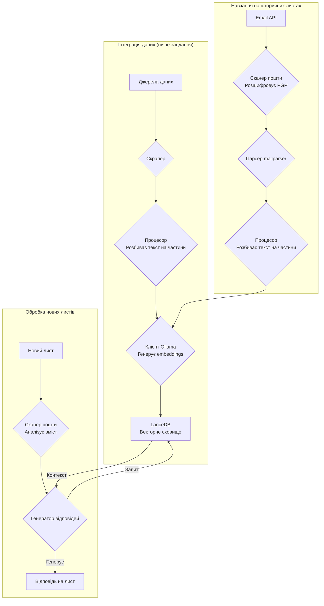
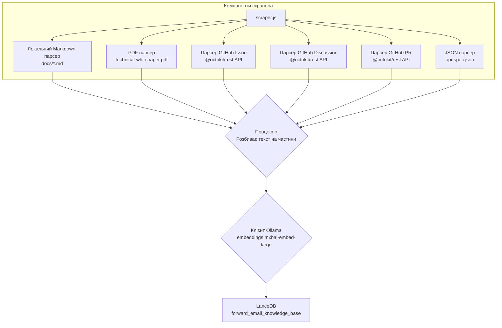
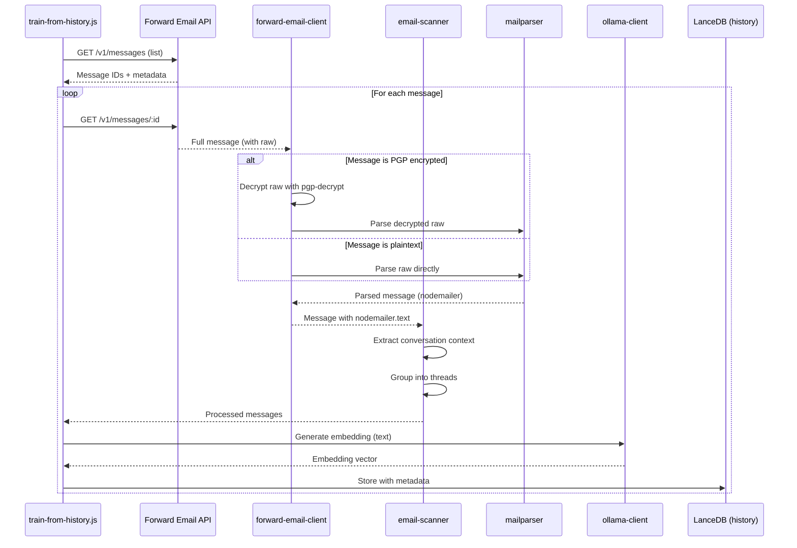

# Створення AI-агента підтримки клієнтів з пріоритетом конфіденційності за допомогою LanceDB, Ollama та Node.js {#building-a-privacy-first-ai-customer-support-agent-with-lancedb-ollama-and-nodejs}


> \[!NOTE]
> Цей документ описує наш шлях створення самохостингового AI-агента підтримки. Ми писали про подібні виклики у нашому дописі в блозі [Email Startup Graveyard](https://forwardemail.net/blog/docs/email-startup-graveyard-why-80-percent-email-companies-fail). Ми чесно думали написати продовження під назвою "AI Startup Graveyard", але, можливо, доведеться почекати ще рік чи близько того, поки потенційно не лопне AI-бульбашка(?). Наразі це наш мозковий штурм про те, що спрацювало, що ні, і чому ми зробили саме так.

Ось як ми створили власного AI-агента підтримки клієнтів. Ми зробили це складним шляхом: самохостинг, пріоритет конфіденційності та повний контроль. Чому? Тому що ми не довіряємо стороннім сервісам дані наших клієнтів. Це вимога GDPR та DPA, і це правильний підхід.

Це не був веселий проєкт на вихідні. Це була місячна подорож крізь зламані залежності, оманливу документацію та загальний хаос екосистеми відкритого AI у 2025 році. Цей документ — запис того, що ми створили, чому ми це зробили і які перешкоди зустріли на шляху.


## Зміст {#table-of-contents}

* [Переваги для клієнтів: AI-підсилена людська підтримка](#customer-benefits-ai-augmented-human-support)
  * [Швидші, точніші відповіді](#faster-more-accurate-responses)
  * [Послідовність без вигорання](#consistency-without-burnout)
  * [Що ви отримуєте](#what-you-get)
* [Особисті роздуми: Дводесятирічна праця](#a-personal-reflection-the-two-decade-grind)
* [Чому важлива конфіденційність](#why-privacy-matters)
* [Аналіз вартості: Хмарний AI проти самохостингу](#cost-analysis-cloud-ai-vs-self-hosted)
  * [Порівняння хмарних AI-сервісів](#cloud-ai-service-comparison)
  * [Розподіл вартості: база знань 5 ГБ](#cost-breakdown-5gb-knowledge-base)
  * [Витрати на обладнання для самохостингу](#self-hosted-hardware-costs)
* [Використання власного API](#dogfooding-our-own-api)
  * [Чому важливо dogfooding](#why-dogfooding-matters)
  * [Приклади використання API](#api-usage-examples)
  * [Переваги продуктивності](#performance-benefits)
* [Архітектура шифрування](#encryption-architecture)
  * [Рівень 1: шифрування поштової скриньки (chacha20-poly1305)](#layer-1-mailbox-encryption-chacha20-poly1305)
  * [Рівень 2: шифрування повідомлень PGP](#layer-2-message-level-pgp-encryption)
  * [Чому це важливо для навчання](#why-this-matters-for-training)
  * [Безпека зберігання](#storage-security)
  * [Локальне зберігання — стандартна практика](#local-storage-is-standard-practice)
* [Архітектура](#the-architecture)
  * [Загальний потік](#high-level-flow)
  * [Детальний потік скрейпера](#detailed-scraper-flow)
* [Як це працює](#how-it-works)
  * [Створення бази знань](#building-the-knowledge-base)
  * [Навчання на історичних листах](#training-from-historical-emails)
  * [Обробка вхідних листів](#processing-incoming-emails)
  * [Управління векторним сховищем](#vector-store-management)
* [Кладовище векторних баз даних](#the-vector-database-graveyard)
* [Системні вимоги](#system-requirements)
* [Налаштування Cron Job](#cron-job-configuration)
  * [Змінні середовища](#environment-variables)
  * [Cron Jobs для кількох поштових скриньок](#cron-jobs-for-multiple-inboxes)
  * [Розподіл розкладу Cron](#cron-schedule-breakdown)
  * [Динамічний розрахунок дати](#dynamic-date-calculation)
  * [Початкове налаштування: витяг списку URL зі Sitemap](#initial-setup-extract-url-list-from-sitemap)
  * [Ручне тестування Cron Jobs](#testing-cron-jobs-manually)
  * [Моніторинг логів](#monitoring-logs)
* [Приклади коду](#code-examples)
  * [Скрейпінг та обробка](#scraping-and-processing)
  * [Навчання на історичних листах](#training-from-historical-emails-1)
  * [Запити для контексту](#querying-for-context)
* [Майбутнє: R&D сканера спаму](#the-future-spam-scanner-rd)
* [Вирішення проблем](#troubleshooting)
  * [Помилка невідповідності розмірності вектора](#vector-dimension-mismatch-error)
  * [Порожній контекст бази знань](#empty-knowledge-base-context)
  * [Помилки розшифрування PGP](#pgp-decryption-failures)
* [Поради з використання](#usage-tips)
  * [Досягнення Inbox Zero](#achieving-inbox-zero)
  * [Використання мітки skip-ai](#using-the-skip-ai-label)
  * [Потоки листів і відповідь усім](#email-threading-and-reply-all)
  * [Моніторинг та обслуговування](#monitoring-and-maintenance)
* [Тестування](#testing)
  * [Запуск тестів](#running-tests)
  * [Покриття тестами](#test-coverage)
  * [Тестове середовище](#test-environment)
* [Основні висновки](#key-takeaways)
## Переваги для клієнтів: підтримка людей, доповнена ШІ {#customer-benefits-ai-augmented-human-support}

Наша система ШІ не замінює нашу команду підтримки — вона робить її кращою. Ось що це означає для вас:

### Швидші та точніші відповіді {#faster-more-accurate-responses}

**Людина в циклі**: Кожен чернетка, створена ШІ, переглядається, редагується та курирується нашою командою підтримки перед відправленням вам. ШІ виконує початкові дослідження та підготовку, звільняючи нашу команду для контролю якості та персоналізації.

**Навчена на людському досвіді**: ШІ навчається на:

* Нашій написаній вручну базі знань та документації
* Блогах і навчальних матеріалах, створених людьми
* Нашому всебічному FAQ (написаному людьми)
* Минулих розмовах з клієнтами (усі обробляються реальними людьми)

Ви отримуєте відповіді, засновані на багаторічному людському досвіді, але доставлені швидше.

### Послідовність без вигорання {#consistency-without-burnout}

Наша невелика команда щодня обробляє сотні запитів у підтримку, кожен з яких вимагає різних технічних знань і переключення контексту:

* Питання з білінгу вимагають знань фінансової системи
* Проблеми з DNS вимагають експертизи в мережах
* Інтеграція API вимагає знань програмування
* Звіти про безпеку вимагають оцінки вразливостей

Без допомоги ШІ це постійне переключення контексту призводить до:

* Повільнішого часу відповіді
* Людських помилок через втому
* Непослідовної якості відповідей
* Вигорання команди

**З доповненням ШІ** наша команда:

* Відповідає швидше (чернетки ШІ за секунди)
* Робить менше помилок (ШІ виявляє типові помилки)
* Підтримує послідовну якість (ШІ посилається на ту ж базу знань щоразу)
* Залишається свіжою та зосередженою (менше часу на дослідження, більше на допомогу)

### Що ви отримуєте {#what-you-get}

✅ **Швидкість**: ШІ готує чернетки за секунди, люди переглядають і відправляють за хвилини

✅ **Точність**: Відповіді базуються на нашій фактичній документації та минулих рішеннях

✅ **Послідовність**: Ті ж високоякісні відповіді, чи то 9 ранку, чи 9 вечора

✅ **Людський дотик**: Кожна відповідь переглядається і персоналізується нашою командою

✅ **Без галюцинацій**: ШІ використовує лише нашу перевірену базу знань, а не загальні інтернет-дані

> \[!NOTE]
> **Ви завжди спілкуєтеся з людьми**. ШІ — це дослідницький помічник, який допомагає нашій команді швидше знаходити правильну відповідь. Уявіть його як бібліотекаря, який миттєво знаходить потрібну книгу — але її все одно читає і пояснює людина.


## Особисті роздуми: двадцятирічна праця {#a-personal-reflection-the-two-decade-grind}

Перш ніж зануритися в технічні деталі, особисте зауваження. Я займаюся цим майже два десятиліття. Безкінечні години за клавіатурою, невпинний пошук рішення, глибока, зосереджена праця — це реальність створення чогось значущого. Це реальність, яку часто замовчують у гіперциклах нових технологій.

Останній вибух ШІ був особливо розчаровуючим. Нам продають мрію про автоматизацію, про помічників ШІ, які писатимуть наш код і вирішуватимуть наші проблеми. Реальність? Вихід часто — це код сміттєвого рівня, який потребує більше часу на виправлення, ніж написання з нуля. Обіцянка полегшити наше життя — хибна. Це відволікання від важкої, необхідної роботи створення.

І є ще парадокс внеску в open-source. Ви вже розпорошені, виснажені від праці. Ви використовуєте ШІ, щоб допомогти написати детальний, добре структурований звіт про помилку, сподіваючись полегшити підтримувачам розуміння і виправлення проблеми. І що відбувається? Вас сварять. Ваш внесок відкидають як «не по темі» або низькоякісний, як ми бачили в нещодавній [проблемі Node.js на GitHub](https://github.com/nodejs/node/issues/60719#issuecomment-3534304321). Це удар по обличчю для досвідчених розробників, які просто намагаються допомогти.

Це реальність екосистеми, в якій ми працюємо. Це не лише про зламані інструменти; це про культуру, яка часто не поважає час і [зусилля своїх учасників](https://forwardemail.net/blog/docs/how-npm-packages-billion-downloads-shaped-javascript-ecosystem). Цей пост — хроніка цієї реальності. Це історія про інструменти, так, але також про людські витрати створення в зламаній екосистемі, яка, незважаючи на всі обіцянки, є фундаментально зламаною.
## Чому важлива конфіденційність {#why-privacy-matters}

Наш [технічний біллінг](https://forwardemail.net/technical-whitepaper.pdf) детально описує нашу філософію конфіденційності. Коротко: ми ніколи не передаємо дані клієнтів третім сторонам. Ніколи. Це означає ні OpenAI, ні Anthropic, ні хмарних векторних баз даних. Все працює локально на нашій інфраструктурі. Це є обов’язковим для відповідності GDPR та нашим зобов’язанням за DPA.


## Аналіз вартості: Хмарний ШІ проти Самохостингу {#cost-analysis-cloud-ai-vs-self-hosted}

Перш ніж заглиблюватися у технічну реалізацію, давайте поговоримо, чому самохостинг важливий з точки зору вартості. Моделі ціноутворення хмарних ШІ-сервісів роблять їх надто дорогими для випадків з великим обсягом, таких як підтримка клієнтів.

### Порівняння хмарних ШІ-сервісів {#cloud-ai-service-comparison}

| Сервіс          | Провайдер           | Вартість вбудовування                                           | Вартість LLM (вхід)                                                        | Вартість LLM (вихід)    | Політика конфіденційності                           | GDPR/DPA        | Хостинг           | Обмін даними     |
| --------------- | ------------------- | --------------------------------------------------------------- | -------------------------------------------------------------------------- | ----------------------- | -------------------------------------------------- | --------------- | ----------------- | ---------------- |
| **OpenAI**      | OpenAI (США)        | [$0.02-0.13/1M токенів](https://openai.com/api/pricing/)        | $0.15-20/1M токенів                                                        | $0.60-80/1M токенів     | [Посилання](https://openai.com/policies/privacy-policy/) | Обмежений DPA   | Azure (США)       | Так (тренування)  |
| **Claude**      | Anthropic (США)     | Н/д                                                             | [$3-20/1M токенів](https://docs.claude.com/en/docs/about-claude/pricing) | $15-80/1M токенів       | [Посилання](https://www.anthropic.com/legal/privacy) | Обмежений DPA   | AWS/GCP (США)     | Ні (заявлено)     |
| **Gemini**      | Google (США)        | [$0.15/1M токенів](https://ai.google.dev/gemini-api/docs/pricing) | $0.30-1.00/1M токенів                                                     | $2.50/1M токенів        | [Посилання](https://policies.google.com/privacy)    | Обмежений DPA   | GCP (США)         | Так (покращення)  |
| **DeepSeek**    | DeepSeek (Китай)    | Н/д                                                             | [$0.028-0.28/1M токенів](https://api-docs.deepseek.com/quick_start/pricing) | $0.42/1M токенів        | [Посилання](https://www.deepseek.com/en)            | Невідомо        | Китай             | Невідомо          |
| **Mistral**     | Mistral AI (Франція)| [$0.10/1M токенів](https://mistral.ai/pricing)                  | $0.40/1M токенів                                                          | $2.00/1M токенів        | [Посилання](https://mistral.ai/terms/)              | EU GDPR         | ЄС                | Невідомо          |
| **Самохостинг** | Ви                  | $0 (існуюче обладнання)                                         | $0 (існуюче обладнання)                                                   | $0 (існуюче обладнання) | Ваша політика                                      | Повна відповідність | MacBook M5 + cron | Ніколи            |

> \[!WARNING]
> **Питання суверенітету даних**: Провайдери зі США (OpenAI, Claude, Gemini) підпадають під дію CLOUD Act, що дозволяє уряду США доступ до даних. DeepSeek (Китай) працює за китайським законодавством про дані. Хоча Mistral (Франція) пропонує хостинг у ЄС та відповідність GDPR, самохостинг залишається єдиним варіантом для повного суверенітету та контролю над даними.

### Розподіл вартості: база знань 5 ГБ {#cost-breakdown-5gb-knowledge-base}

Давайте порахуємо вартість обробки бази знань обсягом 5 ГБ (типова для середньої компанії з документами, електронною поштою та історією підтримки).

**Припущення:**

* 5 ГБ тексту ≈ 1,25 мільярда токенів (припускаючи \~4 символи на токен)
* Початкове створення вбудовувань
* Щомісячне повторне навчання (повне повторне вбудовування)
* 10 000 запитів у службу підтримки на місяць
* Середній запит: 500 токенів вхід, 300 токенів вихід
**Детальний розподіл витрат:**

| Компонент                             | OpenAI           | Claude          | Gemini               | Самохостинг        |
| ------------------------------------ | ---------------- | --------------- | -------------------- | ------------------ |
| **Початкове вбудовування** (1,25 млрд токенів) | $25,000          | Н/д             | $187,500             | $0                 |
| **Щомісячні запити** (10K × 800 токенів) | $1,200-16,000    | $2,400-16,000   | $2,400-3,200         | $0                 |
| **Щомісячне донавчання** (1,25 млрд токенів) | $25,000          | Н/д             | $187,500             | $0                 |
| **Загалом за перший рік**             | $325,200-217,000 | $28,800-192,000 | $2,278,800-2,226,000 | ~ $60 (електроенергія) |
| **Відповідність вимогам конфіденційності** | ❌ Обмежено       | ❌ Обмежено      | ❌ Обмежено           | ✅ Повністю         |
| **Суверенітет даних**                 | ❌ Ні             | ❌ Ні            | ❌ Ні                 | ✅ Так              |

> \[!CAUTION]
> **Витрати на вбудовування Gemini катастрофічні** — $0.15 за 1 млн токенів. Вбудовування бази знань обсягом 5 ГБ коштуватиме $187,500. Це у 37 разів дорожче за OpenAI і робить його повністю непридатним для виробництва.

### Витрати на апаратне забезпечення для самохостингу {#self-hosted-hardware-costs}

Наша система працює на наявному апаратному забезпеченні, яке ми вже маємо:

* **Апаратне забезпечення**: MacBook M5 (вже є для розробки)
* **Додаткові витрати**: $0 (використовується наявне обладнання)
* **Електроенергія**: ~ $5/місяць (оцінка)
* **Загалом за перший рік**: ~ $60
* **Поточні витрати**: $60/рік

**ROI**: Самохостинг фактично не має додаткових витрат, оскільки ми використовуємо наявне обладнання для розробки. Система працює через cron-завдання у непікові години.


## Використання власного API {#dogfooding-our-own-api}

Одне з найважливіших архітектурних рішень — це використання всіма AI-завданнями безпосередньо [Forward Email API](https://forwardemail.net/email-api). Це не просто хороша практика — це стимул для оптимізації продуктивності.

### Чому важливо dogfooding {#why-dogfooding-matters}

Коли наші AI-завдання використовують ті ж API-ендпоінти, що й наші клієнти:

1. **Вузькі місця продуктивності впливають на нас першими** — Ми відчуваємо проблеми раніше за клієнтів
2. **Оптимізація вигідна всім** — Покращення для наших завдань автоматично покращують досвід клієнтів
3. **Тестування в реальних умовах** — Наші завдання обробляють тисячі листів, забезпечуючи безперервне навантажувальне тестування
4. **Повторне використання коду** — Та сама логіка автентифікації, обмеження швидкості, обробки помилок і кешування

### Приклади використання API {#api-usage-examples}

**Отримання списку повідомлень (train-from-history.js):**

```javascript
// Використовує GET /v1/messages?folder=INBOX з BasicAuth
// Виключає eml, raw, nodemailer для зменшення розміру відповіді (потрібні лише ID)
const response = await axios.get(
  `${this.apiBase}/v1/messages`,
  {
    params: {
      folder: 'INBOX',
      limit: 100,
      eml: false,
      raw: false,
      nodemailer: false
    },
    auth: {
      username: process.env.FORWARD_EMAIL_ALIAS_USERNAME,
      password: process.env.FORWARD_EMAIL_ALIAS_PASSWORD
    }
  }
);

const messages = response.data;
// Повертає: [{ id, subject, date, ... }, ...]
// Повний вміст повідомлення отримується пізніше через GET /v1/messages/:id
```

**Отримання повних повідомлень (forward-email-client.js):**

```javascript
// Використовує GET /v1/messages/:id для отримання повного повідомлення з raw-вмістом
const response = await axios.get(
  `${this.apiBase}/v1/messages/${messageId}`,
  {
    auth: {
      username: this.aliasUsername,
      password: this.aliasPassword
    }
  }
);

const message = response.data;
// Повертає: { id, subject, raw, eml, nodemailer: { ... }, ... }
```

**Створення чернеток відповідей (process-inbox.js):**

```javascript
// Використовує POST /v1/messages для створення чернеток відповідей
const response = await axios.post(
  `${this.apiBase}/v1/messages`,
  {
    folder: 'Drafts',
    subject: `Re: ${originalSubject}`,
    to: senderEmail,
    text: generatedResponse,
    inReplyTo: originalMessageId
  },
  {
    auth: {
      username: process.env.FORWARD_EMAIL_ALIAS_USERNAME,
      password: process.env.FORWARD_EMAIL_ALIAS_PASSWORD
    }
  }
);
```
### Переваги продуктивності {#performance-benefits}

Оскільки наші AI-завдання працюють на тій самій API-інфраструктурі:

* **Оптимізації кешування** вигідні як для завдань, так і для клієнтів
* **Обмеження швидкості** тестується під реальним навантаженням
* **Обробка помилок** перевірена в бою
* **Час відповіді API** постійно моніториться
* **Запити до бази даних** оптимізовані для обох випадків використання
* **Оптимізація пропускної здатності** – виключення `eml`, `raw`, `nodemailer` при переліку зменшує розмір відповіді приблизно на 90%

Коли `train-from-history.js` обробляє 1 000 листів, він робить понад 1 000 викликів API. Будь-яка неефективність у API стає одразу помітною. Це змушує нас оптимізувати доступ до IMAP, запити до бази даних і серіалізацію відповіді — покращення, які безпосередньо вигідні нашим клієнтам.

**Приклад оптимізації**: Перелік 100 повідомлень з повним вмістом = приблизно 10 МБ відповіді. Перелік з `eml: false, raw: false, nodemailer: false` = приблизно 100 КБ відповіді (в 100 разів менше).


## Архітектура шифрування {#encryption-architecture}

Наше сховище електронної пошти використовує кілька рівнів шифрування, які AI-завдання повинні розшифровувати в реальному часі для навчання.

### Рівень 1: Шифрування поштової скриньки (chacha20-poly1305) {#layer-1-mailbox-encryption-chacha20-poly1305}

Всі IMAP-поштові скриньки зберігаються у вигляді баз даних SQLite, зашифрованих за допомогою **chacha20-poly1305**, квантово-безпечного алгоритму шифрування. Детальніше про це в нашому [блозі про квантово-безпечний зашифрований сервіс електронної пошти](https://forwardemail.net/blog/docs/best-quantum-safe-encrypted-email-service).

**Ключові властивості:**

* **Алгоритм**: ChaCha20-Poly1305 (AEAD шифр)
* **Квантово-безпечний**: Стійкий до атак квантових комп’ютерів
* **Зберігання**: Файли бази даних SQLite на диску
* **Доступ**: Розшифровується в пам’яті при доступі через IMAP/API

### Рівень 2: Шифрування повідомлень PGP {#layer-2-message-level-pgp-encryption}

Багато службових листів додатково зашифровані за допомогою PGP (стандарт OpenPGP). AI-завдання повинні розшифровувати їх, щоб витягти вміст для навчання.

**Процес розшифрування:**

```javascript
// 1. API повертає повідомлення з зашифрованим сирим вмістом
const message = await forwardEmailClient.getMessage(id);

// 2. Перевірка, чи є сирий вміст зашифрованим PGP
if (isMessageEncrypted(message.raw)) {
  // 3. Розшифрування за допомогою нашого приватного ключа
  const decryptedRaw = await pgpDecrypt(message.raw);

  // 4. Парсинг розшифрованого MIME-повідомлення
  const parsed = await simpleParser(decryptedRaw);

  // 5. Заповнення nodemailer розшифрованим вмістом
  message.nodemailer = {
    text: parsed.text,
    html: parsed.html,
    from: parsed.from,
    to: parsed.to,
    subject: parsed.subject,
    date: parsed.date
  };
}
```

**Конфігурація PGP:**

```bash
# Приватний ключ для розшифрування (шлях до ASCII-armored файлу ключа)
GPG_SECURITY_KEY="/path/to/private-key.asc"

# Парольна фраза для приватного ключа (якщо зашифрований)
GPG_SECURITY_PASSPHRASE="your-passphrase"
```

Допоміжний скрипт `pgp-decrypt.js`:

1. Один раз зчитує приватний ключ з диску (кешується в пам’яті)
2. Розшифровує ключ за допомогою парольної фрази
3. Використовує розшифрований ключ для всіх розшифрувань повідомлень
4. Підтримує рекурсивне розшифрування для вкладених зашифрованих повідомлень

### Чому це важливо для навчання {#why-this-matters-for-training}

Без належного розшифрування AI навчався б на зашифрованому наборі символів:

```
-----BEGIN PGP MESSAGE-----
Version: OpenPGP.js v4.10.10

wcBMA8Z3lHJnFnNUAQgAqK7F8...
-----END PGP MESSAGE-----
```

З розшифруванням AI навчається на реальному вмісті:

```
Subject: Re: Bug Report

Hi John,

Thanks for reporting this issue. I've confirmed the bug
and created a fix in PR #1234...
```

### Безпека зберігання {#storage-security}

Розшифрування відбувається в пам’яті під час виконання завдання, а розшифрований вміст конвертується у векторні вбудування, які потім зберігаються у векторній базі даних LanceDB на диску.

**Де зберігаються дані:**

* **Векторна база даних**: Зберігається на зашифрованих робочих станціях MacBook M5
* **Фізична безпека**: Робочі станції завжди залишаються у нас (не в датацентрах)
* **Шифрування диска**: Повне шифрування диска на всіх робочих станціях
* **Мережева безпека**: Захищені фаєрволом і ізольовані від публічних мереж

**Майбутнє розгортання в датацентрі:**
Якщо ми колись перейдемо на хостинг у датацентрі, сервери матимуть:

* Повне шифрування диска LUKS
* Відключений доступ до USB
* Фізичні заходи безпеки
* Мережеву ізоляцію
Для повної інформації про наші практики безпеки дивіться нашу [сторінку безпеки](https://forwardemail.net/en/security).

> \[!NOTE]
> Векторна база даних містить embeddings (математичні представлення), а не оригінальний відкритий текст. Однак embeddings потенційно можуть бути зворотно інженерними, тому ми зберігаємо їх на зашифрованих, фізично захищених робочих станціях.

### Локальне зберігання — стандартна практика {#local-storage-is-standard-practice}

Зберігання embeddings на робочих станціях нашої команди не відрізняється від того, як ми вже обробляємо електронну пошту:

* **Thunderbird**: Завантажує і зберігає повний вміст електронної пошти локально у файлах mbox/maildir
* **Вебпоштові клієнти**: Кешують дані електронної пошти у сховищі браузера та локальних базах даних
* **IMAP клієнти**: Підтримують локальні копії повідомлень для офлайн-доступу
* **Наша AI-система**: Зберігає математичні embeddings (не відкритий текст) у LanceDB

Ключова відмінність: embeddings є **безпечнішими**, ніж відкритий текст електронної пошти, тому що вони:

1. Математичні представлення, а не читабельний текст
2. Складніші для зворотного інженерування, ніж відкритий текст
3. Підпадають під ту ж фізичну безпеку, що й наші поштові клієнти

Якщо для нашої команди прийнятно використовувати Thunderbird або вебпошту на зашифрованих робочих станціях, то зберігання embeddings таким самим способом є не менш прийнятним (і, можливо, більш безпечним).


## Архітектура {#the-architecture}

Ось базовий потік. Він виглядає простим. Але це не так.

> \[!NOTE]
> Всі завдання використовують API Forward Email безпосередньо, що забезпечує оптимізацію продуктивності як для нашої AI-системи, так і для наших клієнтів.

### Загальний потік {#high-level-flow}



### Детальний потік скрапера {#detailed-scraper-flow}

`scraper.js` — це серце інтеграції даних. Це збірка парсерів для різних форматів даних.




## Як це працює {#how-it-works}

Процес розділений на три основні частини: побудова бази знань, навчання на історичних листах та обробка нових листів.

### Побудова бази знань {#building-the-knowledge-base}

**`update-knowledge-base.js`**: Це основне завдання. Воно запускається щовечора, очищує старе векторне сховище і відновлює його з нуля. Використовує `scraper.js` для отримання контенту з усіх джерел, `processor.js` для розбиття на частини, і `ollama-client.js` для генерації embeddings. Нарешті, `vector-store.js` зберігає все у LanceDB.

**Джерела даних:**

* Локальні Markdown файли (`docs/*.md`)
* Технічний whitepaper у форматі PDF (`assets/technical-whitepaper.pdf`)
* JSON з описом API (`assets/api-spec.json`)
* GitHub issues (через Octokit)
* GitHub discussions (через Octokit)
* GitHub pull requests (через Octokit)
* Список URL карти сайту (`$LANCEDB_PATH/valid-urls.json`)

### Навчання на історичних листах {#training-from-historical-emails}

**`train-from-history.js`**: Це завдання сканує історичні листи з усіх папок, розшифровує повідомлення, зашифровані PGP, і додає їх до окремого векторного сховища (`customer_support_history`). Це забезпечує контекст із минулих підтримкових взаємодій.
**Потік обробки електронної пошти:**



**Ключові особливості:**

* **PGP Розшифрування**: Використовує допоміжний скрипт `pgp-decrypt.js` з змінною середовища `GPG_SECURITY_KEY`
* **Групування ниток**: Групує пов’язані електронні листи у нитки розмов
* **Збереження метаданих**: Зберігає папку, тему, дату, статус шифрування
* **Контекст відповіді**: Пов’язує повідомлення з їхніми відповідями для кращого контексту

**Конфігурація:**

```bash
# Змінні середовища для train-from-history
HISTORY_SCAN_LIMIT=1000              # Макс. кількість повідомлень для обробки
HISTORY_SCAN_SINCE="2024-01-01"      # Обробляти лише повідомлення після цієї дати
HISTORY_DECRYPT_PGP=true             # Спроба розшифрування PGP
GPG_SECURITY_KEY="/path/to/key.asc"  # Шлях до приватного ключа PGP
GPG_SECURITY_PASSPHRASE="passphrase" # Парольна фраза ключа (необов’язково)
```

**Що зберігається:**

```javascript
{
  type: 'historical_email',
  folder: 'INBOX',
  subject: 'Re: Bug Report',
  date: '2025-01-15T10:30:00Z',
  messageId: '67e2f288893921...',
  threadId: 'Bug Report',
  hasReply: true,
  encrypted: true,
  decrypted: true,
  replySubject: 'Bug Report',
  replyText: 'First 500 chars of reply...',
  chunkSize: 1000,
  chunkOverlap: 200,
  chunkIndex: 0
}
```

> \[!TIP]
> Запустіть `train-from-history` після початкового налаштування, щоб заповнити історичний контекст. Це значно покращує якість відповідей, навчаючись на минулих взаємодіях служби підтримки.

### Обробка вхідних листів {#processing-incoming-emails}

**`process-inbox.js`**: Ця задача виконується над листами у наших поштових скриньках `support@forwardemail.net`, `abuse@forwardemail.net` та `security@forwardemail.net` (конкретно в папці IMAP `INBOX`). Вона використовує наш API за адресою <https://forwardemail.net/email-api> (наприклад, `GET /v1/messages?folder=INBOX` з доступом BasicAuth, використовуючи IMAP облікові дані для кожної скриньки). Аналізує вміст листа, робить запити до бази знань (`forward_email_knowledge_base`) та історичного сховища векторів електронної пошти (`customer_support_history`), а потім передає об’єднаний контекст у `response-generator.js`. Генератор використовує `mxbai-embed-large` через Ollama для створення відповіді.

**Особливості автоматизованого робочого процесу:**

1. **Автоматизація Inbox Zero**: Після успішного створення чернетки оригінальне повідомлення автоматично переміщується до папки Архів. Це підтримує вашу поштову скриньку чистою і допомагає досягти inbox zero без ручного втручання.

2. **Пропуск обробки AI**: Просто додайте мітку `skip-ai` (без врахування регістру) до будь-якого повідомлення, щоб запобігти обробці AI. Повідомлення залишиться у вашій скриньці без змін, що дозволяє обробляти його вручну. Це корисно для конфіденційних повідомлень або складних випадків, які потребують людського рішення.

3. **Правильне ниткування листів**: Всі чернетки відповідей містять оригінальне повідомлення, процитоване нижче (з використанням стандартного префікса ` >  `), відповідно до конвенцій відповіді на листи з форматом "On \[date], \[sender] wrote:". Це забезпечує правильний контекст розмови та ниткування у поштових клієнтах.

4. **Поведінка Reply-All**: Система автоматично обробляє заголовки Reply-To та отримувачів CC:
   * Якщо існує заголовок Reply-To, він стає адресою To, а оригінальний From додається до CC
   * Всі оригінальні отримувачі To та CC включаються у відповідь CC (крім вашої власної адреси)
   * Дотримується стандартних конвенцій reply-all для групових розмов
**Рейтинг джерел**: Система використовує **зважений рейтинг** для пріоритетизації джерел:

* FAQ: 100% (найвищий пріоритет)
* Технічний біллінг: 95%
* Специфікація API: 90%
* Офіційна документація: 85%
* GitHub issues: 70%
* Історичні електронні листи: 50%

### Управління векторним сховищем {#vector-store-management}

Клас `VectorStore` у `helpers/customer-support-ai/vector-store.js` є нашим інтерфейсом до LanceDB.

**Додавання документів:**

```javascript
// vector-store.js
async addDocument(text, metadata) {
  const embedding = await this.ollama.generateEmbedding(text);
  await this.table.add([{
    vector: embedding,
    text,
    ...metadata
  }]);
}
```

**Очищення сховища:**

```javascript
// Варіант 1: Використати метод clear()
await vectorStore.clear();

// Варіант 2: Видалити локальний каталог бази даних
await fs.rm(process.env.LANCEDB_PATH, { recursive: true, force: true });
```

Змінна оточення `LANCEDB_PATH` вказує на локальний каталог вбудованої бази даних. LanceDB є безсерверною та вбудованою, тому немає окремого процесу для керування.


## Кладовище векторних баз даних {#the-vector-database-graveyard}

Це була перша велика перепона. Ми спробували кілька векторних баз даних, перш ніж зупинитися на LanceDB. Ось що пішло не так з кожною з них.

| База даних  | GitHub                                                      | Що пішло не так                                                                                                                                                                                                     | Конкретні проблеми                                                                                                                                                                                                                                                                                                                                                       | Проблеми безпеки                                                                                                                                                                                                 |
| ------------ | ----------------------------------------------------------- | ------------------------------------------------------------------------------------------------------------------------------------------------------------------------------------------------------------------- | ------------------------------------------------------------------------------------------------------------------------------------------------------------------------------------------------------------------------------------------------------------------------------------------------------------------------------------------------------------------------- | ---------------------------------------------------------------------------------------------------------------------------------------------------------------------------------------------------------------- |
| **ChromaDB** | [chroma-core/chroma](https://github.com/chroma-core/chroma) | `pip3 install chromadb` дає вам версію з кам'яного віку з `PydanticImportError`. Єдиний спосіб отримати робочу версію — скомпілювати з вихідного коду. Не зручно для розробників.                                    | Хаос із залежностями Python. Багато користувачів повідомляють про зламані установки pip ([#774](https://github.com/chroma-core/chroma/issues/774), [#163](https://github.com/chroma-core/chroma/issues/163)). Документація каже "просто використовуйте Docker", що не є відповіддю для локальної розробки. Збій на Windows при >99 записах ([#3058](https://github.com/chroma-core/chroma/issues/3058)). | **CVE-2024-45848**: Виконання довільного коду через інтеграцію ChromaDB у MindsDB. Критичні вразливості ОС у Docker-образі ([#3170](https://github.com/chroma-core/chroma/issues/3170)).                      |
| **Qdrant**   | [qdrant/qdrant](https://github.com/qdrant/qdrant)           | Homebrew tap (`qdrant/qdrant/qdrant`), згаданий у їх старій документації, зник. Без пояснень. Офіційна документація тепер просто каже "використовуйте Docker".                                                        | Відсутній Homebrew tap. Немає нативного бінарного файлу для macOS. Використання лише Docker ускладнює швидке локальне тестування.                                                                                                                                                                                                                                       | **CVE-2024-2221**: Вразливість завантаження довільних файлів, що дозволяє віддалене виконання коду (виправлено у версії 1.9.0). Низький рівень безпеки за оцінкою [IronCore Labs](https://ironcorelabs.com/vectordbs/qdrant-security/). |
| **Weaviate** | [weaviate/weaviate](https://github.com/weaviate/weaviate)   | Версія Homebrew мала критичну помилку кластеризації (`leader not found`). Документовані прапори для виправлення (`RAFT_JOIN`, `CLUSTER_HOSTNAME`) не працювали. Фундаментально несправна для одно-вузлових налаштувань. | Помилки кластеризації навіть у режимі одного вузла. Надмірно ускладнена для простих випадків використання.                                                                                                                                                                                                                                                               | Відсутні серйозні CVE, але складність збільшує поверхню атаки.                                                                                                                                                   |
| **LanceDB**  | [lancedb/lancedb](https://github.com/lancedb/lancedb)       | Ця працювала. Вона вбудована і безсерверна. Немає окремого процесу. Єдина незручність — заплутана назва пакету (`vectordb` застарілий, використовуйте `@lancedb/lancedb`) та розпорошена документація. Ми з цим живемо. | Заплутаність у назвах пакетів (`vectordb` проти `@lancedb/lancedb`), але в іншому надійна. Вбудована архітектура усуває цілі класи проблем безпеки.                                                                                                                                                                                                                         | Відомих CVE немає. Вбудований дизайн означає відсутність мережевої поверхні атаки.                                                                                                                                 |
> \[!WARNING]
> **ChromaDB має критичні вразливості безпеки.** [CVE-2024-45848](https://nvd.nist.gov/vuln/detail/CVE-2024-45848) дозволяє виконання довільного коду. Встановлення через pip фундаментально зламане через проблеми з залежністю Pydantic. Уникайте використання у продакшені.

> \[!WARNING]
> **Qdrant мав вразливість RCE через завантаження файлів** ([CVE-2024-2221](https://qdrant.tech/blog/cve-2024-2221-response/)), яка була виправлена лише у версії v1.9.0. Якщо ви мусите використовувати Qdrant, переконайтеся, що у вас остання версія.

> \[!CAUTION]
> Екосистема відкритих векторних баз даних є нестабільною. Не довіряйте документації. Вважайте, що все зламано, поки не доведено протилежне. Тестуйте локально перед вибором стеку.


## Системні вимоги {#system-requirements}

* **Node.js:** v18.0.0+ ([GitHub](https://github.com/nodejs/node))
* **Ollama:** Остання версія ([GitHub](https://github.com/ollama/ollama))
* **Модель:** `mxbai-embed-large` через Ollama
* **Векторна база даних:** LanceDB ([GitHub](https://github.com/lancedb/lancedb))
* **Доступ до GitHub:** `@octokit/rest` для збору issues ([GitHub](https://github.com/octokit/rest.js))
* **SQLite:** Для основної бази даних (через `mongoose-to-sqlite`)


## Налаштування Cron Job {#cron-job-configuration}

Всі AI-завдання запускаються через cron на MacBook M5. Ось як налаштувати cron job для запуску опівночі на кількох поштових скриньках.

### Змінні середовища {#environment-variables}

Завдання потребують цих змінних середовища. Більшість можна встановити у файлі `.env` (завантажується через `@ladjs/env`), але `HISTORY_SCAN_SINCE` має обчислюватися динамічно у crontab.

**У файлі `.env`:**

```bash
# Облікові дані Forward Email API (змінюються для кожної скриньки)
FORWARD_EMAIL_ALIAS_USERNAME=support@forwardemail.net
FORWARD_EMAIL_ALIAS_PASSWORD=your-imap-password

# PGP розшифрування (спільне для всіх скриньок)
GPG_SECURITY_KEY=/path/to/private-key.asc
GPG_SECURITY_PASSPHRASE=your-passphrase

# Налаштування історичного сканування
HISTORY_SCAN_LIMIT=1000

# Шлях до LanceDB
LANCEDB_PATH=/path/to/lancedb
```

**У crontab (обчислюється динамічно):**

```bash
# HISTORY_SCAN_SINCE має бути встановлено inline у crontab з обчисленням дати shell
# Не може бути у .env, бо @ladjs/env не виконує shell-команди
HISTORY_SCAN_SINCE="$(date -v-1d +%Y-%m-%d)"  # macOS
HISTORY_SCAN_SINCE="$(date -d 'yesterday' +%Y-%m-%d)"  # Linux
```

### Cron Jobs для кількох скриньок {#cron-jobs-for-multiple-inboxes}

Відредагуйте свій crontab командою `crontab -e` і додайте:

```bash
# Оновлення бази знань (запускається один раз, спільно для всіх скриньок)
0 0 * * * cd /path/to/forwardemail.net && LANCEDB_PATH="/path/to/lancedb" GPG_SECURITY_KEY="/path/to/key.asc" GPG_SECURITY_PASSPHRASE="pass" node jobs/customer-support-ai/update-knowledge-base.js >> /var/log/update-knowledge-base.log 2>&1

# Навчання з історії - support@forwardemail.net
0 0 * * * cd /path/to/forwardemail.net && FORWARD_EMAIL_ALIAS_USERNAME="support@forwardemail.net" FORWARD_EMAIL_ALIAS_PASSWORD="support-password" HISTORY_SCAN_SINCE="$(date -v-1d +%Y-%m-%d)" HISTORY_SCAN_LIMIT=1000 GPG_SECURITY_KEY="/path/to/key.asc" GPG_SECURITY_PASSPHRASE="pass" LANCEDB_PATH="/path/to/lancedb" node jobs/customer-support-ai/train-from-history.js >> /var/log/train-support.log 2>&1

# Навчання з історії - abuse@forwardemail.net
0 0 * * * cd /path/to/forwardemail.net && FORWARD_EMAIL_ALIAS_USERNAME="abuse@forwardemail.net" FORWARD_EMAIL_ALIAS_PASSWORD="abuse-password" HISTORY_SCAN_SINCE="$(date -v-1d +%Y-%m-%d)" HISTORY_SCAN_LIMIT=1000 GPG_SECURITY_KEY="/path/to/key.asc" GPG_SECURITY_PASSPHRASE="pass" LANCEDB_PATH="/path/to/lancedb" node jobs/customer-support-ai/train-from-history.js >> /var/log/train-abuse.log 2>&1

# Навчання з історії - security@forwardemail.net
0 0 * * * cd /path/to/forwardemail.net && FORWARD_EMAIL_ALIAS_USERNAME="security@forwardemail.net" FORWARD_EMAIL_ALIAS_PASSWORD="security-password" HISTORY_SCAN_SINCE="$(date -v-1d +%Y-%m-%d)" HISTORY_SCAN_LIMIT=1000 GPG_SECURITY_KEY="/path/to/key.asc" GPG_SECURITY_PASSPHRASE="pass" LANCEDB_PATH="/path/to/lancedb" node jobs/customer-support-ai/train-from-history.js >> /var/log/train-security.log 2>&1

# Обробка вхідних - support@forwardemail.net
*/5 * * * * cd /path/to/forwardemail.net && FORWARD_EMAIL_ALIAS_USERNAME="support@forwardemail.net" FORWARD_EMAIL_ALIAS_PASSWORD="support-password" GPG_SECURITY_KEY="/path/to/key.asc" GPG_SECURITY_PASSPHRASE="pass" LANCEDB_PATH="/path/to/lancedb" node jobs/customer-support-ai/process-inbox.js >> /var/log/process-support.log 2>&1

# Обробка вхідних - abuse@forwardemail.net
*/5 * * * * cd /path/to/forwardemail.net && FORWARD_EMAIL_ALIAS_USERNAME="abuse@forwardemail.net" FORWARD_EMAIL_ALIAS_PASSWORD="abuse-password" GPG_SECURITY_KEY="/path/to/key.asc" GPG_SECURITY_PASSPHRASE="pass" LANCEDB_PATH="/path/to/lancedb" node jobs/customer-support-ai/process-inbox.js >> /var/log/process-abuse.log 2>&1

# Обробка вхідних - security@forwardemail.net
*/5 * * * * cd /path/to/forwardemail.net && FORWARD_EMAIL_ALIAS_USERNAME="security@forwardemail.net" FORWARD_EMAIL_ALIAS_PASSWORD="security-password" GPG_SECURITY_KEY="/path/to/key.asc" GPG_SECURITY_PASSPHRASE="pass" LANCEDB_PATH="/path/to/lancedb" node jobs/customer-support-ai/process-inbox.js >> /var/log/process-security.log 2>&1
```
### Розклад Cron {#cron-schedule-breakdown}

| Job                     | Розклад      | Опис                                                                              |
| ----------------------- | ------------- | ---------------------------------------------------------------------------------- |
| `train-from-sitemap.js` | `0 0 * * 0`   | Щотижня (неділя опівночі) - Завантажує всі URL з sitemap і навчає базу знань       |
| `train-from-history.js` | `0 0 * * *`   | Щодня опівночі - Сканує листи попереднього дня по кожній поштовій скриньці        |
| `process-inbox.js`      | `*/5 * * * *` | Кожні 5 хвилин - Обробляє нові листи та генерує чернетки                          |

### Динамічний розрахунок дати {#dynamic-date-calculation}

Змінна `HISTORY_SCAN_SINCE` **повинна обчислюватися безпосередньо в crontab**, тому що:

1. Файли `.env` читаються як літеральні рядки `@ladjs/env`
2. Підстановка команд оболонки `$(...)` не працює у файлах `.env`
3. Дату потрібно обчислювати щоразу заново при запуску cron

**Правильний підхід (в crontab):**

```bash
# macOS (BSD date)
HISTORY_SCAN_SINCE="$(date -v-1d +%Y-%m-%d)" node jobs/...

# Linux (GNU date)
HISTORY_SCAN_SINCE="$(date -d 'yesterday' +%Y-%m-%d)" node jobs/...
```

**Неправильний підхід (не працює у .env):**

```bash
# Це буде прочитано як літеральний рядок "$(date -v-1d +%Y-%m-%d)"
# НЕ виконується як команда оболонки
HISTORY_SCAN_SINCE=$(date -v-1d +%Y-%m-%d)
```

Це гарантує, що кожен нічний запуск динамічно обчислює дату попереднього дня, уникаючи зайвої роботи.

### Початкове налаштування: Витяг списку URL з Sitemap {#initial-setup-extract-url-list-from-sitemap}

Перед першим запуском job process-inbox ви **повинні** витягти список URL з sitemap. Це створює словник дійсних URL, на які LLM може посилатися, і запобігає галюцинаціям URL.

```bash
# Початкове налаштування: Витяг списку URL з sitemap
cd /path/to/forwardemail.net
node jobs/customer-support-ai/train-from-sitemap.js
```

**Що це робить:**

1. Завантажує всі URL з <https://forwardemail.net/sitemap.xml>
2. Фільтрує лише не локалізовані URL або /en/ URL (уникає дублювання контенту)
3. Видаляє префікси локалі (/en/faq → /faq)
4. Зберігає простий JSON-файл зі списком URL у `$LANCEDB_PATH/valid-urls.json`
5. Без сканування, без збору метаданих — лише плоский список дійсних URL

**Чому це важливо:**

* Запобігає галюцинаціям LLM фейкових URL, як-от `/dashboard` або `/login`
* Забезпечує білий список дійсних URL для генератора відповідей
* Просто, швидко і не потребує зберігання у векторній базі даних
* Генератор відповідей завантажує цей список при запуску і включає його у підказку

**Додайте до crontab для щотижневого оновлення:**

```bash
# Витяг списку URL з sitemap - щотижня в неділю опівночі
0 0 * * 0 cd /path/to/forwardemail.net && node jobs/customer-support-ai/train-from-sitemap.js >> /var/log/train-sitemap.log 2>&1
```

### Ручне тестування Cron Job {#testing-cron-jobs-manually}

Щоб протестувати job перед додаванням до cron:

```bash
# Тестування навчання з sitemap
cd /path/to/forwardemail.net
export LANCEDB_PATH="/path/to/lancedb"
node jobs/customer-support-ai/train-from-sitemap.js

# Тестування навчання з підтримки поштової скриньки
cd /path/to/forwardemail.net
export FORWARD_EMAIL_ALIAS_USERNAME="support@forwardemail.net"
export FORWARD_EMAIL_ALIAS_PASSWORD="support-password"
export HISTORY_SCAN_SINCE="$(date -v-1d +%Y-%m-%d)"
export HISTORY_SCAN_LIMIT=1000
export GPG_SECURITY_KEY="/path/to/key.asc"
export GPG_SECURITY_PASSPHRASE="pass"
export LANCEDB_PATH="/path/to/lancedb"
node jobs/customer-support-ai/train-from-history.js
```

### Моніторинг логів {#monitoring-logs}

Кожен job записує логи у окремий файл для зручного налагодження:

```bash
# Перегляд обробки поштової скриньки підтримки в реальному часі
tail -f /var/log/process-support.log

# Перевірка останнього нічного запуску навчання
cat /var/log/train-support.log | grep "$(date -v-1d +%Y-%m-%d)"

# Перегляд усіх помилок по всіх job
grep -i error /var/log/train-*.log /var/log/process-*.log
```

> \[!TIP]
> Використовуйте окремі файли логів для кожної поштової скриньки, щоб ізолювати проблеми. Якщо в одній скриньці є проблеми з автентифікацією, це не забруднить логи інших скриньок.
## Приклади коду {#code-examples}

### Збирання та обробка {#scraping-and-processing}

```javascript
// jobs/customer-support-ai/update-knowledge-base.js
const scraper = new Scraper();
const processor = new Processor();
const ollamaClient = new OllamaClient();
const vectorStore = new VectorStore();

// Очистити старі дані
await vectorStore.clear();

// Зібрати всі джерела
const documents = await scraper.scrapeAll();
console.log(`Зібрано ${documents.length} документів`);

// Обробити на частини
const allChunks = [];
for (const doc of documents) {
  const chunks = processor.processDocuments([doc]);
  allChunks.push(...chunks);
}
console.log(`Згенеровано ${allChunks.length} частин`);

// Згенерувати вбудовування та зберегти
const texts = allChunks.map(chunk => chunk.text);
const embeddings = await ollamaClient.generateEmbeddings(texts);

for (let i = 0; i < allChunks.length; i++) {
  await vectorStore.addDocument(texts[i], {
    ...allChunks[i].metadata,
    embedding: embeddings[i]
  });
}
```

### Навчання на історичних листах {#training-from-historical-emails-1}

```javascript
// jobs/customer-support-ai/train-from-history.js
const scanner = new EmailScanner({
  forwardEmailApiBase: config.forwardEmailApiBase,
  forwardEmailAliasUsername: config.forwardEmailAliasUsername,
  forwardEmailAliasPassword: config.forwardEmailAliasPassword
});

const vectorStore = new VectorStore({
  collectionName: 'customer_support_history'
});

// Сканувати всі папки (Вхідні, Відправлені, тощо)
const messages = await scanner.scanAllFolders({
  limit: 1000,
  since: new Date('2024-01-01'),
  decryptPGP: true
});

// Групувати у розмовні нитки
const threads = scanner.groupIntoThreads(messages);

// Обробити кожну нитку
for (const thread of threads) {
  const context = scanner.extractConversationContext(thread);

  for (const message of context.messages) {
    // Пропустити зашифровані повідомлення, які не вдалося розшифрувати
    if (message.encrypted && !message.decrypted) continue;

    // Використати вже розпарсений вміст з nodemailer
    const text = message.nodemailer?.text || '';
    if (!text.trim()) continue;

    // Розбити на частини та зберегти
    const chunks = processor.chunkText(`Тема: ${message.subject}\n\n${text}`, {
      chunkSize: 1000,
      chunkOverlap: 200
    });

    for (const chunk of chunks) {
      await vectorStore.addDocument(chunk.text, {
        type: 'historical_email',
        folder: message.folder,
        subject: message.subject,
        date: message.nodemailer?.date || message.created_at,
        messageId: message.id,
        threadId: context.subject,
        encrypted: message.encrypted || false,
        decrypted: message.decrypted || false,
        ...chunk.metadata
      });
    }
  }
}
```

### Запити для контексту {#querying-for-context}

```javascript
// jobs/customer-support-ai/process-inbox.js
const vectorStore = new VectorStore();
const historyVectorStore = new VectorStore({
  collectionName: 'customer_support_history'
});

// Запит до обох сховищ
const knowledgeContext = await vectorStore.query(emailEmbedding, { limit: 8 });
const historyContext = await historyVectorStore.query(emailEmbedding, { limit: 3 });

// Тут відбувається зважене ранжування та видалення дублікатів
const rankedContext = rankAndDeduplicateContext(knowledgeContext, historyContext);

// Генерація відповіді
const response = await responseGenerator.generate(email, rankedContext);
```


## Майбутнє: R\&D сканера спаму {#the-future-spam-scanner-rd}

Весь цей проєкт був не лише для підтримки клієнтів. Це було R\&D. Тепер ми можемо застосувати все, що дізналися про локальні вбудовування, векторні сховища та отримання контексту, до нашого наступного великого проєкту: шару LLM для [Spam Scanner](https://spamscanner.net). Ті ж принципи конфіденційності, самохостингу та семантичного розуміння будуть ключовими.


## Вирішення проблем {#troubleshooting}

### Помилка невідповідності розмірності вектора {#vector-dimension-mismatch-error}

**Помилка:**

```
Error: Failed to execute query stream: GenericFailure, Invalid input, No vector column found to match with the query vector dimension: 1024
```

**Причина:** Ця помилка виникає, коли ви змінюєте модель вбудовування (наприклад, з `mistral-small` на `mxbai-embed-large`), але існуюча база даних LanceDB була створена з іншою розмірністю вектора.
**Рішення:** Вам потрібно повторно навчити базу знань з новою моделлю вбудов:

```bash
# 1. Зупиніть усі запущені завдання AI підтримки клієнтів
pkill -f customer-support-ai

# 2. Видаліть існуючу базу даних LanceDB
rm -rf ~/.local/share/lancedb/forward_email_knowledge_base.lance
rm -rf ~/.local/share/lancedb/customer_support_history.lance

# 3. Перевірте, що модель вбудов правильно встановлена в .env
grep OLLAMA_EMBEDDING_MODEL .env
# Має показати: OLLAMA_EMBEDDING_MODEL=mxbai-embed-large

# 4. Завантажте модель вбудов в Ollama
ollama pull mxbai-embed-large

# 5. Повторно навчіть базу знань
node jobs/customer-support-ai/train-from-history.js

# 6. Перезапустіть завдання process-inbox через Bree
# Завдання автоматично запускатиметься кожні 5 хвилин
```

**Чому це відбувається:** Різні моделі вбудов генерують вектори різної розмірності:

* `mistral-small`: 1024 виміри
* `mxbai-embed-large`: 1024 виміри
* `nomic-embed-text`: 768 вимірів
* `all-minilm`: 384 виміри

LanceDB зберігає розмірність вектора в схемі таблиці. Коли ви робите запит з іншою розмірністю, він не працює. Єдиний вихід — створити базу даних заново з новою моделлю.

### Порожній контекст бази знань {#empty-knowledge-base-context}

**Симптом:**

```
debug     Retrieved knowledge base context {
  total: 0,
  afterRanking: 0,
  questionType: 'capability'
}
```

**Причина:** База знань ще не навчена або таблиця LanceDB не існує.

**Рішення:** Запустіть навчальне завдання для заповнення бази знань:

```bash
# Навчання на основі історичних листів
node jobs/customer-support-ai/train-from-history.js

# Або навчання з сайту/документації (якщо у вас є скрепер)
node jobs/customer-support-ai/train-from-website.js
```

### Помилки розшифровки PGP {#pgp-decryption-failures}

**Симптом:** Повідомлення відображаються як зашифровані, але вміст порожній.

**Рішення:**

1. Перевірте, що шлях до GPG ключа встановлений правильно:

```bash
grep GPG_SECURITY_KEY .env
# Має вказувати на ваш приватний ключ
```

2. Перевірте розшифровку вручну:

```bash
node -e "const decrypt = require('./helpers/customer-support-ai/pgp-decrypt'); decrypt.testDecryption();"
```

3. Перевірте права доступу до ключа:

```bash
ls -la /path/to/your/gpg-key.asc
# Має бути доступним для користувача, що запускає завдання
```


## Поради щодо використання {#usage-tips}

### Досягнення нуля вхідних повідомлень {#achieving-inbox-zero}

Система розроблена, щоб допомогти вам автоматично досягти нуля вхідних повідомлень:

1. **Автоматичне архівування**: Коли чернетка успішно створена, оригінальне повідомлення автоматично переміщується до папки Архів. Це підтримує вашу поштову скриньку чистою без ручного втручання.

2. **Перевірка чернеток**: Регулярно перевіряйте папку Чернетки, щоб переглядати відповіді, згенеровані AI. За потреби редагуйте перед відправкою.

3. **Ручне втручання**: Для повідомлень, що потребують особливої уваги, просто додайте мітку `skip-ai` перед запуском завдання.

### Використання мітки skip-ai {#using-the-skip-ai-label}

Щоб запобігти обробці AI для конкретних повідомлень:

1. **Додайте мітку**: У вашому поштовому клієнті додайте мітку/тег `skip-ai` до будь-якого повідомлення (без врахування регістру)
2. **Повідомлення залишається у вхідних**: Повідомлення не буде оброблене або заархівоване
3. **Обробляйте вручну**: Ви можете відповісти на нього самостійно без втручання AI

**Коли використовувати skip-ai:**

* Чутливі або конфіденційні повідомлення
* Складні випадки, що потребують людського рішення
* Повідомлення від VIP-клієнтів
* Юридичні або комплаєнс-запити
* Повідомлення, що потребують негайної уваги людини

### Ланцюжки листів і відповідь усім {#email-threading-and-reply-all}

Система дотримується стандартних правил електронної пошти:

**Цитовані оригінальні повідомлення:**

```
Привіт,

[Відповідь, згенерована AI]

--
Дякуємо,
Forward Email
https://forwardemail.net

У понеділок, 15 січня 2024, 15:45 Джон Доу <john@example.com> написав:
> Це оригінальне повідомлення
> з кожним рядком, процитованим
> з використанням стандартного префікса "> "
```

**Обробка Reply-To:**

* Якщо в оригінальному повідомленні є заголовок Reply-To, чернетка відповідає на цю адресу
* Оригінальна адреса From додається в CC
* Всі інші оригінальні отримувачі To і CC зберігаються

**Приклад:**

```
Оригінальне повідомлення:
  From: john@company.com
  Reply-To: support@company.com
  To: support@forwardemail.net
  CC: manager@company.com

Чернетка відповіді:
  To: support@company.com (з Reply-To)
  CC: john@company.com, manager@company.com
```
### Моніторинг та обслуговування {#monitoring-and-maintenance}

**Регулярно перевіряйте якість чернеток:**

```bash
# Перегляд останніх чернеток
tail -f /var/log/process-support.log | grep "Draft created"
```

**Моніторинг архівації:**

```bash
# Перевірка помилок архівації
grep "archive message" /var/log/process-*.log
```

**Перегляд пропущених повідомлень:**

```bash
# Перегляд пропущених повідомлень
grep "skip-ai label" /var/log/process-*.log
```


## Тестування {#testing}

Система підтримки клієнтів на базі ШІ включає комплексне покриття тестами з 23 тестами Ava.

### Запуск тестів {#running-tests}

Через конфлікти з npm-пакетом `better-sqlite3` використовуйте наданий скрипт тестування:

```bash
# Запуск усіх тестів підтримки клієнтів на базі ШІ
./scripts/test-customer-support-ai.sh

# Запуск з детальним виводом
./scripts/test-customer-support-ai.sh --verbose

# Запуск конкретного тестового файлу
./scripts/test-customer-support-ai.sh test/customer-support-ai/message-utils.js
```

Альтернативно, запускайте тести безпосередньо:

```bash
NODE_ENV=test node node_modules/.pnpm/ava@5.3.1/node_modules/ava/entrypoints/cli.mjs test/customer-support-ai
```

### Покриття тестами {#test-coverage}

**Sitemap Fetcher (6 тестів):**

* Відповідність локального патерну regex
* Витягування шляху URL та видалення локалі
* Логіка фільтрації URL за локалями
* Логіка парсингу XML
* Логіка дедуплікації
* Комбіноване фільтрування, видалення та дедуплікація

**Message Utils (9 тестів):**

* Витягування тексту відправника з ім’ям та email
* Обробка лише email, коли ім’я співпадає з префіксом
* Використання from.text, якщо доступно
* Використання Reply-To, якщо присутній
* Використання From, якщо немає Reply-To
* Включення оригінальних отримувачів CC
* Виключення нашої власної адреси з CC
* Обробка Reply-To з From у CC
* Дедуплікація адрес у CC

**Response Generator (8 тестів):**

* Логіка групування URL для підказки
* Логіка визначення імені відправника
* Структура підказки включає всі необхідні розділи
* Форматування списку URL без кутових дужок
* Обробка порожнього списку URL
* Список заборонених URL у підказці
* Включення історичного контексту
* Коректні URL для тем, пов’язаних з акаунтом

### Тестове середовище {#test-environment}

Тести використовують `.env.test` для конфігурації. Тестове середовище включає:

* Мок-облікові дані PayPal та Stripe
* Тестові ключі шифрування
* Відключені провайдери автентифікації
* Безпечні шляхи до тестових даних

Всі тести розроблені для запуску без зовнішніх залежностей або мережевих викликів.


## Основні висновки {#key-takeaways}

1. **Приватність перш за все:** Самохостинг є обов’язковим для відповідності GDPR/DPA.
2. **Вартість має значення:** Хмарні AI-сервіси у 50-1000 разів дорожчі за самохостинг для виробничих навантажень.
3. **Екосистема зламана:** Більшість векторних баз даних не дружні до розробників. Тестуйте все локально.
4. **Вразливості безпеки реальні:** ChromaDB та Qdrant мали критичні вразливості RCE.
5. **LanceDB працює:** Вбудований, безсерверний і не потребує окремого процесу.
6. **Ollama надійний:** Локальний LLM inference з `mxbai-embed-large` добре підходить для нашого випадку.
7. **Несумісність типів вбиває:** `text` проти `content`, ObjectID проти рядка. Ці баги тихі та жорстокі.
8. **Важливість зваженого ранжування:** Не весь контекст однаковий. FAQ > GitHub issues > Історичні листи.
9. **Історичний контекст — золото:** Навчання на минулих листах підтримки значно покращує якість відповідей.
10. **PGP-розшифрування необхідне:** Багато листів підтримки зашифровані; правильне розшифрування критично для навчання.

---

Дізнайтеся більше про Forward Email та наш підхід до приватності електронної пошти на [forwardemail.net](https://forwardemail.net).
