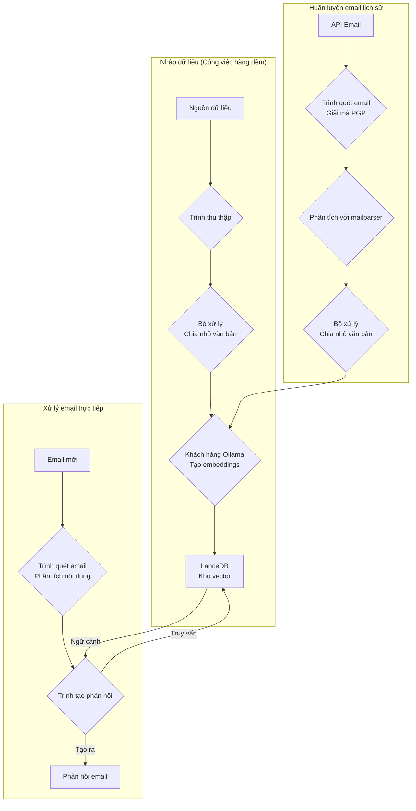
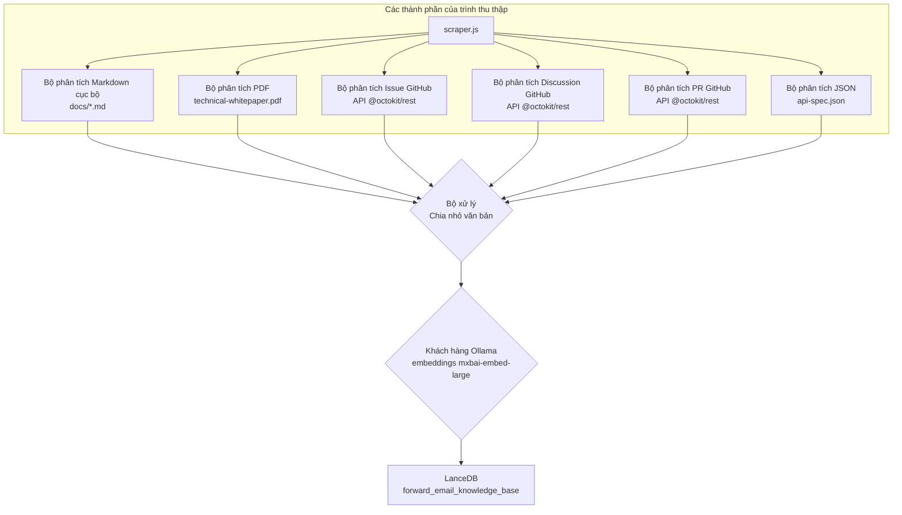
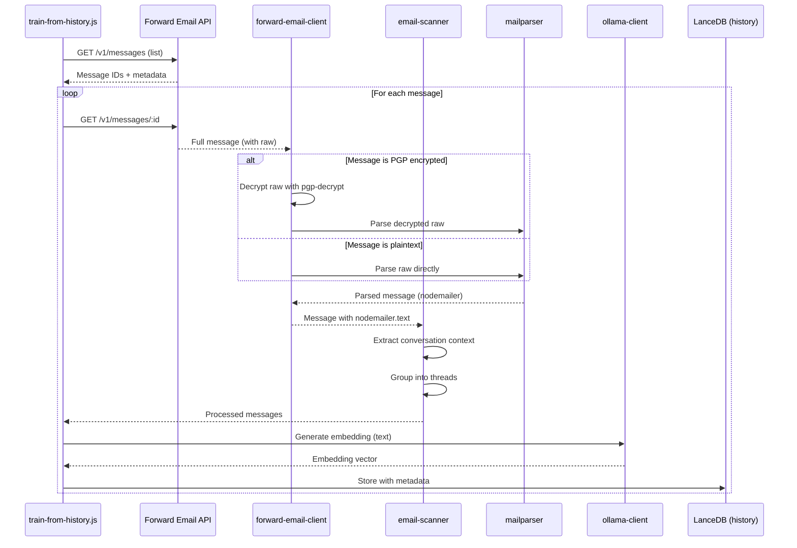

# Xây dựng Đại lý Hỗ trợ Khách hàng AI Ưu tiên Quyền riêng tư với LanceDB, Ollama và Node.js {#building-a-privacy-first-ai-customer-support-agent-with-lancedb-ollama-and-nodejs}


> \[!NOTE]
> Tài liệu này trình bày hành trình xây dựng đại lý hỗ trợ AI tự lưu trữ của chúng tôi. Chúng tôi đã viết về những thách thức tương tự trong bài đăng blog [Email Startup Graveyard](https://forwardemail.net/blog/docs/email-startup-graveyard-why-80-percent-email-companies-fail). Thật lòng chúng tôi đã nghĩ đến việc viết tiếp theo có tên "AI Startup Graveyard" nhưng có lẽ phải đợi thêm một năm nữa cho đến khi bong bóng AI có thể vỡ(?). Hiện tại, đây là bản tổng hợp suy nghĩ của chúng tôi về những gì hiệu quả, những gì không, và lý do chúng tôi làm theo cách này.

Đây là cách chúng tôi xây dựng đại lý hỗ trợ khách hàng AI của riêng mình. Chúng tôi làm theo cách khó khăn: tự lưu trữ, ưu tiên quyền riêng tư, và hoàn toàn kiểm soát. Tại sao? Bởi vì chúng tôi không tin tưởng dịch vụ bên thứ ba với dữ liệu khách hàng của mình. Đây là yêu cầu của GDPR và DPA, và cũng là điều đúng đắn cần làm.

Đây không phải là một dự án cuối tuần vui vẻ. Đó là hành trình kéo dài một tháng vượt qua các phụ thuộc hỏng, tài liệu gây hiểu lầm, và sự hỗn loạn chung của hệ sinh thái AI mã nguồn mở năm 2025. Tài liệu này ghi lại những gì chúng tôi xây dựng, lý do xây dựng, và những trở ngại gặp phải trên đường đi.


## Mục lục {#table-of-contents}

* [Lợi ích cho Khách hàng: Hỗ trợ Con người được Tăng cường AI](#customer-benefits-ai-augmented-human-support)
  * [Phản hồi Nhanh hơn, Chính xác hơn](#faster-more-accurate-responses)
  * [Tính nhất quán mà không bị Kiệt sức](#consistency-without-burnout)
  * [Những gì Bạn Nhận được](#what-you-get)
* [Suy ngẫm Cá nhân: Hai Thập kỷ Nỗ lực](#a-personal-reflection-the-two-decade-grind)
* [Tại sao Quyền riêng tư Quan trọng](#why-privacy-matters)
* [Phân tích Chi phí: AI Đám mây so với Tự lưu trữ](#cost-analysis-cloud-ai-vs-self-hosted)
  * [So sánh Dịch vụ AI Đám mây](#cloud-ai-service-comparison)
  * [Phân tích Chi phí: Cơ sở Kiến thức 5GB](#cost-breakdown-5gb-knowledge-base)
  * [Chi phí Phần cứng Tự lưu trữ](#self-hosted-hardware-costs)
* [Tự sử dụng API của chính mình](#dogfooding-our-own-api)
  * [Tại sao Tự sử dụng Quan trọng](#why-dogfooding-matters)
  * [Ví dụ Sử dụng API](#api-usage-examples)
  * [Lợi ích về Hiệu suất](#performance-benefits)
* [Kiến trúc Mã hóa](#encryption-architecture)
  * [Lớp 1: Mã hóa Hộp thư (chacha20-poly1305)](#layer-1-mailbox-encryption-chacha20-poly1305)
  * [Lớp 2: Mã hóa PGP Cấp độ Tin nhắn](#layer-2-message-level-pgp-encryption)
  * [Tại sao Điều này Quan trọng cho Đào tạo](#why-this-matters-for-training)
  * [Bảo mật Lưu trữ](#storage-security)
  * [Lưu trữ Cục bộ là Thực hành Chuẩn](#local-storage-is-standard-practice)
* [Kiến trúc Tổng thể](#the-architecture)
  * [Luồng Tổng quan](#high-level-flow)
  * [Luồng Trình thu thập Chi tiết](#detailed-scraper-flow)
* [Cách Hoạt động](#how-it-works)
  * [Xây dựng Cơ sở Kiến thức](#building-the-knowledge-base)
  * [Đào tạo từ Email Lịch sử](#training-from-historical-emails)
  * [Xử lý Email Đến](#processing-incoming-emails)
  * [Quản lý Kho Vector](#vector-store-management)
* [Nghĩa địa Cơ sở dữ liệu Vector](#the-vector-database-graveyard)
* [Yêu cầu Hệ thống](#system-requirements)
* [Cấu hình Cron Job](#cron-job-configuration)
  * [Biến Môi trường](#environment-variables)
  * [Cron Jobs cho Nhiều Hộp thư](#cron-jobs-for-multiple-inboxes)
  * [Phân tích Lịch trình Cron](#cron-schedule-breakdown)
  * [Tính Toán Ngày Động](#dynamic-date-calculation)
  * [Thiết lập Ban đầu: Trích xuất Danh sách URL từ Sitemap](#initial-setup-extract-url-list-from-sitemap)
  * [Kiểm tra Cron Jobs Thủ công](#testing-cron-jobs-manually)
  * [Giám sát Nhật ký](#monitoring-logs)
* [Ví dụ Mã nguồn](#code-examples)
  * [Thu thập và Xử lý](#scraping-and-processing)
  * [Đào tạo từ Email Lịch sử](#training-from-historical-emails-1)
  * [Truy vấn để lấy Ngữ cảnh](#querying-for-context)
* [Tương lai: Nghiên cứu và Phát triển Bộ lọc Spam](#the-future-spam-scanner-rd)
* [Khắc phục sự cố](#troubleshooting)
  * [Lỗi Sai Kích thước Vector](#vector-dimension-mismatch-error)
  * [Ngữ cảnh Cơ sở Kiến thức Trống](#empty-knowledge-base-context)
  * [Lỗi Giải mã PGP](#pgp-decryption-failures)
* [Mẹo Sử dụng](#usage-tips)
  * [Đạt Inbox Zero](#achieving-inbox-zero)
  * [Sử dụng Nhãn skip-ai](#using-the-skip-ai-label)
  * [Xâu chuỗi Email và Trả lời Tất cả](#email-threading-and-reply-all)
  * [Giám sát và Bảo trì](#monitoring-and-maintenance)
* [Kiểm thử](#testing)
  * [Chạy Kiểm thử](#running-tests)
  * [Phủ sóng Kiểm thử](#test-coverage)
  * [Môi trường Kiểm thử](#test-environment)
* [Những điểm chính cần nhớ](#key-takeaways)
## Lợi Ích Khách Hàng: Hỗ Trợ Con Người Được Tăng Cường Bởi AI {#customer-benefits-ai-augmented-human-support}

Hệ thống AI của chúng tôi không thay thế đội ngũ hỗ trợ mà làm cho họ tốt hơn. Điều này có nghĩa gì với bạn:

### Phản Hồi Nhanh Hơn, Chính Xác Hơn {#faster-more-accurate-responses}

**Con Người Trong Vòng Lặp**: Mỗi bản nháp do AI tạo ra đều được đội ngũ hỗ trợ con người của chúng tôi xem xét, chỉnh sửa và chọn lọc trước khi gửi đến bạn. AI đảm nhận việc nghiên cứu và soạn thảo ban đầu, giúp đội ngũ tập trung vào kiểm soát chất lượng và cá nhân hóa.

**Được Đào Tạo Từ Chuyên Môn Con Người**: AI học từ:

* Cơ sở kiến thức và tài liệu do chúng tôi viết tay
* Các bài viết blog và hướng dẫn do con người tạo ra
* FAQ toàn diện của chúng tôi (do con người viết)
* Các cuộc trò chuyện với khách hàng trước đây (tất cả đều do con người xử lý)

Bạn nhận được phản hồi dựa trên nhiều năm kinh nghiệm con người, chỉ là được gửi nhanh hơn.

### Tính Nhất Quán Mà Không Bị Kiệt Sức {#consistency-without-burnout}

Đội ngũ nhỏ của chúng tôi xử lý hàng trăm yêu cầu hỗ trợ mỗi ngày, mỗi yêu cầu đòi hỏi kiến thức kỹ thuật khác nhau và sự chuyển đổi ngữ cảnh tinh thần:

* Câu hỏi về thanh toán đòi hỏi kiến thức hệ thống tài chính
* Vấn đề DNS đòi hỏi chuyên môn mạng
* Tích hợp API đòi hỏi kiến thức lập trình
* Báo cáo bảo mật đòi hỏi đánh giá lỗ hổng

Không có sự trợ giúp của AI, việc chuyển đổi ngữ cảnh liên tục này dẫn đến:

* Thời gian phản hồi chậm hơn
* Sai sót do mệt mỏi
* Chất lượng câu trả lời không đồng đều
* Đội ngũ bị kiệt sức

**Với sự tăng cường của AI**, đội ngũ chúng tôi:

* Phản hồi nhanh hơn (AI soạn thảo trong vài giây)
* Ít sai sót hơn (AI phát hiện lỗi phổ biến)
* Duy trì chất lượng đồng đều (AI tham khảo cùng một cơ sở kiến thức mỗi lần)
* Giữ được sự tỉnh táo và tập trung (ít thời gian nghiên cứu, nhiều thời gian giúp đỡ hơn)

### Những Gì Bạn Nhận Được {#what-you-get}

✅ **Tốc độ**: AI soạn thảo phản hồi trong vài giây, con người xem xét và gửi trong vài phút

✅ **Độ chính xác**: Phản hồi dựa trên tài liệu thực tế và các giải pháp trước đây của chúng tôi

✅ **Tính nhất quán**: Câu trả lời chất lượng cao như nhau dù là 9 giờ sáng hay 9 giờ tối

✅ **Chạm đến con người**: Mỗi phản hồi đều được đội ngũ xem xét và cá nhân hóa

✅ **Không ảo tưởng**: AI chỉ sử dụng cơ sở kiến thức đã được xác minh của chúng tôi, không phải dữ liệu chung trên internet

> \[!NOTE]
> **Bạn luôn nói chuyện với con người**. AI là trợ lý nghiên cứu giúp đội ngũ tìm câu trả lời đúng nhanh hơn. Hãy nghĩ nó như một thủ thư tìm ngay cuốn sách liên quan — nhưng vẫn có con người đọc và giải thích cho bạn.


## Một Suy Ngẫm Cá Nhân: Hai Thập Kỷ Nỗ Lực {#a-personal-reflection-the-two-decade-grind}

Trước khi đi sâu vào kỹ thuật, một lời nhắn cá nhân. Tôi đã làm việc này gần hai thập kỷ. Những giờ đồng hồ không ngừng bên bàn phím, sự theo đuổi không ngừng của một giải pháp, sự mài giũa sâu sắc và tập trung – đó là thực tế của việc xây dựng bất cứ điều gì có ý nghĩa. Đây là thực tế thường bị bỏ qua trong các chu kỳ thổi phồng công nghệ mới.

Sự bùng nổ gần đây của AI thật sự gây thất vọng. Chúng ta được bán một giấc mơ về tự động hóa, về các trợ lý AI sẽ viết mã và giải quyết vấn đề cho chúng ta. Thực tế? Kết quả thường là mã rác cần nhiều thời gian sửa hơn là viết lại từ đầu. Lời hứa làm cuộc sống dễ dàng hơn là giả tạo. Nó là sự phân tâm khỏi công việc khó khăn và cần thiết của việc xây dựng.

Và rồi có cái vòng luẩn quẩn khi đóng góp cho mã nguồn mở. Bạn đã quá tải, kiệt sức vì công việc. Bạn dùng AI để giúp viết báo cáo lỗi chi tiết, có cấu trúc tốt, hy vọng giúp người duy trì dễ hiểu và sửa lỗi hơn. Và chuyện gì xảy ra? Bạn bị mắng. Đóng góp của bạn bị bác bỏ là "ngoài chủ đề" hoặc ít nỗ lực, như chúng ta đã thấy trong một [vấn đề GitHub của Node.js](https://github.com/nodejs/node/issues/60719#issuecomment-3534304321). Đó là một cái tát vào mặt các nhà phát triển kỳ cựu chỉ đang cố gắng giúp đỡ.

Đây là thực tế của hệ sinh thái mà chúng ta đang làm việc. Không chỉ là các công cụ hỏng hóc; đó là một văn hóa thường không tôn trọng thời gian và [nỗ lực của những người đóng góp](https://forwardemail.net/blog/docs/how-npm-packages-billion-downloads-shaped-javascript-ecosystem). Bài viết này là một ghi chép về thực tế đó. Nó là câu chuyện về công cụ, đúng vậy, nhưng cũng là về cái giá con người phải trả khi xây dựng trong một hệ sinh thái hỏng hóc mà dù có nhiều hứa hẹn, vẫn cơ bản là hỏng hóc.
## Tại sao Quyền Riêng Tư Quan Trọng {#why-privacy-matters}

[Whitepaper kỹ thuật](https://forwardemail.net/technical-whitepaper.pdf) của chúng tôi trình bày sâu về triết lý quyền riêng tư. Phiên bản ngắn gọn: chúng tôi không gửi dữ liệu khách hàng cho bên thứ ba. Tuyệt đối không. Điều đó có nghĩa là không có OpenAI, không có Anthropic, không có cơ sở dữ liệu vector lưu trữ trên đám mây. Mọi thứ đều chạy cục bộ trên hạ tầng của chúng tôi. Đây là điều không thể thương lượng để tuân thủ GDPR và các cam kết DPA của chúng tôi.


## Phân Tích Chi Phí: AI Đám Mây so với Tự Lưu Trữ {#cost-analysis-cloud-ai-vs-self-hosted}

Trước khi đi vào triển khai kỹ thuật, hãy nói về lý do tại sao tự lưu trữ lại quan trọng từ góc độ chi phí. Mô hình giá của các dịch vụ AI đám mây khiến chúng trở nên quá đắt đỏ cho các trường hợp sử dụng có khối lượng lớn như hỗ trợ khách hàng.

### So Sánh Dịch Vụ AI Đám Mây {#cloud-ai-service-comparison}

| Dịch vụ        | Nhà cung cấp        | Chi phí Nhúng                                                    | Chi phí LLM (Đầu vào)                                                     | Chi phí LLM (Đầu ra)     | Chính sách Quyền riêng tư                           | GDPR/DPA        | Lưu trữ           | Chia sẻ Dữ liệu   |
| -------------- | ------------------- | ---------------------------------------------------------------- | -------------------------------------------------------------------------- | ----------------------- | -------------------------------------------------- | --------------- | ----------------- | ----------------- |
| **OpenAI**     | OpenAI (Mỹ)         | [$0.02-0.13/1M tokens](https://openai.com/api/pricing/)          | $0.15-20/1M tokens                                                         | $0.60-80/1M tokens      | [Link](https://openai.com/policies/privacy-policy/) | DPA giới hạn    | Azure (Mỹ)        | Có (đào tạo)      |
| **Claude**     | Anthropic (Mỹ)      | N/A                                                              | [$3-20/1M tokens](https://docs.claude.com/en/docs/about-claude/pricing)    | $15-80/1M tokens        | [Link](https://www.anthropic.com/legal/privacy)     | DPA giới hạn    | AWS/GCP (Mỹ)      | Không (tuyên bố)  |
| **Gemini**     | Google (Mỹ)         | [$0.15/1M tokens](https://ai.google.dev/gemini-api/docs/pricing) | $0.30-1.00/1M tokens                                                       | $2.50/1M tokens         | [Link](https://policies.google.com/privacy)         | DPA giới hạn    | GCP (Mỹ)          | Có (cải thiện)    |
| **DeepSeek**   | DeepSeek (Trung Quốc) | N/A                                                              | [$0.028-0.28/1M tokens](https://api-docs.deepseek.com/quick_start/pricing) | $0.42/1M tokens         | [Link](https://www.deepseek.com/en)                 | Không rõ       | Trung Quốc        | Không rõ          |
| **Mistral**    | Mistral AI (Pháp)   | [$0.10/1M tokens](https://mistral.ai/pricing)                    | $0.40/1M tokens                                                            | $2.00/1M tokens         | [Link](https://mistral.ai/terms/)                   | GDPR EU        | EU                | Không rõ          |
| **Tự Lưu Trữ** | Bạn                 | $0 (phần cứng hiện có)                                           | $0 (phần cứng hiện có)                                                     | $0 (phần cứng hiện có)  | Chính sách của bạn                                | Tuân thủ đầy đủ | MacBook M5 + cron | Không bao giờ     |

> \[!WARNING]
> **Lo ngại về chủ quyền dữ liệu**: Các nhà cung cấp Mỹ (OpenAI, Claude, Gemini) chịu sự điều chỉnh của CLOUD Act, cho phép chính phủ Mỹ truy cập dữ liệu. DeepSeek (Trung Quốc) hoạt động theo luật dữ liệu Trung Quốc. Trong khi Mistral (Pháp) cung cấp lưu trữ tại EU và tuân thủ GDPR, tự lưu trữ vẫn là lựa chọn duy nhất để có chủ quyền và kiểm soát dữ liệu hoàn toàn.

### Phân Tích Chi Phí: Cơ Sở Kiến Thức 5GB {#cost-breakdown-5gb-knowledge-base}

Hãy tính chi phí xử lý một cơ sở kiến thức 5GB (điển hình cho một công ty vừa với tài liệu, email và lịch sử hỗ trợ).

**Giả định:**

* 5GB văn bản ≈ 1,25 tỷ token (giả sử ~4 ký tự/token)
* Tạo nhúng ban đầu
* Đào tạo lại hàng tháng (tái nhúng toàn bộ)
* 10.000 truy vấn hỗ trợ mỗi tháng
* Truy vấn trung bình: 500 token đầu vào, 300 token đầu ra
**Phân Tích Chi Phí Chi Tiết:**

| Thành phần                            | OpenAI           | Claude          | Gemini               | Tự Lưu Trữ        |
| -------------------------------------- | ---------------- | --------------- | -------------------- | ------------------ |
| **Embedding Ban Đầu** (1.25B tokens)   | $25,000          | N/A             | $187,500             | $0                 |
| **Truy Vấn Hàng Tháng** (10K × 800 tokens) | $1,200-16,000    | $2,400-16,000   | $2,400-3,200         | $0                 |
| **Huấn Luyện Lại Hàng Tháng** (1.25B tokens)  | $25,000          | N/A             | $187,500             | $0                 |
| **Tổng Năm Đầu Tiên**                   | $325,200-217,000 | $28,800-192,000 | $2,278,800-2,226,000 | ~ $60 (điện)       |
| **Tuân Thủ Quyền Riêng Tư**                 | ❌ Hạn chế        | ❌ Hạn chế       | ❌ Hạn chế            | ✅ Đầy đủ           |
| **Chủ Quyền Dữ Liệu**                   | ❌ Không          | ❌ Không         | ❌ Không              | ✅ Có               |

> \[!CAUTION]
> **Chi phí embedding của Gemini là thảm họa** với $0.15/1M tokens. Một embedding cơ sở tri thức 5GB sẽ tốn $187,500. Đây là chi phí cao gấp 37 lần OpenAI và khiến nó hoàn toàn không thể sử dụng trong sản xuất.

### Chi Phí Phần Cứng Tự Lưu Trữ {#self-hosted-hardware-costs}

Cấu hình của chúng tôi chạy trên phần cứng hiện có mà chúng tôi đã sở hữu:

* **Phần cứng**: MacBook M5 (đã sở hữu để phát triển)
* **Chi phí bổ sung**: $0 (sử dụng phần cứng hiện có)
* **Điện năng**: ~ $5/tháng (ước tính)
* **Tổng năm đầu tiên**: ~ $60
* **Chi phí duy trì**: $60/năm

**ROI**: Tự lưu trữ gần như không có chi phí biên vì chúng tôi sử dụng phần cứng phát triển hiện có. Hệ thống chạy qua các công việc cron vào giờ thấp điểm.


## Sử Dụng API Của Chính Mình {#dogfooding-our-own-api}

Một trong những quyết định kiến trúc quan trọng nhất mà chúng tôi thực hiện là để tất cả các công việc AI sử dụng trực tiếp [Forward Email API](https://forwardemail.net/email-api). Điều này không chỉ là thực hành tốt—mà còn là một cơ chế thúc đẩy tối ưu hóa hiệu suất.

### Tại Sao Việc Sử Dụng API Của Chính Mình Lại Quan Trọng {#why-dogfooding-matters}

Khi các công việc AI của chúng tôi sử dụng cùng các điểm cuối API như khách hàng:

1. **Nút thắt hiệu suất ảnh hưởng đến chúng tôi trước** - Chúng tôi cảm nhận được vấn đề trước khách hàng
2. **Tối ưu hóa có lợi cho tất cả mọi người** - Cải tiến cho công việc của chúng tôi tự động cải thiện trải nghiệm khách hàng
3. **Kiểm thử thực tế** - Các công việc của chúng tôi xử lý hàng nghìn email, cung cấp kiểm thử tải liên tục
4. **Tái sử dụng mã** - Cùng logic xác thực, giới hạn tốc độ, xử lý lỗi và bộ nhớ đệm

### Ví Dụ Sử Dụng API {#api-usage-examples}

**Liệt Kê Tin Nhắn (train-from-history.js):**

```javascript
// Sử dụng GET /v1/messages?folder=INBOX với BasicAuth
// Loại trừ eml, raw, nodemailer để giảm kích thước phản hồi (chỉ cần ID)
const response = await axios.get(
  `${this.apiBase}/v1/messages`,
  {
    params: {
      folder: 'INBOX',
      limit: 100,
      eml: false,
      raw: false,
      nodemailer: false
    },
    auth: {
      username: process.env.FORWARD_EMAIL_ALIAS_USERNAME,
      password: process.env.FORWARD_EMAIL_ALIAS_PASSWORD
    }
  }
);

const messages = response.data;
// Trả về: [{ id, subject, date, ... }, ...]
// Nội dung tin nhắn đầy đủ được lấy sau qua GET /v1/messages/:id
```

**Lấy Tin Nhắn Đầy Đủ (forward-email-client.js):**

```javascript
// Sử dụng GET /v1/messages/:id để lấy tin nhắn đầy đủ với nội dung raw
const response = await axios.get(
  `${this.apiBase}/v1/messages/${messageId}`,
  {
    auth: {
      username: this.aliasUsername,
      password: this.aliasPassword
    }
  }
);

const message = response.data;
// Trả về: { id, subject, raw, eml, nodemailer: { ... }, ... }
```

**Tạo Bản Nháp Phản Hồi (process-inbox.js):**

```javascript
// Sử dụng POST /v1/messages để tạo bản nháp trả lời
const response = await axios.post(
  `${this.apiBase}/v1/messages`,
  {
    folder: 'Drafts',
    subject: `Re: ${originalSubject}`,
    to: senderEmail,
    text: generatedResponse,
    inReplyTo: originalMessageId
  },
  {
    auth: {
      username: process.env.FORWARD_EMAIL_ALIAS_USERNAME,
      password: process.env.FORWARD_EMAIL_ALIAS_PASSWORD
    }
  }
);
```
### Lợi Ích Về Hiệu Suất {#performance-benefits}

Bởi vì các công việc AI của chúng tôi chạy trên cùng một hạ tầng API:

* **Tối ưu bộ nhớ đệm** mang lại lợi ích cho cả công việc và khách hàng
* **Giới hạn tần suất** được kiểm tra dưới tải thực tế
* **Xử lý lỗi** được thử nghiệm kỹ càng
* **Thời gian phản hồi API** được giám sát liên tục
* **Truy vấn cơ sở dữ liệu** được tối ưu cho cả hai trường hợp sử dụng
* **Tối ưu băng thông** - Loại trừ `eml`, `raw`, `nodemailer` khi liệt kê giảm kích thước phản hồi khoảng \~90%

Khi `train-from-history.js` xử lý 1.000 email, nó thực hiện hơn 1.000 cuộc gọi API. Bất kỳ sự không hiệu quả nào trong API sẽ ngay lập tức lộ ra. Điều này buộc chúng tôi phải tối ưu truy cập IMAP, truy vấn cơ sở dữ liệu và tuần tự hóa phản hồi — những cải tiến trực tiếp mang lại lợi ích cho khách hàng của chúng tôi.

**Ví dụ tối ưu hóa**: Liệt kê 100 tin nhắn với nội dung đầy đủ = khoảng \~10MB phản hồi. Liệt kê với `eml: false, raw: false, nodemailer: false` = khoảng \~100KB phản hồi (nhỏ hơn 100 lần).


## Kiến Trúc Mã Hóa {#encryption-architecture}

Lưu trữ email của chúng tôi sử dụng nhiều lớp mã hóa, mà các công việc AI phải giải mã theo thời gian thực để huấn luyện.

### Lớp 1: Mã Hóa Hộp Thư (chacha20-poly1305) {#layer-1-mailbox-encryption-chacha20-poly1305}

Tất cả các hộp thư IMAP được lưu dưới dạng cơ sở dữ liệu SQLite được mã hóa bằng **chacha20-poly1305**, một thuật toán mã hóa an toàn trước máy tính lượng tử. Điều này được trình bày chi tiết trong bài viết blog về [dịch vụ email mã hóa an toàn trước lượng tử](https://forwardemail.net/blog/docs/best-quantum-safe-encrypted-email-service).

**Các đặc tính chính:**

* **Thuật toán**: ChaCha20-Poly1305 (mã AEAD)
* **An toàn lượng tử**: Kháng lại các cuộc tấn công máy tính lượng tử
* **Lưu trữ**: Tệp cơ sở dữ liệu SQLite trên đĩa
* **Truy cập**: Giải mã trong bộ nhớ khi truy cập qua IMAP/API

### Lớp 2: Mã Hóa PGP Cấp Tin Nhắn {#layer-2-message-level-pgp-encryption}

Nhiều email hỗ trợ được mã hóa thêm bằng PGP (chuẩn OpenPGP). Các công việc AI phải giải mã những email này để trích xuất nội dung phục vụ huấn luyện.

**Quy trình giải mã:**

```javascript
// 1. API trả về tin nhắn với nội dung thô được mã hóa
const message = await forwardEmailClient.getMessage(id);

// 2. Kiểm tra xem nội dung thô có được mã hóa PGP không
if (isMessageEncrypted(message.raw)) {
  // 3. Giải mã bằng khóa riêng của chúng tôi
  const decryptedRaw = await pgpDecrypt(message.raw);

  // 4. Phân tích tin nhắn MIME đã giải mã
  const parsed = await simpleParser(decryptedRaw);

  // 5. Điền nodemailer với nội dung đã giải mã
  message.nodemailer = {
    text: parsed.text,
    html: parsed.html,
    from: parsed.from,
    to: parsed.to,
    subject: parsed.subject,
    date: parsed.date
  };
}
```

**Cấu hình PGP:**

```bash
# Khóa riêng để giải mã (đường dẫn đến tệp khóa ASCII-armored)
GPG_SECURITY_KEY="/path/to/private-key.asc"

# Mật khẩu cho khóa riêng (nếu được mã hóa)
GPG_SECURITY_PASSPHRASE="your-passphrase"
```

Trợ giúp `pgp-decrypt.js`:

1. Đọc khóa riêng từ đĩa một lần (được lưu trong bộ nhớ đệm)
2. Giải mã khóa với mật khẩu
3. Sử dụng khóa đã giải mã để giải mã tất cả các tin nhắn
4. Hỗ trợ giải mã đệ quy cho các tin nhắn mã hóa lồng nhau

### Tại Sao Điều Này Quan Trọng Cho Huấn Luyện {#why-this-matters-for-training}

Nếu không giải mã đúng cách, AI sẽ huấn luyện trên dữ liệu mã hóa không có ý nghĩa:

```
-----BEGIN PGP MESSAGE-----
Version: OpenPGP.js v4.10.10

wcBMA8Z3lHJnFnNUAQgAqK7F8...
-----END PGP MESSAGE-----
```

Với giải mã, AI huấn luyện trên nội dung thực tế:

```
Subject: Re: Bug Report

Hi John,

Thanks for reporting this issue. I've confirmed the bug
and created a fix in PR #1234...
```

### Bảo Mật Lưu Trữ {#storage-security}

Việc giải mã diễn ra trong bộ nhớ trong quá trình thực thi công việc, và nội dung đã giải mã được chuyển đổi thành embeddings rồi được lưu trong cơ sở dữ liệu vector LanceDB trên đĩa.

**Nơi dữ liệu được lưu trữ:**

* **Cơ sở dữ liệu vector**: Lưu trên các máy MacBook M5 được mã hóa
* **Bảo mật vật lý**: Máy luôn ở trong tầm kiểm soát của chúng tôi (không đặt trong trung tâm dữ liệu)
* **Mã hóa đĩa**: Mã hóa toàn bộ đĩa trên tất cả máy
* **Bảo mật mạng**: Tường lửa và cách ly khỏi mạng công cộng

**Triển khai trung tâm dữ liệu trong tương lai:**
Nếu chúng tôi chuyển sang lưu trữ tại trung tâm dữ liệu, các máy chủ sẽ có:

* Mã hóa toàn bộ đĩa LUKS
* Vô hiệu hóa truy cập USB
* Các biện pháp bảo mật vật lý
* Cách ly mạng
Để biết chi tiết đầy đủ về các thực hành bảo mật của chúng tôi, xem trang [Bảo mật](https://forwardemail.net/en/security).

> \[!NOTE]
> Cơ sở dữ liệu vector chứa các embeddings (biểu diễn toán học), không phải văn bản gốc. Tuy nhiên, embeddings có thể bị đảo ngược, đó là lý do chúng tôi giữ chúng trên các máy trạm được mã hóa và bảo vệ vật lý.

### Lưu trữ cục bộ là thực hành tiêu chuẩn {#local-storage-is-standard-practice}

Lưu trữ embeddings trên các máy trạm của nhóm chúng tôi không khác gì cách chúng tôi đã xử lý email:

* **Thunderbird**: Tải xuống và lưu trữ toàn bộ nội dung email cục bộ trong các tệp mbox/maildir
* **Các trình duyệt webmail**: Bộ nhớ đệm dữ liệu email trong bộ nhớ trình duyệt và cơ sở dữ liệu cục bộ
* **Các trình khách IMAP**: Duy trì bản sao cục bộ của các tin nhắn để truy cập ngoại tuyến
* **Hệ thống AI của chúng tôi**: Lưu trữ embeddings toán học (không phải văn bản thuần túy) trong LanceDB

Điểm khác biệt chính: embeddings **bảo mật hơn** so với email văn bản thuần túy vì chúng:

1. Là biểu diễn toán học, không phải văn bản có thể đọc được
2. Khó bị đảo ngược hơn so với văn bản thuần túy
3. Vẫn chịu cùng mức độ bảo mật vật lý như các trình khách email của chúng tôi

Nếu việc nhóm chúng tôi sử dụng Thunderbird hoặc webmail trên các máy trạm được mã hóa là chấp nhận được, thì việc lưu trữ embeddings theo cách tương tự cũng hoàn toàn chấp nhận được (và có thể còn bảo mật hơn).

## Kiến trúc {#the-architecture}

Dưới đây là luồng cơ bản. Nó có vẻ đơn giản. Nhưng không phải vậy.

> \[!NOTE]
> Tất cả các công việc đều sử dụng trực tiếp API Forward Email, đảm bảo các tối ưu hóa hiệu suất mang lại lợi ích cho cả hệ thống AI của chúng tôi và khách hàng.

### Luồng cấp cao {#high-level-flow}



### Luồng chi tiết của trình thu thập {#detailed-scraper-flow}

`scraper.js` là trung tâm của việc nhập dữ liệu. Nó là tập hợp các bộ phân tích cho các định dạng dữ liệu khác nhau.



## Cách hoạt động {#how-it-works}

Quy trình được chia thành ba phần chính: xây dựng cơ sở tri thức, huấn luyện từ email lịch sử, và xử lý email mới.

### Xây dựng cơ sở tri thức {#building-the-knowledge-base}

**`update-knowledge-base.js`**: Đây là công việc chính. Nó chạy hàng đêm, xóa kho vector cũ và xây dựng lại từ đầu. Nó sử dụng `scraper.js` để lấy nội dung từ tất cả các nguồn, `processor.js` để chia nhỏ, và `ollama-client.js` để tạo embeddings. Cuối cùng, `vector-store.js` lưu trữ tất cả trong LanceDB.

**Nguồn dữ liệu:**

* Các tệp Markdown cục bộ (`docs/*.md`)
* PDF whitepaper kỹ thuật (`assets/technical-whitepaper.pdf`)
* JSON đặc tả API (`assets/api-spec.json`)
* Các issue GitHub (qua Octokit)
* Các discussion GitHub (qua Octokit)
* Các pull request GitHub (qua Octokit)
* Danh sách URL sơ đồ trang web (`$LANCEDB_PATH/valid-urls.json`)

### Huấn luyện từ email lịch sử {#training-from-historical-emails}

**`train-from-history.js`**: Công việc này quét các email lịch sử từ tất cả các thư mục, giải mã các tin nhắn được mã hóa PGP, và thêm chúng vào một kho vector riêng biệt (`customer_support_history`). Điều này cung cấp ngữ cảnh từ các tương tác hỗ trợ trong quá khứ.
**Quy trình xử lý Email:**



**Tính năng chính:**

* **Giải mã PGP**: Sử dụng helper `pgp-decrypt.js` với biến môi trường `GPG_SECURITY_KEY`
* **Nhóm luồng hội thoại**: Nhóm các email liên quan thành các luồng hội thoại
* **Bảo toàn metadata**: Lưu trữ thư mục, chủ đề, ngày tháng, trạng thái mã hóa
* **Ngữ cảnh trả lời**: Liên kết các tin nhắn với câu trả lời của chúng để có ngữ cảnh tốt hơn

**Cấu hình:**

```bash
# Biến môi trường cho train-from-history
HISTORY_SCAN_LIMIT=1000              # Số tin nhắn tối đa để xử lý
HISTORY_SCAN_SINCE="2024-01-01"      # Chỉ xử lý tin nhắn sau ngày này
HISTORY_DECRYPT_PGP=true             # Cố gắng giải mã PGP
GPG_SECURITY_KEY="/path/to/key.asc"  # Đường dẫn tới khóa riêng PGP
GPG_SECURITY_PASSPHRASE="passphrase" # Mật khẩu khóa (tùy chọn)
```

**Những gì được lưu trữ:**

```javascript
{
  type: 'historical_email',
  folder: 'INBOX',
  subject: 'Re: Bug Report',
  date: '2025-01-15T10:30:00Z',
  messageId: '67e2f288893921...',
  threadId: 'Bug Report',
  hasReply: true,
  encrypted: true,
  decrypted: true,
  replySubject: 'Bug Report',
  replyText: 'First 500 chars of reply...',
  chunkSize: 1000,
  chunkOverlap: 200,
  chunkIndex: 0
}
```

> \[!TIP]
> Chạy `train-from-history` sau khi thiết lập ban đầu để điền ngữ cảnh lịch sử. Điều này cải thiện đáng kể chất lượng phản hồi bằng cách học từ các tương tác hỗ trợ trước đây.

### Xử lý Email đến {#processing-incoming-emails}

**`process-inbox.js`**: Công việc này chạy trên các email trong hộp thư `support@forwardemail.net`, `abuse@forwardemail.net`, và `security@forwardemail.net` (cụ thể là thư mục IMAP `INBOX`). Nó sử dụng API của chúng tôi tại <https://forwardemail.net/email-api> (ví dụ `GET /v1/messages?folder=INBOX` sử dụng BasicAuth với thông tin đăng nhập IMAP cho từng hộp thư). Nó phân tích nội dung email, truy vấn cả cơ sở tri thức (`forward_email_knowledge_base`) và kho vector email lịch sử (`customer_support_history`), sau đó truyền ngữ cảnh kết hợp cho `response-generator.js`. Bộ tạo sử dụng `mxbai-embed-large` qua Ollama để tạo phản hồi.

**Tính năng quy trình tự động:**

1. **Tự động Inbox Zero**: Sau khi tạo bản nháp thành công, tin nhắn gốc sẽ tự động được chuyển vào thư mục Lưu trữ. Điều này giữ cho hộp thư đến của bạn sạch sẽ và giúp đạt được inbox zero mà không cần can thiệp thủ công.

2. **Bỏ qua xử lý AI**: Chỉ cần thêm nhãn `skip-ai` (không phân biệt chữ hoa thường) vào bất kỳ tin nhắn nào để ngăn AI xử lý. Tin nhắn sẽ vẫn ở trong hộp thư đến của bạn mà không bị động chạm, cho phép bạn xử lý thủ công. Điều này hữu ích cho các tin nhắn nhạy cảm hoặc trường hợp phức tạp cần đánh giá của con người.

3. **Luồng hội thoại email đúng chuẩn**: Tất cả các phản hồi bản nháp bao gồm trích dẫn tin nhắn gốc bên dưới (sử dụng tiền tố chuẩn ` >  `), theo quy ước trả lời email với định dạng "Vào ngày \[date], \[sender] đã viết:". Điều này đảm bảo ngữ cảnh hội thoại và luồng hội thoại đúng trong các ứng dụng email.

4. **Hành vi trả lời tất cả**: Hệ thống tự động xử lý các header Reply-To và người nhận CC:
   * Nếu có header Reply-To, nó sẽ trở thành địa chỉ To và địa chỉ From gốc được thêm vào CC
   * Tất cả người nhận To và CC gốc đều được bao gồm trong CC trả lời (trừ địa chỉ của bạn)
   * Tuân theo quy ước trả lời tất cả chuẩn cho các cuộc hội thoại nhóm
**Xếp hạng Nguồn**: Hệ thống sử dụng **xếp hạng có trọng số** để ưu tiên các nguồn:

* FAQ: 100% (ưu tiên cao nhất)
* Bài báo kỹ thuật: 95%
* Đặc tả API: 90%
* Tài liệu chính thức: 85%
* Vấn đề GitHub: 70%
* Email lịch sử: 50%

### Quản lý Kho Vector {#vector-store-management}

Lớp `VectorStore` trong `helpers/customer-support-ai/vector-store.js` là giao diện của chúng tôi với LanceDB.

**Thêm Tài liệu:**

```javascript
// vector-store.js
async addDocument(text, metadata) {
  const embedding = await this.ollama.generateEmbedding(text);
  await this.table.add([{
    vector: embedding,
    text,
    ...metadata
  }]);
}
```

**Xóa Kho:**

```javascript
// Option 1: Use the clear() method
await vectorStore.clear();

// Option 2: Delete the local database directory
await fs.rm(process.env.LANCEDB_PATH, { recursive: true, force: true });
```

Biến môi trường `LANCEDB_PATH` trỏ đến thư mục cơ sở dữ liệu nhúng cục bộ. LanceDB là serverless và nhúng, nên không có tiến trình riêng biệt để quản lý.


## Nghĩa trang Cơ sở dữ liệu Vector {#the-vector-database-graveyard}

Đây là trở ngại lớn đầu tiên. Chúng tôi đã thử nhiều cơ sở dữ liệu vector trước khi chọn LanceDB. Dưới đây là những gì đã xảy ra với từng cái.

| Cơ sở dữ liệu | GitHub                                                      | Những Vấn đề Gặp Phải                                                                                                                                                                                                | Vấn đề Cụ thể                                                                                                                                                                                                                                                                                                                                                             | Mối Quan Tâm về Bảo mật                                                                                                                                                                                        |
| ------------ | ----------------------------------------------------------- | -------------------------------------------------------------------------------------------------------------------------------------------------------------------------------------------------------------------- | ------------------------------------------------------------------------------------------------------------------------------------------------------------------------------------------------------------------------------------------------------------------------------------------------------------------------------------------------------------------------- | ---------------------------------------------------------------------------------------------------------------------------------------------------------------------------------------------------------------- |
| **ChromaDB** | [chroma-core/chroma](https://github.com/chroma-core/chroma) | `pip3 install chromadb` cung cấp cho bạn một phiên bản cổ đại với lỗi `PydanticImportError`. Cách duy nhất để có phiên bản hoạt động là biên dịch từ mã nguồn. Không thân thiện với nhà phát triển.                | Hỗn loạn phụ thuộc Python. Nhiều người dùng báo cáo lỗi cài đặt pip ([#774](https://github.com/chroma-core/chroma/issues/774), [#163](https://github.com/chroma-core/chroma/issues/163)). Tài liệu nói "chỉ dùng Docker" nhưng đó không phải là câu trả lời cho phát triển cục bộ. Bị crash trên Windows với >99 bản ghi ([#3058](https://github.com/chroma-core/chroma/issues/3058)). | **CVE-2024-45848**: Thực thi mã tùy ý qua tích hợp ChromaDB trong MindsDB. Lỗ hổng hệ điều hành nghiêm trọng trong ảnh Docker ([#3170](https://github.com/chroma-core/chroma/issues/3170)).                      |
| **Qdrant**   | [qdrant/qdrant](https://github.com/qdrant/qdrant)           | Homebrew tap (`qdrant/qdrant/qdrant`) được tham chiếu trong tài liệu cũ đã biến mất. Không còn nữa. Không có lời giải thích. Tài liệu chính thức giờ chỉ nói "dùng Docker."                                         | Thiếu Homebrew tap. Không có nhị phân macOS gốc. Chỉ dùng Docker gây khó khăn cho việc thử nghiệm nhanh cục bộ.                                                                                                                                                                                                                                                         | **CVE-2024-2221**: Lỗ hổng tải tệp tùy ý cho phép thực thi mã từ xa (đã sửa trong v1.9.0). Điểm bảo mật thấp từ [IronCore Labs](https://ironcorelabs.com/vectordbs/qdrant-security/).                           |
| **Weaviate** | [weaviate/weaviate](https://github.com/weaviate/weaviate)   | Phiên bản Homebrew có lỗi clustering nghiêm trọng (`leader not found`). Các cờ được tài liệu hóa để sửa lỗi (`RAFT_JOIN`, `CLUSTER_HOSTNAME`) không hoạt động. Cơ bản là hỏng cho cấu hình một nút.                   | Lỗi clustering ngay cả trong chế độ một nút. Quá phức tạp cho các trường hợp sử dụng đơn giản.                                                                                                                                                                                                                                                                           | Không có CVE lớn, nhưng độ phức tạp làm tăng bề mặt tấn công.                                                                                                                                                    |
| **LanceDB**  | [lancedb/lancedb](https://github.com/lancedb/lancedb)       | Cái này hoạt động. Nó nhúng và serverless. Không có tiến trình riêng biệt. Phiền toái duy nhất là tên gói gây nhầm lẫn (`vectordb` đã lỗi thời, dùng `@lancedb/lancedb`) và tài liệu rải rác. Chúng tôi có thể chấp nhận. | Nhầm lẫn tên gói (`vectordb` vs `@lancedb/lancedb`), nhưng nhìn chung ổn định. Kiến trúc nhúng loại bỏ toàn bộ các loại vấn đề bảo mật.                                                                                                                                                                                                                                   | Không có CVE đã biết. Thiết kế nhúng nghĩa là không có bề mặt tấn công mạng.                                                                                                                                      |
> \[!WARNING]
> **ChromaDB có các lỗ hổng bảo mật nghiêm trọng.** [CVE-2024-45848](https://nvd.nist.gov/vuln/detail/CVE-2024-45848) cho phép thực thi mã tùy ý. Việc cài đặt pip bị hỏng cơ bản do các vấn đề phụ thuộc Pydantic. Tránh sử dụng trong môi trường sản xuất.

> \[!WARNING]
> **Qdrant đã có lỗ hổng RCE tải tệp lên** ([CVE-2024-2221](https://qdrant.tech/blog/cve-2024-2221-response/)) chỉ được sửa trong phiên bản v1.9.0. Nếu bạn phải sử dụng Qdrant, hãy đảm bảo bạn đang dùng phiên bản mới nhất.

> \[!CAUTION]
> Hệ sinh thái cơ sở dữ liệu vector mã nguồn mở còn nhiều khó khăn. Đừng tin tưởng tài liệu. Giả định mọi thứ đều bị hỏng cho đến khi được chứng minh ngược lại. Hãy thử nghiệm cục bộ trước khi cam kết sử dụng một bộ công cụ.


## Yêu Cầu Hệ Thống {#system-requirements}

* **Node.js:** v18.0.0+ ([GitHub](https://github.com/nodejs/node))
* **Ollama:** Phiên bản mới nhất ([GitHub](https://github.com/ollama/ollama))
* **Mô hình:** `mxbai-embed-large` qua Ollama
* **Cơ sở dữ liệu Vector:** LanceDB ([GitHub](https://github.com/lancedb/lancedb))
* **Truy cập GitHub:** `@octokit/rest` để lấy dữ liệu issues ([GitHub](https://github.com/octokit/rest.js))
* **SQLite:** Cho cơ sở dữ liệu chính (qua `mongoose-to-sqlite`)


## Cấu Hình Cron Job {#cron-job-configuration}

Tất cả các công việc AI chạy qua cron trên MacBook M5. Dưới đây là cách thiết lập các cron job chạy vào nửa đêm trên nhiều hộp thư.

### Biến Môi Trường {#environment-variables}

Các công việc yêu cầu các biến môi trường này. Hầu hết có thể được đặt trong file `.env` (được tải qua `@ladjs/env`), nhưng `HISTORY_SCAN_SINCE` phải được tính toán động trong crontab.

**Trong file `.env`:**

```bash
# Thông tin đăng nhập API Forward Email (thay đổi theo từng hộp thư)
FORWARD_EMAIL_ALIAS_USERNAME=support@forwardemail.net
FORWARD_EMAIL_ALIAS_PASSWORD=mật-khẩu-imap-của-bạn

# Giải mã PGP (chia sẻ cho tất cả các hộp thư)
GPG_SECURITY_KEY=/path/to/private-key.asc
GPG_SECURITY_PASSPHRASE=mật-khẩu-của-bạn

# Cấu hình quét lịch sử
HISTORY_SCAN_LIMIT=1000

# Đường dẫn LanceDB
LANCEDB_PATH=/path/to/lancedb
```

**Trong crontab (tính toán động):**

```bash
# HISTORY_SCAN_SINCE phải được đặt trực tiếp trong crontab với lệnh shell date
# Không thể đặt trong file .env vì @ladjs/env không thực thi lệnh shell
HISTORY_SCAN_SINCE="$(date -v-1d +%Y-%m-%d)"  # macOS
HISTORY_SCAN_SINCE="$(date -d 'yesterday' +%Y-%m-%d)"  # Linux
```

### Cron Jobs cho Nhiều Hộp Thư {#cron-jobs-for-multiple-inboxes}

Chỉnh sửa crontab của bạn với `crontab -e` và thêm:

```bash
# Cập nhật cơ sở tri thức (chạy một lần, dùng chung cho tất cả các hộp thư)
0 0 * * * cd /path/to/forwardemail.net && LANCEDB_PATH="/path/to/lancedb" GPG_SECURITY_KEY="/path/to/key.asc" GPG_SECURITY_PASSPHRASE="pass" node jobs/customer-support-ai/update-knowledge-base.js >> /var/log/update-knowledge-base.log 2>&1

# Huấn luyện từ lịch sử - support@forwardemail.net
0 0 * * * cd /path/to/forwardemail.net && FORWARD_EMAIL_ALIAS_USERNAME="support@forwardemail.net" FORWARD_EMAIL_ALIAS_PASSWORD="support-password" HISTORY_SCAN_SINCE="$(date -v-1d +%Y-%m-%d)" HISTORY_SCAN_LIMIT=1000 GPG_SECURITY_KEY="/path/to/key.asc" GPG_SECURITY_PASSPHRASE="pass" LANCEDB_PATH="/path/to/lancedb" node jobs/customer-support-ai/train-from-history.js >> /var/log/train-support.log 2>&1

# Huấn luyện từ lịch sử - abuse@forwardemail.net
0 0 * * * cd /path/to/forwardemail.net && FORWARD_EMAIL_ALIAS_USERNAME="abuse@forwardemail.net" FORWARD_EMAIL_ALIAS_PASSWORD="abuse-password" HISTORY_SCAN_SINCE="$(date -v-1d +%Y-%m-%d)" HISTORY_SCAN_LIMIT=1000 GPG_SECURITY_KEY="/path/to/key.asc" GPG_SECURITY_PASSPHRASE="pass" LANCEDB_PATH="/path/to/lancedb" node jobs/customer-support-ai/train-from-history.js >> /var/log/train-abuse.log 2>&1

# Huấn luyện từ lịch sử - security@forwardemail.net
0 0 * * * cd /path/to/forwardemail.net && FORWARD_EMAIL_ALIAS_USERNAME="security@forwardemail.net" FORWARD_EMAIL_ALIAS_PASSWORD="security-password" HISTORY_SCAN_SINCE="$(date -v-1d +%Y-%m-%d)" HISTORY_SCAN_LIMIT=1000 GPG_SECURITY_KEY="/path/to/key.asc" GPG_SECURITY_PASSPHRASE="pass" LANCEDB_PATH="/path/to/lancedb" node jobs/customer-support-ai/train-from-history.js >> /var/log/train-security.log 2>&1

# Xử lý hộp thư - support@forwardemail.net
*/5 * * * * cd /path/to/forwardemail.net && FORWARD_EMAIL_ALIAS_USERNAME="support@forwardemail.net" FORWARD_EMAIL_ALIAS_PASSWORD="support-password" GPG_SECURITY_KEY="/path/to/key.asc" GPG_SECURITY_PASSPHRASE="pass" LANCEDB_PATH="/path/to/lancedb" node jobs/customer-support-ai/process-inbox.js >> /var/log/process-support.log 2>&1

# Xử lý hộp thư - abuse@forwardemail.net
*/5 * * * * cd /path/to/forwardemail.net && FORWARD_EMAIL_ALIAS_USERNAME="abuse@forwardemail.net" FORWARD_EMAIL_ALIAS_PASSWORD="abuse-password" GPG_SECURITY_KEY="/path/to/key.asc" GPG_SECURITY_PASSPHRASE="pass" LANCEDB_PATH="/path/to/lancedb" node jobs/customer-support-ai/process-inbox.js >> /var/log/process-abuse.log 2>&1

# Xử lý hộp thư - security@forwardemail.net
*/5 * * * * cd /path/to/forwardemail.net && FORWARD_EMAIL_ALIAS_USERNAME="security@forwardemail.net" FORWARD_EMAIL_ALIAS_PASSWORD="security-password" GPG_SECURITY_KEY="/path/to/key.asc" GPG_SECURITY_PASSPHRASE="pass" LANCEDB_PATH="/path/to/lancedb" node jobs/customer-support-ai/process-inbox.js >> /var/log/process-security.log 2>&1
```
### Phân Tích Lịch Trình Cron {#cron-schedule-breakdown}

| Công việc                | Lịch trình   | Mô tả                                                                             |
| ----------------------- | ------------- | ---------------------------------------------------------------------------------- |
| `train-from-sitemap.js` | `0 0 * * 0`   | Hàng tuần (chủ nhật nửa đêm) - Lấy tất cả URL từ sitemap và huấn luyện cơ sở kiến thức |
| `train-from-history.js` | `0 0 * * *`   | Hàng ngày vào nửa đêm - Quét email ngày trước theo từng hộp thư                   |
| `process-inbox.js`      | `*/5 * * * *` | Mỗi 5 phút - Xử lý email mới và tạo bản nháp                                      |

### Tính Toán Ngày Động {#dynamic-date-calculation}

Biến `HISTORY_SCAN_SINCE` **phải được tính toán trực tiếp trong crontab** vì:

1. Các file `.env` được đọc dưới dạng chuỗi ký tự nguyên thủy bởi `@ladjs/env`
2. Thay thế lệnh shell `$(...)` không hoạt động trong file `.env`
3. Ngày cần được tính mới mỗi lần cron chạy

**Cách làm đúng (trong crontab):**

```bash
# macOS (BSD date)
HISTORY_SCAN_SINCE="$(date -v-1d +%Y-%m-%d)" node jobs/...

# Linux (GNU date)
HISTORY_SCAN_SINCE="$(date -d 'yesterday' +%Y-%m-%d)" node jobs/...
```

**Cách làm sai (không hoạt động trong .env):**

```bash
# Điều này sẽ được đọc như chuỗi nguyên thủy "$(date -v-1d +%Y-%m-%d)"
# KHÔNG được thực thi như lệnh shell
HISTORY_SCAN_SINCE=$(date -v-1d +%Y-%m-%d)
```

Điều này đảm bảo mỗi lần chạy ban đêm sẽ tính ngày của ngày trước đó một cách động, tránh công việc thừa.

### Thiết Lập Ban Đầu: Trích Xuất Danh Sách URL từ Sitemap {#initial-setup-extract-url-list-from-sitemap}

Trước khi chạy công việc process-inbox lần đầu tiên, bạn **phải** trích xuất danh sách URL từ sitemap. Việc này tạo ra một từ điển các URL hợp lệ mà LLM có thể tham khảo và ngăn ngừa việc ảo tưởng URL.

```bash
# Thiết lập lần đầu: Trích xuất danh sách URL từ sitemap
cd /path/to/forwardemail.net
node jobs/customer-support-ai/train-from-sitemap.js
```

**Việc này làm gì:**

1. Lấy tất cả URL từ <https://forwardemail.net/sitemap.xml>
2. Lọc chỉ các URL không có địa phương hóa hoặc URL /en/ (tránh nội dung trùng lặp)
3. Loại bỏ tiền tố ngôn ngữ (/en/faq → /faq)
4. Lưu một file JSON đơn giản với danh sách URL vào `$LANCEDB_PATH/valid-urls.json`
5. Không thu thập dữ liệu, không lấy metadata - chỉ là danh sách phẳng các URL hợp lệ

**Tại sao điều này quan trọng:**

* Ngăn LLM ảo tưởng các URL giả như `/dashboard` hoặc `/login`
* Cung cấp danh sách trắng các URL hợp lệ để bộ tạo phản hồi tham khảo
* Đơn giản, nhanh và không cần lưu trữ trong cơ sở dữ liệu vector
* Bộ tạo phản hồi tải danh sách này khi khởi động và bao gồm nó trong prompt

**Thêm vào crontab để cập nhật hàng tuần:**

```bash
# Trích xuất danh sách URL từ sitemap - hàng tuần vào chủ nhật nửa đêm
0 0 * * 0 cd /path/to/forwardemail.net && node jobs/customer-support-ai/train-from-sitemap.js >> /var/log/train-sitemap.log 2>&1
```

### Kiểm Tra Công Việc Cron Thủ Công {#testing-cron-jobs-manually}

Để kiểm tra một công việc trước khi thêm vào cron:

```bash
# Kiểm tra huấn luyện sitemap
cd /path/to/forwardemail.net
export LANCEDB_PATH="/path/to/lancedb"
node jobs/customer-support-ai/train-from-sitemap.js

# Kiểm tra huấn luyện hộp thư hỗ trợ
cd /path/to/forwardemail.net
export FORWARD_EMAIL_ALIAS_USERNAME="support@forwardemail.net"
export FORWARD_EMAIL_ALIAS_PASSWORD="support-password"
export HISTORY_SCAN_SINCE="$(date -v-1d +%Y-%m-%d)"
export HISTORY_SCAN_LIMIT=1000
export GPG_SECURITY_KEY="/path/to/key.asc"
export GPG_SECURITY_PASSPHRASE="pass"
export LANCEDB_PATH="/path/to/lancedb"
node jobs/customer-support-ai/train-from-history.js
```

### Giám Sát Nhật Ký {#monitoring-logs}

Mỗi công việc ghi nhật ký vào một file riêng để dễ dàng gỡ lỗi:

```bash
# Xem xử lý hộp thư hỗ trợ theo thời gian thực
tail -f /var/log/process-support.log

# Kiểm tra lần chạy huấn luyện đêm qua
cat /var/log/train-support.log | grep "$(date -v-1d +%Y-%m-%d)"

# Xem tất cả lỗi trong các công việc
grep -i error /var/log/train-*.log /var/log/process-*.log
```

> \[!TIP]
> Sử dụng các file nhật ký riêng biệt cho từng hộp thư để cô lập sự cố. Nếu một hộp thư gặp vấn đề xác thực, nó sẽ không làm nhiễu loạn nhật ký của các hộp thư khác.
## Ví dụ mã {#code-examples}

### Thu thập và Xử lý {#scraping-and-processing}

```javascript
// jobs/customer-support-ai/update-knowledge-base.js
const scraper = new Scraper();
const processor = new Processor();
const ollamaClient = new OllamaClient();
const vectorStore = new VectorStore();

// Xóa dữ liệu cũ
await vectorStore.clear();

// Thu thập tất cả các nguồn
const documents = await scraper.scrapeAll();
console.log(`Đã thu thập ${documents.length} tài liệu`);

// Xử lý thành các đoạn
const allChunks = [];
for (const doc of documents) {
  const chunks = processor.processDocuments([doc]);
  allChunks.push(...chunks);
}
console.log(`Đã tạo ra ${allChunks.length} đoạn`);

// Tạo embeddings và lưu trữ
const texts = allChunks.map(chunk => chunk.text);
const embeddings = await ollamaClient.generateEmbeddings(texts);

for (let i = 0; i < allChunks.length; i++) {
  await vectorStore.addDocument(texts[i], {
    ...allChunks[i].metadata,
    embedding: embeddings[i]
  });
}
```

### Huấn luyện từ Email Lịch sử {#training-from-historical-emails-1}

```javascript
// jobs/customer-support-ai/train-from-history.js
const scanner = new EmailScanner({
  forwardEmailApiBase: config.forwardEmailApiBase,
  forwardEmailAliasUsername: config.forwardEmailAliasUsername,
  forwardEmailAliasPassword: config.forwardEmailAliasPassword
});

const vectorStore = new VectorStore({
  collectionName: 'customer_support_history'
});

// Quét tất cả các thư mục (INBOX, Thư đã gửi, v.v.)
const messages = await scanner.scanAllFolders({
  limit: 1000,
  since: new Date('2024-01-01'),
  decryptPGP: true
});

// Nhóm thành các chuỗi hội thoại
const threads = scanner.groupIntoThreads(messages);

// Xử lý từng chuỗi
for (const thread of threads) {
  const context = scanner.extractConversationContext(thread);

  for (const message of context.messages) {
    // Bỏ qua các tin nhắn mã hóa không thể giải mã
    if (message.encrypted && !message.decrypted) continue;

    // Sử dụng nội dung đã phân tích từ nodemailer
    const text = message.nodemailer?.text || '';
    if (!text.trim()) continue;

    // Chia đoạn và lưu trữ
    const chunks = processor.chunkText(`Chủ đề: ${message.subject}\n\n${text}`, {
      chunkSize: 1000,
      chunkOverlap: 200
    });

    for (const chunk of chunks) {
      await vectorStore.addDocument(chunk.text, {
        type: 'historical_email',
        folder: message.folder,
        subject: message.subject,
        date: message.nodemailer?.date || message.created_at,
        messageId: message.id,
        threadId: context.subject,
        encrypted: message.encrypted || false,
        decrypted: message.decrypted || false,
        ...chunk.metadata
      });
    }
  }
}
```

### Truy vấn ngữ cảnh {#querying-for-context}

```javascript
// jobs/customer-support-ai/process-inbox.js
const vectorStore = new VectorStore();
const historyVectorStore = new VectorStore({
  collectionName: 'customer_support_history'
});

// Truy vấn cả hai kho
const knowledgeContext = await vectorStore.query(emailEmbedding, { limit: 8 });
const historyContext = await historyVectorStore.query(emailEmbedding, { limit: 3 });

// Xếp hạng có trọng số và loại bỏ trùng lặp diễn ra ở đây
const rankedContext = rankAndDeduplicateContext(knowledgeContext, historyContext);

// Tạo phản hồi
const response = await responseGenerator.generate(email, rankedContext);
```


## Tương lai: Nghiên cứu & Phát triển Bộ lọc Spam {#the-future-spam-scanner-rd}

Toàn bộ dự án này không chỉ dành cho hỗ trợ khách hàng. Đây là R&D. Giờ đây chúng ta có thể áp dụng tất cả những gì đã học về embeddings cục bộ, kho vector và truy xuất ngữ cảnh vào dự án lớn tiếp theo của chúng ta: lớp LLM cho [Spam Scanner](https://spamscanner.net). Các nguyên tắc về quyền riêng tư, tự lưu trữ và hiểu ngữ nghĩa sẽ là chìa khóa.


## Khắc phục sự cố {#troubleshooting}

### Lỗi Sai Kích thước Vector {#vector-dimension-mismatch-error}

**Lỗi:**

```
Error: Failed to execute query stream: GenericFailure, Invalid input, No vector column found to match with the query vector dimension: 1024
```

**Nguyên nhân:** Lỗi này xảy ra khi bạn chuyển đổi mô hình embedding (ví dụ, từ `mistral-small` sang `mxbai-embed-large`) nhưng cơ sở dữ liệu LanceDB hiện có được tạo với kích thước vector khác.
**Giải pháp:** Bạn cần huấn luyện lại cơ sở tri thức với mô hình embedding mới:

```bash
# 1. Dừng tất cả các công việc AI hỗ trợ khách hàng đang chạy
pkill -f customer-support-ai

# 2. Xóa cơ sở dữ liệu LanceDB hiện tại
rm -rf ~/.local/share/lancedb/forward_email_knowledge_base.lance
rm -rf ~/.local/share/lancedb/customer_support_history.lance

# 3. Xác nhận mô hình embedding được thiết lập đúng trong .env
grep OLLAMA_EMBEDDING_MODEL .env
# Nên hiển thị: OLLAMA_EMBEDDING_MODEL=mxbai-embed-large

# 4. Kéo mô hình embedding trong Ollama
ollama pull mxbai-embed-large

# 5. Huấn luyện lại cơ sở tri thức
node jobs/customer-support-ai/train-from-history.js

# 6. Khởi động lại công việc process-inbox qua Bree
# Công việc sẽ tự động chạy mỗi 5 phút
```

**Tại sao điều này xảy ra:** Các mô hình embedding khác nhau tạo ra các vector có kích thước khác nhau:

* `mistral-small`: 1024 chiều
* `mxbai-embed-large`: 1024 chiều
* `nomic-embed-text`: 768 chiều
* `all-minilm`: 384 chiều

LanceDB lưu kích thước vector trong schema bảng. Khi bạn truy vấn với kích thước khác, nó sẽ lỗi. Giải pháp duy nhất là tạo lại cơ sở dữ liệu với mô hình mới.

### Ngữ cảnh Cơ sở Tri thức Trống {#empty-knowledge-base-context}

**Triệu chứng:**

```
debug     Retrieved knowledge base context {
  total: 0,
  afterRanking: 0,
  questionType: 'capability'
}
```

**Nguyên nhân:** Cơ sở tri thức chưa được huấn luyện hoặc bảng LanceDB không tồn tại.

**Giải pháp:** Chạy công việc huấn luyện để điền dữ liệu vào cơ sở tri thức:

```bash
# Huấn luyện từ email lịch sử
node jobs/customer-support-ai/train-from-history.js

# Hoặc huấn luyện từ website/tài liệu (nếu bạn có trình thu thập dữ liệu)
node jobs/customer-support-ai/train-from-website.js
```

### Lỗi Giải mã PGP {#pgp-decryption-failures}

**Triệu chứng:** Tin nhắn hiển thị là đã mã hóa nhưng nội dung trống.

**Giải pháp:**

1. Xác nhận đường dẫn khóa GPG được thiết lập đúng:

```bash
grep GPG_SECURITY_KEY .env
# Nên trỏ tới file khóa riêng tư của bạn
```

2. Thử giải mã thủ công:

```bash
node -e "const decrypt = require('./helpers/customer-support-ai/pgp-decrypt'); decrypt.testDecryption();"
```

3. Kiểm tra quyền truy cập khóa:

```bash
ls -la /path/to/your/gpg-key.asc
# Nên có quyền đọc cho người dùng chạy công việc
```


## Mẹo Sử dụng {#usage-tips}

### Đạt Inbox Zero {#achieving-inbox-zero}

Hệ thống được thiết kế để giúp bạn đạt inbox zero tự động:

1. **Lưu trữ tự động**: Khi một bản nháp được tạo thành công, tin nhắn gốc sẽ tự động được chuyển vào thư mục Lưu trữ. Điều này giữ cho hộp thư đến của bạn sạch sẽ mà không cần can thiệp thủ công.

2. **Xem lại bản nháp**: Kiểm tra thư mục Bản nháp thường xuyên để xem lại các phản hồi do AI tạo. Chỉnh sửa nếu cần trước khi gửi.

3. **Ghi đè thủ công**: Đối với các tin nhắn cần chú ý đặc biệt, chỉ cần thêm nhãn `skip-ai` trước khi công việc chạy.

### Sử dụng nhãn skip-ai {#using-the-skip-ai-label}

Để ngăn AI xử lý các tin nhắn cụ thể:

1. **Thêm nhãn**: Trong ứng dụng email của bạn, thêm nhãn/thẻ `skip-ai` vào bất kỳ tin nhắn nào (không phân biệt chữ hoa/thường)
2. **Tin nhắn giữ nguyên trong hộp thư đến**: Tin nhắn sẽ không được xử lý hoặc lưu trữ
3. **Xử lý thủ công**: Bạn có thể trả lời tin nhắn đó mà không bị AI can thiệp

**Khi nào nên dùng skip-ai:**

* Tin nhắn nhạy cảm hoặc bảo mật
* Các trường hợp phức tạp cần đánh giá của con người
* Tin nhắn từ khách hàng VIP
* Các yêu cầu liên quan pháp lý hoặc tuân thủ
* Tin nhắn cần sự chú ý ngay lập tức của con người

### Xâu chuỗi Email và Trả lời Tất cả {#email-threading-and-reply-all}

Hệ thống tuân theo các quy ước email tiêu chuẩn:

**Tin nhắn gốc được trích dẫn:**

```
Chào bạn,

[Phản hồi do AI tạo]

--
Cảm ơn bạn,
Forward Email
https://forwardemail.net

Vào Thứ Hai, ngày 15 tháng 1 năm 2024, 3:45 PM John Doe <john@example.com> đã viết:
> Đây là tin nhắn gốc
> với mỗi dòng được trích dẫn
> sử dụng tiền tố chuẩn "> "
```

**Xử lý Reply-To:**

* Nếu tin nhắn gốc có header Reply-To, bản nháp sẽ trả lời tới địa chỉ đó
* Địa chỉ From gốc được thêm vào CC
* Tất cả các người nhận To và CC gốc khác được giữ nguyên

**Ví dụ:**

```
Tin nhắn gốc:
  From: john@company.com
  Reply-To: support@company.com
  To: support@forwardemail.net
  CC: manager@company.com

Bản nháp trả lời:
  To: support@company.com (từ Reply-To)
  CC: john@company.com, manager@company.com
```
### Giám sát và Bảo trì {#monitoring-and-maintenance}

**Kiểm tra chất lượng bản nháp thường xuyên:**

```bash
# Xem các bản nháp gần đây
tail -f /var/log/process-support.log | grep "Draft created"
```

**Giám sát việc lưu trữ:**

```bash
# Kiểm tra lỗi lưu trữ
grep "archive message" /var/log/process-*.log
```

**Xem lại các tin nhắn bị bỏ qua:**

```bash
# Xem những tin nhắn nào bị bỏ qua
grep "skip-ai label" /var/log/process-*.log
```


## Kiểm thử {#testing}

Hệ thống AI hỗ trợ khách hàng bao gồm phạm vi kiểm thử toàn diện với 23 bài kiểm thử Ava.

### Chạy Kiểm thử {#running-tests}

Do xung đột ghi đè gói npm với `better-sqlite3`, hãy sử dụng script kiểm thử được cung cấp:

```bash
# Chạy tất cả các kiểm thử AI hỗ trợ khách hàng
./scripts/test-customer-support-ai.sh

# Chạy với đầu ra chi tiết
./scripts/test-customer-support-ai.sh --verbose

# Chạy file kiểm thử cụ thể
./scripts/test-customer-support-ai.sh test/customer-support-ai/message-utils.js
```

Ngoài ra, chạy kiểm thử trực tiếp:

```bash
NODE_ENV=test node node_modules/.pnpm/ava@5.3.1/node_modules/ava/entrypoints/cli.mjs test/customer-support-ai
```

### Phạm vi Kiểm thử {#test-coverage}

**Sitemap Fetcher (6 bài kiểm thử):**

* So khớp regex mẫu locale
* Trích xuất đường dẫn URL và loại bỏ locale
* Logic lọc URL theo locale
* Logic phân tích XML
* Logic loại bỏ trùng lặp
* Kết hợp lọc, loại bỏ locale và loại trùng

**Message Utils (9 bài kiểm thử):**

* Trích xuất văn bản người gửi với tên và email
* Xử lý chỉ email khi tên trùng tiền tố
* Sử dụng from.text nếu có
* Sử dụng Reply-To nếu có
* Sử dụng From nếu không có Reply-To
* Bao gồm người nhận CC gốc
* Loại bỏ địa chỉ của chúng ta khỏi CC
* Xử lý Reply-To với From trong CC
* Loại bỏ trùng địa chỉ CC

**Response Generator (8 bài kiểm thử):**

* Logic nhóm URL cho prompt
* Logic phát hiện tên người gửi
* Cấu trúc prompt bao gồm tất cả phần cần thiết
* Định dạng danh sách URL không có dấu ngoặc nhọn
* Xử lý danh sách URL trống
* Danh sách URL bị cấm trong prompt
* Bao gồm ngữ cảnh lịch sử
* URL chính xác cho các chủ đề liên quan tài khoản

### Môi trường Kiểm thử {#test-environment}

Các kiểm thử sử dụng `.env.test` để cấu hình. Môi trường kiểm thử bao gồm:

* Thông tin giả lập PayPal và Stripe
* Khóa mã hóa kiểm thử
* Vô hiệu hóa các nhà cung cấp xác thực
* Đường dẫn dữ liệu kiểm thử an toàn

Tất cả kiểm thử được thiết kế để chạy mà không cần phụ thuộc bên ngoài hoặc gọi mạng.


## Những điểm chính cần nhớ {#key-takeaways}

1. **Ưu tiên quyền riêng tư:** Tự lưu trữ là bắt buộc để tuân thủ GDPR/DPA.
2. **Chi phí quan trọng:** Dịch vụ AI đám mây đắt hơn 50-1000 lần so với tự lưu trữ cho khối lượng công việc sản xuất.
3. **Hệ sinh thái đang bị phá vỡ:** Hầu hết cơ sở dữ liệu vector không thân thiện với nhà phát triển. Hãy kiểm thử mọi thứ cục bộ.
4. **Lỗ hổng bảo mật là có thật:** ChromaDB và Qdrant từng có lỗ hổng RCE nghiêm trọng.
5. **LanceDB hoạt động tốt:** Nó được nhúng, không cần máy chủ và không yêu cầu tiến trình riêng biệt.
6. **Ollama ổn định:** Suy luận LLM cục bộ với `mxbai-embed-large` hoạt động tốt cho trường hợp của chúng ta.
7. **Sai lệch kiểu dữ liệu sẽ giết bạn:** `text` vs. `content`, ObjectID vs. string. Những lỗi này âm thầm và nghiêm trọng.
8. **Xếp hạng có trọng số quan trọng:** Không phải ngữ cảnh nào cũng bằng nhau. FAQ > Vấn đề GitHub > Email lịch sử.
9. **Ngữ cảnh lịch sử là vàng:** Huấn luyện từ email hỗ trợ quá khứ cải thiện đáng kể chất lượng phản hồi.
10. **Giải mã PGP là thiết yếu:** Nhiều email hỗ trợ được mã hóa; giải mã đúng cách rất quan trọng cho huấn luyện.

---

Tìm hiểu thêm về Forward Email và cách tiếp cận ưu tiên quyền riêng tư của chúng tôi tại [forwardemail.net](https://forwardemail.net).
