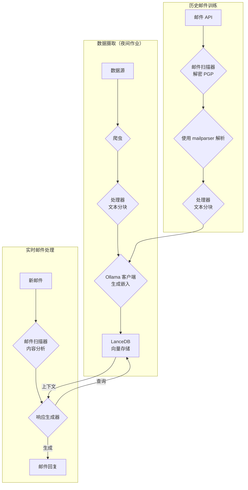
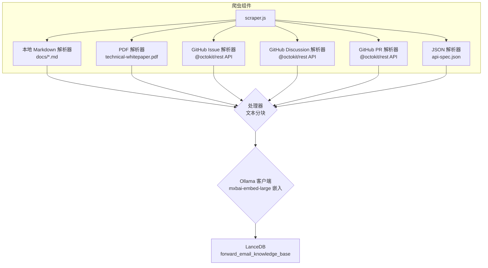
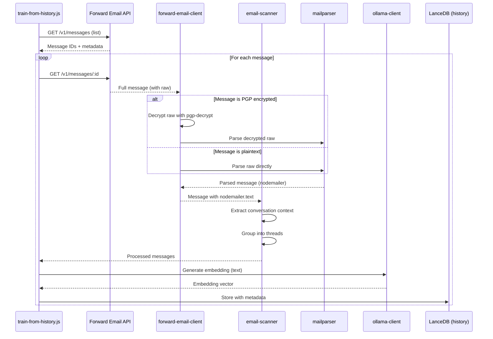

# 使用 LanceDB、Ollama 和 Node.js 构建隐私优先的 AI 客户支持代理 {#building-a-privacy-first-ai-customer-support-agent-with-lancedb-ollama-and-nodejs}


> \[!NOTE]
> 本文档介绍了我们构建自托管 AI 支持代理的历程。我们在[Email Startup Graveyard](https://forwardemail.net/blog/docs/email-startup-graveyard-why-80-percent-email-companies-fail)博客文章中也写过类似的挑战。我们曾认真考虑写一篇续作，名为“AI Startup Graveyard”，但也许得等 AI 泡沫可能破裂后的一两年再说（？）。目前，这篇文章是我们对有效方法、无效方法及其原因的头脑风暴总结。

这就是我们如何构建自己的 AI 客户支持代理。我们选择了艰难的路线：自托管、隐私优先，完全由我们掌控。为什么？因为我们不信任第三方服务处理客户数据。这是 GDPR 和 DPA 的要求，也是正确的做法。

这不是一个有趣的周末项目，而是一个历时一个月的旅程，期间我们经历了依赖破损、误导性文档以及 2025 年开源 AI 生态系统的混乱。本文档记录了我们构建的内容、构建原因以及遇到的障碍。


## 目录 {#table-of-contents}

* [客户收益：AI 增强的人类支持](#customer-benefits-ai-augmented-human-support)
  * [更快、更准确的响应](#faster-more-accurate-responses)
  * [持续一致且无倦怠](#consistency-without-burnout)
  * [您将获得](#what-you-get)
* [个人反思：二十年的磨砺](#a-personal-reflection-the-two-decade-grind)
* [隐私为何重要](#why-privacy-matters)
* [成本分析：云端 AI 与自托管](#cost-analysis-cloud-ai-vs-self-hosted)
  * [云端 AI 服务对比](#cloud-ai-service-comparison)
  * [成本细分：5GB 知识库](#cost-breakdown-5gb-knowledge-base)
  * [自托管硬件成本](#self-hosted-hardware-costs)
* [自用我们的 API](#dogfooding-our-own-api)
  * [为何自用很重要](#why-dogfooding-matters)
  * [API 使用示例](#api-usage-examples)
  * [性能优势](#performance-benefits)
* [加密架构](#encryption-architecture)
  * [第一层：邮箱加密（chacha20-poly1305）](#layer-1-mailbox-encryption-chacha20-poly1305)
  * [第二层：消息级 PGP 加密](#layer-2-message-level-pgp-encryption)
  * [为何这对训练很重要](#why-this-matters-for-training)
  * [存储安全](#storage-security)
  * [本地存储是标准做法](#local-storage-is-standard-practice)
* [架构设计](#the-architecture)
  * [高层流程](#high-level-flow)
  * [详细爬虫流程](#detailed-scraper-flow)
* [工作原理](#how-it-works)
  * [构建知识库](#building-the-knowledge-base)
  * [从历史邮件训练](#training-from-historical-emails)
  * [处理新邮件](#processing-incoming-emails)
  * [向量存储管理](#vector-store-management)
* [向量数据库坟场](#the-vector-database-graveyard)
* [系统需求](#system-requirements)
* [Cron 任务配置](#cron-job-configuration)
  * [环境变量](#environment-variables)
  * [多个邮箱的 Cron 任务](#cron-jobs-for-multiple-inboxes)
  * [Cron 计划详解](#cron-schedule-breakdown)
  * [动态日期计算](#dynamic-date-calculation)
  * [初始设置：从站点地图提取 URL 列表](#initial-setup-extract-url-list-from-sitemap)
  * [手动测试 Cron 任务](#testing-cron-jobs-manually)
  * [日志监控](#monitoring-logs)
* [代码示例](#code-examples)
  * [爬取与处理](#scraping-and-processing)
  * [从历史邮件训练](#training-from-historical-emails-1)
  * [上下文查询](#querying-for-context)
* [未来展望：垃圾邮件扫描研发](#the-future-spam-scanner-rd)
* [故障排除](#troubleshooting)
  * [向量维度不匹配错误](#vector-dimension-mismatch-error)
  * [知识库上下文为空](#empty-knowledge-base-context)
  * [PGP 解密失败](#pgp-decryption-failures)
* [使用技巧](#usage-tips)
  * [实现收件箱归零](#achieving-inbox-zero)
  * [使用 skip-ai 标签](#using-the-skip-ai-label)
  * [邮件线程与回复全部](#email-threading-and-reply-all)
  * [监控与维护](#monitoring-and-maintenance)
* [测试](#testing)
  * [运行测试](#running-tests)
  * [测试覆盖率](#test-coverage)
  * [测试环境](#test-environment)
* [关键要点](#key-takeaways)
## 客户利益：AI增强的人类支持 {#customer-benefits-ai-augmented-human-support}

我们的AI系统并不是取代我们的支持团队——而是让他们更出色。这对您意味着：

### 更快、更准确的响应 {#faster-more-accurate-responses}

**人机协作**：每个AI生成的草稿都会由我们的人类支持团队审核、编辑和策划后再发送给您。AI负责初步的研究和草拟，让我们的团队能够专注于质量控制和个性化服务。

**基于人类专业知识训练**：AI学习自：

* 我们手写的知识库和文档
* 人类撰写的博客文章和教程
* 我们全面的常见问题解答（由人类编写）
* 过去的客户对话（全部由真实人类处理）

您获得的是基于多年人类专业知识的响应，只是交付速度更快。

### 一致性且无倦怠 {#consistency-without-burnout}

我们的小团队每天处理数百个支持请求，每个请求都需要不同的技术知识和心理上下文切换：

* 账单问题需要财务系统知识
* DNS问题需要网络专业知识
* API集成需要编程知识
* 安全报告需要漏洞评估

没有AI辅助，这种持续的上下文切换会导致：

* 响应时间变慢
* 疲劳导致的人为错误
* 答案质量不一致
* 团队倦怠

**有了AI增强**，我们的团队：

* 响应更快（AI几秒内草拟）
* 错误更少（AI捕捉常见错误）
* 质量保持一致（AI每次都参考相同知识库）
* 保持清醒专注（减少研究时间，更多时间帮助客户）

### 您获得的价值 {#what-you-get}

✅ **速度**：AI几秒内草拟响应，人类几分钟内审核发送

✅ **准确性**：基于我们实际文档和过往解决方案的响应

✅ **一致性**：无论是上午9点还是晚上9点，答案质量始终如一

✅ **人性化**：每条回复都由我们的团队审核并个性化处理

✅ **无幻觉**：AI仅使用我们经过验证的知识库，不使用泛泛的互联网数据

> \[!NOTE]
> **您始终与人类交流**。AI是帮助我们团队更快找到正确答案的研究助手。可以把它想象成一位图书管理员，瞬间找到相关书籍——但仍由人类阅读并向您解释。

## 个人感悟：二十年的磨砺 {#a-personal-reflection-the-two-decade-grind}

在深入技术细节之前，先说点个人感受。我从事这行将近二十年。无尽的键盘敲击，无休止地追求解决方案，深度专注的磨砺——这就是构建任何有意义事物的现实。这是新技术炒作周期中常被忽略的现实。

最近AI的爆发尤其令人沮丧。我们被卖了一个自动化的梦想，AI助手将为我们编写代码、解决问题。现实呢？输出往往是垃圾代码，修复它所需的时间比从头写还多。让生活更轻松的承诺是虚假的。这是对艰苦必要构建工作的干扰。

还有开源贡献的两难境地。你已经疲惫不堪，被磨砺得筋疲力尽。你用AI帮忙写了一份详细且结构良好的bug报告，希望让维护者更容易理解和修复问题。结果呢？你被训斥。你的贡献被视为“离题”或“低质量”，正如我们在最近的[Node.js GitHub issue](https://github.com/nodejs/node/issues/60719#issuecomment-3534304321)中看到的。这对那些只是想帮忙的资深开发者来说是一记耳光。

这就是我们所处生态系统的现实。这不仅仅是工具破碎的问题；更是一个文化，常常不尊重贡献者的时间和[努力](https://forwardemail.net/blog/docs/how-npm-packages-billion-downloads-shaped-javascript-ecosystem)。这篇文章记录了这一现实。这是关于工具的故事，但更是关于在一个虽有承诺却根本破碎的生态系统中构建所付出的人类代价。
## 为什么隐私很重要 {#why-privacy-matters}

我们的[技术白皮书](https://forwardemail.net/technical-whitepaper.pdf)深入介绍了我们的隐私理念。简而言之：我们绝不将客户数据发送给第三方。永远不会。这意味着没有 OpenAI，没有 Anthropic，没有云托管的向量数据库。所有操作均在我们的基础设施本地运行。这是符合 GDPR 合规性和我们的 DPA 承诺的不可谈判条款。

## 成本分析：云端 AI 与自托管 {#cost-analysis-cloud-ai-vs-self-hosted}

在深入技术实现之前，让我们从成本角度谈谈为什么自托管很重要。云端 AI 服务的定价模型使其在高流量使用场景（如客户支持）中成本高昂，难以承受。

### 云端 AI 服务比较 {#cloud-ai-service-comparison}

| 服务           | 提供商              | 嵌入成本                                                        | LLM 成本（输入）                                                          | LLM 成本（输出）        | 隐私政策                                            | GDPR/DPA        | 托管地点          | 数据共享          |
| -------------- | ------------------- | ---------------------------------------------------------------- | -------------------------------------------------------------------------- | ----------------------- | --------------------------------------------------- | --------------- | ----------------- | ----------------- |
| **OpenAI**     | OpenAI（美国）      | [$0.02-0.13/百万令牌](https://openai.com/api/pricing/)           | $0.15-20/百万令牌                                                         | $0.60-80/百万令牌       | [链接](https://openai.com/policies/privacy-policy/) | 有限 DPA        | Azure（美国）     | 是（用于训练）    |
| **Claude**     | Anthropic（美国）   | 不适用                                                           | [$3-20/百万令牌](https://docs.claude.com/en/docs/about-claude/pricing)    | $15-80/百万令牌         | [链接](https://www.anthropic.com/legal/privacy)     | 有限 DPA        | AWS/GCP（美国）   | 否（声称）        |
| **Gemini**     | Google（美国）      | [$0.15/百万令牌](https://ai.google.dev/gemini-api/docs/pricing)  | $0.30-1.00/百万令牌                                                      | $2.50/百万令牌          | [链接](https://policies.google.com/privacy)         | 有限 DPA        | GCP（美国）       | 是（用于改进）    |
| **DeepSeek**   | DeepSeek（中国）    | 不适用                                                           | [$0.028-0.28/百万令牌](https://api-docs.deepseek.com/quick_start/pricing) | $0.42/百万令牌          | [链接](https://www.deepseek.com/en)                 | 未知            | 中国              | 未知              |
| **Mistral**    | Mistral AI（法国）  | [$0.10/百万令牌](https://mistral.ai/pricing)                     | $0.40/百万令牌                                                           | $2.00/百万令牌          | [链接](https://mistral.ai/terms/)                   | 欧盟 GDPR       | 欧盟              | 未知              |
| **自托管**     | 您                  | $0（现有硬件）                                                  | $0（现有硬件）                                                           | $0（现有硬件）          | 您的政策                                            | 完全合规        | MacBook M5 + cron | 从不              |

> \[!WARNING]
> **数据主权问题**：美国提供商（OpenAI、Claude、Gemini）受 CLOUD Act 约束，允许美国政府访问数据。DeepSeek（中国）受中国数据法律管辖。虽然 Mistral（法国）提供欧盟托管和 GDPR 合规，但自托管仍是实现完全数据主权和控制的唯一选择。

### 成本细分：5GB 知识库 {#cost-breakdown-5gb-knowledge-base}

让我们计算处理一个 5GB 知识库的成本（典型的中型公司文档、邮件和支持历史）。

**假设条件：**

* 5GB 文本 ≈ 12.5 亿令牌（假设约 4 字符/令牌）
* 初始嵌入生成
* 每月重新训练（完全重新嵌入）
* 每月 10,000 次支持查询
* 平均查询：500 令牌输入，300 令牌输出
**详细成本明细：**

| 组件                                   | OpenAI           | Claude          | Gemini               | 自托管             |
| -------------------------------------- | ---------------- | --------------- | -------------------- | ------------------ |
| **初始嵌入**（12.5亿令牌）             | $25,000          | 不适用          | $187,500             | $0                 |
| **每月查询**（10K × 800令牌）          | $1,200-16,000    | $2,400-16,000   | $2,400-3,200         | $0                 |
| **每月再训练**（12.5亿令牌）            | $25,000          | 不适用          | $187,500             | $0                 |
| **第一年总计**                         | $325,200-217,000 | $28,800-192,000 | $2,278,800-2,226,000 | ~ $60（电费）      |
| **隐私合规**                           | ❌ 有限          | ❌ 有限         | ❌ 有限              | ✅ 完全             |
| **数据主权**                           | ❌ 否            | ❌ 否           | ❌ 否                | ✅ 是               |

> \[!CAUTION]
> **Gemini 的嵌入成本极高**，为 $0.15/百万令牌。单个 5GB 知识库嵌入费用高达 $187,500。比 OpenAI 贵 37 倍，完全无法用于生产环境。

### 自托管硬件成本 {#self-hosted-hardware-costs}

我们的配置运行在已有硬件上：

* **硬件**：MacBook M5（已拥有，用于开发）
* **额外成本**：$0（使用现有硬件）
* **电费**：约 $5/月（估算）
* **第一年总计**：约 $60
* **持续费用**：$60/年

**投资回报率**：自托管几乎没有边际成本，因为我们使用的是现有的开发硬件。系统通过定时任务在非高峰时段运行。

## 自用我们的 API {#dogfooding-our-own-api}

我们做出的最重要的架构决策之一是让所有 AI 任务直接使用 [Forward Email API](https://forwardemail.net/email-api)。这不仅是良好实践，更是性能优化的驱动力。

### 为什么自用很重要 {#why-dogfooding-matters}

当我们的 AI 任务使用与客户相同的 API 端点时：

1. **性能瓶颈先影响我们** — 我们先感受到问题，客户才会受影响
2. **优化惠及所有人** — 对我们任务的改进自动提升客户体验
3. **真实环境测试** — 我们的任务处理数千封邮件，持续进行负载测试
4. **代码复用** — 共享认证、速率限制、错误处理和缓存逻辑

### API 使用示例 {#api-usage-examples}

**列出消息（train-from-history.js）：**

```javascript
// 使用 GET /v1/messages?folder=INBOX 搭配 BasicAuth
// 排除 eml、raw、nodemailer 以减少响应大小（只需 ID）
const response = await axios.get(
  `${this.apiBase}/v1/messages`,
  {
    params: {
      folder: 'INBOX',
      limit: 100,
      eml: false,
      raw: false,
      nodemailer: false
    },
    auth: {
      username: process.env.FORWARD_EMAIL_ALIAS_USERNAME,
      password: process.env.FORWARD_EMAIL_ALIAS_PASSWORD
    }
  }
);

const messages = response.data;
// 返回：[{ id, subject, date, ... }, ...]
// 完整消息内容稍后通过 GET /v1/messages/:id 获取
```

**获取完整消息（forward-email-client.js）：**

```javascript
// 使用 GET /v1/messages/:id 获取带原始内容的完整消息
const response = await axios.get(
  `${this.apiBase}/v1/messages/${messageId}`,
  {
    auth: {
      username: this.aliasUsername,
      password: this.aliasPassword
    }
  }
);

const message = response.data;
// 返回：{ id, subject, raw, eml, nodemailer: { ... }, ... }
```

**创建草稿回复（process-inbox.js）：**

```javascript
// 使用 POST /v1/messages 创建草稿回复
const response = await axios.post(
  `${this.apiBase}/v1/messages`,
  {
    folder: 'Drafts',
    subject: `Re: ${originalSubject}`,
    to: senderEmail,
    text: generatedResponse,
    inReplyTo: originalMessageId
  },
  {
    auth: {
      username: process.env.FORWARD_EMAIL_ALIAS_USERNAME,
      password: process.env.FORWARD_EMAIL_ALIAS_PASSWORD
    }
  }
);
```
### 性能优势 {#performance-benefits}

因为我们的 AI 任务运行在相同的 API 基础设施上：

* **缓存优化** 既惠及任务也惠及客户
* **速率限制** 在真实负载下经过测试
* **错误处理** 经受了实战考验
* **API 响应时间** 持续监控
* **数据库查询** 针对两种用例进行了优化
* **带宽优化** - 列出时排除 `eml`、`raw`、`nodemailer` 可减少约 90% 的响应大小

当 `train-from-history.js` 处理 1,000 封邮件时，会发出 1,000+ 次 API 调用。API 中的任何低效都会立即显现。这迫使我们优化 IMAP 访问、数据库查询和响应序列化——这些改进直接惠及我们的客户。

**优化示例**：列出 100 条消息并包含完整内容 = 约 10MB 响应。使用 `eml: false, raw: false, nodemailer: false` 列出 = 约 100KB 响应（小 100 倍）。


## 加密架构 {#encryption-architecture}

我们的邮件存储使用多层加密，AI 任务必须实时解密以进行训练。

### 第一层：邮箱加密（chacha20-poly1305） {#layer-1-mailbox-encryption-chacha20-poly1305}

所有 IMAP 邮箱均以 SQLite 数据库形式存储，并使用 **chacha20-poly1305** 加密，这是一种量子安全加密算法。详情见我们的[量子安全加密邮件服务博客文章](https://forwardemail.net/blog/docs/best-quantum-safe-encrypted-email-service)。

**关键特性：**

* **算法**：ChaCha20-Poly1305（AEAD 密码）
* **量子安全**：抗量子计算攻击
* **存储**：磁盘上的 SQLite 数据库文件
* **访问**：通过 IMAP/API 访问时内存中解密

### 第二层：消息级 PGP 加密 {#layer-2-message-level-pgp-encryption}

许多支持邮件额外使用 PGP（OpenPGP 标准）加密。AI 任务必须解密这些邮件以提取内容进行训练。

**解密流程：**

```javascript
// 1. API 返回带加密原始内容的消息
const message = await forwardEmailClient.getMessage(id);

// 2. 检查原始内容是否为 PGP 加密
if (isMessageEncrypted(message.raw)) {
  // 3. 使用我们的私钥解密
  const decryptedRaw = await pgpDecrypt(message.raw);

  // 4. 解析解密后的 MIME 消息
  const parsed = await simpleParser(decryptedRaw);

  // 5. 用解密内容填充 nodemailer
  message.nodemailer = {
    text: parsed.text,
    html: parsed.html,
    from: parsed.from,
    to: parsed.to,
    subject: parsed.subject,
    date: parsed.date
  };
}
```

**PGP 配置：**

```bash
# 解密用私钥（ASCII 装甲密钥文件路径）
GPG_SECURITY_KEY="/path/to/private-key.asc"

# 私钥密码（如果加密）
GPG_SECURITY_PASSPHRASE="your-passphrase"
```

`pgp-decrypt.js` 辅助工具：

1. 从磁盘读取私钥一次（内存缓存）
2. 使用密码解密私钥
3. 使用解密后的密钥解密所有消息
4. 支持递归解密嵌套加密消息

### 这对训练的重要性 {#why-this-matters-for-training}

如果没有正确解密，AI 会在加密乱码上训练：

```
-----BEGIN PGP MESSAGE-----
Version: OpenPGP.js v4.10.10

wcBMA8Z3lHJnFnNUAQgAqK7F8...
-----END PGP MESSAGE-----
```

解密后，AI 在真实内容上训练：

```
Subject: Re: Bug Report

Hi John,

Thanks for reporting this issue. I've confirmed the bug
and created a fix in PR #1234...
```

### 存储安全 {#storage-security}

解密在任务执行时内存中完成，解密内容转换为嵌入向量后存储在磁盘上的 LanceDB 向量数据库中。

**数据存放位置：**

* **向量数据库**：存储在加密的 MacBook M5 工作站上
* **物理安全**：工作站始终由我们保管（不在数据中心）
* **磁盘加密**：所有工作站均启用全盘加密
* **网络安全**：防火墙保护，隔离于公共网络

**未来数据中心部署：**
如果我们迁移到数据中心托管，服务器将具备：

* LUKS 全盘加密
* 禁用 USB 访问
* 物理安全措施
* 网络隔离
有关我们安全实践的完整详情，请参见我们的[安全页面](https://forwardemail.net/en/security)。

> \[!NOTE]
> 向量数据库包含的是嵌入（数学表示），而非原始明文。然而，嵌入有可能被逆向工程，这就是为什么我们将它们保存在加密的、物理安全的工作站上。

### 本地存储是标准做法 {#local-storage-is-standard-practice}

在我们团队的工作站上存储嵌入，与我们已经处理电子邮件的方式没有区别：

* **Thunderbird**：下载并将完整邮件内容本地存储在 mbox/maildir 文件中
* **Webmail 客户端**：在浏览器存储和本地数据库中缓存邮件数据
* **IMAP 客户端**：维护消息的本地副本以便离线访问
* **我们的 AI 系统**：在 LanceDB 中存储数学嵌入（非明文）

关键区别是：嵌入比明文邮件**更安全**，因为它们是：

1. 数学表示，而非可读文本
2. 比明文更难被逆向工程
3. 仍然受与我们的邮件客户端相同的物理安全保护

如果团队可以接受在加密工作站上使用 Thunderbird 或 Webmail，那么以同样方式存储嵌入也是可以接受的（甚至可以说更安全）。


## 架构 {#the-architecture}

这是基本流程。看起来很简单，但其实不然。

> \[!NOTE]
> 所有作业都直接使用 Forward Email API，确保性能优化同时惠及我们的 AI 系统和客户。

### 高级流程 {#high-level-flow}



### 详细爬虫流程 {#detailed-scraper-flow}

`scraper.js` 是数据摄取的核心。它是针对不同数据格式的解析器集合。




## 工作原理 {#how-it-works}

该流程分为三大部分：构建知识库、从历史邮件训练、处理新邮件。

### 构建知识库 {#building-the-knowledge-base}

**`update-knowledge-base.js`**：这是主要作业。它每晚运行，清空旧的向量存储，并从头重建。它使用 `scraper.js` 从所有来源获取内容，`processor.js` 进行文本分块，`ollama-client.js` 生成嵌入。最后，`vector-store.js` 将所有内容存储到 LanceDB。

**数据来源：**

* 本地 Markdown 文件（`docs/*.md`）
* 技术白皮书 PDF（`assets/technical-whitepaper.pdf`）
* API 规范 JSON（`assets/api-spec.json`）
* GitHub issues（通过 Octokit）
* GitHub discussions（通过 Octokit）
* GitHub pull requests（通过 Octokit）
* 网站地图 URL 列表（`$LANCEDB_PATH/valid-urls.json`）

### 从历史邮件训练 {#training-from-historical-emails}

**`train-from-history.js`**：该作业扫描所有文件夹中的历史邮件，解密 PGP 加密的消息，并将它们添加到单独的向量存储（`customer_support_history`）中。这为过去的支持交互提供上下文。
**电子邮件处理流程：**



**主要功能：**

* **PGP 解密**：使用带有 `GPG_SECURITY_KEY` 环境变量的 `pgp-decrypt.js` 辅助工具
* **线程分组**：将相关邮件分组为会话线程
* **元数据保留**：存储文件夹、主题、日期、加密状态
* **回复上下文**：将邮件与其回复关联以获得更好的上下文

**配置：**

```bash
# train-from-history 的环境变量
HISTORY_SCAN_LIMIT=1000              # 最大处理邮件数
HISTORY_SCAN_SINCE="2024-01-01"      # 仅处理此日期之后的邮件
HISTORY_DECRYPT_PGP=true             # 尝试 PGP 解密
GPG_SECURITY_KEY="/path/to/key.asc"  # PGP 私钥路径
GPG_SECURITY_PASSPHRASE="passphrase" # 密钥密码（可选）
```

**存储内容：**

```javascript
{
  type: 'historical_email',
  folder: 'INBOX',
  subject: 'Re: Bug Report',
  date: '2025-01-15T10:30:00Z',
  messageId: '67e2f288893921...',
  threadId: 'Bug Report',
  hasReply: true,
  encrypted: true,
  decrypted: true,
  replySubject: 'Bug Report',
  replyText: 'First 500 chars of reply...',
  chunkSize: 1000,
  chunkOverlap: 200,
  chunkIndex: 0
}
```

> \[!TIP]
> 在初始设置后运行 `train-from-history` 以填充历史上下文。通过学习过去的支持交互，这将显著提升响应质量。

### 处理收件箱邮件 {#processing-incoming-emails}

**`process-inbox.js`**：此任务处理我们 `support@forwardemail.net`、`abuse@forwardemail.net` 和 `security@forwardemail.net` 邮箱中的邮件（具体为 `INBOX` IMAP 文件夹路径）。它利用我们的 API <https://forwardemail.net/email-api>（例如使用 BasicAuth 访问每个邮箱的 `GET /v1/messages?folder=INBOX`）。它分析邮件内容，查询知识库（`forward_email_knowledge_base`）和历史邮件向量存储（`customer_support_history`），然后将合并的上下文传递给 `response-generator.js`。生成器通过 Ollama 使用 `mxbai-embed-large` 来生成回复。

**自动化工作流功能：**

1. **收件箱归零自动化**：成功创建草稿后，原始邮件会自动移动到归档文件夹。这样保持收件箱整洁，帮助实现收件箱归零，无需手动操作。

2. **跳过 AI 处理**：只需给任何邮件添加 `skip-ai` 标签（不区分大小写）即可阻止 AI 处理。邮件将保持在收件箱中，允许您手动处理。适用于敏感邮件或需要人工判断的复杂情况。

3. **正确的邮件线程**：所有草稿回复均包含原始邮件引用（使用标准的 ` >  ` 前缀），遵循邮件回复惯例，格式为“On \[date], \[sender] wrote:”。确保邮件客户端中的会话上下文和线程正确。

4. **回复全部行为**：系统自动处理 Reply-To 头和抄送收件人：
   * 如果存在 Reply-To 头，则其为收件人地址，原始发件人加入抄送
   * 所有原始收件人和抄送均包含在回复抄送中（不包括您自己的地址）
   * 遵循群组会话的标准邮件回复全部惯例
**来源排名**：系统使用**加权排名**来优先考虑来源：

* 常见问题解答：100%（最高优先级）
* 技术白皮书：95%
* API 规范：90%
* 官方文档：85%
* GitHub 问题：70%
* 历史邮件：50%

### 向量存储管理 {#vector-store-management}

`helpers/customer-support-ai/vector-store.js` 中的 `VectorStore` 类是我们与 LanceDB 的接口。

**添加文档：**

```javascript
// vector-store.js
async addDocument(text, metadata) {
  const embedding = await this.ollama.generateEmbedding(text);
  await this.table.add([{
    vector: embedding,
    text,
    ...metadata
  }]);
}
```

**清空存储：**

```javascript
// 选项 1：使用 clear() 方法
await vectorStore.clear();

// 选项 2：删除本地数据库目录
await fs.rm(process.env.LANCEDB_PATH, { recursive: true, force: true });
```

`LANCEDB_PATH` 环境变量指向本地嵌入式数据库目录。LanceDB 是无服务器且嵌入式的，因此没有单独的进程需要管理。


## 向量数据库坟场 {#the-vector-database-graveyard}

这是第一个重大障碍。我们尝试了多个向量数据库，最终选择了 LanceDB。以下是每个数据库出现的问题。

| 数据库       | GitHub                                                      | 出现的问题                                                                                                                                                                                                          | 具体问题                                                                                                                                                                                                                                                                                                                                                                 | 安全隐患                                                                                                                                                                                                        |
| ------------ | ----------------------------------------------------------- | ------------------------------------------------------------------------------------------------------------------------------------------------------------------------------------------------------------------ | ------------------------------------------------------------------------------------------------------------------------------------------------------------------------------------------------------------------------------------------------------------------------------------------------------------------------------------------------------------------------- | ---------------------------------------------------------------------------------------------------------------------------------------------------------------------------------------------------------------- |
| **ChromaDB** | [chroma-core/chroma](https://github.com/chroma-core/chroma) | `pip3 install chromadb` 会安装一个非常老旧的版本，导致 `PydanticImportError`。唯一可用的方式是从源码编译。不适合开发者使用。                                                                                     | Python 依赖混乱。多个用户报告 pip 安装失败 ([#774](https://github.com/chroma-core/chroma/issues/774), [#163](https://github.com/chroma-core/chroma/issues/163))。文档建议“直接用 Docker”，对本地开发无帮助。Windows 上记录数超过 99 条时崩溃 ([#3058](https://github.com/chroma-core/chroma/issues/3058))。                                                                 | **CVE-2024-45848**：通过 MindsDB 集成的 ChromaDB 存在任意代码执行漏洞。Docker 镜像存在严重操作系统漏洞 ([#3170](https://github.com/chroma-core/chroma/issues/3170))。                      |
| **Qdrant**   | [qdrant/qdrant](https://github.com/qdrant/qdrant)           | 旧文档中提到的 Homebrew tap (`qdrant/qdrant/qdrant`) 已经消失，无任何说明。官方文档现在只建议“使用 Docker”。                                                                                                   | 缺少 Homebrew tap。无原生 macOS 二进制文件。仅支持 Docker，阻碍快速本地测试。                                                                                                                                                                                                                                                                                           | **CVE-2024-2221**：任意文件上传漏洞导致远程代码执行（v1.9.0 修复）。[IronCore Labs](https://ironcorelabs.com/vectordbs/qdrant-security/) 给出较弱的安全成熟度评分。                           |
| **Weaviate** | [weaviate/weaviate](https://github.com/weaviate/weaviate)   | Homebrew 版本存在严重集群错误（`leader not found`）。文档中修复该问题的参数（`RAFT_JOIN`、`CLUSTER_HOSTNAME`）无效。单节点部署根本无法正常使用。                                                               | 即使是单节点模式也存在集群错误。对简单用例来说设计过于复杂。                                                                                                                                                                                                                                                                                                           | 未发现重大 CVE，但复杂性增加了攻击面。                                                                                                                                                                        |
| **LanceDB**  | [lancedb/lancedb](https://github.com/lancedb/lancedb)       | 这个可用。它是嵌入式且无服务器的，无需单独进程。唯一的麻烦是包命名混乱（`vectordb` 已弃用，改用 `@lancedb/lancedb`）且文档分散。但我们可以接受。                                                               | 包命名混乱（`vectordb` 与 `@lancedb/lancedb`），但整体稳定。嵌入式架构消除了整类安全问题。                                                                                                                                                                                                                                                                                 | 无已知 CVE。嵌入式设计意味着无网络攻击面。                                                                                                                                                                  |
> \[!WARNING]
> **ChromaDB 存在严重的安全漏洞。** [CVE-2024-45848](https://nvd.nist.gov/vuln/detail/CVE-2024-45848) 允许任意代码执行。pip 安装因 Pydantic 依赖问题根本无法正常使用。避免用于生产环境。

> \[!WARNING]
> **Qdrant 曾存在文件上传远程代码执行漏洞** ([CVE-2024-2221](https://qdrant.tech/blog/cve-2024-2221-response/))，仅在 v1.9.0 版本中修复。如果必须使用 Qdrant，请确保使用最新版本。

> \[!CAUTION]
> 开源向量数据库生态尚不成熟。不要完全信任文档。假设一切都有问题，除非被证明不是。请在本地测试后再确定使用的技术栈。


## 系统要求 {#system-requirements}

* **Node.js:** v18.0.0+ ([GitHub](https://github.com/nodejs/node))
* **Ollama:** 最新版本 ([GitHub](https://github.com/ollama/ollama))
* **模型:** 通过 Ollama 使用 `mxbai-embed-large`
* **向量数据库:** LanceDB ([GitHub](https://github.com/lancedb/lancedb))
* **GitHub 访问:** 使用 `@octokit/rest` 抓取 issues ([GitHub](https://github.com/octokit/rest.js))
* **SQLite:** 作为主数据库（通过 `mongoose-to-sqlite`）


## 定时任务配置 {#cron-job-configuration}

所有 AI 任务均通过 MacBook M5 上的 cron 运行。以下是如何设置定时任务以在午夜运行多个邮箱的说明。

### 环境变量 {#environment-variables}

任务需要以下环境变量。大多数可以在 `.env` 文件中设置（通过 `@ladjs/env` 加载），但 `HISTORY_SCAN_SINCE` 必须在 crontab 中动态计算。

**在 `.env` 文件中：**

```bash
# Forward Email API 凭据（每个邮箱不同）
FORWARD_EMAIL_ALIAS_USERNAME=support@forwardemail.net
FORWARD_EMAIL_ALIAS_PASSWORD=your-imap-password

# PGP 解密（所有邮箱共用）
GPG_SECURITY_KEY=/path/to/private-key.asc
GPG_SECURITY_PASSPHRASE=your-passphrase

# 历史扫描配置
HISTORY_SCAN_LIMIT=1000

# LanceDB 路径
LANCEDB_PATH=/path/to/lancedb
```

**在 crontab 中（动态计算）：**

```bash
# HISTORY_SCAN_SINCE 必须在 crontab 中内联设置，使用 shell 日期计算
# 不能放在 .env 文件中，因为 @ladjs/env 不会执行 shell 命令
HISTORY_SCAN_SINCE="$(date -v-1d +%Y-%m-%d)"  # macOS
HISTORY_SCAN_SINCE="$(date -d 'yesterday' +%Y-%m-%d)"  # Linux
```

### 多邮箱定时任务 {#cron-jobs-for-multiple-inboxes}

使用 `crontab -e` 编辑你的 crontab 并添加：

```bash
# 更新知识库（运行一次，所有邮箱共享）
0 0 * * * cd /path/to/forwardemail.net && LANCEDB_PATH="/path/to/lancedb" GPG_SECURITY_KEY="/path/to/key.asc" GPG_SECURITY_PASSPHRASE="pass" node jobs/customer-support-ai/update-knowledge-base.js >> /var/log/update-knowledge-base.log 2>&1

# 从历史训练 - support@forwardemail.net
0 0 * * * cd /path/to/forwardemail.net && FORWARD_EMAIL_ALIAS_USERNAME="support@forwardemail.net" FORWARD_EMAIL_ALIAS_PASSWORD="support-password" HISTORY_SCAN_SINCE="$(date -v-1d +%Y-%m-%d)" HISTORY_SCAN_LIMIT=1000 GPG_SECURITY_KEY="/path/to/key.asc" GPG_SECURITY_PASSPHRASE="pass" LANCEDB_PATH="/path/to/lancedb" node jobs/customer-support-ai/train-from-history.js >> /var/log/train-support.log 2>&1

# 从历史训练 - abuse@forwardemail.net
0 0 * * * cd /path/to/forwardemail.net && FORWARD_EMAIL_ALIAS_USERNAME="abuse@forwardemail.net" FORWARD_EMAIL_ALIAS_PASSWORD="abuse-password" HISTORY_SCAN_SINCE="$(date -v-1d +%Y-%m-%d)" HISTORY_SCAN_LIMIT=1000 GPG_SECURITY_KEY="/path/to/key.asc" GPG_SECURITY_PASSPHRASE="pass" LANCEDB_PATH="/path/to/lancedb" node jobs/customer-support-ai/train-from-history.js >> /var/log/train-abuse.log 2>&1

# 从历史训练 - security@forwardemail.net
0 0 * * * cd /path/to/forwardemail.net && FORWARD_EMAIL_ALIAS_USERNAME="security@forwardemail.net" FORWARD_EMAIL_ALIAS_PASSWORD="security-password" HISTORY_SCAN_SINCE="$(date -v-1d +%Y-%m-%d)" HISTORY_SCAN_LIMIT=1000 GPG_SECURITY_KEY="/path/to/key.asc" GPG_SECURITY_PASSPHRASE="pass" LANCEDB_PATH="/path/to/lancedb" node jobs/customer-support-ai/train-from-history.js >> /var/log/train-security.log 2>&1

# 处理收件箱 - support@forwardemail.net
*/5 * * * * cd /path/to/forwardemail.net && FORWARD_EMAIL_ALIAS_USERNAME="support@forwardemail.net" FORWARD_EMAIL_ALIAS_PASSWORD="support-password" GPG_SECURITY_KEY="/path/to/key.asc" GPG_SECURITY_PASSPHRASE="pass" LANCEDB_PATH="/path/to/lancedb" node jobs/customer-support-ai/process-inbox.js >> /var/log/process-support.log 2>&1

# 处理收件箱 - abuse@forwardemail.net
*/5 * * * * cd /path/to/forwardemail.net && FORWARD_EMAIL_ALIAS_USERNAME="abuse@forwardemail.net" FORWARD_EMAIL_ALIAS_PASSWORD="abuse-password" GPG_SECURITY_KEY="/path/to/key.asc" GPG_SECURITY_PASSPHRASE="pass" LANCEDB_PATH="/path/to/lancedb" node jobs/customer-support-ai/process-inbox.js >> /var/log/process-abuse.log 2>&1

# 处理收件箱 - security@forwardemail.net
*/5 * * * * cd /path/to/forwardemail.net && FORWARD_EMAIL_ALIAS_USERNAME="security@forwardemail.net" FORWARD_EMAIL_ALIAS_PASSWORD="security-password" GPG_SECURITY_KEY="/path/to/key.asc" GPG_SECURITY_PASSPHRASE="pass" LANCEDB_PATH="/path/to/lancedb" node jobs/customer-support-ai/process-inbox.js >> /var/log/process-security.log 2>&1
```
### Cron 计划详解 {#cron-schedule-breakdown}

| 任务                      | 计划          | 描述                                                                                 |
| ------------------------- | ------------- | ------------------------------------------------------------------------------------ |
| `train-from-sitemap.js`   | `0 0 * * 0`   | 每周（周日午夜）- 从网站地图获取所有 URL 并训练知识库                                  |
| `train-from-history.js`   | `0 0 * * *`   | 每日午夜 - 扫描前一天每个收件箱的邮件                                                |
| `process-inbox.js`        | `*/5 * * * *` | 每 5 分钟 - 处理新邮件并生成草稿                                                     |

### 动态日期计算 {#dynamic-date-calculation}

`HISTORY_SCAN_SINCE` 变量 **必须在 crontab 中内联计算**，原因如下：

1. `.env` 文件被 `@ladjs/env` 读取为字面字符串
2. Shell 命令替换 `$(...)` 在 `.env` 文件中无效
3. 日期需要在每次 cron 运行时动态计算

**正确做法（在 crontab 中）：**

```bash
# macOS (BSD date)
HISTORY_SCAN_SINCE="$(date -v-1d +%Y-%m-%d)" node jobs/...

# Linux (GNU date)
HISTORY_SCAN_SINCE="$(date -d 'yesterday' +%Y-%m-%d)" node jobs/...
```

**错误做法（在 .env 中无效）：**

```bash
# 这将被读取为字面字符串 "$(date -v-1d +%Y-%m-%d)"
# 不会作为 shell 命令执行
HISTORY_SCAN_SINCE=$(date -v-1d +%Y-%m-%d)
```

这样确保每次夜间运行时动态计算前一天的日期，避免重复工作。

### 初始设置：从网站地图提取 URL 列表 {#initial-setup-extract-url-list-from-sitemap}

在首次运行 process-inbox 任务之前，**必须**从网站地图提取 URL 列表。这样可以创建一个 LLM 可引用的有效 URL 字典，防止 URL 幻觉。

```bash
# 首次设置：从网站地图提取 URL 列表
cd /path/to/forwardemail.net
node jobs/customer-support-ai/train-from-sitemap.js
```

**此操作会：**

1. 获取 <https://forwardemail.net/sitemap.xml> 中的所有 URL
2. 过滤仅保留非本地化 URL 或 /en/ URL（避免重复内容）
3. 去除语言前缀（/en/faq → /faq）
4. 将 URL 列表保存为简单的 JSON 文件，路径为 `$LANCEDB_PATH/valid-urls.json`
5. 不进行爬取或元数据抓取，仅生成有效 URL 的平面列表

**重要性：**

* 防止 LLM 幻觉生成诸如 `/dashboard` 或 `/login` 的虚假 URL
* 为响应生成器提供有效 URL 白名单以供参考
* 简单快速，无需向量数据库存储
* 响应生成器启动时加载此列表并包含在提示中

**添加到 crontab 以实现每周更新：**

```bash
# 每周周日午夜从网站地图提取 URL 列表
0 0 * * 0 cd /path/to/forwardemail.net && node jobs/customer-support-ai/train-from-sitemap.js >> /var/log/train-sitemap.log 2>&1
```

### 手动测试 Cron 任务 {#testing-cron-jobs-manually}

在添加到 cron 之前测试任务：

```bash
# 测试网站地图训练
cd /path/to/forwardemail.net
export LANCEDB_PATH="/path/to/lancedb"
node jobs/customer-support-ai/train-from-sitemap.js

# 测试支持收件箱训练
cd /path/to/forwardemail.net
export FORWARD_EMAIL_ALIAS_USERNAME="support@forwardemail.net"
export FORWARD_EMAIL_ALIAS_PASSWORD="support-password"
export HISTORY_SCAN_SINCE="$(date -v-1d +%Y-%m-%d)"
export HISTORY_SCAN_LIMIT=1000
export GPG_SECURITY_KEY="/path/to/key.asc"
export GPG_SECURITY_PASSPHRASE="pass"
export LANCEDB_PATH="/path/to/lancedb"
node jobs/customer-support-ai/train-from-history.js
```

### 监控日志 {#monitoring-logs}

每个任务都会记录到单独的文件，方便调试：

```bash
# 实时查看支持收件箱处理日志
tail -f /var/log/process-support.log

# 查看昨晚的训练运行日志
cat /var/log/train-support.log | grep "$(date -v-1d +%Y-%m-%d)"

# 查看所有任务的错误日志
grep -i error /var/log/train-*.log /var/log/process-*.log
```

> \[!TIP]
> 为每个收件箱使用单独的日志文件以隔离问题。如果某个收件箱出现认证问题，不会影响其他收件箱的日志。
## 代码示例 {#code-examples}

### 抓取与处理 {#scraping-and-processing}

```javascript
// jobs/customer-support-ai/update-knowledge-base.js
const scraper = new Scraper();
const processor = new Processor();
const ollamaClient = new OllamaClient();
const vectorStore = new VectorStore();

// 清除旧数据
await vectorStore.clear();

// 抓取所有来源
const documents = await scraper.scrapeAll();
console.log(`抓取了 ${documents.length} 个文档`);

// 处理成块
const allChunks = [];
for (const doc of documents) {
  const chunks = processor.processDocuments([doc]);
  allChunks.push(...chunks);
}
console.log(`生成了 ${allChunks.length} 个块`);

// 生成嵌入并存储
const texts = allChunks.map(chunk => chunk.text);
const embeddings = await ollamaClient.generateEmbeddings(texts);

for (let i = 0; i < allChunks.length; i++) {
  await vectorStore.addDocument(texts[i], {
    ...allChunks[i].metadata,
    embedding: embeddings[i]
  });
}
```

### 从历史邮件训练 {#training-from-historical-emails-1}

```javascript
// jobs/customer-support-ai/train-from-history.js
const scanner = new EmailScanner({
  forwardEmailApiBase: config.forwardEmailApiBase,
  forwardEmailAliasUsername: config.forwardEmailAliasUsername,
  forwardEmailAliasPassword: config.forwardEmailAliasPassword
});

const vectorStore = new VectorStore({
  collectionName: 'customer_support_history'
});

// 扫描所有文件夹（收件箱、已发送邮件等）
const messages = await scanner.scanAllFolders({
  limit: 1000,
  since: new Date('2024-01-01'),
  decryptPGP: true
});

// 分组为对话线程
const threads = scanner.groupIntoThreads(messages);

// 处理每个线程
for (const thread of threads) {
  const context = scanner.extractConversationContext(thread);

  for (const message of context.messages) {
    // 跳过无法解密的加密邮件
    if (message.encrypted && !message.decrypted) continue;

    // 使用 nodemailer 已解析的内容
    const text = message.nodemailer?.text || '';
    if (!text.trim()) continue;

    // 分块并存储
    const chunks = processor.chunkText(`主题: ${message.subject}\n\n${text}`, {
      chunkSize: 1000,
      chunkOverlap: 200
    });

    for (const chunk of chunks) {
      await vectorStore.addDocument(chunk.text, {
        type: 'historical_email',
        folder: message.folder,
        subject: message.subject,
        date: message.nodemailer?.date || message.created_at,
        messageId: message.id,
        threadId: context.subject,
        encrypted: message.encrypted || false,
        decrypted: message.decrypted || false,
        ...chunk.metadata
      });
    }
  }
}
```

### 查询上下文 {#querying-for-context}

```javascript
// jobs/customer-support-ai/process-inbox.js
const vectorStore = new VectorStore();
const historyVectorStore = new VectorStore({
  collectionName: 'customer_support_history'
});

// 查询两个存储
const knowledgeContext = await vectorStore.query(emailEmbedding, { limit: 8 });
const historyContext = await historyVectorStore.query(emailEmbedding, { limit: 3 });

// 在这里进行加权排名和去重
const rankedContext = rankAndDeduplicateContext(knowledgeContext, historyContext);

// 生成回复
const response = await responseGenerator.generate(email, rankedContext);
```


## 未来展望：垃圾邮件扫描器研发 {#the-future-spam-scanner-rd}

整个项目不仅仅是为了客户支持。这是一次研发。我们现在可以将关于本地嵌入、向量存储和上下文检索的所有经验应用到我们的下一个大项目：[Spam Scanner](https://spamscanner.net) 的大语言模型层。隐私、自托管和语义理解的原则将是关键。


## 故障排除 {#troubleshooting}

### 向量维度不匹配错误 {#vector-dimension-mismatch-error}

**错误：**

```
Error: Failed to execute query stream: GenericFailure, Invalid input, No vector column found to match with the query vector dimension: 1024
```

**原因：** 当你切换嵌入模型（例如，从 `mistral-small` 切换到 `mxbai-embed-large`）但现有的 LanceDB 数据库是用不同的向量维度创建时，会出现此错误。
**解决方案：** 您需要使用新的嵌入模型重新训练知识库：

```bash
# 1. 停止所有正在运行的客户支持 AI 任务
pkill -f customer-support-ai

# 2. 删除现有的 LanceDB 数据库
rm -rf ~/.local/share/lancedb/forward_email_knowledge_base.lance
rm -rf ~/.local/share/lancedb/customer_support_history.lance

# 3. 验证 .env 中嵌入模型设置是否正确
grep OLLAMA_EMBEDDING_MODEL .env
# 应显示：OLLAMA_EMBEDDING_MODEL=mxbai-embed-large

# 4. 在 Ollama 中拉取嵌入模型
ollama pull mxbai-embed-large

# 5. 重新训练知识库
node jobs/customer-support-ai/train-from-history.js

# 6. 通过 Bree 重启 process-inbox 任务
# 该任务将自动每 5 分钟运行一次
```

**为什么会发生这种情况：** 不同的嵌入模型会生成不同维度的向量：

* `mistral-small`：1024 维
* `mxbai-embed-large`：1024 维
* `nomic-embed-text`：768 维
* `all-minilm`：384 维

LanceDB 会在表结构中存储向量维度。当您用不同维度查询时，会失败。唯一的解决方案是用新模型重新创建数据库。

### 空知识库上下文 {#empty-knowledge-base-context}

**症状：**

```
debug     Retrieved knowledge base context {
  total: 0,
  afterRanking: 0,
  questionType: 'capability'
}
```

**原因：** 知识库尚未训练，或者 LanceDB 表不存在。

**解决方案：** 运行训练任务以填充知识库：

```bash
# 从历史邮件训练
node jobs/customer-support-ai/train-from-history.js

# 或从网站/文档训练（如果您有爬虫）
node jobs/customer-support-ai/train-from-website.js
```

### PGP 解密失败 {#pgp-decryption-failures}

**症状：** 消息显示为加密状态，但内容为空。

**解决方案：**

1. 验证 GPG 密钥路径设置正确：

```bash
grep GPG_SECURITY_KEY .env
# 应指向您的私钥文件
```

2. 手动测试解密：

```bash
node -e "const decrypt = require('./helpers/customer-support-ai/pgp-decrypt'); decrypt.testDecryption();"
```

3. 检查密钥权限：

```bash
ls -la /path/to/your/gpg-key.asc
# 应该对运行任务的用户可读
```


## 使用技巧 {#usage-tips}

### 实现收件箱归零 {#achieving-inbox-zero}

系统设计旨在帮助您自动实现收件箱归零：

1. **自动归档**：当草稿成功创建后，原始邮件会自动移动到归档文件夹。这样无需手动操作即可保持收件箱整洁。

2. **审查草稿**：定期检查草稿文件夹，查看 AI 生成的回复。发送前可根据需要编辑。

3. **手动覆盖**：对于需要特别关注的邮件，只需在任务运行前添加 `skip-ai` 标签。

### 使用 skip-ai 标签 {#using-the-skip-ai-label}

防止特定邮件被 AI 处理：

1. **添加标签**：在您的邮件客户端中，给任意邮件添加 `skip-ai` 标签/标记（不区分大小写）
2. **邮件保留在收件箱**：该邮件不会被处理或归档
3. **手动处理**：您可以自行回复，无需 AI 干预

**何时使用 skip-ai：**

* 敏感或机密邮件
* 需要人工判断的复杂情况
* 来自 VIP 客户的邮件
* 法律或合规相关咨询
* 需要立即人工关注的邮件

### 邮件线程和回复全部 {#email-threading-and-reply-all}

系统遵循标准邮件惯例：

**引用原始邮件：**

```
Hi there,

[AI-generated response]

--
Thank you,
Forward Email
https://forwardemail.net

On Mon, Jan 15, 2024, 3:45 PM John Doe <john@example.com> wrote:
> This is the original message
> with each line quoted
> using the standard "> " prefix
```

**回复地址处理：**

* 如果原始邮件有 Reply-To 头，草稿将回复该地址
* 原始的 From 地址会被加入抄送
* 其他原始的 To 和 CC 收件人保持不变

**示例：**

```
原始邮件：
  From: john@company.com
  Reply-To: support@company.com
  To: support@forwardemail.net
  CC: manager@company.com

草稿回复：
  To: support@company.com (来自 Reply-To)
  CC: john@company.com, manager@company.com
```
### 监控与维护 {#monitoring-and-maintenance}

**定期检查草稿质量：**

```bash
# 查看最近的草稿
tail -f /var/log/process-support.log | grep "Draft created"
```

**监控归档：**

```bash
# 检查归档错误
grep "archive message" /var/log/process-*.log
```

**查看跳过的消息：**

```bash
# 查看哪些消息被跳过
grep "skip-ai label" /var/log/process-*.log
```


## 测试 {#testing}

客户支持 AI 系统包含全面的测试覆盖，共有 23 个 Ava 测试。

### 运行测试 {#running-tests}

由于 npm 包与 `better-sqlite3` 的覆盖冲突，请使用提供的测试脚本：

```bash
# 运行所有客户支持 AI 测试
./scripts/test-customer-support-ai.sh

# 运行并显示详细输出
./scripts/test-customer-support-ai.sh --verbose

# 运行特定测试文件
./scripts/test-customer-support-ai.sh test/customer-support-ai/message-utils.js
```

或者，直接运行测试：

```bash
NODE_ENV=test node node_modules/.pnpm/ava@5.3.1/node_modules/ava/entrypoints/cli.mjs test/customer-support-ai
```

### 测试覆盖率 {#test-coverage}

**站点地图抓取器（6 个测试）：**

* 匹配本地化模式的正则表达式
* URL 路径提取及本地化剥离
* 本地化的 URL 过滤逻辑
* XML 解析逻辑
* 去重逻辑
* 组合过滤、剥离和去重

**消息工具（9 个测试）：**

* 提取带姓名和邮箱的发件人文本
* 当姓名匹配前缀时仅处理邮箱
* 使用 from.text（如果可用）
* 使用 Reply-To（如果存在）
* 无 Reply-To 时使用 From
* 包含原始抄送收件人
* 排除我们自己的地址在抄送中
* 处理 Reply-To 与 From 在抄送中的情况
* 抄送地址去重

**响应生成器（8 个测试）：**

* 用于提示的 URL 分组逻辑
* 发件人姓名检测逻辑
* 提示结构包含所有必需部分
* URL 列表格式化，不带尖括号
* 处理空的 URL 列表
* 提示中的禁止 URL 列表
* 历史上下文包含
* 账户相关主题的正确 URL

### 测试环境 {#test-environment}

测试使用 `.env.test` 进行配置。测试环境包括：

* 模拟 PayPal 和 Stripe 凭证
* 测试加密密钥
* 禁用身份验证提供者
* 安全的测试数据路径

所有测试设计为无需外部依赖或网络调用即可运行。


## 关键要点 {#key-takeaways}

1. **隐私优先：** 自托管是 GDPR/DPA 合规的硬性要求。
2. **成本重要：** 云端 AI 服务在生产工作负载中比自托管贵 50-1000 倍。
3. **生态系统存在问题：** 大多数向量数据库对开发者不友好。请本地测试所有内容。
4. **安全漏洞真实存在：** ChromaDB 和 Qdrant 曾存在严重的远程代码执行漏洞。
5. **LanceDB 有效：** 它是嵌入式、无服务器的，不需要单独进程。
6. **Ollama 稳定：** 本地 LLM 推理，使用 `mxbai-embed-large` 适合我们的用例。
7. **类型不匹配致命：** `text` 与 `content`，ObjectID 与字符串。这些错误无声且致命。
8. **加权排名重要：** 并非所有上下文都同等重要。FAQ > GitHub 问题 > 历史邮件。
9. **历史上下文是宝贵的：** 从过去的支持邮件中训练显著提升响应质量。
10. **PGP 解密必不可少：** 许多支持邮件是加密的；正确解密对训练至关重要。

---

了解更多关于 Forward Email 及我们隐私优先的邮件方案，请访问 [forwardemail.net](https://forwardemail.net)。
