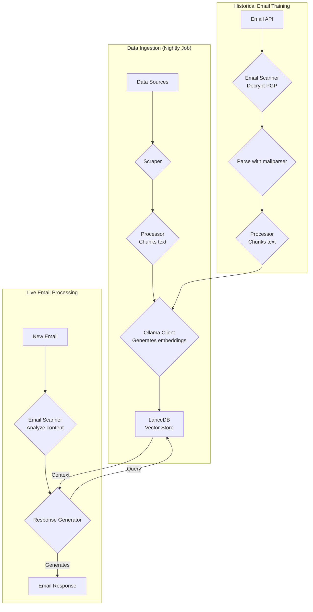
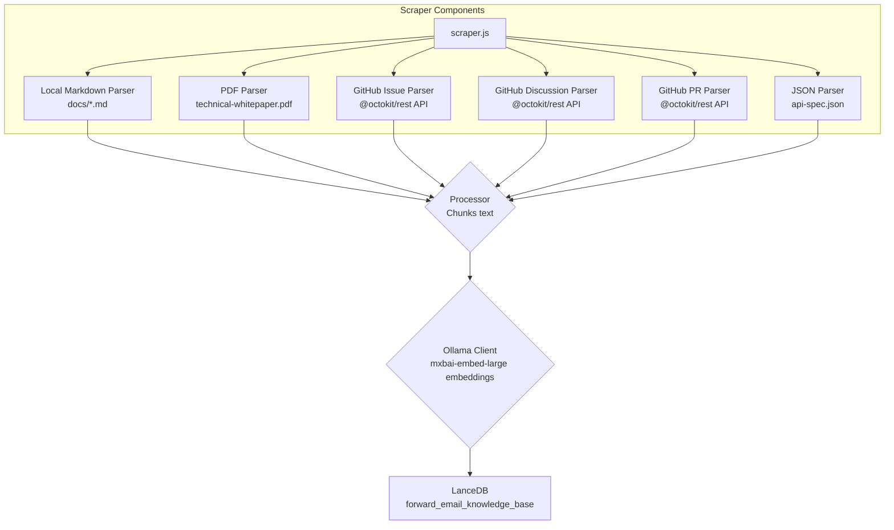
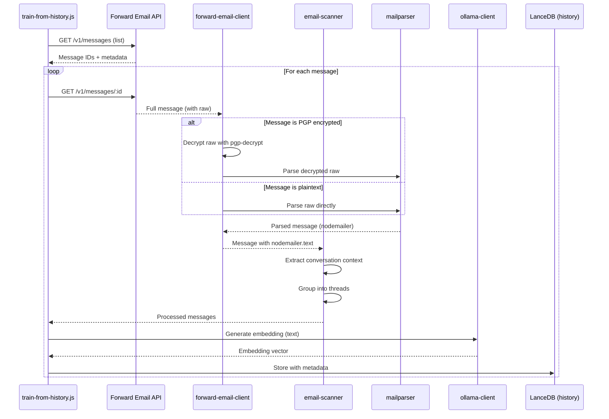

# Building a Privacy-First AI Customer Support Agent with LanceDB, Ollama, and Node.js


> \[!NOTE]
> This doc covers our journey building a self-hosted AI support agent. We wrote about similar challenges in our [Email Startup Graveyard](https://forwardemail.net/blog/docs/email-startup-graveyard-why-80-percent-email-companies-fail) blog post. We honestly thought about writing a follow-up called "AI Startup Graveyard" but maybe we'll have to wait another year or so until the AI bubble potentially bursts(?). For now, this is our brain dump of what worked, what didn't, and why we did it this way.

This is how we built our own AI customer support agent. We did it the hard way: self-hosted, privacy-first, and completely under our control. Why? Because we don't trust third-party services with our customers' data. It's a GDPR and DPA requirement, and it's the right thing to do.

This wasn't a fun weekend project. It was a month-long journey navigating broken dependencies, misleading documentation, and the general chaos of the open-source AI ecosystem in 2025. This doc is a record of what we built, why we built it, and the roadblocks we hit along the way.


## Table of Contents

* [Customer Benefits: AI-Augmented Human Support](#customer-benefits-ai-augmented-human-support)
  * [Faster, More Accurate Responses](#faster-more-accurate-responses)
  * [Consistency Without Burnout](#consistency-without-burnout)
  * [What You Get](#what-you-get)
* [A Personal Reflection: The Two-Decade Grind](#a-personal-reflection-the-two-decade-grind)
* [Why Privacy Matters](#why-privacy-matters)
* [Cost Analysis: Cloud AI vs Self-Hosted](#cost-analysis-cloud-ai-vs-self-hosted)
  * [Cloud AI Service Comparison](#cloud-ai-service-comparison)
  * [Cost Breakdown: 5GB Knowledge Base](#cost-breakdown-5gb-knowledge-base)
  * [Self-Hosted Hardware Costs](#self-hosted-hardware-costs)
* [Dogfooding Our Own API](#dogfooding-our-own-api)
  * [Why Dogfooding Matters](#why-dogfooding-matters)
  * [API Usage Examples](#api-usage-examples)
  * [Performance Benefits](#performance-benefits)
* [Encryption Architecture](#encryption-architecture)
  * [Layer 1: Mailbox Encryption (chacha20-poly1305)](#layer-1-mailbox-encryption-chacha20-poly1305)
  * [Layer 2: Message-Level PGP Encryption](#layer-2-message-level-pgp-encryption)
  * [Why This Matters for Training](#why-this-matters-for-training)
  * [Storage Security](#storage-security)
  * [Local Storage is Standard Practice](#local-storage-is-standard-practice)
* [The Architecture](#the-architecture)
  * [High-Level Flow](#high-level-flow)
  * [Detailed Scraper Flow](#detailed-scraper-flow)
* [How It Works](#how-it-works)
  * [Building the Knowledge Base](#building-the-knowledge-base)
  * [Training from Historical Emails](#training-from-historical-emails)
  * [Processing Incoming Emails](#processing-incoming-emails)
  * [Vector Store Management](#vector-store-management)
* [The Vector Database Graveyard](#the-vector-database-graveyard)
* [System Requirements](#system-requirements)
* [Cron Job Configuration](#cron-job-configuration)
  * [Environment Variables](#environment-variables)
  * [Cron Jobs for Multiple Inboxes](#cron-jobs-for-multiple-inboxes)
  * [Cron Schedule Breakdown](#cron-schedule-breakdown)
  * [Dynamic Date Calculation](#dynamic-date-calculation)
  * [Initial Setup: Extract URL List from Sitemap](#initial-setup-extract-url-list-from-sitemap)
  * [Testing Cron Jobs Manually](#testing-cron-jobs-manually)
  * [Monitoring Logs](#monitoring-logs)
* [Code Examples](#code-examples)
  * [Scraping and Processing](#scraping-and-processing)
  * [Training from Historical Emails](#training-from-historical-emails-1)
  * [Querying for Context](#querying-for-context)
* [The Future: Spam Scanner R\&D](#the-future-spam-scanner-rd)
* [Troubleshooting](#troubleshooting)
  * [Vector Dimension Mismatch Error](#vector-dimension-mismatch-error)
  * [Empty Knowledge Base Context](#empty-knowledge-base-context)
  * [PGP Decryption Failures](#pgp-decryption-failures)
* [Usage Tips](#usage-tips)
  * [Achieving Inbox Zero](#achieving-inbox-zero)
  * [Using the skip-ai Label](#using-the-skip-ai-label)
  * [Email Threading and Reply-All](#email-threading-and-reply-all)
  * [Monitoring and Maintenance](#monitoring-and-maintenance)
* [Testing](#testing)
  * [Running Tests](#running-tests)
  * [Test Coverage](#test-coverage)
  * [Test Environment](#test-environment)
* [Key Takeaways](#key-takeaways)


## Customer Benefits: AI-Augmented Human Support

Our AI system doesn't replace our support team—it makes them better. Here's what this means for you:

### Faster, More Accurate Responses

**Human-in-the-Loop**: Every AI-generated draft is reviewed, edited, and curated by our human support team before being sent to you. The AI handles the initial research and drafting, freeing our team to focus on quality control and personalization.

**Trained on Human Expertise**: The AI learns from:

* Our hand-written knowledge base and documentation
* Human-authored blog posts and tutorials
* Our comprehensive FAQ (written by humans)
* Past customer conversations (all handled by real humans)

You're getting responses informed by years of human expertise, just delivered faster.

### Consistency Without Burnout

Our small team handles hundreds of support requests daily, each requiring different technical knowledge and mental context-switching:

* Billing questions require financial system knowledge
* DNS issues require networking expertise
* API integration requires programming knowledge
* Security reports require vulnerability assessment

Without AI assistance, this constant context-switching leads to:

* Slower response times
* Human error from fatigue
* Inconsistent answer quality
* Team burnout

**With AI augmentation**, our team:

* Responds faster (AI drafts in seconds)
* Makes fewer errors (AI catches common mistakes)
* Maintains consistent quality (AI references the same knowledge base every time)
* Stays fresh and focused (less time researching, more time helping)

### What You Get

✅ **Speed**: AI drafts responses in seconds, humans review and send within minutes
✅ **Accuracy**: Responses based on our actual documentation and past solutions
✅ **Consistency**: Same high-quality answers whether it's 9am or 9pm
✅ **Human touch**: Every response reviewed and personalized by our team
✅ **No hallucinations**: AI only uses our verified knowledge base, not generic internet data

> \[!NOTE]
> **You're always talking to humans**. The AI is a research assistant that helps our team find the right answer faster. Think of it like a librarian who instantly finds the relevant book—but a human still reads it and explains it to you.


## A Personal Reflection: The Two-Decade Grind

Before we dive into the technical weeds, a personal note. I've been at this for nearly two decades. The endless hours at the keyboard, the relentless pursuit of a solution, the deep, focused grind – this is the reality of building anything meaningful. It's a reality that's often glossed over in the hype cycles of new technology.

The recent explosion of AI has been particularly frustrating. We're sold a dream of automation, of AI assistants that will write our code and solve our problems. The reality? The output is often dumpster-garbage code that requires more time to fix than it would have taken to write from scratch. The promise of making our lives easier is a false one. It's a distraction from the hard, necessary work of building.

And then there's the catch-22 of contributing to open-source. You're already spread thin, exhausted from the grind. You use an AI to help you write a detailed, well-structured bug report, hoping to make it easier for maintainers to understand and fix the issue. And what happens? You get scolded. Your contribution is dismissed as "off-topic" or low-effort, as we saw in a recent [Node.js GitHub issue](https://github.com/nodejs/node/issues/60719#issuecomment-3534304321). It's a slap in the face to senior developers who are just trying to help.

This is the reality of the ecosystem we're working in. It's not just about broken tools; it's about a culture that often fails to respect the time and [effort of its contributors](https://forwardemail.net/blog/docs/how-npm-packages-billion-downloads-shaped-javascript-ecosystem). This post is a chronicle of that reality. It's a story about the tools, yes, but it's also about the human cost of building in a broken ecosystem that is, for all its promise, fundamentally broken.


## Why Privacy Matters

Our [technical whitepaper](https://forwardemail.net/technical-whitepaper.pdf) covers our privacy philosophy in depth. The short version: we don't send customer data to third parties. Ever. That means no OpenAI, no Anthropic, no cloud-hosted vector databases. Everything runs locally on our infrastructure. This is non-negotiable for GDPR compliance and our DPA commitments.


## Cost Analysis: Cloud AI vs Self-Hosted

Before diving into the technical implementation, let's talk about why self-hosting matters from a cost perspective. The pricing models of cloud AI services make them prohibitively expensive for high-volume use cases like customer support.

### Cloud AI Service Comparison

| Service         | Provider            | Embedding Cost                                                   | LLM Cost (Input)                                                           | LLM Cost (Output)      | Privacy Policy                                      | GDPR/DPA        | Hosting           | Data Sharing      |
| --------------- | ------------------- | ---------------------------------------------------------------- | -------------------------------------------------------------------------- | ---------------------- | --------------------------------------------------- | --------------- | ----------------- | ----------------- |
| **OpenAI**      | OpenAI (US)         | [$0.02-0.13/1M tokens](https://openai.com/api/pricing/)          | $0.15-20/1M tokens                                                         | $0.60-80/1M tokens     | [Link](https://openai.com/policies/privacy-policy/) | Limited DPA     | Azure (US)        | Yes (training)    |
| **Claude**      | Anthropic (US)      | N/A                                                              | [$3-20/1M tokens](https://docs.claude.com/en/docs/about-claude/pricing)    | $15-80/1M tokens       | [Link](https://www.anthropic.com/legal/privacy)     | Limited DPA     | AWS/GCP (US)      | No (claimed)      |
| **Gemini**      | Google (US)         | [$0.15/1M tokens](https://ai.google.dev/gemini-api/docs/pricing) | $0.30-1.00/1M tokens                                                       | $2.50/1M tokens        | [Link](https://policies.google.com/privacy)         | Limited DPA     | GCP (US)          | Yes (improvement) |
| **DeepSeek**    | DeepSeek (China)    | N/A                                                              | [$0.028-0.28/1M tokens](https://api-docs.deepseek.com/quick_start/pricing) | $0.42/1M tokens        | [Link](https://www.deepseek.com/en)                 | Unknown         | China             | Unknown           |
| **Mistral**     | Mistral AI (France) | [$0.10/1M tokens](https://mistral.ai/pricing)                    | $0.40/1M tokens                                                            | $2.00/1M tokens        | [Link](https://mistral.ai/terms/)                   | EU GDPR         | EU                | Unknown           |
| **Self-Hosted** | You                 | $0 (existing hardware)                                           | $0 (existing hardware)                                                     | $0 (existing hardware) | Your policy                                         | Full compliance | MacBook M5 + cron | Never             |

> \[!WARNING]
> **Data sovereignty concerns**: US providers (OpenAI, Claude, Gemini) are subject to the CLOUD Act, allowing US government access to data. DeepSeek (China) operates under Chinese data laws. While Mistral (France) offers EU hosting and GDPR compliance, self-hosting remains the only option for complete data sovereignty and control.

### Cost Breakdown: 5GB Knowledge Base

Let's calculate the cost of processing a 5GB knowledge base (typical for a mid-sized company with docs, emails, and support history).

**Assumptions:**

* 5GB of text ≈ 1.25 billion tokens (assuming \~4 chars/token)
* Initial embedding generation
* Monthly retraining (full re-embedding)
* 10,000 support queries per month
* Average query: 500 tokens input, 300 tokens output

**Detailed Cost Breakdown:**

| Component                              | OpenAI           | Claude          | Gemini               | Self-Hosted        |
| -------------------------------------- | ---------------- | --------------- | -------------------- | ------------------ |
| **Initial Embedding** (1.25B tokens)   | $25,000          | N/A             | $187,500             | $0                 |
| **Monthly Queries** (10K × 800 tokens) | $1,200-16,000    | $2,400-16,000   | $2,400-3,200         | $0                 |
| **Monthly Retraining** (1.25B tokens)  | $25,000          | N/A             | $187,500             | $0                 |
| **First Year Total**                   | $325,200-217,000 | $28,800-192,000 | $2,278,800-2,226,000 | ~$60 (electricity) |
| **Privacy Compliance**                 | ❌ Limited        | ❌ Limited       | ❌ Limited            | ✅ Full             |
| **Data Sovereignty**                   | ❌ No             | ❌ No            | ❌ No                 | ✅ Yes              |

> \[!CAUTION]
> **Gemini's embedding costs are catastrophic** at $0.15/1M tokens. A single 5GB knowledge base embedding would cost $187,500. This is 37x more expensive than OpenAI and makes it completely unusable for production.

### Self-Hosted Hardware Costs

Our setup runs on existing hardware we already own:

* **Hardware**: MacBook M5 (already owned for development)
* **Additional cost**: $0 (uses existing hardware)
* **Electricity**: \~$5/month (estimated)
* **First year total**: \~$60
* **Ongoing**: $60/year

**ROI**: Self-hosting has essentially zero marginal cost since we're using existing development hardware. The system runs via cron jobs during off-peak hours.


## Dogfooding Our Own API

One of the most important architectural decisions we made was to have all AI jobs use the [Forward Email API](https://forwardemail.net/email-api) directly. This isn't just good practice—it's a forcing function for performance optimization.

### Why Dogfooding Matters

When our AI jobs use the same API endpoints as our customers:

1. **Performance bottlenecks affect us first** - We feel the pain before customers do
2. **Optimization benefits everyone** - Improvements for our jobs automatically improve customer experience
3. **Real-world testing** - Our jobs process thousands of emails, providing continuous load testing
4. **Code reuse** - Same authentication, rate limiting, error handling, and caching logic

### API Usage Examples

**Listing Messages (train-from-history.js):**

```javascript
// Uses GET /v1/messages?folder=INBOX with BasicAuth
// Excludes eml, raw, nodemailer to reduce response size (only need IDs)
const response = await axios.get(
  `${this.apiBase}/v1/messages`,
  {
    params: {
      folder: 'INBOX',
      limit: 100,
      eml: false,
      raw: false,
      nodemailer: false
    },
    auth: {
      username: process.env.FORWARD_EMAIL_ALIAS_USERNAME,
      password: process.env.FORWARD_EMAIL_ALIAS_PASSWORD
    }
  }
);

const messages = response.data;
// Returns: [{ id, subject, date, ... }, ...]
// Full message content fetched later via GET /v1/messages/:id
```

**Fetching Full Messages (forward-email-client.js):**

```javascript
// Uses GET /v1/messages/:id to get full message with raw content
const response = await axios.get(
  `${this.apiBase}/v1/messages/${messageId}`,
  {
    auth: {
      username: this.aliasUsername,
      password: this.aliasPassword
    }
  }
);

const message = response.data;
// Returns: { id, subject, raw, eml, nodemailer: { ... }, ... }
```

**Creating Draft Responses (process-inbox.js):**

```javascript
// Uses POST /v1/messages to create draft replies
const response = await axios.post(
  `${this.apiBase}/v1/messages`,
  {
    folder: 'Drafts',
    subject: `Re: ${originalSubject}`,
    to: senderEmail,
    text: generatedResponse,
    inReplyTo: originalMessageId
  },
  {
    auth: {
      username: process.env.FORWARD_EMAIL_ALIAS_USERNAME,
      password: process.env.FORWARD_EMAIL_ALIAS_PASSWORD
    }
  }
);
```

### Performance Benefits

Because our AI jobs run on the same API infrastructure:

* **Caching optimizations** benefit both jobs and customers
* **Rate limiting** is tested under real load
* **Error handling** is battle-tested
* **API response times** are constantly monitored
* **Database queries** are optimized for both use cases
* **Bandwidth optimization** - Excluding `eml`, `raw`, `nodemailer` when listing reduces response size by \~90%

When `train-from-history.js` processes 1,000 emails, it's making 1,000+ API calls. Any inefficiency in the API becomes immediately apparent. This forces us to optimize IMAP access, database queries, and response serialization—improvements that directly benefit our customers.

**Example optimization**: Listing 100 messages with full content = \~10MB response. Listing with `eml: false, raw: false, nodemailer: false` = \~100KB response (100x smaller).


## Encryption Architecture

Our email storage uses multiple layers of encryption, which the AI jobs must decrypt in real-time for training.

### Layer 1: Mailbox Encryption (chacha20-poly1305)

All IMAP mailboxes are stored as SQLite databases encrypted with **chacha20-poly1305**, a quantum-safe encryption algorithm. This is detailed in our [quantum-safe encrypted email service blog post](https://forwardemail.net/blog/docs/best-quantum-safe-encrypted-email-service).

**Key Properties:**

* **Algorithm**: ChaCha20-Poly1305 (AEAD cipher)
* **Quantum-safe**: Resistant to quantum computing attacks
* **Storage**: SQLite database files on disk
* **Access**: Decrypted in-memory when accessed via IMAP/API

### Layer 2: Message-Level PGP Encryption

Many support emails are additionally encrypted with PGP (OpenPGP standard). The AI jobs must decrypt these to extract content for training.

**Decryption Flow:**

```javascript
// 1. API returns message with encrypted raw content
const message = await forwardEmailClient.getMessage(id);

// 2. Check if raw content is PGP-encrypted
if (isMessageEncrypted(message.raw)) {
  // 3. Decrypt with our private key
  const decryptedRaw = await pgpDecrypt(message.raw);

  // 4. Parse decrypted MIME message
  const parsed = await simpleParser(decryptedRaw);

  // 5. Populate nodemailer with decrypted content
  message.nodemailer = {
    text: parsed.text,
    html: parsed.html,
    from: parsed.from,
    to: parsed.to,
    subject: parsed.subject,
    date: parsed.date
  };
}
```

**PGP Configuration:**

```bash
# Private key for decryption (path to ASCII-armored key file)
GPG_SECURITY_KEY="/path/to/private-key.asc"

# Passphrase for private key (if encrypted)
GPG_SECURITY_PASSPHRASE="your-passphrase"
```

The `pgp-decrypt.js` helper:

1. Reads the private key from disk once (cached in memory)
2. Decrypts the key with the passphrase
3. Uses the decrypted key for all message decryption
4. Supports recursive decryption for nested encrypted messages

### Why This Matters for Training

Without proper decryption, the AI would train on encrypted gibberish:

```
-----BEGIN PGP MESSAGE-----
Version: OpenPGP.js v4.10.10

wcBMA8Z3lHJnFnNUAQgAqK7F8...
-----END PGP MESSAGE-----
```

With decryption, the AI trains on actual content:

```
Subject: Re: Bug Report

Hi John,

Thanks for reporting this issue. I've confirmed the bug
and created a fix in PR #1234...
```

### Storage Security

The decryption happens in-memory during job execution, and the decrypted content is converted to embeddings which are then stored in the LanceDB vector database on disk.

**Where the data lives:**

* **Vector database**: Stored on encrypted MacBook M5 workstations
* **Physical security**: Workstations stay with us at all times (not in datacenters)
* **Disk encryption**: Full disk encryption on all workstations
* **Network security**: Firewalled and isolated from public networks

**Future datacenter deployment:**
If we ever move to datacenter hosting, the servers will have:

* LUKS full-disk encryption
* USB access disabled
* Physical security measures
* Network isolation

For complete details on our security practices, see our [Security page](https://forwardemail.net/en/security).

> \[!NOTE]
> The vector database contains embeddings (mathematical representations), not the original plaintext. However, embeddings can potentially be reverse-engineered, which is why we keep them on encrypted, physically-secured workstations.

### Local Storage is Standard Practice

Storing embeddings on our team's workstations is no different than how we already handle email:

* **Thunderbird**: Downloads and stores full email content locally in mbox/maildir files
* **Webmail clients**: Cache email data in browser storage and local databases
* **IMAP clients**: Maintain local copies of messages for offline access
* **Our AI system**: Stores mathematical embeddings (not plaintext) in LanceDB

The key difference: embeddings are **more secure** than plaintext email because they're:

1. Mathematical representations, not readable text
2. Harder to reverse-engineer than plaintext
3. Still subject to the same physical security as our email clients

If it's acceptable for our team to use Thunderbird or webmail on encrypted workstations, it's equally acceptable (and arguably more secure) to store embeddings the same way.


## The Architecture

Here's the basic flow. It looks simple. It wasn't.

> \[!NOTE]
> All jobs use the Forward Email API directly, ensuring that performance optimizations benefit both our AI system and our customers.

### High-Level Flow



### Detailed Scraper Flow

The `scraper.js` is the heart of the data ingestion. It's a collection of parsers for different data formats.




## How It Works

The process is split into three main parts: building the knowledge base, training from historical emails, and processing new emails.

### Building the Knowledge Base

**`update-knowledge-base.js`**: This is the main job. It runs nightly, clears the old vector store, and rebuilds it from scratch. It uses `scraper.js` to fetch content from all sources, `processor.js` to chunk it, and `ollama-client.js` to generate embeddings. Finally, `vector-store.js` stores everything in LanceDB.

**Data Sources:**

* Local Markdown files (`docs/*.md`)
* Technical whitepaper PDF (`assets/technical-whitepaper.pdf`)
* API spec JSON (`assets/api-spec.json`)
* GitHub issues (via Octokit)
* GitHub discussions (via Octokit)
* GitHub pull requests (via Octokit)
* Sitemap URL list (`$LANCEDB_PATH/valid-urls.json`)

### Training from Historical Emails

**`train-from-history.js`**: This job scans historical emails from all folders, decrypts PGP-encrypted messages, and adds them to a separate vector store (`customer_support_history`). This provides context from past support interactions.

**Email Processing Flow:**



**Key Features:**

* **PGP Decryption**: Uses `pgp-decrypt.js` helper with `GPG_SECURITY_KEY` environment variable
* **Thread Grouping**: Groups related emails into conversation threads
* **Metadata Preservation**: Stores folder, subject, date, encryption status
* **Reply Context**: Links messages with their replies for better context

**Configuration:**

```bash
# Environment variables for train-from-history
HISTORY_SCAN_LIMIT=1000              # Max messages to process
HISTORY_SCAN_SINCE="2024-01-01"      # Only process messages after this date
HISTORY_DECRYPT_PGP=true             # Attempt PGP decryption
GPG_SECURITY_KEY="/path/to/key.asc"  # Path to PGP private key
GPG_SECURITY_PASSPHRASE="passphrase" # Key passphrase (optional)
```

**What Gets Stored:**

```javascript
{
  type: 'historical_email',
  folder: 'INBOX',
  subject: 'Re: Bug Report',
  date: '2025-01-15T10:30:00Z',
  messageId: '67e2f288893921...',
  threadId: 'Bug Report',
  hasReply: true,
  encrypted: true,
  decrypted: true,
  replySubject: 'Bug Report',
  replyText: 'First 500 chars of reply...',
  chunkSize: 1000,
  chunkOverlap: 200,
  chunkIndex: 0
}
```

> \[!TIP]
> Run `train-from-history` after initial setup to populate the historical context. This dramatically improves response quality by learning from past support interactions.

### Processing Incoming Emails

**`process-inbox.js`**: This job runs on emails in our `support@forwardemail.net`, `abuse@forwardemail.net`, and `security@forwardemail.net` mailboxes (specifically the `INBOX` IMAP folder path). It leverages our API at <https://forwardemail.net/email-api> (e.g. `GET /v1/messages?folder=INBOX` using BasicAuth access with our IMAP credentials for each mailbox). It analyzes the email content, queries both the knowledge base (`forward_email_knowledge_base`) and the historical email vector store (`customer_support_history`), and then passes the combined context to `response-generator.js`. The generator uses `mxbai-embed-large` via Ollama to craft a response.

**Automated Workflow Features:**

1. **Inbox Zero Automation**: After successfully creating a draft, the original message is automatically moved to the Archive folder. This keeps your inbox clean and helps achieve inbox zero without manual intervention.

2. **Skip AI Processing**: Simply add a `skip-ai` label (case-insensitive) to any message to prevent AI processing. The message will remain in your inbox untouched, allowing you to handle it manually. This is useful for sensitive messages or complex cases that require human judgment.

3. **Proper Email Threading**: All draft responses include the original message quoted below (using standard ` >  ` prefix), following email reply conventions with "On \[date], \[sender] wrote:" format. This ensures proper conversation context and threading in email clients.

4. **Reply-All Behavior**: The system automatically handles Reply-To headers and CC recipients:
   * If a Reply-To header exists, it becomes the To address and the original From is added to CC
   * All original To and CC recipients are included in the reply CC (except your own address)
   * Follows standard email reply-all conventions for group conversations

**Source Ranking**: The system uses **weighted ranking** to prioritize sources:

* FAQ: 100% (highest priority)
* Technical whitepaper: 95%
* API spec: 90%
* Official docs: 85%
* GitHub issues: 70%
* Historical emails: 50%

### Vector Store Management

The `VectorStore` class in `helpers/customer-support-ai/vector-store.js` is our interface to LanceDB.

**Adding Documents:**

```javascript
// vector-store.js
async addDocument(text, metadata) {
  const embedding = await this.ollama.generateEmbedding(text);
  await this.table.add([{
    vector: embedding,
    text,
    ...metadata
  }]);
}
```

**Clearing the Store:**

```javascript
// Option 1: Use the clear() method
await vectorStore.clear();

// Option 2: Delete the local database directory
await fs.rm(process.env.LANCEDB_PATH, { recursive: true, force: true });
```

The `LANCEDB_PATH` environment variable points to the local embedded database directory. LanceDB is serverless and embedded, so there's no separate process to manage.


## The Vector Database Graveyard

This was the first major roadblock. We tried multiple vector databases before settling on LanceDB. Here's what went wrong with each one.

| Database     | GitHub                                                      | What Went Wrong                                                                                                                                                                                                      | Specific Issues                                                                                                                                                                                                                                                                                                                                                           | Security Concerns                                                                                                                                                                                                |
| ------------ | ----------------------------------------------------------- | -------------------------------------------------------------------------------------------------------------------------------------------------------------------------------------------------------------------- | ------------------------------------------------------------------------------------------------------------------------------------------------------------------------------------------------------------------------------------------------------------------------------------------------------------------------------------------------------------------------- | ---------------------------------------------------------------------------------------------------------------------------------------------------------------------------------------------------------------- |
| **ChromaDB** | [chroma-core/chroma](https://github.com/chroma-core/chroma) | `pip3 install chromadb` gives you a version from the stone age with `PydanticImportError`. The only way to get a working version is to compile from source. Not dev-friendly.                                        | Python dependency chaos. Multiple users reporting broken pip installs ([#774](https://github.com/chroma-core/chroma/issues/774), [#163](https://github.com/chroma-core/chroma/issues/163)). The docs say "just use Docker" which is a non-answer for local development. Crashes on Windows with >99 records ([#3058](https://github.com/chroma-core/chroma/issues/3058)). | **CVE-2024-45848**: Arbitrary code execution via ChromaDB integration in MindsDB. Critical OS vulnerabilities in Docker image ([#3170](https://github.com/chroma-core/chroma/issues/3170)).                      |
| **Qdrant**   | [qdrant/qdrant](https://github.com/qdrant/qdrant)           | The Homebrew tap (`qdrant/qdrant/qdrant`) referenced in their old docs is gone. Vanished. No explanation. The official docs now just say "use Docker."                                                               | Missing Homebrew tap. No native macOS binary. Docker-only is a barrier for quick local testing.                                                                                                                                                                                                                                                                           | **CVE-2024-2221**: Arbitrary file upload vulnerability allowing remote code execution (fixed in v1.9.0). Weak security maturity score from [IronCore Labs](https://ironcorelabs.com/vectordbs/qdrant-security/). |
| **Weaviate** | [weaviate/weaviate](https://github.com/weaviate/weaviate)   | The Homebrew version had a critical clustering bug (`leader not found`). The documented flags to fix it (`RAFT_JOIN`, `CLUSTER_HOSTNAME`) didn't work. Fundamentally broken for single-node setups.                  | Clustering bugs even in single-node mode. Over-engineered for simple use cases.                                                                                                                                                                                                                                                                                           | No major CVEs found, but complexity increases attack surface.                                                                                                                                                    |
| **LanceDB**  | [lancedb/lancedb](https://github.com/lancedb/lancedb)       | This one worked. It's embedded and serverless. No separate process. The only annoyance is the confusing package naming (`vectordb` is deprecated, use `@lancedb/lancedb`) and scattered docs. We can live with that. | Package naming confusion (`vectordb` vs `@lancedb/lancedb`), but otherwise solid. Embedded architecture eliminates entire classes of security issues.                                                                                                                                                                                                                     | No known CVEs. Embedded design means no network attack surface.                                                                                                                                                  |

> \[!WARNING]
> **ChromaDB has critical security vulnerabilities.** [CVE-2024-45848](https://nvd.nist.gov/vuln/detail/CVE-2024-45848) allows arbitrary code execution. The pip install is fundamentally broken with Pydantic dependency issues. Avoid for production use.

> \[!WARNING]
> **Qdrant had a file upload RCE vulnerability** ([CVE-2024-2221](https://qdrant.tech/blog/cve-2024-2221-response/)) that was only fixed in v1.9.0. If you must use Qdrant, ensure you're on the latest version.

> \[!CAUTION]
> The open-source vector database ecosystem is rough. Don't trust the documentation. Assume everything is broken until proven otherwise. Test locally before committing to a stack.


## System Requirements

* **Node.js:** v18.0.0+ ([GitHub](https://github.com/nodejs/node))
* **Ollama:** Latest ([GitHub](https://github.com/ollama/ollama))
* **Model:** `mxbai-embed-large` via Ollama
* **Vector Database:** LanceDB ([GitHub](https://github.com/lancedb/lancedb))
* **GitHub Access:** `@octokit/rest` for scraping issues ([GitHub](https://github.com/octokit/rest.js))
* **SQLite:** For primary database (via `mongoose-to-sqlite`)


## Cron Job Configuration

All AI jobs run via cron on a MacBook M5. Here's how to set up the cron jobs to run at midnight across multiple inboxes.

### Environment Variables

The jobs require these environment variables. Most can be set in `.env` file (loaded via `@ladjs/env`), but `HISTORY_SCAN_SINCE` must be calculated dynamically in the crontab.

**In `.env` file:**

```bash
# Forward Email API credentials (changes per inbox)
FORWARD_EMAIL_ALIAS_USERNAME=support@forwardemail.net
FORWARD_EMAIL_ALIAS_PASSWORD=your-imap-password

# PGP decryption (shared across all inboxes)
GPG_SECURITY_KEY=/path/to/private-key.asc
GPG_SECURITY_PASSPHRASE=your-passphrase

# Historical scan configuration
HISTORY_SCAN_LIMIT=1000

# LanceDB path
LANCEDB_PATH=/path/to/lancedb
```

**In crontab (calculated dynamically):**

```bash
# HISTORY_SCAN_SINCE must be set inline in crontab with shell date calculation
# Cannot be in .env file since @ladjs/env doesn't evaluate shell commands
HISTORY_SCAN_SINCE="$(date -v-1d +%Y-%m-%d)"  # macOS
HISTORY_SCAN_SINCE="$(date -d 'yesterday' +%Y-%m-%d)"  # Linux
```

### Cron Jobs for Multiple Inboxes

Edit your crontab with `crontab -e` and add:

```bash
# Update knowledge base (runs once, shared across all inboxes)
0 0 * * * cd /path/to/forwardemail.net && LANCEDB_PATH="/path/to/lancedb" GPG_SECURITY_KEY="/path/to/key.asc" GPG_SECURITY_PASSPHRASE="pass" node jobs/customer-support-ai/update-knowledge-base.js >> /var/log/update-knowledge-base.log 2>&1

# Train from history - support@forwardemail.net
0 0 * * * cd /path/to/forwardemail.net && FORWARD_EMAIL_ALIAS_USERNAME="support@forwardemail.net" FORWARD_EMAIL_ALIAS_PASSWORD="support-password" HISTORY_SCAN_SINCE="$(date -v-1d +%Y-%m-%d)" HISTORY_SCAN_LIMIT=1000 GPG_SECURITY_KEY="/path/to/key.asc" GPG_SECURITY_PASSPHRASE="pass" LANCEDB_PATH="/path/to/lancedb" node jobs/customer-support-ai/train-from-history.js >> /var/log/train-support.log 2>&1

# Train from history - abuse@forwardemail.net
0 0 * * * cd /path/to/forwardemail.net && FORWARD_EMAIL_ALIAS_USERNAME="abuse@forwardemail.net" FORWARD_EMAIL_ALIAS_PASSWORD="abuse-password" HISTORY_SCAN_SINCE="$(date -v-1d +%Y-%m-%d)" HISTORY_SCAN_LIMIT=1000 GPG_SECURITY_KEY="/path/to/key.asc" GPG_SECURITY_PASSPHRASE="pass" LANCEDB_PATH="/path/to/lancedb" node jobs/customer-support-ai/train-from-history.js >> /var/log/train-abuse.log 2>&1

# Train from history - security@forwardemail.net
0 0 * * * cd /path/to/forwardemail.net && FORWARD_EMAIL_ALIAS_USERNAME="security@forwardemail.net" FORWARD_EMAIL_ALIAS_PASSWORD="security-password" HISTORY_SCAN_SINCE="$(date -v-1d +%Y-%m-%d)" HISTORY_SCAN_LIMIT=1000 GPG_SECURITY_KEY="/path/to/key.asc" GPG_SECURITY_PASSPHRASE="pass" LANCEDB_PATH="/path/to/lancedb" node jobs/customer-support-ai/train-from-history.js >> /var/log/train-security.log 2>&1

# Process inbox - support@forwardemail.net
*/5 * * * * cd /path/to/forwardemail.net && FORWARD_EMAIL_ALIAS_USERNAME="support@forwardemail.net" FORWARD_EMAIL_ALIAS_PASSWORD="support-password" GPG_SECURITY_KEY="/path/to/key.asc" GPG_SECURITY_PASSPHRASE="pass" LANCEDB_PATH="/path/to/lancedb" node jobs/customer-support-ai/process-inbox.js >> /var/log/process-support.log 2>&1

# Process inbox - abuse@forwardemail.net
*/5 * * * * cd /path/to/forwardemail.net && FORWARD_EMAIL_ALIAS_USERNAME="abuse@forwardemail.net" FORWARD_EMAIL_ALIAS_PASSWORD="abuse-password" GPG_SECURITY_KEY="/path/to/key.asc" GPG_SECURITY_PASSPHRASE="pass" LANCEDB_PATH="/path/to/lancedb" node jobs/customer-support-ai/process-inbox.js >> /var/log/process-abuse.log 2>&1

# Process inbox - security@forwardemail.net
*/5 * * * * cd /path/to/forwardemail.net && FORWARD_EMAIL_ALIAS_USERNAME="security@forwardemail.net" FORWARD_EMAIL_ALIAS_PASSWORD="security-password" GPG_SECURITY_KEY="/path/to/key.asc" GPG_SECURITY_PASSPHRASE="pass" LANCEDB_PATH="/path/to/lancedb" node jobs/customer-support-ai/process-inbox.js >> /var/log/process-security.log 2>&1
```

### Cron Schedule Breakdown

| Job                     | Schedule      | Description                                                                        |
| ----------------------- | ------------- | ---------------------------------------------------------------------------------- |
| `train-from-sitemap.js` | `0 0 * * 0`   | Weekly (Sunday midnight) - Fetches all URLs from sitemap and trains knowledge base |
| `train-from-history.js` | `0 0 * * *`   | Midnight daily - Scans previous day's emails per inbox                             |
| `process-inbox.js`      | `*/5 * * * *` | Every 5 minutes - Processes new emails and generates drafts                        |

### Dynamic Date Calculation

The `HISTORY_SCAN_SINCE` variable **must be calculated inline in the crontab** because:

1. `.env` files are read as literal strings by `@ladjs/env`
2. Shell command substitution `$(...)` doesn't work in `.env` files
3. The date needs to be calculated fresh each time cron runs

**Correct approach (in crontab):**

```bash
# macOS (BSD date)
HISTORY_SCAN_SINCE="$(date -v-1d +%Y-%m-%d)" node jobs/...

# Linux (GNU date)
HISTORY_SCAN_SINCE="$(date -d 'yesterday' +%Y-%m-%d)" node jobs/...
```

**Incorrect approach (doesn't work in .env):**

```bash
# This will be read as literal string "$(date -v-1d +%Y-%m-%d)"
# NOT evaluated as a shell command
HISTORY_SCAN_SINCE=$(date -v-1d +%Y-%m-%d)
```

This ensures each nightly run calculates the previous day's date dynamically, avoiding redundant work.

### Initial Setup: Extract URL List from Sitemap

Before running the process-inbox job for the first time, you **must** extract the URL list from the sitemap. This creates a dictionary of valid URLs that the LLM can reference and prevents URL hallucination.

```bash
# First-time setup: Extract URL list from sitemap
cd /path/to/forwardemail.net
node jobs/customer-support-ai/train-from-sitemap.js
```

**What this does:**

1. Fetches all URLs from <https://forwardemail.net/sitemap.xml>
2. Filters to only non-localized URLs or /en/ URLs (avoids duplicate content)
3. Strips locale prefixes (/en/faq → /faq)
4. Saves a simple JSON file with the URL list to `$LANCEDB_PATH/valid-urls.json`
5. No crawling, no metadata scraping - just a flat list of valid URLs

**Why this matters:**

* Prevents the LLM from hallucinating fake URLs like `/dashboard` or `/login`
* Provides a whitelist of valid URLs for the response generator to reference
* Simple, fast, and doesn't require vector database storage
* The response generator loads this list on startup and includes it in the prompt

**Add to crontab for weekly updates:**

```bash
# Extract URL list from sitemap - weekly on Sunday midnight
0 0 * * 0 cd /path/to/forwardemail.net && node jobs/customer-support-ai/train-from-sitemap.js >> /var/log/train-sitemap.log 2>&1
```

### Testing Cron Jobs Manually

To test a job before adding to cron:

```bash
# Test sitemap training
cd /path/to/forwardemail.net
export LANCEDB_PATH="/path/to/lancedb"
node jobs/customer-support-ai/train-from-sitemap.js

# Test support inbox training
cd /path/to/forwardemail.net
export FORWARD_EMAIL_ALIAS_USERNAME="support@forwardemail.net"
export FORWARD_EMAIL_ALIAS_PASSWORD="support-password"
export HISTORY_SCAN_SINCE="$(date -v-1d +%Y-%m-%d)"
export HISTORY_SCAN_LIMIT=1000
export GPG_SECURITY_KEY="/path/to/key.asc"
export GPG_SECURITY_PASSPHRASE="pass"
export LANCEDB_PATH="/path/to/lancedb"
node jobs/customer-support-ai/train-from-history.js
```

### Monitoring Logs

Each job logs to a separate file for easy debugging:

```bash
# Watch support inbox processing in real-time
tail -f /var/log/process-support.log

# Check last night's training run
cat /var/log/train-support.log | grep "$(date -v-1d +%Y-%m-%d)"

# View all errors across jobs
grep -i error /var/log/train-*.log /var/log/process-*.log
```

> \[!TIP]
> Use separate log files per inbox to isolate issues. If one inbox has authentication problems, it won't pollute logs for other inboxes.


## Code Examples

### Scraping and Processing

```javascript
// jobs/customer-support-ai/update-knowledge-base.js
const scraper = new Scraper();
const processor = new Processor();
const ollamaClient = new OllamaClient();
const vectorStore = new VectorStore();

// Clear old data
await vectorStore.clear();

// Scrape all sources
const documents = await scraper.scrapeAll();
console.log(`Scraped ${documents.length} documents`);

// Process into chunks
const allChunks = [];
for (const doc of documents) {
  const chunks = processor.processDocuments([doc]);
  allChunks.push(...chunks);
}
console.log(`Generated ${allChunks.length} chunks`);

// Generate embeddings and store
const texts = allChunks.map(chunk => chunk.text);
const embeddings = await ollamaClient.generateEmbeddings(texts);

for (let i = 0; i < allChunks.length; i++) {
  await vectorStore.addDocument(texts[i], {
    ...allChunks[i].metadata,
    embedding: embeddings[i]
  });
}
```

### Training from Historical Emails

```javascript
// jobs/customer-support-ai/train-from-history.js
const scanner = new EmailScanner({
  forwardEmailApiBase: config.forwardEmailApiBase,
  forwardEmailAliasUsername: config.forwardEmailAliasUsername,
  forwardEmailAliasPassword: config.forwardEmailAliasPassword
});

const vectorStore = new VectorStore({
  collectionName: 'customer_support_history'
});

// Scan all folders (INBOX, Sent Mail, etc.)
const messages = await scanner.scanAllFolders({
  limit: 1000,
  since: new Date('2024-01-01'),
  decryptPGP: true
});

// Group into conversation threads
const threads = scanner.groupIntoThreads(messages);

// Process each thread
for (const thread of threads) {
  const context = scanner.extractConversationContext(thread);

  for (const message of context.messages) {
    // Skip encrypted messages that couldn't be decrypted
    if (message.encrypted && !message.decrypted) continue;

    // Use already-parsed content from nodemailer
    const text = message.nodemailer?.text || '';
    if (!text.trim()) continue;

    // Chunk and store
    const chunks = processor.chunkText(`Subject: ${message.subject}\n\n${text}`, {
      chunkSize: 1000,
      chunkOverlap: 200
    });

    for (const chunk of chunks) {
      await vectorStore.addDocument(chunk.text, {
        type: 'historical_email',
        folder: message.folder,
        subject: message.subject,
        date: message.nodemailer?.date || message.created_at,
        messageId: message.id,
        threadId: context.subject,
        encrypted: message.encrypted || false,
        decrypted: message.decrypted || false,
        ...chunk.metadata
      });
    }
  }
}
```

### Querying for Context

```javascript
// jobs/customer-support-ai/process-inbox.js
const vectorStore = new VectorStore();
const historyVectorStore = new VectorStore({
  collectionName: 'customer_support_history'
});

// Query both stores
const knowledgeContext = await vectorStore.query(emailEmbedding, { limit: 8 });
const historyContext = await historyVectorStore.query(emailEmbedding, { limit: 3 });

// Weighted ranking and deduplication happen here
const rankedContext = rankAndDeduplicateContext(knowledgeContext, historyContext);

// Generate response
const response = await responseGenerator.generate(email, rankedContext);
```


## The Future: Spam Scanner R\&D

This whole project wasn't just for customer support. It was R\&D. We can now take everything we learned about local embeddings, vector stores, and context retrieval and apply it to our next big project: the LLM layer for [Spam Scanner](https://spamscanner.net). The same principles of privacy, self-hosting, and semantic understanding will be key.


## Troubleshooting

### Vector Dimension Mismatch Error

**Error:**

```
Error: Failed to execute query stream: GenericFailure, Invalid input, No vector column found to match with the query vector dimension: 1024
```

**Cause:** This error occurs when you switch embedding models (e.g., from `mistral-small` to `mxbai-embed-large`) but the existing LanceDB database was created with a different vector dimension.

**Solution:** You need to retrain the knowledge base with the new embedding model:

```bash
# 1. Stop any running customer support AI jobs
pkill -f customer-support-ai

# 2. Delete the existing LanceDB database
rm -rf ~/.local/share/lancedb/forward_email_knowledge_base.lance
rm -rf ~/.local/share/lancedb/customer_support_history.lance

# 3. Verify the embedding model is set correctly in .env
grep OLLAMA_EMBEDDING_MODEL .env
# Should show: OLLAMA_EMBEDDING_MODEL=mxbai-embed-large

# 4. Pull the embedding model in Ollama
ollama pull mxbai-embed-large

# 5. Retrain the knowledge base
node jobs/customer-support-ai/train-from-history.js

# 6. Restart the process-inbox job via Bree
# The job will automatically run every 5 minutes
```

**Why this happens:** Different embedding models produce vectors of different dimensions:

* `mistral-small`: 1024 dimensions
* `mxbai-embed-large`: 1024 dimensions
* `nomic-embed-text`: 768 dimensions
* `all-minilm`: 384 dimensions

LanceDB stores the vector dimension in the table schema. When you query with a different dimension, it fails. The only solution is to recreate the database with the new model.

### Empty Knowledge Base Context

**Symptom:**

```
debug     Retrieved knowledge base context {
  total: 0,
  afterRanking: 0,
  questionType: 'capability'
}
```

**Cause:** The knowledge base hasn't been trained yet, or the LanceDB table doesn't exist.

**Solution:** Run the training job to populate the knowledge base:

```bash
# Train from historical emails
node jobs/customer-support-ai/train-from-history.js

# Or train from website/docs (if you have a scraper)
node jobs/customer-support-ai/train-from-website.js
```

### PGP Decryption Failures

**Symptom:** Messages show as encrypted but content is empty.

**Solution:**

1. Verify GPG key path is set correctly:

```bash
grep GPG_SECURITY_KEY .env
# Should point to your private key file
```

2. Test decryption manually:

```bash
node -e "const decrypt = require('./helpers/customer-support-ai/pgp-decrypt'); decrypt.testDecryption();"
```

3. Check key permissions:

```bash
ls -la /path/to/your/gpg-key.asc
# Should be readable by the user running the job
```


## Usage Tips

### Achieving Inbox Zero

The system is designed to help you achieve inbox zero automatically:

1. **Automatic Archiving**: When a draft is successfully created, the original message is automatically moved to the Archive folder. This keeps your inbox clean without manual intervention.

2. **Review Drafts**: Check the Drafts folder regularly to review AI-generated responses. Edit as needed before sending.

3. **Manual Override**: For messages that need special attention, simply add the `skip-ai` label before the job runs.

### Using the skip-ai Label

To prevent AI processing for specific messages:

1. **Add the label**: In your email client, add a `skip-ai` label/tag to any message (case-insensitive)
2. **Message stays in inbox**: The message won't be processed or archived
3. **Handle manually**: You can respond to it yourself without AI interference

**When to use skip-ai:**

* Sensitive or confidential messages
* Complex cases requiring human judgment
* Messages from VIP customers
* Legal or compliance-related inquiries
* Messages that need immediate human attention

### Email Threading and Reply-All

The system follows standard email conventions:

**Quoted Original Messages:**

```
Hi there,

[AI-generated response]

--
Thank you,
Forward Email
https://forwardemail.net

On Mon, Jan 15, 2024, 3:45 PM John Doe <john@example.com> wrote:
> This is the original message
> with each line quoted
> using the standard "> " prefix
```

**Reply-To Handling:**

* If the original message has a Reply-To header, the draft replies to that address
* The original From address is added to CC
* All other original To and CC recipients are preserved

**Example:**

```
Original message:
  From: john@company.com
  Reply-To: support@company.com
  To: support@forwardemail.net
  CC: manager@company.com

Draft response:
  To: support@company.com (from Reply-To)
  CC: john@company.com, manager@company.com
```

### Monitoring and Maintenance

**Check draft quality regularly:**

```bash
# View recent drafts
tail -f /var/log/process-support.log | grep "Draft created"
```

**Monitor archiving:**

```bash
# Check for archiving errors
grep "archive message" /var/log/process-*.log
```

**Review skipped messages:**

```bash
# See which messages were skipped
grep "skip-ai label" /var/log/process-*.log
```


## Testing

The customer support AI system includes comprehensive test coverage with 23 Ava tests.

### Running Tests

Due to npm package override conflicts with `better-sqlite3`, use the provided test script:

```bash
# Run all customer support AI tests
./scripts/test-customer-support-ai.sh

# Run with verbose output
./scripts/test-customer-support-ai.sh --verbose

# Run specific test file
./scripts/test-customer-support-ai.sh test/customer-support-ai/message-utils.js
```

Alternatively, run tests directly:

```bash
NODE_ENV=test node node_modules/.pnpm/ava@5.3.1/node_modules/ava/entrypoints/cli.mjs test/customer-support-ai
```

### Test Coverage

**Sitemap Fetcher (6 tests):**

* Locale pattern regex matching
* URL path extraction and locale stripping
* URL filtering logic for locales
* XML parsing logic
* Deduplication logic
* Combined filtering, stripping, and deduplication

**Message Utils (9 tests):**

* Extract sender text with name and email
* Handle email-only when name matches prefix
* Use from.text if available
* Use Reply-To if present
* Use From if no Reply-To
* Include original CC recipients
* Exclude our own address from CC
* Handle Reply-To with From in CC
* Deduplicate CC addresses

**Response Generator (8 tests):**

* URL grouping logic for prompt
* Sender name detection logic
* Prompt structure includes all required sections
* URL list formatting without angle brackets
* Empty URL list handling
* Forbidden URLs list in prompt
* Historical context inclusion
* Correct URLs for account-related topics

### Test Environment

Tests use `.env.test` for configuration. The test environment includes:

* Mock PayPal and Stripe credentials
* Test encryption keys
* Disabled authentication providers
* Safe test data paths

All tests are designed to run without external dependencies or network calls.


## Key Takeaways

1. **Privacy first:** Self-hosting is non-negotiable for GDPR/DPA compliance.
2. **Cost matters:** Cloud AI services are 50-1000x more expensive than self-hosting for production workloads.
3. **The ecosystem is broken:** Most vector databases are not dev-friendly. Test everything locally.
4. **Security vulnerabilities are real:** ChromaDB and Qdrant have had critical RCE vulnerabilities.
5. **LanceDB works:** It's embedded, serverless, and doesn't require a separate process.
6. **Ollama is solid:** Local LLM inference with `mxbai-embed-large` works well for our use case.
7. **Type mismatches will kill you:** `text` vs. `content`, ObjectID vs. string. These bugs are silent and brutal.
8. **Weighted ranking matters:** Not all context is equal. FAQ > GitHub issues > Historical emails.
9. **Historical context is gold:** Training from past support emails dramatically improves response quality.
10. **PGP decryption is essential:** Many support emails are encrypted; proper decryption is critical for training.

---

Learn more about Forward Email and our privacy-first approach to email at [forwardemail.net](https://forwardemail.net).
