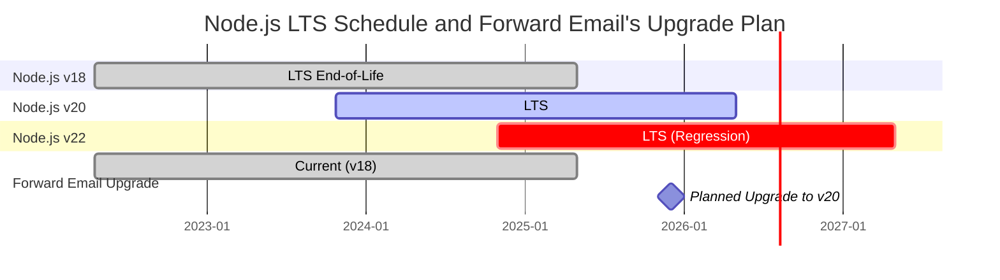
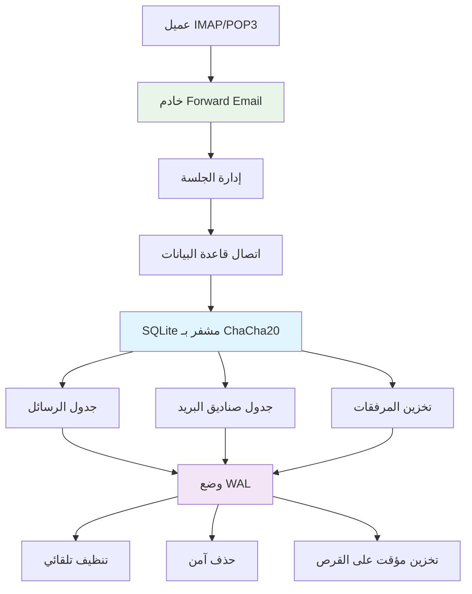
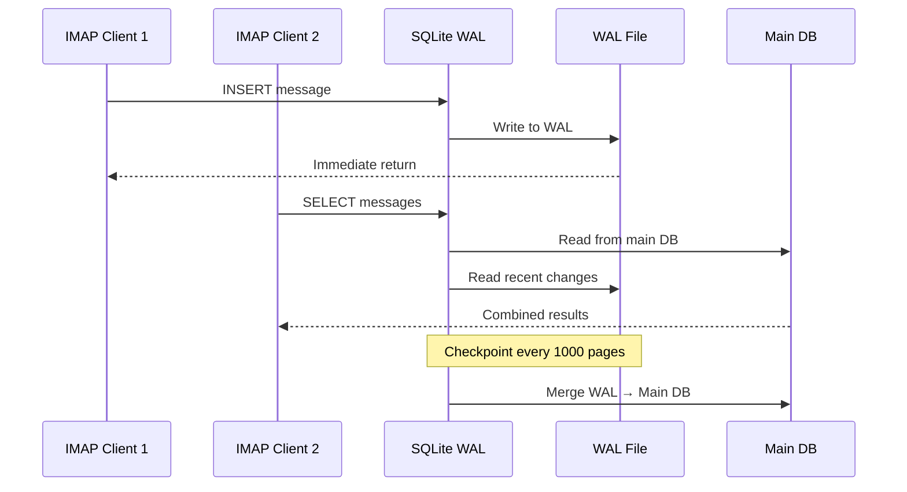

# تحسين أداء SQLite: إعدادات PRAGMA للإنتاج وتشفير ChaCha20 {#sqlite-performance-optimization-production-pragma-settings--chacha20-encryption}


## جدول المحتويات {#table-of-contents}

* [مقدمة](#foreword)
* [بنية SQLite للإنتاج في Forward Email](#forward-emails-production-sqlite-architecture)
* [تكوين PRAGMA الفعلي لدينا](#our-actual-pragma-configuration)
* [نتائج اختبار الأداء](#performance-benchmark-results)
  * [نتائج أداء Node.js v20.19.5](#nodejs-v20195-performance-results)
* [تفصيل إعدادات PRAGMA](#pragma-settings-breakdown)
  * [الإعدادات الأساسية التي نستخدمها](#core-settings-we-use)
  * [الإعدادات التي لا نستخدمها (لكن قد ترغب بها)](#settings-we-dont-use-but-you-might-want)
* [تشفير ChaCha20 مقابل AES256](#chacha20-vs-aes256-encryption)
* [التخزين المؤقت: /tmp مقابل /dev/shm](#temporary-storage-tmp-vs-devshm)
  * [أداء /tmp مقابل /dev/shm](#tmp-vs-devshm-performance)
* [تحسين وضع WAL](#wal-mode-optimization)
  * [تأثير تكوين WAL](#wal-configuration-impact)
* [تصميم المخطط للأداء](#schema-design-for-performance)
* [إدارة الاتصال](#connection-management)
* [المراقبة والتشخيص](#monitoring-and-diagnostics)
* [أداء إصدارات Node.js](#nodejs-version-performance)
  * [النتائج الكاملة عبر الإصدارات](#complete-cross-version-results)
  * [أهم رؤى الأداء](#key-performance-insights)
  * [توافق الوحدة الأصلية](#native-module-compatibility)
* [قائمة التحقق لنشر الإنتاج](#production-deployment-checklist)
* [استكشاف المشكلات الشائعة](#troubleshooting-common-issues)
  * [أخطاء "قاعدة البيانات مقفلة"]( #database-is-locked-errors)
  * [استهلاك عالي للذاكرة أثناء VACUUM](#high-memory-usage-during-vacuum)
  * [أداء الاستعلام البطيء](#slow-query-performance)
* [مساهمات Forward Email مفتوحة المصدر](#forward-emails-open-source-contributions)
* [كود مصدر اختبار الأداء](#benchmark-source-code)
* [ما التالي لـ SQLite في Forward Email](#whats-next-for-sqlite-at-forward-email)
* [الحصول على المساعدة](#getting-help)


## مقدمة {#foreword}

إعداد SQLite لأنظمة البريد الإلكتروني الإنتاجية ليس مجرد جعله يعمل — بل جعله سريعًا وآمنًا وموثوقًا تحت حمل ثقيل. بعد معالجة ملايين الرسائل الإلكترونية في Forward Email، تعلمنا ما هو المهم فعلاً لأداء SQLite.

يغطي هذا الدليل تكويننا الفعلي للإنتاج، ونتائج اختبار الأداء عبر إصدارات Node.js، والتحسينات المحددة التي تحدث فرقًا عند التعامل مع حجم بريد إلكتروني جدي.

> \[!WARNING] تراجع أداء Node.js في الإصدارين v22 و v24
> اكتشفنا تراجعًا كبيرًا في الأداء في إصدارات Node.js v22 و v24 يؤثر على أداء SQLite، خصوصًا في جمل `SELECT`. تظهر اختباراتنا انخفاضًا بحوالي 57% في عمليات `SELECT` في الثانية في Node.js v24 مقارنةً بـ v20. لقد أبلغنا فريق Node.js عن هذه المشكلة في [nodejs/node#60719](https://github.com/nodejs/node/issues/60719).

نظرًا لهذا التراجع، نتبع نهجًا حذرًا في ترقية Node.js. إليكم خطتنا الحالية:

* **الإصدار الحالي:** نحن حاليًا على Node.js v18، الذي وصل إلى نهاية الدعم طويل الأمد ("EOL") الخاص به. يمكنك الاطلاع على جدول الدعم الرسمي لـ [Node.js LTS هنا](https://github.com/nodejs/release#release-schedule).
* **الترقية المخططة:** سنقوم بالترقية إلى **Node.js v20**، الذي يعد أسرع إصدار وفقًا لاختباراتنا ولا يتأثر بهذا التراجع.
* **تجنب v22 و v24:** لن نستخدم Node.js v22 أو v24 في الإنتاج حتى يتم حل مشكلة الأداء هذه.

إليكم جدول زمني يوضح جدول دعم Node.js LTS ومسار الترقية لدينا:


## بنية SQLite في بيئة الإنتاج لـ Forward Email {#forward-emails-production-sqlite-architecture}

إليك كيف نستخدم SQLite فعليًا في بيئة الإنتاج:



## إعدادات PRAGMA الفعلية لدينا {#our-actual-pragma-configuration}

هذه هي الإعدادات التي نستخدمها فعليًا في الإنتاج، مباشرة من [`setup-pragma.js`](https://github.com/forwardemail/forwardemail.net/blob/master/helpers/setup-pragma.js):

```javascript
// إعدادات PRAGMA الفعلية في بيئة إنتاج Forward Email
async function setupPragma(db, session, cipher = 'chacha20') {
  // تشفير مقاوم للحوسبة الكمومية
  db.pragma(`cipher='${cipher}'`);
  db.key(Buffer.from(decrypt(session.user.password)));

  // إعدادات الأداء الأساسية
  db.pragma('journal_mode=WAL');
  db.pragma('secure_delete=ON');
  db.pragma('auto_vacuum=FULL');
  db.pragma(`busy_timeout=${config.busyTimeout}`);
  db.pragma('synchronous=NORMAL');
  db.pragma('foreign_keys=ON');
  db.pragma(`encoding='UTF-8'`);
  db.pragma('optimize=0x10002');

  // أمر حاسم: استخدام القرص للتخزين المؤقت، وليس الذاكرة
  db.pragma('temp_store=1');

  // مجلد مؤقت مخصص لتجنب أخطاء امتلاء القرص
  const tempStoreDirectory = path.join(path.dirname(db.name), '/tmp');
  await mkdirp(tempStoreDirectory);
  db.pragma(`temp_store_directory='${tempStoreDirectory}'`);
}
```

> \[!IMPORTANT]
> نستخدم `temp_store=1` (القرص) بدلاً من `temp_store=2` (الذاكرة) لأن قواعد بيانات البريد الإلكتروني الكبيرة يمكن أن تستهلك بسهولة أكثر من 10 جيجابايت من الذاكرة أثناء عمليات مثل VACUUM.

## نتائج اختبار الأداء {#performance-benchmark-results}

اختبرنا إعداداتنا مقابل بدائل مختلفة عبر إصدارات Node.js. إليك الأرقام الحقيقية:

### نتائج أداء Node.js v20.19.5 {#nodejs-v20195-performance-results}

| الإعداد                      | الإعداد (مللي ثانية) | الإدخال/ثانية | الاستعلام/ثانية | التحديث/ثانية | حجم قاعدة البيانات (ميجابايت) |
| ---------------------------- | ------------------- | ------------- | --------------- | ------------- | ----------------------------- |
| **إنتاج Forward Email**      | 120.1               | **10,548**    | **17,494**      | **16,654**    | 3.98                          |
| نقطة تحقق تلقائية WAL 1000    | 89.7                | **11,800**    | **18,383**      | **22,087**    | 3.98                          |
| حجم الكاش 64 ميجابايت        | 90.3                | 11,451        | 17,895          | 21,522        | 3.98                          |
| تخزين مؤقت في الذاكرة        | 111.8               | 9,874         | 15,363          | 21,292        | 3.98                          |
| التزامن معطل (غير آمن)       | 94.0                | 10,017        | 13,830          | 18,884        | 3.98                          |
| التزامن إضافي (آمن)          | 94.1                | **3,241**     | 14,438          | **3,405**     | 3.98                          |

> \[!TIP]
> إعداد `wal_autocheckpoint=1000` يظهر أفضل أداء شامل. نحن نفكر في إضافته إلى إعدادات الإنتاج لدينا.

## تفصيل إعدادات PRAGMA {#pragma-settings-breakdown}

### الإعدادات الأساسية التي نستخدمها {#core-settings-we-use}

| PRAGMA          | القيمة       | الغرض                          | تأثير الأداء                  |
| --------------- | ------------ | ------------------------------ | ----------------------------- |
| `cipher`        | `'chacha20'` | تشفير مقاوم للحوسبة الكمومية   | حمل منخفض مقارنة بـ AES       |
| `journal_mode`  | `WAL`        | تسجيل الكتابة المسبق           | +40% أداء متزامن              |
| `secure_delete` | `ON`         | الكتابة فوق البيانات المحذوفة  | أمان مقابل تكلفة أداء 5%      |
| `auto_vacuum`   | `FULL`       | استرجاع المساحة تلقائيًا       | يمنع تضخم قاعدة البيانات      |
| `busy_timeout`  | `30000`      | وقت الانتظار لقاعدة بيانات مقفلة | يقلل من فشل الاتصال          |
| `synchronous`   | `NORMAL`     | توازن بين المتانة والأداء       | أسرع 3 مرات من FULL           |
| `foreign_keys`  | `ON`         | سلامة العلاقات المرجعية        | يمنع تلف البيانات             |
| `temp_store`    | `1`          | استخدام القرص للملفات المؤقتة  | يمنع استنفاد الذاكرة          |
### الإعدادات التي لا نستخدمها (ولكن قد ترغب بها) {#settings-we-dont-use-but-you-might-want}

| PRAGMA                    | لماذا لا نستخدمها     | هل يجب أن تفكر بها؟                                |
| ------------------------- | --------------------- | --------------------------------------------------- |
| `wal_autocheckpoint=1000` | لم يتم تعيينها بعد    | **نعم** - تظهر اختباراتنا تحسناً في الأداء بنسبة 12%  |
| `cache_size=-64000`       | الإعداد الافتراضي كافٍ | **ربما** - تحسن بنسبة 8% لأعباء العمل التي تعتمد على القراءة |
| `mmap_size=268435456`     | التعقيد مقابل الفائدة | **لا** - مكاسب طفيفة، مشاكل خاصة بالمنصة            |
| `analysis_limit=1000`     | نستخدم 400            | **لا** - القيم الأعلى تبطئ تخطيط الاستعلام          |

> \[!CAUTION]
> نحن نتجنب تحديد `temp_store=MEMORY` بشكل خاص لأن ملف SQLite بحجم 10 جيجابايت يمكن أن يستهلك أكثر من 10 جيجابايت من ذاكرة الوصول العشوائي أثناء عمليات VACUUM.


## تشا تشا 20 مقابل تشفير AES256 {#chacha20-vs-aes256-encryption}

نحن نعطي الأولوية لمقاومة الحوسبة الكمومية على الأداء الخام:

```javascript
// استراتيجيتنا البديلة للتشفير
try {
  db.pragma(`cipher='chacha20'`);
  db.key(Buffer.from(decrypt(session.user.password)));
  db.pragma('journal_mode=WAL');
} catch (err) {
  // بديل لإصدارات SQLite القديمة
  if (cipher === 'chacha20' && err.code === 'SQLITE_NOTADB') {
    return setupPragma(db, session, 'aes256cbc');
  }
  throw err;
}
```

**مقارنة الأداء:**

* تشا تشا 20: \~10,500 إدخال/ثانية

* AES256CBC: \~11,200 إدخال/ثانية

* بدون تشفير: \~12,800 إدخال/ثانية

تكلفة الأداء بنسبة 6% لتشا تشا 20 مقابل AES تستحق مقاومة الحوسبة الكمومية لتخزين البريد الإلكتروني على المدى الطويل.


## التخزين المؤقت: /tmp مقابل /dev/shm {#temporary-storage-tmp-vs-devshm}

نقوم بتكوين موقع التخزين المؤقت صراحة لتجنب مشاكل مساحة القرص:

```javascript
// تكوين التخزين المؤقت في Forward Email
const tempStoreDirectory = path.join(path.dirname(db.name), '/tmp');
await mkdirp(tempStoreDirectory);
db.pragma(`temp_store_directory='${tempStoreDirectory}'`);

// تعيين متغير البيئة أيضاً
process.env.SQLITE_TMPDIR = tempStoreDirectory;
```

### أداء /tmp مقابل /dev/shm {#tmp-vs-devshm-performance}

| موقع التخزين    | زمن VACUUM | استخدام الذاكرة | الموثوقية           |
| ---------------- | ----------- | --------------- | ------------------- |
| `/tmp` (قرص)     | 2.3 ثانية   | 50 ميجابايت     | ✅ موثوق             |
| `/dev/shm` (رام) | 0.8 ثانية   | أكثر من 2 جيجابايت | ⚠️ قد يتسبب في تعطل النظام |
| الافتراضي       | 4.1 ثانية   | متغير           | ❌ غير متوقع         |

> \[!WARNING]
> استخدام `/dev/shm` للتخزين المؤقت يمكن أن يستهلك كل ذاكرة الوصول العشوائي المتاحة أثناء العمليات الكبيرة. التزم بالتخزين المؤقت القائم على القرص في بيئة الإنتاج.


## تحسين وضع WAL {#wal-mode-optimization}

التسجيل المسبق للكتابة ضروري لأنظمة البريد الإلكتروني التي تتطلب وصولاً متزامناً:



### تأثير تكوين WAL {#wal-configuration-impact}

تظهر اختباراتنا أن `wal_autocheckpoint=1000` يوفر أفضل أداء:

```javascript
// تحسين محتمل نقوم باختباره
db.pragma('wal_autocheckpoint=1000');
```

**النتائج:**

* نقطة التحقق التلقائي الافتراضية: 10,548 إدخال/ثانية

* `wal_autocheckpoint=1000`: 11,800 إدخال/ثانية (+12%)

* `wal_autocheckpoint=0`: 9,200 إدخال/ثانية (نمو WAL كبير جداً)


## تصميم المخطط للأداء {#schema-design-for-performance}

يتبع مخطط تخزين البريد الإلكتروني لدينا أفضل ممارسات SQLite:

```sql
-- جدول الرسائل مع ترتيب أعمدة محسن
CREATE TABLE messages (
  id INTEGER PRIMARY KEY,
  mailbox_id INTEGER NOT NULL,
  uid INTEGER NOT NULL,
  date INTEGER NOT NULL,
  flags TEXT,
  subject TEXT,
  from_addr TEXT,
  to_addr TEXT,
  message_id TEXT,
  raw BLOB,  -- BLOB كبير في النهاية
  FOREIGN KEY (mailbox_id) REFERENCES mailboxes(id)
);

-- الفهارس الحرجة لأداء IMAP
CREATE INDEX idx_messages_mailbox_date ON messages(mailbox_id, date DESC);
CREATE INDEX idx_messages_uid ON messages(mailbox_id, uid);
CREATE INDEX idx_messages_flags ON messages(mailbox_id, flags) WHERE flags IS NOT NULL;
```
> \[!TIP]
> ضع دائمًا أعمدة BLOB في نهاية تعريف الجدول الخاص بك. يقوم SQLite بتخزين الأعمدة ذات الحجم الثابت أولاً، مما يجعل الوصول إلى الصف أسرع.

تأتي هذه التحسينات مباشرة من منشئ SQLite، [د. ريتشارد هيب](https://sqlite-users.sqlite.narkive.com/Q4txMI8t/effect-of-blobs-on-performance#post3):

> "إليك تلميحًا - اجعل أعمدة BLOB هي العمود الأخير في جداولك. أو حتى قم بتخزين BLOBs في جدول منفصل يحتوي فقط على عمودين: مفتاح أساسي صحيح و BLOB نفسه، ثم قم بالوصول إلى محتوى BLOB باستخدام join إذا احتجت لذلك. إذا وضعت حقول صحيحة صغيرة مختلفة بعد BLOB، فعندها يجب على SQLite مسح محتوى BLOB بالكامل (باتباع قائمة الصفحات المرتبطة على القرص) للوصول إلى الحقول الصحيحة في النهاية، وهذا بالتأكيد يمكن أن يبطئك."
>
> — د. ريتشارد هيب، مؤلف SQLite

قمنا بتنفيذ هذا التحسين في [مخطط المرفقات](https://github.com/forwardemail/forwardemail.net/commit/0e77fbb05dc5b38136652337309067d2b39eb229)، حيث نقلنا حقل `body` من نوع BLOB إلى نهاية تعريف الجدول لأداء أفضل.


## إدارة الاتصال {#connection-management}

لا نستخدم تجميع الاتصالات مع SQLite—يحصل كل مستخدم على قاعدة بيانات مشفرة خاصة به. توفر هذه الطريقة عزلاً كاملاً بين المستخدمين، مشابهًا للتشغيل في بيئة معزولة (sandboxing). على عكس البنى التحتية في خدمات أخرى التي تستخدم MySQL أو PostgreSQL أو MongoDB حيث يمكن لموظف خبيث الوصول إلى بريدك الإلكتروني، تضمن قواعد بيانات SQLite لكل مستخدم في Forward Email أن بياناتك مستقلة تمامًا ومعزولة.

نحن لا نخزن كلمة مرور IMAP الخاصة بك أبدًا، لذلك لا نملك أبدًا حق الوصول إلى بياناتك—كل شيء يتم في الذاكرة. تعرّف على المزيد حول [نهج التشفير المقاوم للكم](https://forwardemail.net/blog/docs/quantum-resistant-encryption-email-security) الذي يشرح كيفية عمل نظامنا.

```javascript
// نهج قاعدة البيانات لكل مستخدم
async function getDatabase(session) {
  const dbPath = path.join(
    config.databaseDir,
    session.user.domain_name,
    `${session.user.username}.db`
  );

  const db = new Database(dbPath, {
    cipher: 'chacha20',
    readonly: session.readonly || false
  });

  await setupPragma(db, session);
  return db;
}
```

يوفر هذا النهج:

* عزلاً كاملاً بين المستخدمين

* عدم تعقيد تجميع الاتصالات

* تشفير تلقائي لكل مستخدم

* عمليات نسخ احتياطي/استعادة أبسط

مع `auto_vacuum=FULL`، نادرًا ما نحتاج إلى عمليات VACUUM يدوية:

```javascript
// استراتيجيتنا للتنظيف
db.pragma('optimize=0x10002'); // عند فتح الاتصال
db.pragma('optimize'); // بشكل دوري (يومي)

// تنظيف يدوي فقط للتنظيفات الكبرى
if (deletedDataPercentage > 25) {
  db.exec('VACUUM');
}
```

**تأثير أداء التنظيف التلقائي:**

* `auto_vacuum=FULL`: استعادة فورية للمساحة، 5% حمل كتابة إضافي

* `auto_vacuum=INCREMENTAL`: تحكم يدوي، يتطلب `PRAGMA incremental_vacuum` دوري

* `auto_vacuum=NONE`: أسرع عمليات كتابة، يتطلب تنظيف يدوي `VACUUM`


## المراقبة والتشخيص {#monitoring-and-diagnostics}

المقاييس الرئيسية التي نتابعها في الإنتاج:

```javascript
// استعلامات مراقبة الأداء
const stats = {
  page_count: db.pragma('page_count', { simple: true }),
  page_size: db.pragma('page_size', { simple: true }),
  freelist_count: db.pragma('freelist_count', { simple: true }),
  wal_checkpoint: db.pragma('wal_checkpoint(PASSIVE)', { simple: true })
};

const dbSizeMB = (stats.page_count * stats.page_size) / 1024 / 1024;
const fragmentationPct = (stats.freelist_count / stats.page_count) * 100;
```

> \[!NOTE]
> نراقب نسبة التجزئة ونبدأ الصيانة عندما تتجاوز 15%.


## أداء إصدار Node.js {#nodejs-version-performance}

تكشف اختباراتنا الشاملة عبر إصدارات Node.js عن اختلافات كبيرة في الأداء:

### النتائج الكاملة عبر الإصدارات {#complete-cross-version-results}

| إصدار Node | إنتاج Forward Email | أفضل إدخال/ثانية       | أفضل اختيار/ثانية       | أفضل تحديث/ثانية       | ملاحظات                |
| ------------ | ------------------------ | ------------------------ | ------------------------ | ------------------------ | ---------------------- |
| **v18.20.8** | 10,658 / 14,466 / 18,641 | **11,663** (تعطيل المزامنة) | **14,868** (ذاكرة مؤقتة) | **20,095** (MMAP)        | ⚠️ تحذير المحرك        |
| **v20.19.5** | 10,548 / 17,494 / 16,654 | **11,800** (WAL تلقائي)  | **18,383** (WAL تلقائي)  | **22,087** (WAL تلقائي)  | ✅ موصى به              |
| **v22.21.1** | 9,829 / 15,833 / 18,416  | **11,260** (تعطيل المزامنة) | **17,413** (MMAP)        | **20,731** (MMAP)        | ⚠️ أبطأ بشكل عام       |
| **v24.11.1** | 9,938 / 7,497 / 10,446   | **10,628** (تنظيف تدريجي) | **16,821** (تنظيف تدريجي) | **19,934** (تنظيف تدريجي) | ❌ تباطؤ كبير          |
### رؤى الأداء الرئيسية {#key-performance-insights}

**Node.js v18 (الإصدار طويل الدعم القديم):**

* أداء إدخال مشابه لـ v20 (10,658 مقابل 10,548 عملية/ثانية)
* عمليات اختيار أبطأ بنسبة 17% من v20 (14,466 مقابل 17,494 عملية/ثانية)
* يعرض تحذيرات محرك npm للحزم التي تتطلب Node ≥20
* تحسين تخزين الذاكرة المؤقتة يعمل بشكل أفضل من نقطة التحقق التلقائية لـ WAL
* مقبول للتطبيقات القديمة، لكن يُنصح بالترقية

**Node.js v20 (موصى به):**

* أعلى أداء عام عبر جميع العمليات
* تحسين نقطة التحقق التلقائية لـ WAL يوفر زيادة ثابتة بنسبة 12%
* أفضل توافق مع وحدات SQLite الأصلية
* الأكثر استقرارًا لأعباء العمل الإنتاجية

**Node.js v22 (مقبول):**

* إدخالات أبطأ بنسبة 7%، واختيارات أبطأ بنسبة 9% مقارنة بـ v20
* تحسين MMAP يظهر نتائج أفضل من نقطة التحقق التلقائية لـ WAL
* يتطلب `npm install` جديدًا مع كل تبديل لإصدار Node
* مقبول للتطوير، غير موصى به للإنتاج

**Node.js v24 (غير موصى به):**

* إدخالات أبطأ بنسبة 6%، واختيارات أبطأ بنسبة 57% مقارنة بـ v20
* تراجع كبير في أداء عمليات القراءة
* التنظيف التدريجي (incremental vacuum) يعمل بشكل أفضل من التحسينات الأخرى
* تجنب استخدامه لتطبيقات SQLite الإنتاجية

### توافق الوحدة الأصلية {#native-module-compatibility}

تم حل "مشاكل توافق الوحدة" التي واجهناها في البداية عن طريق:

```bash
# تبديل إصدار Node وإعادة تثبيت الوحدات الأصلية
nvm use 22
rm -rf node_modules
npm install
```

**اعتبارات Node.js v18:**

* يعرض تحذيرات المحرك: `Unsupported engine { required: { node: '>=20.0.0' } }`
* لا يزال يترجم ويعمل بنجاح رغم التحذيرات
* العديد من حزم SQLite الحديثة تستهدف Node ≥20 للدعم الأمثل
* يمكن للتطبيقات القديمة الاستمرار في استخدام v18 بأداء مقبول

> \[!IMPORTANT]
> أعد تثبيت الوحدات الأصلية دائمًا عند تبديل إصدارات Node.js. يجب تجميع وحدة `better-sqlite3-multiple-ciphers` لكل إصدار Node محدد.

> \[!TIP]
> للنشر في الإنتاج، التزم بـ Node.js v20 LTS. فوائد الأداء والاستقرار تفوق أي ميزات لغوية أحدث في v22/v24. Node v18 مقبول للأنظمة القديمة لكنه يظهر تدهورًا في أداء عمليات القراءة.


## قائمة التحقق للنشر في الإنتاج {#production-deployment-checklist}

قبل النشر، تأكد من وجود هذه التحسينات في SQLite:

1. تعيين متغير البيئة `SQLITE_TMPDIR`
2. ضمان وجود مساحة قرص كافية للعمليات المؤقتة (مرتين حجم قاعدة البيانات)
3. تكوين تدوير السجلات لملفات WAL
4. إعداد مراقبة لحجم قاعدة البيانات والتجزئة
5. اختبار إجراءات النسخ الاحتياطي/الاستعادة مع التشفير
6. التحقق من دعم تشفير ChaCha20 في بناء SQLite الخاص بك


## استكشاف المشكلات الشائعة وإصلاحها {#troubleshooting-common-issues}

### أخطاء "قاعدة البيانات مقفلة" {#database-is-locked-errors}

```javascript
// زيادة مهلة الانشغال
db.pragma('busy_timeout=60000'); // 60 ثانية

// التحقق من المعاملات طويلة الأمد
const info = db.pragma('wal_checkpoint(FULL)');
if (info.busy > 0) {
  console.warn('نقطة التحقق WAL محجوبة بواسطة قراء نشطين');
}
```

### استخدام عالي للذاكرة أثناء VACUUM {#high-memory-usage-during-vacuum}

```javascript
// مراقبة الذاكرة قبل VACUUM
const beforeMem = process.memoryUsage();
db.exec('VACUUM');
const afterMem = process.memoryUsage();

console.log(
  `فرق الذاكرة بعد VACUUM: ${
    (afterMem.heapUsed - beforeMem.heapUsed) / 1024 / 1024
  }ميجابايت`
);
```

### بطء أداء الاستعلامات {#slow-query-performance}

```javascript
// تمكين تحليل الاستعلام
db.pragma('analysis_limit=400'); // إعداد Forward Email
db.exec('ANALYZE');

// التحقق من خطط الاستعلام
const plan = db
  .prepare('EXPLAIN QUERY PLAN SELECT * FROM messages WHERE date > ?')
  .all(Date.now() - 86400000);
console.log(plan);
```


## مساهمات Forward Email مفتوحة المصدر {#forward-emails-open-source-contributions}

لقد ساهمنا بمعرفة تحسين SQLite للمجتمع:

* [تحسينات توثيق Litestream](https://github.com/benbjohnson/litestream/issues/516) - اقتراحاتنا لنصائح أداء SQLite أفضل

* [Better SQLite3 Multiple Ciphers](https://github.com/m4heshd/better-sqlite3-multiple-ciphers) - دعم تشفير ChaCha20

* [بحث ضبط أداء SQLite](https://phiresky.github.io/blog/2020/sqlite-performance-tuning/) - تم الرجوع إليه في تنفيذنا
* [كيف شكلت حزم npm التي تجاوزت المليار تحميل نظام جافاسكريبت البيئي](https://forwardemail.net/blog/docs/how-npm-packages-billion-downloads-shaped-javascript-ecosystem) - مساهماتنا الأوسع في تطوير npm وجافاسكريبت


## كود المصدر للاختبارات {#benchmark-source-code}

جميع أكواد الاختبارات متاحة في مجموعة اختباراتنا:

```bash
# قم بتشغيل الاختبارات بنفسك
git clone https://github.com/forwardemail/sqlite-benchmarks
cd sqlite-benchmarks
npm install
npm run benchmark
```

تختبر الاختبارات:

* تركيبات مختلفة من PRAGMA

* أداء ChaCha20 مقابل AES256

* استراتيجيات نقطة التحقق WAL

* تكوينات التخزين المؤقت المؤقت

* توافق إصدار Node.js


## ما التالي لـ SQLite في Forward Email {#whats-next-for-sqlite-at-forward-email}

نحن نختبر هذه التحسينات بنشاط:

1. **ضبط نقطة التحقق التلقائية WAL**: إضافة `wal_autocheckpoint=1000` بناءً على نتائج الاختبارات

2. **الضغط**: تقييم [sqlite-zstd](https://github.com/phiresky/sqlite-zstd) لتخزين المرفقات

3. **حد التحليل**: اختبار قيم أعلى من 400 الحالية

4. **حجم التخزين المؤقت**: النظر في تحديد حجم التخزين المؤقت ديناميكيًا بناءً على الذاكرة المتاحة


## الحصول على المساعدة {#getting-help}

هل تواجه مشاكل في أداء SQLite؟ لأسئلة محددة عن SQLite، يُعد [منتدى SQLite](https://sqlite.org/forum/forumpost) مصدرًا ممتازًا، و[دليل ضبط الأداء](https://www.sqlite.org/optoverview.html) يغطي تحسينات إضافية لم نحتاجها بعد.

تعرف على المزيد حول Forward Email بقراءة [الأسئلة الشائعة](/faq).
