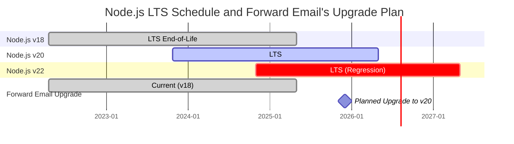
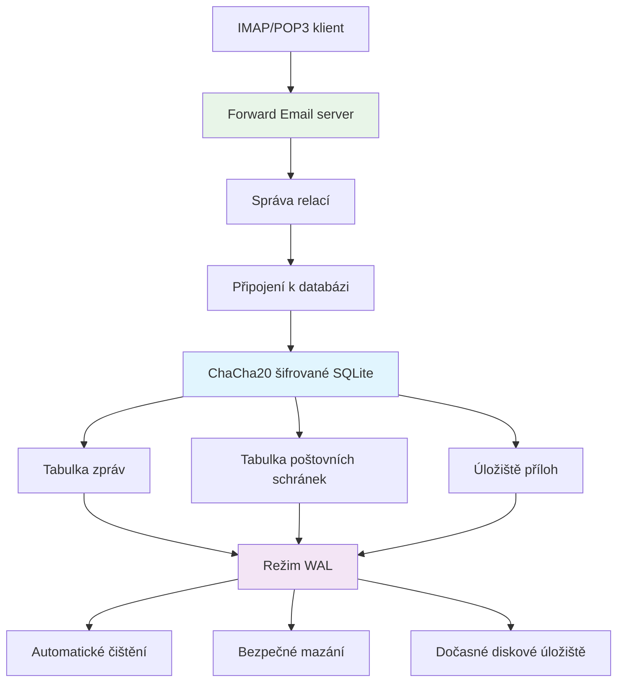
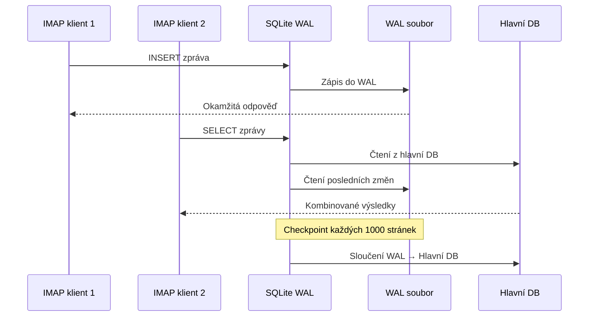

# Optimalizace výkonu SQLite: Produkční nastavení PRAGMA & šifrování ChaCha20 {#sqlite-performance-optimization-production-pragma-settings--chacha20-encryption}


## Obsah {#table-of-contents}

* [Předmluva](#foreword)
* [Produkční architektura SQLite ve Forward Email](#forward-emails-production-sqlite-architecture)
* [Naše aktuální konfigurace PRAGMA](#our-actual-pragma-configuration)
* [Výsledky výkonových benchmarků](#performance-benchmark-results)
  * [Výsledky výkonu Node.js v20.19.5](#nodejs-v20195-performance-results)
* [Rozbor nastavení PRAGMA](#pragma-settings-breakdown)
  * [Základní nastavení, která používáme](#core-settings-we-use)
  * [Nastavení, která NEpoužíváme (ale možná byste chtěli)](#settings-we-dont-use-but-you-might-want)
* [Šifrování ChaCha20 vs AES256](#chacha20-vs-aes256-encryption)
* [Dočasné úložiště: /tmp vs /dev/shm](#temporary-storage-tmp-vs-devshm)
  * [Výkon /tmp vs /dev/shm](#tmp-vs-devshm-performance)
* [Optimalizace režimu WAL](#wal-mode-optimization)
  * [Dopad konfigurace WAL](#wal-configuration-impact)
* [Návrh schématu pro výkon](#schema-design-for-performance)
* [Správa připojení](#connection-management)
* [Monitorování a diagnostika](#monitoring-and-diagnostics)
* [Výkon podle verze Node.js](#nodejs-version-performance)
  * [Kompletní výsledky napříč verzemi](#complete-cross-version-results)
  * [Klíčové poznatky o výkonu](#key-performance-insights)
  * [Kompatibilita nativních modulů](#native-module-compatibility)
* [Kontrolní seznam pro produkční nasazení](#production-deployment-checklist)
* [Řešení běžných problémů](#troubleshooting-common-issues)
  * [Chyby „Databáze je zamčená“](#database-is-locked-errors)
  * [Vysoká spotřeba paměti během VACUUM](#high-memory-usage-during-vacuum)
  * [Pomalý výkon dotazů](#slow-query-performance)
* [Open source příspěvky Forward Email](#forward-emails-open-source-contributions)
* [Zdrojový kód benchmarku](#benchmark-source-code)
* [Co dál se SQLite ve Forward Email](#whats-next-for-sqlite-at-forward-email)
* [Jak získat pomoc](#getting-help)


## Předmluva {#foreword}

Nastavení SQLite pro produkční e-mailové systémy není jen o tom, aby to fungovalo — jde o to, aby to bylo rychlé, bezpečné a spolehlivé při vysoké zátěži. Po zpracování milionů e-mailů ve Forward Email jsme se naučili, co skutečně záleží na výkonu SQLite.

Tento průvodce pokrývá naši reálnou produkční konfiguraci, výsledky benchmarků napříč verzemi Node.js a konkrétní optimalizace, které mají význam, když zpracováváte vážný objem e-mailů.

> \[!WARNING] Výkonnostní regrese Node.js ve verzích v22 a v24  
> Objevili jsme významnou regresi výkonu ve verzích Node.js v22 a v24, která ovlivňuje výkon SQLite, zejména u příkazů `SELECT`. Naše benchmarky ukazují přibližně 57% pokles počtu operací `SELECT` za sekundu ve verzi Node.js v24 ve srovnání s v20. Tento problém jsme nahlásili týmu Node.js v [nodejs/node#60719](https://github.com/nodejs/node/issues/60719).

Kvůli této regresi přistupujeme k aktualizacím Node.js opatrně. Zde je náš aktuální plán:

* **Aktuální verze:** Momentálně používáme Node.js v18, která dosáhla konce životnosti ("EOL") pro dlouhodobou podporu ("LTS"). Oficiální [plán LTS Node.js najdete zde](https://github.com/nodejs/release#release-schedule).
* **Plánovaná aktualizace:** Přecházíme na **Node.js v20**, která je podle našich benchmarků nejrychlejší a touto regresí není ovlivněna.
* **Vyhýbání se verzím v22 a v24:** Node.js v22 ani v24 nebudeme používat v produkci, dokud nebude tento výkonový problém vyřešen.

Zde je časová osa znázorňující plán LTS Node.js a naši cestu aktualizace:


## Architektura produkční SQLite Forward Email {#forward-emails-production-sqlite-architecture}

Takto skutečně používáme SQLite v produkci:




## Naše skutečná konfigurace PRAGMA {#our-actual-pragma-configuration}

Toto je to, co skutečně používáme v produkci, přímo z našeho [`setup-pragma.js`](https://github.com/forwardemail/forwardemail.net/blob/master/helpers/setup-pragma.js):

```javascript
// Skutečná produkční nastavení PRAGMA Forward Email
async function setupPragma(db, session, cipher = 'chacha20') {
  // Kvantově odolné šifrování
  db.pragma(`cipher='${cipher}'`);
  db.key(Buffer.from(decrypt(session.user.password)));

  // Základní nastavení výkonu
  db.pragma('journal_mode=WAL');
  db.pragma('secure_delete=ON');
  db.pragma('auto_vacuum=FULL');
  db.pragma(`busy_timeout=${config.busyTimeout}`);
  db.pragma('synchronous=NORMAL');
  db.pragma('foreign_keys=ON');
  db.pragma(`encoding='UTF-8'`);
  db.pragma('optimize=0x10002');

  // Kritické: Použít disk pro dočasné úložiště, ne paměť
  db.pragma('temp_store=1');

  // Vlastní dočasný adresář, aby se předešlo chybám plného disku
  const tempStoreDirectory = path.join(path.dirname(db.name), '/tmp');
  await mkdirp(tempStoreDirectory);
  db.pragma(`temp_store_directory='${tempStoreDirectory}'`);
}
```

> \[!IMPORTANT]
> Používáme `temp_store=1` (disk) místo `temp_store=2` (paměť), protože velké databáze e-mailů mohou během operací jako VACUUM snadno spotřebovat více než 10 GB paměti.


## Výsledky výkonových testů {#performance-benchmark-results}

Testovali jsme naši konfiguraci proti různým alternativám napříč verzemi Node.js. Zde jsou skutečná čísla:

### Výsledky výkonu Node.js v20.19.5 {#nodejs-v20195-performance-results}

| Konfigurace                 | Nastavení (ms) | Vložení/s   | Výběr/s    | Aktualizace/s | Velikost DB (MB) |
| --------------------------- | -------------- | ----------- | ---------- | ------------- | ---------------- |
| **Forward Email produkce**  | 120.1          | **10 548**  | **17 494** | **16 654**    | 3,98             |
| WAL Autocheckpoint 1000     | 89.7           | **11 800**  | **18 383** | **22 087**    | 3,98             |
| Velikost cache 64MB         | 90.3           | 11 451      | 17 895     | 21 522        | 3,98             |
| Dočasné úložiště v paměti   | 111.8          | 9 874       | 15 363     | 21 292        | 3,98             |
| Synchronous VYPNUTO (nebezpečné) | 94.0      | 10 017      | 13 830     | 18 884        | 3,98             |
| Synchronous EXTRA (bezpečné) | 94.1           | **3 241**   | 14 438     | **3 405**     | 3,98             |

> \[!TIP]
> Nastavení `wal_autocheckpoint=1000` ukazuje nejlepší celkový výkon. Zvažujeme jeho přidání do naší produkční konfigurace.


## Přehled nastavení PRAGMA {#pragma-settings-breakdown}

### Základní nastavení, která používáme {#core-settings-we-use}

| PRAGMA          | Hodnota      | Účel                           | Dopad na výkon                 |
| --------------- | ------------ | ------------------------------ | ------------------------------ |
| `cipher`        | `'chacha20'` | Kvantově odolné šifrování      | Minimální režie oproti AES     |
| `journal_mode`  | `WAL`        | Write-Ahead Logging            | +40 % výkon při souběžném přístupu |
| `secure_delete` | `ON`         | Přepisování smazaných dat      | Bezpečnost vs. 5% náklad na výkon |
| `auto_vacuum`   | `FULL`       | Automatické uvolňování místa   | Zabraňuje nafukování databáze |
| `busy_timeout`  | `30000`      | Čekací doba na zamčenou DB     | Snižuje selhání připojení     |
| `synchronous`   | `NORMAL`     | Vyvážená trvanlivost/výkon     | 3x rychlejší než FULL          |
| `foreign_keys`  | `ON`         | Referenční integrita           | Zabraňuje poškození dat        |
| `temp_store`    | `1`          | Použití disku pro dočasné soubory | Zabraňuje vyčerpání paměti    |
### Nastavení, která nepoužíváme (ale možná byste chtěli) {#settings-we-dont-use-but-you-might-want}

| PRAGMA                    | Proč jej nepoužíváme   | Měli byste o něm uvažovat?                         |
| ------------------------- | --------------------- | --------------------------------------------------- |
| `wal_autocheckpoint=1000` | Ještě nenastaveno     | **Ano** - Naše testy ukazují 12% zlepšení výkonu    |
| `cache_size=-64000`       | Výchozí hodnota stačí | **Možná** - 8% zlepšení pro čtecí zátěže           |
| `mmap_size=268435456`     | Komplexnost vs přínos | **Ne** - Minimální zlepšení, platformně specifické problémy |
| `analysis_limit=1000`     | Používáme 400         | **Ne** - Vyšší hodnoty zpomalují plánování dotazů   |

> \[!CAUTION]
> Výslovně se vyhýbáme `temp_store=MEMORY`, protože 10GB SQLite soubor může během operací VACUUM spotřebovat více než 10 GB RAM.


## Šifrování ChaCha20 vs AES256 {#chacha20-vs-aes256-encryption}

Upřednostňujeme kvantovou odolnost před čistým výkonem:

```javascript
// Naše záložní strategie šifrování
try {
  db.pragma(`cipher='chacha20'`);
  db.key(Buffer.from(decrypt(session.user.password)));
  db.pragma('journal_mode=WAL');
} catch (err) {
  // Záloha pro starší verze SQLite
  if (cipher === 'chacha20' && err.code === 'SQLITE_NOTADB') {
    return setupPragma(db, session, 'aes256cbc');
  }
  throw err;
}
```

**Porovnání výkonu:**

* ChaCha20: \~10 500 vložení za sekundu

* AES256CBC: \~11 200 vložení za sekundu

* Nešifrované: \~12 800 vložení za sekundu

6% výkonová ztráta u ChaCha20 oproti AES stojí za kvantovou odolnost pro dlouhodobé ukládání e-mailů.


## Dočasné úložiště: /tmp vs /dev/shm {#temporary-storage-tmp-vs-devshm}

Explicitně konfigurujeme umístění dočasného úložiště, abychom se vyhnuli problémům s místem na disku:

```javascript
// Konfigurace dočasného úložiště Forward Email
const tempStoreDirectory = path.join(path.dirname(db.name), '/tmp');
await mkdirp(tempStoreDirectory);
db.pragma(`temp_store_directory='${tempStoreDirectory}'`);

// Nastavení také proměnné prostředí
process.env.SQLITE_TMPDIR = tempStoreDirectory;
```

### Výkon /tmp vs /dev/shm {#tmp-vs-devshm-performance}

| Umístění úložiště | Čas VACUUM | Využití paměti | Spolehlivost         |
| ----------------- | ---------- | -------------- | -------------------- |
| `/tmp` (disk)     | 2,3 s      | 50 MB          | ✅ Spolehlivé         |
| `/dev/shm` (RAM)  | 0,8 s      | 2 GB+          | ⚠️ Může způsobit pád systému |
| Výchozí           | 4,1 s      | Proměnlivé     | ❌ Nepředvídatelné    |

> \[!WARNING]
> Používání `/dev/shm` pro dočasné úložiště může během velkých operací spotřebovat veškerou dostupnou RAM. Pro produkci používejte dočasné úložiště na disku.


## Optimalizace režimu WAL {#wal-mode-optimization}

Write-Ahead Logging je klíčový pro e-mailové systémy s paralelním přístupem:



### Dopad konfigurace WAL {#wal-configuration-impact}

Naše testy ukazují, že `wal_autocheckpoint=1000` poskytuje nejlepší výkon:

```javascript
// Potenciální optimalizace, kterou testujeme
db.pragma('wal_autocheckpoint=1000');
```

**Výsledky:**

* Výchozí autocheckpoint: 10 548 vložení za sekundu

* `wal_autocheckpoint=1000`: 11 800 vložení za sekundu (+12%)

* `wal_autocheckpoint=0`: 9 200 vložení za sekundu (WAL příliš roste)


## Návrh schématu pro výkon {#schema-design-for-performance}

Naše schéma ukládání e-mailů dodržuje nejlepší praktiky SQLite:

```sql
-- Tabulka zpráv s optimalizovaným pořadím sloupců
CREATE TABLE messages (
  id INTEGER PRIMARY KEY,
  mailbox_id INTEGER NOT NULL,
  uid INTEGER NOT NULL,
  date INTEGER NOT NULL,
  flags TEXT,
  subject TEXT,
  from_addr TEXT,
  to_addr TEXT,
  message_id TEXT,
  raw BLOB,  -- Velký BLOB na konci
  FOREIGN KEY (mailbox_id) REFERENCES mailboxes(id)
);

-- Kritické indexy pro výkon IMAP
CREATE INDEX idx_messages_mailbox_date ON messages(mailbox_id, date DESC);
CREATE INDEX idx_messages_uid ON messages(mailbox_id, uid);
CREATE INDEX idx_messages_flags ON messages(mailbox_id, flags) WHERE flags IS NOT NULL;
```
> \[!TIP]
> Vždy umístěte sloupce BLOB na konec definice tabulky. SQLite ukládá sloupce s pevnou velikostí jako první, což zrychluje přístup k řádkům.

Tato optimalizace pochází přímo od tvůrce SQLite, [D. Richarda Hippa](https://sqlite-users.sqlite.narkive.com/Q4txMI8t/effect-of-blobs-on-performance#post3):

> "Tady je ale rada – udělejte sloupce BLOB posledním sloupcem ve vašich tabulkách. Nebo dokonce ukládejte BLOBy v samostatné tabulce, která má pouze dva sloupce: celočíselný primární klíč a samotný blob, a pak přistupujte k obsahu BLOB pomocí joinu, pokud je to potřeba. Pokud umístíte různé malé celočíselné pole za BLOB, pak musí SQLite procházet celý obsah BLOB (následující propojený seznam diskových stránek), aby se dostal k celočíselným polím na konci, a to vás rozhodně může zpomalit."
>
> — D. Richard Hipp, autor SQLite

Tuto optimalizaci jsme implementovali v našem [schématu příloh](https://github.com/forwardemail/forwardemail.net/commit/0e77fbb05dc5b38136652337309067d2b39eb229), kdy jsme pole `body` typu BLOB přesunuli na konec definice tabulky pro lepší výkon.


## Správa připojení {#connection-management}

Nepoužíváme connection pooling s SQLite – každý uživatel má svou vlastní šifrovanou databázi. Tento přístup poskytuje dokonalou izolaci mezi uživateli, podobně jako sandboxing. Na rozdíl od architektur jiných služeb, které používají MySQL, PostgreSQL nebo MongoDB, kde by k vašemu e-mailu mohl potenciálně přistupovat neoprávněný zaměstnanec, per-user SQLite databáze Forward Email zajišťují, že vaše data jsou zcela nezávislá a sandboxovaná.

Nikdy neukládáme vaše IMAP heslo, takže nikdy nemáme přístup k vašim datům – vše probíhá pouze v paměti. Více se dozvíte o našem [kvantově odolném šifrovacím přístupu](https://forwardemail.net/blog/docs/quantum-resistant-encryption-email-security), který podrobně popisuje, jak náš systém funguje.

```javascript
// Přístup k databázi na uživatele
async function getDatabase(session) {
  const dbPath = path.join(
    config.databaseDir,
    session.user.domain_name,
    `${session.user.username}.db`
  );

  const db = new Database(dbPath, {
    cipher: 'chacha20',
    readonly: session.readonly || false
  });

  await setupPragma(db, session);
  return db;
}
```

Tento přístup poskytuje:

* Dokonalou izolaci mezi uživateli

* Žádnou složitost connection poolu

* Automatické šifrování na uživatele

* Jednodušší zálohování/obnovu

S `auto_vacuum=FULL` téměř nepotřebujeme manuální operace VACUUM:

```javascript
// Naše strategie úklidu
db.pragma('optimize=0x10002'); // Při otevření připojení
db.pragma('optimize'); // Periodicky (denně)

// Manuální vacuum jen při větších úklidech
if (deletedDataPercentage > 25) {
  db.exec('VACUUM');
}
```

**Dopad Auto Vacuum na výkon:**

* `auto_vacuum=FULL`: Okamžité uvolnění místa, 5% režie při zápisu

* `auto_vacuum=INCREMENTAL`: Manuální kontrola, vyžaduje periodické `PRAGMA incremental_vacuum`

* `auto_vacuum=NONE`: Nejrychlejší zápisy, vyžaduje manuální `VACUUM`


## Monitorování a diagnostika {#monitoring-and-diagnostics}

Klíčové metriky, které sledujeme v produkci:

```javascript
// Dotazy pro monitorování výkonu
const stats = {
  page_count: db.pragma('page_count', { simple: true }),
  page_size: db.pragma('page_size', { simple: true }),
  freelist_count: db.pragma('freelist_count', { simple: true }),
  wal_checkpoint: db.pragma('wal_checkpoint(PASSIVE)', { simple: true })
};

const dbSizeMB = (stats.page_count * stats.page_size) / 1024 / 1024;
const fragmentationPct = (stats.freelist_count / stats.page_count) * 100;
```

> \[!NOTE]
> Sledujeme procento fragmentace a spouštíme údržbu, pokud překročí 15 %.


## Výkon podle verze Node.js {#nodejs-version-performance}

Naše komplexní benchmarky napříč verzemi Node.js odhalují významné rozdíly ve výkonu:

### Kompletní výsledky napříč verzemi {#complete-cross-version-results}

| Verze Node | Forward Email produkce   | Nejlepší Insert/sec       | Nejlepší Select/sec       | Nejlepší Update/sec       | Poznámky               |
| ---------- | ------------------------ | ------------------------ | ------------------------ | ------------------------ | ---------------------- |
| **v18.20.8** | 10 658 / 14 466 / 18 641 | **11 663** (Sync OFF)    | **14 868** (Memory Temp) | **20 095** (MMAP)        | ⚠️ Varování motoru      |
| **v20.19.5** | 10 548 / 17 494 / 16 654 | **11 800** (WAL Auto)    | **18 383** (WAL Auto)    | **22 087** (WAL Auto)    | ✅ Doporučeno           |
| **v22.21.1** | 9 829 / 15 833 / 18 416  | **11 260** (Sync OFF)    | **17 413** (MMAP)        | **20 731** (MMAP)        | ⚠️ Celkově pomalejší    |
| **v24.11.1** | 9 938 / 7 497 / 10 446   | **10 628** (Incr Vacuum) | **16 821** (Incr Vacuum) | **19 934** (Incr Vacuum) | ❌ Výrazné zpomalení    |
### Klíčové poznatky o výkonu {#key-performance-insights}

**Node.js v18 (Legacy LTS):**

* Srovnatelný výkon vkládání jako v20 (10 658 vs 10 548 operací za sekundu)
* O 17 % pomalejší výběry než v20 (14 466 vs 17 494 operací za sekundu)
* Zobrazuje varování npm engine pro balíčky vyžadující Node ≥20
* Optimalizace dočasného ukládání v paměti funguje lépe než WAL autocheckpoint
* Přijatelný pro legacy aplikace, ale doporučuje se upgrade

**Node.js v20 (Doporučeno):**

* Nejvyšší celkový výkon ve všech operacích
* Optimalizace WAL autocheckpoint poskytuje konzistentní 12% nárůst výkonu
* Nejlepší kompatibilita s nativními SQLite moduly
* Nejstabilnější pro produkční zatížení

**Node.js v22 (Přijatelný):**

* O 7 % pomalejší vkládání, o 9 % pomalejší výběry oproti v20
* Optimalizace MMAP vykazuje lepší výsledky než WAL autocheckpoint
* Vyžaduje nové `npm install` při každém přepnutí verze Node
* Přijatelný pro vývoj, nedoporučuje se pro produkci

**Node.js v24 (Nedoporučeno):**

* O 6 % pomalejší vkládání, o 57 % pomalejší výběry oproti v20
* Významný pokles výkonu při čtecích operacích
* Inkrementální vacuum funguje lépe než jiné optimalizace
* Vyhněte se pro produkční SQLite aplikace

### Kompatibilita nativních modulů {#native-module-compatibility}

"Problémy s kompatibilitou modulů", na které jsme původně narazili, byly vyřešeny takto:

```bash
# Přepněte verzi Node a přeinstalujte nativní moduly
nvm use 22
rm -rf node_modules
npm install
```

**Úvahy o Node.js v18:**

* Zobrazuje varování engine: `Unsupported engine { required: { node: '>=20.0.0' } }`
* Přesto se úspěšně kompiluje a spouští navzdory varováním
* Mnoho moderních SQLite balíčků cílí na Node ≥20 pro optimální podporu
* Legacy aplikace mohou pokračovat v používání v18 s přijatelným výkonem

> \[!IMPORTANT]
> Při přepínání verzí Node.js vždy přeinstalujte nativní moduly. Modul `better-sqlite3-multiple-ciphers` musí být zkompilován pro každou konkrétní verzi Node.

> \[!TIP]
> Pro produkční nasazení používejte Node.js v20 LTS. Výhody výkonu a stability převažují nad novějšími jazykovými funkcemi ve verzích v22/v24. Node v18 je přijatelný pro legacy systémy, ale vykazuje pokles výkonu při čtecích operacích.


## Kontrolní seznam pro produkční nasazení {#production-deployment-checklist}

Před nasazením zajistěte, že SQLite má tyto optimalizace:

1. Nastavte proměnnou prostředí `SQLITE_TMPDIR`
2. Zajistěte dostatek místa na disku pro dočasné operace (2x velikost databáze)
3. Nakonfigurujte rotaci logů pro WAL soubory
4. Nastavte monitoring velikosti databáze a fragmentace
5. Otestujte zálohovací a obnovovací postupy s šifrováním
6. Ověřte podporu šifry ChaCha20 ve vaší SQLite sestavě


## Řešení běžných problémů {#troubleshooting-common-issues}

### Chyby "Database is locked" {#database-is-locked-errors}

```javascript
// Zvýšení timeoutu při zaneprázdnění
db.pragma('busy_timeout=60000'); // 60 sekund

// Kontrola dlouhotrvajících transakcí
const info = db.pragma('wal_checkpoint(FULL)');
if (info.busy > 0) {
  console.warn('WAL checkpoint blokován aktivními čtenáři');
}
```

### Vysoká spotřeba paměti během VACUUM {#high-memory-usage-during-vacuum}

```javascript
// Monitorování paměti před VACUUM
const beforeMem = process.memoryUsage();
db.exec('VACUUM');
const afterMem = process.memoryUsage();

console.log(
  `Změna paměti při VACUUM: ${
    (afterMem.heapUsed - beforeMem.heapUsed) / 1024 / 1024
  }MB`
);
```

### Pomalý výkon dotazů {#slow-query-performance}

```javascript
// Povolení analýzy dotazů
db.pragma('analysis_limit=400'); // Nastavení Forward Email
db.exec('ANALYZE');

// Kontrola plánů dotazů
const plan = db
  .prepare('EXPLAIN QUERY PLAN SELECT * FROM messages WHERE date > ?')
  .all(Date.now() - 86400000);
console.log(plan);
```


## Open Source příspěvky Forward Email {#forward-emails-open-source-contributions}

Na komunitu jsme přispěli našimi znalostmi optimalizace SQLite:

* [Vylepšení dokumentace Litestream](https://github.com/benbjohnson/litestream/issues/516) - Naše návrhy na lepší tipy pro výkon SQLite

* [Better SQLite3 Multiple Ciphers](https://github.com/m4heshd/better-sqlite3-multiple-ciphers) - Podpora šifrování ChaCha20

* [Výzkum ladění výkonu SQLite](https://phiresky.github.io/blog/2020/sqlite-performance-tuning/) - Odkazovaný v naší implementaci
* [Jak balíčky npm s miliardami stažení formovaly ekosystém JavaScriptu](https://forwardemail.net/blog/docs/how-npm-packages-billion-downloads-shaped-javascript-ecosystem) - Naše širší příspěvky do vývoje npm a JavaScriptu


## Zdrojový kód benchmarku {#benchmark-source-code}

Veškerý benchmark kód je dostupný v našem testovacím balíčku:

```bash
# Spusťte benchmarky sami
git clone https://github.com/forwardemail/sqlite-benchmarks
cd sqlite-benchmarks
npm install
npm run benchmark
```

Benchmarky testují:

* Různé kombinace PRAGMA

* Výkon ChaCha20 vs AES256

* Strategie WAL checkpointů

* Konfigurace dočasného úložiště

* Kompatibilitu verzí Node.js


## Co dál pro SQLite ve Forward Email {#whats-next-for-sqlite-at-forward-email}

Aktivně testujeme tyto optimalizace:

1. **Ladění WAL Autocheckpointu**: Přidání `wal_autocheckpoint=1000` na základě výsledků benchmarků

2. **Kompresní metody**: Hodnocení [sqlite-zstd](https://github.com/phiresky/sqlite-zstd) pro ukládání příloh

3. **Limit analýzy**: Testování vyšších hodnot než naše současná 400

4. **Velikost cache**: Zvažujeme dynamické nastavení velikosti cache podle dostupné paměti


## Získání pomoci {#getting-help}

Máte problémy s výkonem SQLite? Pro otázky specifické pro SQLite je [SQLite fórum](https://sqlite.org/forum/forumpost) vynikajícím zdrojem a [průvodce laděním výkonu](https://www.sqlite.org/optoverview.html) pokrývá další optimalizace, které zatím nepotřebujeme.

Zjistěte více o Forward Email přečtením našeho [FAQ](/faq).
